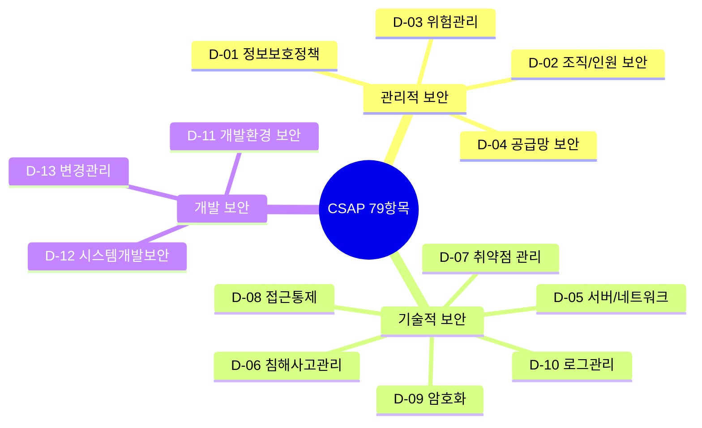

# CSAP 초보자 설명 — 왜 이렇게 해야 하는가?

> **버전**: 1.0.0 | **작성일**: 2026-04-11
> **대상**: CSAP를 처음 접하는 신규 개발자
> **소요 시간**: 약 60분
> **CSAP**: D-06, D-08, D-09, D-12 (모든 개발자 관련 항목)

---

## 목차

1. [공공기관이 왜 CSAP가 필요한가?](#1-공공기관이-왜-csap가-필요한가)
2. [79개 항목을 개발자 관점에서 이해하기](#2-79개-항목을-개발자-관점에서-이해하기)
3. [내가 코드를 쓸 때 영향받는 항목](#3-내가-코드를-쓸-때-영향받는-항목)
4. [CSAP 위반 사례 예시 — NG 패턴](#4-csap-위반-사례-예시--ng-패턴)
5. [CSAP 준수 코드 패턴 — OK 패턴](#5-csap-준수-코드-패턴--ok-패턴)

---

## 1. 공공기관이 왜 CSAP가 필요한가?

### 1.1 공공기관 클라우드의 특수성

공공기관 서비스는 다음과 같은 특수성이 있습니다.

```
일반 민간 서비스:
  → 회원 정보, 결제 정보 처리
  → 보안 사고 시 기업 피해 + 사용자 피해

공공기관 서비스:
  → 주민등록번호, 세금 정보, 의료 정보, 범죄 기록 처리
  → 보안 사고 시 국민 전체 피해 + 국가 기밀 유출 가능
  → 법적 책임 (개인정보보호법, 전자정부법 등)
```

### 1.2 CSAP의 역할

CSAP(Cloud Security Assurance Program, 클라우드 보안 인증)는 과학기술정보통신부가 "이 클라우드 서비스는 공공기관이 사용해도 안전하다"는 것을 검증하는 인증 제도입니다.

```
인증 없는 클라우드 서비스:
  → 공공기관에 납품 불가 (법적 금지)

CSAP 인증 획득:
  → 공공기관 조달 시장 진입 가능
  → "안전한 서비스"임을 공식 인정
  → 연간 갱신 심사로 지속 유지
```

**우리 서비스의 목표**: CSAP 중등급 + 상등급 동시 획득

### 1.3 79개 항목이란?

CSAP 중등급은 79개의 통제 항목을 검사합니다. 이 항목들은 13개 도메인(D-01~D-13)으로 분류됩니다.

```
전체 79개 항목 중 개발자 직접 관련: 약 31개 항목

관련 없는 항목 (물리적 보안, 조직 관리 등): 약 48개 항목
→ 이건 보안팀과 인프라팀이 담당
```

---

## 2. 79개 항목을 개발자 관점에서 이해하기

### 2.1 전체 도메인 구조



### 2.2 개발자 관련도 분류

| 도메인 | 개발자 관련도 | 설명 |
|--------|-----------|------|
| D-12 시스템 개발 보안 | 매우 높음 | 직접 작성하는 코드 품질 |
| D-08 접근 통제 | 높음 | API 인증/인가 구현 |
| D-09 암호화 | 높음 | 데이터 암호화 구현 |
| D-06 침해사고 관리 | 중간 | 감사 로그 작성 |
| D-04 공급망 보안 | 중간 | npm 패키지 관리 |
| D-11 개발 환경 보안 | 중간 | 컨테이너 이미지 서명 |
| D-13 변경 관리 | 낮음 | PR 프로세스 (자동화됨) |
| D-01~D-03, D-05, D-07, D-10 | 매우 낮음 | 보안팀/인프라팀 담당 |

---

## 3. 내가 코드를 쓸 때 영향받는 항목

### 3.1 D-12: 시스템 개발 보안 (10개 항목) — 가장 중요

**무엇을 요구하는가**: 개발 과정에서 보안 취약점이 없도록 체계적으로 관리

**개발자 책임 항목**:

```
D-12.1: 입력값 검증
  → 모든 사용자 입력을 Zod 스키마로 검증
  → SQL, XSS, 커맨드 인젝션 방지

D-12.2: 파라미터화 쿼리
  → SQL 직접 문자열 결합 절대 금지
  → ORM 또는 prepared statement 사용

D-12.3: 보안 코딩 가이드 준수
  → OWASP Top10 항목 준수
  → 정적 분석 도구(Semgrep) 통과

D-12.4: 코드 리뷰
  → PR 리뷰에서 보안 항목 확인
  → Q-Gate G3, G5 자동 검사

D-12.5: 취약점 스캔
  → 빌드 시 Trivy로 CVE 스캔
  → CRITICAL 취약점 0개 유지
```

### 3.2 D-08: 접근 통제 (12개 항목)

**무엇을 요구하는가**: 인가된 사용자만 인가된 리소스에 접근

**개발자 책임 항목**:

```
D-08.1: 최소 권한 원칙
  → 필요한 권한만 부여 (admin 권한 남용 금지)

D-08.2: API 인증 검사
  → 모든 엔드포인트에 verifyToken() 호출
  → 예외 없음 (헬스체크 등 명시적 예외만)

D-08.3: 역할 기반 접근 제어 (RBAC)
  → hasPermission() 검사
  → 역할별 허용 작업 명확히 정의

D-08.4: JWT 토큰 관리
  → 접근 토큰: 15분 만료
  → 갱신 토큰: 7일 만료
  → 로그아웃 시 블랙리스트 등록

D-08.5: 세션 관리
  → 동시 로그인 최대 3개 제한
  → 비활성 세션 자동 만료
```

### 3.3 D-09: 암호화 (4개 항목)

**무엇을 요구하는가**: 민감 데이터를 안전하게 암호화

**개발자 책임 항목**:

```
D-09.1: 저장 데이터 암호화
  → 민감 데이터: AES-256 암호화
  → 비밀번호: bcrypt (salt rounds 12 이상)
  → PII(개인정보): 반드시 암호화

D-09.2: 전송 데이터 암호화
  → 모든 통신: TLS 1.3+
  → HTTP 직접 통신 절대 금지

D-09.3: 시크릿 관리
  → 환경 변수 사용 (하드코딩 절대 금지)
  → Kubernetes Secret 또는 Sealed Secret 사용

D-09.4: 해시 알고리즘
  → MD5, SHA-1 사용 금지 (취약)
  → SHA-256 이상 사용
```

### 3.4 D-06: 침해사고 관리 (5개 항목)

**무엇을 요구하는가**: 보안 사고 발생 시 추적 가능하도록 로그 보존

**개발자 책임 항목**:

```
D-06.1: 감사 로그 전수 기록
  → 민감 작업(삭제, 권한 변경, 로그인 등)에 auditLog() 호출
  → 빠짐없이 기록

D-06.2: 로그 보존 1년+
  → 감사 로그는 1년 이상 보존
  → append-only (수정/삭제 불가)

D-06.3: 로그 내용 기준
  → 행위자(actor), 대상(target), 작업(action), 시각(timestamp), IP 필수
  → 민감 정보(비밀번호 등) 로그에 포함 금지
```

---

## 4. CSAP 위반 사례 예시 — NG 패턴

실제 CSAP 감사에서 발견되는 위반 유형입니다. 코드 예시와 함께 이해합니다.

### 4.1 NG-1: 인증 없는 API 엔드포인트 (D-08 위반)

```typescript
// ❌ NG: 인증 검사 없이 바로 데이터 반환
// 누구나 /api/users 를 호출하면 전체 사용자 목록이 나옴!
export async function GET(req: Request) {
  const users = await db.users.findMany();
  return Response.json({ users });
}
```

**감사 시 발견 방법**: 감사원이 브라우저에서 인증 없이 API 직접 호출 → 데이터 반환됨

**결과**: D-08 위반, 심각 결함, 즉각 수정 요구

### 4.2 NG-2: SQL 주입 취약점 (D-12 위반)

```typescript
// ❌ NG: 사용자 입력을 직접 SQL에 결합
async function findUser(email: string) {
  // email이 "'; DROP TABLE users; --" 이면?
  const result = await db.execute(
    `SELECT * FROM users WHERE email = '${email}'`
  );
  return result;
}
```

**공격 시나리오**:
```
입력값: test@test.com' OR '1'='1
결과:   SELECT * FROM users WHERE email = 'test@test.com' OR '1'='1'
        → 모든 사용자 데이터 노출!
```

**감사 시 발견 방법**: Semgrep SAST 자동 탐지, 감사원 수동 코드 검토

### 4.3 NG-3: 하드코딩된 시크릿 (D-09 위반)

```typescript
// ❌ NG: API 키가 코드에 직접 박혀있음
const AI_API_KEY = 'sk-proj-abc123def456ghi789';
const DB_PASSWORD = 'super-secret-password-2026';
const JWT_SECRET = 'my-jwt-secret-key';
```

**위험성**: Git 히스토리에 영구 남음. 공개 저장소라면 즉시 전 세계가 볼 수 있음.

**감사 시 발견 방법**: detect-secrets 자동 스캔, git log 검토

### 4.4 NG-4: 감사 로그 누락 (D-06 위반)

```typescript
// ❌ NG: 사용자 삭제를 감사 로그 없이 실행
async function deleteUser(userId: string) {
  await db.users.delete({ where: { id: userId } });
  return { success: true };
}
```

**위험성**: 보안 사고 후 "누가 언제 삭제했는가"를 추적 불가

**감사 시 발견 방법**: 코드 리뷰, 로그 파일 분석

### 4.5 NG-5: 에러 메시지에 민감 정보 노출 (D-09 위반)

```typescript
// ❌ NG: 에러에 시스템 내부 정보 포함
try {
  const user = await db.users.findFirst({ where: { id: userId } });
} catch (error) {
  return Response.json({
    error: error.message,        // "Connection to postgres://admin:password@db:5432 failed"
    stack: error.stack,          // 스택 트레이스 전체 노출
    query: error.query,          // 실행된 SQL 쿼리 노출
    dbPassword: process.env.DB_PASSWORD,  // 비밀번호까지 노출!
  }, { status: 500 });
}
```

---

## 5. CSAP 준수 코드 패턴 — OK 패턴

NG 패턴에 대응하는 올바른 구현 방법입니다.

### 5.1 OK-1: 모든 API에 RBAC 검사

```typescript
// ✅ OK: 인증 + 권한 검사 후 비즈니스 로직
// Design Ref: §D-08 접근 통제
export async function GET(req: Request) {
  // Step 1: 토큰 검증 (인증)
  const user = await verifyToken(req.headers.get('authorization'));
  if (!user) {
    return Response.json({ error: 'Unauthorized' }, { status: 401 });
  }

  // Step 2: 권한 검사 (인가)
  if (!hasPermission(user, 'users:list')) {
    return Response.json({ error: 'Forbidden' }, { status: 403 });
  }

  // Step 3: 비즈니스 로직 (권한 있는 사용자만)
  const users = await db.users.findMany({
    where: { tenantId: user.tenantId }  // 테넌트 격리
  });
  return Response.json({ users });
}
```

### 5.2 OK-2: 파라미터화 쿼리

```typescript
// ✅ OK: 파라미터화 쿼리 사용 (SQL 주입 원천 차단)
// Design Ref: §D-12 시스템 개발 보안
async function findUser(email: string) {
  // Prisma ORM 사용 시 (자동 파라미터화)
  const user = await db.users.findFirst({
    where: { email }  // Prisma가 자동으로 파라미터화
  });
  return user;
}

// Raw Query가 필요할 때
async function findUserByEmail(email: string) {
  // $1, $2 방식의 파라미터화 쿼리
  const result = await db.execute(
    'SELECT id, name FROM users WHERE email = $1 AND tenant_id = $2',
    [email, tenantId]  // 직접 결합 절대 금지
  );
  return result.rows[0];
}
```

### 5.3 OK-3: 환경 변수로 시크릿 관리

```typescript
// ✅ OK: 환경 변수에서 시크릿 로드
// Design Ref: §D-09 암호화
function getSecrets() {
  const secrets = {
    jwtSecret: process.env.JWT_SECRET,
    dbPassword: process.env.DB_PASSWORD,
    aiApiKey: process.env.AI_GATEWAY_KEY,
  };

  // 누락된 환경 변수 즉시 감지
  for (const [key, value] of Object.entries(secrets)) {
    if (!value) {
      throw new Error(`환경 변수 ${key}가 설정되지 않았습니다`);
    }
  }

  return secrets as Required<typeof secrets>;
}

// 시크릿 없으면 시작 자체를 거부
const secrets = getSecrets();
```

### 5.4 OK-4: 감사 로그 포함 민감 작업

```typescript
// ✅ OK: 감사 로그 + 비즈니스 로직
// Design Ref: §D-06 침해사고 관리
import { auditLog } from '@public-saas/audit-sdk';

async function deleteUser(
  adminUser: AuthenticatedUser,
  targetUserId: string,
  req: Request
): Promise<void> {
  // 1. 감사 로그 먼저 기록 (비즈니스 로직 실패해도 기록됨)
  await auditLog({
    actor: adminUser.id,
    action: 'USER_DELETE',
    target: targetUserId,
    targetType: 'user',
    tenantId: adminUser.tenantId,
    timestamp: new Date().toISOString(),
    ip: req.headers.get('x-forwarded-for') ?? 'unknown',
    userAgent: req.headers.get('user-agent') ?? 'unknown',
    metadata: {
      reason: '관리자 요청',
      adminRole: adminUser.role,
    },
  });

  // 2. 실제 삭제 실행
  await db.users.delete({ where: { id: targetUserId } });
}
```

### 5.5 OK-5: 안전한 에러 응답

```typescript
// ✅ OK: 내부 정보 숨기고 추적 ID만 제공
// Design Ref: §D-09 암호화 (민감 정보 노출 방지)
import { randomUUID } from 'crypto';
import { logger } from '@/lib/logger';

try {
  const result = await riskyOperation();
  return Response.json(result);
} catch (error) {
  // 1. 내부적으로는 상세 로그
  const errorId = randomUUID();
  logger.error({
    errorId,
    error: error.message,
    stack: error.stack,
    // 절대 DB 비밀번호, API 키 등 노출 금지
  }, 'Internal server error');

  // 2. 사용자에게는 최소 정보만
  return Response.json({
    error: 'Internal server error',
    errorId,  // 운영팀이 로그에서 추적 가능한 ID
    // error.message, error.stack 절대 포함 금지
  }, { status: 500 });
}
```

### 5.6 OK-6: Zod 입력 검증

```typescript
// ✅ OK: 모든 API 입력을 Zod로 엄격하게 검증
// Design Ref: §D-12 시스템 개발 보안
import { z } from 'zod';

// 요청 스키마 정의
const createUserSchema = z.object({
  email: z.string()
    .email('유효한 이메일을 입력하세요')
    .max(255, '이메일이 너무 깁니다'),
  name: z.string()
    .min(1, '이름은 필수입니다')
    .max(100, '이름이 너무 깁니다')
    .regex(/^[가-힣a-zA-Z\s]+$/, '이름에 허용되지 않는 문자가 있습니다'),
  role: z.enum(['admin', 'editor', 'viewer']),
  tenantId: z.string().uuid(),
});

export async function POST(req: Request) {
  const body = await req.json();

  // 검증 실패 시 자동으로 400 에러 반환
  const validated = createUserSchema.safeParse(body);
  if (!validated.success) {
    return Response.json({
      error: 'Validation failed',
      details: validated.error.errors,
    }, { status: 400 });
  }

  // validated.data 는 타입이 안전하게 보장됨
  const user = await createUser(validated.data);
  return Response.json({ user }, { status: 201 });
}
```

---

## CSAP 위반 vs 준수 요약표

| 상황 | NG 패턴 | OK 패턴 | 관련 CSAP |
|------|---------|---------|---------|
| API 인증 | 인증 없이 바로 응답 | verifyToken() + hasPermission() | D-08 |
| DB 쿼리 | 문자열 직접 결합 | 파라미터화 쿼리 / ORM | D-12 |
| 비밀번호 저장 | 평문 저장 | bcrypt hash (cost 12+) | D-09 |
| API 키 | 코드에 하드코딩 | 환경 변수 + Sealed Secret | D-09 |
| 에러 응답 | 스택 트레이스 노출 | errorId만 반환 | D-09 |
| 사용자 삭제 | 감사 로그 없음 | auditLog() 먼저 호출 | D-06 |
| 입력 처리 | 무검증 사용 | Zod 스키마 검증 | D-12 |

---

## 다음 단계

CSAP의 개념과 개발자 관련 항목을 이해했습니다. 다음은 실제 개발 중 사용할 수 있는 체크리스트를 학습합니다.

`02-dev-checklist.md`로 이동하십시오.

---

> **참조**: `.claude/rules/csap-compliance.md` — 코드 레벨 CSAP 규칙 (코딩 중 항상 열어두기)
> **참조**: `docs/guides/onboarding/07-security-compliance.md` — 전체 보안 가이드
