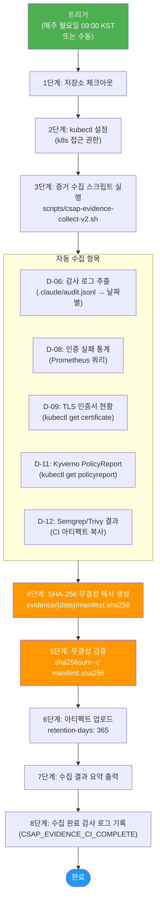
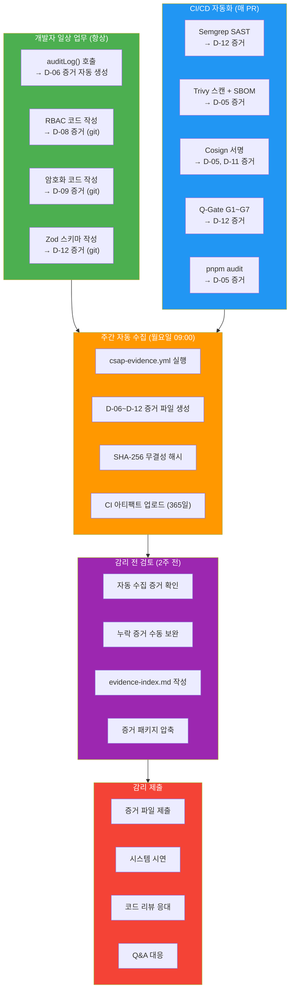

# CSAP 증거 수집 — 감리 산출물 완전 가이드

> **버전**: 1.0.0 | **작성일**: 2026-04-12
> **대상**: 모든 개발자, DevOps 엔지니어, 보안 담당자
> **전제 조건**: `01-what-is-csap.md`, `02-dev-checklist.md` 학습 완료
> **소요 시간**: 약 90분 (이후 일상 업무에서 참조)
> **CSAP**: D-01~D-13 전 영역
> **Design Ref**: MTU-N253

---

## 목차

1. [CSAP 증거 수집이란?](#1-csap-증거-수집이란)
2. [13개 도메인별 증거 목록](#2-13개-도메인별-증거-목록)
3. [자동 수집 파이프라인](#3-자동-수집-파이프라인)
4. [수동 증거 수집 방법](#4-수동-증거-수집-방법)
5. [증거 저장 위치 및 보관 기간](#5-증거-저장-위치-및-보관-기간)
6. [감리 전 준비 체크리스트](#6-감리-전-준비-체크리스트)
7. [감리관이 자주 지적하는 5가지 결함](#7-감리관이-자주-지적하는-5가지-결함)
8. [개발자 일상 업무에서 증거 자동 생성](#8-개발자-일상-업무에서-증거-자동-생성)
9. [증거 수집 전체 플로우](#9-증거-수집-전체-플로우)

---

## 1. CSAP 증거 수집이란?

### 1.1 왜 증거가 필요한가

CSAP(클라우드 보안 인증 프로그램) 감사는 "준수했다"는 선언만으로는 통과할 수 없습니다. **실제로 준수했다는 증거(Evidence)**를 제출해야 합니다.

```
감사원의 질문:
  "D-08 접근 통제를 준수하고 있습니까?"

잘못된 답변:
  "예, 모든 API에 인증을 적용했습니다."
  → 선언만 있고 증거 없음 → 감리 결함

올바른 답변:
  "예, 다음 증거를 제출합니다:
   1. auth-service JWT 검증 코드 (Semgrep 스캔 결과 포함)
   2. Loki 감사 로그 — 401/403 응답 기록 1,234건
   3. RBAC 정책 파일 (k8s/rbac/)
   4. Q-Gate G3 통과 CI 로그 (2026-04-01~11)"
  → 구체적 증거 제출 → 감리 통과
```

### 1.2 증거의 4가지 유형

| 유형 | 설명 | 예시 |
|------|------|------|
| **정책/절차 문서** | "이렇게 하도록 정해놓았다" | CSAP 정책 문서, 설계 문서 |
| **구현 증거** | "이렇게 구현했다" | 소스코드, 설정 파일 |
| **운영 증거** | "실제로 이렇게 운영되고 있다" | 감사 로그, 모니터링 메트릭 |
| **테스트 증거** | "검증했다" | CI 결과, 취약점 스캔 리포트 |

### 1.3 이 프로젝트의 자동화 수준

```
자동 수집 비율: 약 80%
  → CI/CD 파이프라인이 매 배포 시 자동 생성
  → 주간 자동 수집 (csap-evidence.yml)
  → 개발자가 auditLog() 호출 시 자동 기록

수동 수집 필요: 약 20%
  → 물리적 접근 통제 (서버실 출입 기록)
  → 인터뷰/회의록 (교육 이수 기록)
  → 계약서 (클라우드 서비스 계약)
```

---

## 2. 13개 도메인별 증거 목록

CSAP 중/상 등급은 D-01~D-13 총 13개 도메인, 79개 통제 항목으로 구성됩니다. 각 도메인에서 필요한 증거를 확인합니다.

### D-01: 정보보호 정책 및 조직

| 증거 번호 | 증거 내용 | 수집 방법 | 자동/수동 |
|---------|---------|---------|---------|
| D01-001 | 정보보호 정책서 (최신 버전) | `docs/security-policy/` | 수동 문서화 |
| D01-002 | 정보보호 조직도 | HR 시스템 + 문서화 | 수동 |
| D01-003 | 보안 역할 및 책임 정의서 | `docs/roles/` | 수동 문서화 |
| D01-004 | 정책 검토/승인 이력 (연 1회) | git 커밋 이력 | 자동 |

**개발자 관련 작업**: 해당 없음 (보안팀 담당)

---

### D-02: 위험 관리

| 증거 번호 | 증거 내용 | 수집 방법 | 자동/수동 |
|---------|---------|---------|---------|
| D02-001 | 연간 위험 평가 보고서 | 위협 모델링 결과 문서 | 수동 (DREAD 평가 참조) |
| D02-002 | 위험 처리 계획서 | `docs/risk-register.md` | 수동 |
| D02-003 | 잔여 위험 수용 승인서 | 경영진 승인 문서 | 수동 |

**개발자 관련 작업**: `threat-modeling/01-threat-model.md`의 DREAD 평가가 D02 증거로 활용됩니다.

---

### D-03: 인적 보안

| 증거 번호 | 증거 내용 | 수집 방법 | 자동/수동 |
|---------|---------|---------|---------|
| D03-001 | 보안 교육 이수 기록 (연 1회) | 교육 시스템 이수증 | 수동 |
| D03-002 | 신규 직원 보안 서약서 | HR 온보딩 문서 | 수동 |
| D03-003 | 퇴직자 계정 삭제 기록 | `audit.jsonl` ACTION=USER_OFFBOARDED | 자동 |

**개발자 관련 작업**: 퇴직자 계정 삭제 시 `auditLog()` 호출 → D-03 증거 자동 생성

---

### D-04: 물리적 보안

| 증거 번호 | 증거 내용 | 수집 방법 | 자동/수동 |
|---------|---------|---------|---------|
| D04-001 | 서버실 출입 기록 (카드 리더) | 물리 출입 통제 시스템 | 수동 수집 |
| D04-002 | CCTV 설치 현황 | 현장 점검 사진 | 수동 |
| D04-003 | 데이터센터 계약서 (위치, 보안 조건) | DC 계약 문서 | 수동 |

**개발자 관련 작업**: 해당 없음 (운영팀 담당)

---

### D-05: 공급망 보안

| 증거 번호 | 증거 내용 | 수집 방법 | 자동/수동 |
|---------|---------|---------|---------|
| D05-001 | SBOM (소프트웨어 자재 명세서) | Syft CycloneDX 자동 생성 | **자동** |
| D05-002 | Trivy 이미지 취약점 스캔 결과 | CI 파이프라인 아티팩트 | **자동** |
| D05-003 | Cosign 이미지 서명 검증 로그 | Kyverno PolicyReport | **자동** |
| D05-004 | 오픈소스 라이선스 목록 | `pnpm-lock.yaml` 분석 | **자동** |

```bash
# SBOM 수동 생성 (CI 외부에서 필요한 경우)
syft dir:. --output cyclonedx-json=sbom-$(date +%Y-%m-%d).json

# 취약점 검사
grype sbom:sbom-$(date +%Y-%m-%d).json --fail-on high
```

---

### D-06: 침해사고 관리 (감사 로그)

**개발자 기여도 최고** — auditLog() 호출이 곧 D-06 증거입니다.

| 증거 번호 | 증거 내용 | 수집 방법 | 자동/수동 |
|---------|---------|---------|---------|
| D06-001 | 감사 로그 파일 (`.claude/audit.jsonl`) | auditLog() 자동 기록 | **자동** |
| D06-002 | 감사 로그 보존 기간 설정 (1년+) | DB 파티션 정책 문서 | 수동 |
| D06-003 | 감사 로그 무결성 검증 기록 | SHA-256 해시 검증 | **자동** |
| D06-004 | 침해사고 대응 절차서 | `docs/incident-response.md` | 수동 문서화 |
| D06-005 | 보안 이벤트 모니터링 대시보드 | Grafana Security Dashboard | **자동** |

```bash
# 감사 로그 현황 확인
cat .claude/audit.jsonl | jq -r '.action' | sort | uniq -c | sort -rn | head -20

# 특정 기간 로그 카운트
jq -r 'select(.timestamp >= "2026-04-01")' .claude/audit.jsonl | wc -l

# 무결성 검증 (SHA-256)
sha256sum evidence/$(date +%Y-%m-%d)/d06-audit-log.jsonl
```

---

### D-07: 운영 보안

| 증거 번호 | 증거 내용 | 수집 방법 | 자동/수동 |
|---------|---------|---------|---------|
| D07-001 | 변경 관리 기록 (PR 이력) | Gitea PR 로그 | **자동** |
| D07-002 | 배포 변경 이력 | Flux GitOps 기록 | **자동** |
| D07-003 | 패치 관리 기록 (의존성 업데이트) | Renovate PR 이력 | **자동** |
| D07-004 | 백업 실행 기록 | Velero 스케줄 백업 로그 | **자동** |

---

### D-08: 접근 통제

**개발자 기여도 최고** — RBAC 코드가 D-08 증거입니다.

| 증거 번호 | 증거 내용 | 수집 방법 | 자동/수동 |
|---------|---------|---------|---------|
| D08-001 | RBAC 정책 파일 | `platform/k8s/rbac/` | **자동** (git) |
| D08-002 | JWT 검증 구현 코드 | Semgrep 스캔 결과 포함 | **자동** |
| D08-003 | 401/403 응답 통계 | Loki 쿼리 → 메트릭 | **자동** |
| D08-004 | 계정 잠금 정책 구현 | auth-service 코드 | **자동** (git) |
| D08-005 | MFA 활성화 현황 | DB 통계 쿼리 결과 | **자동** |
| D08-006 | 세션 타임아웃 설정 (15분) | 설정 파일 + 코드 | **자동** (git) |

```bash
# D-08 증거 자동 수집 (csap-evidence-collect-v2.sh 발췌)
# API 인증 실패 통계
curl -s "$PROMETHEUS_URL/api/v1/query" \
  --data-urlencode "query=sum(rate(http_requests_total{status='401'}[7d]))" \
  | jq . > evidence/$(date +%Y-%m-%d)/d08-auth-failures.json

# 활성 세션 수
kubectl exec -n saas-data deploy/redis -- \
  redis-cli DBSIZE > evidence/$(date +%Y-%m-%d)/d08-active-sessions.txt
```

---

### D-09: 암호화

**개발자 기여도 높음** — 암호화 코드가 D-09 증거입니다.

| 증거 번호 | 증거 내용 | 수집 방법 | 자동/수동 |
|---------|---------|---------|---------|
| D09-001 | AES-256 암호화 구현 코드 | `platform/packages/*/crypto.ts` | **자동** (git) |
| D09-002 | TLS 1.3 인증서 현황 | `kubectl get certificate -A` | **자동** |
| D09-003 | TLS 설정 파일 | Traefik TLS options | **자동** (git) |
| D09-004 | Sealed Secret 파일 목록 | `git ls-files **/*sealed*` | **자동** |
| D09-005 | 취약 암호화 알고리즘 미사용 | Semgrep 스캔 결과 | **자동** |

```bash
# TLS 인증서 만료일 확인
kubectl get certificate -A -o json | jq '.items[] | {name: .metadata.name, notAfter: .status.notAfter}'

# TLS 버전 확인 (실제 연결 검사)
openssl s_client -connect api.saas.local:443 -tls1_3 < /dev/null 2>&1 | grep "Protocol"
```

---

### D-10: 서비스 연속성

| 증거 번호 | 증거 내용 | 수집 방법 | 자동/수동 |
|---------|---------|---------|---------|
| D10-001 | 가용성 메트릭 (SLA 99.9%) | Prometheus uptime_ratio | **자동** |
| D10-002 | 장애 복구 훈련 기록 | Chaos Engineering 결과 | 수동 실행 후 자동 기록 |
| D10-003 | Circuit Breaker 동작 로그 | 감사 로그 CIRCUIT_OPEN 이벤트 | **자동** |
| D10-004 | Rate Limit 동작 통계 | Prometheus rate_limit_exceeded | **자동** |
| D10-005 | DDoS 대응 기록 | Traefik 차단 로그 | **자동** |

---

### D-11: 가상화 보안

| 증거 번호 | 증거 내용 | 수집 방법 | 자동/수동 |
|---------|---------|---------|---------|
| D11-001 | 컨테이너 이미지 서명 (Cosign) | CI 아티팩트 | **자동** |
| D11-002 | PSS Restricted 준수 현황 | `kubectl get policyreport -A` | **자동** |
| D11-003 | 루트 컨테이너 금지 정책 | Kyverno PolicyReport | **자동** |
| D11-004 | 네트워크 정책 파일 | `platform/k8s/network-policies/` | **자동** (git) |
| D11-005 | Falco 런타임 탐지 기록 | Falco 이벤트 로그 | **자동** |

```bash
# PSS 준수 현황 확인
kubectl get policyreport -A -o json | \
  jq '.items[] | {namespace: .metadata.namespace, pass: .summary.pass, fail: .summary.fail}'
```

---

### D-12: 시스템 개발 보안

**개발자 기여도 최고** — Zod 검증 코드, Semgrep 통과가 D-12 증거입니다.

| 증거 번호 | 증거 내용 | 수집 방법 | 자동/수동 |
|---------|---------|---------|---------|
| D12-001 | Semgrep SAST 스캔 결과 | CI 아티팩트 | **자동** |
| D12-002 | pnpm audit 결과 | CI 아티팩트 | **자동** |
| D12-003 | Q-Gate 통과 기록 (G1~G7) | Gitea Actions 로그 | **자동** |
| D12-004 | 테스트 커버리지 리포트 (80%+) | Jest 커버리지 리포트 | **자동** |
| D12-005 | 코드 리뷰 이력 (PR 승인) | Gitea PR 이력 | **자동** |
| D12-006 | Kyverno 정책 파일 | `infra/kyverno/policies/` | **자동** (git) |
| D12-007 | Gitleaks 시크릿 스캔 결과 | CI 아티팩트 | **자동** |

---

### D-13: 공급업체 관리

| 증거 번호 | 증거 내용 | 수집 방법 | 자동/수동 |
|---------|---------|---------|---------|
| D13-001 | 클라우드 서비스 계약서 (SLA 포함) | 계약 문서 | 수동 |
| D13-002 | AI API 공급업체 보안 평가 | 공급업체 보안 문서 | 수동 |
| D13-003 | 외부 연동 서비스 목록 | `docs/integration-register.md` | 수동 문서화 |

---

## 3. 자동 수집 파이프라인

### 3.1 csap-evidence.yml 워크플로우

`.gitea/workflows/csap-evidence.yml`은 주기적으로 CSAP 증거를 자동 수집합니다.

```
실행 일정:
  - 매주 월요일 09:00 KST (UTC 00:00)
  - 수동 트리거 (workflow_dispatch)

수집 내용:
  - D-01~D-13 전 도메인 증거 파일
  - SHA-256 무결성 해시
  - 증거 인덱스 (evidence-index.md)

저장 위치:
  - CI 아티팩트: evidence/{YYYY-MM-DD}/
  - 보관 기간: 365일
```

### 3.2 파이프라인 실행 단계



---

## 4. 수동 증거 수집 방법

자동 수집이 안 되는 증거나, 특정 날짜의 증거가 필요한 경우 수동으로 수집합니다.

### 4.1 전체 증거 수동 수집

```bash
# Gitea Actions → csap-evidence.yml → "Run workflow"
# 또는 CLI (gh 사용)
gh workflow run csap-evidence.yml \
  -f date="2026-04-12" \
  -f controls="all"

# 특정 도메인만 수집
gh workflow run csap-evidence.yml \
  -f date="2026-04-12" \
  -f controls="D-06,D-08,D-09"

# 로컬에서 직접 스크립트 실행
chmod +x scripts/csap-evidence-collect-v2.sh
./scripts/csap-evidence-collect-v2.sh --date 2026-04-12
```

### 4.2 도메인별 수동 수집 명령어

**D-06 감사 로그**:

```bash
# 특정 기간 감사 로그 추출
DATE_START="2026-04-01"
DATE_END="2026-04-12"
OUTPUT_DIR="evidence/$(date +%Y-%m-%d)"
mkdir -p "$OUTPUT_DIR/d06"

jq -r "select(.timestamp >= \"${DATE_START}\" and .timestamp <= \"${DATE_END}\")" \
  .claude/audit.jsonl > "$OUTPUT_DIR/d06/audit-log-${DATE_START}-${DATE_END}.jsonl"

# 통계 요약
jq -r '.action' "$OUTPUT_DIR/d06/audit-log-${DATE_START}-${DATE_END}.jsonl" \
  | sort | uniq -c | sort -rn \
  > "$OUTPUT_DIR/d06/action-summary.txt"

echo "감사 로그 수집 완료: $(wc -l < "$OUTPUT_DIR/d06/audit-log-${DATE_START}-${DATE_END}.jsonl") 건"
```

**D-08 접근 통제**:

```bash
OUTPUT_DIR="evidence/$(date +%Y-%m-%d)/d08"
mkdir -p "$OUTPUT_DIR"

# RBAC 설정 수집
kubectl get clusterrole,clusterrolebinding -o yaml \
  > "$OUTPUT_DIR/rbac-settings.yaml" 2>/dev/null || echo "kubectl 접근 필요"

# 활성 세션 수
kubectl exec -n saas-data deploy/redis -- redis-cli DBSIZE \
  > "$OUTPUT_DIR/active-sessions.txt" 2>/dev/null

# 인증 실패 통계 (Prometheus)
curl -s "${PROMETHEUS_URL}/api/v1/query" \
  --data-urlencode "query=sum(rate(http_requests_total{status=~'401|403'}[7d])) by (service)" \
  | jq . > "$OUTPUT_DIR/auth-failures-7d.json"
```

**D-09 암호화**:

```bash
OUTPUT_DIR="evidence/$(date +%Y-%m-%d)/d09"
mkdir -p "$OUTPUT_DIR"

# TLS 인증서 현황
kubectl get certificate -A -o json \
  | jq '.items[] | {name: .metadata.name, namespace: .metadata.namespace, notAfter: .status.notAfter, ready: .status.conditions[0].status}' \
  > "$OUTPUT_DIR/tls-certificates.json"

# Sealed Secrets 목록
git ls-files | grep "sealed" > "$OUTPUT_DIR/sealed-secrets-list.txt"
```

**D-11/D-12 Kyverno PolicyReport**:

```bash
OUTPUT_DIR="evidence/$(date +%Y-%m-%d)/d11"
mkdir -p "$OUTPUT_DIR"

# PolicyReport 전체 수집
kubectl get policyreport -A -o json \
  > "$OUTPUT_DIR/policyreports.json"

# 위반 항목만 추출
jq '.items[] | .results[] | select(.result == "fail")' \
  "$OUTPUT_DIR/policyreports.json" \
  > "$OUTPUT_DIR/policy-violations.json"

VIOLATION_COUNT=$(jq -r '.policy' "$OUTPUT_DIR/policy-violations.json" 2>/dev/null | wc -l)
echo "정책 위반 건수: $VIOLATION_COUNT"
```

---

## 5. 증거 저장 위치 및 보관 기간

### 5.1 증거 디렉토리 구조

```
evidence/
├── 2026-04-07/                    ← 날짜별 폴더
│   ├── evidence-index.md          ← 수집 결과 인덱스
│   ├── manifest.sha256            ← 무결성 해시
│   ├── d06/                       ← D-06 침해사고 관리
│   │   ├── audit-log.jsonl        ← 감사 로그
│   │   └── action-summary.txt     ← 액션 통계
│   ├── d08/                       ← D-08 접근 통제
│   │   ├── rbac-settings.yaml
│   │   ├── active-sessions.txt
│   │   └── auth-failures-7d.json
│   ├── d09/                       ← D-09 암호화
│   │   ├── tls-certificates.json
│   │   └── sealed-secrets-list.txt
│   ├── d11/                       ← D-11 가상화 보안
│   │   ├── policyreports.json
│   │   └── policy-violations.json
│   └── d12/                       ← D-12 개발 보안
│       ├── semgrep-report.json
│       └── trivy-report.json
└── 2026-04-14/                    ← 다음 주 월요일 자동 수집
    └── ...

.claude/
└── audit.jsonl                    ← 실시간 감사 로그 (append-only)
```

### 5.2 보관 기간 정책

| 저장 위치 | 보관 기간 | 이유 |
|---------|---------|------|
| CI 아티팩트 (`evidence/`) | **365일** | CSAP D-06: 최소 1년 |
| 감사 로그 (`.claude/audit.jsonl`) | **365일 이상** | CSAP D-06 요건 |
| PostgreSQL 감사 로그 테이블 | **3년** | 법적 보존 기간 |
| CI/CD 파이프라인 로그 | **90일** | Gitea 기본 설정 |

### 5.3 무결성 보장

모든 증거 파일에 SHA-256 해시를 적용하여 변조 여부를 확인할 수 있습니다.

```bash
# 무결성 검증
cd evidence/2026-04-07
sha256sum -c manifest.sha256

# 출력 예시:
# d06/audit-log.jsonl: OK
# d08/rbac-settings.yaml: OK
# d09/tls-certificates.json: OK
# d11/policyreports.json: OK
```

---

## 6. 감리 전 준비 체크리스트

감리 2주 전부터 순서대로 진행합니다.

### 6.1 D-14 이전 (감리 2주 전)

```
[ ] 이번 주 월요일 자동 수집 증거 확인
    → evidence/$(date +%Y-%m-%d)/ 폴더 존재 확인
    → manifest.sha256 무결성 검증 통과 확인

[ ] 누락된 증거 수동 보완
    → 자동 수집 실패 도메인 확인
    → 4. 수동 증거 수집 방법 참조하여 보완

[ ] 감사 로그 연속성 확인 (D-06)
    → 지난 3개월 감사 로그 공백 없는지 확인
    jq -r '.timestamp | split("T")[0]' .claude/audit.jsonl | sort -u | tail -90

[ ] TLS 인증서 만료일 확인 (D-09)
    → 감리 기간 중 만료 예정인 인증서 없는지 확인
    kubectl get certificate -A | grep -v "True"

[ ] 정책 위반 현황 확인 (D-11, D-12)
    → kubectl get policyreport -A 에서 fail 건수 0 목표
    → 위반 항목은 예외(exception) 처리 또는 즉시 수정
```

### 6.2 D-7 이전 (감리 1주 전)

```
[ ] 수동 증거 수집 완료
    → D-01, D-02, D-03, D-04, D-13 (수동 수집 항목)
    → 담당팀과 협조하여 수집

[ ] 증거 인덱스 문서 작성
    → evidence-index.md에 전체 증거 목록과 위치 정리
    → 감리관이 쉽게 찾을 수 있도록 구성

[ ] 최근 Q-Gate 전체 통과 기록 확인
    → Gitea Actions → 최근 main 브랜치 빌드 → 7단계 게이트 통과 확인
    → G1: 요구사항 FR ID, G2: 설계, G3: 코드, G4: 테스트, G5: OWASP, G6: CSAP, G7: 감사

[ ] 보안 스캔 결과 최신 버전 확인
    → Semgrep: 0 CRITICAL
    → Trivy: 0 CRITICAL CVE
    → Gitleaks: 0 시크릿 탐지

[ ] 시스템 가동 현황 스냅샷
    → kubectl get all -A > evidence/current-system-status.txt
    → Grafana 대시보드 스크린샷
```

### 6.3 감리 당일

```
[ ] 노트북에 kubeconfig 준비 (감리관 시연용)
[ ] Grafana 대시보드 로그인 정보 준비
[ ] evidence/ 폴더 압축 파일 준비 (즉시 제출 가능)
[ ] 주요 코드 위치 목록 준비 (감리관 코드 리뷰 시)
    → auth-service/src/middleware/auth.middleware.ts (D-08)
    → packages/*/src/crypto.ts (D-09)
    → packages/audit-sdk/src/index.ts (D-06)
    → infra/kyverno/policies/ (D-11, D-12)
```

---

## 7. 감리관이 자주 지적하는 5가지 결함

실제 CSAP 감리에서 자주 발견되는 결함과 대응 방법입니다.

### 결함 1: 감사 로그 공백 (D-06)

```
감리관 지적:
  "2026-03-15 ~ 03-17 기간의 감사 로그가 없습니다."

원인:
  → 서버 재시작으로 로그 버퍼 손실
  → 로그 파일 실수로 삭제
  → 모니터링 장애로 수집 중단

예방 방법:
  → append-only 구조 유지 (rm 불가)
  → 로그를 로컬 + DB 이중 기록
  → 주간 로그 연속성 모니터링 알림 설정
  → .claude/audit.jsonl을 git에서 추적 (git 이력 = 변경 불가 증거)
```

### 결함 2: 증거 파일 변조 가능성 (D-06, D-12)

```
감리관 지적:
  "이 로그 파일이 조작되지 않았다는 것을 어떻게 증명하나요?"

원인:
  → 무결성 해시 없는 증거 파일

대응 방법:
  → manifest.sha256으로 SHA-256 무결성 증명
  → 증거 생성 직후 해시 계산 (시간순 증명)
  → CI 아티팩트는 Gitea가 변경 불가 보장
```

### 결함 3: 접근 권한 과다 부여 (D-08)

```
감리관 지적:
  "개발자 계정에 DB 직접 접근 권한이 있습니다."

원인:
  → 편의를 위해 과도한 권한 부여
  → 최소 권한 원칙(Principle of Least Privilege) 미적용

대응 방법:
  → RBAC 정책 리뷰 (6개월마다)
  → 개발자: read-only kubectl 권한
  → 운영자: 별도 승인 프로세스로만 상승 권한 획득
  → 권한 변경 시 auditLog() 필수
```

### 결함 4: 암호화 미적용 데이터 발견 (D-09)

```
감리관 지적:
  "users 테이블의 phone_number 컬럼이 평문입니다."

원인:
  → 초기 개발 시 암호화 코드 누락
  → 새 컬럼 추가 시 암호화 코드 미적용

대응 방법:
  → Semgrep에 "평문 민감 데이터 저장" 규칙 추가
  → DB 스키마 리뷰에 "암호화 여부" 항목 포함
  → 신규 컬럼 추가 PR에 암호화 여부 필수 기재
```

### 결함 5: 테스트 커버리지 미달 (D-12)

```
감리관 지적:
  "보안 관련 코드의 테스트 커버리지가 45%입니다. 최소 80% 이상 필요합니다."

원인:
  → 보안 코드(auth, crypto, audit)에 단위 테스트 부족
  → 엣지 케이스(토큰 만료, 권한 없음) 테스트 미흡

대응 방법:
  → Q-Gate G4에서 커버리지 80% 미달 시 자동 차단
  → 보안 관련 코드 우선 테스트 작성
  → 음성 케이스 (실패 시나리오) 테스트 필수화
```

---

## 8. 개발자 일상 업무에서 증거 자동 생성

개발자가 올바른 코드를 작성하면, CSAP 증거가 자동으로 생성됩니다.

### 8.1 auditLog() → D-06 증거 자동 생성

```typescript
// platform/services/user-service/src/handlers/user.handler.ts
import { auditLog } from '../lib/audit.js';

// ✅ 올바른 auditLog() 호출 → D-06 증거 자동 기록
export async function deleteUser(
  req: AuthenticatedRequest,
  res: Response
): Promise<void> {
  const { userId } = req.params;

  // 삭제 전 감사 로그 기록 (삭제 후에는 기록 불가능할 수 있음)
  await auditLog({
    actor: req.user.id,           // 누가
    action: 'USER_DELETE',        // 무엇을
    target: userId,               // 대상
    tenantId: req.user.tenantId,  // 어느 테넌트
    ip: req.ip,                   // 어디서
    timestamp: new Date().toISOString(),
    result: 'SUCCESS',
    csapRef: 'D-06',              // CSAP 항목 명시
  });

  await userService.delete(userId, req.user.tenantId);
  res.status(204).send();
}
```

```
이 코드 한 줄이 생성하는 D-06 증거:
  {
    "timestamp": "2026-04-12T10:30:00Z",
    "actor": "admin-uuid-123",
    "action": "USER_DELETE",
    "target": "user-uuid-456",
    "tenantId": "tenant-uuid-789",
    "ip": "10.0.0.1",
    "result": "SUCCESS",
    "csapRef": "D-06"
  }
```

### 8.2 RBAC 코드 → D-08 증거 자동 생성

```typescript
// platform/services/api-gateway/src/routes/admin.routes.ts

// ✅ RBAC 코드 작성 = D-08 구현 증거
fastify.get('/admin/users', {
  preHandler: [
    fastify.authenticate,                    // JWT 검증 (D-08-01)
    fastify.rbac.require('user:admin'),      // 권한 확인 (D-08-02)
  ],
}, async (req, reply) => {
  // 테넌트 격리 (D-08-03)
  const users = await userService.list({ tenantId: req.user.tenantId });
  reply.send({ users });
});

/*
이 코드가 생성하는 D-08 증거:
  1. 소스코드 자체 (git 이력 = 변경 시점 증명)
  2. Semgrep 스캔 결과 (인증/권한 코드 패턴 탐지)
  3. 감사 로그 (접근 성공/실패 기록)
  4. CI Q-Gate G3 통과 기록
*/
```

### 8.3 암호화 코드 → D-09 증거 자동 생성

```typescript
// platform/services/user-service/src/handlers/update-profile.handler.ts
import { encrypt } from '@public-saas/crypto';

// ✅ 암호화 코드 작성 = D-09 구현 증거
export async function updateProfile(req: AuthenticatedRequest, res: Response) {
  const { phoneNumber } = validated.data;

  await prisma.user.update({
    where: { id: req.user.id },
    data: {
      // AES-256-GCM 암호화 후 저장 (D-09 준수)
      phoneEncrypted: encrypt(phoneNumber),
      updatedAt: new Date(),
    },
  });

  await auditLog({
    actor: req.user.id,
    action: 'PROFILE_PHONE_UPDATE',
    detail: '전화번호 업데이트 (암호화 저장)',
    csapRef: 'D-09',
  });
}

/*
이 코드가 생성하는 D-09 증거:
  1. 소스코드 자체 (AES-256 encrypt() 사용 증명)
  2. Semgrep 스캔: 평문 저장 패턴 없음 확인
  3. DB 스키마: phoneEncrypted 컬럼명 (암호화 저장 의도 명시)
*/
```

### 8.4 Zod 검증 코드 → D-12 증거 자동 생성

```typescript
// platform/services/user-service/src/schemas/user.schema.ts
import { z } from 'zod';

// ✅ Zod 스키마 작성 = D-12 구현 증거 (SQL 주입, XSS 방지)
export const updateProfileSchema = z.object({
  name: z
    .string()
    .min(1, '이름은 필수입니다')
    .max(100, '이름은 최대 100자입니다')
    .regex(/^[가-힣a-zA-Z\s\-\.]+$/, '이름에 허용되지 않는 문자'),

  phoneNumber: z
    .string()
    .regex(/^010-\d{4}-\d{4}$/, '전화번호 형식: 010-0000-0000')
    .optional(),
});

/*
이 코드가 생성하는 D-12 증거:
  1. 소스코드 자체 (Zod 사용 = 입력 검증 구현 증명)
  2. Semgrep: SQL 주입 패턴 없음
  3. Q-Gate G5 OWASP A03 (Injection) 통과 기록
*/
```

---

## 9. 증거 수집 전체 플로우



---

## CSAP 도메인별 자동화 수준 요약

| 도메인 | 자동화 수준 | 개발자 기여도 | 핵심 액션 |
|--------|----------|------------|---------|
| D-01 정책/조직 | 낮음 | 없음 | 보안팀 담당 |
| D-02 위험 관리 | 중간 | 낮음 | 위협 모델링 참여 |
| D-03 인적 보안 | 낮음 | 낮음 | 퇴직자 offboarding auditLog() |
| D-04 물리 보안 | 없음 | 없음 | 운영팀 담당 |
| D-05 공급망 | **높음** | 중간 | pnpm audit + Cosign 서명 |
| D-06 감사 로그 | **높음** | **최고** | auditLog() 정확히 호출 |
| D-07 운영 보안 | **높음** | 낮음 | PR/배포 자동 기록 |
| D-08 접근 통제 | **높음** | **최고** | RBAC 코드 작성 |
| D-09 암호화 | **높음** | **높음** | encrypt(), bcrypt 사용 |
| D-10 서비스 연속성 | **높음** | 낮음 | Circuit Breaker, Rate Limit |
| D-11 가상화 보안 | **높음** | 중간 | Kyverno 정책 준수 |
| D-12 개발 보안 | **높음** | **최고** | Zod, Semgrep 통과, 80% 커버리지 |
| D-13 공급업체 관리 | 낮음 | 없음 | 계약/문서 담당 |

---

## 다음 단계

CSAP 증거 수집 체계를 이해했습니다. 이제 위협 모델링을 통해 왜 이러한 증거들이 필요한지 깊이 이해합니다.

`../threat-modeling/01-threat-model.md`로 이동하십시오.

---

> **참조**: `.gitea/workflows/csap-evidence.yml` — 자동 수집 워크플로우 전문
> **참조**: `scripts/csap-evidence-collect-v2.sh` — 수집 스크립트
> **참조**: `.claude/audit.jsonl` — 실시간 감사 로그
> **CSAP 연관**: D-01~D-13 전 영역

---

## 변경 이력

| 버전 | 일자 | 내용 | 작성자 |
|------|------|------|------|
| 1.0.0 | 2026-04-12 | 최초 작성 — 13개 도메인 증거 목록, 자동/수동 수집, 감리 준비 | Implementer (Sonnet) |
