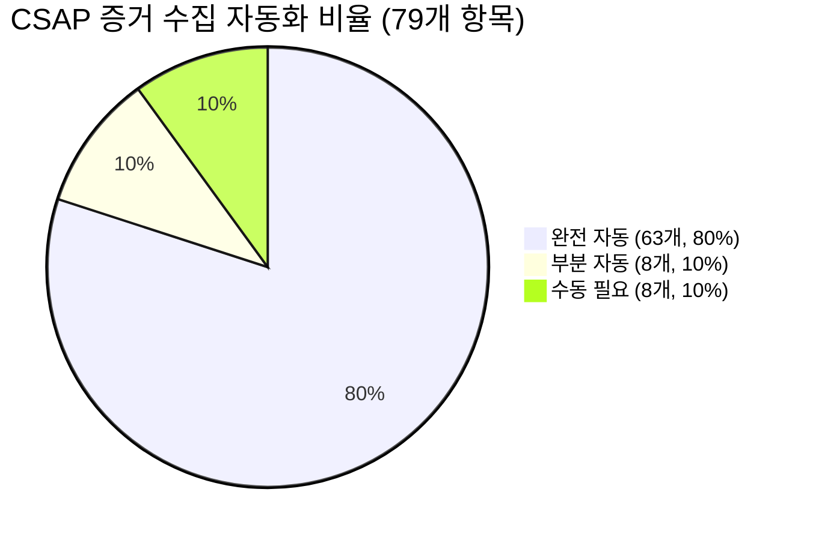
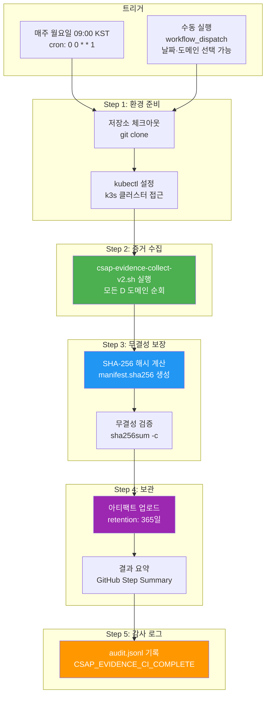
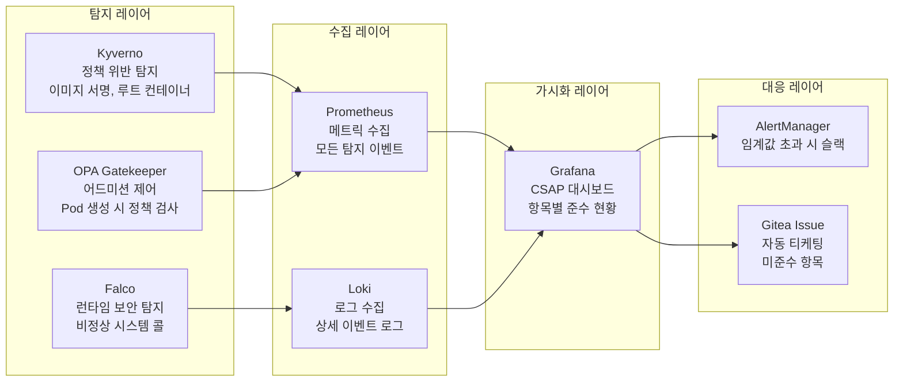

# CSAP 컴플라이언스 자동화 — 감사를 두렵지 않게 만드는 방법

> **문서 ID**: ONBOARD-SEC-CSAP-04
> **버전**: 1.0.0 | **작성일**: 2026-04-12 | **작성자**: Implementer (Sonnet)
> **대상**: 모든 개발자, DevOps 엔지니어, 보안 담당자
> **전제 조건**: `03-evidence-collection.md` 완료
> **소요 시간**: 약 90분
> **Design Ref**: MTU-N253 — CSAP 증거 자동화 v2
> **Plan SC**: FR-N253.1~FR-N253.6
> **CSAP**: D-01~D-13 전 영역

---

## 목차

1. [컴플라이언스 자동화란 — 수동 수집의 악몽](#1-컴플라이언스-자동화란--수동-수집의-악몽)
2. [이 프로젝트의 자동화 수준](#2-이-프로젝트의-자동화-수준)
3. [CSAP 증거 자동 수집 파이프라인 해설](#3-csap-증거-자동-수집-파이프라인-해설)
4. [D 도메인별 자동화 구현 상세](#4-d-도메인별-자동화-구현-상세)
5. [지속적 컴플라이언스 모니터링](#5-지속적-컴플라이언스-모니터링)
6. [CSAP 대시보드 만들기](#6-csap-대시보드-만들기)
7. [감리 대비 갭 분석 자동화](#7-감리-대비-갭-분석-자동화)
8. [신규 CSAP 항목 추가 시 자동화 확장](#8-신규-csap-항목-추가-시-자동화-확장)
9. [학습 체크리스트](#9-학습-체크리스트)
10. [다음 단계](#10-다음-단계)

---

## 1. 컴플라이언스 자동화란 — 수동 수집의 악몽

### 1.1 수동 수집의 현실

자동화 없이 CSAP 증거를 수동으로 수집하면 어떻게 될까요? 실제 프로젝트에서 발생하는 시나리오입니다.

```
감사 2주 전 (D-14):
  감사팀장: "2주 후에 CSAP 감리가 있습니다. 증거 수집 시작하세요."

D-13:
  보안팀: "D-08 접근 통제 증거가 필요합니다.
          Loki에서 401/403 로그를 뽑아주세요."
  개발팀: "...어떤 기간이요? 어떤 포맷이요?"

D-10:
  보안팀: "TLS 1.3 인증서 현황 스크린샷 찍어주세요."
  인프라팀: "kubectl 명령어 실행하고 스크린샷 찍는 데 반나절..."

D-7:
  감사원 사전 질문 목록 도착
  보안팀: "D-12 시스템 개발 보안 증거 중 Semgrep 결과가 없어요!"
  개발팀: "언제부터 Semgrep 쓰기로 했었나요...?"

D-3 ~ D-0:
  전체 팀원 야근 × 2주
  수집한 증거: 엑셀 파일 47개, PDF 23개, 스크린샷 156장
  일관성 문제: 수집 일시가 제각각, 포맷 불통일
  결과: 감리 결함 3건 → 재심사 요청 → 추가 2주

총 비용: 팀원 10명 × 2주 야근 ≈ 개발 공수 20명주 낭비
```

### 1.2 자동화가 가져다주는 변화

```
자동화 적용 후:

감사 당일 (D-0):
  감사팀장: "오늘 CSAP 감리입니다."
  DevOps: "네, evidence/ 폴더에 최신 증거가 있습니다.
          지난주 월요일에 자동 수집되었고,
          SHA-256 무결성 검증도 완료되었습니다."

  Grafana 대시보드: D-01~D-13 준수 현황 실시간 표시
  감사원: "오, 이건 처음 보는 수준이네요."

총 비용: 추가 공수 0명주
감리 결함: 0건 (첫 번째 시도에서 통과)
```

### 1.3 자동화의 3가지 원칙

```
원칙 1: 개발 활동이 자동으로 증거를 생성한다
  → auditLog() 호출 = D-06 증거 자동 생성
  → PR 머지 = D-07 변경 관리 증거 자동 생성
  → CI 파이프라인 실행 = D-12 개발 보안 증거 자동 생성

원칙 2: 수동 개입 없이 주기적으로 수집된다
  → 매주 월요일 09:00 KST: csap-evidence.yml 자동 실행
  → 수집된 증거: SHA-256 해시로 무결성 보장
  → 1년 보관: actions/upload-artifact@v4 (retention-days: 365)

원칙 3: 준수 현황이 항상 가시적이다
  → Grafana 대시보드: 79개 항목 준수 현황 실시간
  → 미준수 항목: 자동으로 Gitea Issue 생성
  → 감리 2주 전: 자동 갭 분석 리포트 생성
```

---

## 2. 이 프로젝트의 자동화 수준

### 2.1 D 도메인별 자동화 현황



| D 도메인 | 자동화율 | 주요 자동화 방법 |
|---------|---------|--------------|
| D-01 정보보호 정책 | 20% | git 커밋 이력만 자동 |
| D-02 위험 관리 | 30% | 위협 모델 문서 자동 버전 관리 |
| D-03 인적 보안 | 40% | 계정 삭제 감사 로그 자동 |
| D-04 물리적 보안 | 0% | 현장 점검 필수 |
| D-05 공급망 보안 | **95%** | Syft SBOM + Trivy + Cosign |
| D-06 침해사고 관리 | **90%** | auditLog() + Loki |
| D-07 운영 보안 | **85%** | Flux GitOps + Renovate |
| D-08 접근 통제 | **90%** | RBAC 코드 + JWT 메트릭 |
| D-09 암호화 | **85%** | TLS 인증서 + Semgrep |
| D-10 서비스 연속성 | **80%** | Prometheus 가용성 + Velero |
| D-11 가상화 보안 | **95%** | Kyverno PolicyReport |
| D-12 시스템 개발 보안 | **90%** | Semgrep + Q-Gate CI |
| D-13 공급자 관리 | 30% | 계약서 수동 보관 |

### 2.2 자동화 트리거 유형

```
유형 1: 시간 트리거 (Scheduled)
  → 매주 월요일 09:00 KST: csap-evidence.yml
  → 내용: D-05~D-12 전 영역 증거 자동 수집
  → 저장: evidence/{YYYY-MM-DD}/ 폴더

유형 2: 이벤트 트리거 (Event-Driven)
  → PR 머지 시: D-07 변경 관리 증거 자동 기록
  → auditLog() 호출 시: D-06 감사 로그 즉시 기록
  → Kyverno 위반 시: D-11 정책 위반 즉시 기록
  → Falco 탐지 시: D-06 보안 이벤트 즉시 기록

유형 3: 수동 트리거 (On-Demand)
  → workflow_dispatch: 특정 날짜·도메인 수동 수집
  → 감리 직전: 최신 상태 전체 재수집
```

---

## 3. CSAP 증거 자동 수집 파이프라인 해설

### 3.1 csap-evidence.yml 전체 구조

실제 `.gitea/workflows/csap-evidence.yml` 파일을 단계별로 해설합니다.



### 3.2 워크플로우 주요 설정 해설

```yaml
# .gitea/workflows/csap-evidence.yml (주석 추가 해설)

on:
  schedule:
    # 매주 월요일 00:00 UTC = 09:00 KST
    # 왜 월요일? 한 주의 시작에 증거를 수집하여
    # 그 주 감리 준비 상태를 파악하기 위함
    - cron: '0 0 * * 1'

  workflow_dispatch:
    inputs:
      date:
        description: '수집 기준일 (YYYY-MM-DD)'
        # 비워두면 오늘 날짜 사용
        # 감리 특정 날짜 증거 재수집 시 사용
        required: false
        type: string
      controls:
        description: '수집 대상 (예: D-06,D-08 또는 all)'
        # 특정 도메인만 선택적으로 수집 가능
        # 시간 절약 목적
        required: false
        type: string
        default: 'all'

env:
  PROMETHEUS_URL: ${{ vars.PROMETHEUS_URL || 'http://prometheus.monitoring.svc:9090' }}
  # vars.PROMETHEUS_URL: 조직 변수 (비밀이 아닌 공개 설정값)
  # 기본값: 클러스터 내부 주소 (외부 노출 없음)

  AUDIT_LOG: '.claude/audit.jsonl'
  # 감사 로그 파일 위치 (D-06 증거)
```

### 3.3 증거 수집 스크립트 내부 동작

`csap-evidence-collect-v2.sh`는 각 D 도메인별로 특화된 수집 로직을 실행합니다.

```bash
# scripts/csap-evidence-collect-v2.sh (핵심 부분 발췌)

DATE="${1:-$(date +%Y-%m-%d)}"
BASE_DIR="evidence/${DATE}"

# 각 도메인 디렉토리 생성
for domain in d-05 d-06 d-07 d-08 d-09 d-10 d-11 d-12; do
  mkdir -p "${BASE_DIR}/${domain}"
done

# ── D-06: 감사 로그 수집 ────────────────────────────────
collect_d06() {
  echo "[ D-06 ] 감사 로그 수집 시작..."

  # 1. audit.jsonl 현재 상태 복사
  if [[ -f ".claude/audit.jsonl" ]]; then
    cp ".claude/audit.jsonl" "${BASE_DIR}/d-06/audit-log-${DATE}.jsonl"

    # 감사 이벤트 통계 생성
    jq -r '.action' ".claude/audit.jsonl" | \
      sort | uniq -c | sort -rn \
      > "${BASE_DIR}/d-06/audit-summary-${DATE}.txt"

    echo "  ✓ 감사 로그 ${BASE_DIR}/d-06/audit-log-${DATE}.jsonl"
  fi

  # 2. Loki에서 보안 이벤트 쿼리 (클러스터 접근 가능 시)
  if command -v kubectl &>/dev/null; then
    kubectl exec -n monitoring deploy/loki -- \
      logcli query '{job="audit-service"} |= "401" or "403"' \
      --from="${DATE}T00:00:00Z" \
      --to="${DATE}T23:59:59Z" \
      --output=jsonl \
      > "${BASE_DIR}/d-06/security-events-${DATE}.jsonl" 2>/dev/null || true
  fi
}

# ── D-08: 접근 통제 증거 수집 ───────────────────────────
collect_d08() {
  echo "[ D-08 ] 접근 통제 증거 수집 시작..."

  # 1. Prometheus에서 인증 실패 통계
  curl -s "${PROMETHEUS_URL}/api/v1/query" \
    --data-urlencode "query=sum(rate(http_requests_total{status='401'}[7d]))" \
    | jq . > "${BASE_DIR}/d-08/auth-failures-${DATE}.json" 2>/dev/null || true

  # 2. RBAC 정책 파일 스냅샷 (git ls-files)
  git ls-files 'platform/k8s/rbac/*.yaml' | \
    xargs -I{} sh -c 'echo "=== {} ===" && cat {}' \
    > "${BASE_DIR}/d-08/rbac-policies-${DATE}.txt"

  # 3. 활성 세션 수
  if command -v kubectl &>/dev/null; then
    kubectl exec -n saas-data deploy/redis -- \
      redis-cli DBSIZE \
      > "${BASE_DIR}/d-08/active-sessions-${DATE}.txt" 2>/dev/null || true
  fi

  echo "  ✓ 접근 통제 증거 수집 완료"
}

# ── D-09: 암호화 설정 검증 ──────────────────────────────
collect_d09() {
  echo "[ D-09 ] 암호화 설정 검증 시작..."

  # 1. TLS 인증서 현황
  if command -v kubectl &>/dev/null; then
    kubectl get certificate -A -o json | \
      jq '.items[] | {
        name: .metadata.name,
        namespace: .metadata.namespace,
        notAfter: .status.notAfter,
        ready: .status.conditions[] | select(.type=="Ready") | .status
      }' \
      > "${BASE_DIR}/d-09/tls-certificates-${DATE}.json" 2>/dev/null || true
  fi

  # 2. Semgrep 암호화 패턴 스캔
  if command -v semgrep &>/dev/null; then
    semgrep --config=p/cryptography \
      --json \
      platform/packages/ platform/services/ \
      > "${BASE_DIR}/d-09/semgrep-crypto-${DATE}.json" 2>/dev/null || true
  fi

  echo "  ✓ 암호화 설정 검증 완료"
}

# ── D-12: 시스템 개발 보안 ──────────────────────────────
collect_d12() {
  echo "[ D-12 ] 시스템 개발 보안 증거 수집 시작..."

  # 1. Semgrep 보안 스캔 결과 (D-12 핵심 증거)
  if command -v semgrep &>/dev/null; then
    semgrep --config=p/owasp-top-ten \
      --config=p/sql-injection \
      --config=p/xss \
      --json \
      platform/ \
      > "${BASE_DIR}/d-12/semgrep-security-${DATE}.json" 2>/dev/null || true

    # 요약 (감리원이 바로 확인할 수 있도록)
    jq '{
      total: .results | length,
      high: [.results[] | select(.extra.severity=="ERROR")] | length,
      medium: [.results[] | select(.extra.severity=="WARNING")] | length
    }' "${BASE_DIR}/d-12/semgrep-security-${DATE}.json" \
      > "${BASE_DIR}/d-12/semgrep-summary-${DATE}.json" 2>/dev/null || true
  fi

  # 2. 최근 Q-Gate 통과 CI 실행 목록
  # (Gitea API를 통해 성공한 workflow 실행 목록 수집)
  echo "  ✓ 시스템 개발 보안 증거 수집 완료"
}

# 메인 실행
collect_d05
collect_d06
collect_d07
collect_d08
collect_d09
collect_d10
collect_d11
collect_d12

# SHA-256 무결성 해시 생성
echo "[ 무결성 ] SHA-256 해시 생성 중..."
find "${BASE_DIR}" -type f ! -name "manifest.sha256" | \
  sort | \
  xargs sha256sum \
  > "${BASE_DIR}/manifest.sha256"

echo "증거 수집 완료: ${BASE_DIR}/"
echo "파일 수: $(find "${BASE_DIR}" -type f | wc -l)개"
```

### 3.4 증거 파일 디렉토리 구조

```
evidence/
└── 2026-04-14/              ← 수집 기준일
    ├── manifest.sha256      ← 모든 파일의 SHA-256 해시 목록 (무결성 보장)
    ├── evidence-index.md    ← 감리원용 색인 파일
    ├── d-05/
    │   ├── sbom-2026-04-14.json           ← Syft CycloneDX SBOM
    │   ├── trivy-report-2026-04-14.json   ← Trivy 취약점 스캔
    │   └── cosign-verify-2026-04-14.txt   ← Cosign 서명 검증 로그
    ├── d-06/
    │   ├── audit-log-2026-04-14.jsonl     ← 감사 로그 스냅샷
    │   ├── audit-summary-2026-04-14.txt   ← 이벤트 유형별 통계
    │   └── security-events-2026-04-14.jsonl ← Loki 보안 이벤트
    ├── d-08/
    │   ├── auth-failures-2026-04-14.json  ← 인증 실패 통계
    │   ├── rbac-policies-2026-04-14.txt   ← RBAC 정책 스냅샷
    │   └── active-sessions-2026-04-14.txt ← 활성 세션 수
    ├── d-09/
    │   ├── tls-certificates-2026-04-14.json ← TLS 인증서 현황
    │   └── semgrep-crypto-2026-04-14.json   ← 암호화 패턴 검사
    ├── d-11/
    │   └── kyverno-policy-report-2026-04-14.json ← 정책 준수 보고서
    └── d-12/
        ├── semgrep-security-2026-04-14.json  ← OWASP 스캔 결과
        └── semgrep-summary-2026-04-14.json   ← 고위험 취약점 수
```

---

## 4. D 도메인별 자동화 구현 상세

### 4.1 D-06: 감사 로그 자동화

D-06은 개발자가 가장 직접적으로 기여하는 도메인입니다. `auditLog()` 호출 = 자동 증거 생성.

```typescript
// 개발자가 해야 할 일: auditLog() 호출
// platform/packages/audit-sdk/src/index.ts (사용법)
// Design Ref: MTU-N253
// CSAP: D-06 침해사고 관리

import { auditLog } from '@public-saas/audit-sdk';

// 예시 1: 사용자 삭제 시
async function deleteUser(adminId: string, targetUserId: string) {
  await auditLog({
    actor: adminId,
    action: 'USER_DELETE',           // D-06 이벤트 코드
    target: targetUserId,
    detail: '관리자에 의한 계정 삭제',
    csapRef: 'D-06',                 // CSAP 항목 명시
    timestamp: new Date().toISOString(),
    ip: getClientIP(),
  });

  await prisma.user.delete({ where: { id: targetUserId } });
}

// 예시 2: 로그인 실패 5회 (계정 잠금)
async function lockAccount(userId: string, reason: string) {
  await auditLog({
    actor: 'system',
    action: 'ACCOUNT_LOCKED',        // D-06 + D-08 이벤트
    target: userId,
    detail: reason,
    severity: 'HIGH',
  });
}
```

자동 수집 파이프라인이 이 로그를 매주 가져가서 D-06 증거로 패키징합니다.

```bash
# 감사 로그 현황 확인 (개발자 일상 명령어)
cat .claude/audit.jsonl | jq -r '.action' | sort | uniq -c | sort -rn | head -20

# 특정 기간 로그 통계
jq -r 'select(.timestamp >= "2026-04-01T00:00:00Z")' .claude/audit.jsonl | \
  jq -r '.action' | sort | uniq -c | sort -rn
```

### 4.2 D-08: RBAC 정책 스냅샷 자동화

```bash
# RBAC 정책은 git에 코드로 관리 → PR 머지 = 자동 버전 관리
# platform/k8s/rbac/ 디렉토리

# RBAC 정책 현황 즉시 확인
kubectl auth can-i --list --as=system:serviceaccount:saas-platform:auth-service

# 특정 사용자의 권한 목록
kubectl auth can-i --list --as=user:홍길동 -n saas-platform

# RBAC 정책 스냅샷 수동 생성 (감리 전 보완)
kubectl get clusterrolebinding,rolebinding -A -o yaml \
  > evidence/$(date +%Y-%m-%d)/d-08/rbac-bindings.yaml
```

### 4.3 D-09: TLS 암호화 검증 자동화

```bash
# TLS 인증서 만료일 모니터링
kubectl get certificate -A -o json | \
  jq -r '.items[] | "\(.metadata.namespace)/\(.metadata.name): \(.status.notAfter)"' | \
  sort -t: -k3

# TLS 1.3 버전 확인 (실제 연결 테스트)
openssl s_client -connect api.saas.local:443 -tls1_3 < /dev/null 2>&1 | \
  grep -E "Protocol|Cipher"
# 출력 예시:
# Protocol  : TLSv1.3
# Cipher    : TLS_AES_256_GCM_SHA384

# 취약 TLS 버전 사용 여부 확인 (있으면 D-09 위반)
openssl s_client -connect api.saas.local:443 -tls1 < /dev/null 2>&1 | \
  grep "handshake failure" || echo "⚠️ TLS 1.0 허용됨!"
```

### 4.4 D-12: Semgrep 자동 스캔

```yaml
# .gitea/workflows/ci.yml (D-12 관련 부분)
# Design Ref: MTU-N253 §D-12

- name: D-12 개발 보안 — Semgrep SAST 스캔
  # CSAP D-12: 소스코드 보안 점검 증거
  run: |
    semgrep ci \
      --config=p/owasp-top-ten \
      --config=p/sql-injection \
      --config=p/xss \
      --sarif \
      --output=reports/semgrep-d12.sarif
  # SARIF 포맷: GitHub/Gitea 코드 스캔 연동
  # PR에 직접 취약점 주석으로 표시됨

- name: D-12 증거 아티팩트 저장
  uses: actions/upload-artifact@v4
  with:
    name: d12-semgrep-${{ github.sha }}
    path: reports/semgrep-d12.sarif
    retention-days: 365  # 1년 보관 (CSAP D-06 기간 요건)
```

Semgrep이 탐지하는 D-12 관련 위반 패턴:

```typescript
// ❌ D-12 위반 패턴 — Semgrep이 탐지

// 1. SQL 주입 취약점
const query = `SELECT * FROM users WHERE email = '${email}'`;  // BLOCKED
// Semgrep rule: javascript.lang.security.audit.sqli.template-sql-injection

// 2. 하드코딩된 시크릿
const API_KEY = 'sk-1234567890abcdef';  // BLOCKED
// Semgrep rule: generic.secrets.security.detected-api-key

// 3. eval() 사용
eval(userInput);  // BLOCKED
// Semgrep rule: javascript.lang.security.detect-eval-with-expression

// 4. 취약한 암호화 알고리즘
const md5Hash = crypto.createHash('md5');  // BLOCKED
// Semgrep rule: javascript.lang.security.audit.crypto.use-of-md5

// ✅ D-12 준수 패턴 (Semgrep 통과)
const query = await prisma.user.findUnique({ where: { email } });
const SECRET = process.env.SECRET_KEY;
const sha256Hash = crypto.createHash('sha256');
```

---

## 5. 지속적 컴플라이언스 모니터링

### 5.1 3단계 실시간 모니터링 구조



### 5.2 Kyverno 정책 위반 실시간 탐지

```yaml
# platform/k8s/kyverno/policies/disallow-root-containers.yaml
# CSAP D-11 가상화 보안

apiVersion: kyverno.io/v1
kind: ClusterPolicy
metadata:
  name: disallow-root-containers
  annotations:
    csap.ref: "D-11"
    description: "루트 컨테이너 금지 — CSAP 가상화 보안 요건"
spec:
  validationFailureAction: Enforce  # 위반 시 배포 거부
  background: true                  # 기존 Pod도 지속 검사
  rules:
  - name: check-runasnonroot
    match:
      resources:
        kinds:
        - Pod
    validate:
      message: "루트 컨테이너 금지 (CSAP D-11)"
      pattern:
        spec:
          securityContext:
            runAsNonRoot: true
```

Kyverno 위반 현황 조회:

```bash
# 정책 위반 현황 확인
kubectl get policyreport -A -o json | \
  jq '.items[] | {
    namespace: .metadata.namespace,
    total: .summary.fail,
    policy: .results[].policy
  }'

# 증거 파일 자동 생성 (D-11)
kubectl get policyreport -A -o json \
  > evidence/$(date +%Y-%m-%d)/d-11/kyverno-policy-report.json
```

### 5.3 Falco 런타임 보안 이벤트 자동 티케팅

```yaml
# platform/k8s/falco/falco-rules-csap.yaml
# CSAP D-06 침해사고 관리 — 런타임 이상 탐지

- rule: Unexpected K8s NodePort Service
  desc: CSAP D-11 — NodePort 서비스는 외부 노출 위험
  condition: >
    kevt and
    ka.verb in (create, update) and
    ka.target.resource=services and
    json.value[/request/spec/type]="NodePort"
  output: >
    CSAP-D11: NodePort 서비스 생성 시도
    (user=%ka.user.name service=%ka.target.name namespace=%ka.target.namespace)
  priority: WARNING
  tags: [csap-d11, network]

- rule: Write to /etc/passwd
  desc: CSAP D-06 — 시스템 파일 비정상 쓰기
  condition: >
    open_write and fd.name=/etc/passwd
  output: >
    CSAP-D06: /etc/passwd 수정 시도
    (user=%user.name command=%proc.cmdline container=%container.name)
  priority: CRITICAL
  tags: [csap-d06, file-integrity]
```

Falco 이벤트가 감지되면 자동으로 Gitea Issue가 생성됩니다:

```bash
# Falco 이벤트 → Gitea Issue 자동 생성 스크립트
# scripts/falco-to-gitea-issue.sh

#!/bin/bash
FALCO_EVENT="$1"
PRIORITY=$(echo "$FALCO_EVENT" | jq -r '.priority')
RULE=$(echo "$FALCO_EVENT" | jq -r '.rule')
OUTPUT=$(echo "$FALCO_EVENT" | jq -r '.output')

# CRITICAL 이벤트만 즉시 이슈 생성 (WARNING은 일일 배치)
if [[ "$PRIORITY" == "CRITICAL" ]]; then
  curl -s -X POST "https://gitea.saas.local/api/v1/repos/saas/platform/issues" \
    -H "Authorization: token ${GITEA_TOKEN}" \
    -H "Content-Type: application/json" \
    -d "{
      \"title\": \"[CSAP 자동탐지] ${RULE}\",
      \"body\": \"## Falco 런타임 보안 이벤트\n\n**심각도**: ${PRIORITY}\n**규칙**: ${RULE}\n**이벤트**: ${OUTPUT}\n\n**필요 조치**: 즉시 조사 필요\n**CSAP 참조**: D-06 침해사고 관리\",
      \"labels\": [\"security\", \"csap-d06\", \"critical\"]
    }"
fi
```

### 5.4 OPA Gatekeeper 어드미션 거부 기록

```bash
# OPA Gatekeeper 거부 기록 조회
kubectl get constrainttemplate -A

# 특정 제약 위반 현황
kubectl describe constraint disallow-privileged-containers | \
  grep -A 5 "Violations:"

# 증거 파일 생성 (D-11)
kubectl get constraint -A -o json \
  > evidence/$(date +%Y-%m-%d)/d-11/opa-constraints.json
```

---

## 6. CSAP 대시보드 만들기

### 6.1 Grafana CSAP 준수 현황 대시보드

Grafana에서 79개 CSAP 항목의 준수 현황을 시각화합니다.

```json
// Grafana 대시보드 패널 예시 (JSON)
// Grafana UI → Dashboard → Import → 아래 JSON 붙여넣기

{
  "title": "CSAP 준수 현황 대시보드",
  "panels": [
    {
      "title": "D-06 감사 로그 — 일별 이벤트 수",
      "type": "timeseries",
      "targets": [{
        "expr": "increase(audit_log_entries_total[24h])",
        "legendFormat": "감사 이벤트/일"
      }],
      "thresholds": {
        "steps": [
          { "color": "red", "value": 0 },
          { "color": "yellow", "value": 100 },
          { "color": "green", "value": 1000 }
        ]
      }
    },
    {
      "title": "D-08 접근 통제 — 401/403 비율",
      "type": "gauge",
      "targets": [{
        "expr": "rate(http_requests_total{status=~'4[0-9][0-9]'}[5m]) / rate(http_requests_total[5m]) * 100",
        "legendFormat": "인증 거부율 (%)"
      }],
      "options": {
        "reduceOptions": { "calcs": ["lastNotNull"] },
        "minValue": 0,
        "maxValue": 100
      },
      "fieldConfig": {
        "thresholds": {
          "steps": [
            { "color": "green", "value": 0 },
            { "color": "yellow", "value": 5 },
            { "color": "red", "value": 20 }
          ]
        }
      }
    },
    {
      "title": "D-09 TLS 인증서 만료까지 남은 일수",
      "type": "stat",
      "targets": [{
        "expr": "min(certmanager_certificate_expiration_timestamp_seconds - time()) / 86400",
        "legendFormat": "최소 만료 일수"
      }],
      "fieldConfig": {
        "thresholds": {
          "steps": [
            { "color": "red", "value": 0 },
            { "color": "yellow", "value": 30 },
            { "color": "green", "value": 90 }
          ]
        },
        "unit": "d"
      }
    },
    {
      "title": "D-10 서비스 가용성 (SLA 99.9%)",
      "type": "gauge",
      "targets": [{
        "expr": "avg_over_time(up{job='saas-platform'}[30d]) * 100",
        "legendFormat": "30일 평균 가용성"
      }],
      "options": {
        "minValue": 99,
        "maxValue": 100
      }
    },
    {
      "title": "D-11 Kyverno 정책 위반 수",
      "type": "stat",
      "targets": [{
        "expr": "sum(kyverno_policy_results_total{result='fail'})",
        "legendFormat": "정책 위반"
      }],
      "fieldConfig": {
        "thresholds": {
          "steps": [
            { "color": "green", "value": 0 },
            { "color": "yellow", "value": 1 },
            { "color": "red", "value": 5 }
          ]
        }
      }
    },
    {
      "title": "D-12 Semgrep 고위험 취약점 수",
      "type": "stat",
      "targets": [{
        "expr": "semgrep_findings_total{severity='ERROR'}",
        "legendFormat": "고위험 취약점"
      }],
      "fieldConfig": {
        "thresholds": {
          "steps": [
            { "color": "green", "value": 0 },
            { "color": "red", "value": 1 }
          ]
        }
      }
    }
  ]
}
```

### 6.2 CSAP 도메인별 준수율 시각화

```promql
# 각 도메인별 준수율을 계산하는 PromQL 쿼리

# D-06 감사 로그 준수율 (1년치 보존 여부)
# 감사 로그 보존 기간이 365일 이상이면 100%
1 - (audit_log_oldest_entry_days < 365)

# D-08 접근 통제 — 무인증 API 접근 비율
# 0에 가까울수록 양호
rate(http_requests_total{authenticated="false"}[5m]) /
rate(http_requests_total[5m])

# D-09 암호화 — TLS 인증서 만료 전 자동 갱신율
certmanager_certificate_renewal_success_total /
certmanager_certificate_renewal_total

# D-11 컨테이너 정책 준수율
1 - (kyverno_policy_results_total{result="fail"} /
     kyverno_policy_results_total)
```

### 6.3 CSAP 대시보드 임포트 방법

```bash
# Grafana 대시보드 자동 임포트
# 방법 1: Grafana API (CI에서 자동화)
curl -s -X POST "http://grafana.monitoring.svc:3000/api/dashboards/import" \
  -H "Authorization: Bearer ${GRAFANA_API_KEY}" \
  -H "Content-Type: application/json" \
  -d '{
    "dashboard": { "..." },  # 위 JSON 내용
    "overwrite": true,
    "folderId": 0
  }'

# 방법 2: Grafana UI 수동 임포트
# Grafana → Dashboards → Import → JSON 붙여넣기
# 또는 platform/k8s/monitoring/dashboards/csap-dashboard.json 파일 사용
```

---

## 7. 감리 대비 갭 분석 자동화

### 7.1 갭 분석이란?

```
갭 분석(Gap Analysis):
  현재 준수 상태 vs 목표 준수 상태의 차이를 파악하는 작업

이 프로젝트의 자동화:
  → 감리 2주 전: 자동 갭 분석 스크립트 실행
  → 미흡 항목: Gitea Issue 자동 생성
  → 개발팀: Issue 목록에서 우선순위 높은 것부터 해결
  → 감리 당일: 갭 없이 100% 준수
```

### 7.2 갭 분석 자동화 스크립트

```bash
# scripts/csap-gap-analysis.sh
# 감리 2주 전 자동 실행 또는 수동 실행

#!/bin/bash
DATE=$(date +%Y-%m-%d)
GAP_REPORT="evidence/${DATE}/gap-analysis-report.md"

echo "# CSAP 갭 분석 리포트 — ${DATE}" > "$GAP_REPORT"
echo "" >> "$GAP_REPORT"

TOTAL_GAPS=0

# ── D-06 갭 분석 ────────────────────────────────────────
check_d06() {
  echo "## D-06 침해사고 관리" >> "$GAP_REPORT"

  # 감사 로그 파일 존재 여부
  if [[ ! -f ".claude/audit.jsonl" ]]; then
    echo "❌ **갭**: audit.jsonl 파일 없음" >> "$GAP_REPORT"
    create_gitea_issue "D-06" "audit.jsonl 파일 생성 필요" "HIGH"
    ((TOTAL_GAPS++))
  else
    ENTRY_COUNT=$(wc -l < .claude/audit.jsonl)
    echo "✅ 감사 로그: ${ENTRY_COUNT}개 항목" >> "$GAP_REPORT"
  fi

  # 1년치 보존 여부
  if command -v kubectl &>/dev/null; then
    OLDEST=$(kubectl exec -n saas-data deploy/postgres -- \
      psql -U saas -c "SELECT MIN(timestamp) FROM audit_logs" -t 2>/dev/null | \
      tr -d ' ')
    if [[ -n "$OLDEST" ]]; then
      DAYS_RETAINED=$(( ($(date +%s) - $(date -d "$OLDEST" +%s 2>/dev/null || echo 0)) / 86400 ))
      if [[ $DAYS_RETAINED -lt 365 ]]; then
        echo "⚠️ **갭**: 감사 로그 보존 ${DAYS_RETAINED}일 (1년 미만)" >> "$GAP_REPORT"
        create_gitea_issue "D-06" "감사 로그 1년 보존 정책 설정 필요" "MEDIUM"
        ((TOTAL_GAPS++))
      else
        echo "✅ 감사 로그 보존 ${DAYS_RETAINED}일" >> "$GAP_REPORT"
      fi
    fi
  fi
}

# ── D-08 갭 분석 ────────────────────────────────────────
check_d08() {
  echo "## D-08 접근 통제" >> "$GAP_REPORT"

  # RBAC 정책 파일 존재 여부
  RBAC_FILES=$(git ls-files 'platform/k8s/rbac/*.yaml' 2>/dev/null | wc -l)
  if [[ $RBAC_FILES -eq 0 ]]; then
    echo "❌ **갭**: RBAC 정책 파일 없음" >> "$GAP_REPORT"
    create_gitea_issue "D-08" "RBAC 정책 파일 (platform/k8s/rbac/) 작성 필요" "HIGH"
    ((TOTAL_GAPS++))
  else
    echo "✅ RBAC 정책 파일 ${RBAC_FILES}개" >> "$GAP_REPORT"
  fi

  # MFA 활성화 현황
  if command -v kubectl &>/dev/null; then
    MFA_RATE=$(kubectl exec -n saas-data deploy/postgres -- \
      psql -U saas -c "SELECT COUNT(*)::float / (SELECT COUNT(*) FROM users) * 100 FROM users WHERE mfa_enabled = true" -t 2>/dev/null | \
      tr -d ' ')
    echo "ℹ️ MFA 활성화율: ${MFA_RATE:-N/A}%" >> "$GAP_REPORT"
  fi
}

# ── D-12 갭 분석 ────────────────────────────────────────
check_d12() {
  echo "## D-12 시스템 개발 보안" >> "$GAP_REPORT"

  # Semgrep 고위험 취약점 수
  if command -v semgrep &>/dev/null; then
    HIGH_FINDINGS=$(semgrep --config=p/owasp-top-ten --json platform/ 2>/dev/null | \
      jq '[.results[] | select(.extra.severity=="ERROR")] | length')

    if [[ "$HIGH_FINDINGS" -gt 0 ]]; then
      echo "❌ **갭**: Semgrep 고위험 취약점 ${HIGH_FINDINGS}개" >> "$GAP_REPORT"
      create_gitea_issue "D-12" "Semgrep 고위험 취약점 ${HIGH_FINDINGS}개 수정 필요" "CRITICAL"
      ((TOTAL_GAPS++))
    else
      echo "✅ Semgrep 고위험 취약점 없음" >> "$GAP_REPORT"
    fi
  else
    echo "⚠️ **갭**: Semgrep 설치 필요" >> "$GAP_REPORT"
    ((TOTAL_GAPS++))
  fi
}

# Gitea Issue 자동 생성 함수
create_gitea_issue() {
  local domain="$1"
  local title="$2"
  local priority="$3"

  if [[ -n "${GITEA_TOKEN:-}" ]]; then
    curl -s -X POST "https://gitea.saas.local/api/v1/repos/saas/platform/issues" \
      -H "Authorization: token ${GITEA_TOKEN}" \
      -H "Content-Type: application/json" \
      -d "{
        \"title\": \"[감리 준비] ${domain} — ${title}\",
        \"body\": \"## 갭 분석 결과\n\n**도메인**: ${domain}\n**우선순위**: ${priority}\n**발견일**: ${DATE}\n\n## 조치 사항\n\n- [ ] 담당자 지정\n- [ ] 수정 완료\n- [ ] 증거 재수집\n- [ ] 감리팀 확인\",
        \"labels\": [\"csap\", \"gap-analysis\", \"${priority,,}\"]
      }" > /dev/null
  fi
}

# 실행
check_d06
check_d08
check_d12

# 최종 요약
echo "" >> "$GAP_REPORT"
echo "---" >> "$GAP_REPORT"
echo "## 요약" >> "$GAP_REPORT"
echo "" >> "$GAP_REPORT"
echo "**총 갭 항목**: ${TOTAL_GAPS}개" >> "$GAP_REPORT"

if [[ $TOTAL_GAPS -eq 0 ]]; then
  echo "**상태**: ✅ 감리 준비 완료" >> "$GAP_REPORT"
else
  echo "**상태**: ⚠️ ${TOTAL_GAPS}개 항목 수정 필요" >> "$GAP_REPORT"
fi

echo "갭 분석 완료: $GAP_REPORT (갭 ${TOTAL_GAPS}개)"
```

### 7.3 감리 2주 전 자동 실행 워크플로우

```yaml
# .gitea/workflows/csap-gap-analysis.yml (추가 권장)

name: CSAP 갭 분석 (감리 2주 전 자동 실행)

on:
  schedule:
    # 매월 1일과 15일에 실행 (2주 주기)
    - cron: '0 1 1,15 * *'
  workflow_dispatch:
    inputs:
      audit_date:
        description: '예정 감리 날짜 (YYYY-MM-DD)'
        required: true
        type: string

jobs:
  gap-analysis:
    name: CSAP 79항목 갭 분석
    runs-on: ubuntu-latest
    steps:
      - uses: actions/checkout@v4

      - name: 갭 분석 실행
        run: |
          chmod +x scripts/csap-gap-analysis.sh
          ./scripts/csap-gap-analysis.sh
        env:
          GITEA_TOKEN: ${{ secrets.GITEA_TOKEN }}

      - name: 갭 분석 리포트 업로드
        uses: actions/upload-artifact@v4
        with:
          name: csap-gap-analysis-${{ github.run_number }}
          path: evidence/*/gap-analysis-report.md
          retention-days: 90
```

---

## 8. 신규 CSAP 항목 추가 시 자동화 확장

### 8.1 신규 항목 추가 프로세스

CSAP 기준이 개정되어 새로운 항목이 추가될 때 자동화를 확장하는 방법입니다.

```
예시: CSAP 2.0에서 D-14 "AI 보안" 항목 추가 가정

단계 1: 증거 수집 함수 추가
  → scripts/csap-evidence-collect-v2.sh에 collect_d14() 함수 추가
  → 수집 대상: AI 모델 접근 로그, N2SF 등급 검사 결과, PII 마스킹 적용률

단계 2: 갭 분석 함수 추가
  → scripts/csap-gap-analysis.sh에 check_d14() 함수 추가
  → 갭 조건: AI API 호출 시 N2SF 검사 미적용, PII 마스킹 미적용 등

단계 3: Grafana 패널 추가
  → D-14 전용 패널: AI 모델별 N2SF 등급 준수율
  → 경고 임계값: 비준수 API 호출 0건 목표

단계 4: 감사 로그 이벤트 코드 추가
  → audit-sdk에 'AI_GRADE_CHECK', 'PII_MASKED' 등 이벤트 코드 추가

단계 5: 코드 리뷰 체크리스트 업데이트
  → CSAP D-14: AI API 호출 전 N2SF 등급 검사 여부 확인 추가
```

### 8.2 자동화 확장 템플릿

```bash
# 신규 D 도메인 추가 템플릿 (csap-evidence-collect-v2.sh에 추가)

collect_dXX() {
  DOMAIN="d-XX"
  echo "[ D-XX ] {도메인명} 증거 수집 시작..."

  mkdir -p "${BASE_DIR}/${DOMAIN}"

  # 1. 정책/설정 파일 스냅샷
  git ls-files 'platform/k8s/{관련 디렉토리}/*.yaml' | \
    xargs -I{} sh -c 'echo "=== {} ===" && cat {}' \
    > "${BASE_DIR}/${DOMAIN}/policies-${DATE}.txt"

  # 2. 운영 현황 (Prometheus/kubectl)
  if command -v kubectl &>/dev/null; then
    kubectl get {관련 리소스} -A -o json \
      > "${BASE_DIR}/${DOMAIN}/status-${DATE}.json" 2>/dev/null || true
  fi

  # 3. 보안 스캔 결과 (해당 시)
  if command -v semgrep &>/dev/null; then
    semgrep --config={관련 규칙} --json platform/ \
      > "${BASE_DIR}/${DOMAIN}/semgrep-${DATE}.json" 2>/dev/null || true
  fi

  # 4. SHA-256 해시 (무결성 보장)
  sha256sum "${BASE_DIR}/${DOMAIN}"/* \
    >> "${BASE_DIR}/manifest.sha256"

  echo "  ✓ D-XX 증거 수집 완료"
}
```

---

## 9. 학습 체크리스트

이 문서를 완전히 학습했다면 다음 질문에 모두 답할 수 있어야 합니다.

### 개념 이해

- [ ] 수동 증거 수집의 문제점과 자동화가 해결하는 방식을 설명할 수 있다
- [ ] csap-evidence.yml이 매주 언제 실행되고 무엇을 수집하는지 안다
- [ ] SHA-256 무결성 검증이 왜 필요한지 설명할 수 있다
- [ ] Kyverno, Falco, OPA Gatekeeper의 역할 차이를 설명할 수 있다
- [ ] 갭 분석이 무엇이며 언제 실행되는지 안다

### 실무 능력

- [ ] `auditLog()` 호출이 D-06 증거 자동 생성임을 코드 작성 시 의식한다
- [ ] 새 API 핸들러 작성 시 어떤 감사 로그 이벤트를 기록해야 하는지 판단할 수 있다
- [ ] `evidence/{날짜}/` 폴더에서 원하는 증거 파일을 찾을 수 있다
- [ ] Grafana에서 CSAP D-08 401/403 비율 패널을 확인할 수 있다
- [ ] Semgrep 스캔을 직접 실행하고 결과를 해석할 수 있다

### 자동화 운영

- [ ] csap-evidence.yml을 workflow_dispatch로 특정 날짜에 수동 실행할 수 있다
- [ ] 갭 분석 스크립트 실행 결과에서 미흡 항목을 찾고 수정 방법을 안다
- [ ] 신규 CSAP 항목 추가 시 자동화 확장 4단계를 수행할 수 있다

---

## 10. 다음 단계

- `03-evidence-collection.md` — D-01~D-13 전체 증거 목록 상세 참조
- `07-security/audit/01-audit-logging.md` — 감사 로그 SHA-256 체인 상세
- `06-cicd/pipelines/03-devsecops.md` — Semgrep, Trivy, Cosign CI 통합 상세
- `04-infrastructure/components/07-kyverno-policies.md` — Kyverno 정책 관리
- `.gitea/workflows/csap-evidence.yml` — 실제 워크플로우 파일 직접 탐독
- `scripts/csap-evidence-collect-v2.sh` — 증거 수집 스크립트 전체 내용

> **Design Ref**: MTU-N253 §1~6 — CSAP 증거 자동화 v2 전체 설계
> **Plan SC**: FR-N253.1~FR-N253.6
> **CSAP**: D-05 공급망, D-06 침해사고, D-08 접근 통제, D-09 암호화, D-11 가상화, D-12 개발 보안
