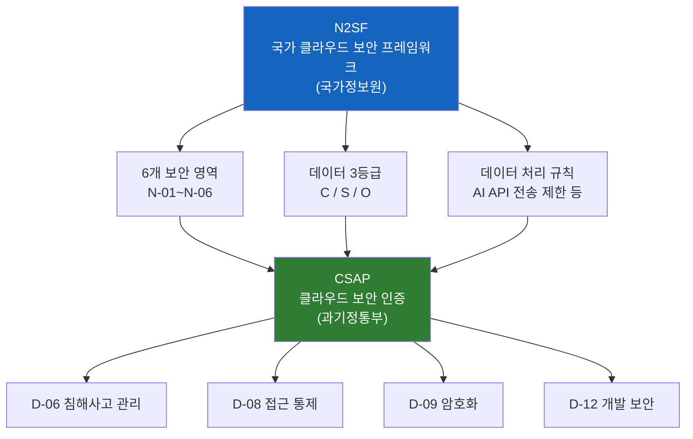
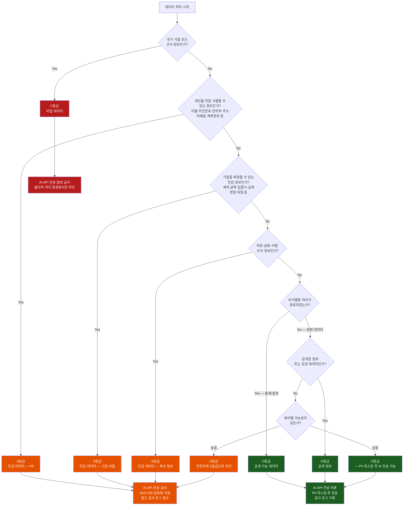
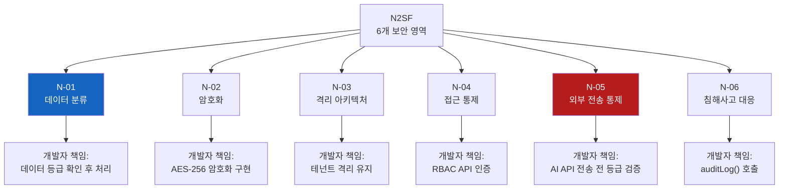
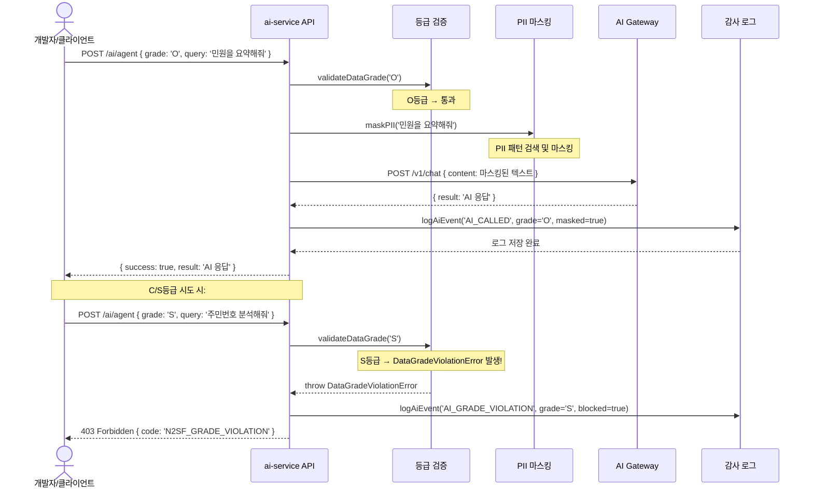

# N2SF 데이터 분류 — AI API에 어떤 데이터를 보낼 수 있는가?

> **버전**: 1.0.0 | **작성일**: 2026-04-12
> **대상**: AI 기능을 개발하거나 데이터를 처리하는 모든 개발자
> **전제 조건**: `csap/01-what-is-csap.md`, `coding/01-secure-patterns.md` 학습 완료
> **소요 시간**: 약 60분
> **Plan SC**: AI-REQ-1 (N2SF AI 연동 데이터 등급 검증)
> **CSAP**: D-09 (암호화), D-12 (시스템 개발 보안)
> **N2SF**: N-01 (데이터 분류), N-03 (격리), N-05 (외부 전송 통제)

---

## 목차

1. [N2SF란?](#1-n2sf란)
2. [N2SF와 CSAP의 관계](#2-n2sf와-csap의-관계)
3. [데이터 3등급 완전 이해](#3-데이터-3등급-완전-이해)
4. [실제 데이터 분류 예시](#4-실제-데이터-분류-예시)
5. [데이터 등급 판별 플로우차트](#5-데이터-등급-판별-플로우차트)
6. [코드에서 데이터 등급 확인하기](#6-코드에서-데이터-등급-확인하기)
7. [PII 마스킹 구현](#7-pii-마스킹-구현)
8. [N2SF 6개 보안 영역 (N-01~N-06)](#8-n2sf-6개-보안-영역-n-01n-06)
9. [ai-service의 등급 체크 구현](#9-ai-service의-등급-체크-구현)
10. [개발자 실수 사례와 예방법](#10-개발자-실수-사례와-예방법)

---

## 1. N2SF란?

### 1.1 국가 클라우드 보안 프레임워크

**N2SF**는 **국가 클라우드 보안 프레임워크(National Network Security Framework)**의 약자로, 대한민국 국가정보원이 정의한 공공기관 클라우드 데이터 보호 기준입니다.

```
N2SF가 답하는 질문:
  "공공기관 데이터를 클라우드에서 처리할 때
   어떤 데이터는 어디에 저장하고, 어떻게 처리하며,
   어디에 보내도 되는가?"
```

쉽게 말하면, N2SF는 공공기관이 다루는 데이터를 **민감도에 따라 3등급으로 분류**하고, 각 등급마다 다른 처리 규칙을 정의합니다.

### 1.2 왜 개발자가 N2SF를 알아야 하는가?

AI 기능을 개발할 때 가장 실수하기 쉬운 규정이 바로 N2SF입니다.

```
실수 시나리오:
  1. 개발자가 AI 요약 기능을 만듦
  2. "사용자의 민원 내용을 요약해줘"라며 AI API에 전송
  3. 민원 내용에 주민등록번호, 이름, 주소 포함 (S등급!)
  4. S등급 데이터가 외부 AI API로 전송됨
  5. N2SF N-05 위반 → CSAP 인증 취소 위험

이 규정을 모르면 선의의 기능 개발도 법적 위반이 됩니다.
```

---

## 2. N2SF와 CSAP의 관계

### 2.1 N2SF ⊃ CSAP: N2SF가 더 넓은 개념

```
N2SF (큰 원):
  → 국가정보원 주관
  → 데이터 분류 + 보안 영역 6개 정의
  → 모든 공공기관 클라우드 서비스 적용

  CSAP (N2SF 내부):
    → 과학기술정보통신부 주관
    → N2SF 기준을 충족하는 클라우드 서비스 인증
    → 79개 통제항목으로 세분화
```

간단히 말하면: **N2SF는 "무엇을 해야 하는가"를 정의하고, CSAP는 "그것을 얼마나 잘 하는가"를 인증합니다.**

### 2.2 개발자 관점에서 N2SF와 CSAP의 차이

| 구분 | N2SF | CSAP |
|------|------|------|
| 주체 | 국가정보원 | 과학기술정보통신부 |
| 대상 | 데이터 분류 + 처리 규칙 | 서비스 인증 |
| 개발자 직접 영향 | 데이터 등급 확인, AI API 전송 제한 | 코드 보안, 감사 로그 |
| 위반 시 결과 | 법적 제재 (전자정부법) | CSAP 인증 취소 |

### 2.3 N2SF와 CSAP의 관계 다이어그램



---

## 3. 데이터 3등급 완전 이해

### 3.1 3등급 개요

N2SF는 공공기관 데이터를 다음 3가지 등급으로 분류합니다.

```
C등급 (Confidential — 비밀/대외비):
  가장 엄격한 보호 필요
  → 국가 기밀, 군사 정보, 국가 안보 관련 데이터

S등급 (Sensitive — 민감):
  높은 보호 필요
  → 개인정보(주민번호, 연락처), 기업 영업 비밀, 의료 정보

O등급 (Open — 공개):
  일반적인 보호
  → 비식별화된 통계, 공개 서비스 정보
```

### 3.2 C등급 — 비밀 데이터

**정의**: 외부에 노출되면 국가 안보나 중대한 공익을 위협하는 데이터

```
C등급 데이터 예시:
  → 군사 작전 계획 및 병력 배치 정보
  → 국가 사이버 보안 취약점 정보
  → 대통령 경호 관련 정보
  → 핵심 국가 인프라 보안 계획
  → 비공개 외교 문서
  → 국가 기밀로 분류된 수사 정보
```

**처리 규칙**:
- AI API 전송: **절대 금지** (N2SF N-05)
- 저장: 물리적으로 격리된 환경 (N2SF N-03)
- 접근: 최상위 보안 인가를 받은 인원만 가능
- 전송: 암호화된 전용 네트워크만 허용

```typescript
// C등급 데이터가 AI API로 전송 시도되면:
throw new Error(
  `[N2SF 위반] C등급 데이터는 AI API 전송이 절대 금지입니다. (N2SF N-05)
   형사 처벌 대상이 될 수 있습니다.`
);
```

### 3.3 S등급 — 민감 데이터

**정의**: 외부에 노출되면 개인 또는 기업에 중대한 피해를 줄 수 있는 데이터

```
S등급 데이터 예시:

  개인정보 (PII):
    → 주민등록번호: 901101-1234567
    → 이름: 홍길동
    → 이메일: hong@gov.kr  (개인 식별 가능)
    → 전화번호: 010-1234-5678
    → 주소: 서울특별시 종로구 세종대로 1
    → 은행 계좌번호: 국민은행 123-456-78901
    → 신용카드 번호: 1234-5678-9012-3456

  의료 정보:
    → 진단명: 고혈압, 당뇨
    → 처방전 내용
    → 의료 기록

  기업 비밀:
    → 계약 금액 (특정 기업 식별 가능)
    → 입찰 가격 (공개 전)
    → 직원 급여 정보
    → 영업 전략 문서

  행정 민감 정보:
    → 수사 중인 사건 정보
    → 세금 신고 내용
    → 사회복지 수혜 내역
```

**처리 규칙**:
- AI API 전송: **금지** (N2SF N-05)
- 저장: AES-256 암호화 필수 (CSAP D-09)
- 접근: RBAC으로 권한 제한 (CSAP D-08)
- 로그: 모든 접근 감사 로그 필수 (CSAP D-06)

### 3.4 O등급 — 공개 데이터

**정의**: 공개되어도 무방하거나, 비식별화 처리되어 개인을 특정할 수 없는 데이터

```
O등급 데이터 예시:

  비식별화된 통계:
    → "서울시 30대 평균 소득: 450만원" (개인 특정 불가)
    → "2026년 1분기 민원 건수: 12,450건"
    → "서비스 사용자 만족도: 87%"

  공개 정보:
    → 공공기관 조직도
    → 서비스 이용 약관
    → 공개 법령 정보
    → 공공데이터 포털 공개 데이터

  비식별화된 서비스 데이터:
    → 민원 유형 분포 (민원인 이름 제거 후)
    → 처리 시간 통계
    → 오류 발생 빈도
```

**처리 규칙**:
- AI API 전송: **PII 마스킹 후 가능** (N2SF N-05)
- 저장: 일반 보안 적용
- 접근: 일반 인증 후 허용

**중요 주의사항**: O등급이라도 PII(개인식별정보)가 포함되어 있으면 S등급으로 처리해야 합니다.

---

## 4. 실제 데이터 분류 예시

### 4.1 판단이 애매한 사례들

개발하다 보면 어떤 등급인지 헷갈리는 경우가 많습니다. 다음 예시로 판단 기준을 익힙니다.

```
사례 1: 사용자가 제출한 민원 내용
  → "이름: 홍길동, 주소: 서울시 강남구..."
  → S등급 (개인정보 포함)
  → AI API에 그대로 전송 불가

사례 2: 민원 제목만 (담당자가 입력한 분류)
  → "주차장 불법 주정차 민원"
  → O등급 (개인 식별 정보 없음)
  → AI API 전송 가능

사례 3: 서비스 이용 통계
  → "2026년 3월 로그인 횟수: 45,230회"
  → O등급 (비식별화된 통계)
  → AI API 전송 가능

사례 4: 계약 문서
  → "주식회사 OO과 2억 5천만원 계약 체결"
  → S등급 (기업 식별 + 금액 포함)
  → AI API 전송 불가

사례 5: 공공기관 공식 발표 보도자료
  → "행정안전부가 발표한 스마트 행정 계획"
  → O등급 (공개 문서)
  → AI API 전송 가능
```

### 4.2 데이터 필드별 등급표

| 데이터 필드 | N2SF 등급 | 이유 | AI 전송 |
|-----------|---------|------|--------|
| 주민등록번호 | S | 개인 식별 PII | 금지 |
| 이름 (단독) | S | 개인 식별 PII | 금지 |
| 이메일 주소 | S | 개인 식별 PII | 금지 |
| 전화번호 | S | 개인 식별 PII | 금지 |
| 집 주소 | S | 개인 식별 PII | 금지 |
| 계좌번호 | S | 금융 정보 | 금지 |
| 의료 기록 | S | 의료 정보 | 금지 |
| 급여 정보 | S | 개인 금융 정보 | 금지 |
| 계약 금액 (특정 기업) | S | 기업 영업 비밀 | 금지 |
| 서비스명 (공개) | O | 공개 정보 | 가능 |
| 민원 처리 기간 (통계) | O | 비식별 통계 | 가능 |
| 공개 법령 텍스트 | O | 공개 정보 | 가능 |
| 오류 로그 (IP 제거 후) | O | 비식별 기술 정보 | 가능 |
| 테넌트 이름 (공개 기관) | O | 공개 정보 | 가능 |
| 군사 기밀 | C | 국가 기밀 | 절대 금지 |

---

## 5. 데이터 등급 판별 플로우차트

데이터를 처리하기 전에 다음 결정 트리를 따라 등급을 판별합니다.



### 5.1 판별이 불확실할 때

```
원칙: 불확실하면 더 엄격한 등급으로 처리

S등급과 O등급 사이에서 불확실:
  → S등급으로 처리 (AI API 전송 금지)
  → 보안팀에 문의 후 O등급 확정 시에만 변경

C등급과 S등급 사이에서 불확실:
  → C등급으로 처리
  → 국가정보원 지침 확인 필요
```

---

## 6. 코드에서 데이터 등급 확인하기

### 6.1 데이터 등급 타입 정의

```typescript
// @public-saas/types 패키지에 정의됨
// src/types/n2sf.ts

/**
 * N2SF 데이터 등급
 * Design Ref: N2SF N-01 데이터 분류 체계
 */
export enum DataGrade {
  C = 'C',  // 비밀 (Confidential) — AI API 전송 절대 금지
  S = 'S',  // 민감 (Sensitive) — AI API 전송 금지
  O = 'O',  // 공개 (Open) — PII 마스킹 후 AI API 전송 가능
}

/**
 * 데이터 등급 위반 에러
 */
export class DataGradeViolationError extends Error {
  public readonly code: string;
  public readonly grade: DataGrade;

  constructor(grade: DataGrade) {
    super(
      `[N2SF N-05 위반] ${grade}등급 데이터는 AI API 전송이 금지되어 있습니다. ` +
      `C등급: 국가 기밀, S등급: 개인정보/기업 비밀`
    );
    this.code = 'N2SF_GRADE_VIOLATION';
    this.grade = grade;
    this.name = 'DataGradeViolationError';
  }
}
```

### 6.2 등급 검사 함수

```typescript
// platform/services/ai-service/src/lib/grade-check.ts
// Design Ref: AI-REQ-1 — N2SF AI 연동 데이터 등급 검증

import { DataGrade, DataGradeViolationError } from '@public-saas/types';

/**
 * AI API 전송 전 데이터 등급 검증
 *
 * @param grade - 전송하려는 데이터의 N2SF 등급
 * @throws DataGradeViolationError - C 또는 S등급인 경우
 */
export function validateDataGrade(grade: DataGrade): void {
  if (grade === DataGrade.C || grade === DataGrade.S) {
    throw new DataGradeViolationError(grade);
  }
  // O등급만 통과
}

/**
 * 데이터 등급 검사 (감사 로그 포함 버전)
 *
 * @param data - 처리할 데이터
 * @param grade - N2SF 등급
 * @param context - 감사 로그용 컨텍스트
 */
export async function checkAndLogGrade(
  data: string,
  grade: DataGrade,
  context: {
    tenantId: string;
    userId: string;
    endpoint: string;
    ip: string;
  }
): Promise<string> {  // 마스킹된 데이터 반환
  // 1. C/S 등급 차단
  if (grade === DataGrade.C || grade === DataGrade.S) {
    // 위반 시도 감사 로그 (CSAP D-06)
    await logGradeViolation(grade, context);
    throw new DataGradeViolationError(grade);
  }

  // 2. O등급: PII 마스킹 후 반환
  const maskedData = maskPII(data);
  return maskedData;
}

async function logGradeViolation(
  grade: DataGrade,
  context: { tenantId: string; userId: string; endpoint: string; ip: string }
): Promise<void> {
  // 감사 로그에 기록 (법적 증거)
  const entry = {
    timestamp: new Date().toISOString(),
    actor: context.userId,
    action: 'N2SF_GRADE_VIOLATION_ATTEMPT',
    grade,
    endpoint: context.endpoint,
    tenantId: context.tenantId,
    ip: context.ip,
    severity: 'CRITICAL',
    n2sf_ref: 'N-05',
  };
  // audit.jsonl에 append (CSAP D-06)
  console.error('[N2SF VIOLATION]', JSON.stringify(entry));
}
```

### 6.3 등급 확인 미들웨어

```typescript
// API 요청에서 grade 파라미터를 자동으로 검증하는 미들웨어

import { z } from 'zod';

// O등급만 허용하는 스키마 (AI API 관련 엔드포인트)
export const aiRequestSchema = z.object({
  tenantId: z.string().uuid(),
  grade: z.enum(['O'], {
    errorMap: () => ({
      message: 'AI API는 O등급(공개) 데이터만 허용합니다. C/S등급은 AI API 전송 금지 (N2SF N-05)',
    }),
  }),
  query: z.string().min(1).max(4000),
});

// ❌ NG: 등급 확인 없이 AI API 호출
async function summarizeBad(req: Request) {
  const { content } = req.body;
  // content에 주민번호가 포함될 수 있음!
  const result = await aiGateway.chat(content);
  return result;
}

// ✅ OK: 등급 확인 + 마스킹 후 AI API 호출
async function summarizeGood(req: Request) {
  const validated = aiRequestSchema.parse(req.body);
  // validated.grade는 반드시 'O'이므로 이미 검증됨
  const maskedContent = maskPII(validated.query);
  const result = await aiGateway.chat(maskedContent);
  return result;
}
```

---

## 7. PII 마스킹 구현

### 7.1 PII(개인식별정보)란?

PII(Personally Identifiable Information)는 개인을 직접 또는 간접적으로 식별할 수 있는 모든 정보입니다.

```
직접 식별 정보 (단독으로 개인 식별 가능):
  → 주민등록번호
  → 이름 (고유한 경우)
  → 여권 번호
  → 운전면허 번호

간접 식별 정보 (조합 시 개인 식별 가능):
  → 전화번호
  → 이메일 주소
  → 집 주소
  → 생년월일 + 성별
  → IP 주소
```

### 7.2 실제 PII 마스킹 구현

```typescript
// platform/services/ai-service/src/lib/pii-masking.ts
// Design Ref: N2SF N-05 PII 마스킹 + AI-REQ-1

/**
 * PII 패턴 목록
 * O등급 데이터에서 PII를 제거하여 AI API 전송 가능하게 만듦
 */
const PII_PATTERNS: Array<{
  name: string;
  pattern: RegExp;
  replacement: string;
}> = [
  // 주민등록번호: 901101-1234567 → ██████-█████████
  {
    name: '주민등록번호',
    pattern: /\d{6}-[1-4]\d{6}/g,
    replacement: '██████-█████████',
  },
  // 여권번호: M12345678 → M████████
  {
    name: '여권번호',
    pattern: /[A-Z]{1,2}\d{7,8}/g,
    replacement: '[여권번호 마스킹]',
  },
  // 전화번호: 010-1234-5678 → 010-****-****
  {
    name: '전화번호',
    pattern: /01[016789]-\d{3,4}-\d{4}/g,
    replacement: '010-****-****',
  },
  // 이메일: hong@example.com → h***@example.com
  {
    name: '이메일',
    pattern: /([a-zA-Z0-9._%+-]{1})[a-zA-Z0-9._%+-]*@([a-zA-Z0-9.-]+\.[a-zA-Z]{2,})/g,
    replacement: '$1***@$2',
  },
  // 계좌번호: 123-456-789012 → ***-***-***012
  {
    name: '계좌번호',
    pattern: /\d{3}-\d{3,4}-\d{6,}/g,
    replacement: '***-***-****',
  },
  // 신용카드: 1234-5678-9012-3456 → ****-****-****-3456
  {
    name: '카드번호',
    pattern: /\d{4}-\d{4}-\d{4}-(\d{4})/g,
    replacement: '****-****-****-$1',
  },
  // 주소 패턴 (한국): "서울특별시 강남구 테헤란로"
  {
    name: '상세주소',
    pattern: /(서울|부산|대구|인천|광주|대전|울산|세종|경기|강원|충북|충남|전북|전남|경북|경남|제주)[특별|광역|특별자치]?[시|도].+?(로|길|동|읍|면)\s*\d+/g,
    replacement: '[주소 마스킹]',
  },
];

/**
 * 텍스트에서 PII를 마스킹하여 반환
 *
 * @param text - 마스킹할 텍스트
 * @returns 마스킹된 텍스트
 *
 * @example
 * maskPII("홍길동(010-1234-5678)이 신청했습니다")
 * → "[이름]([전화번호 마스킹])이 신청했습니다"
 */
export function maskPII(text: string): string {
  let masked = text;

  for (const { pattern, replacement } of PII_PATTERNS) {
    masked = masked.replace(pattern, replacement);
  }

  return masked;
}

/**
 * 마스킹 결과 검증 (개발 시 확인용)
 *
 * @param original - 원본 텍스트
 * @param masked - 마스킹된 텍스트
 * @returns 마스킹된 항목 목록
 */
export function verifyMasking(
  original: string,
  masked: string
): { field: string; found: boolean }[] {
  return PII_PATTERNS.map(({ name, pattern }) => ({
    field: name,
    found: pattern.test(original) && original !== masked,
  }));
}
```

### 7.3 마스킹 테스트

```typescript
// 올바른 마스킹 동작 확인
const testText = `
  신청인: 홍길동
  연락처: 010-1234-5678
  이메일: hong@company.com
  주민번호: 901101-1234567
  내용: 서울특별시 강남구 테헤란로 152 에서 불법 주차 민원 신청합니다.
`;

const masked = maskPII(testText);
console.log(masked);
/*
출력:
  신청인: 홍길동         ← 이름은 휴리스틱 방식 (짧은 이름은 오탐 가능)
  연락처: 010-****-****  ← 전화번호 마스킹
  이메일: h***@company.com  ← 이메일 마스킹
  주민번호: ██████-█████████  ← 주민번호 마스킹
  내용: [주소 마스킹] 에서 불법 주차 민원 신청합니다.
*/

// 이름은 별도 처리 필요 (일반 텍스트와 구분 어려움)
// 구조화된 데이터인 경우 필드 단위 마스킹 권장
```

### 7.4 구조화된 데이터 마스킹 (권장)

```typescript
// 비구조화 텍스트보다 구조화된 데이터에서 마스킹이 더 정확함

interface UserRequest {
  name: string;       // S등급 — 제거
  phone: string;      // S등급 — 마스킹
  email: string;      // S등급 — 마스킹
  content: string;    // 내용은 별도 판단
  category: string;   // O등급 — 유지
}

function maskUserRequest(req: UserRequest): Record<string, string> {
  return {
    // S등급 필드: 완전 제거 또는 마스킹
    name: '[이름 마스킹]',
    phone: req.phone.replace(/(\d{3})-\d{4}-(\d{4})/, '$1-****-$2'),
    email: req.email.replace(/(.{1}).+@/, '$1***@'),

    // O등급 필드: 유지하되 내용은 추가 마스킹
    content: maskPII(req.content),
    category: req.category,  // 카테고리는 공개 정보
  };
}
```

---

## 8. N2SF 6개 보안 영역 (N-01~N-06)

N2SF는 보안을 6개 영역으로 나누어 각각 요구사항을 정의합니다. 개발자에게 직접 관련된 영역을 중점적으로 설명합니다.

### 8.1 N2SF 보안 영역 개요



### 8.2 N-01: 데이터 분류 — 개발자 관점

**요구사항**: 모든 데이터를 처리 전에 등급을 확인하고 그에 맞게 처리

```typescript
// N-01 준수 패턴
interface DataWithGrade {
  content: string;
  grade: DataGrade;  // 반드시 등급 명시
  source: string;
}

// ❌ NG: 등급 없이 데이터 처리
async function processRequest(content: string) {
  return await aiGateway.send(content);  // 등급 모름!
}

// ✅ OK: 등급 확인 후 처리
async function processRequest(data: DataWithGrade) {
  validateDataGrade(data.grade);  // N2SF N-05 검증
  const masked = maskPII(data.content);
  return await aiGateway.send(masked);
}
```

### 8.3 N-02: 암호화 — 개발자 관점

**요구사항**: S/C등급 데이터는 저장 시 AES-256, 전송 시 TLS 1.3+으로 암호화

```typescript
// N-02 준수: S등급 데이터 저장 시 암호화
import { encrypt, decrypt } from '@/lib/crypto';

// ❌ NG: S등급 데이터 평문 저장
await db.users.create({
  data: { ssn: '901101-1234567' }  // 주민번호 평문!
});

// ✅ OK: AES-256 암호화 후 저장
await db.users.create({
  data: { ssnEncrypted: await encrypt('901101-1234567') }
});
```

### 8.4 N-03: 격리 아키텍처 — 개발자 관점

**요구사항**: 테넌트 간 데이터가 절대 섞이지 않도록 격리

```typescript
// N-03 준수: 모든 DB 쿼리에 tenantId 필터 필수
// ❌ NG: 테넌트 필터 없는 쿼리
const users = await db.users.findMany();  // 모든 테넌트 데이터 노출!

// ✅ OK: 테넌트 필터 강제 적용
import { getTenantFilter } from '@/lib/isolation';

const filter = getTenantFilter(req.user);  // 역할에 따라 필터 자동 적용
const users = await db.users.findMany({
  where: {
    ...filter,  // { tenantId: 'xxx' } 또는 {} (super_admin)
    // 추가 조건
  },
});
```

### 8.5 N-04: 접근 통제 — 개발자 관점

**요구사항**: C/S등급 데이터에 대한 모든 접근에 강력한 인증 + 인가

```typescript
// N-04 준수: 민감 데이터 접근 시 이중 검증
export async function getSensitiveData(
  req: AuthenticatedRequest,
  res: Response
) {
  // 1. 인증 검사 (N-04)
  if (!req.user) {
    return res.status(401).json({ error: 'Unauthorized' });
  }

  // 2. 권한 검사 (최소 권한 원칙)
  if (!hasPermission(req.user, 'sensitive-data:read')) {
    return res.status(403).json({ error: 'Forbidden' });
  }

  // 3. 테넌트 격리 (N-03)
  const data = await db.sensitiveData.findMany({
    where: { tenantId: req.user.tenantId },
  });

  return res.json({ data });
}
```

### 8.6 N-05: 외부 전송 통제 — 개발자 관점 (가장 중요)

**요구사항**: C/S등급 데이터를 외부(AI API 포함) 시스템으로 전송 금지

이 영역이 개발자가 가장 주의해야 할 규정입니다. AI 기능 개발 시 반드시 준수해야 합니다.

```typescript
// N-05 준수: AI API 호출 전 필수 검증 순서

// Step 1: 데이터 등급 확인
// Step 2: C/S 등급 차단
// Step 3: O 등급 PII 마스킹
// Step 4: AI Gateway 경유 (외부 직접 호출 금지)
// Step 5: 감사 로그 기록

export async function callAI(
  content: string,
  grade: DataGrade,
  context: { tenantId: string; userId: string; ip: string }
): Promise<string> {
  // Step 1~2: 등급 검증 (자동 예외 발생)
  validateDataGrade(grade);

  // Step 3: PII 마스킹
  const safeContent = maskPII(content);

  // Step 4: 내부 AI Gateway 경유 (외부 직접 접근 금지)
  const gatewayUrl = process.env.AI_GATEWAY_URL;
  if (!gatewayUrl) throw new Error('AI_GATEWAY_URL 환경 변수 누락');

  const response = await fetch(`${gatewayUrl}/v1/chat`, {
    method: 'POST',
    headers: {
      'Authorization': `Bearer ${process.env.AI_GATEWAY_KEY}`,
      'X-Tenant-ID': context.tenantId,
    },
    body: JSON.stringify({ content: safeContent }),
  });

  // Step 5: 감사 로그
  await auditLog({
    actor: context.userId,
    action: 'AI_API_CALLED',
    target: 'ai-gateway',
    grade: 'O',
    masked: true,
    tenantId: context.tenantId,
    ip: context.ip,
    n2sf_ref: 'N-05',
  });

  return (await response.json()).result;
}
```

### 8.7 N-06: 침해사고 대응 — 개발자 관점

**요구사항**: 보안 사고 발생 시 추적할 수 있도록 모든 민감 작업 로그 보존

```typescript
// N-06 준수: 등급 위반 시도도 감사 로그에 기록
try {
  validateDataGrade(requestedGrade);
} catch (error) {
  if (error instanceof DataGradeViolationError) {
    // 위반 시도를 감사 로그에 기록 (N-06 + CSAP D-06)
    await auditLog({
      actor: userId,
      action: 'N2SF_VIOLATION_ATTEMPT',
      severity: 'CRITICAL',
      grade: requestedGrade,
      n2sf_ref: 'N-05',
      timestamp: new Date().toISOString(),
      ip: clientIP,
    });
    // 403 Forbidden 반환
    throw error;
  }
}
```

---

## 9. ai-service의 등급 체크 구현

### 9.1 실제 ai-service 코드에서 N2SF 구현

이 프로젝트의 `platform/services/ai-service`에서 N2SF 등급 체크가 실제로 어떻게 구현되어 있는지 살펴봅니다.

```typescript
// platform/services/ai-service/src/handlers/ai-agent.handler.ts (실제 구현)

// Zod 스키마에서 O등급만 허용
const agentSchema = z.object({
  tenantId: z.string().uuid(),
  grade: z.enum(['O']),  // ← O등급만 허용 (C/S 입력 자체 차단)
  query: z.string().min(1).max(4000),
  // ...
});

export async function agentHandler(request, reply) {
  const body = agentSchema.parse(request.body);
  // grade가 'O'가 아니면 Zod 검증에서 400 에러 발생

  const actor = request.headers['x-user-id'] || 'system';

  // 추가 N2SF 검증 (이중 방어)
  try {
    validateDataGrade(body.grade as DataGrade);
  } catch (error) {
    if (error instanceof DataGradeViolationError) {
      // 위반 시도 감사 로그
      await logAiEvent(
        'AI_GRADE_VIOLATION', actor, 'agent', body.tenantId,
        request.ip, request.headers['user-agent'],
        { grade: body.grade, blocked: true, endpoint: 'agent' }
      );
      // 403 Forbidden
      await reply.status(403).send({
        success: false,
        error: { code: error.code, message: error.message }
      });
      return;
    }
    throw error;
  }

  // 여기까지 도달하면 O등급 데이터만 처리
  // PII 마스킹 후 AI 호출...
}
```

### 9.2 데이터 흐름 다이어그램



---

## 10. 개발자 실수 사례와 예방법

### 10.1 실수 1 — 로깅에 PII 포함

```typescript
// ❌ NG: 에러 로그에 PII 포함
try {
  await processUser(user);
} catch (error) {
  logger.error({
    error: error.message,
    userId: user.id,
    userEmail: user.email,        // S등급! 로그에 절대 금지
    userSSN: user.ssn,           // S등급! 로그에 절대 금지
    requestBody: req.body,       // 모든 필드가 포함됨!
  }, '처리 실패');
}

// ✅ OK: 식별자만 로그에 기록
try {
  await processUser(user);
} catch (error) {
  const errorId = randomUUID();
  logger.error({
    errorId,
    error: error.message,
    userId: user.id,             // ID는 허용 (식별자)
    tenantId: user.tenantId,
    // email, ssn 등 PII 절대 포함 금지
  }, '처리 실패');
}
```

### 10.2 실수 2 — 에러 메시지에 민감 데이터 포함

```typescript
// ❌ NG: 에러 응답에 원본 데이터 포함
if (!user) {
  throw new Error(`사용자 ${email}를 찾을 수 없습니다`);
  // email이 응답에 포함됨!
}

// ✅ OK: 식별자만 사용
if (!user) {
  throw new Error(`사용자를 찾을 수 없습니다 (userId: ${userId})`);
  // userId(UUID)는 PII 아님
}
```

### 10.3 실수 3 — 프론트엔드에 등급 없이 API 요청

```typescript
// ❌ NG: 프론트엔드에서 등급 지정 없이 요청
const response = await fetch('/api/ai/summarize', {
  method: 'POST',
  body: JSON.stringify({ content: userInput }),
  // grade 없음 → 서버에서 기본값으로 처리?
});

// ✅ OK: 항상 등급 명시
const response = await fetch('/api/ai/summarize', {
  method: 'POST',
  body: JSON.stringify({
    content: userInput,
    grade: 'O',  // 반드시 명시 + 서버에서 검증
  }),
});
```

### 10.4 실수 4 — 외부 AI API 직접 호출

```typescript
// ❌ NG: 외부 AI API 직접 호출 (N2SF N-05 위반)
const response = await fetch('https://api.openai.com/v1/chat/completions', {
  headers: { 'Authorization': `Bearer ${process.env.OPENAI_KEY}` },
  body: JSON.stringify({ messages: [{ role: 'user', content: userInput }] }),
});
// → 내부 AI Gateway를 우회하여 등급 검사, 마스킹 없이 전송됨!

// ✅ OK: 반드시 내부 AI Gateway 경유
const response = await fetch(`${process.env.AI_GATEWAY_URL}/v1/chat`, {
  headers: {
    'Authorization': `Bearer ${process.env.AI_GATEWAY_KEY}`,
    'X-Tenant-ID': tenantId,
  },
  body: JSON.stringify({ content: maskedContent }),
});
// → AI Gateway 내부에서 등급 검사, 감사 로그, 제한 적용
```

---

## N2SF 준수 요약표

| 규칙 | C등급 | S등급 | O등급 | 관련 N2SF |
|------|-------|-------|-------|---------|
| AI API 전송 | 절대 금지 | 금지 | PII 마스킹 후 허용 | N-05 |
| 저장 암호화 | 물리적 격리 | AES-256 필수 | 일반 암호화 | N-02 |
| 접근 인증 | 최고 등급 인가 | RBAC + MFA | RBAC | N-04 |
| 감사 로그 | 전수 기록 | 전수 기록 | 주요 작업만 | N-06 |
| 외부 전송 | 절대 금지 | 금지 | 승인된 경로만 | N-05 |
| 테넌트 격리 | 물리적 격리 | 논리적 격리 | 논리적 격리 | N-03 |

---

## 다음 단계

N2SF 데이터 분류를 이해했습니다. 이제 테넌트 격리(N-03)가 코드에서 어떻게 구현되는지 깊이 학습합니다.

`../../02-architecture/02-multitenancy.md`로 이동하십시오.

---

> **참조**: `.claude/rules/csap-compliance.md` — N2SF 코드 규칙 전문
> **참조**: `platform/services/ai-service/src/lib/grade-check.ts` — 실제 등급 검사 구현체
> **참조**: `platform/services/ai-service/src/lib/pii-masking.ts` — PII 마스킹 구현체
> **N2SF 연관**: N-01 (데이터 분류), N-02 (암호화), N-03 (격리), N-04 (접근 통제), N-05 (외부 전송), N-06 (침해사고)
> **CSAP 연관**: D-09 (암호화), D-12 (시스템 개발 보안)
