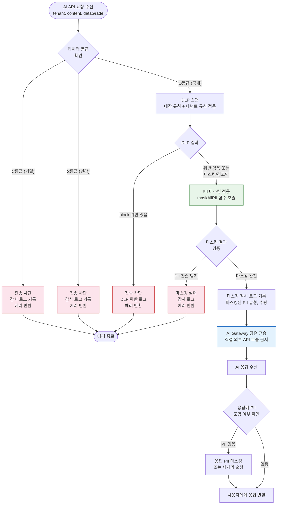

# PII 마스킹 실전 가이드 — N2SF N-05 완전 준수

> **문서 ID**: ONBOARD-07-SEC-N2SF-02
> **버전**: 1.0.0 | **작성일**: 2026-04-12 | **대상**: 백엔드 개발자, AI 기능 개발자, 보안 담당자
> **선행 학습**: `07-security/n2sf/01-data-classification.md` (N2SF 데이터 분류 — 필수), `03-development/08-ai-development-guide.md` (AI 개발 가이드)
> **소요 시간**: 약 3~4시간 (실습 포함)
> **CSAP**: D-06 (침해사고 관리 — 로그 PII 처리), D-09 (암호화 — 마스킹 방법론), D-12 (시스템 개발 보안 — 입력 처리)
> **N2SF**: N-01 (데이터 분류), N-05 (외부 전송 통제 — PII 마스킹 필수)
> **Plan SC**: FR-P10.3 (PII 마스킹), AI-REQ-1 (N2SF AI 연동 데이터 등급 검증)

---

## 목차

1. [PII(개인식별정보)란 무엇인가](#1-pii개인식별정보란-무엇인가)
   - 1.1 [한국 개인정보보호법 기준 PII 목록](#11-한국-개인정보보호법-기준-pii-목록)
   - 1.2 [N2SF에서 PII를 특별 취급하는 이유](#12-n2sf에서-pii를-특별-취급하는-이유)
   - 1.3 [우리 시스템에서 PII가 있는 필드 목록](#13-우리-시스템에서-pii가-있는-필드-목록)
   - 1.4 [PII 데이터 흐름도](#14-pii-데이터-흐름도)
2. [PII 마스킹 방법론](#2-pii-마스킹-방법론)
   - 2.1 [완전 마스킹 vs 부분 마스킹 vs 가명처리](#21-완전-마스킹-vs-부분-마스킹-vs-가명처리)
   - 2.2 [데이터 등급별 마스킹 기준](#22-데이터-등급별-마스킹-기준)
   - 2.3 [가역 마스킹 vs 비가역 마스킹](#23-가역-마스킹-vs-비가역-마스킹)
   - 2.4 [마스킹 일관성 원칙](#24-마스킹-일관성-원칙)
3. [실제 코드 구현 (ai-service 기반)](#3-실제-코드-구현-ai-service-기반)
   - 3.1 [현재 구현된 PII 마스킹 분석](#31-현재-구현된-pii-마스킹-분석)
   - 3.2 [PII 유형별 마스킹 함수 완전 구현](#32-pii-유형별-마스킹-함수-완전-구현)
   - 3.3 [data-masking-engine 활용](#33-data-masking-engine-활용)
   - 3.4 [DLP 엔진과의 통합](#34-dlp-엔진과의-통합)
4. [AI API 전송 전 PII 검사](#4-ai-api-전송-전-pii-검사)
   - 4.1 [N2SF N-05: C/S등급 데이터 AI 전송 금지](#41-n2sf-n-05-cs등급-데이터-ai-전송-금지)
   - 4.2 [PII 자동 탐지 패턴 (정규식 기반)](#42-pii-자동-탐지-패턴-정규식-기반)
   - 4.3 [마스킹 후 검증 방법](#43-마스킹-후-검증-방법)
   - 4.4 [AI API 전송 전 PII 체크 플로우](#44-ai-api-전송-전-pii-체크-플로우)
5. [로그에서의 PII 처리](#5-로그에서의-pii-처리)
   - 5.1 [로그 PII 자동 마스킹](#51-로그-pii-자동-마스킹)
   - 5.2 [감사 로그 vs 운영 로그 PII 처리 차이](#52-감사-로그-vs-운영-로그-pii-처리-차이)
   - 5.3 [PII 포함 로그 보존 정책](#53-pii-포함-로그-보존-정책)
6. [테스트 데이터의 PII](#6-테스트-데이터의-pii)
   - 6.1 [실 데이터 → 테스트 데이터 변환 방법](#61-실-데이터--테스트-데이터-변환-방법)
   - 6.2 [테스트 환경에서 PII 마스킹 의무](#62-테스트-환경에서-pii-마스킹-의무)
   - 6.3 [테스트 fixture에서 PII 제거 체크리스트](#63-테스트-fixture에서-pii-제거-체크리스트)
7. [PII 마스킹 감사 및 CSAP 증거](#7-pii-마스킹-감사-및-csap-증거)
   - 7.1 [마스킹 적용 여부 자동 검증 방법](#71-마스킹-적용-여부-자동-검증-방법)
   - 7.2 [CSAP D-09 증거로 활용](#72-csap-d-09-증거로-활용)
   - 7.3 [PII 마스킹 실패 시 알림 설정](#73-pii-마스킹-실패-시-알림-설정)
8. [학습 체크리스트](#8-학습-체크리스트)
9. [변경 이력](#9-변경-이력)

---

## 1. PII(개인식별정보)란 무엇인가

### 1.1 한국 개인정보보호법 기준 PII 목록

**PII(Personally Identifiable Information, 개인식별정보)**는 특정 개인을 식별할 수 있는 정보를 말합니다. 대한민국 개인정보보호법(제2조)은 다음을 개인정보로 정의합니다.

```
1. 직접 식별 정보 (단독으로 개인 특정 가능)
   ├── 성명 (이름)
   ├── 주민등록번호
   ├── 여권번호
   ├── 운전면허번호
   ├── 외국인등록번호
   └── 사업자등록번호 (개인사업자)

2. 간접 식별 정보 (조합 시 개인 특정 가능)
   ├── 전화번호 (자택, 휴대폰, 직장)
   ├── 이메일 주소
   ├── 집 주소 (도로명, 지번)
   ├── 직장 주소
   ├── 생년월일
   ├── 성별
   └── 국적

3. 민감 정보 (개인정보보호법 제23조 — 특별 보호)
   ├── 건강 정보 (질병, 장애, 의료 기록)
   ├── 유전 정보
   ├── 성생활 정보
   ├── 정치적 견해
   ├── 종교적 신념
   ├── 노동조합/정당 가입 여부
   └── 범죄 기록 (전과)

4. 온라인 식별자
   ├── IP 주소 (고정 IP는 개인 특정 가능)
   ├── 쿠키 ID
   ├── 사용자 계정 ID (실명 연동 시)
   └── MAC 주소

5. 생체 정보
   ├── 지문
   ├── 홍채
   ├── 얼굴 인식 데이터
   └── 음성 인식 데이터
```

**공공기관에서 추가로 주의해야 할 정보**:

```
공공기관 특수 PII:
  ├── 민원 처리 내용 (민원인 신원 포함)
  ├── 공무원 인사 정보
  ├── 계약 당사자 정보
  ├── 보조금 수급자 정보
  └── 수사/조사 대상자 정보 (형사소송법 적용)
```

### 1.2 N2SF에서 PII를 특별 취급하는 이유

N2SF(국가 클라우드 보안 프레임워크)는 AI/LLM 서비스와 관련하여 PII를 특별히 엄격하게 규제합니다. 그 이유는 AI가 PII를 다루는 방식이 기존 시스템과 근본적으로 다르기 때문입니다.

```
일반 시스템에서 PII 처리:
  사용자 → 시스템 → DB 저장
  통제 가능: 어디에 저장되는지 알 수 있음

AI 시스템에서 PII 처리 (위험):
  사용자 → 시스템 → AI 모델 학습 데이터화 가능
  통제 불가: AI 모델이 PII를 기억하고 다른 사용자에게 노출 가능

시나리오:
  1. 개발자가 민원인 A씨 데이터를 AI 요약 서비스에 전송
  2. "A씨의 민원 내용을 요약해줘" 요청 시 주민번호 포함
  3. AI 서비스가 외부 LLM API(예: OpenAI)로 전송
  4. 외부 서버에 A씨 주민번호 노출
  5. 외부 LLM이 학습 데이터로 활용할 경우 다른 사용자가 조회 가능

N2SF N-05는 이 시나리오를 방지하기 위해 규정됨:
  - O등급(공개): PII 마스킹 후에만 외부 AI API 전송 가능
  - S등급(민감): 외부 AI API 전송 절대 금지
  - C등급(기밀): 외부 AI API 전송 절대 금지
```

### 1.3 우리 시스템에서 PII가 있는 필드 목록

각 서비스별로 PII가 포함된 필드를 파악하고 있어야 합니다.

```
user-service (사용자 정보):
  ┌─────────────────────┬────────────┬─────────────┐
  │ 필드명              │ PII 유형   │ N2SF 등급   │
  ├─────────────────────┼────────────┼─────────────┤
  │ name                │ 성명       │ S (민감)    │
  │ email               │ 이메일     │ S (민감)    │
  │ phone               │ 전화번호   │ S (민감)    │
  │ address             │ 주소       │ S (민감)    │
  │ birthDate           │ 생년월일   │ S (민감)    │
  │ nationalId          │ 주민번호   │ C (기밀)    │
  └─────────────────────┴────────────┴─────────────┘

tenant-service (기관 담당자):
  ┌─────────────────────┬────────────┬─────────────┐
  │ contactName         │ 담당자 성명 │ S (민감)   │
  │ contactEmail        │ 담당자 이메일│ S (민감)  │
  │ contactPhone        │ 담당자 전화 │ S (민감)   │
  └─────────────────────┴────────────┴─────────────┘

audit-service (감사 로그):
  ┌─────────────────────┬────────────┬─────────────┐
  │ actorId             │ 사용자 ID  │ S (민감)    │
  │ ip                  │ IP 주소    │ S (민감)    │
  │ userAgent           │ 기기 정보  │ S (민감)    │
  │ metadata            │ 작업 세부  │ 가변        │
  └─────────────────────┴────────────┴─────────────┘

ai-service (AI 요청):
  ┌─────────────────────┬────────────┬─────────────┐
  │ userId              │ 사용자 ID  │ S (민감)    │
  │ messages[].content  │ 대화 내용  │ 가변 (요주의)│
  │ documents[].text    │ 문서 내용  │ 가변 (요주의)│
  └─────────────────────┴────────────┴─────────────┘

notification-service (알림):
  ┌─────────────────────┬────────────┬─────────────┐
  │ recipientEmail      │ 수신 이메일 │ S (민감)   │
  │ recipientPhone      │ 수신 전화  │ S (민감)    │
  │ content             │ 알림 내용  │ 가변 (요주의)│
  └─────────────────────┴────────────┴─────────────┘
```

### 1.4 PII 데이터 흐름도

PII가 시스템 내에서 어떻게 이동하는지 전체 흐름을 파악합니다.

```mermaid
flowchart TD
    USER[("사용자\n(공무원/민원인)")] -->|"PII 포함 입력\n(이름, 이메일, 전화번호)"| API_GW

    API_GW[API Gateway\nTraefik] -->|"HTTPS 전송\n(TLS 1.3+)"| AUTH

    AUTH[auth-service\n인증/인가] -->|"JWT 발급\n(PII 최소 포함)"| API_GW
    API_GW -->|"인증된 요청"| SERVICES

    subgraph SERVICES["내부 서비스 (N2SF 격리 영역)"]
        USER_SVC[user-service\nPII DB 저장 — AES-256 암호화]
        TENANT_SVC[tenant-service\n기관 담당자 PII]
        AI_SVC[ai-service\nPII 마스킹 처리]
        AUDIT_SVC[audit-service\nPII 제한 로깅]
        NOTIF_SVC[notification-service\n수신자 PII]
    end

    USER_SVC -->|"암호화된 PII\n저장"| DB_USERS[("PostgreSQL\nusers 테이블\nAES-256 암호화")]
    AUDIT_SVC -->|"마스킹된 PII\n로그"| DB_AUDIT[("PostgreSQL\naudit_logs 테이블\n민감 필드 마스킹")]

    AI_SVC -->|"1. 데이터 등급 확인\n2. C/S 등급 → 차단\n3. O 등급 → PII 마스킹"| MASK{PII\n마스킹\n엔진}

    MASK -->|"마스킹 완료\n(PII 제거됨)"| AI_GW
    MASK -->|"마스킹 감사 로그"| AUDIT_SVC

    AI_GW[AI Gateway\n(내부 프록시)] -->|"마스킹된 데이터만\nO등급 확인 후 전송"| EXT_AI[("외부 AI API\nOpenAI / Claude\n(N2SF N-05 준수)")]

    NOTIF_SVC -->|"이메일/SMS\n발송 후 PII 최소화"| EXT_EMAIL[("이메일 서버\n(내부)")]

    style MASK fill:#fce4ec,stroke:#c62828,stroke-width:2px
    style EXT_AI fill:#fff3e0,stroke:#e65100
    style DB_USERS fill:#e8f5e9,stroke:#2e7d32
    style DB_AUDIT fill:#e8f5e9,stroke:#2e7d32
```

---

## 2. PII 마스킹 방법론

### 2.1 완전 마스킹 vs 부분 마스킹 vs 가명처리

PII 마스킹에는 여러 방법이 있으며, 목적과 등급에 따라 적절한 방법을 선택합니다.

```
1. 완전 마스킹 (Full Masking)
   원본: 010-1234-5678
   마스킹: [PHONE_MASKED] 또는 ***-****-****
   특징: 원본 정보 완전 제거. 처리 결과가 그 자리에 있었다는 것만 표시
   사용: AI API 전송, 로그 출력, 화면 표시

2. 부분 마스킹 (Partial Masking)
   원본: 010-1234-5678
   마스킹: 010-1234-****
   특징: 일부 정보 유지 (사용자 확인용)
   사용: UI에서 "등록된 번호" 표시, 확인 화면

3. 가명처리 (Pseudonymization)
   원본: 홍길동 (주민번호: 800101-1234567)
   가명: 사용자-A38F2D (참조 ID: abc123)
   특징: 참조 테이블로 역변환 가능. 일관성 유지
   사용: 분석 데이터, 테스트 데이터

4. 익명처리 (Anonymization)
   원본: 서울시 강남구 테헤란로 123
   익명: 서울시 강남구 (시/구 단위만 유지)
   특징: 역변환 완전 불가
   사용: 통계, 공개 데이터
```

### 2.2 데이터 등급별 마스킹 기준

```
N2SF 등급별 AI API 전송 마스킹 요건:

C등급 (기밀 — Confidential):
  - AI API 전송: 절대 금지 (마스킹해도 전송 불가)
  - 해당 필드: 주민번호, 여권번호, 의료 기록
  - 위반 시: 개인정보보호법 위반, CSAP 인증 취소

S등급 (민감 — Sensitive):
  - AI API 전송: 절대 금지 (마스킹해도 전송 불가)
  - 해당 필드: 이름, 이메일, 전화번호, 주소 (단독)
  - 위반 시: N2SF N-05 위반, CSAP D-09 위반

O등급 (공개 — Open):
  - AI API 전송: PII 마스킹 후 가능
  - 해당 필드: 공개 정책 문서, 일반 업무 내용
  - 단, O등급 문서에 PII가 포함된 경우 해당 PII는 마스킹 필수

마스킹 강도 기준:
  ┌─────────────────┬──────────┬──────────────────┐
  │ 마스킹 대상     │ 방법     │ 예시             │
  ├─────────────────┼──────────┼──────────────────┤
  │ 주민번호        │ 완전     │ [RRN_MASKED]     │
  │ 카드번호        │ 완전     │ [CARD_MASKED]    │
  │ 이메일          │ 완전     │ [EMAIL_MASKED]   │
  │ 전화번호        │ 완전     │ [PHONE_MASKED]   │
  │ IP 주소         │ 완전     │ [IP_MASKED]      │
  │ 이름 (성)       │ 부분     │ 홍** (성만 표시) │
  │ 주소            │ 부분     │ 서울시 강남구 ** │
  └─────────────────┴──────────┴──────────────────┘
```

### 2.3 가역 마스킹 vs 비가역 마스킹

```
가역 마스킹 (Reversible Masking):
  특징: 원본으로 복원 가능 (복호화 키 필요)
  방법: 암호화 후 토큰화
  사용 사례:
    - DB에서 암호화하여 저장, 조회 시 복호화
    - 내부 서비스 간 PII 안전 전달
  위험: 복호화 키 유출 시 PII 노출

비가역 마스킹 (Irreversible Masking):
  특징: 원본으로 복원 불가
  방법: 해시, 완전 치환, 잘라내기
  사용 사례:
    - AI API 전송용 마스킹
    - 로그 출력 마스킹
    - 테스트 데이터 생성
  장점: 유출되어도 원본 PII 추출 불가

우리 프로젝트 적용 원칙:
  - AI API 전송: 비가역 마스킹 필수
  - DB 저장: 가역 마스킹 (AES-256 암호화)
  - 로그 출력: 비가역 마스킹
  - UI 표시: 상황에 따라 부분 마스킹
```

### 2.4 마스킹 일관성 원칙

같은 PII 값은 항상 같은 방식으로 마스킹되어야 합니다. 마스킹 불일관은 분석 오류를 유발합니다.

```typescript
// 나쁜 예: 매번 다른 마스킹 결과
// 첫 번째 호출: "hong@example.com" → "[EMAIL_A7B3]"
// 두 번째 호출: "hong@example.com" → "[EMAIL_X9Y1]"
// 문제: 동일 사용자 행동 추적 불가, 로그 분석 어려움

// 좋은 예: 결정론적 마스킹 (같은 입력 → 같은 출력)
// 첫 번째 호출: "hong@example.com" → "[EMAIL_MASKED]"
// 두 번째 호출: "hong@example.com" → "[EMAIL_MASKED]"
// 장점: 일관성 유지, 분석 가능

// 가명처리에서 일관성이 필요한 경우:
// 같은 사용자 ID → 항상 같은 가명 필요
// 방법: 결정론적 해시 사용
function deterministicPseudonym(userId: string, salt: string): string {
  // HMAC-SHA256으로 결정론적이지만 역변환 불가한 가명 생성
  const crypto = require('crypto');
  const hash = crypto.createHmac('sha256', salt)
                     .update(userId)
                     .digest('hex')
                     .slice(0, 8);
  return `USER-${hash.toUpperCase()}`;
}
// 결과: "user-123" → 항상 "USER-A3F7B291" (salt가 동일하면)
```

---

## 3. 실제 코드 구현 (ai-service 기반)

### 3.1 현재 구현된 PII 마스킹 분석

`/data/ai-saas/platform/services/ai-service/src/lib/pii-masking.ts` 파일이 핵심 PII 마스킹 유틸리티입니다.

**현재 구현의 특징**:

```typescript
// Design Ref: DESIGN-MTU-P10
// Plan SC: FR-P10.3
// CSAP: N2SF N-05 — O등급 데이터 PII 마스킹 후 AI API 전송

// 현재 구현이 처리하는 PII 유형:
// 1. 이메일 주소: user@domain.com → [EMAIL_MASKED]
// 2. 카드 번호: 1234-5678-9012-3456 → [CARD_MASKED] (주민번호보다 먼저 처리)
// 3. 주민등록번호: 800101-1234567 → [RRN_MASKED] (전화번호보다 먼저 처리)
// 4. 전화번호: 010-1234-5678 → [PHONE_MASKED]
// 5. IPv4 주소: 192.168.1.1 → [IP_MASKED]

// 처리 순서가 중요한 이유:
// 주민번호(13자리)와 카드번호(16자리)의 숫자 패턴이 겹칠 수 있음
// 긴 패턴(카드 16자리 → 주민 13자리 → 전화 11자리) 순으로 처리
```

**현재 구현의 한계 및 개선 필요 사항**:

```typescript
// 현재 구현에서 처리하지 못하는 PII:
// 1. 이름 (한국어 이름 패턴이 다양하고 오탐 위험 높음)
// 2. 주소 (구조가 복잡하고 맥락에 따라 다름)
// 3. 외국인등록번호
// 4. 여권번호 (M12345678 형식)
// 5. 계좌번호 (은행마다 형식 다름)

// 이름 마스킹의 어려움 예시:
// "홍길동 씨가 신청하였습니다" → 이름 마스킹 필요
// "홍진 전무 보고 내용" → 이름이지만 맥락상 다름
// "홍길동로 123번지" → 이름처럼 보이지만 도로명

// 권장: NER(Named Entity Recognition)으로 이름 탐지
// 단기: 화이트리스트/블랙리스트 방식으로 보완
```

### 3.2 PII 유형별 마스킹 함수 완전 구현

현재 `pii-masking.ts`를 확장한 완전한 구현 예시입니다.

```typescript
// 확장된 PII 마스킹 유틸리티
// CSAP: N2SF N-05 — O등급 데이터 PII 마스킹
// Design Ref: DESIGN-MTU-P10

import crypto from 'node:crypto';

// PII 마스킹 결과 타입
export interface PIIMaskingResult {
  maskedText: string;
  maskedFields: string[];       // 마스킹된 PII 유형 목록
  maskingCount: number;         // 총 마스킹 횟수
  containedPII: boolean;        // PII가 포함되어 있었는지
}

// 마스킹 방법 타입
type MaskingMethod = 'replace' | 'partial' | 'hash';

// PII 패턴 정의
interface PIIPattern {
  type: string;                 // PII 유형 이름
  pattern: RegExp;              // 탐지 정규식
  method: MaskingMethod;       // 마스킹 방법
  placeholder?: string;        // 완전 치환 시 사용할 문자열
  partialFn?: (match: string) => string;  // 부분 마스킹 함수
}

// PII 패턴 목록 (처리 순서 중요: 긴 패턴 → 짧은 패턴)
const PII_PATTERNS: PIIPattern[] = [
  // 1. 카드 번호 (16자리 — 가장 먼저 처리)
  {
    type: 'CARD_NUMBER',
    pattern: /\d{4}[-\s]?\d{4}[-\s]?\d{4}[-\s]?\d{4}/g,
    method: 'replace',
    placeholder: '[CARD_MASKED]',
  },
  // 2. 주민등록번호 (13자리 — 카드보다 후, 전화보다 전)
  {
    type: 'RESIDENT_REG_NUMBER',
    pattern: /\d{6}[-\s]?\d{7}/g,
    method: 'replace',
    placeholder: '[RRN_MASKED]',
  },
  // 3. 이메일 주소
  {
    type: 'EMAIL',
    pattern: /[a-zA-Z0-9._%+\-]+@[a-zA-Z0-9.\-]+\.[a-zA-Z]{2,}/g,
    method: 'replace',
    placeholder: '[EMAIL_MASKED]',
  },
  // 4. 한국 전화번호 (010-XXXX-XXXX, 02-XXX-XXXX 등)
  {
    type: 'PHONE_NUMBER',
    pattern: /0\d{1,2}[-.\s]?\d{3,4}[-.\s]?\d{4}/g,
    method: 'replace',
    placeholder: '[PHONE_MASKED]',
  },
  // 5. IPv4 주소
  {
    type: 'IP_ADDRESS',
    pattern: /\b(?:(?:25[0-5]|2[0-4]\d|[01]?\d\d?)\.){3}(?:25[0-5]|2[0-4]\d|[01]?\d\d?)\b/g,
    method: 'replace',
    placeholder: '[IP_MASKED]',
  },
  // 6. 여권번호 (영문1자 + 숫자8자)
  {
    type: 'PASSPORT_NUMBER',
    pattern: /[A-Z][0-9]{8}/g,
    method: 'replace',
    placeholder: '[PASSPORT_MASKED]',
  },
  // 7. 계좌번호 (은행 계좌: 10~14자리 숫자, 하이픈 구분)
  {
    type: 'BANK_ACCOUNT',
    pattern: /\d{3}[-]?\d{4,6}[-]?\d{2,6}[-]?\d{2}/g,
    method: 'replace',
    placeholder: '[ACCOUNT_MASKED]',
  },
];

/**
 * 텍스트에서 모든 PII를 마스킹합니다.
 *
 * N2SF N-05: O등급 데이터를 AI API로 전송하기 전 반드시 호출해야 합니다.
 * CSAP D-09: 마스킹은 비가역 방식을 사용합니다 (AI 전송용).
 *
 * @param text - 마스킹할 텍스트
 * @returns PIIMaskingResult — 마스킹된 텍스트 및 통계
 */
export function maskAllPII(text: string): PIIMaskingResult {
  if (!text || typeof text !== 'string') {
    return {
      maskedText: text,
      maskedFields: [],
      maskingCount: 0,
      containedPII: false,
    };
  }

  let maskedText = text;
  const maskedFields: string[] = [];
  let maskingCount = 0;

  for (const piiPattern of PII_PATTERNS) {
    const matchCount = (maskedText.match(piiPattern.pattern) || []).length;
    if (matchCount === 0) continue;

    switch (piiPattern.method) {
      case 'replace':
        maskedText = maskedText.replace(
          piiPattern.pattern,
          piiPattern.placeholder ?? '[MASKED]',
        );
        break;
      case 'partial':
        if (piiPattern.partialFn) {
          maskedText = maskedText.replace(piiPattern.pattern, piiPattern.partialFn);
        }
        break;
      case 'hash':
        maskedText = maskedText.replace(piiPattern.pattern, (match) => {
          const hash = crypto.createHash('sha256').update(match).digest('hex').slice(0, 8);
          return `[HASH_${hash.toUpperCase()}]`;
        });
        break;
    }

    maskedFields.push(piiPattern.type);
    maskingCount += matchCount;

    // 다음 패턴 매칭을 위해 패턴 rewind
    piiPattern.pattern.lastIndex = 0;
  }

  return {
    maskedText,
    maskedFields,
    maskingCount,
    containedPII: maskingCount > 0,
  };
}

/**
 * 이름을 부분 마스킹합니다 (성만 표시).
 * 한국 이름은 성 1글자 + 이름 1~2글자 구조.
 *
 * @param name - 마스킹할 이름
 * @returns 부분 마스킹된 이름 (성만 표시)
 */
export function maskKoreanName(name: string): string {
  if (!name || name.length < 2) return '**';
  // 성만 표시, 나머지 * 처리
  return name[0] + '*'.repeat(name.length - 1);
}

/**
 * 이메일을 부분 마스킹합니다 (도메인 유지, ID 부분 마스킹).
 * UI 표시용 — AI 전송 시에는 완전 마스킹 사용.
 *
 * @param email - 마스킹할 이메일
 * @returns 부분 마스킹된 이메일
 */
export function maskEmailPartial(email: string): string {
  const atIndex = email.indexOf('@');
  if (atIndex <= 0) return '[EMAIL_MASKED]';

  const localPart = email.substring(0, atIndex);
  const domain = email.substring(atIndex);

  if (localPart.length <= 3) {
    return '*'.repeat(localPart.length) + domain;
  }
  return localPart.slice(0, 2) + '*'.repeat(localPart.length - 2) + domain;
}

/**
 * 전화번호를 부분 마스킹합니다 (뒷 4자리 마스킹).
 * UI 표시용 — AI 전송 시에는 완전 마스킹 사용.
 *
 * @param phone - 마스킹할 전화번호
 * @returns 부분 마스킹된 전화번호
 */
export function maskPhonePartial(phone: string): string {
  // 숫자만 추출
  const digits = phone.replace(/\D/g, '');

  if (digits.length === 11) {
    // 010-XXXX-XXXX 형식
    return `${digits.slice(0, 3)}-${digits.slice(3, 7)}-****`;
  } else if (digits.length === 10) {
    // 02-XXXX-XXXX 또는 031-XXX-XXXX 형식
    return `${digits.slice(0, 2)}-${digits.slice(2, 6)}-****`;
  }
  return '[PHONE_MASKED]';
}

/**
 * 주민등록번호를 마스킹합니다.
 * 앞 6자리만 표시, 나머지 마스킹.
 *
 * @param rrn - 주민등록번호
 * @returns 마스킹된 주민등록번호
 */
export function maskResidentNumber(rrn: string): string {
  const digits = rrn.replace(/\D/g, '');
  if (digits.length !== 13) return '[RRN_MASKED]';
  return `${digits.slice(0, 6)}-*******`;
}

// 하위 호환성 유지 (기존 코드 호환)
// Plan SC: FR-P10.3 — 기존 maskPII 함수 유지
export function maskPII(text: string): string {
  return maskAllPII(text).maskedText;
}

export function containsPII(text: string): boolean {
  return PII_PATTERNS.some((p) => {
    const result = p.pattern.test(text);
    p.pattern.lastIndex = 0;
    return result;
  });
}
```

### 3.3 data-masking-engine 활용

`/data/ai-saas/platform/services/ai-service/src/lib/data-masking-engine.ts`는 필드 단위 마스킹을 지원합니다. 구조화된 데이터(JSON 객체)의 특정 필드에 마스킹 규칙을 적용합니다.

```typescript
// data-masking-engine 활용 예시
// Design Ref: MTU-N337 §1~§4
import {
  DataMaskingEngineService,
  type MaskingRule,
} from '../lib/data-masking-engine.js';

// user-service에서 사용자 정보 마스킹 예시
async function maskUserForAI(
  tenantId: string,
  user: { name: string; email: string; phone: string; address: string },
): Promise<Record<string, string>> {
  const maskingEngine = new DataMaskingEngineService(tenantId);

  // 마스킹 규칙 정의 (서비스 시작 시 한 번만 설정)
  maskingEngine.defineRule('name', 'partial', true);     // 이름: 부분 마스킹
  maskingEngine.defineRule('email', 'substitute', true, '[EMAIL_MASKED]');
  maskingEngine.defineRule('phone', 'substitute', true, '[PHONE_MASKED]');
  maskingEngine.defineRule('address', 'partial', false); // 주소: 부분 마스킹

  // 구조화된 데이터 마스킹
  const results = maskingEngine.maskStatic({
    name: user.name,
    email: user.email,
    phone: user.phone,
    address: user.address,
  });

  // 마스킹 결과를 객체로 변환
  return results.reduce<Record<string, string>>((acc, result) => {
    acc[result.fieldName] = result.masked;
    return acc;
  }, {});
}

// 사용 예시:
// const maskedUser = await maskUserForAI('tenant-001', {
//   name: '홍길동',
//   email: 'hong@gov.kr',
//   phone: '010-1234-5678',
//   address: '서울시 강남구 테헤란로 123',
// });
// 결과: { name: '홍**', email: '[EMAIL_MASKED]', phone: '[PHONE_MASKED]', address: '서울시 ****' }
```

### 3.4 DLP 엔진과의 통합

`/data/ai-saas/platform/services/ai-service/src/lib/dlp-engine.ts`는 내용 기반 PII 탐지와 차단을 담당합니다.

```typescript
// DLP 엔진을 활용한 AI 전송 전 이중 검증
// Design Ref: MTU-N319
import { DLPEngineService } from '../lib/dlp-engine.js';
import { maskAllPII } from '../lib/pii-masking.js';
import { validateDataGrade } from '../lib/grade-check.js';
import type { DataGrade } from '@public-saas/types';

// AI API 전송을 위한 통합 PII 처리 파이프라인
async function prepareForAIAPI(
  tenantId: string,
  content: string,
  dataGrade: DataGrade,
): Promise<{ safeContent: string; auditLog: object }> {

  // 1단계: 데이터 등급 검증 (C/S 등급 즉시 차단)
  // CSAP: N2SF N-05
  validateDataGrade(dataGrade);  // C/S 등급이면 예외 발생

  // 2단계: DLP 엔진으로 정책 위반 스캔
  const dlpService = new DLPEngineService(tenantId);
  dlpService.initRules();  // 기본 내장 규칙 초기화

  const dlpResult = dlpService.scan('ai-api-request', content);

  // 'block' 액션 위반이 있으면 전송 차단
  const blockViolations = dlpResult.violations.filter((v) => v.action === 'block');
  if (blockViolations.length > 0) {
    throw new Error(
      `DLP 정책 위반: ${blockViolations.map((v) => v.ruleName).join(', ')} — AI API 전송 차단`,
    );
  }

  // 3단계: PII 마스킹 적용
  const maskingResult = maskAllPII(content);

  // 4단계: 마스킹 후 재검증 (마스킹이 완전한지 확인)
  if (containsPIIAfterMasking(maskingResult.maskedText)) {
    throw new Error('PII 마스킹 실패: 마스킹 후에도 PII 탐지됨');
  }

  return {
    safeContent: maskingResult.maskedText,
    auditLog: {
      tenantId,
      dataGrade,
      maskedFieldTypes: maskingResult.maskedFields,
      maskingCount: maskingResult.maskingCount,
      dlpViolations: dlpResult.violations.length,
      timestamp: new Date().toISOString(),
    },
  };
}

// 마스킹 후 PII 잔존 여부 확인 (이중 검증)
function containsPIIAfterMasking(text: string): boolean {
  // 마스킹 플레이스홀더([EMAIL_MASKED] 등)는 무시하고 검사
  const withoutPlaceholders = text.replace(/\[[\w_]+_MASKED\]/g, '');
  return [
    /[a-zA-Z0-9._%+\-]+@[a-zA-Z0-9.\-]+\.[a-zA-Z]{2,}/,  // 이메일
    /0\d{1,2}[-.\s]?\d{3,4}[-.\s]?\d{4}/,                  // 전화번호
    /\d{6}[-\s]?\d{7}/,                                      // 주민번호
    /\d{4}[-\s]?\d{4}[-\s]?\d{4}[-\s]?\d{4}/,             // 카드번호
  ].some((pattern) => pattern.test(withoutPlaceholders));
}
```

---

## 4. AI API 전송 전 PII 검사

### 4.1 N2SF N-05: C/S등급 데이터 AI 전송 금지

`/data/ai-saas/platform/services/ai-service/src/lib/grade-check.ts`가 이 검증을 담당합니다.

```typescript
// grade-check.ts 실제 구현 분석
// CSAP: N2SF N-05 — C/S등급 데이터는 AI API 전송 절대 금지

// validateDataGrade 함수 사용 방법:
import { validateDataGrade, DataGradeViolationError } from '../lib/grade-check.js';

async function sendToExternalAI(content: string, grade: DataGrade): Promise<void> {
  try {
    // C, S 등급이면 즉시 예외 발생
    validateDataGrade(grade);

    // 여기까지 오면 O등급 (전송 가능)
    const { safeContent } = await prepareForAIAPI('tenant-001', content, grade);

    // AI Gateway를 통해 전송 (직접 외부 API 호출 절대 금지)
    // Design Ref: 06-ai-integration/security-gateway-pattern.md
    await aiGateway.send({ content: safeContent });

  } catch (error) {
    if (error instanceof DataGradeViolationError) {
      // CSAP D-06: 등급 위반 시도 감사 로그 기록
      await auditLog.record({
        action: 'N2SF_VIOLATION_BLOCKED',
        grade: error.grade,
        code: error.code,
        // 민감 정보 노출 금지: content 내용은 로그에 기록하지 않음
      });

      // 사용자에게는 상세 내용 노출 금지 (CSAP D-12)
      throw new Error('데이터 등급 정책에 의해 AI 처리가 차단되었습니다');
    }
    throw error;
  }
}
```

### 4.2 PII 자동 탐지 패턴 (정규식 기반)

```typescript
// PII 자동 탐지를 위한 정규식 패턴 모음
// 각 패턴의 오탐(False Positive) 가능성 주석 포함

export const PII_DETECTION_PATTERNS = {
  // 이메일: 오탐 낮음 (패턴이 명확)
  email: {
    pattern: /[a-zA-Z0-9._%+\-]+@[a-zA-Z0-9.\-]+\.[a-zA-Z]{2,}/,
    confidence: 'high',
    description: '이메일 주소',
  },

  // 전화번호: 오탐 가능성 있음 (일반 숫자와 구분 필요)
  koreanPhone: {
    // 010/011/016/017/018/019 (휴대폰) + 02/031~064 (지역번호)
    pattern: /(?:01[0-9]|0[2-9][0-9]{0,1})[-.\s]?\d{3,4}[-.\s]?\d{4}/,
    confidence: 'high',
    description: '한국 전화번호',
    // 주의: "매출 010억원" 같은 숫자도 탐지될 수 있음 → 문맥 확인 권장
  },

  // 주민등록번호: 오탐 가능성 있음 (13자리 숫자 조합)
  rrn: {
    pattern: /(?<![0-9])\d{6}[-\s]?\d{7}(?![0-9])/,
    confidence: 'medium',
    description: '주민등록번호',
    // 주의: 제품 시리얼 번호, 코드 등과 혼동될 수 있음
  },

  // 카드번호: 오탐 가능성 있음 (16자리 숫자)
  cardNumber: {
    pattern: /(?<![0-9])\d{4}[-\s]?\d{4}[-\s]?\d{4}[-\s]?\d{4}(?![0-9])/,
    confidence: 'medium',
    description: '신용/체크카드 번호',
    // 주의: Luhn 알고리즘으로 유효성 추가 검증 가능
  },

  // IP 주소: 오탐 낮음
  ipv4: {
    pattern: /\b(?:(?:25[0-5]|2[0-4]\d|[01]?\d\d?)\.){3}(?:25[0-5]|2[0-4]\d|[01]?\d\d?)\b/,
    confidence: 'high',
    description: 'IPv4 주소',
  },

  // 여권번호: 오탐 가능성 있음 (영문+숫자 조합)
  passport: {
    pattern: /\b[A-Z][0-9]{8}\b/,
    confidence: 'low',  // 일반 코드와 혼동 가능
    description: '여권번호',
  },
};

// PII 탐지 결과
export interface PIIDetectionResult {
  type: string;
  confidence: 'high' | 'medium' | 'low';
  match: string;
  position: number;
}

/**
 * 텍스트에서 PII를 탐지하고 탐지 결과를 반환합니다.
 * 마스킹보다 탐지를 먼저 하고 싶을 때 사용합니다.
 */
export function detectPII(text: string): PIIDetectionResult[] {
  const results: PIIDetectionResult[] = [];

  for (const [type, config] of Object.entries(PII_DETECTION_PATTERNS)) {
    const globalPattern = new RegExp(config.pattern.source, 'g');
    let match: RegExpExecArray | null;

    while ((match = globalPattern.exec(text)) !== null) {
      results.push({
        type,
        confidence: config.confidence as 'high' | 'medium' | 'low',
        match: match[0],
        position: match.index,
      });
    }
  }

  return results.sort((a, b) => a.position - b.position);
}
```

### 4.3 마스킹 후 검증 방법

```typescript
// 마스킹이 제대로 됐는지 검증하는 QA 함수
// CSAP D-12: 방어적 프로그래밍 — 마스킹 실패 케이스 대비

/**
 * 마스킹된 텍스트에 PII가 남아있는지 검증합니다.
 *
 * @param maskedText - 마스킹 처리된 텍스트
 * @returns 검증 결과 (PII가 남아있으면 false)
 */
export function verifyMaskingCompleteness(maskedText: string): {
  isComplete: boolean;
  remainingPII: PIIDetectionResult[];
  warning?: string;
} {
  // 플레이스홀더를 제거하고 검사 (마스킹 토큰 자체가 PII처럼 보이지 않도록)
  const cleaned = maskedText.replace(/\[[\w_]+_MASKED\]/g, '');

  const remainingPII = detectPII(cleaned);

  // 낮은 신뢰도 탐지는 경고로만 처리
  const highConfidencePII = remainingPII.filter(
    (r) => r.confidence === 'high' || r.confidence === 'medium',
  );

  return {
    isComplete: highConfidencePII.length === 0,
    remainingPII,
    warning: remainingPII.length > 0 && highConfidencePII.length === 0
      ? '낮은 신뢰도 패턴이 탐지되었습니다. 수동 검토를 권장합니다.'
      : undefined,
  };
}

// 사용 예시:
// const maskedText = maskAllPII(originalText).maskedText;
// const verification = verifyMaskingCompleteness(maskedText);
// if (!verification.isComplete) {
//   logger.error('마스킹 실패: PII가 남아있습니다', {
//     remainingTypes: verification.remainingPII.map(r => r.type),
//   });
//   throw new Error('PII 마스킹 불완전 — AI 전송 중단');
// }
```

### 4.4 AI API 전송 전 PII 체크 플로우



---

## 5. 로그에서의 PII 처리

### 5.1 로그 PII 자동 마스킹

로그에 PII가 출력되면 로그 저장소(Loki)에 PII가 보존되어 로그 접근 권한자 모두에게 노출됩니다.

```typescript
// 로그 PII 자동 마스킹 미들웨어
// CSAP D-06: 감사 로그에 PII 최소 포함

import type { FastifyRequest } from 'fastify';
import { maskAllPII } from '../lib/pii-masking.js';

// Fastify 로거 직렬화 설정 (요청 로그에서 PII 자동 마스킹)
export const loggerConfig = {
  serializers: {
    // 요청 정보 직렬화 시 PII 마스킹
    req(request: FastifyRequest) {
      return {
        method: request.method,
        url: request.url,
        // IP 주소: 부분 마스킹 (로깅 목적상 대역만 표시)
        remoteAddress: maskIPPartial(request.ip),
        // User-Agent는 기기 유형만 표시
        userAgent: extractUserAgentType(request.headers['user-agent']),
        // Authorization 헤더: 절대 로그에 포함 금지
        // headers: request.headers, ← 절대 금지!
      };
    },
    // 응답 정보 직렬화
    res(reply: { statusCode: number }) {
      return {
        statusCode: reply.statusCode,
        // 응답 body는 절대 로그에 포함 금지 (PII 포함 가능)
      };
    },
  },
};

// IP 부분 마스킹 (로깅용)
function maskIPPartial(ip: string | undefined): string {
  if (!ip) return '[IP_UNKNOWN]';
  const parts = ip.split('.');
  if (parts.length !== 4) return '[IP_MASKED]';
  // 마지막 두 옥텟 마스킹 (서브넷 대역만 표시)
  return `${parts[0]}.${parts[1]}.*.*`;
}

// User-Agent에서 기기 유형만 추출
function extractUserAgentType(userAgent: string | undefined): string {
  if (!userAgent) return 'unknown';
  if (/Mobile/i.test(userAgent)) return 'mobile';
  if (/Tablet/i.test(userAgent)) return 'tablet';
  return 'desktop';
}
```

**비즈니스 로직에서 PII 로그 방지**:

```typescript
// 안전한 로깅 패턴
// CSAP D-12: 에러 메시지에 민감 정보 노출 금지

// ❌ 절대 금지 — PII 포함 로그
async function processUserRequest(user: User) {
  logger.info(`Processing request for ${user.email}`);  // 이메일 노출
  logger.debug(`User data: ${JSON.stringify(user)}`);   // 전체 데이터 노출
}

// ✅ 올바른 방법 — PII 마스킹 후 로그
async function processUserRequest(user: User) {
  // 사용자 ID만 로그 (식별 가능하지만 PII 아님)
  logger.info(`Processing request for user ${user.id}`);

  // 디버그 시에도 PII 마스킹
  if (process.env['LOG_LEVEL'] === 'debug') {
    logger.debug('User data processed', {
      userId: user.id,
      tenantId: user.tenantId,
      // name, email, phone 등 PII 필드는 제외
    });
  }
}

// ❌ 절대 금지 — 에러 로그에 PII 포함
async function createUser(userData: UserCreateInput) {
  try {
    await db.user.create({ data: userData });
  } catch (error) {
    // 이메일, 이름 등 userData 내용이 에러 메시지에 포함될 수 있음
    logger.error(`Failed to create user: ${error.message}`, { userData });  // 금지!
  }
}

// ✅ 올바른 에러 로그
async function createUser(userData: UserCreateInput) {
  try {
    await db.user.create({ data: userData });
  } catch (error) {
    const errorId = crypto.randomUUID();
    // 에러 ID만 사용자에게 반환, 내부 로그에만 상세 기록
    logger.error('User creation failed', {
      errorId,
      tenantId: userData.tenantId,  // PII 아님
      errorCode: (error as Error).name,
      // userData PII 필드 제외
    });
    throw new Error(`사용자 생성 실패 (참조 ID: ${errorId})`);
  }
}
```

### 5.2 감사 로그 vs 운영 로그 PII 처리 차이

```
감사 로그 (audit-service):
  목적: CSAP D-06 — 모든 민감 작업 추적
  PII 처리: 최소한의 식별 정보만 포함
  허용 필드: actorId (사용자 ID), IP 부분 마스킹
  금지 필드: 비밀번호, 전체 주민번호, 카드번호
  보존: 최소 1년 (CSAP 요건)
  접근: 감사 권한자만

  감사 로그 예시 (올바른):
  {
    "actor": "user-uuid-xxx",       // ID는 허용
    "action": "USER_PASSWORD_CHANGE",
    "target": "user-uuid-yyy",
    "ip": "192.168.1.*",            // IP 부분 마스킹
    "timestamp": "2026-04-12T09:00:00Z"
    // 비밀번호 변경 내용은 포함하지 않음
  }

운영 로그 (일반 서비스):
  목적: 장애 대응, 성능 모니터링
  PII 처리: PII 완전 제거 또는 마스킹
  허용 필드: userId (ID 형식), 요청 URL, 응답 코드, 처리 시간
  금지 필드: 모든 PII (이름, 이메일, 전화번호 등)
  보존: 30~90일 (비용 고려)
  접근: DevOps, 개발팀

  운영 로그 예시 (올바른):
  {
    "level": "info",
    "msg": "request completed",
    "userId": "user-123",           // ID는 허용
    "method": "POST",
    "path": "/api/v1/users",
    "statusCode": 201,
    "duration": 45,
    "tenantId": "tenant-abc"
    // 요청/응답 body 내용 없음
  }
```

### 5.3 PII 포함 로그 보존 정책

```
CSAP D-06 로그 보존 요건:
  - 감사 로그: 최소 1년 보존 (법적 의무)
  - 운영 로그: 90일 보존 (권장)
  - 보안 이벤트 로그: 최소 3년 보존

PII 포함 로그 특별 보존 정책:
  - PII가 포함된 감사 로그는 별도 암호화 저장
  - 접근 권한 강화 (감사 담당자만)
  - 보존 기간 종료 후 안전 삭제 (NIST SP 800-88 기준)
  - 삭제 이력 별도 보관

Loki 로그 보존 설정 (한국어 주석 포함):
```

```yaml
# Loki 설정에서 로그 보존 기간 관리
# monitoring/loki-config.yaml (참고용)
schema_config:
  configs:
  - from: 2026-01-01
    store: boltdb-shipper
    object_store: filesystem
    schema: v11
    index:
      prefix: index_
      period: 24h

limits_config:
  # 운영 로그: 90일 보존
  retention_period: 2160h  # 90일 = 90 * 24h

  # 감사 로그 레이블은 별도 retention 규칙 적용
  # (감사 로그는 audit-service에서 PostgreSQL로 별도 보관)
  per_stream_rate_limit: 100MB

# 감사 로그 스트림에만 별도 보존 기간 적용
ruler:
  storage:
    type: local
  # 감사 로그 레이블 있는 스트림: 365일 보존
  alertmanager_url: http://alertmanager:9093
```

---

## 6. 테스트 데이터의 PII

### 6.1 실 데이터 → 테스트 데이터 변환 방법

```typescript
// 실 데이터를 테스트 데이터로 안전하게 변환
// CSAP D-12: 개발/테스트 환경에 실 PII 사용 금지

interface RealUserData {
  name: string;
  email: string;
  phone: string;
  nationalId: string;
  address: string;
}

interface TestUserData {
  name: string;       // 가명
  email: string;      // 테스트 이메일
  phone: string;      // 가짜 전화번호
  nationalId: string; // 테스트 주민번호 (Luhn 알고리즘 통과하지 않음)
  address: string;    // 가짜 주소
}

// 실 데이터 → 테스트 데이터 변환 (비가역적)
function anonymizeForTesting(realData: RealUserData, seed: string): TestUserData {
  // 결정론적 해시 기반 가명 생성 (같은 입력 → 항상 같은 출력)
  const hash = crypto.createHmac('sha256', seed)
                     .update(realData.nationalId)
                     .digest('hex');

  const shortHash = hash.slice(0, 6);
  const numHash = parseInt(hash.slice(0, 6), 16) % 10000;

  return {
    // 이름: 완전히 다른 가명 사용
    name: `테스트사용자${shortHash}`,

    // 이메일: 실제 도메인 사용 금지, 테스트 도메인 사용
    email: `test-${shortHash}@test.invalid`,  // .invalid TLD는 실제 존재하지 않음

    // 전화번호: 실제 번호와 다른 패턴 사용
    // 0101234 계열은 사용하지 않음 (실제 번호와 혼동 방지)
    phone: `000-${String(numHash).padStart(4, '0')}-0000`,

    // 주민번호: 형식만 맞고 실제 유효하지 않은 번호
    // 앞 6자리: 고정값 / 뒷 7자리: 0000000 (유효하지 않음)
    nationalId: `000101-${shortHash.slice(0, 7).replace(/[a-f]/g, '0')}`,

    // 주소: 실제 존재하지 않는 주소
    address: `테스트시 가상구 없는로 ${numHash}번길`,
  };
}

// 배치 변환 예시 (실 DB 덤프 → 테스트 데이터)
// 주의: 이 스크립트는 프로덕션 DB에서 절대 실행하지 말 것!
async function convertProdDumpToTestData(
  inputFile: string,
  outputFile: string,
  seed: string,
): Promise<void> {
  // 실 데이터 읽기 (최소한의 접근)
  // 변환 후 즉시 원본 삭제
  console.log(`[INFO] ${inputFile} 변환 시작 (시드: ${seed.slice(0, 4)}***)`);
  // ... 변환 로직 ...
  console.log(`[INFO] 변환 완료. 원본 파일 삭제 권장.`);
}
```

### 6.2 테스트 환경에서 PII 마스킹 의무

```
테스트 환경 PII 규칙 (CSAP D-12 요건):

금지 사항:
  ❌ 프로덕션 DB를 테스트 환경에 직접 복사
  ❌ 실제 이메일 주소를 테스트 메일 발송에 사용
  ❌ 실제 주민번호, 카드번호를 테스트 코드에 하드코딩
  ❌ 테스트 로그에 실제 사용자 PII 포함

필수 사항:
  ✅ 테스트 데이터는 anonymizeForTesting()으로 생성
  ✅ 테스트 이메일은 *.invalid 또는 *.test 도메인 사용
  ✅ CI/CD 파이프라인에서 PII 검사 스텝 포함
  ✅ 테스트 후 테스트 DB 데이터 정기 삭제

환경 변수로 테스트 환경 확인:
  NODE_ENV=test 또는 NODE_ENV=development 인 경우
  PII 마스킹이 강제 적용되도록 설정 권장
```

### 6.3 테스트 fixture에서 PII 제거 체크리스트

```typescript
// tests/fixtures/user.fixture.ts — 올바른 테스트 fixture 예시

// ❌ 절대 금지 — 실제 PII가 포함된 fixture
export const BAD_USER_FIXTURE = {
  name: '홍길동',                              // 실제 이름처럼 보임
  email: 'hong.gildong@government.go.kr',     // 실제 이메일 형식
  phone: '010-1234-5678',                    // 실제 전화번호 형식
  nationalId: '800101-1234567',              // 실제처럼 보이는 주민번호
};

// ✅ 올바른 테스트 fixture — 명백히 테스트 데이터임을 표시
export const TEST_USER_FIXTURE = {
  id: 'test-user-fixture-001',
  tenantId: 'test-tenant-fixture-001',
  name: '테스트사용자A',                       // "테스트" 명시
  email: 'test-user-a@test.invalid',          // .invalid 도메인
  phone: '000-0001-0001',                     // 명백히 테스트 번호
  nationalId: '000101-0000001',               // 명백히 가짜 번호
  address: '테스트시 가상구 없는로 1번길',
  createdAt: new Date('2026-01-01T00:00:00Z'),
  role: 'user' as const,
};

// ✅ AI 테스트용 안전한 콘텐츠 fixture
export const SAFE_AI_CONTENT_FIXTURE = {
  // AI 마스킹 테스트용 — 실제 PII가 아닌 형식 테스트용 패턴
  textWithMockPII: '연락처: [EMAIL_MASKED], 전화: [PHONE_MASKED]으로 문의 바랍니다.',
  cleanText: '공공서비스 이용 방법에 대해 설명해 주십시오.',
};

// 체크리스트 (PR 리뷰 시 확인)
// [ ] fixture에 실제 이름, 이메일, 전화번호, 주민번호가 없는가?
// [ ] 이메일은 .invalid 또는 .test 도메인을 사용하는가?
// [ ] 전화번호는 000으로 시작하여 실제 번호가 아님이 명확한가?
// [ ] fixture 파일 이름에 "fixture" 또는 "mock" 키워드가 포함되어 있는가?
```

---

## 7. PII 마스킹 감사 및 CSAP 증거

### 7.1 마스킹 적용 여부 자동 검증 방법

```typescript
// 마스킹 적용 여부를 자동으로 검증하는 단위 테스트
// 이 테스트는 CI/CD 파이프라인에 반드시 포함되어야 함

import { describe, it, expect } from 'vitest';
import { maskAllPII, containsPII, verifyMaskingCompleteness } from '../lib/pii-masking.js';
import { validateDataGrade } from '../lib/grade-check.js';
import { DataGradeViolationError } from '../lib/grade-check.js';

describe('PII 마스킹 단위 테스트 — N2SF N-05 준수 검증', () => {

  describe('이메일 마스킹', () => {
    it('이메일 주소가 완전히 마스킹되어야 한다', () => {
      const result = maskAllPII('담당자 이메일은 hong@gov.kr 입니다.');
      expect(result.maskedText).toBe('담당자 이메일은 [EMAIL_MASKED] 입니다.');
      expect(result.maskedFields).toContain('EMAIL');
      expect(result.containedPII).toBe(true);
    });

    it('마스킹 후 이메일이 남아있지 않아야 한다', () => {
      const text = '이메일: user@example.com, 추가: another@test.com';
      const result = maskAllPII(text);
      const verification = verifyMaskingCompleteness(result.maskedText);
      expect(verification.isComplete).toBe(true);
    });
  });

  describe('전화번호 마스킹', () => {
    it('다양한 형식의 전화번호가 마스킹되어야 한다', () => {
      const cases = [
        '010-1234-5678',
        '010.1234.5678',
        '01012345678',
        '02-123-4567',   // 지역번호
      ];

      for (const phone of cases) {
        const result = maskAllPII(phone);
        expect(result.maskedText).not.toContain(phone);
        expect(result.containedPII).toBe(true);
      }
    });
  });

  describe('주민등록번호 마스킹', () => {
    it('주민등록번호가 마스킹되어야 한다', () => {
      const result = maskAllPII('주민번호: 800101-1234567');
      expect(result.maskedText).toContain('[RRN_MASKED]');
      expect(result.maskedText).not.toContain('800101-1234567');
    });
  });

  describe('데이터 등급 검증 — N2SF N-05', () => {
    it('C등급 데이터는 AI 전송이 차단되어야 한다', () => {
      expect(() => validateDataGrade('C')).toThrow(DataGradeViolationError);
    });

    it('S등급 데이터는 AI 전송이 차단되어야 한다', () => {
      expect(() => validateDataGrade('S')).toThrow(DataGradeViolationError);
    });

    it('O등급 데이터는 AI 전송이 허용되어야 한다', () => {
      expect(() => validateDataGrade('O')).not.toThrow();
    });
  });

  describe('마스킹 완전성 검증', () => {
    it('마스킹 후 PII가 없으면 검증 통과해야 한다', () => {
      const maskedText = '문의 사항은 [EMAIL_MASKED]로 연락 바랍니다.';
      const verification = verifyMaskingCompleteness(maskedText);
      expect(verification.isComplete).toBe(true);
    });
  });
});
```

**CI/CD 파이프라인에 PII 검사 통합**:

```yaml
# .gitea/workflows/pii-check.yml
name: PII 마스킹 검증 게이트

on:
  push:
    branches: [main, stg]
  pull_request:

jobs:
  pii-masking-test:
    name: N2SF N-05 PII 마스킹 단위 테스트
    runs-on: ubuntu-latest
    steps:
    - uses: actions/checkout@v4
    - name: pnpm 설치
      uses: pnpm/action-setup@v3
    - name: Node.js 설치
      uses: actions/setup-node@v4
      with:
        node-version: '20'
        cache: pnpm

    - name: 의존성 설치
      run: pnpm install --frozen-lockfile

    - name: PII 마스킹 테스트 실행
      run: pnpm --filter ai-service test --reporter=verbose src/lib/__tests__/pii-masking.test.ts

    - name: 소스코드에 하드코딩된 PII 탐지
      run: |
        # 주민번호 패턴 탐지
        if grep -rn '[0-9]\{6\}-[0-9]\{7\}' platform/services --include="*.ts" \
          --exclude-dir="__tests__" --exclude-dir="fixtures"; then
          echo "ERROR: 소스코드에 주민번호 형식 문자열이 탐지됨"
          exit 1
        fi

        # 실제 이메일 주소 하드코딩 탐지 (.invalid 제외)
        if grep -rn '[a-zA-Z0-9._%+\-]\+@[a-zA-Z0-9.\-]\+\.[a-zA-Z]\{2,\}' \
          platform/services --include="*.ts" --exclude-dir="__tests__" \
          | grep -v '.invalid\|.test\|example.com\|EMAIL_MASKED'; then
          echo "WARNING: 소스코드에 이메일 주소 탐지됨 — 확인 필요"
        fi
```

### 7.2 CSAP D-09 증거로 활용

```
CSAP D-09 (암호화) 요건 증거로 활용할 수 있는 항목:

1. 코드 레벨 증거:
   - pii-masking.ts: PII 마스킹 함수 구현 코드
   - grade-check.ts: N2SF 등급 검증 코드
   - data-masking-engine.ts: 구조화 데이터 마스킹 엔진

2. 테스트 증거:
   - 마스킹 단위 테스트 통과 결과 (CI/CD 로그)
   - 각 PII 유형별 마스킹 테스트 케이스

3. 운영 증거:
   - audit.jsonl: AI API 전송 시 마스킹 적용 감사 로그
   - Grafana 대시보드: 마스킹 적용 횟수 통계

4. 정책 증거:
   - 이 문서(02-pii-masking-guide.md): 마스킹 정책 정의
   - N2SF 등급별 처리 기준 테이블

CSAP 감사 시 제출할 증거 패키지:
  1. pii-masking.ts + grade-check.ts (소스코드)
  2. 마스킹 단위 테스트 통과 결과 스크린샷
  3. AI API 호출 시 마스킹 적용 감사 로그 샘플
  4. 이 가이드 문서 (정책 증거)
```

### 7.3 PII 마스킹 실패 시 알림 설정

```yaml
# Prometheus 알림 규칙 — PII 마스킹 실패 탐지
# monitoring/pii-alert-rules.yaml
apiVersion: monitoring.coreos.com/v1
kind: PrometheusRule
metadata:
  name: pii-masking-alerts
  namespace: monitoring
spec:
  groups:
  - name: pii-masking
    interval: 1m
    rules:
    # AI API 전송에서 마스킹 실패 탐지
    - alert: PIIMaskingFailureDetected
      expr: |
        sum(rate(ai_api_pii_masking_failure_total[5m])) > 0
      for: 1m
      labels:
        severity: critical
        team: security
        csap: D-09
      annotations:
        summary: "PII 마스킹 실패 탐지 — AI API 전송 차단됨"
        description: |
          PII 마스킹 후 검증에서 PII가 잔존하는 것이 탐지됨.
          AI API 전송이 자동 차단되었으나 즉각적인 확인이 필요합니다.
          N2SF N-05 위반 위험: {{ $value }}건/분
        runbook: "docs/07-security/runbooks/pii-masking-failure.md"

    # N2SF 등급 위반 시도 탐지
    - alert: N2SFGradeViolationAttempt
      expr: |
        sum(rate(n2sf_grade_violation_blocked_total[5m])) > 0
      for: 0m
      labels:
        severity: high
        team: security
        csap: D-08
      annotations:
        summary: "N2SF 데이터 등급 위반 시도 탐지"
        description: |
          C/S 등급 데이터를 AI API로 전송하려는 시도가 탐지됨.
          자동 차단되었으나 해당 요청의 출처를 확인하십시오.
          발생 건수: {{ $value }}건/분
```

---

## 8. 학습 체크리스트

```
PII 기본 이해
[ ] 개인정보보호법 기준 PII의 종류를 5개 이상 설명할 수 있다
[ ] N2SF에서 AI API에 PII를 마스킹해야 하는 이유를 설명할 수 있다
[ ] 우리 시스템의 서비스별 PII 포함 필드를 파악하고 있다
[ ] C/S/O 등급별 AI 전송 가능 여부를 즉시 답할 수 있다

마스킹 방법론
[ ] 완전 마스킹, 부분 마스킹, 가명처리의 차이를 설명할 수 있다
[ ] 가역/비가역 마스킹의 차이와 사용 시점을 설명할 수 있다
[ ] AI API 전송 시에는 비가역 마스킹을 사용해야 하는 이유를 안다
[ ] 마스킹 일관성이 왜 중요한지 설명할 수 있다

코드 구현
[ ] pii-masking.ts의 maskPII 함수를 올바르게 사용할 수 있다
[ ] grade-check.ts의 validateDataGrade로 등급 검증을 구현할 수 있다
[ ] AI API 전송 전 DLP 스캔 + 마스킹 + 검증 파이프라인을 구현할 수 있다
[ ] 로그에서 PII가 노출되지 않도록 코드를 작성할 수 있다

테스트 및 감사
[ ] 테스트 fixture에 실 PII를 사용하지 않는 규칙을 안다
[ ] 마스킹 단위 테스트를 작성할 수 있다
[ ] CSAP D-09 증거로 어떤 자료를 제출해야 하는지 안다
[ ] PII 마스킹 실패 시 알림을 받을 수 있는 설정을 이해한다
```

---

## 9. 변경 이력

| 버전 | 일자 | 변경 내용 | 작성자 |
|------|------|---------|--------|
| 1.0.0 | 2026-04-12 | 초안 작성 — N2SF N-05 PII 마스킹 실전 가이드 | Implementer (Sonnet) |

---

*다음 문서*: `07-security/audit/01-audit-log-guide.md` (감사 로그 작성 가이드)
*관련 파일*: `/data/ai-saas/platform/services/ai-service/src/lib/pii-masking.ts`, `/data/ai-saas/platform/services/ai-service/src/lib/grade-check.ts`, `/data/ai-saas/platform/services/ai-service/src/lib/data-masking-engine.ts`
