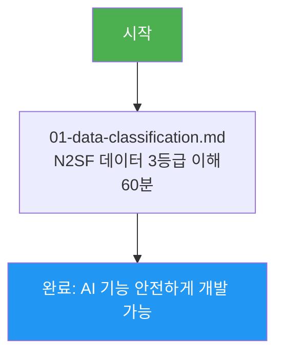

# N2SF (국가 클라우드 보안 프레임워크) — 학습 맵

> **문서 ID**: ONBOARD-07-N2SF-README
> **버전**: 1.0.0 | **작성일**: 2026-04-12
> **대상**: AI 기능 개발자, 데이터를 처리하는 모든 개발자
> **전제 조건**: `csap/01-what-is-csap.md` 완료
> **N2SF**: N-01~N-06 전 영역

---

## 이 섹션을 배우면

AI API에 전송 가능한 데이터와 불가능한 데이터를 정확히 구분하고, PII 마스킹을 올바르게 구현하여 N2SF N-05 위반 없이 AI 기능을 개발할 수 있습니다.

---

## 왜 이것이 중요한가?

```
N2SF N-05 위반 시 결과:
  → CSAP 인증 취소 (공공기관 납품 불가)
  → 전자정부법 위반 (형사 처벌 가능)
  → 개인정보보호법 위반 (과징금)

선의의 개발이라도 규정 모르면 위반 가능
→ AI 요약 기능 개발 시 가장 많이 실수하는 영역
```

---

## 학습 순서



---

## 파일 목록

| 파일 | 내용 | 소요 시간 |
|------|------|---------|
| `01-data-classification.md` | N2SF 소개, 3등급 분류, PII 마스킹, AI 등급 체크 | 60분 |

---

## 핵심 규칙 (외워두세요)

| 등급 | 대표 데이터 | AI API 전송 |
|------|-----------|-----------|
| C등급 | 국가 기밀, 군사 정보 | **절대 금지** |
| S등급 | 주민번호, 이메일, 계약금액 | **금지** |
| O등급 | 비식별 통계, 공개 정보 | PII 마스킹 후 가능 |

---

> **참조**: `.claude/rules/csap-compliance.md` — N2SF 코드 규칙
> **참조**: `platform/services/ai-service/src/lib/grade-check.ts` — 실제 구현체
