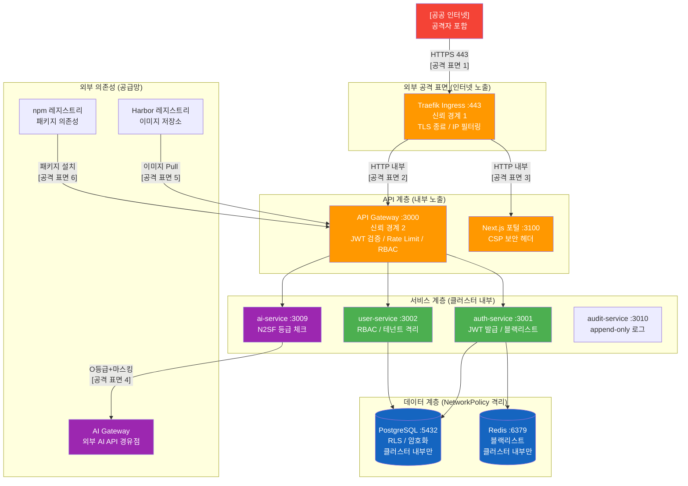

# 위협 모델링 — STRIDE 기반 공격 시나리오와 대응 전략

> **버전**: 1.0.0 | **작성일**: 2026-04-12
> **대상**: 신규 개발자, 보안 담당자, 아키텍트
> **전제 조건**: `csap/01-what-is-csap.md`, `coding/01-secure-patterns.md` 학습 완료
> **소요 시간**: 약 120분
> **CSAP**: D-05, D-06, D-08, D-09, D-10, D-12
> **N2SF**: N-03, N-04, N-05

---

## 목차

1. [위협 모델링이란?](#1-위협-모델링이란)
2. [STRIDE 방법론](#2-stride-방법론)
3. [이 프로젝트의 Attack Surface](#3-이-프로젝트의-attack-surface)
4. [7가지 주요 위협 시나리오](#4-7가지-주요-위협-시나리오)
   - 4.1 [인증 우회 (JWT 위조, 세션 하이재킹)](#41-인증-우회)
   - 4.2 [테넌트 격리 실패](#42-테넌트-격리-실패)
   - 4.3 [AI API 데이터 유출](#43-ai-api-데이터-유출)
   - 4.4 [공급망 공격](#44-공급망-공격)
   - 4.5 [내부자 위협](#45-내부자-위협)
   - 4.6 [DDoS/Rate Limit 우회](#46-ddosrate-limit-우회)
   - 4.7 [민감 정보 로그 노출](#47-민감-정보-로그-노출)
5. [DREAD 위험도 평가](#5-dread-위험도-평가)
6. [Attack Surface 맵](#6-attack-surface-맵)
7. [위협 대응 결정 트리](#7-위협-대응-결정-트리)
8. [새 기능 추가 시 위협 체크리스트](#8-새-기능-추가-시-위협-체크리스트)

---

## 1. 위협 모델링이란?

### 1.1 정의와 목적

위협 모델링(Threat Modeling)은 시스템에 어떤 공격이 가능한지 **체계적으로 나열하고, 우선순위를 정하여, 대응 방안을 설계**하는 보안 분석 방법론입니다.

```
"무엇이 잘못될 수 있는가?" 라는 질문에 체계적으로 답하는 과정

보안 사고가 발생하기 전에:
  → 가능한 공격 경로를 미리 파악
  → 대응 수단이 갖춰졌는지 검증
  → 잔여 위험을 인식하고 수용 여부 결정
```

### 1.2 왜 공공기관 SaaS에서 필수인가

공공기관 SaaS는 일반 서비스와 달리 특수한 위험 환경에 놓여 있습니다.

| 공공기관 특수성 | 위험 증폭 요인 |
|-------------|-------------|
| 국민 개인정보(주민번호, 주소, 의료정보) 처리 | 유출 시 법적 책임 + 국민 피해 |
| 복수 공공기관이 동일 플랫폼 사용 (멀티테넌트) | 한 테넌트 침해 시 전체 파급 위험 |
| CSAP 감사 대상 | 보안 결함 발견 시 인증 취소 |
| 공격자의 선호 표적 (정부기관 = 고가치 데이터) | APT 등 고도화된 공격 대상 |

### 1.3 위협 모델링의 산출물

위협 모델링을 완료하면 다음 산출물이 생성됩니다.

```
산출물:
  1. 위협 목록 (이 문서)
       → 각 위협의 공격 시나리오, 현재 대응, 잔여 위험
  2. DREAD 위험 평가 점수
       → 우선순위 기반 방어 투자 결정
  3. Attack Surface 목록
       → 외부에 노출된 진입점 전체 파악
  4. 개발자 체크리스트
       → 새 기능 추가 시 위협 재검토 기준
```

---

## 2. STRIDE 방법론

### 2.1 STRIDE란?

STRIDE는 Microsoft가 개발한 위협 분류 체계로, 6가지 위협 유형의 머리글자를 딴 약어입니다. 이 체계를 사용하면 위협을 빠짐없이 식별할 수 있습니다.

| 구분 | 영문 | 의미 | 예시 | 위반 보안 속성 |
|------|------|------|------|-------------|
| **S** | Spoofing | 신원 위장 | JWT 위조, 피싱 로그인 | 인증(Authentication) |
| **T** | Tampering | 데이터 변조 | DB 직접 수정, 중간자 공격 | 무결성(Integrity) |
| **R** | Repudiation | 부인 | "나는 그 작업을 하지 않았다" | 부인 방지(Non-repudiation) |
| **I** | Information Disclosure | 정보 노출 | 데이터 유출, 로그 노출 | 기밀성(Confidentiality) |
| **D** | Denial of Service | 서비스 거부 | DDoS, 리소스 고갈 | 가용성(Availability) |
| **E** | Elevation of Privilege | 권한 상승 | SQL 주입으로 관리자 접근 | 권한(Authorization) |

### 2.2 STRIDE를 이 프로젝트에 적용하는 방법

```
적용 절차:

  1. 데이터 흐름도(DFD) 작성
       → 시스템의 모든 구성요소와 데이터 흐름을 시각화

  2. 신뢰 경계(Trust Boundary) 식별
       → 인터넷 ↔ Gateway, Gateway ↔ 서비스, 서비스 ↔ DB

  3. 각 흐름에 STRIDE 6가지 적용
       → "이 흐름에서 신원을 위장할 수 있는가?"
       → "이 흐름에서 데이터를 변조할 수 있는가?" 등

  4. 위협별 대응 설계
       → 기존 대응이 충분한가? 추가 대응이 필요한가?
```

---

## 3. 이 프로젝트의 Attack Surface

Attack Surface는 공격자가 시스템에 접근할 수 있는 모든 진입점을 의미합니다. 진입점이 많을수록 방어 면적이 넓어집니다.

### 3.1 외부 노출 엔드포인트 목록

| 진입점 | 포트 | 프로토콜 | 노출 범위 | CSAP 관련 |
|--------|------|---------|---------|---------|
| Traefik Ingress | 443 | HTTPS | 공공 인터넷 | D-08, D-09 |
| API Gateway | 3000 | HTTPS (Traefik 경유) | 공공 인터넷 | D-08, D-10 |
| Next.js 포털 | 3100 | HTTPS (Traefik 경유) | 공공 인터넷 | D-08, D-12 |
| Grafana 대시보드 | 내부 | HTTP | VPN 내부망 | D-08 |
| kubectl API | 6443 | HTTPS | VPN 내부망 | D-08 |
| PostgreSQL | 5432 | TCP | k8s 내부망만 | D-09 |
| Redis | 6379 | TCP | k8s 내부망만 | D-08, D-09 |

**핵심 원칙**: 인터넷에 직접 노출되는 것은 Traefik Ingress 단 하나입니다. 모든 서비스는 Traefik을 통해서만 접근 가능합니다.

### 3.2 신뢰 경계 (Trust Boundaries)

```
[공공 인터넷]
    ↓ (신뢰 경계 1: 외부 → Ingress)
[Traefik Ingress — TLS 종료, IP 필터링]
    ↓ (신뢰 경계 2: Ingress → Gateway)
[API Gateway — JWT 검증, Rate Limit, RBAC]
    ↓ (신뢰 경계 3: Gateway → 서비스)
[마이크로서비스 — 테넌트 격리, Zod 검증]
    ↓ (신뢰 경계 4: 서비스 → 데이터)
[PostgreSQL / Redis — RLS, 암호화]
```

경계를 넘을 때마다 추가적인 검증이 필요합니다.

---

## 4. 7가지 주요 위협 시나리오

---

### 4.1 인증 우회

**STRIDE 분류**: Spoofing (신원 위장) + Elevation of Privilege (권한 상승)
**CSAP 관련**: D-08 접근 통제

#### 공격 시나리오

**시나리오 A — JWT 알고리즘 혼동 공격 (Algorithm Confusion)**

```
공격자:
  1. API 응답에서 JWT 헤더를 분석: {"alg": "RS256", "typ": "JWT"}
  2. RS256을 HS256으로 변경 후 공개키를 비밀키로 사용하여 위조
  3. {"alg": "HS256", "typ": "JWT"} 헤더의 위조 토큰 생성
  4. API에 위조 토큰 제출 → 서버가 HS256으로 검증하면 통과!

취약한 서버 코드:
  const decoded = jwt.verify(token, publicKey)  // 알고리즘 미지정!
  // 공격자가 HS256으로 변경하면 publicKey가 HS256 비밀키로 사용됨
```

**시나리오 B — 세션 하이재킹**

```
공격자:
  1. XSS 취약점을 통해 다른 사용자의 localStorage에서 액세스 토큰 탈취
  2. 탈취한 토큰으로 피해자 계정으로 요청 전송
  3. 서버는 유효한 토큰으로 판단하여 정상 처리

또는:
  1. 네트워크 중간자 공격(MITM)으로 토큰 가로채기 (TLS 미적용 시)
  2. 탈취한 리프레시 토큰으로 새 액세스 토큰 발급
```

**시나리오 C — 토큰 만료 무시**

```
공격자:
  1. 예전에 발급된 토큰 사용 (만료된 토큰)
  2. 취약한 서버가 만료 검증을 하지 않는 경우 통과
  3. 이직/퇴직 직원이 계속 시스템 접근 가능
```

#### 현재 대응

```typescript
// platform/services/api-gateway/src/plugins/auth.plugin.ts

// ✅ 대응 1: 알고리즘 명시적 지정
const decoded = jwt.verify(token, process.env.JWT_PUBLIC_KEY, {
  algorithms: ['RS256'],  // HS256 절대 허용 안 함
  issuer: 'public-saas-auth',
  audience: 'public-saas-api',
});

// ✅ 대응 2: 블랙리스트 확인 (로그아웃된 토큰 차단)
const isBlacklisted = await redis.exists(`blacklist:${tokenId}`);
if (isBlacklisted) throw new Error('Token revoked');

// ✅ 대응 3: 짧은 액세스 토큰 만료 (15분)
// 리프레시 토큰으로만 갱신 가능, 리프레시는 DB에서 검증

// ✅ 대응 4: TLS 1.3 강제 (MITM 방지)
// Traefik에서 TLS 1.3 전용 설정
```

```yaml
# platform/k8s/traefik/values.yaml
ports:
  web:
    redirectTo: websecure  # HTTP → HTTPS 강제 리다이렉트
  websecure:
    tls:
      options: mintls13    # TLS 1.3 최소 버전 강제
```

#### 잔여 위험

| 위험 항목 | 수준 | 허용 이유 |
|---------|------|---------|
| 15분 이내 탈취된 액세스 토큰 사용 | 낮음 | 15분 만료 + 블랙리스트로 최소화 |
| RS256 키 유출 | 중간 | Vault에서 관리, 주기적 로테이션 필요 |
| 물리적 토큰 캡처 (공공장소 화면 노출) | 낮음 | 사용자 교육으로 대응 |

---

### 4.2 테넌트 격리 실패

**STRIDE 분류**: Information Disclosure (정보 노출) + Elevation of Privilege
**CSAP 관련**: D-08 접근 통제, N2SF N-03 격리 영역

#### 공격 시나리오

**시나리오 A — Tenant ID 조작**

```
공격자 (테넌트A 사용자):
  1. API 요청에서 x-tenant-id 헤더를 테넌트B ID로 변조
  2. 취약한 서버가 헤더를 그대로 신뢰하면 B의 데이터 접근
  3. 예: GET /api/users?tenantId=tenant-B-uuid-xxxx

취약한 코드:
  const tenantId = req.headers['x-tenant-id'];  // 사용자가 조작 가능!
  const users = await db.users.findMany({ where: { tenantId } });
```

**시나리오 B — tenantId 없는 전체 조회**

```
개발자 실수:
  // tenantId 필터를 빠뜨린 경우
  const users = await prisma.user.findMany();
  // → 모든 테넌트의 사용자가 반환됨!

결과:
  → 공무원A가 공무원B 기관의 민원인 정보를 열람
  → N2SF N-03 격리 영역 위반
  → CSAP 감리 결함 (D-08)
```

**시나리오 C — 간접 객체 참조 (IDOR)**

```
공격자:
  1. 자신의 문서 ID를 확인: /api/documents/123
  2. 다른 문서 ID 추측: /api/documents/124, 125, ...
  3. 테넌트 검사가 없으면 다른 테넌트 문서 접근 가능
```

#### 현재 대응

```typescript
// platform/services/user-service/src/handlers/user.handler.ts

// ✅ 대응 1: Gateway에서 주입한 헤더만 신뢰
// (사용자가 변조한 헤더는 Gateway에서 덮어쓰므로 무효화)
const tenantId = req.headers['x-verified-tenant-id'];  // Gateway 검증 완료된 값

// ✅ 대응 2: 모든 쿼리에 tenantId 필수 포함
const users = await prisma.user.findMany({
  where: {
    tenantId: tenantId,  // 절대 빠뜨리지 않음
  },
});

// ✅ 대응 3: IDOR 방지 — ID 조회 시 테넌트 소유권 확인
const document = await prisma.document.findFirst({
  where: {
    id: documentId,
    tenantId: tenantId,  // 이 테넌트의 문서인지 확인
  },
});
if (!document) throw new NotFoundError('Document not found');
// → 다른 테넌트 문서면 NotFound 반환 (403이 아닌 404로 존재 여부 미노출)
```

```sql
-- PostgreSQL Row-Level Security (RLS) 추가 방어층
-- platform/db/migrations/001_enable_rls.sql
ALTER TABLE users ENABLE ROW LEVEL SECURITY;

CREATE POLICY tenant_isolation ON users
  FOR ALL TO app_user
  USING (tenant_id = current_setting('app.current_tenant_id')::uuid);
```

#### 잔여 위험

| 위험 항목 | 수준 | 허용 이유 |
|---------|------|---------|
| 신규 서비스 개발 시 tenantId 누락 실수 | 중간 | Q-Gate G3 Reviewer 자동 탐지 |
| RLS 미설정 신규 테이블 | 낮음 | 마이그레이션 체크리스트로 관리 |

---

### 4.3 AI API 데이터 유출

**STRIDE 분류**: Information Disclosure (정보 노출)
**N2SF 관련**: N-03, N-04, N-05
**CSAP 관련**: D-09 암호화, D-12 시스템 개발 보안

#### 공격 시나리오

**시나리오 A — C/S 등급 데이터 직접 전송**

```
개발자 실수:
  // 고객 민원 내용을 AI에게 요약 요청
  const summary = await openai.chat({
    messages: [{ role: 'user', content: complaintText }]
    // complaintText에 주민번호, 의료정보 등 S등급 데이터 포함!
  });

결과:
  → 국민 개인정보가 외부 AI 서버로 전송됨
  → N2SF N-05 위반 (중요 정보 외부 전송 통제)
  → CSAP 인증 취소 사유
```

**시나리오 B — PII 마스킹 없이 O등급 전송**

```
개발자 실수:
  // "O등급 데이터이니까 괜찮다"고 판단
  const result = await aiGateway.send(reportText);
  // reportText에 이름, 전화번호 등 PII 포함

결과:
  → 개인정보보호법 위반
  → AI 학습 데이터로 사용될 위험
```

**시나리오 C — AI Gateway 우회**

```
개발자 실수:
  // 직접 OpenAI API 호출 (Gateway 우회)
  const response = await fetch('https://api.openai.com/...', {
    headers: { Authorization: `Bearer ${process.env.OPENAI_KEY}` }
  });

결과:
  → 감사 로그 없음 (어떤 데이터가 전송됐는지 불명)
  → 데이터 등급 확인 없음
  → N2SF 준수 입증 불가
```

#### 현재 대응

```typescript
// platform/services/ai-service/src/lib/ai-gateway.ts

enum DataGrade {
  C = 'C',  // 대외비 — AI 전송 절대 금지
  S = 'S',  // 민감 — AI 전송 절대 금지
  O = 'O',  // 공개 — PII 마스킹 후 허용
}

export async function callAIGateway(
  data: string,
  grade: DataGrade,
  context: { tenantId: string; userId: string; purpose: string }
): Promise<AIResponse> {
  // ✅ 대응 1: C/S 등급 데이터 전송 차단 (코드 레벨 강제)
  if (grade !== DataGrade.O) {
    await auditLog({
      actor: context.userId,
      action: 'AI_BLOCKED_DATA_GRADE',
      detail: `${grade}등급 데이터 AI 전송 시도 차단`,
      csapRef: 'N2SF-N-05',
    });
    throw new Error(`[N2SF 위반 차단] ${grade}등급 데이터 AI API 전송 금지`);
  }

  // ✅ 대응 2: PII 마스킹 (O등급도 마스킹 필수)
  const maskedData = await maskPII(data);

  // ✅ 대응 3: 내부 AI Gateway 경유 (직접 외부 API 호출 금지)
  const response = await fetch(`${process.env.AI_GATEWAY_URL}/v1/chat`, {
    headers: {
      'Authorization': `Bearer ${process.env.AI_GATEWAY_KEY}`,
      'X-Tenant-ID': context.tenantId,
      'X-User-ID': context.userId,
      'X-Data-Grade': grade,
    },
    body: JSON.stringify({ content: maskedData }),
    method: 'POST',
  });

  // ✅ 대응 4: 감사 로그 기록
  await auditLog({
    actor: context.userId,
    action: 'AI_REQUEST_SENT',
    detail: `purpose=${context.purpose}, dataGrade=${grade}`,
    csapRef: 'D-06',
  });

  return response.json();
}
```

#### 잔여 위험

| 위험 항목 | 수준 | 허용 이유 |
|---------|------|---------|
| PII 마스킹 패턴의 불완전성 (새로운 PII 패턴) | 중간 | 정기적 패턴 업데이트 필요 |
| AI Gateway 자체 침해 | 낮음 | Gateway도 보안 감사 대상 |
| 개발자가 DataGrade.O로 잘못 분류 | 중간 | 데이터 분류 교육 + 코드 리뷰 의무화 |

---

### 4.4 공급망 공격

**STRIDE 분류**: Tampering (변조) + Information Disclosure
**CSAP 관련**: D-05 공급망 보안, D-12 시스템 개발 보안

#### 공격 시나리오

**시나리오 A — 악성 npm 패키지**

```
공격 방식 (실제 발생한 사례 기반):
  1. 공격자가 "lodash"와 비슷한 이름의 "lodash-security-utils" 패키지 배포
  2. 개발자가 실수로 악성 패키지 설치
  3. 패키지가 환경 변수(JWT_SECRET, DB_PASSWORD 등)를 외부로 전송
  4. 수집된 시크릿으로 시스템 침해

또는:
  1. 합법적인 패키지 관리자 계정 탈취
  2. 악성코드를 포함한 새 버전 배포 (typosquatting)
  3. pnpm update 시 자동으로 악성 버전 설치
```

**시나리오 B — 컨테이너 이미지 변조**

```
공격 방식:
  1. Harbor 레지스트리 계정 탈취
  2. 공식 이미지와 동일한 이름으로 악성 이미지 업로드
  3. 배포 시 악성 이미지가 실행됨

결과:
  → 백도어 설치, 데이터 탈취, 암호화폐 채굴 등
```

**시나리오 C — CI/CD 파이프라인 침해**

```
공격 방식:
  1. Gitea 저장소에 악성 워크플로우 파일 삽입
  2. CI 실행 시 내부 네트워크에 접근
  3. Kubernetes 클러스터 자격증명 탈취
```

#### 현재 대응

```yaml
# .gitea/workflows/ci-cd-pipeline.yml (Cosign 서명 부분)

# ✅ 대응 1: CI 파이프라인에서 이미지 서명 (SLSA Level 2)
- name: Cosign으로 이미지 서명
  run: |
    cosign sign --key env://COSIGN_PRIVATE_KEY \
      --annotations "build-date=$(date -u +'%Y-%m-%dT%H:%M:%SZ')" \
      --annotations "git-commit=${{ github.sha }}" \
      "localhost:8080/public-saas/${{ matrix.service }}:${{ github.sha }}"

# ✅ 대응 2: Kyverno가 미서명 이미지 배포 차단
# (infra/kyverno/verify-image-signature.yaml)
# → Enforce 모드: 서명 없으면 배포 요청 자체가 거부됨
```

```bash
# ✅ 대응 3: Trivy SBOM으로 의존성 전수 검사
# .gitea/workflows/devsecops.yml
trivy image \
  --format cyclonedx \
  --output sbom-${{ matrix.service }}.json \
  "localhost:8080/public-saas/${{ matrix.service }}:latest"

# ✅ 대응 4: pnpm audit으로 알려진 취약점 차단
pnpm audit --audit-level=high --prod
# HIGH 이상 취약점 발견 시 파이프라인 실패 → 배포 차단
```

```yaml
# ✅ 대응 5: 허용된 레지스트리만 사용 (Kyverno 정책)
# infra/kyverno/policies/admission-security/image-registry-whitelist.yaml
spec:
  validationFailureAction: Enforce
  rules:
    - name: validate-image-registry
      validate:
        message: "Harbor 레지스트리(localhost:8080)의 이미지만 허용합니다"
```

#### 잔여 위험

| 위험 항목 | 수준 | 허용 이유 |
|---------|------|---------|
| 아직 CVE가 공개되지 않은 0-day 취약점 | 중간 | 탐지 불가, 신속 패치 프로세스로 대응 |
| Harbor 레지스트리 계정 탈취 | 낮음 | MFA 강제 + 접근 제어 |
| 내부 개발자 계정을 통한 악성 PR | 낮음 | 코드 리뷰 2인 승인 의무화 |

---

### 4.5 내부자 위협

**STRIDE 분류**: Repudiation (부인) + Information Disclosure
**CSAP 관련**: D-06 침해사고 관리 (감사 로그), D-08 접근 통제

#### 공격 시나리오

**시나리오 A — 관리자 권한 남용**

```
내부자 (관리자):
  1. 시스템 관리자 권한으로 다른 테넌트의 민감 데이터 열람
  2. 데이터를 외부 USB에 복사
  3. "관리 업무상 접근한 것"이라고 주장 (부인)

또는:
  1. 퇴직 예정 직원이 데이터 대량 다운로드
  2. 퇴직 후 경쟁사에 데이터 판매
```

**시나리오 B — 개발자 DB 직접 접근**

```
내부자 (개발자):
  1. k8s 포트 포워딩으로 PostgreSQL에 직접 접근
     kubectl port-forward pod/postgres-0 5432:5432
  2. tenantId 필터 없이 전체 데이터 조회
  3. 감사 로그 없이 데이터 유출
```

**시나리오 C — 로그 조작**

```
내부자 (운영자):
  1. 불법 행위 증거를 남기는 감사 로그를 직접 삭제
  2. "로그가 없으니 아무 일도 없었다"고 주장
```

#### 현재 대응

```typescript
// platform/services/audit-service/src/lib/audit.ts

// ✅ 대응 1: append-only 감사 로그 구조 (삭제 불가)
// PostgreSQL WORM 테이블 (Write Once Read Many)
// → DELETE, UPDATE 권한이 감사 로그 테이블에는 부여되지 않음

// ✅ 대응 2: 모든 민감 작업에 자동 감사 로그
export async function auditLog(event: AuditEvent): Promise<void> {
  const entry = {
    id: randomUUID(),
    timestamp: new Date().toISOString(),
    actor: event.actor,
    action: event.action,
    target: event.target,
    tenantId: event.tenantId,
    ip: event.ip,
    result: event.result,
    csapRef: event.csapRef,
  };

  // 로컬 파일 + DB 이중 기록
  await Promise.all([
    appendFile('.claude/audit.jsonl', JSON.stringify(entry) + '\n'),
    prisma.auditLog.create({ data: entry }),
  ]);
}
```

```yaml
# ✅ 대응 3: kubectl 접근 제한 (RBAC)
# 개발자는 read-only, 운영팀만 write 권한
# platform/k8s/rbac/developer-role.yaml
apiVersion: rbac.authorization.k8s.io/v1
kind: ClusterRole
metadata:
  name: developer-readonly
rules:
  - apiGroups: [""]
    resources: ["pods", "logs"]
    verbs: ["get", "list", "watch"]
  # port-forward는 명시적으로 허용하지 않음
```

```typescript
// ✅ 대응 4: 대용량 조회 탐지 및 알림
// 비정상적 데이터 접근 패턴 모니터링
if (resultCount > 1000) {
  await auditLog({
    actor: userId,
    action: 'LARGE_DATA_EXPORT',
    detail: `${resultCount}건 대용량 조회 감지`,
    severity: 'HIGH',
  });
  // 보안팀 즉시 알림
  await securityAlert(`대용량 데이터 접근: ${userId} → ${resultCount}건`);
}
```

#### 잔여 위험

| 위험 항목 | 수준 | 허용 이유 |
|---------|------|---------|
| 물리적 화면 촬영 | 낮음 | 물리 보안 정책으로 대응 |
| 관리자가 감사 로그 접근 권한으로 자신의 로그 편집 | 낮음 | append-only 구조로 편집 불가 |
| 감사 로그 자체를 삭제 시도 | 낮음 | DB 권한 제어 + 백업 |

---

### 4.6 DDoS/Rate Limit 우회

**STRIDE 분류**: Denial of Service
**CSAP 관련**: D-10 서비스 연속성

#### 공격 시나리오

**시나리오 A — 대용량 트래픽 공격 (볼류메트릭 DDoS)**

```
공격자:
  1. 봇넷을 이용해 초당 수천 건의 요청 전송
  2. API Gateway, 애플리케이션 서버 CPU/메모리 고갈
  3. 정상 사용자 서비스 불가
```

**시나리오 B — Rate Limit 우회**

```
공격자:
  1. API Rate Limit이 IP당 100req/min이라는 것을 파악
  2. 다수의 IP를 순환하며 요청 (IP 순환 공격)
  3. 또는 헤더 조작: X-Forwarded-For: [스푸핑된 IP]
  4. Rate Limit 우회 → 무한 요청 가능
```

**시나리오 C — 자원 고갈 공격 (Slow HTTP)**

```
공격자:
  1. HTTP 요청을 매우 천천히 전송 (Slow Loris 공격)
  2. 각 요청이 연결을 오랫동안 점유
  3. 서버의 동시 연결 수 고갈 → 새 연결 거부
```

**시나리오 D — 계산 집약적 엔드포인트 공격**

```
공격자:
  1. bcrypt 해시 계산이 필요한 로그인 엔드포인트 식별
  2. 대량 로그인 요청 → CPU 고갈 (bcrypt는 의도적으로 느림)
  3. 합법적 사용자 로그인 불가
```

#### 현재 대응

```typescript
// platform/packages/rate-limit/src/index.ts

// ✅ 대응 1: 슬라이딩 윈도우 Rate Limiter
// 고정 윈도우보다 정확한 슬라이딩 윈도우 알고리즘

export class SlidingWindowRateLimiter {
  constructor(
    private redis: Redis,
    private windowMs: number = 60000,   // 1분
    private maxRequests: number = 100,  // 100 req/min
  ) {}

  async isAllowed(tenantId: string, ip: string): Promise<boolean> {
    const key = `rate:${tenantId}:${ip}`;
    const now = Date.now();
    const windowStart = now - this.windowMs;

    // Redis sorted set으로 슬라이딩 윈도우 구현
    await this.redis.zremrangebyscore(key, 0, windowStart);  // 만료된 항목 제거
    const count = await this.redis.zcard(key);

    if (count >= this.maxRequests) return false;

    await this.redis.zadd(key, now, `${now}-${Math.random()}`);
    await this.redis.expire(key, Math.ceil(this.windowMs / 1000));
    return true;
  }
}

// ✅ 대응 2: Tenant ID 기반 Rate Limit (IP 순환 무력화)
// IP가 바뀌어도 동일 테넌트 토큰이면 동일 카운터 적용
const rateLimitKey = `rate:tenant:${tenantId}`;

// ✅ 대응 3: IP Spoofing 방지
// X-Forwarded-For 헤더를 신뢰하지 않음
// Traefik이 실제 클라이언트 IP를 X-Real-IP 헤더에 삽입
const clientIP = req.headers['x-real-ip'] as string;  // Traefik이 보장
```

```yaml
# ✅ 대응 4: Traefik에서 연결 수 제한 (Slow HTTP 방어)
# platform/k8s/traefik/values.yaml
additionalArguments:
  - --entrypoints.websecure.transport.respondingTimeouts.readTimeout=30s
  - --entrypoints.websecure.transport.respondingTimeouts.writeTimeout=30s
  - --entrypoints.websecure.transport.respondingTimeouts.idleTimeout=60s
```

#### 잔여 위험

| 위험 항목 | 수준 | 허용 이유 |
|---------|------|---------|
| 대규모 볼류메트릭 DDoS (Gbps 급) | 중간 | ISP 수준 대응 필요, 현재 인프라 한계 인정 |
| 로그인 엔드포인트 CPU 소모 | 낮음 | Rate Limit 10req/min + 계정 잠금으로 완화 |

---

### 4.7 민감 정보 로그 노출

**STRIDE 분류**: Information Disclosure (정보 노출)
**CSAP 관련**: D-06 침해사고 관리, D-09 암호화

#### 공격 시나리오

**시나리오 A — 로그 파일에 PII 포함**

```
개발자 실수:
  logger.info({ user }, 'User logged in');
  // user 객체에 password hash, ssn, phone 등이 포함!

  또는:
  logger.error(error);
  // error 메시지에 DB 연결 문자열, API 키 등이 포함!

결과:
  → Loki(로그 집계)에 평문 개인정보 저장
  → Loki에 접근 권한이 있는 운영팀 전체가 열람 가능
  → 개인정보보호법 위반
```

**시나리오 B — 에러 응답에 내부 정보 노출**

```
취약한 코드:
  catch (error) {
    res.status(500).json({
      message: error.message,  // DB 연결 정보 포함 가능!
      stack: error.stack,      // 파일 경로, 코드 라인 노출
    });
  }

공격자 활용:
  → 서버 내부 구조 파악
  → 취약점 공격에 활용
```

**시나리오 C — 쿼리 파라미터에 민감 데이터**

```
잘못된 설계:
  GET /api/users?token=abc123&password=plainpass

결과:
  → URL이 nginx/Traefik 접근 로그에 기록됨
  → 비밀번호가 로그 파일에 평문으로 저장됨
```

#### 현재 대응

```typescript
// platform/packages/logger/src/index.ts

// ✅ 대응 1: 민감 필드 자동 마스킹 로거
const SENSITIVE_FIELDS = [
  'password', 'passwordHash', 'token', 'accessToken', 'refreshToken',
  'secret', 'apiKey', 'ssn', 'phone', 'creditCard', 'encryptionKey',
];

export function createSafeLogger(service: string) {
  return pino({
    serializers: {
      user: (user: any) => {
        if (!user) return user;
        const safe = { ...user };
        for (const field of SENSITIVE_FIELDS) {
          if (safe[field]) safe[field] = '[MASKED]';
        }
        return safe;
      },
      error: (err: Error) => ({
        type: err.constructor.name,
        message: err.message.replace(/password=['"][^'"]+['"]/gi, "password='[MASKED]'"),
        // stack은 프로덕션에서 미포함
        ...(process.env.NODE_ENV !== 'production' && { stack: err.stack }),
      }),
    },
  });
}

// ✅ 대응 2: 안전한 에러 응답 (내부 정보 미노출)
catch (error) {
  const errorId = randomUUID();
  logger.error({ errorId, err: error }, 'Request failed');
  // 외부에는 errorId만 제공 → 로그에서 추적 가능하지만 공격자에게 정보 미노출
  res.status(500).json({ error: 'Internal server error', errorId });
}
```

```typescript
// ✅ 대응 3: PII 마스킹 함수 (auditLog에도 적용)
export function maskPII(text: string): string {
  return text
    .replace(/\d{6}-[1-4]\d{6}/g, '######-#######')  // 주민번호
    .replace(/01[0-9]-\d{3,4}-\d{4}/g, '010-****-****')  // 전화번호
    .replace(/[a-zA-Z0-9._%+-]+@[a-zA-Z0-9.-]+\.[a-zA-Z]{2,}/g, '***@***.***')  // 이메일
    .replace(/\d{4}-\d{4}-\d{4}-\d{4}/g, '****-****-****-****');  // 카드번호
}
```

#### 잔여 위험

| 위험 항목 | 수준 | 허용 이유 |
|---------|------|---------|
| 마스킹 패턴에 포함되지 않은 새로운 PII 형식 | 낮음 | 정기 패턴 업데이트로 관리 |
| 로그 전송 중 패킷 캡처 | 낮음 | mTLS (Linkerd)로 내부 통신 암호화 |

---

## 5. DREAD 위험도 평가

DREAD는 위협의 위험도를 5개 관점에서 수치화하는 방법입니다. 각 항목을 1~10점으로 평가하고 평균을 구합니다.

| 항목 | 의미 | 설명 |
|------|------|------|
| **D** Damage | 피해 규모 | 공격 성공 시 얼마나 큰 피해가 발생하는가 |
| **R** Reproducibility | 재현 가능성 | 공격을 얼마나 쉽게 반복할 수 있는가 |
| **E** Exploitability | 악용 용이성 | 공격에 필요한 기술 수준이 낮은가 |
| **A** Affected Users | 영향 사용자 | 얼마나 많은 사용자가 영향받는가 |
| **D** Discoverability | 발견 용이성 | 공격자가 취약점을 얼마나 쉽게 찾는가 |

### 5.1 7가지 위협 DREAD 점수표

| 위협 | D | R | E | A | D | 평균 | 우선순위 |
|------|---|---|---|---|---|------|--------|
| 인증 우회 (JWT 위조) | 9 | 5 | 6 | 10 | 7 | **7.4** | 1위 |
| AI API 데이터 유출 | 8 | 7 | 5 | 9 | 6 | **7.0** | 2위 |
| 테넌트 격리 실패 | 9 | 6 | 5 | 8 | 4 | **6.4** | 3위 |
| 내부자 위협 | 8 | 5 | 3 | 8 | 3 | **5.4** | 4위 |
| 공급망 공격 | 10 | 3 | 4 | 10 | 3 | **6.0** | 4위 |
| DDoS/Rate Limit 우회 | 5 | 7 | 8 | 10 | 9 | **7.8** | 1위 |
| 민감 정보 로그 노출 | 7 | 6 | 4 | 7 | 5 | **5.8** | 5위 |

### 5.2 위험도 해석 기준

```
7.0 이상 → HIGH: 즉각 대응 필요, 현재 스프린트에서 해결
5.0~6.9  → MEDIUM: 다음 분기 내 대응 계획 수립
3.0~4.9  → LOW: 연간 보안 계획에 포함
3.0 미만  → INFO: 모니터링 유지
```

**우선순위 결론**: DDoS/Rate Limit 우회(7.8)와 인증 우회(7.4)가 최우선 대응 대상입니다.

---

## 6. Attack Surface 맵

아래 다이어그램은 이 프로젝트의 공격 표면을 시각적으로 보여줍니다.



### 6.1 공격 표면별 위험도 요약

| 공격 표면 | 위치 | 주요 위협 | 현재 방어 |
|---------|------|---------|---------|
| 1. HTTPS :443 | Traefik Ingress | DDoS, 스캔 | Rate Limit, IP 필터 |
| 2. API Gateway | 내부 HTTP | JWT 위조, RBAC 우회 | JWT 검증, RBAC 강제 |
| 3. Next.js 포털 | 내부 HTTP | XSS, CSRF | CSP 헤더, CSRF 토큰 |
| 4. AI Gateway | 외부 API | 데이터 등급 위반 | N2SF 등급 체크, PII 마스킹 |
| 5. Harbor 레지스트리 | 이미지 Pull | 이미지 변조 | Cosign 서명, Kyverno 검증 |
| 6. npm 레지스트리 | 패키지 설치 | 악성 패키지 | pnpm audit, Trivy SBOM |

---

## 7. 위협 대응 결정 트리

새로운 기능을 개발하거나 보안 이슈를 발견했을 때 아래 결정 트리를 사용합니다.

```mermaid
flowchart TD
    START([새 위협 또는 보안 이슈 발견]) --> Q1

    Q1{"데이터를 외부로\n전송하는가?"}
    Q1 -->|예| Q2
    Q1 -->|아니오| Q3

    Q2{"데이터 등급이\nC 또는 S인가?"}
    Q2 -->|예| BLOCK_AI["즉시 차단\nN2SF N-05 위반\nAI API 전송 불가"]
    Q2 -->|아니오 (O등급)| MASK["PII 마스킹 후\nAI Gateway 경유\n감사 로그 필수"]

    Q3{"인증/인가가\n필요한 API인가?"}
    Q3 -->|예| Q4
    Q3 -->|아니오 (공개 API)| Q5

    Q4{"verifyToken() +\nhasPermission() 있는가?"}
    Q4 -->|예| Q5
    Q4 -->|아니오| ADD_AUTH["인증/권한 코드 추가\nCSAP D-08 위반 방지\nQ-Gate G3 통과 필수"]

    Q5{"사용자 입력을\n처리하는가?"}
    Q5 -->|예| Q6
    Q5 -->|아니오| Q7

    Q6{"Zod 검증 + 파라미터화 쿼리\n적용되어 있는가?"}
    Q6 -->|예| Q7
    Q6 -->|아니오| ADD_ZOD["Zod 스키마 추가\nPrisma 사용 확인\nCSAP D-12 위반 방지"]

    Q7{"민감 작업인가?\n(삭제, 수정, 권한 변경 등)"}
    Q7 -->|예| Q8
    Q7 -->|아니오| Q9

    Q8{"auditLog() 호출이\n있는가?"}
    Q8 -->|예| Q9
    Q8 -->|아니오| ADD_AUDIT["auditLog() 추가\nCSAP D-06 위반 방지\nQ-Gate G7 통과 필수"]

    Q9{"새 npm 패키지를\n추가하는가?"}
    Q9 -->|예| Q10
    Q9 -->|아니오| PASS

    Q10{"pnpm audit 통과 + \n패키지 출처 확인했는가?"}
    Q10 -->|예| PASS
    Q10 -->|아니오| CHECK_PKG["pnpm audit 실행\n패키지 저장소 확인\nDownload 수, 관리자 확인"]

    PASS(["통과\n PR 제출 가능"])
    BLOCK_AI -.->|"수정 필요"| PASS
    ADD_AUTH -.->|"수정 후"| PASS
    ADD_ZOD -.->|"수정 후"| PASS
    ADD_AUDIT -.->|"수정 후"| PASS
    CHECK_PKG -.->|"확인 후"| PASS
    MASK -.->|"구현 후"| PASS

    style BLOCK_AI fill:#f44336,color:#fff
    style ADD_AUTH fill:#FF9800,color:#fff
    style ADD_ZOD fill:#FF9800,color:#fff
    style ADD_AUDIT fill:#FF9800,color:#fff
    style CHECK_PKG fill:#FF9800,color:#fff
    style MASK fill:#9C27B0,color:#fff
    style PASS fill:#4CAF50,color:#fff
```

---

## 8. 새 기능 추가 시 위협 체크리스트

PR 제출 전에 아래 체크리스트를 완료하십시오. 미완료 항목이 있으면 Q-Gate에서 자동 차단됩니다.

### 8.1 인증/인가 (CSAP D-08)

```
[ ] 새 API 엔드포인트에 verifyToken() 미들웨어 적용
[ ] hasPermission() 또는 requirePermission()으로 세분화 권한 확인
[ ] 모든 DB 쿼리에 tenantId 필터 포함
[ ] IDOR 방지: 단일 리소스 조회 시 tenantId 소유권 확인
[ ] 공개 API (인증 불필요)인 경우 CSAP 검토 후 명시적 예외 처리
```

### 8.2 입력 검증/SQL 주입 방지 (CSAP D-12)

```
[ ] 모든 요청 바디: Zod 스키마로 safeParse() 적용
[ ] 모든 쿼리 파라미터: Zod 검증 + 기본값 + 최대값 제한
[ ] DB 쿼리: Prisma ORM 사용 또는 파라미터화 쿼리 ($1, $2)
[ ] 사용자 HTML 허용 시: DOMPurify.sanitize() 적용
[ ] URL/파일 경로 파라미터: Path Traversal 방지 검증
```

### 8.3 데이터 보호/암호화 (CSAP D-09)

```
[ ] 민감 데이터 저장 전 AES-256-GCM encrypt() 호출
[ ] 비밀번호는 bcrypt.hash(password, 12) 사용
[ ] 시크릿은 process.env에서만 로드 (하드코딩 절대 금지)
[ ] 에러 응답에 내부 정보(스택, DB URL, 환경변수) 미포함
[ ] 로그에 SENSITIVE_FIELDS 마스킹 적용 확인
```

### 8.4 감사 로그 (CSAP D-06)

```
[ ] 생성/수정/삭제 작업: auditLog() 호출
[ ] 권한 변경: auditLog()에 before/after 상태 기록
[ ] 실패한 인증 시도: auditLog()에 기록 (공격 탐지용)
[ ] 대용량 조회 (1000건 이상): 보안 알림 트리거
[ ] AI API 호출: 데이터 등급과 함께 auditLog() 기록
```

### 8.5 N2SF AI 연동 (해당 기능만)

```
[ ] AI에 전달하는 데이터의 N2SF 등급 명시적 확인
[ ] C/S 등급 데이터 → AI 전송 차단 코드 존재 확인
[ ] O 등급 데이터 → maskPII() 적용 후 전송
[ ] 직접 외부 AI API 호출 없음 (AI Gateway 경유)
[ ] AI 호출 결과도 필요 이상으로 저장하지 않음
```

### 8.6 공급망 보안 (CSAP D-05)

```
[ ] 신규 npm 패키지: pnpm audit 통과 확인
[ ] 패키지 출처: npm 주간 다운로드 수, 관리자 신뢰성 확인
[ ] CI/CD에서 Trivy 이미지 스캔 CRITICAL CVE 없음 확인
[ ] Cosign 서명된 이미지만 배포 (Kyverno가 자동 강제)
```

### 8.7 종합 확인

```
[ ] scripts/csap-self-check.sh 실행 통과
[ ] PR에 CSAP 관련 변경 사항 설명 포함
[ ] Reviewer 에이전트 Q-Gate G3 통과 확인
[ ] 위협 모델 변경이 있다면 이 문서 업데이트
```

---

## 위협 시나리오 요약표

| # | 위협 | STRIDE | DREAD | 주요 대응 | CSAP |
|---|------|--------|-------|---------|------|
| 1 | 인증 우회 | S, E | 7.4 | RS256 알고리즘 고정, 블랙리스트 | D-08 |
| 2 | 테넌트 격리 실패 | I, E | 6.4 | tenantId 필수 필터, RLS | D-08 |
| 3 | AI API 데이터 유출 | I | 7.0 | N2SF 등급 체크, PII 마스킹 | D-09 |
| 4 | 공급망 공격 | T, I | 6.0 | Cosign 서명, Trivy 스캔, Kyverno | D-05 |
| 5 | 내부자 위협 | R, I | 5.4 | append-only 감사 로그, RBAC 최소 권한 | D-06 |
| 6 | DDoS/Rate Limit 우회 | D | 7.8 | 슬라이딩 윈도우, 테넌트 기반 제한 | D-10 |
| 7 | 민감 정보 로그 노출 | I | 5.8 | 자동 마스킹 로거, 에러 ID만 반환 | D-06, D-09 |

---

## 다음 단계

위협 모델을 이해했다면, 실제 증거를 수집하고 감리에 제출하는 방법을 학습합니다.

`../csap/03-evidence-collection.md`로 이동하십시오.

---

> **참조**: `.claude/rules/csap-compliance.md` — CSAP 코드 규칙 전문
> **참조**: `infra/kyverno/` — Kyverno 정책 파일
> **참조**: `coding/01-secure-patterns.md` — 보안 코딩 패턴
> **CSAP 연관**: D-05 (공급망), D-06 (감사), D-08 (접근 통제), D-09 (암호화), D-10 (서비스 연속성), D-12 (개발 보안)
> **N2SF 연관**: N-03 (격리 영역), N-04 (데이터 분류), N-05 (외부 전송 통제)

---

## 변경 이력

| 버전 | 일자 | 내용 | 작성자 |
|------|------|------|------|
| 1.0.0 | 2026-04-12 | 최초 작성 — 7가지 위협 시나리오, DREAD 평가, Attack Surface 맵 | Implementer (Sonnet) |
