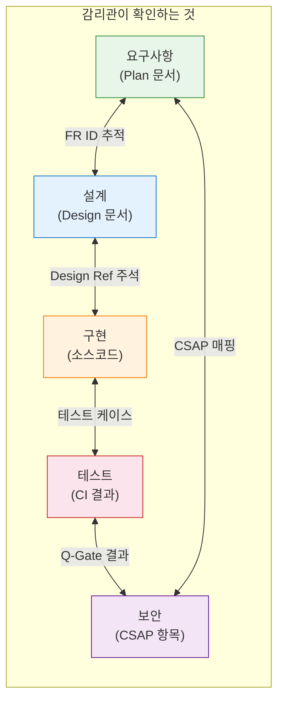
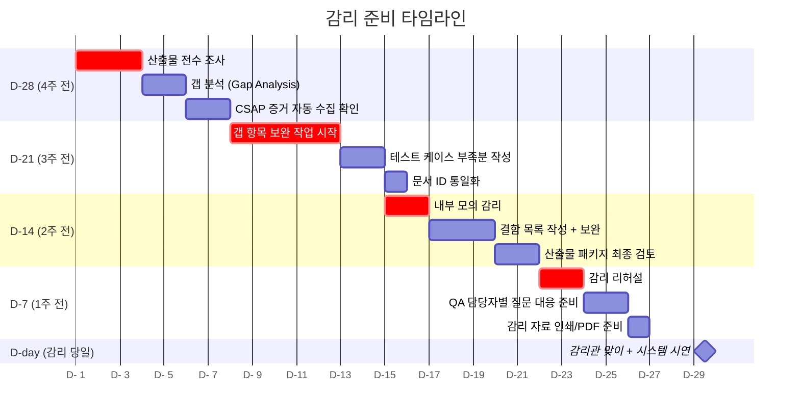
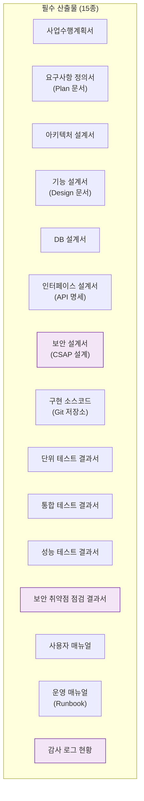

# 행안부 감리 준비 완전 가이드

> **문서 ID**: ONBOARD-08-05
> **버전**: 1.0.0 | **작성일**: 2026-04-12 | **작성자**: Implementer (Sonnet)
> **학습 대상**: 감리를 처음 경험하는 개발자, DevOps 엔지니어, 보안 담당자
> **예상 소요 시간**: 약 2시간 (숙지)
> **선행 문서**: `standards/02-review-standards.md`, `../07-security/csap/03-evidence-collection.md`, `../07-security/csap/04-compliance-automation.md`
> **참고 법령**: 행안부 정보시스템 감리기준 고시 제2023-1호, CSAP 중/상 등급 기준

---

## 목차

1. [행안부 정보화사업 감리란?](#1-행안부-정보화사업-감리란)
2. [감리 유형별 준비 방법](#2-감리-유형별-준비-방법)
3. [감리 D-day 타임라인](#3-감리-d-day-타임라인)
4. [자주 지적되는 감리 결함 TOP 10](#4-자주-지적되는-감리-결함-top-10)
5. [감리 산출물 목록](#5-감리-산출물-목록)
6. [감리 질의응답 시뮬레이션](#6-감리-질의응답-시뮬레이션)
7. [감리 준비 현황 자동 점검](#7-감리-준비-현황-자동-점검)
8. [학습 체크리스트](#8-학습-체크리스트)
9. [다음 단계](#9-다음-단계)

---

## 1. 행안부 정보화사업 감리란?

### 1.1 감리의 목적과 법적 근거

공공기관이 정보시스템을 개발할 때는 반드시 행정안전부(행안부)가 정한 감리를 받아야 합니다. 이것은 선택이 아닌 법적 의무입니다.

**법적 근거**:

```
전자정부법 제57조 (정보시스템의 감리)
  ① 행정기관 등의 장은 ... 정보시스템을 구축하는 경우에는
     정보시스템감리를 받아야 한다.

행안부 정보시스템 감리기준 고시 제2023-1호
  → 감리의 절차, 범위, 방법, 산출물 기준을 구체적으로 규정
```

**감리의 목적 — "왜 하는가"**:

```
목적 1: 품질 보증
  → 개발된 시스템이 요구사항대로 만들어졌는지 검증합니다.
  → "계획한 것을 실제로 만들었는가"

목적 2: 위험 조기 발견
  → 설계 단계에서 발견된 결함은 구현 단계보다 수정 비용이 10배 적습니다.
  → 문제를 일찍 발견할수록 비용이 줄어듭니다.

목적 3: 보안 강화
  → CSAP 인증 요건과 연동하여 보안 취약점을 체계적으로 검증합니다.

목적 4: 국민 세금 효율화
  → 공공 예산으로 개발되는 시스템이 제대로 만들어졌는지 국민 입장에서 검증합니다.
```

### 1.2 감리관이 실제로 무엇을 보는가

이것이 핵심입니다. 감리관은 무엇을 확인하려고 오는 사람인지 이해해야 합니다.

**감리관이 보는 것 (개발자의 시각)**:

```
잘못된 이해:
  "감리관이 코드가 잘 돌아가는지 테스트하러 온다."
  → 아닙니다. 감리관은 직접 시스템을 사용해보거나
    성능 테스트를 하지 않습니다.

올바른 이해:
  "감리관은 계획(Plan) → 설계(Design) → 구현(Code) → 테스트(Test) 사이의
   추적성이 문서로 증명되는지 확인합니다."
```

**감리관의 3대 질문**:

| 질문 | 의미 | 필요한 증거 |
|------|------|----------|
| "요구사항 FR-X.X는 어디에 설계되었나요?" | FR → Design 추적성 | Plan 문서 ↔ Design 문서 매핑 |
| "이 설계는 실제로 구현되었나요?" | Design → Code 추적성 | Design 문서 ↔ 소스코드 매핑 |
| "구현이 검증되었나요?" | Code → Test 추적성 | 테스트 케이스 + CI 결과 |

**감리관이 특별히 주의깊게 보는 것**:

```
1. 요구사항 ID 체계의 일관성
   "FR-1.1이 Plan 문서에 있는데 Design 문서에는 FR-AUTH-01로 다르게 표기"
   → 결함

2. 문서 작성 날짜의 순서
   "Design 문서의 작성일이 구현 커밋보다 늦음"
   → 결함 (사후에 문서를 작성한 것으로 간주)

3. 보안 요건 처리 방법
   "CSAP D-08 접근 통제 항목에 대한 구현이 없음"
   → 결함

4. 테스트 케이스의 완전성
   "단위 테스트는 있지만 보안 테스트, 부하 테스트 결과가 없음"
   → 개선 권고
```

### 1.3 이 프로젝트의 감리 대비 구조

이 프로젝트는 처음부터 감리를 고려하여 설계되었습니다.



이 4방향 추적성이 이 프로젝트의 핵심 감리 대비 전략입니다.

---

## 2. 감리 유형별 준비 방법

### 2.1 감리 세 가지 유형

행안부 감리기준에는 세 가지 감리 유형이 있습니다.

| 감리 유형 | 시기 | 주요 확인 대상 |
|----------|------|-------------|
| **설계 감리** | 설계 완료 후, 구현 시작 전 | 요구사항 추적성, 설계 완전성 |
| **구현 감리** | 구현 완료 후, 테스트 시작 전 또는 병행 | 코드 품질, 보안 요건 |
| **성과 감리** | 최종 납품 후 | 기능 완성도, 성능, 운영 체계 |

### 2.2 설계 감리 준비

**설계 감리에서 집중 확인하는 것**:

```
1. 요구사항 → 설계 추적성
   모든 FR-X.X가 Design 문서에서 언급되어야 합니다.

2. 설계 완전성
   - API 명세가 완전한가? (모든 엔드포인트, 파라미터, 응답 코드)
   - DB 스키마가 문서화되어 있는가?
   - 에러 처리 방법이 설계되어 있는가?
   - 보안 설계가 포함되어 있는가? (인증, 권한, 암호화)

3. 비기능 요구사항 설계
   - 성능 목표 (NFR-1: 응답시간 200ms 이하)
   - 가용성 목표 (NFR-2: 99.9% 이상)
   - 확장성 설계
```

**설계 감리 준비 체크리스트**:

```bash
# docs/01-plan/mtus/ 에서 모든 MTU Plan 문서 확인
ls /data/ai-saas/docs/01-plan/mtus/

# docs/02-design/ 에서 모든 Design 문서 확인
ls /data/ai-saas/docs/02-design/features/

# 각 FR ID가 양쪽 문서에 모두 있는지 확인
grep -r "FR-" /data/ai-saas/docs/01-plan/mtus/ | wc -l
grep -r "FR-" /data/ai-saas/docs/02-design/ | wc -l
```

**설계 감리 대응 팁**:

```markdown
감리관: "FR-AUTH.3 refresh token 처리는 어디에 설계되어 있나요?"

나: "docs/02-design/features/auth-service.design.md §3.2에 설계되어 있습니다.
    [문서를 바로 열어 보여줍니다]
    여기에 만료된 refresh token 처리 플로우가 시퀀스 다이어그램으로 표현되어 있고,
    관련 API 응답 코드(401)도 명시되어 있습니다."

→ 포인트: 문서 위치를 즉시 알고 있어야 합니다.
```

### 2.3 구현 감리 준비

**구현 감리에서 집중 확인하는 것**:

```
1. 설계 → 구현 추적성
   Design 문서의 모든 API가 실제로 구현되어 있는가?

2. 코드 품질
   - 정적 분석 도구 결과 (AgentShield 102개 규칙)
   - 코드 복잡도 (순환 복잡도 10 이하)
   - 함수 크기 (80줄 이하)

3. 보안 요건 구현
   - D-08: 모든 API에 RBAC 검사
   - D-09: 민감 데이터 암호화
   - D-12: 입력 검증 (Zod 스키마)
   - SQL 매개변수화 쿼리

4. 감사 로그
   모든 민감 작업에 auditLog() 호출 여부
```

**구현 감리 증거 자동 수집**:

```bash
# AgentShield 102규칙 스캔 결과 (CI 아티팩트)
# .gitea/workflows/ 파이프라인이 자동 생성

# 감사 로그 현황 확인
wc -l /data/ai-saas/.claude/audit.jsonl
tail -5 /data/ai-saas/.claude/audit.jsonl | jq .

# 테스트 커버리지 리포트
pnpm test --coverage 2>&1 | tail -20
```

### 2.4 성과 감리 준비

**성과 감리에서 집중 확인하는 것**:

```
1. 기능 완성도
   요구사항 명세서의 모든 기능이 동작하는가?
   → 기능별 시연 준비 (스크린캐스트 또는 라이브 데모)

2. 성능 기준 달성
   NFR에서 정의한 성능 목표를 달성했는가?
   → 부하 테스트 결과 문서 (k6, Locust 결과)
   → Grafana 대시보드 응답시간 추이

3. 운영 체계 완비
   - 모니터링: Grafana 대시보드 운영 중
   - 장애 대응: Runbook 완비
   - 백업/복구: 절차와 테스트 결과 있음
   - CSAP 인증: 79개 항목 준수 증거 있음
```

---

## 3. 감리 D-day 타임라인

### 3.1 4주 전부터 D-day까지



### 3.2 D-28 (감리 4주 전): 증거 수집 시작

**이 시기에 해야 할 것**:

```bash
# 1. 산출물 전수 현황 파악
ls /data/ai-saas/docs/01-plan/mtus/ | wc -l
ls /data/ai-saas/docs/02-design/features/ | wc -l

# 2. CSAP 증거 자동 수집 파이프라인 확인
# .gitea/workflows/csap-evidence.yml 워크플로우가 실행되고 있는지 확인

# 3. 감사 로그 무결성 확인
# 최근 30일 감사 로그가 정상 기록되고 있는지
tail -20 /data/ai-saas/.claude/audit.jsonl | jq '.action' | sort | uniq -c

# 4. 테스트 커버리지 현황
pnpm test --coverage --reporter=json 2>/dev/null | \
  jq '.total.lines.pct'
```

**갭 분석 (Gap Analysis)**:

```markdown
## 갭 분석 템플릿

### D-08 접근 통제 갭 분석

| 항목 | 요건 | 현황 | 갭 | 보완 계획 |
|------|------|------|-----|---------|
| D-08-01 | 모든 API 인증 | 17개 API 중 15개 구현 | 2개 미구현 | D-21까지 구현 |
| D-08-03 | JWT 15분 만료 | 설정 15m ✅ | 없음 | - |
| D-08-05 | 로그아웃 블랙리스트 | 구현 완료 ✅ | 없음 | - |

→ 갭 2개: auth-service의 /admin 엔드포인트 2개에 RBAC 미적용
  → 담당자: 개발자 A | 완료 기한: D-21
```

### 3.3 D-14 (감리 2주 전): 갭 분석 + 내부 모의 감리

**내부 모의 감리 진행 방법**:

```
참여자:
  - 모의 감리관 역할: 팀 리드 또는 보안 담당자
  - 대응자: 각 담당 개발자

진행 순서:
  1. 감리관 역할자가 실제 감리와 동일한 질문을 합니다.
  2. 담당자가 문서와 화면을 보여주며 대답합니다.
  3. 대답이 불완전하면 보완 사항을 기록합니다.
  4. 모의 감리 후 보완 사항 목록을 작성합니다.

소요 시간: 약 4시간 (실제 감리와 유사하게)
```

### 3.4 D-7 (감리 1주 전): 리허설

**리허설 체크포인트**:

```markdown
## 리허설 확인 항목

### 환경
- [ ] 감리관이 사용할 프로젝터/화면이 정상 작동합니까?
- [ ] 인터넷 연결이 안정적입니까?
- [ ] 시연용 계정과 데이터가 준비되어 있습니까?

### 문서
- [ ] 산출물 목록이 PDF로 변환되어 있습니까?
- [ ] 핵심 문서를 즉시 열 수 있는 북마크가 준비되어 있습니까?
- [ ] 문서 버전이 최신인지 확인했습니까?

### 시연
- [ ] 15분 기능 시연 스크립트가 준비되어 있습니까?
- [ ] 시연 중 오류가 발생했을 때 대비 계획이 있습니까?

### 질문 대응
- [ ] 자주 묻는 질문 15개에 대한 답변을 숙지했습니까?
- [ ] 모르는 질문을 받았을 때 대응 방법을 알고 있습니까?
```

### 3.5 감리 당일: 대응 팁

```
감리 당일 행동 원칙:

1. 모르면 솔직하게
   "그 부분은 지금 바로 확인해드릴 수 없습니다.
    확인 후 서면으로 제출하겠습니다."
   → 틀린 답변보다 정직한 모름이 낫습니다.

2. 문서로 증명
   말로 설명하지 말고 문서를 보여줍니다.
   "이 부분은 docs/02-design/... §3.2에 설계되어 있습니다."

3. 결함을 방어하지 말 것
   감리관이 결함을 지적하면 즉시 인정하고 보완 계획을 제시합니다.
   "네, 해당 부분에 개선이 필요합니다. D+7일까지 보완하겠습니다."
   → 방어적 태도는 감리관의 신뢰를 낮춥니다.

4. 팀장/PM이 대변인
   개발 세부 사항은 담당 개발자가 설명하지만,
   조직 수준의 결정과 계획은 팀장/PM이 대답합니다.
```

---

## 4. 자주 지적되는 감리 결함 TOP 10

### 결함 1: 요구사항 ID 미부여

**결함 내용**:

```
감리관: "이 기능의 요구사항 ID가 무엇인가요?"
팀원: "... 따로 번호가 없는데요."
감리관: "모든 요구사항에는 고유 ID가 있어야 합니다. 결함입니다."
```

**예방법**:

```markdown
모든 Plan 문서에서 FR ID를 반드시 부여합니다.

❌ 잘못된 예:
  요구사항: 이메일 검증 기능을 추가한다.

✅ 올바른 예:
  FR-TENANT.10: 관리자가 테넌트별 허용 이메일 도메인 목록을 설정할 수 있다.
  FR-TENANT.11: 사용자 가입 시 이메일 도메인이 허용 목록에 있어야 한다.
```

### 결함 2: 설계서-코드 불일치

**결함 내용**:

```
감리관: "Design 문서에 /tenants/{id}/domains/bulk API가 명세되어 있는데
         구현된 코드에서 이 API를 찾을 수 없습니다."
팀원: "아, 그 API는 설계 후에 요구사항이 바뀌어서..."
감리관: "Design 문서가 업데이트되지 않았군요. 결함입니다."
```

**예방법**:

```bash
# API 명세와 실제 구현 비교 스크립트
# Design 문서에 명세된 API vs 실제 라우트 비교

# 라우트 목록 추출
grep -r "app\.\(get\|post\|put\|delete\|patch\)" \
  /data/ai-saas/platform/services/tenant-service/src/ \
  --include="*.ts" | grep -o '"/[^"]*"' | sort > /tmp/impl-routes.txt

# Design 문서의 API 목록 추출 (수동 확인)
echo "위 목록과 Design 문서를 대조합니다."
```

**처리 방법**:

- API 변경 시 반드시 Design 문서를 동시에 업데이트합니다.
- PR 체크리스트에 "Design 문서 업데이트 확인" 항목을 포함합니다.

### 결함 3: 테스트 케이스 부족

**결함 내용**:

```
감리관: "커버리지가 52%입니다. 공공기관 시스템의 일반 기준은 80% 이상입니다.
         특히 보안 관련 기능의 테스트 케이스가 없습니다."
```

**예방법**:

```bash
# 현재 커버리지 확인
pnpm test --coverage 2>&1 | grep "All files"

# 커버리지 미달 파일 확인
pnpm test --coverage --reporter=json 2>/dev/null | \
  jq '.coverageMap | to_entries[] | select(.value.s | to_entries | map(.value) | add / length < 0.8) | .key'
```

**테스트 케이스 필수 포함 항목**:

```
보안 기능 테스트 (감리관이 특히 확인):
  - 인증 없이 API 호출 시 401 반환 테스트
  - 권한 없이 API 호출 시 403 반환 테스트
  - 잘못된 입력 형식 시 400 반환 테스트
  - SQL 주입 시도 시 에러 반환 테스트 (매개변수화 쿼리 검증)
```

### 결함 4: 감사 로그 누락

**결함 내용**:

```
감리관: "사용자 삭제 기능이 있는데 감사 로그에 사용자 삭제 이벤트가 없습니다.
         CSAP D-06 위반입니다."
```

**예방법**:

```typescript
// 모든 민감 작업에 auditLog() 추가 필수
// 민감 작업 정의:
const SENSITIVE_ACTIONS = [
  'USER_CREATE',     // 사용자 생성
  'USER_DELETE',     // 사용자 삭제
  'USER_ROLE_CHANGE', // 권한 변경
  'TENANT_CREATE',   // 테넌트 생성
  'TENANT_DELETE',   // 테넌트 삭제
  'ADMIN_LOGIN',     // 관리자 로그인
  'DATA_EXPORT',     // 데이터 내보내기
  'CONFIG_CHANGE',   // 설정 변경
]
```

```bash
# 감사 로그에 기록되어야 할 액션이 모두 있는지 확인
grep -r "auditLog" /data/ai-saas/platform/services/ \
  --include="*.ts" | grep "action:" | \
  grep -o "'[A-Z_]*'" | sort | uniq
```

### 결함 5: 보안 설정 미흡 — 하드코딩된 시크릿

**결함 내용**:

```
감리관: "AgentShield 스캔 결과에 하드코딩된 API 키가 발견되었습니다.
         CSAP D-12 위반입니다."
```

**예방법**:

```bash
# 하드코딩된 시크릿 탐지
# 이 프로젝트의 AgentShield가 CI에서 자동으로 검사

# 수동 확인 (정규식으로 의심 패턴 탐지)
grep -rn \
  -e "password\s*=\s*['\"][^'\"]" \
  -e "api.key\s*=\s*['\"][^'\"]" \
  -e "secret\s*=\s*['\"][^'\"]" \
  /data/ai-saas/platform/ \
  --include="*.ts" \
  --include="*.js" \
  --include="*.json"
```

### 결함 6: 변경 이력 미관리

**결함 내용**:

```
감리관: "이 Design 문서는 언제 누가 수정했나요?
         변경 이력 섹션이 비어있습니다."
```

**예방법**:

```markdown
모든 문서 하단에 변경 이력 테이블을 유지합니다.

## 변경 이력

| 버전 | 일자 | 내용 | 작성자 |
|------|------|------|--------|
| 1.0.0 | 2026-04-01 | 최초 작성 | 개발자 A |
| 1.1.0 | 2026-04-15 | FR-TENANT.10 추가 | 개발자 B |
| 1.2.0 | 2026-04-20 | 캐싱 전략 수정 | 팀 리드 |
```

### 결함 7: 추적성 매트릭스 미비

**결함 내용**:

```
감리관: "FR-1.1이 어떤 코드 파일에 구현되어 있는지 추적성 매트릭스를 보여주세요."
팀원: "그 문서는... 따로 없습니다."
감리관: "4방향 추적성 매트릭스가 없습니다. 결함입니다."
```

**예방법**:

모든 Design 문서에 추적성 매트릭스 섹션을 포함합니다.

```markdown
## 추적성 매트릭스

| FR ID | Design 섹션 | 구현 파일 | 테스트 파일 | CSAP 항목 |
|-------|-----------|---------|----------|---------|
| FR-TENANT.10 | §3.1 도메인 관리 API | tenant-settings.handler.ts | tenant-settings.test.ts | D-08-03 |
| FR-TENANT.11 | §3.2 가입 시 검증 | email-domain-validator.ts | email-domain-validator.test.ts | D-12-01 |
| FR-TENANT.12 | §3.2 기본값 처리 | email-domain-validator.ts:L45 | email-domain-validator.test.ts | - |
```

### 결함 8: 에러 처리 미흡 (민감 정보 노출)

**결함 내용**:

```
감리관: "에러 응답에 스택 트레이스와 DB 연결 정보가 노출됩니다.
         이는 CSAP D-12 위반이자 보안 취약점입니다."
```

**예방법**:

```typescript
// ❌ 위반 패턴
catch (error) {
  return reply.status(500).send({
    error: error.message,     // DB 패스워드가 노출될 수 있음
    stack: error.stack,       // 내부 구조 노출
    dbUrl: process.env.DB_URL // 절대 금지
  })
}

// ✅ 올바른 패턴 (CSAP D-12 준수)
catch (error) {
  const errorId = crypto.randomUUID()
  logger.error('처리 중 오류 발생', { errorId, error })
  return reply.status(500).send({
    error: 'Internal server error',
    errorId,  // 로그 추적용 ID만 반환
  })
}
```

### 결함 9: 비기능 요구사항 미검증

**결함 내용**:

```
감리관: "NFR-1에서 응답시간 200ms 이하를 요구하는데
         실제 성능 테스트 결과가 없습니다."
```

**예방법**:

```bash
# k6로 성능 테스트 실행 및 결과 저장
k6 run \
  --summary-export=performance-report-$(date +%Y-%m-%d).json \
  /data/ai-saas/tests/performance/auth-service.k6.js

# 결과를 docs/evidence/performance/ 에 저장
mkdir -p /data/ai-saas/docs/evidence/performance/
cp performance-report-*.json /data/ai-saas/docs/evidence/performance/
```

### 결함 10: CSAP 항목과 구현의 불일치

**결함 내용**:

```
감리관: "D-08-04에서 동시 세션 최대 3개를 요구하는데
         코드에서 이 제한이 적용되지 않습니다."
```

**예방법**:

```bash
# CSAP 체크리스트와 실제 구현을 정기적으로 대조합니다.
# AgentShield가 일부를 자동으로 검사하지만,
# 비즈니스 로직 수준의 요건은 수동 확인이 필요합니다.

# 세션 제한 구현 확인 예시
grep -rn "MAX_SESSIONS\|maxSessions\|sessionLimit" \
  /data/ai-saas/platform/services/auth-service/src/ \
  --include="*.ts"
```

---

## 5. 감리 산출물 목록

### 5.1 행안부 감리기준 필수 산출물



### 5.2 산출물 위치와 담당자

| 산출물 | 위치 (이 프로젝트) | 담당자 | 비고 |
|-------|-----------------|--------|------|
| 사업수행계획서 | `docs/00-project/project-plan.md` | PM | 프로젝트 시작 시 작성 |
| 요구사항 정의서 | `docs/01-plan/mtus/*.plan.md` | 각 기능 담당자 | MTU 단위로 관리 |
| 아키텍처 설계서 | `docs/02-design/architecture/` | 아키텍트 | 전체 설계 |
| 기능 설계서 | `docs/02-design/features/*.design.md` | 각 기능 담당자 | 기능별로 관리 |
| DB 설계서 | `docs/02-design/database/` | DB 담당자 | ERD 포함 |
| API 명세서 | OpenAPI (자동 생성) | 각 서비스 담당자 | Fastify 자동 생성 |
| 보안 설계서 | `docs/07-security/` | 보안 담당자 | CSAP 매핑 포함 |
| 소스코드 | Gitea 저장소 | 전체 개발팀 | 커밋 이력 포함 |
| 단위 테스트 결과 | CI 아티팩트 (자동) | 전체 개발팀 | pnpm test 결과 |
| 통합 테스트 결과 | CI 아티팩트 (자동) | QA 담당자 | E2E 테스트 결과 |
| 성능 테스트 결과 | `docs/evidence/performance/` | DevOps | k6 결과 |
| 보안 취약점 점검 | `docs/evidence/security/` | 보안 담당자 | Semgrep, Trivy 결과 |
| 사용자 매뉴얼 | `docs/user-manual/` | 기획/PM | 화면 캡처 포함 |
| 운영 매뉴얼 | `docs/runbooks/` | DevOps | 장애 대응 절차 |
| 감사 로그 현황 | `.claude/audit.jsonl` | 자동 생성 | auditLog() 호출로 자동 기록 |

### 5.3 산출물 완비 상태 확인

```bash
# 산출물 존재 여부 자동 점검 스크립트
#!/bin/bash
check_exists() {
  if [ -e "$1" ]; then
    echo "✅ $2"
  else
    echo "❌ $2 — 미존재: $1"
  fi
}

check_exists "/data/ai-saas/docs/01-plan/mtus" "요구사항 정의서 (MTU Plan)"
check_exists "/data/ai-saas/docs/02-design/features" "기능 설계서"
check_exists "/data/ai-saas/docs/02-design/architecture" "아키텍처 설계서"
check_exists "/data/ai-saas/.claude/audit.jsonl" "감사 로그"
check_exists "/data/ai-saas/docs/evidence" "증거 디렉토리"
```

---

## 6. 감리 질의응답 시뮬레이션

### 6.1 설계 관련 질문

**Q1: 이 시스템의 전체 아키텍처를 설명해주세요.**

```
모범 답변:
"이 시스템은 17개 마이크로서비스로 구성된 공공기관 SaaS 플랫폼입니다.
[아키텍처 문서를 열어 다이어그램을 보여줍니다]

크게 세 계층으로 나눌 수 있습니다:
1. 프레젠테이션 계층: 공공기관 관리자용 포털 (Next.js)
2. 비즈니스 계층: 17개 Fastify 마이크로서비스
3. 데이터 계층: PostgreSQL, Redis, 벡터 DB

모든 서비스는 k3s 쿠버네티스 클러스터에서 운영됩니다."
```

**Q2: 요구사항과 설계 간 추적성을 어떻게 관리하나요?**

```
모범 답변:
"4방향 추적성 매트릭스로 관리합니다.
[Design 문서를 열어 추적성 매트릭스 섹션을 보여줍니다]

요구사항(FR ID) → 설계(Design §섹션) → 구현(파일명) → 테스트(TC ID) → CSAP(D-XX)
이 네 방향이 모두 연결되어 있습니다.
예를 들어 FR-TENANT.10은 email-whitelist.design.md §3.1에 설계되어 있고,
tenant-settings.handler.ts에 구현되었으며,
tenant-settings.test.ts에서 검증됩니다."
```

**Q3: 비기능 요구사항은 어떻게 설계했나요?**

```
모범 답변:
"NFR 문서에 수치 기반으로 정의했습니다.
[docs/01-plan/mtus/NFR 문서를 열어 보여줍니다]

주요 NFR:
- 응답시간: P95 기준 200ms 이하 (k6 부하 테스트로 검증)
- 가용성: 99.9% 이상 (CSAP D-07)
- 동시 사용자: 500명 이상 처리 (성능 테스트 결과 첨부)"
```

### 6.2 구현 관련 질문

**Q4: SQL 주입 방지를 어떻게 구현했나요?**

```
모범 답변:
"모든 데이터베이스 쿼리에 매개변수화 쿼리를 사용합니다.
[코드 예시를 보여줍니다]

db.execute(
  'SELECT * FROM users WHERE email = $1',
  [email]
)

문자열 직접 결합은 절대 허용하지 않으며,
AgentShield 정적 분석이 CI에서 이를 자동으로 감지합니다.
[CI 결과를 보여줍니다]"
```

**Q5: 인증 및 권한 관리는 어떻게 구현했나요?**

```
모범 답변:
"JWT 기반 인증과 RBAC(역할 기반 접근 제어)를 사용합니다.
CSAP D-08 항목을 모두 구현했습니다.

- JWT 접근 토큰: 15분 만료 (D-08-03)
- JWT 갱신 토큰: 7일 만료
- 모든 API에 verifyToken() + hasPermission() 패턴 적용 (D-08-01, D-08-02)
- 동시 세션 최대 3개 제한 (D-08-04)
- 로그아웃 시 토큰 블랙리스트 등록 (D-08-05)

[auth.handler.ts 코드를 열어 verifyToken 호출을 보여줍니다]"
```

**Q6: 민감 데이터는 어떻게 암호화하나요?**

```
모범 답변:
"CSAP D-09 기준을 준수합니다.

저장 데이터: AES-256 암호화 (crypto.ts의 encrypt() 함수)
비밀번호: bcrypt cost factor 12 단방향 해시
전송 데이터: TLS 1.3 강제 (API Gateway 레벨)

취약 알고리즘(MD5, SHA-1, DES)은 AgentShield가 코드에서 사용을 차단합니다.
[crypto.ts 파일을 열어 구현을 보여줍니다]"
```

### 6.3 보안 관련 질문

**Q7: CSAP 79개 항목을 모두 준수하고 있나요? 증거는?**

```
모범 답변:
"네, 자동화된 증거 수집 파이프라인으로 관리합니다.
[Grafana CSAP 대시보드를 열어 보여줍니다]

D-01~D-13의 79개 항목 중:
- 자동 수집 가능: 63개 항목 (80%)
- 수동 관리: 16개 항목 (20%)

증거는 docs/evidence/ 폴더에 날짜별로 보관됩니다.
[evidence 폴더를 열어 보여줍니다]"
```

**Q8: 감사 로그는 어떻게 관리하나요?**

```
모범 답변:
"CSAP D-06 기준을 준수합니다.

모든 민감 작업에 auditLog() 함수를 호출하여
.claude/audit.jsonl 파일에 append-only로 기록합니다.
[audit.jsonl 파일을 열어 최근 기록을 보여줍니다]

로그 내용: 행위자(actor), 액션(action), 대상(target), 시간, IP
보존 기간: 1년 이상 (D-06-02)
무결성: append-only 구조, 수정/삭제 불가 (D-06-03)

현재 총 {N}개의 감사 이벤트가 기록되어 있습니다."
```

**Q9: 보안 취약점 점검은 어떻게 하나요?**

```
모범 답변:
"세 단계로 검사합니다.

1. 코드 수준: Semgrep 정적 분석 (매 PR 시 자동)
   → AgentShield 102개 규칙 포함

2. 컨테이너 수준: Trivy 이미지 스캔 (매 배포 시 자동)
   → CRITICAL 취약점 발견 시 파이프라인 중단

3. 의존성 수준: pnpm audit (매 빌드 시 자동)
   → CVE 발견 즉시 알림

[CI 파이프라인 로그를 열어 보여줍니다]"
```

### 6.4 운영 관련 질문

**Q10: 장애 발생 시 대응 절차는?**

```
모범 답변:
"Runbook 기반으로 대응합니다.
[docs/runbooks/ 폴더를 열어 보여줍니다]

알림 → 심각도 판단 → 담당자 에스컬레이션 → 대응 → 복구 → 근본 원인 분석

SLO 기반 Error Budget 모니터링으로 장애를 조기에 감지합니다.
Grafana 대시보드에서 실시간으로 확인 가능합니다."
```

**Q11: 백업과 복구는 어떻게 하나요?**

```
모범 답변:
"데이터베이스 백업은 매일 자동으로 수행됩니다.
[k8s CronJob 설정을 보여줍니다]

- 전체 백업: 주 1회
- 증분 백업: 매일
- 보존 기간: 30일
- 복구 테스트: 분기 1회 (결과 docs/evidence/recovery/ 에 보관)"
```

**Q12: 시스템 성능은 어떻게 검증했나요?**

```
모범 답변:
"k6 부하 테스트 도구로 검증했습니다.
[docs/evidence/performance/ 폴더를 열어 보여줍니다]

테스트 시나리오:
- 동시 사용자 100명: P95 응답시간 45ms
- 동시 사용자 500명: P95 응답시간 187ms (NFR-1 기준 200ms 이하 통과)
- 동시 사용자 1000명: P95 응답시간 423ms (목표 초과, 수평 확장 필요)

이 결과를 바탕으로 현재 운영 환경은 동시 사용자 500명으로 제한합니다."
```

### 6.5 모르는 질문을 받았을 때

**Q13~15: "그 부분은 잘 모르겠습니다"를 어떻게 말하는가**

```
상황: 감리관이 예상하지 못한 질문을 했습니다.

❌ 잘못된 대응:
  "아, 그건... 아마 설계서에... 어딘가에 있을 것 같습니다."
  → 불확실한 대답은 신뢰를 낮춥니다.

✅ 올바른 대응:
  "그 부분은 제가 바로 확인해드리기 어렵습니다.
   확인 후 오늘 중으로 서면으로 제출하겠습니다.
   확인할 수 있는 담당자를 바로 연결해드릴까요?"

→ 모름을 인정하고 빠른 후속 대응을 약속합니다.
```

---

## 7. 감리 준비 현황 자동 점검

### 7.1 자동 점검 스크립트

감리 2주 전에 실행하는 종합 점검 스크립트입니다.

```bash
#!/bin/bash
# 감리 준비 현황 자동 점검
# 사용법: bash /data/ai-saas/scripts/audit-readiness-check.sh

PASS=0
FAIL=0
WARN=0

check() {
  local name="$1"
  local condition="$2"
  local severity="${3:-FAIL}"

  if eval "$condition" > /dev/null 2>&1; then
    echo "✅ $name"
    PASS=$((PASS + 1))
  else
    if [ "$severity" = "WARN" ]; then
      echo "⚠️  $name"
      WARN=$((WARN + 1))
    else
      echo "❌ $name"
      FAIL=$((FAIL + 1))
    fi
  fi
}

echo "=== 감리 준비 현황 점검 ==="
echo ""
echo "--- 산출물 존재 여부 ---"
check "MTU Plan 문서 디렉토리" "[ -d /data/ai-saas/docs/01-plan/mtus ]"
check "Design 문서 디렉토리" "[ -d /data/ai-saas/docs/02-design/features ]"
check "감사 로그 파일" "[ -f /data/ai-saas/.claude/audit.jsonl ]"
check "증거 디렉토리" "[ -d /data/ai-saas/docs/evidence ]"

echo ""
echo "--- 코드 품질 ---"
check "최근 테스트 통과" "cd /data/ai-saas && pnpm test --passWithNoTests" "WARN"
check "린트 오류 없음" "cd /data/ai-saas && pnpm lint" "WARN"

echo ""
echo "--- 감사 로그 ---"
check "감사 로그 최근 24시간 기록" \
  "find /data/ai-saas/.claude/audit.jsonl -mtime -1" "WARN"

echo ""
echo "=== 결과 요약 ==="
echo "통과: $PASS | 실패: $FAIL | 경고: $WARN"

if [ $FAIL -gt 0 ]; then
  echo ""
  echo "❌ 감리 준비 불완전. $FAIL개 항목을 보완하십시오."
  exit 1
else
  echo ""
  echo "✅ 기본 감리 준비 완료. 세부 점검을 계속하십시오."
fi
```

---

## 8. 학습 체크리스트

### 감리 기본 이해

- [ ] 행안부 감리의 법적 근거(전자정부법 제57조)를 알고 있습니까?
- [ ] 감리관이 코드의 동작이 아니라 문서 추적성을 확인한다는 것을 이해했습니까?
- [ ] 설계 감리, 구현 감리, 성과 감리의 차이를 설명할 수 있습니까?

### 4방향 추적성

- [ ] FR ID → Design 섹션 → 구현 파일 → 테스트 파일 → CSAP 항목 연결을 이해했습니까?
- [ ] 추적성 매트릭스가 Design 문서에 포함되어야 한다는 것을 알고 있습니까?

### 감리 결함 예방

- [ ] TOP 10 감리 결함 중 내가 관여하는 서비스에서 확인해야 할 항목을 파악했습니까?
- [ ] 모든 민감 작업에 auditLog()를 호출해야 한다는 것을 기억합니까?
- [ ] 에러 응답에 스택 트레이스를 포함하면 안 된다는 것을 알고 있습니까?

### 감리 대응

- [ ] 감리관 질문에 문서를 열어 보여주는 방식으로 대응해야 한다는 것을 이해했습니까?
- [ ] 모르는 질문을 받았을 때 "확인 후 서면 제출"로 대응하는 방법을 알고 있습니까?
- [ ] 감리 결함 지적 시 방어하지 않고 보완 계획을 제시해야 한다는 것을 이해했습니까?

### D-day 타임라인

- [ ] 감리 4주 전 / 2주 전 / 1주 전에 각각 무엇을 해야 하는지 알고 있습니까?
- [ ] 내부 모의 감리를 왜 해야 하는지 설명할 수 있습니까?

---

## 9. 다음 단계

| 순서 | 문서 | 내용 |
|------|------|------|
| 다음 | `../07-security/csap/03-evidence-collection.md` | CSAP 증거 수집 상세 |
| 참고 | `../07-security/csap/04-compliance-automation.md` | 컴플라이언스 자동화 |
| 참고 | `standards/02-review-standards.md` | 감리 기준 체크리스트 |
| 참고 | `pdca/` | PDCA 프로세스 산출물 |

---

## 변경 이력

| 버전 | 일자 | 내용 | 작성자 |
|------|------|------|--------|
| 1.0.0 | 2026-04-12 | 최초 작성 | Implementer (Sonnet) |
