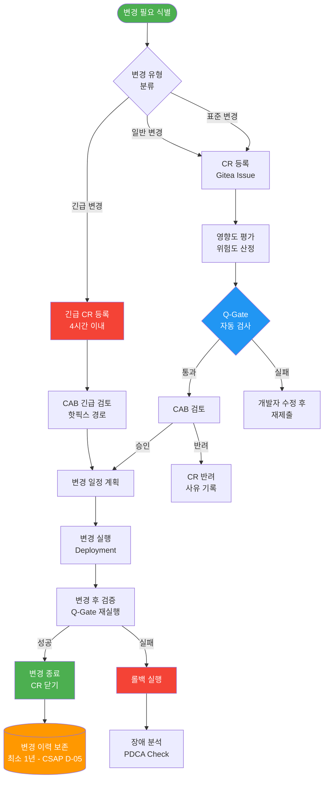
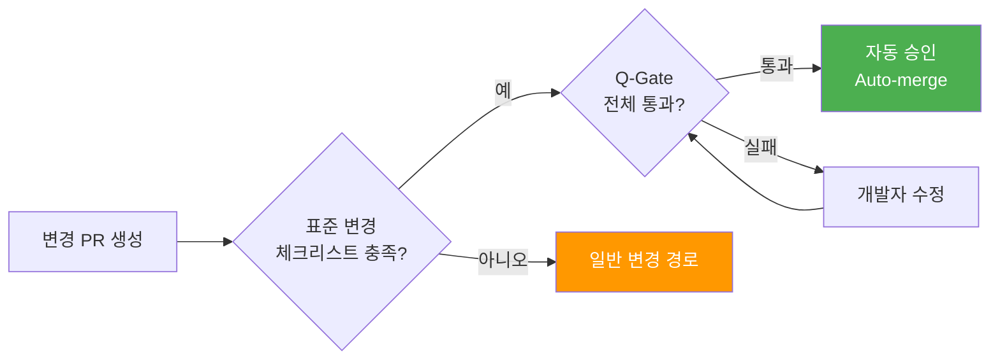
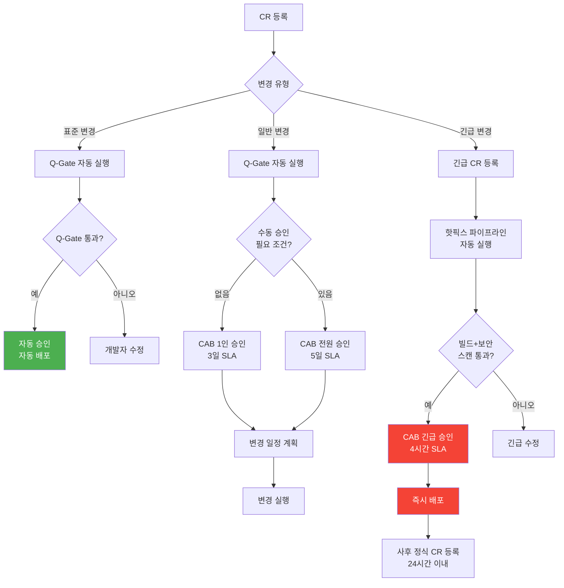
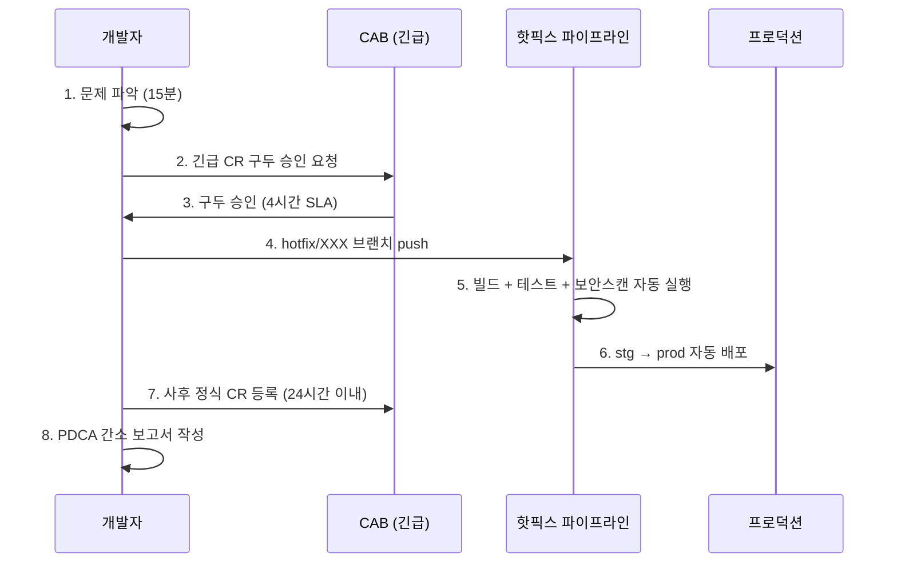
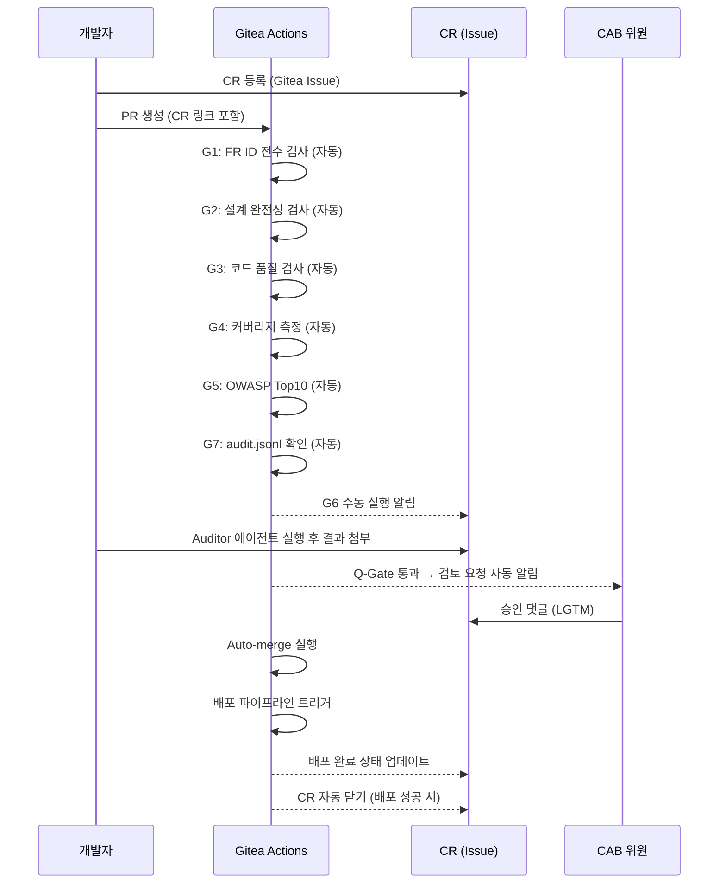

# 변경 관리 프로세스 — 공공기관 표준 절차

> **문서 ID**: ONBOARD-08-CM-07
> **버전**: 1.0.0 | **작성일**: 2026-04-12 | **대상**: 개발자, 기술 PM, 인프라 엔지니어
> **선행 학습**: `08-document-management/pdca/01-what-is-pdca.md`, `06-cicd/05-workflow-automation.md`
> **CSAP**: D-05 (변경 관리), D-06 (침해사고 관리), D-12 (시스템 개발 보안)
> **소요 시간**: 약 3시간

---

## 목차

1. [변경 관리란 무엇인가](#1-변경-관리란-무엇인가)
2. [변경 요청서(CR) 작성 방법](#2-변경-요청서cr-작성-방법)
3. [승인 프로세스](#3-승인-프로세스)
4. [PDCA와 변경 관리 통합](#4-pdca와-변경-관리-통합)
5. [CSAP 변경 관리 요건 (D-05)](#5-csap-변경-관리-요건-d-05)
6. [롤백 계획 작성 방법](#6-롤백-계획-작성-방법)
7. [변경 관리 도구](#7-변경-관리-도구)
8. [실전 체크리스트](#8-실전-체크리스트)
9. [변경 이력](#9-변경-이력)

---

## 1. 변경 관리란 무엇인가

### 1.1 공공기관 관점에서의 변경 관리

공공기관 정보시스템에서 "변경"이란 단순히 코드를 수정하는 행위가 아닙니다. 변경 관리(Change Management)는 **운영 중인 시스템에 가해지는 모든 변경 사항을 체계적으로 기록하고, 검토하고, 승인하고, 실행하고, 사후 검증하는 전 과정**입니다.

공공기관 시스템이 변경 관리를 특히 중시하는 이유는 세 가지입니다.

첫째, **국민 서비스 연속성**입니다. 행정 시스템의 중단은 민원인, 공무원의 업무를 직접 방해합니다. 승인 없는 변경 한 건이 전국 행정 서비스를 수 시간 중단시킬 수 있습니다.

둘째, **감리 의무**입니다. 행안부 정보시스템 감리기준(고시 제2023-1호)은 모든 변경 사항에 대한 변경 이력 보존을 의무화하고 있습니다. 변경 이력이 없으면 감리 결함으로 판정됩니다.

셋째, **CSAP 인증 요건**입니다. CSAP D-05 통제항목은 변경 관리 절차의 존재와 준수를 요구합니다. 변경 관리 절차 없이는 CSAP 인증을 받을 수 없습니다.

### 1.2 ITIL 변경 관리 vs 우리 프로젝트 적용

ITIL(IT Infrastructure Library)은 변경 관리의 국제 표준 프레임워크입니다. 이 프로젝트는 ITIL v4를 기반으로 하되, 공공기관 규제와 애자일 개발 방식에 맞게 경량화하였습니다.

| 항목 | ITIL v4 표준 | 이 프로젝트 적용 |
|------|------------|--------------|
| 변경 분류 | 표준/일반/긴급 | 동일 (3가지) |
| 변경 심의 위원회 | CAB 전체 회의 | 소규모 CAB (3인) + 자동 승인 |
| 변경 일정 계획 | 변경 달력 | PDCA MTU와 연동 |
| 승인 SLA | 7~14일 | 표준 3일, 긴급 4시간 |
| 문서 요건 | 상세 RFC 문서 | 경량화된 CR (Pull Request 활용) |
| 사후 검토 | PIR 회의 | Q-Gate 결과 + PDCA Check 단계 |

### 1.3 변경 관리 전체 흐름도



### 1.4 변경 유형 분류

이 프로젝트에서 모든 변경은 세 가지 유형 중 하나로 분류됩니다. 분류에 따라 승인 경로와 소요 시간이 달라집니다.

**표준 변경 (Standard Change)**

반복적이고 예측 가능한 변경으로, 사전에 승인된 절차를 따릅니다. 매번 CAB 검토가 필요 없습니다.

예시:
- 정기 보안 패치 (Renovate 자동 PR)
- 설정값 변경 (로그 레벨, 타임아웃 값)
- 문서 업데이트 (README, 온보딩 가이드)
- 테스트 코드 추가

승인 경로: Q-Gate 통과 → 자동 배포

**일반 변경 (Normal Change)**

신규 기능 추가, 아키텍처 변경, 비즈니스 로직 변경 등 위험도가 있는 변경입니다. CAB 검토가 필요합니다.

예시:
- 신규 API 엔드포인트 추가
- 데이터베이스 스키마 변경
- 외부 서비스 연동 추가
- 보안 정책 변경

승인 경로: CR 등록 → Q-Gate → CAB 검토 → 승인 → 변경 일정 계획 → 실행

**긴급 변경 (Emergency Change)**

프로덕션 장애 대응, 보안 취약점 즉시 패치 등 신속한 대응이 필요한 변경입니다.

예시:
- 프로덕션 서비스 중단 대응
- CVSS 9.0 이상 치명적 보안 취약점 즉시 패치
- 데이터 손상 방지를 위한 긴급 조치

승인 경로: 긴급 CR → 핫픽스 파이프라인 → 즉시 배포 → 사후 정식 CR 등록

---

## 2. 변경 요청서(CR) 작성 방법

### 2.1 CR 템플릿 (공공기관 표준)

CR(Change Request)은 Gitea Issue로 관리합니다. 아래 템플릿을 복사하여 사용하십시오.

```markdown
## 변경 요청서 (CR)

**CR 번호**: CR-{YYYY}-{NNN}
**작성일**: YYYY-MM-DD
**작성자**: {이름} ({담당 팀})
**변경 유형**: [ ] 표준 변경  [ ] 일반 변경  [ ] 긴급 변경

---

### 1. 변경 개요

**변경 제목**: {한 문장으로 변경 내용 요약}

**변경 이유 (WHY)**:
{왜 이 변경이 필요한가? 비즈니스/기술적 근거를 기술}

**연관 MTU/FR ID**:
- MTU: MTU-{번호}
- FR: FR-{모듈}.{번호}

---

### 2. 변경 상세 내용

**변경 대상 시스템/컴포넌트**:
- [ ] 애플리케이션 코드
- [ ] 데이터베이스 스키마
- [ ] 인프라 설정
- [ ] 보안 정책
- [ ] 문서

**변경 내용 상세**:
{변경할 내용을 구체적으로 기술. 파일 경로, 설정 키, SQL 등 포함}

**변경 전 상태 (AS-IS)**:
{현재 상태를 명확히 기술}

**변경 후 상태 (TO-BE)**:
{변경 후 기대되는 상태를 명확히 기술}

---

### 3. 영향도 분석

**영향 범위**:
- 영향받는 서비스: {서비스 목록}
- 영향받는 사용자: {사용자 그룹}
- 예상 중단 시간: {없음 / X분 / X시간}

**위험도 평가**:
| 위험 요소 | 발생 가능성 | 영향도 | 위험 수준 |
|---------|-----------|------|---------|
| {위험 1} | 낮음/중간/높음 | 낮음/중간/높음 | 낮음/중간/높음 |
| {위험 2} | ... | ... | ... |

**종합 위험도**: [ ] 낮음  [ ] 중간  [ ] 높음  [ ] 치명

---

### 4. 테스트 계획

**테스트 환경**: [ ] 개발(dev)  [ ] 스테이징(stg)  [ ] 프로덕션(prod)

**테스트 항목**:
- [ ] 단위 테스트 통과 (`npm test`)
- [ ] E2E 테스트 통과 (`npx playwright test`)
- [ ] 성능 테스트 (P99 < 500ms)
- [ ] 보안 스캔 통과 (Trivy, Semgrep)
- [ ] CSAP 관련 기능 검증

**Q-Gate 통과 확인**:
- [ ] G1: FR ID 전수
- [ ] G2: 설계 완전성
- [ ] G3: 코드 품질 + AgentShield
- [ ] G4: 테스트 커버리지 80%+
- [ ] G5: OWASP Top10
- [ ] G6: CSAP 100%
- [ ] G7: audit.jsonl 완비

---

### 5. 롤백 계획

**롤백 트리거**:
{어떤 상황에서 롤백을 실행할 것인가}

**롤백 절차**:
1. {첫 번째 롤백 단계}
2. {두 번째 롤백 단계}
3. {세 번째 롤백 단계}

**롤백 예상 소요 시간**: {X분}

**롤백 담당자**: {이름}

---

### 6. 배포 계획

**배포 일시**: YYYY-MM-DD HH:MM (KST)
**배포 담당자**: {이름}
**배포 방법**: [ ] 자동 (Q-Gate 통과 시) [ ] 수동 (kubectl apply)
**사전 공지 필요**: [ ] 예 (X시간 전 공지) [ ] 아니오

---

### 7. 사후 검증

**검증 항목**:
- [ ] 서비스 정상 동작 확인
- [ ] 에러 율 기준치 이하 (< 0.1%)
- [ ] 응답 시간 기준치 이하 (P99 < 500ms)
- [ ] 감사 로그 기록 확인

**검증 담당자**: {이름}
**검증 완료 기한**: YYYY-MM-DD HH:MM

---

### 8. 승인 이력

| 역할 | 이름 | 승인 일시 | 의견 |
|------|------|---------|------|
| CAB 의장 | | | |
| 보안 담당 | | | |
| 운영 담당 | | | |
```

### 2.2 필수 기재 항목

CR에서 누락하면 안 되는 항목들입니다. 감리 시 이 항목들의 누락은 결함으로 기록됩니다.

| 항목 | 누락 시 결과 |
|------|-----------|
| 변경 이유 (WHY) | CAB에서 자동 반려 |
| 영향도 분석 | 위험도 산정 불가 → 반려 |
| 롤백 계획 | CSAP D-05 위반 → 변경 불허 |
| Q-Gate 통과 여부 | 자동 배포 차단 |
| 승인 이력 | 감리 결함 (CSAP D-05) |

### 2.3 변경 위험도 평가 기준

위험도는 **발생 가능성 × 영향도** 매트릭스로 산정합니다.

```
                영향도
           낮음    중간    높음
발생   낮음  낮음    낮음    중간
가능   중간  낮음    중간    높음
성     높음  중간    높음    치명
```

**위험도별 처리 방침**:
- **낮음**: 표준 변경으로 처리 가능
- **중간**: 일반 변경, CAB 1인 승인
- **높음**: 일반 변경, CAB 전원 승인 + 보안 담당 필수
- **치명**: 변경 전면 재검토, 별도 위험 경감 계획 필수

### 2.4 실제 작성 예시 1: 기능 변경

다음은 AI 에이전트 핸들러에 새 기능을 추가하는 일반 변경의 CR 예시입니다.

```markdown
## 변경 요청서 (CR)

**CR 번호**: CR-2026-042
**작성일**: 2026-04-12
**작성자**: 홍길동 (AI 서비스 팀)
**변경 유형**: [x] 일반 변경

### 1. 변경 개요

**변경 제목**: AI RAG 핸들러에 응답 캐싱 기능 추가

**변경 이유**:
현재 동일 질문에 대해 매번 벡터 DB 검색 + LLM 호출이 발생하여
평균 응답 시간이 2.3초입니다. Redis 캐싱 도입으로 캐시 히트 시
응답 시간을 200ms 이하로 단축합니다.

**연관 MTU/FR ID**:
- MTU: MTU-N252 (AIOps RCA)
- FR: FR-N252.3 (응답 성능 최적화)

### 2. 변경 상세

**변경 대상**: platform/services/ai-service/src/handlers/ai-rag.handler.ts

**AS-IS**: 모든 RAG 요청에 대해 매번 벡터 검색 + LLM 호출
**TO-BE**: Redis 캐시 조회 → 미스 시 벡터 검색 + LLM 호출 → 캐시 저장

### 3. 영향도

- 영향받는 서비스: ai-service, (간접) redis
- 예상 중단 시간: 없음 (무중단 배포)
- 종합 위험도: [x] 낮음

### 5. 롤백 계획

**트리거**: 캐시 히트율 < 0%, 응답 오류율 > 0.5%
**절차**:
1. 환경 변수 CACHE_ENABLED=false 설정
2. ai-service 재시작 (kubectl rollout restart)
3. Redis 캐시 플러시 (redis-cli FLUSHDB)
**예상 소요 시간**: 3분
```

### 2.5 실제 작성 예시 2: 인프라 변경

```markdown
## 변경 요청서 (CR)

**CR 번호**: CR-2026-043
**작성일**: 2026-04-12
**작성자**: 이영희 (인프라 팀)
**변경 유형**: [x] 일반 변경 (DB 스키마 변경 포함)

### 1. 변경 개요

**변경 제목**: audit_logs 테이블 파티셔닝 적용 (월별 파티션)

**변경 이유**:
audit_logs 테이블이 2,000만 건을 초과하여 쿼리 성능이 저하되고 있습니다.
월별 파티셔닝 적용으로 최근 3개월 데이터 쿼리 시간을 12초 → 0.3초로 단축합니다.
CSAP D-06 감사 로그 1년 보존 요건도 파티션 단위 보관으로 효율화합니다.

**연관**: CSAP D-06 (감사 로그 보존)

### 4. 테스트 계획

- [x] stg 환경에서 파티션 마이그레이션 사전 실행
- [x] 마이그레이션 소요 시간 측정: 약 45분 (stg 기준)
- [ ] 마이그레이션 중 쓰기 동작 확인 (트리거 기반)
- [x] 파티션 후 쿼리 성능 검증

### 5. 롤백 계획

**트리거**: 마이그레이션 45분 초과, 오류 발생, 쓰기 실패
**절차**:
1. 마이그레이션 트랜잭션 ROLLBACK
2. 기존 테이블 구조 유지 확인
3. 애플리케이션 재시작 불필요 (온라인 변경)
**예상 소요 시간**: 즉시 (트랜잭션 롤백)

### 6. 배포 계획

**배포 일시**: 2026-04-15 02:00 (KST, 새벽 저트래픽 시간대)
**사전 공지**: 예 (1시간 전 이메일 공지, 쓰기 기능 일시 제한)
```

---

## 3. 승인 프로세스

### 3.1 변경 심의 위원회(CAB) 역할

CAB(Change Advisory Board)는 변경 요청을 검토하고 승인 여부를 결정하는 기구입니다. 이 프로젝트의 CAB는 경량화된 구성입니다.

| 역할 | 담당 | 책임 |
|------|------|------|
| CAB 의장 | 기술 PM | 변경 전체 승인, 일정 조율 |
| 보안 담당 | 보안 엔지니어 | CSAP 준수 검토, 보안 위험 평가 |
| 운영 담당 | SRE / DevOps | 가용성 영향 검토, 배포 일정 |

CAB는 물리적 회의가 아닌 **Gitea Issue 댓글로 비동기 승인**합니다. 3인 전원 LGTM(Looks Good To Me) 댓글이 달리면 승인입니다.

### 3.2 자동 승인 가능 변경 기준

Q-Gate 7단계를 모두 통과한 표준 변경은 CAB 수동 검토 없이 자동 승인됩니다.



자동 승인 가능 조건 (모두 충족 필요):
- 변경 유형이 표준 변경으로 분류됨
- 코드 변경 파일 수 10개 이하
- DB 스키마 변경 없음
- 보안 정책 변경 없음
- Q-Gate G1~G7 전체 통과
- 커버리지 80% 이상

### 3.3 수동 승인 필요 변경 기준

다음 중 하나에 해당하면 반드시 CAB 수동 검토가 필요합니다.

| 조건 | 이유 |
|------|------|
| DB 스키마 변경 (DDL) | 데이터 무결성 위험 |
| 보안 정책 변경 | CSAP 통제 항목 영향 |
| RBAC 권한 변경 | 접근 제어 위험 |
| 외부 서비스 연동 추가 | N2SF 데이터 분류 검토 필요 |
| 암호화 알고리즘 변경 | CSAP D-09 위반 가능 |
| 감사 로그 구조 변경 | CSAP D-06 위반 가능 |
| 프로덕션 직접 변경 | 중단 위험 |
| 위험도 높음/치명 | 추가 안전장치 필요 |

### 3.4 변경 유형별 승인 흐름도



---

## 4. PDCA와 변경 관리 통합

### 4.1 MTU 완료 시 자동 변경 관리 적용

이 프로젝트의 모든 개발 작업은 MTU(Minimum Task Unit) 단위로 수행됩니다. MTU 완료는 곧 변경 관리 사이클의 종료를 의미합니다.

```
MTU Plan 문서 작성
    ↓
MTU Design 문서 작성
    ↓
Implementer 에이전트 구현
    ↓
Q-Gate 통과 (G1~G7)
    ↓ [이 시점에 CR이 생성됨]
Pull Request = CR로 기능
    ↓
CAB 검토 (PR Review)
    ↓
머지 = 변경 승인 완료
    ↓
배포 = 변경 실행
    ↓
PDCA Check 단계 = 변경 후 검증
    ↓
MTU 완료 = CR 종료
```

### 4.2 PDCA 산출물이 CR로 전환되는 방법

PDCA의 각 단계는 변경 관리의 각 단계와 직접 매핑됩니다.

| PDCA 단계 | 변경 관리 단계 | 주요 산출물 |
|---------|------------|---------|
| Plan | 변경 요청 | MTU Plan 문서 = CR 근거 |
| Design | 변경 분석 | Design 문서 = 영향도 분석 |
| Do (Implement) | 변경 구현 | 코드 + 테스트 = 변경 내용 |
| Do (Q-Gate) | 변경 검증 | Q-Gate 결과 = 테스트 결과 |
| Do (Review) | 변경 승인 | PR Approval = CAB 승인 |
| Do (Deploy) | 변경 실행 | Deployment 로그 = 변경 실행 기록 |
| Check | 변경 후 검증 | 모니터링 결과 = 사후 검증 |
| Act | 변경 종료 | 완료 보고 = CR 종료 |

따라서 개발자는 **별도의 CR 시스템을 사용하지 않고** Gitea PR을 통해 변경 관리의 모든 요소를 충족할 수 있습니다.

### 4.3 긴급 변경(Hotfix)과 PDCA 간소화 버전

긴급 변경 시 PDCA의 일부 단계가 병합 또는 간소화됩니다.



간소화 버전 PDCA 체크리스트 (긴급 변경 전용):

```markdown
## 긴급 변경 PDCA 간소 체크리스트

- [ ] 문제 원인 파악 (5줄 이내)
- [ ] 변경 내용 설명 (10줄 이내)
- [ ] CAB 구두/메시지 승인 기록 (스크린샷)
- [ ] 핫픽스 파이프라인 통과 로그 첨부
- [ ] 배포 후 서비스 정상 확인 스크린샷
- [ ] 24시간 이내 정식 CR 등록 완료
```

---

## 5. CSAP 변경 관리 요건 (D-05)

### 5.1 변경 이력 보존 의무

CSAP D-05 통제항목은 변경 이력의 최소 1년 보존을 의무화합니다. 이 프로젝트에서는 세 가지 방법으로 변경 이력을 보존합니다.

**방법 1: Git 커밋 이력**

모든 코드 변경은 Git 커밋으로 영구 기록됩니다. 강제 푸시(force push)는 CLAUDE.md 절대 제약으로 금지되어 있어 이력 훼손이 불가능합니다.

```bash
# 특정 파일의 전체 변경 이력 조회
git log --follow -p platform/services/ai-service/src/handlers/ai-rag.handler.ts

# 특정 기간 변경 이력 조회 (CSAP 감사 시 활용)
git log --since="2026-01-01" --until="2026-04-12" --format="%H %ad %s" --date=short
```

**방법 2: Gitea Issues/PR 이력**

CR(Gitea Issue)과 PR의 모든 댓글, 승인, 리뷰가 Gitea 데이터베이스에 보존됩니다.

**방법 3: CHANGELOG.md**

사람이 읽을 수 있는 형식의 변경 이력입니다. 감리 시 가장 먼저 제출하는 문서입니다.

```markdown
## [v1.5.2] - 2026-04-12
### Added (일반 변경 CR-2026-042)
- AI RAG 핸들러 Redis 응답 캐싱 기능 추가

### Changed (표준 변경)
- Renovate 보안 패치: axios 1.6.8 → 1.7.2

### Fixed (긴급 변경 CR-2026-040)
- 프로덕션 메모리 누수 긴급 패치 (2026-04-10 03:20 KST)
```

### 5.2 변경 전후 보안 검사 필수

CSAP D-05는 변경 실행 전후 보안 검사를 요구합니다.

**변경 전 보안 검사** (Q-Gate G5 — OWASP Top10):

```yaml
# .gitea/workflows/quality-gate.yml 에서 자동 실행
g5-owasp:
  name: "[G5] OWASP Top10"
  steps:
    - name: Semgrep OWASP 스캔
      run: |
        semgrep --config=p/owasp-top-ten \
                --error \
                --json \
                --output=semgrep-results.json \
                platform/services/

    - name: npm 취약점 스캔
      run: pnpm audit --audit-level=high
```

**변경 후 보안 검사** (배포 후 자동 실행):

```yaml
# .gitea/workflows/deploy.yml 배포 후 단계
post-deploy-security-check:
  steps:
    - name: Trivy 컨테이너 스캔
      run: |
        trivy image --exit-code 1 \
                    --severity CRITICAL,HIGH \
                    $REGISTRY/$IMAGE:$VERSION

    - name: Falco 알림 확인 (1분)
      run: |
        # 배포 후 1분간 Falco 알림 없으면 정상
        sleep 60
        ALERTS=$(curl -s http://falcosidekick:2801/healthz)
        echo "Falco 상태: $ALERTS"
```

### 5.3 변경 실패 시 CSAP 기록 방법

변경이 실패하거나 롤백이 발생하면 반드시 감사 로그에 기록합니다.

```typescript
// platform/services/compliance-service/src/lib/audit.ts
import { logSecurityEvent } from './audit'

// 변경 실패 기록 예시
async function recordChangeFailure(
  crNumber: string,
  reason: string,
  rollbackExecuted: boolean
): Promise<void> {
  await logSecurityEvent('CHANGE_FAILURE', {
    crNumber,
    reason,
    rollbackExecuted,
    // CSAP D-05: 변경 실패 사유 및 롤백 여부 기록 의무
    csapRef: 'D-05-06',
    timestamp: new Date().toISOString(),
  })
}

// 변경 완료 기록 예시
async function recordChangeCompletion(
  crNumber: string,
  deployedVersion: string
): Promise<void> {
  await logSecurityEvent('CHANGE_COMPLETED', {
    crNumber,
    deployedVersion,
    csapRef: 'D-05-04',
    timestamp: new Date().toISOString(),
  })
}
```

`.claude/audit.jsonl` 예시:

```json
{"timestamp":"2026-04-12T14:30:00Z","event":"change-started","crNumber":"CR-2026-042","actor":"hong.gildong","target":"ai-rag.handler.ts"}
{"timestamp":"2026-04-12T14:45:00Z","event":"change-completed","crNumber":"CR-2026-042","version":"v1.5.2","result":"SUCCESS"}
```

### 5.4 감사 로그와 변경 관리 연동

감사 로그(audit.jsonl)는 변경 관리의 핵심 증빙 자료입니다. CSAP 감사 시 제출할 수 있는 형태로 유지되어야 합니다.

```bash
# 특정 CR의 모든 감사 로그 조회
grep '"crNumber":"CR-2026-042"' .claude/audit.jsonl

# 특정 기간의 변경 완료 이벤트 집계
grep '"event":"change-completed"' .claude/audit.jsonl | \
  python3 -c "import sys,json; [print(json.loads(l)['crNumber'], json.loads(l)['timestamp']) for l in sys.stdin]"
```

---

## 6. 롤백 계획 작성 방법

### 6.1 롤백 트리거 조건

롤백은 다음 조건 중 하나를 충족하면 즉시 실행합니다. 조건 확인을 위해 5분 동안 모니터링 후 판단합니다.

| 지표 | 정상 기준 | 롤백 트리거 |
|------|---------|-----------|
| HTTP 5xx 오류율 | < 0.1% | > 1% (1분 지속) |
| API 응답 시간 P99 | < 500ms | > 2000ms (2분 지속) |
| 서비스 가용성 | 99.9%+ | < 99% |
| Falco 치명 알림 | 0건 | 1건 이상 |
| Pod CrashLoopBackOff | 0개 | 1개 이상 |
| DB 연결 오류 | 0건 | 연속 5건 이상 |

### 6.2 DB 마이그레이션 롤백 방법

데이터베이스 스키마 변경은 롤백이 가장 복잡합니다. 이 프로젝트는 **Flyway** 마이그레이션 도구를 사용합니다.

**원칙**: 모든 Forward 마이그레이션(V{n}__)에는 반드시 Undo 마이그레이션(U{n}__)을 함께 작성합니다.

```sql
-- V20__add_cache_column.sql (Forward 마이그레이션)
ALTER TABLE ai_responses ADD COLUMN cache_key VARCHAR(255);
ALTER TABLE ai_responses ADD COLUMN cached_at TIMESTAMP;
CREATE INDEX idx_ai_responses_cache_key ON ai_responses(cache_key);

-- U20__add_cache_column.sql (Undo 마이그레이션)
DROP INDEX IF EXISTS idx_ai_responses_cache_key;
ALTER TABLE ai_responses DROP COLUMN IF EXISTS cached_at;
ALTER TABLE ai_responses DROP COLUMN IF EXISTS cache_key;
```

롤백 실행:

```bash
# Flyway Undo 실행 (가장 최근 마이그레이션 1개 롤백)
flyway -url=jdbc:postgresql://localhost:5432/saasdb \
       -user=$DB_USER \
       -password=$DB_PASS \
       undo

# 특정 버전까지 롤백
flyway -url=... undo -target=19
```

### 6.3 Kubernetes 배포 롤백 방법

Kubernetes 배포 롤백은 `kubectl rollout` 명령으로 즉시 실행 가능합니다.

```bash
# 이전 버전으로 즉시 롤백
kubectl rollout undo deployment/ai-service -n saas-apps

# 특정 버전으로 롤백
kubectl rollout undo deployment/ai-service \
  --to-revision=5 \
  -n saas-apps

# 롤백 진행 상태 확인
kubectl rollout status deployment/ai-service -n saas-apps

# 배포 이력 조회
kubectl rollout history deployment/ai-service -n saas-apps
```

Helm으로 배포된 경우:

```bash
# Helm 롤백
helm rollback ai-service 2 -n saas-apps

# Helm 이력 조회
helm history ai-service -n saas-apps
```

### 6.4 롤백 완료 확인 체크리스트

롤백을 실행한 후 반드시 다음 항목들을 확인합니다.

```markdown
## 롤백 완료 확인 체크리스트

**CR 번호**: CR-2026-XXX
**롤백 실행 일시**: YYYY-MM-DD HH:MM KST
**롤백 담당자**: {이름}

### 서비스 상태 확인
- [ ] kubectl get pods -n saas-apps → 모든 Pod Running 상태
- [ ] kubectl rollout status → Rolled back successfully
- [ ] Grafana 대시보드 오류율 < 0.1% 확인
- [ ] Grafana 응답 시간 P99 < 500ms 확인

### 기능 확인
- [ ] 핵심 API 엔드포인트 수동 테스트 (curl)
- [ ] 감사 로그 정상 기록 확인
- [ ] Falco 알림 없음 확인

### 데이터 확인 (DB 롤백 시)
- [ ] DB 스키마 이전 버전 확인 (describe table)
- [ ] 데이터 무결성 확인 (COUNT 비교)
- [ ] 트랜잭션 정상 처리 확인

### 사후 조치
- [ ] 롤백 사유 감사 로그 기록 완료
- [ ] CAB에 롤백 완료 통보
- [ ] 장애 분석 보고서 작성 시작 (24시간 이내)
- [ ] CSAP D-05 롤백 기록 완료
```

---

## 7. 변경 관리 도구

### 7.1 Gitea Issues로 CR 관리

이 프로젝트는 별도의 변경 관리 시스템 없이 Gitea의 기능을 활용합니다.

**CR 등록 방법:**

```bash
# Gitea CLI로 CR 등록
gh issue create \
  --repo gitea.example.kr/public-saas/ai-saas \
  --title "[CR-2026-042] AI RAG 핸들러 Redis 캐싱 추가" \
  --label "change-request,normal-change" \
  --body "$(cat docs/templates/cr-template.md)"
```

**CR 라벨 규칙:**

| 라벨 | 의미 |
|------|------|
| `change-request` | 모든 CR에 필수 |
| `standard-change` | 표준 변경 |
| `normal-change` | 일반 변경 |
| `emergency-change` | 긴급 변경 |
| `db-schema-change` | DB 스키마 변경 포함 |
| `security-policy-change` | 보안 정책 변경 포함 |
| `approved` | CAB 승인 완료 |
| `rejected` | CAB 반려 |
| `rolled-back` | 롤백 완료 |

### 7.2 PR 메타데이터를 CR로 활용

Pull Request의 Description이 CR 내용을 담고 있어야 합니다. 이 프로젝트의 PR 템플릿은 자동으로 CR 필수 항목을 포함합니다.

PR 설명에 포함할 CR 링크:

```markdown
## 변경 요청서 연결

- **CR**: #42 (CR-2026-042)
- **MTU**: MTU-N252
- **변경 유형**: 일반 변경

## Q-Gate 통과 현황

- [x] G1: FR ID 전수 (FR-N252.3 확인)
- [x] G2: 설계 완전성 (Design 문서 §3 참조)
- [x] G3: 코드 품질 (린트 통과)
- [x] G4: 테스트 커버리지 83%
- [x] G5: OWASP Top10 통과
- [x] G6: CSAP 100%
- [x] G7: audit.jsonl 업데이트 완료

## 롤백 계획

환경 변수 CACHE_ENABLED=false 설정 후 재시작 (3분 이내)
```

### 7.3 CHANGELOG.md 자동 생성 연동

이 프로젝트는 **conventional commits** 형식을 사용하여 CHANGELOG를 자동 생성합니다.

```bash
# CHANGELOG 자동 생성 (release-notes.yaml 워크플로우)
# 커밋 메시지 형식: feat(csap): CR-2026-042 AI RAG 캐싱 추가
```

CHANGELOG 자동 생성 규칙:

| 커밋 타입 | CHANGELOG 섹션 |
|---------|-------------|
| `feat:` | Added |
| `fix:` | Fixed |
| `refactor:` | Changed |
| `docs:` | Documentation |
| `perf:` | Performance |
| `security:` | Security |

수동 CHANGELOG 작성 방법:

```bash
# CHANGELOG.md에 변경 이력 추가 (자동 생성 불가 시)
cat >> CHANGELOG.md << 'EOF'

## [v1.5.2] - 2026-04-12

### Added
- AI RAG 핸들러 Redis 응답 캐싱 (CR-2026-042, FR-N252.3)

### Changed
- audit_logs 테이블 월별 파티셔닝 적용 (CR-2026-043)
EOF
```

---

## 8. 실전 체크리스트

### 변경 시작 전 체크리스트

```markdown
변경 시작 전 확인:
- [ ] Plan 문서가 완비되어 있는가?
- [ ] Design 문서가 완비되어 있는가?
- [ ] CR 번호가 발급되었는가?
- [ ] 변경 유형이 결정되었는가?
- [ ] 영향도 분석이 완료되었는가?
- [ ] 롤백 계획이 작성되었는가?
- [ ] CAB 승인이 완료되었는가? (일반/긴급 변경)
- [ ] 배포 담당자와 배포 일정을 협의하였는가?
- [ ] 사용자 공지가 필요한 경우 발송하였는가?
```

### 변경 실행 중 체크리스트

```markdown
변경 실행 중 확인:
- [ ] 핫픽스 파이프라인 또는 Q-Gate가 통과되었는가?
- [ ] 배포 로그를 모니터링하고 있는가?
- [ ] Grafana 대시보드를 열어두었는가?
- [ ] 롤백 명령을 클립보드에 복사해두었는가?
- [ ] 배포 담당자와 실시간 커뮤니케이션 중인가?
```

### 변경 완료 후 체크리스트

```markdown
변경 완료 후 확인:
- [ ] 서비스 정상 동작 확인 (5분 모니터링)
- [ ] 감사 로그에 변경 완료 기록되었는가?
- [ ] CHANGELOG.md가 업데이트되었는가?
- [ ] CR(Gitea Issue)이 닫혔는가?
- [ ] CAB에 완료 통보하였는가?
- [ ] PDCA Check 단계 문서가 작성되었는가?
- [ ] 발생한 이슈가 있으면 장애 분석 보고서가 작성되었는가?
```

---

## 9. 변경 관리 자동화 상세

### 9.1 Q-Gate와 변경 관리 자동화 연계

이 프로젝트는 Q-Gate 7단계가 모두 통과되면 변경 관리의 상당 부분이 자동화됩니다. 자동화 흐름을 이해하면 불필요한 수동 작업을 줄일 수 있습니다.



### 9.2 변경 관리 SLA 기준표

공공기관 SaaS 프레임워크에서 변경 관리의 SLA(Service Level Agreement)는 다음과 같습니다.

| 변경 유형 | CR 등록 | CAB 검토 | 배포 승인 | 총 소요 시간 |
|---------|--------|--------|--------|-----------|
| 표준 변경 | 즉시 | 자동 | 자동 | Q-Gate 통과 후 즉시 |
| 일반 변경 (저위험) | 즉시 | 3일 | CAB 승인 후 | 3~5일 |
| 일반 변경 (고위험) | 즉시 | 5일 | CAB 전원 + 보안 승인 | 5~7일 |
| 긴급 변경 | 즉시 | 4시간 | 긴급 승인 | 4~8시간 |

SLA 미준수 시 자동 에스컬레이션:
- 3일 초과: CAB 의장에게 알림
- 5일 초과: 팀장 에스컬레이션
- 7일 초과: 변경 자동 반려 → 재등록 필요

### 9.3 변경 관리 지표 (DORA Four Keys 연계)

변경 관리의 효율성은 DORA(DevOps Research and Assessment) Four Keys 지표로 측정합니다. `packages/dora-exporter`에서 자동 수집합니다.

| DORA 지표 | 변경 관리 의미 | 목표 |
|---------|------------|------|
| 배포 빈도 (DF) | CR 처리 속도 | 주 1회 이상 |
| 변경 리드 타임 (CLT) | CR 등록→배포 소요 시간 | 1일 이하 (표준 변경) |
| 변경 실패율 (CFR) | 롤백 발생 비율 | 15% 이하 |
| 복구 시간 (MTTR) | 롤백 완료 소요 시간 | 1시간 이하 |

DORA 지표 확인:

```bash
# dora-exporter가 수집한 변경 관리 지표 확인
kubectl port-forward svc/dora-exporter -n monitoring 9090:9090 &
sleep 2
curl -s http://localhost:9090/metrics | grep -E "dora_|change_"
```

### 9.4 변경 관리 교육 및 인증

공공기관 CSAP 인증을 위해 변경 관리 교육 이수 기록이 필요합니다.

**교육 이수 기준:**
- 신규 팀원: 이 문서 전체 읽기 + 실습 1회 완료
- 기존 팀원: 연 1회 변경 관리 절차 리뷰 참여
- CAB 위원: 추가로 ITIL v4 Foundation 자격증 권장

**자가 점검 테스트:**

1. 표준 변경과 일반 변경의 차이점은 무엇인가?
2. CAB 수동 검토가 필요한 변경 기준 5가지를 말하시오.
3. 롤백 트리거 조건 중 HTTP 5xx 오류율 기준은 몇 퍼센트인가?
4. DB 마이그레이션 롤백은 어떤 도구를 사용하는가?
5. CSAP D-05 요건에 따른 변경 이력 보존 기간은?

**정답:**
1. 표준 변경은 반복적이고 예측 가능하여 자동 승인 가능, 일반 변경은 CAB 검토 필요
2. DB 스키마 변경, 보안 정책 변경, RBAC 권한 변경, 외부 서비스 연동 추가, 암호화 알고리즘 변경
3. 1% 초과 (1분 지속)
4. Flyway Undo 마이그레이션
5. 최소 1년

---

## 10. 변경 이력

| 버전 | 일자 | 내용 | 작성자 |
|------|------|------|--------|
| 1.0.0 | 2026-04-12 | 최초 작성 — 변경 관리 전체 프로세스 | Implementer (Sonnet) |

---

*이 문서는 CSAP D-05 변경 관리 통제항목 준수를 위한 공공기관 표준 절차입니다. 변경 시 팀 전체와 협의 후 변경 이력에 기록하십시오.*
