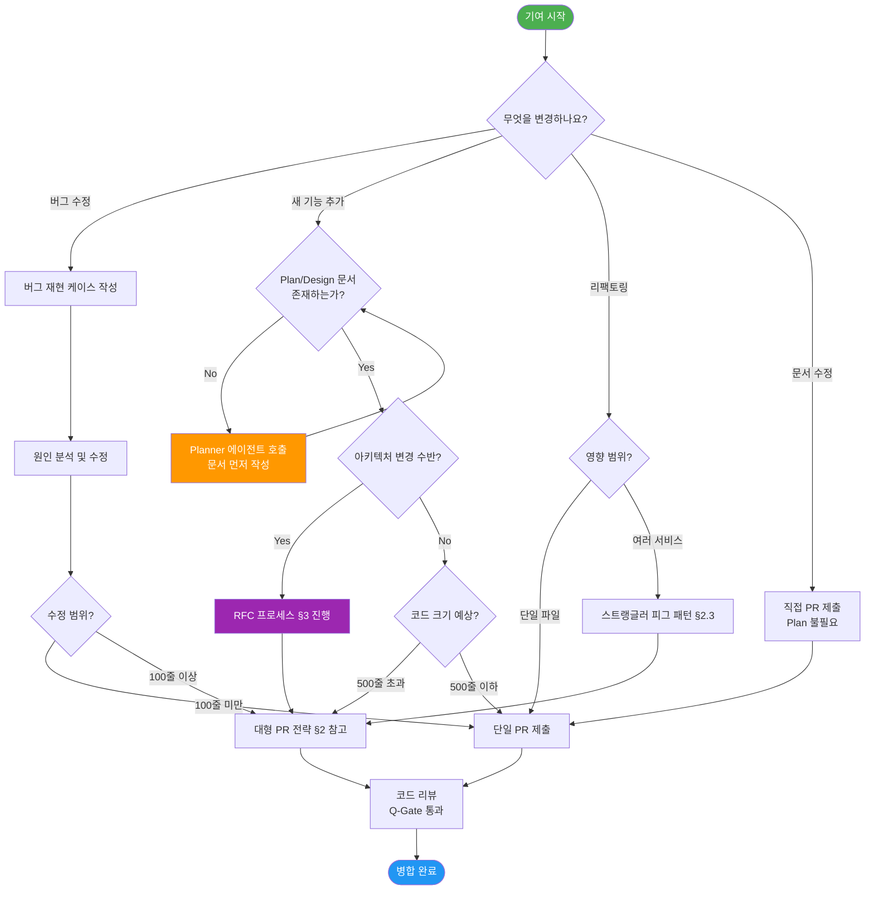
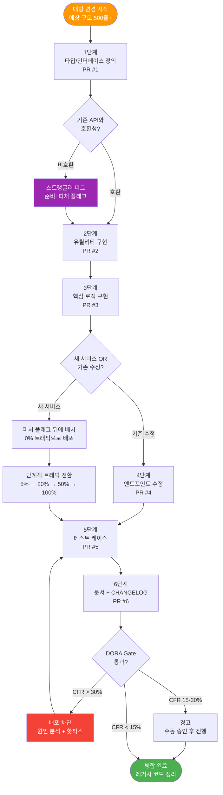
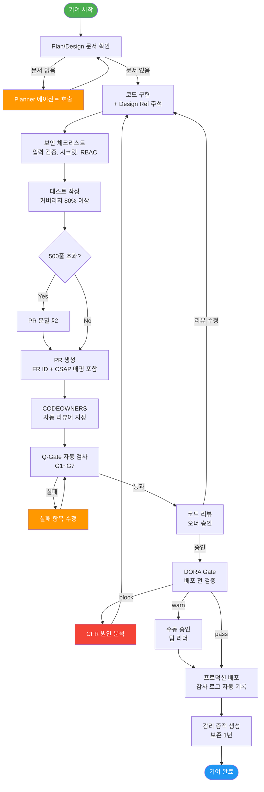

# 고급 기여 가이드 — 대형 PR, RFC 프로세스, 오픈소스 기여 원칙

> **문서 ID**: DOC-CONTRIB-09
> **버전**: 1.0.0 | **작성일**: 2026-04-13 | **작성자**: Implementer (Sonnet)
> **목적**: 공공기관 SaaS 프레임워크에 대규모 변경을 안전하게 기여하는 고급 전략과 프로세스를 안내합니다
> **선행 학습**: [07 — 변경 관리](./07-change-management.md), [08 — 온보딩 평가](./08-onboarding-assessment.md)

---

## 목차

1. [기여 철학](#1-기여-철학)
2. [대형 변경 PR 전략](#2-대형-변경-pr-전략)
3. [RFC 프로세스](#3-rfc-request-for-comments-프로세스)
4. [코드 오너십 CODEOWNERS](#4-코드-오너십-codeowners)
5. [피처 플래그 기반 안전한 기여](#5-피처-플래그-기반-안전한-기여)
6. [DORA Gate와 기여](#6-dora-gate와-기여)
7. [감리 기준 기여](#7-감리-기준-기여)
8. [변경 이력](#변경-이력)

---

## 1. 기여 철학

### 1.1 이 프로젝트의 기여 원칙

공공기관 SaaS 프레임워크는 일반 오픈소스 프로젝트와 다른 제약이 있습니다. 행안부 감리기준과 CSAP 인증 요건이 기여 방식에도 적용됩니다.

**핵심 원칙 5가지:**

| 원칙 | 설명 | 이유 |
|------|------|------|
| 작은 PR | 500줄 이하 단위로 분할 | 리뷰 집중도 + DORA CFR 감소 |
| 명확한 의도 | PR 제목에 FR ID 포함 | 감리 추적성 확보 |
| 감사 추적 | 모든 변경에 CSAP 매핑 | D-06 감사 로깅 요건 |
| 문서 선행 | Plan/Design 없는 구현 금지 | CLAUDE.md 절대 제약 |
| 테스트 동반 | 기능 코드 + 테스트 동시 제출 | Q-Gate G4 (커버리지 80%) |

### 1.2 기여해서는 안 되는 것들

```
절대 금지:
- 하드코딩된 API 키, 비밀번호, 토큰
- .env, secrets.*, *credential* 파일 커밋
- C/S 등급 데이터를 포함한 코드 (N2SF 위반)
- Plan/Design 문서 없는 신기능 코드
- git commit --no-verify (훅 우회)
- DROP TABLE, DELETE FROM (WHERE 없음)
```

### 1.3 기여 결정 트리



---

## 2. 대형 변경 PR 전략

### 2.1 왜 PR을 쪼개야 하는가

대형 PR(500줄 초과)은 다음 문제를 유발합니다.

| 문제 | 영향 | DORA 지표 영향 |
|------|------|----------------|
| 리뷰 집중도 저하 | 버그 통과율 증가 | CFR 상승 |
| 리뷰 시간 증가 | Change Lead Time 증가 | DLT 악화 |
| 충돌 위험 증가 | 통합 비용 증가 | MTTR 증가 |
| 롤백 어려움 | 장애 복구 복잡 | MTTR 증가 |

실제 데이터:
```
Google Engineering: PR 당 평균 수정 줄 수가 100줄 미만일 때
                   리뷰 속도 3배 + 결함 발견율 2배

이 프로젝트 DORA Gate: CFR > 30% → 배포 차단
                     CFR > 15% → 경고 + 수동 승인
```

### 2.2 500줄 PR 쪼개는 방법

**단계적 분할 원칙:**

```
큰 변경
  → 1단계: 타입/인터페이스 정의 (기반 계층)
  → 2단계: 유틸리티/헬퍼 함수
  → 3단계: 핵심 비즈니스 로직
  → 4단계: API 엔드포인트/라우터
  → 5단계: 테스트 케이스
  → 6단계: 문서 업데이트
```

**예시: AI 챗봇 기능 (총 2,000줄) 분할**

```
PR #1 (200줄): 타입 정의
  - ChatMessage 인터페이스
  - AIResponse 타입
  - DataGrade 열거형

PR #2 (300줄): PII 마스킹 유틸리티
  - pii-masker.ts
  - pii-masker.test.ts

PR #3 (250줄): Budget Guard
  - budget-guard.ts
  - budget-guard.test.ts

PR #4 (350줄): RAG 엔진 핵심 로직
  - rag-engine.ts 수정
  - vector-store.ts 수정

PR #5 (400줄): AI 챗 핸들러 + 라우터
  - ai-chat.handler.ts
  - routes.ts 수정

PR #6 (200줄): E2E 통합 테스트
  - ai-chat.e2e.test.ts

PR #7 (100줄): 문서 + OpenAPI 스펙
  - docs/api/ai-chat.yaml
```

각 PR은 독립적으로 배포 가능해야 합니다. PR #1~3은 피처 플래그 뒤에 배치하여 사용자에게 노출되지 않은 상태로 병합합니다.

### 2.3 스트랭글러 피그 패턴

기존 서비스를 새 서비스로 점진적 교체할 때 사용합니다. 완전한 재작성(Big Bang Rewrite)의 위험을 제거합니다.

```
기존 서비스 (레거시)
    ↓
    │  단계 1: 새 서비스 병렬 배포 (트래픽 0%)
    │  단계 2: 새 서비스로 일부 트래픽 (5% → 20% → 50%)
    │  단계 3: 레거시 기능 하나씩 새 서비스로 이전
    │  단계 4: 레거시 완전 차단 + 제거
    ↓
새 서비스 (완전 교체)
```

**구현 예시 — ai-service RAG 엔진 교체:**

```typescript
// platform/services/ai-service/src/lib/rag-engine.ts
// Design Ref: DOC-CONTRIB-09 §2.3 스트랭글러 피그
// CSAP: D-12 (단계적 배포)

import { createFeatureFlagClient } from '@public-saas/feature-flag-sdk'

const featureFlags = createFeatureFlagClient({
  apiUrl: process.env.UNLEASH_API_URL!,
  apiKey: process.env.UNLEASH_API_KEY!,
  appName: 'ai-service',
})
await featureFlags.initialize()

export async function queryRAG(
  query: string,
  tenantId: string,
): Promise<RAGResult> {
  const context: FeatureFlagContext = {
    userId: tenantId,
    tenantId,
    environment: process.env.NODE_ENV,
  }

  // 새 RAG 엔진 (스트랭글러 피그 단계 2-3)
  if (featureFlags.isEnabled('new-rag-engine-v2', context)) {
    return queryRAGV2(query, tenantId)  // 새 구현
  }

  // 기존 RAG 엔진 (레거시)
  return queryRAGV1(query, tenantId)
}
```

단계적 트래픽 전환:
```
Unleash 대시보드에서:
1주차: new-rag-engine-v2 플래그 → 5% 테넌트 활성화 (pilot 테넌트)
2주차: 20% → P99 레이턴시 < 500ms 확인 후 진행
3주차: 50% → 오류율 < 0.1% 유지 확인
4주차: 100% → 전체 전환 완료
5주차: queryRAGV1 코드 제거 (플래그 함께 제거)
```

### 2.4 대형 변경 분할 전략 흐름도



---

## 3. RFC (Request for Comments) 프로세스

### 3.1 RFC를 써야 하는 시점

모든 변경에 RFC가 필요한 것은 아닙니다. 아래 기준으로 판단합니다.

**RFC 필수 상황:**

```
아키텍처 변경:
  - 새 외부 의존성 추가 (npm 패키지, K8s 컴포넌트)
  - 서비스 간 통신 방식 변경 (REST → gRPC 등)
  - 데이터베이스 스키마 대규모 변경
  - 새 마이크로서비스 추가

보안 영향:
  - 인증/권한 모델 변경
  - CSAP 통제항목에 영향을 주는 변경
  - 외부 AI API 연동 방식 변경 (N2SF 관련)

운영 영향:
  - SLO 목표치 변경
  - 데이터 보존 정책 변경
  - 배포 파이프라인 구조 변경

팀 영향:
  - 코딩 컨벤션 변경
  - 개발 도구 교체
  - 문서 구조 개편
```

**RFC 불필요 상황:**

```
- 버그 수정 (기존 동작 복원)
- 성능 최적화 (외부 동작 변화 없음)
- 테스트 추가/개선
- 문서 오타/명확화
- 기존 기능의 내부 리팩토링 (인터페이스 유지)
```

### 3.2 RFC 템플릿 완전 가이드

RFC 파일 저장 위치: `docs/rfcs/RFC-{YYYY}-{NNN}-{slug}.md`

예: `docs/rfcs/RFC-2026-003-vector-store-migration.md`

```markdown
# RFC-2026-003: 벡터 스토어 마이그레이션 — pgvector에서 Qdrant로

**상태**: 검토 중 | 제안 | 수락 | 거부 | 구현 중 | 완료
**작성자**: {이름}
**작성일**: 2026-04-13
**최종 검토일**: {날짜}
**구현 PR**: {링크} (수락 후 작성)

---

## 요약 (1-2 문장)

pgvector 기반 벡터 검색의 성능 한계를 극복하기 위해 Qdrant로 마이그레이션합니다.
이를 통해 P99 RAG 검색 레이턴시를 450ms → 80ms로 개선합니다.

## 동기 (왜 지금 필요한가)

현재 상황:
- 벡터 DB: PostgreSQL + pgvector
- 현재 P99 레이턴시: 450ms (SLO 500ms 위험 수준)
- 예상 성장: 테넌트당 문서 수 3개월 내 3배 증가 예정

변경 없을 경우 결과:
- P99 레이턴시 > 500ms → SLO 위반
- 에러 버짓 소진 가속화

## 상세 설계

### 새 아키텍처

{설계 다이어그램 또는 설명}

### 마이그레이션 계획

1단계 (1주): Qdrant 클러스터 설치 + 검증
2단계 (2주): 기존 벡터 데이터 이중 쓰기 (pgvector + Qdrant)
3단계 (3주): 읽기 전환 (피처 플래그로 5% → 100%)
4단계 (4주): pgvector 읽기 제거

### API 변경

없음 (내부 구현만 변경)

## 대안 검토

| 대안 | 장점 | 단점 | 기각 사유 |
|------|------|------|-----------|
| pgvector 쿼리 최적화 | 추가 인프라 없음 | 개선 한계 (200ms 예상) | 목표 미달성 |
| Milvus | 성능 우수 | 운영 복잡도 증가, CSAP 인증 미확인 | 인증 리스크 |
| Qdrant | 성능 + 간단한 운영 | 새 의존성 | **선택** |

## 영향 분석

**영향받는 컴포넌트**:
- `platform/services/ai-service/src/lib/vector-store.ts`
- `platform/services/ai-service/src/lib/rag-engine.ts`

**CSAP 영향**: D-09 (암호화) — Qdrant REST API는 TLS 1.3 사용 확인 완료
**N2SF 영향**: 없음 (외부 전송 없음, 내부 서비스)

**운영 영향**:
- 신규 K8s 리소스: qdrant Deployment, PVC 50Gi
- 메모리 추가 필요: 노드당 +4Gi

## 구현 계획

**예상 공수**: 3 Sprint (6주)
**담당자**: {이름}
**검토자**: {이름}

## 미해결 질문 (Open Questions)

1. Qdrant 고가용성 구성 — 복제본 수 결정 필요
2. 기존 pgvector 데이터 마이그레이션 스크립트 성능 검증

## 참고 자료

- Qdrant 공식 문서: https://qdrant.tech/documentation/
- pgvector 성능 벤치마크: {링크}
- 유사 마이그레이션 사례: {링크}
```

### 3.3 RFC 검토 → 수락 → 구현 프로세스

```
작성자 제출
    ↓
공개 검토 기간 (최소 5 영업일)
  - 모든 팀원 댓글 허용
  - 기술 검토: 아키텍처 팀
  - 보안 검토: 보안 팀
  - 운영 검토: 인프라 팀
    ↓
수정 (필요시)
    ↓
최종 결정 회의 (온라인)
  - 참석: 각 팀 대표 1명 이상
  - 의결: 만장일치 OR 승인 60% + 거부권 없음
    ↓
상태 업데이트
  - 수락: RFC 상태 → "수락", 구현 PR 링크 추가
  - 거부: RFC 상태 → "거부", 거부 사유 문서화
    ↓
구현 (수락 시)
  - 구현 PR에 RFC 번호 참조: "Implements RFC-2026-003"
  - 구현 완료 시 RFC 상태 → "완료"
```

**RFC 상태 전환표:**

```
제안 → 검토 중 → 수락 → 구현 중 → 완료
                   ↘ 거부
```

### 3.4 RFC 검토 댓글 작성 가이드

```markdown
# 좋은 RFC 댓글 예시

## 기술적 우려
"§3 마이그레이션 계획에서 2단계 이중 쓰기 중 장애 발생 시
데이터 일관성 보장 방법이 명시되지 않았습니다.
pgvector에 쓰기 성공 후 Qdrant 쓰기 실패 시 어떻게 처리하나요?"

## 대안 제안
"Qdrant 대신 pgvector에 HNSW 인덱스를 추가하면
200ms 레이턴시로 SLO를 2년은 더 유지할 수 있습니다.
새 의존성 추가 비용과 비교 검토 부탁드립니다."

## 보안 지적
"D-09 암호화 항목에서 Qdrant 내부 데이터 암호화(at-rest)를
언급하지 않았습니다. MinIO처럼 SSE가 필요합니다."

# 나쁜 RFC 댓글 예시 (지양)
"좋은 아이디어 같아요!" (구체성 없음)
"저는 반대입니다." (사유 없음)
"더 좋은 방법이 있어요." (대안 미제시)
```

---

## 4. 코드 오너십 (CODEOWNERS)

### 4.1 CODEOWNERS 파일 작성법

`CODEOWNERS` 파일은 Gitea에서 PR 자동 검토자를 지정합니다. 지정된 오너 없이는 PR 병합이 차단됩니다.

파일 위치: `.gitea/CODEOWNERS`

```
# .gitea/CODEOWNERS
# 공공기관 SaaS 프레임워크 코드 오너십
# 형식: {경로 패턴} {@오너1} {@오너2}
# 하위 경로 규칙이 상위를 덮어씁니다 (가장 아래 일치 규칙 적용)

# 전체 기본 오너 (모든 PR 최소 리뷰)
* @platform-team-lead

# 플랫폼 핵심 서비스
/platform/services/ai-service/           @ai-service-owner @security-reviewer
/platform/services/security-service/     @security-team-lead @ciso-delegate
/platform/services/security-monitor-service/ @security-team-lead

# 공통 패키지
/packages/feature-flag-sdk/              @platform-architect
/packages/dora-exporter/                 @sre-team-lead
/packages/ml-pipeline/                   @ml-team-lead

# 인프라 설정
/platform/k8s/                           @infra-team-lead @sre-team-lead
/.gitea/workflows/                        @cicd-owner @sre-team-lead

# 보안 관련 파일 — 전문가 필수 리뷰
/platform/services/*/src/lib/audit.ts   @security-team-lead @ciso-delegate
/.claude/rules/csap-compliance.md        @ciso-delegate @compliance-officer
/docs/02-design/*/security-*.md         @security-team-lead

# DORA Gate 워크플로우 — SRE 리뷰 필수
/.gitea/workflows/dora-gate.yml          @sre-team-lead @platform-architect

# 문서
/docs/                                   @tech-writer @platform-architect
/docs/guides/onboarding/07-security/    @security-team-lead @tech-writer
```

### 4.2 서비스별 오너 정의

| 서비스/패키지 | 1차 오너 | 2차 오너 | 비상 연락처 |
|---------------|----------|----------|-------------|
| ai-service | @ai-service-owner | @platform-architect | 보안팀 채널 |
| security-service | @security-team-lead | @ciso-delegate | CISO 직통 |
| security-monitor-service | @security-team-lead | @sre-team-lead | CISO 직통 |
| feature-flag-sdk | @platform-architect | @platform-team-lead | 플랫폼 채널 |
| dora-exporter | @sre-team-lead | @platform-architect | SRE 채널 |
| k8s 인프라 | @infra-team-lead | @sre-team-lead | 인프라 채널 |
| CI/CD 워크플로우 | @cicd-owner | @sre-team-lead | SRE 채널 |

### 4.3 오너 부재 시 대리 검토 프로세스

1차 오너가 휴가/병가 등으로 7일 이상 부재 시:

```
단계 1: 오너가 팀 채널에 부재 예고 + 대리인 지정
단계 2: CODEOWNERS에 임시 대리인 추가 PR 제출
         (단기 변경이므로 RFC 불필요)
단계 3: 대리인이 리뷰 기간 동안 오너 권한 행사
단계 4: 오너 복귀 후 CODEOWNERS 원상복구
```

대리 지정 PR 예시:

```diff
# .gitea/CODEOWNERS
- /platform/services/ai-service/ @ai-service-owner @security-reviewer
+ /platform/services/ai-service/ @ai-service-deputy @security-reviewer
# NOTE: @ai-service-owner 휴가 2026-04-14~21, 대리: @ai-service-deputy
```

**긴급 병합 (오너 연락 불가 + 크리티컬 버그):**

```
조건: 프로덕션 장애 + 오너 연락 2시간 이상 불가
절차:
  1. 팀 리더 승인 (서면)
  2. 보안팀 승인 (보안 관련 파일인 경우)
  3. 병합 후 사후 검토 (48시간 이내)
  4. 감사 로그 수동 기록 (.claude/audit.jsonl)
```

### 4.4 리뷰 SLA

| 변경 유형 | 목표 응답 | 목표 완료 |
|-----------|-----------|-----------|
| 버그 수정 (프로덕션) | 2시간 | 24시간 |
| 보안 패치 | 1시간 | 4시간 |
| 기능 추가 | 24시간 | 5 영업일 |
| 문서 변경 | 48시간 | 7 영업일 |
| RFC 검토 | 24시간 | 5 영업일 |

---

## 5. 피처 플래그 기반 안전한 기여

### 5.1 실제 feature-flag-sdk 분석

`packages/feature-flag-sdk/src/index.ts`의 실제 구현을 살펴봅니다.

**핵심 인터페이스:**

```typescript
// Design Ref: MTU-N234 SS4
// Plan SC: FR-FF.3
export interface IFeatureFlagClient {
  initialize(): Promise<void>
  isEnabled(flagName: string, context?: FeatureFlagContext): boolean
  getVariant(flagName: string, context?: FeatureFlagContext): string | undefined
  getActiveFlags(): string[]
  destroy(): void
}
```

**중요한 SDK 특성:**

```typescript
// 실제 코드의 안전 기본값
isEnabled(flagName: string, _context?: FeatureFlagContext): boolean {
  if (!this.initialized) {
    // 미초기화 시 false 반환 — 안전한 기본값
    process.stderr.write(...)
    return false
  }
  // 캐시 미스 시 false (안전한 기본값)
  const cached = this.flagCache.get(flagName)
  if (cached !== undefined) return cached
  return false  // 기본값 false
}
```

이 설계가 중요한 이유: **플래그 미설정 = 기능 비활성화**입니다. 새 기능을 배포해도 플래그를 켜기 전까지는 아무도 사용하지 못합니다.

**CSAP D-09 준수 확인:**

```typescript
// API 키 하드코딩 방지 검증 (실제 코드)
if (!config.apiKey || config.apiKey.startsWith('sk-') || config.apiKey.length < 10) {
  throw new Error('유효한 API 키를 환경 변수에서 제공해야 합니다 (하드코딩 금지 - CSAP D-09)')
}
```

### 5.2 새 기능을 플래그 뒤에 배치하는 패턴

**패턴 1: API 엔드포인트 전환**

```typescript
// platform/services/ai-service/src/routes.ts
// Design Ref: DOC-CONTRIB-09 §5.2
// Plan SC: FR-FF.3

import { createFeatureFlagClient, FeatureFlagContext } from '@public-saas/feature-flag-sdk'

const flags = createFeatureFlagClient({
  apiUrl: process.env.UNLEASH_API_URL!,
  apiKey: process.env.UNLEASH_API_KEY!,
  appName: 'ai-service',
})
await flags.initialize()

app.post('/api/ai/chat', async (req, res) => {
  const { tenantId, userId } = extractFromJwt(req)

  const context: FeatureFlagContext = {
    userId,
    tenantId,
    environment: process.env.NODE_ENV,
    properties: {
      tier: req.user.tier,
    },
  }

  // 새 기능 (피처 플래그 제어)
  if (flags.isEnabled('ai-chat-v2', context)) {
    return handleChatV2(req, res)  // 새 핸들러
  }

  // 기존 기능 (폴백)
  return handleChatV1(req, res)
})
```

**패턴 2: UI 컴포넌트 전환**

```typescript
// platform/apps/portal/src/components/AIChatWidget.tsx
// Design Ref: DOC-CONTRIB-09 §5.2

import { useFeatureFlag } from '@public-saas/feature-flag-sdk/react'

export function AIChatWidget() {
  const isChatV2Enabled = useFeatureFlag('ai-chat-widget-v2', {
    tenantId: user.tenantId,
  })

  if (isChatV2Enabled) {
    return <AIChatWidgetV2 />
  }

  return <AIChatWidgetV1 />
}
```

**패턴 3: A/B 테스트 (variant 활용)**

```typescript
// getVariant 활용 — 실제 SDK 메서드
const variant = flags.getVariant('rag-algorithm', context)

switch (variant) {
  case 'bm25':
    return queryWithBM25(query)
  case 'hybrid':
    return queryWithHybrid(query)
  default:
    return queryWithSemanticOnly(query)
}
```

### 5.3 플래그 정리 정책 (3개월 후 제거)

피처 플래그가 영구 기술 부채가 되지 않도록 명시적 제거 정책을 따릅니다.

**플래그 생명주기:**

```
[생성] → [점진적 활성화] → [100% 활성화] → [정리 대상] → [제거]
    ↑           ↑                ↑               ↑
  배포 시     배포 후        안정화 후       3개월 경과
  0% 시작   5%→20%→100%    대기 2주        주석 달기
```

**플래그 정리 체크리스트:**

```typescript
// 플래그 제거 전 확인 사항 주석 템플릿
// NOTE: FEATURE FLAG 정리 대상
// 플래그명: ai-chat-v2
// 생성일: 2026-01-15
// 100% 활성화일: 2026-02-01
// 정리 예정일: 2026-05-01 (3개월 후)
// 담당자: @ai-service-owner
//
// 제거 절차:
// 1. Unleash에서 플래그 비활성화 + 아카이브
// 2. 코드에서 if (flags.isEnabled('ai-chat-v2')) 블록 제거
// 3. V1 폴백 코드 제거 (더 이상 사용 안 함)
// 4. 이 주석 제거
// 5. PR 제목에 "chore: remove feature flag ai-chat-v2" 포함
```

**자동 플래그 만료 알림:**

```bash
# 주간 자동 실행 — 만료 예정 플래그 탐지
# .gitea/workflows/feature-flag-hygiene.yml에 추가 가능

find /data/ai-saas/platform -name "*.ts" -exec \
  grep -l "isEnabled\|getVariant" {} \; | \
  xargs grep -n "NOTE: FEATURE FLAG 정리 대상" | \
  awk -F: '{print $1 ":" $2}' > /tmp/flags-to-clean.txt

# 만료 플래그가 있으면 이슈 자동 생성
if [ -s /tmp/flags-to-clean.txt ]; then
  cat /tmp/flags-to-clean.txt | while read line; do
    echo "정리 대상 플래그: $line"
  done
fi
```

---

## 6. DORA Gate와 기여

### 6.1 실제 dora-gate.yml 분석

`.gitea/workflows/dora-gate.yml`은 배포 시 DORA 메트릭을 확인하여 배포 허용 여부를 결정합니다.

**게이트 판정 로직 (실제 코드):**

```yaml
# Design Ref: MTU-N251 Design §3.7
# Plan SC: FR-N251.8
# CFR 기반 배포 차단 기준:
# - CFR > 30% → block (배포 차단)
# - CFR > 15% → warn (경고 + 수동 승인)
# - CFR ≤ 15% → pass (자동 승인)

if [ "${CFR_INT}" -gt 30 ] 2>/dev/null; then
  echo "result=block"
  echo "::error::DORA 게이트 차단: 변경 실패율 ${CFR}% > 30%"
  exit 1
elif [ "${CFR_INT}" -gt 15 ]; then
  echo "result=warn"
  echo "::warning::DORA 게이트 경고: 변경 실패율 ${CFR}% > 15%"
else
  echo "result=pass"
fi
```

**감사 로그 기록 패턴 (실제 코드):**

```bash
# 배포 차단 시 감사 로그 자동 기록
echo "{\"timestamp\":\"$(date -u +%Y-%m-%dT%H:%M:%SZ)\",
      \"actor\":\"dora-gate\",
      \"action\":\"DEPLOY_BLOCKED\",
      \"detail\":\"CFR=${CFR}%,namespace=${namespace}\",
      \"csap_ref\":\"D-12\"}" >> ".claude/audit.jsonl"
```

### 6.2 Change Lead Time을 단축하는 기여 습관

Change Lead Time = 첫 커밋 시간 ~ 프로덕션 배포 시간

**단축 전략:**

```
일반적인 리드타임 병목:
  [첫 커밋] → 2일 → [PR 생성] → 3일 → [리뷰] → 1일 → [병합] → 4일 → [배포]
  총 10일 리드타임

개선 후:
  [첫 커밋] → 0일 → [PR 생성] → 1일 → [리뷰] → 0일 → [병합] → 0일 → [배포]
  총 1일 리드타임
```

**구체적 습관:**

```
1. 코드 작성 즉시 Draft PR 생성 (첫 커밋 → 즉시 PR)
   git push origin feat/FR-1.1-ai-chat
   # Gitea에서 "Create Pull Request" → "Draft"

2. 리뷰어를 즉시 지정 (PR 생성과 동시에)
   리뷰어: CODEOWNERS 자동 지정 + 추가 1명

3. 작은 PR = 빠른 리뷰 (500줄 이하 유지)

4. CI/CD 병렬화 활용 (이미 구성됨)
   - 린트, 테스트, 빌드가 병렬 실행
   - 대기 시간 최소화

5. 리뷰 피드백 즉각 반영 (수신 후 4시간 이내)
```

**dora_lead_time_seconds 확인:**

```bash
# 현재 리드타임 확인
curl -s "http://prometheus.monitoring.svc:9090/api/v1/query" \
  --data-urlencode "query=histogram_quantile(0.50, dora_lead_time_seconds_bucket) / 3600" \
  | jq '.data.result[0].value[1]'
# 반환값: 시간 단위 P50 리드타임
```

### 6.3 Deployment Frequency 높이는 방법 (소형 PR)

**배포 빈도 목표:**

| DORA 등급 | 배포 빈도 | 이 프로젝트 목표 |
|-----------|-----------|-----------------|
| Elite | 하루 여러 번 | 일 1회 이상 |
| High | 주 1회 ~ 일 1회 | 현재 목표 |
| Medium | 월 1회 ~ 주 1회 | 최소 기준 |
| Low | 월 1회 미만 | 개선 필요 |

**소형 PR 체크리스트:**

```bash
# PR 크기 확인 스크립트
git diff main --stat | tail -1
# 예: "15 files changed, 320 insertions(+), 45 deletions(-)"
# 총 변경 줄 수 = 320 + 45 = 365줄 (적절)

# 500줄 초과 시 분할 필요
CHANGED=$(git diff main --shortstat | grep -o '[0-9]* insertion' | grep -o '[0-9]*')
DELETED=$(git diff main --shortstat | grep -o '[0-9]* deletion' | grep -o '[0-9]*')
TOTAL=$((CHANGED + DELETED))
if [ $TOTAL -gt 500 ]; then
  echo "WARNING: PR 크기 ${TOTAL}줄 — 분할을 권장합니다"
fi
```

**Trunk-Based Development 적용:**

```
피처 브랜치 → main 병합 주기 단축
  - 피처 브랜치 수명: 최대 2일 (이후 병합 또는 리베이스)
  - 피처 플래그로 미완성 기능 숨기기
  - main은 항상 배포 가능한 상태 유지
```

---

## 7. 감리 기준 기여

### 7.1 행안부 감리기준 준수 기여 가이드

공공기관 SaaS는 행안부 정보시스템 감리기준(고시 제2023-1호)에 따라 감리를 받습니다. 기여 코드가 감리 지적을 받지 않으려면 아래 기준을 준수해야 합니다.

**감리 빈출 지적 사항:**

| 지적 유형 | 비율 | 예방법 |
|-----------|------|--------|
| 요구사항 추적성 미비 | 35% | PR에 FR ID 필수 명시 |
| 테스트 케이스 누락 | 25% | 커버리지 80% 이상 |
| 보안 취약점 (OWASP) | 20% | Q-Gate G5 필수 통과 |
| 문서-코드 불일치 | 15% | Design 참조 주석 |
| 감사 로그 불완전 | 5% | 모든 민감 작업 로깅 |

### 7.2 PR에 CSAP 매핑 주석 추가 방법

**코드 주석 패턴:**

```typescript
// Design Ref: §{섹션} — {결정 근거}
// Plan SC: {성공 기준 ID}
// CSAP: {통제항목} ({항목명})
// N2SF: {규칙 번호} ({규칙명, 해당 시})

// 예시:
export async function logSecurityEvent(
  action: string,
  metadata?: Record<string, unknown>
): Promise<void> {
  // Design Ref: DESIGN-MTU-P15 §3.2 — 보안 이벤트 중앙 로깅
  // Plan SC: FR-SEC.1
  // CSAP: D-06 (침해사고 관리 — 감사 로그)
  await auditLogger.log({
    actor: 'system:security-service',
    action,
    // ...
  })
}
```

**PR 설명 템플릿:**

```markdown
## 변경 요약
{1-3줄 요약}

## 관련 요구사항
- FR ID: FR-{모듈}.{번호}
- Plan 문서: docs/01-plan/features/{파일}.plan.md
- Design 문서: docs/02-design/features/{파일}.design.md

## CSAP 매핑
| 변경 내용 | CSAP 통제항목 | 충족 방법 |
|-----------|--------------|-----------|
| JWT 검증 강화 | D-08 (접근 통제) | RS256 알고리즘 고정 |
| 감사 로그 추가 | D-06 (침해사고 관리) | logSecurityEvent 호출 |

## 테스트 방법
1. `npm test -- --testPathPattern={파일명}`
2. 커버리지: `npm run test:coverage`
   - 현재: __% (목표: 80% 이상)

## 체크리스트
- [ ] 설계 문서 참조 주석 추가
- [ ] CSAP 통제항목 매핑 확인
- [ ] 입력 검증 (Zod 스키마)
- [ ] 하드코딩 시크릿 없음
- [ ] 감사 로그 추가 (민감 작업 시)
- [ ] 테스트 커버리지 80% 이상
```

### 7.3 감리 결함 방지 체크리스트

코드 제출 전 이 체크리스트를 완료해야 합니다.

**요구사항 추적성 (감리 지적 1위):**

```bash
# FR ID가 코드에 있는지 확인
grep -r "Plan SC:" platform/services/ packages/ | grep "FR-"

# 미추적 새 함수 탐지 (Design Ref 없는 export)
grep -r "^export" platform/services/ packages/ | \
  grep -v "// Design Ref:" | \
  grep -v "// NOTE:" | \
  head -20
```

**테스트 커버리지 (감리 지적 2위):**

```bash
# 커버리지 측정
npm run test:coverage

# 임계값 미달 시 실패
# jest.config.ts:
# coverageThreshold: { global: { lines: 80 } }
```

**보안 코드 검토 (감리 지적 3위):**

```bash
# SQL 인젝션 위험 패턴 탐지
grep -r "SELECT.*\${" platform/ packages/  # 문자열 결합 탐지

# 하드코딩 시크릿 탐지
grep -r "apiKey.*=.*['\"]sk-" platform/ packages/
grep -r "password.*=.*['\"]" platform/ packages/
```

**문서-코드 일치 확인 (감리 지적 4위):**

```bash
# API 엔드포인트 목록 추출 (코드)
grep -r "app\.\(get\|post\|put\|delete\)" platform/services/ | \
  grep -v test | \
  awk '{print $1}' > /tmp/code-endpoints.txt

# API 문서 목록 추출 (Design)
grep -r "^#### \(GET\|POST\|PUT\|DELETE\)" docs/02-design/ | \
  awk '{print $2, $3}' > /tmp/doc-endpoints.txt

# 차이 확인
diff /tmp/code-endpoints.txt /tmp/doc-endpoints.txt
```

**감사 로그 완전성 (감리 지적 5위):**

```bash
# 민감 작업(delete, admin, 사용자 데이터 조회)에
# 감사 로그 호출이 있는지 확인
grep -r "delete\|admin\|personalData" platform/services/ | \
  grep -v "logSecurityEvent\|auditLog" | \
  grep -v test | \
  grep -v "//.*Design Ref"
```

### 7.4 감리 증적 자료 생성

감리 시 제출해야 하는 증적 자료를 자동 생성합니다.

```bash
# 구현 완료 증적 자료 생성
# (각 기능 구현 완료 후 실행)

FEATURE_ID="FR-2.1"
IMPL_DATE="2026-04-13"

cat > /tmp/impl-evidence-${FEATURE_ID}.md << EOF
# 구현 완료 증적

- **요구사항 ID**: ${FEATURE_ID}
- **구현 완료일**: ${IMPL_DATE}
- **구현 파일**:
$(git diff main --name-only | head -20 | sed 's/^/  - /')

## 테스트 결과
$(npm test -- --passWithNoTests 2>&1 | tail -5)

## 코드 커버리지
$(npm run test:coverage 2>&1 | grep "All files" || echo "측정 필요")

## 감사 추적
$(tail -5 .claude/audit.jsonl | jq -r '.action + " | " + .timestamp')
EOF

echo "증적 저장: /tmp/impl-evidence-${FEATURE_ID}.md"
```

### 7.5 기여 흐름 종합 요약



---

## 변경 이력

| 버전 | 일자 | 내용 | 작성자 |
|------|------|------|--------|
| 1.0.0 | 2026-04-13 | 최초 작성 — 대형 PR, RFC, CODEOWNERS, 피처 플래그, DORA Gate, 감리 기여 가이드 | Implementer (Sonnet) |
