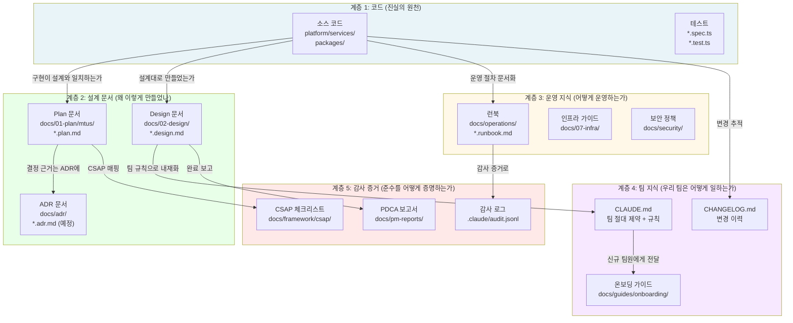
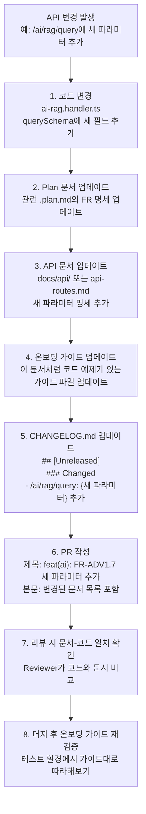
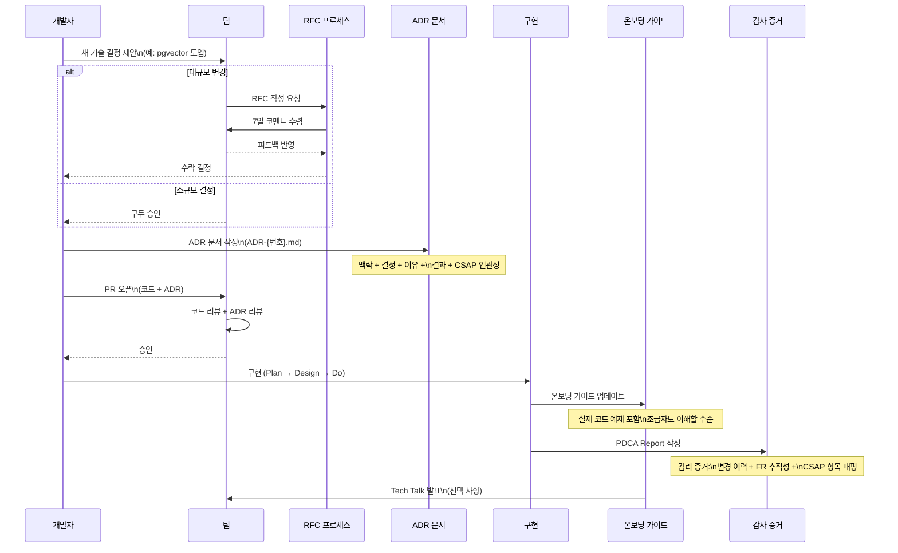

# 11장: 지식 관리 완전 가이드 — 팀 위키, 기술 부채, ADR, 런북 체계화

> **문서 ID**: ONBOARD-08-11
> **버전**: 1.0.0 | **작성일**: 2026-04-13 | **작성자**: Implementer (Sonnet)
> **선행 학습**: `08-document-management/06-technical-writing.md`, `08-document-management/pdca/02-writing-plan.md`
> **소요 시간**: 2~3시간
> **관련 파일**: `/data/ai-saas/CLAUDE.md`, `/data/ai-saas/docs/` 디렉토리 구조
> **대상 독자**: 신규 개발자, 팀 리더, 문서 관리 담당자 (경력 무관)

---

## 목차

1. [지식 관리란 무엇인가 — 초급자를 위한 설명](#1-지식-관리란-무엇인가)
2. [지식 관리 생태계 다이어그램](#2-지식-관리-생태계-다이어그램)
3. [ADR 아키텍처 결정 기록 작성법](#3-adr-아키텍처-결정-기록-작성법)
4. [기술 부채 관리 — 분류·우선순위·PDCA 연동](#4-기술-부채-관리)
5. [런북 체계화 — 15개 템플릿 가이드](#5-런북-체계화)
6. [팀 위키 구조 — docs/ 분석 및 개선 제안](#6-팀-위키-구조)
7. [CLAUDE.md 분석 — AI 지시 문서 작성법](#7-claudemd-분석)
8. [온보딩 가이드 유지보수 — 품질 저하 방지](#8-온보딩-가이드-유지보수)
9. [문서-코드 추적성 유지 — API 변경 시 자동 업데이트](#9-문서-코드-추적성-유지)
10. [지식 공유 문화 구축 — Tech Talk, RFC, 포스트모템](#10-지식-공유-문화-구축)
11. [지식 관리 워크플로우 시퀀스 다이어그램](#11-지식-관리-워크플로우)
12. [지식 관리 성숙도 평가 체크리스트](#12-지식-관리-성숙도-평가)
13. [변경 이력](#13-변경-이력)

---

## 1. 지식 관리란 무엇인가

### 1.1 공공기관 SaaS에서 지식 관리가 중요한 이유

소규모 프로젝트에서는 "핵심 개발자 한 명이 모든 것을 알고 있다"는 상태가 일시적으로 작동합니다. 공공기관 SaaS에서는 이 상태가 치명적인 위험 요소입니다.

**버스 팩터(Bus Factor) 문제**: 핵심 개발자 한 명이 갑자기 팀을 떠나면 시스템 운영이 불가능해집니다. 공공기관 시스템은 5~10년 이상 운영되므로, 초기 개발자가 모두 교체될 수 있습니다.

**감리 요건**: 행안부 정보시스템 감리기준은 "시스템이 문서화된 설계대로 구현되었는가"를 검증합니다. 구두로만 전달된 설계 결정은 감리 증거가 되지 않습니다.

**CSAP 인증 유지**: CSAP 인증은 최초 취득보다 연간 갱신이 더 어렵습니다. 담당자가 교체되어도 인증 요건이 유지되려면 지식이 문서에 내재화되어야 합니다.

### 1.2 지식의 3가지 형태

| 형태 | 설명 | 위험도 | 관리 방법 |
|------|------|--------|---------|
| 암묵적 지식 | 개인 머릿속에만 있는 노하우 | 매우 높음 (버스 팩터) | 문서화, 짝 프로그래밍 |
| 명시적 지식 | 문서, 코드에 기록된 지식 | 낮음 | 갱신 프로세스 운영 |
| 체화된 지식 | 팀 문화, 관행으로 자리잡은 지식 | 중간 (이직률 영향) | 온보딩 프로세스 |

이 장은 **암묵적 지식을 명시적 지식으로 전환하는 체계**를 다룹니다.

---

## 2. 지식 관리 생태계 다이어그램

### 2.1 지식 계층 구조

코드에서 감사 증거까지, 이 프로젝트의 지식은 5개 계층으로 구성됩니다.



### 2.2 각 계층의 책임

**계층 1 (코드)**: 시스템이 실제로 무엇을 하는지를 정의합니다. 진실의 원천(Source of Truth)입니다.

**계층 2 (설계 문서)**: "왜 이렇게 구현했는가"를 기록합니다. 6개월 후 코드를 다시 볼 때, 또는 새 팀원이 합류했을 때 의사결정 배경을 이해하는 데 필수입니다.

**계층 3 (운영 지식)**: "이 시스템을 어떻게 운영하는가"를 기록합니다. 장애 발생 시 런북이 없으면 처음부터 분석해야 합니다.

**계층 4 (팀 지식)**: "우리 팀은 어떻게 일하는가"를 기록합니다. CLAUDE.md가 핵심 문서입니다.

**계층 5 (감사 증거)**: "우리가 규정을 준수하고 있음을 어떻게 증명하는가"를 기록합니다. 감사 시 즉시 제출할 수 있어야 합니다.

---

## 3. ADR 아키텍처 결정 기록 작성법

### 3.1 ADR이란

ADR(Architecture Decision Record, 아키텍처 결정 기록)은 중요한 기술 결정을 기록하는 짧은 문서입니다. 나중에 "왜 이렇게 만들었지?"라는 질문에 답하기 위해 존재합니다.

**ADR이 필요한 상황**:
- 여러 기술 옵션 중 하나를 선택할 때
- 기존 방식을 버리고 새 방식을 도입할 때
- 보안/성능 트레이드오프가 있는 결정을 내릴 때
- 팀 전체에 영향을 미치는 코딩 컨벤션을 정할 때

### 3.2 ADR 필수 섹션

```markdown
# ADR-{번호}: {결정 제목}

**날짜**: YYYY-MM-DD
**상태**: 제안됨 | 수락됨 | 폐기됨 | 대체됨 (ADR-{번호}로)
**결정자**: {팀 또는 담당자}

## 맥락 (Context)
이 결정이 필요하게 된 배경과 상황을 설명합니다.
해결해야 할 문제가 무엇인가?

## 결정 (Decision)
어떤 선택을 했는가?

## 이유 (Rationale)
왜 이 선택을 했는가? 고려한 대안은 무엇인가?

## 결과 (Consequences)
이 결정으로 발생하는 긍정적/부정적 영향은?
앞으로 이 결정에 의존하는 것들은?

## CSAP/N2SF 연관성 (공공기관 전용)
이 결정이 CSAP 항목 또는 N2SF 요건과 어떻게 연관되는가?
```

### 3.3 실제 ADR 예제 3개

#### ADR-001: 벡터 데이터베이스로 pgvector 선택

```markdown
# ADR-001: 벡터 데이터베이스로 pgvector 선택

**날짜**: 2026-03-15
**상태**: 수락됨
**결정자**: 플랫폼 아키텍처팀

## 맥락

RAG(검색 증강 생성) 기능을 구현하기 위해 문서 청크의 임베딩 벡터를 저장하고
빠르게 검색할 수 있는 저장소가 필요합니다.

후보:
1. pgvector (PostgreSQL 확장)
2. Pinecone (외부 클라우드 서비스)
3. Weaviate (오픈소스 벡터 DB)
4. Chroma (경량 벡터 DB)

## 결정

pgvector를 사용합니다. 현재 구현은 JSON 컬럼에 임베딩을 저장하는 순수
TypeScript 구현으로 시작하여, 나중에 pgvector 확장으로 마이그레이션합니다.

```typescript
// vector-store.ts 현재 구현
// NOTE: 미사용. SVC-AI-2026 Phase 구현 시 활성화 예정.
// PostgreSQL JSON 컬럼 기반 — pgvector 없이도 작동
export async function semanticSearch(
  queryEmbedding: number[],
  tenantId: string,
  ...
```

## 이유

**Pinecone 탈락 이유**: 외부 클라우드 서비스 사용 금지 (CLAUDE.md 절대 제약).
공공기관 데이터를 외부 벡터 DB에 저장하면 N2SF 위반.

**Weaviate/Chroma 탈락 이유**: 별도 인프라 관리 부담. 현재 플랫폼은 PostgreSQL
을 이미 운영 중이므로 추가 서비스 없이 기능 구현이 가능.

**pgvector 선택 이유**:
1. 기존 PostgreSQL 인프라 재사용 — 운영 복잡도 증가 없음
2. ACID 트랜잭션 지원 — 데이터 일관성 보장
3. tenantId 컬럼과 결합한 Row-Level Security 지원 — 멀티테넌트 격리
4. 온프레미스 k3s 클러스터에서 완전 자체 운영 가능

## 결과

긍정적:
- 외부 서비스 의존성 없음 (CSAP 외부 서비스 감사 위험 제거)
- 기존 DB 백업/복구 절차 그대로 적용 가능
- PostgreSQL 쿼리 최적화 도구 활용 가능

부정적:
- 수백만 벡터 규모에서 pgvector의 IVFFlat 인덱스 튜닝 필요
- 초기에는 코사인 유사도를 TypeScript로 계산하므로 성능 제한

## CSAP/N2SF 연관성

- CSAP D-09: 저장 데이터 암호화 — PostgreSQL 암호화 설정으로 충족
- N2SF N-05: 외부 AI 서비스 전송 금지 요건 — pgvector는 내부 저장소이므로 해당 없음
- CSAP INFR-1: 자체 인프라 운영 요건 충족
```

#### ADR-002: 비동기 컨텍스트 전파에 AsyncLocalStorage 채택

```markdown
# ADR-002: 요청 컨텍스트 전파에 AsyncLocalStorage 채택

**날짜**: 2026-03-20
**상태**: 수락됨
**결정자**: 백엔드 개발팀

## 맥락

각 HTTP 요청마다 고유한 requestId, tenantId, userId를 모든 하위 함수 호출에서
접근할 수 있어야 합니다. Fastify의 request 객체는 핸들러에서는 접근 가능하지만,
라이브러리 함수, 감사 로거 등 깊은 곳에서는 접근이 어렵습니다.

해결 방법 후보:
1. 함수 인자로 직접 전달 (Prop Drilling)
2. AsyncLocalStorage (Node.js 내장)
3. 전역 변수 (Thread-local 모방)

## 결정

AsyncLocalStorage를 사용하여 요청 컨텍스트를 전파합니다.

```typescript
import { AsyncLocalStorage } from 'node:async_hooks';

export const requestContext = new AsyncLocalStorage<{
  requestId: string;
  tenantId: string;
  userId: string;
  ip: string;
}>();
```

## 이유

**Prop Drilling 탈락**: 함수 시그니처가 모두 바뀌어야 하고,
라이브러리 코드에서 사용 불가능.

**전역 변수 탈락**: Node.js는 단일 프로세스 내에서 여러 요청을 동시 처리하므로
전역 변수에 요청 컨텍스트를 저장하면 요청 간 데이터 혼합 발생.

**AsyncLocalStorage 선택**: Node.js 16+에서 정식 지원하는 비동기 컨텍스트
전파 메커니즘. async/await 체인 전체에서 컨텍스트 유지.

## 결과

긍정적:
- 감사 로거가 항상 현재 요청의 tenantId에 접근 가능
- 함수 시그니처 오염 없음
- 멀티테넌트 격리 실수 방지 (테넌트 혼합 차단)

부정적:
- 개념이 처음에는 이해하기 어려움 (새 팀원 온보딩 자료 필요)
- Worker Thread 환경에서 컨텍스트 전파 별도 처리 필요

## CSAP/N2SF 연관성

- CSAP D-06: 감사 로그의 tenantId 자동 포함으로 추적성 강화
- CSAP D-08: 요청 컨텍스트로 접근 통제 일관성 보장
```

#### ADR-003: JWT 접근 토큰 만료 시간 15분 설정

```markdown
# ADR-003: JWT 접근 토큰 만료 시간 15분 설정

**날짜**: 2026-03-25
**상태**: 수락됨
**결정자**: 보안 아키텍처팀, CSAP 준수 검토

## 맥락

JWT 접근 토큰의 만료 시간을 결정해야 합니다. 만료 시간은 보안과 사용성의
트레이드오프입니다.

- 너무 짧으면: 사용자가 자주 재로그인해야 함 (사용성 저하)
- 너무 길면: 토큰 탈취 시 공격 가능 시간이 길어짐 (보안 위험)

공공기관 SaaS의 경우 개인정보 처리 시스템으로 CSAP D-08 세션 관리 요건 적용.

## 결정

- 접근 토큰(Access Token): 15분 만료
- 갱신 토큰(Refresh Token): 7일 만료
- 최대 동시 세션: 3개
- 로그아웃 시: 토큰 블랙리스트 등록 (Redis)

## 이유

CSAP D-08 세션 관리 통제항목은 "적절한 세션 만료 시간 설정"을 요구합니다.
NIST SP 800-63B와 공공기관 보안 가이드라인 참조:

- 고위험 시스템 (금융, 개인정보): 15분 이하 권고
- 일반 업무 시스템: 30분 이하 권고
- 현 시스템: 개인정보 처리 포함 → 15분 적용

15분 만료 + 7일 갱신 토큰 조합은 OWASP Session Management Cheat Sheet
권고 패턴입니다.

## 결과

긍정적:
- CSAP D-08 세션 관리 요건 충족
- 토큰 탈취 시 피해 시간 최소화 (최대 15분)
- OWASP Top 10 A07 (인증 실패) 위험 감소

부정적:
- 프론트엔드에서 자동 토큰 갱신 로직 구현 필요
- Redis 블랙리스트 관리 부담 (7일 TTL로 자동 정리)

## CSAP/N2SF 연관성

- CSAP D-08-03: 세션 유효 시간 제한 — 15분으로 충족
- CSAP D-08-04: 재인증 요건 — 갱신 토큰으로 자동 처리
- CSAP D-08-05: 동시 세션 제한 — 3개로 설정
```

---

## 4. 기술 부채 관리

### 4.1 기술 부채란

**기술 부채(Technical Debt)**는 "지금 빠른 방법"을 선택함으로써 "나중에 더 많은 시간을 써야 하는" 상태입니다. 은행 빚처럼 이자가 붙습니다. 방치하면 갚기가 점점 어려워집니다.

### 4.2 기술 부채 4가지 분류

| 유형 | 설명 | 예시 | 위험도 |
|------|------|------|--------|
| 설계 부채 | 잘못된 아키텍처 결정 | 모놀리식을 MSA로 전환 실패, 순환 의존성 | 매우 높음 |
| 코드 부채 | 낮은 코드 품질 | 중복 코드, 긴 함수, 의미없는 변수명 | 높음 |
| 테스트 부채 | 불충분한 테스트 | 커버리지 30%, 핵심 로직 테스트 없음 | 높음 |
| 문서 부채 | 최신화되지 않은 문서 | 코드는 바뀌었는데 API 문서는 1년 전 | 중간 |

### 4.3 이 프로젝트의 기술 부채 관리 도구

CLAUDE.md와 deadcode-policy.md에 정의된 자동화 도구:

```bash
# 미사용 export 탐지 (TypeScript)
npx ts-prune --error

# 미사용 npm 패키지 탐지
npx depcheck

# 일괄 실행
npm run audit:dead-code

# 주간 자동 실행 (Claude Code /loop)
# /loop 7d npm run audit:dead-code
```

### 4.4 기술 부채 우선순위 결정 매트릭스

모든 부채를 즉시 해결할 수는 없습니다. 아래 매트릭스로 우선순위를 결정합니다.

```
우선순위 = 영향도 × 발생 빈도 / 해결 비용

                   낮은 영향     높은 영향
빠른 해결          | C급 부채  |  A급 부채 |
                   | 시간 있을 때 | 즉시 처리 |
느린 해결          | D급 부채  |  B급 부채 |
                   | 방치 가능  | 계획 수립 |
```

**A급 부채 (즉시 처리)**:
- CSAP 위반으로 이어지는 보안 부채
- 장애 발생 경로의 오류 처리 누락
- 테넌트 격리 로직의 버그

**B급 부채 (Sprint 계획 수립)**:
- 벡터 저장소의 TypeScript 코사인 계산 → pgvector 마이그레이션
- Prisma 모델 미생성 상태 (`// NOTE: 미사용 — SVC-AI-2026 스키마 추가 시`)
- 테스트 커버리지 80% 미달 모듈

**C급 부채 (시간 있을 때)**:
- 코드 스타일 개선 (80줄 초과 함수 분리)
- 변수명 명확화
- 주석 보강

**D급 부채 (방치 가능)**:
- 개발 환경에서만 사용하는 임시 스크립트의 미사용 변수

### 4.5 기술 부채와 PDCA 연동

기술 부채 해결 작업도 PDCA 사이클을 따릅니다.

```
1. 탐지: npm run audit:dead-code 또는 Reviewer 에이전트 발견
2. 분류: 4가지 유형 분류 + A/B/C/D 우선순위
3. Plan: FR ID 부여 (예: FR-DEBT.1: Prisma 모델 마이그레이션)
4. Do: 구현
5. Check: 린트 통과 + 테스트 통과 + Q-Gate G1~G7
6. Report: CHANGELOG.md 업데이트
7. Archive: 부채 목록에서 제거
```

---

## 5. 런북 체계화

### 5.1 런북이란

**런북(Runbook)**은 운영 중 발생하는 반복적 작업이나 장애를 처리하기 위한 단계별 절차서입니다. "이 경보가 울리면, 이렇게 한다"를 문서화합니다.

런북이 없으면 새벽 3시 장애 대응 시 무엇을 해야 할지 모릅니다.

### 5.2 런북 필수 섹션

```markdown
# RB-{번호}: {런북 제목}

**버전**: 1.0.0
**최종 검증일**: YYYY-MM-DD
**검증자**: {담당자}
**평균 처리 시간**: {분}

## 1. 대상 상황
언제 이 런북을 사용하는가?
발동 조건: {알림 이름 / 임계값}

## 2. 영향 범위
무엇이 영향을 받는가?
- 서비스: {영향받는 서비스 목록}
- 사용자: {영향받는 사용자 유형}
- SLO: {어떤 SLO가 위반되는가}

## 3. 전제 조건
이 런북을 실행하기 전에 갖춰야 할 것
- [ ] kubectl 접근 권한
- [ ] {필요한 권한/도구}

## 4. 단계별 절차
### 4.1 즉시 확인 (0~5분)
```bash
# 상태 확인 명령어
kubectl get pods -n {namespace}
```
예상 결과: {무엇을 봐야 하는가}

### 4.2 진단 (5~15분)
{상세 진단 절차}

### 4.3 복구 (15~30분)
{복구 절차}

## 5. 에스컬레이션 기준
언제 다음 단계로 올리는가?
- 30분 내 해결 안 되면: {담당자/팀}에 연락
- 서비스 완전 중단 시: {긴급 연락망}

## 6. 사후 처리
- [ ] 감사 로그 확인
- [ ] 포스트모템 작성 (주요 장애 시)
- [ ] 런북 내용 업데이트 (절차가 틀렸다면)

## 7. 관련 런북
- RB-{번호}: {관련 런북}
```

### 5.3 15개 런북 템플릿 작성 가이드

| 번호 | 런북 제목 | 발동 조건 | 우선순위 |
|------|---------|---------|--------|
| RB-01 | AI 서비스 응답 없음 | HTTP 502/503, 지연 30초+ | P1 |
| RB-02 | PostgreSQL 연결 실패 | DB 커넥션 풀 소진, 연결 오류 | P1 |
| RB-03 | 임베딩 API 타임아웃 | 임베딩 생성 15초 초과 | P2 |
| RB-04 | LLM API 429 Rate Limit | LLM 호출 429 응답 | P2 |
| RB-05 | Redis 세션 저장소 장애 | JWT 갱신 실패 | P1 |
| RB-06 | k3s 노드 장애 | 노드 NotReady 상태 | P1 |
| RB-07 | 디스크 사용률 90%+ | 디스크 경보 발생 | P2 |
| RB-08 | 감사 로그 저장 실패 | audit-service 오류 | P2 |
| RB-09 | CSAP 스캔 실패 | 보안 점검 실패 | P2 |
| RB-10 | 테넌트 격리 오류 의심 | 크로스 테넌트 접근 감지 | P1 |
| RB-11 | 인증서 만료 임박 | TLS 인증서 30일 미만 | P2 |
| RB-12 | Grafana/Prometheus 장애 | 모니터링 시스템 응답 없음 | P3 |
| RB-13 | 배포 롤백 | 신규 배포 후 에러율 급증 | P1 |
| RB-14 | 개인정보 유출 의심 | N2SF 위반 경보 다수 발생 | P1 |
| RB-15 | 정기 CSAP 증거 수집 실패 | 자동화 파이프라인 오류 | P3 |

### 5.4 런북 작성 실전 예시 — RB-03: 임베딩 API 타임아웃

```markdown
# RB-03: 임베딩 API 타임아웃 대응

**버전**: 1.0.0
**최종 검증일**: 2026-04-13
**검증자**: 플랫폼 운영팀
**평균 처리 시간**: 15~30분

## 1. 대상 상황

RAG 문서 수집 또는 질의 처리 중 임베딩 생성이 15초를 초과하거나
AI 서비스 로그에 다음 메시지가 반복될 때:

```
ERROR: RAG ingest 실패 — embedding generation timeout
WARN: generateEmbedding timeout after 15000ms
```

Grafana 경보: `ai-service:embedding_latency_p99 > 15000ms`

## 2. 영향 범위

- 서비스: AI Service (ai-service:3100) RAG 기능
- 사용자: RAG 문서 수집 및 질의 기능 이용자
- SLO: RAG 응답 시간 p99 < 10초 위반 가능성

## 3. 단계별 절차

### 3.1 즉시 확인 (0~5분)

```bash
# AI 서비스 Pod 상태 확인
kubectl get pods -n public-saas -l app=ai-service

# 최근 에러 로그 확인
kubectl logs -n public-saas deploy/ai-service --tail=100 | grep -i "embed"

# 임베딩 모델 설정 확인
kubectl exec -n public-saas deploy/ai-service -- \
  env | grep -E "EMBED|LLM|AI_GATEWAY"
```

### 3.2 임베딩 모델 엔드포인트 직접 확인 (5~15분)

```bash
# AI Gateway 상태 확인
kubectl get pods -n public-saas -l app=ai-gateway

# 임베딩 API 직접 테스트 (O등급 더미 데이터로)
curl -X POST http://ai-gateway:8080/v1/embeddings \
  -H "Content-Type: application/json" \
  -d '{"model": "text-embedding-ada-002", "input": "test"}'
```

응답 시간 5초 초과 시 → AI Gateway 또는 외부 임베딩 서비스 문제

### 3.3 임시 조치 (15~25분)

임베딩 서비스 자체 장애 시 RAG 수집 API를 일시 중단:

```bash
# Feature Flag로 RAG 임시 비활성화 (feature-flag-sdk 사용)
kubectl exec -n public-saas deploy/feature-flag-service -- \
  node -e "setFlag('rag-ingest-enabled', false, 'all')"
```

## 4. 에스컬레이션 기준

- 30분 내 임베딩 서비스 복구 안 되면: AI 서비스 담당자 즉시 연락
- 외부 임베딩 API 전체 장애 시: 대체 임베딩 모델로 전환 검토

## 5. 사후 처리

- [ ] 감사 로그에서 영향받은 RAG 작업 목록 추출
- [ ] 타임아웃된 작업 재처리 여부 확인
- [ ] 임베딩 API 타임아웃 임계값 조정 검토 (현재 15초)
- [ ] 이 런북 내용이 틀린 부분 있으면 PR로 수정
```

---

## 6. 팀 위키 구조

### 6.1 현재 docs/ 디렉토리 구조 분석

`/data/ai-saas/docs/` 디렉토리의 실제 구조입니다.

```
docs/
├── 01-plan/          # Plan 문서 (FR ID, MTU 계획)
│   └── mtus/         # MTU별 Plan 파일 (*.plan.md)
├── 02-design/        # Design 문서 (*.design.md)
├── 07-infra/         # 인프라 구성 가이드
├── api/              # API 명세
├── api-routes.md     # 라우트 목록
├── archive/          # 완료된 문서 보관
├── framework/        # CSAP 프레임워크 문서
├── guides/           # 가이드 문서 모음
│   └── onboarding/   # 온보딩 가이드 (이 문서가 위치한 곳)
│       ├── 01-getting-started/
│       ├── 02-architecture/   (현재 작성 중인 폴더)
│       ├── 03-development/
│       ├── 04-infrastructure/
│       ├── 05-monitoring/
│       ├── 06-cicd/
│       ├── 07-security/
│       ├── 08-document-management/
│       ├── 09-troubleshooting/
│       ├── 10-exercises/
│       ├── 11-faq/
│       └── 12-glossary*.md
├── infra/            # 인프라 설정
├── operations/       # 운영 문서
├── performance/      # 성능 테스트
├── pm-reports/       # PM 보고서
├── release/          # 릴리즈 노트
├── reports/          # 각종 보고서
├── security/         # 보안 가이드
└── roadmap/          # 로드맵
```

### 6.2 현재 구조의 강점

**강점 1 — 번호 체계의 일관성**:
`01-plan`, `02-design`, `07-infra` 등 숫자 접두사로 정렬이 자동으로 됩니다. 파일 탐색기에서 항상 논리적 순서로 표시됩니다.

**강점 2 — 온보딩 가이드 계층 구조**:
`guides/onboarding/` 아래에 주제별로 폴더가 나뉘어 있습니다. 신규 팀원이 `01-getting-started`부터 순서대로 학습할 수 있습니다.

**강점 3 — 감리 산출물과 개발 산출물 분리**:
`01-plan`(계획 문서)과 `guides`(교육 문서)가 분리되어 있어 감리 시 제출할 문서를 명확히 구분할 수 있습니다.

### 6.3 개선 제안

**개선 1 — ADR 폴더 추가**:
현재 아키텍처 결정 기록(ADR)을 저장하는 전용 폴더가 없습니다.

```
docs/
├── adr/              # 추가 제안
│   ├── README.md     # ADR 인덱스
│   ├── ADR-001-pgvector.md
│   ├── ADR-002-async-local-storage.md
│   └── ADR-003-jwt-expiry-15min.md
```

**개선 2 — 런북 폴더 표준화**:
`docs/operations/`에 런북이 있지만 RB- 번호 체계가 없습니다.

```
docs/operations/
├── runbooks/         # 추가 제안
│   ├── README.md     # 런북 인덱스 + 에스컬레이션 체계
│   ├── RB-01-ai-service-down.md
│   └── RB-02-db-connection-fail.md
```

**개선 3 — 기술 부채 추적 파일**:

```
docs/
├── tech-debt-register.md  # 추가 제안
```

```markdown
# 기술 부채 등록부

| ID | 유형 | 설명 | 관련 파일 | 우선순위 | 상태 |
|----|------|------|---------|---------|------|
| TD-001 | 설계 | Prisma 모델 미생성 (AiKnowledgeDocument) | vector-store.ts | B | 진행 중 |
| TD-002 | 코드 | TypeScript 코사인 유사도 → pgvector 마이그레이션 | vector-store.ts | B | 계획됨 |
| TD-003 | 테스트 | ai-rag.handler.ts 통합 테스트 미작성 | ai-rag.handler.ts | A | 대기 중 |
```

---

## 7. CLAUDE.md 분석

### 7.1 CLAUDE.md가 하는 역할

`/data/ai-saas/CLAUDE.md`는 이 프로젝트의 핵심 팀 규칙 문서입니다. 단순한 README가 아닙니다. Claude Code AI 어시스턴트가 이 프로젝트에서 작업할 때 항상 읽는 "지시 문서"입니다.

```
CLAUDE.md의 독자:
  1. 신규 팀원 (프로젝트 이해)
  2. Claude Code AI 에이전트 (코드 작업 지시)
  3. 감리관 (프로젝트 관리 체계 확인)
```

### 7.2 CLAUDE.md의 7개 섹션 분석

**섹션 1 — 절대 제약**:
```
- [필수] 구현 착수 전 Plan + Design 문서 완비 필수
- [필수] git push --force 금지
- [필수] 외부 클라우드 서비스 사용 금지
```
AI 에이전트가 이 규칙을 어기면 즉시 중단하도록 설계됩니다. "절대 제약"이라는 명시적 표현이 AI에게 강한 우선순위를 부여합니다.

**섹션 2 — 에이전트 분업 원칙**:
```
Implementer → Reviewer → Auditor → Tester → Refactorer
```
작업 흐름이 명확히 정의되어 있어 AI 에이전트가 자신의 역할 범위를 알 수 있습니다.

**섹션 5 — CSAP/N2SF 준수 규칙**:
코드 변경 시 확인할 규칙을 명시합니다. AI가 코드를 작성할 때 보안 체크리스트를 자동으로 따르게 됩니다.

### 7.3 효과적인 AI 지시 문서 작성 원칙

CLAUDE.md의 패턴에서 추출한 AI 지시 작성 원칙:

**원칙 1 — 절대 금지는 명시적으로 표현**:
```markdown
# 좋은 예
## 1. 절대 제약 (Absolute Constraints)
다음 제약은 어떤 상황에서도 예외 없이 적용됩니다.
- **[필수]** ...

# 나쁜 예
## 주의사항
가능하면 외부 서비스를 사용하지 마세요.
```

**원칙 2 — 코드 예제로 구체화**:
```markdown
# 좋은 예 (csap-compliance.md 패턴)
// ✅ 올바른 예
const user = await db.execute('SELECT * FROM users WHERE id = $1', [id])

// ❌ 금지된 예
const user = await db.execute(`SELECT * FROM users WHERE id = '${id}'`)

# 나쁜 예
SQL 주입 방지를 위해 매개변수화 쿼리를 사용하십시오.
```

**원칙 3 — 역할과 범위 명확히 정의**:
AI 에이전트별로 "무엇을 해야 하는가"와 "무엇을 해서는 안 되는가"를 모두 명시합니다.

**원칙 4 — 비용과 성능 고려사항 포함**:
```markdown
## 7. 모델 라우팅 (비용 최적화)
| 용도 | 모델 | 이유 |
```
AI가 불필요하게 비싼 모델을 사용하지 않도록 가이드합니다.

---

## 8. 온보딩 가이드 유지보수

### 8.1 가이드 품질이 저하되는 이유

온보딩 가이드는 작성 직후가 가장 정확하고, 시간이 지날수록 낡아집니다. 주요 원인:

1. **코드는 바뀌었지만 문서는 안 바뀜** (문서-코드 불일치)
2. **새 기능이 추가됐지만 가이드가 안 업데이트됨** (누락)
3. **절차가 바뀌었지만 아무도 가이드를 업데이트하지 않음** (책임 불명확)

### 8.2 가이드 품질 저하 방지 프로세스

**방법 1 — 가이드 소유자(Owner) 지정**:
각 온보딩 가이드 파일마다 소유자를 지정합니다.

```markdown
> **문서 소유자**: 백엔드 개발팀 (ai-service 담당자)
> **검토 주기**: 분기별
> **최종 검토**: 2026-04-13
```

**방법 2 — PR 체크리스트에 문서 업데이트 포함**:
```markdown
# PR 작성 시 체크리스트
- [ ] 기능 변경 시 관련 온보딩 가이드 업데이트
- [ ] API 변경 시 docs/api/ 업데이트
- [ ] 새 환경 변수 추가 시 docs/env.example 업데이트
```

**방법 3 — 분기별 문서 감사**:
분기마다 온보딩 가이드와 실제 코드를 비교하는 "문서 감사" 수행. 불일치 항목을 기술 부채로 등록.

**방법 4 — 신규 팀원이 가이드를 검증**:
새 팀원이 온보딩을 진행하면서 틀린 부분을 PR로 수정합니다. 신규 팀원이 가장 신선한 눈으로 문서를 볼 수 있습니다.

---

## 9. 문서-코드 추적성 유지

### 9.1 API 변경 시 문서 자동 업데이트 플로우

API가 변경되면 관련 문서를 함께 업데이트해야 합니다. 이 플로우는 수동으로 수행합니다.



### 9.2 문서-코드 불일치 탐지 방법

자동화 도구는 없지만 아래 방법으로 탐지합니다:

```bash
# API 라우트 목록 추출 (코드 기준)
grep -r "fastify\.\(get\|post\|put\|delete\|patch\)" \
  platform/services/ --include="*.ts" | grep "registerRoutes"

# API 문서에서 라우트 목록 추출
grep -r "^### POST\|^### GET\|^### PUT\|^### DELETE" docs/api/

# 두 목록 비교하여 불일치 탐지
```

---

## 10. 지식 공유 문화 구축

### 10.1 Tech Talk

**Tech Talk**는 팀원이 자신이 학습한 기술 주제를 15~30분으로 발표하는 자리입니다.

**운영 방법**:
- 격주 목요일 오후 2시, 30분
- 발표자: 팀원 순환 (월 1회 의무)
- 발표 자료: `docs/guides/` 아래 MD 파일로 저장
- 녹화: 참석 불가 팀원을 위해 선택 녹화

**좋은 Tech Talk 주제**:
- 이번 Sprint에서 발견한 흥미로운 기술 문제와 해결 방법
- 새로 도입된 라이브러리/패턴 소개
- CSAP 요건 중 헷갈렸던 부분 정리
- 장애 사후 분석 (포스트모템)

### 10.2 RFC(Request For Comments) 프로세스

대규모 변경이나 새 아키텍처 도입 전에 팀 전체 의견을 수렴하는 프로세스입니다.

```
RFC 작성 → 7일 코멘트 수렴 → 결정 → ADR 작성 → 구현

RFC 필요 상황:
  - 새 외부 라이브러리 도입 (보안 검토 필요)
  - API 하위 호환성 깨는 변경
  - 데이터베이스 스키마 대규모 변경
  - 인프라 구조 변경

RFC 불필요 상황:
  - 버그 수정
  - 기존 패턴을 따르는 새 기능 추가
  - 문서 업데이트
```

**RFC 템플릿**:

```markdown
# RFC-{번호}: {제목}

**작성자**: {이름}
**날짜**: YYYY-MM-DD
**상태**: 논의 중 | 수락됨 | 폐기됨
**의견 마감**: YYYY-MM-DD

## 요약 (한 단락)

## 동기 (왜 이것이 필요한가)

## 상세 설계

## 단점과 대안

## 미해결 질문

## CSAP/보안 검토 필요 사항
```

### 10.3 공개 포스트모템(Post-Mortem)

장애 발생 후 원인 분석과 재발 방지 계획을 문서화합니다.

**"비난 없는 포스트모템(Blameless Post-Mortem)"**: 개인의 실수가 아닌 시스템/프로세스의 문제를 찾습니다.

```markdown
# PM-{날짜}: {장애 제목}

## 장애 요약
발생 일시: YYYY-MM-DD HH:MM
복구 일시: YYYY-MM-DD HH:MM
영향: {영향받은 사용자 수, 기관 수}

## 타임라인
- HH:MM: 경보 발생
- HH:MM: 담당자 인지
- HH:MM: 원인 파악
- HH:MM: 복구 완료

## 근본 원인
{기술적 원인 설명, 사람 비난 없이}

## 재발 방지 조치
| 조치 | 담당자 | 완료 기한 |
```

---

## 11. 지식 관리 워크플로우

### 11.1 새 결정에서 문서화까지 전체 시퀀스



### 11.2 일상적인 지식 관리 루틴

```
매일:
  - 코드 변경 시 관련 문서 업데이트 여부 확인
  - PR 설명에 변경된 문서 목록 포함

매주:
  - npm run audit:dead-code (자동화)
  - 새 기술 부채 등록

매월:
  - ADR 인덱스 업데이트
  - 런북 검증 (실제 실행 가능한지 확인)

분기별:
  - 온보딩 가이드 전체 리뷰
  - 기술 부채 우선순위 재평가
  - 문서-코드 불일치 탐지 및 수정
```

---

## 12. 지식 관리 성숙도 평가 체크리스트

팀의 지식 관리 현황을 아래 체크리스트로 평가합니다. 모든 항목이 체크되면 "성숙한 지식 관리" 수준입니다.

### 12.1 문서화 수준 (30점)

```
[ ] (5점) 모든 기능에 Plan 문서가 있다 (FR ID 포함)
[ ] (5점) 모든 기능에 Design 문서가 있다 (API 명세 포함)
[ ] (5점) 주요 아키텍처 결정에 ADR이 있다 (최소 5개)
[ ] (5점) 모든 운영 절차에 런북이 있다 (에스컬레이션 경로 포함)
[ ] (5점) CHANGELOG.md가 최신 상태다
[ ] (5점) 기술 부채 등록부가 관리되고 있다
```

### 12.2 접근성 수준 (25점)

```
[ ] (5점) 신규 팀원이 README만 보고 개발 환경을 구성할 수 있다
[ ] (5점) 온보딩 가이드에 실행 가능한 코드 예제가 있다
[ ] (5점) 문서에 용어집(글로세리)이 있어 공공기관 용어를 설명한다
[ ] (5점) 모든 문서에 선행 학습 요건이 명시되어 있다
[ ] (5점) 문서 검색 기능이 있다 (Gitea 위키 또는 docs 포털)
```

### 12.3 최신성 수준 (25점)

```
[ ] (5점) 분기별 문서 감사가 수행된다
[ ] (5점) API 변경 PR에 문서 업데이트가 포함된다
[ ] (5점) 문서마다 최종 검토일이 기록되어 있다
[ ] (5점) 6개월 이상 업데이트 없는 문서에 경고가 표시된다
[ ] (5점) 신규 팀원의 온보딩 피드백이 문서에 반영된다
```

### 12.4 감사 대비 수준 (20점)

```
[ ] (5점) CSAP 79개 항목 매핑 문서가 있다
[ ] (5점) 감사 증거 패키지를 30분 내 준비할 수 있다
[ ] (5점) 추적성 매트릭스가 최신 상태다 (FR↔산출물↔테스트↔CSAP)
[ ] (5점) 감사 로그 쿼리 방법이 문서화되어 있다
```

**점수 해석**:
- 90~100점: 성숙한 지식 관리 (공공기관 SaaS 표준 수준)
- 70~89점: 양호 (주요 누락 항목 보완 필요)
- 50~69점: 개선 필요 (분기 내 계획 수립)
- 50점 미만: 즉시 개선 필요 (기술 부채 A급 등록)

---

## 13. 변경 이력

| 버전 | 일자 | 내용 | 작성자 |
|------|------|------|--------|
| 1.0.0 | 2026-04-13 | 초기 작성 — ADR 3개 예제, 런북 15개 템플릿, docs/ 구조 분석, CLAUDE.md 패턴 분석 포함 | Implementer (Sonnet) |
