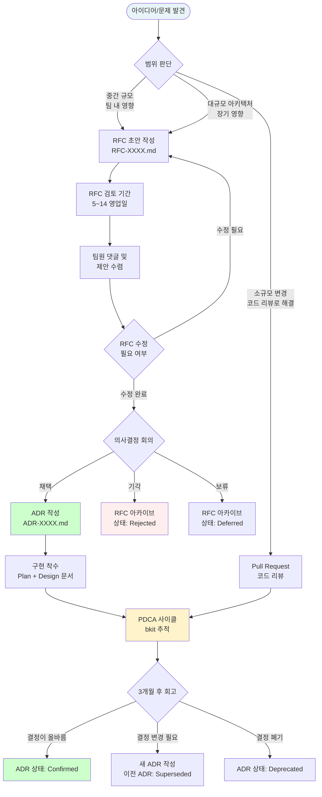
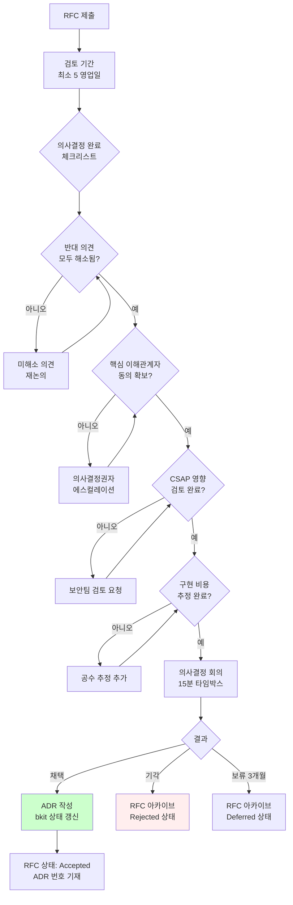
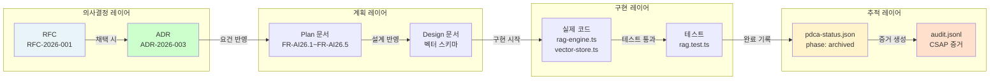
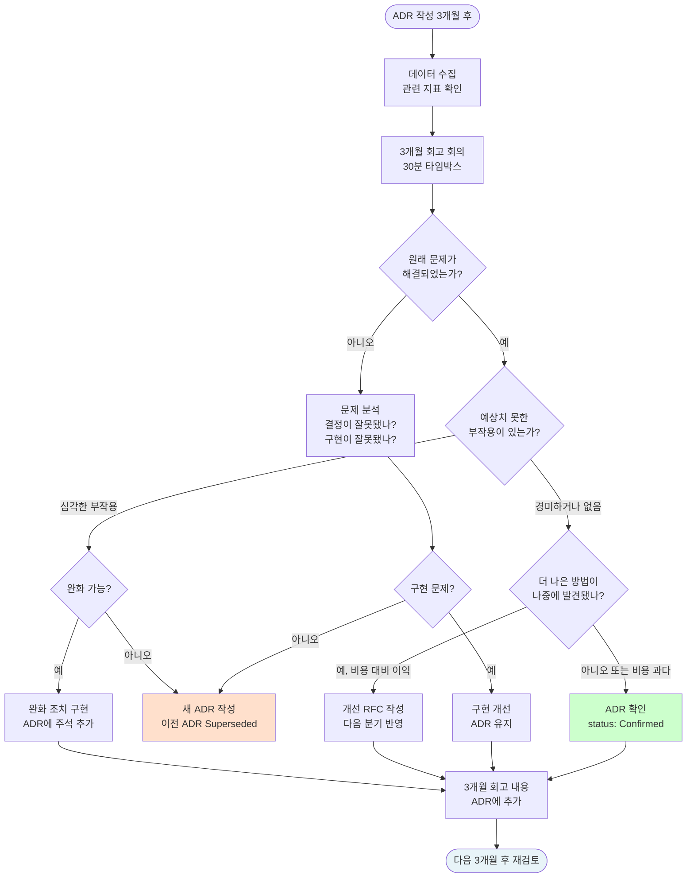

# RFC 및 ADR 완전 가이드 — 기술 의사결정 프로세스, 작성법, 아카이브, 팀 합의 도출

> **대상 독자**: 공공기관 SaaS 프레임워크 개발자, 아키텍트, 프로젝트 관리자
> **문서 유형**: 온보딩 가이드
> **최종 수정**: 2026-04-13
> **관련 문서**: `CLAUDE.md`, `.bkit/state/pdca-status.json`, `docs/01-plan/`, `docs/02-design/`

---

## 개요

공공기관 SaaS 프레임워크는 매일 수십 개의 기술적 결정이 내려집니다. "왜 PostgreSQL을 선택했나요?", "k3s 대신 풀 Kubernetes를 쓰지 않은 이유가 뭔가요?", "JWT 만료 시간을 15분으로 정한 근거가 있나요?"

이런 질문에 답하지 못하면 두 가지 문제가 발생합니다.

첫째, 새 팀원이 합류할 때마다 같은 논의를 반복해야 합니다. 둘째, 행안부 감리에서 "왜 이렇게 구현했나요?"라는 질문에 대응할 수 없습니다.

RFC(Request for Comments)와 ADR(Architecture Decision Record)은 이 문제를 해결하는 공식 도구입니다.

- **RFC**: 아직 결정되지 않은 사항에 대해 팀의 의견을 수렴하는 문서
- **ADR**: 이미 결정된 사항의 맥락, 이유, 결과를 기록하는 영구 문서

이 가이드는 실제 프로젝트 파일(`.bkit/state/pdca-status.json`, `CLAUDE.md`)을 분석하여 공공기관 SaaS 환경에 최적화된 RFC/ADR 작성 방법을 설명합니다.

---

## 기술 의사결정 프로세스 전체 흐름



---

## RFC 작성법 완전 가이드

### RFC란 무엇인가

RFC(Request for Comments)는 인터넷 표준을 만드는 IETF의 방식을 소프트웨어 팀에 적용한 것입니다. 중요한 기술적 변경을 구현하기 전에 문서를 작성하고 팀의 피드백을 받습니다.

**공공기관 SaaS에서 RFC가 필요한 경우**:

| 상황 | RFC 필요 여부 | 이유 |
|------|--------------|------|
| 새 데이터베이스 엔진 도입 | 필수 | 마이그레이션 비용, 운영 부담 |
| API 스키마 파괴적 변경 | 필수 | 하위 호환성, 클라이언트 영향 |
| 보안 모델 변경 (CSAP 항목) | 필수 | 감리 대응 근거 필요 |
| 새 외부 패키지 추가 | 권장 | 의존성 증가, 라이선스 검토 |
| 코드 스타일 가이드 변경 | 권장 | 팀 전체 영향 |
| 단순 버그 수정 | 불필요 | PR 리뷰로 충분 |
| 리팩토링 (기능 변경 없음) | 불필요 | PR 리뷰로 충분 |

### RFC 번호 체계

```
RFC-YYYY-NNN-{분류}

예시:
RFC-2026-001-db         (데이터베이스 관련)
RFC-2026-002-security   (보안 관련)
RFC-2026-003-ai         (AI 연동 관련)
RFC-2026-004-infra      (인프라 관련)
RFC-2026-005-api        (API 설계 관련)
```

### RFC 필수 섹션 7개

```markdown
# RFC-YYYY-NNN: 제목

| 필드 | 내용 |
|------|------|
| RFC 번호 | RFC-2026-NNN |
| 상태 | Draft / Under Review / Accepted / Rejected / Deferred |
| 작성자 | 홍길동 (hong@agency.go.kr) |
| 작성일 | 2026-04-13 |
| 검토 마감 | 2026-04-27 |
| 관련 ADR | (결정 후 기재) |

## 1. 요약 (Summary)
<!-- 결정 사항을 1~3 문장으로 요약합니다. -->

## 2. 동기 (Motivation)
<!-- 왜 이 변경이 필요한가? 현재 상태의 문제점은 무엇인가? -->

## 3. 상세 설계 (Detailed Design)
<!-- 구체적으로 어떻게 구현할 것인가? 코드 예제, 다이어그램 포함 -->

## 4. 단점 및 위험 (Drawbacks)
<!-- 이 접근법의 단점은 무엇인가? 어떤 위험이 있는가? -->

## 5. 대안 검토 (Alternatives)
<!-- 다른 방법은 무엇인가? 왜 이 방법을 선택했는가? -->

## 6. 미해결 질문 (Unresolved Questions)
<!-- 아직 결정되지 않은 사항은 무엇인가? -->

## 7. 변경 이력 (Revision History)
| 버전 | 날짜 | 변경 내용 | 작성자 |
|------|------|----------|--------|
| v0.1 | 2026-04-13 | 초안 | 홍길동 |
```

---

## 실제 RFC 예제 3개

### RFC 예제 1: ai-service pgvector 도입

실제 프로젝트에서 ai-service가 벡터 검색 기능을 추가할 때 작성했을 RFC입니다. `.bkit/state/pdca-status.json`에서 ai-service의 RAG 기능이 `archived` 상태(완료)임을 확인할 수 있습니다.

```markdown
# RFC-2026-001-db: ai-service pgvector 확장 도입

| 필드 | 내용 |
|------|------|
| RFC 번호 | RFC-2026-001-db |
| 상태 | Accepted |
| 작성자 | AI 서비스 팀 |
| 작성일 | 2026-03-01 |
| 검토 마감 | 2026-03-15 |
| 관련 ADR | ADR-2026-003-pgvector |

## 1. 요약

ai-service의 RAG(Retrieval-Augmented Generation) 기능을 위해
PostgreSQL pgvector 확장을 도입하여 벡터 유사도 검색을 구현합니다.
별도 벡터 DB(Pinecone, Weaviate 등) 없이 기존 PostgreSQL CNPG 클러스터를 활용합니다.

## 2. 동기

현재 ai-service는 RAG 기능 없이 단순 LLM 채팅만 제공합니다.
공공기관 사용자는 기관 내부 문서(법령, 지침, 매뉴얼)를 기반으로 한
정확한 답변을 요구합니다.

**현재 문제점**:
- LLM이 학습하지 않은 최신 법령 정보 제공 불가
- 할루시네이션(환각) 발생으로 잘못된 법령 해석 위험
- 출처 인용 없이 답변 → 감리 대응 불가

**목표**:
- 기관 문서를 벡터로 변환하여 저장
- 질문과 의미적으로 유사한 문서 구간 검색
- LLM에 컨텍스트로 제공하여 정확한 답변 생성

## 3. 상세 설계

### 데이터 흐름

1. 문서 수집 (POST /ai/rag/ingest):
   - 문서를 청크 단위로 분할 (chunker.ts)
   - 각 청크를 임베딩 벡터로 변환 (embed 모델)
   - PostgreSQL pgvector 테이블에 저장

2. 검색 및 생성 (POST /ai/rag/query):
   - 질문을 벡터로 변환
   - pgvector HNSW 인덱스로 코사인 유사도 검색
   - 상위 K개 청크를 LLM 컨텍스트로 제공
   - 출처 인용 포함 답변 생성

### 스키마 설계

```sql
-- 벡터 스토어 테이블 (테넌트 격리 포함)
CREATE TABLE rag_documents (
  id           UUID PRIMARY KEY DEFAULT gen_random_uuid(),
  tenant_id    UUID NOT NULL,
  title        VARCHAR(200) NOT NULL,
  chunk_index  INTEGER NOT NULL,
  content      TEXT NOT NULL,
  embedding    VECTOR(1536),  -- text-embedding-ada-002 기준
  source_url   VARCHAR(500),
  metadata     JSONB,
  created_at   TIMESTAMPTZ DEFAULT NOW(),
  -- N2SF: O 등급만 저장 (C/S 등급 저장 금지)
  data_grade   VARCHAR(1) CHECK (data_grade = 'O') DEFAULT 'O'
);

-- HNSW 인덱스 (ANN 검색 가속)
CREATE INDEX ON rag_documents USING hnsw (embedding vector_cosine_ops)
  WITH (m = 16, ef_construction = 64);

-- 테넌트 격리 인덱스
CREATE INDEX ON rag_documents (tenant_id, created_at DESC);
```

### CSAP 고려사항
- D-08: `tenant_id`로 테넌트 간 데이터 격리 보장
- D-09: `data_grade = 'O'` 제약으로 C/S 등급 저장 방지
- D-12: 모든 입력은 Zod 스키마로 검증 후 매개변수화 쿼리 사용

## 4. 단점 및 위험

| 위험 | 심각도 | 완화 방안 |
|------|--------|---------|
| PostgreSQL 쿼리 성능 저하 | 중간 | HNSW 인덱스, 연결 풀링 |
| 벡터 차원 고정 (모델 교체 시 마이그레이션) | 높음 | metadata에 모델명 저장, 재임베딩 스크립트 준비 |
| CNPG 스토리지 증가 | 낮음 | 벡터 데이터 TTL 정책 수립 |

## 5. 대안 검토

| 대안 | 장점 | 단점 | 기각 이유 |
|------|------|------|----------|
| Weaviate | 벡터 DB 전용, 고성능 | 별도 클러스터 관리, 외부 클라우드 의존 | CSAP: 외부 서비스 금지 |
| Qdrant | 오픈소스, 고성능 | Kubernetes 운영 복잡도 증가 | 운영 부담, 현재 팀 역량 부족 |
| Milvus | 대용량 최적화 | 설치/관리 복잡, 리소스 과다 | 현재 데이터 규모에 과도 |

**pgvector 선택 이유**: 기존 CNPG PostgreSQL 클러스터 재사용, 트랜잭션 보장,
CSAP 외부 서비스 금지 준수, 팀 운영 역량 기존 보유

## 6. 미해결 질문

- [ ] 임베딩 모델 교체 시 기존 벡터 재생성 자동화 방법?
- [ ] 청크 크기 최적화 기준 (현재 512 토큰, 조정 가능)?
- [ ] 다중 언어 지원 시 임베딩 모델 선택 기준?

## 7. 변경 이력

| 버전 | 날짜 | 변경 내용 | 작성자 |
|------|------|----------|--------|
| v0.1 | 2026-03-01 | 초안 | AI팀 |
| v0.2 | 2026-03-08 | CSAP 고려사항 추가, 대안 검토 보완 | AI팀 |
| v1.0 | 2026-03-15 | 검토 완료, Accepted | 아키텍처팀 |
```

### RFC 예제 2: BullMQ 큐 우선순위 추가

```markdown
# RFC-2026-007-queue: BullMQ 우선순위 큐 도입

| 필드 | 내용 |
|------|------|
| RFC 번호 | RFC-2026-007-queue |
| 상태 | Accepted |
| 작성자 | 플랫폼 팀 |
| 작성일 | 2026-03-20 |
| 검토 마감 | 2026-04-03 |
| 관련 ADR | ADR-2026-007-bullmq-priority |

## 1. 요약

민원 처리 AI 워크플로우에서 긴급 민원(우선순위 1)과
일반 민원(우선순위 5)을 구분하여 처리하기 위해
BullMQ 우선순위 큐를 도입합니다.

## 2. 동기

현재 모든 민원 처리 작업이 단일 FIFO 큐에서 처리됩니다.
대량의 일반 민원이 접수되면 긴급 민원이 수 시간 지연될 수 있습니다.

**공공기관 법령 근거**:
「민원처리에 관한 법률」 제22조: 긴급 민원은 즉시 처리 원칙
현재 SLA: 긴급 민원 30분 이내 처리 목표 → 부적합 사례 발생

## 3. 상세 설계

```typescript
// BullMQ 우선순위 큐 설정
import { Queue } from 'bullmq';

const citizenRequestQueue = new Queue('citizen-requests', {
  connection: redisConnection,
  defaultJobOptions: {
    attempts: 3,
    backoff: { type: 'exponential', delay: 1000 },
  },
});

// 긴급 민원: 높은 우선순위 (낮은 숫자 = 높은 우선순위)
await citizenRequestQueue.add(
  'process-urgent',
  { requestId, type: 'urgent', tenantId },
  { priority: 1 }  // 즉시 처리
);

// 일반 민원: 낮은 우선순위
await citizenRequestQueue.add(
  'process-normal',
  { requestId, type: 'normal', tenantId },
  { priority: 10 }  // 순서대로 처리
);
```

### 우선순위 체계

| 우선순위 | 민원 유형 | 목표 처리 시간 |
|--------|---------|-------------|
| 1 | 생명·안전 관련 긴급 | 즉시 (5분 이내) |
| 3 | 기한 임박 민원 (D-1) | 30분 이내 |
| 5 | 일반 민원 | 2시간 이내 |
| 10 | 대량 배치 민원 | 익일 처리 |

## 4. 단점 및 위험

- Redis 메모리 사용량 증가 (우선순위 정렬 비용)
- 낮은 우선순위 작업의 기아 상태(Starvation) 가능성
  → 완화: 대기 시간 3시간 초과 시 자동 우선순위 상향

## 5. 대안 검토

- **Amazon SQS 우선순위 큐**: CSAP 외부 클라우드 금지
- **RabbitMQ Priority Queue**: 기존 BullMQ 교체 비용 과다
- **단순 별도 큐 2개**: 운영 복잡도 증가 (Worker 2배)

## 6. 미해결 질문

- [ ] 우선순위 결정 로직 (AI 자동 분류 vs 담당자 수동 지정)?
- [ ] 기아 상태 방지 임계값 조정 권한 (운영자/시스템)?
```

### RFC 예제 3: AsyncLocalStorage 테넌트 컨텍스트

```markdown
# RFC-2026-012-context: AsyncLocalStorage 테넌트 컨텍스트 전파

| 필드 | 내용 |
|------|------|
| RFC 번호 | RFC-2026-012-context |
| 상태 | Accepted |
| 작성자 | 플랫폼 팀 |
| 작성일 | 2026-04-01 |
| 관련 ADR | ADR-2026-010-tenant-context |

## 1. 요약

모든 비동기 함수 호출에서 테넌트 컨텍스트를 명시적으로 전달하는
대신, Node.js AsyncLocalStorage를 사용하여 자동 전파합니다.

## 2. 동기

현재 모든 서비스 함수가 `tenantId`를 매개변수로 받습니다.
함수 호출 체인이 깊어질수록 매개변수 전달이 반복됩니다.

```typescript
// 현재 방식 (번거로움)
async function processRequest(req, tenantId: string) {
  const data = await getData(tenantId);
  const processed = await transform(data, tenantId);
  await save(processed, tenantId);
  await logAudit(tenantId, 'PROCESSED');
}

// AsyncLocalStorage 방식 (간결함)
async function processRequest(req) {
  // tenantId가 컨텍스트에서 자동으로 가져와집니다.
  const data = await getData();
  const processed = await transform(data);
  await save(processed);
  await logAudit('PROCESSED');
}
```

## 3. CSAP 보안 영향

**D-08 (테넌트 격리)**: AsyncLocalStorage는 요청별로 격리됩니다.
요청 A의 tenantId가 요청 B로 누출되지 않습니다.

테스트:
```typescript
// 테넌트 격리 검증 테스트
it('다른 요청의 테넌트 컨텍스트가 누출되지 않아야 한다', async () => {
  const [tenantA, tenantB] = await Promise.all([
    runWithTenantContext('tenant-A', () => getCurrentTenantId()),
    runWithTenantContext('tenant-B', () => getCurrentTenantId()),
  ]);
  expect(tenantA).toBe('tenant-A');
  expect(tenantB).toBe('tenant-B');
});
```
```

---

## ADR 작성법 — Lightweight ADR vs MADR 비교

### ADR이란 무엇인가

ADR(Architecture Decision Record)은 소프트웨어 아키텍처에서 중요한 결정을 내렸을 때 그 이유를 기록하는 문서입니다. 나중에 "왜 이렇게 만들었나요?"라는 질문에 답하기 위한 역사 기록입니다.

**ADR의 핵심 특성**:
- 변경 불가(Immutable): 결정이 내려지면 그 기록은 수정하지 않습니다.
- 상태 전환: Proposed → Accepted → Deprecated / Superseded
- 짧고 명확: 1~2페이지 이내

### Lightweight ADR vs MADR 비교

| 비교 항목 | Lightweight ADR | MADR (Markdown ADR) |
|----------|----------------|-------------------|
| 섹션 수 | 3~5개 (간결) | 7~10개 (상세) |
| 적합한 규모 | 소/중규모 팀 | 대규모 팀, 복잡한 아키텍처 |
| 작성 시간 | 30분 이내 | 1~3시간 |
| CSAP 감리 대응 | 보통 | 우수 |
| 공공기관 SaaS 권장 | 중간 규모 이하 | 중간 규모 이상 |

**공공기관 SaaS 프레임워크 권장 형식**: MADR 변형판

이 프로젝트는 CSAP 감리 대응이 필요하므로 상세한 MADR 형식을 사용합니다. 단, 공공기관 표준 용어를 적용하고 추적성 매트릭스를 추가합니다.

### 공공기관 SaaS ADR 템플릿

```markdown
# ADR-YYYY-NNN: 제목

| 필드 | 내용 |
|------|------|
| ADR 번호 | ADR-2026-NNN |
| 상태 | Proposed / Accepted / Deprecated / Superseded by ADR-XXX |
| 결정일 | 2026-04-13 |
| 작성자 | 홍길동 |
| 검토자 | 이순신, 강감찬 |
| 관련 RFC | RFC-2026-NNN (선택) |
| CSAP 연계 | D-08, D-09 등 (해당 시) |
| FR 추적 | FR-P01.1, FR-P02.3 등 (해당 시) |

## 상황 (Context)

이 결정이 필요하게 된 배경과 제약 사항을 설명합니다.
어떤 문제를 해결하려 했는가? 어떤 제약이 있었는가?

## 결정 (Decision)

무엇을 결정했는가? 한 문장으로 명확하게 기술합니다.

## 근거 (Rationale)

왜 이 결정을 내렸는가?
검토한 대안과 선택하지 않은 이유를 포함합니다.

| 대안 | 장점 | 단점 | 채택 여부 |
|------|------|------|---------|
| 옵션 A | ... | ... | 채택 |
| 옵션 B | ... | ... | 기각 |

## 결과 (Consequences)

이 결정으로 인해 발생하는 결과:
- 긍정적 결과: ...
- 부정적 결과: ...
- 중립적 결과: ...

## CSAP 영향 (해당 시)

이 결정이 CSAP 통제항목에 미치는 영향을 기술합니다.

## 변경 이력

| 버전 | 날짜 | 내용 |
|------|------|------|
| 1.0 | 2026-04-13 | 최초 작성 |
```

---

## 실제 ADR 예제 3개

### ADR 예제 1: PostgreSQL CNPG 선택

실제 프로젝트에서 PostgreSQL을 CNPG(CloudNative PG) 오퍼레이터로 운영하기로 결정한 내용입니다.

```markdown
# ADR-2026-001: PostgreSQL CNPG 오퍼레이터 도입

| 필드 | 내용 |
|------|------|
| ADR 번호 | ADR-2026-001 |
| 상태 | Accepted |
| 결정일 | 2026-03-10 |
| CSAP 연계 | D-09 (데이터 암호화), D-06 (백업 및 복구) |

## 상황

공공기관 SaaS 프레임워크는 멀티테넌트 데이터를 안전하게 저장해야 합니다.
Kubernetes 환경에서 PostgreSQL을 운영하는 방법에 대한 결정이 필요합니다.

**제약 사항**:
- CSAP: 외부 클라우드 DB 서비스(RDS, Cloud SQL) 사용 불가
- k3s 클러스터 내부에서 운영 필수
- 고가용성(HA) 지원 필요 (RTO 4시간 이하)
- 자동 백업 및 PITR(특정 시점 복구) 지원 필요

## 결정

PostgreSQL을 CloudNativePG(CNPG) 오퍼레이터로 k3s 클러스터에서 운영합니다.

## 근거

| 대안 | 장점 | 단점 | 채택 여부 |
|------|------|------|---------|
| CNPG 오퍼레이터 | CNCF 공식, HA 내장, WAL 기반 PITR, pgvector 지원 | 초기 설정 복잡 | 채택 |
| Helm Chart (Bitnami) | 간단한 설치 | HA 설정 복잡, 오퍼레이터 기능 없음 | 기각 |
| Zalando Operator | 성숙한 프로젝트 | CNPG 대비 기능 적음, 커뮤니티 소규모 | 기각 |
| 외부 RDS 사용 | 관리 편의 | CSAP 외부 클라우드 금지 | 기각 |

**CNPG 선택 이유**:
1. CNCF Sandbox 프로젝트 — 장기 지원 보장
2. WAL(Write-Ahead Log) 기반 PITR — CSAP D-06 백업 요건 충족
3. pgvector 확장 지원 — ai-service RAG 기능 필수
4. PodDisruptionBudget 자동 관리 — 무중단 업그레이드

## 결과

- 긍정적: 자동 장애 조치(Failover), PITR, WAL 아카이빙
- 부정적: CNPG 오퍼레이터 운영 학습 필요, CRD 관리 추가
- 중립: PostgreSQL 버전 관리는 기존과 동일

## CSAP 영향

- D-09: TLS 내부 통신, 저장 데이터 암호화 (PostgreSQL 파일시스템 암호화)
- D-06: WAL 아카이빙을 통한 1년 이상 데이터 보존 가능
- 백업 정책: 일 1회 전체 백업 + WAL 5분 간격 아카이빙
```

### ADR 예제 2: k3s vs 풀 Kubernetes 선택

```markdown
# ADR-2026-002: 경량 Kubernetes k3s 선택

| 필드 | 내용 |
|------|------|
| ADR 번호 | ADR-2026-002 |
| 상태 | Accepted |
| 결정일 | 2026-03-05 |
| CSAP 연계 | INFR-1 (온프레미스 인프라) |

## 상황

공공기관 SaaS 프레임워크는 온프레미스 환경(공공기관 데이터센터)에서
Kubernetes를 운영해야 합니다. 표준 Kubernetes와 경량 배포판 중 선택이 필요합니다.

**환경 제약**:
- 온프레미스 VM 환경 (vSphere, KVM 등)
- 클러스터 노드: 마스터 3대, 워커 5~10대
- 네트워크: 내부망 (인터넷 직접 연결 없음)
- 운영 인력: 소규모 (3~5명)

## 결정

Rancher k3s를 Kubernetes 배포판으로 선택합니다.
설치 스크립트: `curl -sfL https://get.k3s.io | sh -`

## 근거

| 대안 | 장점 | 단점 | 채택 여부 |
|------|------|------|---------|
| k3s | 경량(~70MB), 설치 용이, 내장 containerd, ARM 지원 | 일부 alpha 기능 미포함 | 채택 |
| kubeadm (표준) | 완전한 기능, 공식 지원 | 복잡한 설치, 높은 리소스 | 기각 |
| OpenShift (OKD) | 엔터프라이즈 기능 풍부 | 라이선스 비용, 복잡도 높음 | 기각 |
| Rancher RKE2 | 보안 강화 (FIPS 140-2) | k3s보다 무거움 | 차선책 |

**k3s 선택 이유**:
1. 공공기관 VM 환경 최적화 — 낮은 메모리 사용량(k3s 512MB vs kubeadm 2GB+)
2. 단일 바이너리 — 운영 복잡도 최소화
3. Rancher Labs (현 SUSE) 공식 지원 — 장기 유지보수 보장
4. CSAP 인증 공공클라우드에서 k3s 사용 선례 다수

## 결과

- 긍정적: 빠른 설치(5분), 낮은 리소스, 간단한 업그레이드
- 부정적: 일부 고급 Kubernetes 기능 미지원 (예: Windows 노드)
- 중립: etcd 내장 또는 외장 선택 가능

**비고**: 향후 클러스터 규모 확대(노드 50대 이상) 시
RKE2로 마이그레이션 재검토 필요 (ADR-2026-002-v2로 갱신)
```

### ADR 예제 3: CSAP D-09 AES-256 암호화 알고리즘 선택

```markdown
# ADR-2026-005: 민감 데이터 암호화 알고리즘 AES-256-GCM 선택

| 필드 | 내용 |
|------|------|
| ADR 번호 | ADR-2026-005 |
| 상태 | Accepted |
| 결정일 | 2026-03-15 |
| CSAP 연계 | D-09 (암호화), D-12 (개발보안) |
| FR 추적 | NFR-3 (암호화 요건) |

## 상황

CSAP D-09 항목은 개인정보 및 민감 데이터를 암호화하여 저장할 것을 요구합니다.
구체적인 알고리즘 선택이 필요합니다.

**법령 근거**:
- 「개인정보보호법」 제29조: 개인정보 암호화 조치 의무
- CSAP 통제항목 D-09-01: 저장 데이터 암호화 (AES-256 이상)
- NIST SP 800-175B: AES-GCM 권장

## 결정

저장 데이터는 AES-256-GCM 알고리즘으로 암호화합니다.
키 관리는 환경변수(`ENCRYPTION_KEY`)를 통해 주입합니다.
(장기: Vault KMS로 전환 예정)

## 근거

| 알고리즘 | 안전성 | 성능 | CSAP 적합성 | 채택 여부 |
|---------|-------|------|------------|---------|
| AES-256-GCM | 최상 | 최상 (HW 가속) | 완전 충족 | 채택 |
| AES-256-CBC | 높음 | 높음 | 충족 | 기각 (패딩 오라클 취약) |
| ChaCha20-Poly1305 | 높음 | 높음 (SW) | 충족 | 기각 (FIPS 비인증) |
| 3DES | 중간 | 낮음 | 미충족 | 기각 (레거시) |
| RSA-2048 | 높음 | 낮음 | 충족 | 기각 (대칭키 대비 비적합) |

**AES-256-GCM 선택 이유**:
1. NIST 승인 알고리즘 — CSAP D-09 명시적 요건 충족
2. GCM 모드 — 무결성 검증(AEAD) 내장, CBC 패딩 오라클 취약점 없음
3. AES-NI 하드웨어 가속 — CPU 부담 최소화
4. Node.js `crypto` 모듈 내장 지원

**구현 코드**:
```typescript
// lib/crypto.ts (실제 구현 패턴)
import { createCipheriv, createDecipheriv, randomBytes } from 'crypto';

const ALGORITHM = 'aes-256-gcm';

export async function encrypt(plaintext: string, key: string): Promise<string> {
  const keyBuffer = Buffer.from(key, 'hex');  // 256비트 = 32바이트
  const iv = randomBytes(12);  // GCM 권장 IV 크기
  const cipher = createCipheriv(ALGORITHM, keyBuffer, iv);

  const encrypted = Buffer.concat([
    cipher.update(plaintext, 'utf8'),
    cipher.final(),
  ]);
  const authTag = cipher.getAuthTag();  // GCM 인증 태그

  // IV + AuthTag + CipherText 조합 (복호화 시 필요)
  return Buffer.concat([iv, authTag, encrypted]).toString('base64');
}
```

## 결과

- 긍정적: CSAP D-09 완전 충족, 고성능, 무결성 보장
- 부정적: 키 관리 체계 수립 필요 (현재 환경변수 → 장기 Vault)
- 중립: 기존 AES-256-CBC 데이터 마이그레이션 불필요 (신규 프로젝트)

## CSAP D-09 증거

- 암호화 구현 코드: `platform/packages/crypto-util/src/`
- 단위 테스트: `tests/unit/crypto-util.test.ts`
- CSAP 증거 수집: `scripts/csap-evidence-collect-v2.sh --controls D-09`
```

---

## RFC → ADR 전환 기준

### "의사결정 완료" 판단 기준

RFC가 작성되고 검토 기간이 끝나면 어떤 기준으로 ADR로 전환할까요?



### 의사결정 회의 진행 방법

15분 타임박스 회의로 신속하게 결정합니다.

```
1분: RFC 작성자가 요약 발표 (최대 2슬라이드)
5분: 핵심 반대 의견 논의 (이미 RFC에 기재된 내용)
5분: 동의(Consent) 확인 — "이 결정으로 진행해도 심각한 장애가 없는가?"
4분: 마무리 — ADR 번호 지정, 작성자 지정, 완료 기한 설정
```

**중요**: "동의(Consent)"는 "합의(Consensus)"가 아닙니다. 모두가 최선이라고 생각할 필요는 없습니다. 충분히 좋고 현재 상황에서 안전하면 됩니다.

---

## PDR(Product Decision Record) — 비즈니스 결정 기록 방법

ADR이 기술적 결정을 기록한다면, PDR은 비즈니스/제품 결정을 기록합니다.

공공기관 SaaS에서 PDR이 필요한 경우:
- 특정 기능을 어떤 테넌트에 먼저 출시할지
- 가격 모델 변경
- 특정 행정 프로세스를 어떻게 디지털화할지

```markdown
# PDR-2026-001: 민원 자동 분류 AI 기능 단계적 출시 계획

| 필드 | 내용 |
|------|------|
| PDR 번호 | PDR-2026-001 |
| 상태 | Accepted |
| 결정일 | 2026-04-01 |
| 결정권자 | 제품 책임자 (PM) |

## 결정

민원 자동 분류 AI 기능을 전체 테넌트에 동시 출시하지 않고,
파일럿 테넌트 3곳에서 4주 검증 후 전체 출시합니다.

## 근거

1. AI 분류 오류율이 5% 미만임을 파일럿에서 먼저 검증 필요
2. 민원 처리 공무원의 새 워크플로우 적응 시간 필요
3. 「민원처리에 관한 법률」상 AI 결정의 행정 책임 소재 명확화 선행 필요

## 성공 기준 (파일럿 완료 기준)

- AI 분류 정확도 95% 이상
- 처리 시간 단축 20% 이상
- 민원 담당자 만족도 70점 이상 (100점 기준)

## 전체 출시 일정

- 2026-04-15: 파일럿 테넌트 3곳 시작
- 2026-05-15: 파일럿 결과 분석
- 2026-06-01: 전체 출시 또는 기능 개선 후 재파일럿
```

---

## 의사결정 아카이브 관리

### 디렉토리 구조

```
docs/
├── rfcs/
│   ├── 2026/
│   │   ├── RFC-2026-001-db-pgvector.md         (Accepted)
│   │   ├── RFC-2026-002-queue-bullmq.md         (Rejected)
│   │   └── RFC-2026-003-auth-oidc.md            (Deferred)
│   └── template.md
├── adrs/
│   ├── 2026/
│   │   ├── ADR-2026-001-postgresql-cnpg.md      (Accepted)
│   │   ├── ADR-2026-002-k3s-kubernetes.md       (Accepted)
│   │   └── ADR-2026-005-aes256gcm.md            (Accepted)
│   ├── index.md                                  (ADR 목록)
│   └── template.md
└── pdrs/
    └── 2026/
        └── PDR-2026-001-ai-rollout.md
```

### ADR 인덱스 (docs/adrs/index.md)

```markdown
# ADR 목록

| 번호 | 제목 | 상태 | 결정일 | CSAP |
|------|------|------|--------|------|
| ADR-2026-001 | PostgreSQL CNPG 오퍼레이터 | Accepted | 2026-03-10 | D-09 |
| ADR-2026-002 | k3s 선택 | Accepted | 2026-03-05 | INFR-1 |
| ADR-2026-003 | pgvector RAG | Accepted | 2026-03-15 | D-08 |
| ADR-2026-004 | Linkerd mTLS | Accepted | 2026-03-20 | D-09 |
| ADR-2026-005 | AES-256-GCM | Accepted | 2026-03-15 | D-09 |
| ADR-2026-006 | JWT RS256 | Accepted | 2026-03-25 | D-08 |
| ADR-2026-010 | AsyncLocalStorage | Accepted | 2026-04-01 | D-08 |
```

### ADR 버전 관리 (Superseded 처리)

ADR은 수정하지 않습니다. 결정이 바뀌면 새 ADR을 작성하고 이전 ADR을 Superseded 상태로 변경합니다.

```markdown
# ADR-2026-002: k3s 선택 [Superseded]

> **상태**: Superseded by ADR-2026-002-v2 (2026-10-01)
> 이 ADR은 더 이상 유효하지 않습니다. ADR-2026-002-v2를 참조하십시오.

---
(원본 내용 유지 — 삭제하지 않음)
```

### 무효화(Invalidation) 처리

ADR이 외부 요인으로 무효화된 경우(예: 법령 변경, 기술 단종):

```bash
# ADR 상태를 Deprecated으로 변경
# 파일 상단에 다음 추가:
# > **상태**: Deprecated (2026-07-01)
# > 이유: PostgreSQL 13 버전 종료(EoL), ADR-2026-015 참조
```

---

## 팀 합의 도출 기법

### Consent vs Consensus 차이

| 구분 | Consent (동의) | Consensus (합의) |
|------|--------------|-----------------|
| 기준 | "심각한 장애가 없는가?" | "모두 최선이라고 생각하는가?" |
| 속도 | 빠름 (15분) | 느림 (수시간~수일) |
| 공공기관 SaaS 권장 | 대부분의 결정 | 조직 구조 변경 등 중요 결정 |
| 결과 | "충분히 좋은" 결정 | "완벽한" 결정 (종종 불가능) |

### 시간 제한 투표 (Time-Boxed Vote)

```markdown
## RFC 투표 방법

**투표 기간**: 5 영업일 (이후 묵시적 동의로 간주)

**투표 옵션**:
- (+1): 채택 찬성 — 이대로 진행하면 됩니다.
- (0): 중립 — 반대하지 않지만 의견 없음.
- (-1): 보류 요청 — 반드시 아래 항목을 명시:
  - 어떤 우려사항이 있는가?
  - 우려를 해소하려면 무엇이 필요한가?
  - 언제까지 해소 가능한가?

**주의**: (-1)은 "나는 이 방법을 좋아하지 않는다"가 아닙니다.
"이 결정은 팀에 심각한 문제를 일으킬 수 있다"를 의미합니다.
```

### 비동기 의사결정 (원격 팀)

```markdown
## Gitea Issues를 활용한 RFC 검토

RFC 작성 시 Gitea Issue 생성:
- 제목: [RFC] RFC-2026-NNN: 제목
- 라벨: rfc, under-review
- 담당자: RFC 작성자
- 마감일: 검토 기간 마지막 날

팀원은 Issue 댓글로 의견 제시:
- 👍 = +1
- 💬 = 의견 있음 (댓글 참조)
- ❌ = -1 (우려사항 댓글 필수)

마감일에 RFC 작성자가 결과 정리 후 ADR 작성 또는 RFC 아카이브
```

---

## pdca-status.json 분석 — bkit 상태 파일과 ADR 연계

### pdca-status.json 구조 이해

실제 `/data/ai-saas/.bkit/state/pdca-status.json` 파일을 분석하면 각 기능(feature)의 PDCA 상태가 추적되고 있음을 알 수 있습니다.

```json
{
  "version": "3.0",
  "lastUpdated": "2026-04-13T11:50:05.042Z",
  "features": {
    "auth-service": {
      "phase": "do",
      "matchRate": "100%+MFA",
      "documents": {
        "plan": "docs/archive/2026-04/MTU-P01-auth-service/MTU-P01-auth-service.plan.md",
        "design": "docs/archive/2026-04/MTU-P01-auth-service/MTU-P01-auth-service.design.md"
      },
      "timestamps": {
        "started": "2026-04-05T13:38:58.114Z",
        "lastUpdated": "2026-04-12T06:32:21.725Z"
      }
    }
  }
}
```

### ADR과 pdca-status.json 연계 방법

ADR로 기술적 결정이 내려지면, 해당 결정은 Plan 문서와 Design 문서에 반영됩니다. `pdca-status.json`은 이 연계를 추적합니다.

```
결정 흐름:
RFC-2026-001 (pgvector 도입)
  → ADR-2026-003 (pgvector 채택)
    → Plan 문서 (FR-AI26.1 RAG 요건)
      → Design 문서 (벡터 스키마 설계)
        → pdca-status.json["ai-service"]["phase"] = "archived"
          → 감리 증거 (matchRate: "100%")
```

### pdca-status.json에서 ADR 추적 필드 추가 방법

```json
{
  "features": {
    "ai-service": {
      "phase": "archived",
      "matchRate": "100%",
      "adrs": ["ADR-2026-003", "ADR-2026-005"],
      "rfcs": ["RFC-2026-001"],
      "documents": {
        "plan": "docs/01-plan/features/ai-service.plan.md",
        "design": "docs/02-design/features/ai-service.design.md"
      }
    }
  }
}
```

### bkit 상태 파일이 ADR 아카이브와 어떻게 연계되는지



---

## 의사결정 품질 측정

### 결정 후 3개월 회고 플로우차트



### 의사결정 품질 지표

| 지표 | 측정 방법 | 목표 |
|------|---------|------|
| 결정 번복률 | Superseded ADR / 전체 ADR | 10% 이하 |
| RFC 평균 검토 기간 | RFC 제출 ~ Accepted 날짜 | 10 영업일 이하 |
| ADR 작성 시간 | RFC Accepted ~ ADR 작성 완료 | 3 영업일 이하 |
| CSAP 감리 대응률 | 감리 질문에 ADR으로 답변한 비율 | 80% 이상 |
| 팀원 인지율 | "최근 ADR 3개를 알고 있는가?" | 90% 이상 |

---

## 공공기관 SaaS 특화 고려사항

### CLAUDE.md와 RFC/ADR 연계

`CLAUDE.md`의 에이전트 분업 원칙에 따르면 구현 전 Plan + Design 문서가 완비되어야 합니다. RFC/ADR은 이 프로세스의 선행 단계입니다.

```
에이전트 Cascade:
연구(ADR 후보 식별) → RFC 작성(팀 합의) → ADR 작성(결정 확정)
→ Plan 문서(요건 반영) → Design 문서(설계)
→ 구현(Implementer) → 리뷰(Reviewer) → 감리(Auditor)
```

### 감리관 대응을 위한 ADR 활용

행안부 감리에서 자주 나오는 질문과 ADR을 통한 대응:

| 감리관 질문 | ADR 참조 | 증거 |
|-----------|---------|------|
| "왜 AES-256을 사용했나요?" | ADR-2026-005 | CSAP D-09 충족 근거 명시 |
| "JWT 만료 15분의 근거는?" | ADR-2026-006 | CSAP D-08 세션 관리 항목 |
| "외부 클라우드를 왜 사용 안 하나요?" | ADR-2026-002 | CSAP 클라우드 보안인증 요건 |
| "k3s 선택 이유가 있나요?" | ADR-2026-002 | 온프레미스 최적화 근거 |

---

## 요약 — RFC/ADR 빠른 참조

```
RFC 작성: 결정 전, 팀 의견 수렴 필요 시
ADR 작성: 결정 후, 이유를 영구적으로 기록
PDR 작성: 비즈니스/제품 결정 기록

RFC 번호: RFC-YYYY-NNN-{분류}
ADR 번호: ADR-YYYY-NNN

RFC 상태: Draft → Under Review → Accepted / Rejected / Deferred
ADR 상태: Proposed → Accepted → Deprecated / Superseded

저장 위치:
- RFC: docs/rfcs/YYYY/RFC-YYYY-NNN-{이름}.md
- ADR: docs/adrs/YYYY/ADR-YYYY-NNN-{이름}.md
- 인덱스: docs/adrs/index.md

관련 파일:
- 프로젝트 제약: /data/ai-saas/CLAUDE.md
- PDCA 추적: /data/ai-saas/.bkit/state/pdca-status.json
- 계획 문서: /data/ai-saas/docs/01-plan/
- 설계 문서: /data/ai-saas/docs/02-design/
```

---

## 실전 워크플로우 — 새 팀원 온보딩 시나리오

### 시나리오: "우리 팀에 합류했는데 왜 k3s를 쓰나요?"라는 질문

다음은 새 팀원이 의사결정 이력을 탐색하는 방법입니다.

```bash
# 1단계: ADR 인덱스 확인
cat /data/ai-saas/docs/adrs/index.md

# 2단계: 관련 ADR 검색
grep -r "k3s\|kubernetes" /data/ai-saas/docs/adrs/ --include="*.md" -l

# 3단계: ADR 읽기
cat /data/ai-saas/docs/adrs/2026/ADR-2026-002-k3s-kubernetes.md

# 4단계: 관련 RFC 확인 (ADR 내 RFC 번호 참조)
cat /data/ai-saas/docs/rfcs/2026/RFC-2026-XXX-k3s.md

# 5단계: pdca-status.json에서 구현 상태 확인
jq '.features["auth-service", "ai-service"] | {phase, matchRate}' \
  /data/ai-saas/.bkit/state/pdca-status.json
```

### 시나리오: 새 RFC 작성 자동화 스크립트

```bash
#!/bin/bash
# scripts/new-rfc.sh — 새 RFC 파일 생성 스크립트

RFC_TYPE="${1:-general}"  # db, security, ai, infra, api, general
RFC_TITLE="${2:-New RFC}"

# 다음 번호 자동 생성
YEAR=$(date +%Y)
EXISTING=$(ls /data/ai-saas/docs/rfcs/${YEAR}/ 2>/dev/null | wc -l)
RFC_NUM=$(printf "%03d" $((EXISTING + 1)))
RFC_ID="RFC-${YEAR}-${RFC_NUM}-${RFC_TYPE}"

# 파일 경로
RFC_DIR="/data/ai-saas/docs/rfcs/${YEAR}"
mkdir -p "${RFC_DIR}"
RFC_FILE="${RFC_DIR}/${RFC_ID}.md"

# 템플릿 생성
cat > "${RFC_FILE}" << EOF
# ${RFC_ID}: ${RFC_TITLE}

| 필드 | 내용 |
|------|------|
| RFC 번호 | ${RFC_ID} |
| 상태 | Draft |
| 작성자 | $(git config user.name 2>/dev/null || echo "작성자 미상") |
| 작성일 | $(date +%Y-%m-%d) |
| 검토 마감 | $(date -d "+10 days" +%Y-%m-%d 2>/dev/null || date +%Y-%m-%d) |
| 관련 ADR | (결정 후 기재) |

## 1. 요약

<!-- 1~3 문장 요약 -->

## 2. 동기

<!-- 왜 필요한가? 현재 문제점은? -->

## 3. 상세 설계

<!-- 구체적인 구현 방법 -->

## 4. 단점 및 위험

<!-- 이 방법의 단점과 위험 -->

## 5. 대안 검토

| 대안 | 장점 | 단점 | 채택 여부 |
|------|------|------|---------|
| 이 RFC | | | 채택 |
| 대안 1 | | | 기각 |

## 6. 미해결 질문

- [ ] 질문 1
- [ ] 질문 2

## 7. 변경 이력

| 버전 | 날짜 | 변경 내용 | 작성자 |
|------|------|----------|--------|
| v0.1 | $(date +%Y-%m-%d) | 초안 | $(git config user.name 2>/dev/null || echo "작성자") |
EOF

echo "RFC 파일 생성: ${RFC_FILE}"
echo "Gitea Issue 생성 후 팀에 검토 요청하십시오."
```

### ADR 생성 스크립트

```bash
#!/bin/bash
# scripts/new-adr.sh — 결정 완료 후 ADR 파일 생성

ADR_TITLE="${1:-New Decision}"
RELATED_RFC="${2:-}"

YEAR=$(date +%Y)
EXISTING=$(ls /data/ai-saas/docs/adrs/${YEAR}/ 2>/dev/null | grep -v "index" | wc -l)
ADR_NUM=$(printf "%03d" $((EXISTING + 1)))
ADR_ID="ADR-${YEAR}-${ADR_NUM}"

ADR_DIR="/data/ai-saas/docs/adrs/${YEAR}"
mkdir -p "${ADR_DIR}"
ADR_FILE="${ADR_DIR}/${ADR_ID}-$(echo "${ADR_TITLE}" | tr ' ' '-' | tr '[:upper:]' '[:lower:]').md"

cat > "${ADR_FILE}" << EOF
# ${ADR_ID}: ${ADR_TITLE}

| 필드 | 내용 |
|------|------|
| ADR 번호 | ${ADR_ID} |
| 상태 | Accepted |
| 결정일 | $(date +%Y-%m-%d) |
| 작성자 | $(git config user.name 2>/dev/null || echo "작성자 미상") |
| 관련 RFC | ${RELATED_RFC:-없음} |
| CSAP 연계 | (해당 항목 기재) |

## 상황 (Context)

<!-- 결정이 필요하게 된 배경 -->

## 결정 (Decision)

<!-- 무엇을 결정했는가? 한 문장으로 -->

## 근거 (Rationale)

| 대안 | 장점 | 단점 | 채택 여부 |
|------|------|------|---------|
| 이 결정 | | | 채택 |
| 대안 1 | | | 기각 |

## 결과 (Consequences)

- 긍정적:
- 부정적:
- 중립적:

## CSAP 영향

<!-- 해당 CSAP 통제항목 영향 기술 -->

## 변경 이력

| 버전 | 날짜 | 내용 |
|------|------|------|
| 1.0 | $(date +%Y-%m-%d) | 최초 작성 |
EOF

# ADR 인덱스 갱신
INDEX_FILE="/data/ai-saas/docs/adrs/index.md"
if [ -f "${INDEX_FILE}" ]; then
  echo "| ${ADR_ID} | ${ADR_TITLE} | Accepted | $(date +%Y-%m-%d) | |" >> "${INDEX_FILE}"
fi

echo "ADR 파일 생성: ${ADR_FILE}"
```

### Gitea를 활용한 RFC 협업 워크플로우

```bash
# RFC 검토 요청을 Gitea Issue로 자동 생성
# (gh CLI 또는 Gitea API 활용)

RFC_FILE="docs/rfcs/2026/RFC-2026-001-db-pgvector.md"
RFC_TITLE=$(head -1 "${RFC_FILE}" | sed 's/# //')

# Gitea API로 Issue 생성
curl -X POST "https://gitea.agency.go.kr/api/v1/repos/saas/ai-saas/issues" \
  -H "Authorization: token ${GITEA_TOKEN}" \
  -H "Content-Type: application/json" \
  -d "{
    \"title\": \"[RFC 검토] ${RFC_TITLE}\",
    \"body\": \"## RFC 검토 요청\\n\\n파일: \`${RFC_FILE}\`\\n\\n검토 마감: $(date -d '+10 days' +%Y-%m-%d)\\n\\n의견이 있으면 이 Issue에 댓글로 남겨주십시오.\\n\\n투표:\\n- 👍 = 채택 찬성\\n- 💬 = 의견 있음 (댓글 필수)\\n- ❌ = 채택 반대 (우려사항 댓글 필수)\",
    \"labels\": [\"rfc\", \"under-review\"],
    \"assignee\": \"$(git config user.name)\"
  }"
```

---

## ADR 검색 및 탐색

### 키워드로 ADR 검색

```bash
# 특정 기술 관련 모든 결정 검색
grep -r "pgvector\|RAG\|벡터" /data/ai-saas/docs/adrs/ --include="*.md" -l

# CSAP 통제항목별 ADR 검색
grep -r "D-08\|접근통제" /data/ai-saas/docs/adrs/ --include="*.md" -l

# 특정 날짜 이후 결정 검색
grep -r "결정일 | 2026-04" /data/ai-saas/docs/adrs/ --include="*.md" -l

# Superseded 상태의 ADR 검색 (무효화된 결정)
grep -r "Superseded" /data/ai-saas/docs/adrs/ --include="*.md" -l
```

### ADR 품질 검사 자동화

```bash
#!/bin/bash
# scripts/check-adrs.sh — ADR 품질 자동 검사

ADRS_DIR="/data/ai-saas/docs/adrs"
ISSUES=0

for adr_file in "${ADRS_DIR}"/**/*.md; do
  # 필수 섹션 확인
  if ! grep -q "## 상황\|## Context" "${adr_file}"; then
    echo "경고: ${adr_file} — '상황' 섹션 없음"
    ISSUES=$((ISSUES + 1))
  fi

  if ! grep -q "## 결정\|## Decision" "${adr_file}"; then
    echo "경고: ${adr_file} — '결정' 섹션 없음"
    ISSUES=$((ISSUES + 1))
  fi

  if ! grep -q "## 근거\|## Rationale" "${adr_file}"; then
    echo "경고: ${adr_file} — '근거' 섹션 없음"
    ISSUES=$((ISSUES + 1))
  fi

  # 상태 필드 확인
  if ! grep -q "Accepted\|Deprecated\|Superseded\|Proposed" "${adr_file}"; then
    echo "경고: ${adr_file} — 상태 필드 없음"
    ISSUES=$((ISSUES + 1))
  fi
done

echo ""
if [ "${ISSUES}" -eq 0 ]; then
  echo "모든 ADR이 품질 기준을 충족합니다."
else
  echo "총 ${ISSUES}개 품질 문제 발견 — 수정 후 커밋하십시오."
  exit 1
fi
```

---

## 자주 묻는 질문 (RFC/ADR FAQ)

**Q: 소규모 변경에도 RFC가 필요한가요?**

A: 코드 2~3줄 수정이라도 그 변경이 팀 전체에 영향을 주거나 CSAP 통제항목과 관련이 있다면 RFC를 작성합니다. 판단이 어려우면 "이 결정을 3개월 후에 설명할 수 있는가?"를 기준으로 합니다. 설명이 필요하다면 ADR을 작성하십시오.

**Q: RFC가 거부되면 어떻게 되나요?**

A: RFC는 `docs/rfcs/YYYY/` 디렉토리에 `Rejected` 상태로 영구 보관합니다. 같은 아이디어를 나중에 다시 제안할 때 "이전에 거부된 이유"를 알 수 있어 반복 논의를 방지합니다.

**Q: ADR 내용이 틀렸을 때 수정해도 되나요?**

A: ADR 본문은 수정하지 않습니다. 새 ADR을 작성하고 기존 ADR에 `Superseded by ADR-YYYY-NNN` 상태를 추가합니다. 이렇게 해야 "왜 처음 결정이 바뀌었는가"의 이력을 추적할 수 있습니다.

**Q: pdca-status.json이 ADR과 별도로 존재하는 이유는 무엇인가요?**

A: `pdca-status.json`은 구현 진행 상태(PDCA 사이클)를 추적하고, ADR은 결정의 이유를 기록합니다. 역할이 다릅니다. pdca-status.json의 `phase: archived`는 "구현 완료"를 의미하고, ADR의 `Accepted`는 "결정이 유효함"을 의미합니다. 하나의 결정이 여러 기능(feature)에 걸쳐 있을 수 있으므로 별도로 관리합니다.

**Q: 감리에서 ADR을 증거로 제출할 수 있나요?**

A: 예. ADR은 "왜 이렇게 구현했는가"에 대한 설계 근거 문서로 활용됩니다. 특히 CSAP D-12(개발 보안) 항목의 "보안 설계 문서" 요건을 ADR로 충족할 수 있습니다. ADR에 CSAP 연계 필드를 반드시 작성하십시오.
```
