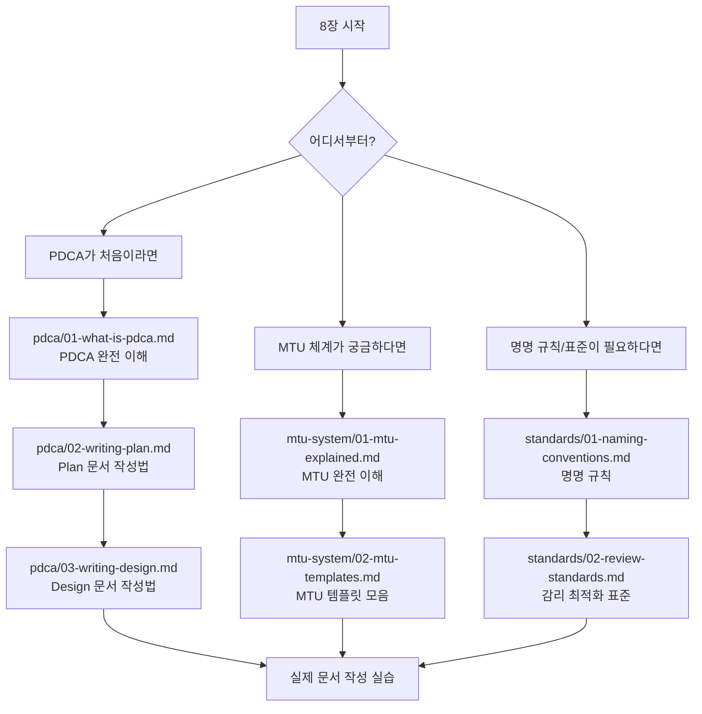
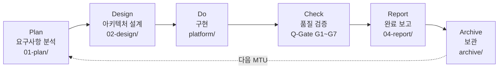

# 8장 — 문서 관리 심화 학습

> **문서 ID**: ONBOARD-08
> **버전**: 1.0.0 | **작성일**: 2026-04-11 | **작성자**: Implementer (Sonnet)
> **선행 학습**: `01-document-management.md` (1장 — 문서 관리 기초)
> **참고 문서**:
>   - `/data/ai-saas/docs/guidelines/documentation-standards.md`
>   - `/data/ai-saas/CLAUDE.md`

---

## 이 섹션에서 배우는 것

1장(문서 관리 기초)에서 전체 개요를 배웠다면, 이 섹션에서는 실제로 문서를 작성하고 관리하는 방법을 깊이 있게 다룹니다.

초보 개발자도 이 섹션을 읽으면 다음을 할 수 있습니다.

- Plan 문서를 처음부터 작성할 수 있다.
- Design 문서와 Mermaid 다이어그램을 작성할 수 있다.
- MTU 번호를 스스로 선택하고 의존성을 파악할 수 있다.
- 감리 지적 없이 문서를 완성할 수 있다.

---

## 학습 맵

---

## PDCA 사이클 요약

공공기관 SaaS 프레임워크의 모든 작업은 PDCA 사이클을 따릅니다. 이 사이클을 따르지 않으면 감리에서 결함으로 지적됩니다.

| 단계 | 위치 | 담당 에이전트 | 핵심 산출물 |
|------|------|-------------|-----------|
| Plan | `docs/01-plan/mtus/` | PM + 개발자 | `{mtu-id}.plan.md` |
| Design | `docs/02-design/mtus/` | Implementer | `{mtu-id}.design.md` |
| Do | `platform/services/` | Implementer | 코드, 테스트 |
| Check | `docs/03-analysis/` | Reviewer·Auditor·Tester | Q-Gate 결과 |
| Report | `docs/04-report/` | PM | `{mtu-id}.report.md` |
| Archive | `docs/archive/YYYY-MM/` | PM | `_INDEX.md` |

---

## 섹션 목록

### PDCA 심화 학습

| 파일 | 내용 | 분량 |
|------|------|------|
| `pdca/README.md` | PDCA 학습 경로 | 개요 |
| `pdca/01-what-is-pdca.md` | PDCA 완전 이해 (초보자용) | 400줄+ |
| `pdca/02-writing-plan.md` | Plan 문서 작성법 | 400줄+ |
| `pdca/03-writing-design.md` | Design 문서 작성법 | 350줄+ |

### MTU 체계 학습

| 파일 | 내용 | 분량 |
|------|------|------|
| `mtu-system/README.md` | MTU 체계 학습 경로 | 개요 |
| `mtu-system/01-mtu-explained.md` | MTU 완전 이해 | 350줄+ |
| `mtu-system/02-mtu-templates.md` | MTU 템플릿 모음 | 400줄+ |

### 작성 표준 학습

| 파일 | 내용 | 분량 |
|------|------|------|
| `standards/README.md` | 표준 학습 경로 | 개요 |
| `standards/01-naming-conventions.md` | 명명 규칙 완전 정리 | 300줄+ |
| `standards/02-review-standards.md` | 감리 최적화 표준 | 300줄+ |

---

## 변경 이력

| 버전 | 일자 | 내용 | 작성자 |
|------|------|------|-------|
| 1.0.0 | 2026-04-11 | 초기 작성 | Implementer (Sonnet) |
