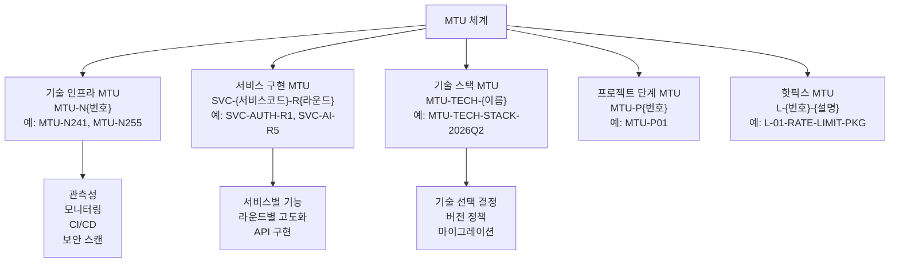
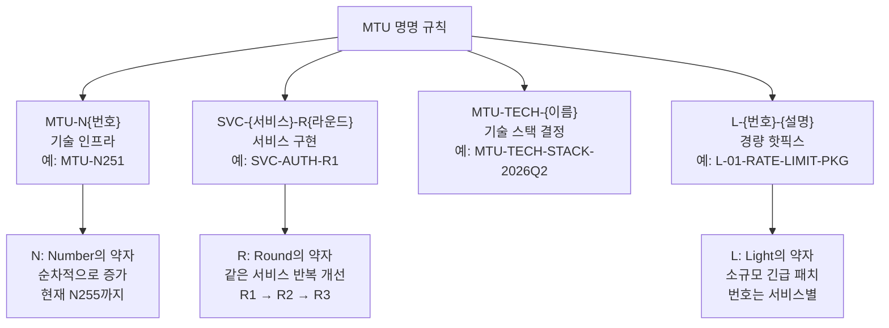
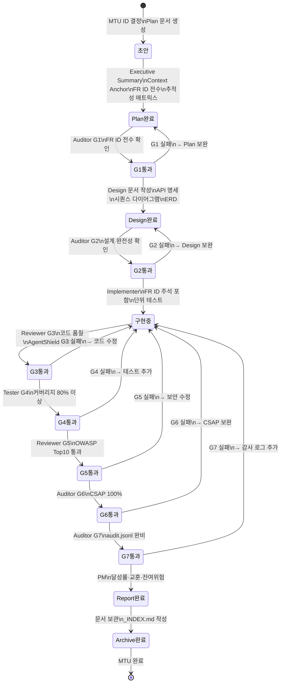
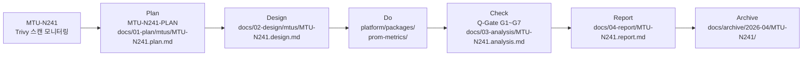
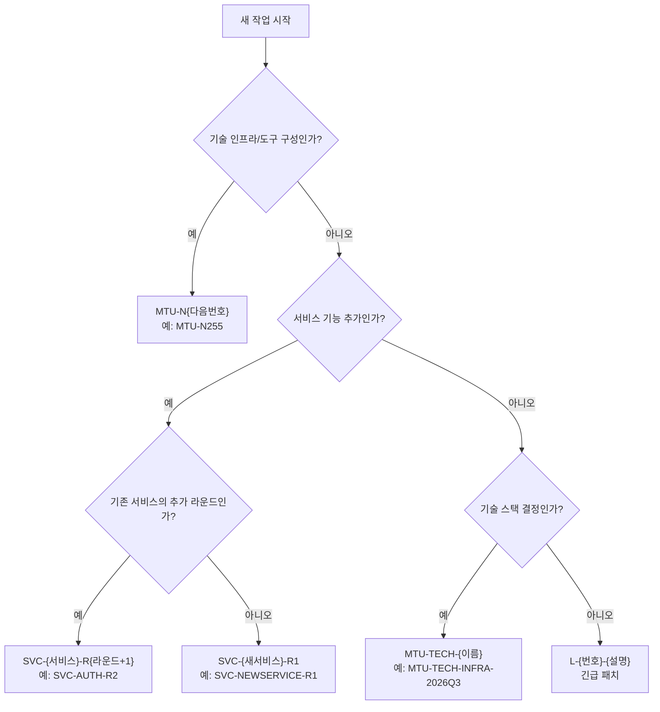
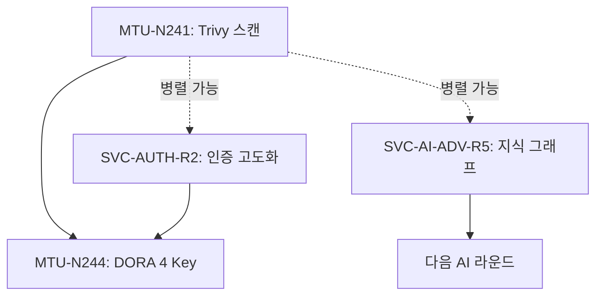
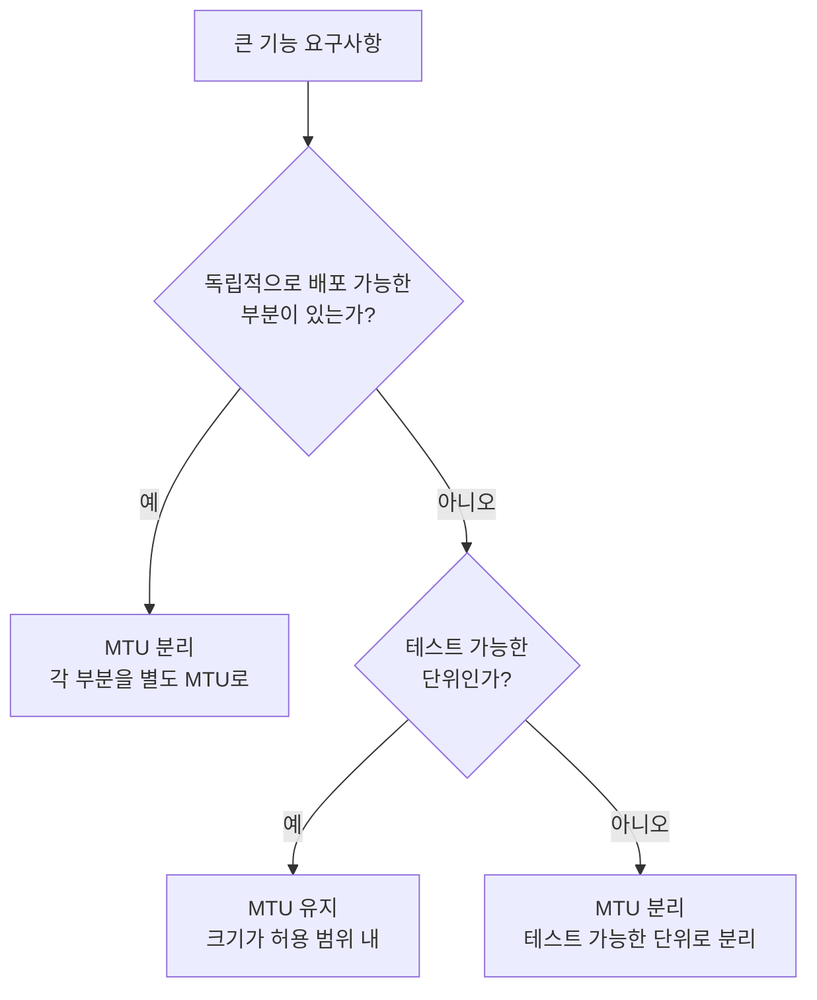

# MTU 완전 이해 — Mission Task Unit 체계

> **문서 ID**: ONBOARD-08-MTU-01
> **버전**: 2.0.0 | **작성일**: 2026-04-12 | **작성자**: Implementer (Sonnet)
> **선행 학습**: `../README.md` (MTU 체계 학습 경로)
> **소요 시간**: 1.5시간
> **참고 문서**: `.bkit/state/pdca-status.json`, `docs/01-plan/mtus/MTU-N251-dora-four-keys.plan.md`

---

## 목차

1. [MTU 정의와 의미](#1-mtu-정의와-의미)
2. [MTU 유형 분류](#2-mtu-유형-분류)
3. [MTU 명명 규칙 상세](#3-mtu-명명-규칙-상세)
4. [MTU 상태 다이어그램 — 생명주기](#4-mtu-상태-다이어그램--생명주기)
5. [MTU와 PDCA — 1:1 관계](#5-mtu와-pdca--11-관계)
6. [새 MTU 만드는 방법](#6-새-mtu-만드는-방법)
7. [MTU 의존성 관리](#7-mtu-의존성-관리)
8. [현재 완료된 주요 MTU 목록](#8-현재-완료된-주요-mtu-목록)
9. [MTU 크기 가이드라인](#9-mtu-크기-가이드라인)
10. [변경 이력](#10-변경-이력)

---

## 1. MTU 정의와 의미

### 1.1 MTU란 무엇인가

MTU(Mission Task Unit)는 이 프로젝트에서 모든 작업의 기본 단위입니다.

> "MTU = 독립적으로 계획·설계·구현·검증·보고할 수 있는 최소 작업 단위"

MTU가 없으면 작업을 시작할 수 없습니다. CLAUDE.md 절대 제약에서 "구현 착수 전 Plan + Design 문서 완비 필수"는 곧 "MTU 정의 및 문서화 완비 필수"를 의미합니다.

### 1.2 MTU와 일반 티켓(이슈)의 차이

일반 Jira/GitHub 이슈와 MTU는 다릅니다.

| 항목 | 일반 이슈 | MTU |
|------|---------|-----|
| 범위 | 유동적 | 고정 (SCOPE 명시) |
| 문서 | 선택 | 필수 (Plan + Design) |
| 추적성 | 없음 | 4방향 추적 (FR↔산출물↔테스트↔CSAP) |
| 완료 기준 | 담당자 판단 | Q-Gate G1~G7 전체 PASS |
| 감리 증적 | 없음 | archive/에 영구 보관 |

### 1.3 MTU를 사용하는 이유

공공기관 정보화사업에서 MTU 체계는 다음을 보장합니다.

- 감리단에게 "이 기능이 언제, 왜, 어떻게 만들어졌는가"를 입증
- 팀원 교체 시에도 작업 맥락이 문서로 보존
- CSAP 79개 항목 중 어느 항목을 이 MTU가 충족하는지 추적 가능
- 유지보수 시 관련 MTU를 찾아 설계 의도 확인 가능

---

## 2. MTU 유형 분류

MTU는 유형에 따라 다른 명명 규칙을 사용합니다.



### 2.1 유형별 상세

#### MTU-N{번호}: 기술 인프라 MTU

N은 Number(숫자)를 의미합니다. 기술 인프라, 관측성, CI/CD, 보안 도구 구성 등에 사용합니다.

```
MTU-N241: Trivy Operator 취약점 스캔 성능 모니터링
MTU-N243: 플랫폼 성숙도 평가
MTU-N251: DORA 4 Key 메트릭
MTU-N255: (다음 번호 사용 예정)
```

#### SVC-{서비스코드}-R{라운드}: 서비스 구현 MTU

서비스 코드는 P01~P15 또는 도메인 코드(AUTH, AI, AUDIT 등)를 사용합니다. R{라운드}는 해당 서비스의 몇 번째 구현 라운드인지를 나타냅니다.

```
SVC-AUTH-R1: 인증 서비스 1차 고도화 (MFA, 비밀번호 변경 등)
SVC-AI-R1: AI 서비스 1차 고도화 (프롬프트 방어, PII 필터링)
SVC-AI-ADV-R5: AI 서비스 고급 기능 R5 (지식 그래프 RAG)
SVC-NOTIF-R1: 알림 서비스 1차 구현
```

#### MTU-TECH-{이름}: 기술 스택 결정 MTU

기술 스택 선택·버전 정책·프레임워크 업그레이드 등 기술적 결정에 사용합니다.

```
MTU-TECH-STACK-2026Q2: 2026년 2분기 기술 스택 확정
```

#### L-{번호}-{설명}: 핫픽스/보안 패치 MTU

긴급 보안 패치나 핫픽스에 사용합니다.

```
L-01-RATE-LIMIT-PKG: Rate Limiting 패키지 긴급 적용
L-03-HTTPONLY-COOKIE: HttpOnly Cookie 긴급 패치
L-04-CSP-NONCE: CSP Nonce 긴급 적용
```

---

---

## 3. MTU 명명 규칙 상세

### 3.1 명명 패턴 요약



### 3.2 서비스 코드 목록

| 코드 | 서비스명 |
|------|---------|
| AUTH | 인증 서비스 |
| GW | API Gateway |
| TENANT | 테넌트 서비스 |
| AI | AI 서비스 |
| AI-ADV | AI 서비스 고급 기능 |
| AUDIT | 감사 서비스 |
| SECMON | 보안 모니터링 서비스 |
| NOTIF | 알림 서비스 |
| HEALTHAGG | 건강 집계 서비스 |
| SECRETMGR | 시크릿 관리자 |
| CIRCUIT | 서킷 브레이커 |
| GRACEFUL | 안전 종료 |
| RATELIMIT | Rate Limiting |

### 3.3 실제 파일명 예시

```
docs/01-plan/mtus/
├── MTU-N251-dora-four-keys.plan.md       # 기술 인프라
├── MTU-N252-aiops-rca.plan.md            # 기술 인프라
├── SVC-AI-ADV-R2.plan.md                 # 서비스 구현
├── SVC-AI-ADV-R5.plan.md                 # 서비스 구현
├── L-01-RATE-LIMIT-PKG.plan.md           # 경량 패치
└── MTU-TECH-STACK-2026Q2.plan.md        # 기술 결정

docs/02-design/mtus/
├── MTU-N251-dora-four-keys.design.md     # 동일 ID, .design.md 확장자
└── SVC-AI-ADV-R5.design.md
```

---

## 4. MTU 상태 다이어그램 — 생명주기

MTU는 생성부터 아카이브까지 다음 상태를 거칩니다.



### 4.1 각 상태의 완료 조건

| 상태 | 완료 조건 | 담당 |
|------|---------|------|
| 초안 | MTU-ID 결정, plan.md 파일 생성 | PM/개발자 |
| Plan완료 | 7개 섹션 모두 작성 | PM/개발자 |
| G1통과 | Auditor: FR ID 전수 확인 | Auditor |
| Design완료 | 필수 섹션 + 파일 변경 목록 완성 | Implementer |
| G2통과 | Auditor: 설계 완전성 확인 | Auditor |
| 구현중 | FR ID 주석 + 단위 테스트 포함 코드 | Implementer |
| G3~G7통과 | 각 게이트 통과 | 담당 에이전트 |
| Report완료 | 달성률, 교훈, 잔여위험 기록 | PM |
| Archive완료 | _INDEX.md + 모든 문서 보관 | PM |

---

## 5. MTU와 PDCA — 1:1 관계

### 3.1 MTU-N 번호 체계

MTU-N 번호는 프로젝트 전체에서 순차적으로 부여됩니다. 번호 범위로 어떤 단계의 작업인지 대략 파악할 수 있습니다.

| 구간 | 대략적 내용 | 완료 여부 |
|------|---------|---------|
| N27~N35 | k3s 기초 인프라, Cosign, 네트워크 정책, E2E 테스트 준비 | 완료 |
| N36~N50 | 모니터링 시스템, CI/CD 자동화, Sealed Secrets, Helm Umbrella | 완료 |
| N51~N70 | 보안 강화 (Kyverno, Flagger, Semver, Pipeline Benchmark) | 완료 |
| N71~N90 | 서비스 구현 기반 (Auth·Gateway·Tenant·Audit·AI 초기) | 완료 |
| N91~N110 | 품질 게이트 (Semgrep, OpenSSF Scorecard, OWASP) | 완료 |
| N111~N140 | DR·멀티클러스터·배포 자동화 | 완료 |
| N141~N170 | SLO·SLI·이상 탐지·예측 알림 | 완료 |
| N171~N200 | CSAP 증적·DORA·BuildKit 캐시 최적화 | 완료 |
| N201~N220 | ML 파이프라인·Feature Flag·AIOps | 완료 |
| N221~N240 | 건강 집계·시크릿 관리·서킷 브레이커 | 완료 |
| N241~N255 | 취약점 스캔·플랫폼 성숙도·DORA 고도화 | 진행 중 |

### 3.2 현재 사용 가능한 다음 번호

2026-04-11 기준으로 N241 이후 번호가 할당 중입니다. 새 MTU-N을 만들 때는 현재 가장 높은 번호 + 1을 사용합니다.

```bash
# 현재 사용된 최대 번호 확인 방법
ls docs/01-plan/mtus/ | grep "MTU-N" | sort -V | tail -5
```

### 3.3 라운드 번호 (SVC-*-R{번호})

R(Round) 번호는 해당 서비스의 기능 추가 라운드를 의미합니다.

```
SVC-AUTH-R1: 인증 서비스 1차 고도화
SVC-AUTH-R2: 인증 서비스 2차 고도화 (1차 완료 후)
SVC-AUTH-R3: 인증 서비스 3차 고도화
```

같은 서비스의 다음 라운드를 시작할 때는 이전 라운드의 Report가 완료된 후 새 Plan을 작성합니다.

---

## 5. MTU와 PDCA — 1:1 관계 (이전 §4)

MTU와 PDCA 사이클은 1:1 관계입니다.



이 흐름에서 MTU-ID는 모든 파일명에 공통으로 사용됩니다. 따라서 MTU-ID를 보면 관련 문서를 모두 찾을 수 있습니다.

### 4.1 MTU가 완료되는 시점

MTU 완료 기준은 다음과 같습니다.

```
1. Q-Gate G1~G7 전체 PASS
2. Report 문서 작성 완료 (달성률, 교훈 포함)
3. archive/에 모든 문서 보관
4. git 태그 또는 CHANGELOG 업데이트
```

---

## 6. 새 MTU 만드는 방법

### 5.1 새 작업 시 MTU 유형 선택



### 5.2 의존성 파악 방법

새 MTU를 시작하기 전에 의존하는 MTU가 완료되었는지 확인합니다.

**의존성 확인 방법**:

```bash
# 관련 서비스의 기존 Plan 파일 목록 확인
ls docs/01-plan/mtus/ | grep "SVC-AI"
# 결과: SVC-AI-R1.plan.md, SVC-AI-ADV-R2.plan.md, ..., SVC-AI-ADV-R5.plan.md

# 관련 Report 완료 여부 확인
ls docs/04-report/ | grep "SVC-AI"
```

**Plan 문서에 의존성 명시**:

```markdown
> **의존성**: SVC-AI-ADV-R4 완료 필수 (FR-ADV4.5 엔드포인트 사용)
> **의존성**: MTU-N220 완료 필수 (ML 파이프라인 베이스 사용)
```

### 5.3 병렬 진행 가능한 MTU

의존성이 없는 MTU는 병렬로 진행할 수 있습니다.



---

## 7. MTU 의존성 관리

### 6.1 Phase 1 Foundation (완료)

| MTU-ID | 내용 | 완료일 |
|--------|------|-------|
| MTU-N27 | Cosign 이미지 서명 | 2026-04-05 |
| MTU-N28 | k3s CI/CD 마이그레이션 + 네트워크 정책 격리 | 2026-04-05 |
| MTU-N29 | E2E 시나리오 테스트 | 2026-04-05 |
| MTU-N30 | 릴리즈 준비 자동화 | 2026-04-05 |
| MTU-N31 | Kyverno 정책 강제 | 2026-04-05 |

### 6.2 서비스 구현 MTU (완료)

| MTU-ID | 내용 | 주요 FR |
|--------|------|-------|
| SVC-AUTH-R1 | 인증 서비스 고도화 (MFA, 비밀번호 변경, Rate Limiting) | FR-AUTH.1~7 |
| SVC-GATEWAY-R1 | API Gateway 고도화 (Rate Limiting, 인증 프록시) | FR-GW.1~5 |
| SVC-TENANT-R1 | 테넌트 서비스 (격리, 설정 관리) | FR-TENANT.1~6 |
| SVC-AI-R1 | AI 서비스 (프롬프트 방어, PII 필터링, 사용량 제한) | FR-AI.1~4 |
| SVC-AUDIT-R1 | 감사 서비스 (이벤트 수집, 검색) | FR-P13.1~8 |
| SVC-SECMON-R1 | 보안 모니터링 서비스 | FR-P15.1~6 |
| SVC-AI-ADV-R5 | AI 고급 기능 R5 (지식 그래프 RAG) | FR-ADV5.1~5 |

### 6.3 관측성 MTU (완료)

| MTU-ID | 내용 |
|--------|------|
| MTU-N83 | 이상 탐지 (Z-Score 기반) |
| MTU-N84 | CSAP 증적 수집 |
| MTU-N85 | 감사 보고서 생성 |
| MTU-N241 | Trivy 취약점 스캔 모니터링 |
| MTU-N251 | DORA 4 Key 메트릭 |
| MTU-N252 | AIOps RCA (근본 원인 분석) |

### 6.4 보안/인프라 MTU (완료)

| MTU-ID | 내용 |
|--------|------|
| L-01-RATE-LIMIT-PKG | Rate Limiting 패키지 긴급 적용 |
| L-03-HTTPONLY-COOKIE | HttpOnly Cookie 보안 패치 |
| L-04-CSP-NONCE | CSP Nonce 보안 패치 |
| MTU-N39 | Sealed Secrets (시크릿 암호화) |
| MTU-N80 | S2C2F 프레임워크 |
| MTU-N90 | OpenSSF Scorecard |
| MTU-N91 | Semgrep 품질 게이트 |

---

## 8. 현재 완료된 주요 MTU 목록

### 7.1 단계별 MTU 정의 절차

**1단계: 요구사항 파악**

새 기능이 필요한 이유와 범위를 파악합니다.

```
질문 1: 이 기능이 없으면 어떤 문제가 있는가?
질문 2: 이 기능의 사용자는 누구인가?
질문 3: 이 기능이 완료되면 어떻게 알 수 있는가?
```

**2단계: MTU 유형 선택**

위 5.1의 플로우차트를 참고하여 MTU 유형을 선택합니다.

**3단계: MTU-ID 확정**

```bash
# 현재 사용 중인 최대 MTU-N 번호 확인
ls /data/ai-saas/docs/01-plan/mtus/ | grep "MTU-N" | \
  grep -oP "MTU-N\K[0-9]+" | sort -n | tail -1
```

**4단계: Plan 문서 작성 시작**

`docs/01-plan/mtus/{MTU-ID}.plan.md` 파일을 생성합니다.

`mtu-system/02-mtu-templates.md`의 Plan 템플릿을 복사하여 시작합니다.

### 7.2 MTU 크기 가이드라인

MTU의 적정 크기를 판단하는 기준입니다.

| 기준 | 적정 크기 | 비고 |
|------|---------|------|
| FR 개수 | 3~10개 | 그 이상이면 MTU 분리 검토 |
| 구현 파일 수 | 5~15개 | 그 이상이면 MTU 분리 검토 |
| 예상 구현 시간 | 2~8시간 | 하루 이상이면 분리 검토 |

**너무 큰 MTU의 문제**:
- 중간에 완료 기준을 확인하기 어려움
- Q-Gate 통과에 오랜 시간 소요
- 하나의 문제가 전체 MTU를 블로킹

**너무 작은 MTU의 문제**:
- 문서 오버헤드가 구현보다 큼
- MTU 간 의존성 관리 복잡

### 7.3 MTU 분리 기준

하나의 MTU가 너무 커질 때 분리하는 기준입니다.



**분리 예시**:

"AI 서비스 전체 구현"은 너무 큽니다. 다음과 같이 분리합니다.

```
SVC-AI-R1: 기본 보안 (프롬프트 방어, PII 필터링, 사용량 제한)
SVC-AI-ADV-R2: Plan-Execute 에이전트 + 메모리
SVC-AI-ADV-R3: AI Safety & Guardrails
SVC-AI-ADV-R4: 구조화된 Tool Use / Function Calling
SVC-AI-ADV-R5: 지식 그래프 RAG
```

각 라운드가 독립적으로 완료·검증·배포 가능합니다.

---

## 9. MTU 크기 가이드라인

| 기준 | 적정 크기 | 비고 |
|------|---------|------|
| FR 개수 | 3~10개 | 초과 시 MTU 분리 검토 |
| 구현 파일 수 | 5~15개 | 초과 시 분리 검토 |
| 예상 구현 시간 | 2~8시간 | 하루 이상이면 분리 |

**분리 예시**: "AI 서비스 전체 구현"은 너무 큽니다.
```
SVC-AI-R1: 기본 보안 (프롬프트 방어, PII 필터링)
SVC-AI-ADV-R2: Plan-Execute 에이전트 + 메모리
SVC-AI-ADV-R5: 지식 그래프 RAG
```

---

## 10. 변경 이력

| 버전 | 일자 | 내용 | 작성자 |
|------|------|------|-------|
| 2.0.0 | 2026-04-12 | MTU 상태 다이어그램, 명명 규칙 상세, 섹션 재구성 | Implementer (Sonnet) |
| 1.0.0 | 2026-04-11 | 초기 작성 | Implementer (Sonnet) |
