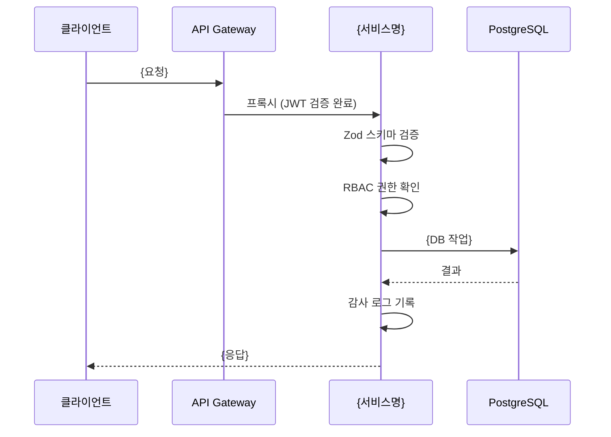

# MTU 템플릿 모음 — 복사해서 바로 사용

> **문서 ID**: ONBOARD-08-MTU-02
> **버전**: 2.0.0 | **작성일**: 2026-04-12 | **작성자**: Implementer (Sonnet)
> **선행 학습**: `01-mtu-explained.md` (MTU 완전 이해)
> **소요 시간**: 30분 (템플릿 복사 및 커스텀)

---

## 목차

1. [Plan 템플릿 — 서비스 구현 MTU](#1-plan-템플릿--서비스-구현-mtu)
2. [Plan 템플릿 — 기술 인프라 MTU](#2-plan-템플릿--기술-인프라-mtu)
3. [Design 템플릿 — 서비스 구현 MTU](#3-design-템플릿--서비스-구현-mtu)
4. [Design 템플릿 — 기술 인프라 MTU](#4-design-템플릿--기술-인프라-mtu)
5. [Report 템플릿](#5-report-템플릿)
6. [각 섹션별 작성 가이드](#6-각-섹션별-작성-가이드)
7. [실제 완성된 MTU 파일과 비교](#7-실제-완성된-mtu-파일과-비교)
8. [변경 이력](#8-변경-이력)

---

## 1. Plan 템플릿 — 서비스 구현 MTU

이 템플릿은 `SVC-{서비스}-R{라운드}` 형식의 서비스 구현 MTU에 사용합니다.

아래 텍스트를 복사하여 `docs/01-plan/mtus/{MTU-ID}.plan.md`에 저장하고 `{중괄호}` 항목을 채워 넣습니다.

```markdown
# {MTU-ID}: {MTU명} — Plan

> **문서 ID**: {MTU-ID}-PLAN
> **버전**: 1.0.0 | **작성일**: {YYYY-MM-DD} | **작성자**: {이름}
> **분류**: {Phase명} / {카테고리}
> **의존성**: {선행 MTU-ID 목록 또는 없음}

---

## 1. Executive Summary

| 관점 | 내용 |
|------|------|
| 비즈니스 | {사용자/기관에 주는 가치를 한 문장으로} |
| 기술 | {핵심 기술 컴포넌트 나열} |
| 보안 | {CSAP 항목, N2SF 등급, 핵심 보안 요건} |
| 운영 | {모니터링, SLI/SLO, 장애 대응 방침} |

---

## 2. Context Anchor

### WHY (왜 필요한가)
{현재 상태 설명}
{문제점 또는 개선 필요성}
{이 MTU가 해결하는 것}

### WHO (이해관계자)
| 역할 | 관심사 |
|------|-------|
| {역할 1} | {이 기능이 해당 역할에 주는 가치/우려} |
| {역할 2} | {이 기능이 해당 역할에 주는 가치/우려} |
| 감리단 | {CSAP·N2SF 준수 여부} |

### RISK (위험 요소)
| ID | 위험 | 영향 | 대응 |
|----|------|------|------|
| R1 | {구체적인 위험 1} | {발생 시 영향} | {대응 방안} |
| R2 | {구체적인 위험 2} | {발생 시 영향} | {대응 방안} |

### SUCCESS (성공 기준)
| ID | 기준 | 측정 방법 |
|----|------|----------|
| SC-1 | {측정 가능한 기준 (숫자 포함)} | {어떻게 측정하는가} |
| SC-2 | Q-Gate G1~G7 전체 PASS | 에이전트 자동 검증 |

### SCOPE (범위)
**포함**:
- {포함 항목 1}
- {포함 항목 2}

**제외**:
- {제외 항목 1 (이유 또는 다음 라운드 계획)}
- {제외 항목 2}

---

## 3. 기능 요구사항

| ID | 요구사항 | 우선순위 |
|----|---------|---------|
| FR-{모듈}.1 | {기능 설명 — 구체적이고 측정 가능하게} | 필수 |
| FR-{모듈}.2 | {기능 설명} | 필수 |
| FR-{모듈}.3 | {기능 설명} | 중요 |
| FR-{모듈}.4 | {기능 설명} | 선택 |

---

## 4. 비기능 요구사항

| ID | 요구사항 | 기준값 | CSAP |
|----|---------|-------|------|
| NFR-1 | 응답 시간 | P95 {N}ms 이하 | — |
| NFR-2 | 가용성 | {N}% | D-07 |
| NFR-3 | 데이터 분류 준수 | N2SF {등급}등급, C/S 데이터 AI 전송 금지 | N2SF |
| NFR-4 | 테넌트 격리 | 100% | D-08 |

---

## 5. 추적성 매트릭스

| 요구사항 | 산출물 | 테스트 | CSAP |
|---------|-------|-------|------|
| FR-{모듈}.1 | {서비스}/src/{경로}/{파일}.ts | TC-{모듈}-01 | {D-항목} |
| FR-{모듈}.2 | {서비스}/src/{경로}/{파일}.ts | TC-{모듈}-02 | {D-항목} |
| FR-{모듈}.3 | {서비스}/src/{경로}/{파일}.ts | TC-{모듈}-03 | — |

---

## 6. 변경 이력

| 버전 | 일자 | 내용 | 작성자 |
|------|------|------|-------|
| 1.0.0 | {YYYY-MM-DD} | 초기 작성 | {이름} |
```

---

## 2. Plan 템플릿 — 기술 인프라 MTU

이 템플릿은 `MTU-N{번호}` 형식의 기술 인프라 MTU에 사용합니다. 서비스 구현 MTU보다 간결합니다.

```markdown
# {MTU-ID}: {MTU명} — Plan

> **문서 ID**: {MTU-ID}-PLAN
> **버전**: 1.0.0 | **작성일**: {YYYY-MM-DD}
> **Phase**: {Round 번호} — {카테고리}

---

## Executive Summary

| 관점 | 내용 |
|------|------|
| 비즈니스 | {운영/보안 개선 효과} |
| 기술 | {사용 도구, 구현 방식} |
| 보안 | {CSAP 항목} |
| 운영 | {모니터링, 알림 규칙} |

---

## 기능 요구사항

| ID | 요구사항 | 우선순위 |
|----|---------|---------|
| FR-{번호}.1 | {요구사항} | HIGH |
| FR-{번호}.2 | {요구사항} | HIGH |
| FR-{번호}.3 | {요구사항} | MED |

---

## 변경 이력

| 버전 | 일자 | 내용 | 작성자 |
|------|------|------|--------|
| 1.0.0 | {YYYY-MM-DD} | 최초 작성 | {이름} |
```

---

## 3. Design 템플릿 — 서비스 구현 MTU

이 템플릿은 서비스 구현 MTU의 Design 문서에 사용합니다.

`docs/02-design/mtus/{MTU-ID}.design.md`로 저장합니다.

```markdown
# Design: {MTU명}

> MTU ID: {MTU-ID}
> 버전: 1.0.0 | 작성일: {YYYY-MM-DD}
> Plan 참조: docs/01-plan/mtus/{MTU-ID}.plan.md

---

## Executive Summary

| 관점 | 내용 |
|------|------|
| 비즈니스 | {Plan의 비즈니스 요약 반영} |
| 기술 | {핵심 설계 결정 사항} |
| 보안 | {보안 설계 결정 (CSAP 항목 포함)} |
| 운영 | {모니터링 설계} |

## Design Anchor

- **Plan 참조**: docs/01-plan/mtus/{MTU-ID}.plan.md
- **설계 원칙**:
  1. {원칙 1}
  2. {원칙 2}
  3. CSAP D-12 입력 검증 전수 적용
- **아키텍처 결정**:
  - {결정 1}: {이유}
  - {결정 2}: {이유}

---

## 아키텍처 다이어그램

```mermaid
graph TD
  C[클라이언트] --> GW[API Gateway]
  GW --> Svc[{서비스명}]
  Svc --> DB[(PostgreSQL)]
  Svc --> Cache[(Redis)]
```

## API 명세

| 메서드 | 경로 | 설명 | 인증 | CSAP |
|--------|------|------|------|------|
| {메서드} | {경로} | {설명} | {인증 방식} | {CSAP 항목} |

---

## 1. FR-{모듈}.1: {FR 이름}

### 1.1 설계

{이 FR의 구현 방식 설명}

**신규 파일**: `{서비스}/src/{경로}/{파일}.ts`

```typescript
// 핵심 인터페이스 또는 함수 시그니처
interface {InterfaceName} {
  // ...
}
```

**흐름**:
```
{단계 1} → {단계 2} → {단계 3}
```

### 1.2 CSAP 고려사항

| 항목 | 내용 |
|------|------|
| D-{번호} | {적용 내용} |

---

## 2. FR-{모듈}.2: {FR 이름}

(동일 구조 반복)

---

## 핵심 시퀀스 다이어그램



---

## 파일 변경 목록

| 작업 | 파일 경로 | 관련 FR |
|------|---------|-------|
| 신규 | platform/services/{서비스}/src/{경로} | FR-{모듈}.1 |
| 수정 | platform/services/{서비스}/src/routes.ts | FR-{모듈}.1 |

---

## 변경 이력

| 버전 | 일자 | 내용 | 작성자 |
|------|------|------|-------|
| 1.0.0 | {YYYY-MM-DD} | 초기 설계 | {이름} |
```

---

## 4. Design 템플릿 — 기술 인프라 MTU

기술 인프라 MTU의 Design은 서비스 구현보다 간결할 수 있습니다.

```markdown
# Design: {MTU명}

> MTU ID: {MTU-ID}
> 버전: 1.0.0 | 작성일: {YYYY-MM-DD}
> Plan 참조: docs/01-plan/mtus/{MTU-ID}.plan.md

---

## Design Anchor

- **접근 방식**: {설계 접근 방식}
- **핵심 결정**: {주요 기술 결정}
- **제약**: CLAUDE.md 절대 제약 준수

---

## 구현 설계

### FR-{번호}.1: {FR 이름}

**구현 방식**:
- {구현 방식 설명}
- {생성할 파일 또는 설정}

**설정 예시**:
```yaml
# {파일명}
{설정 내용}
```

---

## 파일 변경 목록

| 작업 | 파일 경로 | 관련 FR |
|------|---------|-------|
| 신규 | {경로} | FR-{번호}.1 |

---

## 변경 이력

| 버전 | 일자 | 내용 | 작성자 |
|------|------|------|-------|
| 1.0.0 | {YYYY-MM-DD} | 초기 설계 | {이름} |
```

---

## 5. Report 템플릿

PDCA 완료 후 `docs/04-report/{MTU-ID}.report.md`로 저장합니다.

```markdown
# {MTU-ID} Report — PDCA 완료 보고서

> **MTU ID**: {MTU-ID}
> **버전**: 1.0.0 | **완료일**: {YYYY-MM-DD}
> **분류**: {Phase명} / {카테고리}

---

## 1. Executive Summary

| 관점 | 목표 | 달성 | 달성률 |
|------|------|------|-------|
| 기능 | FR {N}개 구현 | FR {N}개 구현 | {N}% |
| 보안 | {보안 목표} | {달성 내용} | {N}% |
| 성능 | {성능 목표} | {측정 결과} | {N}% |
| 운영 | {운영 목표} | {달성 내용} | {N}% |

---

## 2. Success Criteria Final Status

Plan 문서의 SUCCESS 기준 달성 여부입니다.

| ID | 기준 | 상태 | 실측값 |
|----|------|------|-------|
| SC-1 | {Plan의 SC-1 기준} | PASS / FAIL | {측정값} |
| SC-2 | Q-Gate G1~G7 전체 PASS | PASS | G1~G7 전체 통과 |

---

## 3. Q-Gate 결과

| 게이트 | 기준 | 결과 | 비고 |
|--------|------|------|------|
| G1 | FR ID 전수 | PASS | FR-{모듈}.1~{N} 전수 확인 |
| G2 | 설계 완전성 | PASS | |
| G3 | 코드 품질 | PASS | |
| G4 | 테스트 커버리지 80%+ | PASS | {N}% |
| G5 | OWASP Top10 | PASS | |
| G6 | CSAP {항목} 100% | PASS | |
| G7 | audit.jsonl 완비 | PASS | |

---

## 4. 발견된 이슈 및 해결 방법

| 이슈 | 해결 방법 | 잔여 위험 |
|------|---------|---------|
| {이슈 1} | {해결 내용} | {잔여 위험 또는 없음} |

---

## 5. 교훈 (Lessons Learned)

{이번 MTU에서 얻은 기술적·프로세스적 교훈}

**다음 라운드 반영 사항**:
- {다음 MTU에서 개선할 사항}

---

## 6. 변경 이력

| 버전 | 일자 | 내용 | 작성자 |
|------|------|------|-------|
| 1.0.0 | {YYYY-MM-DD} | 초기 작성 | {이름} |
```

---

## 6. 각 섹션별 작성 가이드

### 6.1 Executive Summary — 4관점 채우기 전략

초보자가 가장 어려워하는 섹션입니다. 다음 질문에 답하면 자연스럽게 채워집니다.

| 관점 | 핵심 질문 | 답변 형식 |
|------|---------|---------|
| 비즈니스 | 이 기능이 없으면 사용자/기관에 어떤 불편이 있는가? | 주어 + 동사 + 효과 |
| 기술 | 핵심 기술 컴포넌트는 무엇인가? | 도구 나열 → 구현 방식 |
| 보안 | 어떤 CSAP 항목이 적용되는가? N2SF 등급은? | CSAP D-{번호} + N2SF 등급 |
| 운영 | 어떻게 모니터링하고 장애에 대응하는가? | SLI/SLO + 알림 + 대응 |

### 6.2 Context Anchor — WHY의 구조

WHY는 다음 3단 구조로 작성합니다.

```
문단 1: 현재 상태 (AS-IS)
문단 2: 문제점 또는 개선 필요성
문단 3: 이 MTU로 해결하는 것 (TO-BE)
```

예시:
```markdown
현재 AI 서비스는 단순 벡터 검색만 지원합니다. (AS-IS)
공공기관 법령 간 참조·개정·상위법 관계를 파악하지 못해 관련 법령이 누락됩니다. (문제점)
지식 그래프 기반 RAG를 도입하여 법령 관계를 모델링하고 검색 재현율을 향상합니다. (TO-BE)
```

### 6.3 기능 요구사항 — 좋은 FR 작성 기준

좋은 FR은 구현 완료 여부를 객관적으로 판단할 수 있습니다.

**나쁜 FR**: "그래프 기능을 추가한다"
- 무엇을 구현해야 하는지 불명확
- 완료 여부 판단 불가

**좋은 FR**: "법령 엔티티(법령명, 조문번호, 기관명)와 관계(참조, 개정)를 노드·엣지로 저장하는 인메모리 지식 그래프를 구현한다. 최대 노드 수 100,000, tenantId 기반 격리"
- 구현 대상 명확
- 완료 기준 명확 (인메모리, 노드 수 제한, 격리)

### 6.4 RISK — 위험 식별 방법

위험을 식별하기 어렵다면 다음 카테고리에서 생각해보세요.

| 카테고리 | 예시 위험 |
|---------|---------|
| 기술적 위험 | 사용하는 라이브러리가 원하는 기능을 지원하지 않을 수 있음 |
| 성능 위험 | 데이터 양이 많을 때 응답 시간 초과 |
| 보안 위험 | 테넌트 간 데이터 혼합 가능성 |
| 의존성 위험 | 외부 서비스(LLM API) 장애 시 폴백 미흡 |
| 일정 위험 | 예상보다 복잡한 구현으로 일정 지연 |

### 6.5 추적성 매트릭스 — 단계별 완성

추적성 매트릭스를 한 번에 완성하려 하지 마세요. 단계별로 채웁니다.

**Plan 단계**: FR ID + 예상 파일 경로 + 예상 테스트 ID + CSAP 항목
```markdown
| FR-ADV5.1 | ai-service/src/lib/entity-extractor.ts (예상) | TC-ADV5-01 (예상) | D-12-01 |
```

**Design 단계**: 파일 경로 확정
```markdown
| FR-ADV5.1 | platform/services/ai-service/src/lib/entity-extractor.ts | TC-ADV5-01 (예상) | D-12-01 |
```

**Do 단계 완료 후**: 테스트 ID 확정
```markdown
| FR-ADV5.1 | platform/services/ai-service/src/lib/entity-extractor.ts | TC-ADV5-01 | D-12-01 |
```

---

## 7. 실제 완성된 MTU 파일과 비교

### 7.1 완성도 비교: MTU-N241 vs SVC-AI-ADV-R5

실제 파일에서 배울 수 있는 점을 비교합니다.

| 항목 | MTU-N241 | SVC-AI-ADV-R5 | 권고 |
|------|---------|--------------|------|
| 헤더 형식 | 문서 ID, 버전, 작성일 | 버전, 작성일 | 두 형식 모두 허용 |
| Executive Summary | 4관점 (비즈니스·기술·보안·운영) | 3관점 (운영 누락) | 4관점 필수 권고 |
| Context Anchor | 없음 | 없음 | 서비스 MTU는 필수 |
| FR 형식 | 테이블 + ID + 우선순위 | 테이블 + ID + 우선순위 | 두 형식 동일 (좋음) |
| 추적성 매트릭스 | 없음 | 없음 | 서비스 MTU는 필수 |
| 변경 이력 | 있음 | 없음 | 필수 |

**교훈**: 현재 실제 파일들도 일부 항목이 누락되어 있습니다. 이 가이드에서 배운 것처럼 완전한 템플릿을 사용하면 더 높은 감리 점수를 받을 수 있습니다.

### 7.2 SVC-AUTH-R1 Design 우수 사례

```markdown
## 1. FR-AUTH.1: 로그인 MFA 검증 통합

### 1.1 설계
**흐름 변경**:
기존: 비밀번호 검증 → JWT 발급
변경: 비밀번호 검증 → MFA 확인 → (MFA 활성 시 TOTP 검증) → JWT 발급

**응답 코드**:
- MFA 활성 + mfaCode 미제공: 403 { code: 'MFA_REQUIRED' }
- MFA 활성 + mfaCode 오류: 401 { code: 'MFA_INVALID_CODE' }
- MFA 비활성: 기존 흐름 유지
```

배울 점:
- FR별로 섹션을 구분하여 가독성 향상
- 기존 vs 변경 흐름을 명확히 비교
- 에러 응답 코드를 설계 단계에서 확정
- Design 단계에서 이미 에러 케이스를 고려

### 7.3 체크리스트: 템플릿 사용 완료 기준

Plan 템플릿을 채운 후 제출 전에 확인합니다.

```
[ ] {중괄호} 항목이 모두 실제 내용으로 교체되었는가?
[ ] 파일명이 {MTU-ID}.plan.md 형식인가?
[ ] 저장 위치가 docs/01-plan/mtus/인가?
[ ] FR ID가 FR-{모듈}.{번호} 형식인가?
[ ] 모듈 코드가 공식 24개 중 하나인가?
[ ] 변경 이력에 1.0.0 최초 버전이 기록되었는가?
[ ] SUCCESS 기준에 측정 가능한 숫자가 포함되었는가?
[ ] SCOPE에 제외 항목이 명시되었는가?
```

---

---

## 9. Review 체크리스트 템플릿

Reviewer 에이전트 또는 팀원이 코드 리뷰 시 사용합니다.

```markdown
# Review Checklist — {MTU-ID}

> **검토일**: {YYYY-MM-DD}
> **검토자**: Reviewer (Sonnet)
> **대상**: {구현 파일 목록}

---

## G3: 코드 품질 체크리스트

### 코딩 스타일
- [ ] 들여쓰기: 2칸 (TypeScript), 4칸 (Python)
- [ ] 함수 크기: 80줄 이하
- [ ] 파일 크기: 800줄 이하
- [ ] 중첩 깊이: 4단계 이하
- [ ] 줄 길이: 120자 이하
- [ ] 변수명: 명확하고 자명한 이름 (약어 금지)

### 코드 품질
- [ ] 미사용 import 없음
- [ ] `any` 타입 남용 없음
- [ ] Dead code 없음
- [ ] 주석 처리된 코드 없음
- [ ] 하드코딩된 시크릿/비밀번호 없음

### FR ID 추적성
- [ ] 모든 파일 상단에 Design Ref 주석
- [ ] 모든 파일 상단에 Plan SC 주석
- [ ] 모든 파일 상단에 CSAP 주석

---

## G5: OWASP Top10 체크리스트

- [ ] A01: 모든 API에 인증/권한 확인
- [ ] A02: AES-256 (저장), TLS 1.3 (전송), bcrypt (비밀번호)
- [ ] A03: Zod 검증, Prisma ORM 사용 (직접 SQL 금지)
- [ ] A05: 하드코딩 없음, 환경 변수 사용
- [ ] A07: JWT 만료 15분, 로그아웃 블랙리스트
- [ ] A09: 민감 작업에 감사 로그 기록

---

## 검토 결과

| 항목 | 결과 | 비고 |
|------|------|------|
| G3: 코드 품질 | PASS / FAIL | {이유} |
| G5: OWASP | PASS / FAIL | {이유} |

### 발견된 이슈

| 심각도 | 위치 | 내용 | 수정 필요 여부 |
|-------|------|------|-------------|
| HIGH / MEDIUM / LOW | {파일:줄} | {내용} | 필수 / 선택 |

---

| 버전 | 일자 | 내용 | 작성자 |
|------|------|------|--------|
| 1.0.0 | {YYYY-MM-DD} | 초안 | Reviewer (Sonnet) |
```

---

## 10. Git 커밋 메시지 템플릿

각 PDCA 단계별 커밋 메시지 형식입니다.

### 10.1 단계별 커밋 메시지 패턴

**Plan 문서 작성 시**:
```
docs(plan): MTU-N290 이메일 알림 서비스 계획서 작성

- Executive Summary 4관점 완성
- Context Anchor (WHY/WHO/RISK/SUCCESS/SCOPE) 작성
- FR-N290.1~5 기능 요구사항 정의
- 추적성 매트릭스 초안

Co-Authored-By: Claude Sonnet <noreply@anthropic.com>
```

**Design 문서 작성 시**:
```
docs(design): MTU-N290 이메일 알림 서비스 설계 문서

- API 명세: POST /notifications/email, GET /notifications/email/status/:id
- 시퀀스 다이어그램: 정상/실패/재시도 흐름
- CSAP D-09, D-06 통제항목 매핑

Co-Authored-By: Claude Sonnet <noreply@anthropic.com>
```

**기능 구현 시**:
```
feat(notification): FR-N290.1 SMTP 이메일 발송 구현

- Nodemailer 기반 TLS 1.3 이메일 발송
- sendEmailSchema Zod 검증 적용
- auditLog 감사 로그 (수신자 마스킹)
- 단위 테스트 85% 커버리지

Co-Authored-By: Claude Sonnet <noreply@anthropic.com>
```

**버그 수정 시**:
```
fix(notification): FR-N290.2 재시도 로직 지수 백오프 오류 수정

- 1차 재시도: 1초, 2차: 2초, 3차: 4초로 수정
- 기존: 고정 1초 간격 (잘못된 동작)

Co-Authored-By: Claude Sonnet <noreply@anthropic.com>
```

**보안 패치 시**:
```
fix(security): L-05 SMTP 인증 정보 환경 변수 분리

- SMTP_HOST, SMTP_USER, SMTP_PASSWORD 환경 변수 적용
- 하드코딩된 SMTP 설정 제거 (CSAP D-12)

Co-Authored-By: Claude Sonnet <noreply@anthropic.com>
```

**Report/Archive 작성 시**:
```
docs(report): MTU-N290 이메일 알림 서비스 PDCA 완료 보고서

- SC 달성률: 5/5 (100%)
- Q-Gate G1~G7 전체 PASS
- 교훈: SMTP TLS 설정이 예상보다 복잡

Co-Authored-By: Claude Sonnet <noreply@anthropic.com>
```

### 10.2 커밋 타입 목록

| 타입 | 사용 시점 |
|------|---------|
| `feat` | 새 기능 구현 |
| `fix` | 버그 수정, 보안 패치 |
| `docs` | 문서 작성·수정 (Plan, Design, Report) |
| `refactor` | 기능 변경 없는 코드 개선 (dead code 제거) |
| `test` | 테스트 추가·수정 |
| `chore` | 빌드 설정, 의존성 업데이트 |
| `perf` | 성능 개선 |

---

## 11. 변경 이력

| 버전 | 일자 | 내용 | 작성자 |
|------|------|------|-------|
| 2.0.0 | 2026-04-12 | Review 체크리스트, Git 커밋 메시지 템플릿 추가 | Implementer (Sonnet) |
| 1.0.0 | 2026-04-11 | 초기 작성 | Implementer (Sonnet) |
