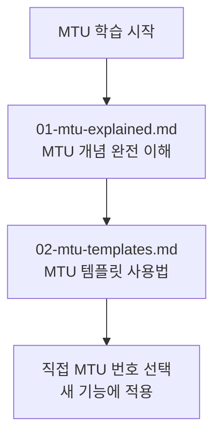

# MTU 체계 학습 경로

> **문서 ID**: ONBOARD-08-MTU
> **버전**: 2.0.0 | **작성일**: 2026-04-11 | **최종 수정**: 2026-04-12

---

## MTU란 무엇인가

MTU(Mission Task Unit)는 공공기관 SaaS 프레임워크에서 하나의 독립적인 작업 단위입니다. 모든 기능 개발·인프라 구성·보안 개선은 하나 이상의 MTU로 정의됩니다.

MTU는 PDCA 사이클의 기본 단위입니다. 하나의 MTU = 하나의 PDCA 사이클입니다.

---

## 이 섹션의 파일 목록

| 파일 | 제목 | 소요 시간 | 설명 |
|------|------|---------|------|
| [01-mtu-explained.md](01-mtu-explained.md) | MTU 완전 이해 | 45분 | MTU 유형, 명명 규칙, 생명주기 상태 다이어그램, 의존성, 크기 가이드라인, 실전 예시 |
| [02-mtu-templates.md](02-mtu-templates.md) | MTU 템플릿 모음 | 30분 | Plan/Design/Report/Review 템플릿, 명명 규칙 결정 트리, git 커밋 메시지 템플릿 |

## 학습 단계

---

## 현재 완료된 MTU 현황 (2026-04-11 기준)

| 구간 | 범위 | 주요 내용 |
|------|------|---------|
| Round 1~5 | MTU-N27~N50 | 기초 인프라 (k3s, Cosign, 네트워크 정책) |
| Round 6~10 | MTU-N51~N100 | 보안 강화 (Kyverno, Sealed Secrets, SemGrep) |
| Round 11~15 | MTU-N101~N150 | 서비스 구현 (Auth, Gateway, Tenant, AI, Audit) |
| Round 16~20 | MTU-N151~N200 | 모니터링·운영 (SLO, 이상 탐지, DORA) |
| Round 21~25 | MTU-N201~N240 | 고도화 (건강 집계, 시크릿 관리, 서킷 브레이커) |
| Round 26+ | MTU-N241~N255 | 현재 진행 중 |

---

## 주요 MTU 유형 빠른 참조

| 유형 | 예시 | 용도 |
|------|------|------|
| MTU-N{번호} | MTU-N241 | 기술 인프라·관측성 |
| SVC-{서비스}-R{라운드} | SVC-AUTH-R1 | 서비스 고도화 라운드 |
| MTU-TECH-{이름} | MTU-TECH-STACK-2026Q2 | 기술 스택 결정 |
| MTU-P{번호} | MTU-P01 | 프로젝트 단계별 MTU |

---

## 변경 이력

| 버전 | 일자 | 내용 | 작성자 |
|------|------|------|-------|
| 1.0.0 | 2026-04-11 | 초기 작성 | Implementer (Sonnet) |
| 2.0.0 | 2026-04-12 | 파일 목록 테이블 추가 (2개 파일 설명 포함) | Implementer (Sonnet) |
