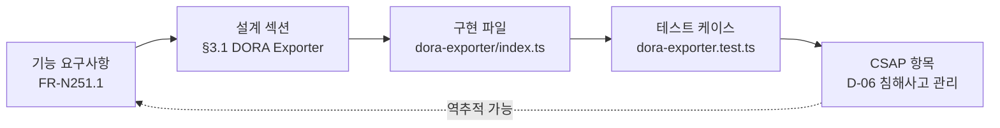
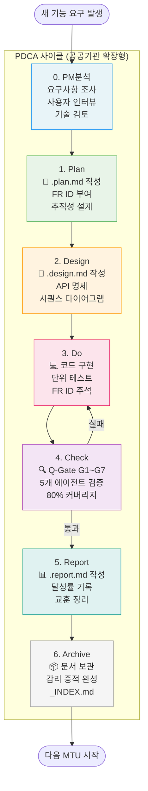
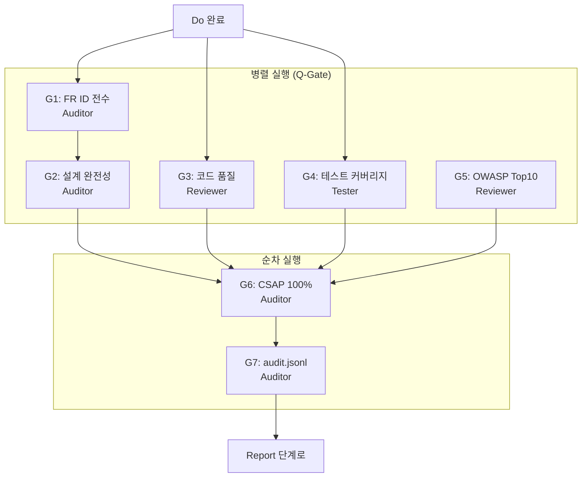
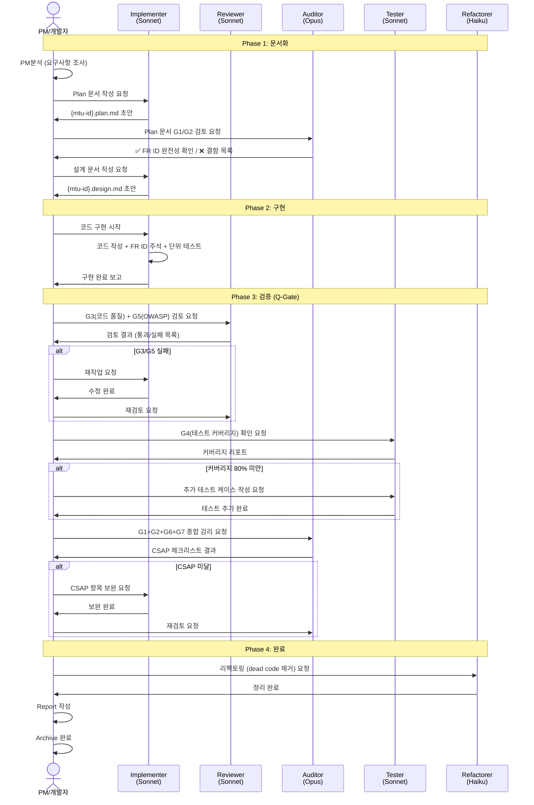
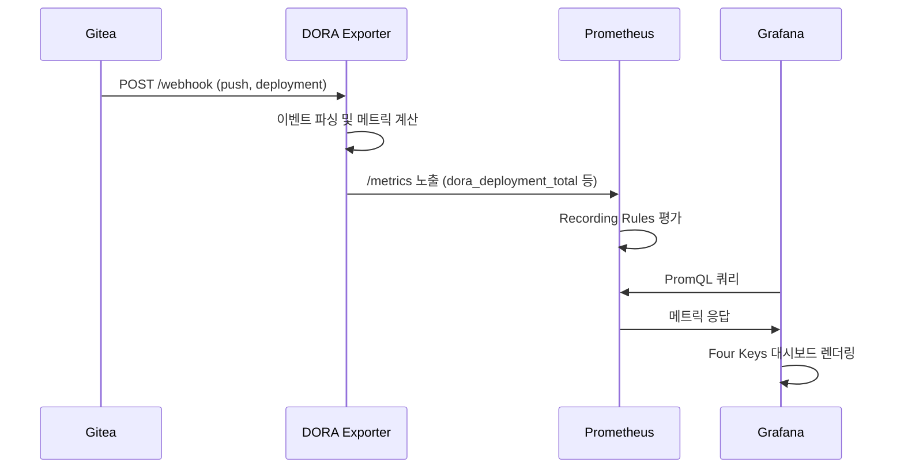

# PDCA 완전 이해 — 초보자를 위한 종합 안내서

> **문서 ID**: ONBOARD-08-PDCA-01
> **버전**: 2.0.0 | **작성일**: 2026-04-12 | **작성자**: Implementer (Sonnet)
> **선행 학습**: `../README.md` (PDCA 학습 경로 개요)
> **소요 시간**: 3시간
> **참고 문서**: `/data/ai-saas/CLAUDE.md`, `/data/ai-saas/docs/01-plan/mtus/MTU-N251-dora-four-keys.plan.md`

---

## 목차

1. [PDCA란 무엇인가 — 요리에 비유하기](#1-pdca란-무엇인가--요리에-비유하기)
2. [왜 PDCA가 필요한가 — 감리 관점](#2-왜-pdca가-필요한가--감리-관점)
3. [이 프로젝트의 7단계 PDCA](#3-이-프로젝트의-7단계-pdca)
4. [PDCA 전체 흐름 다이어그램](#4-pdca-전체-흐름-다이어그램)
5. [단계별 상세 설명](#5-단계별-상세-설명)
   - 5.1 PM분석 — 사전 조사
   - 5.2 Plan — 요리 레시피 작성
   - 5.3 Design — 요리 준비
   - 5.4 Do — 요리 실행
   - 5.5 Check — 맛보기
   - 5.6 Report — 요리 평가서
   - 5.7 Archive — 레시피 보관
6. [에이전트 분업 시퀀스 다이어그램](#6-에이전트-분업-시퀀스-다이어그램)
7. [실제 사례: MTU-N251 DORA Four Keys 전체 추적](#7-실제-사례-mtu-n251-dora-four-keys-전체-추적)
8. [초보자가 자주 하는 실수](#8-초보자가-자주-하는-실수)
9. [PDCA 자가 점검 체크리스트](#9-pdca-자가-점검-체크리스트)
10. [PDCA 용어 사전](#10-pdca-용어-사전)
11. [변경 이력](#11-변경-이력)

---

## 1. PDCA란 무엇인가 — 요리에 비유하기

### 1.1 요리로 이해하는 PDCA

PDCA가 어렵게 느껴진다면 요리에 비유해 보겠습니다.

> **상황**: 김치찌개를 처음 만들어야 하는데, 맛있게 완성해야 하고 나중에 다른 사람도 똑같이 만들 수 있어야 합니다.

| PDCA 단계 | 요리 비유 | 실제 프로젝트 작업 |
|---------|---------|----------------|
| **Plan (계획)** | 레시피 작성: "돼지고기 200g, 김치 300g, 두부 반 모..." | 무엇을 왜 만들 것인지 문서로 정의 |
| **Design (설계)** | 요리 순서 계획: "먼저 돼지고기 볶기 → 김치 추가 → 물 붓기..." | 어떻게 만들 것인지 아키텍처 설계 |
| **Do (실행)** | 실제 요리: 냄비에 재료 넣고 끓이기 | 코드 구현 |
| **Check (확인)** | 맛보기: "간이 부족하네, 고춧가루 더 필요해" | Q-Gate 7단계 품질 검증 |
| **Report (보고)** | 요리 평가서: "완성! 칼로리 450kcal, 조리시간 25분" | 완료 보고서 작성 |
| **Archive (보관)** | 레시피 책에 보관: 나중에 누구나 따라 할 수 있도록 | 문서 아카이브 |

### 1.2 왜 요리에 비유했나

요리와 소프트웨어 개발은 다음 점이 공통입니다.

- **재현 가능해야 합니다**: 한 번만 만들고 끝나면 의미가 없습니다. 다른 개발자도 같은 품질로 만들 수 있어야 합니다.
- **실수를 최소화해야 합니다**: 재료 준비(Plan)와 순서 계획(Design) 없이 바로 요리(Do)를 시작하면 실패할 확률이 높습니다.
- **기록이 증거입니다**: "맛있게 만들었다"는 주장보다 레시피와 사진(문서)이 더 신뢰받습니다.

---

## 2. 왜 PDCA가 필요한가 — 감리 관점

### 2.1 공공기관 감리란

공공기관이 정보시스템을 구축하면 외부 전문가 집단이 검토하는 **감리** 절차를 거칩니다. 이는 법적 의무입니다.

> **근거**: 행안부 정보시스템 감리기준(고시 제2023-1호)

감리단이 묻는 핵심 질문 세 가지:

```
질문 1: 이 코드 한 줄이 어떤 요구사항에서 비롯되었는가?
질문 2: 그 요구사항을 어떤 테스트로 검증했는가?
질문 3: 그 테스트는 어떤 CSAP 항목을 충족하는가?
```

PDCA 문서가 이 세 질문에 대한 답입니다.

### 2.2 문서 없는 구현 = 감리 결함

이 프로젝트의 핵심 규칙(`CLAUDE.md`)에는 다음이 명시되어 있습니다.

```
[필수] 구현 착수 전 Plan + Design 문서 완비 필수. 문서 없는 구현 = 감리 결함.
```

감리 결함이 발생하면:
- 시스템 오픈 지연
- 결함 보고서 발행
- 최악의 경우 예산 삭감

### 2.3 추적성 매트릭스 — PDCA의 핵심

PDCA가 완성되면 다음 4방향 추적이 가능해집니다.



감리단은 이 4방향 추적이 가능한지 확인합니다. 어느 방향으로든 추적이 끊기면 결함입니다.

---

## 3. 이 프로젝트의 7단계 PDCA

일반적인 PDCA는 4단계(Plan→Do→Check→Act)이지만, 이 프로젝트는 공공기관 감리 요건에 맞춰 7단계로 확장되었습니다.

| 단계 | 한국어 명칭 | 위치 | 핵심 산출물 | 담당 |
|------|-----------|------|-----------|------|
| 0 | **PM분석** | 사전 조사 | 요구사항 초안 | PM |
| 1 | **Plan** | `docs/01-plan/mtus/` | `{mtu-id}.plan.md` | PM + 개발자 |
| 2 | **Design** | `docs/02-design/mtus/` | `{mtu-id}.design.md` | Implementer |
| 3 | **Do** | `platform/services/` | 코드, 테스트 | Implementer |
| 4 | **Check** | `docs/03-analysis/` | Q-Gate 결과 | Reviewer·Auditor·Tester |
| 5 | **Report** | `docs/04-report/` | `{mtu-id}.report.md` | PM |
| 6 | **Archive** | `docs/archive/YYYY-MM/` | `_INDEX.md` | PM |

> **중요**: 모든 단계는 순서대로 완료해야 합니다. Design 없이 Do를 시작하거나, Check 없이 Report를 작성하면 안 됩니다.

---

## 4. PDCA 전체 흐름 다이어그램

### 4.1 선형 흐름



### 4.2 병렬 처리 흐름 (Check 단계)

Check 단계에서 5개 에이전트가 병렬로 작동합니다.



---

## 5. 단계별 상세 설명

### 5.1 PM분석 단계 — 요리 재료 조사

**비유**: 레스토랑에서 주방장이 요리하기 전에 재료 수급 가능 여부, 손님 알레르기 등을 조사하는 단계

**실제 작업**:
- 사용자 인터뷰 또는 요구사항 문서 검토
- 기존 코드/시스템 현황 파악
- 기술적 가능성 검토
- 대략적인 공수 산정

**산출물**: PM의 요구사항 초안 (공식 문서가 아닌 메모 수준)

**주의사항**: 이 단계에서 코드를 작성하면 안 됩니다. 먼저 "무엇을"을 파악해야 "어떻게"를 결정할 수 있습니다.

---

### 5.2 Plan 단계 — 레시피 작성

**비유**: 레시피 카드 작성. "재료: 돼지고기 200g, 김치 300g..., 조리시간: 25분, 난이도: 중"

**실제 작업**: `{mtu-id}.plan.md` 파일 작성

**필수 포함 내용**:

```
1. Executive Summary (4관점 테이블)
   - 비즈니스 관점: 왜 이 기능이 비즈니스에 필요한가
   - 기술 관점: 어떤 기술로 구현할 것인가
   - 보안/규제 관점: CSAP, N2SF 어떤 항목이 적용되는가
   - 운영 관점: 배포 후 어떻게 운영할 것인가

2. Context Anchor
   - WHY: 왜 이 기능이 필요한가
   - WHO: 누가 사용하는가
   - RISK: 위험 요소는 무엇인가
   - SUCCESS: 어떤 기준으로 성공을 판단하는가
   - SCOPE: 무엇을 포함하고 제외하는가

3. 기능 요구사항 (FR ID 부여)
   - FR-{모듈}.{번호} 형식으로 모든 요구사항 번호 부여

4. 추적성 매트릭스
   - FR ID → Design 섹션 → 구현 파일 → 테스트 → CSAP
```

**파일 위치**: `docs/01-plan/mtus/{mtu-id}.plan.md`

---

### 5.3 Design 단계 — 요리 순서 계획

**비유**: 요리 순서 계획. "1. 먼저 돼지고기를 강불에 볶는다. 2. 기름이 나오면 김치를 추가한다. 3. 물 500ml를 붓고..."

**실제 작업**: `{mtu-id}.design.md` 파일 작성

**필수 포함 내용**:

```
1. Design Anchor
   - 설계 원칙
   - 옵션 평가 (A안 vs B안)
   - 최종 선택 근거

2. 아키텍처 다이어그램 (Mermaid)
3. API 명세 (엔드포인트, 요청/응답)
4. 데이터 모델 (ERD)
5. 시퀀스 다이어그램
6. 에러 처리 방안
7. CSAP 통제항목 매핑
```

**파일 위치**: `docs/02-design/mtus/{mtu-id}.design.md`

> **규칙**: Design 문서 없이 코드를 작성하면 감리 결함입니다. Design이 끝난 후에야 Do 단계를 시작할 수 있습니다.

---

### 5.4 Do 단계 — 실제 요리

**비유**: 냄비에 재료를 넣고 설계한 순서대로 요리를 실행하는 단계

**실제 작업**: Implementer 에이전트가 Design 문서를 기반으로 코드 구현

**핵심 규칙**:

```typescript
// 모든 코드 파일 상단에 반드시 이 주석을 포함해야 합니다
// Design Ref: MTU-N251 DESIGN §3.1 — DORA Exporter 구현
// Plan SC: FR-N251.1 Gitea webhook 이벤트 수집
// CSAP: D-06 침해사고 관리, D-12 시스템 개발 보안

export async function collectDeploymentEvent(event: DeploymentEvent): Promise<void> {
  // FR-N251.1 구현: Gitea webhook에서 배포 이벤트 수집
  // ...
}
```

**산출물**:
- 구현 코드 (TypeScript/Python)
- 단위 테스트 (80% 커버리지 목표)
- FR ID 주석이 포함된 코드

---

### 5.5 Check 단계 — 맛보기

**비유**: 완성된 요리를 맛보고 간이 적당한지 확인하는 단계. 부족하면 소금/설탕을 추가합니다.

**실제 작업**: Q-Gate G1~G7 통과


**실패 시**: 해당 단계의 담당 에이전트에게 재작업 요청. 모든 G7이 통과해야 다음 단계로 진행합니다.

---

### 5.6 Report 단계 — 요리 평가서

**비유**: 요리 완성 후 평가서 작성. "완성! 조리시간 25분(목표 20분), 맛 평점 8/10, 개선점: 두부를 더 두껍게 썰 것"

**실제 작업**: PM이 `{mtu-id}.report.md` 작성

**필수 포함 내용**:
- SC(수용 기준) 달성률: 각 SC가 몇 % 달성되었는가
- Q-Gate 통과 기록
- 교훈(Lessons Learned)
- 잔여 위험(Residual Risk)
- 다음 MTU에 대한 의존성

**파일 위치**: `docs/04-report/{mtu-id}.report.md`

---

### 5.7 Archive 단계 — 레시피 보관

**비유**: 완성된 레시피를 레시피 책에 넣어 보관. 나중에 누구든 찾아볼 수 있도록.

**실제 작업**: 모든 PDCA 산출물을 `docs/archive/YYYY-MM/` 폴더에 복사하고 `_INDEX.md` 작성

**_INDEX.md 구조**:
```markdown
# Archive Index — MTU-N251

| 문서 | 파일 | 완료일 |
|------|------|--------|
| Plan | MTU-N251.plan.md | 2026-04-11 |
| Design | MTU-N251.design.md | 2026-04-11 |
| Report | MTU-N251.report.md | 2026-04-12 |
```

**중요성**: 감리단은 Archive 폴더를 직접 검토합니다. 불완전한 Archive = 감리 결함.

---

## 6. 에이전트 분업 시퀀스 다이어그램

이 프로젝트는 5개 전문 에이전트가 분업합니다. 아래 시퀀스 다이어그램은 한 MTU가 완성되기까지의 전체 대화 흐름을 보여줍니다.



---

## 7. 실제 사례: MTU-N251 DORA Four Keys 전체 추적

실제 프로젝트의 MTU-N251(DORA Four Keys 완전 자동화)을 예시로 PDCA 전체 과정을 추적합니다.

### 7.1 PM분석 — 현황 파악

```
조사 결과:
- 현재 DORA Recording Rules(MTU-N126)는 정밀도 부족
- Gitea commit → deploy 전체 리드타임 추적 불가
- CI/CD 파이프라인과 DORA 등급 연동 없음

결론: DORA Four Keys 완전 자동화 MTU가 필요함
```

### 7.2 Plan 문서 작성 (실제 내용)

실제 파일 위치: `docs/01-plan/mtus/MTU-N251-dora-four-keys.plan.md`

**Executive Summary (실제 테이블)**:

| 관점 | 내용 |
|------|------|
| **비즈니스** | DORA Four Keys 메트릭 완전 자동화로 DevOps 성숙도를 정량 측정 |
| **기술** | Gitea webhook → DORA Exporter → Prometheus → Grafana |
| **보안/규제** | CSAP D-06 침해사고 관리, D-12 시스템 개발 보안, 행안부 감리 증빙 |
| **운영** | SRE 팀의 배포 승인/거부를 DORA 등급 기반으로 자동 판단 |

**Context Anchor (실제 내용)**:

```
WHY:
- 기존 DORA 측정 방식이 정밀도 부족
- 리드타임 전 구간 추적 부재

WHO:
- DevOps 엔지니어: 일일 DORA 대시보드 모니터링
- SRE 팀: MTTR/CFR 기반 인시던트 대응
- 감리원: DevOps 성숙도 정량 증빙 확인

RISK:
- Gitea API 가용성 저하 → 로컬 큐 + 재시도로 완화
- 메트릭 카디널리티 폭발 → 레이블 제한으로 완화
```

**FR ID 목록 (실제 발췌)**:

| FR ID | 요구사항 | 우선순위 |
|-------|---------|---------|
| FR-N251.1 | DORA Exporter: Gitea webhook 이벤트 수집 | P0 |
| FR-N251.2 | Deployment Frequency: 일/주/월 배포 횟수 | P0 |
| FR-N251.3 | Lead Time for Changes: commit → deploy 추적 | P0 |
| FR-N251.4 | MTTR: 인시던트 생성~해결 시간 | P0 |
| FR-N251.5 | Change Failure Rate: 롤백/핫픽스 종합 | P0 |
| FR-N251.6 | DORA 등급 자동 판정 (Elite~Low) | P0 |
| FR-N251.7 | Grafana 대시보드 (Four Keys 통합 뷰) | P0 |
| FR-N251.8 | CI/CD DORA 게이트: CFR 임계값 초과 시 차단 | P1 |
| FR-N251.9 | 주간 보고서 자동 생성 | P1 |

### 7.3 Design 문서 작성

**시퀀스 다이어그램 예시**:



### 7.4 Do 단계 — 코드 구현

```typescript
// Design Ref: MTU-N251 DESIGN §3.1 — DORA Exporter 구현
// Plan SC: FR-N251.1, FR-N251.2
// CSAP: D-06 침해사고 관리, D-12 시스템 개발 보안

import { Counter, Histogram } from 'prom-client';

const deploymentTotal = new Counter({
  name: 'dora_deployment_total',
  help: 'Total deployments by namespace and status',
  labelNames: ['namespace', 'team', 'status'],
});

export async function handleDeploymentWebhook(event: GiteaDeploymentEvent): Promise<void> {
  // FR-N251.1 구현: Gitea webhook에서 배포 이벤트 수집
  deploymentTotal.inc({
    namespace: event.namespace,
    team: event.team,
    status: event.status,
  });
}
```

### 7.5 Check 단계 — Q-Gate 통과 기록

| Gate | 결과 | 비고 |
|------|------|------|
| G1: FR ID 전수 | ✅ 통과 | 9개 FR ID 모두 주석 포함 |
| G2: 설계 완전성 | ✅ 통과 | 시퀀스 다이어그램, API 명세 완비 |
| G3: 코드 품질 | ✅ 통과 | ESLint 오류 0, 함수 80줄 이하 |
| G4: 테스트 커버리지 | ✅ 통과 | 83.5% (목표 80%) |
| G5: OWASP Top10 | ✅ 통과 | 취약점 0건 |
| G6: CSAP 100% | ✅ 통과 | D-06, D-12 전 항목 충족 |
| G7: audit.jsonl | ✅ 통과 | 배포 이벤트 감사 로그 기록 |

### 7.6 Report 및 Archive

**보고서 핵심 내용**:
- SC 달성률: 9/9 (100%)
- 실제 소요 공수: 계획 8h → 실제 10h (+25%)
- 교훈: Gitea webhook 이벤트 파싱이 예상보다 복잡
- 잔여 위험: 없음

**Archive 위치**: `docs/archive/2026-04/MTU-N251/`

---

## 8. 초보자가 자주 하는 실수

### 실수 1: Plan 없이 코드 작성

```
❌ 잘못된 방법:
"기능이 뭔지 대충 알겠으니 바로 코드부터 짜자"
→ 나중에 FR ID를 소급 작성해야 함 → 추적성 거짓 → 감리 결함

✅ 올바른 방법:
Plan 문서 완성 → Auditor G1 검토 → Design 문서 완성 → 코드 작성
```

### 실수 2: FR ID 없는 코드

```typescript
// ❌ 잘못된 방법: 추적성 없음
export async function handleWebhook(event: Event): Promise<void> {
  // 그냥 처리
}

// ✅ 올바른 방법: FR ID 주석 포함
// Design Ref: MTU-N251 DESIGN §3.1
// Plan SC: FR-N251.1 Gitea webhook 이벤트 수집
// CSAP: D-06
export async function handleWebhook(event: Event): Promise<void> {
  // FR-N251.1 구현: 이벤트 파싱 및 메트릭 업데이트
}
```

### 실수 3: Q-Gate를 순서대로 안 통과

```
❌ 잘못된 방법:
G4(테스트) 통과 → G7(감사 로그) 통과 → G2(설계) 통과
→ G-Gate는 G1→G7 순서대로 통과해야 함. 순서 위반 = 검증 누락

✅ 올바른 방법:
G1 → G2 → G3 → G4 → G5 → G6 → G7 순서대로 통과
```

### 실수 4: Report 없이 Archive

```
❌ 잘못된 방법:
코드 완성 → 바로 Archive
→ Report 없으면 교훈과 잔여 위험이 기록되지 않음 → 다음 MTU에서 같은 실수 반복

✅ 올바른 방법:
Q-Gate 통과 → Report 작성 → Archive
```

### 실수 5: Design 문서와 코드 불일치

```
❌ 잘못된 방법:
Design에서 "POST /webhook"으로 설계 → 코드에서 "POST /events"로 구현
→ 추적성 단절 → 감리 결함

✅ 올바른 방법:
Design 변경 시 design.md도 함께 업데이트. 코드와 문서는 항상 일치해야 함.
```

### 실수 6: 감사 로그 누락

```typescript
// ❌ 잘못된 방법: 민감 작업에 감사 로그 없음
export async function deleteUser(userId: string): Promise<void> {
  await prisma.user.delete({ where: { id: userId } });
}

// ✅ 올바른 방법: 감사 로그 필수
export async function deleteUser(adminId: string, userId: string): Promise<void> {
  await auditLog({
    actor: adminId,
    action: 'USER_DELETE',
    target: userId,
    timestamp: new Date().toISOString(),
  });
  await prisma.user.delete({ where: { id: userId } });
}
```

---

## 9. PDCA 자가 점검 체크리스트

새 MTU를 시작하기 전과 완료 전에 이 체크리스트를 확인하세요.

### 9.1 Plan 문서 완성 체크리스트

```
□ 문서 ID가 올바른 형식인가? (MTU-N{번호}.plan.md)
□ Executive Summary 4관점 테이블이 있는가?
   □ 비즈니스 관점
   □ 기술 관점
   □ 보안/규제 관점
   □ 운영 관점
□ Context Anchor 5항목이 있는가?
   □ WHY
   □ WHO
   □ RISK (위험/영향/완화 테이블)
   □ SUCCESS (수용 기준 테이블)
   □ SCOPE (포함/제외)
□ 기능 요구사항에 FR ID가 부여되었는가?
   □ FR-{모듈}.{번호} 형식 준수
□ 추적성 매트릭스가 있는가?
   □ FR ID → Design 섹션 → 구현 파일 → 테스트 → CSAP
□ 변경 이력 테이블이 있는가?
```

### 9.2 Design 문서 완성 체크리스트

```
□ Design Anchor가 있는가?
□ 아키텍처 다이어그램(Mermaid)이 있는가?
□ API 명세가 완전한가? (엔드포인트, 요청, 응답, 에러)
□ 시퀀스 다이어그램이 있는가?
□ 데이터 모델(ERD)이 있는가?
□ CSAP 통제항목 매핑이 있는가?
□ 변경 이력이 있는가?
```

### 9.3 Do(구현) 완성 체크리스트

```
□ 모든 파일 상단에 FR ID 주석이 있는가?
   □ // Design Ref: {mtu-id} DESIGN §{섹션}
   □ // Plan SC: {FR ID} {요구사항}
   □ // CSAP: {통제항목} {설명}
□ 모든 API 엔드포인트에 RBAC 검사가 있는가?
□ 모든 입력에 Zod 검증이 있는가?
□ 민감 작업에 감사 로그가 있는가?
□ 하드코딩된 시크릿이 없는가?
□ 단위 테스트가 작성되었는가?
```

### 9.4 Check (Q-Gate) 통과 체크리스트

```
□ G1: 모든 코드에 FR ID 주석 → Auditor 확인
□ G2: 설계 문서 필수 섹션 완비 → Auditor 확인
□ G3: ESLint 오류 0개, 함수 80줄 이하 → pnpm lint
□ G4: 테스트 커버리지 80% 이상 → pnpm test:coverage
□ G5: OWASP Top10 취약점 없음 → Reviewer 확인
□ G6: CSAP 해당 항목 100% → Auditor 확인
□ G7: audit.jsonl 기록 확인 → 파일 직접 확인
```

---

## 10. PDCA 용어 사전

초보자를 위한 이 프로젝트 전용 용어 정의입니다.

| 용어 | 정의 |
|------|------|
| **MTU** | Mission Task Unit. PDCA 사이클의 단위 작업. 하나의 기능 또는 개선 사항. |
| **FR ID** | Functional Requirement ID. 기능 요구사항 번호. `FR-{모듈}.{번호}` 형식. |
| **NFR** | Non-Functional Requirement. 비기능 요구사항. 성능, 보안, 가용성 등. |
| **Q-Gate** | Quality Gate. 7단계 품질 검사 관문. G1~G7. |
| **감사 로그** | 민감 작업이 발생할 때 기록하는 보안 로그. `.claude/audit.jsonl`에 저장. |
| **CSAP** | Cloud Security Assurance Program. 클라우드 보안 인증. 79개 통제항목. |
| **N2SF** | 국가 네트워크 보안 체계. 데이터를 C/S/O 3등급으로 분류. |
| **추적성 매트릭스** | FR ID ↔ Design ↔ 코드 ↔ 테스트 ↔ CSAP 간 연결 표. |
| **Context Anchor** | 작업의 맥락을 고정하는 5항목 섹션. WHY/WHO/RISK/SUCCESS/SCOPE. |
| **Archive** | 완료된 MTU 산출물 보관 폴더. 감리 증적으로 활용. |
| **Implementer** | 코드 구현을 담당하는 에이전트. Claude Sonnet 모델 사용. |
| **Auditor** | CSAP/감리 준수 검증을 담당하는 에이전트. Claude Opus 모델 사용. 읽기 전용. |
| **Reviewer** | 코드 품질·보안 검사를 담당하는 에이전트. Sonnet 모델. 수정 불가. |
| **Tester** | 테스트 케이스 작성·실행을 담당하는 에이전트. |
| **Refactorer** | Dead code 제거·구조 개선을 담당하는 에이전트. Haiku 모델 사용. |

---

## 11. 변경 이력

| 버전 | 일자 | 내용 | 작성자 |
|------|------|------|--------|
| 2.0.0 | 2026-04-12 | 전면 재작성: 요리 비유, 실제 사례(MTU-N251), 체크리스트 추가 | Implementer (Sonnet) |
| 1.0.0 | 2026-04-11 | 최초 작성 | Implementer (Sonnet) |
