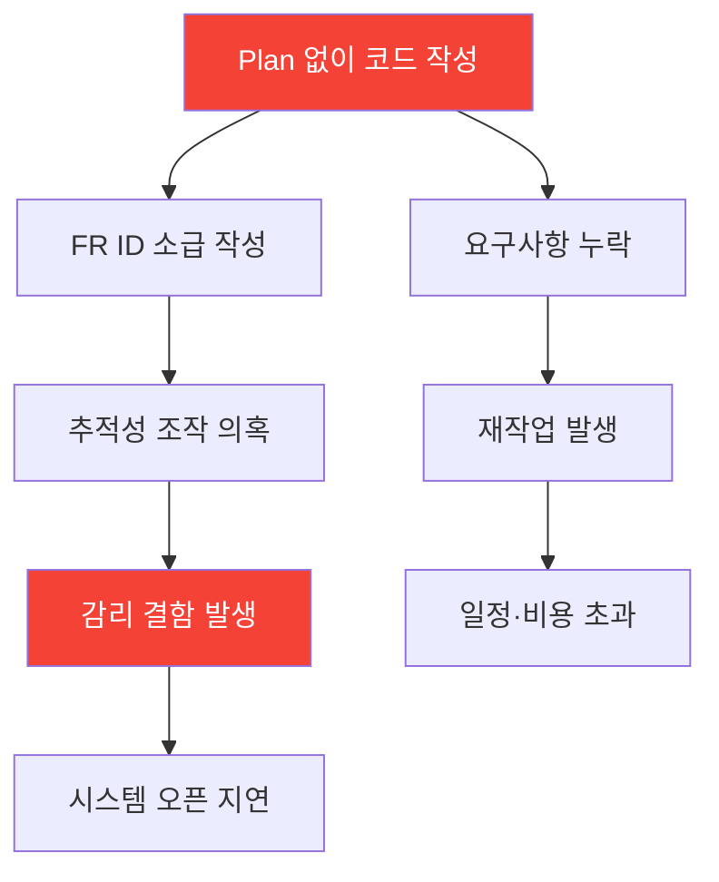
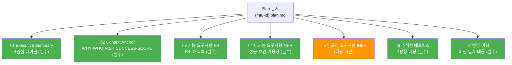
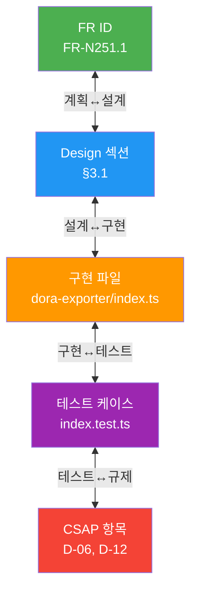

# Plan 문서 작성법 — 처음부터 끝까지 완전 가이드

> **문서 ID**: ONBOARD-08-PDCA-02
> **버전**: 2.0.0 | **작성일**: 2026-04-12 | **작성자**: Implementer (Sonnet)
> **선행 학습**: `01-what-is-pdca.md` (PDCA 완전 이해)
> **소요 시간**: 2시간
> **참고 문서**: `docs/01-plan/mtus/MTU-N251-dora-four-keys.plan.md`, `CLAUDE.md`

---

## 목차

1. [Plan 문서란 무엇인가](#1-plan-문서란-무엇인가)
2. [FR ID 체계 완전 이해](#2-fr-id-체계-완전-이해)
3. [Plan 문서 전체 구조](#3-plan-문서-전체-구조)
4. [Executive Summary 4관점 테이블](#4-executive-summary-4관점-테이블)
5. [Context Anchor 5항목 상세](#5-context-anchor-5항목-상세)
6. [기능 요구사항 작성법](#6-기능-요구사항-작성법)
7. [비기능 요구사항 작성법](#7-비기능-요구사항-작성법)
8. [추적성 매트릭스 4방향](#8-추적성-매트릭스-4방향)
9. [요구사항 ID 모듈 코드](#9-요구사항-id-모듈-코드)
10. [좋은 예/나쁜 예 비교](#10-좋은-예나쁜-예-비교)
11. [단계별 Plan 문서 작성 실습](#11-단계별-plan-문서-작성-실습)
12. [복사-붙여넣기 완전 템플릿](#12-복사-붙여넣기-완전-템플릿)
13. [체크리스트: Plan 완료 기준](#13-체크리스트-plan-완료-기준)
14. [자주 묻는 질문 FAQ](#14-자주-묻는-질문-faq)
15. [변경 이력](#15-변경-이력)

---

---

## 1. Plan 문서란 무엇인가

### 1.1 한 문장 정의

> Plan 문서 = **"무엇을, 왜, 어떤 기준으로 만들 것인가"를 감리 요건에 맞게 문서화한 것**

### 1.2 Plan 문서가 없으면 발생하는 문제



### 1.3 파일 명명 규칙

```
docs/01-plan/mtus/{MTU-ID}.plan.md

예시:
docs/01-plan/mtus/MTU-N251-dora-four-keys.plan.md
docs/01-plan/mtus/SVC-AI-ADV-R2.plan.md
docs/01-plan/mtus/L-01-RATE-LIMIT-PKG.plan.md
```

### 1.4 Plan 문서가 필요한 상황

| 상황 | Plan 필요 여부 | 이유 |
|------|-------------|------|
| 새 기능 구현 | 필수 | CLAUDE.md 절대 제약 |
| 기존 기능 변경 | 필수 | 변경 영향 분석 필요 |
| 버그 수정 (간단) | 선택 | 단순 수정은 PR로 대체 가능 |
| 인프라 구성 | 필수 | MTU-N* 번호 사용 |
| 보안 개선 | 필수 | CSAP 항목 매핑 필요 |

---

## 2. FR ID 체계 완전 이해

### 2.1 FR ID 유형별 규칙

| 유형 | 형식 | 예시 | 설명 |
|------|------|------|------|
| 기능 요구사항 | `FR-{모듈}.{번호}` | `FR-N251.1` | 사용자가 볼 수 있는 기능 |
| 비기능 요구사항 | `NFR-{번호}` | `NFR-1` | 성능, 가용성, 보안 등 |
| 인프라 요구사항 | `INFR-{번호}` | `INFR-1` | 서버, 네트워크, 스토리지 |
| AI 연동 요구사항 | `AI-REQ-{번호}` | `AI-REQ-1` | AI/LLM 관련 기능 |
| CC 하네스 요구사항 | `CC-REQ-{번호}` | `CC-REQ-1` | Claude Code 자동화 관련 |

### 2.2 FR ID 번호 부여 규칙

```
1. 같은 MTU 내에서 1부터 순서대로 번호 부여
2. 우선순위 P0(필수)부터 먼저 번호 부여
3. 한 번 부여된 번호는 변경하지 않음 (삭제 시에도 번호 재사용 금지)
4. 하위 기능: 소수점 사용 가능 (FR-N251.1.1, FR-N251.1.2)

실제 예시 (MTU-N251):
FR-N251.1  DORA Exporter 구현 (P0)
FR-N251.2  Deployment Frequency 측정 (P0)
FR-N251.3  Lead Time 추적 (P0)
FR-N251.8  CI/CD 게이트 연동 (P1)
FR-N251.9  주간 보고서 자동화 (P1)
```

### 2.3 코드에서 FR ID 참조 방법

```typescript
// 파일 상단에 반드시 포함 (G1 통과 필수)
// Design Ref: MTU-N251 DESIGN §3.1 — DORA Exporter 구현
// Plan SC: FR-N251.1 Gitea webhook 이벤트 수집
// CSAP: D-06 침해사고 관리, D-12 시스템 개발 보안

export async function handleDeploymentWebhook(event: GiteaDeploymentEvent): Promise<void> {
  // FR-N251.1 구현: Gitea webhook에서 배포 이벤트 수집
}
```

---

## 3. Plan 문서 전체 구조



---

## 4. Executive Summary 4관점 테이블

### 4.1 왜 4관점인가

감리단은 단순히 "어떤 기능을 만드는가"뿐 아니라 4가지 관점에서 정당성을 요구합니다.

| 관점 | 묻는 질문 | 담당자 |
|------|---------|--------|
| **비즈니스** | 왜 이 기능이 필요한가? 어떤 가치가 있는가? | 사업 담당자 |
| **기술** | 어떤 기술로 어떻게 구현할 것인가? | 개발팀 |
| **보안/규제** | CSAP, N2SF 어떤 항목이 적용되는가? | 보안팀 |
| **운영** | 배포 후 어떻게 운영·모니터링할 것인가? | 운영팀 |

### 4.2 실제 작성 예시 (MTU-N251)

```markdown
| 관점 | 내용 |
|------|------|
| **비즈니스** | DORA Four Keys 메트릭 완전 자동화로 DevOps 성숙도를 정량 측정하고,
               공공기관 감리 시 DevOps 성숙도 증빙 제공 |
| **기술** | Gitea webhook 기반 이벤트 수집 → DORA Exporter → Prometheus Recording
           Rules → Grafana 대시보드 + CI/CD 연동 |
| **보안/규제** | CSAP D-06 침해사고 관리 (MTTR 측정), D-12 시스템 개발 보안
               (CI/CD 품질 측정), 행안부 감리 증빙 |
| **운영** | SRE 팀의 의사결정 자동화 — 배포 승인/거부를 DORA 등급 기반으로 자동 판단 |
```

### 4.3 각 관점 작성 팁

**비즈니스 관점** — "왜"를 설명:
```
좋은 예: "법무 담당자의 법령 검색 재현율 15% 향상으로 업무 효율성 개선"
나쁜 예: "기능 개선" (무엇을 개선하는지 없음)
```

**기술 관점** — 흐름을 포함:
```
좋은 예: "Gitea webhook → DORA Exporter → Prometheus → Grafana"
나쁜 예: "TypeScript 사용" (흐름이 없음)
```

**보안/규제 관점** — CSAP 항목 번호 명시:
```
좋은 예: "CSAP D-06 침해사고 관리, D-12 시스템 개발 보안"
나쁜 예: "보안 적용" (어떤 항목인지 불명확)
```

**운영 관점** — 실제 운영 방법:
```
좋은 예: "배포 성공/실패 Prometheus 메트릭, Grafana 대시보드, 실패 시 Slack 알림"
나쁜 예: "모니터링" (어떻게 모니터링하는지 없음)
```

---

## 5. Context Anchor 5항목 상세

### 5.1 WHY — 현재 문제와 개선 필요성

**작성 패턴** (현재 문제 → 결론):

```markdown
### WHY
- [문제 1] 기존 DORA Recording Rules는 Kubernetes 메트릭 프록시 방식으로 정밀도 부족
- [문제 2] Gitea commit → deploy 전체 리드타임 추적 부재
- [문제 3] 변경 실패율이 롤백/핫픽스 미반영
- [결론] 따라서 DORA Four Keys 완전 자동화 MTU가 필요
```

**흔한 실수**: 해결책을 WHY에 쓰는 것
```
❌ "DORA Exporter를 구현해야 함" (해결책)
✅ "현재 DORA 측정이 정밀하지 않음" (문제)
```

### 5.2 WHO — 이해관계자 목록

```markdown
### WHO
- DevOps 엔지니어: 일일/주간 DORA 대시보드 모니터링
- SRE 팀: MTTR/CFR 기반 인시던트 대응 프로세스 개선
- 감리원: DevOps 성숙도 정량 증빙 확인
- 관리자: 팀별 DORA 등급 비교 및 개선 추적
```

### 5.3 RISK — 위험 요소 (테이블 형식 필수)

```markdown
### RISK
| 위험 | 영향 | 완화 |
|------|------|------|
| Gitea API 가용성 저하 | 이벤트 유실 → 메트릭 부정확 | 로컬 큐 + 재시도 로직 구현 |
| 메트릭 카디널리티 폭발 | Prometheus OOM | 레이블 제한 (namespace, team) |
| 감리 증빙 불충분 | 감리 결함 | 주간 PDF 보고서 자동 생성 |
```

> 위험이 없는 프로젝트는 없습니다. 위험을 식별하지 못한 것은 분석 부족의 신호입니다.

### 5.4 SUCCESS — 수용 기준 (측정 가능하게)

```markdown
### SUCCESS (수용 기준)
| SC ID | 기준 | 측정 방법 |
|-------|------|----------|
| SC-1 | Deployment Frequency 자동 측정 | 대시보드에서 일/주/월 배포 횟수 확인 |
| SC-2 | Lead Time P50/P90/P99 표시 | 백분위수 리드타임 확인 |
| SC-3 | MTTR 자동 계산 | 인시던트별 복구 시간 히스토리 |
| SC-4 | DORA 등급 자동 판정 | Elite/High/Medium/Low 등급 표시 |
```

**수용 기준 원칙**:
- 측정 가능: "빠르게"가 아닌 "P99 < 1초"
- 검증 방법 명시: 어떻게 확인하는가
- 번호 부여: SC-1, SC-2 순서대로

### 5.5 SCOPE — 범위 정의

```markdown
### SCOPE
**포함 (In-Scope)**:
- DORA Exporter (Gitea webhook 기반)
- Grafana 대시보드 (Four Keys 통합 뷰)
- CI/CD 파이프라인 게이트 연동

**제외 (Out-of-Scope)**:
- 외부 SaaS 연동 (Sleuth, LinearB 등)
- 유료 도구 사용
```

---

## 6. 기능 요구사항 작성법

### 6.1 요구사항 테이블 구조

```markdown
| FR ID | 요구사항 | 우선순위 | SC 매핑 |
|-------|---------|---------|---------|
| FR-N251.1 | DORA Exporter: Gitea webhook 이벤트 수집 및 Prometheus 메트릭 노출 | P0 | SC-1, SC-2 |
| FR-N251.8 | CI/CD DORA 게이트: CFR 임계값 초과 시 배포 차단 | P1 | SC-4 |
```

### 6.2 우선순위 기준

| 우선순위 | 의미 | 없으면? |
|---------|------|--------|
| **P0** | 필수. 없으면 릴리즈 불가 | 배포 차단 |
| **P1** | 높음. 이번 MTU에서 구현 권장 | 다음 MTU로 이월 |
| **P2** | 중간. 여유 있으면 구현 | 백로그 |
| **P3** | 낮음. Nice-to-have | 언젠가 |

### 6.3 좋은 요구사항 vs 나쁜 요구사항

```
❌ 나쁜 예:
FR-N251.1 | DORA 기능 구현 | P0 | SC-1
→ 무엇을 어떻게 구현하는지 불명확

✅ 좋은 예:
FR-N251.1 | DORA Exporter: Gitea webhook push/deployment 이벤트를 수집하여
           Prometheus /metrics 엔드포인트에 dora_deployment_total 메트릭 노출 | P0 | SC-1, SC-2
```

---

## 7. 비기능 요구사항 작성법

```markdown
## 비기능 요구사항

| NFR ID | 요구사항 | 기준값 | CSAP |
|--------|---------|-------|------|
| NFR-1 | 응답 시간: P99 < 200ms | 부하 테스트 결과 | — |
| NFR-2 | 가용성: 99.9% (월 43분 이하 다운타임) | Prometheus uptime | D-07 |
| NFR-3 | N2SF 등급: O등급 데이터만 AI API 전송 | N2SF N-05 | N2SF |
| NFR-4 | 암호화: TLS 1.3+ (전송), AES-256 (저장) | 설정 파일 확인 | D-09 |
```

> 보안 관련 NFR에는 반드시 CSAP 항목 번호를 포함해야 합니다. 없으면 감리 지적 사항입니다.

---

## 8. 추적성 매트릭스 4방향

### 8.1 4방향 추적이란



### 8.2 실제 테이블 작성 (MTU-N251)

```markdown
| FR ID | Design 섹션 | 구현 파일 | 테스트 | CSAP |
|-------|------------|----------|--------|------|
| FR-N251.1 | §3.1 | dora-exporter/index.ts | index.test.ts | D-06, D-12 |
| FR-N251.2 | §3.2 | dora-metrics-rules-v2.yaml | metrics.test.ts | D-06 |
| FR-N251.7 | §3.6 | dashboards/dora-four-keys.json | dashboard.test.ts | D-06 |
| FR-N251.8 | §3.7 | .gitea/workflows/dora-gate.yml | gate.test.ts | D-12 |
```

### 8.3 단계별 작성 시점

| 단계 | 작성 가능 열 |
|------|------------|
| Plan 완료 시 | FR ID, Design 섹션(예정) |
| Design 완료 시 | 구현 파일 추가 |
| Do 완료 시 | 테스트 케이스 추가 |
| Check 완료 시 | CSAP 항목 확인·업데이트 |

---

## 9. 요구사항 ID 모듈 코드

### 9.1 서비스 모듈 코드

| 코드 | 서비스 | 위치 |
|------|-------|------|
| P01 | auth-service | platform/services/auth-service/ |
| P02 | user-service | platform/services/user-service/ |
| P03 | tenant-service | platform/services/tenant-service/ |
| P04 | api-gateway | platform/services/gateway/ |
| P10 | ai-service | platform/services/ai-service/ |
| P11 | notification-service | platform/services/notification-service/ |
| P13 | audit-service | platform/services/audit-service/ |
| P15 | security-monitoring | platform/services/security-monitor-service/ |

### 9.2 MTU 전용 코드

MTU-N* 형식의 MTU는 MTU 번호를 모듈 코드로 사용합니다.

```
FR-N251.1  →  MTU-N251의 FR 1번
FR-N252.3  →  MTU-N252의 FR 3번
FR-ADV5.1  →  AI 고도화 R5의 FR 1번
```

---

## 10. 좋은 예/나쁜 예 비교

### 10.1 Executive Summary

```markdown
❌ 나쁜 예:
| 관점 | 내용 |
|------|------|
| 비즈니스 | 기능 개선 |
| 기술 | TypeScript |
| 보안 | 보안 적용 |
| 운영 | 모니터링 |

✅ 좋은 예:
| 관점 | 내용 |
|------|------|
| 비즈니스 | DORA Four Keys 자동화로 DevOps 성숙도 정량 측정 및 감리 증빙 제공 |
| 기술 | Gitea webhook → DORA Exporter → Prometheus → Grafana 대시보드 |
| 보안 | CSAP D-06 침해사고 관리, D-12 개발 보안, 행안부 감리 증빙 |
| 운영 | SRE 팀의 배포 승인/거부를 DORA 등급 기반으로 자동 판단 |
```

### 10.2 RISK 테이블

```markdown
❌ 나쁜 예:
| 위험 | 영향 | 완화 |
|------|------|------|
| 기술적 어려움 | 높음 | 열심히 한다 |

→ 구체적인 위험이 아님, 대응 방안이 없음

✅ 좋은 예:
| 위험 | 영향 | 완화 |
|------|------|------|
| Gitea API 가용성 저하 | 이벤트 유실 → 메트릭 부정확 | 로컬 큐 + 재시도 3회 |
| 메트릭 카디널리티 폭발 | Prometheus OOM | 레이블 최대 50개 제한 |
```

### 10.3 SUCCESS 기준

```markdown
❌ 나쁜 예:
| SC-1 | 성능이 좋아진다 | 테스트 |

→ 측정 불가능, 기준값 없음

✅ 좋은 예:
| SC-1 | DORA Deployment Frequency 자동 측정 (Gitea webhook 기반) |
       대시보드에서 일/주/월 배포 횟수 숫자로 확인 |
```

---

## 11. 단계별 Plan 문서 작성 실습

### 실습: "사용자 이메일 알림 기능" Plan 작성

#### 11.1 1단계: MTU ID 결정

```bash
# 기존 번호 확인
ls docs/01-plan/mtus/ | grep "MTU-N" | sort

# 빈 번호 찾기 → MTU-N290 선택
파일명: docs/01-plan/mtus/MTU-N290-email-notification.plan.md
```

#### 11.2 2단계: Executive Summary 작성

```markdown
| 관점 | 내용 |
|------|------|
| **비즈니스** | 테넌트 관리자가 시스템 이벤트(신규 사용자 등록, 구독 만료 등)를
               이메일로 즉시 받아볼 수 있어 운영 효율 향상 |
| **기술** | notification-service에 Nodemailer + SMTP 기반 이메일 발송 모듈 추가.
           재시도 큐 + Dead Letter Queue 구현 |
| **보안/규제** | CSAP D-09 암호화(SMTP TLS 1.3), D-06 감사 로그(발송 기록),
               N2SF O등급 데이터만 이메일 발송 |
| **운영** | 발송 실패 시 retry 3회, DLQ 이관. Prometheus로 성공/실패 메트릭 |
```

#### 11.3 3단계: Context Anchor

```markdown
### WHY
- 현재 시스템 이벤트 발생 시 관리자에게 즉시 알림 없음
- 구독 만료 사전 알림 없어 서비스 중단 사례 발생

### RISK
| 위험 | 영향 | 완화 |
|------|------|------|
| SMTP 서버 장애 | 이메일 미발송 | 재시도 3회 + DLQ |
| 이메일 주소 유출 | N2SF S등급 PII | 로그 마스킹, TLS 전송 |

### SUCCESS
| SC-1 | 발송 성공률 99% 이상 | Prometheus 메트릭 |
| SC-2 | 발송 실패 시 3회 재시도 | 재시도 로그 확인 |
```

#### 11.4 4단계: FR ID 부여

```markdown
| FR ID | 요구사항 | 우선순위 | SC 매핑 |
|-------|---------|---------|---------|
| FR-N290.1 | SMTP 이메일 발송 함수 (TLS 1.3 필수) | P0 | SC-1 |
| FR-N290.2 | 지수 백오프 재시도 (3회) | P0 | SC-2 |
| FR-N290.3 | Dead Letter Queue 이관 | P0 | SC-2 |
| FR-N290.4 | 발송 감사 로그 (수신자 마스킹) | P0 | SC-1 |
| FR-N290.5 | Prometheus 발송 메트릭 | P1 | SC-1 |
```

---

## 12. 복사-붙여넣기 완전 템플릿

아래 템플릿을 복사하여 바로 사용하세요. `{중괄호}` 항목을 실제 값으로 교체합니다.

```markdown
# MTU-{ID}: {기능명} 계획서

> **문서 ID**: MTU-{ID}.plan
> **작성일**: {YYYY-MM-DD}
> **작성자**: {이름} ({소속})
> **버전**: 1.0.0
> **상태**: 초안

---

## Executive Summary (4관점 테이블)

| 관점 | 내용 |
|------|------|
| **비즈니스** | {이 기능이 왜 필요한가? 어떤 비즈니스 문제를 해결하는가?} |
| **기술** | {어떤 기술/컴포넌트? 기술 흐름은? A → B → C} |
| **보안/규제** | {CSAP D-{번호}, N2SF, 행안부 감리 해당 항목} |
| **운영** | {배포 후 모니터링/운영 방법, SLO} |

---

## Context Anchor

### WHY
- {현재 문제 1}
- {현재 문제 2}
- 결론: 따라서 {이 MTU}가 필요

### WHO
- {이해관계자 1}: {역할/활용}
- {이해관계자 2}: {역할/활용}
- 감리원: {감리 시 확인 사항}

### RISK
| 위험 | 영향 | 완화 |
|------|------|------|
| {위험 1} | {영향} | {완화 방법} |
| {위험 2} | {영향} | {완화 방법} |

### SUCCESS (수용 기준)
| SC ID | 기준 | 측정 방법 |
|-------|------|----------|
| SC-1 | {측정 가능한 기준} | {확인 방법} |
| SC-2 | {측정 가능한 기준} | {확인 방법} |

### SCOPE
**포함 (In-Scope)**:
- {포함 항목 1}
- {포함 항목 2}

**제외 (Out-of-Scope)**:
- {제외 항목 1}
- {제외 항목 2}

---

## 기능 요구사항

| FR ID | 요구사항 | 우선순위 | SC 매핑 |
|-------|---------|---------|---------|
| FR-{모듈}.1 | {P0 요구사항} | P0 | SC-1 |
| FR-{모듈}.2 | {P0 요구사항} | P0 | SC-1, SC-2 |
| FR-{모듈}.3 | {P1 요구사항} | P1 | SC-2 |

---

## 비기능 요구사항

| NFR ID | 요구사항 | 기준값 | CSAP |
|--------|---------|-------|------|
| NFR-1 | 응답 시간 | P99 < 200ms | — |
| NFR-2 | 가용성 | 99.9% | D-07 |
| NFR-3 | N2SF 등급 준수 | O등급만 AI 전송 | N2SF |

---

## 추적성 매트릭스

| FR ID | Design 섹션 | 구현 파일 | 테스트 | CSAP |
|-------|------------|----------|--------|------|
| FR-{모듈}.1 | §3.1 예정 | {서비스}/src/{파일}.ts | {파일}.test.ts | D-{번호} |
| FR-{모듈}.2 | §3.2 예정 | {서비스}/src/{파일}.ts | {파일}.test.ts | D-{번호} |

---

## 변경 이력

| 버전 | 일자 | 내용 | 작성자 |
|------|------|------|--------|
| 1.0.0 | {YYYY-MM-DD} | 초안 작성 | {이름} ({소속}) |
```

---

## 13. 체크리스트: Plan 완료 기준

### 필수 확인 항목

```
□ 헤더: MTU-ID, 버전, 작성일, 작성자 모두 기재
□ Executive Summary: 4관점(비즈니스·기술·보안·운영) 모두 작성
□ WHY: 현재 문제 + 결론 포함
□ WHO: 이해관계자 역할·관심사 포함
□ RISK: 최소 2개 이상 위험 식별 + 완화 방안
□ SUCCESS: 측정 가능한 기준 (숫자 포함)
□ SCOPE: 포함/제외 명확히 구분
□ FR: 모든 요구사항에 FR-{모듈}.{번호} 형식 ID 부여
□ FR: 우선순위 명시 (P0/P1/P2/P3)
□ FR: SC 매핑 포함
□ NFR: 보안 관련 항목에 CSAP 번호 포함
□ 추적성 매트릭스: FR ID 모두 포함 (구현 파일은 예정으로 가능)
□ 변경 이력: 1.0.0 최초 버전 기록
```

### Q-Gate G1 사전 점검

```
□ 모든 FR에 ID가 있는가?
□ FR ID 형식이 FR-{모듈}.{번호}를 따르는가?
□ 같은 MTU 내 FR 번호가 중복되지 않는가?
□ 추적성 매트릭스에 모든 FR이 포함되었는가?
```

---

## 14. 자주 묻는 질문 FAQ

**Q1: FR ID와 SC 번호가 같아야 하나요?**

아니요. 여러 FR이 하나의 SC에 매핑될 수 있습니다.
```
FR-N251.1, FR-N251.2 → SC-1 (Deployment Frequency)
FR-N251.4 → SC-3 (MTTR)
```

**Q2: 요구사항이 나중에 바뀌면 FR ID도 바뀌나요?**

FR ID 번호는 변경하지 않습니다. 내용만 수정하고 변경 이력에 기록합니다.

**Q3: 추적성 매트릭스를 Plan에서 완전히 채워야 하나요?**

Plan 단계에서는 FR ID와 Design 섹션(예정)까지만 채우면 됩니다. 나머지는 이후 단계에서 채웁니다.

**Q4: P0가 너무 많으면 어떻게 하나요?**

P0가 10개 이상이면 MTU 분리를 검토하세요. P0는 정말 없으면 릴리즈 불가한 것만 포함합니다.

**Q5: CSAP 항목을 모르면 어떻게 하나요?**

`.claude/rules/csap-compliance.md`를 참조하거나 Auditor 에이전트에게 물어보세요.

---

## 15. 변경 이력

| 버전 | 일자 | 내용 | 작성자 |
|------|------|------|--------|
| 2.0.0 | 2026-04-12 | 전면 개편: 추적성 매트릭스 4방향, 실습(이메일 알림), 완전 템플릿, FAQ 추가 | Implementer (Sonnet) |
| 1.0.0 | 2026-04-11 | 최초 작성 | Implementer (Sonnet) |

다음 중 하나라도 해당하면 Plan 문서를 먼저 작성해야 합니다.

| 상황 | Plan 필요 여부 | 이유 |
|------|-------------|------|
| 새 기능 구현 | 필수 | CLAUDE.md 절대 제약 |
| 기존 기능 변경 | 필수 | 변경 영향 분석 필요 |
| 버그 수정 (간단) | 선택 | 단순 수정은 PR로 대체 가능 |
| 인프라 구성 | 필수 | MTU-N* 번호 사용 |
| 보안 개선 | 필수 | CSAP 항목 매핑 필요 |

### 1.2 Plan 작성 전 확인 사항

Plan 문서를 시작하기 전에 다음을 확인합니다.

```
1. PRD 문서가 존재하는가? (docs/00-pm/)
2. 유사한 기존 MTU와 중복되지 않는가?
3. MTU 번호를 어떻게 부여할 것인가?
4. 이 MTU의 선행 MTU(의존성)는 무엇인가?
```

### 1.3 Plan 문서 시작 방법

`docs/01-plan/mtus/` 디렉토리에 새 파일을 생성합니다.

파일명 규칙: `{MTU-ID}.plan.md`

예시:
- 기술 인프라 MTU: `MTU-N255-new-feature.plan.md`
- 서비스 구현 MTU: `SVC-NEWSERVICE-R1.plan.md`

---

## 2. 필수 섹션 상세 설명

Plan 문서는 다음 6개 섹션으로 구성됩니다.

### 2.1 헤더 (메타데이터)

```markdown
# {MTU-ID}: {MTU명} — Plan

> **문서 ID**: {MTU-ID}-PLAN
> **버전**: 1.0.0 | **작성일**: YYYY-MM-DD | **작성자**: {이름}
> **분류**: {Phase명} / {카테고리}
> **의존성**: {선행 MTU 목록}
```

**각 항목 설명**:

| 항목 | 설명 | 예시 |
|------|------|------|
| 문서 ID | MTU-ID에 -PLAN 접미사 | MTU-N241-PLAN |
| 버전 | 시맨틱 버전 (초기: 1.0.0) | 1.0.0 |
| 작성일 | ISO 8601 형식 | 2026-04-11 |
| 분류 | Phase 이름과 카테고리 | Round 26 / 취약점 관리 |
| 의존성 | 이 MTU가 의존하는 다른 MTU | MTU-N240, SVC-AI-R1 |

### 2.2 섹션 1: Executive Summary

4관점(비즈니스·기술·보안·운영) 테이블입니다.

```markdown
## 1. Executive Summary

| 관점 | 내용 |
|------|------|
| 비즈니스 | {사용자/기관에 주는 가치} |
| 기술 | {사용하는 기술 스택, 구현 방식} |
| 보안 | {CSAP 항목, N2SF 등급, 보안 요건} |
| 운영 | {모니터링, 장애 대응, SLA} |
```

**작성 팁**:

- 비즈니스 관점: "누가 이 기능으로 무엇을 할 수 있는가"를 한 문장으로
- 기술 관점: 핵심 기술 컴포넌트를 나열 (예: Redis, Zod, Prometheus)
- 보안 관점: 해당 CSAP 항목 번호를 명시 (예: CSAP D-08, D-12)
- 운영 관점: SLI/SLO, Grafana 대시보드, 알림 규칙 언급

### 2.3 섹션 2: Context Anchor

WHY, WHO, RISK, SUCCESS, SCOPE 5개 항목입니다.

#### WHY 작성 가이드

문제 정의를 중심으로 작성합니다. "현재 상태 → 문제점 → 해결 방향" 구조가 효과적입니다.

**좋은 WHY 예시**:
```markdown
### WHY (왜 필요한가)
현재 AI 서비스의 RAG(검색 증강 생성)는 단순 벡터 유사도 검색을 수행합니다.
공공기관 법령은 상위법·하위법·개정 관계가 복잡하여 단순 검색으로는
관련 법령이 누락되는 경우가 발생합니다.
지식 그래프를 통해 법령 간 관계를 모델링하면 검색 재현율이 향상되고
법무 담당자의 업무 효율성이 개선됩니다.
```

**나쁜 WHY 예시**:
```markdown
### WHY (왜 필요한가)
지식 그래프가 필요합니다.
```

이유: "왜 필요한지"에 대한 설명이 없습니다. 감리단은 이 문서를 읽고 사업의 필요성을 판단합니다.

#### WHO 작성 가이드

이해관계자를 역할별로 나열하고 각자의 관심사를 기록합니다.

```markdown
### WHO (이해관계자)
| 역할 | 관심사 |
|------|-------|
| 법무 담당자 (최종 사용자) | 관련 법령이 빠짐없이 검색되는가 |
| 개발팀 | 그래프 인덱스 구축 성능이 허용 범위인가 |
| 보안팀 | 테넌트 간 데이터 격리가 완전한가 |
| 감리단 | N2SF O등급, CSAP D-12 준수 여부 |
| 운영팀 | 모니터링 대시보드, 장애 시 대응 절차 |
```

#### RISK 작성 가이드

각 위험에 대해 영향도와 대응 방안을 기록합니다. 위험이 없는 프로젝트는 없습니다. 위험을 식별하지 못한 것은 분석이 부족한 것입니다.

```markdown
### RISK (위험 요소)
| ID | 위험 | 영향 | 대응 |
|----|------|------|------|
| R1 | LLM 엔티티 추출 정확도 부족 | 그래프 품질 저하 | 신뢰도 임계값 0.7 적용 |
| R2 | 인메모리 그래프 메모리 초과 | 서비스 장애 | 최대 노드 수 10만 제한 |
| R3 | 테넌트 격리 미흡 | 데이터 유출 | tenantId 필터 전수 검증 |
| R4 | LLM API 장애 | 서비스 불가 | 폴백: 기본 RAG 모드 전환 |
```

위험 ID는 R1부터 순차적으로 부여합니다.

#### SUCCESS 작성 가이드

측정 가능한 기준만 작성합니다. "향상된다"가 아니라 "15% 향상"처럼 숫자로 표현합니다.

```markdown
### SUCCESS (성공 기준)
| ID | 기준 | 측정 방법 |
|----|------|----------|
| SC-1 | 검색 재현율 15% 향상 | 벤치마크 쿼리 100개 비교 측정 |
| SC-2 | 그래프 쿼리 응답 200ms 이하 (P95) | 부하 테스트 (k6) |
| SC-3 | 테넌트 격리 테스트 100% PASS | 크로스 테넌트 쿼리 50개 테스트 |
| SC-4 | Q-Gate G1~G7 전체 PASS | 에이전트 검증 |
```

SC ID는 SC-1부터 순차적으로 부여합니다. Report 단계에서 이 ID로 달성률을 보고합니다.

#### SCOPE 작성 가이드

포함과 제외를 명확히 구분합니다. 모호한 표현은 감리 지적 사항이 됩니다.

```markdown
### SCOPE (범위)
**포함**:
- 엔티티 추출 (LLM 기반)
- 관계 추출 (LLM 기반)
- 인메모리 지식 그래프 구현
- 그래프 기반 RAG API (/ai/rag/query/graph)
- 단위 테스트 + 통합 테스트

**제외**:
- 영구적 그래프 DB 연동 (Phase 다음 라운드)
- 그래프 시각화 UI
- 실시간 스트리밍 응답
- 벡터 임베딩 모델 변경
```

### 2.4 섹션 3: 기능 요구사항 (FR)

각 기능을 FR ID와 함께 목록화합니다.

```markdown
## 3. 기능 요구사항

| ID | 요구사항 | 우선순위 |
|----|---------|---------|
| FR-{모듈}.1 | {기능 설명} | 필수/중요/선택 |
| FR-{모듈}.2 | {기능 설명} | 필수 |
```

우선순위 기준:
- **필수**: 이 FR 없이는 MTU 목적 달성 불가
- **중요**: 있으면 크게 유익하지만 없어도 기본 동작 가능
- **선택**: 나중에 추가해도 되는 개선 사항

### 2.5 섹션 4: 비기능 요구사항 (NFR)

성능, 보안, 가용성, 유지보수성 요건을 기록합니다.

```markdown
## 4. 비기능 요구사항

| ID | 요구사항 | 기준값 | CSAP |
|----|---------|-------|------|
| NFR-1 | 응답 시간 | P95 200ms 이하 | — |
| NFR-2 | N2SF 등급 준수 | O등급, C/S 데이터 AI 전송 금지 | N2SF |
| NFR-3 | 테넌트 격리 | 100% 격리 | D-08 |
| NFR-4 | 가용성 | 99.9% | D-07 |
```

NFR에는 CSAP 항목 번호를 명시합니다. 보안 관련 NFR에 CSAP 항목이 없으면 감리 지적 사항입니다.

### 2.6 섹션 5: 추적성 매트릭스

FR ID와 구현 파일, 테스트 케이스, CSAP 항목을 매핑합니다.

```markdown
## 5. 추적성 매트릭스

| 요구사항 | 산출물 | 테스트 | CSAP |
|---------|-------|-------|------|
| FR-ADV5.1 | ai-service/src/lib/entity-extractor.ts | TC-ADV5-01 | D-12-01 |
| FR-ADV5.2 | ai-service/src/lib/relation-extractor.ts | TC-ADV5-02 | D-12-01 |
| FR-ADV5.3 | ai-service/src/lib/knowledge-graph.ts | TC-ADV5-03 | D-08-01 |
| FR-ADV5.4 | ai-service/src/lib/graph-context.ts | TC-ADV5-04 | — |
| FR-ADV5.5 | ai-service/src/handlers/graph-rag.handler.ts | TC-ADV5-05 | D-12-01 |
```

**Plan 단계에서 추적성 매트릭스 작성 요령**:
1. FR ID는 이미 확정됩니다.
2. 산출물(파일 경로)은 Design 후 확정됩니다. Plan 단계에서는 예상 경로를 씁니다.
3. 테스트 케이스 ID는 Tester 에이전트가 부여합니다. 초안으로 예상 ID를 씁니다.
4. CSAP 항목은 보안 관련 FR에만 필수입니다.

### 2.7 섹션 6: 변경 이력

```markdown
## 6. 변경 이력

| 버전 | 일자 | 내용 | 작성자 |
|------|------|------|-------|
| 1.0.0 | 2026-04-11 | 초기 작성 | PM Lead |
```

초기 작성은 항상 1.0.0으로 시작합니다.

---

## 3. FR ID 체계 완전 정리

### 3.1 FR ID 형식

```
FR-{모듈코드}.{번호}
```

예시:
- `FR-P01.1` — auth-service 기능 요구사항 1번
- `FR-ADV5.3` — AI 고도화 R5의 기능 요구사항 3번
- `FR-N241.6` — MTU-N241의 기능 요구사항 6번

### 3.2 번호 부여 규칙

- 동일 MTU 내에서 1부터 순차 부여
- 중간에 삭제된 번호는 재사용하지 않음 (이력 추적 목적)
- 예: FR-P01.1~FR-P01.12가 있고 FR-P01.5가 삭제된 경우, 다음 번호는 FR-P01.13

### 3.3 비기능 요구사항 ID

```
NFR-{번호}         # 전체 프로젝트 공통 NFR
INFR-{번호}        # 인프라 요구사항
AI-REQ-{번호}      # AI 연동 요구사항
CC-REQ-{번호}      # CC 하네스 요구사항
```

### 3.4 코드에서 FR ID 참조 방법

```typescript
// Plan SC: FR-ADV5.1, FR-ADV5.2
// 여러 MTU를 참조할 때:
// Plan SC: FR-P01.1~FR-P01.12, FR-AUTH.1~FR-AUTH.7, FR-OTEL.3
```

---

## 4. 요구사항 ID 모듈 코드 24개

`documentation-standards.md §6.2`에서 정의된 모듈 코드 목록입니다.

### 4.1 서비스 모듈 코드 (P00~P15)

| 코드 | 서비스 이름 | 설명 | 위치 |
|------|-----------|------|------|
| P00 | common-foundation | 공통 기반 | platform/packages/ |
| P01 | auth-service | 인증 서비스 | platform/services/auth-service/ |
| P02 | user-service | 사용자 서비스 | platform/services/user-service/ |
| P03 | tenant-service | 테넌트 서비스 | platform/services/tenant-service/ |
| P04 | api-gateway | API 게이트웨이 | platform/services/gateway/ |
| P05 | menu-service | 메뉴 서비스 | platform/services/menu-service/ |
| P06 | saas-catalog | SaaS 카탈로그 | platform/services/catalog-service/ |
| P07 | subscription-service | 구독 서비스 | platform/services/subscription-service/ |
| P08 | billing-service | 과금 서비스 | platform/services/billing-service/ |
| P09 | crm-service | CRM 서비스 | platform/services/crm-service/ |
| P10 | ai-service | AI 서비스 | platform/services/ai-service/ |
| P11 | notification-service | 알림 서비스 | platform/services/notification-service/ |
| P12 | file-service | 파일 서비스 | platform/services/file-service/ |
| P13 | audit-service | 감사 서비스 | platform/services/audit-service/ |
| P14 | compliance-dashboard | 컴플라이언스 | platform/apps/compliance/ |
| P15 | security-monitoring | 보안 모니터링 | platform/services/security-monitor-service/ |

### 4.2 기능 도메인 코드

| 코드 | 도메인 | 설명 |
|------|-------|------|
| AUTH | auth (세부) | 인증 세부 기능 (MFA, 비밀번호 등) |
| OTEL | observability | 관측성 (OpenTelemetry) |
| RBAC | rbac | 역할 기반 접근 통제 |
| EVT | event-bus | 이벤트 버스 (Kafka) |
| INT | integration | 외부 시스템 통합 |
| MESH | mesh-ready | 서비스 메시 (Istio 준비) |
| TENANT | tenant-isolation | 테넌트 격리 |
| GW | gateway (세부) | 게이트웨이 세부 기능 |
| UP | portal-ui | 포털 UI |

### 4.3 MTU 전용 코드

MTU-N* 형식의 MTU는 MTU 번호를 모듈 코드로 사용합니다.

```
FR-N241.1  →  MTU-N241의 FR 1번
FR-N255.3  →  MTU-N255의 FR 3번
```

AI 고도화(ADV) 시리즈는 ADV{라운드번호}를 사용합니다.

```
FR-ADV5.1  →  AI 고도화 R5의 FR 1번
```

---

## 5. 좋은 예/나쁜 예 비교

### 5.1 Executive Summary 비교

**나쁜 예**:
```markdown
| 관점 | 내용 |
|------|------|
| 비즈니스 | 기능 개선 |
| 기술 | TypeScript |
| 보안 | 보안 적용 |
| 운영 | 모니터링 |
```

문제점:
- "기능 개선"은 무엇을 개선하는지 알 수 없음
- "보안 적용"은 어떤 보안 기준인지 알 수 없음
- 감리단이 읽어도 사업 목적을 파악할 수 없음

**좋은 예**:
```markdown
| 관점 | 내용 |
|------|------|
| 비즈니스 | 법무 담당자의 법령 검색 재현율 15% 향상으로 업무 효율성 개선 |
| 기술 | LLM 기반 엔티티·관계 추출 → 인메모리 지식 그래프 → RAG 컨텍스트 확장 |
| 보안 | N2SF O등급 데이터만 처리, PII 마스킹 전수 적용, CSAP D-12 준수 |
| 운영 | 그래프 인덱스 크기·쿼리 시간 Prometheus 수집, Grafana 대시보드 |
```

### 5.2 기능 요구사항 비교

**나쁜 예**:
```markdown
| ID | 요구사항 | 우선순위 |
|----|---------|---------|
| 1 | 그래프 기능 | 높음 |
| 2 | API 추가 | 높음 |
```

문제점:
- ID 형식이 잘못됨 (`FR-{모듈}.{번호}` 사용해야 함)
- "그래프 기능"은 무엇을 하는지 불명확
- "높음"은 "필수/중요/선택" 중 어느 것인지 모호

**좋은 예**:
```markdown
| ID | 요구사항 | 우선순위 |
|----|---------|---------|
| FR-ADV5.3 | 법령 엔티티(법령명, 조문번호, 기관명)와 관계(참조, 개정, 폐지)를 노드·엣지로 저장하는 인메모리 지식 그래프 구현 | 필수 |
| FR-ADV5.5 | 지식 그래프 기반 컨텍스트 확장 RAG API (POST /ai/rag/query/graph) 구현 | 필수 |
```

### 5.3 RISK 비교

**나쁜 예**:
```markdown
| ID | 위험 | 영향 | 대응 |
|----|------|------|------|
| R1 | 기술적 어려움 | 높음 | 열심히 한다 |
```

문제점:
- "기술적 어려움"은 구체적인 위험이 아님
- "열심히 한다"는 대응 방안이 아님
- 감리단이 위험 관리 능력을 의심함

**좋은 예**:
```markdown
| ID | 위험 | 영향 | 대응 |
|----|------|------|------|
| R1 | LLM 엔티티 추출 정확도 70% 미만 | 잘못된 관계 그래프로 검색 품질 저하 | 신뢰도 임계값 0.7 적용, 낮은 신뢰도 엣지 필터링 |
| R2 | 인메모리 그래프 메모리 사용량 초과 (Pod OOM) | 서비스 장애 | 최대 노드 수 100,000 제한, 메모리 경보 설정 |
```

### 5.4 SUCCESS 비교

**나쁜 예**:
```markdown
| ID | 기준 | 측정 방법 |
|----|------|----------|
| SC-1 | 성능이 좋아진다 | 테스트 |
| SC-2 | 보안이 강화된다 | 검토 |
```

문제점:
- "성능이 좋아진다"는 측정 불가능
- "테스트"만으로는 무엇을 어떻게 측정하는지 알 수 없음

**좋은 예**:
```markdown
| ID | 기준 | 측정 방법 |
|----|------|----------|
| SC-1 | 법령 검색 재현율 기존 대비 15% 이상 향상 | 벤치마크 쿼리 100개 비교 측정 (기존 RAG vs 그래프 RAG) |
| SC-2 | 그래프 쿼리 응답 시간 P95 200ms 이하 | k6 부하 테스트 (100 VU, 5분) |
```

---

## 6. 초보자 실습: Plan 문서 작성해보기

다음 시나리오를 기반으로 Plan 문서를 작성해보세요.

### 시나리오

> "알림 서비스(notification-service)에 이메일 발송 기능을 추가해야 합니다.
> 현재는 내부 이벤트 버스로만 알림을 처리하며, 이메일 발송 기능이 없습니다.
> 공공기관 시스템에서 주요 이벤트(계정 잠금, 비밀번호 변경, 보안 경보)를 관리자에게 이메일로 통보해야 합니다."

### 실습 단계

**1단계**: 파일명 결정

```
MTU-ID: SVC-NOTIF-R{다음라운드번호}
파일명: SVC-NOTIF-R2.plan.md
```

**2단계**: Executive Summary 작성

각 관점에서 한 문장씩 작성해보세요.

```markdown
| 관점 | 내용 |
|------|------|
| 비즈니스 | (작성해보세요: 이 기능이 없으면 어떤 불편이 있는가?) |
| 기술 | (작성해보세요: 어떤 기술로 구현하는가?) |
| 보안 | (작성해보세요: SMTP 인증, 이메일 내용 보안 등) |
| 운영 | (작성해보세요: 발송 성공/실패율 모니터링 등) |
```

**참고 답안**:
```markdown
| 관점 | 내용 |
|------|------|
| 비즈니스 | 주요 보안 이벤트 발생 시 관리자에게 이메일로 즉시 통보하여 대응 시간 단축 |
| 기술 | Nodemailer + SMTP 연동, 이벤트 버스(Kafka) 구독, 이메일 템플릿 엔진 |
| 보안 | SMTP 인증 정보 환경 변수 관리, 이메일 수신자 화이트리스트, CSAP D-12 입력 검증 |
| 운영 | 발송 성공/실패율 Prometheus 메트릭, 실패 시 재시도 정책 (최대 3회) |
```

**3단계**: FR 목록 작성

이 기능에 필요한 기능을 나열해보세요.

```markdown
| ID | 요구사항 | 우선순위 |
|----|---------|---------|
| FR-P11.{번호} | (작성해보세요) | 필수 |
```

**참고 답안**:
```markdown
| ID | 요구사항 | 우선순위 |
|----|---------|---------|
| FR-P11.10 | 이벤트 버스에서 보안 이벤트 구독 (계정 잠금, 비밀번호 변경) | 필수 |
| FR-P11.11 | Nodemailer 기반 SMTP 이메일 발송 구현 | 필수 |
| FR-P11.12 | 이메일 HTML 템플릿 (계정 잠금, 비밀번호 변경, 보안 경보) | 필수 |
| FR-P11.13 | 발송 실패 시 최대 3회 재시도 (지수 백오프) | 중요 |
| FR-P11.14 | 발송 성공/실패 Prometheus 메트릭 수집 | 중요 |
```

---

## 7. 체크리스트: Plan 완료 기준

Plan 문서를 제출하기 전에 다음 항목을 확인합니다.

### 필수 확인 항목

```
[ ] 헤더: MTU-ID, 버전, 작성일, 작성자 모두 기재
[ ] Executive Summary: 4관점(비즈니스·기술·보안·운영) 모두 작성
[ ] WHY: 배경과 문제 정의 포함
[ ] WHO: 이해관계자 역할·관심사 포함
[ ] RISK: 최소 2개 이상의 위험 식별 및 대응 방안 기재
[ ] SUCCESS: 측정 가능한 기준으로 작성 (숫자 포함)
[ ] SCOPE: 포함/제외 명확히 구분
[ ] 기능 요구사항: 모든 FR에 FR-{모듈}.{번호} 형식 ID 부여
[ ] 기능 요구사항: 우선순위 명시 (필수/중요/선택)
[ ] 비기능 요구사항: 보안 관련 NFR에 CSAP 항목 번호 포함
[ ] 추적성 매트릭스: FR ID와 산출물 파일 경로 초안 매핑
[ ] 변경 이력: 1.0.0 최초 버전 기록
```

### Q-Gate G1 사전 점검

Auditor 에이전트의 G1(FR ID 전수) 게이트 통과를 위한 사전 점검입니다.

```
[ ] 모든 FR에 ID가 있는가?
[ ] FR ID 형식이 FR-{모듈}.{번호}를 따르는가?
[ ] 모듈 코드가 공식 24개 코드 중 하나인가?
[ ] 같은 MTU 내에서 FR 번호가 중복되지 않는가?
[ ] 추적성 매트릭스에 모든 FR이 포함되었는가?
```

### Q-Gate G2 사전 점검

Auditor 에이전트의 G2(설계 완전성) 게이트는 Design 단계에서 확인하지만, Plan 완료 시에도 미리 점검합니다.

```
[ ] Plan의 SUCCESS 기준이 나중에 Design에서 검증 가능한가?
[ ] SCOPE에 "제외" 항목이 명확히 기재되었는가?
[ ] RISK의 대응 방안이 Design에서 구현 가능한가?
```

---

## 8. 변경 이력

| 버전 | 일자 | 내용 | 작성자 |
|------|------|------|-------|
| 1.0.0 | 2026-04-11 | 초기 작성 | Implementer (Sonnet) |
