# Design 문서 작성법 — 아키텍처·API·다이어그램 완전 가이드

> **문서 ID**: ONBOARD-08-PDCA-03
> **버전**: 2.0.0 | **작성일**: 2026-04-12 | **작성자**: Implementer (Sonnet)
> **선행 학습**: `02-writing-plan.md` (Plan 문서 작성법)
> **소요 시간**: 2시간
> **참고 문서**: `docs/02-design/mtus/MTU-N246-devsecops-pipeline.design.md`

---

## 목차

1. [Plan에서 Design으로 — 전환 조건](#1-plan에서-design으로--전환-조건)
2. [Design 문서 전체 구조](#2-design-문서-전체-구조)
3. [Design Anchor — 설계 원칙과 옵션 평가](#3-design-anchor--설계-원칙과-옵션-평가)
4. [아키텍처 다이어그램 (Mermaid)](#4-아키텍처-다이어그램-mermaid)
5. [API 명세 작성법 (OpenAPI 스타일)](#5-api-명세-작성법-openapi-스타일)
6. [데이터 모델 설계 — ERD](#6-데이터-모델-설계--erd)
7. [시퀀스 다이어그램 작성법](#7-시퀀스-다이어그램-작성법)
8. [에러 처리 설계](#8-에러-처리-설계)
9. [CSAP 통제항목 매핑](#9-csap-통제항목-매핑)
10. [신규 API 엔드포인트 설계 실습](#10-신규-api-엔드포인트-설계-실습)
11. [복사-붙여넣기 Design 템플릿](#11-복사-붙여넣기-design-템플릿)
12. [Q-Gate G2 완전성 체크리스트](#12-q-gate-g2-완전성-체크리스트)
13. [변경 이력](#13-변경-이력)

---

## 1. Plan → Design 전환 기준

### 1.1 Design 시작 조건

Plan 문서가 다음 기준을 모두 충족해야 Design을 시작합니다.

```
[ ] Plan 문서가 docs/01-plan/mtus/에 저장됨
[ ] Executive Summary 4관점 작성 완료
[ ] Context Anchor 5항목 (WHY/WHO/RISK/SUCCESS/SCOPE) 작성 완료
[ ] 모든 FR에 ID 부여 (FR-{모듈}.{번호} 형식)
[ ] 추적성 매트릭스 초안 작성
[ ] 변경 이력 기록
```

Plan 문서 없이 Design을 시작하면 CLAUDE.md 절대 제약 위반입니다.

### 1.2 Design 문서 목적

Design 문서는 "어떻게(HOW) 만들 것인가"를 명확히 합니다. 특히 다음을 확정합니다.

- 어떤 파일을 생성·수정하는가 (파일 변경 목록)
- 어떤 API 엔드포인트를 추가하는가 (API 명세)
- 데이터가 어떻게 저장되는가 (데이터 모델)
- 컴포넌트 간 어떤 순서로 통신하는가 (시퀀스 다이어그램)

### 1.3 Design Anchor 개념

Design 문서의 첫 섹션입니다. 이 설계의 맥락과 핵심 결정을 요약합니다.

```markdown
## Design Anchor

- **Plan 참조**: docs/01-plan/mtus/{mtu-id}.plan.md
- **설계 원칙**:
  1. 기존 코드 변경 최소화 (확장 우선)
  2. CSAP D-12 입력 검증 전수 적용
  3. 외부 클라우드 서비스 사용 금지 (CLAUDE.md 절대 제약)
- **아키텍처 결정**:
  - 인메모리 그래프 채택 (이유: 외부 그래프 DB는 클라우드 서비스로 분류됨)
  - Zod 스키마 검증 (이유: 기존 코드베이스 일관성)
```

---

## 2. Design 문서 필수 섹션

### 2.1 표준 구조

```markdown
# {MTU-ID} Design — {MTU명}

> MTU ID: {MTU-ID}
> 버전: 1.0.0 | 작성일: YYYY-MM-DD
> Plan 참조: docs/01-plan/mtus/{mtu-id}.plan.md

---

## Executive Summary

| 관점 | 내용 |
|------|------|
| 비즈니스 | {Plan의 비즈니스 관점 요약} |
| 기술 | {핵심 기술 결정 사항} |
| 보안 | {CSAP 항목, 보안 설계 결정} |
| 운영 | {모니터링, 장애 대응 설계} |

## Design Anchor

- **Plan 참조**: ...
- **설계 원칙**: ...
- **아키텍처 결정**: ...

---

## {FR-ID별 섹션 구성}

## 파일 변경 목록

## 변경 이력
```

### 2.2 FR별 섹션 구성

각 FR에 대해 별도 섹션을 작성합니다.

```markdown
## 1. FR-ADV5.1: LLM 기반 엔티티 추출

### 1.1 설계

어떤 로직으로 구현하는가를 설명합니다.

**신규 파일**: `ai-service/src/lib/entity-extractor.ts`

```typescript
// entity-extractor.ts 핵심 인터페이스
interface EntityExtractionResult {
  entities: Array<{
    id: string
    type: 'LAW' | 'ARTICLE' | 'AGENCY' | 'POLICY'
    name: string
    confidence: number  // 0~1, 임계값 0.7 미만 필터링
  }>
}
```

**흐름**:
```
입력 문서 → PII 마스킹 → LLM 프롬프트 생성 → AI Gateway 전송 →
엔티티 추출 결과 → 신뢰도 필터링 (< 0.7 제거) → EntityExtractionResult 반환
```

### 1.2 CSAP 고려사항

| 항목 | 내용 |
|------|------|
| D-12-01 | 입력 문서 최대 크기 100KB 제한 |
| N2SF | O등급 데이터만 LLM API 전송 |
```

### 2.3 파일 변경 목록

Design 문서의 마지막에서 두 번째 섹션입니다. 구현 시 생성·수정·삭제할 파일을 테이블로 정리합니다.

```markdown
## 파일 변경 목록

| 작업 | 파일 경로 | 관련 FR |
|------|---------|-------|
| 신규 | platform/services/ai-service/src/lib/entity-extractor.ts | FR-ADV5.1 |
| 신규 | platform/services/ai-service/src/lib/relation-extractor.ts | FR-ADV5.2 |
| 신규 | platform/services/ai-service/src/lib/knowledge-graph.ts | FR-ADV5.3 |
| 신규 | platform/services/ai-service/src/lib/graph-context.ts | FR-ADV5.4 |
| 신규 | platform/services/ai-service/src/handlers/graph-rag.handler.ts | FR-ADV5.5 |
| 수정 | platform/services/ai-service/src/routes.ts | FR-ADV5.5 |
| 신규 | platform/services/ai-service/tests/integration/graph-rag.test.ts | FR-ADV5.5 |
```

이 테이블이 있으면 Implementer 에이전트가 정확히 어떤 파일을 다루어야 하는지 알 수 있습니다.

---

## 3. 데이터 모델 설계

### 3.1 ERD (Entity Relationship Diagram)

데이터 모델은 Mermaid `erDiagram`으로 표현합니다.

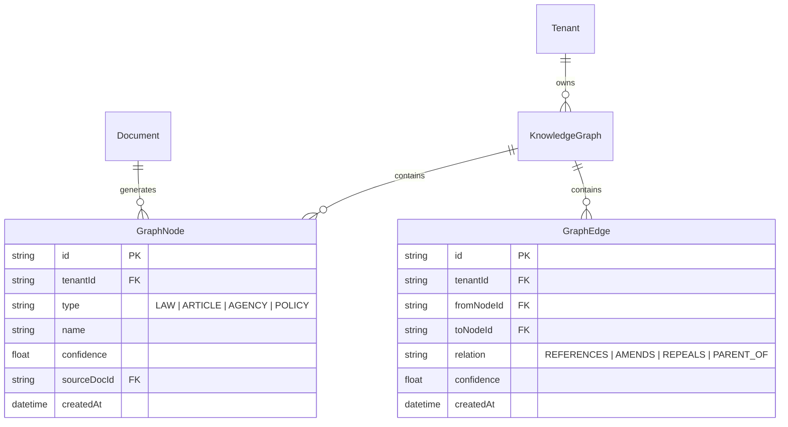

### 3.2 인메모리 데이터 구조

외부 DB를 사용하지 않는 경우 TypeScript 인터페이스로 표현합니다.

```typescript
// knowledge-graph.ts 핵심 자료구조
interface KnowledgeGraph {
  tenantId: string
  nodes: Map<string, GraphNode>    // nodeId → GraphNode
  edges: Map<string, GraphEdge[]>  // nodeId → 연결된 엣지 목록
  nodeCount: number
  maxNodeCount: number  // 100,000 제한 (NFR-메모리)
}

interface GraphNode {
  id: string
  type: 'LAW' | 'ARTICLE' | 'AGENCY' | 'POLICY'
  name: string
  confidence: number
  sourceDocId: string
  tenantId: string
}

interface GraphEdge {
  id: string
  fromNodeId: string
  toNodeId: string
  relation: 'REFERENCES' | 'AMENDS' | 'REPEALS' | 'PARENT_OF' | 'CHILD_OF'
  confidence: number
  tenantId: string
}
```

### 3.3 Prisma 스키마 (DB 저장 시)

PostgreSQL에 저장하는 경우 Prisma 스키마를 Design 문서에 포함합니다.

```prisma
// schema.prisma에 추가
model AuditLog {
  id        String   @id @default(cuid())
  actor     String
  action    String
  target    String?
  timestamp DateTime @default(now())
  ip        String?
  tenantId  String
  metadata  Json?

  @@index([tenantId, timestamp])
  @@index([actor])
}
```

---

## 4. API 설계

### 4.1 API 명세 테이블

모든 신규 API 엔드포인트를 테이블로 정의합니다.

```markdown
## API 명세

| 메서드 | 경로 | 설명 | 인증 | 요청 Body | CSAP |
|--------|------|------|------|---------|------|
| POST | /ai/rag/query/graph | 그래프 RAG 쿼리 | Bearer JWT | GraphQueryRequest | D-08-01 |
| POST | /ai/graph/build | 지식 그래프 구축 | 내부 서비스 키 | BuildGraphRequest | D-08-01 |
| GET | /ai/graph/stats | 그래프 통계 | Bearer JWT | — | D-08-01 |
| DELETE | /ai/graph | 테넌트 그래프 초기화 | Bearer JWT (admin) | — | D-08-01, D-06-01 |
```

### 4.2 요청/응답 스키마

각 API의 요청·응답 형식을 TypeScript 인터페이스와 Zod 스키마로 정의합니다.

```typescript
// 요청 스키마 (Zod 검증)
const graphQuerySchema = z.object({
  query: z.string().min(1).max(500).describe('검색 질문'),
  tenantId: z.string().uuid().describe('테넌트 ID'),
  topK: z.number().int().min(1).max(20).default(5).describe('최대 검색 결과 수'),
  includeGraph: z.boolean().default(true).describe('그래프 컨텍스트 포함 여부'),
})

// 응답 형식
interface GraphQueryResponse {
  answer: string
  sources: Array<{
    docId: string
    content: string
    score: number
    graphContext?: Array<{  // 그래프로 추가된 관련 법령
      nodeId: string
      name: string
      relation: string
    }>
  }>
  processingTime: number  // ms
  graphNodesUsed: number
}
```

### 4.3 에러 응답 형식

에러 응답 형식을 통일하여 정의합니다.

```typescript
interface ErrorResponse {
  error: string     // 사용자 친화적 메시지 (민감 정보 포함 금지)
  code: string      // 에러 코드 (예: 'QUERY_TOO_LONG', 'TENANT_NOT_FOUND')
  errorId: string   // UUID (로그 추적용)
  // stack, dbPassword 등 민감 정보 절대 포함 금지 (CSAP D-12)
}
```

| 상태 코드 | code | 상황 |
|---------|------|------|
| 400 | QUERY_TOO_LONG | query가 500자 초과 |
| 400 | INVALID_TENANT_ID | tenantId가 UUID 형식 아님 |
| 401 | AUTH_REQUIRED | Bearer 토큰 없음 |
| 403 | FORBIDDEN | 권한 없음 |
| 403 | DATA_GRADE_BLOCKED | C/S 등급 데이터 AI 전송 시도 |
| 500 | INTERNAL_ERROR | 서버 내부 오류 |

---

## 5. 시퀀스 다이어그램 작성

### 5.1 시퀀스 다이어그램이 필요한 경우

다음 경우에 시퀀스 다이어그램을 작성합니다.

- 여러 서비스·컴포넌트가 협력하는 복잡한 흐름
- 핵심 비즈니스 로직 (로그인, 결제, AI 질의 등)
- 에러 처리 및 폴백 흐름
- 보안 검사 순서 확인이 필요한 경우

### 5.2 그래프 RAG 정상 흐름

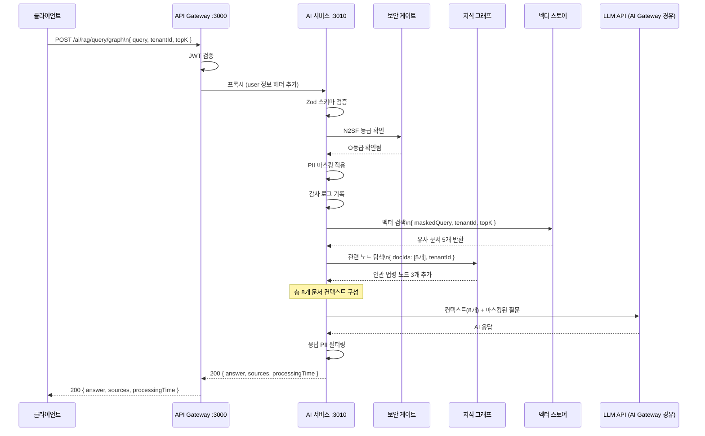

### 5.3 에러 흐름 (C등급 데이터 차단)

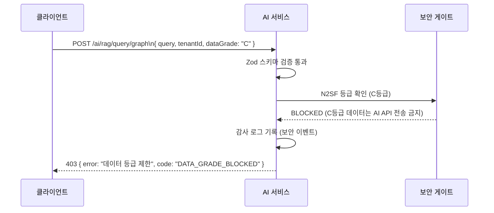

### 5.4 폴백 흐름 (그래프 인덱스 미존재)

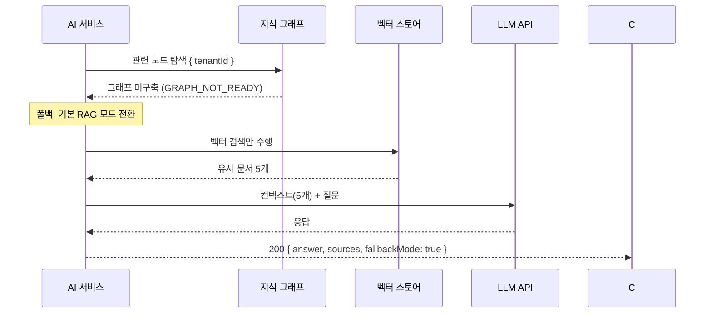

---

## 6. Mermaid 다이어그램 작성 규칙

### 6.1 다이어그램 유형별 사용 시점

| 유형 | 사용 시점 | 예시 |
|------|---------|------|
| `graph TD/LR` | 아키텍처 구조, 데이터 흐름 | 서비스 간 연결 구조 |
| `sequenceDiagram` | API 호출 흐름, 이벤트 처리 | 로그인 흐름, 결제 흐름 |
| `erDiagram` | 데이터 모델, DB 스키마 | User-Tenant 관계 |
| `mindmap` | 디렉토리 구조, 개념 관계 | docs/ 디렉토리 트리 |
| `classDiagram` | 클래스/인터페이스 설계 | TypeScript 인터페이스 계층 |

### 6.2 공통 규칙

한국어 레이블을 기본으로 사용합니다. 서비스 이름은 영어를 허용합니다.

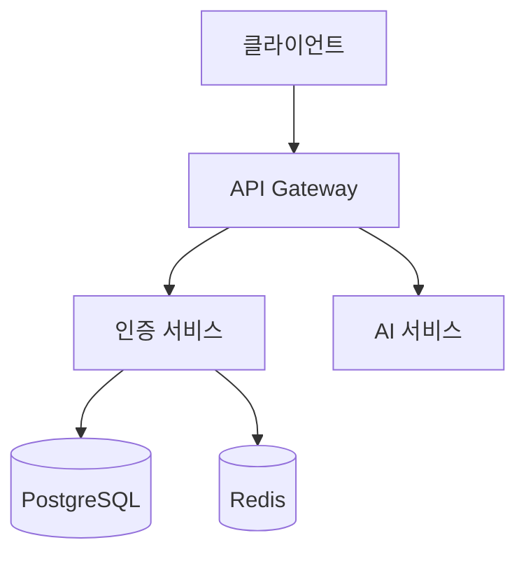

포트 번호를 명시하면 운영 혼란을 방지합니다.

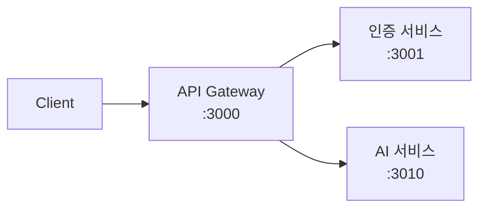

### 6.3 시퀀스 다이어그램 규칙

참여자(participant) 이름은 약어와 전체 이름 모두 표시합니다.

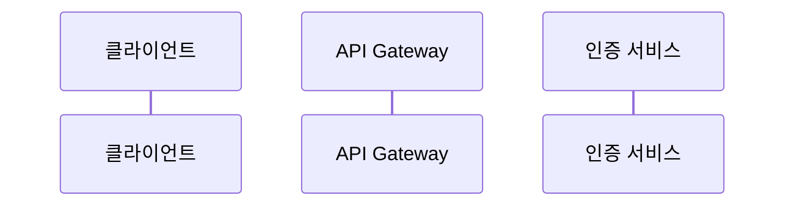

관련 처리 그룹은 `rect`로 묶습니다.

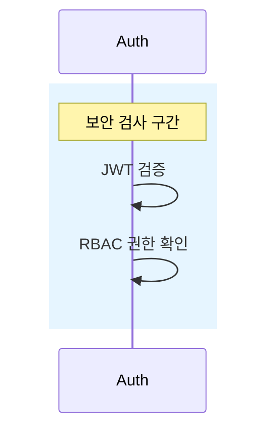

에러 분기는 `alt`로 표현합니다.

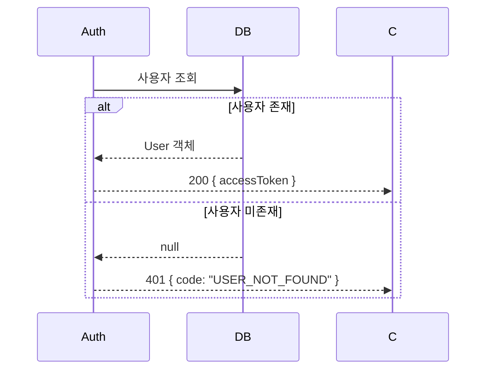

### 6.4 금지 사항

- 이미지 파일(PNG, SVG) 형태의 다이어그램 — Mermaid 텍스트 필수
- 한 다이어그램에 너무 많은 컴포넌트 포함 (20개 이상이면 분리)
- 영문 레이블 단독 사용 (혼합 또는 한국어 사용)

---

## 7. 설계 완전성 체크리스트 (Q-Gate G2 기준)

Auditor 에이전트의 G2(설계 완전성) 게이트 통과 기준입니다.

### 7.1 필수 구조 체크

```
[ ] Design 문서가 docs/02-design/mtus/에 저장됨
[ ] 헤더에 Plan 참조 링크 포함
[ ] Executive Summary 4관점 작성
[ ] Design Anchor (설계 원칙, 주요 결정) 작성
[ ] 파일 변경 목록 (신규/수정/삭제) 작성
[ ] 변경 이력 기록
```

### 7.2 FR 완전성 체크

```
[ ] Plan의 모든 FR에 대응하는 Design 섹션이 존재하는가?
[ ] 각 FR 섹션에 구현 로직 설명이 있는가?
[ ] 각 FR 섹션에 관련 파일 경로가 명시되어 있는가?
[ ] 각 FR의 CSAP 고려사항이 기록되어 있는가?
```

### 7.3 기술 설계 완전성 체크

```
[ ] 신규 API 엔드포인트: 메서드, 경로, 인증, CSAP 항목 명시
[ ] 데이터 모델: ERD 또는 TypeScript 인터페이스 정의
[ ] 핵심 플로우: 시퀀스 다이어그램 작성
[ ] 에러 케이스: 에러 응답 형식 및 상태 코드 정의
[ ] 보안 설계: 입력 검증, 인증, 암호화 방식 명시
```

### 7.4 CSAP 보안 설계 체크

```
[ ] D-08 접근 통제: 모든 API에 인증 방식 명시
[ ] D-09 암호화: 민감 데이터 처리 시 암호화 방식 명시
[ ] D-12 개발 보안: Zod 스키마 검증, 매개변수화 쿼리 명시
[ ] D-06 감사 로그: 감사 이벤트 목록 정의
[ ] N2SF: 데이터 등급 확인 및 AI API 전송 제한 설계 포함
```

---

## 8. 실제 Design 파일 예시 분석

### 8.1 SVC-AUTH-R1 Design 분석

파일 위치: `docs/02-design/mtus/SVC-AUTH-R1.design.md`

이 파일은 인증 서비스 고도화 Design의 실제 예시입니다.

**잘 된 부분**:

```markdown
# Design: auth-service 라운드 1 고도화

> MTU ID: SVC-AUTH-R1
> 버전: 1.0.0 | 작성일: 2026-04-09
> Plan 참조: docs/01-plan/mtus/SVC-AUTH-R1.plan.md
```
- 헤더에 Plan 참조가 명확히 기재됨

```markdown
## Design Anchor
- **Plan**: docs/01-plan/mtus/SVC-AUTH-R1.plan.md
- **아키텍처 옵션**: Pragmatic Balance (실용적 균형) 선택
- **제약**: CLAUDE.md 절대 제약 준수, CSAP/N2SF 규정 준수
```
- 설계 원칙과 제약이 명확히 기재됨

```markdown
## 1. FR-AUTH.1: 로그인 MFA 검증 통합

### 1.1 설계
**흐름 변경**:
기존: 비밀번호 검증 → JWT 발급
변경: 비밀번호 검증 → MFA 확인 → (MFA 활성 시 TOTP 검증) → JWT 발급

**응답 코드**:
- MFA 활성 + mfaCode 미제공: 403 { code: 'MFA_REQUIRED' }
- MFA 활성 + mfaCode 오류: 401 { code: 'MFA_INVALID_CODE' }
```
- FR별 섹션 구성, 흐름 변경 명확, 에러 응답 코드 정의

### 8.2 SVC-AI-R1 Design 분석

파일 위치: `docs/02-design/mtus/SVC-AI-R1.design.md`

이 파일은 **간결한 Design 형식**의 예시입니다. 소규모 MTU에 적합합니다.

```markdown
## 파일 변경 목록
| 작업 | 파일 | FR |
|------|------|-----|
| 신규 | src/lib/prompt-guard.ts | FR-AI.1 |
| 신규 | src/lib/usage-limit.ts | FR-AI.3 |
| 수정 | src/handlers/ai.handler.ts | FR-AI.1~3 |
| 신규 | tests/integration/ai-security.test.ts | FR-AI.4 |
```
- 파일 변경 목록이 명확히 정리됨

**개선 권고**:
- 시퀀스 다이어그램 없음 — AI 핵심 보안 플로우에는 추가 권고
- API 명세 테이블 없음 — 신규 엔드포인트가 있다면 추가 필요

### 8.3 Design 문서 완성도 비교

| 항목 | SVC-AUTH-R1 | SVC-AI-R1 |
|------|-----------|---------|
| Plan 참조 | 있음 | 있음 |
| Design Anchor | 있음 | 없음 |
| FR별 섹션 | 상세 | 간략 |
| 시퀀스 다이어그램 | 없음 | 없음 |
| 파일 변경 목록 | 없음 | 있음 |
| API 명세 | 있음 (일부) | 없음 |

**권고**: 서비스 구현 MTU(SVC-*)는 SVC-AUTH-R1 수준의 상세한 Design을 작성하는 것이 감리 통과에 유리합니다. 인프라 MTU(MTU-N*)는 SVC-AI-R1 수준도 허용됩니다.

---

## 9. CSAP 통제항목 매핑

Design 문서에 CSAP 항목이 어떻게 반영되었는지 명시합니다.

### 9.1 CSAP 매핑 테이블 (Design 문서에 포함)

```markdown
## CSAP 통제항목 매핑

| 항목 | 통제 내용 | 설계 반영 |
|------|---------|---------|
| D-08-01 | 접근 통제 (인증) | 모든 API 엔드포인트에 JWT Bearer 인증 필수 |
| D-08-02 | 접근 통제 (권한) | RBAC preHandler: 'ai:query' 권한 확인 |
| D-09-01 | 암호화 (전송) | TLS 1.3 (API Gateway 레벨에서 강제) |
| D-12-01 | 입력 검증 | Zod 스키마 graphQuerySchema 전수 적용 |
| D-12-04 | 에러 정보 보호 | 에러 응답에 stack trace, DB 정보 제외 |
| D-06-01 | 감사 로그 | AI 질의 시작/완료/실패 auditLog 기록 |
| N2SF N-05 | 데이터 등급 | C/S 등급 데이터 AI API 전송 차단 |
```

### 9.2 보안 설계 필수 패턴

```typescript
// Design 문서에서 설계하는 보안 패턴 예시

// [D-08] 모든 핸들러에 권한 확인 필수
// preHandler: [requirePermission('ai:query')]

// [D-12] 모든 입력에 Zod 검증
// const validated = graphQuerySchema.parse(request.body)

// [N2SF] 데이터 등급 확인
// if (dataGrade !== 'O') throw new DataGradeError()

// [D-06] 감사 로그
// await auditLog({ actor, action: 'AI_QUERY', target: tenantId })
```

---

## 10. 신규 API 엔드포인트 설계 실습

### 10.1 실습 주제: 이메일 알림 발송 API

MTU-N290(이메일 알림)의 핵심 API 엔드포인트를 설계합니다.

#### 요구사항

```
FR-N290.1: SMTP 이메일 발송 함수 (TLS 1.3 필수)
FR-N290.4: 발송 감사 로그 (수신자 마스킹)
```

#### API 명세 작성

```markdown
## API 명세

| 메서드 | 경로 | 설명 | 인증 | CSAP |
|--------|------|------|------|------|
| POST | /notifications/email | 이메일 발송 | 내부 서비스 키 | D-09, D-06 |
| GET | /notifications/email/status/:id | 발송 상태 조회 | Bearer JWT | D-08 |
```

#### 요청/응답 스키마

```typescript
// 요청 스키마 (Zod)
const sendEmailSchema = z.object({
  to: z.string().email(),           // 수신자 (감사 로그에서 마스킹)
  templateId: z.enum([
    'USER_REGISTERED',
    'PASSWORD_CHANGED',
    'SUBSCRIPTION_EXPIRING',
  ]),
  variables: z.record(z.string()),  // 템플릿 변수
  tenantId: z.string().uuid(),
  priority: z.enum(['HIGH', 'NORMAL']).default('NORMAL'),
})

// 응답
interface SendEmailResponse {
  emailId: string   // 추적용 ID
  status: 'QUEUED' | 'SENT' | 'FAILED'
  queuedAt: string  // ISO 8601
}
```

#### 시퀀스 다이어그램

```mermaid
sequenceDiagram
  participant SVC as 호출 서비스
  participant NOTIF as notification-service
  participant AUDIT as auditLog
  participant SMTP as SMTP 서버

  SVC->>NOTIF: POST /notifications/email\n{ to, templateId, variables, tenantId }
  NOTIF->>NOTIF: Zod 스키마 검증
  NOTIF->>NOTIF: 템플릿 렌더링
  NOTIF->>AUDIT: auditLog(EMAIL_SEND_ATTEMPT, masked_to)

  NOTIF->>SMTP: sendMail() TLS 1.3
  alt 발송 성공
    SMTP-->>NOTIF: 250 OK
    NOTIF->>AUDIT: auditLog(EMAIL_SEND_SUCCESS, emailId)
    NOTIF-->>SVC: 201 { emailId, status: 'SENT' }
  else 발송 실패
    SMTP-->>NOTIF: 550 Error
    NOTIF->>NOTIF: retry 큐 추가 (지수 백오프)
    NOTIF->>AUDIT: auditLog(EMAIL_SEND_FAILED, emailId)
    NOTIF-->>SVC: 202 { emailId, status: 'QUEUED' }
  end
```

#### 에러 케이스

| 상황 | HTTP | code |
|------|------|------|
| 템플릿 ID 없음 | 400 | INVALID_TEMPLATE |
| 수신자 이메일 형식 오류 | 400 | INVALID_EMAIL |
| SMTP 서버 장애 (3회 재시도 후) | 202 | QUEUED_FOR_RETRY |
| 내부 서비스 키 없음 | 401 | AUTH_REQUIRED |

---

## 11. 복사-붙여넣기 Design 템플릿

```markdown
# Design: MTU-{ID} — {기능명}

> **버전**: 1.0.0 | **작성일**: {YYYY-MM-DD} | **작성자**: Implementer (Sonnet)
> **Plan 참조**: docs/01-plan/mtus/MTU-{ID}.plan.md

---

## Executive Summary

| 관점 | 내용 |
|------|------|
| **비즈니스** | {Plan의 비즈니스 관점 요약} |
| **기술** | {핵심 기술 결정 사항} |
| **보안** | {CSAP 항목, 보안 설계 결정} |
| **운영** | {모니터링, 장애 대응 설계} |

## Design Anchor

| 항목 | 값 |
|------|---|
| 패턴 | {채택한 패턴: Shift-Left, Event-Driven 등} |
| 도구 | {사용 도구 목록} |
| 기준 | {품질/성능 기준} |
| CSAP | {관련 CSAP 항목} |

---

## S1. FR-{모듈}.1 — {요구사항명}

### S1.1 설계

{구현 로직 설명}

**신규 파일**: `{서비스}/src/{파일}.ts`

```typescript
// 핵심 인터페이스 또는 함수 시그니처
interface {InterfaceName} {
  // ...
}
```

### S1.2 CSAP 고려사항

| 항목 | 내용 |
|------|------|
| D-{번호}-{부번호} | {보안 요건 반영 내용} |

---

## S2. FR-{모듈}.2 — {요구사항명}

{S1과 동일 구조 반복}

---

## API 명세 (신규 엔드포인트)

| 메서드 | 경로 | 설명 | 인증 | CSAP |
|--------|------|------|------|------|
| {POST} | {/api/v1/resource} | {설명} | Bearer JWT | D-08 |

### 요청 스키마

```typescript
const {requestSchema} = z.object({
  field1: z.string().min(1).max(100),
  field2: z.enum(['A', 'B', 'C']),
})
```

### 응답 형식

```typescript
interface {ResponseInterface} {
  id: string
  status: string
  createdAt: string
}
```

### 에러 응답

| HTTP | code | 상황 |
|------|------|------|
| 400 | INVALID_INPUT | 입력 검증 실패 |
| 401 | AUTH_REQUIRED | 인증 없음 |
| 403 | FORBIDDEN | 권한 없음 |
| 500 | INTERNAL_ERROR | 서버 오류 |

---

## 시퀀스 다이어그램

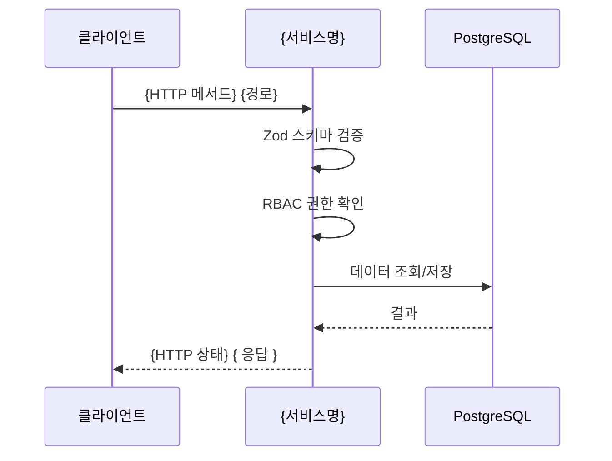

---

## ERD (데이터 모델, 해당 시)

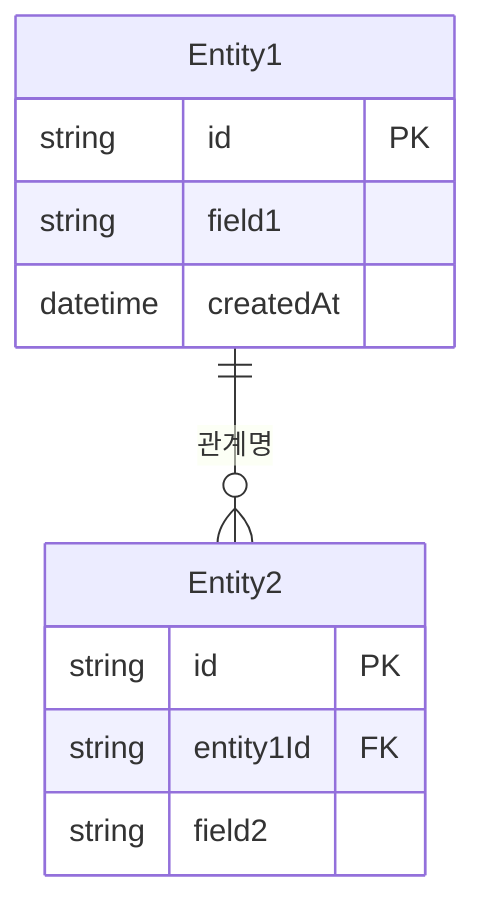

---

## CSAP 통제항목 매핑

| 항목 | 통제 내용 | 설계 반영 |
|------|---------|---------|
| D-08 | 접근 통제 | {어떻게 반영했는가} |
| D-09 | 암호화 | {어떻게 반영했는가} |
| D-12 | 입력 검증 | Zod 스키마 전수 적용 |
| D-06 | 감사 로그 | {감사 이벤트 목록} |

---

## 파일 변경 목록

| 작업 | 파일 경로 | 관련 FR |
|------|---------|-------|
| 신규 | {서비스}/src/lib/{파일}.ts | FR-{모듈}.1 |
| 신규 | {서비스}/src/handlers/{파일}.handler.ts | FR-{모듈}.2 |
| 수정 | {서비스}/src/routes.ts | FR-{모듈}.2 |
| 신규 | {서비스}/tests/{파일}.test.ts | FR-{모듈}.1,2 |

---

## 변경 이력

| 버전 | 일자 | 내용 | 작성자 |
|------|------|------|--------|
| 1.0.0 | {YYYY-MM-DD} | 초안 작성 | Implementer (Sonnet) |
```

---

## 12. Q-Gate G2 완전성 체크리스트

### 필수 구조 체크

```
□ Design 문서가 docs/02-design/mtus/에 저장됨
□ 헤더에 Plan 참조 링크 포함
□ Executive Summary 4관점 작성
□ Design Anchor (설계 원칙, 주요 결정) 작성
□ Plan의 모든 FR에 대응하는 섹션 존재
□ 파일 변경 목록 (신규/수정/삭제) 작성
□ 변경 이력 기록
```

### 기술 설계 완전성 체크

```
□ 신규 API: 메서드, 경로, 인증, CSAP 항목 명시
□ 요청/응답 스키마 (TypeScript 또는 Zod)
□ 에러 케이스 정의 (HTTP 상태 코드, code)
□ 데이터 모델: ERD 또는 TypeScript 인터페이스
□ 핵심 플로우: 시퀀스 다이어그램 (복잡한 경우)
□ 보안 설계: 입력 검증, 인증, 암호화 방식
□ CSAP 통제항목 매핑 테이블
```

---

## 13. 변경 이력

| 버전 | 일자 | 내용 | 작성자 |
|------|------|------|-------|
| 2.0.0 | 2026-04-12 | 전면 개편: Design Anchor, 실습(이메일 API), 완전 템플릿, Q-Gate G2 체크리스트 추가 | Implementer (Sonnet) |
| 1.0.0 | 2026-04-11 | 초기 작성 | Implementer (Sonnet) |
