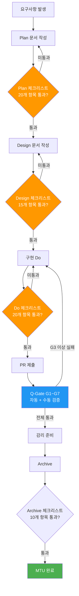
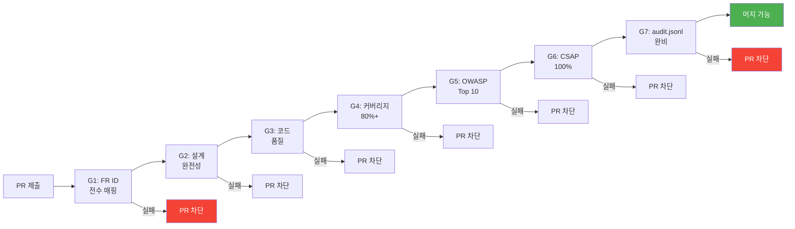

# PDCA 완성 체크리스트 — 단계별 완료 기준 완전 가이드

> **문서 ID**: ONBOARD-08-PDCA-04
> **버전**: 1.0.0 | **작성일**: 2026-04-12 | **작성자**: Implementer (Sonnet)
> **선행 학습**: `01-what-is-pdca.md`, `02-writing-plan.md`, `03-writing-design.md`
> **소요 시간**: 약 60분 (숙지), 구현 중 수시 참조
> **CSAP**: D-06, D-08, D-09, D-12 (전 영역)
> **행안부 근거**: 정보시스템 감리기준 고시 제2023-1호

---

## 목차

1. [이 체크리스트를 어떻게 사용하는가](#1-이-체크리스트를-어떻게-사용하는가)
2. [Plan 단계 체크리스트 (20개 항목)](#2-plan-단계-체크리스트-20개-항목)
3. [Design 단계 체크리스트 (15개 항목)](#3-design-단계-체크리스트-15개-항목)
4. [Do(구현) 단계 체크리스트 (20개 항목)](#4-do구현-단계-체크리스트-20개-항목)
5. [Check 단계 체크리스트 — Q-Gate G1~G7](#5-check-단계-체크리스트--q-gate-g1g7)
6. [Archive 단계 체크리스트 (10개 항목)](#6-archive-단계-체크리스트-10개-항목)
7. [PR 설명란에 붙여넣는 체크리스트](#7-pr-설명란에-붙여넣는-체크리스트)
8. [자동화 vs 수동 확인 항목 구분](#8-자동화-vs-수동-확인-항목-구분)
9. [감리관이 가장 먼저 보는 항목 TOP 5](#9-감리관이-가장-먼저-보는-항목-top-5)
10. [체크리스트 실전 활용 팁](#10-체크리스트-실전-활용-팁)
11. [학습 체크리스트](#11-학습-체크리스트)
12. [다음 단계](#12-다음-단계)

---

## 1. 이 체크리스트를 어떻게 사용하는가

### 1.1 체크리스트의 목적

이 체크리스트는 두 가지 용도로 사용됩니다.

```
용도 1: 구현 중 자가 점검
  "내가 빠뜨린 것이 없는가?"를 단계마다 확인

용도 2: PR 제출 전 최종 확인
  PR 설명란에 붙여 넣어 리뷰어와 검토 기준 공유
```

### 1.2 PDCA 완료 흐름과 체크리스트 적용 시점



### 1.3 심각도 표시 기호

이 문서에서 사용하는 표시 기호입니다.

```
✅ 필수 — 감리 결함으로 직결. 반드시 통과해야 PR 머지 가능
⚠️ 중요 — 누락 시 Q-Gate 경고. 이유 있으면 예외 가능
💡 권장 — 품질 향상을 위한 권장 사항. 선택 사항
❌ 금지 — 절대 하면 안 되는 것. 위반 즉시 PR 차단
```

---

## 2. Plan 단계 체크리스트 (20개 항목)

Plan 문서(`docs/01-plan/mtus/*.plan.md`)를 작성할 때 확인합니다.

### 2.1 문서 기본 형식 (5개)

```
✅ P-01: MTU ID가 부여되었는가?
        형식: MTU-N{번호} 또는 SVC-{서비스}-R{번호}
        예시: MTU-N251-dora-four-keys.plan.md
        확인: 파일명과 문서 내 MTU ID가 일치하는가?

✅ P-02: 문서 헤더 메타데이터가 완성되었는가?
        필수 항목:
          - 버전 (1.0.0 형식)
          - 작성일 (YYYY-MM-DD)
          - 작성자
          - 검토자 (있으면)
          - 승인자 (있으면)

✅ P-03: 변경 이력 테이블이 있는가?
        최소 초기 버전(1.0.0) 항목 포함
        | 버전 | 일자 | 내용 | 작성자 |

⚠️ P-04: 목차가 문서 구조와 일치하는가?
        내부 링크(#앵커)가 실제 제목과 매칭되는가?

💡 P-05: 관련 설계 문서 및 참고 자료가 명시되었는가?
        이전 MTU와의 연관성, 참고 표준 등
```

### 2.2 Context Anchor (5개)

```
✅ P-06: WHY (왜 이 기능이 필요한가?)가 명확한가?
        나쁜 예: "사용자 관리 기능 추가"
        좋은 예: "공공기관 담당자가 시스템 접근 권한을 셀프서비스로
                  관리할 수 없어 IT팀에 요청하는 병목 해소.
                  월 평균 50건 요청, 처리 지연 평균 3일"

✅ P-07: WHO (이해관계자)가 구체적으로 명시되었는가?
        - 주요 사용자 (공무원 직급/역할)
        - 시스템 관리자
        - 감리단
        - CSAP 심사원

✅ P-08: RISK (위험 요소)가 파악되었는가?
        최소 3개 이상의 위험 요소와 대응 방안

        | 위험 | 가능성 | 영향도 | 대응 |
        |-----|-------|-------|-----|
        | DB 스키마 변경 시 기존 데이터 호환성 | 중 | 높 | 마이그레이션 스크립트 사전 준비 |

✅ P-09: SUCCESS (성공 기준)가 측정 가능한가?
        나쁜 예: "사용자가 편리하게 사용 가능"
        좋은 예: "사용자 권한 신청 처리 시간 3일 → 1분 이내 자동화.
                  관리자 수동 작업 월 50건 → 0건"

⚠️ P-10: SCOPE (범위)가 명확한가?
        In-scope (이번에 하는 것)와
        Out-of-scope (이번에 하지 않는 것)가 구분되어 있는가?
```

### 2.3 기능 요구사항 (5개)

```
✅ P-11: 모든 기능 요구사항에 FR ID가 부여되었는가?
        형식: FR-{모듈}.{번호} (예: FR-1.1, FR-AUTH.3)
        CLAUDE.md §3 ID 체계 준수 필수

✅ P-12: 각 FR이 테스트 가능한 형태로 작성되었는가?
        나쁜 예: "사용자 인증 기능"
        좋은 예: "FR-1.1: 사용자가 이메일/비밀번호로 로그인하면
                  JWT 액세스 토큰(15분 만료)과 리프레시 토큰(7일)을
                  응답한다. 로그인 실패 5회 시 계정 잠금."

✅ P-13: 비기능 요구사항(NFR)이 수치로 명시되었는가?
        필수 NFR:
        - NFR-P: 성능 (P99 응답시간 목표)
        - NFR-S: 보안 (CSAP 항목)
        - NFR-A: 가용성 (SLO 목표)

⚠️ P-14: 의존성 MTU가 명시되었는가?
        이 MTU가 완료되기 위해 선행되어야 하는 MTU 목록

💡 P-15: 우선순위가 표시되었는가?
        P0(긴급)/P1(높음)/P2(보통)/P3(낮음)
```

### 2.4 CSAP/감리 연관 (5개)

```
✅ P-16: CSAP 통제 항목 매핑이 되었는가?
        관련 CSAP 항목 명시 (D-06/D-08/D-09/D-12 등)
        예: "FR-1.1은 CSAP D-08 접근 통제 항목에 해당"

✅ P-17: 4-Perspective Executive Summary 테이블이 있는가?
        | 관점 | 목표 | 지표 |
        |기술| 응답시간 | P99 < 1초 |
        |운영| 배포 빈도 | 주 2회 |
        |비용| 인프라 | 기존 대비 20% 이내 |
        |규정| CSAP | 해당 항목 100% |

✅ P-18: 추적성 매트릭스 초안이 있는가?
        최소 FR↔산출물 2방향 매핑
        (Check 단계에서 4방향으로 확장)

⚠️ P-19: 감리 점검 항목 사전 확인이 되었는가?
        행안부 감리기준에서 이 MTU와 관련된 체크 항목 목록

💡 P-20: 이전 유사 MTU 사례가 참조되었는가?
        기존 완료된 MTU에서 참고할 패턴, 주의 사항 등
```

---

## 3. Design 단계 체크리스트 (15개 항목)

Design 문서(`docs/02-design/features/*.design.md`)를 작성할 때 확인합니다.

### 3.1 API 설계 (4개)

```
✅ D-01: 모든 API 엔드포인트가 명세되었는가?
        - HTTP 메서드 (GET/POST/PUT/DELETE/PATCH)
        - URL 패턴 (/api/v1/users/:id)
        - 요청 스키마 (Zod 타입 또는 JSON Schema)
        - 응답 스키마 (성공/실패 모두)
        - HTTP 상태 코드 목록

✅ D-02: 입력 검증 스키마(Zod)가 설계에 포함되었는가?
        모든 API 입력은 Zod 스키마로 검증 명시
        예:
          const createUserSchema = z.object({
            email: z.string().email(),
            name: z.string().min(1).max(100),
            role: z.enum(['admin', 'user', 'viewer']),
          })

⚠️ D-03: API 버전 관리 전략이 명시되었는가?
        /api/v1/, /api/v2/ 형식 또는 헤더 기반 버전 관리

💡 D-04: OpenAPI 스펙(swagger) 생성 계획이 있는가?
        자동 생성 도구 또는 수동 작성 방법
```

### 3.2 데이터베이스 설계 (3개)

```
✅ D-05: ERD 변경사항이 Mermaid 다이어그램으로 표현되었는가?
        신규 테이블, 변경된 컬럼, 외래키 관계 모두 포함

        예시 형식:
        ```mermaid
        erDiagram
          users ||--o{ user_roles : "has"
          user_roles }o--|| roles : "references"
          users {
            uuid id PK
            string email UK
            string name
            timestamp created_at
          }
        ```

✅ D-06: 마이그레이션 전략이 명시되었는가?
        - 순방향 마이그레이션 (up)
        - 역방향 마이그레이션 (down, 롤백 가능 여부)
        - 기존 데이터 처리 방법

⚠️ D-07: 인덱스 설계가 포함되었는가?
        쿼리 패턴에 맞는 복합 인덱스, 유니크 제약 등
```

### 3.3 시퀀스 다이어그램 (3개)

```
✅ D-08: Happy Path 시퀀스 다이어그램이 있는가?
        정상 흐름의 컴포넌트 간 메시지 시퀀스

        예시:
        ```mermaid
        sequenceDiagram
          Client->>API Gateway: POST /api/v1/login
          API Gateway->>Auth Service: validateCredentials()
          Auth Service->>PostgreSQL: SELECT * FROM users WHERE email=?
          PostgreSQL-->>Auth Service: user record
          Auth Service->>Redis: SET jwt_blacklist:...
          Auth Service-->>API Gateway: {accessToken, refreshToken}
          API Gateway-->>Client: 200 OK
        ```

✅ D-09: Error Path 시퀀스 다이어그램이 있는가?
        인증 실패, DB 에러, 타임아웃 등 에러 케이스
        각 에러에서 어떤 HTTP 상태 코드와 메시지를 반환하는지

⚠️ D-10: 비동기 처리(이벤트/큐) 다이어그램이 있는가?
        해당하는 경우: Kafka, Redis Pub/Sub, 웹훅 등
```

### 3.4 보안 설계 (CSAP 매핑, 5개)

```
✅ D-11: CSAP D-08 접근 통제 요건 매핑이 되었는가?
        - 어떤 역할(Role)이 어떤 엔드포인트에 접근 가능한가?
        - RBAC 매트릭스 테이블 (역할 × 리소스)
        - 미인증 요청 처리 방식

        예시:
        | 엔드포인트 | admin | manager | user | viewer |
        |-----------|-------|---------|------|--------|
        | GET /users | ✅ | ✅ | ❌ | ❌ |
        | POST /users | ✅ | ❌ | ❌ | ❌ |

✅ D-12: CSAP D-09 암호화 요건 매핑이 되었는가?
        - 저장 시 암호화 대상 필드 목록 (AES-256)
        - 전송 시 TLS 1.3+ 명시
        - 해시 대상 필드 (bcrypt/SHA-256)

✅ D-13: CSAP D-12 시스템 개발 보안 요건 매핑이 되었는가?
        - 입력 검증 (Zod, DOMPurify)
        - SQL 주입 방지 (매개변수화 쿼리)
        - XSS 방지 (HTML 새니타이제이션)
        - 에러 메시지 민감 정보 노출 방지

✅ D-14: CSAP D-06 감사 로그 요건 매핑이 되었는가?
        - 어떤 작업을 auditLog()로 기록하는가?
        - 로그 보존 기간 (최소 1년)
        - 감사 로그 무결성 보장 방법 (append-only)

⚠️ D-15: N2SF AI 연동 데이터 분류가 명시되었는가?
        AI 기능이 포함된 경우:
        - 처리 데이터의 등급 (C/S/O)
        - O 등급 데이터의 PII 마스킹 방법
        - AI Gateway 경유 여부
```

---

## 4. Do(구현) 단계 체크리스트 (20개 항목)

PR 제출 전 코드를 작성하면서 확인합니다.

### 4.1 코드 품질 (5개)

```
✅ DO-01: 미사용 import가 없는가?
          확인 방법:
          npx ts-prune --error | grep "is not used"
          또는 ESLint: no-unused-vars 규칙

✅ DO-02: 함수 크기가 80줄 이하인가?
          80줄을 초과하는 함수는 단일 책임 원칙 위반 신호
          확인 방법: ESLint max-lines-per-function 규칙

✅ DO-03: 중첩 깊이가 4단계 이하인가?
          if → if → if → if (4단계) → 이 이상은 리팩토링 필요
          확인 방법: ESLint max-depth 규칙

⚠️ DO-04: 함수/변수명이 자기 설명적인가?
          나쁜 예: const x = getD(u, r)
          좋은 예: const userPermissions = getUserPermissions(userId, roleId)

⚠️ DO-05: 주석이 "왜"를 설명하는가? (무엇이 아닌)
          나쁜 예: // 사용자를 조회한다
          좋은 예: // CSAP D-08: 접근 로그 기록 후 권한 검사 (순서 변경 금지)
```

### 4.2 보안 (CSAP D-08/D-09/D-12, 7개)

```
✅ DO-06: 하드코딩된 시크릿이 없는가?
          ❌ 금지: const apiKey = 'sk-1234567890abcdef'
          ✅ 올바름: const apiKey = process.env.API_KEY
          if (!apiKey) throw new Error('API_KEY 환경변수 누락')

          확인 방법:
          git diff --staged | grep -E "'[A-Za-z0-9+/]{20,}'"
          또는 Semgrep: secrets 룰셋

✅ DO-07: 모든 API 엔드포인트에 verifyToken()이 적용되었는가?
          // 올바른 패턴 (CSAP D-08)
          export async function GET(req: Request) {
            const user = await verifyToken(req.headers.authorization)
            // verifyToken이 실패하면 401을 던짐
            ...
          }

          확인 방법:
          grep -r "export async function" platform/services/*/src/routes.ts | \
            xargs grep -L "verifyToken"  # verifyToken 없는 라우트 목록

✅ DO-08: 모든 API에 hasPermission() RBAC 검사가 있는가?
          // 올바른 패턴 (CSAP D-08)
          if (!hasPermission(user, 'users:write')) {
            return Response.json({ error: 'Forbidden' }, { status: 403 })
          }

✅ DO-09: 모든 사용자 입력에 Zod 스키마 검증이 있는가?
          // 모든 POST/PUT/PATCH 핸들러에 반드시 포함
          const validated = createUserSchema.parse(body)
          // .parse() 실패 시 ZodError를 400으로 자동 처리

✅ DO-10: SQL 쿼리가 매개변수화되어 있는가?
          ❌ 금지: db.execute(`SELECT * FROM users WHERE email = '${email}'`)
          ✅ 올바름: db.execute('SELECT * FROM users WHERE email = $1', [email])

✅ DO-11: 민감 작업에 auditLog()가 기록되는가?
          필수 기록 대상:
          - 사용자 생성/수정/삭제
          - 권한 변경
          - 설정 변경
          - 데이터 내보내기

          // 올바른 패턴 (CSAP D-06)
          await auditLog({
            actor: user.id,
            action: 'USER_DELETE',
            target: targetUserId,
            timestamp: new Date().toISOString(),
            ip: getClientIP(req),
          })

⚠️ DO-12: 에러 메시지에 민감 정보가 없는가?
          ❌ 금지:
          catch (e) {
            return { error: e.message, stack: e.stack, query: sql }
          }

          ✅ 올바름:
          catch (e) {
            const errorId = crypto.randomUUID()
            logger.error('DB error', { errorId, error: e })
            return Response.json(
              { error: 'Internal server error', errorId },
              { status: 500 }
            )
          }
```

### 4.3 문서-코드 추적성 (4개)

```
✅ DO-13: 모든 신규 함수/클래스에 Design Ref 주석이 있는가?
          // Design Ref: §{섹션 번호} — {결정 근거}
          // 예: Design Ref: §3.2 — JWT 만료 15분은 CSAP D-08 세션 관리 요건

✅ DO-14: Plan의 FR ID가 코드에 추적 가능한가?
          // Plan SC: FR-1.1 — 이메일/비밀번호 로그인
          export async function loginHandler(req: Request) { ... }

✅ DO-15: 미사용 함수/변수에 사유 주석이 있는가?
          // NOTE: 미사용. Phase 2 FR-2.3 구현 시 사용 예정. 2026-07-01 재검토.
          // (또는 즉시 제거 — deadcode-policy.md 참조)

⚠️ DO-16: CHANGELOG.md가 업데이트되었는가?
          ## [Unreleased]
          ### Added
          - FR-1.1: 이메일/비밀번호 로그인 API 추가
          ### Changed
          - FR-1.3: JWT 만료 시간 30분 → 15분 (CSAP D-08)
```

### 4.4 테스트 (4개)

```
✅ DO-17: 신규 함수에 단위 테스트가 있는가?
          최소: Happy Path + 주요 Error Path 테스트
          // 목표 커버리지: 라인 80% 이상 (Q-Gate G4 요건)

✅ DO-18: 테스트가 실제로 통과하는가?
          pnpm run test
          # 모든 테스트 PASS, 커버리지 80% 이상 확인

⚠️ DO-19: 통합 테스트가 포함되었는가?
          단위 테스트만으로는 DB, Redis, 외부 서비스 연동을 검증할 수 없음
          최소 1개 이상의 통합 테스트 (실제 DB 연결 포함)

⚠️ DO-20: 테스트 픽스처(Fixture)가 실제 데이터와 유사한가?
          나쁜 예: name: 'test', email: 'test@test.test'
          좋은 예: name: '김철수', email: 'kim.cheolsu@ministry.go.kr'
```

---

## 5. Check 단계 체크리스트 — Q-Gate G1~G7

PR이 제출된 후 Q-Gate가 자동으로 실행하는 항목들입니다.

### 5.1 Q-Gate 전체 흐름



### 5.2 G1: FR ID 전수 매핑

**검증 방법** (`.gitea/workflows/quality-gate.yml` G1 job):

```bash
# Plan 문서에 FR ID가 정의되어 있는가?
FR_COUNT=$(grep -roh 'FR-[A-Z0-9]*\.[0-9]*' docs/01-plan/mtus/*.plan.md 2>/dev/null | \
  sort -u | wc -l)
echo "총 FR ID 수: $FR_COUNT"  # 1개 이상이어야 함

# 코드에 FR ID가 추적되고 있는가?
grep -r "Plan SC: FR-" platform/services/ | wc -l
```

**수동 확인 항목:**

```
✅ G1-1: Plan 문서의 모든 FR에 번호가 부여되었는가?
✅ G1-2: 구현 코드에 // Plan SC: FR-X.X 주석이 있는가?
✅ G1-3: FR에 대응하는 테스트가 1개 이상 있는가?
         (테스트 파일에 // Tests: FR-X.X 주석)
⚠️ G1-4: FR과 구현 사이에 누락된 것이 없는가?
          Plan의 FR 목록 ↔ 코드의 FR 주석 비교
```

### 5.3 G2: 설계 완전성 검증

```
✅ G2-1: Design 문서가 Plan보다 먼저 완성되었는가?
         (구현 시작 전 Design 완료 필수 — CLAUDE.md 절대 제약)

✅ G2-2: API 명세와 실제 구현이 일치하는가?
         Design의 엔드포인트 URL ↔ 코드의 라우트 정의
         Design의 Zod 스키마 ↔ 코드의 실제 스키마

✅ G2-3: ERD 다이어그램과 실제 마이그레이션이 일치하는가?
         Design의 테이블 구조 ↔ 마이그레이션 파일

⚠️ G2-4: 시퀀스 다이어그램이 실제 코드 흐름과 일치하는가?
          구현 중 설계가 변경되었다면 Design 문서도 업데이트

💡 G2-5: 미구현 FR이 있다면 사유가 명시되었는가?
          Out of scope로 이동했거나 다음 MTU로 이월된 FR
```

### 5.4 G3: 코드 품질 (Reviewer 통과)

```bash
# 자동 검사 항목
pnpm run lint           # ESLint 오류 없음
pnpm run typecheck      # TypeScript 타입 오류 없음
npx ts-prune --error    # 미사용 export 없음
```

```
✅ G3-1: ESLint 오류가 0개인가?
         경고(Warning)는 허용, 오류(Error)는 차단

✅ G3-2: TypeScript 타입 오류가 0개인가?
         any 타입 최소화 (eslint: @typescript-eslint/no-explicit-any)

✅ G3-3: 미사용 export가 없는가? (ts-prune)
         Public API로 의도된 경우 @deprecated 또는 사유 주석 필수

⚠️ G3-4: Reviewer 에이전트 검사를 통과했는가?
          Reviewer가 HIGH 심각도 이슈를 보고하면 G3 불통과

💡 G3-5: 순환 의존성이 없는가?
          A → B → C → A 형태의 import 사이클
```

### 5.5 G4: 테스트 커버리지 80%+

```bash
# 커버리지 측정
pnpm run test -- --coverage

# 결과 확인
# Coverage summary:
# Lines   : 85.32% ( 532/624 )  ✅ (목표 80%)
# Functions: 81.25% ( 65/80 )   ✅
# Branches : 72.18% ( 53/74 )   ⚠️ (목표 70%)
```

```
✅ G4-1: 라인 커버리지가 80% 이상인가?
✅ G4-2: 함수 커버리지가 80% 이상인가?
⚠️ G4-3: 브랜치 커버리지가 70% 이상인가?
💡 G4-4: 핵심 보안 로직(verifyToken, hasPermission, auditLog)
          커버리지가 100%인가?
```

### 5.6 G5: OWASP Top 10 통과

```bash
# Semgrep OWASP 룰셋 실행 (DevSecOps 파이프라인에서 자동)
semgrep --config "p/owasp-top-ten" platform/services/

# Trivy 취약점 스캔
trivy fs --severity HIGH,CRITICAL platform/services/
```

```
✅ G5-1: SQL 인젝션 취약점이 없는가? (A03)
         매개변수화 쿼리 사용 여부 Semgrep으로 자동 검사

✅ G5-2: XSS 취약점이 없는가? (A03)
         DOMPurify 사용, innerHTML 직접 삽입 금지

✅ G5-3: 인증 우회 가능성이 없는가? (A07)
         모든 엔드포인트에 verifyToken() 확인

✅ G5-4: 취약한 npm 패키지가 없는가? (A06)
         Trivy 스캔에서 HIGH/CRITICAL 취약점 0개

⚠️ G5-5: SSRF 취약점이 없는가? (A10)
          외부 URL 요청 시 화이트리스트 검증
```

### 5.7 G6: CSAP 해당 Phase 100%

```
✅ G6-1: D-06 감사 로그 — 모든 민감 작업이 auditLog()로 기록되는가?
✅ G6-2: D-08 접근 통제 — 모든 API에 RBAC 검사가 있는가?
✅ G6-3: D-09 암호화 — 민감 데이터가 AES-256으로 저장되는가?
✅ G6-4: D-12 개발 보안 — Zod 검증, 매개변수화 쿼리, XSS 방지
⚠️ G6-5: N2SF AI 연동 — C/S 등급 데이터가 AI API에 전송되지 않는가?
```

### 5.8 G7: audit.jsonl 완비

```bash
# .claude/audit.jsonl에 이 PR과 관련된 감사 기록이 있는가?
grep "$(git log --oneline | head -1 | awk '{print $1}')" .claude/audit.jsonl
```

```
✅ G7-1: .claude/audit.jsonl에 이번 변경의 감사 기록이 있는가?
✅ G7-2: 감사 기록에 actor(작성자), action(작업), timestamp가 있는가?
⚠️ G7-3: 보안 관련 변경(권한, 암호화, 인증)은 별도 감사 항목이 있는가?
💡 G7-4: 감사 로그가 append-only 구조로 유지되는가? (수정/삭제 불가)
```

---

## 6. Archive 단계 체크리스트 (10개 항목)

MTU가 완료된 후 아카이브할 때 확인합니다.

```
✅ A-01: PDCA 상태가 완료로 업데이트되었는가?
         .bkit/state/pdca-status.json 에서 해당 MTU 상태 확인

✅ A-02: 최종 추적성 매트릭스가 4방향으로 완성되었는가?
         FR → 산출물 → 테스트 → CSAP 항목 4방향 매핑
         누락된 FR이 없는지 최종 확인

✅ A-03: 설계 문서와 구현이 일치하는가?
         구현 중 설계가 변경된 부분이 Design 문서에 반영되었는가?

✅ A-04: CHANGELOG.md가 최종 업데이트되었는가?
         ## [버전]
         ### Added / Changed / Fixed / Removed
         각 항목에 FR ID 포함

⚠️ A-05: 운영 가이드(Runbook)가 필요한가?
          새 알림, 새 작업, 새 오류 패턴이 추가되었다면 런북 업데이트
          (05-monitoring/alerting/02-alert-runbooks.md)

⚠️ A-06: 온보딩 문서 업데이트가 필요한가?
          신규 개발자가 알아야 할 새 패턴, 설정, 환경변수 등

💡 A-07: Dead code 최종 정리가 완료되었는가?
          Refactorer 에이전트 실행 결과 확인
          npx ts-prune --error → 0개

✅ A-08: PR이 머지되고 스테이징 배포가 완료되었는가?
          helm/saas-platform HelmRelease가 업데이트되었는가?

✅ A-09: 감리 증거 파일이 수집되었는가?
          .bkit/audit/ 에 이번 MTU 관련 감사 기록
          테스트 결과 파일 (coverage report)
          Q-Gate 통과 증거 (CI 로그 링크)

💡 A-10: 포스트모템 또는 교훈이 있다면 기록되었는가?
          구현 중 어려웠던 점, 나중에 피해야 할 패턴 등
          미래 팀원을 위한 기록
```

---

## 7. PR 설명란에 붙여넣는 체크리스트

PR을 제출할 때 다음 체크리스트를 Description에 붙여 넣습니다.

```markdown
## PDCA 완료 체크리스트

### Plan
- [ ] MTU ID 부여 및 Plan 문서 완성
- [ ] FR ID 전수 (FR-X.X 형식)
- [ ] Context Anchor (WHY/WHO/RISK/SUCCESS/SCOPE)
- [ ] CSAP 매핑 완료

### Design
- [ ] API 명세 (Zod 스키마 포함)
- [ ] ERD 변경사항 다이어그램
- [ ] 시퀀스 다이어그램 (Happy + Error Path)
- [ ] CSAP D-08/D-09/D-12 요건 매핑

### Do (구현)
- [ ] `pnpm run lint` 통과 (오류 0개)
- [ ] `pnpm run typecheck` 통과
- [ ] `pnpm run test` 통과 (커버리지 80%+)
- [ ] 하드코딩 시크릿 없음
- [ ] 모든 API에 `verifyToken()` + `hasPermission()`
- [ ] 민감 작업에 `auditLog()` 기록
- [ ] Zod 입력 검증 적용
- [ ] 매개변수화 SQL 쿼리 사용
- [ ] Design Ref + Plan SC 주석 추가

### Check (Q-Gate)
- [ ] G1: FR ID 전수
- [ ] G2: Design 완전성
- [ ] G3: 코드 품질 (Reviewer)
- [ ] G4: 커버리지 80%+
- [ ] G5: OWASP Top 10
- [ ] G6: CSAP 100%
- [ ] G7: audit.jsonl 완비

### 관련 문서
- Plan: `docs/01-plan/mtus/[MTU-ID].plan.md`
- Design: `docs/02-design/features/[feature].design.md`
- 추적성: `[추적성 매트릭스 섹션 링크]`
```

---

## 8. 자동화 vs 수동 확인 항목 구분

### 8.1 자동으로 검사되는 항목 (CI/CD가 처리)

```
자동 검사 (CI 파이프라인):
  ✅ lint (ESLint) — ci.yml
  ✅ typecheck (TypeScript) — ci.yml
  ✅ 테스트 실행 (Vitest) — ci.yml
  ✅ 커버리지 측정 — ci.yml
  ✅ FR ID 존재 확인 — quality-gate.yml G1 job
  ✅ OWASP Top 10 (Semgrep) — devsecops.yml
  ✅ 취약한 패키지 (Trivy) — devsecops.yml
  ✅ 하드코딩 시크릿 탐지 (Gitleaks) — devsecops.yml
  ✅ SQL 인젝션 패턴 (Semgrep) — devsecops.yml
  ✅ 이미지 서명 (Cosign) — sign-image.yml
```

### 8.2 사람이 확인해야 하는 항목 (수동)

```
수동 검사 (Reviewer/Auditor):
  🔍 비즈니스 로직의 올바름 (자동화 불가)
  🔍 설계 문서와 구현의 논리적 일치
  🔍 RBAC 매트릭스의 완전성
  🔍 감사 로그 항목이 비즈니스 상 의미있는지
  🔍 에러 메시지가 적절한지 (과도하게 민감하지 않은지)
  🔍 추적성 매트릭스의 의미적 정확성
  🔍 코드 가독성 및 유지보수성
  🔍 성능 영향 (N+1 쿼리, 불필요한 DB 호출)
  🔍 테스트 케이스의 의미있는 커버리지
  🔍 포스트모템 및 교훈 기록
```

### 8.3 자동화 보완 방법

자동화가 놓칠 수 있는 부분을 보완하는 실용적 방법입니다.

```bash
# 1. verifyToken이 없는 라우트 찾기 (자동화 보완)
grep -rn "export async function\|export function" \
  platform/services/*/src/routes.ts | \
  grep -v "verifyToken" | \
  grep -E "GET|POST|PUT|DELETE|PATCH"

# 2. auditLog 없는 민감 함수 찾기
grep -rn "delete\|remove\|update.*password\|change.*role" \
  platform/services/*/src/ | \
  grep -v "auditLog\|// Plan SC"

# 3. 하드코딩 시크릿 추가 검사 (Gitleaks 보완)
grep -rn "password.*=.*['\"]" platform/services/*/src/ | \
  grep -v "process.env\|test\|mock\|fixture"

# 4. 매개변수화 쿼리 미사용 탐지
grep -rn "query\`\|execute\`" platform/services/*/src/ | \
  grep -E "\\\$\{[^}]+\}"  # 템플릿 리터럴로 SQL 구성한 경우
```

---

## 9. 감리관이 가장 먼저 보는 항목 TOP 5

공공기관 감리단이 도착하면 처음 5분 안에 확인하는 항목들입니다.

### 감리 준비 핵심 체크

```
순위 1: 추적성 매트릭스 (FR ↔ 코드 ↔ 테스트 ↔ CSAP)
  이유: "이 코드가 어떤 요구사항에서 비롯됐나?"가 첫 질문
  확인: Design 문서의 추적성 매트릭스 섹션
  준비: FR ID 하나를 골라 코드→테스트→CSAP까지 즉시 추적 가능해야 함

순위 2: 감사 로그 (audit.jsonl + auditLog 호출)
  이유: CSAP D-06 요건 준수 여부 즉시 확인
  확인: .claude/audit.jsonl 최신 기록 + 코드의 auditLog 호출
  준비: 민감 작업 하나를 실행하면 audit.jsonl에 즉시 기록되는 것을 시연

순위 3: 접근 통제 (RBAC 매트릭스)
  이유: CSAP D-08 미준수는 중대 결함으로 처리
  확인: 각 API 엔드포인트의 verifyToken + hasPermission 확인
  준비: 미인증 요청 → 401, 권한 없는 요청 → 403 시연

순위 4: 암호화 (D-09)
  이유: 개인정보 평문 저장은 개인정보보호법 위반
  확인: 비밀번호(bcrypt), 주민번호 등 민감 필드(AES-256) 암호화
  준비: DB에서 해당 필드가 암호문으로 저장된 것을 직접 조회하여 시연

순위 5: 테스트 커버리지 증거
  이유: "이 코드가 제대로 테스트되었나?" 확인
  확인: coverage/lcov-report/index.html 또는 CI 로그
  준비: 커버리지 리포트를 PDF로 출력하여 제출
```

### 감리 대응 시나리오

```bash
# 시나리오: 감리관이 "FR-1.3은 어떻게 구현되고 테스트했나요?" 질문

# 1단계: FR-1.3 정의 보여주기
grep -n "FR-1.3" docs/01-plan/mtus/*.plan.md

# 2단계: 코드에서 FR-1.3 추적
grep -rn "Plan SC: FR-1.3" platform/services/

# 3단계: 관련 테스트 보여주기
grep -rn "Tests: FR-1.3\|FR-1.3" platform/services/*/tests/

# 4단계: CSAP 매핑 보여주기
grep -n "FR-1.3.*CSAP\|D-0[689]" docs/02-design/features/*.design.md
```

---

## 10. 체크리스트 실전 활용 팁

### 10.1 체크리스트 작성 타이밍

```
잘못된 타이밍 (소급 작성):
  1. 코드를 다 짠다
  2. PR을 올린다
  3. 체크리스트를 뒤늦게 채운다 → 형식적 체크 위험

올바른 타이밍:
  1. Plan 작성 시: Plan 체크리스트 동시에 작성
  2. Design 작성 시: Design 체크리스트 작성
  3. 구현 중: Do 체크리스트 항목별로 확인하면서 코딩
  4. PR 제출 전: 전체 최종 확인
```

### 10.2 팀 코드 리뷰와 체크리스트 연동

```
PR 설명란에 체크리스트를 붙이면:
  - 리뷰어가 무엇을 중점 확인해야 하는지 파악 가능
  - "이건 확인하셨나요?"라는 반복 질문 감소
  - 놓친 항목을 리뷰어가 쉽게 식별
  - 감리 시 PR 이력만 봐도 준수 여부 확인 가능
```

### 10.3 체크리스트 커스터마이징

표준 체크리스트를 기반으로 프로젝트 특성에 맞게 조정합니다.

```
표준 항목 유지 (감리 필수):
  - FR ID, CSAP 매핑, auditLog, verifyToken, hasPermission

추가 가능 항목 (서비스별 특성):
  - AI 서비스: N2SF 데이터 분류 확인
  - 결제 서비스: PCI DSS 요건 확인
  - 개인정보 처리: 개인정보보호법 요건 확인
  - 전자결재: 전자서명법 요건 확인
```

### 10.4 체크리스트 실패 시 대응

```
체크리스트 항목 미통과 시:
  1. 수정 후 다시 확인 (가장 좋은 방법)
  2. 예외 사유 명시 (다음 MTU에서 처리 예정 등)
  3. 팀 리드와 상의하여 예외 승인 (감리 증거 보존)
  4. 절대 하면 안 됨: 체크만 하고 실제 확인 안 하기
```

---

## 11. 학습 체크리스트

이 가이드를 완전히 이해했는지 확인합니다.

### PDCA 흐름 이해

```
[ ] Plan → Design → Do → Check → Archive 순서를 지켜야 하는 이유를 설명할 수 있다
[ ] "구현 후 문서 작성"이 왜 감리 결함으로 이어지는지 설명할 수 있다
[ ] Q-Gate G1~G7이 각각 무엇을 검증하는지 말할 수 있다
[ ] 자동 검사 항목과 수동 검사 항목의 차이를 설명할 수 있다
```

### Plan 단계

```
[ ] Context Anchor WHY/WHO/RISK/SUCCESS/SCOPE를 예시와 함께 설명할 수 있다
[ ] FR ID를 올바른 형식(FR-X.X)으로 부여할 수 있다
[ ] 추적성 매트릭스 초안을 2방향(FR↔산출물)으로 작성할 수 있다
[ ] CSAP 항목을 FR에 매핑하는 방법을 안다
```

### Design 단계

```
[ ] Zod 스키마를 사용한 API 입력 검증 설계를 작성할 수 있다
[ ] Mermaid로 ERD와 시퀀스 다이어그램을 그릴 수 있다
[ ] RBAC 매트릭스 테이블을 설계할 수 있다
[ ] D-06/D-08/D-09/D-12 각 CSAP 항목이 설계에서 어떻게 표현되는지 안다
```

### Do 단계

```
[ ] 하드코딩 시크릿 없이 환경변수로만 시크릿을 처리하는 코드를 쓸 수 있다
[ ] verifyToken() + hasPermission() 패턴을 API 핸들러에 적용할 수 있다
[ ] auditLog() 호출이 필요한 상황을 판단하고 올바르게 호출할 수 있다
[ ] // Design Ref: §X.X와 // Plan SC: FR-X.X 주석을 코드에 추가할 수 있다
```

### Check & Archive

```
[ ] PR 설명란에 PDCA 체크리스트를 붙여 제출할 수 있다
[ ] 감리관이 가장 먼저 보는 항목 5가지를 말할 수 있다
[ ] FR ID로 코드→테스트→CSAP까지 추적하는 방법을 실습했다
[ ] Archive 단계에서 추적성 매트릭스를 4방향으로 완성하는 방법을 안다
```

### 실습 과제

```
[ ] Plan 체크리스트 20개 항목 중 "지금 진행 중인 MTU"에서 누락된 항목을 찾았다
[ ] 코드베이스에서 verifyToken()이 없는 라우트를 grep으로 검색해봤다
[ ] .claude/audit.jsonl의 최신 항목을 열어 형식을 확인했다
[ ] Q-Gate 워크플로우(.gitea/workflows/quality-gate.yml)에서 G1~G7 각 job을 읽었다
[ ] PR 설명란 체크리스트를 실제로 작성하여 제출해봤다
```

---

## 12. 다음 단계

PDCA 체크리스트를 숙지했다면 다음 학습으로 이동합니다.

| 다음 학습 | 파일 경로 | 이유 |
|---------|---------|-----|
| 감리 준비 가이드 | `../audit/01-audit-guide.md` | 감리 대비 추가 준비 |
| Q-Gate 상세 | `../../06-cicd/pipelines/02-quality-gate.md` | G1~G7 자동화 이해 |
| CSAP 요건 상세 | `../../security/csap-guide.md` | D-06/D-08/D-09/D-12 심화 |
| 추적성 매트릭스 | `../traceability/01-matrix-guide.md` | 4방향 매트릭스 작성법 |

---

> **변경 이력**
>
> | 버전 | 일자 | 내용 | 작성자 |
> |-----|------|-----|-------|
> | 1.0.0 | 2026-04-12 | 최초 작성 — Plan/Design/Do/Check/Archive 전 단계 체크리스트 | Implementer (Sonnet) |
