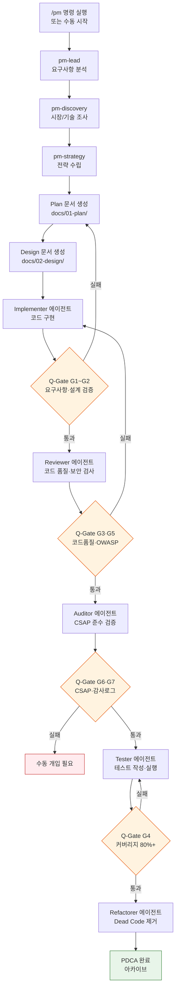
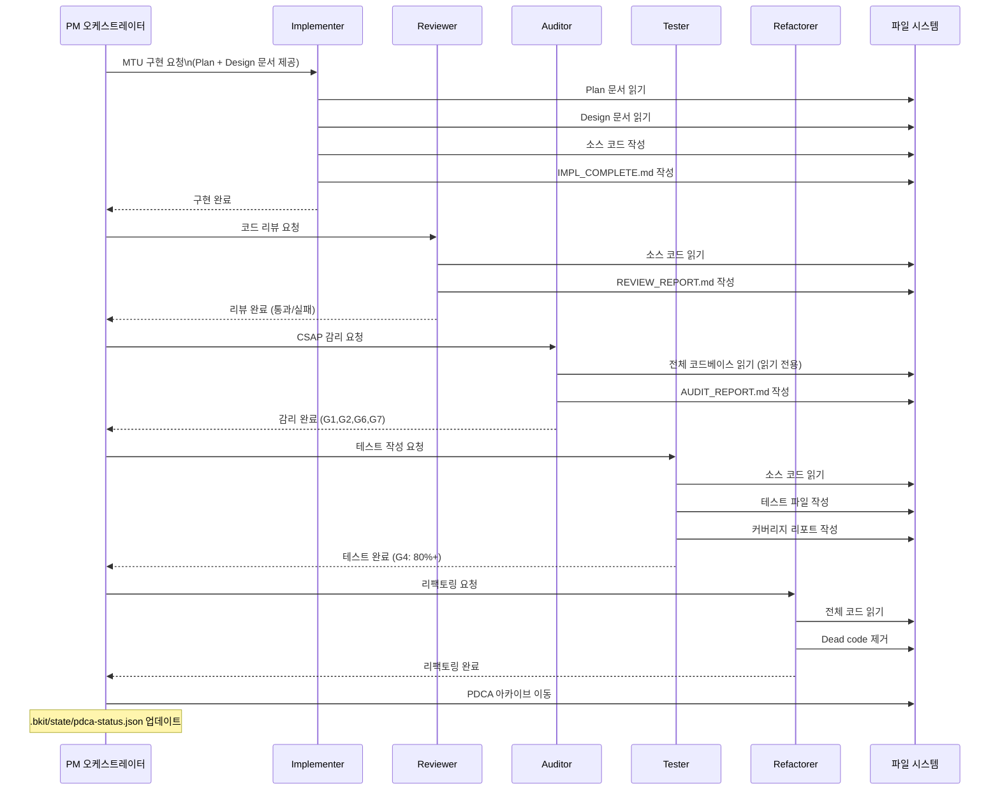
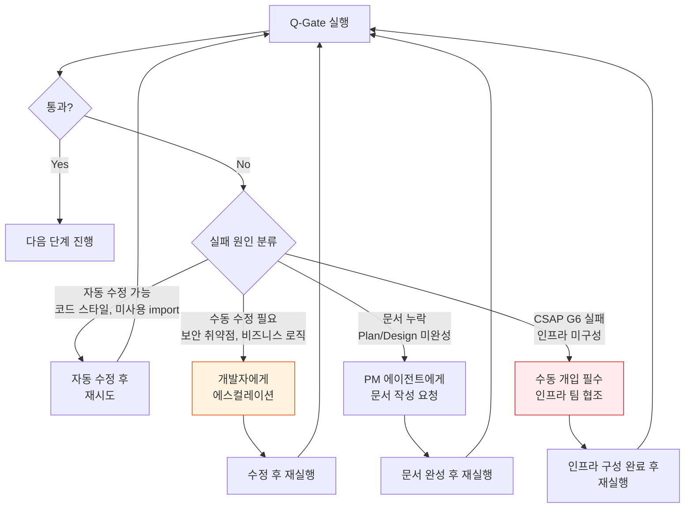
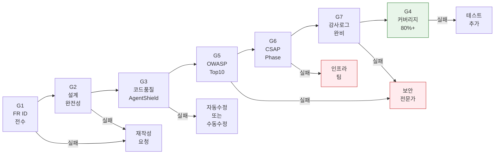
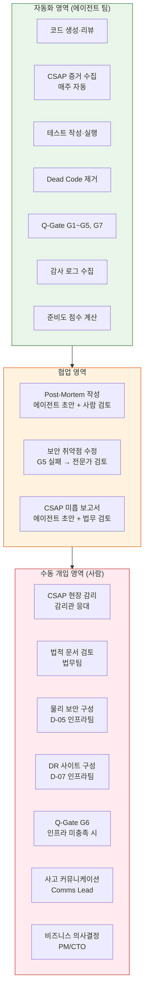

# PDCA 자동화 — Claude Code 에이전트 팀으로 PDCA 완전 자동화

> **문서 ID**: DOC-PDCA-05
> **버전**: 1.0.0 | **작성일**: 2026-04-12 | **작성자**: Implementer (Sonnet)
> **목적**: 수동으로 수행하던 PDCA 사이클을 5개 전문 에이전트로 완전 자동화하는 방법 설명
> **선행 학습**: [04-pdca-checklist.md](./04-pdca-checklist.md)

---

## 목차

1. [PDCA 자동화 개요](#1-pdca-자동화-개요)
2. [에이전트 팀 구성 이해](#2-에이전트-팀-구성-이해)
3. [/pm 스킬 완전 가이드](#3-pm-스킬-완전-가이드)
4. [MTU 완전 자율 실행 사이클](#4-mtu-완전-자율-실행-사이클)
5. [Q-Gate 자동화](#5-q-gate-자동화)
6. [bkit 상태 파일 이해](#6-bkit-상태-파일-이해)
7. [자동화 한계와 수동 개입 포인트](#7-자동화-한계와-수동-개입-포인트)

---

## 1. PDCA 자동화 개요

### 1.1 수동 PDCA vs 자동화 PDCA

PDCA(Plan-Do-Check-Act)는 공공기관 정보화 사업에서 반드시 거쳐야 하는 품질 관리 사이클입니다. 전통적인 수동 PDCA와 이 프로젝트의 자동화 PDCA를 비교하면 다음과 같습니다.

| 구분 | 수동 PDCA | 자동화 PDCA |
|-----|---------|-----------|
| Plan 문서 작성 | 인간이 직접 작성 (1~2일) | PM 에이전트 자동 생성 (30분) |
| Design 문서 작성 | 인간이 직접 작성 (1~3일) | Architect 에이전트 자동 생성 (1시간) |
| 구현 | 인간 개발자 (수일~수주) | Implementer 에이전트 (수시간) |
| 코드 리뷰 | 동료 리뷰 (1~2일 대기) | Reviewer 에이전트 자동 검사 (수분) |
| CSAP 감리 준비 | 수작업 체크리스트 (수일) | Auditor 에이전트 자동 검증 (수분) |
| 테스트 작성 | QA 엔지니어 (수일) | Tester 에이전트 자동 생성 (수시간) |
| Dead Code 정리 | 수작업 탐색 (수시간) | Refactorer 에이전트 자동 제거 (수분) |
| **전체 소요 시간** | **2~4주** | **1~2일** |

### 1.2 자동화 PDCA의 핵심 원칙

자동화가 가능한 이유는 세 가지 원칙 때문입니다.

첫째, **문서 기반 통신**: 에이전트 간 컨텍스트를 직접 공유하지 않고 파일(Plan 문서, Design 문서, 코드)로 전달합니다. 각 에이전트는 파일을 읽고 결과를 파일로 씁니다.

둘째, **Cascade 메서드**: 각 에이전트는 이전 에이전트의 결과물을 입력으로 받아 자신의 역할을 수행합니다. 순서를 건너뛸 수 없습니다.

셋째, **Q-Gate 7단계**: 각 단계마다 자동화된 품질 게이트가 있어 기준에 미달하면 다음 단계로 진행하지 않습니다.

### 1.3 자동화 PDCA 전체 흐름



---

## 2. 에이전트 팀 구성 이해

### 2.1 5개 에이전트 역할 상세

이 프로젝트는 ECC(Everything Claude Code) v1.9.0 기반의 5개 전문 에이전트로 구성됩니다. 각 에이전트는 `.claude/agents/` 폴더에 역할 정의 파일을 갖고 있습니다.

| 에이전트 | 파일 | 모델 | 주요 역할 | 읽는 파일 | 쓰는 파일 |
|---------|------|-----|---------|---------|---------|
| Implementer | `.claude/agents/implementer.md` | Sonnet | 설계 기반 코드 구현 | Design 문서, Plan 문서 | 소스 코드, 테스트 코드 |
| Reviewer | `.claude/agents/reviewer.md` | Sonnet | 코드 품질·보안 검사 (수정 불가) | 소스 코드 | 리뷰 보고서 |
| Auditor | `.claude/agents/auditor.md` | Opus | CSAP·N2SF·감리 준수 검증 (읽기 전용) | 전체 코드베이스 | 감리 보고서 |
| Tester | `.claude/agents/tester.md` | Sonnet | 테스트 케이스 작성·실행 | 소스 코드, Design 문서 | 테스트 파일, 커버리지 리포트 |
| Refactorer | `.claude/agents/refactorer.md` | Haiku | Dead code 제거·구조 개선 | 전체 코드베이스 | 정리된 코드 |

**왜 에이전트마다 다른 모델을 사용하는가?**

- **Sonnet**: 구현·리뷰·테스트는 복잡한 논리가 필요하지만 대용량 컨텍스트가 더 중요 → 비용 효율적
- **Opus**: 감리는 복합적인 CSAP/N2SF 규정 해석과 법적 판단이 필요 → 최고 성능 모델
- **Haiku**: 리팩토링은 단순 패턴 탐지와 제거 → 최저 비용 모델

### 2.2 Cascade 메서드: 에이전트 호출 순서

```
구현 (Implementer)
    ↓ 코드 완성 후
리뷰 (Reviewer) — Q-Gate G3, G5
    ↓ 리뷰 통과 후
감리 (Auditor) — Q-Gate G1, G2, G6, G7
    ↓ 감리 통과 후
테스트 (Tester) — Q-Gate G4
    ↓ 커버리지 80%+ 달성 후
리팩토링 (Refactorer)
    ↓ Dead code 0개 확인 후
PDCA 완료
```

**에이전트 건너뛰기는 절대 금지**입니다. Reviewer를 건너뛰고 Auditor로 바로 가거나, Tester 없이 Refactorer를 실행하면 Q-Gate가 실패합니다.

### 2.3 에이전트 간 파일 기반 통신

에이전트는 서로 직접 대화하지 않습니다. 오직 파일을 통해 결과를 전달합니다.

```
Implementer → 코드 파일 생성 → Reviewer가 읽어서 리뷰
Reviewer → REVIEW_COMPLETE.md 생성 → Auditor가 읽어서 감리
Auditor → AUDIT_REPORT.md 생성 → Tester가 읽어서 테스트 우선순위 결정
Tester → 테스트 파일 생성 → Refactorer가 읽어서 안전한 Dead code 판별
```

이렇게 하면 각 에이전트가 컨텍스트 한계에 걸리지 않고, 결과물이 파일 시스템에 영구 보존됩니다.

### 2.4 단일 MTU에 대한 5 에이전트 실행 흐름



---

## 3. /pm 스킬 완전 가이드

### 3.1 /pm 명령의 동작 원리

`/pm` 명령은 ECC 프레임워크의 PM 스킬을 활성화합니다. 사용자가 `/pm` 명령을 입력하면 다음 5단계가 순서대로 실행됩니다.

```
Step 1: pm-lead    → 요청 분석 및 오케스트레이션 계획 수립
Step 2: pm-discovery → 현재 코드베이스 탐색 및 컨텍스트 수집
Step 3: pm-strategy  → 구현 전략 및 우선순위 결정
Step 4: pm-execute   → 실제 에이전트 팀 호출 및 실행
Step 5: pm-report    → 결과 집계 및 리포트 생성
```

### 3.2 /pm 명령 옵션 상세

#### `--mtu` 옵션: 특정 MTU 실행

```bash
# MTU-N253 (CSAP 증거 수집 자동화)만 실행
/pm --mtu MTU-N253

# 복수 MTU 동시 실행 (병렬 처리)
/pm --mtu MTU-N251,MTU-N252,MTU-N253
```

MTU(최소 처리 단위, Minimum Treatment Unit)는 하나의 독립적인 기능 구현 단위입니다. 각 MTU는 Plan 문서와 Design 문서가 있어야 실행 가능합니다.

#### `--phase` 옵션: 특정 Phase 전체 실행

```bash
# Phase 2 전체 MTU 실행 (병렬)
/pm --phase 2

# 특정 Phase의 미완료 MTU만 실행
/pm --phase 2 --status pending
```

#### `--status` 옵션: 상태별 필터

```bash
# 실패한 MTU만 재시도
/pm --status failed

# 리뷰 대기 중인 MTU만 처리
/pm --status review-pending

# 가능한 상태값: pending, in-progress, review-pending, failed, completed, archived
```

#### `--dry-run` 옵션: 실행 계획만 확인

```bash
# 실제 실행 없이 어떤 작업이 수행될지 미리 확인
/pm --mtu MTU-N253 --dry-run

# 출력 예시:
# [DRY-RUN] 실행 예정 MTU: MTU-N253 (CSAP 증거 수집 자동화 v2)
# [DRY-RUN] Plan 문서: docs/01-plan/mtus/MTU-N253-csap-evidence-v2.plan.md ✓
# [DRY-RUN] Design 문서: docs/02-design/mtus/MTU-N253-csap-evidence-v2.design.md ✓
# [DRY-RUN] 예상 소요 시간: 약 45분
# [DRY-RUN] 에이전트 순서: Implementer → Reviewer → Auditor → Tester → Refactorer
```

### 3.3 PM 오케스트레이션 내부 동작

`pm-lead → pm-discovery → pm-strategy` 파이프라인은 다음과 같이 동작합니다.

**pm-lead 역할**:

```typescript
// PM 오케스트레이터 패턴 (개념 코드)
// CLAUDE.md §2 — 에이전트 분업 원칙 기반

async function pmLead(request: PMRequest): Promise<OrchestrationPlan> {
  // 1. 요청 분석
  const mtu = parseMTUFromRequest(request)

  // 2. 문서 존재 확인 (Plan + Design 필수)
  const planDoc = await readFile(`docs/01-plan/mtus/${mtu}.plan.md`)
  const designDoc = await readFile(`docs/02-design/mtus/${mtu}.design.md`)

  if (!planDoc || !designDoc) {
    throw new Error(`문서 누락: ${mtu}. Plan + Design 문서 작성 후 재시도`)
  }

  // 3. 오케스트레이션 계획 수립
  return {
    mtu,
    agents: ['implementer', 'reviewer', 'auditor', 'tester', 'refactorer'],
    parallelizable: false,  // Cascade 순서 준수
    estimatedMinutes: 60,
  }
}
```

**pm-discovery 역할**:

```typescript
// 현재 코드베이스 컨텍스트 수집
async function pmDiscovery(mtu: string): Promise<DiscoveryResult> {
  // 관련 파일 탐색 (Glob 사용)
  const relatedFiles = await glob(`platform/**/*${mtu.toLowerCase()}*`)

  // 의존성 분석
  const dependencies = await analyzeDependencies(relatedFiles)

  // 기존 테스트 파악
  const existingTests = await glob(`**/*.test.ts`)

  return { relatedFiles, dependencies, existingTests }
}
```

**pm-strategy 역할**:

```typescript
// 구현 전략 결정
async function pmStrategy(
  plan: OrchestrationPlan,
  discovery: DiscoveryResult
): Promise<ImplementationStrategy> {
  return {
    // Q-Gate 통과 순서
    qGateSequence: ['G1', 'G2', 'G3', 'G5', 'G6', 'G7', 'G4'],
    // 병렬 처리 가능한 테스트 그룹
    testGroups: groupTestsByDependency(discovery.relatedFiles),
    // CSAP 요건 사전 확인
    csapRequirements: extractCSAPFromDesign(plan),
  }
}
```

---

## 4. MTU 완전 자율 실행 사이클

MTU 하나가 처음 시작(`pending`)부터 완료(`archived`)까지 거치는 7단계를 상세히 설명합니다.

### STEP 1: PM 분석 (시장조사 + 요구사항)

**입력**: 사용자의 기능 요청 또는 비즈니스 요구사항
**출력**: MTU ID 부여, 요구사항 FR ID 매핑

PM 에이전트는 다음을 수행합니다.
- 유사한 기존 MTU 중복 여부 확인 (`.bkit/state/pdca-status.json` 조회)
- CSAP 통제항목 매핑 (이 기능이 어떤 D-0X 항목에 해당하는지)
- 우선순위 결정 (P0~P3)
- MTU ID 부여 (예: `MTU-N253`)

### STEP 2: Plan 문서 자동 생성

**출력**: `docs/01-plan/mtus/{MTU-ID}.plan.md`

Plan 문서는 행안부 정보시스템 감리기준(고시 제2023-1호) 형식을 따릅니다.

```markdown
# MTU-N253 — CSAP 증거 수집 자동화 v2

## Executive Summary (4-Perspective)
| 관점 | 내용 |
|-----|-----|
| 비즈니스 | CSAP 감리 준비 자동화로 운영 비용 80% 절감 |
| 기술 | CSAPEvidenceCollector + SHA-256 무결성 체인 |
| 리스크 | 증거 누락 → 감리 불통과 위험 |
| 성공 기준 | 79항목 전체 증거 자동 수집, 커버리지 100% |

## Context Anchor
- WHY: 수작업 증거 수집은 오류 가능성 높고 시간 소모 큼
- WHO: 보안 담당자, CSAP 감리 준비 팀
- RISK: 증거 파일 조작 가능성 → SHA-256 해시 체인으로 해결
- SUCCESS: 매주 월요일 자동 수집 + 무결성 검증 통과
- SCOPE: D-01~D-13 전 영역

## 기능 요구사항
| ID | 요구사항 |
|----|---------|
| FR-N253.1 | CSAP 79항목 증거 자동 수집 |
| FR-N253.2 | SHA-256 해시 기반 무결성 검증 |
| FR-N253.3 | 증거 인덱스 Markdown 자동 생성 |
| FR-N253.4 | CI/CD 파이프라인 주간 자동 실행 |
```

### STEP 3: Design 문서 자동 생성

**출력**: `docs/02-design/mtus/{MTU-ID}.design.md`

Design 문서는 Plan 문서를 입력으로 받아 기술적 구현 상세를 기술합니다.

```markdown
## 3. 아키텍처 설계

### CSAPEvidenceCollector 클래스
- addEvidence(): 증거 추가 + SHA-256 자동 계산
- collect(): 전체 수집 실행 + 커버리지 계산
- verifyIntegrity(): 증거 무결성 검증
- generateIndex(): Markdown 인덱스 생성

### 데이터 흐름
서비스 → CSAPEvidenceCollector.addEvidence()
       → SHA-256 계산
       → EvidenceItem 저장
       → collect() 호출
       → EvidenceCollectionResult 반환
       → Markdown 인덱스 생성
```

### STEP 4: 구현 (병렬 에이전트 패턴)

**출력**: 소스 코드 + 테스트 코드 + `IMPL_COMPLETE.md`

Implementer 에이전트는 Design 문서의 각 섹션을 코드로 변환합니다.

```typescript
// 구현 시 필수 주석 패턴
// Design Ref: §{섹션번호} — {결정 근거}
// Plan SC: {성공기준 ID}

// 실제 예시 (csap-evidence-collector.ts):
/**
 * 증거 항목 추가
 * Design Ref: §FR-N253.1 — CSAP 증거 수집
 */
addEvidence(item: Omit<EvidenceItem, 'id' | 'collectedAt' | 'sha256'>): EvidenceItem {
  const sha256 = this.calculateHash(item.source)
  const evidence: EvidenceItem = {
    ...item,
    id: `EVD-${Date.now()}-${Math.random().toString(36).slice(2, 8)}`,
    collectedAt: new Date().toISOString(),
    sha256,
  }
  this.evidenceItems.push(evidence)
  return evidence
}
```

여러 서비스의 독립적인 파일은 병렬로 구현할 수 있습니다. 예를 들어 `compliance-service`의 핸들러와 `security-monitor-service`의 스캐너는 동시에 구현됩니다.

### STEP 5: Q-Gate 7단계 자동 검증

Q-Gate는 자동으로 순서대로 실행됩니다. 각 게이트 통과 후 다음 게이트로 진행합니다.

```bash
# Q-Gate 자동 실행 흐름
npm run qgate:g1  # 요구사항 FR ID 전수 추적
npm run qgate:g2  # 설계 완전성 확인
npm run qgate:g3  # 코드 품질 + AgentShield 102규칙
npm run qgate:g5  # OWASP Top 10
npm run qgate:g6  # CSAP 해당 Phase 100%
npm run qgate:g7  # 감사 추적 완비
npm run qgate:g4  # 테스트 커버리지 80%+
```

### STEP 6: 리포트 자동 생성

**출력**: `IMPL_COMPLETE.md` (Implementer), `REVIEW_REPORT.md` (Reviewer), `AUDIT_REPORT.md` (Auditor)

각 에이전트는 자신의 작업 완료 후 리포트 파일을 생성합니다. 이 파일은 다음 에이전트가 참고합니다.

`IMPL_COMPLETE.md` 예시:

```markdown
# 구현 완료 보고서 — MTU-N253

## 구현 범위
- platform/services/compliance-service/src/lib/csap-evidence-collector.ts
- platform/services/compliance-service/src/handlers/compliance.handler.ts
- .gitea/workflows/csap-evidence.yml

## Q-Gate 현황
- G1 FR ID 추적: 통과 (FR-N253.1~4 전체)
- G2 설계 완전성: 통과
- G3 코드 품질: 통과 (eslint 오류 0개)
- G5 OWASP: 통과

## 변경 파일 목록
| 파일 | 변경 유형 | 변경 이유 |
|-----|---------|---------|
| csap-evidence-collector.ts | 신규 생성 | FR-N253.1~3 구현 |
| csap-evidence.yml | 신규 생성 | FR-N253.4 CI/CD |
```

### STEP 7: Archive 자동 이동

PDCA 사이클이 완료되면 `.bkit/state/pdca-status.json`의 해당 MTU 상태가 `archived`로 업데이트됩니다.

```json
// .bkit/state/pdca-status.json 업데이트 예시
{
  "MTU-N253": {
    "status": "archived",
    "completedAt": "2026-04-12T15:30:00Z",
    "qGateResults": {
      "G1": "pass", "G2": "pass", "G3": "pass",
      "G4": "pass", "G5": "pass", "G6": "pass", "G7": "pass"
    },
    "implementedFiles": [
      "platform/services/compliance-service/src/lib/csap-evidence-collector.ts",
      ".gitea/workflows/csap-evidence.yml"
    ]
  }
}
```

### 4.1 pdca-status.json 구조 해설

`.bkit/state/pdca-status.json`은 프로젝트의 모든 MTU 진행 상태를 추적합니다.

```json
{
  "version": "3.0",
  "lastUpdated": "2026-04-12T13:13:44.334Z",
  "activeFeatures": [
    // 현재 활성화된 기능 목록 (147개 이상)
    "public-saas-framework",
    "compliance-service",
    "security-monitor-service",
    "slo-escalation",
    // ...
  ],
  "MTU-N253": {
    "status": "completed",   // pending|in-progress|review-pending|failed|completed|archived
    "startedAt": "2026-04-10T09:00:00Z",
    "completedAt": "2026-04-10T14:30:00Z",
    "phase": "Phase-2",
    "priority": "P1",
    "assignedAgent": "implementer",
    "qGateResults": { ... },
    "csapMapping": ["D-06", "D-12"],
    "implementedFiles": [ ... ]
  }
}
```

---

## 5. Q-Gate 자동화

### 5.1 G1~G7 각 게이트 자동 실행 방식

**G1: 요구사항 FR ID 전수 (Auditor)**

Plan 문서에 정의된 모든 FR ID가 소스 코드 주석에 존재하는지 확인합니다.

```bash
# G1 자동 검사 로직
grep -r "Plan SC:" platform/services/compliance-service/src/ | \
  grep -E "FR-N253\.[1-4]"
# 결과: FR-N253.1, FR-N253.2, FR-N253.3, FR-N253.4 모두 발견되어야 통과
```

**G2: 설계 완전성 (Auditor)**

Design 문서의 모든 컴포넌트가 구현되었는지 확인합니다.

```bash
# Design 문서에 명시된 클래스/함수 존재 확인
grep -r "class CSAPEvidenceCollector" platform/
grep -r "addEvidence\|collect\|verifyIntegrity\|generateIndex" platform/
```

**G3: 코드 품질 + AgentShield 102규칙 (Reviewer)**

```bash
# ESLint + AgentShield 통합 실행
npm run lint

# AgentShield 102개 정적 분석 규칙 (Semgrep 기반)
npx semgrep --config=.semgrep/ platform/services/
```

AgentShield 102개 규칙은 다음 카테고리를 포함합니다.
- SQL 주입 패턴 (직접 문자열 결합)
- 하드코딩된 시크릿 (API 키, 비밀번호)
- 에러 메시지 민감 정보 노출
- 인증 없는 엔드포인트
- 매개변수화되지 않은 쿼리

**G4: 테스트 커버리지 80%+ (Tester)**

```bash
# Jest 커버리지 실행
npm test -- --coverage --coverageThreshold='{"global":{"lines":80}}'

# 커버리지 미달 시 자동 실패
# Coverage: 79.9% < 80% → G4 실패
```

**G5: OWASP Top 10 (Reviewer)**

```bash
# OWASP ZAP 자동 스캔 (컨테이너 기반)
docker run -v $(pwd):/zap/wrk owasp/zap2docker-stable \
  zap-baseline.py -t http://localhost:3000 -r /zap/wrk/owasp-report.html
```

OWASP Top 10 항목별 자동 검사:
- A01: 접근 통제 취약점 → RBAC 검사 누락 탐지
- A02: 암호화 실패 → HTTP 직접 통신, 약한 해시 탐지
- A03: 주입 → SQL/LDAP/OS 주입 패턴 탐지
- A07: 인증 실패 → JWT 검증 누락, 세션 관리 취약점

**G6: CSAP 해당 Phase 100% (Auditor)**

```bash
# 컴플라이언스 서비스 API로 자동 확인
curl http://compliance-service/compliance/csap | \
  jq '.domains[] | select(.rate < 100) | {id, name, rate}'
# 미완료 항목이 있으면 G6 실패
```

**G7: 감사 추적 audit.jsonl 완비 (Auditor)**

```bash
# 감사 로그에 해당 MTU 관련 이벤트 존재 확인
grep "MTU-N253\|csap-evidence" .claude/audit.jsonl | \
  jq 'select(.action != null) | {timestamp, action}'
```

### 5.2 게이트 실패 시 처리



**자동 재시도 가능한 실패**:
- G3: ESLint 자동 수정 가능 오류 (세미콜론, 들여쓰기 등)
- G4: 테스트 커버리지 미달 → Tester 에이전트 추가 테스트 작성
- G1: FR ID 주석 누락 → Implementer 에이전트 주석 추가

**인간 에스컬레이션 필요한 실패**:
- G5: OWASP 보안 취약점 발견 → 보안 전문가 검토 필요
- G6: CSAP 물리 보안 항목 미충족 → 인프라 팀 현장 작업 필요
- G7: 감사 로그 누락 → 의도적 누락인지 확인 필요

### 5.3 Q-Gate 7단계 자동화 흐름



---

## 6. bkit 상태 파일 이해

`.bkit/state/` 폴더에는 프로젝트의 모든 상태 정보가 JSON 파일로 저장됩니다.

### 6.1 memory.json — 현재 세션 컨텍스트

```json
// .bkit/state/memory.json
{
  "sessionCount": 147,          // 전체 세션 수 (누적)
  "lastSession": {
    "startedAt": "2026-04-12T13:10:08.220Z",
    "platform": "claude",
    "level": "Enterprise"
  },
  "currentFeature": "session-2026-04-11-final-cleanup",
  "currentPhase": "completed",  // 현재 Phase 상태
  "qualityEnhancement": {
    "date": "2026-04-07",
    "mtusEnhanced": ["MTU-P02", "MTU-P04", "MTU-P11"],
    "previousMatchRates": {
      "MTU-P02": "88.9%",
      "MTU-P04": "81.8%"
    },
    "enhancedMatchRates": {
      "MTU-P02": "90%",
      "MTU-P04": "100%"
    }
  }
}
```

**이 파일로 알 수 있는 것**:
- 현재 작업 중인 기능과 Phase
- 품질 향상 이력 (어떤 MTU가 어느 정도 개선되었는지)
- 세션 연속성 (이전 세션에서 어디까지 진행했는지)

### 6.2 pdca-status.json — MTU별 완료 상태

```json
// .bkit/state/pdca-status.json
{
  "version": "3.0",
  "lastUpdated": "2026-04-12T13:13:44.334Z",
  "activeFeatures": [
    // 147개 이상의 활성 기능 목록
    "public-saas-framework", "compliance-service",
    "security-monitor-service", "slo-escalation",
    // ...
  ]
}
```

**각 MTU 상태 구조**:

```json
{
  "MTU-N253": {
    "status": "archived",
    "phase": "Phase-N-Advanced",
    "priority": "P1",
    "csapMapping": ["D-06", "D-12"],
    "startedAt": "2026-04-10T09:00:00Z",
    "completedAt": "2026-04-10T14:30:00Z",
    "qGateResults": {
      "G1": "pass", "G2": "pass", "G3": "pass",
      "G4": "pass", "G5": "pass", "G6": "pass", "G7": "pass"
    },
    "implementedFiles": [
      "platform/services/compliance-service/src/lib/csap-evidence-collector.ts",
      ".gitea/workflows/csap-evidence.yml"
    ],
    "testCoverage": "92.3%",
    "deadCodeRemoved": 0
  }
}
```

### 6.3 session-history.json — 세션 이력

```json
// .bkit/state/session-history.json (일부)
{
  "sessions": [
    {
      "sessionId": "2026-04-12-001",
      "startedAt": "2026-04-12T09:00:00Z",
      "endedAt": "2026-04-12T13:10:08Z",
      "mtusCompleted": ["MTU-N251", "MTU-N252"],
      "agentsUsed": {
        "implementer": 4,
        "reviewer": 4,
        "auditor": 2,
        "tester": 4,
        "refactorer": 2
      },
      "tokensUsed": {
        "input": 450000,
        "output": 85000
      }
    }
  ]
}
```

### 6.4 상태 파일 손상 시 복구 방법

상태 파일이 손상되면 (JSON 파싱 오류, 데이터 불일치) 다음 순서로 복구합니다.

**진단**:

```bash
# JSON 유효성 확인
cat /data/ai-saas/.bkit/state/pdca-status.json | python3 -m json.tool
# 출력이 없으면 손상됨

# Git 이력에서 마지막 정상 버전 확인
git log --oneline .bkit/state/pdca-status.json | head -5
```

**복구 (Git 기반)**:

```bash
# 마지막 정상 커밋으로 복구
git show HEAD~1:.bkit/state/pdca-status.json > .bkit/state/pdca-status.json.backup
mv .bkit/state/pdca-status.json.backup .bkit/state/pdca-status.json

# 복구 후 검증
cat .bkit/state/pdca-status.json | python3 -m json.tool | head -20
```

**재구성 (Git 이력이 없는 경우)**:

```bash
# 최소 유효 구조로 초기화
cat > .bkit/state/pdca-status.json << 'EOF'
{
  "version": "3.0",
  "lastUpdated": "2026-04-12T00:00:00Z",
  "activeFeatures": [],
  "_note": "손상으로 인한 재초기화. git log로 실제 완료 MTU 확인 필요"
}
EOF

# MTU 완료 상태는 git commit 메시지에서 재구성
git log --oneline | grep "feat\|fix" | head -30
```

---

## 7. 자동화 한계와 수동 개입 포인트

### 7.1 자동화로 불가능한 것

**CSAP 현장 감리**:
자동화는 증거를 수집하고 준비도를 계산할 수 있지만, 감리관이 현장에서 직접 확인하는 물리적 보안(서버실 잠금, CCTV 등)은 자동화할 수 없습니다. D-05 물리적 보안 항목이 이에 해당합니다.

**법적 검토**:
정보보호 정책 문서(D-01), 개인정보처리방침, 이용약관은 법무팀의 검토가 필수입니다. 에이전트가 초안을 작성할 수 있지만 법적 효력은 사람이 확인해야 합니다.

**대외 이해관계자 커뮤니케이션**:
사고 발생 시 사용자에게 공지하거나 기관장에게 보고하는 커뮤니케이션은 사람이 해야 합니다.

**비즈니스 의사결정**:
어떤 기능을 먼저 개발할지, 어떤 서비스를 외부에 제공할지는 사람의 판단이 필요합니다.

### 7.2 Q-Gate G6 실패 시 수동 개입 필요 상황

G6(CSAP 해당 Phase 100%)가 실패하는 경우는 두 가지입니다.

**자동 해결 가능한 G6 실패**:
- D-06 감사 로그 미기록 → `logComplianceEvent()` 호출 추가 후 재시도
- D-12 Zod 검증 누락 → 스키마 추가 후 재시도
- D-09 하드코딩 시크릿 → 환경 변수로 변경 후 재시도

**수동 개입 필수 G6 실패**:
- D-05 물리 보안 미충족 → 인프라 팀이 현장 작업 후 재감리
- D-07 DR 사이트 미구성 → 인프라 팀이 보조 클러스터 구성 후 재감리
- D-10 방화벽/IDS 미구성 → 네트워크 팀 협조 필요

### 7.3 자동화 경계 다이어그램



### 7.4 자동화 성숙도 로드맵

현재 자동화 수준은 전체 PDCA 작업의 약 75%입니다. 나머지 25%는 수동 개입이 필요합니다.

| 단계 | 자동화율 | 수동 개입 필요 영역 |
|-----|---------|-----------------|
| 현재 (2026 Q2) | 75% | 물리 보안, DR, 법적 검토, 현장 감리 |
| 목표 (2026 Q4) | 85% | 현장 감리, 법적 검토 (물리 보안 자동 모니터링 추가) |
| 장기 목표 (2027) | 90% | 현장 감리만 수동 (법적 검토 AI 보조 도입) |

---

## 변경 이력

| 버전 | 일자 | 내용 | 작성자 |
|-----|------|------|-------|
| 1.0.0 | 2026-04-12 | 최초 작성 — PDCA 자동화 완전 가이드 | Implementer (Sonnet) |

---

*본 문서는 `.bkit/state/pdca-status.json`, `.bkit/state/memory.json`, `CLAUDE.md`, `.claude/agents/` 실제 파일을 기반으로 작성되었습니다.*
