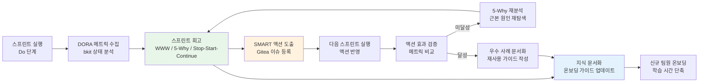

# PDCA 회고 및 학습 — 스프린트 회고 방법론, 팀 학습 루프, 개선 액션 추적

> **대상 독자**: 개발팀 전체 (팀 리더, 시니어 개발자, 주니어 개발자)
> **최종 수정**: 2026-04-13
> **관련 문서**: `01-what-is-pdca.md`, `02-writing-plan.md`, `04-pdca-checklist.md`

---

## 목차

1. [PDCA 회고란? 초급자를 위한 설명](#1-pdca-회고란-초급자를-위한-설명)
2. [회고 방법론 3가지](#2-회고-방법론-3가지)
3. [스프린트 회고 진행 방법](#3-스프린트-회고-진행-방법)
4. [DORA 메트릭 기반 팀 성과 회고](#4-dora-메트릭-기반-팀-성과-회고)
5. [bkit 상태 파일 활용](#5-bkit-상태-파일-활용)
6. [개선 액션 추적](#6-개선-액션-추적)
7. [팀 학습 루프 구축](#7-팀-학습-루프-구축)
8. [공공기관 SaaS 회고 특수 요건](#8-공공기관-saas-회고-특수-요건)
9. [실습: 현재 스프린트 WWW 회고 진행](#9-실습-현재-스프린트-www-회고-진행)

---

## 1. PDCA 회고란? 초급자를 위한 설명

### 회고가 무엇인지 모르는 분들을 위해

회고(Retrospective)는 팀이 주기적으로 모여서 "우리가 어떻게 일하고 있는가"를 솔직하게 돌아보는 시간입니다.

코드 리뷰가 "무엇을 만들었는가"를 검토하는 것이라면,
회고는 "어떻게 만들었는가, 다음엔 더 잘 만들 수 있는가"를 검토합니다.

PDCA(Plan-Do-Check-Act) 사이클에서 회고는 **Check(확인) → Act(개선)** 단계에 해당합니다:

```
Plan (계획)    → 이번 스프린트 목표 설정
Do (실행)      → 코드 작성, 기능 배포
Check (확인)   → 회고: 무엇이 잘 됐나, 무엇이 문제였나
Act (개선)     → 다음 스프린트에서 개선 액션 적용
↓
다음 Plan으로 이어짐 (학습된 상태로)
```

### 왜 회고가 PDCA의 핵심인가

많은 팀이 Plan → Do → Check → Act 사이클에서 **Check와 Act를 생략**합니다.
이유는 간단합니다. 다음 스프린트가 이미 시작되었고, 회고할 시간이 없다고 느끼기 때문입니다.

그러나 회고를 생략하면 팀은 같은 실수를 반복합니다.

**실제 공공기관 SaaS 팀의 회고 없는 패턴**:

```
스프린트 1: 배포 시 환경 변수 누락으로 장애 발생 → 원인 파악 후 수동 수정
스프린트 2: 다른 서비스 배포 시 또 환경 변수 누락 → 또 수동 수정
스프린트 3: 세 번째 서비스에서 동일 문제 반복
...
스프린트 6: 결국 환경 변수 누락이 CSAP 감리에서 지적됨 (D-09 위반)

회고가 있었다면:
스프린트 1 회고: "환경 변수 누락이 반복됨" → 액션: CI/CD 파이프라인에 환경 변수 검증 추가
스프린트 2~6: 해당 장애 재발 없음
```

### 학습하지 않는 팀의 문제

팀이 회고 없이 일하면 다음 세 가지 문제가 반복됩니다:

**1. 지식 사일로 (Knowledge Silo)**: 특정 개발자만 알고 있는 암묵지가 문서화되지 않음. 그 개발자가 떠나면 지식도 사라짐.

**2. 개선 없는 반복**: 동일한 배포 프로세스, 동일한 장애, 동일한 CSAP 지적을 매 분기 반복.

**3. 팀 사기 저하**: 같은 문제가 반복될 때 팀원들은 "이 팀은 발전이 없다"는 무기력감을 느낌.

---

## 2. 회고 방법론 3가지

### 방법론 1: WWW (Went well / Wished / What next)

WWW는 가장 간단하고 시작하기 좋은 회고 방법입니다.
모든 팀원이 세 가지 영역에 포스트잇을 붙입니다.

```
Went Well (잘 된 것)
"이번 스프린트에서 잘 된 것은 무엇인가?"
→ 팀의 강점을 확인하고 유지할 것을 식별

Wished (아쉬운 것)
"이번 스프린트에서 아쉬웠던 것은 무엇인가?"
→ 문제를 비난 없이 식별

What Next (다음에 할 것)
"다음 스프린트에서 개선하기 위해 무엇을 할 것인가?"
→ 구체적인 액션 아이템으로 전환
```

**WWW 회고 진행 예시 (공공기관 SaaS 팀)**

```markdown
## 2026-04-13 스프린트 10 WWW 회고

### Went Well (잘 된 것)
- CSAP D-06 감사 로그 자동화 완료 (0건 수동 작업)
- AI 서비스 하이브리드 검색 배포 후 검색 품질 향상
- 코드 리뷰 평균 응답 시간이 24시간 → 8시간으로 단축

### Wished (아쉬운 것)
- 스테이징 환경 불안정으로 E2E 테스트 3회 재실행 필요
- CSAP 문서 업데이트가 코드 변경보다 항상 늦게 반영
- 신규 패키지 의존성 추가 시 보안 스캔 절차 불명확

### What Next (다음에 할 것)
- [ ] 스테이징 환경 안정화: k8s PodDisruptionBudget 검토 (담당: 인프라팀)
- [ ] CSAP 문서 자동 동기화 스크립트 작성 (담당: 문서팀)
- [ ] 의존성 추가 프로세스 체크리스트 작성 (담당: 보안팀)
```

### 방법론 2: 5-Why 심층 분석

5-Why는 문제의 근본 원인을 찾기 위해 "왜?"를 5번 반복하는 기법입니다.
표면적인 증상이 아닌 근본 원인을 해결하기 위해 사용합니다.

**적용 시점**: 같은 문제가 2회 이상 반복될 때, 또는 심각한 장애/CSAP 지적이 발생했을 때.

```markdown
## 5-Why 분석 예시: CSAP 감리에서 반복 지적

문제: 이번 CSAP 중간 심사에서 D-12 (시스템 개발 보안) 3건 지적

Why 1: 왜 D-12 항목에서 지적을 받았는가?
→ 신규 API 엔드포인트에 입력 검증이 누락되었다

Why 2: 왜 입력 검증이 누락되었는가?
→ 빠른 기능 개발로 보안 체크리스트를 건너뛰었다

Why 3: 왜 보안 체크리스트를 건너뛰었는가?
→ 체크리스트가 별도 문서에 있어 개발 흐름에서 벗어나 있다

Why 4: 왜 체크리스트가 개발 흐름과 분리되어 있는가?
→ CI/CD 파이프라인에 보안 게이트가 없다

Why 5: 왜 CI/CD 파이프라인에 보안 게이트가 없는가?
→ 초기 파이프라인 설계 시 보안 자동화를 고려하지 않았다

근본 원인: CI/CD 파이프라인 설계 단계에서 보안 자동화 부재

해결 액션: CI/CD에 OWASP ZAP + 입력 검증 정적 분석 추가
          (Q-GATE G5 구현 — .gitea/workflows/에 워크플로우 추가)
```

### 방법론 3: Stop/Start/Continue

Stop/Start/Continue는 팀 행동을 변화시키는 데 집중하는 방법입니다.
WWW보다 더 실행 지향적입니다.

```
Stop (중단할 것)
"팀에 해가 되는, 지금 당장 멈춰야 할 것은?"
→ 기술 부채를 키우는 관행, 팀 사기를 낮추는 행동

Start (시작할 것)
"아직 하지 않고 있지만, 시작해야 할 것은?"
→ 새로운 도구, 프로세스, 습관

Continue (유지할 것)
"팀에 도움이 되므로 계속해야 할 것은?"
→ 팀의 강점 강화
```

**예시**

```markdown
## Stop/Start/Continue 예시

### Stop (중단)
- PR 리뷰 없이 직접 main에 push (CSAP D-12 위반)
- 테스트 없이 "나중에 테스트 짤게요" 하며 배포
- 회의에서 결정된 사항을 문서화하지 않고 구두로만 전달

### Start (시작)
- 매일 아침 15분 데일리 스탠드업 (장애 조기 발견)
- 신규 기능마다 Plan 문서 먼저 작성 (구현 착수 전)
- 분기별 기술 부채 스프린트 1회 진행

### Continue (유지)
- 코드 리뷰 24시간 내 응답 원칙
- CSAP 체크리스트 배포 전 확인
- 주간 팀 지식 공유 세션 (매주 금요일 30분)
```

---

## 3. 스프린트 회고 진행 방법

### 회고 준비 — 데이터 수집 (회고 전날)

좋은 회고는 데이터 기반입니다. 감정이나 기억에만 의존하지 마십시오.

```bash
# 스프린트 회고 데이터 수집 스크립트
# scripts/gather-retrospective-data.sh

# 1. 스프린트 커밋 수
git log --oneline --since="2 weeks ago" | wc -l

# 2. PR 통계
# Gitea API를 통해 머지된 PR, 평균 리뷰 시간 조회
curl -s "http://gitea.local/api/v1/repos/ai-saas/pulls?state=closed&limit=50" \
  | jq '[.[] | select(.merged_at != null)] | length'

# 3. 테스트 커버리지 추이
# CI/CD 파이프라인 결과에서 추출
cat .coverage/coverage-summary.json | jq '.total.lines.pct'

# 4. 장애/인시던트 수
# 감사 로그에서 ERROR 레벨 이벤트 수
grep -c '"level":"error"' .claude/audit.jsonl

# 5. DORA 메트릭 (다음 섹션에서 상세 설명)
# packages/dora-exporter에서 조회
```

**수집해야 할 데이터 목록**

| 데이터 항목 | 출처 | 의미 |
|---------|------|------|
| 완료된 스토리 포인트 | Gitea 이슈 | 팀 속도 |
| PR 평균 리뷰 시간 | Gitea API | 협업 효율 |
| 테스트 커버리지 | CI/CD 리포트 | 코드 품질 |
| 배포 횟수 | Gitea 워크플로우 | 배포 빈도 |
| 장애 발생 횟수 | 감사 로그, 인시던트 관리 | 안정성 |
| CSAP 체크리스트 통과율 | 감사 리포트 | 규정 준수 |

### 회고 진행 — 촉진자(Facilitator) 역할

촉진자는 회고를 진행하는 역할입니다. 팀 리더가 촉진자를 겸하면 솔직한 의견이 나오기 어렵습니다.
**돌아가며 촉진자를 맡는 것을 권장합니다**.

**회고 진행 타임라인 (60분 기준)**

```
00~05분: 아이스브레이킹 (감정 체크)
   "지금 기분을 날씨로 표현하면?" 또는 "오늘 에너지 레벨은 1~10점 중?"
   → 팀원의 현재 상태 파악, 심리적 안전감 형성

05~15분: 데이터 리뷰 (객관적 사실 공유)
   수집한 메트릭 데이터를 팀 전체가 동일하게 봄
   → "이번 스프린트 커버리지는 72%였습니다. 지난 스프린트 75%에서 하락."

15~35분: 의견 수집 (WWW 또는 선택한 방법론)
   각자 3분 조용히 작성 → 발표 → 그룹화
   → 비난 없는 분위기 유지 (Blameless Retrospective)

35~50분: 우선순위 투표 및 액션 아이템 도출
   가장 많은 표를 받은 항목 3개를 다음 스프린트 액션으로 선정
   각 액션에 담당자, 기한, 완료 기준 명시

50~55분: 액션 아이템 확인 및 합의
   "이 액션을 다음 스프린트까지 실행할 수 있겠습니까?"
   담당자 명시적 동의 받기

55~60분: 회고 회고 (Meta Retrospective)
   "오늘 회고 자체는 어땠습니까? 개선할 것이 있습니까?"
```

### 촉진자 주의사항

```
✓ 모든 팀원이 발언할 기회를 가지도록 진행
✓ 특정인의 발언이 너무 길면 정중히 시간 제한 안내
✓ 문제를 사람이 아닌 시스템/프로세스 탓으로 유도
  → "그 사람이 잘못해서"가 아니라 "그 프로세스가 부족해서"
✓ 감정적 발언은 수용하되, 공격적 발언은 중재
✓ 부정적 측면뿐 아니라 긍정적 측면도 동등하게 다룸

✗ 촉진자가 자신의 의견을 먼저 말하지 말 것
✗ 특정 결론으로 유도하지 말 것
✗ 시간을 초과하지 말 것 (에너지 고갈)
```

### 회고 후속 — 액션 추적

회고에서 도출된 액션은 반드시 다음 스프린트에 반영되어야 합니다.
회고 액션이 실행되지 않으면 팀원들이 회고 자체를 무의미하게 느낍니다.

```markdown
## 회고 액션 추적 템플릿

### 2026-04-13 스프린트 10 회고 액션

| 액션 | 담당자 | 기한 | 상태 | 완료 기준 |
|------|--------|------|------|---------|
| 스테이징 PodDisruptionBudget 설정 | @infra-kim | 04-20 | 진행 중 | 스테이징 E2E 테스트 재실행 0회 |
| CSAP 문서 자동화 스크립트 | @docs-park | 04-27 | 미시작 | PR 머지 시 CSAP 문서 자동 갱신 |
| 의존성 추가 체크리스트 | @security-lee | 04-20 | 완료 | .claude/rules/ 에 체크리스트 추가 |

### 이전 스프린트 액션 추적

| 이전 액션 | 완료 여부 | 미완료 이유 |
|---------|---------|-----------|
| CI/CD에 보안 스캔 추가 | 완료 | - |
| 환경 변수 검증 자동화 | 부분 완료 | 다음 스프린트로 이관 |
```

---

## 4. DORA 메트릭 기반 팀 성과 회고

DORA(DevOps Research and Assessment) 4대 메트릭은 소프트웨어 팀의 성과를 객관적으로 측정하는 업계 표준입니다.

### DORA 4대 메트릭 설명

```
1. 배포 빈도 (Deployment Frequency)
   "얼마나 자주 배포하는가?"
   Elite: 하루 여러 번
   High:  하루 1회 ~ 주 1회
   Medium: 주 1회 ~ 월 1회
   Low:   월 1회 이하

2. 변경 리드 타임 (Lead Time for Changes)
   "코드 커밋부터 프로덕션 배포까지 걸리는 시간"
   Elite: 1시간 미만
   High:  1일 미만
   Medium: 1주일 ~ 1달
   Low:   1달 이상

3. 변경 실패율 (Change Failure Rate)
   "배포 중 장애/롤백이 발생하는 비율"
   Elite: 0~15%
   High:  16~30%
   Medium/Low: 46~60%

4. 평균 복구 시간 (Mean Time to Restore — MTTR)
   "장애 발생 후 복구까지 걸리는 시간"
   Elite: 1시간 미만
   High:  1일 미만
   Medium: 1일 ~ 1주일
   Low:   1주일 이상
```

### packages/dora-exporter 활용

`/data/ai-saas/packages/dora-exporter/src/index.ts`는 이미 DORA 메트릭을 수집하고 내보냅니다.

```typescript
// packages/dora-exporter/src/index.ts 기반
// 회고 데이터 조회 예시

import { DoraExporter } from '@ai-saas/dora-exporter';

const dora = new DoraExporter({
  gitea: { url: 'http://gitea.local', token: process.env.GITEA_TOKEN },
  lookbackDays: 14, // 최근 2주 (스프린트 기간)
});

const metrics = await dora.calculateMetrics();

console.log('=== DORA 메트릭 (스프린트 10) ===');
console.log(`배포 빈도: ${metrics.deploymentFrequency.perDay.toFixed(1)}회/일`);
console.log(`리드 타임: ${metrics.leadTimeForChanges.hours.toFixed(1)}시간`);
console.log(`변경 실패율: ${(metrics.changeFailureRate * 100).toFixed(1)}%`);
console.log(`MTTR: ${metrics.meanTimeToRestore.hours.toFixed(1)}시간`);
console.log(`성과 등급: ${metrics.performanceTier}`); // 'elite' | 'high' | 'medium' | 'low'
```

### DORA 메트릭 회고 대화 가이드

회고에서 DORA 메트릭을 활용하는 방법입니다.

```
배포 빈도 저하 시 대화:
"이번 스프린트 배포 빈도가 0.3회/일로 지난 스프린트 0.7회/일에서 크게 줄었습니다.
 무엇이 배포를 막았는지 이야기해봅시다."
→ 가능한 원인: 긴 PR 리뷰, 테스트 실패, 환경 문제

리드 타임 증가 시 대화:
"리드 타임이 평균 72시간으로 목표 24시간을 크게 초과했습니다.
 어느 단계에서 시간이 가장 많이 소요되었나요?"
→ 가능한 원인: 코드 리뷰 병목, CI/CD 빌드 시간, 스테이징 승인 대기

변경 실패율 상승 시 대화:
"이번 스프린트 변경 실패율이 25%로, 배포 4건 중 1건이 롤백되었습니다.
 어떤 패턴이 있었나요? 테스트가 충분하지 않았나요?"
→ 가능한 원인: 테스트 커버리지 부족, 환경 차이, 의존성 문제
```

---

## 5. bkit 상태 파일 활용

bkit(Build Kit)은 이 프로젝트의 PDCA 상태를 추적하는 내부 도구입니다.
회고 시 bkit 상태 파일을 분석하면 개발 패턴을 객관적으로 파악할 수 있습니다.

### pdca-status.json 분석법

`/data/ai-saas/.bkit/state/pdca-status.json`은 각 기능의 PDCA 진행 상태를 기록합니다.

```bash
# 현재 PDCA 상태 요약 조회
cat /data/ai-saas/.bkit/state/pdca-status.json | python3 -c "
import json, sys
data = json.load(sys.stdin)
features = data.get('features', {})
phases = {}
for name, info in features.items():
    phase = info.get('phase', 'unknown')
    phases[phase] = phases.get(phase, 0) + 1
print('=== PDCA 상태 요약 ===')
for phase, count in sorted(phases.items()):
    print(f'{phase}: {count}개')
print(f'총 기능 수: {len(features)}개')
"
```

**실제 출력 예시 (2026-04-13 기준)**:
```
=== PDCA 상태 요약 ===
archived: 87개
do: 12개
check: 5개
act: 3개
총 기능 수: 107개
```

**분석 포인트**:
```
archived 비율이 높음: 완료된 기능이 많음 → 팀이 꾸준히 배포하고 있음 (긍정)
do 단계가 오래 머무는 기능: 구현이 지연되고 있음 → 병목 파악 필요
check 단계 적체: 리뷰/감리 병목 → Reviewer/Auditor 에이전트 활용 필요
```

**지연된 기능 파악**:

```bash
# 30일 이상 'do' 단계에 머물고 있는 기능 확인
cat /data/ai-saas/.bkit/state/pdca-status.json | python3 -c "
import json, sys
from datetime import datetime, timezone

data = json.load(sys.stdin)
features = data.get('features', {})
now = datetime.now(timezone.utc)
threshold_days = 30

print('=== 장기 체류 기능 (30일 이상 do 단계) ===')
for name, info in features.items():
    if info.get('phase') != 'do':
        continue
    ts = info.get('timestamps', {})
    started = ts.get('started', '')
    if not started:
        continue
    try:
        start_dt = datetime.fromisoformat(started.replace('Z', '+00:00'))
        days = (now - start_dt).days
        if days >= threshold_days:
            print(f'{name}: {days}일째 (시작: {started[:10]})')
    except Exception:
        pass
"
```

### session-history.json에서 학습 추출

`/data/ai-saas/.bkit/state/session-history.json`은 개발 세션 이력을 기록합니다.

```bash
# 세션 종료 이유 분석 (회고에 활용)
cat /data/ai-saas/.bkit/state/session-history.json | python3 -c "
import json, sys
data = json.load(sys.stdin)
reasons = {}
for session in data:
    reason = session.get('reason', 'unknown')
    reasons[reason] = reasons.get(reason, 0) + 1

print('=== 세션 종료 이유 분석 ===')
total = sum(reasons.values())
for reason, count in sorted(reasons.items(), key=lambda x: -x[1]):
    pct = count / total * 100
    print(f'{reason}: {count}회 ({pct:.1f}%)')
"
```

**실제 출력 예시**:
```
=== 세션 종료 이유 분석 ===
clear: 18회 (56.3%)        → 사용자가 직접 세션 정리 (정상)
other: 8회 (25.0%)         → 예상치 못한 종료 (조사 필요)
prompt_input_exit: 6회 (18.8%) → 사용자 명시적 종료 (정상)
```

**회고에서 활용 방법**:

```
'other' 종료가 25%로 높음 → 세션 중 오류나 중단이 발생한 것으로 추정
→ 회고 토의: "작업 중 예상치 못한 중단이 자주 발생합니까?"
→ 가능한 원인: 메모리 부족, 컨텍스트 초과, WSL2 불안정
→ 액션: 세션 자동 저장 및 재개 기능 강화 검토
```

---

## 6. 개선 액션 추적

### SMART 액션 항목 작성법

SMART는 좋은 액션 항목의 5가지 기준입니다:

```
S (Specific): 구체적이어야 함
  ❌ "테스트를 더 잘 하자"
  ✓ "신규 API 엔드포인트마다 최소 3개 단위 테스트 작성"

M (Measurable): 측정 가능해야 함
  ❌ "코드 품질을 높이자"
  ✓ "이번 스프린트 테스트 커버리지를 72%에서 80%로 향상"

A (Achievable): 달성 가능해야 함
  ❌ "이번 스프린트에 기술 부채 전부 해결"
  ✓ "Cyclomatic Complexity 상위 3개 함수 리팩토링"

R (Relevant): 팀 목표와 관련 있어야 함
  ❌ "새 IDE 플러그인 탐색" (지금 당장 팀 목표와 무관)
  ✓ "CSAP 심사 준비: D-12 미흡 항목 3개 해소"

T (Time-bound): 기한이 있어야 함
  ❌ "언제가 됐든 보안 스캔 추가"
  ✓ "2026-04-20까지 CI/CD에 OWASP ZAP 통합"
```

### 액션 추적 도구

```bash
# Gitea 이슈로 회고 액션 등록 (자동화)
# scripts/create-retro-action.sh

#!/bin/bash
GITEA_URL="http://gitea.local"
REPO="ai-saas/ai-saas"
TOKEN="${GITEA_TOKEN}"

# 회고 액션을 Gitea 이슈로 생성
create_retro_issue() {
  local title="$1"
  local body="$2"
  local assignee="$3"
  local due_date="$4"

  curl -s -X POST \
    "${GITEA_URL}/api/v1/repos/${REPO}/issues" \
    -H "Authorization: token ${TOKEN}" \
    -H "Content-Type: application/json" \
    -d "{
      \"title\": \"[회고 액션] ${title}\",
      \"body\": \"## 배경\n${body}\n\n## 완료 기준\n- [ ] SMART 기준 명시\n\n## 출처\n2026-04-13 스프린트 10 회고\",
      \"assignees\": [\"${assignee}\"],
      \"due_date\": \"${due_date}T23:59:59Z\",
      \"labels\": [\"retrospective\", \"improvement\"]
    }"
}

# 예시 사용
create_retro_issue \
  "스테이징 PodDisruptionBudget 설정" \
  "E2E 테스트가 스테이징 파드 재시작으로 3회 실패함" \
  "infra-kim" \
  "2026-04-20"
```

### 액션 추적 현황 대시보드

```bash
# 회고 액션 완료율 조회
curl -s "${GITEA_URL}/api/v1/repos/${REPO}/issues?labels=retrospective&state=open" \
  | jq 'length' | xargs echo "미완료 회고 액션:"

curl -s "${GITEA_URL}/api/v1/repos/${REPO}/issues?labels=retrospective&state=closed" \
  | jq 'length' | xargs echo "완료된 회고 액션:"
```

---

## 7. 팀 학습 루프 구축

팀 학습 루프는 회고에서 얻은 인사이트가 팀 지식으로 축적되고,
새 팀원 온보딩과 다음 스프린트에 반영되는 선순환을 만드는 것입니다.



### 지식 문서화 원칙

```
즉시 문서화해야 하는 것:
✓ 해결하는 데 2시간 이상 걸린 문제 (같은 팀원이 같은 시간을 낭비하지 않도록)
✓ CSAP/N2SF 관련 해석 및 구현 방법 (규제는 빠르게 변함)
✓ 신규 패키지 사용법 (공식 문서에 없는 실전 팁)
✓ 배포/인프라 트러블슈팅 (인시던트 포스트모템)

문서화 금지:
✗ 공식 문서에 이미 잘 설명된 내용
✗ 1회성 사건 (패턴이 없는 경우)
✗ 곧 변경될 임시 해결책 (문서에 명시적 만료일 표시)
```

### 온보딩 가이드 업데이트 주기

```
트리거 기반 업데이트:
- 신규 팀원이 "왜 이렇게 하나요?"라고 2회 이상 물어본 경우 → 즉시 문서화
- 회고에서 "불명확한 프로세스"가 아쉬운 점으로 등장한 경우 → 1주일 이내
- CSAP 규정 변경 → 관련 가이드 즉시 업데이트

정기 업데이트:
- 매 분기말: 온보딩 가이드 전체 검토 (30분)
  → 더 이상 유효하지 않은 내용 제거
  → 새로운 도구/프로세스 추가
  → 신규 팀원이 이 가이드로 성공적으로 온보딩했는지 피드백 수집
```

### 지식 공유 세션 운영

```
주간 지식 공유 (매주 금요일 30분):
- 형식: 자유 발표 (5~10분) + Q&A
- 주제 예시:
  - "이번 주 트러블슈팅: Redis 클러스터 장애 대응"
  - "신규 기능 소개: DORA 메트릭 대시보드 사용법"
  - "CSAP 심사 준비: D-08 항목 체크리스트 공유"

기록:
- 발표 자료는 docs/guides/에 보관
- 핵심 내용은 해당 가이드에 반영
- 참석 못한 팀원을 위해 녹화 (선택)
```

---

## 8. 공공기관 SaaS 회고 특수 요건

공공기관 SaaS 팀의 회고에는 일반 소프트웨어 팀에 없는 특수 고려 사항이 있습니다.

### CSAP 개선 사항 기록 의무

CSAP 심사에서 지적된 사항은 반드시 회고에서 다루고, 개선 계획을 문서화해야 합니다.

```markdown
## CSAP 개선 추적 로그

### 2026년 Q1 중간 심사 지적 사항

| 지적 항목 | 통제항목 | 심각도 | 개선 계획 | 담당자 | 기한 | 상태 |
|---------|--------|--------|---------|--------|------|------|
| API 입력 검증 누락 | D-12 | 중 | Zod 스키마 전수 적용 | @backend-choi | 04-30 | 진행 중 |
| 감사 로그 보존 기간 미준수 | D-06 | 중 | 1년 보존 정책 설정 | @ops-jung | 04-20 | 완료 |
| mTLS 미적용 서비스 | D-09 | 고 | Linkerd 사이드카 적용 | @infra-kim | 05-15 | 미시작 |

### 개선 완료 증적 보관
모든 완료된 개선 사항은 감사 로그와 PR 번호로 증적을 보관합니다.
증적 위치: /data/ai-saas/.claude/audit.jsonl
```

**CSAP 감리 전 회고 (특별 회고)**

정기 CSAP 심사 2주 전에는 일반 회고와 별도로 "CSAP 준비 회고"를 진행합니다:

```
CSAP 준비 회고 아젠다 (90분):

1. 이전 심사 지적 사항 해소 확인 (30분)
   - 각 지적 사항별 담당자가 해소 현황 발표
   - 미해소 항목 긴급 대응 계획 수립

2. 79개 통제항목 자가 점검 (30분)
   - 파트별 담당자가 각자 담당 항목 점검 결과 공유
   - 미흡 항목 즉시 식별

3. 심사 대응 전략 수립 (30분)
   - 증적 자료 위치 확인
   - 심사관 질문 예상 및 대응 준비
```

### N2SF 데이터 처리 회고

AI 기능 관련 회고에서는 N2SF 데이터 등급 처리를 항상 점검합니다:

```markdown
## AI 서비스 N2SF 회고 체크리스트

- [ ] 이번 스프린트에 AI API로 전송된 데이터에 C/S 등급이 포함되지 않았는가?
- [ ] PII 마스킹 로직이 모든 AI 입력에 적용되었는가?
- [ ] AI 응답에서 PII가 노출되지 않았는가?
- [ ] AI 기능 사용에 대한 감사 로그가 누락 없이 기록되었는가?
```

### 행안부 감리 기준 준수 증적

행안부 정보시스템 감리기준(고시 제2023-1호)에 따라 회고 결과도 증적으로 남겨야 합니다:

```markdown
## 회고 결과 증적 보관 방법

위치: docs/retrospectives/YYYY-QQ/ (예: docs/retrospectives/2026-Q2/)
파일 형식: YYYY-MM-DD-sprint-NN-retrospective.md

포함 내용:
- 참석자 명단
- WWW 또는 선택한 방법론의 결과
- DORA 메트릭 현황
- 도출된 액션 아이템 (담당자, 기한, 완료 기준)
- CSAP 개선 사항 (해당 스프린트에 CSAP 관련 사항이 있는 경우)
- 다음 회고 일정

보관 기간: 최소 3년 (행안부 감리 요건)
```

---

## 9. 실습: 현재 스프린트 WWW 회고 진행

이 실습을 팀과 함께 진행해 보십시오.
혼자 연습하는 경우 자기 자신의 최근 1~2주 작업을 대상으로 해도 됩니다.

### 준비 (5분)

```bash
# 1. 최근 2주 활동 데이터 수집
cd /data/ai-saas

echo "=== 최근 2주 커밋 ==="
git log --oneline --since="2 weeks ago" --author="$(git config user.name)"

echo ""
echo "=== 수정된 파일 수 ==="
git diff --stat HEAD~14 HEAD 2>/dev/null | tail -1

echo ""
echo "=== 현재 PDCA 상태 (상위 10개) ==="
python3 -c "
import json
with open('.bkit/state/pdca-status.json') as f:
    data = json.load(f)
features = data.get('features', {})
active = [(k, v) for k, v in features.items() if v.get('phase') not in ('archived',)]
for name, info in sorted(active, key=lambda x: x[1].get('timestamps', {}).get('lastUpdated', ''), reverse=True)[:10]:
    print(f'{name}: {info.get(\"phase\", \"?\")}')
" 2>/dev/null || echo "pdca-status.json 없음 — 직접 데이터 수집 필요"
```

### WWW 회고 워크시트

아래 섹션을 작성합니다. 팀 회고 시에는 각자 3분 동안 작성 후 공유합니다.

```markdown
## 나의 최근 스프린트 WWW 회고 (작성일: YYYY-MM-DD)

### Went Well — 잘 된 것 (최소 3가지)
1. 
2. 
3. 

### Wished — 아쉬운 것 (최소 3가지)
1. 
2. 
3. 

### What Next — 다음 스프린트 액션 (최소 2가지)
1. 액션: 
   담당자: 
   기한: 
   완료 기준: 

2. 액션: 
   담당자: 
   기한: 
   완료 기준: 
```

### 5-Why 연습 (심화)

Wished에서 작성한 항목 중 가장 중요한 것을 선택하여 5-Why를 진행합니다.

```markdown
## 5-Why 심층 분석

### 선택한 문제: [Wished에서 선택]

Why 1: 왜 이 문제가 발생했는가?
→ 

Why 2: 왜 [Why 1 답변]이 발생했는가?
→ 

Why 3: 왜 [Why 2 답변]이 발생했는가?
→ 

Why 4: 왜 [Why 3 답변]이 발생했는가?
→ 

Why 5: 왜 [Why 4 답변]이 발생했는가?
→ 

근본 원인: 
해결 액션: 
```

### 개인 DORA 메트릭 자가 평가

```markdown
## 나의 DORA 메트릭 자가 평가

| 메트릭 | 이번 스프린트 | 목표 | 격차 |
|--------|-------------|------|------|
| 배포 기여 빈도 | 회/스프린트 | 5회 이상 | |
| PR 평균 리드 타임 | 시간 | 24시간 이내 | |
| 내가 작성한 코드의 버그/롤백 | 건 | 0건 | |
| 내가 해결한 인시던트 MTTR | 시간 | 4시간 이내 | |

### 나에게 필요한 성장 영역
1. 
2. 
```

### 다음 스프린트 목표 설정

회고 결과를 바탕으로 개인 목표를 SMART 형식으로 작성합니다:

```markdown
## 다음 스프린트 개인 SMART 목표

목표 1:
- Specific (구체적): 
- Measurable (측정 가능): 
- Achievable (달성 가능): 예/아니오
- Relevant (관련성): 어떤 팀 목표와 관련?
- Time-bound (기한): 

목표 2:
- Specific (구체적): 
- Measurable (측정 가능): 
- Achievable (달성 가능): 예/아니오
- Relevant (관련성): 어떤 팀 목표와 관련?
- Time-bound (기한): 
```

---

## 회고 성숙도 모델

팀의 회고 역량도 시간에 따라 성장합니다. 아래 성숙도 모델을 참고하여 현재 단계를 파악하고 다음 단계로 나아갈 방향을 설정하십시오.

### 레벨 1: 회고 시작 (Starting)

```
특징:
- 회고를 아예 하지 않거나 불규칙하게 함
- 방법론 없이 자유 토론으로 진행
- 액션 아이템 추적 없음

개선 목표:
- 격주 1회 정기 회고 시작
- WWW 방법론 도입 (가장 간단)
- 액션 아이템 최소 1개 매 회고마다 실행
```

### 레벨 2: 회고 정착 (Developing)

```
특징:
- 정기 회고 진행 (격주 또는 매 스프린트)
- 한 가지 방법론을 일관성 있게 사용
- 액션 아이템이 있지만 추적 불완전
- 데이터 없이 기억에만 의존

개선 목표:
- DORA 메트릭 데이터 기반 회고 시작
- 액션 아이템 100% 추적 (Gitea 이슈 연동)
- 회고 결과 문서화 및 보관
```

### 레벨 3: 데이터 기반 회고 (Performing)

```
특징:
- DORA 메트릭과 bkit 데이터를 활용한 객관적 회고
- 5-Why로 근본 원인 분석
- 액션 아이템 완료율 80% 이상
- 회고 결과가 온보딩 가이드에 반영됨

개선 목표:
- A/B 실험으로 개선 효과 검증
- 팀 학습 루프 완성 (지식 → 문서 → 신규 팀원 온보딩)
- CSAP 회고 전문화 (분기별 CSAP 준비 회고)
```

### 레벨 4: 지속 개선 문화 (Optimizing)

```
특징:
- 회고가 팀 문화의 핵심이 됨
- 개선이 데이터로 검증됨 (DORA Elite 수준 달성)
- 지식이 자동으로 문서화되고 공유됨
- 신규 팀원이 4주 이내에 생산적인 기여 가능

이 단계의 팀 DORA 메트릭:
- 배포 빈도: 하루 여러 번
- 리드 타임: 1시간 미만
- 변경 실패율: 0~15%
- MTTR: 1시간 미만
```

**자가 진단 체크리스트**

```
레벨 1 완료 기준:
- [ ] 최근 4주 내 1회 이상 회고 진행
- [ ] WWW 방법론 1회 이상 적용

레벨 2 완료 기준:
- [ ] 매 스프린트 회고 진행 (100% 준수)
- [ ] 액션 아이템 추적 도구 사용 (Gitea 이슈)
- [ ] 회고 문서가 docs/retrospectives/에 보관됨

레벨 3 완료 기준:
- [ ] DORA 메트릭 대시보드 운영 중
- [ ] 최근 3개월 액션 아이템 완료율 80% 이상
- [ ] 온보딩 가이드가 최근 1개월 이내 업데이트됨

레벨 4 완료 기준:
- [ ] DORA 메트릭이 High 또는 Elite 등급
- [ ] 신규 팀원 온보딩 시간 < 4주
- [ ] CSAP 감리 지적 사항이 전년도 대비 50% 감소
```

---

## 회고 도구 비교

팀 회고를 위한 다양한 도구가 있습니다. `/data/ai-saas` 환경에서 사용 가능한 도구를 비교합니다.

### 오프라인 (대면 회고)

```
포스트잇 + 화이트보드
장점:
- 별도 도구 설치 불필요
- 직관적 그룹화 (포스트잇 이동)
- 팀 상호작용 강화 (비언어적 신호 파악 가능)

단점:
- 회고 결과 디지털화에 추가 작업 필요
- 원격 팀원 참여 어려움

권장 사용: 분기별 오프사이트 회고
```

### 온라인 (원격 회고)

```
Miro 또는 FigJam (외부 도구, 비공공 데이터만)
장점: 포스트잇 기능 온라인 구현, 다양한 회고 템플릿
단점: 클라우드 도구이므로 O등급 데이터만 사용 가능 (N2SF 주의)

GitHub/Gitea Issues (추천: 현재 프로젝트)
장점: 이미 사용 중인 도구, 액션 아이템 직접 연동
단점: 실시간 포스트잇 기능 없음
사용 방법:
  1. 회고 이슈 생성 (레이블: retrospective)
  2. 댓글로 WWW 항목 수집
  3. 액션 아이템을 별도 이슈로 생성 (레이블: retrospective-action)
  4. 이슈 클로즈로 완료 추적

Markdown 문서 (현재 권장)
장점: 감리 증적으로 활용 가능, git 이력 보존
단점: 실시간 협업 어려움
위치: docs/retrospectives/YYYY-QQ/
```

### 도구 선택 기준

```
원격 팀 + 비공공 데이터 → Miro 또는 FigJam (단, N2SF O등급만)
대면 팀 → 포스트잇 + 화이트보드 → 이후 Markdown으로 디지털화
감리 증적 필요 → Markdown + git 보관 (필수)
액션 추적 → Gitea Issues (모든 경우)
```

---

## 자주 하는 실수와 해결 방법

회고를 처음 도입하거나 운영하면서 자주 겪는 문제와 해결책을 정리합니다.

### 실수 1: 회고가 불평 자리가 됨

```
증상: Wished 항목만 20개이고, What Next가 없음
원인: 심리적 안전감 부재, 팀원들이 쌓인 불만을 한꺼번에 표출

해결:
1. Blameless 원칙 선언: "이 자리에서 나온 말은 개인 비난에 쓰지 않겠습니다"
2. 시간 제한: Wished에 10분 이상 쓰지 않음
3. "어떻게 개선할 수 있을까?"로 즉시 전환
4. 촉진자가 긍정적 측면 균형 있게 끌어냄
```

### 실수 2: 매번 같은 액션이 반복됨

```
증상: 5회 연속 "테스트 더 잘 쓰자"가 액션 아이템으로 등장
원인: 액션이 추상적이거나 실현 가능성이 낮음, 근본 원인 미해결

해결:
1. 5-Why로 근본 원인 파악 (테스트를 왜 못 쓰는지)
2. 액션을 SMART 형식으로 구체화 ("신규 API마다 단위 테스트 3개")
3. 담당자와 기한 명확히 지정
4. 다음 회고에서 완료 여부 반드시 확인
```

### 실수 3: 회고 참여율이 낮음

```
증상: 3명이 와야 하는데 1~2명만 참석
원인: 회고를 중요하지 않게 여김, 일정이 고정되지 않음

해결:
1. 스프린트 마지막 날 오후 고정 일정으로 등록 (캘린더 차단)
2. 팀 리더가 솔선하여 참석 (리더가 빠지면 팀원도 빠짐)
3. 회고에서 나온 액션이 실제로 개선됨을 보여줌 → 신뢰 형성
4. 짧고 효율적인 회고 (30분도 좋음, 길면 지침)
```

### 실수 4: 공공기관 특수 문제 — 실명 기록 부담

```
증상: CSAP 회고 결과를 감리관이 볼 것을 걱정하여 솔직한 의견 못 함
원인: 감리 증적으로 보관되는 회고 내용에 부정적인 내용을 적기 꺼림

해결:
1. 회고 내용의 두 가지 분리:
   - 내부 회고 기록 (솔직한 Wished, 익명 가능) — 내부 보관
   - 감리 제출용 요약본 (개선 계획 중심) — 감리 보관

2. 내부 회고에는 참석자 합의 하에 개인 의견 익명화 가능
   "팀원 A: ..." → "팀원 (익명): ..."

3. 감리 제출용은 문제보다 개선 계획에 초점
   "X 문제 발견 → Y 개선 액션 완료" 형식
```

---

## 마치며

PDCA 회고는 팀이 단순히 일을 하는 것에서 **점점 더 잘 하는 것**으로 전환하는 핵심 메커니즘입니다.

공공기관 SaaS 환경에서는 CSAP 규정 준수, N2SF 보안 요건, 행안부 감리 기준이라는 추가적인 복잡도가 있습니다. 그러나 이 복잡도야말로 팀이 체계적으로 학습하고 개선해야 하는 이유입니다.

회고를 통해 팀이 얻는 것:
- 반복되는 실수의 감소 (비용 절감)
- CSAP 감리 지적 사항의 감소 (재심사 비용 절감)
- 팀원들의 성장 (온보딩 시간 단축)
- 심리적 안전감 (솔직한 소통)
- 코드베이스 품질 향상 (기술 부채 감소)

**첫 번째 회고가 완벽하지 않아도 괜찮습니다. 회고를 시작하는 것 자체가 첫 번째 개선입니다.**

---

## 참고 자료

- `docs/guides/onboarding/08-document-management/pdca/01-what-is-pdca.md` — PDCA 기초
- `docs/guides/onboarding/08-document-management/pdca/04-pdca-checklist.md` — PDCA 체크리스트
- `packages/dora-exporter/src/index.ts` — DORA 메트릭 수집기
- `.bkit/state/pdca-status.json` — PDCA 상태 파일
- `.claude/audit.jsonl` — CSAP 감사 로그 (CSAP D-06)
- `CLAUDE.md` — 프로젝트 하네스 (7단계 Q-GATE)

---

*이 가이드는 실제 팀 회고 경험을 바탕으로 작성되었습니다.*
*더 나은 회고 방법을 발견하면 이 문서를 업데이트하십시오 (Pull Request 환영).*
