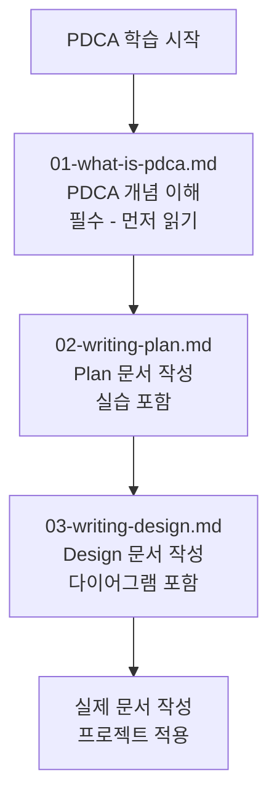

# PDCA 심화 학습 경로

> **문서 ID**: ONBOARD-08-PDCA
> **버전**: 2.0.0 | **작성일**: 2026-04-11 | **최종 수정**: 2026-04-12

---

## PDCA란 무엇인가

PDCA는 Plan(계획) → Design(설계) → Do(실행) → Check(확인) → Report(보고) → Archive(보관)의 약자로, 공공기관 SaaS 프레임워크에서 모든 기능 개발에 적용되는 표준 사이클입니다.

감리 기준(행안부 고시 제2023-1호)은 이 사이클의 완전성을 요구합니다. 단계를 건너뛰거나 문서 없이 구현하면 감리 결함이 됩니다.

---

## 이 섹션의 파일 목록

| 파일 | 제목 | 소요 시간 | 설명 |
|------|------|---------|------|
| [01-what-is-pdca.md](01-what-is-pdca.md) | PDCA 완전 이해 | 45분 | PDCA 개념, 7단계 흐름, MTU-N251 실전 예시, 에이전트 시퀀스 다이어그램, 초보자 6대 실수 |
| [02-writing-plan.md](02-writing-plan.md) | Plan 문서 작성법 | 60분 | FR ID 체계, 4관점 테이블, Context Anchor, 추적성 매트릭스, 복사 붙여넣기 템플릿 |
| [03-writing-design.md](03-writing-design.md) | Design 문서 작성법 | 60분 | Plan→Design 전환, API 명세, DB 스키마, ERD, 시퀀스 다이어그램, 이메일 발송 API 실습 |

## 학습 단계



---

## 각 단계 요약

### Plan 단계 (01-plan/mtus/)

Plan 문서는 "무엇을 왜 만들 것인가"를 정의합니다.

핵심 섹션:
- Executive Summary (4관점 테이블)
- Context Anchor (WHY/WHO/RISK/SUCCESS/SCOPE)
- 기능 요구사항 (FR-{모듈}.{번호})
- 비기능 요구사항 (NFR-{번호})
- 추적성 매트릭스

### Design 단계 (02-design/mtus/)

Design 문서는 "어떻게 만들 것인가"를 정의합니다.

핵심 섹션:
- Design Anchor (설계 원칙, 옵션 평가)
- 아키텍처 다이어그램 (Mermaid)
- API 명세 테이블
- 데이터 모델 (ERD)
- 시퀀스 다이어그램

### Do 단계 (platform/services/)

구현 단계입니다. Implementer 에이전트가 Design 문서를 기반으로 코드를 작성합니다.

코드에는 반드시 Plan 추적 주석이 포함되어야 합니다.
```typescript
// Design Ref: MTU-N241 DESIGN §2.1
// Plan SC: FR-N241.1, FR-N241.2
// CSAP: D-12 시스템 개발 보안
```

### Check 단계 (Q-Gate G1~G7)

5개 에이전트가 7개 품질 게이트를 검증합니다.

| 게이트 | 기준 | 담당 |
|--------|------|------|
| G1 | FR ID 전수 | Auditor |
| G2 | 설계 완전성 | Auditor |
| G3 | 코드 품질 + AgentShield 102규칙 | Reviewer |
| G4 | 테스트 커버리지 80%+ | Tester |
| G5 | OWASP Top10 통과 | Reviewer |
| G6 | CSAP 해당 Phase 100% | Auditor |
| G7 | 감사 추적 audit.jsonl 완비 | Auditor |

### Report 단계 (04-report/)

PDCA 완료 보고서를 작성합니다. 달성률, 교훈, 잔여 위험을 기록합니다.

### Archive 단계 (archive/YYYY-MM/)

완료된 MTU의 모든 문서를 보관합니다. 감리 증적으로 활용됩니다.

---

## 변경 이력

| 버전 | 일자 | 내용 | 작성자 |
|------|------|------|-------|
| 1.0.0 | 2026-04-11 | 초기 작성 | Implementer (Sonnet) |
| 2.0.0 | 2026-04-12 | 파일 목록 테이블 추가 (3개 파일 설명 포함) | Implementer (Sonnet) |
