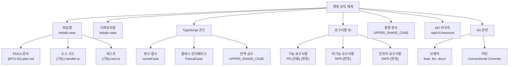

# 명명 규칙 완전 가이드

> **문서 ID**: ONBOARD-08-STD-01
> **버전**: 2.0.0 | **작성일**: 2026-04-12 | **작성자**: Implementer (Sonnet)
> **선행 학습**: `../mtu-system/01-mtu-explained.md` (MTU 완전 이해)
> **소요 시간**: 1시간
> **참고 문서**: `CLAUDE.md`, `.claude/rules/harness-constraints.md`

---

## 목차

1. [명명 규칙 전체 계층도](#1-명명-규칙-전체-계층도)
2. [파일명 규칙](#2-파일명-규칙)
3. [디렉토리 구조 규칙](#3-디렉토리-구조-규칙)
4. [요구사항 ID 규칙](#4-요구사항-id-규칙)
5. [코드 명명 규칙](#5-코드-명명-규칙)
6. [환경 변수 명명 규칙](#6-환경-변수-명명-규칙)
7. [API 라우트 명명 규칙](#7-api-라우트-명명-규칙)
8. [브랜치명 규칙](#8-브랜치명-규칙)
9. [커밋 메시지 규칙](#9-커밋-메시지-규칙)
10. [빠른 참조 치트시트](#10-빠른-참조-치트시트)
11. [변경 이력](#11-변경-이력)

---

## 1. 명명 규칙 전체 계층도



---

## 2. 파일명 규칙

### 2.1 PDCA 문서 파일명

모든 PDCA 문서는 MTU-ID를 파일명에 포함합니다.

| 문서 유형 | 형식 | 위치 |
|---------|------|------|
| Plan | `{MTU-ID}.plan.md` | `docs/01-plan/mtus/` |
| Design | `{MTU-ID}.design.md` | `docs/02-design/mtus/` |
| Analysis | `{MTU-ID}.analysis.md` | `docs/03-analysis/` |
| Report | `{MTU-ID}.report.md` | `docs/04-report/` |
| Archive Index | `_INDEX.md` | `docs/archive/YYYY-MM/{MTU-ID}/` |

실제 예시:
```
docs/01-plan/mtus/MTU-N241.plan.md
docs/02-design/mtus/MTU-N241.design.md
docs/03-analysis/MTU-N241.analysis.md
docs/04-report/MTU-N241.report.md
docs/archive/2026-04/MTU-N241/_INDEX.md
```

### 2.2 MTU-ID 형식별 파일명

| MTU 유형 | MTU-ID 형식 | 예시 |
|---------|-----------|------|
| 기술 인프라 | `MTU-N{번호}-{설명}` 또는 `MTU-N{번호}` | `MTU-N241-trivy-scan.plan.md` |
| 서비스 구현 | `SVC-{서비스코드}-R{라운드}` | `SVC-AUTH-R1.plan.md` |
| 기술 스택 | `MTU-TECH-{이름}` | `MTU-TECH-STACK-2026Q2.plan.md` |
| 핫픽스 | `L-{번호}-{설명}` | `L-01-RATE-LIMIT-PKG.plan.md` |

MTU-N 형식에서 설명 부분(`-{설명}`)은 선택 사항입니다. 파일명에서 기능을 유추할 수 있으면 포함하고, 번호만으로도 충분하면 생략합니다.

### 2.3 소스 코드 파일명

TypeScript 소스 파일은 다음 규칙을 따릅니다.

| 유형 | 형식 | 예시 |
|------|------|------|
| 핸들러 (API 라우터) | `{기능}.handler.ts` | `login.handler.ts` |
| 라이브러리 (로직) | `{기능}.ts` | `knowledge-graph.ts` |
| 미들웨어 | `{기능}.middleware.ts` | `auth.middleware.ts` |
| 스키마 (Zod) | `{기능}.schema.ts` | `password.schema.ts` |
| 타입 정의 | `{기능}.types.ts` | `user.types.ts` |
| 테스트 | `{기능}.test.ts` | `login.test.ts` |
| 통합 테스트 | `{기능}.integration.test.ts` | `auth-flow.integration.test.ts` |
| 설정 | `{기능}.config.ts` | `redis.config.ts` |

kebab-case(하이픈 구분)를 사용합니다. camelCase나 PascalCase는 파일명에서 사용하지 않습니다.

**잘못된 파일명 예시**:
```
KnowledgeGraph.ts      (PascalCase — 금지)
knowledgeGraph.ts      (camelCase — 금지)
knowledge_graph.ts     (snake_case — 금지)
```

**올바른 파일명 예시**:
```
knowledge-graph.ts     (kebab-case — 허용)
graph-rag.handler.ts   (복합어 모두 kebab-case)
entity-extractor.ts
```

### 2.4 설정 파일명

| 유형 | 파일명 예시 |
|------|----------|
| Kubernetes Deployment | `{서비스}-deployment.yaml` |
| Kubernetes Service | `{서비스}-service.yaml` |
| Prometheus 알림 규칙 | `{기능}-alerts.yaml` |
| Grafana 대시보드 | `{기능}-dashboard.json` |
| Helm values | `values-{환경}.yaml` |

---

## 3. 디렉토리 구조 규칙

### 3.1 서비스 디렉토리 구조

모든 서비스는 동일한 내부 구조를 따릅니다.

```
platform/services/{서비스명}/
  src/
    handlers/         # API 핸들러 (라우터 함수)
    lib/              # 비즈니스 로직 라이브러리
    schemas/          # Zod 검증 스키마
    middleware/       # Express 미들웨어
    types/            # TypeScript 타입 정의
    routes.ts         # 라우터 등록
    index.ts          # 진입점
  tests/
    unit/             # 단위 테스트
    integration/      # 통합 테스트
  Dockerfile
  package.json
  tsconfig.json
```

### 3.2 패키지 디렉토리 구조

공유 라이브러리는 `platform/packages/`에 위치합니다.

```
platform/packages/{패키지명}/
  src/
    index.ts          # 공개 API 내보내기
    {기능}.ts         # 구현 파일
  tests/
  package.json
  tsconfig.json
```

### 3.3 문서 디렉토리 규칙

문서 디렉토리는 번호 접두사로 정렬 순서를 명시합니다.

```
docs/
  00-pm/              # 00 = 가장 먼저
  01-plan/
  02-design/
  03-analysis/
  04-report/
  archive/
  framework/
    00-getting-started/
    01-dev-standards/
    ...
    99-references/    # 99 = 가장 마지막
  guidelines/
  guides/
    onboarding/
      00-overview.md
      01-document-management.md
      ...
      08-document-management/  # 섹션별 폴더
```

---

## 4. 요구사항 ID 규칙

### 4.1 기능 요구사항 (FR)

형식: `FR-{모듈코드}.{번호}`

| 규칙 | 설명 | 예시 |
|------|------|------|
| 모듈 코드 | 공식 24개 코드 중 하나 | `P01`, `AUTH`, `ADV5` |
| 번호 | 해당 MTU 내 순차 번호, 1부터 시작 | `.1`, `.2`, `.12` |
| 구분자 | 모듈 코드와 번호 사이 점(.) | `FR-P01.1` |

```
FR-P01.1    auth-service의 1번 기능 요구사항
FR-AUTH.3   AUTH 도메인의 3번 기능 요구사항
FR-ADV5.3   AI 고도화 R5의 3번 기능 요구사항
FR-N241.6   MTU-N241의 6번 기능 요구사항
```

### 4.2 비기능 요구사항 (NFR)

형식: `NFR-{번호}`

NFR은 특정 서비스에 종속되지 않는 전체 시스템 요건입니다.

```
NFR-1    응답 시간 P95 200ms 이하
NFR-2    가용성 99.9%
NFR-3    데이터 분류 N2SF 준수
```

### 4.3 인프라 요구사항 (INFR)

형식: `INFR-{번호}`

```
INFR-1    k3s 클러스터 고가용성 3노드 구성
INFR-2    TLS 1.3+ 강제 (HTTP 직접 통신 금지)
```

### 4.4 AI 연동 요구사항 (AI-REQ)

형식: `AI-REQ-{번호}`

AI API 연동에 특화된 요구사항입니다.

```
AI-REQ-1    N2SF O등급 데이터만 AI API 전송
AI-REQ-2    PII 마스킹 전수 적용 후 전송
AI-REQ-3    AI Gateway 경유 (직접 외부 API 호출 금지)
```

### 4.5 CC 하네스 요구사항 (CC-REQ)

형식: `CC-REQ-{번호}`

Claude Code 하네스 관련 요구사항입니다.

```
CC-REQ-01   AgentShield 102규칙 자동 실행
CC-REQ-08   문서 작성 표준 준수
```

### 4.6 성공 기준 ID (SC)

Plan 문서의 SUCCESS 섹션에서 사용합니다. 코드 주석에서도 사용합니다.

형식: `SC-{번호}`

```
SC-1    검색 재현율 15% 향상
SC-2    Q-Gate G1~G7 전체 PASS
```

코드 주석에서 참조:
```typescript
// Plan SC: FR-P01.1, FR-P01.6, FR-AUTH.3
```

### 4.7 CSAP 항목 참조 형식

형식: `D-{분야번호}-{항목번호}`

| 항목 코드 | 분야 | 주요 내용 |
|---------|------|---------|
| D-06-01 | 침해사고 관리 | 감사 로그 |
| D-07-01 | 가용성 | SLO/SLA |
| D-08-01 | 접근 통제 | 인증 |
| D-08-06 | 접근 통제 | 계정 잠금 |
| D-09-01 | 암호화 | 데이터 암호화 |
| D-12-01 | 시스템 개발 보안 | 입력 검증 |

---

## 5. 코드 명명 규칙

### 5.1 TypeScript/JavaScript 명명 규칙

| 유형 | 규칙 | 예시 |
|------|------|------|
| 변수·함수 | camelCase | `getUserById`, `accessToken` |
| 클래스·인터페이스·타입 | PascalCase | `UserService`, `AuthResponse` |
| 상수 (전역) | UPPER_SNAKE_CASE | `MAX_LOGIN_ATTEMPTS`, `JWT_EXPIRE` |
| 파일명 | kebab-case | `knowledge-graph.ts` |
| 디렉토리명 | kebab-case | `ai-service/`, `entity-extractor/` |
| 환경 변수 | UPPER_SNAKE_CASE | `DATABASE_URL`, `REDIS_HOST` |

### 5.2 언제 어떤 케이스를 쓰는가

**camelCase** — 일반 변수와 함수:
```typescript
const tenantId = 'tenant-123'
const accessToken = generateToken(user)
async function getUserByEmail(email: string) { ... }
```

**PascalCase** — 클래스, 인터페이스, 타입, 열거형(enum):
```typescript
interface GraphNode {
  id: string
  type: NodeType
}

class KnowledgeGraphService { ... }

enum DataGrade {
  C = 'C',
  S = 'S',
  O = 'O',
}
```

**UPPER_SNAKE_CASE** — 변경되지 않는 전역 상수:
```typescript
const AUTH_CONSTANTS = {
  MAX_LOGIN_ATTEMPTS: 5,
  LOCK_DURATION_MS: 30 * 60 * 1000,
  JWT_EXPIRE: '15m',
}
```

**kebab-case** — 파일명, 디렉토리명, URL 경로:
```typescript
// 파일명
import { maskPII } from './pii-masker'
import { buildGraph } from './knowledge-graph'

// URL 경로
app.post('/ai/rag/query/graph', graphRagHandler)
app.post('/ai/graph/build', buildGraphHandler)
```

### 5.3 함수명 동사 관례

함수명은 동사로 시작합니다.

| 동사 | 용도 | 예시 |
|------|------|------|
| `get` | 데이터 조회 (캐시 또는 DB) | `getUserById` |
| `fetch` | 외부 API 호출 | `fetchEntityGraph` |
| `create` | 새 데이터 생성 | `createTenant` |
| `update` | 기존 데이터 변경 | `updateUserRole` |
| `delete` | 데이터 삭제 | `deleteSession` |
| `verify` | 검증 (boolean 반환) | `verifyToken`, `verifyTotp` |
| `validate` | 유효성 검사 (오류 시 예외) | `validatePasswordPolicy` |
| `build` | 복잡한 객체 생성 | `buildKnowledgeGraph` |
| `extract` | 데이터 추출 | `extractEntities` |
| `mask` | 민감 정보 마스킹 | `maskPII` |
| `log` | 로깅 | `logAuthEvent`, `auditLog` |
| `handle` | 요청 처리 | `loginHandler` |
| `encrypt` | 암호화 | `encrypt`, `encryptMfaSecret` |
| `decrypt` | 복호화 | `decrypt`, `decryptMfaSecret` |

### 5.4 피해야 할 이름

```typescript
// 금지: 약어 (이해하기 어려움)
const u = await getUser(id)           // 금지
const cfg = loadConfig()              // 금지
const mgr = new SessionManager()     // 금지

// 권장: 명확한 이름
const user = await getUser(id)
const config = loadConfig()
const sessionManager = new SessionManager()
```

```typescript
// 금지: 의미 없는 이름
const data = await fetch(url)        // 무엇의 data인가?
const result = process(input)        // 무엇을 process?
const temp = calculate(x, y)         // 임시 변수 이름 사용 금지

// 권장: 내용을 설명하는 이름
const userProfile = await fetchUserProfile(userId)
const maskedContent = maskPII(rawContent)
const graphQueryTime = measureExecutionTime(() => graph.query(nodeId))
```

---

## 6. 환경 변수 명명 규칙

모든 환경 변수는 `UPPER_SNAKE_CASE`를 사용합니다.

### 6.1 패턴별 규칙

```bash
# 서비스 연결 정보
DATABASE_URL=postgresql://...
REDIS_URL=redis://...
REDIS_HOST=localhost
REDIS_PORT=6379

# 인증 관련
JWT_SECRET=...
JWT_ACCESS_EXPIRE=15m
JWT_REFRESH_EXPIRE=7d

# 외부 API
AI_GATEWAY_URL=http://ai-gateway:8080
AI_GATEWAY_API_KEY=...

# 서비스별 설정 (서비스명 접두사)
AUTH_SERVICE_PORT=3001
AI_SERVICE_PORT=3010
NOTIFICATION_SMTP_HOST=...
NOTIFICATION_SMTP_PORT=587

# 암호화 키
ENCRYPTION_KEY=...
MFA_SECRET_ENCRYPTION_KEY=...
```

### 6.2 필수 사용 패턴 (CSAP D-12)

```typescript
// ✅ 올바른 방법: 환경 변수 + 존재 확인
const jwtSecret = process.env['JWT_SECRET']
if (!jwtSecret) throw new Error('JWT_SECRET 환경 변수 누락')

// ❌ 금지: 하드코딩
const jwtSecret = 'my-super-secret-key'  // CSAP D-12 위반
```

### 6.3 .env 파일 관리 규칙

```bash
# 프로젝트에 있는 파일 구조
.env.example    # 예시 파일 (커밋 허용 - 실제 값 없음)
.env.local      # 로컬 개발 (커밋 금지)
.env.test       # 테스트 환경 (커밋 금지)
.env.production # 운영 환경 (커밋 절대 금지)

# .gitignore 확인 필수
.env*
!.env.example
```

---

## 7. API 라우트 명명 규칙

### 7.1 URL 구조

```
/api/v{버전}/{리소스}/{ID}/{하위리소스}
```

### 7.2 실제 예시

```
# 사용자 관련
GET    /api/v1/users                   # 목록
GET    /api/v1/users/:userId            # 단건 조회
POST   /api/v1/users                   # 생성
PUT    /api/v1/users/:userId            # 전체 업데이트
PATCH  /api/v1/users/:userId            # 부분 업데이트
DELETE /api/v1/users/:userId            # 삭제

# 중첩 리소스
GET    /api/v1/tenants/:tenantId/users  # 테넌트의 사용자 목록

# 액션 (동사 사용)
POST   /api/v1/auth/login
POST   /api/v1/auth/logout
POST   /api/v1/auth/refresh
GET    /api/v1/auth/verify

# AI 서비스
POST   /ai/rag/query/graph             # AI는 별도 경로 (/ai)
POST   /ai/graph/build
```

### 7.3 URL 명명 규칙

```
✅ 올바른 예:
/api/v1/users                  (복수형 리소스)
/api/v1/knowledge-graphs        (kebab-case)
/api/v1/tenants/:id/subscriptions

❌ 잘못된 예:
/api/v1/getUser                (동사 금지 - 단, 액션은 허용)
/api/v1/UserProfile             (PascalCase 금지)
/api/v1/user_profile            (snake_case 금지)
/api/v1/users/:id/getProfile    (동사 금지 - GET 메서드 사용)
```

---

## 8. 브랜치명 규칙

### 8.1 브랜치 접두사

| 접두사 | 용도 | 예시 |
|--------|------|------|
| `feat/` | 새 기능 구현 | `feat/knowledge-graph-rag` |
| `fix/` | 버그 수정 | `fix/mfa-bypass-vulnerability` |
| `docs/` | 문서 변경만 | `docs/onboarding-guide-update` |
| `refactor/` | 리팩토링 | `refactor/audit-log-cleanup` |
| `hotfix/` | 긴급 보안 패치 | `hotfix/L-04-csp-nonce` |
| `chore/` | 빌드·설정 변경 | `chore/pnpm-version-update` |

### 8.2 브랜치명 작성 규칙

- 소문자 kebab-case 사용
- MTU-ID를 포함하면 추적성이 향상됩니다.
- 50자 이하로 유지합니다.

```
feat/svc-ai-adv-r5-knowledge-graph     (MTU-ID 포함)
fix/auth-rate-limit-bypass             (문제 설명)
docs/08-document-management-guide      (작업 설명)
```

---

## 9. 커밋 메시지 규칙

### 9.1 Conventional Commits 형식

```
{유형}({범위}): {제목}

{본문 (선택)}

{푸터 (선택)}
```

### 9.2 유형 목록

| 유형 | 용도 |
|------|------|
| `feat` | 새 기능 추가 |
| `fix` | 버그 수정 |
| `docs` | 문서 변경 |
| `refactor` | 리팩토링 (기능 변경 없음) |
| `test` | 테스트 추가·변경 |
| `chore` | 빌드·설정·패키지 변경 |
| `perf` | 성능 개선 |
| `security` | 보안 패치 |

### 9.3 범위 (scope)

범위는 변경된 서비스나 패키지 이름입니다.

```
feat(ai-service): FR-ADV5.3 지식 그래프 인메모리 구현
fix(auth-service): FR-AUTH.1 MFA 우회 취약점 수정 (CSAP D-08)
docs(onboarding): 08-document-management 가이드 추가
refactor(audit): 감사 로그 중복 코드 제거 (Dead code 정책)
```

### 9.4 제목 작성 규칙

- 50자 이하
- 현재형 동사 사용 (과거형 금지)
- FR ID를 포함하면 추적성이 향상됩니다.
- 마침표 없음

```
// 좋음
feat(ai-service): FR-ADV5.5 그래프 RAG API 구현

// 나쁨
feat(ai-service): added graph rag api.     (영어 + 과거형 + 마침표)
feat: 기능 추가                              (너무 불명확)
```

### 9.5 절대 금지 커밋

```bash
# 금지: --no-verify (훅 우회)
git commit --no-verify -m "빠른 수정"   # CLAUDE.md 절대 제약 위반

# 금지: 시크릿 파일 포함
git add .env                           # CLAUDE.md 절대 제약 위반
git add secrets.yaml

# 금지: 설명 없는 커밋
git commit -m "fix"
git commit -m "수정"
```

### 9.6 실제 커밋 메시지 예시

프로젝트에서 실제로 사용된 커밋 메시지 형식입니다.

```
feat(packages): SVC-HEALTHAGG-R23, SVC-SECRETMGR-R24, SVC-AI-ADV-R1, SVC-CIRCUIT-R25 PDCA 완료
feat(cicd): Hotfix 파이프라인 pnpm 표준화 + Q-Gate 품질 게이트 워크플로우 (MTU-N249~N250)
feat(monitoring): Round 25 보안/정책/SRE 컴포넌트 성능 모니터링 (MTU-N236~N240)
```

---

## 10. 빠른 참조 치트시트

| 상황 | 형식 | 예시 |
|------|------|------|
| Plan 문서 | `{MTU-ID}.plan.md` | `MTU-N251.plan.md` |
| Design 문서 | `{MTU-ID}.design.md` | `SVC-AUTH-R1.design.md` |
| TypeScript 파일 | `{기능}.handler.ts` | `login.handler.ts` |
| 테스트 파일 | `{기능}.test.ts` | `login.test.ts` |
| 변수명 | camelCase | `accessToken` |
| 클래스/인터페이스 | PascalCase | `UserService` |
| 환경 변수 | UPPER_SNAKE_CASE | `JWT_SECRET` |
| API 라우트 | `/api/v1/{resource}` | `/api/v1/users` |
| 브랜치명 | `feat/{description}` | `feat/email-notification` |
| 커밋 타입 | `feat:`, `fix:`, `docs:` | `feat(ai): FR-N290.1 이메일 발송` |
| FR ID | `FR-{모듈}.{번호}` | `FR-N251.1` |
| 성공 기준 | `SC-{번호}` | `SC-1` |
| CSAP 항목 | `D-{번호}-{부번호}` | `D-12-01` |

---

## 11. 변경 이력

| 버전 | 일자 | 내용 | 작성자 |
|------|------|------|-------|
| 2.0.0 | 2026-04-12 | 전체 섹션 재번호, 환경 변수 규칙, API 라우트 규칙, 계층도, 치트시트 추가 | Implementer (Sonnet) |
| 1.0.0 | 2026-04-11 | 초기 작성 | Implementer (Sonnet) |
