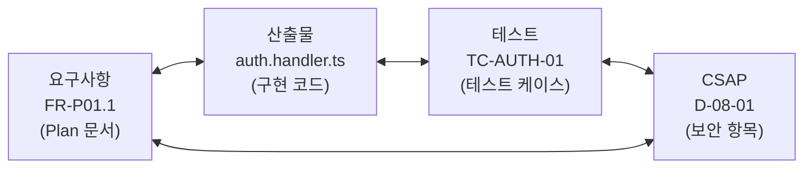
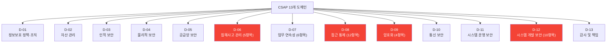
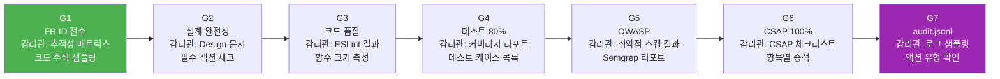

# 감리 기준 완전 가이드

> **문서 ID**: ONBOARD-08-STD-02
> **버전**: 2.0.0 | **작성일**: 2026-04-12 | **작성자**: Implementer (Sonnet)
> **선행 학습**: `01-naming-conventions.md` (명명 규칙)
> **소요 시간**: 1.5시간
> **참고 문서**: `.claude/rules/csap-compliance.md`, 행안부 감리기준 고시 제2023-1호

---

## 목차

1. [행안부 감리기준 개요](#1-행안부-감리기준-개요)
2. [CSAP 13개 도메인 개발자 체크리스트](#2-csap-13개-도메인-개발자-체크리스트)
3. [N2SF 6개 도메인 체크리스트](#3-n2sf-6개-도메인-체크리스트)
4. [Q-Gate 7단계 감리관 관점](#4-q-gate-7단계-감리관-관점)
5. [감리에서 자주 지적되는 문서 결함](#5-감리에서-자주-지적되는-문서-결함)
6. [추적성 매트릭스 작성법](#6-추적성-매트릭스-작성법)
7. [변경 이력 관리 방법](#7-변경-이력-관리-방법)
8. [PR 제출 전 체크리스트](#8-pr-제출-전-체크리스트)
9. [감리 준비 최종 체크리스트](#9-감리-준비-최종-체크리스트)
10. [변경 이력](#10-변경-이력)

---

## 1. 행안부 감리기준 개요

### 1.1 감리기준 고시 제2023-1호 핵심 (행안부)

행안부 정보시스템 감리기준은 공공기관 정보시스템 개발의 전 과정에서 다음을 요구합니다.

```
제12조(사업수행계획서 검토) 사업 착수 시 요구사항 분석, 설계, 구현, 테스트 계획의
완전성과 추적 가능성을 검토한다.

제18조(개발 단계 감리) 요구사항과 설계 간, 설계와 구현 간, 구현과 테스트 간의
추적성을 검증한다.
```

실무적으로 이 조항들은 다음을 의미합니다.

- **요구사항 → 설계 추적**: 모든 FR이 Design 문서에서 다루어져야 합니다.
- **설계 → 구현 추적**: Design 문서의 모든 API·파일이 실제로 구현되어야 합니다.
- **구현 → 테스트 추적**: 모든 구현에 대응하는 테스트 케이스가 존재해야 합니다.
- **요구사항 → CSAP 추적**: 보안 요구사항이 CSAP 항목과 매핑되어야 합니다.

### 1.2 4방향 추적성 개념

공공기관 SaaS 프레임워크에서 4방향 추적성은 다음을 의미합니다.



이 4방향이 모두 연결되어야 감리 통과가 가능합니다.

### 1.3 CSAP 79개 항목 개요

CSAP 중/상 등급은 79개 통제항목을 검증합니다. 주요 항목별 문서 연계 요건입니다.

| 분야 | 항목 수 | 문서 연계 |
|------|-------|---------|
| D-08: 접근 통제 | 12개 | 인증·RBAC 관련 FR에 D-08-{번호} 명시 |
| D-09: 암호화 | 4개 | 암호화 처리 FR에 D-09-{번호} 명시 |
| D-06: 침해사고 관리 | 5개 | 감사 로그 FR에 D-06-{번호} 명시 |
| D-12: 시스템 개발 보안 | 10개 | 입력 검증, SQL 주입 방지에 D-12-{번호} 명시 |
| D-07: 가용성 | 6개 | SLO/SLA NFR에 D-07-{번호} 명시 |

---

## 2. CSAP 13개 도메인 개발자 체크리스트

CSAP(클라우드 보안 인증) 중/상 등급은 13개 도메인, 79개 통제항목을 검증합니다.



> 빨간색으로 표시된 도메인은 개발자가 직접 코드로 구현해야 하는 항목입니다.

### 2.1 D-06: 침해사고 관리 (5항목) — 개발자 체크리스트

| 항목 | 요건 | 코드 구현 방법 |
|------|------|-------------|
| D-06-01 | 모든 민감 작업 감사 로그 기록 | `auditLog({ action, actor, target })` 호출 |
| D-06-02 | 로그 보존 최소 1년 | `.claude/audit.jsonl` append-only |
| D-06-03 | 로그 무결성 보장 | append-only 구조, 수정/삭제 불가 |
| D-06-04 | 보안 이벤트 알림 | AlertManager 규칙 설정 |
| D-06-05 | 침해사고 대응 절차 | Runbook 문서화 |

**코드 예시**:
```typescript
// D-06-01 준수: 모든 민감 작업에 auditLog 필수
await auditLog({
  actor: user.id,
  action: 'USER_DELETE',  // 민감 액션
  target: targetUserId,
  timestamp: new Date().toISOString(),
  ip: request.ip,
  tenantId: user.tenantId,
})
```

### 2.2 D-08: 접근 통제 (12항목) — 개발자 체크리스트

| 항목 | 요건 | 코드 구현 |
|------|------|---------|
| D-08-01 | 모든 API 인증 검사 | JWT Bearer 검증 미들웨어 |
| D-08-02 | 역할 기반 권한 검사 (RBAC) | `requirePermission('resource:action')` |
| D-08-03 | JWT 만료 15분 이하 | `expiresIn: '15m'` |
| D-08-04 | 세션 최대 3개 제한 | Redis 세션 카운터 |
| D-08-05 | 로그아웃 시 토큰 블랙리스트 | `redis.setex('blacklist:{jti}', ...)` |
| D-08-06 | 계정 잠금 (5회 실패) | 로그인 실패 카운터 + 잠금 로직 |
| D-08-07 | 관리자 권한 분리 | `role: 'SUPER_ADMIN' | 'TENANT_ADMIN'` |

### 2.3 D-09: 암호화 (4항목) — 개발자 체크리스트

| 항목 | 요건 | 구현 방법 |
|------|------|---------|
| D-09-01 | 저장 데이터 암호화 (AES-256) | `encrypt(data, process.env.ENCRYPTION_KEY)` |
| D-09-02 | 전송 암호화 (TLS 1.3+) | API Gateway 레벨에서 강제 |
| D-09-03 | 비밀번호 단방향 암호화 | `bcrypt.hash(password, 12)` |
| D-09-04 | 취약 알고리즘 금지 | MD5, SHA-1, DES 사용 금지 |

```typescript
// D-09-04 준수: 취약 알고리즘 절대 사용 금지
// ❌ 금지: MD5, SHA-1
import crypto from 'crypto'
crypto.createHash('md5')   // 금지
crypto.createHash('sha1')  // 금지

// ✅ 허용: SHA-256, bcrypt, AES-256
crypto.createHash('sha256')  // 허용
await bcrypt.hash(password, 12)  // 허용
```

### 2.4 D-12: 시스템 개발 보안 (10항목) — 개발자 체크리스트

| 항목 | 요건 | 코드 구현 |
|------|------|---------|
| D-12-01 | 모든 입력 검증 | Zod 스키마 `schema.parse(input)` |
| D-12-02 | SQL 주입 방지 | Prisma ORM 사용, 직접 SQL 금지 |
| D-12-03 | XSS 방지 | `DOMPurify.sanitize(input)` |
| D-12-04 | 에러 메시지 민감 정보 제외 | stack trace, DB 정보 노출 금지 |
| D-12-05 | 하드코딩 시크릿 금지 | 환경 변수 사용 |
| D-12-06 | 취약한 암호화 금지 | MD5, SHA-1 금지 |
| D-12-07 | 임시 파일 보안 처리 | 사용 후 즉시 삭제 |
| D-12-08 | 역직렬화 안전 처리 | JSON.parse 후 Zod 검증 |
| D-12-09 | 서드파티 취약점 검사 | `pnpm audit` 정기 실행 |
| D-12-10 | 보안 헤더 설정 | helmet 플러그인 (CSP, HSTS) |

---

## 3. N2SF 6개 도메인 체크리스트

N2SF(국가 네트워크 보안 체계)는 데이터를 C(비밀)/S(민감)/O(일반) 3등급으로 분류합니다.

### 3.1 데이터 등급 분류

| 등급 | 의미 | AI API 전송 | 예시 |
|------|------|------------|------|
| **C (비밀)** | 국가 비밀 수준 | 절대 금지 | 국방 정보, 내부 보안 키 |
| **S (민감)** | 개인정보 포함 | 절대 금지 | 주민번호, 계좌번호, 비밀번호 |
| **O (일반)** | 공개 가능 | PII 마스킹 후 허용 | 법령 텍스트, 공개 데이터 |

### 3.2 6개 보안 도메인 개발자 체크리스트

| 도메인 | 요건 | 구현 |
|-------|------|------|
| N-01 망분리 | C/S 데이터 망분리 환경에서만 처리 | 인프라 레벨 |
| N-02 암호화 | S등급 데이터 전송 시 암호화 | TLS 1.3 |
| N-03 접근 통제 | 등급별 접근 권한 분리 | RBAC + 데이터 등급 검사 |
| N-04 감사 로그 | 등급별 접근/처리 로그 | `auditLog` + 데이터 등급 필드 |
| N-05 AI 연동 제한 | C/S 등급 AI API 전송 금지 | `DataGradeGuard` 미들웨어 |
| N-06 PII 처리 | O등급도 PII 마스킹 후 AI 전송 | `maskPII()` 함수 |

### 3.3 AI 연동 데이터 등급 확인 코드

```typescript
// N-05 준수: AI API 전송 전 반드시 등급 확인
enum DataGrade { C = 'C', S = 'S', O = 'O' }

async function sendToAI(data: string, grade: DataGrade): Promise<AIResponse> {
  // C, S 등급: AI API 전송 절대 금지
  if (grade === DataGrade.C || grade === DataGrade.S) {
    await auditLog({ action: 'AI_BLOCKED_DATA_GRADE', grade })
    throw new Error(`BLOCKED: ${grade}등급 데이터는 AI API 전송 금지 (N2SF N-05)`)
  }

  // O 등급: PII 마스킹 후 전송 (N-06)
  const masked = await maskPII(data)
  return aiGateway.send(masked)
}
```

---

## 4. Q-Gate 7단계 감리관 관점

감리관이 Q-Gate 7단계를 실제로 어떻게 검증하는지 이해합니다.



| Gate | 감리관 확인 방법 | 필요 증적 |
|------|-------------|---------|
| G1 | Plan 문서 추적성 매트릭스 + 코드 파일 5개 랜덤 샘플링 | 모든 FR ID → 코드 주석 연결 |
| G2 | Design 문서 목차 + 필수 섹션 존재 확인 | API 명세, 시퀀스 다이어그램 |
| G3 | ESLint 실행 결과 + 100줄 초과 함수 목록 | 오류 0개 결과 화면 |
| G4 | `pnpm test:coverage` 결과 화면 | 80% 이상 커버리지 리포트 |
| G5 | Semgrep/Trivy 스캔 결과 | CRITICAL/HIGH 0건 결과 |
| G6 | CSAP 체크리스트 테이블 (79항목) | 각 항목 충족 증적 파일 |
| G7 | `tail -50 .claude/audit.jsonl` + 특정 액션 grep | 민감 작업 로그 기록 확인 |

---

## 5. 감리에서 자주 지적되는 문서 결함

### 5.1 결함 유형 1: 요구사항 ID 미부여

**지적 사항**: "요구사항 목록에 번호가 없어 추적성 확인이 불가합니다."

**잘못된 예**:
```markdown
## 기능 요구사항
- 그래프 기능을 추가한다
- API를 만든다
- 테스트를 작성한다
```

**수정된 예**:
```markdown
## 기능 요구사항

| ID | 요구사항 | 우선순위 |
|----|---------|---------|
| FR-ADV5.1 | LLM 기반 법령 엔티티 추출 (법령명, 조문번호, 기관명) | 필수 |
| FR-ADV5.5 | 그래프 RAG API (POST /ai/rag/query/graph) 구현 | 필수 |
```

### 5.2 결함 유형 2: 추적성 매트릭스 누락

**지적 사항**: "요구사항이 어떤 코드 파일에 구현되었는지 확인할 수 없습니다."

Plan 문서에 추적성 매트릭스가 없거나 불완전한 경우 지적됩니다.

**수정 방법**: Plan 문서에 추적성 매트릭스 섹션을 반드시 포함합니다.

```markdown
## 추적성 매트릭스

| 요구사항 | 산출물 | 테스트 | CSAP |
|---------|-------|-------|------|
| FR-ADV5.1 | ai-service/src/lib/entity-extractor.ts | TC-ADV5-01 | D-12-01 |
| FR-ADV5.5 | ai-service/src/handlers/graph-rag.handler.ts | TC-ADV5-05 | D-12-01 |
```

### 5.3 결함 유형 3: 변경 이력 미기록

**지적 사항**: "문서 변경 이력이 없어 어떤 내용이 언제 변경되었는지 알 수 없습니다."

**수정 방법**: 모든 문서에 변경 이력 섹션을 포함하고 수정 시마다 업데이트합니다.

```markdown
## 변경 이력

| 버전 | 일자 | 내용 | 작성자 |
|------|------|------|-------|
| 1.0.0 | 2026-04-11 | 초기 작성 | PM Lead |
| 1.1.0 | 2026-04-13 | FR-ADV5.4 요구사항 수정 | 개발자 |
| 2.0.0 | 2026-04-15 | FR-ADV5.6 신규 추가 (범위 변경) | PM Lead |
```

### 5.4 결함 유형 4: 보안 요구사항의 CSAP 매핑 누락

**지적 사항**: "보안 요구사항이 어떤 CSAP 항목을 충족하는지 명시되지 않았습니다."

**잘못된 예**:
```markdown
| NFR-3 | 입력 값 검증 | 모든 API 입력 검증 | — |
```

**수정된 예**:
```markdown
| NFR-3 | 입력 값 검증 | 모든 API 입력 Zod 스키마 검증 | D-12-01 |
```

### 5.5 결함 유형 5: 설계 문서의 시퀀스 다이어그램 부재

**지적 사항**: "핵심 비즈니스 로직의 처리 흐름이 문서화되지 않아 구현 의도를 확인하기 어렵습니다."

AI 서비스, 인증 서비스 등 복잡한 플로우를 가진 서비스는 시퀀스 다이어그램이 없으면 지적됩니다.

**수정 방법**: Design 문서에 핵심 플로우의 시퀀스 다이어그램을 추가합니다.

### 5.6 결함 유형 6: 테스트 커버리지 80% 미달

**지적 사항**: "테스트 커버리지가 기준(80%) 미달입니다."

이는 문서 결함이 아닌 구현 결함이지만, Plan 문서에서 테스트 계획이 누락되면 지적됩니다.

**수정 방법**: Plan 문서의 추적성 매트릭스에 테스트 케이스 ID를 포함하고, Tester 에이전트를 통해 80% 이상 커버리지를 달성합니다.

### 5.7 결함 유형 7: 비기능 요구사항의 측정 기준 불명확

**지적 사항**: "성능 요구사항의 목표값이 측정 가능한 형태로 기재되지 않았습니다."

**잘못된 예**:
```markdown
| NFR-1 | 응답이 빠르다 | — |
```

**수정된 예**:
```markdown
| NFR-1 | 그래프 쿼리 응답 시간 | P95 200ms 이하 (k6 부하 테스트 기준) | — |
```

---

## 6. 추적성 매트릭스 작성법

### 6.1 4방향 추적성 매트릭스 형식

```markdown
| 요구사항 | 산출물 | 테스트 | CSAP |
|---------|-------|-------|------|
| {FR ID} | {파일 경로} | {테스트 케이스 ID} | {CSAP 항목} |
```

각 열의 작성 기준:

**요구사항 열**: FR ID를 정확히 기재합니다. NFR의 경우 NFR-{번호}를 기재합니다.

**산출물 열**: 구현 파일의 상대 경로를 기재합니다. 여러 파일인 경우 콤마로 구분합니다.
```
platform/services/ai-service/src/lib/entity-extractor.ts
platform/services/ai-service/src/handlers/graph-rag.handler.ts
```

**테스트 열**: 테스트 케이스 ID를 기재합니다. 없으면 "(계획 중)"으로 기재하고 구현 후 업데이트합니다.
```
TC-ADV5-01
TC-ADV5-01, TC-ADV5-02  (복수인 경우)
```

**CSAP 열**: 관련 CSAP 항목을 기재합니다. 보안 무관 기능은 `—`를 기재합니다.
```
D-12-01
D-08-01, D-12-01  (복수인 경우)
—  (보안 무관)
```

### 6.2 완성된 추적성 매트릭스 예시

SVC-AI-ADV-R5의 추적성 매트릭스 예시입니다.

```markdown
## 5. 추적성 매트릭스

| 요구사항 | 산출물 | 테스트 | CSAP |
|---------|-------|-------|------|
| FR-ADV5.1 | platform/services/ai-service/src/lib/entity-extractor.ts | TC-ADV5-01 | D-12-01 |
| FR-ADV5.2 | platform/services/ai-service/src/lib/relation-extractor.ts | TC-ADV5-02 | D-12-01 |
| FR-ADV5.3 | platform/services/ai-service/src/lib/knowledge-graph.ts | TC-ADV5-03 | D-08-01 |
| FR-ADV5.4 | platform/services/ai-service/src/lib/graph-context.ts | TC-ADV5-04 | — |
| FR-ADV5.5 | platform/services/ai-service/src/handlers/graph-rag.handler.ts, platform/services/ai-service/src/routes.ts | TC-ADV5-05, TC-ADV5-06 | D-08-01, D-12-01 |
| NFR-2 | platform/services/ai-service/src/middleware/data-grade.middleware.ts | TC-ADV5-07 | N2SF |
| NFR-3 | platform/services/ai-service/src/lib/tenant-graph-filter.ts | TC-ADV5-08 | D-08-01 |
```

### 6.3 추적성 매트릭스 업데이트 시점

| 시점 | 업데이트 내용 |
|------|------------|
| Plan 완료 | FR ID + 예상 파일 경로 + 예상 테스트 ID + CSAP 항목 |
| Design 완료 | 파일 경로 확정 |
| 구현 완료 | 파일 경로 최종 확인 |
| 테스트 완료 | 테스트 케이스 ID 확정 |

---

## 7. 변경 이력 관리 방법

### 7.1 버전 번호 규칙

시맨틱 버전(Semantic Versioning)을 따릅니다.

| 변경 유형 | 버전 증가 | 예시 |
|---------|---------|------|
| 오타·포맷 수정 | patch (+0.0.1) | 1.0.0 → 1.0.1 |
| 섹션 내용 수정·보완 | minor (+0.1.0) | 1.0.1 → 1.1.0 |
| 요구사항 추가·삭제 | major (+1.0.0) | 1.1.0 → 2.0.0 |

### 7.2 변경 이력 테이블 형식

```markdown
## 변경 이력

| 버전 | 일자 | 내용 | 작성자 |
|------|------|------|-------|
| 1.0.0 | 2026-04-11 | 초기 작성 | PM Lead |
| 1.0.1 | 2026-04-12 | §2 Executive Summary 오타 수정 | 개발자 |
| 1.1.0 | 2026-04-13 | §3 FR-ADV5.4 요구사항 상세 추가 | PM Lead |
| 2.0.0 | 2026-04-15 | §3 FR-ADV5.6 신규 추가 (범위 변경) | PM Lead |
```

**내용 열 작성 규칙**:
- 어느 섹션이 변경되었는지 명시 (§{번호} 형식)
- 무엇이 변경되었는지 한 문장으로
- 오타 수정 같은 사소한 변경도 기록

### 7.3 변경 이력 관리가 필요한 이유

감리단은 문서 변경 이력을 통해 다음을 확인합니다.

- 요구사항이 사업 진행 중에 무단으로 변경되지 않았는지
- 변경이 있었다면 적절한 승인 과정이 있었는지
- 변경의 이유와 내용이 투명하게 기록되었는지

변경 이력이 없는 문서는 "문서 관리 체계가 없다"는 인상을 줍니다.

### 7.4 주요 변경 시 이메일/협의 기록

요구사항이 크게 변경되는 경우(major 버전 업)에는 변경 이력과 함께 협의 내용을 기록합니다.

```markdown
| 2.0.0 | 2026-04-15 | FR-ADV5.6 신규 추가 — PM 팀 협의(2026-04-14) 결과 반영 | PM Lead |
```

---

## 8. PR 제출 전 체크리스트

MTU 작업을 완료하고 Pull Request를 제출하기 전에 다음 체크리스트를 반드시 확인합니다.

### 8.1 문서 제출 준비

```
[ ] Plan 문서 (docs/01-plan/mtus/{MTU-ID}.plan.md) 존재 및 완성
[ ] Design 문서 (docs/02-design/mtus/{MTU-ID}.design.md) 존재 및 완성
[ ] Report 문서 (docs/04-report/{MTU-ID}.report.md) 존재 및 완성
[ ] 모든 문서의 변경 이력이 최신 상태인가?
[ ] 모든 문서의 버전 번호가 올바른가?
```

### 8.2 코드 품질 확인

```bash
# 린트 검사 (오류 0개 필수)
pnpm lint

# TypeScript 타입 검사
pnpm tsc --noEmit

# Dead Code 탐지
npx ts-prune --error

# 의존성 취약점 검사
pnpm audit --audit-level=high
```

```
[ ] ESLint 오류 0개
[ ] TypeScript 컴파일 오류 0개
[ ] 미사용 export 없음 (ts-prune)
[ ] pnpm audit HIGH/CRITICAL 취약점 없음
[ ] 함수 크기 80줄 이하
[ ] 파일 크기 800줄 이하
```

### 8.3 테스트 커버리지 확인

```bash
# 커버리지 포함 테스트 실행
pnpm test:coverage

# 커버리지 결과 확인 (80% 이상 필수)
pnpm test:coverage --reporter=text-summary
```

```
[ ] 전체 테스트 커버리지 80% 이상
[ ] 신규 기능에 대응하는 테스트 케이스 추가됨
[ ] 추적성 매트릭스의 TC-{MTU}-{번호} ID가 실제 테스트와 일치
```

### 8.4 보안 검사 확인

```bash
# OWASP 취약점 스캔 (Semgrep)
semgrep --config=auto src/ --error

# 시크릿 탐지 (hardcoded secret 확인)
git secrets --scan

# 컨테이너 취약점 스캔
trivy image --exit-code 1 --severity HIGH,CRITICAL {image-name}
```

```
[ ] Semgrep 보안 규칙 통과 (CRITICAL/HIGH 0건)
[ ] 하드코딩된 시크릿 없음 (git secrets)
[ ] 컨테이너 이미지 CRITICAL/HIGH 취약점 없음
[ ] CSAP 해당 항목 모두 코드에서 구현됨
```

### 8.5 감사 로그 확인

```bash
# 최근 감사 로그 확인
tail -20 .claude/audit.jsonl | jq '.'

# 특정 액션 확인
grep '"action":"USER_DELETE"' .claude/audit.jsonl | tail -5
```

```
[ ] 모든 민감 작업(생성/수정/삭제/접근)에 auditLog 호출됨
[ ] audit.jsonl에 실제 로그가 기록됨
[ ] auditLog의 필수 필드(actor, action, target, timestamp, ip) 모두 포함
```

### 8.6 PR 설명 작성 기준

PR 설명(description)에 다음 내용을 포함합니다.

```markdown
## 개요
- MTU ID: {MTU-ID}
- 구현 기능: {한 줄 요약}
- 관련 Plan: docs/01-plan/mtus/{MTU-ID}.plan.md
- 관련 Design: docs/02-design/mtus/{MTU-ID}.design.md

## 변경 사항
- FR-{모듈}.1: {기능 설명} — 구현 완료
- FR-{모듈}.2: {기능 설명} — 구현 완료

## Q-Gate 통과 현황
- [x] G1: FR ID 전수 (추적성 매트릭스 포함)
- [x] G2: Design 문서 완성
- [x] G3: ESLint 0오류 + AgentShield 통과
- [x] G4: 테스트 커버리지 {X}%
- [x] G5: Semgrep CRITICAL/HIGH 0건
- [x] G6: CSAP 관련 항목 {N}개 충족
- [x] G7: audit.jsonl 기록 확인

## 스크린샷 / 증적
{커버리지 리포트, 보안 스캔 결과 캡처}
```

---

## 9. 감리 준비 최종 체크리스트

### 9.1 문서 완전성 체크

감리 전에 다음 항목을 점검합니다.

```
[ ] 모든 MTU의 Plan 문서가 docs/01-plan/mtus/에 존재하는가?
[ ] 모든 MTU의 Design 문서가 docs/02-design/mtus/에 존재하는가?
[ ] 완료된 MTU의 Report 문서가 docs/04-report/에 존재하는가?
[ ] 완료된 MTU의 Archive가 docs/archive/YYYY-MM/에 존재하는가?
```

### 9.2 요구사항 추적성 체크

```
[ ] 모든 FR에 FR-{모듈}.{번호} 형식의 ID가 부여되었는가?
[ ] 모든 Plan 문서에 추적성 매트릭스가 포함되어 있는가?
[ ] 추적성 매트릭스의 산출물 경로가 실제 파일과 일치하는가?
[ ] 추적성 매트릭스의 테스트 케이스 ID가 실제 테스트와 일치하는가?
[ ] 보안 관련 FR에 CSAP 항목 번호가 명시되어 있는가?
```

### 9.3 코드-문서 일치성 체크

```
[ ] Design 문서에서 정의한 API 엔드포인트가 모두 구현되어 있는가?
[ ] 코드의 Design Ref 주석이 올바른 Design 문서를 참조하는가?
[ ] 코드의 Plan SC 주석이 올바른 FR ID를 참조하는가?
[ ] 삭제된 기능이 있다면 Design 문서도 업데이트되었는가?
```

```typescript
// 올바른 추적 주석 예시
// Design Ref: SVC-AI-ADV-R5 DESIGN §4 — 그래프 RAG API
// Plan SC: FR-ADV5.4, FR-ADV5.5
// CSAP: D-12 시스템 개발 보안, D-08 접근 통제
```

### 9.4 보안 문서 체크

```
[ ] CSAP 79개 항목 중 적용 항목이 모두 식별되었는가?
[ ] 각 CSAP 항목이 어떤 FR/코드로 충족되는지 추적 가능한가?
[ ] N2SF 데이터 등급 분류가 모든 AI 연동 FR에 명시되어 있는가?
[ ] audit.jsonl에 모든 민감 작업이 기록되어 있는가?
```

### 9.5 Q-Gate 사전 점검

감리 전에 Q-Gate G1~G7을 재실행하여 통과 여부를 확인합니다.

```
[ ] G1: 모든 FR ID가 코드에 구현되어 있는가?
[ ] G2: 모든 Design 문서가 완성되어 있는가?
[ ] G3: AgentShield 102규칙 통과 확인
[ ] G4: 테스트 커버리지 80% 이상 확인
[ ] G5: OWASP Top10 취약점 없음 확인
[ ] G6: 해당 CSAP Phase 100% 충족 확인
[ ] G7: audit.jsonl 완비 확인
```

### 9.6 변경 이력 체크

```
[ ] 모든 문서에 변경 이력 테이블이 있는가?
[ ] 최근 변경 사항이 변경 이력에 반영되어 있는가?
[ ] 주요 변경(major 버전)의 협의 내용이 기록되어 있는가?
```

### 9.7 Dead Code 체크

감리 전에 Dead Code 정책 위반 여부를 점검합니다.

```bash
# Dead Code 탐지
npx ts-prune --error            # 미사용 export 탐지
npx depcheck                    # 미사용 npm 패키지

# 또는 일괄 실행
npm run audit:dead-code
```

```
[ ] 미사용 함수가 없는가?
[ ] 미사용 변수가 없는가?
[ ] 주석 처리된 코드가 없는가?
[ ] 미사용 npm 패키지가 없는가?
```

### 9.8 감리 시뮬레이션 질문

감리단이 실제로 물어보는 질문에 대한 답변을 준비합니다.

| 질문 | 답변 위치 |
|------|---------|
| "이 기능을 왜 만들었는가?" | Plan 문서 WHY 섹션 |
| "이 요구사항이 어떻게 구현되었는가?" | 추적성 매트릭스 → 코드 파일 |
| "이 코드가 어떤 테스트로 검증되었는가?" | 추적성 매트릭스 → 테스트 파일 |
| "CSAP D-08 접근 통제는 어떻게 충족했는가?" | CSAP 항목 → FR ID → 코드 |
| "개인정보가 AI API로 전송되지 않음을 어떻게 보장하는가?" | N2SF 등급 분류 문서 + PII 마스킹 코드 |
| "이 문서는 언제 작성되었고 변경 이력이 있는가?" | 변경 이력 테이블 |

---

## 10. 변경 이력

| 버전 | 일자 | 내용 | 작성자 |
|------|------|------|-------|
| 1.0.0 | 2026-04-11 | 초기 작성 | Implementer (Sonnet) |
| 2.0.0 | 2026-04-12 | §2~§4 CSAP/N2SF/Q-Gate 체크리스트 추가, §8 PR 제출 전 체크리스트 신규, §9 감리 준비 최종 체크리스트 재편 | Implementer (Sonnet) |
