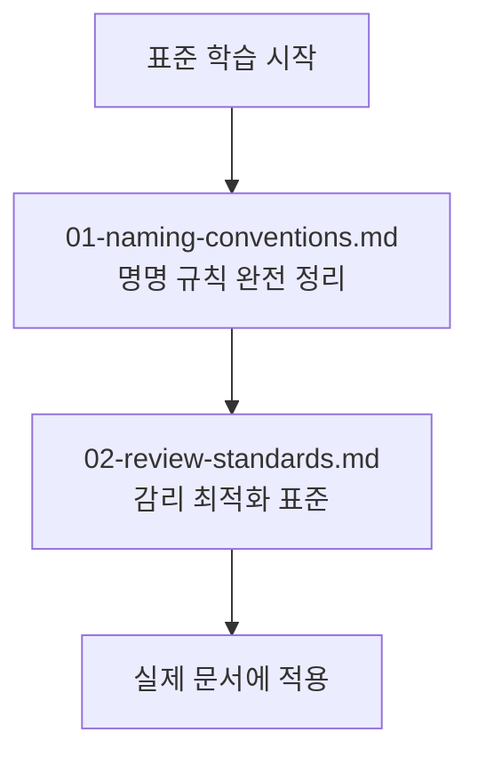

# 작성 표준 학습 경로

> **문서 ID**: ONBOARD-08-STD
> **버전**: 2.0.0 | **작성일**: 2026-04-11 | **최종 수정**: 2026-04-12

---

## 이 섹션에서 배우는 것

문서 작성의 일관성과 감리 최적화를 위한 표준 규칙을 배웁니다.

- 파일명과 ID에 어떤 규칙을 따르는가
- 감리단이 자주 지적하는 문서 결함은 무엇인가
- 추적성 매트릭스를 어떻게 작성하는가
- 변경 이력을 어떻게 관리하는가

---

## 이 섹션의 파일 목록

| 파일 | 제목 | 소요 시간 | 설명 |
|------|------|---------|------|
| [01-naming-conventions.md](01-naming-conventions.md) | 명명 규칙 완전 가이드 | 45분 | 파일/디렉토리 명명, TypeScript 규칙, FR ID, MTU명, 브랜치, 커밋, 환경 변수, API 라우트, Mermaid 계층도, 빠른 참조 치트시트 |
| [02-review-standards.md](02-review-standards.md) | 감리 기준 완전 가이드 | 90분 | 행안부 감리기준 개요, CSAP 13도메인 체크리스트, N2SF 6도메인 체크리스트, Q-Gate 7단계 감리관 관점, 결함 유형 7가지, 추적성 매트릭스 작성법, PR 제출 전 체크리스트, 감리 준비 최종 체크리스트 |

## 학습 단계

---

## 빠른 참조

### 파일명 규칙 요약

| 유형 | 규칙 | 예시 |
|------|------|------|
| Plan 문서 | `{MTU-ID}.plan.md` | `MTU-N241.plan.md` |
| Design 문서 | `{MTU-ID}.design.md` | `SVC-AUTH-R1.design.md` |
| Report 문서 | `{MTU-ID}.report.md` | `SVC-AI-R1.report.md` |
| Analysis 문서 | `{MTU-ID}.analysis.md` | `MTU-N241.analysis.md` |

### 요구사항 ID 형식 요약

| 유형 | 형식 | 예시 |
|------|------|------|
| 기능 요구사항 | `FR-{모듈}.{번호}` | `FR-P01.1`, `FR-AUTH.3` |
| 비기능 요구사항 | `NFR-{번호}` | `NFR-1`, `NFR-5` |
| 인프라 요구사항 | `INFR-{번호}` | `INFR-1` |
| AI 연동 요구사항 | `AI-REQ-{번호}` | `AI-REQ-1` |
| CC 하네스 요구사항 | `CC-REQ-{번호}` | `CC-REQ-01` |

---

## 변경 이력

| 버전 | 일자 | 내용 | 작성자 |
|------|------|------|-------|
| 1.0.0 | 2026-04-11 | 초기 작성 | Implementer (Sonnet) |
| 2.0.0 | 2026-04-12 | 파일 목록 테이블 추가 (2개 파일 설명 포함) | Implementer (Sonnet) |
