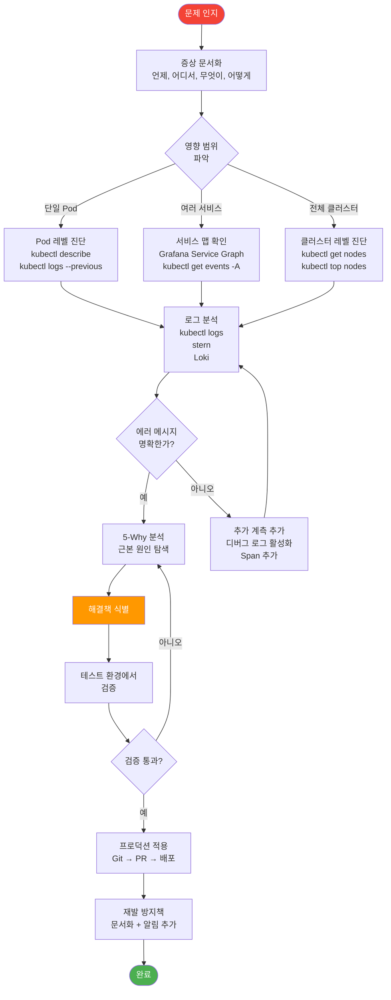
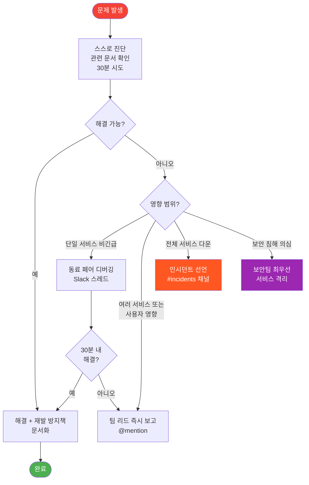

# 9장 2절: 디버깅 방법론 및 도구

> **버전**: 1.1.0 | **작성일**: 2026-04-12
> **대상**: 개발자, DevOps 엔지니어, 인프라 담당자
> **CSAP**: D-06 (침해사고 관리), D-12 (시스템 개발 보안)
> **선행 문서**: `04-infrastructure/kubernetes/01-k3s-basics.md`

---

## 목차

1. [5-Why 방법론](#1-5-why-방법론)
2. [디버깅 워크플로우](#2-디버깅-워크플로우)
3. [kubectl 심화 디버깅 명령어](#3-kubectl-심화-디버깅-명령어)
4. [k9s TUI 가이드](#4-k9s-tui-가이드)
5. [stern — 멀티 Pod 로그 확인](#5-stern--멀티-pod-로그-확인)
6. [Grafana로 메트릭 + 로그 + 추적 연결하기](#6-grafana로-메트릭--로그--추적-연결하기)
7. [Loki 로그 조회 (Grafana Explore)](#7-loki-로그-조회-grafana-explore)
8. [Tempo 추적 조회 (Grafana Explore)](#8-tempo-추적-조회-grafana-explore)
9. [버그 보고서 작성 방법](#9-버그-보고서-작성-방법)
10. [에스컬레이션 경로](#10-에스컬레이션-경로)

---

## 1. 5-Why 방법론

### 1.1 5-Why란

5-Why는 도요타가 제조 현장에서 개발한 문제 해결 기법입니다. 증상에 즉각 반응하지 않고 "왜?"를 최소 5번 반복하여 근본 원인(Root Cause)을 찾습니다.

소프트웨어 개발에서 증상만 고치면 같은 문제가 반복됩니다. 5-Why로 근본 원인을 제거해야 합니다.

### 1.2 실제 예시 — auth-service 장애

```
상황: 새벽 3시에 auth-service 응답 없음 알림 수신

1번째 왜?
  증상: auth-service Pod가 CrashLoopBackOff 상태
  답: Pod가 시작 후 30초 만에 종료되고 있음

2번째 왜?
  증상: Pod 로그에서 "Cannot connect to Redis"
  답: Redis 연결에 실패하여 서비스가 종료됨

3번째 왜?
  증상: Redis Pod를 확인하니 OOMKilled 상태
  답: Redis가 메모리 초과로 재시작됨

4번째 왜?
  증상: Redis 메모리 사용량이 평소 2GB → 8GB로 급증
  답: 어젯밤 배포에서 캐시 TTL 설정이 누락되어 키가 계속 쌓임

5번째 왜?
  증상: 배포된 코드에 redis.setex() 대신 redis.set() 사용
  답: 코드 리뷰 시 TTL 설정 누락을 캐치하지 못함

근본 원인: 코드 리뷰 체크리스트에 "캐시 TTL 설정 확인" 항목 없음

해결책:
  - 즉시: Redis TTL 없는 키 삭제, 코드 수정 후 재배포
  - 근본: 코드 리뷰 체크리스트에 캐시 관련 항목 추가
  - 예방: Redis maxmemory-policy: allkeys-lru 설정으로 자동 정리
```

### 1.3 5-Why 적용 원칙

```
규칙 1: 사람이 아닌 프로세스를 탓하십시오
  ❌ "누군가가 실수로 TTL을 빠뜨렸다"
  ✅ "TTL 설정을 강제하는 코드 리뷰 체크포인트가 없다"

규칙 2: 증거 기반으로 답하십시오
  ❌ "아마도 Redis가 문제였을 것이다"
  ✅ "kubectl logs redis-xxx --previous | grep OOM" 출력 결과로 확인

규칙 3: 추측이 아닌 측정값을 사용하십시오
  ❌ "Redis가 느린 것 같다"
  ✅ "Redis 응답 시간 P99: 1200ms (정상: 5ms)"

규칙 4: 5번까지 강제로 깊이 파고드십시오
  3번째에서 "설정 오류" 같은 모호한 답이 나오면 더 깊이 파십시오
```

---

## 2. 디버깅 워크플로우

### 2.1 체계적 접근 순서



### 2.2 긴급 상황 시 첫 5분

시스템 장애가 발생했을 때 첫 5분이 중요합니다.

```bash
# 1분: 전체 상태 파악
kubectl get pods -A | grep -v Running | grep -v Completed
kubectl get nodes

# 2분: 최근 이벤트 확인 (무슨 일이 있었는지)
kubectl get events -A --sort-by='.lastTimestamp' | tail -30

# 3분: 문제 서비스 식별 및 로그 수집
kubectl logs -n saas-platform -l app=auth-service --tail=50 --timestamps

# 4분: 최근 배포 이력 확인 (배포 직후 문제?)
helm history auth-service -n saas-platform
flux get all -A

# 5분: 롤백 여부 결정
# 최근 배포가 원인이라면:
helm rollback auth-service -n saas-platform
# 또는 Flux로 이전 Git 커밋으로 롤백
```

---

## 3. kubectl 심화 디버깅 명령어

### 3.1 kubectl describe pod — 가장 중요한 명령어

```bash
kubectl describe pod <pod-name> -n saas-platform
```

출력 읽는 법:

```
Name:         auth-service-6f8d4b-xxxxx
Namespace:    saas-platform
Node:         desktop-xxxxx/192.168.x.x
Status:       Running

Containers:
  auth-service:
    Image:          localhost:8080/public-saas/auth-service:v1.2.3
    State:          Running            ← 현재 상태
      Started:      Mon, 12 Apr 2026 09:00:01 +0900
    Last State:     Terminated         ← 이전 상태 (재시작 이력)
      Reason:       OOMKilled          ← OOM Kill 원인!
      Exit Code:    137
    Ready:          True
    Restart Count:  3                  ← 재시작 3회 주의

Conditions:
  Ready:          True
  ContainersReady: True

Events:                                ← 가장 중요한 섹션
  Warning  BackOff   5m   kubelet  Back-off restarting failed container
  Warning  OOMKilling 10m  kernel   Out of memory: Kill process 1234
  Normal   Pulled    15m  kubelet  Successfully pulled image
  Normal   Started   15m  kubelet  Started container auth-service
```

**Events 섹션에서 자주 보이는 메시지:**

| 메시지 | 의미 | 다음 행동 |
|--------|------|---------|
| `OOMKilling` | 메모리 초과 | 메모리 limit 증가 |
| `Failed to pull image` | 이미지 없음 | 레지스트리/태그 확인 |
| `Back-off restarting` | 반복 재시작 | 로그 --previous 확인 |
| `Insufficient memory` | 노드 메모리 부족 | 노드 스케일업 |
| `Liveness probe failed` | 헬스체크 실패 | 서비스 응답 확인 |
| `Readiness probe failed` | 준비 상태 아님 | 시작 시간 확인 |

### 3.2 kubectl logs --previous — 재시작 전 로그

Pod가 재시작된 경우 현재 로그 대신 이전 컨테이너의 로그를 봐야 합니다.

```bash
# 이전 컨테이너 로그 (재시작 원인 찾기)
kubectl logs <pod-name> -n saas-platform --previous

# 이전 로그 + 타임스탬프
kubectl logs <pod-name> -n saas-platform --previous --timestamps

# 마지막 100줄만
kubectl logs <pod-name> -n saas-platform --previous --tail=100

# 특정 오류 패턴만 필터링
kubectl logs <pod-name> -n saas-platform --previous | grep -E "ERROR|FATAL|Exception"

# 실시간 로그 스트리밍 (현재 실행 중인 컨테이너)
kubectl logs <pod-name> -n saas-platform -f

# 멀티 컨테이너 Pod에서 특정 컨테이너
kubectl logs <pod-name> -n saas-platform -c auth-service
```

**실전 팁 — 레이블로 Pod 자동 선택:**

```bash
kubectl logs -n saas-platform \
  $(kubectl get pod -n saas-platform -l app=auth-service -o name | head -1) \
  --previous --tail=50
```

### 3.3 kubectl exec -it — Pod 내부 접속

```bash
# Pod 내부 쉘 접속
kubectl exec -it <pod-name> -n saas-platform -- sh

# sh가 없는 최소 이미지라면
kubectl exec -it <pod-name> -n saas-platform -- /bin/bash

# Pod 내부에서 할 수 있는 디버깅:

# 환경 변수 확인
env | grep DATABASE

# 내부 DNS 확인
nslookup user-service.saas-platform.svc.cluster.local

# 다른 서비스 연결 테스트
wget -qO- http://user-service.saas-platform.svc.cluster.local:3002/health

# 파일 시스템 확인
ls -la /app/dist/

# 프로세스 확인
ps aux

# 메모리 사용량
cat /proc/meminfo | head -5
```

**임시 디버그 Pod 생성 (네트워크 테스트용):**

```bash
# busybox로 DNS/네트워크 디버깅
kubectl run debug --image=busybox --rm -it \
  -n saas-platform --restart=Never -- sh

# curl이 있는 이미지로 HTTP 테스트
kubectl run debug --image=curlimages/curl --rm -it \
  -n saas-platform --restart=Never -- sh

# nicolaka/netshoot — 모든 네트워크 도구 포함
kubectl run debug --image=nicolaka/netshoot --rm -it \
  -n saas-platform --restart=Never -- bash
```

### 3.4 kubectl get events — 클러스터 이벤트 분석

```bash
# 특정 네임스페이스의 최근 이벤트 (시간순)
kubectl get events -n saas-platform --sort-by='.lastTimestamp'

# Warning 이벤트만 필터
kubectl get events -n saas-platform \
  --sort-by='.lastTimestamp' \
  --field-selector type=Warning

# 전체 네임스페이스 경고 이벤트
kubectl get events -A \
  --sort-by='.lastTimestamp' \
  --field-selector type=Warning | tail -20

# 특정 Pod의 이벤트만
kubectl get events -n saas-platform \
  --field-selector involvedObject.name=<pod-name>

# 이벤트 실시간 감시
kubectl get events -n saas-platform -w
```

**출력 예시 해석:**

```
LAST SEEN   TYPE      REASON             OBJECT                MESSAGE
2m          Warning   OOMKilling         Pod/auth-service-xxx  Out of memory
5m          Warning   BackOff            Pod/auth-service-xxx  Back-off restarting
8m          Normal    Killing            Pod/auth-service-xxx  Stopping container
8m          Normal    Pulling            Pod/auth-service-xxx  Pulling image v1.2.3
10m         Warning   FailedScheduling   Pod/auth-service-xxx  Insufficient memory

해석: 10분 전 스케줄링 실패(메모리 부족) → 8분 전 이미지 Pull 시작
     → 2분 전 OOM Kill로 재시작 반복 중
```

### 3.5 포트 포워딩으로 로컬에서 서비스 직접 테스트

```bash
# 특정 서비스를 로컬에서 직접 테스트
kubectl port-forward -n saas-platform svc/auth-service 3001:3001 &

# 이제 로컬에서 직접 API 호출 가능
curl http://localhost:3001/health
curl -X POST http://localhost:3001/auth/login \
  -H "Content-Type: application/json" \
  -d '{"email":"test@example.com","password":"test"}'

# 포트 포워딩 종료
kill %1
```

### 3.6 리소스 사용량 확인

```bash
# Pod별 CPU/메모리 실시간 사용량
kubectl top pods -n saas-platform

# 출력 예시:
# NAME                      CPU(cores)   MEMORY(bytes)
# auth-service-xxx          45m          112Mi
# user-service-xxx          120m         256Mi
# ai-service-xxx            350m         820Mi   ← 메모리 높음 주의

# 노드 전체 사용량
kubectl top nodes

# 네임스페이스별 리소스 쿼터 확인
kubectl describe resourcequota -n saas-platform
```

---

## 4. k9s TUI 가이드

### 4.1 k9s란

k9s는 터미널에서 Kubernetes를 시각적으로 탐색하는 TUI(Terminal User Interface) 도구입니다. kubectl 명령어를 외우지 않아도 키보드로 모든 것을 탐색할 수 있어 디버깅 속도를 크게 높입니다.

```bash
# 기본 실행
k9s

# 특정 네임스페이스로 시작
k9s -n saas-platform

# 특정 리소스로 시작
k9s --command deployments
```

### 4.2 k9s 화면 구조

```
┌─────────────────────────────────────────────────────────────────────┐
│ K9s v0.32.0 | Context: default | Cluster: local | K8s: v1.34       │
│ CPU:  12%  MEM: 67%  [ saas-platform ]  Pods: 12 / 12              │
├─────────────────────────────────────────────────────────────────────┤
│ Pods(saas-platform)[12]                                             │
├─ NAME ──────────────────── READY  STATUS      RESTARTS  AGE ───────┤
│ ▶ api-gateway-7d4b-xxxxx    1/1   Running     0         2d         │
│   auth-service-6f8d-xxxxx   1/1   Running     0         2d         │
│   user-service-5c7b-xxxxx   0/1   OOMKilled   3         6h         │← 빨간색
│   ai-service-9f5a-xxxxx     1/1   Running     2         12h        │
│   tenant-service-8e6c-xxxxx 1/1   Running     0         1d         │
├─────────────────────────────────────────────────────────────────────┤
│ <ctrl-a> All NS │ <l> Logs │ <d> Describe │ <s> Shell │ <?> Help   │
└─────────────────────────────────────────────────────────────────────┘
```

### 4.3 핵심 단축키 완전 정리

**탐색:**

| 단축키 | 동작 | 설명 |
|--------|------|------|
| `:pods` | Pod 목록 | 콜론 + 리소스명으로 이동 |
| `:deployments` | Deployment 목록 | — |
| `:services` | Service 목록 | — |
| `:events` | 이벤트 목록 | 실시간 이벤트 확인 |
| `:helmreleases` | HelmRelease | Flux 리소스 |
| `:configmaps` | ConfigMap | 설정 확인 |
| `:secrets` | Secret | 시크릿 (값은 마스킹) |
| `:nodes` | 노드 목록 | 노드 상태 |
| `ctrl-a` | 전체 NS | 모든 네임스페이스 표시 |
| `/` | 검색/필터 | Pod명으로 필터링 |
| `0`~`9` | NS 전환 | 숫자로 네임스페이스 전환 |
| `esc` | 뒤로 | 이전 화면 |
| `ctrl-c` | 종료 | k9s 종료 |
| `?` | 도움말 | 전체 단축키 목록 |

**Pod 관련:**

| 단축키 | 동작 | 설명 |
|--------|------|------|
| `l` | 로그 | 선택된 Pod 로그 |
| `p` | 이전 로그 | `--previous` 플래그 |
| `d` | Describe | 상세 정보 |
| `s` | 쉘 접속 | `kubectl exec` |
| `e` | 편집 | YAML 편집 (Git 우선 권장) |
| `k` | 삭제 | Pod 삭제 (Deployment가 재생성) |
| `shift-f` | 포트 포워딩 | 선택된 Pod 포트 포워딩 |

**로그 뷰어에서:**

| 단축키 | 동작 |
|--------|------|
| `f` | 실시간 스트리밍 토글 |
| `/` | 로그 내용 검색 |
| `w` | 줄 바꿈 토글 |

### 4.4 k9s 디버깅 세션 — 실제 시나리오

```
시나리오: auth-service가 CrashLoopBackOff

1. k9s 실행
   $ k9s -n saas-platform

2. Pod 목록에서 auth-service 찾기
   빨간색 CrashLoopBackOff 확인

3. Pod 선택 후 'd' 키
   → Events 섹션: "Cannot connect to Redis"

4. 'p' 키로 이전 로그 확인
   → 마지막 에러: "Redis ECONNREFUSED"

5. ':pods' 에서 Redis Pod 확인
   → Redis Pod가 OOMKilled

6. Redis Pod 선택 후 'd'
   → Events: "OOMKilling, max memory reached"

7. ':configmaps' 에서 Redis 설정 확인
   → maxmemory 설정이 너무 낮음

근본 원인: Redis maxmemory 설정 부족
해결: Helm values에서 Redis maxmemory 증가 → Git push → Flux 배포
```

---

## 5. stern — 멀티 Pod 로그 확인

### 5.1 stern이 필요한 이유

```bash
# kubectl logs는 단일 Pod만 볼 수 있음
kubectl logs auth-service-xxx -n saas-platform

# auth-service가 3개 복제본이라면 각각 따로 확인해야 함
# stern은 여러 Pod를 동시에, 색상으로 구분하여 출력
stern "auth-service" -n saas-platform
# auth-service-aaa | {"level":"info","message":"요청 처리"}
# auth-service-bbb | {"level":"error","message":"DB 연결 실패"}  ← 특정 Pod만 에러!
# auth-service-ccc | {"level":"info","message":"요청 처리"}
```

### 5.2 stern 설치

```bash
# Linux (WSL2)
curl -L https://github.com/stern/stern/releases/download/v1.28.0/stern_1.28.0_linux_amd64.tar.gz \
  | tar xz
sudo mv stern /usr/local/bin/

# 설치 확인
stern --version
# stern version 1.28.0
```

### 5.3 stern 주요 사용법

```bash
# 기본: 이름 패턴으로 Pod 자동 선택
stern auth-service -n saas-platform

# 정규식으로 여러 서비스 동시 확인
stern "auth|user" -n saas-platform

# 전체 네임스페이스
stern auth -A

# 특정 레이블의 Pod
stern -l app=auth-service -n saas-platform

# 최근 30분 로그 + 실시간
stern auth-service -n saas-platform --since 30m

# JSON 로그 파싱 (jq 연동)
stern auth-service -n saas-platform --output raw | \
  grep -v "^$" | jq -r '.message // .'

# 에러만 필터링
stern auth-service -n saas-platform | grep -i "error\|ERROR"

# 특정 컨테이너만 (사이드카가 있는 경우)
stern auth-service -n saas-platform -c auth-service
```

### 5.4 stern으로 멀티 서비스 동시 모니터링

```bash
# 인증 흐름 전체 모니터링 (디버깅 시)
stern "api-gateway|auth-service|user-service" -n saas-platform

# 출력 예시:
# api-gateway-xxx  | {"level":"info","message":"요청 수신: POST /auth/login"}
# auth-service-yyy | {"level":"info","message":"토큰 생성 시작"}
# auth-service-yyy | {"level":"error","message":"Redis 연결 실패"}  ← 에러 발견!
# api-gateway-xxx  | {"level":"error","message":"upstream timeout"}

# 배포 중 실시간 모니터링
stern "auth-service" -n saas-platform --since 1m &
kubectl rollout restart deployment/auth-service -n saas-platform
```

---

## 6. Grafana로 메트릭 + 로그 + 추적 연결하기

### 6.1 황금 신호 (Golden Signals) 이해

Google SRE 팀이 정의한 서비스 상태를 나타내는 4가지 핵심 지표입니다.

```
1. 트래픽 (Traffic)
   초당 요청 수 — "지금 얼마나 바쁜가?"
   PromQL: rate(http_requests_total[5m])

2. 오류율 (Errors)
   5xx 응답 비율 — "얼마나 많이 실패하는가?"
   PromQL: rate(http_requests_total{status=~"5.."}[5m]) /
           rate(http_requests_total[5m])

3. 지연 시간 (Latency)
   P50, P95, P99 응답 시간 — "얼마나 오래 걸리는가?"
   PromQL: histogram_quantile(0.99, http_request_duration_seconds_bucket)

4. 포화도 (Saturation)
   CPU/메모리 사용률 — "한계에 얼마나 가까운가?"
   PromQL: container_memory_usage_bytes /
           container_spec_memory_limit_bytes * 100
```

### 6.2 세 가지 연결 — 실전 시나리오

```
상황: user-service 응답 지연 알림 수신

Step 1: 메트릭으로 범위 파악
  Grafana → Dashboard → Service Overview
  → user-service P99 지연: 4500ms (정상: 200ms)
  → 14:30~14:45 사이에 급증

Step 2: 로그로 원인 단서 찾기
  Grafana → Explore → Loki
  쿼리: {app="user-service"} |= "error" | json
  → 14:32에 "slow query: 4200ms" 로그 다수 발견
  → 로그 라인 옆 추적 아이콘 클릭

Step 3: 추적으로 정확한 병목 위치 확인
  Grafana → Explore → Tempo (자동 이동)
  → Waterfall 차트:
    user-service.getProfile: 4450ms
      └ postgresql.query: 4200ms ← 여기가 병목!

Step 4: DB 쿼리 분석
  psql에서 EXPLAIN ANALYZE 실행
  → 인덱스 없는 컬럼에 WHERE 조건 사용

Step 5: 해결
  Prisma 스키마에 @@index 추가 → migrate → 배포
```

### 6.3 Grafana 접근 방법

```bash
# 포트 포워딩
kubectl port-forward -n monitoring svc/grafana 3000:3000

# 또는 NodePort로 직접 접근
# http://localhost:30300

# 계정 정보: 팀 공유 Vault에서 확인
```

---

## 7. Loki 로그 조회 (Grafana Explore)

### 7.1 LogQL 기본 문법

```
기본 형식: {레이블 선택자} |= "필터"

레이블 선택자 예시:
{namespace="saas-platform"}           ← 네임스페이스 전체
{app="auth-service"}                  ← 특정 앱
{namespace="saas-platform", app="auth-service"}  ← 조합

필터링:
|= "에러"         ← 포함
!= "health"       ← 제외
|~ "user_[0-9]+"  ← 정규식 포함
!~ "GET /metrics" ← 정규식 제외

JSON 파싱:
| json            ← JSON 파싱 (구조화 로그용)
| level = "error" ← 파싱된 필드 필터
```

### 7.2 자주 쓰는 LogQL 쿼리

```
# 에러 로그 조회
{namespace="saas-platform", app="auth-service"} |= "error"

# JSON 구조화 로그에서 특정 레벨만
{app="user-service"} | json | level="error"

# 특정 사용자의 모든 요청
{namespace="saas-platform"} | json | userId="user_123"

# 응답 시간이 1초 이상 (JSON 필드)
{app="api-gateway"} | json | duration > 1000

# 특정 TraceID 로그
{namespace="saas-platform"} |= "abc123def456"

# 최근 1시간 에러 빈도 집계 (차트용)
sum by(app) (rate({namespace="saas-platform"} |= "error" [5m]))
```

### 7.3 Grafana Explore에서 Loki 사용

```
1. Grafana → Explore (왼쪽 나침반 아이콘)
2. 상단 드롭다운 → Loki 선택
3. Log browser 또는 직접 LogQL 입력
4. Run Query (Shift+Enter)

결과 화면 읽는 법:
┌────────────────────────────────────────────────────────────┐
│ Time          │ Labels           │ Log Message             │
├───────────────┼──────────────────┼─────────────────────────┤
│ 14:32:01.123  │ app=user-service │ {"level":"error","tr... │ ← 클릭 시 확장
│ 14:32:01.456  │ app=auth-service │ {"level":"info","ms...  │
└────────────────────────────────────────────────────────────┘

로그 라인 클릭 시:
- 전체 JSON 내용 표시
- Tempo 버튼 → 해당 Trace로 이동 (TraceID가 로그에 있는 경우)
- 동일 시간대 메트릭 링크 (Prometheus)
```

---

## 8. Tempo 추적 조회 (Grafana Explore)

### 8.1 Grafana Explore에서 Tempo 사용

```
1. Grafana → Explore
2. 데이터 소스 → Tempo 선택
3. Query Type 선택:
   - Search: TraceQL로 조건 검색
   - TraceID: 특정 Trace 직접 조회
   - Service Graph: 서비스 간 연결도

TraceQL 예시:
{ .service.name = "user-service" && duration > 1s }
{ status = error }
{ .http.status_code = 500 }
```

### 8.2 Waterfall 차트 읽는 법

```
클릭한 Trace의 상세 보기:

[api-gateway]     POST /users/profile ══════════════════════ 4500ms
  [auth-service]    verify token ══════ 45ms
  [user-service]    save profile ══════════════════════════ 4400ms
    [postgresql]      SELECT * FROM... ════════════════ 4200ms ← 병목!
    [redis]           SETEX cache ══ 10ms

가로축: 시간 (전체 4500ms)
막대 길이: 각 Span 소요 시간
들여쓰기: 부모-자식 관계 (호출 계층)

Span 클릭 시:
- Attributes (속성) 확인: DB 쿼리 내용, HTTP 경로 등
- Log 링크: 해당 Span 시간대의 Loki 로그로 이동
```

### 8.3 TraceID 찾는 방법

```bash
# 1. API 응답 헤더에서
curl -v http://localhost:3001/api/users 2>&1 | grep traceparent
# traceparent: 00-abc123def456789abcdef012345678901-7890abcd-01
#                 ↑ 이 32자리가 TraceID

# 2. 애플리케이션 로그에서
kubectl logs auth-service-xxx -n saas-platform | \
  grep -o '"traceId":"[^"]*"' | head -3

# 3. Loki 로그에서 자동 연결 (Grafana 내부)
# 로그 라인 옆 Tempo 아이콘 클릭
```

---

## 9. 버그 보고서 작성 방법

### 9.1 좋은 버그 보고서의 5요소

```
1. 재현 가능한 단계 (Reproduction Steps)
   구체적인 클릭 경로와 입력값을 포함
   "가끔 안 돼요"는 버그 보고서가 아님

2. 예상 동작 (Expected)
   어떻게 되어야 하는지 명확하게

3. 실제 동작 (Actual)
   무엇이 잘못 됐는지 정확하게

4. 환경 정보 (Environment)
   브랜치, 커밋 해시, 날짜/시간, 사용자 ID

5. 증거 (Evidence)
   스크린샷, 로그 출력, TraceID, 에러 메시지 전문
```

### 9.2 버그 보고서 템플릿

```markdown
## 버그 보고서

**제목**: [서비스명] 오류 설명 — 영향 요약

### 환경 정보
- **브랜치**: main
- **커밋**: abc1234
- **발생 시간**: 2026-04-12 14:30:00 KST
- **서비스**: user-service v0.2.3
- **영향 범위**: 프로필 저장 기능 전체

### 재현 단계
1. 로그인 (계정: test@example.com)
2. [마이페이지] → [프로필 편집]
3. 이름 변경 후 [저장] 클릭
4. HTTP 500 에러 확인

### 예상 동작
저장 성공 후 "프로필이 업데이트되었습니다" 표시

### 실제 동작
HTTP 500 응답 반환, 저장 실패

### 에러 메시지 (전문)
{"error": "Internal Server Error", "errorId": "err-xyz-789"}

### 로그 및 추적
- **TraceID**: abc123def456789abcdef012345678901
- **Loki 쿼리**: {app="user-service"} |= "err-xyz-789"
- **관련 로그**:
  {"level":"error","message":"DB 연결 실패","error":"ECONNRESET"}

### 시도한 해결 방법
- Pod 재시작: 증상 지속
- DB 연결 수동 테스트: 정상
```

### 9.3 버그 보고서 제출 위치

```
기술 버그:     Gitea Issues → http://gitea.saas.local/<프로젝트>/issues/new
긴급 장애:     팀 Slack #incidents + 팀 리드 직접 연락
보안 관련 버그: 보안팀 전용 채널 (공개 Issues에 올리지 말 것!)
```

---

## 10. 에스컬레이션 경로

### 10.1 에스컬레이션 기준



### 10.2 에스컬레이션 판단 기준 표

| 상황 | 대상 | 응답 기대 시간 |
|------|------|--------------|
| Pod 1개 CrashLoop (비긴급) | 스스로 → 동료 | 1시간 이내 |
| 특정 기능 오류 (일부 사용자) | 팀 리드 보고 | 30분 이내 |
| 핵심 서비스 전체 다운 | 팀 리드 + #incidents | 즉시 |
| 데이터 손실 가능성 | 보안팀 + 팀 리드 | 즉시, 서비스 중단 고려 |
| 개인정보 유출 의심 | 보안팀, 서비스 격리 | 즉시, CSAP D-06 보고 |

### 10.3 에스컬레이션 메시지 예시

```
Slack #incidents 메시지 형식:

@팀리드 [장애] auth-service 로그인 기능 응답 없음

- 발생 시간: 14:30 KST
- 영향 범위: 전체 사용자 로그인 불가 (약 500명)
- 최근 변경: 14:25 v1.2.4 배포 직후 발생
- 에러: "ECONNREFUSED redis" 반복 발생
- TraceID: abc123def456...
- 시도: Redis Pod 재시작 → 증상 지속
- 현재 상태: 조사 중, 롤백 여부 검토 중
```

---

## 관련 문서

- [1절 자주 발생하는 오류](01-common-errors.md) — 증상별 빠른 해결법
- [3절 성능 최적화 가이드](03-performance-guide.md) — 병목 분석
- [k3s 기초](../04-infrastructure/kubernetes/01-k3s-basics.md)
- [분산 추적 가이드](../05-monitoring/tracing/01-tempo-otel.md)

---

## 변경 이력

| 버전 | 일자 | 내용 | 작성자 |
|------|------|------|--------|
| 1.1.0 | 2026-04-12 | 5-Why 예시, stern, Loki/Tempo 연결, 버그 보고서 템플릿 대폭 보강 | Implementer (Sonnet) |
| 1.0.0 | 2026-04-11 | 초안 작성 | Implementer (Sonnet) |
