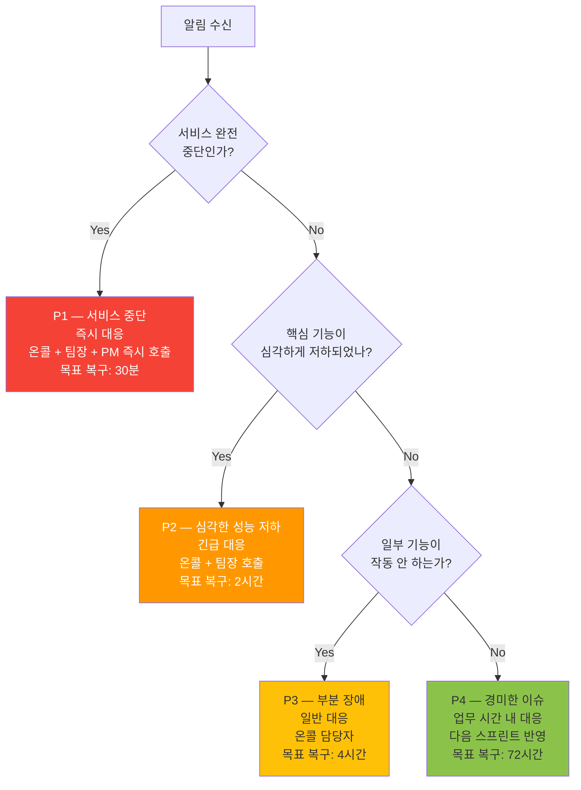
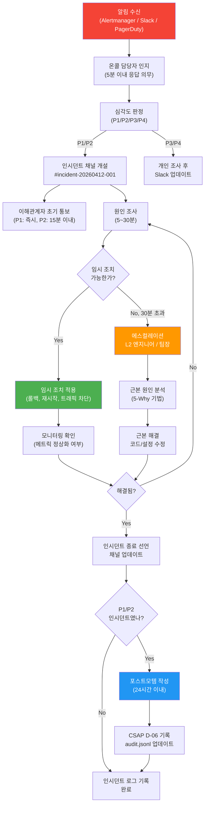
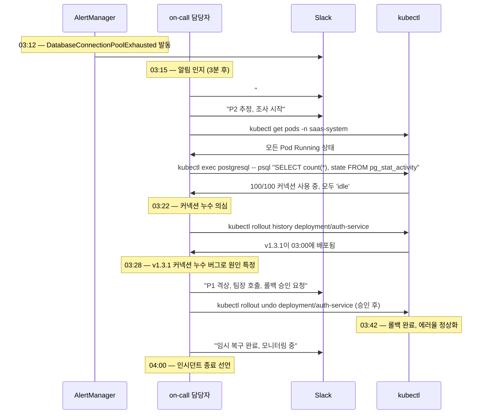

# 인시던트 관리 가이드 — 장애 대응부터 사후 검토까지

> **문서 ID**: ONBOARD-09-TROUBLE-04
> **버전**: 1.0.0 | **작성일**: 2026-04-12 | **작성자**: Implementer (Sonnet)
> **선행 학습**: `03-performance-guide.md` (성능 진단), `../05-monitoring/alerting/02-alert-runbooks.md` (알림 런북)
> **소요 시간**: 약 90분 (숙지) — 장애 발생 시 즉시 참조용으로도 활용
> **CSAP**: D-06 (침해사고 관리 — 탐지·분석·처리·복구·재발방지), D-10 (서비스 가용성)
> **Design Ref**: MTU-N178 §3 (SLO 에스컬레이션), MTU-N57 Design §3 (알림 관리)

---

## 목차

1. [인시던트 정의와 심각도 분류](#1-인시던트-정의와-심각도-분류)
   - 1.1 [인시던트란 무엇인가](#11-인시던트란-무엇인가)
   - 1.2 [심각도 분류 기준 P1~P4](#12-심각도-분류-기준-p1p4)
   - 1.3 [이 프로젝트의 인시던트 선언 기준](#13-이-프로젝트의-인시던트-선언-기준)
   - 1.4 [SLO 에스컬레이션과의 연계](#14-slo-에스컬레이션과의-연계)
2. [인시던트 대응 절차 개요](#2-인시던트-대응-절차-개요)
3. [단계별 행동 가이드](#3-단계별-행동-가이드)
   - 3.1 [0~5분: 인지 및 심각도 판정](#31-05분-인지-및-심각도-판정)
   - 3.2 [5~30분: 원인 좁히기](#32-530분-원인-좁히기)
   - 3.3 [30~60분: 임시 조치 적용](#3360분-임시-조치-적용)
   - 3.4 [1시간 이상: 에스컬레이션과 장기 대응](#34-1시간-이상-에스컬레이션과-장기-대응)
4. [커뮤니케이션 가이드](#4-커뮤니케이션-가이드)
   - 4.1 [인시던트 채널 운영](#41-인시던트-채널-운영)
   - 4.2 [이해관계자 업데이트 방법](#42-이해관계자-업데이트-방법)
   - 4.3 [상태 페이지 업데이트](#43-상태-페이지-업데이트)
5. [사후 검토 (Post-mortem)](#5-사후-검토-post-mortem)
   - 5.1 [비비난(Blameless) 문화](#51-비비난blameless-문화)
   - 5.2 [사후 검토 문서 템플릿](#52-사후-검토-문서-템플릿)
   - 5.3 [CSAP D-06 인시던트 기록 요건](#53-csap-d-06-인시던트-기록-요건)
6. [실전 시나리오 — DB 커넥션 풀 고갈](#6-실전-시나리오--db-커넥션-풀-고갈)
7. [학습 체크리스트](#7-학습-체크리스트)
8. [다음 단계](#8-다음-단계)

---

## 1. 인시던트 정의와 심각도 분류

### 1.1 인시던트란 무엇인가

인시던트(Incident)는 **서비스의 정상적인 운영이 중단되거나 저하된 상태**를 말합니다. 모든 알림이 인시던트는 아닙니다. 인시던트는 사용자 또는 비즈니스에 실제 영향이 있을 때 선언합니다.

```
알림(Alert)과 인시던트(Incident)의 차이:

  알림: "CPU 사용률이 70%를 넘었습니다"
     → 조사 필요, 하지만 즉각적 서비스 영향 없을 수도 있음

  인시던트: "공공기관 포털 로그인이 전혀 되지 않습니다"
     → 사용자에게 직접 영향, 즉시 대응 필요
```

#### 공공기관 SaaS에서 인시던트가 더 중요한 이유

공공기관 SaaS는 **국민과 공무원의 업무에 직결**됩니다. 일반 서비스의 장애는 불편함이지만, 공공기관 SaaS의 장애는 다음과 같은 결과를 초래합니다.

```
공공기관 SaaS 장애의 영향:
  · 전자결재 불가 → 행정 업무 마비
  · 민원 신청 불가 → 국민 불편
  · 감사 로그 누락 → CSAP D-06 위반 (법적 의무 불이행)
  · 개인정보 노출 → PIPA 위반 가능성
```

### 1.2 심각도 분류 기준 P1~P4



| 심각도 | 정의 | 예시 | 대응 목표 | 에스컬레이션 |
|--------|------|------|----------|------------|
| **P1** | 전체 서비스 중단. 사용자 0명이 서비스를 이용할 수 없음 | 로그인 전체 불가, API 100% 오류, DB 완전 다운 | 30분 이내 복구 | 온콜 + 팀장 + PM 즉시 |
| **P2** | 핵심 기능 심각 저하. 대다수 사용자 영향 | 에러율 > 10%, P99 레이턴시 > 10초, 감사 로그 공백 > 30분 | 2시간 이내 복구 | 온콜 + 팀장 |
| **P3** | 일부 기능 장애. 일부 사용자 영향 | 특정 API 오류, 일부 테넌트 접근 불가, 대시보드 표시 오류 | 4시간 이내 복구 | 온콜 담당자 |
| **P4** | 경미한 이슈. 사용자 영향 없거나 미미함 | 경고 알림, 로그 형식 오류, 미사용 기능 버그 | 72시간 이내 처리 | 업무 시간 내 Slack |

### 1.3 이 프로젝트의 인시던트 선언 기준

다음 조건 중 하나라도 충족하면 인시던트를 선언합니다.

```
P1 선언 조건 (즉시):
  [ ] api-gateway 전체 응답 불가 (5분 이상)
  [ ] 모든 사용자 로그인 불가
  [ ] PostgreSQL 완전 다운 (기록 불가)
  [ ] 감사 로그 기록 완전 중단 (CSAP D-06 위반)

P2 선언 조건 (5분 이내):
  [ ] HTTP 5xx 에러율 > 10% (5분 유지)
  [ ] P99 레이턴시 > 5초 (10분 유지)
  [ ] DB 커넥션 풀 고갈 (연결 대기 > 30초)
  [ ] 특정 네임스페이스의 Pod 전체 재시작 중
  [ ] SLO 에러 버짓 소진율 > 90%

P3 선언 조건 (30분 이내):
  [ ] 특정 API 엔드포인트 에러율 > 5%
  [ ] 일부 테넌트 접근 불가
  [ ] Grafana 대시보드 데이터 없음 (모니터링 장애)
  [ ] AI 서비스 응답 불가 (메인 서비스는 정상)
```

### 1.4 SLO 에스컬레이션과의 연계

이 프로젝트의 `packages/slo-escalation/src/escalation-controller.ts`는 에러 버짓 소진율을 자동으로 계산하여 에스컬레이션합니다.

```typescript
// packages/slo-escalation/src/escalation-controller.ts에서 발췌
// Plan SC: FR-SLO.1

export enum EscalationLevel {
  Normal = 'normal',      // 버짓 50% 이하 소진
  Warning = 'warning',    // 버짓 50~75% 소진
  Danger = 'danger',      // 버짓 75~90% 소진
  Critical = 'critical',  // 버짓 90~100% 소진
  Violated = 'violated',  // 버짓 100% 초과 — SLO 위반
}

// FR-SLO.1: 에러 버짓 소진율 기반 에스컬레이션 단계 판정
export function determineEscalationLevel(budgetBurnRate: number): EscalationLevel {
  if (budgetBurnRate <= 50) return EscalationLevel.Normal;
  if (budgetBurnRate <= 75) return EscalationLevel.Warning;
  if (budgetBurnRate <= 90) return EscalationLevel.Danger;
  if (budgetBurnRate <= 100) return EscalationLevel.Critical;
  return EscalationLevel.Violated;  // → 인시던트 P1 선언 트리거
}
```

```
SLO 에스컬레이션 → 인시던트 심각도 매핑:

  Normal (버짓 50% 이하)  → 인시던트 없음
  Warning (50~75%)        → P4 검토
  Danger (75~90%)         → P3 선언
  Critical (90~100%)      → P2 선언
  Violated (100% 초과)    → P1 선언
```

---

## 2. 인시던트 대응 절차 개요



---

## 3. 단계별 행동 가이드

### 3.1 0~5분: 인지 및 심각도 판정

처음 5분은 **패닉 없이 정보를 수집**하는 시간입니다. 지금 당장 고치려고 하지 마십시오.

#### 즉시 실행할 명령어 (복사해서 바로 실행)

```bash
# ── 1. 전체 클러스터 상태 한눈에 확인 ──
kubectl get nodes && echo "---" && \
kubectl get pods -n saas-system --field-selector=status.phase!=Running && \
kubectl get pods -n monitoring --field-selector=status.phase!=Running

# ── 2. 최근 이벤트 확인 (무슨 일이 있었는지) ──
kubectl get events -n saas-system --sort-by='.lastTimestamp' | tail -20

# ── 3. 핵심 서비스 상태 확인 ──
kubectl get pods -n saas-system -l app=api-gateway
kubectl get pods -n saas-system -l app=auth-service
kubectl get pods -n saas-system -l app=postgresql

# ── 4. 에러율 즉시 확인 (PromQL) ──
# Grafana 또는 Prometheus UI에서 실행:
# sum(rate(http_requests_total{status=~"5.."}[5m])) / sum(rate(http_requests_total[5m])) * 100
```

#### 심각도 판정 체크리스트 (5분 이내 완료)

```
[ ] Pod가 Running이 아닌 것이 있는가? → 있으면 P2 이상 의심
[ ] 에러율이 5% 이상인가?             → Yes면 P2 이상
[ ] 에러율이 50% 이상인가?            → Yes면 P1 가능성
[ ] 로그인 자체가 불가한가?           → Yes면 P1
[ ] DB/Redis Pod 상태가 정상인가?     → No면 P1 가능성
[ ] 최근 30분 내 배포가 있었는가?     → Yes면 배포 연관 의심
```

#### 즉시 Slack에 인지 메시지 보내기

```
[인시던트 인지] 2026-04-12 03:15 KST

알림: DatabaseConnectionPoolExhausted
담당자: @on-call-engineer
현황 파악 중...
심각도 판정 후 업데이트 예정 (5분 이내)
```

### 3.2 5~30분: 원인 좁히기

심각도를 판정했다면 이제 **어디서 왜 문제가 발생했는지** 찾습니다.

#### 진단 흐름도

```
의심 원인 목록 작성
       ↓
가장 가능성 높은 원인부터 검증 (3가지 이상은 금지 — 시간 낭비)
       ↓
증거 수집 (로그, 메트릭, 이벤트)
       ↓
원인 특정 또는 다음 가설로 이동
```

#### 원인 유형별 진단 명령어

```bash
# ── A. 최근 배포 연관 확인 ──
# 지난 1시간 내 Deployment 변경 이력
kubectl rollout history deployment -n saas-system | head -30
# Flux GitOps 최근 이벤트
kubectl get helmrelease -n saas-system -o wide
kubectl describe helmrelease auth-service -n saas-system | grep "Last Attempted"

# ── B. DB/Redis 연결 문제 확인 ──
# PostgreSQL Pod 상태
kubectl get pod -n saas-system -l app=postgresql -o wide
# PostgreSQL 연결 수 확인
kubectl exec -n saas-system deployment/postgresql -- \
  psql -U postgres -c "SELECT count(*), state FROM pg_stat_activity GROUP BY state;"
# 연결 대기 중인 쿼리 확인
kubectl exec -n saas-system deployment/postgresql -- \
  psql -U postgres -c "SELECT pid, wait_event_type, wait_event, query FROM pg_stat_activity WHERE wait_event IS NOT NULL LIMIT 10;"

# ── C. 메모리/CPU 리소스 부족 확인 ──
kubectl top pods -n saas-system --sort-by=memory | head -10
kubectl top nodes
# OOMKilled 이벤트 확인
kubectl get events -n saas-system | grep OOMKilled

# ── D. 네트워크/메시 문제 확인 ──
linkerd check --proxy -n saas-system 2>&1 | grep -v "✓"
linkerd viz stat deployments -n saas-system | grep -v "100.00%"

# ── E. 외부 의존성 확인 ──
# AI API 연결 상태 (ai-service)
kubectl logs -n saas-system deployment/ai-service --tail=50 | grep -i "error\|timeout\|refused"
# Cert-manager 인증서 상태
kubectl get certificate -n saas-system | grep -v True
```

#### 로그 분석 패턴

```bash
# 가장 많이 나오는 에러 메시지 Top 10
kubectl logs -n saas-system deployment/api-gateway --tail=1000 --since=30m | \
  grep -i "error\|exception\|fatal\|panic" | \
  sort | uniq -c | sort -rn | head -10

# 특정 시간대 로그 추출 (인시던트 시작 시각 전후)
kubectl logs -n saas-system deployment/auth-service \
  --since-time="2026-04-12T03:00:00Z" \
  --until-time="2026-04-12T03:30:00Z" | \
  grep -i error

# 다중 Pod 로그 동시 확인 (stern 사용)
stern -n saas-system -l app=api-gateway --since 30m | grep -i error
```

#### 원인 특정 후 기록

```bash
# Slack 인시던트 채널에 원인 업데이트
[원인 특정] 2026-04-12 03:28 KST

원인: PostgreSQL 커넥션 풀 고갈
      최대 연결 수: 100, 현재 사용: 100/100
      원인: auth-service의 커넥션 누수 (v1.3.1 배포 후 시작됨)
심각도: P2 → P1 격상 (전체 로그인 불가 확인됨)

임시 조치 검토 중...
```

### 3.3 30~60분: 임시 조치 적용

원인을 찾았다면 **완벽한 해결보다 빠른 서비스 복구**를 우선합니다. 임시 조치(workaround)가 먼저입니다.

#### 상황별 임시 조치 메뉴얼

```bash
# ── 임시 조치 A: 최근 배포 롤백 (가장 빠른 방법) ──
# 배포 전 버전 확인
kubectl rollout history deployment/auth-service -n saas-system
# REVISION  CHANGE-CAUSE
# 1         Initial deployment (v1.2.3)
# 2         v1.3.0 release
# 3         v1.3.1 release ← 현재 (문제 발생)

# 이전 버전으로 즉시 롤백
kubectl rollout undo deployment/auth-service -n saas-system
# 또는 특정 리비전으로 롤백
kubectl rollout undo deployment/auth-service -n saas-system --to-revision=2

# 롤백 진행 상황 확인
kubectl rollout status deployment/auth-service -n saas-system

# ── 임시 조치 B: DB 커넥션 풀 고갈 → 관련 Pod 재시작 ──
# 1단계: 영향 받는 Pod 확인
kubectl get pods -n saas-system -l app=auth-service

# 2단계: 강제 재시작 (커넥션 누수 초기화)
kubectl rollout restart deployment/auth-service -n saas-system

# 3단계: 재시작 완료 확인
kubectl rollout status deployment/auth-service -n saas-system

# ── 임시 조치 C: 특정 서비스로 트래픽 차단 (격리) ──
# api-gateway에서 문제 서비스로의 라우팅 일시 중단
kubectl annotate ingress -n saas-system auth-ingress \
  nginx.ingress.kubernetes.io/server-snippet="return 503;"
# 사용자에게 "점검 중" 페이지 표시

# ── 임시 조치 D: 스케일 업으로 부하 분산 ──
# 즉시 Pod 수 증가
kubectl scale deployment/auth-service -n saas-system --replicas=5
kubectl rollout status deployment/auth-service -n saas-system

# ── 임시 조치 E: PostgreSQL 연결 강제 종료 (마지막 수단) ──
# ⚠️ 팀장 승인 필수 — 진행 중인 트랜잭션 강제 종료
kubectl exec -n saas-system deployment/postgresql -- \
  psql -U postgres -c "SELECT pg_terminate_backend(pid) FROM pg_stat_activity WHERE state = 'idle' AND state_change < NOW() - INTERVAL '5 minutes';"
```

#### CSAP D-06: 임시 조치 감사 로그 기록

```typescript
// 임시 조치 적용 시 반드시 감사 로그 기록
// CSAP D-06 요건: 모든 민감 작업 전수 기록
import { auditLog } from '@/lib/audit'

await auditLog({
  actor: 'on-call-engineer:kim-oncall',
  action: 'INCIDENT_MITIGATION',
  target: 'auth-service:deployment:rollback',
  details: 'P1 인시던트 대응 — DB 커넥션 풀 고갈로 인한 롤백 (v1.3.1 → v1.3.0)',
  incidentId: 'INC-20260412-001',
  timestamp: new Date().toISOString(),
  csapControl: 'D-06',
})
```

#### 임시 조치 후 모니터링

```bash
# 조치 후 5분간 메트릭 확인 (Prometheus)
# 에러율 감소 확인
# sum(rate(http_requests_total{status=~"5.."}[2m])) / sum(rate(http_requests_total[2m])) * 100

# DB 커넥션 정상화 확인
kubectl exec -n saas-system deployment/postgresql -- \
  psql -U postgres -c "SELECT count(*) FROM pg_stat_activity WHERE state = 'active';"

# Pod 상태 확인
watch kubectl get pods -n saas-system
```

### 3.4 1시간 이상: 에스컬레이션과 장기 대응

1시간이 지나도 해결되지 않으면 에스컬레이션 합니다. 혼자 고집하지 마십시오.

```
에스컬레이션 기준:
  · 30분 이상 원인을 찾지 못한 경우
  · 임시 조치를 적용했지만 효과 없는 경우
  · 혼자 결정하기 어려운 조치(DB 강제 종료, 서비스 완전 중단 등)가 필요한 경우
  · P1 인시던트의 경우 처음부터 팀장 포함
```

```bash
# 에스컬레이션 시 공유할 정보 수집 스크립트
#!/bin/bash
echo "=== 인시던트 브리핑 자료 $(date) ==="
echo ""
echo "--- Pod 상태 ---"
kubectl get pods -n saas-system
echo ""
echo "--- 최근 이벤트 (30분) ---"
kubectl get events -n saas-system --sort-by='.lastTimestamp' | \
  awk -v d="$(date -d '30 minutes ago' +%Y-%m-%dT%H:%M:%SZ)" '$0 > d' | tail -20
echo ""
echo "--- 리소스 사용 ---"
kubectl top pods -n saas-system --sort-by=memory | head -10
echo ""
echo "--- 로그 에러 Top 5 ---"
kubectl logs -n saas-system deployment/api-gateway --since=1h | \
  grep -i "error\|fatal" | sort | uniq -c | sort -rn | head -5
```

---

## 4. 커뮤니케이션 가이드

인시던트 대응에서 기술적 해결만큼 중요한 것이 커뮤니케이션입니다. 이해관계자는 **언제나 현재 상황을 알고 싶어 합니다.**

### 4.1 인시던트 채널 운영

P1/P2 인시던트 발생 즉시 전용 채널을 개설합니다.

```
채널 이름 형식: #incident-{YYYY-MM-DD}-{순번}
예시: #incident-2026-04-12-001

채널 초대 대상:
  P1: 온콜 담당자 + 팀장 + PM + 보안 담당자
  P2: 온콜 담당자 + 팀장
  P3: 온콜 담당자

채널 운영 원칙:
  · 기술적 대화와 업데이트 메시지를 스레드로 구분
  · 매 15분마다 상태 업데이트 (P1), 30분마다 (P2)
  · 해결 후 채널을 닫지 말고 읽기 전용으로 보관 (사후 참조)
```

#### 인시던트 채널 메시지 형식

```
[초기 선언] 03:15 KST
━━━━━━━━━━━━━━━━━━━━━━━━━━━━
🔴 인시던트 선언: INC-20260412-001
심각도: P1 (서비스 중단)
현상: 전체 사용자 로그인 불가
영향: 약 2,400명 (공공기관 포털 전체 사용자)
인시던트 관리자: @kim-oncall
시작 시각: 2026-04-12 03:10 KST (추정)
━━━━━━━━━━━━━━━━━━━━━━━━━━━━

[상황 업데이트 #1] 03:30 KST
━━━━━━━━━━━━━━━━━━━━━━━━━━━━
현황: 원인 조사 중
추정 원인: PostgreSQL 커넥션 풀 고갈 (100/100 사용 중)
임시 조치: auth-service 재시작 진행 중
다음 업데이트: 03:45 KST
━━━━━━━━━━━━━━━━━━━━━━━━━━━━

[임시 해결] 03:42 KST
━━━━━━━━━━━━━━━━━━━━━━━━━━━━
✅ 임시 조치 완료
- auth-service v1.3.1 → v1.3.0 롤백
- 에러율: 98% → 0.2% (정상화)
- 로그인 기능: 복구 확인
서비스 상태: 정상화 (모니터링 중)
근본 원인 분석: 진행 예정
━━━━━━━━━━━━━━━━━━━━━━━━━━━━

[인시던트 종료] 04:00 KST
━━━━━━━━━━━━━━━━━━━━━━━━━━━━
🟢 인시던트 종료
총 영향 시간: 50분 (03:10~04:00 KST)
근본 원인: v1.3.1 커넥션 누수 버그
조치: v1.3.0 롤백 (v1.3.2 핫픽스 준비 중)
포스트모템: 24시간 이내 (담당: @lee-sr-engineer)
CSAP D-06 기록: audit.jsonl 업데이트 완료
━━━━━━━━━━━━━━━━━━━━━━━━━━━━
```

### 4.2 이해관계자에게 상황 업데이트하는 방법

이해관계자(기관 담당자, 상급자)에게는 **기술 용어 없이** 현황을 전달합니다.

```
기술팀 내부 메시지 (상세):
  "PostgreSQL max_connections 100 초과로 인해 커넥션 풀이 고갈되어
   auth-service가 DB 쿼리를 실행할 수 없습니다. auth-service를 재시작하여
   커넥션 누수를 초기화하는 임시 조치를 적용하고 있습니다."

이해관계자 메시지 (비기술):
  "현재 로그인 시스템에 문제가 발생하여 일부 사용자의 접속이 어렵습니다.
   원인을 파악하여 복구 작업 중이며, 10~20분 내 정상화될 예정입니다.
   불편을 드려 죄송합니다."
```

#### 이해관계자 업데이트 빈도

| 심각도 | 초기 통보 | 업데이트 주기 | 종료 보고 |
|--------|---------|------------|---------|
| P1 | 15분 이내 | 15분마다 | 즉시 + 24시간 내 서면 보고 |
| P2 | 30분 이내 | 30분마다 | 즉시 + 업무 시간 내 보고 |
| P3 | 2시간 이내 | 1시간마다 | 해결 후 이메일 |
| P4 | 다음 업무일 | 필요 시 | 완료 시 Slack |

### 4.3 상태 페이지 업데이트

```bash
# 상태 페이지 업데이트 (Statuspage.io 또는 내부 상태 페이지)
# 이 프로젝트는 내부 상태 페이지를 사용

# API를 통한 상태 업데이트 예시
curl -X POST https://status.saas.internal/api/v1/incidents \
  -H "Authorization: Bearer ${STATUSPAGE_API_KEY}" \
  -H "Content-Type: application/json" \
  -d '{
    "name": "로그인 서비스 장애",
    "status": "investigating",
    "impact": "critical",
    "body": "로그인 서비스에 일시적인 문제가 발생하여 조사 중입니다."
  }'

# 해결 후 상태 업데이트
curl -X PATCH https://status.saas.internal/api/v1/incidents/INC-001 \
  -H "Authorization: Bearer ${STATUSPAGE_API_KEY}" \
  -d '{"status": "resolved", "body": "문제가 해결되었습니다."}'
```

---

## 5. 사후 검토 (Post-mortem)

### 5.1 비비난(Blameless) 문화

사후 검토에서 가장 중요한 원칙은 **사람을 탓하지 않는다**는 것입니다.

```
❌ 비난 문화 (하지 말아야 할 것):
  "개발자 A가 테스트를 제대로 안 해서 배포했다"
  "on-call 담당자가 늦게 응답했다"
  "팀장이 검토를 안 해서 이런 버그가 들어갔다"

✅ 비비난 문화 (해야 할 것):
  "v1.3.1 배포 전 커넥션 풀 부하 테스트 항목이 CI 파이프라인에 없었다"
  "on-call 응답 시간이 5분을 초과할 수 있는 알림 설정 문제가 있었다"
  "PR 리뷰 체크리스트에 DB 커넥션 관련 코드 변경 점검 항목이 없었다"
```

비비난 문화가 중요한 이유:
- 사람을 탓하면 재발 방지가 아니라 누구를 징계할지에 에너지를 씁니다.
- 엔지니어가 실수를 숨기게 되어 더 큰 문제로 발전합니다.
- 시스템 개선이 아닌 개인 행동 교정에 집중하면 같은 문제가 반복됩니다.

### 5.2 사후 검토 문서 템플릿

```markdown
# 사후 검토 — INC-20260412-001

**인시던트 ID**: INC-20260412-001
**심각도**: P1 (서비스 중단)
**작성자**: @lee-sr-engineer
**검토 완료일**: 2026-04-13 14:00 KST (인시던트 후 36시간)
**CSAP 관련**: D-06 침해사고 관리 기록

---

## 1. 요약 (Executive Summary)

| 항목 | 내용 |
|------|------|
| 발생 시각 | 2026-04-12 03:10 KST |
| 탐지 시각 | 2026-04-12 03:12 KST (+2분) |
| 대응 시작 | 2026-04-12 03:15 KST (+5분) |
| 임시 복구 | 2026-04-12 03:42 KST (+32분) |
| 완전 복구 | 2026-04-12 04:00 KST (+50분) |
| 총 영향 시간 | 50분 |
| 영향 사용자 | 약 2,400명 (전체) |
| SLO 영향 | 에러 버짓 23% 소진 (이달 남은 버짓: 77%) |

---

## 2. 타임라인

| 시각 | 이벤트 |
|------|--------|
| 03:00 | auth-service v1.3.1 배포 완료 (CI/CD 자동 배포) |
| 03:10 | DB 커넥션 풀 100% 도달, 신규 요청 대기 시작 |
| 03:10 | 에러율 급등 시작 (5% → 40% → 98%) |
| 03:12 | AlertManager: DatabaseConnectionPoolExhausted 알림 발생 |
| 03:12 | Slack #on-call 알림 수신 |
| 03:15 | on-call 담당자 @kim-oncall 인지, #incident-2026-04-12-001 채널 개설 |
| 03:18 | kubectl 확인: auth-service Pod 정상, DB Pod 정상 |
| 03:22 | DB 커넥션 상태 확인: 100/100 사용 중, 모두 'idle' 상태 |
| 03:28 | 원인 특정: auth-service v1.3.1의 커넥션 누수 버그 (PR #1234) |
| 03:32 | P1 선언, 팀장 @park-teamlead 및 PM 호출 |
| 03:38 | 롤백 결정 승인 (팀장 승인) |
| 03:39 | kubectl rollout undo deployment/auth-service 실행 |
| 03:42 | 롤백 완료, 에러율 0.2%로 정상화 |
| 04:00 | 15분간 모니터링 후 인시던트 종료 선언 |

---

## 3. 근본 원인 분석 (5-Why)

**Why 1: 왜 전체 로그인이 불가했는가?**
→ auth-service가 DB 쿼리를 실행할 수 없었기 때문

**Why 2: 왜 auth-service가 DB 쿼리를 실행할 수 없었는가?**
→ PostgreSQL 커넥션 풀이 100% 고갈되어 신규 커넥션 획득 불가

**Why 3: 왜 커넥션 풀이 고갈되었는가?**
→ auth-service v1.3.1의 새 코드에서 트랜잭션 예외 처리 누락으로
  예외 발생 시 커넥션이 반환되지 않고 누수됨

**Why 4: 왜 커넥션 누수 버그가 배포되었는가?**
→ PR #1234 리뷰에서 트랜잭션 처리 패턴 변경을 식별하지 못했고,
  CI 파이프라인에 커넥션 누수 테스트 케이스가 없었음

**Why 5: 왜 CI 파이프라인에 커넥션 누수 테스트가 없었는가?**
→ 커넥션 풀 관련 통합 테스트 자동화가 기술 부채로 남아있었음
  (MTU 백로그 TECH-DEBT-007, 3개월째 미해결)

**근본 원인 요약**:
CI 파이프라인의 DB 커넥션 누수 탐지 테스트 부재로 인해 누수 버그가 프로덕션에 배포됨.

---

## 4. 영향 범위

- **사용자 영향**: 2,400명 로그인 불가 (50분)
- **데이터 손실**: 없음 (DB는 정상 동작, 읽기/쓰기 모두 정상)
- **감사 로그 공백**: 03:10~03:42 (32분) — CSAP D-06 위반 없음 (audit-service는 별도 연결 사용)
- **SLO 영향**: 월간 가용성 99.9% 목표 대비 에러 버짓 23% 소진

---

## 5. 재발 방지 조치 (Action Items)

| 번호 | 조치 | 담당자 | 기한 | 우선순위 |
|------|------|--------|------|---------|
| A-01 | CI에 DB 커넥션 누수 탐지 통합 테스트 추가 | @choi-dev | 2026-04-19 | 높음 |
| A-02 | PR 리뷰 체크리스트에 트랜잭션 처리 패턴 점검 항목 추가 | @park-teamlead | 2026-04-15 | 높음 |
| A-03 | auth-service PrismaClient 커넥션 풀 모니터링 메트릭 추가 | @choi-dev | 2026-04-17 | 중간 |
| A-04 | DB 커넥션 수 Prometheus 알림 추가 (80% 경고, 95% 긴급) | @kim-sre | 2026-04-16 | 높음 |
| A-05 | 기술 부채 MTU-TECH-DEBT-007 이번 스프린트 처리 | @lee-sr | 2026-04-30 | 중간 |

---

## 6. 잘 된 것들 (What Went Well)

- 알림 발생 3분 만에 on-call 담당자가 인지 (목표: 5분)
- 원인 특정까지 16분 소요 (목표: 30분)
- 롤백 결정부터 완료까지 7분 (빠른 대응)
- 인시던트 채널 운영으로 팀 전체가 실시간으로 상황 공유
- CSAP D-06 감사 로그 공백 없이 대응 완료

---

## 7. 개선할 것들 (What Could Be Better)

- on-call 담당자가 30분 동안 혼자 대응 (팀장 호출이 늦었음)
- 이해관계자에게 첫 통보가 25분 소요 (목표: 15분)
- PR #1234 리뷰에서 트랜잭션 패턴 변경을 놓침
```

### 5.3 CSAP D-06 인시던트 기록 요건

CSAP D-06(침해사고 관리)은 모든 보안 및 가용성 인시던트를 기록·보존해야 합니다.

```typescript
// CSAP D-06 인시던트 기록 — platform/services/compliance-service/src/lib/audit.ts
import { auditLog } from '@/lib/audit'

// 인시던트 선언 시 기록
await auditLog({
  actor: 'on-call-engineer:kim-oncall',
  action: 'INCIDENT_DECLARED',
  target: 'INC-20260412-001',
  details: JSON.stringify({
    severity: 'P1',
    affectedService: 'auth-service',
    affectedUsers: 2400,
    csapControl: 'D-06',
    symptoms: 'DB connection pool exhausted — login unavailable',
    declaredAt: '2026-04-12T03:15:00+09:00',
  }),
  timestamp: new Date().toISOString(),
  csapControl: 'D-06',
})

// 인시던트 종료 시 기록
await auditLog({
  actor: 'on-call-engineer:kim-oncall',
  action: 'INCIDENT_RESOLVED',
  target: 'INC-20260412-001',
  details: JSON.stringify({
    severity: 'P1',
    resolution: 'Rollback to v1.3.0',
    totalImpactMinutes: 50,
    sloImpact: '23% error budget consumed',
    resolvedAt: '2026-04-12T04:00:00+09:00',
    postmortemDue: '2026-04-13T14:00:00+09:00',
  }),
  timestamp: new Date().toISOString(),
  csapControl: 'D-06',
})
```

```bash
# CSAP D-06 요건: 인시던트 기록 조회 (감리 대비)
# 지난 1년간 인시던트 기록 확인
grep '"action":"INCIDENT_DECLARED"\|"action":"INCIDENT_RESOLVED"' \
  .claude/audit.jsonl | \
  python3 -c "
import sys, json
for line in sys.stdin:
    data = json.loads(line)
    print(f'{data[\"timestamp\"]} | {data[\"action\"]} | {data[\"target\"]}')
"
```

---

## 6. 실전 시나리오 — DB 커넥션 풀 고갈로 전체 서비스 응답 불가

이 시나리오는 `02-alert-runbooks.md`의 런북 #05 `DatabaseConnectionPoolExhausted`에 연계된 실전 대응입니다.



#### 단계별 실행 명령어 (시나리오 재현)

```bash
# ━━ 03:15 — 인지 직후 실행 ━━

# 전체 상태 파악
kubectl get pods -n saas-system
kubectl get events -n saas-system --sort-by='.lastTimestamp' | tail -10

# ━━ 03:18 — DB 커넥션 진단 ━━

# PostgreSQL 커넥션 상태 상세 조회
kubectl exec -n saas-system \
  $(kubectl get pod -n saas-system -l app=postgresql -o jsonpath='{.items[0].metadata.name}') \
  -- psql -U postgres -c "
SELECT
  state,
  count(*) as count,
  min(state_change) as oldest,
  max(state_change) as newest
FROM pg_stat_activity
WHERE pid != pg_backend_pid()
GROUP BY state
ORDER BY count DESC;
"
# state  | count | oldest              | newest
# idle   | 100   | 2026-04-12 03:10   | 2026-04-12 03:15

# 커넥션을 가장 많이 점유한 애플리케이션 확인
kubectl exec -n saas-system \
  $(kubectl get pod -n saas-system -l app=postgresql -o jsonpath='{.items[0].metadata.name}') \
  -- psql -U postgres -c "
SELECT application_name, count(*) as connections
FROM pg_stat_activity
GROUP BY application_name
ORDER BY connections DESC;
"
# application_name | connections
# auth-service      | 100   ← auth-service가 전부 점유

# ━━ 03:22 — 배포 이력 확인 ━━

kubectl rollout history deployment/auth-service -n saas-system
# REVISION  CHANGE-CAUSE
# 1         v1.2.3
# 2         v1.3.0
# 3         v1.3.1  ← 03:00에 배포됨

# 해당 버전의 소스코드에서 트랜잭션 처리 확인
kubectl describe deployment/auth-service -n saas-system | grep Image
# auth-service:v1.3.1

# ━━ 03:38 — 롤백 실행 (팀장 승인 후) ━━

# CSAP D-06 감사 기록 먼저
echo '{
  "actor": "kim-oncall",
  "action": "INCIDENT_MITIGATION",
  "target": "auth-service:rollback",
  "details": "P1 대응 — v1.3.1 → v1.3.0 롤백 (커넥션 누수)",
  "timestamp": "'$(date -u +%Y-%m-%dT%H:%M:%SZ)'"
}' >> .claude/audit.jsonl

# 롤백 실행
kubectl rollout undo deployment/auth-service -n saas-system

# 롤백 완료 대기
kubectl rollout status deployment/auth-service -n saas-system --timeout=5m

# ━━ 03:42 — 복구 확인 ━━

# 에러율 확인 (Prometheus)
# sum(rate(http_requests_total{status=~"5.."}[2m])) / sum(rate(http_requests_total[2m])) * 100
# → 0.2% (정상화)

# DB 커넥션 정상화 확인
kubectl exec -n saas-system \
  $(kubectl get pod -n saas-system -l app=postgresql -o jsonpath='{.items[0].metadata.name}') \
  -- psql -U postgres -c "SELECT count(*) FROM pg_stat_activity WHERE state != 'idle';"
# count
# -------
#     12   ← 정상 범위 (이전: 100)

# ━━ 04:00 — 인시던트 종료 ━━

# 15분간 에러율 모니터링 후 종료 선언
watch -n 30 'kubectl top pods -n saas-system | grep auth-service'
```

#### 커넥션 누수 방지를 위한 코드 개선 (근본 해결)

```typescript
// ❌ v1.3.1의 버그 코드 — 예외 발생 시 커넥션 반환 안 됨
// platform/services/auth-service/src/lib/auth.ts
async function loginUser(email: string, password: string) {
  const prisma = new PrismaClient()  // 새 커넥션 획득
  try {
    const user = await prisma.user.findFirst({ where: { email } })
    if (!user) {
      throw new Error('User not found')  // ← 예외 시 finally 없어서 커넥션 누수!
    }
    return user
  } catch (error) {
    throw error  // prisma.$disconnect() 없이 throw
  }
}

// ✅ v1.3.2 수정 코드 — 반드시 finally에서 커넥션 반환
// Design Ref: D-12 시스템 개발 보안 (리소스 관리)
async function loginUser(email: string, password: string) {
  const prisma = new PrismaClient()
  try {
    const user = await prisma.user.findFirst({ where: { email } })
    if (!user) {
      throw new Error('User not found')
    }
    return user
  } catch (error) {
    throw error
  } finally {
    await prisma.$disconnect()  // ✅ 예외 발생 여부와 관계없이 항상 커넥션 반환
  }
}

// ✅ 더 나은 방법: 싱글톤 PrismaClient 사용 (커넥션 풀 공유)
// platform/services/auth-service/src/lib/prisma.ts
import { PrismaClient } from '@prisma/client'

declare global {
  let prisma: PrismaClient | undefined
}

// 전역 싱글톤 — 애플리케이션 전체에서 하나의 커넥션 풀 공유
export const db = globalThis.prisma ?? new PrismaClient({
  datasources: {
    db: { url: process.env.DATABASE_URL },
  },
  log: ['warn', 'error'],
})

if (process.env.NODE_ENV !== 'production') {
  globalThis.prisma = db
}
```

---

## 7. 학습 체크리스트

### 인시던트 이해

- [ ] 알림(Alert)과 인시던트(Incident)의 차이를 설명할 수 있다
- [ ] P1~P4 심각도 기준과 각 심각도별 대응 목표 시간을 외울 수 있다
- [ ] CSAP D-06이 왜 인시던트 기록 의무를 부과하는지 설명할 수 있다
- [ ] SLO 에스컬레이션 컨트롤러의 `EscalationLevel.Violated`가 P1 선언과 어떻게 연계되는지 설명할 수 있다

### 대응 절차

- [ ] 처음 5분 동안 실행해야 할 kubectl 명령어 3개를 암기한다
- [ ] 원인 좁히기 단계에서 가장 먼저 확인하는 것이 무엇인지 설명할 수 있다
- [ ] `kubectl rollout undo`와 `kubectl rollout history`를 직접 실행해본다
- [ ] 임시 조치와 근본 해결의 차이를 설명할 수 있다

### 커뮤니케이션

- [ ] P1 인시던트 채널 개설 메시지를 직접 작성할 수 있다
- [ ] 이해관계자용 비기술 메시지와 팀 내부 기술 메시지를 구별하여 작성할 수 있다
- [ ] P1 인시던트에서 이해관계자 첫 통보를 몇 분 이내에 해야 하는지 안다

### 사후 검토

- [ ] 비비난(Blameless) 문화의 핵심 원칙을 설명할 수 있다
- [ ] 5-Why 기법으로 DB 커넥션 풀 고갈의 근본 원인을 직접 분석해볼 수 있다
- [ ] 사후 검토 문서의 필수 섹션 7가지를 나열할 수 있다
- [ ] Action Item을 작성할 때 담당자, 기한, 우선순위를 반드시 포함해야 하는 이유를 설명할 수 있다

### 실전 시나리오

- [ ] DB 커넥션 풀 고갈 시 `pg_stat_activity` 쿼리로 상태를 확인할 수 있다
- [ ] 배포 롤백 전에 왜 감사 로그를 먼저 기록해야 하는지 설명할 수 있다
- [ ] Prisma 커넥션 누수 버그를 코드에서 식별하고 수정할 수 있다

---

## 8. 다음 단계

| 주제 | 문서 |
|------|------|
| 알림 런북 전체 목록 | `../05-monitoring/alerting/02-alert-runbooks.md` |
| SLO 에스컬레이션 코드 | `packages/slo-escalation/src/escalation-controller.ts` |
| 성능 진단 가이드 | `03-performance-guide.md` — DB/Redis 병목 분석 |
| 보안 인시던트 대응 | `../05-monitoring/alerting/02-alert-runbooks.md` 런북 #10 |

---

## 변경 이력

| 버전 | 일자 | 내용 | 작성자 |
|------|------|------|--------|
| 1.0.0 | 2026-04-12 | 초안 작성 — 심각도 분류, 대응 절차, 포스트모템, DB 커넥션 시나리오 | Implementer (Sonnet) |
