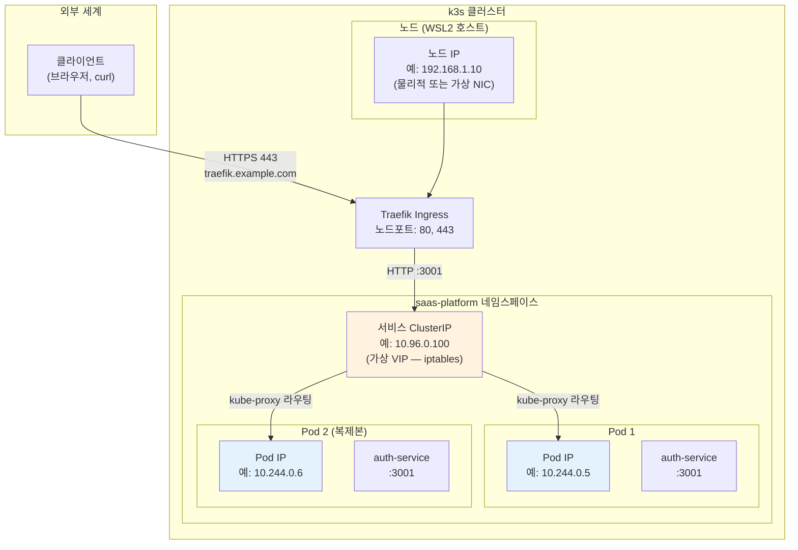
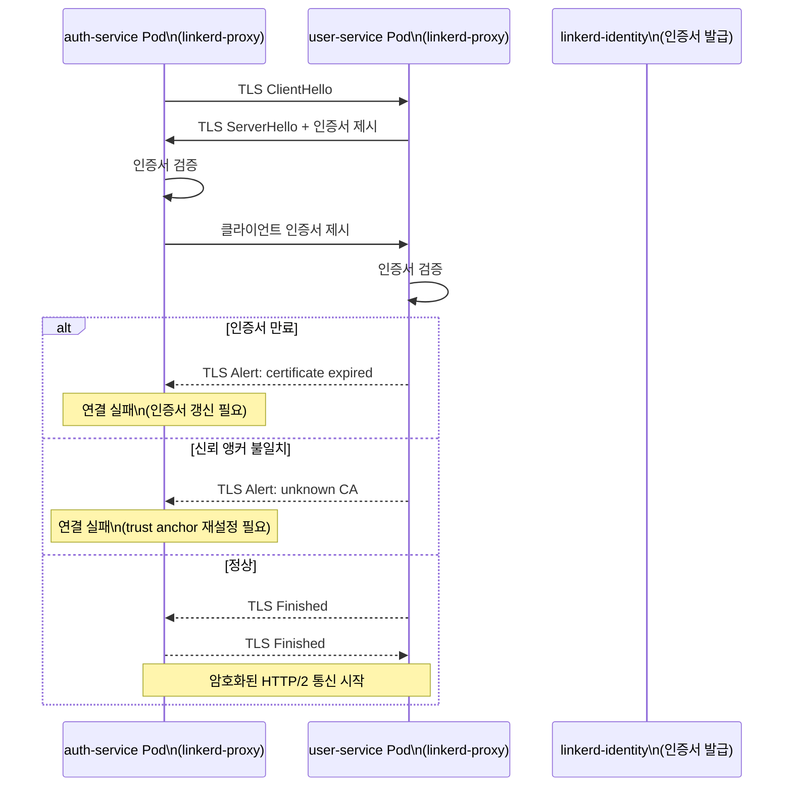
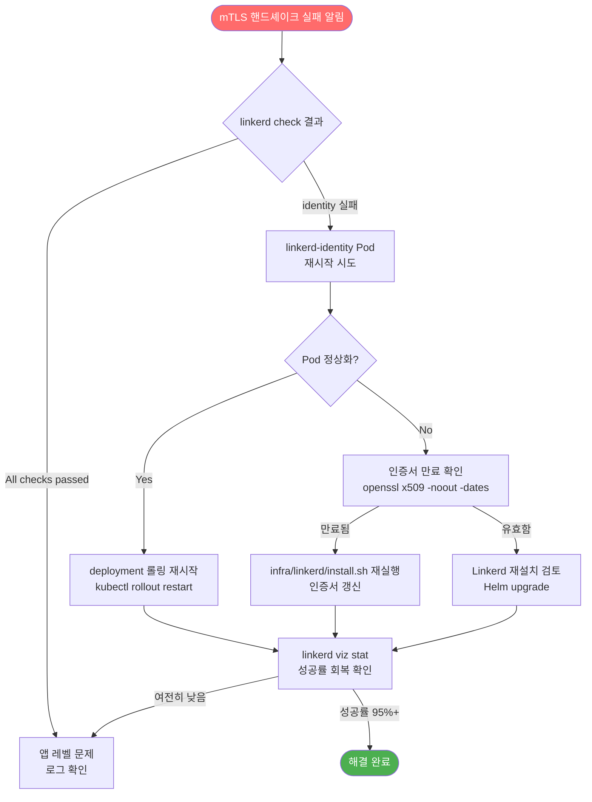

# 네트워크 문제 디버깅 가이드

> **문서 ID**: ONBOARD-09-TROUBLE-05
> **버전**: 1.0.0 | **작성일**: 2026-04-12 | **작성자**: Implementer (Sonnet)
> **대상**: 신규 개발자, DevOps 엔지니어
> **선행 학습**: `04-infrastructure/kubernetes/01-k3s-basics.md`, `04-infrastructure/components/06-linkerd.md`
> **소요 시간**: 약 60분
> **CSAP**: D-08 (접근 통제 — NetworkPolicy), D-09 (전송 암호화 — mTLS)

---

## 목차

1. [Kubernetes 네트워킹 기초 복습](#1-kubernetes-네트워킹-기초-복습)
2. [네트워크 문제 진단 도구](#2-네트워크-문제-진단-도구)
3. [자주 발생하는 네트워크 오류 패턴](#3-자주-발생하는-네트워크-오류-패턴)
4. [NetworkPolicy 디버깅](#4-networkpolicy-디버깅)
5. [Linkerd mTLS 관련 네트워크 이슈](#5-linkerd-mtls-관련-네트워크-이슈)
6. [실전 시나리오 3가지](#6-실전-시나리오-3가지)
7. [학습 체크리스트](#7-학습-체크리스트)
8. [다음 단계](#8-다음-단계)

---

## 1. Kubernetes 네트워킹 기초 복습

### 1.1 세 가지 IP 개념

Kubernetes에서는 IP가 세 종류 존재합니다. 이것을 혼동하면 디버깅에서 헤맵니다.



| IP 유형 | 예시 | 특징 | 직접 접근 |
|--------|------|------|---------|
| **Pod IP** | `10.244.0.5` | Pod 재시작 시 변경 | 클러스터 내부만 가능 |
| **서비스 ClusterIP** | `10.96.0.100` | 고정 가상 IP | 클러스터 내부만 가능 |
| **노드 IP** | `192.168.1.10` | 호스트 IP | 외부에서 접근 가능 |

**실수 방지 규칙**: 서비스 간 통신에는 **항상 서비스 이름**을 사용합니다. Pod IP는 재시작 시 바뀌기 때문에 하드코딩하면 안 됩니다.

### 1.2 DNS 해석 경로

Kubernetes 클러스터 내에서 서비스를 이름으로 찾는 방법입니다.

```
완전한 DNS 이름 (FQDN):
  {서비스명}.{네임스페이스}.svc.cluster.local

예시:
  auth-service.saas-platform.svc.cluster.local  ← 완전한 이름
  auth-service.saas-platform                     ← 짧은 이름 (같은 클러스터)
  auth-service                                   ← 같은 네임스페이스 내에서만 작동
```

```bash
# DNS 해석 테스트
kubectl run dns-test --image=busybox:1.36 --rm -it --restart=Never -- \
  nslookup auth-service.saas-platform.svc.cluster.local

# 정상 응답 예시:
# Server:    10.96.0.10
# Address 1: 10.96.0.10 kube-dns.kube-system.svc.cluster.local
# Name:      auth-service.saas-platform.svc.cluster.local
# Address 1: 10.96.0.100 auth-service.saas-platform.svc.cluster.local
```

### 1.3 Traefik Ingress → Service → Pod 경로

외부에서 들어온 요청이 실제 Pod에 도달하는 전체 경로입니다.

```
[클라이언트] → HTTPS :443 → [Traefik Ingress Controller]
                                      ↓
                           IngressRoute 규칙 매칭
                           (Host: api.example.com, Path: /auth)
                                      ↓
                           [auth-service Service ClusterIP]
                                      ↓
                           kube-proxy → [auth-service Pod]
                                      ↓
                           (Linkerd mTLS 주입된 경우)
                           linkerd-proxy sidecar → 앱 컨테이너
```

---

## 2. 네트워크 문제 진단 도구

### 2.1 DNS 확인

```bash
# 서비스 DNS 해석 확인 (busybox 임시 Pod)
kubectl run debug-dns --image=busybox:1.36 --rm -it --restart=Never -- \
  nslookup auth-service.saas-platform.svc.cluster.local

# 서비스 IP 확인
kubectl get svc auth-service -n saas-platform -o wide
# NAME           TYPE        CLUSTER-IP     EXTERNAL-IP   PORT(S)   AGE
# auth-service   ClusterIP   10.96.0.100    <none>        3001/TCP  10d

# 모든 서비스 목록 확인 (이름 오타 여부 확인)
kubectl get svc -n saas-platform
```

### 2.2 HTTP 연결 확인

```bash
# curl로 서비스 연결 테스트 (curl 임시 Pod)
kubectl run debug-curl --image=curlimages/curl:8.6.0 --rm -it --restart=Never -- \
  curl -v http://auth-service.saas-platform:3001/health

# 정상 응답:
# < HTTP/1.1 200 OK
# {"status":"ok","service":"auth-service"}

# 실패 예시 (connection refused):
# curl: (7) Failed to connect to auth-service.saas-platform port 3001: Connection refused
```

### 2.3 포트 포워딩 (로컬 테스트)

```bash
# 서비스를 로컬 포트로 포워딩 (임시 테스트용)
kubectl port-forward svc/auth-service 3001:3001 -n saas-platform

# 다른 터미널에서
curl http://localhost:3001/health

# Pod 직접 포워딩 (특정 Pod 확인용)
kubectl port-forward pod/auth-service-7d9b4f8c6-xkz2p 3001:3001 -n saas-platform
```

> ⚠️ 포트 포워딩은 디버깅 전용입니다. 실제 트래픽은 항상 Ingress를 통해야 합니다.

### 2.4 네트워크 연결 상태 확인

```bash
# Pod 내에서 netstat (네트워크 소켓 상태)
kubectl exec -n saas-platform deployment/auth-service -- \
  sh -c "ss -tlnp 2>/dev/null || netstat -tlnp 2>/dev/null"

# Pod 내에서 다른 서비스로 연결 테스트
kubectl exec -n saas-platform deployment/auth-service -- \
  sh -c "wget -qO- http://user-service.saas-platform:3002/health"

# Pod 내에서 DNS 확인
kubectl exec -n saas-platform deployment/auth-service -- \
  sh -c "cat /etc/resolv.conf"
# nameserver 10.96.0.10  ← kube-dns 주소
# search saas-platform.svc.cluster.local svc.cluster.local cluster.local
```

### 2.5 kubectl 이벤트 확인 (네트워크 오류 히스토리)

```bash
# 특정 네임스페이스의 최근 이벤트
kubectl get events -n saas-platform --sort-by='.lastTimestamp'

# 특정 Pod의 이벤트만
kubectl describe pod auth-service-7d9b4f8c6-xkz2p -n saas-platform | grep -A 20 "Events:"

# 경고만 필터링
kubectl get events -n saas-platform --field-selector type=Warning
```

---

## 3. 자주 발생하는 네트워크 오류 패턴

### 3.1 `connection refused` — Pod는 있지만 포트 불일치

**증상:**

```bash
curl: (7) Failed to connect to auth-service port 3001: Connection refused
```

**원인 체크리스트:**

```bash
# 1. Pod가 실제로 실행 중인지 확인
kubectl get pods -n saas-platform -l app=auth-service
# STATUS가 Running 이어야 함

# 2. Pod가 해당 포트를 실제로 열었는지 확인
kubectl exec -n saas-platform deployment/auth-service -- \
  ss -tlnp | grep 3001
# tcp   LISTEN  0  128  0.0.0.0:3001  ← 정상
# (아무것도 없으면 앱이 포트를 열지 못한 상태)

# 3. 서비스 targetPort가 앱 포트와 일치하는지 확인
kubectl get svc auth-service -n saas-platform -o yaml | grep -A 5 "ports:"
# ports:
#   - port: 3001         ← 서비스가 노출하는 포트
#     targetPort: 3001   ← Pod 포트 (이것이 앱 실제 포트와 일치해야 함)

# 4. 앱 로그에서 시작 실패 확인
kubectl logs -n saas-platform deployment/auth-service --tail=50 | grep -i "error\|fatal\|listen"
```

**해결 방법:**

```yaml
# ❌ 잘못된 Service 설정: targetPort가 앱 포트와 불일치
spec:
  ports:
    - port: 3001
      targetPort: 8080   # 앱은 3001을 열지만 서비스는 8080으로 연결 시도

# ✅ 올바른 설정
spec:
  ports:
    - port: 3001
      targetPort: 3001   # 앱의 실제 포트와 일치
```

### 3.2 `no such host` — DNS 오류 또는 서비스명 오타

**증상:**

```bash
curl: (6) Could not resolve host: auth-servce.saas-platform
# (오타: auth-servce = auth-service)
```

**원인 체크리스트:**

```bash
# 1. 서비스가 존재하는지 확인 (이름 정확히 확인)
kubectl get svc -n saas-platform | grep auth
# auth-service   ClusterIP   10.96.0.100   <none>   3001/TCP   10d

# 2. kube-dns Pod가 정상인지 확인
kubectl get pods -n kube-system -l k8s-app=kube-dns
# coredns-xxx   1/1   Running   ← 정상

# 3. CoreDNS 로그 확인
kubectl logs -n kube-system -l k8s-app=kube-dns --tail=30

# 4. Pod에서 직접 DNS 해석 테스트
kubectl run dns-test --image=busybox:1.36 --rm -it --restart=Never -- \
  nslookup auth-service.saas-platform

# 5. 서비스 셀렉터가 Pod 레이블과 일치하는지 확인
kubectl get svc auth-service -n saas-platform -o yaml | grep -A 5 "selector:"
# selector:
#   app: auth-service   ← 이 레이블이 Pod에 있어야 함

kubectl get pods -n saas-platform -l app=auth-service
# Pod가 없으면 셀렉터 불일치
```

### 3.3 `connection timeout` — NetworkPolicy 차단 또는 Pod 없음

**증상:**

```bash
curl -m 5 http://auth-service.saas-platform:3001/health
curl: (28) Connection timed out after 5001 milliseconds
```

타임아웃은 연결 자체가 이루어지지 않는 것입니다. `connection refused`(즉시 거부)와 달리 패킷이 도착하지 못하거나 DROP되는 상황입니다.

**원인 체크리스트:**

```bash
# 1. Pod가 실제로 실행 중인지 확인
kubectl get pods -n saas-platform -l app=auth-service
# 결과가 없거나 Pending, CrashLoopBackOff이면 Pod 문제

# 2. Endpoints 확인 (서비스가 Pod를 찾았는지)
kubectl get endpoints auth-service -n saas-platform
# NAME           ENDPOINTS              AGE
# auth-service   10.244.0.5:3001,...   10d    ← 정상
# auth-service   <none>                10d    ← 연결된 Pod 없음

# 3. NetworkPolicy 존재 여부 확인
kubectl get networkpolicy -n saas-platform
kubectl get networkpolicy -A   # 모든 네임스페이스

# 4. 임시로 NetworkPolicy 없이 테스트 (섹션 4 참조)
```

### 3.4 `TLS handshake failure` — 인증서 불일치

**증상:**

```bash
curl: (35) error:0A000086:SSL routines::certificate verify failed
# 또는
curl -k https://...  # -k로 인증서 검증 무시하면 연결됨
```

**원인 체크리스트:**

```bash
# 1. Linkerd mTLS 상태 확인
linkerd check --proxy

# 2. 인증서 만료 확인
linkerd check --pre

# 3. 서비스의 Linkerd 주입 여부 확인
kubectl get pods -n saas-platform -o jsonpath='{.items[*].metadata.annotations.linkerd\.io/proxy-injector-output}'

# 4. 특정 Pod의 mTLS 상태
linkerd viz stat deployment -n saas-platform

# 5. 인증서 체인 확인
step certificate inspect <(kubectl get secret -n linkerd linkerd-identity-issuer -o jsonpath='{.data.crt\.pem}' | base64 -d) --short
```

### 3.5 `503 Service Unavailable` — Traefik이 백엔드 연결 불가

**증상:**

```
HTTP/1.1 503 Service Unavailable
{"message":"Service Unavailable"}
```

이것은 Traefik이 `auth-service`에 연결하지 못할 때 반환하는 응답입니다.

**원인 체크리스트:**

```bash
# 1. Traefik 로그 확인
kubectl logs -n traefik deployment/traefik --tail=50 | grep -i "error\|backend\|upstream"

# 2. IngressRoute 설정 확인
kubectl get ingressroute -n saas-platform -o yaml | grep -A 10 "services:"

# 3. 서비스가 살아있는지 확인
kubectl get svc auth-service -n saas-platform
kubectl get endpoints auth-service -n saas-platform

# 4. Traefik Health Check 설정 확인
kubectl get ingressroute -n saas-platform -o yaml | grep -A 5 "healthCheck"
# /health 엔드포인트가 200을 반환해야 함

# 5. 서비스 /health 직접 확인
kubectl run hc-test --image=curlimages/curl:8.6.0 --rm -it --restart=Never -- \
  curl http://auth-service.saas-platform:3001/health
```

---

## 4. NetworkPolicy 디버깅

### 4.1 이 프로젝트의 NetworkPolicy 구조

이 프로젝트에서 NetworkPolicy가 적용되는 컴포넌트를 확인합니다.

```bash
# 실제 배포된 NetworkPolicy 목록 확인
kubectl get networkpolicy -A

# DORA Exporter NetworkPolicy (infra/helm/dora-metrics/templates/networkpolicy.yaml)
# CSAP D-08 접근 통제 — dora-exporter가 받을 수 있는 트래픽 제한
# - Ingress: Prometheus만 허용
# - Egress: DNS(53) + Gitea(3000)만 허용
```

### 4.2 내 요청이 NetworkPolicy에 차단되는지 확인

```bash
# 1. 대상 네임스페이스의 NetworkPolicy 확인
kubectl describe networkpolicy -n saas-platform

# 예시 출력:
# Name: auth-service-netpol
# PodSelector: app=auth-service
# PolicyTypes: Ingress, Egress
# Ingress Rules:
#   from: namespaceSelector: name=traefik   ← traefik만 허용
#   ports: 3001/TCP
# Egress Rules:
#   to: namespaceSelector: name=saas-platform  ← 같은 네임스페이스만
#   ports: 5432/TCP (PostgreSQL)

# 2. 내 요청이 허용 규칙에 포함되는지 수동 확인
# 요청자의 네임스페이스 레이블 확인
kubectl get namespace my-namespace -o jsonpath='{.metadata.labels}'

# 3. 임시로 다른 네임스페이스에서 연결 테스트
kubectl run test-client -n saas-platform --image=curlimages/curl:8.6.0 --rm -it --restart=Never -- \
  curl http://auth-service.saas-platform:3001/health
# saas-platform 내부에서는 성공하지만 다른 네임스페이스에서는 실패할 수 있음
```

### 4.3 Linkerd viz로 트래픽 흐름 관찰

Linkerd viz는 서비스 간 실시간 트래픽 통계와 성공률을 보여줍니다.

```bash
# Linkerd viz 설치 확인
linkerd viz check

# 서비스 메쉬 트래픽 통계 (실시간)
linkerd viz stat deployment -n saas-platform

# 출력 예시:
# NAME           MESHED   SUCCESS     RPS   LATENCY_P50   LATENCY_P99
# auth-service   2/2      98.50%   10.3rps       3ms          45ms
# user-service   2/2      99.10%    5.2rps       2ms          20ms

# 특정 서비스로 들어오는 트래픽 (tail)
linkerd viz tap deployment/auth-service -n saas-platform

# 특정 경로 요청만 필터링
linkerd viz tap deployment/auth-service -n saas-platform \
  --path /api/v1/auth/login

# 실패 요청만 확인
linkerd viz tap deployment/auth-service -n saas-platform \
  | grep -v "200 OK"
```

### 4.4 임시 NetworkPolicy 허용 테스트

NetworkPolicy가 문제의 원인인지 확인하는 임시 테스트입니다.

```yaml
# 임시 테스트용 NetworkPolicy (테스트 후 반드시 삭제)
# 파일명: /tmp/allow-all-temp.yaml
apiVersion: networking.k8s.io/v1
kind: NetworkPolicy
metadata:
  name: allow-all-temp       # "temp" 명시 필수
  namespace: saas-platform
  annotations:
    purpose: "디버깅 임시 정책 — 즉시 삭제 필요"
spec:
  podSelector: {}            # 모든 Pod에 적용
  policyTypes:
    - Ingress
    - Egress
  ingress:
    - {}                     # 모든 인바운드 허용
  egress:
    - {}                     # 모든 아웃바운드 허용
```

```bash
# 임시 정책 적용
kubectl apply -f /tmp/allow-all-temp.yaml

# 연결 재테스트
kubectl run test --image=curlimages/curl:8.6.0 --rm -it --restart=Never -n test-ns -- \
  curl http://auth-service.saas-platform:3001/health

# 테스트 완료 후 즉시 삭제 (CSAP D-08 위반 방지)
kubectl delete -f /tmp/allow-all-temp.yaml
```

> ⚠️ 임시 허용 정책은 테스트 후 **즉시 삭제**합니다. 운영 환경에 남겨두면 CSAP D-08 위반입니다.

---

## 5. Linkerd mTLS 관련 네트워크 이슈

### 5.1 mTLS 인증 실패 진단

Linkerd sidecar가 있는 Pod에서 mTLS 인증이 실패하면 다음 패턴으로 오류가 납니다.



```bash
# 1. 전체 Linkerd 상태 확인
linkerd check
# All checks passed! ← 모든 항목 통과해야 함

# 2. 특정 Pod의 proxy 상태 확인
linkerd check --proxy -n saas-platform

# 3. 인증서 유효 기간 확인 (24시간 자동 갱신)
linkerd viz edges deployment -n saas-platform
# 출력에서 SECURED? 컬럼이 모두 √ 이어야 함

# 4. mTLS 인증서 세부 정보 확인
linkerd viz tap deployment/auth-service -n saas-platform | head -20
# tls=true → mTLS 정상
# tls=false → mTLS 비활성화 (sidecar 없거나 설정 오류)
```

### 5.2 Sidecar 없는 Pod에서 mTLS 연결 시도

Linkerd sidecar가 없는 Pod가 mTLS가 강제된 서비스에 접근하면 실패합니다.

```bash
# sidecar 주입 여부 확인
kubectl get pod auth-service-xxx -n saas-platform -o jsonpath='{.spec.containers[*].name}'
# linkerd-proxy auth-service   ← 정상 (sidecar 있음)
# auth-service                 ← sidecar 없음

# 네임스페이스에 sidecar 자동 주입 설정 확인
kubectl get namespace saas-platform -o jsonpath='{.metadata.annotations}'
# {"linkerd.io/inject":"enabled"}   ← 활성화됨
# {}                                ← 비활성화 (sidecar 없음)

# sidecar 주입 후 재시작
kubectl annotate namespace saas-platform linkerd.io/inject=enabled
kubectl rollout restart deployment/auth-service -n saas-platform

# 재시작 후 sidecar 주입 확인
kubectl get pods -n saas-platform | grep auth-service
# auth-service-xxx   2/2   Running   ← 2/2는 앱 + proxy = 2개 컨테이너
```

### 5.3 AuthorizationPolicy 오류 (Zero Trust 접근 제어)

Linkerd의 `AuthorizationPolicy`가 특정 서비스 간 통신을 차단할 수 있습니다.

```bash
# 적용된 AuthorizationPolicy 목록
kubectl get authorizationpolicy -n saas-platform

# 특정 Policy 상세 확인
kubectl describe authorizationpolicy auth-service-policy -n saas-platform

# linkerd viz로 거부된 트래픽 확인
linkerd viz tap deployment/auth-service -n saas-platform | grep "rst_stream"
# rst_stream이 나타나면 AuthorizationPolicy 차단 의심
```

### 5.4 Service Profile 설정 오류

```bash
# Service Profile 확인 (재시도 설정, 타임아웃 설정)
kubectl get serviceprofile -n saas-platform

kubectl describe serviceprofile auth-service.saas-platform -n saas-platform

# ServiceProfile이 없어서 발생하는 문제 → 기본값으로 작동
# (retryBudget, timeout 없음)

# ServiceProfile 적용 확인
linkerd viz routes deployment/auth-service -n saas-platform
```

---

## 6. 실전 시나리오 3가지

### 시나리오 1: auth-service → ai-service 연결 실패

**상황**: auth-service Pod 내에서 ai-service를 호출하면 타임아웃이 발생합니다.

**디버깅 단계:**

```bash
# 단계 1: ai-service Pod 상태 확인
kubectl get pods -n saas-services -l app=ai-service
# ai-service-xxx   0/1   Pending   ← Pod가 Pending이면 스케줄링 문제

# 단계 2: ai-service 서비스 존재 확인
kubectl get svc ai-service -n saas-services
# Error from server (NotFound): services "ai-service" not found
# → 서비스 이름 오타 or 미배포

# 단계 3: Endpoints 확인
kubectl get endpoints ai-service -n saas-services
# ai-service   <none>   ← Pod가 없거나 헬스체크 실패

# 단계 4: auth-service Pod에서 직접 연결 테스트
kubectl exec -n saas-services deployment/auth-service -- \
  wget -qO- --timeout=5 http://ai-service.saas-services:3010/health

# 단계 5: NetworkPolicy 차단 여부 확인
kubectl get networkpolicy -n saas-services
kubectl describe networkpolicy -n saas-services | grep -A 10 "Egress"
# auth-service에서 ai-service 방향 Egress가 허용되어야 함

# 단계 6: Linkerd tap으로 실시간 트래픽 확인
linkerd viz tap deployment/auth-service -n saas-services \
  --to deployment/ai-service
# 연결 시도가 보이지 않으면 앱 코드 레벨 문제
# TLS 오류가 보이면 mTLS 인증 문제
```

**일반적인 해결:**

```bash
# ai-service가 미배포된 경우
kubectl apply -f infra/helm/ai-service/

# 네임스페이스 간 통신 허용이 필요한 경우
# NetworkPolicy에 다음 추가:
# ingress:
#   - from:
#       - namespaceSelector:
#           matchLabels:
#             name: saas-services
```

---

### 시나리오 2: Traefik에서 특정 경로 404

**상황**: `https://api.example.com/api/v1/tenants`로 요청하면 404가 발생합니다.

```bash
# 단계 1: IngressRoute 목록 확인
kubectl get ingressroute -n saas-platform

# 단계 2: 해당 경로를 처리하는 IngressRoute 확인
kubectl get ingressroute -n saas-platform -o yaml | grep -B5 -A10 "tenants"
# match: Host(`api.example.com`) && PathPrefix(`/api/v1/tenants`)
# 이 규칙이 없으면 404

# 단계 3: Traefik에 IngressRoute가 인식되었는지 확인
kubectl port-forward svc/traefik 9000:9000 -n traefik

# 다른 터미널에서 Traefik 대시보드 확인
curl http://localhost:9000/api/http/routers | jq '.[] | select(.name | contains("tenant"))'

# 단계 4: Traefik 로그에서 404 원인 확인
kubectl logs -n traefik deployment/traefik --tail=50 | grep -i "404\|no route"

# 단계 5: 서비스 이름과 포트 확인
kubectl get ingressroute tenant-route -n saas-platform -o yaml | grep -A5 "services:"
# services:
#   - name: tenant-service
#     port: 3004
# → tenant-service가 실제로 존재하는지 확인
kubectl get svc tenant-service -n saas-platform
```

**일반적인 원인:**

| 원인 | 확인 방법 | 해결 |
|------|---------|------|
| IngressRoute 없음 | `kubectl get ingressroute` | IngressRoute 배포 |
| 경로 패턴 오류 | Traefik 대시보드 | `PathPrefix` 수정 |
| 서비스 이름 오타 | IngressRoute yaml | `name` 필드 수정 |
| 포트 불일치 | `kubectl get svc` | `port` 수정 |

---

### 시나리오 3: Pod 간 mTLS 핸드셰이크 실패

**상황**: 특정 서비스의 배포 후 갑자기 서비스 간 통신 에러가 급증합니다. Linkerd viz에서 성공률이 급락합니다.

```bash
# 단계 1: Linkerd 전체 상태 확인
linkerd check
# ✗ identity service is running   ← 실패라면 identity Pod 재시작 필요

# 단계 2: Linkerd 컨트롤 플레인 Pod 확인
kubectl get pods -n linkerd
# linkerd-identity-xxx   0/2   Error   ← 문제 Pod

# 단계 3: identity Pod 로그 확인
kubectl logs -n linkerd deployment/linkerd-identity | tail -30

# 단계 4: 인증서 만료 여부 확인
kubectl get secret linkerd-identity-issuer -n linkerd -o yaml | \
  jq -r '.data["crt.pem"]' | base64 -d | \
  openssl x509 -noout -dates
# notAfter=Apr 11 09:00:00 2027 GMT ← 2027년까지 유효 = 정상
# notAfter=Apr 10 09:00:00 2026 GMT ← 만료됨 = 문제

# 단계 5: 만료된 경우 인증서 갱신
# (infra/linkerd/install.sh 실행 또는 cert-manager 자동 갱신 확인)

# 단계 6: 새 Pod에서 sidecar 재주입
kubectl rollout restart deployment -n saas-platform
kubectl rollout status deployment -n saas-platform

# 단계 7: 복구 확인
linkerd viz stat deployment -n saas-platform
# SUCCESS 컬럼이 95%+ 으로 돌아오는지 확인
```

**시나리오 3 요약 다이어그램:**



---

## 7. 학습 체크리스트

### 개념 이해

- [ ] Pod IP, Service ClusterIP, 노드 IP의 차이와 각각을 언제 사용하는지 설명할 수 있다
- [ ] `service-name.namespace.svc.cluster.local` DNS 형식을 외울 필요 없이 직접 구성할 수 있다
- [ ] `connection refused`, `no such host`, `connection timeout` 각각의 원인이 다름을 이해한다
- [ ] mTLS가 왜 필요한지, Linkerd가 어떻게 자동으로 적용하는지 설명할 수 있다

### 실습 완료

- [ ] busybox Pod를 사용하여 DNS 해석을 테스트했다
- [ ] curl Pod를 사용하여 서비스 연결을 테스트했다
- [ ] `kubectl port-forward`로 로컬에서 서비스에 접근했다
- [ ] `kubectl get events` 출력에서 네트워크 관련 경고를 찾았다

### 고급 도구

- [ ] `linkerd viz stat` 명령으로 서비스 성공률을 확인했다
- [ ] `linkerd viz tap`으로 실시간 트래픽을 관찰했다
- [ ] `kubectl get endpoints`로 서비스가 Pod와 연결되었는지 확인했다
- [ ] `linkerd check`로 Linkerd 전체 상태를 점검했다

### 시나리오 대응

- [ ] 섹션 6의 시나리오 1~3을 직접 재현하거나 유사 상황에서 절차를 적용했다
- [ ] 임시 NetworkPolicy를 적용하고 테스트 후 삭제하는 절차를 수행했다

---

## 8. 다음 단계

네트워크 디버깅을 마쳤습니다. 관련된 심화 학습을 추천합니다.

**인프라 심화:**
- `04-infrastructure/components/06-linkerd.md` — Linkerd mTLS 전체 가이드
- `04-infrastructure/components/01-traefik.md` — Traefik Ingress 설정 상세

**모니터링 연계:**
- `05-monitoring/logging/01-loki-guide.md` — 네트워크 오류 로그를 Loki에서 조회
- `05-monitoring/tracing/01-tempo-otel.md` — 분산 추적으로 네트워크 병목 찾기

**보안:**
- `07-security/csap/02-dev-checklist.md` — NetworkPolicy 관련 CSAP 체크 항목

---

> **참조 파일**:
> - `infra/helm/dora-metrics/templates/networkpolicy.yaml` — NetworkPolicy 실제 예시
> - `infra/helm/keycloak-sso/templates/networkpolicy.yaml` — SSO 서비스 NetworkPolicy
> - `infra/linkerd/values.yaml` — Linkerd 설정 (오파크 포트, 리소스 제한)
>
> **CSAP 연관**: D-08-01 (접근 통제 — NetworkPolicy 격리), D-09-01 (전송 암호화 — Linkerd mTLS TLS 1.3)
