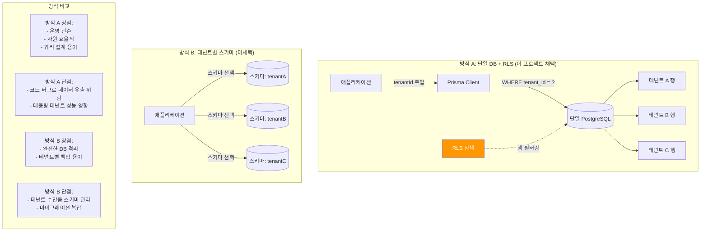
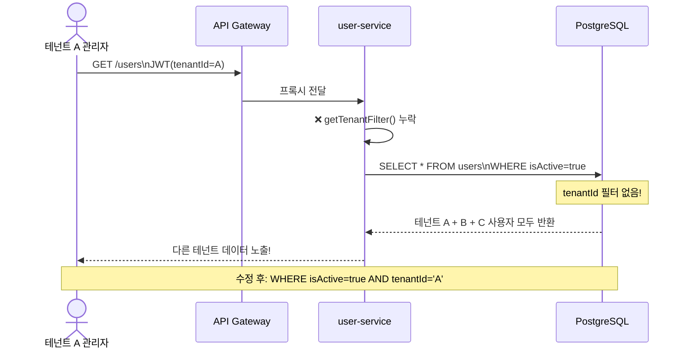
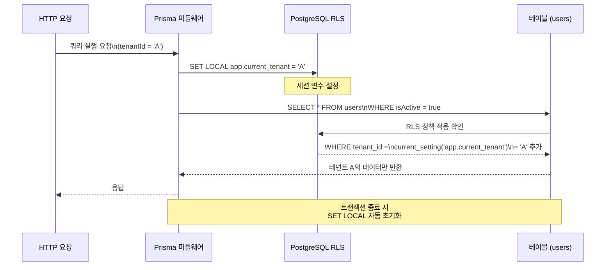

# 멀티테넌트 시스템 디버깅 — 테넌트 격리 문제 완전 해결 가이드

> **문서 ID**: TROUBLE-MT-08
> **버전**: 1.0.0 | **작성일**: 2026-04-12 | **작성자**: Implementer (Sonnet)
> **목적**: 테넌트 데이터 유출 및 격리 오류를 신속하게 진단하고 복구한다
> **선행 학습**: [02-architecture/02-multitenancy.md](../02-architecture/02-multitenancy.md), [02-architecture/07-multitenancy-advanced.md](../02-architecture/07-multitenancy-advanced.md)

---

## 목차

1. [멀티테넌트 아키텍처 복습](#1-멀티테넌트-아키텍처-복습)
2. [테넌트 데이터 유출 버그 시나리오 5개](#2-테넌트-데이터-유출-버그-시나리오-5개)
3. [RLS Row-Level-Security 디버깅](#3-rls-row-level-security-디버깅)
4. [성능 디버깅 테넌트별-느린-쿼리](#4-성능-디버깅-테넌트별-느린-쿼리)
5. [Redis 키 네임스페이스 디버깅](#5-redis-키-네임스페이스-디버깅)
6. [테넌트별 로그 필터링](#6-테넌트별-로그-필터링)
7. [운영 체크리스트](#7-운영-체크리스트)
8. [변경 이력](#변경-이력)

---

## 1. 멀티테넌트 아키텍처 복습

### 1.1 이 프로젝트의 격리 방식

이 프로젝트는 **단일 데이터베이스 + Row-Level Security (RLS) + tenantId 필터** 조합을 사용합니다.

| 격리 계층 | 방식 | 담당 코드 |
|---------|------|---------|
| **네트워크 계층** | Kubernetes NetworkPolicy | 인프라 (섹션 15-network-policies) |
| **애플리케이션 계층** | tenantId 필터 (Prisma WHERE 절) | `tenant-service/src/lib/isolation.ts` |
| **데이터베이스 계층** | PostgreSQL Row-Level Security | Prisma 스키마 + DB 정책 |
| **캐시 계층** | Redis 키 프리픽스 (`saas:tenant:{id}:*`) | `tenant-service/src/index.ts` (cachePlugin) |
| **AI 계층** | 벡터스토어 tenantId 파티셔닝 | `ai-service/src/lib/vector-store.ts` |

**핵심 원칙**: 어느 한 계층이 실패해도 다른 계층이 보호합니다. 그러나 코드 버그로
tenantId 필터를 누락하면 데이터베이스 RLS만으로는 막을 수 없는 경우가 있습니다.

### 1.2 단일 DB + RLS vs 테넌트별 스키마 비교



**이 프로젝트가 방식 A를 선택한 이유**:
- 공공기관 SaaS는 수백 개의 테넌트를 예상. 테넌트별 스키마는 수백 개의 스키마 관리가 필요
- Prisma의 멀티스키마 지원이 제한적
- RLS + 코드 레벨 이중 검증으로 보안 보완

---

## 2. 테넌트 데이터 유출 버그 시나리오 5개

### 시나리오 1: Prisma 쿼리에서 tenantId 필터 누락

**증상**:
- 테넌트 A 관리자가 조회 시 테넌트 B의 사용자 목록이 보임
- API 응답에 다른 테넌트의 데이터가 포함됨
- 감사 로그에서 cross-tenant 접근 패턴 발견

**원인**:
```typescript
// 잘못된 코드 — tenantId 필터 없음!
// user-service/src/handlers/user.handler.ts (잘못된 예)
const users = await prisma.user.findMany({
  // where 절에 tenantId가 없음
  where: { isActive: true },  // 모든 테넌트의 활성 사용자 반환!
})

// 올바른 코드 — getTenantFilter() 사용
// tenant-service/src/lib/isolation.ts: getTenantFilter()
import { getTenantFilter } from '../lib/isolation.js'

const users = await prisma.user.findMany({
  where: {
    ...getTenantFilter(request.user),  // { tenantId: 'xxx' } 주입
    isActive: true,
  },
})
```

**재현 방법**:
```bash
# 테넌트 A의 JWT로 사용자 목록 조회
curl -H "Authorization: Bearer ${TENANT_A_JWT}" \
     -H "X-Tenant-Id: ${TENANT_A_ID}" \
     http://api-gateway:3000/users

# 응답에 tenantId가 다른 사용자가 포함되면 버그 확인
cat response.json | jq '.data[] | select(.tenantId != "'${TENANT_A_ID}'")'
```

**수정 방법**:
```typescript
// tenant-service/src/lib/isolation.ts의 getTenantFilter 사용 규칙화
// 모든 Prisma findMany/findFirst에 반드시 적용

export function getTenantFilter(user: TokenPayload): { tenantId?: string } {
  if (user.role === 'super_admin') {
    return {}  // 슈퍼 어드민만 전체 접근
  }
  return { tenantId: user.tenantId }
}
```

**검증 방법**:
```bash
# Prisma 쿼리 로그에서 WHERE tenant_id 확인
DATABASE_URL="..." DEBUG="prisma:query" node service.js 2>&1 | \
  grep -v "tenant_id"  # tenant_id가 없는 SELECT가 나오면 위험!
```

**데이터 유출 경로 시각화**:



---

### 시나리오 2: Redis 캐시 키에 tenantId 미포함

**증상**:
- 테넌트 A가 설정을 변경한 후 테넌트 B에도 같은 설정이 적용됨
- 캐시 TTL 내에서만 발생하는 간헐적 버그
- 새로 고침하면 사라지는 이상한 동작

**원인**:
```typescript
// 잘못된 캐시 키 — tenantId 없음
const cacheKey = 'tenant-config'  // 모든 테넌트가 같은 키 사용!

// 올바른 캐시 키 — tenantId 포함
// tenant-service/src/index.ts: cachePlugin prefix 'saas:tenant'
const cacheKey = `saas:tenant:${tenantId}:config`
```

**재현 방법**:
```bash
# Redis CLI로 캐시 키 확인
redis-cli KEYS "*tenant*config*"

# tenantId 없는 키가 있으면 버그
# 올바른 패턴: saas:tenant:{UUID}:config
# 잘못된 패턴: tenant-config (tenantId 없음)
```

**수정 방법**:
```typescript
// 캐시 키 생성 헬퍼 함수 — 반드시 tenantId 포함
function buildCacheKey(tenantId: string, resource: string, id?: string): string {
  // 패턴: saas:tenant:{tenantId}:{resource}:{id?}
  return id
    ? `saas:tenant:${tenantId}:${resource}:${id}`
    : `saas:tenant:${tenantId}:${resource}`
}

// 사용 예
const cacheKey = buildCacheKey(request.user.tenantId, 'config')
const cachedConfig = await cache.get(cacheKey)
```

**검증 방법**:
```bash
# 테넌트별 키 분포 확인
redis-cli SCAN 0 MATCH "saas:tenant:*" COUNT 1000 | head -50

# tenantId 없는 위험한 키 탐지
redis-cli KEYS "*config*" | grep -v "saas:tenant:"
```

---

### 시나리오 3: BullMQ 큐 작업에서 컨텍스트 분실

**증상**:
- 이메일 알림이 잘못된 테넌트의 설정(SMTP, 언어)으로 발송됨
- 비동기 작업 처리 후 데이터가 엉뚱한 테넌트에 저장됨
- 큐 작업 재시도 시 테넌트 컨텍스트가 초기화됨

**원인**:
```typescript
// 잘못된 큐 작업 등록 — tenantId 미포함
// notification-service/src/lib/event-bus.ts (잘못된 예)
await queue.add('send-email', {
  userId: user.id,
  emailTemplate: 'welcome',
  // tenantId 없음! 작업자(Worker)가 어느 테넌트인지 모름
})

// 올바른 큐 작업 등록 — tenantId 반드시 포함
await queue.add('send-email', {
  tenantId: request.user.tenantId,  // 반드시 포함!
  userId: user.id,
  emailTemplate: 'welcome',
})
```

**큐 작업자(Worker)에서 컨텍스트 복구**:
```typescript
// 작업자는 항상 job.data.tenantId로 테넌트 컨텍스트를 복구해야 함
worker.on('process', async (job) => {
  const { tenantId, userId, emailTemplate } = job.data

  if (!tenantId) {
    // tenantId 없는 작업은 처리 거부 (보안)
    throw new Error('TENANT_CONTEXT_MISSING: tenantId 없이 처리 불가')
  }

  // 테넌트 설정 조회 시 반드시 tenantId 사용
  const tenantConfig = await prisma.tenantConfig.findUnique({
    where: { tenantId },  // 반드시 tenantId로 필터링
  })
})
```

**재현 방법**:
```bash
# BullMQ 큐의 작업 목록에서 tenantId 없는 작업 확인
redis-cli LRANGE "bull:send-email:wait" 0 -1 | \
  python3 -c "
import sys, json
for line in sys.stdin:
    try:
        job = json.loads(line)
        if 'tenantId' not in job.get('data', {}):
            print('위험: tenantId 없는 작업:', job)
    except: pass
"
```

---

### 시나리오 4: N2SF PII 마스킹 테넌트 간 설정 혼용

**증상**:
- 테넌트 A의 마스킹 패턴이 테넌트 B 데이터에 적용됨
- 특정 테넌트에서만 PII 마스킹이 작동하지 않음
- 마스킹 설정 변경 후 다른 테넌트에 즉시 반영됨

**원인**:
```typescript
// 잘못된 PII 마스킹 설정 캐시 — 글로벌 싱글톤
// ai-service/src/lib/pii-masking.ts (잘못된 예)
let globalMaskingConfig: MaskingConfig | null = null  // 테넌트 구분 없음!

async function getMaskingConfig(): Promise<MaskingConfig> {
  if (!globalMaskingConfig) {
    // 처음 로드된 테넌트 설정이 모든 테넌트에 적용됨!
    globalMaskingConfig = await prisma.maskingConfig.findFirst()
  }
  return globalMaskingConfig
}
```

**올바른 구현**:
```typescript
// tenantId별 설정 캐시 — 테넌트별로 분리
const maskingConfigCache = new Map<string, MaskingConfig>()

async function getMaskingConfig(tenantId: string): Promise<MaskingConfig> {
  if (!maskingConfigCache.has(tenantId)) {
    const config = await prisma.maskingConfig.findUnique({
      where: { tenantId },  // 테넌트별 마스킹 설정
    })
    if (config) {
      maskingConfigCache.set(tenantId, config)
    }
  }
  return maskingConfigCache.get(tenantId) ?? DEFAULT_MASKING_CONFIG
}
```

**검증 방법**:
```bash
# 테넌트 A의 PII 마스킹 테스트
curl -X POST http://api-gateway:3000/ai/security/dlp/scan \
  -H "Authorization: Bearer ${TENANT_A_JWT}" \
  -H "X-Tenant-Id: ${TENANT_A_ID}" \
  -d '{"content": "홍길동 010-1234-5678 주민번호 900101-1234567", "grade": "O"}'

# 결과가 테넌트 A 설정과 일치하는지 확인
# tenantId가 응답에 포함되어 있는지 확인
```

---

### 시나리오 5: AI RAG 벡터스토어 테넌트 검색 오염

**증상**:
- RAG 질의 응답에 다른 테넌트의 문서 내용이 포함됨
- 기밀 문서가 엉뚱한 테넌트의 AI 응답에 노출됨
- ai-service `/ai/rag/query` 응답의 `sources`에 다른 tenantId 문서가 포함

**원인**:
```typescript
// ai-service/src/lib/vector-store.ts — 실제 코드
// semanticSearch 함수에서 tenantId 필터가 누락되면 전체 벡터스토어 검색

// 잘못된 구현 (tenantId 필터 없음)
export async function semanticSearch(
  queryEmbedding: number[],
  options: SearchOptions,
): Promise<SearchResult[]> {
  const chunks = await db['aiKnowledgeChunk'].findMany({
    // where: { tenantId: options.tenantId }  ← 이 줄이 없으면 전체 검색!
    take: options.topK,
  })
  // 모든 테넌트의 청크 중 유사도 계산 → 데이터 유출!
}

// 올바른 구현 (vector-store.ts의 실제 패턴)
export async function semanticSearch(
  tenantId: string,
  queryEmbedding: number[],
  options: SearchOptions,
): Promise<SearchResult[]> {
  const chunks = await db['aiKnowledgeChunk'].findMany({
    where: { tenantId },  // 반드시 tenantId 필터
    take: options.topK * 3,  // 코사인 유사도 계산을 위해 더 많이 가져옴
  })
  // tenantId 필터된 청크에서만 유사도 계산
}
```

**재현 방법**:
```bash
# 테넌트 A에만 특정 문서를 업로드
curl -X POST http://api-gateway:3000/ai/rag/ingest \
  -H "Authorization: Bearer ${TENANT_A_JWT}" \
  -d '{"tenantId": "'${TENANT_A_ID}'", "grade": "O",
       "title": "기밀문서-A", "content": "이것은 테넌트 A의 기밀 정보입니다."}'

# 테넌트 B의 JWT로 관련 내용 질의
curl -X POST http://api-gateway:3000/ai/rag/query \
  -H "Authorization: Bearer ${TENANT_B_JWT}" \
  -d '{"tenantId": "'${TENANT_B_ID}'", "grade": "O",
       "question": "기밀 정보가 있는가?"}'

# 응답 sources에 tenantId가 A인 문서가 포함되면 버그!
cat response.json | jq '.data.sources[] | select(.documentTitle == "기밀문서-A")'
```

**수정 방법**:
```typescript
// ai-service/src/handlers/ai-rag.handler.ts에서
// 반드시 request.body.tenantId를 벡터 검색에 전달
export async function ragQueryHandler(request, reply) {
  const { tenantId, question, grade } = request.body

  // tenantId를 벡터 검색에 명시적으로 전달
  const results = await runRAG(tenantId, question, options)
  //                          ^^^^^^^^ tenantId 필수
}
```

**검증 SQL**:
```sql
-- PostgreSQL에서 벡터스토어 tenantId 분포 확인
SELECT tenant_id, COUNT(*) as chunk_count
FROM "AiKnowledgeChunk"
GROUP BY tenant_id
ORDER BY chunk_count DESC;

-- 특정 RAG 질의가 올바른 tenantId의 청크만 사용하는지 확인
SELECT tenant_id, document_id, chunk_index
FROM "AiKnowledgeChunk"
WHERE tenant_id = '${TENANT_B_ID}'
LIMIT 10;
```

---

## 3. RLS Row-Level-Security 디버깅

### 3.1 PostgreSQL RLS 정책 확인

RLS가 올바르게 설정되어 있는지 확인하는 방법입니다.

```bash
# psql로 DB 접속
kubectl exec -n saas-prod \
  $(kubectl get pod -n saas-prod -l app=postgresql -o jsonpath='{.items[0].metadata.name}') \
  -- psql -U postgres -d saas_prod

# 테이블의 RLS 활성화 여부 확인
\d+ users
-- relrowsecurity = true 이면 RLS 활성화

# 현재 적용된 RLS 정책 목록 확인
SELECT schemaname, tablename, policyname, cmd, qual, with_check
FROM pg_policies
WHERE tablename = 'users';

-- 예상 출력:
-- public | users | tenant_isolation | SELECT | (tenant_id = current_setting('app.current_tenant')::uuid) | ...
```

### 3.2 특정 tenantId로 쿼리 테스트

RLS가 올바르게 작동하는지 특정 테넌트 컨텍스트에서 테스트합니다.

```sql
-- 테넌트 컨텍스트 설정 후 쿼리 (RLS 시뮬레이션)
SET app.current_tenant = '550e8400-e29b-41d4-a716-446655440001';

-- 이 쿼리는 설정된 tenantId의 데이터만 반환해야 함
SELECT id, email, tenant_id FROM users LIMIT 10;

-- 다른 tenantId의 데이터가 보이면 RLS 미적용 상태
SELECT DISTINCT tenant_id FROM users;  -- 하나의 tenantId만 나와야 함

-- 컨텍스트 초기화
RESET app.current_tenant;

-- RLS 없이 전체 데이터 확인 (슈퍼유저 권한 필요)
SET row_security = off;
SELECT COUNT(*), tenant_id FROM users GROUP BY tenant_id;
SET row_security = on;
```

### 3.3 Prisma + RLS 상호작용 이해

Prisma는 기본적으로 RLS를 자동으로 설정하지 않습니다.
이 프로젝트에서는 Prisma 미들웨어로 tenantId를 PostgreSQL 세션 변수에 주입합니다.

**실제 Prisma 미들웨어 tenantId 주입 코드**:

```typescript
// 이 패턴은 tenant-service/src/lib/prisma.ts 참고
// Prisma Client Extension으로 tenantId 자동 주입

import { PrismaClient } from '@prisma/client'

export function createTenantPrismaClient(tenantId: string) {
  const prisma = new PrismaClient()

  // Prisma 미들웨어: 모든 쿼리 실행 전 tenantId 세션 변수 설정
  prisma.$use(async (params, next) => {
    // PostgreSQL 세션 변수에 tenantId 설정
    // RLS 정책이 current_setting('app.current_tenant')를 참조
    await prisma.$executeRaw`
      SET LOCAL app.current_tenant = ${tenantId}
    `
    return next(params)
  })

  return prisma
}

// 요청 처리 시 사용
const tenantPrisma = createTenantPrismaClient(request.user.tenantId)
const users = await tenantPrisma.user.findMany()
// RLS가 자동으로 WHERE tenant_id = 현재_테넌트 적용
```

**주의사항**: `SET LOCAL`은 현재 트랜잭션에만 적용됩니다.
트랜잭션 없이 `SET`을 사용하면 세션 전체에 적용되어 다른 요청에 영향을 줄 수 있습니다.

### 3.4 RLS 요청 흐름 시각화



### 3.5 RLS 정책 생성 예시

```sql
-- 새 테이블에 RLS 정책 추가
-- CSAP D-08 요건: 모든 테넌트 데이터 테이블에 적용

-- 1. RLS 활성화
ALTER TABLE user_documents ENABLE ROW LEVEL SECURITY;

-- 2. 슈퍼유저 우회 비활성화 (FORCE)
ALTER TABLE user_documents FORCE ROW LEVEL SECURITY;

-- 3. SELECT 정책 (조회 시 현재 테넌트 데이터만)
CREATE POLICY tenant_isolation_select ON user_documents
    FOR SELECT
    USING (tenant_id = current_setting('app.current_tenant', true)::uuid);

-- 4. INSERT 정책 (삽입 시 현재 테넌트로만 설정 가능)
CREATE POLICY tenant_isolation_insert ON user_documents
    FOR INSERT
    WITH CHECK (tenant_id = current_setting('app.current_tenant', true)::uuid);

-- 5. UPDATE/DELETE 정책
CREATE POLICY tenant_isolation_update ON user_documents
    FOR UPDATE
    USING (tenant_id = current_setting('app.current_tenant', true)::uuid);

CREATE POLICY tenant_isolation_delete ON user_documents
    FOR DELETE
    USING (tenant_id = current_setting('app.current_tenant', true)::uuid);

-- 슈퍼 어드민은 RLS 우회 허용 (별도 역할)
GRANT BYPASS RLS ON TABLE user_documents TO saas_admin;
```

---

## 4. 성능 디버깅 테넌트별 느린 쿼리

### 4.1 특정 테넌트만 느린 이유: 데이터 분포 불균형

단일 DB + RLS 구조에서 특정 테넌트가 느린 가장 흔한 원인은 **데이터 불균형**입니다.
테넌트 A는 100개의 레코드를, 테넌트 B는 100만 개의 레코드를 가지고 있다면
같은 쿼리도 실행 시간이 크게 다릅니다.

### 4.2 느린 테넌트 식별 쿼리

```sql
-- pg_stat_statements 확장 활성화 (최초 1회)
CREATE EXTENSION IF NOT EXISTS pg_stat_statements;

-- 테넌트별 평균 쿼리 실행 시간 (상위 10개)
-- app.current_tenant 세션 변수를 추적하여 테넌트별 집계
SELECT
    calls,
    mean_exec_time,
    max_exec_time,
    total_exec_time,
    LEFT(query, 100) as query_preview
FROM pg_stat_statements
WHERE query LIKE '%tenant_id%'
ORDER BY mean_exec_time DESC
LIMIT 10;

-- 특정 테넌트의 테이블 레코드 수 확인
SELECT
    tenant_id,
    COUNT(*) as record_count,
    pg_size_pretty(SUM(pg_column_size(t.*))) as estimated_size
FROM users t
GROUP BY tenant_id
ORDER BY record_count DESC;

-- 특정 테이블에서 tenantId별 인덱스 사용 여부 확인
EXPLAIN (ANALYZE, BUFFERS, FORMAT JSON)
SELECT * FROM users
WHERE tenant_id = '550e8400-e29b-41d4-a716-446655440001'
  AND is_active = true;
-- Bitmap Index Scan on tenant_id_idx: 인덱스 사용 중
-- Seq Scan: 인덱스 미사용 → 인덱스 추가 필요
```

### 4.3 인덱스 확인 및 추가

```sql
-- 현재 users 테이블 인덱스 목록
\d users
-- 또는
SELECT indexname, indexdef
FROM pg_indexes
WHERE tablename = 'users';

-- tenantId 복합 인덱스 추가 (성능 개선)
-- Prisma 스키마: @@index([tenantId, isActive])
CREATE INDEX CONCURRENTLY idx_users_tenant_active
    ON users (tenant_id, is_active)
    WHERE is_active = true;  -- 부분 인덱스 (활성 사용자만)

-- RAG 벡터스토어 tenantId 인덱스
CREATE INDEX CONCURRENTLY idx_ai_chunks_tenant
    ON "AiKnowledgeChunk" (tenant_id);
```

### 4.4 테넌트별 파티셔닝 전략 (대용량 테넌트 대응)

100만 레코드 이상의 대형 테넌트가 발생하면 파티셔닝을 고려합니다.

```sql
-- 파티셔닝 전: 단일 테이블
-- 파티셔닝 후: tenantId 기반 파티션 테이블

-- 파티션 테이블 생성 예시 (audit_logs)
CREATE TABLE audit_logs_partitioned (
    id UUID DEFAULT gen_random_uuid(),
    tenant_id UUID NOT NULL,
    action VARCHAR(100) NOT NULL,
    created_at TIMESTAMPTZ NOT NULL DEFAULT NOW(),
    PRIMARY KEY (id, tenant_id)
) PARTITION BY HASH (tenant_id);

-- 4개 파티션 (테넌트를 4개 그룹으로 분산)
CREATE TABLE audit_logs_p0 PARTITION OF audit_logs_partitioned
    FOR VALUES WITH (MODULUS 4, REMAINDER 0);
CREATE TABLE audit_logs_p1 PARTITION OF audit_logs_partitioned
    FOR VALUES WITH (MODULUS 4, REMAINDER 1);
CREATE TABLE audit_logs_p2 PARTITION OF audit_logs_partitioned
    FOR VALUES WITH (MODULUS 4, REMAINDER 2);
CREATE TABLE audit_logs_p3 PARTITION OF audit_logs_partitioned
    FOR VALUES WITH (MODULUS 4, REMAINDER 3);
```

**현재 프로젝트 상태**: 파티셔닝은 구현되어 있지 않습니다.
대형 테넌트 발생 시 이 전략을 검토하세요.

---

## 5. Redis 키 네임스페이스 디버깅

### 5.1 SCAN 명령으로 테넌트별 키 분석

```bash
# 프로덕션 Redis에서 키 분석 (KEYS 명령 대신 SCAN 사용 — KEYS는 블로킹)
redis-cli -n 0 SCAN 0 MATCH "saas:tenant:*" COUNT 100

# 특정 테넌트의 모든 키 목록
TENANT_ID="550e8400-e29b-41d4-a716-446655440001"
redis-cli --scan --pattern "saas:tenant:${TENANT_ID}:*"

# 테넌트별 키 개수 집계
redis-cli --scan --pattern "saas:tenant:*" | \
  awk -F: '{print $3}' | sort | uniq -c | sort -rn | head -20

# 예상 출력:
# 1523  550e8400-e29b-41d4-a716-446655440001  (테넌트 A — 많음)
#  234  660f9511-f3ac-52e5-b827-557766551112  (테넌트 B)
#   45  770a0622-g4bd-63f6-c938-668877662223  (테넌트 C — 적음)
```

### 5.2 잘못된 키 패턴 찾기

```bash
# tenantId 없는 위험한 글로벌 키 탐지
# 올바른 패턴: saas:tenant:{UUID}:{resource}
# 위험한 패턴: config, session, cache (tenantId 없음)

redis-cli --scan --pattern "*" | \
  grep -v "^saas:tenant:" | \
  grep -v "^bull:" | \           # BullMQ 큐는 제외
  grep -v "^rl:" | \             # Rate Limiter는 제외
  head -50

# 위에서 나온 키들이 테넌트 데이터를 담고 있다면 버그
# 각 키의 값 확인
redis-cli GET suspicious-key-name

# TTL 확인 (TTL이 -1이면 영구 저장 — 테넌트 데이터에는 위험)
redis-cli TTL suspicious-key-name
```

### 5.3 테넌트 키 충돌 사례 + 해결

**사례 1: Rate Limiter 키에 tenantId 없음**

```typescript
// 잘못된 Rate Limiter 키 — 글로벌 제한이 모든 테넌트 공유
// ai-service/src/routes.ts: createRateLimiter 사용 시
const chatLimiter = createRateLimiter(10, 60, 'rl:ai:chat')  // 전체 공유!

// 올바른 Rate Limiter 키 — 테넌트별 제한
// 핸들러에서 tenantId를 키에 포함
const tenantChatKey = `rl:ai:chat:${request.body.tenantId}`
```

**사례 2: 세션 토큰 충돌**

```bash
# Redis에서 세션 키 패턴 확인
redis-cli --scan --pattern "session:*" | head -20

# 올바른 패턴: session:{userId}:{sessionId}
# userId는 전체 고유 UUID이므로 tenantId 불필요
# 단, userId가 테넌트별로 고유하지 않다면 tenantId 추가 필요
```

**사례 3: tenant-service cachePlugin 설정**

```typescript
// tenant-service/src/index.ts — 실제 코드
// prefix 'saas:tenant'로 모든 캐시 키가 올바르게 네임스페이스됨
await app.register(cachePlugin, {
  config: {
    defaultTtlSeconds: 300,
    prefix: 'saas:tenant',  // 모든 키: saas:tenant:{resource}
  },
})

// 그러나 cachePlugin 내부에서 tenantId를 키에 추가하지 않으면 여전히 문제
// cachePlugin 사용 시 반드시 tenantId를 캐시 키의 일부로 전달
const config = await cache.get(`${tenantId}:config`)
//                                ^^^^^^^^^^^^^ 명시적 포함
```

---

## 6. 테넌트별 로그 필터링

### 6.1 Loki 쿼리로 특정 테넌트 로그 추출

이 프로젝트는 Grafana Loki를 로그 집계에 사용합니다.
모든 서비스 로그에는 `tenant_id` 필드가 포함되어야 합니다.

```logql
# 특정 테넌트의 에러 로그 조회
{namespace="saas-prod"} |= "error" | json | tenant_id="550e8400-e29b-41d4-a716-446655440001"

# 특정 테넌트의 로그인 실패 이벤트
{app="auth-service"} | json | tenant_id="${TENANT_ID}" |= "LOGIN_FAIL"

# 테넌트별 에러 발생 빈도 (지난 1시간)
sum by (tenant_id) (
  count_over_time(
    {namespace="saas-prod"} | json | __error__="" [1h]
  )
)

# 특정 테넌트에서 DB 쿼리 느린 경우 (1초 이상)
{app="tenant-service", namespace="saas-prod"} | json
  | tenant_id="${TENANT_ID}"
  | duration > 1s
  | line_format "{{.level}} {{.msg}} duration={{.duration}}"
```

### 6.2 특정 테넌트 트레이스 추적 (Tempo)

Grafana Tempo는 분산 추적을 제공합니다.
각 요청에 `tenant_id`가 span 속성으로 포함되어야 합니다.

```bash
# Tempo HTTP API로 특정 테넌트의 트레이스 검색
curl "http://tempo.monitoring.svc.cluster.local:3200/api/search?tags=tenant_id%3D550e8400-e29b-41d4-a716-446655440001&limit=20" | \
  jq '.traces[] | {traceID, rootName, duration}'

# Grafana UI에서 Explore → Tempo 선택 후
# Search: tenant_id = "550e8400-e29b-41d4-a716-446655440001"
```

**OpenTelemetry 속성 추가 방법**:

```typescript
// 서비스에서 tenantId를 span 속성으로 추가
// auth-service/src/lib/telemetry.ts 참고 패턴
import { trace } from '@opentelemetry/api'

export function addTenantContext(tenantId: string) {
  const span = trace.getActiveSpan()
  if (span) {
    span.setAttribute('tenant.id', tenantId)
    span.setAttribute('tenant.context', 'authenticated')
  }
}

// 핸들러에서 사용
export async function loginHandler(request, reply) {
  addTenantContext(tenant.id)  // 로그인 핸들러에서 tenantId 추가
  // ...
}
```

### 6.3 멀티테넌트 로그 분석 워크플로우

```mermaid
flowchart TD
    START([테넌트 격리 문제 신고\n"테넌트 A 사용자가 B 데이터 봄"]) --> STEP1

    STEP1[1단계: 감사 로그 확인\naudit-service 조회] --> CHECK1{감사 로그에\ncross-tenant 접근 기록?}

    CHECK1 -->|예| STEP2[2단계: 트레이스 ID 추출\nTempo에서 해당 요청 추적]
    CHECK1 -->|아니오| STEP2B[감사 로그 기록 자체가\n누락된 경우\naudit-service 확인]

    STEP2 --> STEP3[3단계: Loki에서\n해당 시점 로그 추출\n|= "TENANT_ISOLATION_VIOLATION"]

    STEP3 --> CHECK2{어느 서비스에서\n위반 발생?}

    CHECK2 -->|user-service| FIX1[getTenantFilter() 누락\n확인 및 수정]
    CHECK2 -->|ai-service| FIX2[RAG tenantId 필터\n또는 PII 설정 확인]
    CHECK2 -->|notification-service| FIX3[BullMQ 작업\ntenantId 누락 확인]
    CHECK2 -->|캐시 관련| FIX4[Redis 키 네임스페이스\n확인]

    STEP2B --> STEP4[Loki에서\n해당 테넌트 에러 검색\n{tenant_id="xxx"}]
    STEP4 --> CHECK2

    FIX1 --> VERIFY[검증:\n양쪽 테넌트 데이터 격리 확인\n + 코드 리뷰 요청]
    FIX2 --> VERIFY
    FIX3 --> VERIFY
    FIX4 --> VERIFY

    VERIFY --> REPORT[감사 보고서 작성\nCSAP D-06 기록\n+ 재발 방지 조치]
```

---

## 7. 운영 체크리스트

### 7.1 신규 테넌트 온보딩 시 격리 검증 5단계

신규 테넌트를 생성한 후 반드시 아래 5단계 격리 검증을 수행합니다.

**단계 1: DB 격리 확인**
```bash
# 신규 테넌트 ID로 데이터 조회 — 기존 테넌트 데이터 없어야 함
TENANT_NEW_ID="신규_테넌트_UUID"

# PostgreSQL에서 각 테이블 확인
kubectl exec -n saas-prod \
  $(kubectl get pod -n saas-prod -l app=postgresql -o jsonpath='{.items[0].metadata.name}') \
  -- psql -U postgres -d saas_prod -c \
  "SELECT COUNT(*) FROM users WHERE tenant_id = '${TENANT_NEW_ID}';"
# 예상 결과: 0 (신규 테넌트는 데이터 없음)
```

**단계 2: 기존 테넌트 데이터 접근 불가 확인**
```bash
# 신규 테넌트 JWT로 다른 테넌트 API 호출 시도
TENANT_B_ID="기존_테넌트_B_UUID"

curl -X GET "http://api-gateway:3000/users?tenantId=${TENANT_B_ID}" \
  -H "Authorization: Bearer ${NEW_TENANT_JWT}" \
  -H "X-Tenant-Id: ${TENANT_NEW_ID}"

# 예상 결과: 403 Forbidden (TENANT_ISOLATION_VIOLATION)
```

**단계 3: Redis 캐시 격리 확인**
```bash
# 신규 테넌트 관련 Redis 키만 존재하는지 확인
redis-cli --scan --pattern "saas:tenant:${TENANT_NEW_ID}:*" | wc -l
# 초기에는 0 또는 최소한의 키만 있어야 함

# 다른 테넌트의 캐시가 신규 테넌트에게 보이지 않는지 확인
redis-cli GET "saas:tenant:${TENANT_NEW_ID}:config"
# 기존 테넌트 데이터가 반환되면 캐시 키 버그!
```

**단계 4: AI RAG 격리 확인**
```bash
# 신규 테넌트에서 RAG 질의 — 다른 테넌트 문서가 응답에 없어야 함
curl -X POST http://api-gateway:3000/ai/rag/query \
  -H "Authorization: Bearer ${NEW_TENANT_JWT}" \
  -d "{
    \"tenantId\": \"${TENANT_NEW_ID}\",
    \"grade\": \"O\",
    \"question\": \"시스템에 어떤 문서가 있나요?\"
  }"

# 응답 sources 배열이 비어 있어야 함 (신규 테넌트에는 문서 없음)
cat response.json | jq '.data.sources | length'
# 예상: 0
```

**단계 5: 감사 로그 격리 확인**
```bash
# 위 4단계의 모든 접근이 감사 로그에 기록되었는지 확인
curl -H "Authorization: Bearer ${ADMIN_JWT}" \
  "http://api-gateway:3000/audit/events?tenantId=${TENANT_NEW_ID}&limit=20"

# 예상: 온보딩 중 발생한 이벤트들이 기록되어야 함
# 다른 tenantId의 이벤트가 없어야 함
```

### 7.2 월간 테넌트 격리 감사 절차

```bash
#!/bin/bash
# monthly-tenant-isolation-audit.sh
# CSAP D-08 요건: 월간 테넌트 격리 점검

DATE=$(date +%Y-%m)
REPORT_FILE="csap-evidence/tenant-isolation-audit-${DATE}.txt"

echo "=== 테넌트 격리 감사 보고서: ${DATE} ===" > $REPORT_FILE
echo "수행일: $(date)" >> $REPORT_FILE
echo "" >> $REPORT_FILE

# 1. 전체 테넌트 수 및 데이터 분포
echo "## 1. 테넌트별 데이터 분포" >> $REPORT_FILE
kubectl exec -n saas-prod \
  $(kubectl get pod -n saas-prod -l app=postgresql -o jsonpath='{.items[0].metadata.name}') \
  -- psql -U postgres -d saas_prod -c \
  "SELECT tenant_id, COUNT(*) as user_count FROM users GROUP BY tenant_id ORDER BY user_count DESC;" \
  >> $REPORT_FILE

# 2. TENANT_ISOLATION_VIOLATION 이벤트 확인
echo "## 2. 격리 위반 이벤트 (최근 30일)" >> $REPORT_FILE
kubectl logs -n saas-prod -l tier=application --since=720h | \
  grep "TENANT_ISOLATION_VIOLATION" | wc -l >> $REPORT_FILE

# 3. Redis 키 네임스페이스 점검
echo "## 3. Redis 키 패턴 분석" >> $REPORT_FILE
redis-cli --scan --pattern "*" | \
  grep -v "^saas:tenant:" | \
  grep -v "^bull:" | \
  grep -v "^rl:" | \
  grep -v "^session:" | \
  head -20 >> $REPORT_FILE

echo "감사 완료. 결과 파일: $REPORT_FILE"
```

### 7.3 CSAP D-08 멀티테넌트 격리 요건 매핑

| CSAP D-08 항목 | 내용 | 멀티테넌트 구현 | 검증 방법 |
|--------------|------|--------------|---------|
| D-08-11 | 망 분리 | 네임스페이스 + NetworkPolicy | NetworkPolicy 적용 확인 |
| D-08-05 | 접근 로그 | audit-service (cross-tenant 탐지) | 감사 로그 TENANT_ISOLATION_VIOLATION 검색 |
| D-08-02 | 권한 관리 | `tenantIsolationPlugin` + `getTenantFilter()` | 시나리오 1~5 테스트 |
| N2SF N-03 | 격리 아키텍처 | RLS + tenantId 필터 이중 보호 | 월간 격리 감사 |
| N2SF N-05 | AI 데이터 보호 | RAG tenantId 파티셔닝 | 시나리오 5 테스트 |

**증적 제출 목록 (CSAP 감사 시)**:
1. `monthly-tenant-isolation-audit-{YYYY-MM}.txt` — 월간 감사 결과
2. `audit-service` 감사 로그 (TENANT_ISOLATION_VIOLATION 이벤트 0건)
3. `tenant-service/src/lib/isolation.ts` 코드 리뷰 기록
4. 신규 테넌트 온보딩 5단계 완료 체크리스트

---

## 변경 이력

| 버전 | 일자 | 내용 | 작성자 |
|------|------|------|-------|
| 1.0.0 | 2026-04-12 | 최초 작성 — 5개 시나리오, RLS 디버깅, 운영 체크리스트 | Implementer (Sonnet) |
