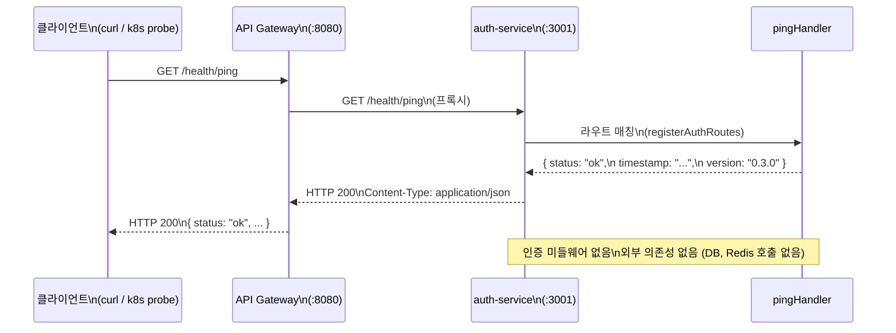

# 실습 1: 첫 번째 서비스 엔드포인트 추가

> **문서 ID**: ONBOARD-10-EX01
> **버전**: 1.0.0 | **작성일**: 2026-04-12 | **작성자**: Implementer (Sonnet)
> **예상 소요 시간**: 30~60분
> **난이도**: 초급
> **선행 조건**: 로컬 환경 설정 완료, pnpm build 성공

---

## 목차

1. [실습 목표](#1-실습-목표)
2. [배경 지식](#2-배경-지식)
3. [Step 1: 기존 코드 파악](#3-step-1-기존-코드-파악)
4. [Step 2: 새 엔드포인트 추가](#4-step-2-새-엔드포인트-추가)
5. [Step 3: 테스트 작성](#5-step-3-테스트-작성)
6. [Step 4: 테스트 실행](#6-step-4-테스트-실행)
7. [Step 5: Claude Code로 코드 리뷰](#7-step-5-claude-code로-코드-리뷰)
8. [Step 6: 커밋](#8-step-6-커밋)
9. [요청 흐름 다이어그램](#9-요청-흐름-다이어그램)
10. [자주 하는 실수](#10-자주-하는-실수)
11. [도전 과제](#11-도전-과제)
12. [변경 이력](#12-변경-이력)

---

## 1. 실습 목표

**과제**: `auth-service`에 `/health/ping` 엔드포인트를 추가하십시오.

이 실습은 단순하지만, 이 프로젝트의 개발 흐름 전체를 한 사이클 경험하는 것이 목적입니다. 코드를 작성하고, 테스트를 쓰고, Claude Code로 리뷰를 받고, 올바른 커밋 메시지로 커밋하는 흐름을 익힙니다.

**완료 기준**:
- `GET /health/ping` 요청 시 `200 OK`와 JSON 응답 반환
- 응답 본문에 `status`, `timestamp`, `version` 필드 포함
- 단위 테스트 통과
- Claude Code 리뷰 통과
- Conventional Commits 형식 커밋 완료

---

## 2. 배경 지식

### 2.1 프레임워크: Fastify

이 프로젝트의 모든 백엔드 서비스는 **Fastify**를 사용합니다. Express보다 약 3배 빠르며, JSON 스키마 기반의 입력 검증과 OpenAPI 문서 자동 생성을 지원합니다.

Fastify에서 라우트를 추가하는 기본 패턴은 다음과 같습니다.

```typescript
// Fastify 라우트 기본 패턴
app.get('/some/path', {
  schema: {
    description: '엔드포인트 설명',
    tags: ['태그'],
    response: {
      200: {
        type: 'object',
        properties: {
          key: { type: 'string' },
        },
      },
    },
  },
}, async (request, reply) => {
  return reply.status(200).send({ key: 'value' });
});
```

### 2.2 왜 /health/ping인가

헬스 체크 엔드포인트는 k8s의 `livenessProbe`와 `readinessProbe`에서 사용합니다. 클러스터가 주기적으로 이 엔드포인트를 호출하여 서비스가 살아 있는지 확인합니다.

`/health/ping`은 외부 의존성(DB, Redis 등) 없이 순수하게 서비스 프로세스의 생존 여부만 확인하는 경량 엔드포인트입니다.

### 2.3 auth-service 구조 미리 파악

```
platform/services/auth-service/src/
├── handlers/         # 각 엔드포인트의 핸들러 함수
│   ├── login.handler.ts
│   ├── logout.handler.ts
│   └── ...
├── lib/              # 공통 유틸리티 (JWT, 암호화, 감사 로그 등)
├── middleware/       # 인증 미들웨어, rate limiting 등
├── schemas/          # Zod 입력 검증 스키마
├── index.ts          # 서비스 진입점 (Fastify 앱 초기화)
└── routes.ts         # 라우트 등록 함수 (여기가 핵심)
```

---

## 3. Step 1: 기존 코드 파악

실습 브랜치를 만들고 현재 `routes.ts`를 읽어봅니다.

```bash
# 실습 브랜치 생성
cd /data/ai-saas
git checkout stg
git checkout -b feat/exercise-01-hello-service

# auth-service 디렉터리로 이동
cd platform/services/auth-service

# 현재 라우트 파일 확인
cat src/routes.ts
```

**확인 포인트**:

`routes.ts` 파일 하단에 `registerAuthRoutes` 함수가 있습니다. 이 함수 안에 모든 라우트가 등록됩니다.

```typescript
// routes.ts 하단 — 라우트 등록 함수
export async function registerAuthRoutes(app: FastifyInstance): Promise<void> {
  // POST /auth/login — 로그인
  app.post('/auth/login', loginSchemaOpts, loginHandler);

  // POST /auth/logout — 로그아웃
  app.post('/auth/logout', logoutSchemaOpts, logoutHandler);

  // ... 나머지 라우트들 ...
}
```

**기대 출력**: `routes.ts` 파일이 화면에 출력되어야 합니다. 파일이 없다면 경로를 다시 확인하십시오.

---

## 4. Step 2: 새 엔드포인트 추가

### 4.1 핸들러 파일 생성

먼저 핸들러 함수를 담을 파일을 만듭니다. 기존 핸들러와 같은 위치에 생성합니다.

```bash
# 핸들러 파일 생성
touch src/handlers/ping.handler.ts
```

파일 내용을 작성합니다. 아래 코드를 `src/handlers/ping.handler.ts`에 입력하십시오.

```typescript
// /health/ping 핸들러
// 목적: 서비스 프로세스 생존 확인 (k8s livenessProbe용)
// CSAP: 인증 불필요 (내부 헬스 체크)

import type { FastifyRequest, FastifyReply } from 'fastify';

// 서비스 버전 (package.json과 동기화)
const SERVICE_VERSION = process.env['SERVICE_VERSION'] ?? '0.3.0';

/**
 * /health/ping 핸들러
 *
 * 외부 의존성(DB, Redis) 없이 프로세스 자체가 살아 있는지만 확인합니다.
 * 의존성 포함 헬스 체크는 /health/ready 엔드포인트를 사용하십시오.
 */
export async function pingHandler(request: FastifyRequest, reply: FastifyReply): Promise<void> {
  await reply.status(200).send({
    status: 'ok',
    timestamp: new Date().toISOString(),
    version: SERVICE_VERSION,
  });
}
```

**코드 설명**:
- `process.env['SERVICE_VERSION']`: 환경 변수에서 버전을 읽습니다. 없으면 `'0.3.0'`을 기본값으로 사용합니다.
- `new Date().toISOString()`: ISO 8601 형식의 현재 시각을 반환합니다 (예: `2026-04-12T09:00:00.000Z`).
- CSAP 관점: 헬스 체크는 인증이 필요 없는 공개 엔드포인트입니다. 단, 민감한 시스템 정보(DB 주소, 비밀번호 등)를 절대 노출해서는 안 됩니다.

### 4.2 routes.ts에 라우트 등록

`routes.ts` 파일을 열어 두 가지를 추가합니다: import 구문과 라우트 등록.

```typescript
// routes.ts 상단의 import 블록에 아래 줄 추가
import { pingHandler } from './handlers/ping.handler.js';
```

그리고 `registerAuthRoutes` 함수 **맨 앞에** 아래 코드를 추가합니다.

```typescript
export async function registerAuthRoutes(app: FastifyInstance): Promise<void> {
  // GET /health/ping — 경량 헬스 체크 (livenessProbe용)
  // 인증 불필요, 외부 의존성 없음
  app.get('/health/ping', {
    schema: {
      description: '서비스 생존 확인 (경량 헬스 체크)',
      tags: ['health'],
      response: {
        200: {
          type: 'object' as const,
          properties: {
            status: { type: 'string' as const },
            timestamp: { type: 'string' as const, format: 'date-time' },
            version: { type: 'string' as const },
          },
          required: ['status', 'timestamp', 'version'],
        },
      },
    },
  }, pingHandler);

  // POST /auth/login — 로그인
  app.post('/auth/login', loginSchemaOpts, loginHandler);
  // ... 나머지 기존 라우트 ...
}
```

### 4.3 서비스 실행하여 직접 확인

```bash
# auth-service 개발 서버 실행
pnpm run dev
```

별도 터미널에서 엔드포인트를 호출합니다.

```bash
# ping 엔드포인트 테스트
curl -s http://localhost:3001/health/ping | jq .
```

**기대 출력**:

```json
{
  "status": "ok",
  "timestamp": "2026-04-12T09:00:00.000Z",
  "version": "0.3.0"
}
```

`curl` 명령어 실행 결과가 위와 같이 나오면 Step 2가 완료된 것입니다.

---

## 5. Step 3: 테스트 작성

코드를 작성했으면 반드시 테스트를 작성해야 합니다. 이 프로젝트는 Vitest를 사용합니다.

### 5.1 테스트 파일 확인

기존 테스트 파일의 위치와 형식을 먼저 확인합니다.

```bash
# 기존 테스트 파일 확인
ls src/handlers/__tests__/ 2>/dev/null || echo "테스트 디렉터리 없음"

# 또는 test 파일 검색
find src -name "*.test.ts" 2>/dev/null
```

### 5.2 테스트 파일 작성

`src/handlers/__tests__/ping.handler.test.ts` 파일을 만듭니다.

```bash
mkdir -p src/handlers/__tests__
touch src/handlers/__tests__/ping.handler.test.ts
```

아래 내용을 입력합니다.

```typescript
// ping.handler.test.ts
// /health/ping 엔드포인트 단위 테스트

import { describe, it, expect, beforeAll, afterAll } from 'vitest';
import Fastify from 'fastify';
import type { FastifyInstance } from 'fastify';
import { pingHandler } from '../ping.handler.js';

describe('GET /health/ping', () => {
  let app: FastifyInstance;

  beforeAll(async () => {
    // 테스트용 Fastify 인스턴스 생성
    app = Fastify({ logger: false });

    // ping 라우트만 등록
    app.get('/health/ping', {
      schema: {
        response: {
          200: {
            type: 'object',
            properties: {
              status: { type: 'string' },
              timestamp: { type: 'string' },
              version: { type: 'string' },
            },
          },
        },
      },
    }, pingHandler);

    await app.ready();
  });

  afterAll(async () => {
    await app.close();
  });

  it('200 OK를 반환해야 한다', async () => {
    const response = await app.inject({
      method: 'GET',
      url: '/health/ping',
    });

    expect(response.statusCode).toBe(200);
  });

  it('응답 본문에 status, timestamp, version 필드가 있어야 한다', async () => {
    const response = await app.inject({
      method: 'GET',
      url: '/health/ping',
    });

    const body = JSON.parse(response.body) as {
      status: string;
      timestamp: string;
      version: string;
    };

    expect(body.status).toBe('ok');
    expect(body.timestamp).toBeDefined();
    expect(body.version).toBeDefined();
  });

  it('timestamp가 ISO 8601 형식이어야 한다', async () => {
    const response = await app.inject({
      method: 'GET',
      url: '/health/ping',
    });

    const body = JSON.parse(response.body) as { timestamp: string };
    const date = new Date(body.timestamp);

    // 유효한 날짜인지 확인
    expect(isNaN(date.getTime())).toBe(false);
  });

  it('Content-Type이 application/json이어야 한다', async () => {
    const response = await app.inject({
      method: 'GET',
      url: '/health/ping',
    });

    expect(response.headers['content-type']).toContain('application/json');
  });
});
```

---

## 6. Step 4: 테스트 실행

테스트 파일이 준비되었으면 실행합니다.

```bash
# auth-service 디렉터리에서 테스트 실행
cd /data/ai-saas/platform/services/auth-service
pnpm test
```

**기대 출력**:

```
 DEV  v1.x.x /data/ai-saas/platform/services/auth-service

 ✓ src/handlers/__tests__/ping.handler.test.ts (4)
   ✓ GET /health/ping > 200 OK를 반환해야 한다
   ✓ GET /health/ping > 응답 본문에 status, timestamp, version 필드가 있어야 한다
   ✓ GET /health/ping > timestamp가 ISO 8601 형식이어야 한다
   ✓ GET /health/ping > Content-Type이 application/json이어야 한다

 Test Files  1 passed (1)
 Tests       4 passed (4)
 Duration    xxx ms
```

모든 테스트가 통과해야 합니다. 하나라도 실패하면 오류 메시지를 읽고 코드를 수정하십시오.

### 6.1 테스트 실패 시 일반적인 원인

| 오류 메시지 | 원인 | 해결 방법 |
|-----------|------|---------|
| `Cannot find module '../ping.handler.js'` | 파일 경로 오류 | `ping.handler.ts` 파일이 `src/handlers/` 에 있는지 확인 |
| `Expected 200 received 404` | 라우트 등록 누락 | `routes.ts`에 `app.get('/health/ping', ...)` 추가 여부 확인 |
| `SyntaxError: Unexpected token` | TypeScript 문법 오류 | 오류 위치 확인 후 수정 |
| `TypeError: pingHandler is not a function` | export 누락 | `ping.handler.ts`에서 `export async function` 확인 |

---

## 7. Step 5: Claude Code로 코드 리뷰

테스트가 통과했으면 Claude Code에게 코드 리뷰를 요청합니다.

```bash
# 프로젝트 루트에서 Claude Code 실행
cd /data/ai-saas
claude
```

Claude Code 대화창에서 다음과 같이 입력합니다.

```
platform/services/auth-service/src/handlers/ping.handler.ts 파일을
CSAP D-08, D-12 기준으로 코드 리뷰해 줘.
특히 다음을 확인해 줘:
1. 민감 정보 노출 여부
2. 인증 필요 여부 판단
3. 응답 형식의 적절성
4. Dead code 여부
```

**Claude Code가 확인하는 항목**:
- 응답 본문에 내부 시스템 정보(DB 연결 문자열, 시크릿 등)가 노출되지 않는지
- 헬스 체크에 인증이 필요한지 여부 (필요 없음이 올바름)
- 에러 처리가 적절한지

**리뷰 결과 예시**:

```
코드 리뷰 결과:

[통과] CSAP D-08 (접근 통제): /health/ping은 인증 불필요 엔드포인트로
올바르게 구현되었습니다.

[통과] CSAP D-12 (개발 보안): 응답 본문에 민감 정보가 없습니다.
status, timestamp, version만 반환하여 최소 노출 원칙을 준수합니다.

[권고] process.env['SERVICE_VERSION']의 기본값을 package.json에서
동적으로 읽도록 개선하면 버전 불일치 위험을 줄일 수 있습니다.
```

리뷰에서 지적 사항이 있으면 수정한 후 다시 테스트를 실행합니다.

---

## 8. Step 6: 커밋

코드와 테스트가 준비되고 리뷰를 통과했으면 커밋합니다.

### 8.1 변경 파일 확인

```bash
git status
```

**기대 출력**:

```
On branch feat/exercise-01-hello-service
Changes not staged for commit:
  (use "git add <file>..." to update staging area)
        modified:   platform/services/auth-service/src/routes.ts

Untracked files:
  (use "git add <file>..." to include in what will be committed)
        platform/services/auth-service/src/handlers/ping.handler.ts
        platform/services/auth-service/src/handlers/__tests__/ping.handler.test.ts
```

### 8.2 스테이징 및 커밋

```bash
# 변경 파일 스테이징
git add platform/services/auth-service/src/handlers/ping.handler.ts
git add platform/services/auth-service/src/handlers/__tests__/ping.handler.test.ts
git add platform/services/auth-service/src/routes.ts

# 커밋 (Conventional Commits 형식)
git commit -m "feat(auth-service): /health/ping 경량 헬스 체크 엔드포인트 추가

- GET /health/ping 엔드포인트 추가 (k8s livenessProbe 지원)
- 응답: status, timestamp, version 필드
- 인증 불필요 (외부 의존성 없는 순수 생존 확인)
- 단위 테스트 4개 추가 (200 OK, 필드 확인, ISO 8601, Content-Type)"
```

**커밋 메시지 형식 설명**:

```
feat(auth-service): /health/ping 경량 헬스 체크 엔드포인트 추가
^    ^             ^
|    |             |
|    |             +-- 무엇을 했는지 (한 줄 요약, 72자 이하)
|    +---------------- 어느 범위에서 (서비스명 또는 모듈명)
+---------------------- 어떤 종류인지 (feat/fix/docs/refactor/test 등)
```

커밋이 완료되면 훅이 자동으로 실행됩니다. 오류 없이 완료되면 실습 1이 끝납니다.

---

## 9. 요청 흐름 다이어그램

`/health/ping` 요청이 어떻게 처리되는지 전체 흐름을 보여줍니다.



**포인트**: `/health/ping`은 API Gateway를 통해 들어오지만, auth-service 내부에서는 인증 미들웨어를 거치지 않고 바로 핸들러로 전달됩니다. DB나 Redis 호출이 없기 때문에 응답 속도가 매우 빠릅니다.

---

## 10. 자주 하는 실수

### 실수 1: `as const` 누락

TypeScript에서 Fastify schema를 정의할 때 `type` 필드에 `as const`를 붙이지 않으면 타입 오류가 발생합니다.

```typescript
// 잘못된 예 — 타입 오류 발생
schema: {
  response: {
    200: {
      type: 'object',   // ← 오류: string이 아닌 'object' 리터럴 타입이어야 함
```

```typescript
// 올바른 예
schema: {
  response: {
    200: {
      type: 'object' as const,   // ← as const 필수
```

### 실수 2: `.js` 확장자 없는 import

TypeScript ESM 환경에서는 import 경로에 반드시 `.js` 확장자를 붙여야 합니다.

```typescript
// 잘못된 예
import { pingHandler } from './handlers/ping.handler';

// 올바른 예
import { pingHandler } from './handlers/ping.handler.js';
```

### 실수 3: `export` 누락

핸들러 함수에 `export` 키워드가 없으면 다른 파일에서 import할 수 없습니다.

```typescript
// 잘못된 예
async function pingHandler(...) { ... }

// 올바른 예
export async function pingHandler(...) { ... }
```

### 실수 4: 민감 정보를 응답에 포함

헬스 체크 응답에 내부 정보를 넣으면 CSAP 위반입니다.

```typescript
// 잘못된 예 — CSAP 위반
return reply.send({
  status: 'ok',
  dbUrl: process.env['DATABASE_URL'],   // ← 절대 금지
  redisUrl: process.env['REDIS_URL'],   // ← 절대 금지
});

// 올바른 예
return reply.send({
  status: 'ok',
  timestamp: new Date().toISOString(),
  version: SERVICE_VERSION,
});
```

### 실수 5: 커밋 메시지 형식 오류

```bash
# 잘못된 예
git commit -m "ping 추가"
git commit -m "헬스체크 엔드포인트"

# 올바른 예
git commit -m "feat(auth-service): /health/ping 경량 헬스 체크 엔드포인트 추가"
```

---

## 11. 도전 과제

기본 실습을 완료했다면 아래 도전 과제를 시도해 보십시오.

### 도전 1: 메타데이터 추가

응답에 `uptime`(서비스 가동 시간, 초)과 `environment`(개발/스테이징/프로덕션) 필드를 추가하십시오.

```typescript
// 힌트: Node.js process 모듈 활용
const uptime = Math.floor(process.uptime()); // 초 단위
const environment = process.env['NODE_ENV'] ?? 'development';
```

**주의**: `environment`에는 환경 이름만 노출합니다. 포트 번호, DB URL 등은 절대 노출하지 마십시오.

### 도전 2: k8s livenessProbe 설정 연동

실제 k8s 매니페스트에 `/health/ping`을 livenessProbe로 설정해 보십시오.

```yaml
# 힌트: helm 차트에서 찾아보십시오
# platform/k8s/ 또는 platform/helm/ 디렉터리를 확인하십시오
livenessProbe:
  httpGet:
    path: /health/ping
    port: 3001
  initialDelaySeconds: 10
  periodSeconds: 30
```

### 도전 3: 응답 시간 측정

핸들러에서 응답 생성까지 걸린 시간을 `responseTimeMs` 필드로 반환해 보십시오.

```typescript
// 힌트
const start = Date.now();
// ... 로직 ...
const responseTimeMs = Date.now() - start;
```

---

## 12. 변경 이력

| 버전 | 일자 | 내용 | 작성자 |
|------|------|------|--------|
| 1.0.0 | 2026-04-12 | 초안 작성 | Implementer (Sonnet) |
