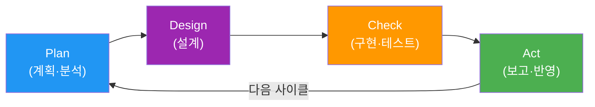
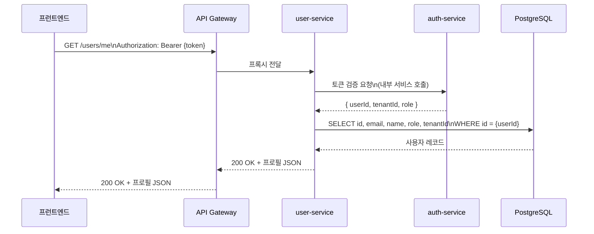
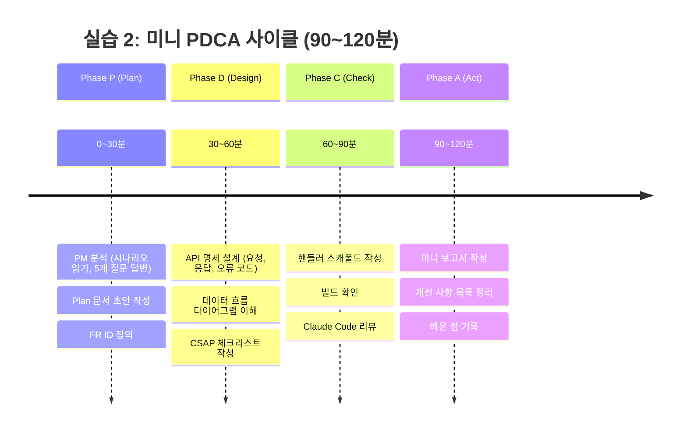

# 실습 2: 미니 PDCA 사이클 체험

> **문서 ID**: ONBOARD-10-EX02
> **버전**: 1.0.0 | **작성일**: 2026-04-12 | **작성자**: Implementer (Sonnet)
> **예상 소요 시간**: 90~120분
> **난이도**: 초중급
> **선행 조건**: 실습 1 완료, 가이드북 1장(문서 관리·PDCA) 학습

---

## 목차

1. [실습 목표](#1-실습-목표)
2. [PDCA 개념 복습](#2-pdca-개념-복습)
3. [실습 시나리오](#3-실습-시나리오)
4. [Phase P: Plan 문서 작성](#4-phase-p-plan-문서-작성)
5. [Phase D: Design 문서 작성](#5-phase-d-design-문서-작성)
6. [Phase C: 코드 구현 (스캐폴드)](#6-phase-c-코드-구현-스캐폴드)
7. [Phase A: 미니 보고서 작성](#7-phase-a-미니-보고서-작성)
8. [Claude Code 활용 포인트](#8-claude-code-활용-포인트)
9. [실습 타임라인](#9-실습-타임라인)
10. [자주 하는 실수](#10-자주-하는-실수)
11. [변경 이력](#11-변경-이력)

---

## 1. 실습 목표

**과제**: "사용자 프로필 조회 API" 기능을 위한 미니 PDCA 사이클을 완수하십시오.

실제 팀에서 새 기능을 개발할 때는 반드시 Plan → Design → 구현(Check) → 보고(Act) 순서를 따릅니다. 이 실습에서는 그 전체 흐름을 단시간에 체험합니다.

**완료 기준**:
- Plan 문서 (`docs/01-plan/mtus/EX02-user-profile.plan.md`)가 감리 기준 형식으로 작성됨
- Design 문서 (Plan 문서 내 Design 절) 에 API 명세가 포함됨
- 코드 스캐폴드가 컴파일 오류 없이 빌드됨
- 미니 보고서가 작성됨

---

## 2. PDCA 개념 복습

PDCA는 **Plan(계획) → Do/Design(설계/구현) → Check(검토) → Act(보고/개선)** 의 반복 사이클입니다.

이 프로젝트에서는 PDCA를 기능 단위(MTU, Minimal Task Unit)로 적용합니다.



**왜 문서를 먼저 써야 하는가**:

코딩을 먼저 시작하고 싶은 마음이 드는 것은 자연스럽습니다. 그러나 공공기관 감리에서는 **문서 없는 구현은 결함**으로 처리됩니다. 또한 문서를 먼저 쓰면 다음과 같은 이점이 있습니다.

1. 구현 전에 이해관계자와 합의가 이루어집니다.
2. 나중에 코드를 보는 사람(또는 미래의 자신)이 이유를 알 수 있습니다.
3. 감리 시 증거 자료로 활용됩니다.
4. 구현 방향이 명확해져 실제 코딩 시간이 줄어듭니다.

---

## 3. 실습 시나리오

**요청 배경**: 팀 PM이 다음 메시지를 남겼습니다.

> "user-service에 사용자 프로필 조회 기능이 필요합니다. 사용자가 본인 프로필(이름, 이메일, 역할)을 조회할 수 있어야 합니다. 현재 사용자 정보가 여러 서비스에 분산되어 있어 프런트엔드에서 매번 여러 번 API를 호출해야 하는 불편함이 있습니다."

이 요청을 받아 PDCA 사이클을 진행합니다.

**스코프 정의** (실습 단순화를 위해 축소):
- 범위: `GET /users/me` 엔드포인트 하나
- 대상 서비스: `user-service`
- 반환 필드: `id`, `email`, `name`, `role`, `tenantId`
- 인증: JWT Bearer 토큰 필수

---

## 4. Phase P: Plan 문서 작성

### 4.1 PM 분석 — 왜 이 기능이 필요한가

Plan 문서 작성 전에 5가지 질문에 답해야 합니다. 이것이 "Context Anchor"입니다.

| 질문 | 답변 |
|------|------|
| WHY (왜 필요한가) | 사용자 정보가 분산되어 있어 프런트엔드가 여러 API를 호출해야 하는 비효율 발생 |
| WHO (누가 사용하는가) | 로그인한 모든 사용자 (프런트엔드 포털) |
| RISK (어떤 위험이 있는가) | 다른 사용자의 프로필을 조회하는 권한 탈취 위험 |
| SUCCESS (완료 기준) | GET /users/me 호출 시 200 OK와 사용자 프로필 반환 |
| SCOPE (범위) | user-service 한정, 단일 엔드포인트 |

### 4.2 Plan 문서 작성

`docs/01-plan/mtus/EX02-user-profile.plan.md` 파일을 만들어 아래 내용을 채우십시오.

```bash
# 파일 생성
touch /data/ai-saas/docs/01-plan/mtus/EX02-user-profile.plan.md
```

아래 템플릿을 그대로 복사하고, `{중괄호}` 부분을 채우십시오.

```markdown
# EX02: 사용자 프로필 조회 API

> **문서 ID**: EX02-USER-PROFILE
> **버전**: 1.0.0 | **작성일**: 2026-04-12
> **작성자**: {본인 이름}
> **분류**: 실습용 Plan 문서 (운영 반영 불가)

---

## Executive Summary

| 항목 | 내용 |
|------|------|
| 기능 범위 | user-service GET /users/me 엔드포인트 |
| 비즈니스 가치 | 프런트엔드 API 호출 횟수 감소, UX 개선 |
| CSAP 관련 항목 | D-08-01 (인증), D-08-02 (인가) |
| 예상 공수 | 0.5일 (실습 단순화) |
| 우선순위 | 낮음 (실습 전용) |

---

## Context Anchor

- **WHY**: 사용자 정보 조회를 위해 여러 서비스를 호출하는 비효율 해소
- **WHO**: 로그인한 사용자 (JWT 보유자)
- **RISK**: 타 사용자 프로필 접근 방지 (본인 데이터만 반환)
- **SUCCESS**: 200 OK + 올바른 사용자 프로필 JSON 반환
- **SCOPE**: user-service 단일 엔드포인트, 읽기 전용

---

## 기능 요구사항

| ID | 요구사항 | 우선순위 |
|----|---------|---------|
| FR-EX02.1 | 로그인한 사용자가 본인 프로필을 조회할 수 있어야 한다 | 필수 |
| FR-EX02.2 | JWT 토큰에서 사용자 ID를 추출하여 데이터를 조회해야 한다 | 필수 |
| FR-EX02.3 | 응답에는 id, email, name, role, tenantId가 포함되어야 한다 | 필수 |
| FR-EX02.4 | 유효하지 않은 토큰으로 요청 시 401을 반환해야 한다 | 필수 |

---

## 비기능 요구사항

| ID | 요구사항 |
|----|---------|
| NFR-EX02.1 | 응답 시간 200ms 이하 |
| NFR-EX02.2 | 비밀번호, 해시 값 등 민감 필드 응답에서 제외 |

---

## 변경 이력

| 버전 | 일자 | 내용 | 작성자 |
|------|------|------|--------|
| 1.0.0 | 2026-04-12 | 초안 작성 | {본인 이름} |
```

**작성 확인 포인트**:
- `{본인 이름}` 자리에 실제 이름이나 ID를 입력했는지 확인합니다.
- FR ID 형식이 `FR-EX02.N` 형식인지 확인합니다.
- 모든 필수 섹션(Executive Summary, Context Anchor, FR, NFR, 변경 이력)이 있는지 확인합니다.

---

## 5. Phase D: Design 문서 작성

Design 단계에서는 API 명세를 구체적으로 정의합니다. Plan 문서 하단에 Design 절을 추가합니다.

### 5.1 API 명세 설계

`EX02-user-profile.plan.md` 파일에 아래 내용을 추가하십시오.

```markdown
---

## API 설계

### GET /users/me

**목적**: 현재 로그인한 사용자의 프로필 조회

**인증**: Bearer JWT 필수

**요청**:

```
GET /users/me
Authorization: Bearer {accessToken}
```

**응답 (200 OK)**:

```json
{
  "success": true,
  "data": {
    "id": "uuid",
    "email": "user@example.com",
    "name": "홍길동",
    "role": "user",
    "tenantId": "uuid"
  }
}
```

**오류 응답**:

| 상태 코드 | 오류 코드 | 설명 |
|---------|---------|------|
| 401 | AUTH_TOKEN_INVALID | 토큰이 유효하지 않거나 만료됨 |
| 404 | USER_NOT_FOUND | 사용자가 DB에 없음 (비정상) |
| 500 | INTERNAL_ERROR | 서버 내부 오류 |

**CSAP 체크리스트**:

- [x] D-08-01: JWT 토큰으로 인증 확인
- [x] D-08-02: 본인 데이터만 반환 (인가)
- [x] D-12: Zod 스키마로 토큰 검증
- [x] 응답에 비밀번호 해시 미포함 (NFR-EX02.2)
```

### 5.2 데이터 흐름 설계



---

## 6. Phase C: 코드 구현 (스캐폴드)

"스캐폴드"란 실제 동작하는 완성 코드가 아니라, 구조와 인터페이스를 정의한 뼈대 코드입니다. 실습에서는 스캐폴드 수준으로 구현합니다.

### 6.1 핸들러 파일 생성

```bash
# user-service 핸들러 디렉터리 확인
ls /data/ai-saas/platform/services/user-service/src/handlers/ 2>/dev/null

# 파일 생성 (없으면 디렉터리도 생성)
mkdir -p /data/ai-saas/platform/services/user-service/src/handlers
touch /data/ai-saas/platform/services/user-service/src/handlers/profile.handler.ts
```

`profile.handler.ts`에 아래 스캐폴드를 작성합니다.

```typescript
// /users/me 핸들러 — 사용자 프로필 조회
// Design Ref: EX02-USER-PROFILE API 설계
// Plan SC: FR-EX02.1, FR-EX02.2, FR-EX02.3, FR-EX02.4
// CSAP: D-08-01 (인증), D-08-02 (인가)

import type { FastifyRequest, FastifyReply } from 'fastify';

// 응답 타입 정의
interface UserProfileResponse {
  id: string;
  email: string;
  name: string;
  role: string;
  tenantId: string;
}

/**
 * 사용자 프로필 조회 핸들러
 *
 * 흐름:
 * 1. JWT 토큰에서 userId 추출 (auth 미들웨어가 처리)
 * 2. DB에서 사용자 정보 조회
 * 3. 민감 필드 제외 후 반환
 *
 * TODO: 실제 DB 조회 구현 필요 (현재 스캐폴드)
 */
export async function getUserProfileHandler(
  request: FastifyRequest,
  reply: FastifyReply
): Promise<void> {
  // TODO: auth 미들웨어에서 주입된 userId 사용
  // const userId = (request as AuthenticatedRequest).user.id;

  // TODO: prisma로 DB 조회
  // const user = await prisma.user.findUnique({
  //   where: { id: userId },
  //   select: {
  //     id: true,
  //     email: true,
  //     name: true,
  //     role: true,
  //     tenantId: true,
  //     // password: false — 절대 반환하지 않음 (CSAP D-09)
  //   },
  // });

  // if (!user) {
  //   return reply.status(404).send({
  //     success: false,
  //     error: { code: 'USER_NOT_FOUND', message: '사용자를 찾을 수 없습니다' },
  //   });
  // }

  // 스캐폴드 응답 (TODO: 실제 구현으로 교체)
  const mockProfile: UserProfileResponse = {
    id: 'todo-real-id',
    email: 'todo@example.com',
    name: '구현 예정',
    role: 'user',
    tenantId: 'todo-tenant-id',
  };

  await reply.status(200).send({
    success: true,
    data: mockProfile,
  });
}
```

### 6.2 빌드 확인

```bash
cd /data/ai-saas
pnpm run build --filter=user-service 2>/dev/null || echo "빌드 건너뜀 (user-service가 없으면 정상)"
```

스캐폴드 파일이 TypeScript 오류 없이 컴파일되어야 합니다.

### 6.3 Claude Code로 스캐폴드 리뷰

```bash
cd /data/ai-saas
claude
```

```
방금 작성한 platform/services/user-service/src/handlers/profile.handler.ts
파일을 검토해 줘. 특히:
1. TODO 항목이 실제 구현에서 무엇을 해야 하는지 설명해 줘
2. 비밀번호 해시가 응답에 포함될 위험이 있는지 확인해 줘
3. CSAP D-08 인증 요건을 충족하려면 무엇이 필요한지 알려줘
```

---

## 7. Phase A: 미니 보고서 작성

PDCA의 마지막 단계는 보고(Act)입니다. 무엇을 했고, 무엇이 잘 됐고, 무엇이 아쉬웠는지 기록합니다.

`EX02-user-profile.plan.md` 파일 맨 아래에 보고 섹션을 추가합니다.

```markdown
---

## 실습 보고 (Act)

**작성일**: 2026-04-12
**작성자**: {본인 이름}

### Plan 단계 결과

- Plan 문서 작성 완료
- FR ID 4개 정의 (FR-EX02.1 ~ FR-EX02.4)
- Context Anchor 5개 항목 작성

### Design 단계 결과

- API 명세 작성 완료 (GET /users/me)
- 요청/응답 스키마 정의
- 오류 코드 3가지 정의
- CSAP D-08-01, D-08-02 체크리스트 작성

### Check(구현) 단계 결과

- 핸들러 스캐폴드 작성 완료
- 빌드 오류 없음 확인
- Claude Code 리뷰 완료

### 개선 사항 (다음 사이클에 반영)

- [ ] 실제 DB 조회 구현 (TODO 항목)
- [ ] auth 미들웨어 연동
- [ ] 단위 테스트 작성
- [ ] E2E 테스트 추가

### 배운 점

{이 칸에 실습을 통해 배운 점을 자유롭게 작성하십시오.
예: "Plan 문서를 먼저 쓰니 구현할 내용이 명확해졌습니다.
  FR ID 체계가 왜 중요한지 이해했습니다."}
```

---

## 8. Claude Code 활용 포인트

이 실습에서 Claude Code를 다음과 같이 활용할 수 있습니다.

### Plan 문서 검토

```
docs/01-plan/mtus/EX02-user-profile.plan.md 파일을 감리 기준으로 검토해 줘.
행안부 정보시스템 감리기준(고시 제2023-1호) 형식에 맞는지 확인하고
빠진 항목이 있으면 알려줘.
```

### API 설계 검토

```
GET /users/me API 설계에서 보안 관점으로 검토해 줘.
특히 CSAP D-08 접근 통제 항목과 D-09 암호화 항목 기준으로
개선이 필요한 부분이 있으면 알려줘.
```

### 코드 스캐폴드 개선

```
profile.handler.ts의 TODO 항목들을 실제 구현하려면
어떤 순서로 무엇을 해야 하는지 단계별로 설명해 줘.
Prisma 사용 패턴도 포함해 줘.
```

---

## 9. 실습 타임라인



---

## 10. 자주 하는 실수

### 실수 1: Plan 없이 코드부터 작성

"빨리 코드 짜고 나중에 문서 쓰지"라는 생각은 이 프로젝트에서 통하지 않습니다.

```
[잘못된 순서]  코딩 → 테스트 → 문서 → 제출
[올바른 순서]  Plan → Design → 코딩 → 테스트 → 보고
```

감리 시 Plan 문서가 없으면 해당 기능은 "문서화 결함"으로 처리됩니다.

### 실수 2: FR ID를 임의로 사용

```
잘못된 예: FR-1, FR01, FR.1, req-1
올바른 예: FR-EX02.1, FR-EX02.2
```

FR ID는 `FR-{모듈코드}.{번호}` 형식이어야 합니다.

### 실수 3: Context Anchor를 건너뜀

"당연한 내용 아닌가요?"라고 생각할 수 있습니다. 그러나 감리에서는 이 5가지 질문에 대한 명시적 답변이 있는지 확인합니다.

### 실수 4: Design 없이 바로 코딩

API 명세를 정의하지 않으면 구현자와 사용자가 서로 다른 것을 기대합니다. 특히 응답 필드명과 타입, 오류 코드는 사전에 합의되어야 합니다.

### 실수 5: 보고 섹션을 빈칸으로 남김

"배운 점"은 형식적인 항목이 아닙니다. 실제로 무엇을 경험했는지 기록하면 온보딩 후반부에 자신의 성장을 확인할 수 있습니다.

---

## 11. 변경 이력

| 버전 | 일자 | 내용 | 작성자 |
|------|------|------|--------|
| 1.0.0 | 2026-04-12 | 초안 작성 | Implementer (Sonnet) |
