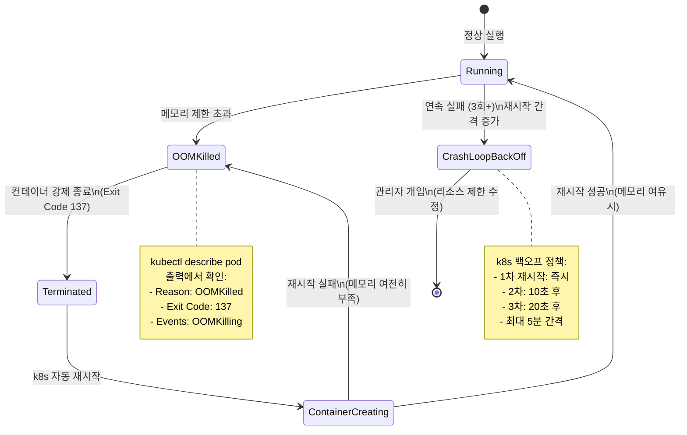

# 실습 4: k8s 장애 시뮬레이션 및 복구

> **문서 ID**: ONBOARD-10-EX04
> **버전**: 1.0.0 | **작성일**: 2026-04-12 | **작성자**: Implementer (Sonnet)
> **예상 소요 시간**: 60~90분
> **난이도**: 중급
> **선행 조건**: 가이드북 4장(인프라·k3s) 학습, kubectl 사용 가능

---

## 목차

1. [실습 목표](#1-실습-목표)
2. [배경 지식](#2-배경-지식)
3. [준비: 현재 상태 확인](#3-준비-현재-상태-확인)
4. [Step 1: OOMKilled 시뮬레이션](#4-step-1-oomkilled-시뮬레이션)
5. [Step 2: kubectl로 장애 관찰](#5-step-2-kubectl로-장애-관찰)
6. [Step 3: kubectl describe로 원인 분석](#6-step-3-kubectl-describe로-원인-분석)
7. [Step 4: 리소스 제한 수정](#7-step-4-리소스-제한-수정)
8. [Step 5: 복구 확인](#8-step-5-복구-확인)
9. [배우는 교훈](#9-배우는-교훈)
10. [Pod 복구 프로세스 다이어그램](#10-pod-복구-프로세스-다이어그램)
11. [자주 하는 실수](#11-자주-하는-실수)
12. [변경 이력](#12-변경-이력)

---

## 1. 실습 목표

**과제**: auth-service Pod을 의도적으로 OOMKilled 상태로 만들고, kubectl로 원인을 분석하여 복구하십시오.

**완료 기준**:
- kubectl get pods에서 OOMKilled 상태를 직접 확인함
- kubectl describe pod 출력에서 OOM 원인을 찾음
- 올바른 메모리 제한으로 수정하고 Pod이 Running 상태로 복구됨

**중요**: 이 실습은 로컬 k3s 환경에서만 진행하십시오. 스테이징이나 프로덕션 환경에서는 절대 진행하지 마십시오.

---

## 2. 배경 지식

### 2.1 OOMKilled란

OOMKilled(Out Of Memory Killed)는 컨테이너가 설정된 메모리 제한을 초과했을 때 k8s가 컨테이너를 강제 종료하는 상황입니다.

**발생 이유**: k8s에서는 각 Pod에 `resources.limits.memory` 값을 설정합니다. 이 값을 초과하면 리눅스 커널의 OOM Killer가 해당 프로세스를 강제로 종료합니다.

### 2.2 k8s 리소스 제한 구조

```yaml
# Pod spec 내 resources 섹션
resources:
  requests:          # 최소 보장 자원 (스케줄링 기준)
    memory: "128Mi"
    cpu: "100m"
  limits:            # 최대 사용 가능 자원 (초과 시 제한)
    memory: "256Mi"
    cpu: "500m"
```

- `requests`: Pod이 반드시 배정받아야 하는 최소 자원. 스케줄러가 이를 기준으로 노드를 선택합니다.
- `limits`: Pod이 사용할 수 있는 최대 자원. 메모리를 초과하면 OOMKilled, CPU를 초과하면 쓰로틀링됩니다.

### 2.3 kubectl 주요 명령어

| 명령어 | 설명 |
|--------|------|
| `kubectl get pods -n {namespace}` | Pod 목록 조회 |
| `kubectl describe pod {pod-name} -n {namespace}` | Pod 상세 정보 (이벤트 포함) |
| `kubectl logs {pod-name} -n {namespace}` | Pod 로그 조회 |
| `kubectl logs {pod-name} -n {namespace} --previous` | 이전 컨테이너의 로그 (재시작 전) |
| `kubectl edit deployment {name} -n {namespace}` | 배포 설정 편집 |
| `kubectl rollout restart deployment {name} -n {namespace}` | 배포 재시작 |

---

## 3. 준비: 현재 상태 확인

실습 시작 전 auth-service가 정상 실행 중인지 확인합니다.

```bash
# saas-platform 네임스페이스의 모든 Pod 확인
kubectl get pods -n saas-platform

# auth-service Pod만 확인
kubectl get pods -n saas-platform -l app=auth-service
```

**기대 출력**:

```
NAME                            READY   STATUS    RESTARTS   AGE
auth-service-7d4b9c8f6-xk2pq   1/1     Running   0          2h
```

`STATUS`가 `Running`이고 `READY`가 `1/1`이어야 합니다. 그렇지 않으면 팀원에게 문의하십시오.

현재 메모리 설정을 확인합니다.

```bash
# 현재 deployment 설정 확인
kubectl get deployment auth-service -n saas-platform -o yaml | grep -A 10 resources
```

**현재 설정 예시**:

```yaml
resources:
  requests:
    memory: "128Mi"
    cpu: "100m"
  limits:
    memory: "512Mi"
    cpu: "500m"
```

이 값을 메모해 두십시오. 실습 후 복구할 때 사용합니다.

---

## 4. Step 1: OOMKilled 시뮬레이션

메모리 제한을 매우 작게 설정하여 OOMKilled 상태를 유발합니다.

### 4.1 메모리 제한 변경

```bash
# deployment를 직접 편집
kubectl edit deployment auth-service -n saas-platform
```

편집기(보통 vi)가 열리면 `resources.limits.memory` 값을 `4Mi`로 변경합니다.

```yaml
# 변경 전
resources:
  limits:
    memory: "512Mi"

# 변경 후 (OOM 유발)
resources:
  limits:
    memory: "4Mi"    # 4MB — Node.js가 시작조차 못하는 크기
```

저장하고 편집기를 종료합니다 (vi: `:wq`).

또는 명령줄로 직접 변경할 수 있습니다.

```bash
kubectl set resources deployment auth-service \
  -n saas-platform \
  --limits=memory=4Mi
```

---

## 5. Step 2: kubectl로 장애 관찰

Pod이 재시작되는 과정을 실시간으로 관찰합니다.

### 5.1 실시간 Pod 상태 모니터링

```bash
# -w 플래그: 변경사항을 실시간으로 스트리밍
kubectl get pods -n saas-platform -l app=auth-service -w
```

**기대 출력 (시간 순서)**:

```
NAME                            READY   STATUS              RESTARTS   AGE
auth-service-7d4b9c8f6-xk2pq   1/1     Running             0          2h
auth-service-849b5c7d4-mn3qr   0/1     ContainerCreating   0          2s   ← 새 Pod 생성
auth-service-7d4b9c8f6-xk2pq   1/1     Terminating         0          2h   ← 이전 Pod 종료
auth-service-849b5c7d4-mn3qr   0/1     OOMKilled           0          5s   ← OOM 발생!
auth-service-849b5c7d4-mn3qr   0/1     CrashLoopBackOff    1          10s  ← 재시작 시도
```

`OOMKilled` 상태를 확인했으면 Ctrl+C로 모니터링을 중지합니다.

### 5.2 Pod 이름 저장

```bash
# 현재 auth-service Pod 이름 확인
AUTH_POD=$(kubectl get pod -n saas-platform -l app=auth-service -o jsonpath='{.items[0].metadata.name}')
echo "Pod 이름: $AUTH_POD"
```

---

## 6. Step 3: kubectl describe로 원인 분석

장애 원인을 상세히 분석합니다.

### 6.1 describe 실행

```bash
kubectl describe pod $AUTH_POD -n saas-platform
```

### 6.2 출력에서 확인할 항목

**출력 예시 (중요 부분 발췌)**:

```
Name:             auth-service-849b5c7d4-mn3qr
Namespace:        saas-platform
...
Containers:
  auth-service:
    ...
    Limits:
      cpu:     500m
      memory:  4Mi            ← 원인: 메모리 제한이 너무 낮음
    Requests:
      cpu:     100m
      memory:  128Mi
    ...
    Last State:     Terminated
      Reason:       OOMKilled  ← OOM으로 종료됨
      Exit Code:    137
      Started:      Sat, 12 Apr 2026 09:05:00 +0900
      Finished:     Sat, 12 Apr 2026 09:05:05 +0900
    Ready:          False
    Restart Count:  3          ← 3번 재시작
    ...

Events:
  Type     Reason      Age              From               Message
  ----     ------      ----             ----               -------
  Normal   Scheduled   5m               default-scheduler  Successfully assigned saas-platform/auth-service-849b5c7d4-mn3qr to saas-node
  Normal   Pulled      4m (x3 over 5m) kubelet            Container image already present on machine
  Normal   Created     4m (x3 over 5m) kubelet            Created container auth-service
  Normal   Started     4m (x3 over 5m) kubelet            Started container auth-service
  Warning  OOMKilling  4m (x3 over 5m) kubelet            Memory limit reached, OOMKill initiated (memory.limit_in_bytes 4194304)
```

**분석 포인트**:

| 항목 | 값 | 의미 |
|------|-----|------|
| `Reason: OOMKilled` | OOMKilled | 메모리 초과로 강제 종료 |
| `Exit Code: 137` | 137 | 128 + 9(SIGKILL) = OOM 종료 코드 |
| `Restart Count: 3` | 3 | k8s가 자동으로 3번 재시작 시도 |
| `Memory limit reached` | 이벤트 메시지 | 메모리 제한 초과 확인 |
| `memory.limit_in_bytes 4194304` | 4MB | 설정된 메모리 제한값 |

### 6.3 이전 컨테이너 로그 확인

OOMKilled 직전에 어떤 로그가 출력되었는지 확인합니다.

```bash
# --previous: 이전 컨테이너(재시작 전)의 로그
kubectl logs $AUTH_POD -n saas-platform --previous
```

---

## 7. Step 4: 리소스 제한 수정

원인을 파악했으니 올바른 값으로 복구합니다.

### 7.1 메모리 제한 복구

```bash
# 원래 값(512Mi)으로 복구
kubectl set resources deployment auth-service \
  -n saas-platform \
  --limits=memory=512Mi \
  --requests=memory=128Mi
```

또는 편집기로 직접 수정합니다.

```bash
kubectl edit deployment auth-service -n saas-platform
# memory: "512Mi" 로 변경 후 저장
```

### 7.2 올바른 메모리 설정값 산정 방법

```bash
# 현재 실제 메모리 사용량 확인 (top 명령어)
kubectl top pod -n saas-platform -l app=auth-service
```

**기대 출력**:

```
NAME                            CPU(cores)   MEMORY(bytes)
auth-service-7d4b9c8f6-xk2pq   15m          87Mi
```

실제 사용량이 87Mi라면, 일반적으로 **여유분 2배 이상**을 limits으로 설정합니다.

```
requests.memory = 실제 사용량의 1.5배 = 87Mi × 1.5 ≈ 128Mi
limits.memory   = 실제 사용량의 3배   = 87Mi × 3   ≈ 256Mi~512Mi
```

---

## 8. Step 5: 복구 확인

### 8.1 Pod 상태 확인

```bash
kubectl get pods -n saas-platform -l app=auth-service -w
```

**기대 출력**:

```
NAME                            READY   STATUS              RESTARTS   AGE
auth-service-7d4b9c8f6-pn8wr   0/1     ContainerCreating   0          2s
auth-service-7d4b9c8f6-pn8wr   0/1     Running             0          5s
auth-service-7d4b9c8f6-pn8wr   1/1     Running             0          15s  ← 완전 복구!
```

`READY: 1/1`, `STATUS: Running`이 되면 복구 완료입니다.

### 8.2 API 응답 확인

```bash
# auth-service 헬스 체크
curl -s http://localhost:3001/health/ping | jq .
# { "status": "ok", "timestamp": "...", "version": "0.3.0" }
```

### 8.3 Restart Count 초기화 확인

```bash
kubectl get pod -n saas-platform -l app=auth-service
```

새 Pod이 생성되었으므로 `RESTARTS`가 `0`으로 초기화된 것을 확인할 수 있습니다.

---

## 9. 배우는 교훈

이 실습에서 다음을 배웁니다.

**1. OOMKilled는 즉시 알아챌 수 있다**

`kubectl get pods`만 봐도 `OOMKilled` 또는 `CrashLoopBackOff`가 표시되어 즉시 이상을 감지할 수 있습니다. 모니터링 알림이 없더라도 kubectl로 주기적으로 확인하면 장애를 빠르게 발견할 수 있습니다.

**2. Exit Code 137이 보이면 OOM을 의심**

`Exit Code: 137` = `128 + 9(SIGKILL)`. OOM Killer가 SIGKILL로 강제 종료했다는 의미입니다.

**3. 메모리 limits는 여유있게 설정**

너무 타이트하게 설정하면 트래픽 증가나 일시적 메모리 스파이크에 취약합니다. 실제 사용량의 2~3배를 limits로 설정하는 것이 안전합니다.

**4. --previous 로그가 중요**

OOMKilled 이후에는 컨테이너가 재시작되므로 `kubectl logs` 만으로는 직전 로그를 볼 수 없습니다. 반드시 `--previous` 플래그를 사용해야 장애 직전 로그를 확인할 수 있습니다.

**5. 자동 복구(CrashLoopBackOff)는 임시방편**

k8s가 자동으로 재시작을 시도하지만, 근본 원인(메모리 제한)을 수정하지 않으면 계속 OOM이 발생합니다. `CrashLoopBackOff`는 "계속 재시작하는 중"을 의미하지만, 이것이 해결된 것은 아닙니다.

---

## 10. Pod 복구 프로세스 다이어그램



---

## 11. 자주 하는 실수

### 실수 1: 프로덕션 환경에서 실습

반드시 로컬 k3s 환경에서만 진행하십시오. 스테이징 또는 프로덕션에서 메모리 제한을 낮추면 실제 서비스 장애가 발생합니다.

```bash
# 현재 어떤 클러스터에 연결되어 있는지 반드시 확인
kubectl config current-context
# local-k3s 여야 안전
```

### 실수 2: 복구 후 확인 생략

`kubectl set resources` 명령을 실행한 후 반드시 Pod이 정상 상태(`1/1 Running`)가 되는지 확인하십시오. 명령이 성공했다고 해서 Pod이 즉시 복구되지는 않습니다.

### 실수 3: requests > limits 설정

`requests`가 `limits`보다 크면 k8s가 배포를 거부합니다.

```yaml
# 잘못된 예 — k8s 오류 발생
resources:
  requests:
    memory: "512Mi"  # requests가 limits보다 큼
  limits:
    memory: "256Mi"

# 올바른 예
resources:
  requests:
    memory: "128Mi"  # requests ≤ limits
  limits:
    memory: "512Mi"
```

### 실수 4: 메모리 단위 혼동

```
4M  ≠ 4Mi
4M  = 4,000,000 bytes (SI 단위)
4Mi = 4,194,304 bytes (이진 단위)
```

k8s에서는 `Mi` (메비바이트) 단위를 주로 사용합니다.

---

## 12. 변경 이력

| 버전 | 일자 | 내용 | 작성자 |
|------|------|------|--------|
| 1.0.0 | 2026-04-12 | 초안 작성 | Implementer (Sonnet) |
