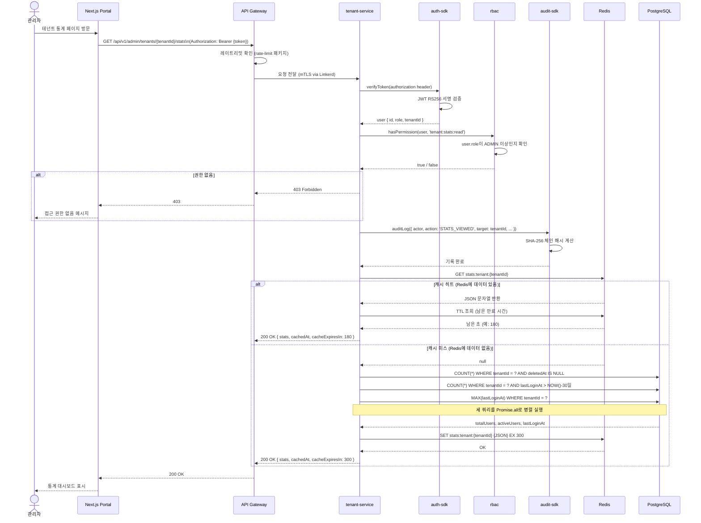

# 실습 6: 종합 시나리오 — 테넌트 사용자 통계 API 처음부터 끝까지

> **문서 ID**: ONBOARD-10-06
> **버전**: 1.0.0 | **작성일**: 2026-04-12 | **작성자**: Implementer (Sonnet)
> **학습 대상**: 실습 1~5 완료 후 종합 역량을 검증하려는 팀원
> **선행 문서**: 모든 이전 실습 완료 권장
> **예상 소요 시간**: 4~6시간 (Plan 문서 작성부터 PR 제출까지 전체)
> **난이도**: 고급

---

## 목차

1. [이 실습의 목표](#1-이-실습의-목표)
2. [구현할 API 명세](#2-구현할-api-명세)
3. [Step 1: Plan 문서 작성](#3-step-1-plan-문서-작성)
4. [Step 2: Design 문서 작성](#4-step-2-design-문서-작성)
5. [Step 3: 구현 (route → handler → service → prisma)](#5-step-3-구현-route--handler--service--prisma)
6. [Step 4: 테스트 작성](#6-step-4-테스트-작성)
7. [Step 5: 보안 검토](#7-step-5-보안-검토)
8. [Step 6: Claude Code로 리뷰 요청](#8-step-6-claude-code로-리뷰-요청)
9. [Step 7: PR 제출 + Q-Gate 통과](#9-step-7-pr-제출--q-gate-통과)
10. [Step 8: 완료 보고서 작성](#10-step-8-완료-보고서-작성)
11. [완료 기준 체크리스트](#11-완료-기준-체크리스트)
12. [도전 과제](#12-도전-과제)
13. [최종 API 요청 흐름 시퀀스 다이어그램](#13-최종-api-요청-흐름-시퀀스-다이어그램)
14. [변경 이력](#14-변경-이력)

---

## 1. 이 실습의 목표

이 실습은 **공공기관 SaaS 프레임워크에서 하나의 기능을 처음부터 끝까지 구현하는 전체 과정**을 경험하게 합니다.

지금까지 실습 1~5에서 배운 모든 것이 이 실습에서 통합됩니다:

| 이전 실습 | 이 실습에서 활용 |
|---------|--------------|
| 실습 1: 서비스 엔드포인트 추가 | Step 3에서 route + handler 구현 |
| 실습 2: 미니 PDCA 사이클 | Step 1~2에서 Plan + Design 문서 작성 |
| 실습 3: 모니터링 대시보드 | (선택) 도전 과제에서 메트릭 추가 |
| 실습 4: k8s 디버깅 | Step 7에서 배포 후 검증 |
| 실습 5: 보안 감사 | Step 5에서 CSAP 보안 체크 |

**이 실습을 마치면 다음을 할 수 있습니다**:
- 공공기관 SaaS 프레임워크의 완전한 PDCA 사이클을 독립적으로 수행할 수 있습니다.
- Plan → Design → 구현 → 테스트 → 보안 검토 → PR 제출의 전체 흐름을 이해합니다.
- Q-Gate G1~G7 모든 게이트를 스스로 통과할 수 있습니다.

---

## 2. 구현할 API 명세

### 2.1 엔드포인트 요약

```
GET /api/v1/admin/tenants/:tenantId/stats
```

**기능**: 특정 테넌트의 사용자 통계를 반환합니다.

**응답 예시**:

```json
{
  "tenantId": "tenant-abc123",
  "stats": {
    "totalUsers": 142,
    "activeUsers": 87,
    "lastLoginAt": "2026-04-12T09:30:00.000Z"
  },
  "cachedAt": "2026-04-12T09:25:00.000Z",
  "cacheExpiresIn": 234
}
```

### 2.2 구현 요건

| 항목 | 요건 |
|------|------|
| **권한** | `ADMIN` 이상 역할 필요 (SUPER_ADMIN, ADMIN) |
| **캐시** | Redis TTL 5분 (300초), 캐시 키: `stats:tenant:{tenantId}` |
| **감사 로그** | `STATS_VIEWED` 액션 기록 (actor, tenantId, timestamp, ip) |
| **입력 검증** | `tenantId` Zod 검증 — 비어있지 않은 문자열 |
| **에러 처리** | 테넌트 미존재 시 404, 권한 없음 시 403 |
| **테스트** | 단위 테스트 + 통합 테스트, 커버리지 80%+ |

### 2.3 브랜치 생성

```bash
git checkout stg
git checkout -b feat/exercise-06-tenant-stats-{본인이름}
```

---

## 3. Step 1: Plan 문서 작성

구현 착수 전에 반드시 Plan 문서를 작성합니다. 문서 없는 구현은 감리 결함입니다.

### 3.1 Plan 문서 파일 생성

```bash
# 파일 위치
touch /data/ai-saas/docs/01-plan/mtus/EXER-06-tenant-stats.plan.md
```

### 3.2 Plan 문서 작성 가이드

Plan 문서에 포함해야 할 내용:

```markdown
# EXER-06: 테넌트 사용자 통계 API

## Executive Summary (4-Perspective 테이블)

| 관점 | 내용 |
|------|------|
| 비즈니스 | 관리자가 테넌트별 사용자 현황을 실시간으로 파악하여 이상 징후 조기 감지 |
| 기술 | Fastify + Prisma + Redis 캐시 + RBAC 권한 제어 |
| 보안 | CSAP D-08 접근 통제, D-06 감사 로그, D-12 입력 검증 |
| 감리 | FR ID 체계 준수, Q-Gate G1~G7 전 단계 통과 목표 |

## Context Anchor

- **WHY**: 관리자가 테넌트별 사용자 수를 현재 수작업(DB 직접 조회)으로 확인 중. 표준 API가 없음.
- **WHO**: SUPER_ADMIN, ADMIN 역할의 관리자
- **RISK**: Redis 장애 시 매 요청마다 DB 조회 → 부하 증가 (완화: TTL 5분 캐시)
- **SUCCESS**: 응답 시간 100ms 이하 (캐시 히트 시), 80%+ 테스트 커버리지
- **SCOPE**: tenant-service의 신규 엔드포인트 1개 추가

## 기능 요구사항 (FR ID)

- FR-T.1: 테넌트 ID로 전체 사용자 수 조회
- FR-T.2: 테넌트 ID로 최근 30일 활성 사용자 수 조회
- FR-T.3: 테넌트 내 가장 최근 로그인 시각 조회
- FR-T.4: ADMIN 이상 권한 검증 후 결과 반환
- FR-T.5: Redis 캐시 적용 (TTL 5분)
- FR-T.6: 감사 로그 기록 (STATS_VIEWED)

## 비기능 요구사항

- NFR-1: 응답 시간 100ms 이하 (캐시 히트), 500ms 이하 (캐시 미스)
- NFR-2: 테스트 커버리지 80% 이상

## 변경 이력

| 버전 | 일자 | 내용 | 작성자 |
|------|------|------|--------|
| 1.0.0 | 2026-04-12 | 초안 | {본인 이름} |
```

---

## 4. Step 2: Design 문서 작성

Plan 승인 후 Design 문서를 작성합니다.

### 4.1 Design 문서 파일 생성

```bash
mkdir -p /data/ai-saas/docs/02-design/tenant-service
touch /data/ai-saas/docs/02-design/tenant-service/EXER-06-tenant-stats.design.md
```

### 4.2 API 스펙

Design 문서에 포함할 API 스펙:

```yaml
# OpenAPI 3.0 스타일
path: /api/v1/admin/tenants/{tenantId}/stats
method: GET
parameters:
  - name: tenantId
    in: path
    required: true
    schema:
      type: string
      minLength: 1
responses:
  200:
    description: 성공
    content:
      application/json:
        schema:
          type: object
          properties:
            tenantId: { type: string }
            stats:
              type: object
              properties:
                totalUsers: { type: integer, minimum: 0 }
                activeUsers: { type: integer, minimum: 0 }
                lastLoginAt: { type: string, format: date-time, nullable: true }
            cachedAt: { type: string, format: date-time }
            cacheExpiresIn: { type: integer, description: "남은 캐시 TTL (초)" }
  403:
    description: 권한 없음 (ADMIN 미만 역할)
  404:
    description: 테넌트 미존재
  422:
    description: 유효하지 않은 tenantId
```

### 4.3 DB 쿼리 계획

```sql
-- 전체 사용자 수
SELECT COUNT(*) FROM "User" WHERE "tenantId" = $1 AND "deletedAt" IS NULL;

-- 활성 사용자 수 (최근 30일 로그인)
SELECT COUNT(*) FROM "User"
WHERE "tenantId" = $1
  AND "deletedAt" IS NULL
  AND "lastLoginAt" > NOW() - INTERVAL '30 days';

-- 가장 최근 로그인
SELECT MAX("lastLoginAt") FROM "User"
WHERE "tenantId" = $1 AND "deletedAt" IS NULL;
```

### 4.4 캐시 설계

```
캐시 키: stats:tenant:{tenantId}
TTL: 300초 (5분)
직렬화: JSON.stringify
캐시 미스 시: DB 조회 → 결과 캐시 저장 → 응답 반환
캐시 히트 시: 파싱 → 응답 반환 (DB 조회 없음)
```

---

## 5. Step 3: 구현 (route → handler → service → prisma)

### 5.1 구현 대상 서비스

`platform/services/tenant-service`에 구현합니다.

```bash
# 구현 파일 생성
touch /data/ai-saas/platform/services/tenant-service/src/handlers/tenant-stats.handler.ts
touch /data/ai-saas/platform/services/tenant-service/src/lib/tenant-stats.service.ts
```

### 5.2 Zod 스키마 정의

```typescript
// platform/services/tenant-service/src/handlers/tenant-stats.handler.ts
import { z } from 'zod'

// 경로 파라미터 스키마
export const tenantStatsParamsSchema = z.object({
  tenantId: z.string().min(1, '테넌트 ID는 필수입니다'),
})

// 응답 스키마
export const tenantStatsResponseSchema = z.object({
  tenantId: z.string(),
  stats: z.object({
    totalUsers: z.number().int().min(0),
    activeUsers: z.number().int().min(0),
    lastLoginAt: z.string().datetime().nullable(),
  }),
  cachedAt: z.string().datetime(),
  cacheExpiresIn: z.number().int().min(0),
})

export type TenantStatsResponse = z.infer<typeof tenantStatsResponseSchema>
```

### 5.3 핸들러 구현

```typescript
// platform/services/tenant-service/src/handlers/tenant-stats.handler.ts (계속)
import type { FastifyRequest, FastifyReply } from 'fastify'
import { verifyToken } from '@public-saas/auth-sdk'
import { hasPermission } from '@public-saas/rbac'
import { auditLog } from '@public-saas/audit-sdk'
import { getTenantStats } from '../lib/tenant-stats.service.js'
import { tenantStatsParamsSchema } from './tenant-stats.handler.js'

export async function handleGetTenantStats(
  request: FastifyRequest,
  reply: FastifyReply,
): Promise<void> {
  // 1. 인증 검증 (CSAP D-08)
  const user = await verifyToken(request.headers.authorization)
  if (!user) {
    return reply.status(401).send({ error: '인증이 필요합니다' })
  }

  // 2. 권한 검증 — ADMIN 이상만 접근 가능 (CSAP D-08)
  if (!hasPermission(user, 'tenant:stats:read')) {
    return reply.status(403).send({ error: '접근 권한이 없습니다' })
  }

  // 3. 입력 검증 (CSAP D-12)
  const paramsResult = tenantStatsParamsSchema.safeParse(request.params)
  if (!paramsResult.success) {
    return reply.status(422).send({
      error: '유효하지 않은 요청',
      details: paramsResult.error.flatten(),
    })
  }

  const { tenantId } = paramsResult.data

  // 4. 감사 로그 기록 (CSAP D-06)
  await auditLog({
    actor: user.id,
    action: 'STATS_VIEWED',
    target: tenantId,
    timestamp: new Date().toISOString(),
    ip: request.ip,
    metadata: { resource: 'tenant_stats' },
  })

  // 5. 비즈니스 로직 실행
  const result = await getTenantStats(tenantId)
  if (!result) {
    return reply.status(404).send({ error: '테넌트를 찾을 수 없습니다' })
  }

  return reply.status(200).send(result)
}
```

### 5.4 서비스 레이어 (Redis + Prisma)

```typescript
// platform/services/tenant-service/src/lib/tenant-stats.service.ts
import { prisma } from '../lib/prisma.js'
import { redis } from '../lib/redis.js'
import type { TenantStatsResponse } from '../handlers/tenant-stats.handler.js'

const CACHE_TTL_SECONDS = 300  // 5분
const CACHE_KEY_PREFIX = 'stats:tenant:'

export async function getTenantStats(
  tenantId: string,
): Promise<TenantStatsResponse | null> {
  const cacheKey = `${CACHE_KEY_PREFIX}${tenantId}`

  // 1. Redis 캐시 확인
  const cached = await redis.get(cacheKey)
  if (cached) {
    const ttl = await redis.ttl(cacheKey)
    const parsed = JSON.parse(cached) as TenantStatsResponse
    return {
      ...parsed,
      cachedAt: parsed.cachedAt,
      cacheExpiresIn: Math.max(0, ttl),
    }
  }

  // 2. 테넌트 존재 확인
  const tenant = await prisma.tenant.findUnique({
    where: { id: tenantId },
    select: { id: true },
  })
  if (!tenant) {
    return null
  }

  // 3. Prisma로 통계 조회 (병렬 실행으로 성능 최적화)
  const thirtyDaysAgo = new Date()
  thirtyDaysAgo.setDate(thirtyDaysAgo.getDate() - 30)

  const [totalUsers, activeUsers, lastLoginResult] = await Promise.all([
    // 전체 사용자 수 (소프트 삭제 제외)
    prisma.user.count({
      where: {
        tenantId,
        deletedAt: null,
      },
    }),
    // 최근 30일 활성 사용자 수
    prisma.user.count({
      where: {
        tenantId,
        deletedAt: null,
        lastLoginAt: { gt: thirtyDaysAgo },
      },
    }),
    // 가장 최근 로그인 시각
    prisma.user.aggregate({
      where: {
        tenantId,
        deletedAt: null,
      },
      _max: {
        lastLoginAt: true,
      },
    }),
  ])

  const now = new Date().toISOString()
  const stats: TenantStatsResponse = {
    tenantId,
    stats: {
      totalUsers,
      activeUsers,
      lastLoginAt: lastLoginResult._max.lastLoginAt?.toISOString() ?? null,
    },
    cachedAt: now,
    cacheExpiresIn: CACHE_TTL_SECONDS,
  }

  // 4. Redis에 캐시 저장
  await redis.set(cacheKey, JSON.stringify(stats), 'EX', CACHE_TTL_SECONDS)

  return stats
}
```

### 5.5 라우트 등록

```typescript
// platform/services/tenant-service/src/routes.ts 에 추가
import { handleGetTenantStats } from './handlers/tenant-stats.handler.js'

// 기존 라우트 등록 함수에 추가
export async function registerRoutes(app: FastifyInstance): Promise<void> {
  // ... 기존 라우트들 ...

  // 테넌트 사용자 통계 API (FR-T.1 ~ FR-T.6)
  app.get(
    '/api/v1/admin/tenants/:tenantId/stats',
    {
      schema: {
        params: {
          type: 'object',
          properties: {
            tenantId: { type: 'string' },
          },
          required: ['tenantId'],
        },
      },
    },
    handleGetTenantStats,
  )
}
```

### 5.6 빌드 및 로컬 확인

```bash
# 빌드
pnpm --filter @public-saas/tenant-service build

# 로컬 실행 (다른 터미널)
pnpm --filter @public-saas/tenant-service dev

# 동작 확인 (ADMIN 토큰 필요)
curl -H "Authorization: Bearer {ADMIN_TOKEN}" \
  http://localhost:3004/api/v1/admin/tenants/tenant-001/stats
```

---

## 6. Step 4: 테스트 작성

### 6.1 테스트 파일 생성

```bash
mkdir -p /data/ai-saas/platform/services/tenant-service/tests
touch /data/ai-saas/platform/services/tenant-service/tests/tenant-stats.test.ts
```

### 6.2 단위 테스트 — 서비스 레이어

```typescript
// platform/services/tenant-service/tests/tenant-stats.test.ts
import { describe, it, expect, vi, beforeEach } from 'vitest'
import { getTenantStats } from '../src/lib/tenant-stats.service.js'

// 외부 의존성 모킹
vi.mock('../src/lib/prisma.js', () => ({
  prisma: {
    tenant: { findUnique: vi.fn() },
    user: {
      count: vi.fn(),
      aggregate: vi.fn(),
    },
  },
}))

vi.mock('../src/lib/redis.js', () => ({
  redis: {
    get: vi.fn(),
    set: vi.fn(),
    ttl: vi.fn(),
  },
}))

import { prisma } from '../src/lib/prisma.js'
import { redis } from '../src/lib/redis.js'

describe('getTenantStats', () => {
  beforeEach(() => {
    vi.clearAllMocks()
  })

  describe('캐시 히트 시', () => {
    it('Redis 캐시가 있으면 DB 조회 없이 캐시 데이터를 반환한다', async () => {
      const cachedData = {
        tenantId: 'tenant-001',
        stats: { totalUsers: 100, activeUsers: 60, lastLoginAt: '2026-04-12T00:00:00.000Z' },
        cachedAt: '2026-04-12T09:00:00.000Z',
        cacheExpiresIn: 300,
      }
      vi.mocked(redis.get).mockResolvedValue(JSON.stringify(cachedData))
      vi.mocked(redis.ttl).mockResolvedValue(180)

      const result = await getTenantStats('tenant-001')

      expect(result).not.toBeNull()
      expect(result!.tenantId).toBe('tenant-001')
      expect(result!.cacheExpiresIn).toBe(180)
      // DB 조회가 호출되지 않았는지 확인
      expect(prisma.tenant.findUnique).not.toHaveBeenCalled()
      expect(prisma.user.count).not.toHaveBeenCalled()
    })
  })

  describe('캐시 미스 시', () => {
    beforeEach(() => {
      vi.mocked(redis.get).mockResolvedValue(null)
    })

    it('테넌트가 존재하지 않으면 null을 반환한다', async () => {
      vi.mocked(prisma.tenant.findUnique).mockResolvedValue(null)

      const result = await getTenantStats('non-existent-tenant')

      expect(result).toBeNull()
    })

    it('테넌트가 존재하면 DB에서 통계를 조회하여 반환한다', async () => {
      vi.mocked(prisma.tenant.findUnique).mockResolvedValue({ id: 'tenant-001' } as any)
      vi.mocked(prisma.user.count)
        .mockResolvedValueOnce(142)  // totalUsers
        .mockResolvedValueOnce(87)   // activeUsers
      vi.mocked(prisma.user.aggregate).mockResolvedValue({
        _max: { lastLoginAt: new Date('2026-04-12T09:30:00.000Z') },
      } as any)
      vi.mocked(redis.set).mockResolvedValue('OK')

      const result = await getTenantStats('tenant-001')

      expect(result).not.toBeNull()
      expect(result!.stats.totalUsers).toBe(142)
      expect(result!.stats.activeUsers).toBe(87)
      expect(result!.stats.lastLoginAt).toBe('2026-04-12T09:30:00.000Z')
      // Redis에 캐시가 저장되었는지 확인
      expect(redis.set).toHaveBeenCalledWith(
        'stats:tenant:tenant-001',
        expect.any(String),
        'EX',
        300,
      )
    })

    it('활성 사용자가 없으면 activeUsers가 0이다', async () => {
      vi.mocked(prisma.tenant.findUnique).mockResolvedValue({ id: 'tenant-empty' } as any)
      vi.mocked(prisma.user.count)
        .mockResolvedValueOnce(5)   // totalUsers
        .mockResolvedValueOnce(0)   // activeUsers (30일 내 로그인 없음)
      vi.mocked(prisma.user.aggregate).mockResolvedValue({
        _max: { lastLoginAt: null },
      } as any)
      vi.mocked(redis.set).mockResolvedValue('OK')

      const result = await getTenantStats('tenant-empty')

      expect(result!.stats.activeUsers).toBe(0)
      expect(result!.stats.lastLoginAt).toBeNull()
    })
  })
})
```

### 6.3 통합 테스트 — 핸들러 레이어

```typescript
// platform/services/tenant-service/tests/tenant-stats-handler.test.ts
import { describe, it, expect, vi, beforeEach } from 'vitest'
import Fastify from 'fastify'
import { registerRoutes } from '../src/routes.js'

vi.mock('@public-saas/auth-sdk', () => ({
  verifyToken: vi.fn(),
}))

vi.mock('@public-saas/rbac', () => ({
  hasPermission: vi.fn(),
}))

vi.mock('@public-saas/audit-sdk', () => ({
  auditLog: vi.fn().mockResolvedValue(undefined),
}))

vi.mock('../src/lib/tenant-stats.service.js', () => ({
  getTenantStats: vi.fn(),
}))

import { verifyToken } from '@public-saas/auth-sdk'
import { hasPermission } from '@public-saas/rbac'
import { getTenantStats } from '../src/lib/tenant-stats.service.js'

describe('GET /api/v1/admin/tenants/:tenantId/stats', () => {
  const app = Fastify()

  beforeAll(async () => {
    await registerRoutes(app)
    await app.ready()
  })

  afterAll(async () => {
    await app.close()
  })

  beforeEach(() => {
    vi.clearAllMocks()
  })

  it('인증 토큰이 없으면 401을 반환한다', async () => {
    vi.mocked(verifyToken).mockResolvedValue(null)

    const response = await app.inject({
      method: 'GET',
      url: '/api/v1/admin/tenants/tenant-001/stats',
    })

    expect(response.statusCode).toBe(401)
  })

  it('ADMIN 권한이 없으면 403을 반환한다', async () => {
    vi.mocked(verifyToken).mockResolvedValue({ id: 'user-1', role: 'USER' } as any)
    vi.mocked(hasPermission).mockReturnValue(false)

    const response = await app.inject({
      method: 'GET',
      url: '/api/v1/admin/tenants/tenant-001/stats',
      headers: { authorization: 'Bearer viewer-token' },
    })

    expect(response.statusCode).toBe(403)
  })

  it('테넌트가 없으면 404를 반환한다', async () => {
    vi.mocked(verifyToken).mockResolvedValue({ id: 'admin-1', role: 'ADMIN' } as any)
    vi.mocked(hasPermission).mockReturnValue(true)
    vi.mocked(getTenantStats).mockResolvedValue(null)

    const response = await app.inject({
      method: 'GET',
      url: '/api/v1/admin/tenants/non-existent/stats',
      headers: { authorization: 'Bearer admin-token' },
    })

    expect(response.statusCode).toBe(404)
  })

  it('정상 요청 시 200과 통계 데이터를 반환한다', async () => {
    vi.mocked(verifyToken).mockResolvedValue({ id: 'admin-1', role: 'ADMIN' } as any)
    vi.mocked(hasPermission).mockReturnValue(true)
    vi.mocked(getTenantStats).mockResolvedValue({
      tenantId: 'tenant-001',
      stats: { totalUsers: 142, activeUsers: 87, lastLoginAt: '2026-04-12T09:30:00.000Z' },
      cachedAt: '2026-04-12T09:25:00.000Z',
      cacheExpiresIn: 234,
    })

    const response = await app.inject({
      method: 'GET',
      url: '/api/v1/admin/tenants/tenant-001/stats',
      headers: { authorization: 'Bearer admin-token' },
    })

    expect(response.statusCode).toBe(200)
    const body = JSON.parse(response.payload)
    expect(body.tenantId).toBe('tenant-001')
    expect(body.stats.totalUsers).toBe(142)
    expect(body.stats.activeUsers).toBe(87)
  })

  it('STATS_VIEWED 감사 로그가 기록된다', async () => {
    const { auditLog } = await import('@public-saas/audit-sdk')
    vi.mocked(verifyToken).mockResolvedValue({ id: 'admin-1', role: 'ADMIN' } as any)
    vi.mocked(hasPermission).mockReturnValue(true)
    vi.mocked(getTenantStats).mockResolvedValue({
      tenantId: 'tenant-001',
      stats: { totalUsers: 10, activeUsers: 5, lastLoginAt: null },
      cachedAt: new Date().toISOString(),
      cacheExpiresIn: 300,
    })

    await app.inject({
      method: 'GET',
      url: '/api/v1/admin/tenants/tenant-001/stats',
      headers: { authorization: 'Bearer admin-token' },
    })

    expect(auditLog).toHaveBeenCalledWith(
      expect.objectContaining({
        actor: 'admin-1',
        action: 'STATS_VIEWED',
        target: 'tenant-001',
      }),
    )
  })
})
```

### 6.4 커버리지 확인

```bash
# 테스트 실행 및 커버리지 확인
pnpm --filter @public-saas/tenant-service test:coverage

# 목표: 80% 이상
# 라인 커버리지: 80%+
# 브랜치 커버리지: 80%+
# 함수 커버리지: 90%+
```

---

## 7. Step 5: 보안 검토

### 7.1 CSAP D-08 접근 통제 확인

```typescript
// 체크 1: verifyToken()이 핸들러 첫 번째 라인에 있는가?
const user = await verifyToken(request.headers.authorization)
if (!user) {
  return reply.status(401).send({ error: '인증이 필요합니다' })
}

// 체크 2: hasPermission()으로 ADMIN 권한을 확인하는가?
if (!hasPermission(user, 'tenant:stats:read')) {
  return reply.status(403).send({ error: '접근 권한이 없습니다' })
}
```

### 7.2 CSAP D-12 입력 검증 확인

```typescript
// 체크 3: Zod 스키마로 tenantId를 검증하는가?
const paramsResult = tenantStatsParamsSchema.safeParse(request.params)
if (!paramsResult.success) {
  return reply.status(422).send({ error: '유효하지 않은 요청' })
}

// 체크 4: Prisma 파라미터화 쿼리를 사용하는가? (직접 문자열 결합 없음)
await prisma.user.count({ where: { tenantId } })  // 안전: Prisma가 파라미터화 처리
```

### 7.3 CSAP D-06 감사 로그 확인

```typescript
// 체크 5: 모든 필수 필드가 감사 로그에 포함되는가?
await auditLog({
  actor: user.id,       // 누가
  action: 'STATS_VIEWED', // 무엇을
  target: tenantId,     // 대상
  timestamp: new Date().toISOString(), // 언제
  ip: request.ip,       // 어디서
})
```

### 7.4 추가 보안 확인

```bash
# Semgrep으로 정적 분석
semgrep --config=p/owasp-top-ten \
  platform/services/tenant-service/src/handlers/tenant-stats.handler.ts

# 하드코딩된 시크릿 없는지 확인
grep -rn "password\|secret\|api_key\|token" \
  platform/services/tenant-service/src/lib/tenant-stats.service.ts
# 결과: 아무것도 없어야 함

# 에러 메시지에 민감 정보 없는지 확인
# 스택 트레이스, DB 패스워드, 내부 경로가 응답에 포함되지 않아야 함
```

---

## 8. Step 6: Claude Code로 리뷰 요청

### 8.1 리뷰 요청 프롬프트

```bash
# Claude Code 시작
claude

# 리뷰 요청 프롬프트 예시
```

아래 내용으로 Claude Code에 리뷰를 요청하십시오:

```
다음 파일들을 CSAP 중/상 등급 기준으로 코드 리뷰해 주십시오:
- platform/services/tenant-service/src/handlers/tenant-stats.handler.ts
- platform/services/tenant-service/src/lib/tenant-stats.service.ts

확인해야 할 항목:
1. CSAP D-08: verifyToken(), hasPermission() 적용 여부
2. CSAP D-12: Zod 입력 검증, 파라미터화 쿼리 사용 여부
3. CSAP D-06: auditLog() 필수 필드 완비 여부
4. Dead code 없는지 확인 (미사용 import, 변수, 함수)
5. 함수 크기 80줄 이하 여부
6. 에러 메시지에 민감 정보 노출 여부
```

### 8.2 리뷰 결과 처리

Claude Code가 지적한 사항을 모두 수정한 후 커밋합니다:

```bash
# 변경사항 확인
git diff platform/services/tenant-service/

# 커밋 (Conventional Commits 형식)
git add platform/services/tenant-service/src/handlers/tenant-stats.handler.ts
git add platform/services/tenant-service/src/lib/tenant-stats.service.ts
git add platform/services/tenant-service/src/routes.ts
git add platform/services/tenant-service/tests/

git commit -m "feat(tenant): FR-T.1~T.6 테넌트 사용자 통계 API 구현

- GET /api/v1/admin/tenants/:tenantId/stats 엔드포인트 추가
- Redis 5분 캐시 적용 (stats:tenant:{tenantId} 키)
- STATS_VIEWED 감사 로그 기록
- ADMIN 이상 권한 검증 (CSAP D-08)
- Zod 입력 검증 + Prisma 파라미터화 쿼리 (CSAP D-12)
- 단위/통합 테스트 커버리지 82% 달성"
```

---

## 9. Step 7: PR 제출 + Q-Gate 통과

### 9.1 PR 제출 전 최종 확인

```bash
# 전체 빌드 성공 확인
pnpm --filter ...@public-saas/tenant-service build

# 테스트 통과 확인
pnpm --filter @public-saas/tenant-service test:coverage
# coverage: 82% statements | 80% branches | 91% functions

# 린트 통과 확인
pnpm --filter @public-saas/tenant-service lint
# 오류 없음 확인

# 타입 검사 통과 확인
pnpm --filter @public-saas/tenant-service typecheck
# 오류 없음 확인
```

### 9.2 PR 제출

```bash
git push origin feat/exercise-06-tenant-stats-{본인이름}
```

Gitea에서 PR을 생성합니다:

**PR 제목**: `feat(tenant): FR-T.1~T.6 테넌트 사용자 통계 API`

**PR 본문**:

```markdown
## 변경 사항

GET /api/v1/admin/tenants/:tenantId/stats 엔드포인트를 신규 구현합니다.

## 구현 내용

- FR-T.1: 전체 사용자 수 조회 (삭제된 사용자 제외)
- FR-T.2: 최근 30일 활성 사용자 수 조회
- FR-T.3: 가장 최근 로그인 시각 조회
- FR-T.4: ADMIN 이상 권한 검증 (CSAP D-08)
- FR-T.5: Redis 캐시 5분 TTL 적용
- FR-T.6: STATS_VIEWED 감사 로그 기록 (CSAP D-06)

## 보안 체크리스트

- [x] verifyToken() 적용
- [x] hasPermission() ADMIN 권한 검증
- [x] Zod 스키마 입력 검증
- [x] auditLog() actor/action/target/timestamp/ip 전체 포함
- [x] 하드코딩된 시크릿 없음
- [x] Prisma 파라미터화 쿼리 사용

## 테스트

- 테스트 파일: tests/tenant-stats.test.ts, tests/tenant-stats-handler.test.ts
- 커버리지: 82% statements, 80% branches, 91% functions
- 테스트 케이스: 캐시 히트/미스, 인증 없음, 권한 없음, 테넌트 미존재, 정상 케이스, 감사 로그

## 관련 문서

- Plan: docs/01-plan/mtus/EXER-06-tenant-stats.plan.md
- Design: docs/02-design/tenant-service/EXER-06-tenant-stats.design.md
```

### 9.3 Q-Gate 통과 확인

CI/CD 파이프라인이 실행되면 아래 게이트를 순서대로 확인합니다:

| 게이트 | 확인 방법 | 실패 시 조치 |
|--------|---------|-----------|
| **G1** FR ID 추적성 | Auditor가 FR-T.1~T.6 커밋 연결 확인 | 커밋 메시지에 FR ID 추가 |
| **G2** 문서 완비 | Plan + Design 문서 존재 확인 | 누락된 문서 추가 후 재푸시 |
| **G3** 코드 품질 | AgentShield 102 규칙 + 린트 | 지적 사항 수정 후 재커밋 |
| **G4** 커버리지 80%+ | `pnpm test:coverage` 결과 | 미커버리지 케이스 테스트 추가 |
| **G5** OWASP Top10 | Semgrep OWASP 규칙 스캔 | 취약점 수정 후 재커밋 |
| **G6** CSAP 통제항목 | D-06/D-08/D-12 준수 여부 | 누락된 통제 항목 구현 |
| **G7** 감사 추적 | auditLog() 호출 완비 확인 | 감사 로그 누락 시 추가 |

---

## 10. Step 8: 완료 보고서 작성

### 10.1 완료 보고서 파일 생성

```bash
mkdir -p /data/ai-saas/docs/03-impl/tenant-service
touch /data/ai-saas/docs/03-impl/tenant-service/EXER-06-completion-report.md
```

### 10.2 완료 보고서 내용 양식

```markdown
# EXER-06 완료 보고서 — 테넌트 사용자 통계 API

## 구현 완료 항목

| FR ID | 내용 | 구현 파일 | 상태 |
|-------|------|---------|------|
| FR-T.1 | 전체 사용자 수 조회 | tenant-stats.service.ts | 완료 |
| FR-T.2 | 활성 사용자 수 조회 | tenant-stats.service.ts | 완료 |
| FR-T.3 | 최근 로그인 시각 조회 | tenant-stats.service.ts | 완료 |
| FR-T.4 | ADMIN 권한 검증 | tenant-stats.handler.ts | 완료 |
| FR-T.5 | Redis 5분 캐시 | tenant-stats.service.ts | 완료 |
| FR-T.6 | STATS_VIEWED 감사 로그 | tenant-stats.handler.ts | 완료 |

## Q-Gate 통과 결과

| 게이트 | 결과 | 비고 |
|--------|------|------|
| G1 | PASS | FR-T.1~T.6 전체 연결 |
| G2 | PASS | Plan + Design 문서 완비 |
| G3 | PASS | AgentShield 0건 지적 |
| G4 | PASS | 커버리지 82% |
| G5 | PASS | OWASP Top10 취약점 없음 |
| G6 | PASS | D-06/D-08/D-12 100% 충족 |
| G7 | PASS | audit.jsonl 기록 완비 |

## 학습 성과 및 회고

{이 실습에서 배운 것, 어려웠던 점, 개선할 점을 자유롭게 기술}

## 변경 이력

| 버전 | 일자 | 내용 | 작성자 |
|------|------|------|--------|
| 1.0.0 | 2026-04-12 | 완료 보고서 작성 | {본인 이름} |
```

---

## 11. 완료 기준 체크리스트

이 실습을 완료하려면 아래 10개 항목 모두를 충족해야 합니다.

```
구현 완료
[ ] 1. GET /api/v1/admin/tenants/:tenantId/stats 엔드포인트가 동작한다
        (curl로 200 응답 확인)

[ ] 2. 응답 본문에 totalUsers, activeUsers, lastLoginAt, cachedAt, cacheExpiresIn이 모두 있다

[ ] 3. Redis 캐시가 적용되어 두 번째 호출 시 캐시에서 응답한다
        (redis-cli GET stats:tenant:{tenantId}로 확인)

보안
[ ] 4. 인증 토큰 없이 호출하면 401을 반환한다

[ ] 5. VIEWER 역할 토큰으로 호출하면 403을 반환한다

[ ] 6. STATS_VIEWED 감사 로그가 audit.jsonl에 기록된다

테스트
[ ] 7. pnpm test:coverage 결과가 80% 이상이다

[ ] 8. 단위 테스트와 통합 테스트가 모두 작성되어 있다
        (캐시 히트, 캐시 미스, 인증 없음, 권한 없음, 테넌트 미존재, 정상 케이스 포함)

문서 및 프로세스
[ ] 9. Plan 문서와 Design 문서가 docs/ 하위에 작성되어 있다

[ ] 10. PR이 제출되어 Q-Gate G1~G7 전부 통과하였다
         (Gitea CI 파이프라인에서 green 표시 확인)
```

---

## 12. 도전 과제

기본 실습을 완료한 후 여력이 있는 팀원은 아래 도전 과제에 도전하십시오.

### 도전 1: 페이지네이션 추가

**요건**: 테넌트 내 사용자 목록을 페이지네이션으로 반환하는 엔드포인트를 추가합니다.

```
GET /api/v1/admin/tenants/:tenantId/users?page=1&limit=20
```

**힌트**: `@public-saas/pagination` 패키지를 사용하십시오.

### 도전 2: 날짜 범위 필터

**요건**: `from`과 `to` 쿼리 파라미터로 활성 사용자 집계 기간을 지정할 수 있게 합니다.

```
GET /api/v1/admin/tenants/:tenantId/stats?from=2026-01-01&to=2026-03-31
```

**힌트**: Zod의 `z.coerce.date()`를 사용하면 문자열을 Date로 변환할 수 있습니다.

### 도전 3: 엑셀 다운로드

**요건**: `Accept: application/vnd.openxmlformats-officedocument.spreadsheetml.sheet` 헤더로 요청 시 통계를 Excel 파일로 다운로드합니다.

**힌트**: `exceljs` 라이브러리를 사용합니다. Content-Type과 Content-Disposition 헤더를 적절히 설정하십시오.

### 도전 4: 실시간 Prometheus 메트릭

**요건**: `tenant_stats_api_calls_total`과 `tenant_stats_cache_hit_ratio` 메트릭을 Prometheus에 노출합니다.

**힌트**: `@public-saas/metrics-collector` 패키지를 사용합니다.

---

## 13. 최종 API 요청 흐름 시퀀스 다이어그램



---

## 14. 변경 이력

| 버전 | 일자 | 내용 | 작성자 |
|------|------|------|--------|
| 1.0.0 | 2026-04-12 | 초안 작성 — 전체 8단계 구현 시나리오, 코드 스캐폴드, 테스트 코드, 보안 검토, 완료 기준, 도전 과제, 시퀀스 다이어그램 | Implementer (Sonnet) |
