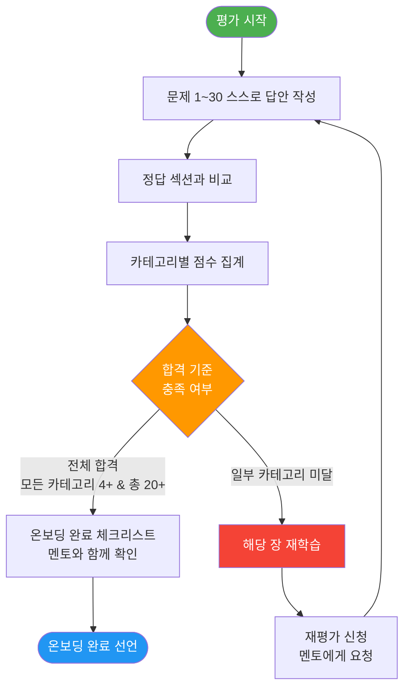

# 07: 온보딩 최종 평가

> **문서 ID**: ONBOARD-10-07
> **버전**: 1.0.0 | **작성일**: 2026-04-12 | **작성자**: Implementer (Sonnet)
> **목적**: 온보딩 전 과정 이수 후 학습 완료를 검증하는 최종 평가
> **선행 조건**: 실습 1~6 전체 완료 및 가이드북 0장~7장 학습 완료
> **합격 기준**: 각 카테고리 4문제 이상 정답 (총 30문항 중 20문항 이상 정답)
> **소요 시간**: 90~120분

---

## 목차

1. [평가 개요 및 안내](#1-평가-개요-및-안내)
2. [카테고리 1: 아키텍처 이해 (6문제)](#2-카테고리-1-아키텍처-이해-6문제)
3. [카테고리 2: 보안/CSAP (6문제)](#3-카테고리-2-보안csap-6문제)
4. [카테고리 3: 개발 실무 (6문제)](#4-카테고리-3-개발-실무-6문제)
5. [카테고리 4: 인프라/운영 (6문제)](#5-카테고리-4-인프라운영-6문제)
6. [카테고리 5: PDCA/문서 (6문제)](#6-카테고리-5-pdca문서-6문제)
7. [정답 및 해설](#7-정답-및-해설)
8. [온보딩 완료 기준 체크리스트](#8-온보딩-완료-기준-체크리스트)
9. [변경 이력](#9-변경-이력)

---

## 1. 평가 개요 및 안내

### 1.1 평가 목적

이 평가는 단순히 점수를 매기기 위한 시험이 아닙니다. 온보딩 기간 동안 학습한 내용이 실제 업무에 적용 가능한 수준으로 내재화되었는지를 확인하는 과정입니다. 평가를 통해 부족한 부분을 파악하고 추가 학습이 필요한 영역을 식별하십시오.

### 1.2 합격 기준

| 카테고리 | 문제 수 | 최소 합격 기준 |
|---------|--------|--------------|
| 카테고리 1: 아키텍처 이해 | 6문제 | 4문제 이상 정답 |
| 카테고리 2: 보안/CSAP | 6문제 | 4문제 이상 정답 |
| 카테고리 3: 개발 실무 | 6문제 | 4문제 이상 정답 |
| 카테고리 4: 인프라/운영 | 6문제 | 4문제 이상 정답 |
| 카테고리 5: PDCA/문서 | 6문제 | 4문제 이상 정답 |
| **전체** | **30문제** | **20문제 이상 정답** |

모든 카테고리에서 4문제 이상을 맞추고 전체 합계가 20문제 이상이어야 합격입니다. 하나의 카테고리라도 3문제 이하이면 해당 카테고리를 재학습한 후 재평가를 받아야 합니다.

### 1.3 평가 진행 방법

```
1. 아래 문제를 순서대로 읽고, 먼저 스스로 답을 작성합니다.
2. 정답 섹션을 보기 전에 모든 문제에 대한 답을 적어 둡니다.
3. 작성 완료 후 정답 섹션과 비교합니다.
4. 결과를 멘토에게 제출하고 온보딩 완료 체크리스트를 함께 확인합니다.

주의: 정답 섹션을 먼저 보고 문제를 풀면 평가의 의미가 없습니다.
      스스로 작성한 후 확인하십시오.
```

### 1.4 평가 흐름도



---

## 2. 카테고리 1: 아키텍처 이해 (6문제)

> **관련 장**: 2장 아키텍처, `02-architecture/01-system-overview.md`
> **합격 기준**: 6문제 중 4문제 이상 정답

---

### 문제 1-1

이 플랫폼에는 총 17개의 마이크로서비스가 있습니다. 그 중 **3개를 선택**하여 각 서비스의 역할과 주요 책임을 설명하십시오. 단순한 이름 나열이 아닌, 다른 서비스와의 관계를 포함하여 설명해야 합니다.

```
나의 답안:

서비스 1 이름:
역할 및 책임:
다른 서비스와의 관계:

서비스 2 이름:
역할 및 책임:
다른 서비스와의 관계:

서비스 3 이름:
역할 및 책임:
다른 서비스와의 관계:
```

---

### 문제 1-2

멀티테넌시(Multi-tenancy) 환경에서 **테넌트 격리(Tenant Isolation)가 실패**하면 어떤 보안 위험이 발생하는지 설명하십시오. 그리고 이 프로젝트에서 테넌트 격리를 어떻게 구현하고 있는지 코드 수준에서 설명하십시오.

```
나의 답안:

격리 실패 시 발생하는 위험:

이 프로젝트의 격리 구현 방식:
```

---

### 문제 1-3

Circuit Breaker 패턴에서 **OPEN 상태**일 때 어떤 일이 발생하는지 설명하십시오. 그리고 OPEN 상태에서 CLOSED 상태로 전환되는 과정을 단계별로 설명하십시오.

```
나의 답안:

OPEN 상태에서 발생하는 일:

OPEN → HALF-OPEN → CLOSED 전환 과정:
```

---

### 문제 1-4

API Gateway가 수행하는 역할 중 보안과 관련된 기능을 **4가지 이상** 나열하고 각각이 왜 필요한지 설명하십시오.

```
나의 답안:

1.
2.
3.
4.
```

---

### 문제 1-5

이 플랫폼의 데이터 흐름에서 클라이언트가 보낸 요청이 최종 데이터베이스에 도달하기까지의 경로를 **순서대로** 설명하십시오. 각 단계에서 어떤 검사가 이루어지는지 포함하여 설명하십시오.

```
나의 답안:

클라이언트 → [단계별 경유 컴포넌트] → 데이터베이스:

1단계:
2단계:
3단계:
4단계:
5단계 이후:
```

---

### 문제 1-6

다음 두 패키지의 차이점을 설명하고, 각각 어떤 서비스에서 사용되는지 예를 들어 설명하십시오.

- `@public-saas/mesh-ready`
- `@public-saas/healthcheck`

```
나의 답안:

@public-saas/mesh-ready의 역할:
사용 서비스 예시:

@public-saas/healthcheck의 역할:
사용 서비스 예시:

두 패키지의 핵심 차이점:
```

---

## 3. 카테고리 2: 보안/CSAP (6문제)

> **관련 장**: 7장 보안·컴플라이언스, `07-security/`, `11-faq/03-csap-faq.md`
> **합격 기준**: 6문제 중 4문제 이상 정답

---

### 문제 2-1

N2SF 데이터 등급인 **C등급, S등급, O등급**의 차이를 각각 정의하고, AI API 전송 가능 여부와 그 이유를 설명하십시오. 또한 O등급 데이터를 AI API로 보낼 때 반드시 수행해야 하는 추가 작업은 무엇인지 설명하십시오.

```
나의 답안:

C등급 (Confidential):
정의:
AI API 전송 가능 여부:
이유:

S등급 (Sensitive):
정의:
AI API 전송 가능 여부:
이유:

O등급 (Open):
정의:
AI API 전송 가능 여부:
이유:
O등급 전송 전 반드시 수행해야 할 작업:
```

---

### 문제 2-2

CSAP D-08(접근 통제) 요건을 충족하는 API 엔드포인트를 TypeScript로 작성하십시오. 다음 조건을 모두 포함해야 합니다.

- 인증 검사 (JWT 토큰 검증)
- 역할 기반 권한 검사 (admin 역할만 접근 가능)
- 입력 데이터 Zod 검증
- 테넌트 격리 (tenantId 필터)
- 감사 로그 기록

```typescript
// 나의 답안: DELETE /api/v1/admin/users/:userId 엔드포인트를 구현하시오.

```

---

### 문제 2-3

**JWT RS256 vs HS256**의 기술적 차이를 설명하고, 이 프로젝트에서 RS256을 사용하는 이유를 보안 관점에서 설명하십시오. 특히 마이크로서비스 아키텍처에서 RS256이 유리한 점을 설명하십시오.

```
나의 답안:

HS256의 동작 방식:
RS256의 동작 방식:

마이크로서비스 환경에서 RS256을 사용하는 이유:

이 프로젝트에서 비밀 키는 어디에 보관되는가:
```

---

### 문제 2-4

다음 코드에서 **CSAP 위반 사항을 모두 찾아** 위반하는 통제항목(D-06/D-08/D-09/D-12)과 함께 나열하고, 각각을 올바른 코드로 수정하십시오.

```typescript
// 검토 대상 코드
const DB_PASSWORD = 'admin1234';
const JWT_SECRET = 'my-super-secret-key';

export async function deleteUserHandler(req: any, res: any) {
  const { userId } = req.params;
  const { requesterId } = req.body;

  await db.execute(`DELETE FROM users WHERE id = '${userId}'`);

  return res.json({ success: true, deleted: userId, dbPassword: DB_PASSWORD });
}
```

```
나의 답안:

위반 사항 목록:
1. 위반 내용:
   해당 통제항목:
   수정 방법:

2. 위반 내용:
   해당 통제항목:
   수정 방법:

3. 위반 내용:
   해당 통제항목:
   수정 방법:

4. 위반 내용:
   해당 통제항목:
   수정 방법:

5. 위반 내용:
   해당 통제항목:
   수정 방법:

수정된 전체 코드:
```

---

### 문제 2-5

bcrypt를 사용하여 비밀번호를 저장할 때 **rounds(비용 인자)**를 결정하는 기준을 설명하고, 이 프로젝트의 표준 rounds 값과 그 이유를 설명하십시오. 너무 낮으면 어떤 문제가 있고 너무 높으면 어떤 문제가 있는지도 설명하십시오.

```
나의 답안:

이 프로젝트의 표준 rounds 값:
선택 이유:

rounds가 너무 낮을 때의 문제:
rounds가 너무 높을 때의 문제:
CSAP 요건상 최소 rounds:
```

---

### 문제 2-6

감사 로그(Audit Log)에 SHA-256 해시 체인을 적용하는 이유를 설명하십시오. 해시 체인이 없다면 어떤 위험이 있는지, CSAP 어떤 통제항목과 연관되는지 포함하여 답하십시오. 또한 감사 로그의 최소 보존 기간을 설명하십시오.

```
나의 답안:

SHA-256 해시 체인의 목적:

해시 체인이 없을 때의 위험:

연관 CSAP 통제항목:

감사 로그 최소 보존 기간:
CSAP 요건 조항:
```

---

## 4. 카테고리 3: 개발 실무 (6문제)

> **관련 장**: 3장 개발, `03-development/`, `06-cicd/`
> **합격 기준**: 6문제 중 4문제 이상 정답

---

### 문제 3-1

다음 두 명령어의 차이를 설명하십시오. 언제 어느 명령어를 사용해야 하는지, CI/CD 파이프라인에서는 어떤 명령어를 사용해야 하는지 설명하십시오.

```bash
# 명령어 A
pnpm build --filter=auth-service

# 명령어 B
pnpm build
```

```
나의 답안:

명령어 A의 동작:
사용 시점:

명령어 B의 동작:
사용 시점:

CI/CD 파이프라인에서 선택해야 할 명령어 및 이유:

--filter 옵션에서 의존성까지 함께 빌드하려면:
```

---

### 문제 3-2

Prisma의 `$transaction`을 사용해야 하는 상황을 설명하고, 일반 쿼리와의 차이점을 코드로 보여주십시오. 특히 멀티테넌트 환경에서 트랜잭션이 중요한 이유를 설명하십시오.

```typescript
// 나의 답안: 다음 시나리오를 트랜잭션으로 구현하시오.
// 시나리오: 새 사용자를 생성하면서 동시에 해당 테넌트의 사용자 수를 업데이트해야 합니다.
// 사용자 생성이 성공했지만 테넌트 업데이트가 실패하면 안 됩니다.

```

---

### 문제 3-3

Q-Gate **G4(테스트 커버리지 80% 이상) 실패** 시 어떻게 해결하는지 단계별로 설명하십시오. 커버리지 리포트를 어떻게 확인하는지, 어떤 파일의 커버리지를 높여야 하는지 우선순위를 판단하는 방법도 포함하십시오.

```
나의 답안:

1단계: 커버리지 리포트 확인 방법

2단계: 커버리지가 낮은 파일 식별

3단계: 우선순위 판단 기준

4단계: 테스트 추가 전략

5단계: 재확인 및 PR 재제출
```

---

### 문제 3-4

이 프로젝트의 **Conventional Commits** 형식에 맞게 다음 상황에 대한 커밋 메시지를 각각 작성하십시오.

상황 1: FR-3.2 요건에 따라 tenant-service에 청구서 생성 기능 추가
상황 2: auth-service의 JWT 토큰 만료 시간 버그 수정
상황 3: 오래된 `getOldUserList()` 함수 제거 (Dead Code)
상황 4: CSAP D-08 요건 점검용 보안 감사 증거 문서 업데이트

```
나의 답안:

상황 1:
상황 2:
상황 3:
상황 4:
```

---

### 문제 3-5

다음 코드가 Q-Gate **G3(코드 품질)** 에서 실패하는 이유를 모두 찾아 설명하고, 수정된 코드를 작성하십시오.

```typescript
// 검토 대상 코드
export async function f(a: any, b: any, c: any) {
  var x = await db.query(`SELECT * FROM t WHERE id = '${a}'`);
  if (x) {
    if (x.tenantId) {
      if (x.tenantId == b) {
        if (x.status == 'active') {
          var result = await doSomething(x, c);
          if (result) {
            return result;
          } else {
            return null;
          }
        } else {
          return null;
        }
      } else {
        return null;
      }
    } else {
      return null;
    }
  } else {
    return null;
  }
}
```

```
나의 답안:

G3 위반 사항 목록:
1.
2.
3.
4.
5.

수정된 코드:
```

---

### 문제 3-6

Claude Code의 **Cascade 에이전트 분업 원칙**에 따라 새 기능을 개발할 때 올바른 순서를 설명하십시오. 각 단계에서 어떤 에이전트가 무엇을 하는지, 어떤 파일을 생성하는지 포함하여 설명하십시오.

```
나의 답안:

1단계 (구현 착수 전):
담당 에이전트:
생성 산출물:

2단계 (구현):
담당 에이전트:
생성 산출물:

3단계 (리뷰):
담당 에이전트:
확인 항목:

4단계 (감리):
담당 에이전트:
확인 항목:

5단계 (테스트):
담당 에이전트:
확인 항목:

6단계 (리팩토링):
담당 에이전트:
확인 항목:
```

---

## 5. 카테고리 4: 인프라/운영 (6문제)

> **관련 장**: 4장 인프라, `04-infrastructure/`, `09-troubleshooting/`
> **합격 기준**: 6문제 중 4문제 이상 정답

---

### 문제 4-1

auth-service Pod이 `CrashLoopBackOff` 상태일 때 원인을 파악하기 위해 실행해야 할 **첫 번째 명령어**와 그 이후 진단 과정을 순서대로 설명하십시오.

```bash
# 나의 답안: 단계별 진단 명령어와 각 명령어에서 확인해야 할 사항을 작성하십시오.

# 1단계:
# 확인 사항:

# 2단계:
# 확인 사항:

# 3단계:
# 확인 사항:

# 자주 발생하는 CrashLoopBackOff 원인 3가지:
# 1.
# 2.
# 3.
```

---

### 문제 4-2

Flux GitOps에서 **HelmRelease**와 **HelmChart**의 차이점을 설명하고, 새 서비스를 배포할 때 각 리소스를 어떤 순서로 생성해야 하는지 설명하십시오. 또한 HelmRelease가 실패했을 때 디버깅 방법을 설명하십시오.

```
나의 답안:

HelmChart의 역할:
HelmRelease의 역할:
두 리소스의 핵심 차이:

새 서비스 배포 시 생성 순서:
1.
2.
3.

HelmRelease 실패 디버깅 명령어:
```

---

### 문제 4-3

카나리(Canary) 배포 전략에서 **자동 롤백이 트리거되는 조건**을 설명하십시오. 이 프로젝트에서 카나리 배포의 트래픽 비율 진행 순서와 각 단계에서의 지표 확인 방법도 포함하여 설명하십시오.

```
나의 답안:

자동 롤백이 발생하는 조건:

카나리 트래픽 진행 단계:
1단계: % → 확인 지표:
2단계: % → 확인 지표:
3단계: % → 확인 지표:
최종: % (전체 전환)

롤백 발생 시 운영팀이 해야 할 첫 번째 행동:
```

---

### 문제 4-4

다음 상황에서 각각 어떤 kubectl 명령어를 사용하는지 작성하십시오.

```bash
# 상황 1: saas-platform 네임스페이스의 모든 Pod 상태 확인
# 명령어:

# 상황 2: auth-service Pod의 최근 100줄 로그 확인
# 명령어:

# 상황 3: 특정 Pod의 컨테이너에 직접 쉘 접속
# 명령어:

# 상황 4: auth-service Deployment를 이전 버전으로 롤백
# 명령어:

# 상황 5: Pod이 어떤 이유로 Pending 상태인지 상세 확인
# 명령어:

# 상황 6: Flux가 HelmRelease를 강제로 재동기화
# 명령어:
```

---

### 문제 4-5

이 플랫폼의 k3s 네임스페이스 구조를 설명하고, 각 네임스페이스의 목적과 주요 구성요소를 나열하십시오. 네임스페이스 분리가 보안 관점에서 어떤 의미를 갖는지도 설명하십시오.

```
나의 답안:

네임스페이스 목록:

1. 네임스페이스 이름:
   목적:
   주요 구성요소:

2. 네임스페이스 이름:
   목적:
   주요 구성요소:

3. 네임스페이스 이름:
   목적:
   주요 구성요소:

4. 네임스페이스 이름:
   목적:
   주요 구성요소:

네임스페이스 분리의 보안적 의미:
```

---

### 문제 4-6

프로덕션 환경에서 auth-service의 메모리 사용량이 급격히 증가하고 있습니다. 이를 탐지하고 원인을 분석하며 조치하는 **SRE 대응 절차**를 단계별로 설명하십시오.

```
나의 답안:

1단계: 탐지
사용 도구:
확인 지표:

2단계: 트리아지 (심각도 판단)
확인 명령어:
판단 기준:

3단계: 원인 분석
확인 방법:
자주 발생하는 원인:

4단계: 조치
즉각 조치:
근본 원인 해결:

5단계: 회고
기록해야 할 내용:
```

---

## 6. 카테고리 5: PDCA/문서 (6문제)

> **관련 장**: 1장 문서 관리, 8장 문서, `08-document-management/`
> **합격 기준**: 6문제 중 4문제 이상 정답

---

### 문제 5-1

이 프로젝트에서 사용하는 **FR ID 체계**를 설명하십시오. 기능 요구사항, 비기능 요구사항, 인프라 요구사항, AI 연동 요구사항의 ID 형식과 각각의 예시를 작성하십시오.

```
나의 답안:

기능 요구사항 ID 형식:
예시:

비기능 요구사항 ID 형식:
예시:

인프라 요구사항 ID 형식:
예시:

AI 연동 요구사항 ID 형식:
예시:

올바른 FR ID와 잘못된 FR ID를 각각 하나씩 작성하시오:
올바른 예:
잘못된 예:
```

---

### 문제 5-2

Q-Gate **G1~G7을 순서대로 나열**하고 각 게이트의 검사 내용과 담당 에이전트를 설명하십시오. 그리고 각 게이트가 실패했을 때 가장 자주 발생하는 원인을 한 가지씩 설명하십시오.

```
나의 답안:

G1:
검사 내용:
담당 에이전트:
주요 실패 원인:

G2:
검사 내용:
담당 에이전트:
주요 실패 원인:

G3:
검사 내용:
담당 에이전트:
주요 실패 원인:

G4:
검사 내용:
담당 에이전트:
주요 실패 원인:

G5:
검사 내용:
담당 에이전트:
주요 실패 원인:

G6:
검사 내용:
담당 에이전트:
주요 실패 원인:

G7:
검사 내용:
담당 에이전트:
주요 실패 원인:
```

---

### 문제 5-3

PDCA 문서에서 **추적성 매트릭스(Traceability Matrix)**가 필요한 이유를 설명하고, 행안부 감리 기준상 요구되는 4방향 추적성이 무엇인지 설명하십시오. 간단한 추적성 매트릭스 예시를 작성하십시오.

```
나의 답안:

추적성 매트릭스가 필요한 이유:

4방향 추적성의 4가지 항목:
1.
2.
3.
4.

추적성 매트릭스 예시 (3개 요구사항):

| FR ID | 산출물 | 테스트 | CSAP 통제항목 |
|-------|-------|-------|-------------|
|       |       |       |             |
|       |       |       |             |
|       |       |       |             |
```

---

### 문제 5-4

MTU(Minimum Testable Unit) 시스템에서 하나의 MTU가 완료되었다고 판단하는 기준을 설명하십시오. PDCA 4단계(계획-실행-점검-조치)와 연결하여 설명하고, MTU 번호 체계가 어떻게 구성되는지도 설명하십시오.

```
나의 답안:

MTU 완료 기준:

PDCA와 MTU의 관계:
Plan 단계:
Do 단계:
Check 단계:
Act 단계:

MTU 번호 체계 예시 및 설명:
```

---

### 문제 5-5

다음과 같은 상황에서 **감사 로그 SHA-256 해시 체인**이 어떻게 무결성을 보장하는지 설명하십시오.

상황: 악의적인 내부자가 자신의 권한 남용 흔적을 지우기 위해 감사 로그 파일에서 특정 레코드를 삭제했습니다.

```
나의 답안:

SHA-256 해시 체인의 동작 원리:

레코드 삭제 시도 시 발생하는 일:

이를 탐지하는 방법:

CSAP D-06과의 연관성:

이 메커니즘이 없을 때의 위험:
```

---

### 문제 5-6

이 프로젝트의 **Dead Code 정책**에 따라 다음 각 상황에서 올바른 처리 방법을 설명하십시오.

상황 A: 3개월 전 작성되었지만 현재 사용되지 않는 `generateLegacyReport()` 함수 발견
상황 B: Phase 2 구현 시 사용할 예정인 `csapStandardGradeValidator()` 함수
상황 C: 이전에 주석 처리해 둔 50줄의 코드 블록
상황 D: `package.json`에는 있지만 실제로 import하지 않는 npm 패키지
상황 E: 3개월 이상 된 `// TODO: 나중에 최적화` 주석

```
나의 답안:

상황 A 처리 방법:

상황 B 처리 방법 (예외 해당 시 예외 주석 포함):

상황 C 처리 방법:

상황 D 처리 방법:

상황 E 처리 방법:
```

---

## 7. 정답 및 해설

> **주의**: 아래 정답을 보기 전에 반드시 모든 문제에 대한 답을 먼저 스스로 작성하십시오.
> 정답을 먼저 보고 푸는 것은 온보딩 평가의 취지를 훼손합니다.

---

### 카테고리 1 정답: 아키텍처 이해

**문제 1-1 정답**

17개 서비스 목록: api-gateway, auth-service, user-service, tenant-service, ai-service, audit-service, compliance-service, notification-service, file-service, crm-service, billing-service, subscription-service, catalog-service, security-service, security-monitor-service, menu-service, portal-app(Next.js)

평가 기준 (채점 시 3개 서비스 모두 아래 요소 포함 여부 확인):
- 서비스의 핵심 책임을 정확히 설명했는가
- 최소 하나의 연관 서비스와의 관계를 설명했는가
- 포트 번호 또는 기술 스택 등 구체적 정보를 포함했는가

예시 모범 답안:
```
api-gateway (포트 3000):
역할: 모든 외부 요청의 단일 진입점. JWT 검증을 auth-service에 위임하고,
      Rate Limiting(100req/min/테넌트), Circuit Breaker, IP 필터링을 수행.
관계: 모든 서비스의 앞단. auth-service에 토큰 검증 위임.

auth-service (포트 3001):
역할: JWT 발급/검증/갱신, 소셜 로그인 처리, 세션 관리.
      RS256 알고리즘 사용. 접근 토큰 15분, 갱신 토큰 7일.
관계: user-service와 협력하여 사용자 정보 조회.
      api-gateway에 공개키 제공.

tenant-service (포트 3004):
역할: 테넌트(기관) 생성/수정/삭제, 테넌트별 설정 관리, 격리 정책 적용.
관계: 모든 서비스가 tenantId 검증 시 참조.
      billing-service와 연동하여 구독 관리.
```

**문제 1-2 정답**

격리 실패 위험:
- 테넌트 A의 직원이 테넌트 B의 기밀 데이터(민원 내용, 개인정보)에 접근 가능
- CSAP D-08(접근 통제) 위반으로 인증 취소
- 행안부 감리에서 심각한 결함으로 분류
- 개인정보보호법 위반으로 법적 제재

격리 구현 방식:
```typescript
// 모든 DB 쿼리에 tenantId 필터 필수
const users = await db.user.findMany({
  where: {
    tenantId: request.user.tenantId,  // 현재 사용자의 테넌트만
    id: userId,
  }
});

// tenantId를 URL에서 받을 경우 반드시 검증
if (urlTenantId !== request.user.tenantId && !isAdmin) {
  throw new ForbiddenError('테넌트 격리 위반');
}
```

**문제 1-3 정답**

OPEN 상태에서 발생하는 일:
- 해당 서비스로의 요청이 즉시 차단됨 (실제 서비스 호출 없음)
- 사전 정의된 fallback 응답 반환 (또는 503 오류)
- 연쇄 장애(Cascade Failure) 방지

OPEN → HALF-OPEN → CLOSED 전환 과정:
```
OPEN 상태 진입 (실패율 50% 이상 또는 연속 5회 실패)
  → 일정 시간 대기 (기본값: 30초, 이 프로젝트: 60초)
  → HALF-OPEN 상태 전환 (일부 요청만 허용)
  → 허용된 요청이 성공하면 CLOSED 전환
  → 허용된 요청이 실패하면 다시 OPEN으로 돌아감
```

**문제 1-4 정답**

API Gateway의 보안 기능 (최소 4가지):
1. JWT 토큰 검증 — 인증되지 않은 요청 차단 (auth-service에 위임)
2. Rate Limiting — DDoS 및 무차별 대입 공격 방지 (테넌트당 100req/min)
3. IP 필터링 — 허용 목록 기반 접근 제어 (CSAP D-10)
4. Circuit Breaker — 장애 서비스로의 트래픽 차단으로 연쇄 장애 방지
5. TLS 종단 처리 — 암호화 통신 보장 (CSAP D-09)
6. 요청 헤더 검증 — 악의적 헤더 주입 방지

**문제 1-5 정답**

```
클라이언트
  → [TLS 1.3 암호화] Ingress (Traefik)
  → [IP 필터링, Rate Limiting] API Gateway
  → [JWT 검증] auth-service (위임 검증)
  → [RBAC 검사] 해당 마이크로서비스 내부 미들웨어
  → [입력 검증(Zod), tenantId 필터] 비즈니스 로직
  → [매개변수화 쿼리] PostgreSQL
```

**문제 1-6 정답**

```
@public-saas/mesh-ready:
역할: 서비스 메시(Linkerd) 환경에서 안전한 종료를 위한 Graceful Shutdown 처리.
     SIGTERM 수신 시 새 요청 거부, 처리 중인 요청 완료 후 종료.
     연결 드레이닝(connection draining) 수행.
사용 서비스: 모든 백엔드 서비스 (auth-service, tenant-service 등)

@public-saas/healthcheck:
역할: 표준화된 헬스체크 엔드포인트 제공 (/health/live, /health/ready).
     Kubernetes의 Liveness Probe, Readiness Probe가 이 엔드포인트를 호출.
사용 서비스: 모든 백엔드 서비스

차이점:
mesh-ready는 종료 시점에 동작 (수명 주기 후반부)
healthcheck는 실행 중 지속적으로 동작 (수명 주기 전체)
```

---

### 카테고리 2 정답: 보안/CSAP

**문제 2-1 정답**

```
C등급 (Confidential, 기밀):
정의: 국가 기밀, 주민등록번호, 군사 정보, 비밀 행정 계획
AI API 전송: 절대 금지
이유: N2SF N-05. 외부 AI 모델에 기밀 데이터 노출 시 국가 안보 위협

S등급 (Sensitive, 민감):
정의: 개인 연락처, 내부 업무 문서, 민원 내용, 공무원 인사 정보
AI API 전송: 절대 금지
이유: N2SF N-05. 개인정보보호법 위반 및 업무 기밀 유출 위험

O등급 (Open, 공개):
정의: 공개 데이터, 일반 통계, 공지사항, 민원 유형 분류
AI API 전송: PII 마스킹 후 가능
이유: 공개 데이터이나 혹시 포함된 개인정보 제거 필요

O등급 전송 전 반드시 수행할 작업:
- maskPII() 함수로 이름, 이메일, 전화번호, 주민번호 마스킹
- 내부 AI Gateway 경유 (직접 외부 API 호출 금지)
- 감사 로그 기록
```

**문제 2-2 정답**

```typescript
import { z } from 'zod';
import { verifyToken, hasPermission } from '@public-saas/auth';
import { auditLog } from '@public-saas/audit';

const deleteUserSchema = z.object({
  reason: z.string().min(1).max(500),
});

export async function deleteUserHandler(req: Request, res: Response) {
  // [D-08] 1. 인증 검사
  const user = await verifyToken(req.headers.get('authorization'));
  if (!user) {
    return res.status(401).json({ error: 'Unauthorized' });
  }

  // [D-08] 2. 권한 검사 (admin만 삭제 가능)
  if (!hasPermission(user, 'users:delete')) {
    return res.status(403).json({ error: 'Forbidden' });
  }

  // [D-12] 3. 입력 검증
  const { userId } = req.params;
  const body = deleteUserSchema.parse(await req.json());

  // [D-08] 4. 테넌트 격리 — admin이어도 자신의 테넌트만 삭제 가능
  const targetUser = await db.user.findFirst({
    where: { id: userId, tenantId: user.tenantId },
  });
  if (!targetUser) {
    return res.status(404).json({ error: 'User not found' });
  }

  // [D-06] 5. 감사 로그 — 삭제 전 기록
  await auditLog({
    actor: user.id,
    action: 'USER_DELETE',
    target: userId,
    metadata: { reason: body.reason, tenantId: user.tenantId },
    timestamp: new Date().toISOString(),
    ip: req.headers.get('x-forwarded-for') ?? 'unknown',
  });

  await db.user.delete({ where: { id: userId } });

  return res.status(200).json({ success: true });
}
```

**문제 2-3 정답**

```
HS256: HMAC + SHA-256. 단일 비밀 키로 서명하고 검증.
       서명자와 검증자가 같은 키를 공유해야 함.

RS256: RSA + SHA-256. 개인 키(Private Key)로 서명, 공개 키(Public Key)로 검증.
       서명은 auth-service만, 검증은 모든 서비스가 가능.

마이크로서비스에서 RS256이 유리한 이유:
- auth-service만 개인 키 보유 → 토큰 위조 불가능
- 다른 서비스들은 공개 키만으로 검증 → 비밀 키 공유 불필요
- HS256은 비밀 키를 공유해야 하므로 서비스가 늘어날수록 보안 위험 증가

비밀 키 보관 위치:
- 개인 키: HashiCorp Vault (platform/infra/vault/)
- 공개 키: Kubernetes ConfigMap 또는 서비스별 환경 변수로 주입
```

**문제 2-4 정답**

위반 사항 및 수정:
```
1. 하드코딩된 DB_PASSWORD → D-09 위반 (암호화 — 시크릿 관리)
   수정: process.env['DB_PASSWORD'] 사용

2. 하드코딩된 JWT_SECRET → D-09 위반
   수정: process.env['JWT_SECRET'] 사용

3. SQL 직접 결합 `DELETE FROM users WHERE id = '${userId}'` → D-12 위반
   수정: db.execute('DELETE FROM users WHERE id = $1', [userId])

4. 응답에 DB_PASSWORD 포함 → D-09 위반 (민감 정보 노출)
   수정: 응답에서 dbPassword 필드 제거

5. 감사 로그 없음 (삭제 작업) → D-06 위반
   수정: await auditLog({ actor: requesterId, action: 'USER_DELETE', target: userId }) 추가

6. 인증/인가 검사 없음 → D-08 위반
   수정: verifyToken() 및 hasPermission() 추가

7. req.body에 any 타입 사용 → D-12 (입력 검증 미적용)
   수정: Zod 스키마 검증 추가
```

**문제 2-5 정답**

```
이 프로젝트 표준 rounds: 12
선택 이유: 현대 CPU에서 약 400ms 소요. 보안과 UX 균형점.
           bcrypt rounds 10은 CSAP 최소 요건이나 보안 여유 부족.

rounds가 너무 낮을 때 (4~8):
- 브루트포스 공격에 취약 (빠른 해시 계산으로 대량 시도 가능)
- CSAP D-09 위반 (4 이하는 명백한 위반)

rounds가 너무 높을 때 (14 이상):
- 로그인 응답 시간이 1.6초 이상으로 UX 저하
- 동시 로그인 요청 많을 시 서버 CPU 과부하
- 공공기관 서비스에서 민원인 불편 발생

CSAP 요건상 최소 rounds: 10
```

**문제 2-6 정답**

```
SHA-256 해시 체인의 목적:
각 감사 로그 레코드에 이전 레코드의 해시값을 포함시켜
레코드 삭제 또는 변조 시 즉각 탐지 가능하도록 하는 무결성 보장 메커니즘.

해시 체인이 없을 때의 위험:
- 내부자가 자신의 접근 로그를 삭제하여 행적 은폐 가능
- 해킹 피해 범위 파악 불가
- 법적 증거로 사용 불가 (변조 가능성 주장)

연관 CSAP 통제항목:
- D-06: 침해사고 관리 — 감사 로그 무결성 보장
- D-09: 암호화 — SHA-256 해시 사용

감사 로그 최소 보존 기간:
1년 이상 (CSAP D-06 요건)
CSAP 통제항목: D-06.3 (로그 보존 기간)
```

---

### 카테고리 3 정답: 개발 실무

**문제 3-1 정답**

```
명령어 A (pnpm build --filter=auth-service):
동작: auth-service 패키지만 빌드. 의존 패키지 제외 (기본값).
사용 시점: 특정 서비스 수정 후 빠른 로컬 확인.

명령어 B (pnpm build):
동작: 모노레포 내 모든 패키지를 의존성 순서에 따라 순차 빌드.
사용 시점: 배포 전 전체 확인, CI/CD 파이프라인.

CI/CD 파이프라인: 명령어 B (전체 빌드)
이유: 패키지 간 인터페이스 변경 시 영향 받는 서비스를 모두 확인해야 함.

의존성까지 함께 빌드:
pnpm build --filter=auth-service...  (... 은 의존성 포함을 의미)
```

**문제 3-2 정답**

```typescript
// 일반 쿼리 (위험 — 일부 성공, 일부 실패 가능)
async function createUserUnsafe(tenantId: string, userData: CreateUserDto) {
  const user = await prisma.user.create({ data: { ...userData, tenantId } });
  await prisma.tenant.update({  // 이 줄이 실패하면 사용자만 생성되어 데이터 불일치
    where: { id: tenantId },
    data: { userCount: { increment: 1 } },
  });
  return user;
}

// 트랜잭션 (안전 — 모두 성공하거나 모두 실패)
async function createUserSafe(tenantId: string, userData: CreateUserDto) {
  return await prisma.$transaction(async (tx) => {
    const user = await tx.user.create({
      data: { ...userData, tenantId },
    });

    await tx.tenant.update({
      where: { id: tenantId },
      data: { userCount: { increment: 1 } },
    });

    return user;
    // 여기서 어느 한 단계라도 실패하면 user 생성도 롤백됨
  });
}
```

멀티테넌트 환경에서 트랜잭션이 중요한 이유:
- 여러 테넌트의 데이터가 동시에 수정될 때 교차 오염 방지
- 사용자 수 불일치 등 데이터 불일치 방지
- 결제/구독 처리 시 금전적 데이터 정확성 보장

**문제 3-3 정답**

```bash
# 1단계: 커버리지 리포트 확인
pnpm test:coverage --filter=auth-service
# coverage/ 디렉터리에 HTML 리포트 생성됨

# 2단계: 커버리지가 낮은 파일 목록
open coverage/index.html
# 또는
cat coverage/coverage-summary.json | jq '.total'

# 3단계: 우선순위 판단
# 비즈니스 로직 파일 (handlers/, services/) > 유틸리티 > 설정 파일
# 보안 관련 파일 (auth, audit) 최우선

# 4단계: 테스트 추가
# 미테스트 분기(else, catch) 위주로 테스트 케이스 추가
# edge case (빈 입력, 권한 없음, DB 오류) 추가

# 5단계: 재확인
pnpm test:coverage --filter=auth-service
# 80% 이상 달성 후 PR 재제출
```

**문제 3-4 정답**

```
상황 1: feat(tenant-service): FR-3.2 청구서 생성 API 구현
상황 2: fix(auth-service): JWT 토큰 만료 시간 계산 오류 수정
상황 3: refactor(user-service): 미사용 getOldUserList() 함수 제거 (dead code)
상황 4: docs(csap): D-08 접근 통제 감사 증거 문서 업데이트
```

**문제 3-5 정답**

G3 위반 사항:
```
1. 함수명 f, 매개변수명 a, b, c — 의미를 알 수 없는 이름 (가독성)
2. var 사용 — TypeScript에서 let/const 사용 권장 (코드 품질)
3. SQL 직접 결합 — SQL 인젝션 취약점 (CSAP D-12)
4. 중첩 if문 4단계 초과 — 하네스 제약: 4단계 이하 (가독성)
5. 함수 크기가 80줄에 근접하는 중복 null 반환 — 단일 책임 원칙 위반
6. == 사용 — TypeScript에서 === 사용 권장 (타입 안전성)
```

수정 코드:
```typescript
export async function findActiveUserInTenant(
  userId: string,
  tenantId: string,
  options: ProcessOptions
): Promise<ProcessResult | null> {
  const user = await db.execute(
    'SELECT * FROM t WHERE id = $1',
    [userId]
  );

  if (!user || user.tenantId !== tenantId || user.status !== 'active') {
    return null;
  }

  return doSomething(user, options) ?? null;
}
```

**문제 3-6 정답**

```
1단계 (구현 착수 전): 계획 및 설계 문서 작성
담당: Auditor 에이전트 검토 + 개발자 작성
생성 산출물: docs/01-plan/mtus/MTU-XXX.plan.md, docs/02-design/ 설계 문서

2단계 (구현): Implementer 에이전트
담당: Implementer (claude-sonnet-4-6)
생성 산출물: 실제 TypeScript 코드, 기본 테스트 스캐폴드

3단계 (리뷰): Reviewer 에이전트
담당: Reviewer (claude-sonnet-4-6)
확인 항목: 코드 품질, 102개 AgentShield 규칙, OWASP Top10

4단계 (감리): Auditor 에이전트
담당: Auditor (claude-opus-4-6)
확인 항목: FR ID 추적성, CSAP 통제항목, N2SF 준수, 감리 기준

5단계 (테스트): Tester 에이전트
담당: Tester (claude-sonnet-4-6)
확인 항목: 커버리지 80%+, 단위/통합/보안 테스트

6단계 (리팩토링): Refactorer 에이전트
담당: Refactorer (claude-haiku-4-5)
확인 항목: Dead code 제거, 구조 개선, 불필요한 의존성 정리
```

---

### 카테고리 4 정답: 인프라/운영

**문제 4-1 정답**

```bash
# 1단계: Pod 상태 및 재시작 횟수 확인
kubectl get pod -n saas-platform -l app=auth-service
# RESTARTS가 높으면 반복 충돌 중

# 2단계: 상세 이벤트 및 종료 이유 확인
kubectl describe pod -n saas-platform <pod-name>
# Events 섹션에서 OOMKilled, Error, CrashLoopBackOff 원인 확인
# Last State의 Exit Code 확인 (137: OOMKilled, 1: 일반 오류)

# 3단계: 컨테이너 로그 확인 (이전 충돌 로그 포함)
kubectl logs -n saas-platform <pod-name> --previous
# 시작 직전 오류 메시지 확인

# 자주 발생하는 원인 3가지:
# 1. OOMKilled — 메모리 제한 초과 (Exit Code 137)
# 2. 환경 변수 누락 — 필수 env 변수 미설정으로 시작 실패
# 3. 포트 충돌 — 같은 포트를 사용하는 다른 프로세스 존재
```

**문제 4-2 정답**

```
HelmChart:
역할: Helm 차트 소스를 어디서 가져올지 정의 (레지스트리, 버전 등).
     "어떤 차트를" 사용할지 명세.

HelmRelease:
역할: HelmChart를 어떻게 배포할지 정의 (값, 네임스페이스, 업그레이드 정책).
     "어떻게" 배포할지 명세.

차이: HelmChart = 차트 참조, HelmRelease = 배포 설정 및 실행.
      HelmRelease는 HelmChart를 참조하여 실제 배포 수행.

생성 순서:
1. HelmRepository (소스 등록)
2. HelmChart (차트 버전 고정)
3. HelmRelease (실제 배포)

HelmRelease 실패 디버깅:
kubectl describe helmrelease -n saas-platform auth-service
flux logs --kind=HelmRelease --name=auth-service --namespace=saas-platform
```

**문제 4-3 정답**

```
자동 롤백 트리거 조건:
- 오류율 5% 초과 (HTTP 5xx 응답)
- P99 응답 시간 2,000ms 초과
- 카나리 Pod의 CPU/메모리 사용량 임계값 초과
- Readiness Probe 실패 연속 3회

카나리 트래픽 단계:
1단계: 5% → 5분간 지표 확인 (오류율, 응답 시간)
2단계: 20% → 10분간 확인 (더 많은 실제 트래픽 검증)
3단계: 50% → 15분간 확인 (절반 분산 상태 안정성)
최종: 100% 전환 (이전 버전 Pod 종료)

롤백 발생 시 첫 번째 행동:
1. Slack/PagerDuty 알림 확인
2. kubectl describe canary -n saas-platform auth-service 로 롤백 이유 확인
3. 카나리 배포 실패 원인 분석 후 다음 배포 준비
```

**문제 4-4 정답**

```bash
# 상황 1: 네임스페이스 내 모든 Pod
kubectl get pods -n saas-platform

# 상황 2: 최근 100줄 로그
kubectl logs -n saas-platform -l app=auth-service --tail=100

# 상황 3: 컨테이너 쉘 접속
kubectl exec -it -n saas-platform <pod-name> -- /bin/sh

# 상황 4: 이전 버전으로 롤백
kubectl rollout undo deployment/auth-service -n saas-platform

# 상황 5: Pending 원인 상세 확인
kubectl describe pod -n saas-platform <pod-name>
# Events 섹션에서 스케줄링 실패 이유 확인 (리소스 부족, 노드 선택 불가 등)

# 상황 6: Flux 강제 재동기화
flux reconcile helmrelease auth-service -n saas-platform
```

**문제 4-5 정답**

```
네임스페이스 목록:

1. saas-platform
   목적: 비즈니스 서비스 (실제 애플리케이션)
   구성요소: auth-service, tenant-service, ai-service 등 16개 서비스

2. saas-infra
   목적: 인프라 컴포넌트
   구성요소: Traefik, Cert-Manager, Linkerd

3. saas-data
   목적: 데이터 저장소
   구성요소: PostgreSQL, Redis

4. monitoring
   목적: 관측 가시성 스택
   구성요소: Prometheus, Grafana, Loki, Tempo

5. flux-system
   목적: GitOps 오케스트레이션
   구성요소: Flux 컨트롤러

보안적 의미:
- 네임스페이스별 NetworkPolicy로 허가된 통신만 허용
- saas-data는 saas-platform에서만 접근 가능 (외부 직접 접근 차단)
- monitoring은 읽기 전용 메트릭 수집만 가능
- CSAP D-10(네트워크 분리) 요건 충족
```

**문제 4-6 정답**

```
1단계: 탐지
도구: Grafana 알림 (메모리 사용률 80% 초과 시 PagerDuty 발송)
지표: container_memory_usage_bytes, memory RSS

2단계: 트리아지
kubectl top pod -n saas-platform -l app=auth-service
# 심각도 판단: 90% 이상이면 즉각 스케일아웃, 70~90%는 모니터링 강화

3단계: 원인 분석
kubectl logs -n saas-platform <pod-name> --tail=500 | grep -i "heap\|oom\|memory"
# 자주 발생하는 원인:
# - 메모리 누수 (이벤트 리스너 해제 안 함, 캐시 무제한 증가)
# - 요청당 대용량 파일 처리
# - Redis 연결 풀 과다 생성

4단계: 조치
즉각 조치: kubectl scale deployment auth-service -n saas-platform --replicas=5
근본 원인: 코드 수정 후 배포 (메모리 누수 패치)

5단계: 회고
기록 내용: 발생 시각, 영향 범위, RCA(근본 원인 분석), 재발 방지 조치
문서 위치: docs/03-impl/incidents/ 하위에 사후 보고서 작성
```

---

### 카테고리 5 정답: PDCA/문서

**문제 5-1 정답**

```
기능 요구사항 ID 형식: FR-{모듈}.{번호}
예시: FR-3.2 (3번 모듈의 2번째 요구사항)

비기능 요구사항 ID 형식: NFR-{번호}
예시: NFR-1 (첫 번째 비기능 요구사항)

인프라 요구사항 ID 형식: INFR-{번호}
예시: INFR-3 (세 번째 인프라 요구사항)

AI 연동 요구사항 ID 형식: AI-REQ-{번호}
예시: AI-REQ-1 (첫 번째 AI 연동 요구사항)

올바른 예: FR-2.3
잘못된 예: FR-02-003 (형식 불일치), REQ-23 (접두사 규칙 미준수)
```

**문제 5-2 정답**

```
G1 — FR ID 전수 확인
검사: 구현 코드에 해당하는 FR ID가 Plan 문서에 존재하는지
담당: Auditor (claude-opus-4-6)
주요 실패 원인: Plan 문서 없이 구현 시작 (문서 없는 구현)

G2 — 설계 완전성
검사: Design 문서에 API 명세, ER 다이어그램, 시퀀스 다이어그램 포함 여부
담당: Auditor
주요 실패 원인: 설계 문서 섹션 일부 누락

G3 — 코드 품질 + 102 정적분석 규칙
검사: AgentShield 102 규칙, ESLint, 함수 크기, 중첩 깊이
담당: Reviewer (claude-sonnet-4-6)
주요 실패 원인: any 타입 남용, 함수 크기 초과

G4 — 테스트 커버리지 80%+
검사: pnpm test:coverage 결과 80% 이상
담당: Tester (claude-sonnet-4-6)
주요 실패 원인: 새 파일 추가 시 테스트 미작성

G5 — OWASP Top10 통과
검사: SQL 인젝션, XSS, CSRF, 인증 취약점 등 10개 범주
담당: Reviewer
주요 실패 원인: 입력 검증 누락, 직접 SQL 결합

G6 — CSAP 해당 Phase 100%
검사: D-06, D-08, D-09, D-12 통제항목 준수
담당: Auditor
주요 실패 원인: auditLog() 누락, 하드코딩 시크릿

G7 — 감사 추적 audit.jsonl 완비
검사: .claude/audit.jsonl에 민감 작업 기록 존재
담당: Auditor
주요 실패 원인: 민감 작업에 auditLog() 호출 누락
```

**문제 5-3 정답**

추적성 매트릭스가 필요한 이유:
- 요구사항이 실제로 구현되었는지 증명
- 테스트가 요구사항을 검증하는지 증명
- 구현이 CSAP 통제항목을 충족하는지 증명
- 감리원이 "이 코드는 왜 있는가"를 물었을 때 근거 제시

4방향 추적성:
1. FR ID (요구사항)
2. 산출물 (코드 파일 경로)
3. 테스트 (테스트 케이스 ID 또는 파일)
4. CSAP 통제항목 (D-06, D-08 등)

추적성 매트릭스 예시:

| FR ID | 산출물 | 테스트 | CSAP 통제항목 |
|-------|-------|-------|-------------|
| FR-2.1 | platform/services/auth-service/src/handlers/login.handler.ts | tests/login.test.ts#TC-001 | D-08 |
| FR-3.2 | platform/services/tenant-service/src/lib/billing.service.ts | tests/billing.test.ts#TC-010 | D-06, D-12 |
| FR-4.1 | platform/services/audit-service/src/lib/audit.ts | tests/audit.test.ts#TC-020 | D-06 |

**문제 5-4 정답**

```
MTU 완료 기준:
1. Plan 문서 작성 완료 (Executive Summary, FR ID, Context Anchor 포함)
2. Design 문서 작성 완료 (API 명세, 시퀀스 다이어그램 포함)
3. 코드 구현 완료 (Q-Gate G1~G7 전부 통과)
4. 테스트 작성 완료 (커버리지 80%+)
5. 감리 점검 완료 (CSAP 통제항목 체크리스트 100%)
6. PDCA 보고서 작성 완료

PDCA와 MTU:
Plan: MTU Plan 문서 작성 (docs/01-plan/mtus/MTU-XXXX.plan.md)
Do: 코드 구현 및 PR 제출 (Q-Gate 통과)
Check: Reviewer, Auditor, Tester 에이전트 검증
Act: 리팩토링 및 개선사항 반영, 다음 MTU 반영

MTU 번호 체계:
MTU-N241: N = 일반 MTU, 241 = 241번째
SVC-AUTH-R1: SVC = 서비스 MTU, AUTH = 대상 서비스, R1 = 라운드 1
```

**문제 5-5 정답**

```
SHA-256 해시 체인 동작 원리:
레코드 N의 hash = SHA-256(레코드 N의 내용 + 레코드 N-1의 hash)
→ 각 레코드가 이전 레코드에 암호학적으로 연결됨

레코드 삭제 시도 시 발생하는 일:
삭제된 레코드 이후의 모든 레코드의 해시값이 무효화됨.
검증 도구가 N번 레코드와 N+1번 레코드의 해시 연결을 검사하면
불일치가 즉각 탐지됨.

탐지 방법:
감사 로그 무결성 검증 스크립트 정기 실행:
npm run audit:verify-integrity
또는 CSAP 증거 수집 파이프라인(csap-evidence.yml)에서 자동 검증

CSAP D-06 연관성:
D-06.3: 감사 로그 무결성 보장 요건
D-06.4: 로그 보존 기간 및 접근 통제

해시 체인이 없을 때의 위험:
- 내부자 행적 은폐 가능 (삭제 탐지 불가)
- 법적 증거 능력 상실
- CSAP 인증 취소 사유
```

**문제 5-6 정답**

```
상황 A (3개월 이상 된 미사용 함수 generateLegacyReport()):
처리: 즉시 제거. 3개월 이상 = "오래된 Dead Code" 기준 충족.
git 히스토리로 복구 가능하므로 주석 없이 삭제.
CHANGELOG.md에 제거 이력 기록.

상황 B (Phase 2 예정 함수 csapStandardGradeValidator()):
처리: 예외. 삭제하지 않고 예외 주석 필수 추가.
// NOTE: 미사용. Phase 2 FR-2.3 구현 시 사용 예정. 2026-07-01 이후 재검토.

상황 C (주석 처리된 50줄 코드 블록):
처리: 즉시 제거. 주석 처리된 코드는 이유에 관계없이 삭제.
git 히스토리로 복구 가능.

상황 D (미사용 npm 패키지):
처리: package.json에서 즉시 제거.
pnpm remove <패키지명> 실행.
pnpm-lock.yaml도 자동 업데이트됨.

상황 E (3개월 이상 된 TODO 주석):
처리: Gitea에 이슈 등록 후 주석 제거.
제거 기한: 이슈 등록 후 1주일 이내.
```

---

## 8. 온보딩 완료 기준 체크리스트

이 체크리스트는 멘토와 함께 확인합니다. 자가 선언이 아닌 멘토의 확인을 통해 온보딩 완료로 인정됩니다.

```
온보딩 완료 선언 체크리스트 (20개 항목)

[ ] 01. 평가 전 과목 합격 확인 (총 20/30 이상, 각 카테고리 4/6 이상)
    → 멘토 확인: 날짜: __________ 서명: __________

[ ] 02. 실습 1 완료 확인 — /health/ping 엔드포인트 + 테스트 작성 + 커밋
    → PR 링크:

[ ] 03. 실습 2 완료 확인 — 미니 PDCA Plan/Design 문서 + 스캐폴드 구현
    → PR 링크:

[ ] 04. 실습 3 완료 확인 — Grafana 모니터링 패널 + 알림 설정
    → 패널 스크린샷 첨부: 예 / 아니오

[ ] 05. 실습 4 완료 확인 — k8s OOMKilled 시뮬레이션 + 복구
    → kubectl describe 로그 첨부: 예 / 아니오

[ ] 06. 실습 5 완료 확인 — CSAP 보안 취약점 탐지 및 수정 (D-08/D-09/D-12)
    → PR 링크:

[ ] 07. 실습 6 완료 확인 — 종합 시나리오 Q-Gate G1~G7 전 통과
    → Gitea CI 파이프라인 green 확인: 예 / 아니오
    → PR 링크:

[ ] 08. 첫 번째 실제 PR에서 Q-Gate G1~G7 모두 통과
    → PR 링크:
    → 통과 일자:

[ ] 09. 코드 리뷰 1회 이상 수행 (다른 팀원의 PR에 의미 있는 리뷰 댓글 작성)
    → 리뷰한 PR 링크:

[ ] 10. auditLog() 직접 구현 확인 (실제 서비스에 감사 로그 추가)
    → 관련 커밋 링크:

[ ] 11. CSAP 개발자 체크리스트 자가 점검 완료 (07-security/csap/02-dev-checklist.md)
    → 점검 날짜:
    → 미충족 항목 수: (0이어야 완료)

[ ] 12. 보안 사고 대응 절차 숙지 (실수로 .env 커밋 시 대응 방법 설명 가능)
    → 멘토에게 구두 설명: 날짜: __________ 서명: __________

[ ] 13. Grafana 대시보드에서 담당 서비스 P99 응답 시간 확인 가능
    → 직접 시연: 날짜: __________ 확인자: __________

[ ] 14. kubectl 기본 명령어 숙지 — CrashLoopBackOff 원인 분석 실연
    → 멘토 앞 실연: 날짜: __________ 서명: __________

[ ] 15. 가이드북 00장~07장 전체 정독 완료
    → 완료 날짜:

[ ] 16. 실습 6에서 Plan 문서 FR ID 추적성 매트릭스 작성 확인
    → 문서 경로:

[ ] 17. N2SF 데이터 등급 분류 실연 (주어진 데이터를 보고 C/S/O 판단)
    → 멘토 앞 실연: 날짜: __________ 서명: __________

[ ] 18. Conventional Commits 형식 4가지 유형(feat/fix/refactor/docs) 작성 가능 확인
    → 멘토 앞 실연: 날짜: __________ 서명: __________

[ ] 19. 담당 팀/파트 소개 완료 (팀원 전체에게 자기소개)
    → 소개 날짜:

[ ] 20. 온보딩 피드백 제출 (이 가이드북 개선을 위한 의견 제출)
    → 제출 날짜:
    → 제출 위치: Gitea → issues → label: onboarding-feedback
```

---

**온보딩 완료 최종 선언**

```
이름:
입사일:
온보딩 완료일:
담당 서비스/팀:

멘토 확인:
멘토 이름:
확인 일자:
서명:

비고:
```

---

## 9. 변경 이력

| 버전 | 일자 | 내용 | 작성자 |
|------|------|------|--------|
| 1.0.0 | 2026-04-12 | 초안 작성 — 30문항 5개 카테고리 최종 평가 + 온보딩 완료 체크리스트 20항목 | Implementer (Sonnet) |
