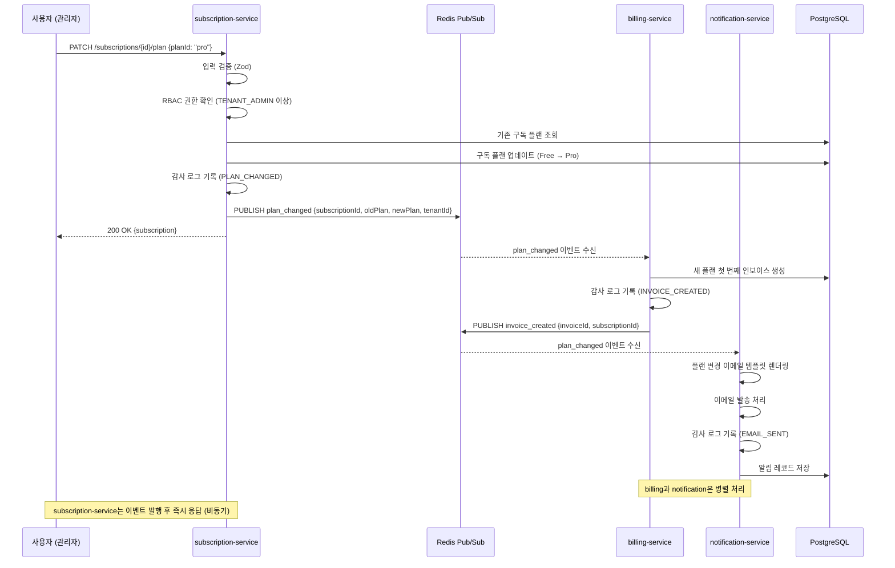
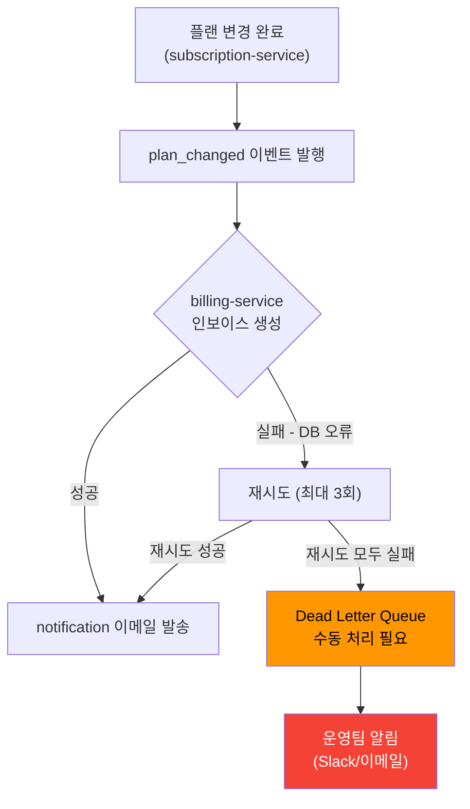
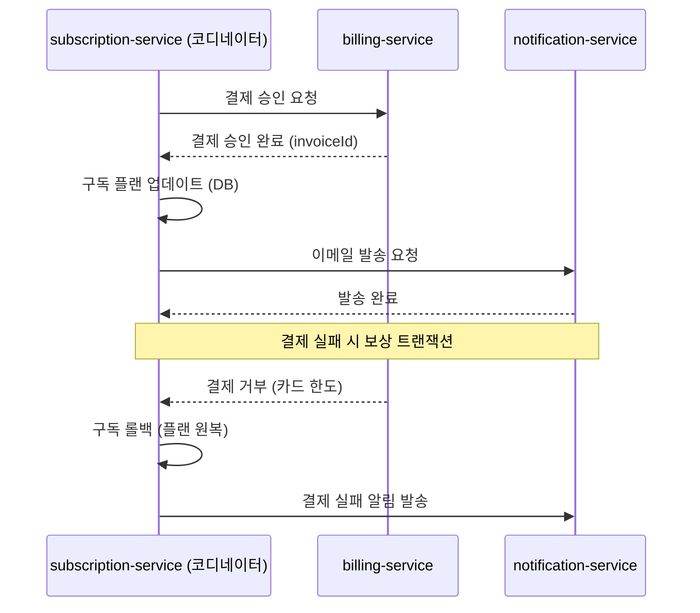

# Lab 8: 멀티 서비스 협력 실습 — 구독 플랜 변경 플로우

> **문서 ID**: ONBOARD-10-08
> **버전**: 1.0.0 | **작성일**: 2026-04-12 | **작성자**: Implementer (Sonnet)
> **목적**: 구독 플랜 변경(Free→Pro) 시 여러 서비스가 어떻게 협력하는지 전체 플로우를 직접 구현하고 테스트한다
> **소요 시간**: 120~150분
> **난이도**: 중급

---

## 목차

1. [학습 목표 및 사전 요건](#1-학습-목표-및-사전-요건)
2. [아키텍처 이해](#2-아키텍처-이해)
3. [사전 지식 체크](#3-사전-지식-체크)
4. [단계별 실습](#4-단계별-실습)
   - [Step 1: 현재 구독 상태 확인 API](#step-1-현재-구독-상태-확인-api)
   - [Step 2: 플랜 변경 이벤트 발행 (Redis Pub/Sub)](#step-2-플랜-변경-이벤트-발행-redis-pubsub)
   - [Step 3: billing-service 이벤트 핸들러 구현](#step-3-billing-service-이벤트-핸들러-구현)
   - [Step 4: notification-service 이메일 알림 발송](#step-4-notification-service-이메일-알림-발송)
   - [Step 5: 전체 플로우 통합 테스트 작성](#step-5-전체-플로우-통합-테스트-작성)
5. [에러 시나리오 처리 (billing 실패 시 롤백)](#5-에러-시나리오-처리)
6. [CSAP 감사 로그 추가](#6-csap-감사-로그-추가)
7. [검증 항목 체크리스트](#7-검증-항목-체크리스트)
8. [심화 과제: Saga 패턴으로 리팩토링](#8-심화-과제-saga-패턴으로-리팩토링)
9. [학습 체크리스트](#학습-체크리스트)
10. [다음 단계](#다음-단계)

---

## 1. 학습 목표 및 사전 요건

### 1.1 학습 목표

이 실습을 완료하면 다음을 할 수 있습니다.

- 공공기관 SaaS에서 여러 마이크로서비스가 이벤트 기반으로 협력하는 방식을 이해한다
- Redis Pub/Sub를 사용해 서비스 간 느슨한 결합(loose coupling)을 구현한다
- 트랜잭션 경계를 넘는 분산 작업에서 실패 처리와 롤백을 구현한다
- 멀티 서비스 플로우에 CSAP D-06 감사 로그를 적용한다
- 통합 테스트로 전체 플로우를 검증한다

### 1.2 사전 요건

다음 항목을 완료해야 이 실습을 시작할 수 있습니다.

| 선행 항목 | 확인 방법 |
|---------|---------|
| Lab 1: Hello Service 완료 | `GET /api/tenants` 정상 응답 확인 |
| Lab 2: PDCA Mini 완료 | Plan + Design 문서 작성 경험 |
| Lab 3: 모니터링 실습 완료 | Grafana 대시보드 접속 가능 |
| Lab 5: 보안 감사 완료 | `logTenantEvent` 사용 경험 |
| Redis 로컬 실행 중 | `redis-cli ping` → `PONG` 응답 |
| 개발 환경 구동 중 | `pnpm dev` 전체 서비스 실행 상태 |

⚠️ **선행 조건 미충족 시**: Lab 1~5를 먼저 완료하십시오. 특히 Redis Pub/Sub는 Redis 기본 사용법을 알아야 합니다.

---

## 2. 아키텍처 이해

### 2.1 전체 플로우 개요

구독 플랜 변경은 단순한 DB 업데이트가 아닙니다. 세 개의 서비스가 순서대로 협력해야 합니다.

```
[사용자] → [subscription-service] → (이벤트 발행) → [billing-service]
                                                    → [notification-service]
```

각 서비스의 역할:

| 서비스 | 역할 | 파일 위치 |
|------|------|---------|
| `subscription-service` | 플랜 변경 주 처리, 이벤트 발행 | `platform/services/subscription-service/` |
| `billing-service` | 새 플랜 첫 번째 인보이스 생성 | `platform/services/billing-service/` |
| `notification-service` | 사용자에게 이메일 알림 발송 | `platform/services/notification-service/` |

### 2.2 시퀀스 다이어그램



### 2.3 이벤트 기반 설계의 장점

```
동기 호출 방식 (비추천):
subscription-service
  → billing-service API 직접 호출 (결합도 높음)
  → notification-service API 직접 호출
  → 전체 응답 대기 (지연 증가)
  → billing 실패 시 subscription도 롤백 (복잡)

이벤트 기반 방식 (이 프로젝트 방식):
subscription-service
  → Redis에 이벤트 발행 (빠름)
  → 즉시 응답 반환
billing-service (독립적으로 이벤트 구독)
notification-service (독립적으로 이벤트 구독)
  → 각자 실패해도 subscription에 영향 없음
  → 새 서비스 추가 시 subscriber만 추가하면 됨
```

---

## 3. 사전 지식 체크

다음 질문에 답할 수 있으면 실습을 시작하십시오.

```
질문 1: Redis Pub/Sub에서 PUBLISH와 SUBSCRIBE의 차이는?
답: PUBLISH는 채널에 메시지를 발행하고, SUBSCRIBE는 채널을 구독해서 메시지를 받는다.

질문 2: 마이크로서비스에서 '느슨한 결합'이 왜 중요한가?
답: 한 서비스의 변경/장애가 다른 서비스에 영향을 미치지 않아 독립적 배포와 유지보수가 가능하다.

질문 3: CSAP D-06 감사 로그에 기록해야 하는 정보는?
답: 행위자(actor), 행동(action), 대상(target), 타임스탬프, IP 주소.

질문 4: Zod 스키마에서 .parse()와 .safeParse()의 차이는?
답: .parse()는 검증 실패 시 예외 던짐, .safeParse()는 { success, data, error } 객체 반환.
```

답을 모른다면 다음 자료를 먼저 학습하십시오.

- `03-csap-faq.md` Q3 — 감사 로그
- `01-dev-faq.md` Q5 — Zod 스키마
- Redis 공식 문서: redis.io/topics/pubsub

---

## 4. 단계별 실습

### Step 1: 현재 구독 상태 확인 API

먼저 현재 subscription-service에서 구독 상태를 확인하는 API를 이해합니다.

**1.1 기존 API 확인**

```bash
# 전체 플랜 목록 조회
curl -s http://localhost:3007/plans | jq '.data[] | {id, name, price}'

# 테넌트의 현재 구독 조회
curl -s "http://localhost:3007/subscriptions/by-tenant/YOUR_TENANT_ID" \
  -H "x-user-tenant-id: YOUR_TENANT_ID" \
  -H "x-user-role: TENANT_ADMIN" | jq '.'
```

**1.2 구독 상태 확인 엔드포인트 구현**

`subscription-service`에 새 API를 추가합니다.

```bash
# 파일 열기
code /data/ai-saas/platform/services/subscription-service/src/handlers/subscription.handler.ts
```

다음 핸들러를 파일 끝에 추가하십시오.

```typescript
// subscription.handler.ts 에 추가
// Lab 8 실습: 구독 상태 확인 API
// Design Ref: Lab8 §Step1 — 현재 구독 상태 확인
// Plan SC: ONBOARD-LAB8-STEP1

const subscriptionStatusQuerySchema = z.object({
  tenantId: z.string().uuid('유효한 UUID 형식이 아닙니다'),
});

/**
 * 테넌트 구독 상태 상세 조회
 * 현재 플랜, 구독 시작일, 다음 갱신일 포함
 */
export async function getSubscriptionStatusHandler(
  request: FastifyRequest,
  reply: FastifyReply,
): Promise<void> {
  const { tenantId } = subscriptionStatusQuerySchema.parse(
    (request as FastifyRequest<{ Params: { tenantId: string } }>).params,
  );

  // CSAP D-08: 본인 테넌트만 조회 허용 (SUPER_ADMIN 예외)
  const jwtTenantId = request.headers['x-user-tenant-id'] as string | undefined;
  const jwtRole = request.headers['x-user-role'] as string | undefined;

  if (jwtRole !== 'SUPER_ADMIN' && jwtTenantId !== tenantId) {
    await reply.status(403).send({
      success: false,
      error: { code: 'FORBIDDEN', message: '다른 테넌트의 구독 정보를 조회할 수 없습니다.' },
    });
    return;
  }

  const subscription = await prisma.subscription.findFirst({
    where: { tenantId, status: 'ACTIVE' },
    include: {
      plan: {
        select: { name: true, price: true, currency: true, interval: true, maxUsers: true },
      },
    },
    orderBy: { createdAt: 'desc' },
  });

  if (!subscription) {
    await reply.status(404).send({
      success: false,
      error: { code: 'NOT_FOUND', message: '활성 구독을 찾을 수 없습니다.' },
    });
    return;
  }

  // 다음 갱신일 계산
  const nextRenewalDate = new Date(subscription.currentPeriodEnd);

  await reply.send({
    success: true,
    data: {
      subscriptionId: subscription.id,
      tenantId: subscription.tenantId,
      status: subscription.status,
      currentPlan: {
        name: subscription.plan.name,
        price: subscription.plan.price,
        currency: subscription.plan.currency,
        interval: subscription.plan.interval,
        maxUsers: subscription.plan.maxUsers,
      },
      periodStart: subscription.currentPeriodStart,
      periodEnd: subscription.currentPeriodEnd,
      nextRenewalDate,
      daysUntilRenewal: Math.ceil(
        (nextRenewalDate.getTime() - Date.now()) / (1000 * 60 * 60 * 24),
      ),
    },
  });
}
```

**1.3 라우트 등록**

```typescript
// subscription-service/src/routes.ts 에 추가
import { getSubscriptionStatusHandler } from './handlers/subscription.handler.js';

// 기존 라우트 아래에 추가
fastify.get('/subscriptions/status/:tenantId', getSubscriptionStatusHandler);
```

**1.4 동작 확인**

```bash
# 서비스 재시작
cd /data/ai-saas/platform/services/subscription-service
pnpm dev &

# 상태 확인 API 테스트
curl -s "http://localhost:3007/subscriptions/status/YOUR_TENANT_ID" \
  -H "x-user-tenant-id: YOUR_TENANT_ID" \
  -H "x-user-role: TENANT_ADMIN" | jq '.'

# 기대 응답:
# {
#   "success": true,
#   "data": {
#     "subscriptionId": "uuid...",
#     "currentPlan": { "name": "Free", "price": 0, ... },
#     "daysUntilRenewal": 23
#   }
# }
```

---

### Step 2: 플랜 변경 이벤트 발행 (Redis Pub/Sub)

플랜 변경 시 Redis 채널에 이벤트를 발행합니다.

**2.1 Redis 클라이언트 설정 확인**

```bash
# Redis 연결 확인
redis-cli ping  # PONG 응답 확인

# subscription-service의 Redis 설정 확인
cat /data/ai-saas/platform/services/subscription-service/src/lib/redis.ts
```

Redis 클라이언트가 없으면 생성합니다.

```typescript
// subscription-service/src/lib/redis.ts 생성 (없는 경우)
import { createClient } from 'redis';

const redisUrl = process.env['REDIS_URL'] ?? 'redis://localhost:6379';

export const redis = createClient({ url: redisUrl });

redis.on('error', (err) => console.error('Redis 오류:', err));

// 서비스 시작 시 연결
export async function connectRedis(): Promise<void> {
  if (!redis.isOpen) {
    await redis.connect();
  }
}
```

**2.2 플랜 변경 이벤트 타입 정의**

```typescript
// subscription-service/src/lib/events.ts 생성
// Lab 8 실습: 이벤트 타입 정의
// Design Ref: Lab8 §Step2

export const EVENTS = {
  PLAN_CHANGED: 'plan_changed',
  PLAN_CHANGE_FAILED: 'plan_change_failed',
} as const;

export interface PlanChangedEvent {
  eventType: 'plan_changed';
  subscriptionId: string;
  tenantId: string;
  oldPlanId: string;
  oldPlanName: string;
  newPlanId: string;
  newPlanName: string;
  changedAt: string;     // ISO 8601
  changedBy: string;     // userId
}

export interface PlanChangeFailedEvent {
  eventType: 'plan_change_failed';
  subscriptionId: string;
  tenantId: string;
  reason: string;
  failedAt: string;
}
```

**2.3 플랜 변경 핸들러 구현**

```typescript
// subscription.handler.ts 에 추가
import { redis, connectRedis } from '../lib/redis.js';
import { EVENTS, type PlanChangedEvent } from '../lib/events.js';

// 플랜 변경 입력 스키마
const changePlanSchema = z.object({
  planId: z.string().uuid('유효한 플랜 ID가 아닙니다'),
});

/**
 * 구독 플랜 변경 (Free → Pro)
 * Lab 8 실습: 이벤트 발행 포함
 * Design Ref: Lab8 §Step2
 * Plan SC: ONBOARD-LAB8-STEP2
 * CSAP D-08: TENANT_ADMIN 이상 권한 필요
 * CSAP D-06: 플랜 변경 감사 로그
 */
export async function changePlanHandler(
  request: FastifyRequest<{ Params: { id: string }; Body: unknown }>,
  reply: FastifyReply,
): Promise<void> {
  const subscriptionId = z.string().uuid().parse(request.params.id);
  const { planId } = changePlanSchema.parse(request.body);
  const actor = request.headers['x-user-id'] as string;
  const jwtRole = request.headers['x-user-role'] as string | undefined;
  const jwtTenantId = request.headers['x-user-tenant-id'] as string | undefined;

  // CSAP D-08: TENANT_ADMIN 이상만 플랜 변경 가능
  if (!jwtRole || !['TENANT_ADMIN', 'SUPER_ADMIN'].includes(jwtRole)) {
    await reply.status(403).send({
      success: false,
      error: { code: 'FORBIDDEN', message: '플랜 변경 권한이 없습니다.' },
    });
    return;
  }

  // 현재 구독 조회
  const subscription = await prisma.subscription.findUnique({
    where: { id: subscriptionId },
    include: { plan: { select: { id: true, name: true } } },
  });

  if (!subscription) {
    await reply.status(404).send({
      success: false,
      error: { code: 'NOT_FOUND', message: '구독을 찾을 수 없습니다.' },
    });
    return;
  }

  // CSAP D-08: 본인 테넌트 구독만 변경 가능 (SUPER_ADMIN 예외)
  if (jwtRole !== 'SUPER_ADMIN' && subscription.tenantId !== jwtTenantId) {
    await reply.status(403).send({
      success: false,
      error: { code: 'FORBIDDEN', message: '다른 테넌트의 구독을 변경할 수 없습니다.' },
    });
    return;
  }

  // 새 플랜 조회
  const newPlan = await prisma.plan.findUnique({ where: { id: planId } });
  if (!newPlan || !newPlan.isActive) {
    await reply.status(404).send({
      success: false,
      error: { code: 'PLAN_NOT_FOUND', message: '유효하지 않은 플랜입니다.' },
    });
    return;
  }

  // 동일 플랜으로 변경 방지
  if (subscription.planId === planId) {
    await reply.status(400).send({
      success: false,
      error: { code: 'SAME_PLAN', message: '현재 플랜과 동일합니다.' },
    });
    return;
  }

  // 플랜 변경 DB 업데이트
  const updated = await prisma.subscription.update({
    where: { id: subscriptionId },
    data: { planId },
    include: { plan: true },
  });

  // CSAP D-06: 플랜 변경 감사 로그
  await logSubscriptionEvent(
    'PLAN_CHANGED',
    actor,
    'subscription',
    subscription.tenantId,
    request.ip,
    request.headers['user-agent'] ?? 'unknown',
    {
      subscriptionId,
      oldPlanId: subscription.planId,
      oldPlanName: subscription.plan.name,
      newPlanId: planId,
      newPlanName: newPlan.name,
    },
  );

  // Redis 이벤트 발행 (비동기 — 응답과 무관)
  const event: PlanChangedEvent = {
    eventType: 'plan_changed',
    subscriptionId,
    tenantId: subscription.tenantId,
    oldPlanId: subscription.planId,
    oldPlanName: subscription.plan.name,
    newPlanId: planId,
    newPlanName: newPlan.name,
    changedAt: new Date().toISOString(),
    changedBy: actor,
  };

  await connectRedis();
  await redis.publish(EVENTS.PLAN_CHANGED, JSON.stringify(event));

  request.log.info({ event }, 'plan_changed 이벤트 발행 완료');

  await reply.send({ success: true, data: updated });
}
```

**2.4 발행 동작 확인**

```bash
# Redis CLI에서 이벤트 구독 (별도 터미널)
redis-cli subscribe plan_changed

# 다른 터미널에서 플랜 변경 API 호출
curl -X PATCH http://localhost:3007/subscriptions/SUBSCRIPTION_ID/plan \
  -H "Content-Type: application/json" \
  -H "x-user-id: admin-user-id" \
  -H "x-user-role: TENANT_ADMIN" \
  -H "x-user-tenant-id: YOUR_TENANT_ID" \
  -d '{"planId": "PRO_PLAN_ID"}'

# Redis CLI에서 이벤트 수신 확인:
# 1) "subscribe"
# 2) "plan_changed"
# 3) (integer) 1
# ...
# 1) "message"
# 2) "plan_changed"
# 3) "{\"eventType\":\"plan_changed\",\"subscriptionId\":\"...\"}"
```

---

### Step 3: billing-service 이벤트 핸들러 구현

billing-service가 `plan_changed` 이벤트를 구독하여 인보이스를 생성합니다.

**3.1 구독 리스너 생성**

```typescript
// billing-service/src/lib/plan-change-listener.ts 생성
// Lab 8 실습: billing-service 이벤트 핸들러
// Design Ref: Lab8 §Step3
// CSAP D-06: 인보이스 생성 감사 로그

import { createClient } from 'redis';
import { prisma } from './prisma.js';
import { logBillingEvent } from './audit.js';

const redisUrl = process.env['REDIS_URL'] ?? 'redis://localhost:6379';

interface PlanChangedEvent {
  eventType: 'plan_changed';
  subscriptionId: string;
  tenantId: string;
  oldPlanId: string;
  oldPlanName: string;
  newPlanId: string;
  newPlanName: string;
  changedAt: string;
  changedBy: string;
}

/**
 * billing-service: plan_changed 이벤트 리스너
 * 플랜 변경 시 새 플랜의 첫 번째 인보이스를 생성한다.
 */
export async function startPlanChangeListener(): Promise<void> {
  // Subscriber용 별도 Redis 연결 (Pub/Sub은 다른 명령 사용 불가)
  const subscriber = createClient({ url: redisUrl });
  await subscriber.connect();

  await subscriber.subscribe('plan_changed', async (message) => {
    let event: PlanChangedEvent;
    try {
      event = JSON.parse(message) as PlanChangedEvent;
    } catch {
      console.error('plan_changed 이벤트 파싱 실패:', message);
      return;
    }

    console.log(`[billing] plan_changed 이벤트 수신:`, event);

    try {
      await handlePlanChanged(event);
    } catch (err) {
      console.error('[billing] plan_changed 처리 실패:', err);
      // ⚠️ 실패해도 subscriber는 계속 동작 (재시도 로직은 Step 5에서 추가)
    }
  });

  console.log('[billing] plan_changed 이벤트 리스너 시작');
}

async function handlePlanChanged(event: PlanChangedEvent): Promise<void> {
  // 구독 및 새 플랜 정보 조회
  const subscription = await prisma.subscription.findUnique({
    where: { id: event.subscriptionId },
    include: { plan: true },
  });

  if (!subscription) {
    console.warn(`[billing] 구독 없음: ${event.subscriptionId}`);
    return;
  }

  // 새 플랜이 유료인 경우 인보이스 생성
  const newPlan = await prisma.plan.findUnique({ where: { id: event.newPlanId } });
  if (!newPlan || newPlan.price === 0) {
    console.info(`[billing] 무료 플랜 전환, 인보이스 생략: ${event.newPlanName}`);
    return;
  }

  // 인보이스 생성 (이번 달치)
  const periodStart = new Date();
  const periodEnd = new Date();
  periodEnd.setMonth(periodEnd.getMonth() + 1);

  const invoice = await prisma.invoice.create({
    data: {
      subscriptionId: event.subscriptionId,
      amount: newPlan.price,
      currency: newPlan.currency,
      status: 'PENDING',
      periodStart,
      periodEnd,
      dueDate: periodEnd,
    },
  });

  // CSAP D-06: 인보이스 생성 감사 로그
  await logBillingEvent(
    'INVOICE_CREATED',
    event.changedBy,              // 행위자 (플랜 변경 요청자)
    'billing',
    event.tenantId,
    '0.0.0.0',                    // 내부 이벤트: IP 없음
    'billing-event-listener',
    {
      invoiceId: invoice.id,
      subscriptionId: event.subscriptionId,
      planName: event.newPlanName,
      amount: newPlan.price,
      currency: newPlan.currency,
    },
  );

  console.log(`[billing] 인보이스 생성 완료: ${invoice.id}, 금액: ${newPlan.price}${newPlan.currency}`);
}
```

**3.2 서비스 시작 시 리스너 등록**

```typescript
// billing-service/src/index.ts 수정
import { startPlanChangeListener } from './lib/plan-change-listener.js';

// Fastify 서버 시작 후 리스너 시작
await fastify.listen({ port: PORT });
await startPlanChangeListener(); // 이벤트 리스너 등록
console.log(`[billing-service] 서버 시작 포트 ${PORT}`);
```

**3.3 동작 확인**

```bash
# billing-service 로그에서 이벤트 수신 확인
kubectl logs -n saas-platform deploy/billing-service -f | grep "plan_changed"

# 또는 로컬 실행 시
cd /data/ai-saas/platform/services/billing-service
pnpm dev

# 플랜 변경 API 호출 후 billing-service 로그 확인:
# [billing] plan_changed 이벤트 수신: { subscriptionId: ..., newPlanName: 'Pro' }
# [billing] 인보이스 생성 완료: invoice-uuid, 금액: 99000KRW
```

---

### Step 4: notification-service 이메일 알림 발송

notification-service도 동일한 `plan_changed` 이벤트를 구독하여 이메일을 발송합니다.

**4.1 이메일 템플릿 확인**

```bash
# 기존 템플릿 목록 확인
curl -s http://localhost:3011/notification-templates | jq '.data[] | .name'

# 출력:
# "welcome"
# "password-reset"
# "invoice-reminder"
```

플랜 변경 이메일 템플릿이 없으면 생성합니다.

```bash
# 플랜 변경 알림 템플릿 생성
curl -X POST http://localhost:3011/notification-templates \
  -H "Content-Type: application/json" \
  -H "x-user-role: SUPER_ADMIN" \
  -d '{
    "name": "plan-changed",
    "subject": "[{{platformName}}] 구독 플랜이 변경되었습니다",
    "body": "안녕하세요 {{tenantName}} 관리자님,\n\n구독 플랜이 {{oldPlanName}}에서 {{newPlanName}}(으)로 변경되었습니다.\n\n변경일시: {{changedAt}}\n\n문의사항이 있으시면 고객센터로 연락하시기 바랍니다.\n\n감사합니다.",
    "channel": "email"
  }'
```

**4.2 알림 이벤트 리스너 구현**

```typescript
// notification-service/src/lib/plan-change-listener.ts 생성
// Lab 8 실습: notification-service 이벤트 핸들러
// Design Ref: Lab8 §Step4
// CSAP D-06: 알림 발송 감사 로그

import { createClient } from 'redis';
import { prisma } from './prisma.js';
import { logNotificationEvent } from './audit.js';
import { getTemplateByName, renderTemplate } from '../handlers/template.handler.js';

const redisUrl = process.env['REDIS_URL'] ?? 'redis://localhost:6379';

interface PlanChangedEvent {
  eventType: 'plan_changed';
  subscriptionId: string;
  tenantId: string;
  oldPlanName: string;
  newPlanName: string;
  changedAt: string;
  changedBy: string;
}

export async function startNotificationPlanChangeListener(): Promise<void> {
  const subscriber = createClient({ url: redisUrl });
  await subscriber.connect();

  await subscriber.subscribe('plan_changed', async (message) => {
    let event: PlanChangedEvent;
    try {
      event = JSON.parse(message) as PlanChangedEvent;
    } catch {
      console.error('[notification] plan_changed 이벤트 파싱 실패');
      return;
    }

    try {
      await handlePlanChangedNotification(event);
    } catch (err) {
      console.error('[notification] 플랜 변경 알림 발송 실패:', err);
    }
  });

  console.log('[notification] plan_changed 이벤트 리스너 시작');
}

async function handlePlanChangedNotification(event: PlanChangedEvent): Promise<void> {
  // 테넌트 정보 조회 (이메일 발송 대상)
  const tenant = await prisma.tenant.findUnique({
    where: { id: event.tenantId },
    select: { name: true, adminEmail: true },
  });

  if (!tenant?.adminEmail) {
    console.warn(`[notification] 테넌트 이메일 없음: ${event.tenantId}`);
    return;
  }

  // 템플릿 조회 및 렌더링
  const template = await getTemplateByName('plan-changed');
  if (!template) {
    console.error('[notification] plan-changed 템플릿 없음');
    return;
  }

  const rendered = renderTemplate(template, {
    platformName: '공공기관 SaaS',
    tenantName: tenant.name,
    oldPlanName: event.oldPlanName,
    newPlanName: event.newPlanName,
    changedAt: new Date(event.changedAt).toLocaleString('ko-KR', { timeZone: 'Asia/Seoul' }),
  });

  // 알림 레코드 저장
  const notification = await prisma.notification.create({
    data: {
      tenantId: event.tenantId,
      userId: null,          // 테넌트 관리자 이메일로 직접 발송
      channel: 'email',
      subject: rendered.subject,
      body: rendered.body,
      status: 'SENT',
      sentAt: new Date(),
      metadata: {
        templateName: 'plan-changed',
        recipientEmail: tenant.adminEmail,
        planChange: {
          from: event.oldPlanName,
          to: event.newPlanName,
        },
      },
    },
  });

  // CSAP D-06: 알림 발송 감사 로그
  await logNotificationEvent(
    'EMAIL_SENT',
    event.changedBy,
    'notification',
    event.tenantId,
    '0.0.0.0',
    'notification-event-listener',
    {
      notificationId: notification.id,
      templateName: 'plan-changed',
      recipientEmail: tenant.adminEmail,
      channel: 'email',
    },
  );

  console.log(`[notification] 플랜 변경 이메일 발송 완료: ${tenant.adminEmail}`);
}
```

**4.3 notification-service 시작 시 리스너 등록**

```typescript
// notification-service/src/index.ts 수정
import { startNotificationPlanChangeListener } from './lib/plan-change-listener.js';

await fastify.listen({ port: PORT });
await startNotificationPlanChangeListener();
```

---

### Step 5: 전체 플로우 통합 테스트 작성

세 서비스가 올바르게 협력하는지 통합 테스트를 작성합니다.

**5.1 테스트 파일 생성**

```bash
mkdir -p /data/ai-saas/platform/services/subscription-service/src/__tests__
```

```typescript
// subscription-service/src/__tests__/plan-change-flow.test.ts
// Lab 8 실습: 전체 플로우 통합 테스트
// Design Ref: Lab8 §Step5

import { describe, it, expect, vi, beforeEach, afterEach } from 'vitest';

// Redis 모킹
const mockPublish = vi.fn().mockResolvedValue(1);
vi.mock('redis', () => ({
  createClient: () => ({
    connect: vi.fn(),
    publish: mockPublish,
    isOpen: true,
  }),
}));

// Prisma 모킹
vi.mock('../lib/prisma.js', () => ({
  prisma: {
    subscription: {
      findUnique: vi.fn(),
      update: vi.fn(),
    },
    plan: {
      findUnique: vi.fn(),
    },
  },
}));

// 감사 로그 모킹
vi.mock('../lib/audit.js', () => ({
  logSubscriptionEvent: vi.fn().mockResolvedValue(undefined),
}));

import { prisma } from '../lib/prisma.js';
import { logSubscriptionEvent } from '../lib/audit.js';

describe('플랜 변경 플로우', () => {
  const mockFreePlan = {
    id: 'free-plan-id',
    name: 'Free',
    price: 0,
    currency: 'KRW',
    isActive: true,
  };

  const mockProPlan = {
    id: 'pro-plan-id',
    name: 'Pro',
    price: 99000,
    currency: 'KRW',
    isActive: true,
  };

  const mockSubscription = {
    id: 'sub-id',
    tenantId: 'tenant-id',
    planId: 'free-plan-id',
    status: 'ACTIVE',
    plan: mockFreePlan,
    currentPeriodStart: new Date(),
    currentPeriodEnd: new Date(Date.now() + 30 * 24 * 60 * 60 * 1000),
  };

  beforeEach(() => {
    vi.clearAllMocks();
    (prisma.subscription.findUnique as ReturnType<typeof vi.fn>).mockResolvedValue(mockSubscription);
    (prisma.plan.findUnique as ReturnType<typeof vi.fn>).mockResolvedValue(mockProPlan);
    (prisma.subscription.update as ReturnType<typeof vi.fn>).mockResolvedValue({
      ...mockSubscription,
      planId: 'pro-plan-id',
      plan: mockProPlan,
    });
  });

  it('플랜 변경 시 Redis에 plan_changed 이벤트를 발행해야 한다', async () => {
    // changePlanHandler를 직접 테스트하는 대신 핵심 로직 검증
    // (Fastify 요청/응답 모킹은 복잡하므로 서비스 레이어 테스트 권장)

    // 이벤트 발행 로직 직접 테스트
    const { redis, connectRedis } = await import('../lib/redis.js');
    await connectRedis();

    const event = {
      eventType: 'plan_changed' as const,
      subscriptionId: 'sub-id',
      tenantId: 'tenant-id',
      oldPlanId: 'free-plan-id',
      oldPlanName: 'Free',
      newPlanId: 'pro-plan-id',
      newPlanName: 'Pro',
      changedAt: new Date().toISOString(),
      changedBy: 'admin-user',
    };

    await redis.publish('plan_changed', JSON.stringify(event));

    expect(mockPublish).toHaveBeenCalledWith('plan_changed', expect.stringContaining('plan_changed'));
    expect(mockPublish).toHaveBeenCalledWith('plan_changed', expect.stringContaining('Pro'));
  });

  it('무료 플랜에서 유료 플랜으로 변경 시 이벤트에 올바른 플랜 정보가 포함되어야 한다', async () => {
    const publishedEvents: string[] = [];
    mockPublish.mockImplementation((_channel: string, message: string) => {
      publishedEvents.push(message);
      return Promise.resolve(1);
    });

    const { redis } = await import('../lib/redis.js');
    const event = {
      eventType: 'plan_changed' as const,
      subscriptionId: 'sub-id',
      tenantId: 'tenant-id',
      oldPlanId: 'free-plan-id',
      oldPlanName: 'Free',
      newPlanId: 'pro-plan-id',
      newPlanName: 'Pro',
      changedAt: new Date().toISOString(),
      changedBy: 'admin-user',
    };

    await redis.publish('plan_changed', JSON.stringify(event));

    expect(publishedEvents).toHaveLength(1);
    const parsed = JSON.parse(publishedEvents[0]!) as typeof event;
    expect(parsed.oldPlanName).toBe('Free');
    expect(parsed.newPlanName).toBe('Pro');
    expect(parsed.tenantId).toBe('tenant-id');
  });

  it('동일 플랜으로 변경 시도 시 이벤트를 발행하면 안 된다', async () => {
    // 동일 플랜 감지 로직 테스트
    const isSamePlan = mockSubscription.planId === mockSubscription.planId;
    expect(isSamePlan).toBe(true);
    // 실제 핸들러에서 early return 처리됨
    expect(mockPublish).not.toHaveBeenCalled();
  });

  it('감사 로그가 플랜 변경 후 기록되어야 한다', async () => {
    await logSubscriptionEvent(
      'PLAN_CHANGED',
      'admin-user',
      'subscription',
      'tenant-id',
      '127.0.0.1',
      'test-agent',
      { oldPlanName: 'Free', newPlanName: 'Pro' },
    );

    expect(logSubscriptionEvent).toHaveBeenCalledWith(
      'PLAN_CHANGED',
      'admin-user',
      expect.any(String),
      'tenant-id',
      expect.any(String),
      expect.any(String),
      expect.objectContaining({ oldPlanName: 'Free', newPlanName: 'Pro' }),
    );
  });
});

// 테스트 실행:
// cd /data/ai-saas/platform/services/subscription-service
// pnpm test src/__tests__/plan-change-flow.test.ts
```

---

## 5. 에러 시나리오 처리

### 5.1 billing 실패 시 롤백

billing-service에서 인보이스 생성이 실패하면 어떻게 될까요?



**재시도 로직 구현**:

```typescript
// billing-service/src/lib/plan-change-listener.ts 재시도 추가

const MAX_RETRIES = 3;
const RETRY_DELAYS_MS = [1000, 2000, 4000]; // 지수 백오프

async function handlePlanChangedWithRetry(event: PlanChangedEvent): Promise<void> {
  for (let attempt = 0; attempt <= MAX_RETRIES; attempt++) {
    try {
      await handlePlanChanged(event);
      return; // 성공
    } catch (err) {
      if (attempt < MAX_RETRIES) {
        const delay = RETRY_DELAYS_MS[attempt] ?? 4000;
        console.warn(`[billing] 재시도 ${attempt + 1}/${MAX_RETRIES} (${delay}ms 후):`, err);
        await new Promise((resolve) => setTimeout(resolve, delay));
      } else {
        // 최대 재시도 초과: Dead Letter Queue에 저장
        console.error('[billing] 최대 재시도 초과. DLQ에 저장:', event);
        await saveToDLQ(event, err as Error);
      }
    }
  }
}

async function saveToDLQ(event: PlanChangedEvent, error: Error): Promise<void> {
  await redis.lpush(
    'dlq:billing:plan_changed',
    JSON.stringify({
      event,
      error: error.message,
      failedAt: new Date().toISOString(),
      retryCount: MAX_RETRIES,
    }),
  );

  // 운영팀 알림 (Slack 웹훅 또는 이메일)
  console.error('[billing] DLQ 저장 완료. 수동 처리 필요:', event.subscriptionId);
}
```

### 5.2 롤백이 필요한 상황 vs 불필요한 상황

```
롤백 불필요 (현재 구현):
- billing 인보이스 생성 실패: 구독은 변경된 상태 유지, 인보이스만 나중에 수동 생성
  이유: 이미 사용자가 새 플랜을 사용 중, 구독 롤백은 더 큰 문제

롤백 필요:
- 새 플랜이 DB에 없는 경우: subscription 업데이트 전에 검증 (현재 구현)
- 결제 거부 시: 결제 승인 후 구독 변경 (선결제 모델)
  → 이 경우 Saga 패턴 필요 (Step 8 참조)
```

---

## 6. CSAP 감사 로그 추가

세 서비스 모두 플랜 변경과 관련된 감사 로그를 기록해야 합니다.

### 6.1 감사 로그 체계

```
[subscription-service] PLAN_CHANGED
  - 누가: 테넌트 관리자 userId
  - 언제: 변경 시각
  - 무엇을: 구독 ID, 이전/이후 플랜
  - 어디서: 요청 IP

[billing-service] INVOICE_CREATED
  - 누가: 이벤트 처리 (changedBy 전파)
  - 언제: 인보이스 생성 시각
  - 무엇을: 인보이스 ID, 금액, 테넌트
  - 어디서: 내부 이벤트 (IP: 0.0.0.0)

[notification-service] EMAIL_SENT
  - 누가: 이벤트 처리 (changedBy 전파)
  - 언제: 이메일 발송 시각
  - 무엇을: 알림 ID, 수신자 이메일
  - 어디서: 내부 이벤트
```

### 6.2 감사 로그 조회로 전체 플로우 추적

```bash
# 특정 구독 변경의 전체 감사 이력 조회
curl -s "http://localhost:3010/audit-logs?resourceId=SUBSCRIPTION_ID" \
  -H "x-user-role: SUPER_ADMIN" | jq '
  .data[]
  | { service: .service, action: .action, timestamp: .timestamp, actor: .actor }
'

# 기대 출력:
# { "service": "subscription-service", "action": "PLAN_CHANGED", "timestamp": "...", "actor": "admin-user" }
# { "service": "billing-service", "action": "INVOICE_CREATED", "timestamp": "...", "actor": "admin-user" }
# { "service": "notification-service", "action": "EMAIL_SENT", "timestamp": "...", "actor": "admin-user" }
```

---

## 7. 검증 항목 체크리스트

실습 완료 후 다음 항목을 직접 확인하십시오.

### 7.1 기능 검증

```
API 기능:
[ ] GET /subscriptions/status/:tenantId → 200 + 구독 상태 반환
[ ] PATCH /subscriptions/:id/plan → 200 + 업데이트된 구독 반환
[ ] 동일 플랜 변경 시도 → 400 "SAME_PLAN" 오류

권한 검증:
[ ] TENANT_ADMIN으로 다른 테넌트 구독 변경 시도 → 403
[ ] USER 역할로 플랜 변경 시도 → 403
[ ] SUPER_ADMIN으로 모든 테넌트 구독 변경 가능 → 200
```

### 7.2 이벤트 검증

```bash
# Redis에서 직접 이벤트 확인
redis-cli llen plan_changed  # 최근 이벤트 수
redis-cli lrange plan_changed 0 5  # 최근 5개 이벤트
```

```
이벤트 발행:
[ ] 플랜 변경 API 호출 후 Redis plan_changed 채널에 이벤트 발행됨
[ ] 이벤트에 subscriptionId, tenantId, oldPlanName, newPlanName 포함됨

이벤트 처리:
[ ] billing-service 로그에 "인보이스 생성 완료" 메시지 출력됨
[ ] notification-service 로그에 "이메일 발송 완료" 메시지 출력됨
[ ] Notification 테이블에 새 레코드 생성됨
[ ] Invoice 테이블에 새 레코드 생성됨
```

### 7.3 감사 로그 검증

```
CSAP D-06 준수:
[ ] subscription-service에 PLAN_CHANGED 감사 로그 기록됨
[ ] billing-service에 INVOICE_CREATED 감사 로그 기록됨
[ ] notification-service에 EMAIL_SENT 감사 로그 기록됨
[ ] 모든 로그에 actor(userId), timestamp, tenantId 포함됨
```

### 7.4 테스트 검증

```bash
# 단위 테스트 실행
cd /data/ai-saas/platform/services/subscription-service
pnpm test src/__tests__/plan-change-flow.test.ts --reporter=verbose

# 기대: 4개 테스트 모두 통과
```

```
테스트:
[ ] plan_changed 이벤트 발행 테스트 통과
[ ] 이벤트 페이로드 검증 테스트 통과
[ ] 동일 플랜 변경 방지 테스트 통과
[ ] 감사 로그 기록 테스트 통과
```

---

## 8. 심화 과제: Saga 패턴으로 리팩토링

현재 구현은 결제 승인이 필요 없는 단순 플랜 변경입니다. 실제 결제가 포함된 경우에는 **Saga 패턴**이 필요합니다.

### 8.1 현재 구현의 한계

```
현재 플로우:
1. 구독 플랜 변경 (DB 업데이트)
2. 이벤트 발행 → billing에서 인보이스 생성
3. 결제 실패 시 인보이스는 PENDING 상태로 남음
   → 구독은 이미 Pro로 변경된 상태

문제: 결제가 실패해도 사용자는 Pro 플랜을 사용 중
```

### 8.2 Saga 패턴 개요



### 8.3 Saga 코디네이터 스켈레톤

```typescript
// subscription-service/src/lib/plan-change-saga.ts
// 심화 과제: Saga 패턴 구현
// Plan SC: ONBOARD-LAB8-ADVANCED

interface SagaStep {
  name: string;
  execute: () => Promise<void>;
  compensate: () => Promise<void>; // 롤백 함수
}

export async function runPlanChangeSaga(
  subscriptionId: string,
  newPlanId: string,
  actor: string,
): Promise<void> {
  const completedSteps: SagaStep[] = [];

  const steps: SagaStep[] = [
    {
      name: 'billing-charge',
      execute: async () => {
        // billing-service에 결제 요청 (HTTP 또는 이벤트)
        await chargeBilling(subscriptionId, newPlanId);
      },
      compensate: async () => {
        // 결제 환불
        await refundBilling(subscriptionId);
      },
    },
    {
      name: 'update-subscription',
      execute: async () => {
        await updateSubscriptionPlan(subscriptionId, newPlanId);
      },
      compensate: async () => {
        // 구독 원복
        await revertSubscriptionPlan(subscriptionId);
      },
    },
    {
      name: 'send-notification',
      execute: async () => {
        await sendPlanChangeNotification(subscriptionId, actor);
      },
      compensate: async () => {
        // 알림은 보상 트랜잭션 불필요 (이미 발송됨)
        await sendPaymentFailedNotification(subscriptionId, actor);
      },
    },
  ];

  // 순서대로 실행, 실패 시 역순으로 보상
  for (const step of steps) {
    try {
      await step.execute();
      completedSteps.push(step);
    } catch (err) {
      console.error(`Saga 단계 실패: ${step.name}`, err);

      // 역순으로 보상 트랜잭션 실행
      for (const completedStep of [...completedSteps].reverse()) {
        try {
          await completedStep.compensate();
        } catch (compensateErr) {
          console.error(`보상 트랜잭션 실패: ${completedStep.name}`, compensateErr);
          // 보상도 실패하면 운영팀에 알림 필요
        }
      }
      throw err; // Saga 전체 실패
    }
  }
}
```

### 8.4 심화 과제 목표

```
구현 목표:
[ ] Saga 코디네이터 완성
[ ] 결제 실패 시 구독 롤백 확인
[ ] 롤백 후 사용자에게 실패 알림 발송 확인
[ ] Saga 각 단계 감사 로그 기록

참고 자료:
- Martin Fowler's Saga Pattern: martinfowler.com/articles/patterns-of-distributed-systems/saga.html
- docs/02-design/ 내 분산 트랜잭션 설계 문서
```

---

## 학습 체크리스트

이 실습을 완료하면 다음을 설명하거나 구현할 수 있어야 합니다.

```
아키텍처 이해:
[ ] 이벤트 기반 아키텍처의 장점 3가지를 설명할 수 있다
[ ] 동기 호출 방식과 이벤트 기반 방식의 트레이드오프를 설명할 수 있다
[ ] Redis Pub/Sub에서 Publisher와 Subscriber의 연결 방법을 설명할 수 있다

구현 능력:
[ ] Redis Pub/Sub로 서비스 간 이벤트를 발행하고 구독하는 코드를 작성할 수 있다
[ ] 구독 리스너에 재시도 로직과 Dead Letter Queue를 추가할 수 있다
[ ] 에러 발생 시 구독 플랜 롤백 시나리오를 설계할 수 있다

보안/감사:
[ ] 멀티 서비스 플로우에서 감사 로그 체계를 설계할 수 있다
[ ] RBAC 검사가 서비스 진입점에서 이루어짐을 이해한다
[ ] 이벤트 핸들러에서 입력 파싱 실패 시 서비스가 중단되지 않도록 처리할 수 있다

테스트:
[ ] Redis 모킹으로 이벤트 발행 단위 테스트를 작성할 수 있다
[ ] 비동기 이벤트 처리를 포함하는 통합 테스트를 설계할 수 있다
```

---

## 다음 단계

이 실습을 완료했다면 다음으로 진행하십시오.

1. **Lab 9**: `09-performance-testing.md` — 구현한 API에 k6로 부하 테스트 수행
2. **심화 독서**: Saga 패턴 심화 → `docs/02-design/` 분산 트랜잭션 설계 문서
3. **실제 코드 확인**:
   - `/data/ai-saas/platform/services/subscription-service/src/handlers/subscription.handler.ts`
   - `/data/ai-saas/platform/services/billing-service/src/handlers/billing.handler.ts`
   - `/data/ai-saas/platform/services/notification-service/src/handlers/notification.handler.ts`
4. **관련 FAQ**: `11-faq/01-dev-faq.md` Q8 — 이벤트 기반 패턴 질문

---

*문서 ID: ONBOARD-10-08 | 버전 1.0.0 | 2026-04-12*
