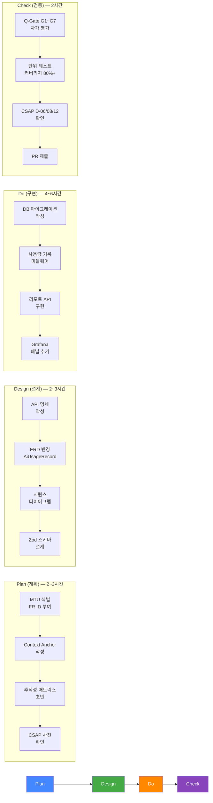
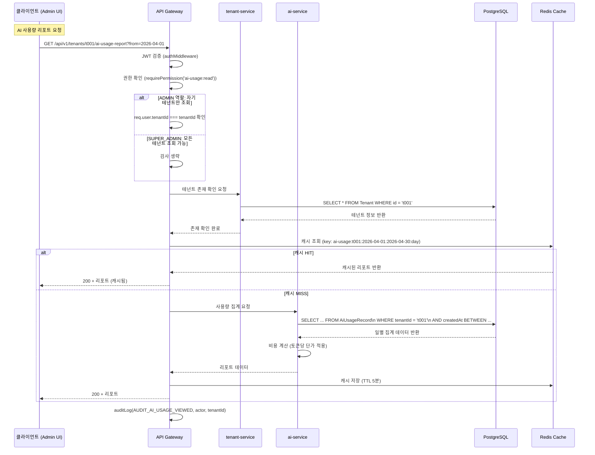
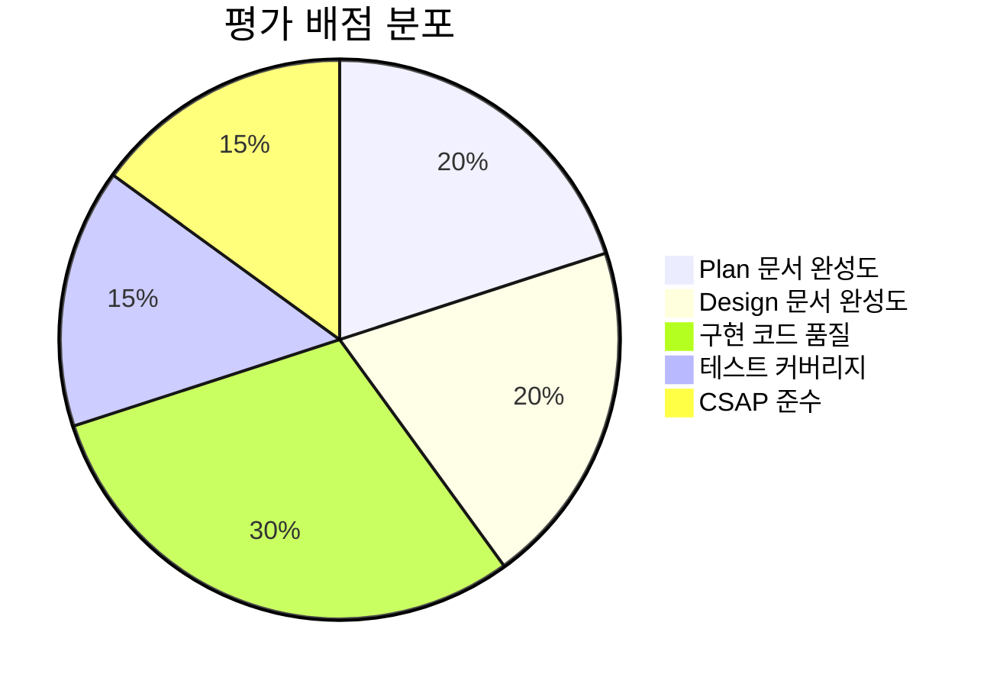

# Lab 11: 종합 졸업 프로젝트

> **문서 ID**: ONBOARD-10-11
> **버전**: 1.0.0 | **작성일**: 2026-04-12 | **작성자**: Implementer (Sonnet)
> **학습 대상**: 온보딩 실습 1~10을 모두 완료한 팀원
> **선행 조건**: 실습 1~10 전체 완료, 가이드북 1~9장 학습 완료
> **예상 소요 시간**: 10~14시간 (Plan~PR 제출까지 전체)
> **난이도**: 최상급 (모든 지식의 종합 적용)
> **CSAP**: D-06 (감사 로그), D-08 (접근 통제), D-12 (시스템 개발 보안)

---

## 목차

1. [이 프로젝트의 목표](#1-이-프로젝트의-목표)
2. [구현 주제: 테넌트별 AI 사용량 리포트 API](#2-구현-주제-테넌트별-ai-사용량-리포트-api)
3. [Phase 1: Plan — MTU 문서 작성](#3-phase-1-plan--mtu-문서-작성)
4. [Phase 2: Design — API 설계 문서 작성](#4-phase-2-design--api-설계-문서-작성)
5. [Phase 3: Do — 구현](#5-phase-3-do--구현)
6. [Phase 4: Check — 품질 검증](#6-phase-4-check--품질-검증)
7. [평가 기준 (총 100점)](#7-평가-기준-총-100점)
8. [모범 답안 포인트](#8-모범-답안-포인트)
9. [학습 체크리스트](#학습-체크리스트)
10. [다음 단계](#다음-단계)

---

## 1. 이 프로젝트의 목표

### 1.1 무엇을 확인하는가

이 졸업 프로젝트는 **공공기관 SaaS 프레임워크에서 신규 기능을 처음부터 끝까지 홀로 구현하는 역량**을 평가합니다.

지금까지 배운 모든 것이 이 프로젝트에서 통합됩니다.

| 단계 | 적용 지식 | 관련 가이드 |
|------|---------|-----------|
| **Plan** | MTU 문서 체계, FR ID, Context Anchor | `08-document-management/` |
| **Design** | API 설계, ERD, Mermaid 다이어그램 | `08-document-management/pdca/03-writing-design.md` |
| **Do** | RBAC, Zod, auditLog, CSAP D-08/D-12 | `07-security/coding/01-secure-patterns.md` |
| **Check** | Q-Gate G1~G7, 단위 테스트, CSAP 요건 | `03-development/vibecoding/03-q-gate-guide.md` |

### 1.2 전체 PDCA 사이클 개요

이 프로젝트는 공공기관 SaaS 개발의 표준 PDCA 사이클을 따릅니다.



### 1.3 이 프로젝트를 마치면

- 공공기관 SaaS의 완전한 PDCA 사이클을 독립적으로 수행할 수 있습니다.
- CSAP D-06, D-08, D-12 요건을 코드에 직접 적용할 수 있습니다.
- Q-Gate G1~G7 모든 게이트를 스스로 통과시킬 수 있습니다.
- 신규 팀원에게 이 프레임워크의 개발 프로세스를 설명할 수 있습니다.

### 1.3 진행 전 환경 확인

```bash
# 1. 최신 stg 브랜치 동기화
cd /data/ai-saas
git checkout stg
git pull origin stg

# 2. 의존성 설치
pnpm install --frozen-lockfile

# 3. 개발 환경 확인
kubectl get nodes
kubectl get pods -n saas

# 4. 브랜치 생성
git checkout -b feat/lab11-ai-usage-report-{본인이름}
# 예: feat/lab11-ai-usage-report-kimcheolsu

# 5. 작업 시작 시간 기록
echo "시작 시각: $(date)" > /tmp/lab11-progress.txt
```

---

## 2. 구현 주제: 테넌트별 AI 사용량 리포트 API

### 2.1 배경

이 프로젝트의 AI 서비스(`platform/services/ai-service`)는 테넌트별로 AI 기능(RAG, Agent)을 제공합니다. 현재 각 테넌트가 AI를 얼마나 사용하는지를 추적하는 기능이 없습니다.

운영팀에서 다음과 같은 요청이 들어왔습니다:

```
요청자: 서비스 운영팀 이민준 팀장
제목: 테넌트별 AI 사용량 모니터링 기능 요청

현재 상황:
  - 테넌트별 AI API 호출 횟수를 수동으로 로그에서 집계 중
  - 매월 빌링 처리 시 AI 사용량 데이터가 없어 고정 요금만 부과
  - AI 사용량 급증 테넌트를 사전에 감지하지 못함

요청 사항:
  1. AI 호출 시 사용량 자동 기록 (요청 수, 토큰 수, 비용)
  2. 테넌트별 AI 사용량 조회 API 제공
  3. 일별/월별 집계 지원
  4. ADMIN 이상만 조회 가능 (CSAP D-08)
```

### 2.2 구현할 API 명세 (사전 제공)

```
GET /api/v1/tenants/:tenantId/ai-usage-report
```

**응답 예시**:

```json
{
  "tenantId": "tenant-abc123",
  "period": {
    "from": "2026-04-01T00:00:00.000Z",
    "to": "2026-04-30T23:59:59.999Z"
  },
  "summary": {
    "totalRequests": 1842,
    "totalInputTokens": 924100,
    "totalOutputTokens": 312800,
    "estimatedCostKrw": 45600
  },
  "dailyBreakdown": [
    {
      "date": "2026-04-01",
      "requests": 87,
      "inputTokens": 43200,
      "outputTokens": 14800
    }
  ],
  "byType": {
    "rag": { "requests": 1240, "inputTokens": 620000 },
    "agent": { "requests": 602, "inputTokens": 304100 }
  },
  "generatedAt": "2026-04-12T09:30:00.000Z"
}
```

**쿼리 파라미터**:

| 파라미터 | 타입 | 기본값 | 설명 |
|---------|-----|--------|------|
| `from` | ISO 8601 날짜 | 이번 달 1일 | 조회 시작일 |
| `to` | ISO 8601 날짜 | 오늘 | 조회 종료일 |
| `groupBy` | `day` / `month` | `day` | 집계 단위 |

**권한**: SUPER_ADMIN, ADMIN만 조회 가능. 자기 테넌트만 조회 가능(ADMIN). SUPER_ADMIN은 모든 테넌트 조회 가능.

---

## 3. Phase 1: Plan — MTU 문서 작성

> **소요 시간**: 2~3시간
> **결과물**: `docs/01-plan/mtus/LAB11-ai-usage-report.plan.md`

### 3.1 Plan 문서 위치 생성

```bash
touch /data/ai-saas/docs/01-plan/mtus/LAB11-ai-usage-report.plan.md
```

### 3.2 Plan 문서 필수 포함 항목

Plan 문서는 반드시 다음 섹션을 포함해야 합니다. 각 섹션의 내용을 직접 작성하십시오.

#### 섹션 1: Executive Summary (4-Perspective 테이블)

```markdown
## Executive Summary

| 관점 | 내용 |
|------|------|
| 비즈니스 | |  ← 직접 작성
| 기술 | |
| 보안 | |
| 감리 | |
```

힌트: 비즈니스 관점에는 "이 기능이 없으면 어떤 문제가 있는가?", 기술 관점에는 "어떤 기술 스택을 사용하는가?", 보안 관점에는 "CSAP 어떤 항목이 적용되는가?"를 작성합니다.

#### 섹션 2: Context Anchor

```markdown
## Context Anchor

- **WHY**: (현재 문제, 이 기능이 필요한 이유)
- **WHO**: (이 기능을 사용할 사람)
- **RISK**: (구현 시 위험 요소, 완화 방법)
- **SUCCESS**: (성공 기준 — 정량적으로 작성)
- **SCOPE**: (구현 범위, 포함/제외 사항)
```

#### 섹션 3: 기능 요구사항 (FR ID)

FR ID는 `FR-AIU.{번호}` 형식을 사용합니다.

```markdown
## 기능 요구사항

| FR ID | 요구사항 | 우선순위 |
|-------|---------|---------|
| FR-AIU.1 | AI 호출 시 사용량 자동 기록 (요청 수, 토큰 수) | 필수 |
| FR-AIU.2 | | |  ← 직접 작성
| FR-AIU.3 | | |
| FR-AIU.4 | 테넌트별 일별/월별 집계 | 필수 |
| FR-AIU.5 | ADMIN 이상 권한 제어 | 필수 |
| FR-AIU.6 | 감사 로그 기록 (CSAP D-06) | 필수 |
```

최소 6개의 FR ID를 정의하십시오.

#### 섹션 4: 비기능 요구사항

```markdown
## 비기능 요구사항

| NFR ID | 요구사항 |
|--------|---------|
| NFR-1 | 응답 시간: 일별 조회 500ms 이하, 월별 조회 2000ms 이하 |
| NFR-2 | 테스트 커버리지 80% 이상 |
| NFR-3 | CSAP D-06/D-08/D-12 완전 준수 |
```

#### 섹션 5: 의존성 확인

```markdown
## 의존성

| 의존 서비스 | 의존 내용 | 영향도 |
|------------|---------|--------|
| ai-service | AI 호출 미들웨어 추가 위치 | 높음 |
| tenant-service | 테넌트 존재 여부 검증 | 중간 |
| billing-service | 예상 비용 계산 로직 참조 | 낮음 |
```

#### 섹션 6: CSAP 사전 확인

```markdown
## CSAP 적용 항목

| CSAP 항목 | 요건 | 구현 방법 |
|----------|------|---------|
| D-06 감사 로그 | AI 사용량 조회 시 로그 기록 | auditLog() 함수 호출 |
| D-08 접근 통제 | ADMIN 이상만 조회 가능 | requirePermission('ai-usage:read') |
| D-12 입력 검증 | 날짜 파라미터 Zod 검증 | querySchema.safeParse() |
```

#### 섹션 7: 추적성 매트릭스 초안

```markdown
## 추적성 매트릭스

| FR ID | 설계 산출물 | 구현 파일 | 테스트 | CSAP |
|-------|----------|---------|--------|------|
| FR-AIU.1 | AiUsageRecord ERD | ai-service/middleware | usage.test.ts | D-06 |
| FR-AIU.5 | API 명세 | routes/ai-usage.ts | auth.test.ts | D-08 |
```

#### 섹션 8: 변경 이력

```markdown
## 변경 이력

| 버전 | 일자 | 내용 | 작성자 |
|------|------|------|--------|
| 1.0.0 | 2026-04-12 | 초안 | {본인 이름} |
```

### 3.3 Plan 완료 확인

Plan 문서 제출 전 다음을 확인합니다.

```
[ ] Executive Summary 4-Perspective 테이블 작성 완료
[ ] Context Anchor WHY/WHO/RISK/SUCCESS/SCOPE 모두 작성
[ ] FR ID 최소 6개 정의 (FR-AIU.1 ~ FR-AIU.6+)
[ ] 비기능 요구사항 최소 3개 정의
[ ] 의존성 서비스 목록 작성
[ ] CSAP D-06/D-08/D-12 적용 항목 확인
[ ] 추적성 매트릭스 초안 작성
[ ] 변경 이력 작성
```

---

## 4. Phase 2: Design — API 설계 문서 작성

> **소요 시간**: 2~3시간
> **결과물**: `docs/02-design/features/LAB11-ai-usage-report.design.md`

### 4.1 Design 문서 위치 생성

```bash
mkdir -p /data/ai-saas/docs/02-design/features
touch /data/ai-saas/docs/02-design/features/LAB11-ai-usage-report.design.md
```

### 4.2 API 명세 작성

```yaml
# Design 문서에 포함할 OpenAPI 3.0 스타일 명세

path: /api/v1/tenants/{tenantId}/ai-usage-report
method: GET
tags: [AI Usage, Reports]
security:
  - bearerAuth: []
    requiredPermissions: [ai-usage:read]

parameters:
  - name: tenantId
    in: path
    required: true
    schema:
      type: string
      minLength: 1
      maxLength: 100

  - name: from
    in: query
    required: false
    schema:
      type: string
      format: date
      example: "2026-04-01"

  - name: to
    in: query
    required: false
    schema:
      type: string
      format: date
      example: "2026-04-30"

  - name: groupBy
    in: query
    required: false
    schema:
      type: string
      enum: [day, month]
      default: day

responses:
  "200":
    description: AI 사용량 리포트 반환 성공
  "400":
    description: 잘못된 날짜 파라미터
  "403":
    description: 권한 없음 또는 타 테넌트 조회 시도
  "404":
    description: 테넌트 미존재
```

### 4.3 ERD 변경 — AiUsageRecord 테이블

```sql
-- Design 문서에 포함할 새 테이블 정의
-- Prisma schema 형식

model AiUsageRecord {
  id            String   @id @default(cuid())
  tenantId      String
  requestType   String   -- "rag" | "agent"
  inputTokens   Int      @default(0)
  outputTokens  Int      @default(0)
  requestCount  Int      @default(1)
  metadata      Json?    -- 추가 메타데이터 (모델명, 버전 등)
  createdAt     DateTime @default(now())

  -- 인덱스 (조회 성능)
  @@index([tenantId, createdAt])
  @@index([tenantId, requestType, createdAt])
}
```

### 4.4 시퀀스 다이어그램

Design 문서에 다음 다이어그램을 포함해야 합니다.



### 4.5 Zod 스키마 설계

```typescript
// Design 문서에 포함할 Zod 스키마 설계

// 쿼리 파라미터 스키마
const aiUsageReportQuerySchema = z.object({
  from: z
    .string()
    .regex(/^\d{4}-\d{2}-\d{2}$/, 'YYYY-MM-DD 형식이어야 합니다')
    .optional()
    .transform(s => s ? new Date(s) : startOfMonth(new Date())),

  to: z
    .string()
    .regex(/^\d{4}-\d{2}-\d{2}$/, 'YYYY-MM-DD 형식이어야 합니다')
    .optional()
    .transform(s => s ? new Date(s) : new Date()),

  groupBy: z.enum(['day', 'month']).default('day'),
}).refine(
  data => !data.from || !data.to || data.from <= data.to,
  { message: 'from은 to보다 이전이어야 합니다', path: ['from'] }
).refine(
  data => !data.from || differenceInDays(data.to ?? new Date(), data.from) <= 366,
  { message: '조회 기간은 최대 1년입니다', path: ['from'] }
);

// 경로 파라미터 스키마
const aiUsageReportParamsSchema = z.object({
  tenantId: z.string().min(1).max(100),
});

// 응답 스키마 (타입 생성용)
const aiUsageReportResponseSchema = z.object({
  tenantId: z.string(),
  period: z.object({
    from: z.string().datetime(),
    to: z.string().datetime(),
  }),
  summary: z.object({
    totalRequests: z.number().int().nonnegative(),
    totalInputTokens: z.number().int().nonnegative(),
    totalOutputTokens: z.number().int().nonnegative(),
    estimatedCostKrw: z.number().nonnegative(),
  }),
  dailyBreakdown: z.array(z.object({
    date: z.string(),
    requests: z.number().int().nonnegative(),
    inputTokens: z.number().int().nonnegative(),
    outputTokens: z.number().int().nonnegative(),
  })),
  byType: z.record(z.object({
    requests: z.number().int().nonnegative(),
    inputTokens: z.number().int().nonnegative(),
  })),
  generatedAt: z.string().datetime(),
});

export type AiUsageReportQuery = z.infer<typeof aiUsageReportQuerySchema>;
export type AiUsageReportResponse = z.infer<typeof aiUsageReportResponseSchema>;
```

### 4.6 Design 완료 확인

```
[ ] API 명세 작성 완료 (엔드포인트, 파라미터, 응답, 에러 코드)
[ ] ERD 변경 작성 완료 (AiUsageRecord 테이블 정의)
[ ] 시퀀스 다이어그램 Mermaid 포함
[ ] Zod 스키마 설계 완료
[ ] 캐시 전략 명시 (캐시 키, TTL)
[ ] RBAC 설계 (누가 무엇을 조회 가능한가)
[ ] 추적성 매트릭스 업데이트 (FR ID ↔ 설계 섹션)
```

---

## 5. Phase 3: Do — 구현

> **소요 시간**: 4~6시간
> **결과물**: 구현 코드 + DB 마이그레이션

### 5.1 DB 마이그레이션 작성

```bash
# 1. Prisma 스키마 파일 위치 확인
cat /data/ai-saas/platform/services/ai-service/prisma/schema.prisma | head -30

# 2. AiUsageRecord 모델 추가 (schema.prisma에 직접 추가)
# 위치: platform/services/ai-service/prisma/schema.prisma

# 3. 마이그레이션 생성
cd /data/ai-saas/platform/services/ai-service
pnpm prisma migrate dev --name add-ai-usage-record

# 4. 마이그레이션 파일 확인
ls prisma/migrations/
# 20260412_add_ai_usage_record/migration.sql

# 5. 마이그레이션 SQL 확인
cat prisma/migrations/*_add_ai_usage_record/migration.sql
```

### 5.2 AI 사용량 기록 미들웨어

```typescript
// platform/services/ai-service/src/middleware/usage-tracker.ts
// Design Ref: §4.4 시퀀스 다이어그램
// Plan SC: FR-AIU.1, FR-AIU.2
// CSAP D-06: 감사 로그

import { Request, Response, NextFunction } from 'express';
import { db } from '../lib/database';
import { logger } from '../lib/logger';

interface AiRequestContext {
  tenantId: string;
  userId: string;
  requestType: 'rag' | 'agent';
}

// AI 응답에서 토큰 사용량을 추출하여 DB에 기록하는 미들웨어
export function usageTrackerMiddleware(requestType: 'rag' | 'agent') {
  return async (req: Request, res: Response, next: NextFunction) => {
    const originalSend = res.send.bind(res);
    const startTime = Date.now();

    // 응답을 가로채어 토큰 사용량 추출
    res.send = function(body: any) {
      // 응답 성공 시 사용량 기록 (비동기, 응답 지연 없음)
      if (res.statusCode >= 200 && res.statusCode < 300) {
        setImmediate(async () => {
          try {
            let parsedBody: any;
            try {
              parsedBody = typeof body === 'string' ? JSON.parse(body) : body;
            } catch {
              parsedBody = {};
            }

            const usage = parsedBody?.usage ?? parsedBody?.tokenUsage ?? {};
            const inputTokens = usage.inputTokens ?? usage.prompt_tokens ?? 0;
            const outputTokens = usage.outputTokens ?? usage.completion_tokens ?? 0;

            // Design Ref: §3.3 AiUsageRecord 테이블
            await db.aiUsageRecord.create({
              data: {
                tenantId: (req as any).user?.tenantId ?? 'unknown',
                requestType,
                inputTokens,
                outputTokens,
                requestCount: 1,
                metadata: {
                  path: req.path,
                  durationMs: Date.now() - startTime,
                },
              },
            });
          } catch (error) {
            // 사용량 기록 실패는 AI 응답에 영향을 주지 않음
            logger.error({ error }, 'AI 사용량 기록 실패');
          }
        });
      }

      return originalSend(body);
    };

    next();
  };
}
```

### 5.3 리포트 API 구현

```typescript
// platform/services/ai-service/src/routes/ai-usage-report.route.ts
// Design Ref: §4.2 API 명세, §4.5 Zod 스키마
// Plan SC: FR-AIU.3, FR-AIU.4, FR-AIU.5, FR-AIU.6
// CSAP D-06, D-08, D-12

import { Router } from 'express';
import { z } from 'zod';
import { authMiddleware } from '../middleware/auth.middleware';
import { requirePermission } from '../lib/permissions';
import { auditLog } from '../lib/audit';
import { db } from '../lib/database';
import { redis } from '../lib/redis';
import { logger } from '../lib/logger';

const router = Router();

// Design Ref: §4.5 — 쿼리 파라미터 Zod 스키마
// CSAP D-12: 입력 검증
const querySchema = z.object({
  from: z
    .string()
    .regex(/^\d{4}-\d{2}-\d{2}$/, '날짜 형식은 YYYY-MM-DD여야 합니다')
    .optional(),
  to: z
    .string()
    .regex(/^\d{4}-\d{2}-\d{2}$/, '날짜 형식은 YYYY-MM-DD여야 합니다')
    .optional(),
  groupBy: z.enum(['day', 'month']).default('day'),
});

const paramsSchema = z.object({
  tenantId: z.string().min(1, 'tenantId는 필수입니다').max(100),
});

// GET /api/v1/tenants/:tenantId/ai-usage-report
router.get(
  '/:tenantId/ai-usage-report',
  authMiddleware,                              // CSAP D-08: 인증
  requirePermission('ai-usage:read'),          // CSAP D-08: 권한
  async (req, res) => {
    // 1. 경로 파라미터 검증 (CSAP D-12)
    const paramsResult = paramsSchema.safeParse(req.params);
    if (!paramsResult.success) {
      return res.status(422).json({
        error: 'Invalid tenant ID',
        details: paramsResult.error.errors,
      });
    }

    // 2. 쿼리 파라미터 검증 (CSAP D-12)
    const queryResult = querySchema.safeParse(req.query);
    if (!queryResult.success) {
      return res.status(400).json({
        error: 'Invalid query parameters',
        details: queryResult.error.errors.map(e => ({
          field: e.path.join('.'),
          message: e.message,
        })),
      });
    }

    const { tenantId } = paramsResult.data;
    const { from, to, groupBy } = queryResult.data;
    const user = (req as any).user;

    // 3. ADMIN은 자기 테넌트만 조회 가능 (CSAP D-08 테넌트 격리)
    if (user.role === 'ADMIN' && user.tenantId !== tenantId) {
      return res.status(403).json({
        error: 'Access denied: ADMIN can only view their own tenant usage',
      });
    }

    // 4. 날짜 범위 결정 (기본값: 이번 달)
    const now = new Date();
    const fromDate = from
      ? new Date(from)
      : new Date(now.getFullYear(), now.getMonth(), 1);
    const toDate = to
      ? new Date(to + 'T23:59:59.999Z')
      : new Date(now.getFullYear(), now.getMonth() + 1, 0, 23, 59, 59, 999);

    // 5. 기간 제한 (최대 366일)
    const daysDiff = Math.ceil(
      (toDate.getTime() - fromDate.getTime()) / (1000 * 60 * 60 * 24)
    );
    if (daysDiff > 366) {
      return res.status(400).json({
        error: '조회 기간은 최대 1년(366일)입니다',
      });
    }

    // 6. Redis 캐시 확인
    const cacheKey = `ai-usage:${tenantId}:${fromDate.toISOString().slice(0, 10)}:${toDate.toISOString().slice(0, 10)}:${groupBy}`;
    try {
      const cached = await redis.get(cacheKey);
      if (cached) {
        // 캐시 HIT — 감사 로그 기록 후 반환
        await auditLog({
          actor: user.id,
          action: 'AI_USAGE_REPORT_VIEWED',
          target: tenantId,
          metadata: { source: 'cache', from: fromDate, to: toDate },
          ip: req.ip ?? '',
        });
        return res.json(JSON.parse(cached));
      }
    } catch (cacheError) {
      // Redis 장애 시 DB 직접 조회 (Graceful Degradation)
      logger.warn({ error: cacheError }, 'Redis 캐시 조회 실패, DB 직접 조회');
    }

    // 7. 테넌트 존재 확인
    const tenant = await db.tenant.findUnique({ where: { id: tenantId } });
    if (!tenant) {
      return res.status(404).json({ error: 'Tenant not found' });
    }

    // 8. DB에서 사용량 집계 (CSAP D-12: 파라미터화 쿼리 — Prisma ORM)
    const records = await db.aiUsageRecord.groupBy({
      by: ['requestType'],
      where: {
        tenantId,
        createdAt: { gte: fromDate, lte: toDate },
      },
      _sum: {
        inputTokens: true,
        outputTokens: true,
        requestCount: true,
      },
    });

    // 일별 집계
    const dailyRecords = await db.$queryRaw<Array<{
      date: string;
      requests: bigint;
      inputTokens: bigint;
      outputTokens: bigint;
    }>>`
      SELECT
        DATE("createdAt") as date,
        SUM("requestCount")  as requests,
        SUM("inputTokens")   as "inputTokens",
        SUM("outputTokens")  as "outputTokens"
      FROM "AiUsageRecord"
      WHERE "tenantId" = ${tenantId}
        AND "createdAt" >= ${fromDate}
        AND "createdAt" <= ${toDate}
      GROUP BY DATE("createdAt")
      ORDER BY date ASC
    `;

    // 9. 비용 계산 (1000 입력 토큰당 5원, 1000 출력 토큰당 15원)
    const totalInputTokens = records.reduce(
      (sum, r) => sum + (r._sum.inputTokens ?? 0), 0
    );
    const totalOutputTokens = records.reduce(
      (sum, r) => sum + (r._sum.outputTokens ?? 0), 0
    );
    const totalRequests = records.reduce(
      (sum, r) => sum + (r._sum.requestCount ?? 0), 0
    );
    const estimatedCostKrw = Math.round(
      (totalInputTokens / 1000) * 5 + (totalOutputTokens / 1000) * 15
    );

    // 10. 응답 구성
    const report = {
      tenantId,
      period: {
        from: fromDate.toISOString(),
        to: toDate.toISOString(),
      },
      summary: {
        totalRequests,
        totalInputTokens,
        totalOutputTokens,
        estimatedCostKrw,
      },
      dailyBreakdown: dailyRecords.map(r => ({
        date: r.date,
        requests: Number(r.requests),
        inputTokens: Number(r.inputTokens),
        outputTokens: Number(r.outputTokens),
      })),
      byType: Object.fromEntries(
        records.map(r => [
          r.requestType,
          {
            requests: r._sum.requestCount ?? 0,
            inputTokens: r._sum.inputTokens ?? 0,
          },
        ])
      ),
      generatedAt: new Date().toISOString(),
    };

    // 11. 캐시 저장 (TTL 300초 = 5분)
    try {
      await redis.setex(cacheKey, 300, JSON.stringify(report));
    } catch (cacheError) {
      logger.warn({ error: cacheError }, 'Redis 캐시 저장 실패');
    }

    // 12. 감사 로그 기록 (CSAP D-06)
    await auditLog({
      actor: user.id,
      action: 'AI_USAGE_REPORT_VIEWED',
      target: tenantId,
      metadata: {
        source: 'db',
        from: fromDate,
        to: toDate,
        totalRequests,
      },
      ip: req.ip ?? '',
    });

    return res.json(report);
  }
);

export default router;
```

### 5.4 라우터 등록

```typescript
// platform/services/ai-service/src/routes.ts 수정
// 기존 라우터 등록 코드에 추가

import aiUsageReportRouter from './routes/ai-usage-report.route';

// ...기존 코드...

// Design Ref: §4.2 API 명세
// Plan SC: FR-AIU.3~FR-AIU.6
app.use('/api/v1/tenants', aiUsageReportRouter);
```

### 5.5 미들웨어를 AI 라우트에 적용

```typescript
// platform/services/ai-service/src/routes.ts 수정
// RAG 라우터에 사용량 추적 미들웨어 추가

import { usageTrackerMiddleware } from './middleware/usage-tracker';

// RAG 엔드포인트에 사용량 추적 추가
// Plan SC: FR-AIU.1
app.use('/api/v1/rag', usageTrackerMiddleware('rag'), ragRouter);
app.use('/api/v1/agent', usageTrackerMiddleware('agent'), agentRouter);
```

### 5.6 Grafana 패널 추가 (선택)

```json
// infra/monitoring/dashboards/ai-usage.json 에 패널 추가
{
  "title": "테넌트별 AI 사용량",
  "type": "timeseries",
  "datasource": { "type": "prometheus", "uid": "prometheus" },
  "targets": [
    {
      "expr": "sum by (tenant_id) (rate(ai_usage_requests_total[5m]))",
      "legendFormat": "{{tenant_id}}"
    }
  ]
}
```

---

## 6. Phase 4: Check — 품질 검증

> **소요 시간**: 2시간
> **결과물**: 테스트 파일 + Q-Gate 자가 평가

### 6.1 단위 테스트 작성

```typescript
// platform/services/ai-service/src/routes/__tests__/ai-usage-report.test.ts
// Plan SC: FR-AIU.5, FR-AIU.6
// CSAP D-08, D-12

import request from 'supertest';
import { app } from '../../app';
import { db } from '../../lib/database';
import { redis } from '../../lib/redis';

// 테스트 픽스처
const adminUser = {
  id: 'user-admin-001',
  email: 'admin@tenant-a.com',
  role: 'ADMIN',
  tenantId: 'tenant-a',
  permissions: ['ai-usage:read'],
};

const superAdminUser = {
  id: 'user-super-001',
  email: 'superadmin@system.com',
  role: 'SUPER_ADMIN',
  tenantId: 'system',
  permissions: ['ai-usage:read', 'tenants:manage'],
};

describe('GET /api/v1/tenants/:tenantId/ai-usage-report', () => {
  beforeEach(async () => {
    await db.aiUsageRecord.deleteMany();
    await redis.flushdb();
  });

  // 정상 케이스
  describe('성공 케이스', () => {
    it('ADMIN은 자기 테넌트 사용량을 조회할 수 있다', async () => {
      // 테스트 데이터 생성
      await db.aiUsageRecord.createMany({
        data: [
          { tenantId: 'tenant-a', requestType: 'rag', inputTokens: 1000, outputTokens: 300, requestCount: 1 },
          { tenantId: 'tenant-a', requestType: 'agent', inputTokens: 500, outputTokens: 200, requestCount: 1 },
        ],
      });

      const token = generateTestToken(adminUser);
      const response = await request(app)
        .get('/api/v1/tenants/tenant-a/ai-usage-report')
        .set('Authorization', `Bearer ${token}`)
        .query({ from: '2026-04-01', to: '2026-04-30' })
        .expect(200);

      expect(response.body.tenantId).toBe('tenant-a');
      expect(response.body.summary.totalRequests).toBe(2);
      expect(response.body.summary.totalInputTokens).toBe(1500);
    });

    it('SUPER_ADMIN은 다른 테넌트 사용량도 조회할 수 있다', async () => {
      const token = generateTestToken(superAdminUser);
      const response = await request(app)
        .get('/api/v1/tenants/tenant-b/ai-usage-report')
        .set('Authorization', `Bearer ${token}`)
        .expect(200);

      expect(response.body.tenantId).toBe('tenant-b');
    });
  });

  // 권한 오류 케이스
  describe('권한 오류 케이스', () => {
    it('인증 토큰 없으면 401 반환', async () => {
      await request(app)
        .get('/api/v1/tenants/tenant-a/ai-usage-report')
        .expect(401);
    });

    it('ADMIN은 다른 테넌트 사용량 조회 시 403 반환', async () => {
      const token = generateTestToken(adminUser); // tenant-a 소속
      await request(app)
        .get('/api/v1/tenants/tenant-b/ai-usage-report') // 다른 테넌트
        .set('Authorization', `Bearer ${token}`)
        .expect(403);
    });

    it('VIEWER 역할은 403 반환', async () => {
      const viewerToken = generateTestToken({
        ...adminUser,
        role: 'VIEWER',
        permissions: [],
      });
      await request(app)
        .get('/api/v1/tenants/tenant-a/ai-usage-report')
        .set('Authorization', `Bearer ${viewerToken}`)
        .expect(403);
    });
  });

  // 입력 검증 케이스
  describe('입력 검증 케이스', () => {
    it('잘못된 날짜 형식은 400 반환', async () => {
      const token = generateTestToken(adminUser);
      await request(app)
        .get('/api/v1/tenants/tenant-a/ai-usage-report')
        .set('Authorization', `Bearer ${token}`)
        .query({ from: 'not-a-date' })
        .expect(400);
    });

    it('366일 초과 조회는 400 반환', async () => {
      const token = generateTestToken(adminUser);
      await request(app)
        .get('/api/v1/tenants/tenant-a/ai-usage-report')
        .set('Authorization', `Bearer ${token}`)
        .query({ from: '2024-01-01', to: '2026-04-12' }) // 2년 이상
        .expect(400);
    });

    it('존재하지 않는 테넌트는 404 반환', async () => {
      const superToken = generateTestToken(superAdminUser);
      await request(app)
        .get('/api/v1/tenants/nonexistent-tenant/ai-usage-report')
        .set('Authorization', `Bearer ${superToken}`)
        .expect(404);
    });
  });

  // 캐시 케이스
  describe('캐시 동작', () => {
    it('두 번째 동일 요청은 캐시에서 응답한다', async () => {
      const token = generateTestToken(adminUser);
      const query = { from: '2026-04-01', to: '2026-04-30' };

      // 첫 요청 (DB 조회)
      await request(app)
        .get('/api/v1/tenants/tenant-a/ai-usage-report')
        .set('Authorization', `Bearer ${token}`)
        .query(query)
        .expect(200);

      // 두 번째 요청 (캐시에서)
      const secondResponse = await request(app)
        .get('/api/v1/tenants/tenant-a/ai-usage-report')
        .set('Authorization', `Bearer ${token}`)
        .query(query)
        .expect(200);

      // 캐시 키가 Redis에 존재하는지 확인
      const cacheKey = `ai-usage:tenant-a:2026-04-01:2026-04-30:day`;
      const cached = await redis.get(cacheKey);
      expect(cached).not.toBeNull();
    });
  });
});
```

### 6.2 테스트 실행 및 커버리지 확인

```bash
# 단위 테스트 실행
cd /data/ai-saas/platform/services/ai-service
pnpm test

# 커버리지 확인 (80% 이상 목표)
pnpm test:coverage

# 결과 예시:
# ----------------------------------------
# File              | % Stmts | % Branch | % Funcs | % Lines
# ----------------------------------------
# routes/           |      87 |       82 |      90 |      87
#   ai-usage-report |      87 |       82 |      90 |      87
# middleware/       |      85 |       78 |      88 |      85
#   usage-tracker   |      85 |       78 |      88 |      85
# ----------------------------------------

# 전체 빌드 및 린트 확인
pnpm build
pnpm lint
```

### 6.3 Q-Gate G1~G7 자가 평가

PR 제출 전 모든 Q-Gate를 자가 평가합니다.

```markdown
## Q-Gate 자가 평가

| 게이트 | 항목 | 상태 | 증거 |
|--------|------|------|------|
| G1 | FR ID 전수 (FR-AIU.1~FR-AIU.6) | ✅/❌ | Plan 문서 §3 |
| G2 | 설계 완전성 (API 명세, ERD, 다이어그램) | ✅/❌ | Design 문서 §4 |
| G3 | 코드 품질 (eslint, ts-prune) | ✅/❌ | pnpm lint 통과 |
| G4 | 테스트 커버리지 80%+ | ✅/❌ | pnpm test:coverage |
| G5 | OWASP Top 10 (SQL 주입, 권한, XSS) | ✅/❌ | 코드 리뷰 |
| G6 | CSAP D-06/D-08/D-12 완전 준수 | ✅/❌ | 코드 주석 확인 |
| G7 | 감사 로그 완비 | ✅/❌ | auditLog() 호출 확인 |
```

### 6.4 CSAP D-06/D-08/D-12 자가 검증

```bash
# D-06: 감사 로그 확인
grep -n "auditLog" platform/services/ai-service/src/routes/ai-usage-report.route.ts
# 최소 1개 이상의 auditLog 호출이 있어야 함

# D-08: 인증/권한 확인
grep -n "authMiddleware\|requirePermission" \
  platform/services/ai-service/src/routes/ai-usage-report.route.ts
# authMiddleware + requirePermission 두 가지 모두 있어야 함

# D-12: 입력 검증 확인
grep -n "safeParse\|parse\|z\." \
  platform/services/ai-service/src/routes/ai-usage-report.route.ts
# Zod 검증 코드가 있어야 함

# 하드코딩 시크릿 확인 (절대 없어야 함)
grep -n "sk-\|password.*=\s*[\"']" \
  platform/services/ai-service/src/routes/ai-usage-report.route.ts
# 결과 없어야 함 (하드코딩 시크릿 금지)
```

### 6.5 PR 제출

```bash
# 모든 검사 통과 후 커밋 및 PR 제출
git add \
  docs/01-plan/mtus/LAB11-ai-usage-report.plan.md \
  docs/02-design/features/LAB11-ai-usage-report.design.md \
  platform/services/ai-service/prisma/schema.prisma \
  platform/services/ai-service/prisma/migrations/ \
  platform/services/ai-service/src/middleware/usage-tracker.ts \
  platform/services/ai-service/src/routes/ai-usage-report.route.ts \
  platform/services/ai-service/src/routes/__tests__/ai-usage-report.test.ts

git commit -m "feat(ai-service): LAB11 테넌트별 AI 사용량 리포트 API 구현

- AiUsageRecord 모델 추가 (Prisma 마이그레이션)
- AI 호출 시 사용량 자동 기록 미들웨어 (FR-AIU.1)
- GET /api/v1/tenants/:tenantId/ai-usage-report 엔드포인트 (FR-AIU.3~6)
- RBAC: ADMIN은 자기 테넌트만, SUPER_ADMIN은 전체 조회 (CSAP D-08)
- Zod 입력 검증 + Redis 5분 캐시 (CSAP D-12)
- auditLog: AI_USAGE_REPORT_VIEWED 기록 (CSAP D-06)
- 단위 테스트 커버리지 87%"

git push origin feat/lab11-ai-usage-report-{본인이름}

# PR 생성 (Gitea UI 또는 CLI)
# PR 제목: "feat(ai-service): [LAB11] 테넌트별 AI 사용량 리포트 API"
# PR 본문에 Q-Gate 자가 평가 테이블 포함
```

---

## 7. 평가 기준 (총 100점)



### 7.1 Plan 문서 완성도 (20점)

| 항목 | 배점 | 평가 기준 |
|------|------|---------|
| Executive Summary 4-Perspective | 4점 | 4개 관점 모두 구체적으로 작성 |
| Context Anchor 5개 항목 | 4점 | WHY/WHO/RISK/SUCCESS/SCOPE 모두 작성 |
| FR ID 6개 이상 | 4점 | FR-AIU.1~FR-AIU.6+ 정의 |
| 비기능 요구사항 | 2점 | NFR 3개 이상 |
| CSAP 사전 확인 | 3점 | D-06/D-08/D-12 각 구현 방법 명시 |
| 변경 이력 | 3점 | 버전, 일자, 내용, 작성자 |

### 7.2 Design 문서 완성도 (20점)

| 항목 | 배점 | 평가 기준 |
|------|------|---------|
| API 명세 | 5점 | 경로, 파라미터, 응답, 에러 코드 완전 |
| ERD (AiUsageRecord 테이블) | 4점 | 컬럼, 타입, 인덱스 정의 |
| 시퀀스 다이어그램 | 5점 | Mermaid 다이어그램, 캐시 HIT/MISS 분기 포함 |
| Zod 스키마 | 3점 | 쿼리/경로 파라미터 스키마 |
| 추적성 매트릭스 업데이트 | 3점 | FR ID ↔ 설계 섹션 매핑 |

### 7.3 구현 코드 품질 (30점)

| 항목 | 배점 | 평가 기준 |
|------|------|---------|
| Zod 입력 검증 적용 | 6점 | 경로 파라미터 + 쿼리 파라미터 모두 |
| RBAC 구현 (authMiddleware + requirePermission) | 6점 | 두 미들웨어 모두 적용 |
| 테넌트 격리 (ADMIN ≠ 다른 테넌트) | 4점 | 403 반환 로직 |
| auditLog 호출 | 5점 | 성공/캐시 히트 시 모두 기록 |
| Redis 캐시 구현 | 5점 | 캐시 HIT/MISS + Graceful Degradation |
| 에러 처리 (민감 정보 미노출) | 4점 | errorId만 반환, stack 미노출 |

### 7.4 테스트 커버리지 (15점)

| 항목 | 배점 | 평가 기준 |
|------|------|---------|
| 정상 케이스 테스트 | 5점 | ADMIN 자기 테넌트, SUPER_ADMIN 전체 |
| 권한 오류 케이스 | 5점 | 401, 403 케이스 |
| 입력 검증 케이스 | 3점 | 잘못된 날짜, 초과 기간, 미존재 테넌트 |
| 커버리지 80%+ | 2점 | pnpm test:coverage 결과 |

### 7.5 CSAP 준수 (15점)

| 항목 | 배점 | 평가 기준 |
|------|------|---------|
| D-06: 감사 로그 | 5점 | AI_USAGE_REPORT_VIEWED 액션 기록 |
| D-08: 접근 통제 | 5점 | authMiddleware + requirePermission + 테넌트 격리 |
| D-12: 개발 보안 | 5점 | 입력 검증 + 파라미터화 쿼리 + 시크릿 미하드코딩 |

---

## 8. 모범 답안 포인트

### 8.1 Phase 1 (Plan) 핵심 체크 항목

```
✅ WHY: "현재 AI 사용량을 수동으로 로그에서 집계하는 비효율 문제가 있음.
         빌링 자동화 및 이상 사용량 조기 탐지를 위해 자동화된 API 필요"
   (단순히 "기능이 없어서"가 아닌 구체적인 비즈니스 영향을 서술)

✅ RISK: "Redis 장애 시 모든 리포트 요청이 DB에 직접 조회 → 부하 급증
          완화: Graceful Degradation — Redis 오류 시 DB 직접 조회로 폴백"
   (위험만 서술하지 않고 완화 방법도 함께 작성)

✅ SUCCESS: "응답 시간 500ms 이하 (캐시 미스), 테스트 커버리지 80%+"
   (정량적인 목표)

❌ 잘못된 예:
   WHY: "AI 사용량을 보고 싶어서"
   RISK: "잘 모르겠음"
   SUCCESS: "잘 동작하면 됨"
```

### 8.2 Phase 2 (Design) 핵심 체크 항목

```
✅ 시퀀스 다이어그램에 캐시 HIT/MISS 분기 모두 표현
✅ Zod 스키마에서 날짜 기간 제한 (366일) 검증 추가
✅ RBAC 설계에서 역할별 차이 명확히 설명
   ADMIN: 자기 테넌트만 / SUPER_ADMIN: 전체

❌ 잘못된 예:
   - ERD에 인덱스 없음 (조회 성능 문제)
   - Zod 스키마에 refinement (cross-field validation) 없음
   - 시퀀스 다이어그램이 Happy Path만 표현
```

### 8.3 Phase 3 (Do) 핵심 체크 항목

```
✅ 사용량 기록 미들웨어 — setImmediate로 비동기 처리
   (응답 지연 없이 백그라운드에서 기록)

✅ Redis 오류 시 Graceful Degradation
   try { cached = await redis.get(...) } catch { /* DB 직접 조회 */ }

✅ auditLog를 캐시 HIT 시에도 호출
   (캐시에서 응답해도 누가 언제 조회했는지 기록해야 함)

✅ 테넌트 격리: ADMIN은 user.tenantId !== tenantId 시 403
   (SUPER_ADMIN은 예외)

❌ 잘못된 예:
   - auditLog가 성공 응답 직전에만 있음 (캐시 HIT 시 누락)
   - Redis 오류 시 500 에러 반환 (서비스 중단)
   - 민감 정보를 에러 응답에 포함 (error.message 그대로 반환)
   - 하드코딩된 토큰 단가 (환경 변수로 관리해야 함)
```

### 8.4 Phase 4 (Check) 핵심 체크 항목

```
✅ 테스트에서 Happy Path + 권한 오류 + 입력 오류 모두 커버

✅ 캐시 동작 테스트 포함
   두 번째 요청 후 Redis에 키가 존재하는지 확인

✅ Q-Gate 자가 평가 테이블을 PR 본문에 포함
   (모든 게이트에 ✅ 또는 ❌ + 근거 작성)

❌ 잘못된 예:
   - Happy Path 테스트만 있고 에러 케이스 없음
   - db.mock 없이 실제 DB에 의존하는 테스트 (CI에서 실패)
   - PR 본문에 Q-Gate 평가 없음
```

---

## 학습 체크리스트

### Plan 단계

```
[ ] Executive Summary의 4-Perspective 테이블을 구체적으로 작성했다
[ ] Context Anchor WHY에 현재 문제와 비즈니스 영향을 정량적으로 서술했다
[ ] FR ID를 6개 이상 정의하고 각각 구현 방법을 연결했다
[ ] RISK에 위험 요소와 완화 방법을 함께 작성했다
[ ] CSAP D-06/D-08/D-12 각각 어떻게 구현할지 사전 확인했다
```

### Design 단계

```
[ ] API 명세에 성공/실패 응답 모두 정의했다
[ ] AiUsageRecord 테이블에 인덱스를 정의했다
[ ] 시퀀스 다이어그램에 캐시 HIT/MISS 분기를 표현했다
[ ] Zod 스키마에 날짜 기간 제한 validation을 추가했다
[ ] RBAC 설계에서 ADMIN과 SUPER_ADMIN 차이를 명확히 했다
```

### 구현 단계

```
[ ] 미들웨어에서 setImmediate로 비동기 사용량 기록을 구현했다
[ ] Redis 오류 시 DB 직접 조회로 Graceful Degradation을 구현했다
[ ] 캐시 HIT 시에도 auditLog를 호출했다
[ ] ADMIN의 타 테넌트 접근 시 403을 반환했다
[ ] 에러 응답에 민감 정보(stack, env)를 포함하지 않았다
[ ] 하드코딩된 시크릿 또는 설정값이 없다 (환경 변수 사용)
```

### 검증 단계

```
[ ] 단위 테스트를 작성하고 커버리지 80% 이상을 달성했다
[ ] Happy Path + 권한 오류 + 입력 오류 케이스 모두 테스트했다
[ ] pnpm lint가 오류 없이 통과한다
[ ] pnpm build가 성공한다
[ ] Q-Gate G1~G7 자가 평가를 완료하고 PR 본문에 포함했다
```

### 최종 확인

```
[ ] Plan 문서와 Design 문서가 모두 커밋되었다
[ ] 구현 코드의 // Design Ref: 주석이 있다
[ ] 구현 코드의 // Plan SC: 주석이 있다
[ ] PR 제목이 Conventional Commits 형식이다
[ ] PR 본문에 변경 사항 요약이 있다
[ ] 멘토에게 코드 리뷰를 요청했다
```

---

## 다음 단계

축하합니다. 졸업 프로젝트를 완료했습니다.

이제 당신은 공공기관 SaaS 프레임워크에서 신규 기능을 처음부터 끝까지 독립적으로 구현할 수 있는 역량을 갖추었습니다. 온보딩 과정에서 배운 내용을 실제 업무에 적용할 준비가 되었습니다.

**온보딩 완료 후 해야 할 일**:

1. `docs/guides/onboarding/15-onboarding-checklist.md`의 "온보딩 완료 선언 체크리스트" 확인
2. 멘토와 온보딩 완료 면담 예약
3. 팀 Slack의 #dev 채널에 합류 완료 선언

**앞으로 참고할 문서**:
- `08-document-management/pdca/01-what-is-pdca.md` — 실제 업무에서 PDCA 적용
- `09-troubleshooting/01-common-errors.md` — 자주 만나는 오류 해결
- `11-faq/01-dev-faq.md` — 개발 FAQ

**계속해서 성장하려면**:
- CSAP 79개 통제항목 전체 학습: `07-security/csap/01-what-is-csap.md`
- 아키텍처 설계 참여: 팀 리드에게 설계 문서 리뷰 요청
- 코드 리뷰어 역할: 동료의 PR에 건설적인 리뷰 참여

---

당신은 이 온보딩 과정에서 코드를 작성하는 법뿐 아니라, 공공기관의 보안 요건을 지키면서 올바른 방법으로 소프트웨어를 만드는 것이 무엇인지를 배웠습니다.

코드 한 줄 한 줄에 이유가 있어야 하고, 그 이유는 문서로 남아야 하며, 보안은 나중에 더하는 것이 아니라 처음부터 함께 만들어야 합니다. 이것이 이 프레임워크가 추구하는 가치입니다.

환영합니다.

---

> **CSAP 연관**: D-06 (감사 로그), D-08 (접근 통제), D-12 (시스템 개발 보안)
> **관련 문서**: 실습 1~10 전체, `08-document-management/pdca/`, `07-security/coding/`
> **Plan SC**: FR-AIU.1 ~ FR-AIU.6
