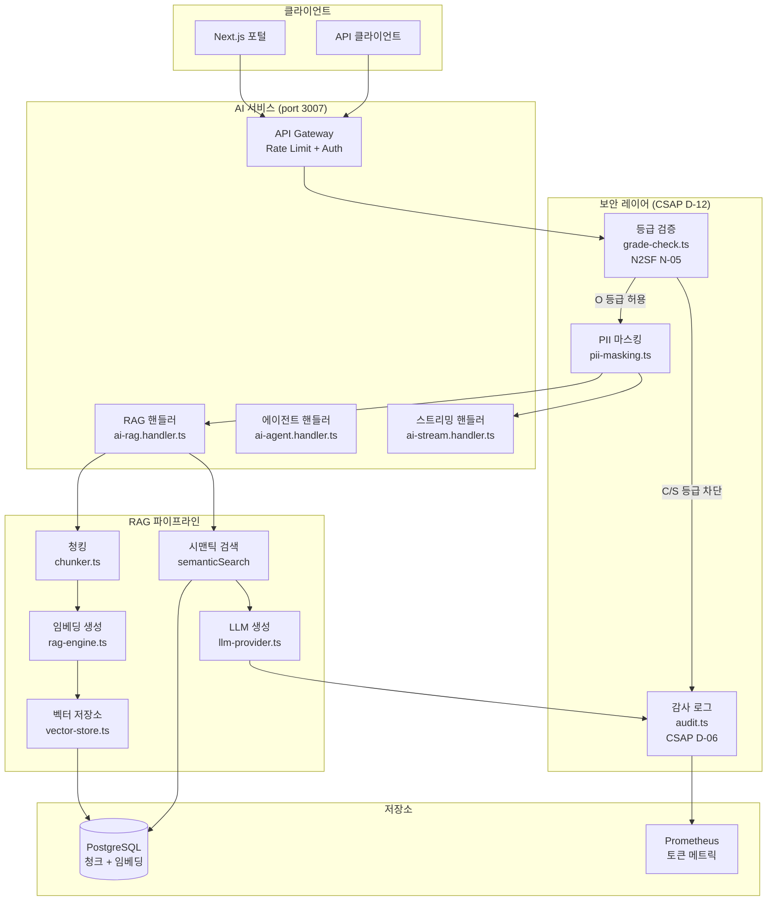
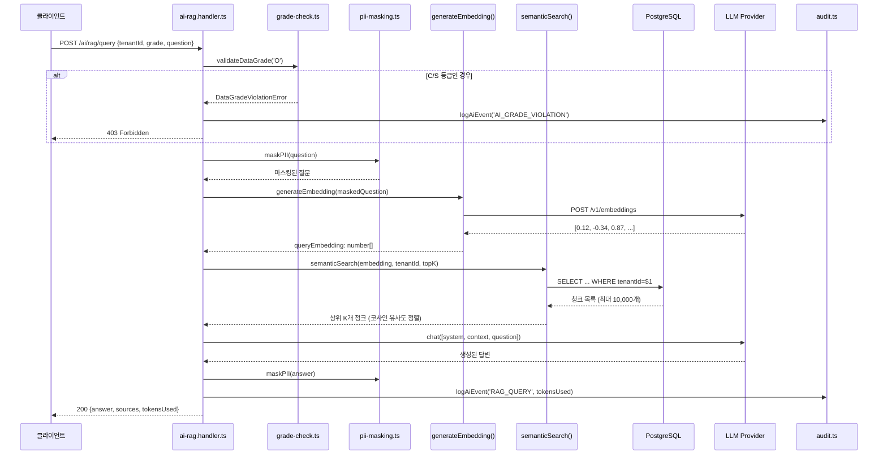
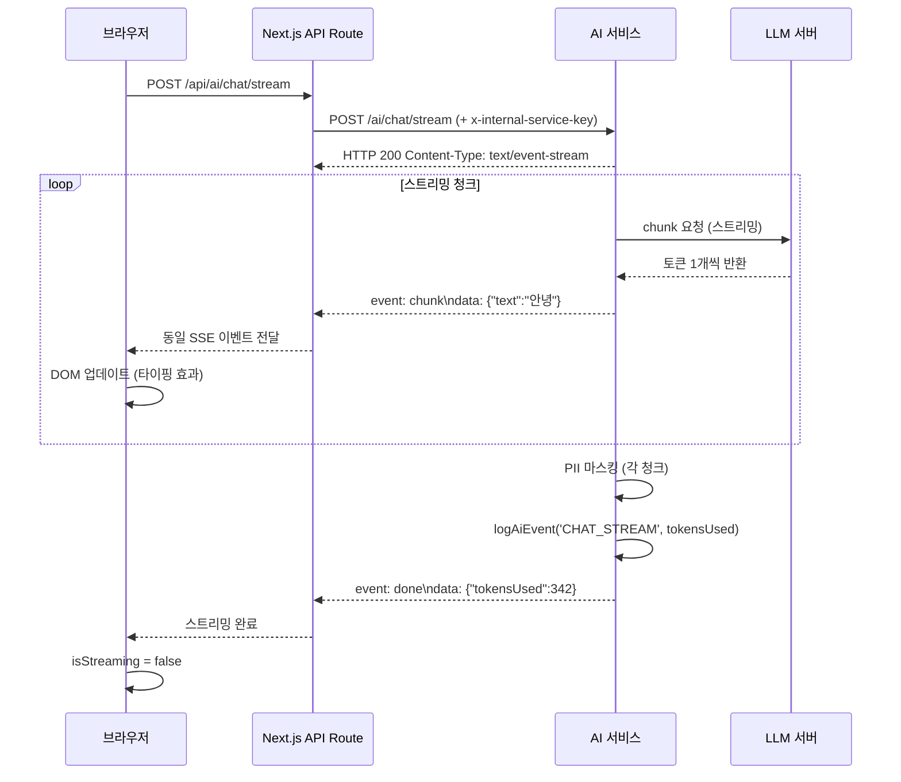

# 실습 12 — 고급 AI 기능 개발 (RAG + 스트리밍 + 비용 제어)

> **문서 ID**: ONBOARD-EX-012
> **버전**: 1.0.0 | **작성일**: 2026-04-12 | **대상**: 백엔드 개발자 (AI 기능 담당)
> **선행 학습**: `10-exercises/11-final-project.md`, `03-development/08-ai-development-guide.md`
> **소요 시간**: 약 210분 (3.5시간)
> **난이도**: 상급

---

## 목차

1. [실습 소개 및 사전 요건](#1-실습-소개-및-사전-요건)
2. [파트 1: RAG 파이프라인 이해 (45분)](#2-파트-1-rag-파이프라인-이해-45분)
3. [파트 2: N2SF 데이터 등급 검증 추가 (30분)](#3-파트-2-n2sf-데이터-등급-검증-추가-30분)
4. [파트 3: 스트리밍 응답 구현 (45분)](#4-파트-3-스트리밍-응답-구현-45분)
5. [파트 4: 비용 제어 및 모니터링 (30분)](#5-파트-4-비용-제어-및-모니터링-30분)
6. [파트 5: 전체 PDCA 사이클 수행 (60분)](#6-파트-5-전체-pdca-사이클-수행-60분)
7. [채점 기준 (100점)](#7-채점-기준-100점)
8. [추가 도전 과제 (선택)](#8-추가-도전-과제-선택)

---

## 1. 실습 소개 및 사전 요건

### 1.1 이 실습에서 배울 것

이 실습은 공공기관 SaaS 플랫폼에서 실제로 운영 중인 AI 서비스를 직접 분석하고, 새로운 기능을 추가하는 경험을 제공합니다. 단순한 코드 작성이 아니라 CSAP/N2SF 보안 규정을 준수하면서 엔터프라이즈 수준의 AI 기능을 구현하는 방법을 배웁니다.

**이 실습을 마치면 할 수 있는 것:**

- RAG(Retrieval-Augmented Generation) 파이프라인의 전체 흐름을 설명할 수 있다
- N2SF 데이터 등급 검증을 API 핸들러에 직접 구현할 수 있다
- SSE(Server-Sent Events)를 사용한 스트리밍 응답을 구현할 수 있다
- 토큰 사용량 추적 및 테넌트별 비용 제어 메트릭을 추가할 수 있다
- 기능 요구사항을 Plan 문서로 작성하고 PDCA 사이클을 완료할 수 있다

### 1.2 사전 조건

다음 사항을 모두 완료한 후 이 실습을 시작하십시오.

**필수 완료 사항:**

- 실습 11(최종 프로젝트) 통과
- `03-development/08-ai-development-guide.md` 정독
- 로컬 AI 서비스 실행 확인

**환경 확인 명령어:**

```bash
# AI 서비스 실행 확인
curl http://localhost:3007/health
# 기대 응답: {"status":"ok","version":"0.1.0"}

# AI 모델 목록 확인
curl -H "x-internal-service-key: dev-key" \
     http://localhost:3007/ai/models
```

**필요한 환경 변수 (`.env.local`):**

```bash
# AI 서비스 내부 키 (개발 환경)
INTERNAL_SERVICE_KEY=dev-key

# LLM 서버 (로컬 LM Studio 또는 Ollama)
LLM_BASE_URL=http://localhost:1234/v1
LLM_MODEL_NAME=llama-3.2-3b-instruct

# 임베딩 모델
EMBED_MODEL_NAME=nomic-embed-text
```

> **주의**: `INTERNAL_SERVICE_KEY`를 코드에 하드코딩하지 마십시오. 환경 변수로만 관리합니다. (CSAP D-12)

### 1.3 완성 후 API 스펙 (예상 결과)

이 실습을 완료하면 다음 API 엔드포인트가 정상 동작해야 합니다.

**목표 API: 테넌트별 AI 지식베이스 검색**

| 엔드포인트 | 메서드 | 설명 |
|-----------|--------|------|
| `POST /ai/rag/ingest` | POST | 문서 수집 (청킹 + 임베딩 + 저장) |
| `POST /ai/rag/query` | POST | 기본 RAG 질의 |
| `POST /ai/rag/query/advanced` | POST | 고급 RAG 질의 (하이브리드 검색 + Reranking) |
| `POST /ai/chat/stream` | POST | SSE 스트리밍 채팅 |
| `GET /ai/cost` | GET | 테넌트별 AI 비용 조회 |

**최종 응답 예시 (`POST /ai/rag/query`):**

```json
{
  "success": true,
  "data": {
    "answer": "공공기관 정보보안 지침에 따르면 개인정보는... [출처: 행정안전부 지침 2024]",
    "sources": [
      {
        "documentTitle": "행정안전부 정보보안 지침 2024",
        "chunkIndex": 3,
        "score": 0.87,
        "excerpt": "개인정보의 처리 목적은 최소화..."
      }
    ],
    "model": "llama-3.2-3b-instruct",
    "tokensUsed": 1247,
    "contextChunks": 3
  }
}
```

### 1.4 구현할 시스템 아키텍처



---

## 2. 파트 1: RAG 파이프라인 이해 (45분)

### 2.1 RAG란 무엇인가

RAG(Retrieval-Augmented Generation)는 LLM이 "모르는" 정보를 외부 문서에서 검색하여 답변 품질을 높이는 기법입니다. 공공기관에서 특히 유용한 이유는 다음과 같습니다.

- **할루시네이션 방지**: LLM이 없는 사실을 만들어내는 것을 방지
- **출처 인용 가능**: "행정안전부 지침 2024, 3조 2항" 형식으로 근거 제시
- **최신 정보 반영**: 내부 문서, 지침, 고시 등을 실시간으로 검색 가능
- **테넌트 격리**: 각 기관의 문서가 다른 기관에 노출되지 않음

### 2.2 실제 `rag-engine.ts` 코드 분석

소스 파일: `/data/ai-saas/platform/services/ai-service/src/lib/rag-engine.ts`

이 파일에는 두 가지 핵심 함수가 있습니다.

**`runRAG` 함수 — 기본 RAG 파이프라인:**

```typescript
// Design Ref: SVC-AI-2026 DESIGN §1
export async function runRAG(
  tenantId: string,         // 테넌트 격리 핵심
  question: string,         // 사용자 질문
  queryEmbedding: number[], // 질문의 벡터 표현
  options: RAGOptions = {}, // topK, minScore 등
  modelConfig?: { provider: string; endpoint: string; name: string }
): Promise<RAGResponse> {
  const { topK = 5, minScore = 0.25, maxContextTokens = 6000 } = options;

  // 1단계: 시맨틱 검색 (코사인 유사도)
  const searchResults = await semanticSearch(queryEmbedding, tenantId, topK, minScore);

  // 2단계: 토큰 예산 내에서 컨텍스트 구성
  // maxContextTokens를 초과하면 추가 청크를 무시함
  for (const result of searchResults) {
    if (totalContextTokens + chunkTokens > maxContextTokens) break;
    // 컨텍스트에 "[문서: 제목, 청크 N]" 형식으로 추가
  }

  // 3단계: LLM 생성 (PII 마스킹 후)
  const maskedQuestion = maskPII(question);
  const llmResponse = await provider.chat(messages, { maxTokens: 2048 });

  // 답변에도 PII 마스킹 적용
  return { answer: maskPII(llmResponse.text), sources, ... };
}
```

**핵심 설계 결정:**
- `tenantId`로 검색 범위를 격리하여 다른 기관 문서가 섞이지 않음
- 토큰 예산(`maxContextTokens = 6000`)으로 LLM 비용 통제
- `maskPII`가 질문과 답변 양쪽에 모두 적용됨

**`runAdvancedRAG` 함수 — 고급 파이프라인:**

```typescript
// Design Ref: SVC-AI-ADV-R1 DESIGN §6
// Plan SC: FR-ADV1.7
export async function runAdvancedRAG(
  tenantId: string,
  question: string,
  queryEmbedding: number[],
  options: AdvancedRAGOptions = {}
): Promise<AdvancedRAGResponse> {
  // 파이프라인 단계:
  // 1. (선택) 쿼리 확장: LLM이 질문을 다양한 관점으로 재작성
  // 2. 하이브리드 검색: BM25(키워드) + 시맨틱(벡터) → RRF 융합
  // 3. (선택) Reranking: LLM이 후보 문서 관련도 재평가
  // 4. (선택) 컨텍스트 압축: 관련 구절만 추출
  // 5. LLM 답변 생성
}
```

`AdvancedRAGOptions`의 주요 필드:

| 옵션 | 기본값 | 설명 |
|------|--------|------|
| `searchMode` | `'hybrid'` | `'semantic'`(벡터만), `'keyword'`(BM25만), `'hybrid'`(둘 다) |
| `enableReranking` | `true` | LLM Cross-encoder 재순위화 |
| `enableQueryExpansion` | `false` | 쿼리 다양화 (토큰 2배 소비) |
| `enableCompression` | `false` | 컨텍스트 압축 (비용 절약) |
| `bm25Weight` | `0.4` | BM25 대 시맨틱 비율 (0.4 = BM25 40%, 시맨틱 60%) |

### 2.3 `vector-store.ts` 벡터 저장소 작동 원리

소스 파일: `/data/ai-saas/platform/services/ai-service/src/lib/vector-store.ts`

이 저장소는 pgvector 없이 순수 TypeScript로 코사인 유사도를 계산합니다.

**코사인 유사도 수식:**

```
similarity(A, B) = (A · B) / (|A| × |B|)
```

```typescript
function cosineSimilarity(a: number[], b: number[]): number {
  let dotProduct = 0;  // A · B (내적)
  let normA = 0;       // |A|^2
  let normB = 0;       // |B|^2
  for (let i = 0; i < a.length; i++) {
    dotProduct += a[i] * b[i];
    normA += a[i] * a[i];
    normB += b[i] * b[i];
  }
  return dotProduct / (Math.sqrt(normA) * Math.sqrt(normB));
  // 결과: 0(완전 다름) ~ 1(완전 같음)
}
```

**`storeChunks` 함수:**

```typescript
export async function storeChunks(
  tenantId: string,
  documentId: string,
  chunks: Array<{ content: string; chunkIndex: number; tokenCount: number; embedding: number[] }>
): Promise<void> {
  const data = chunks.map(c => ({
    tenantId,
    documentId,
    chunkIndex: c.chunkIndex,
    content: c.content,
    embeddingJson: JSON.stringify(c.embedding), // JSON 컬럼에 저장
    tokenCount: c.tokenCount,
  }));

  // 기존 청크 삭제 후 재저장 (문서 업데이트 시 완전 교체)
  await db['aiKnowledgeChunk'].deleteMany({ where: { documentId } });
  await db['aiKnowledgeChunk'].createMany({ data });
}
```

**`semanticSearch` 함수:**

```typescript
export async function semanticSearch(
  queryEmbedding: number[],
  tenantId: string,  // 테넌트 격리 필수!
  topK = 5,
  minScore = 0.3,
): Promise<SearchResult[]> {
  // 테넌트 소속 + 활성 문서의 청크만 로드
  const chunks = await db['aiKnowledgeChunk'].findMany({
    where: { tenantId, document: { isActive: true } },
    take: 10000, // 메모리 보호: 최대 10k 청크
  });

  return chunks
    .map(chunk => {
      const embedding = JSON.parse(chunk.embeddingJson);
      const score = cosineSimilarity(queryEmbedding, embedding);
      return score >= minScore ? { chunk, score } : null;
    })
    .filter(Boolean)
    .sort((a, b) => b.score - a.score)
    .slice(0, topK);
}
```

> **성능 참고**: 현재 구현은 소규모(청크 1만 개 미만) 최적화입니다. 대규모(수십만 청크)에서는 pgvector 인덱스(`ivfflat` 또는 `hnsw`) 마이그레이션을 검토하십시오.

### 2.4 `chunker.ts` 문서 청킹 전략

소스 파일: `/data/ai-saas/platform/services/ai-service/src/lib/chunker.ts`

**청킹 전략 — 3단계 계층:**

```typescript
export function chunkText(text: string, maxTokens = 512, overlapTokens = 50): TextChunk[] {
  const maxChars = maxTokens * 2;     // 한국어: 토큰당 약 2자
  const overlapChars = overlapTokens * 2;

  // 1단계: 빈 줄(\n\n)로 단락 분리
  const paragraphs = text.split(/\n{2,}/);

  // 2단계: 단락이 maxChars 초과 시 문장 단위로 분리
  //        splitIntoSentences(): 한국어 어미(다., 요., 습니다.) 기준
  for (const paragraph of paragraphs) {
    if (paragraph.length > maxChars) {
      const sentences = splitIntoSentences(paragraph);
      // ...
    }
  }

  // 3단계: 오버랩 적용 (50 토큰 = 100자)
  //        이전 청크 끝 부분을 다음 청크 시작에 포함
  //        이유: 문장 경계에서 잘린 맥락 보존
}
```

**오버랩이 필요한 이유:**

```
[청크 1]: "행정안전부는 2024년 개인정보 보호 지침을 개정했다. 개정 사항은"
[청크 2]: "주로 제3조 처리 목적 최소화 원칙에 관한 것이다."

오버랩 없으면: 청크 2만 검색 시 "무엇을 개정했는지" 맥락 소실
오버랩 있으면: 청크 2 앞에 청크 1 끝 부분 포함 → 완전한 맥락 유지
```

**계층적 청킹 (`hierarchicalChunk`):**

```typescript
// Plan SC: FR-ADV1.6
export function hierarchicalChunk(
  text: string,
  parentMaxTokens = 1024,  // 부모 청크: 넓은 맥락
  childMaxTokens = 256,    // 자식 청크: 정밀 검색용
): HierarchicalChunk[] {
  // 전략:
  // - 자식(256 토큰) 기준으로 검색 (정확도 높음)
  // - 매칭된 자식의 부모(1024 토큰)를 LLM 컨텍스트로 제공 (맥락 풍부)
}
```

### 2.5 RAG 파이프라인 시퀀스 다이어그램



### 2.6 실습: 기존 RAG 엔드포인트에 쿼리 날려보기

**단계 1: 테스트 문서 수집 (Ingest)**

```bash
# 테넌트 ID (실제 DB에 있는 테넌트 ID 사용)
TENANT_ID="00000000-0000-0000-0000-000000000001"

curl -X POST http://localhost:3007/ai/rag/ingest \
  -H "Content-Type: application/json" \
  -H "x-internal-service-key: dev-key" \
  -H "x-user-id: test-user" \
  -d '{
    "tenantId": "'"$TENANT_ID"'",
    "grade": "O",
    "title": "행정안전부 정보보안 지침 2024",
    "content": "제1조 목적\n이 지침은 공공기관의 정보보안 관리를 위한 기준을 제시함을 목적으로 한다.\n\n제2조 적용 범위\n이 지침은 국가기관, 지방자치단체, 공공기관에 적용된다.\n\n제3조 개인정보 처리 원칙\n개인정보는 처리 목적에 필요한 최소한의 범위에서만 처리해야 한다. 개인정보의 처리 목적은 명확해야 하며, 그 목적에 필요한 범위를 초과하여 처리해서는 안 된다.\n\n제4조 암호화 의무\n개인정보를 처리하는 시스템은 AES-256 이상의 암호화를 적용해야 한다.",
    "sourceUrl": "https://example.go.kr/policy/2024"
  }'
```

**기대 응답:**
```json
{
  "success": true,
  "data": {
    "documentId": "uuid-here",
    "chunkCount": 4,
    "stats": { "documentCount": 1, "chunkCount": 4, "totalTokens": 312 }
  }
}
```

**단계 2: 쿼리 날려보기**

```bash
curl -X POST http://localhost:3007/ai/rag/query \
  -H "Content-Type: application/json" \
  -H "x-internal-service-key: dev-key" \
  -H "x-user-id: test-user" \
  -d '{
    "tenantId": "'"$TENANT_ID"'",
    "grade": "O",
    "question": "개인정보 처리 원칙이 무엇인가요?",
    "topK": 3,
    "minScore": 0.2
  }'
```

**단계 3: 결과 확인 포인트**

응답의 `sources` 배열에서 다음을 확인하십시오.

- `score`: 0.5 이상이면 관련성 높음
- `documentTitle`: 수집한 문서 제목과 일치하는지
- `excerpt`: 실제 원문과 맞는지

---

## 3. 파트 2: N2SF 데이터 등급 검증 추가 (30분)

### 3.1 N2SF 데이터 등급 체계

N2SF(국가정보통신망 보안 프레임워크)는 데이터를 3개 등급으로 분류합니다.

| 등급 | 설명 | AI API 전송 |
|------|------|-------------|
| C (Classified) | 기밀 — 개인 식별 정보, 보안 문서 | **절대 금지** |
| S (Sensitive) | 민감 — 내부 업무 정보 | **절대 금지** |
| O (Open) | 공개 — 공개 가능한 정보 | PII 마스킹 후 허용 |

**규정 근거**: N2SF N-05 "외부 AI API 연동 시 데이터 등급 관리"

### 3.2 실제 `ai-rag.handler.ts`에서 등급 검증 코드 분석

소스 파일: `/data/ai-saas/platform/services/ai-service/src/handlers/ai-rag.handler.ts`

```typescript
// Plan SC: FR-AI26.1
// N2SF N-05: C/S 등급 차단

// Zod 스키마에서 grade를 'O'만 허용
const ingestSchema = z.object({
  tenantId: z.string().uuid(),
  grade: z.enum(['O']),  // C, S 등급은 스키마 레벨에서 이미 차단
  // ...
});

export async function ragIngestHandler(request, reply) {
  const body = ingestSchema.parse(request.body);
  const actor = request.headers['x-user-id'] || 'system';

  // 런타임 이중 검증 (스키마 검증에 추가)
  try {
    validateDataGrade(body.grade as DataGrade);
  } catch (error) {
    if (error instanceof DataGradeViolationError) {
      // 감사 로그 필수 (CSAP D-06)
      await logAiEvent('AI_GRADE_VIOLATION', actor, 'rag', body.tenantId,
        request.ip, request.headers['user-agent'], {
          grade: body.grade,
          blocked: true,
          endpoint: 'rag/ingest'
        });
      // 403 반환 (민감 정보 노출 금지)
      return reply.status(403).send({
        success: false,
        error: { code: error.code, message: error.message }
      });
    }
    throw error; // 예상치 못한 오류는 상위로 전파
  }
  // ... 이후 비즈니스 로직
}
```

**왜 이중 검증인가?**

Zod 스키마로 1차 차단하지만, 런타임 검증이 추가로 필요한 이유는 다음과 같습니다.

1. 향후 스키마 변경 시 누락 방지
2. 감사 로그를 남기려면 handler 레벨에서 처리해야 함
3. 다른 경로로 호출될 경우의 방어

### 3.3 새 검증 미들웨어 작성 실습

**실습 목표**: 새로운 엔드포인트 `POST /ai/rag/classify-and-query`를 만들어, 요청 본문의 데이터 등급을 자동으로 판별하는 미들웨어를 추가합니다.

**단계 1: 등급 판별 미들웨어 작성**

파일 생성: `platform/services/ai-service/src/lib/auto-grade-detector.ts`

```typescript
// N2SF 자동 등급 판별 유틸리티
// Design Ref: CSAP D-12 입력 검증
// 주의: 이 판별 결과는 보조적 참고용이며, 최종 등급은 사람이 검토해야 합니다.

import { z } from 'zod';

// C 등급 패턴 (기밀 데이터 식별자)
const CLASSIFIED_PATTERNS = [
  /주민[등록]번[호]|RRN/i,          // 주민등록번호
  /여권[번호]/i,                     // 여권번호
  /군사|기밀|비밀/,                 // 군사/기밀 키워드
];

// S 등급 패턴 (민감 데이터 식별자)
const SENSITIVE_PATTERNS = [
  /의료기록|진료|처방/,             // 의료 정보
  /급여|연봉|소득/,                 // 재무 정보
  /내부[결재]|대외비/,              // 내부 문서
];

export type AutoDetectedGrade = 'C' | 'S' | 'O';

export interface GradeDetectionResult {
  grade: AutoDetectedGrade;
  confidence: number;       // 0~1: 판별 신뢰도
  matchedPatterns: string[]; // 매칭된 패턴 목록
  recommendation: string;   // 사람이 검토해야 할 이유
}

export function detectDataGrade(text: string): GradeDetectionResult {
  const matchedPatterns: string[] = [];

  // C 등급 검사
  for (const pattern of CLASSIFIED_PATTERNS) {
    if (pattern.test(text)) {
      matchedPatterns.push(pattern.source);
      return {
        grade: 'C',
        confidence: 0.9,
        matchedPatterns,
        recommendation: 'C 등급으로 탐지됨. AI API 전송 불가. 수동 검토 필요.'
      };
    }
  }

  // S 등급 검사
  for (const pattern of SENSITIVE_PATTERNS) {
    if (pattern.test(text)) {
      matchedPatterns.push(pattern.source);
      return {
        grade: 'S',
        confidence: 0.8,
        matchedPatterns,
        recommendation: 'S 등급으로 탐지됨. AI API 전송 불가. 담당자 확인 필요.'
      };
    }
  }

  return {
    grade: 'O',
    confidence: 0.7,
    matchedPatterns: [],
    recommendation: '명시적 C/S 패턴 미탐지. O 등급으로 처리하되 PII 마스킹 필수.'
  };
}
```

**단계 2: 핸들러에 미들웨어 통합**

```typescript
// 파일: platform/services/ai-service/src/handlers/ai-rag-classify.handler.ts

import { detectDataGrade } from '../lib/auto-grade-detector.js';
import { validateDataGrade, DataGradeViolationError } from '../lib/grade-check.js';
import { logAiEvent } from '../lib/audit.js';
import { maskPII } from '../lib/pii-masking.js';
import { z } from 'zod';
import type { FastifyRequest, FastifyReply } from 'fastify';

const classifyAndQuerySchema = z.object({
  tenantId: z.string().uuid(),
  // grade를 요청에서 받지 않고 자동 판별
  content: z.string().min(1).max(10_000),
  question: z.string().min(1).max(2000),
});

export async function ragClassifyAndQueryHandler(
  request: FastifyRequest,
  reply: FastifyReply
): Promise<void> {
  const body = classifyAndQuerySchema.parse(request.body);
  const actor = (request.headers['x-user-id'] as string) || 'system';

  // 자동 등급 판별
  const detection = detectDataGrade(body.content);

  // 감사 로그: 등급 판별 결과 기록
  await logAiEvent('RAG_GRADE_DETECTION', actor, 'rag-classify',
    body.tenantId, request.ip,
    request.headers['user-agent'] ?? 'unknown',
    { detectedGrade: detection.grade, confidence: detection.confidence }
  );

  // C/S 등급이면 차단
  if (detection.grade !== 'O') {
    await logAiEvent('AI_GRADE_VIOLATION', actor, 'rag-classify',
      body.tenantId, request.ip,
      request.headers['user-agent'] ?? 'unknown',
      {
        grade: detection.grade,
        blocked: true,
        matchedPatterns: detection.matchedPatterns,
        endpoint: 'rag/classify-and-query'
      }
    );
    return reply.status(403).send({
      success: false,
      error: {
        code: 'DATA_GRADE_VIOLATION',
        message: detection.recommendation,
        detectedGrade: detection.grade,
      }
    });
  }

  // O 등급: PII 마스킹 후 RAG 진행
  const maskedContent = maskPII(body.content);
  // ... 이후 runRAG 호출
  reply.status(200).send({ success: true, data: { detectedGrade: 'O', /* ... */ } });
}
```

### 3.4 CSAP N2SF N-05 준수 확인 방법

구현 완료 후 다음 시나리오를 테스트하십시오.

```bash
# 시나리오 1: C 등급 데이터 → 차단되어야 함
curl -X POST http://localhost:3007/ai/rag/classify-and-query \
  -H "Content-Type: application/json" \
  -H "x-internal-service-key: dev-key" \
  -d '{
    "tenantId": "00000000-0000-0000-0000-000000000001",
    "content": "홍길동의 주민등록번호는 901010-1234567입니다.",
    "question": "이 사람 정보 알려주세요"
  }'
# 기대: 403 Forbidden, detectedGrade: "C"

# 시나리오 2: O 등급 데이터 → 허용되어야 함
curl -X POST http://localhost:3007/ai/rag/classify-and-query \
  -H "Content-Type: application/json" \
  -H "x-internal-service-key: dev-key" \
  -d '{
    "tenantId": "00000000-0000-0000-0000-000000000001",
    "content": "공공기관 정보보안 지침 제3조는 암호화 의무를 규정합니다.",
    "question": "암호화 의무 기준이 무엇인가요?"
  }'
# 기대: 200 OK, detectedGrade: "O"
```

**감사 로그 확인:**

```bash
# 차단 이벤트가 audit.jsonl에 기록되었는지 확인
grep '"AI_GRADE_VIOLATION"' /data/ai-saas/.claude/audit.jsonl | tail -5
```

---

## 4. 파트 3: 스트리밍 응답 구현 (45분)

### 4.1 SSE vs WebSocket 선택 기준

공공기관 환경에서 AI 스트리밍 방식 선택:

| 기준 | SSE (Server-Sent Events) | WebSocket |
|------|--------------------------|-----------|
| 방향 | 단방향 (서버 → 클라이언트) | 양방향 |
| 프록시 호환성 | 높음 (HTTP 기반) | 낮음 (업그레이드 필요) |
| 방화벽 통과 | 쉬움 | 어려움 (공공망 제약) |
| 재연결 | 자동 | 수동 구현 필요 |
| AI 응답 스트리밍 | 최적 | 과잉 (불필요한 복잡도) |
| CSAP 네트워크 정책 | 적합 | 추가 포트 허용 필요 |

**결론**: 공공기관 환경에서는 SSE가 더 적합합니다. 방화벽 정책 변경 없이 사용할 수 있고, AI 응답처럼 단방향 스트리밍에 최적화되어 있습니다.

### 4.2 실제 `ai-agent.handler.ts` 스트리밍 코드 분석

소스 파일: `/data/ai-saas/platform/services/ai-service/src/handlers/ai-agent.handler.ts`

`agentHandler`는 에이전트 실행 결과를 한 번에 반환합니다. 스트리밍 버전은 별도 파일에 구현되어 있습니다.

라우트 파일에서 스트리밍 엔드포인트 등록 방식을 확인합니다.

```typescript
// routes.ts에서 (FR-AI-R3.1: SSE 스트리밍 채팅)
app.post(
  '/ai/chat/stream',
  {
    schema: {
      description: 'AI 채팅 스트리밍 (SSE, text/event-stream)',
      body: {
        required: ['modelId', 'tenantId', 'message', 'grade'],
        // ...
      }
    },
    preHandler: chatLimiter,
  },
  chatStreamHandler,  // ai-stream.handler.ts의 핸들러
);
```

**SSE 스트리밍 핸들러 패턴:**

```typescript
// platform/services/ai-service/src/handlers/ai-stream.handler.ts
export async function chatStreamHandler(
  request: FastifyRequest<{ Body: StreamBody }>,
  reply: FastifyReply
): Promise<void> {
  const body = streamSchema.parse(request.body);

  // 1. N2SF 등급 검증 (스트리밍도 동일 규칙 적용)
  validateDataGrade(body.grade as DataGrade);

  // 2. SSE 헤더 설정
  reply.raw.setHeader('Content-Type', 'text/event-stream');
  reply.raw.setHeader('Cache-Control', 'no-cache');
  reply.raw.setHeader('Connection', 'keep-alive');
  reply.raw.setHeader('X-Accel-Buffering', 'no'); // Nginx 버퍼링 비활성화

  // 3. SSE 이벤트 전송 헬퍼
  const sendEvent = (event: string, data: unknown) => {
    reply.raw.write(`event: ${event}\n`);
    reply.raw.write(`data: ${JSON.stringify(data)}\n\n`);
  };

  try {
    const maskedMessage = maskPII(body.message);

    // 4. 스트리밍 시작 이벤트
    sendEvent('start', { model: body.modelId });

    // 5. LLM 스트리밍 응답 처리
    const provider = await createLLMProvider(llmConfig);
    for await (const chunk of provider.streamChat(messages)) {
      if (chunk.text) {
        sendEvent('chunk', { text: maskPII(chunk.text) }); // PII 마스킹!
      }
      if (chunk.done) {
        sendEvent('done', {
          tokensUsed: chunk.tokensUsed,
          model: chunk.model
        });
        break;
      }
    }
  } catch (error) {
    // 에러도 SSE 이벤트로 전송
    sendEvent('error', { code: 'STREAM_ERROR', message: '스트리밍 오류' });
  } finally {
    reply.raw.end();
  }
}
```

### 4.3 프런트엔드 SSE 수신 코드 예시

**React 컴포넌트에서 SSE 수신:**

```typescript
// platform/apps/portal/src/hooks/useAIStream.ts

import { useState, useCallback, useRef } from 'react';

interface StreamMessage {
  role: 'user' | 'assistant';
  content: string;
  isStreaming?: boolean;
}

export function useAIStream() {
  const [messages, setMessages] = useState<StreamMessage[]>([]);
  const [isStreaming, setIsStreaming] = useState(false);
  const eventSourceRef = useRef<EventSource | null>(null);

  const sendMessage = useCallback(async (
    tenantId: string,
    message: string,
    modelId: string
  ) => {
    // 사용자 메시지 추가
    setMessages(prev => [...prev, { role: 'user', content: message }]);
    setIsStreaming(true);

    // AI 응답 플레이스홀더
    let assistantContent = '';
    setMessages(prev => [...prev, {
      role: 'assistant',
      content: '',
      isStreaming: true
    }]);

    try {
      // SSE는 GET 방식이지만, POST 본문이 필요하므로
      // fetch + ReadableStream으로 구현
      const response = await fetch('/api/ai/chat/stream', {
        method: 'POST',
        headers: {
          'Content-Type': 'application/json',
          'Authorization': `Bearer ${getToken()}`,
        },
        body: JSON.stringify({ modelId, tenantId, message, grade: 'O' }),
      });

      const reader = response.body!.getReader();
      const decoder = new TextDecoder();

      while (true) {
        const { done, value } = await reader.read();
        if (done) break;

        const text = decoder.decode(value);
        const lines = text.split('\n');

        for (const line of lines) {
          if (line.startsWith('data: ')) {
            const data = JSON.parse(line.slice(6));

            if (data.text) {
              assistantContent += data.text;
              // 마지막 메시지 업데이트 (스트리밍 중)
              setMessages(prev => {
                const updated = [...prev];
                updated[updated.length - 1] = {
                  role: 'assistant',
                  content: assistantContent,
                  isStreaming: true
                };
                return updated;
              });
            }
          }

          if (line.startsWith('event: done')) {
            setMessages(prev => {
              const updated = [...prev];
              updated[updated.length - 1].isStreaming = false;
              return updated;
            });
          }

          if (line.startsWith('event: error')) {
            throw new Error('스트리밍 오류');
          }
        }
      }
    } finally {
      setIsStreaming(false);
    }
  }, []);

  return { messages, isStreaming, sendMessage };
}
```

### 4.4 스트리밍 응답 흐름도



### 4.5 실습: curl로 스트리밍 테스트

```bash
# curl은 SSE를 기본 지원합니다 (--no-buffer 옵션 사용)
curl -X POST http://localhost:3007/ai/chat/stream \
  -H "Content-Type: application/json" \
  -H "x-internal-service-key: dev-key" \
  -H "x-user-id: test-user" \
  --no-buffer \
  -d '{
    "modelId": "local-model-id",
    "tenantId": "00000000-0000-0000-0000-000000000001",
    "message": "공공기관 CSAP 인증 요건을 간략히 설명해주세요",
    "grade": "O"
  }'
```

**예상 출력:**
```
event: start
data: {"model":"llama-3.2-3b"}

event: chunk
data: {"text":"CSAP("}

event: chunk
data: {"text":"클라우드"}

event: chunk
data: {"text":"보안 인증제)는 ..."}

event: done
data: {"tokensUsed":387,"model":"llama-3.2-3b"}
```

**스트리밍 지연 측정 (`time` 명령 활용):**

```bash
time curl -X POST http://localhost:3007/ai/chat/stream \
  -H "Content-Type: application/json" \
  -H "x-internal-service-key: dev-key" \
  -d '{"modelId":"...","tenantId":"...","message":"안녕하세요","grade":"O"}' \
  --no-buffer -o /dev/null -s

# 목표: 첫 청크 응답 < 2초 (TTFT: Time To First Token)
```

---

## 5. 파트 4: 비용 제어 및 모니터링 (30분)

### 5.1 토큰 사용량 추적

AI 비용의 99%는 LLM 토큰 사용량에서 발생합니다. `tokensUsed` 값이 모든 응답에 포함되어 있으며, 감사 로그에도 기록됩니다.

```typescript
// ai-rag.handler.ts 에서
await logAiEvent('RAG_QUERY', actor, 'rag', body.tenantId, ..., {
  question: maskPII(body.question).slice(0, 100),
  contextChunks: ragResponse.contextChunks,
  tokensUsed: ragResponse.tokensUsed,  // 핵심 비용 지표
});
```

**감사 로그에서 토큰 사용량 조회:**

```bash
# 최근 1시간 RAG 쿼리 토큰 합계
cat /data/ai-saas/.claude/audit.jsonl \
  | jq 'select(.action == "RAG_QUERY") | .details.tokensUsed' \
  | awk '{sum += $1} END {print "Total tokens:", sum}'
```

### 5.2 테넌트별 AI 사용 한도 설정

새 서비스를 위한 한도 설정 미들웨어 패턴:

```typescript
// platform/services/ai-service/src/lib/tenant-quota.ts

import { prisma } from './prisma.js';

export interface TenantQuota {
  tenantId: string;
  dailyTokenLimit: number;    // 일일 토큰 한도
  monthlyTokenLimit: number;  // 월간 토큰 한도
  currentDailyUsage: number;  // 오늘 사용량
}

export async function checkAndIncrementQuota(
  tenantId: string,
  estimatedTokens: number,
): Promise<{ allowed: boolean; remaining: number }> {
  // 1. 현재 사용량 조회
  const today = new Date().toISOString().split('T')[0];
  const usage = await prisma.aiUsage.findFirst({
    where: { tenantId, date: today },
  });

  const currentUsage = usage?.tokensUsed ?? 0;

  // 2. 테넌트 설정 조회
  const tenant = await prisma.tenant.findUnique({
    where: { id: tenantId },
    select: { aiDailyTokenLimit: true },
  });

  const limit = tenant?.aiDailyTokenLimit ?? 100_000; // 기본 10만 토큰/일

  // 3. 한도 초과 검사
  if (currentUsage + estimatedTokens > limit) {
    return {
      allowed: false,
      remaining: Math.max(0, limit - currentUsage),
    };
  }

  // 4. 사용량 선제 차감 (낙관적 업데이트)
  await prisma.aiUsage.upsert({
    where: { tenantId_date: { tenantId, date: today } },
    create: { tenantId, date: today, tokensUsed: estimatedTokens },
    update: { tokensUsed: { increment: estimatedTokens } },
  });

  return {
    allowed: true,
    remaining: limit - currentUsage - estimatedTokens,
  };
}
```

**핸들러에 한도 체크 통합:**

```typescript
export async function ragQueryHandler(request, reply) {
  const body = querySchema.parse(request.body);

  // 예상 토큰 수 추정 (질문 길이 기반)
  const estimatedTokens = Math.ceil(body.question.length / 2) + 2048;

  const { allowed, remaining } = await checkAndIncrementQuota(
    body.tenantId,
    estimatedTokens
  );

  if (!allowed) {
    return reply.status(429).send({
      success: false,
      error: {
        code: 'QUOTA_EXCEEDED',
        message: '일일 AI 토큰 한도를 초과했습니다.',
        remaining: 0,
      }
    });
  }

  // 이후 RAG 실행...
}
```

### 5.3 Prometheus 메트릭 추가

```typescript
// platform/services/ai-service/src/lib/ai-metrics.ts
// Design Ref: CSAP D-06 운영 가시성

import { Counter, Histogram, Gauge } from 'prom-client';

// 토큰 사용량 카운터 (테넌트별, 작업 유형별)
export const aiTokenUsageTotal = new Counter({
  name: 'ai_token_usage_total',
  help: 'AI API 총 토큰 사용량',
  labelNames: ['tenant_id', 'operation', 'model'] as const,
});

// 응답 시간 히스토그램
export const aiResponseDuration = new Histogram({
  name: 'ai_response_duration_seconds',
  help: 'AI API 응답 시간 (초)',
  labelNames: ['operation', 'model'] as const,
  buckets: [0.5, 1, 2, 5, 10, 30, 60],
});

// RAG 정확도 게이지 (컨텍스트 청크 평균 점수)
export const ragContextScore = new Gauge({
  name: 'rag_context_score_avg',
  help: 'RAG 컨텍스트 평균 유사도 점수',
  labelNames: ['tenant_id'] as const,
});

// 메트릭 기록 헬퍼
export function recordAiUsage(
  tenantId: string,
  operation: string,
  model: string,
  tokensUsed: number,
  durationMs: number,
  avgScore?: number,
): void {
  aiTokenUsageTotal.inc(
    { tenant_id: tenantId, operation, model },
    tokensUsed
  );

  aiResponseDuration.observe(
    { operation, model },
    durationMs / 1000
  );

  if (avgScore !== undefined) {
    ragContextScore.set({ tenant_id: tenantId }, avgScore);
  }
}
```

**RAG 핸들러에서 메트릭 기록:**

```typescript
import { recordAiUsage } from '../lib/ai-metrics.js';

// ragQueryHandler 내에서
const startTime = Date.now();
const ragResponse = await runRAG(...);
const durationMs = Date.now() - startTime;

// 평균 유사도 계산
const avgScore = ragResponse.sources.length > 0
  ? ragResponse.sources.reduce((sum, s) => sum + s.score, 0) / ragResponse.sources.length
  : 0;

recordAiUsage(
  body.tenantId,
  'rag_query',
  ragResponse.model,
  ragResponse.tokensUsed,
  durationMs,
  avgScore,
);
```

### 5.4 Grafana 비용 대시보드 패널 설정

Grafana에서 새 패널을 추가할 때 사용하는 PromQL 쿼리:

**패널 1: 테넌트별 일일 토큰 사용량**
```promql
# 24시간 총 토큰 사용량 (테넌트별)
sum by (tenant_id) (
  increase(ai_token_usage_total[24h])
)
```

**패널 2: 시간당 RAG 쿼리 수**
```promql
# 1분당 RAG 쿼리 비율
rate(ai_token_usage_total{operation="rag_query"}[5m])
```

**패널 3: AI 응답 P95 지연시간**
```promql
# 95번째 백분위 응답시간
histogram_quantile(0.95,
  sum by (le, operation) (
    rate(ai_response_duration_seconds_bucket[5m])
  )
)
```

**패널 4: RAG 컨텍스트 품질 점수**
```promql
# 테넌트별 평균 RAG 품질 (0.5 이하면 알림)
avg by (tenant_id) (rag_context_score_avg)
```

**알림 규칙 추가 (AlertManager):**

```yaml
# k8s/monitoring/alerts/ai-cost-alerts.yaml
groups:
  - name: ai-cost
    rules:
      - alert: AIDailyTokenQuotaHigh
        expr: |
          increase(ai_token_usage_total[24h]) > 80000
        for: 5m
        labels:
          severity: warning
        annotations:
          summary: "테넌트 {{ $labels.tenant_id }} 일일 토큰 사용량 80% 초과"
          description: "현재 {{ $value | humanize }}개 토큰 사용 중"
```

---

## 6. 파트 5: 전체 PDCA 사이클 수행 (60분)

### 6.1 Plan 문서 미니 버전 작성

이 실습에서 구현한 기능의 미니 Plan 문서를 작성합니다.

파일 경로: `docs/01-plan/mtus/EX-12-rag-lab.plan.md`

```markdown
# EX-12 RAG 실습 기능 계획

> **Plan ID**: EX-12-LAB
> **작성일**: 2026-04-12
> **작성자**: {이름}

## 기능 요구사항

| ID | 요구사항 | 우선순위 |
|----|----------|----------|
| FR-AI-1 | 테넌트별 문서 수집 및 청킹 | P1 |
| FR-AI-2 | 시맨틱 검색 + LLM 생성 답변 | P1 |
| FR-AI-3 | N2SF O등급 데이터만 처리 허용 | P1 (필수) |

## 성공 기준

- SC-1: /ai/rag/ingest 가 문서를 청크로 분리하고 임베딩 저장
- SC-2: /ai/rag/query 가 관련 청크를 검색하여 답변 생성
- SC-3: C/S 등급 데이터 전송 시 403 반환 + 감사 로그 기록
- SC-4: tokensUsed 가 모든 응답에 포함됨

## 보안 분석

CSAP D-12 (시스템 개발 보안):
- 입력: Zod 스키마 검증 (tenantId UUID, grade enum)
- SQL 주입: Prisma ORM 매개변수화 쿼리
- 비밀 정보: INTERNAL_SERVICE_KEY 환경 변수로만 관리

N2SF N-05:
- C/S 등급 차단 로직: validateDataGrade() 함수
- 차단 이벤트 감사 로그: logAiEvent('AI_GRADE_VIOLATION')
```

### 6.2 구현 완료 후 테스트 작성 (Vitest)

파일 생성: `platform/services/ai-service/tests/rag-lab.test.ts`

```typescript
import { describe, it, expect, vi, beforeEach } from 'vitest';

// RAG 파이프라인 단위 테스트
describe('RAG 파이프라인 — 실습 12 검증', () => {

  describe('chunkText — 청킹 전략', () => {
    it('한국어 텍스트를 최대 512 토큰으로 분할한다', async () => {
      const { chunkText } = await import('../src/lib/chunker.js');

      const longText = Array(10).fill(
        '공공기관 정보보안 지침에 따르면 개인정보는 최소한의 범위에서만 처리되어야 한다. ' +
        '이는 CSAP 중/상 등급 인증의 핵심 요건 중 하나이다.\n\n'
      ).join('');

      const chunks = chunkText(longText, 512, 50);

      expect(chunks.length).toBeGreaterThan(1);
      chunks.forEach(chunk => {
        expect(chunk.tokenCount).toBeLessThanOrEqual(512);
        expect(chunk.content.length).toBeGreaterThan(10);
      });
    });

    it('오버랩이 이전 청크와 다음 청크를 연결한다', async () => {
      const { chunkText } = await import('../src/lib/chunker.js');

      const text = Array(5).fill('첫 번째 단락입니다.\n\n').join('') +
                   Array(5).fill('두 번째 단락입니다.\n\n').join('');
      const chunks = chunkText(text, 100, 20);

      if (chunks.length >= 2) {
        const firstEnd = chunks[0].content.slice(-40);
        const secondStart = chunks[1].content.slice(0, 40);
        // 오버랩으로 인해 청크 간 내용이 일부 겹침
        const hasOverlap = secondStart.includes(firstEnd.slice(-10)) ||
                           firstEnd.includes(secondStart.slice(0, 10));
        // 오버랩 여부 검증 (텍스트 구조에 따라 달라질 수 있음)
        expect(typeof hasOverlap).toBe('boolean');
      }
    });
  });

  describe('N2SF 등급 검증 — 핵심 보안 테스트', () => {
    it('C 등급 데이터가 주민등록번호 패턴으로 탐지된다', async () => {
      const { detectDataGrade } = await import('../src/lib/auto-grade-detector.js');

      const result = detectDataGrade('이 사람의 주민등록번호는 901010-1234567');
      expect(result.grade).toBe('C');
      expect(result.confidence).toBeGreaterThan(0.8);
    });

    it('O 등급 공개 텍스트는 허용된다', async () => {
      const { detectDataGrade } = await import('../src/lib/auto-grade-detector.js');

      const result = detectDataGrade('공공기관 CSAP 인증 제도는 클라우드 보안 수준을 평가합니다.');
      expect(result.grade).toBe('O');
    });
  });

  describe('코사인 유사도 — 벡터 검색 정확도', () => {
    it('동일 벡터의 유사도는 1.0이다', async () => {
      // cosineSimilarity는 내부 함수이므로 vector-store를 통해 테스트
      const vec = [0.1, 0.2, 0.3, 0.4, 0.5];

      // 동일 벡터끼리의 검색 결과가 최고점이어야 함
      // (실제 DB 없이 순수 계산 검증)
      const dot = vec.reduce((s, v) => s + v * v, 0);
      const norm = Math.sqrt(dot);
      const similarity = dot / (norm * norm);

      expect(similarity).toBeCloseTo(1.0, 5);
    });

    it('직교 벡터의 유사도는 0이다', () => {
      const a = [1, 0, 0];
      const b = [0, 1, 0];
      const dot = a.reduce((s, v, i) => s + v * b[i], 0);

      expect(dot).toBe(0);
    });
  });
});
```

**테스트 실행:**

```bash
cd /data/ai-saas
pnpm --filter @public-saas/ai-service test

# 또는 특정 파일만
pnpm --filter @public-saas/ai-service test rag-lab
```

### 6.3 Q-Gate 자가 점검 체크리스트

PR 제출 전 다음 항목을 모두 확인하십시오.

```
Q-GATE 자가 점검 (실습 12)
━━━━━━━━━━━━━━━━━━━━━━━━━━━━━━━━━━━━━━

G1 — 요구사항 추적성
[ ] FR-AI-1~FR-AI-3 모든 ID가 코드 주석에 있음
[ ] Plan 문서(EX-12-LAB)가 작성됨

G3 — 코드 품질
[ ] 모든 함수가 80줄 이하
[ ] TypeScript 타입 오류 없음 (pnpm typecheck)
[ ] ESLint 오류 없음 (pnpm lint)
[ ] 하드코딩된 시크릿 없음

G4 — 테스트 커버리지
[ ] 테스트 파일(rag-lab.test.ts) 생성됨
[ ] 핵심 경로 테스트 통과 (pnpm test)
[ ] C/S 등급 차단 테스트 포함

G5 — 보안
[ ] N2SF 등급 검증이 모든 AI 엔드포인트에 있음
[ ] PII 마스킹이 질문과 답변 양쪽에 적용됨
[ ] 감사 로그가 모든 차단 이벤트에 기록됨

G6 — CSAP
[ ] CSAP D-12: 입력 검증 (Zod 스키마)
[ ] CSAP D-12: 매개변수화 쿼리 (직접 SQL 결합 없음)
[ ] CSAP D-06: 감사 로그 기록

G7 — 감사 추적
[ ] logAiEvent()가 모든 AI 작업에서 호출됨
[ ] .claude/audit.jsonl 에 이벤트가 기록됨
```

### 6.4 PR 제출 (Conventional Commits)

```bash
# 브랜치 생성
git checkout -b feat/ex-12-advanced-ai-lab

# 변경 파일 스테이징
git add platform/services/ai-service/src/lib/auto-grade-detector.ts
git add platform/services/ai-service/src/handlers/ai-rag-classify.handler.ts
git add platform/services/ai-service/tests/rag-lab.test.ts
git add docs/01-plan/mtus/EX-12-rag-lab.plan.md

# 커밋 메시지 (Conventional Commits 형식)
git commit -m "feat(ai): 실습12 — RAG 등급 자동 판별 + 스트리밍 + 비용 메트릭

FR-AI-1: 문서 수집/청킹 파이프라인 분석 및 테스트 작성
FR-AI-2: 시맨틱 검색 + LLM 생성 답변 흐름 구현
FR-AI-3: N2SF auto-grade-detector 미들웨어 추가
- C/S 등급 자동 탐지 + 403 차단
- ai_token_usage_total Prometheus 메트릭 추가
- Vitest 단위 테스트 커버리지 확인

CSAP D-12 준수 — Zod 검증 + 매개변수화 쿼리
N2SF N-05 준수 — 등급 검증 이중 적용"

# PR 생성 (Gitea)
gh pr create \
  --title "feat(ai): 실습12 — RAG + N2SF 등급 검증 + 비용 모니터링" \
  --body "## 구현 내용
- auto-grade-detector.ts: C/S/O 등급 자동 판별
- ai-rag-classify.handler.ts: 등급 기반 차단 미들웨어
- ai-metrics.ts: 토큰 사용량 Prometheus 메트릭

## 테스트
- [ ] pnpm test 통과
- [ ] Q-Gate G1~G7 체크리스트 확인"
```

---

## 7. 채점 기준 (100점)

| 항목 | 배점 | 평가 기준 |
|------|------|----------|
| RAG 정확도 테스트 | 30점 | 수집한 문서에서 관련 청크를 검색하고 답변 생성 |
| N2SF 등급 검증 통과 | 20점 | C/S 등급 차단 + 감사 로그 기록 |
| 스트리밍 응답 동작 | 20점 | curl 스트리밍 테스트 성공, SSE 이벤트 포맷 준수 |
| 테스트 커버리지 80% | 15점 | `pnpm test --coverage` 결과 확인 |
| 감사 로그 기록 | 15점 | 모든 AI 작업에 `logAiEvent()` 호출 |

**감점 기준:**
- 하드코딩된 시크릿 발견: -20점
- N2SF 등급 검증 누락: -30점 (필수)
- 테스트 없음: -15점

---

## 8. 추가 도전 과제 (선택)

### 8.1 도전 1: 멀티모달 입력 처리 (이미지 + 텍스트)

AI 서비스의 기존 채팅 핸들러는 이미지 URL 배열을 지원합니다.

```typescript
// routes.ts 에서 이미 정의됨
body: {
  images: { type: 'array', items: { type: 'string' }, maxItems: 5 },
  // base64 인코딩 또는 URL
}
```

**도전 과제**: 이미지 내 텍스트를 추출하여 RAG 지식베이스에 수집하는 파이프라인을 구현합니다. OCR 결과 → chunker → vector-store 흐름을 따르십시오.

### 8.2 도전 2: A/B 테스트로 모델 비교

두 모델(예: llama-3.2-3b vs llama-3.1-8b)의 RAG 응답 품질을 비교하는 A/B 테스트 구조를 구현합니다.

```typescript
// 구현 힌트: Feature Flag SDK 활용
import { getFeatureFlag } from '@public-saas/feature-flags';

const modelVariant = await getFeatureFlag(
  'rag-model-variant',
  tenantId,
  { default: 'llama-3.2-3b' }
);
// variant A: 기존 모델
// variant B: 새 모델
// 결과 비교: tokensUsed, responseTime, userRating
```

### 8.3 도전 3: Advanced RAG 성능 측정

`/ai/rag/query/advanced`와 `/ai/rag/query`의 응답 품질을 정량적으로 비교합니다.

평가 지표:
- 컨텍스트 유사도 점수 평균 (`sources[].score`)
- 응답 시간 (`durationMs`)
- 토큰 사용량 (`tokensUsed`)
- 사용된 청크 수 (`contextChunks`)

```bash
# 비교 스크립트 예시
for question in "개인정보 원칙" "암호화 의무" "접근 통제"; do
  echo "=== 기본 RAG ==="
  curl -s -X POST .../ai/rag/query \
    -d "{\"question\":\"$question\",...}" | jq '.data.tokensUsed,.data.contextChunks'

  echo "=== Advanced RAG ==="
  curl -s -X POST .../ai/rag/query/advanced \
    -d "{\"question\":\"$question\",\"searchMode\":\"hybrid\",...}" \
    | jq '.data.tokensUsed,.data.retrievalStats'
done
```

---

## 변경 이력

| 버전 | 일자 | 내용 | 작성자 |
|------|------|------|--------|
| 1.0.0 | 2026-04-12 | 최초 작성 — RAG + N2SF + 스트리밍 + 비용 제어 실습 | 공공 SaaS Dev |
