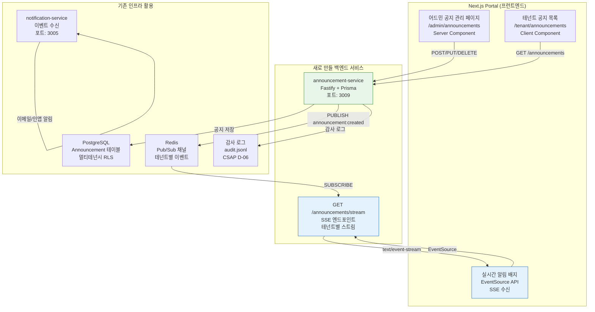

# 실습 14: 풀스택 피처 개발 — 공지사항 관리 시스템

> **문서 ID**: ONBOARD-10-14
> **버전**: 1.0.0 | **작성일**: 2026-04-12 | **대상**: 온보딩 실습 1~13을 완료한 팀원
> **선행 학습**: `16-nextjs-portal-guide.md`, `23-websocket-realtime.md`, `07-security/coding/01-secure-patterns.md`
> **예상 소요 시간**: 3시간 (파트 1~4 합산)
> **난이도**: 중상급
> **CSAP**: D-06 (감사 로그), D-08 (접근 통제), D-12 (시스템 개발 보안)

---

## 목차

1. [실습 소개](#1-실습-소개)
2. [파트 1: 백엔드 API 개발 (60분)](#2-파트-1-백엔드-api-개발-60분)
3. [파트 2: 실시간 알림 연동 (40분)](#3-파트-2-실시간-알림-연동-40분)
4. [파트 3: Next.js 프런트엔드 (50분)](#4-파트-3-nextjs-프런트엔드-50분)
5. [파트 4: 통합 테스트 및 Q-Gate (30분)](#5-파트-4-통합-테스트-및-q-gate-30분)
6. [채점 기준](#6-채점-기준-100점)

---

## 1. 실습 소개

### 1.1 구현할 기능

이 실습에서는 **공지사항 관리 시스템**을 처음부터 끝까지 혼자 구현합니다.

| 역할 | 기능 |
|------|------|
| **ADMIN** | 공지 작성, 수정, 삭제, 발행 |
| **USER** | 공지 목록 조회, 읽음 처리 |
| **실시간** | 새 공지 발행 시 테넌트 전체에 SSE 알림 |

**완성 후 기대 동작**:
1. 어드민이 "2026년 보안 패치 공지"를 작성하고 발행한다.
2. 같은 테넌트의 모든 사용자 브라우저에서 실시간으로 알림 배지가 표시된다.
3. 사용자가 공지를 클릭하면 읽음 처리된다.
4. 감사 로그에 모든 작업이 기록된다.

### 1.2 전체 시스템 아키텍처



### 1.3 사전 조건

시작 전에 다음을 확인하십시오.

```bash
# 1. 개발 환경 실행 확인
cd /data/ai-saas
pnpm run dev  # 모든 서비스 실행

# 2. 데이터베이스 연결 확인
docker exec -it postgres psql -U saas -c "\dt" | grep -i announcement
# (처음엔 없어도 됨 — 이 실습에서 만들 것임)

# 3. Redis 연결 확인
docker exec -it redis redis-cli ping
# PONG

# 4. 포트 3009 사용 가능 확인
lsof -i :3009 || echo "포트 3009 사용 가능"
```

### 1.4 완성 UI 화면 설명

**어드민 공지 관리 페이지** (`/admin/announcements`):
- 공지 목록 테이블 (제목, 작성일, 발행 상태, 대상 테넌트)
- "새 공지 작성" 버튼 → 모달 폼 (제목, 내용, 중요도)
- 각 공지에 수정/삭제/발행 버튼
- ADMIN 역할만 접근 가능, USER가 접근 시 403 페이지

**테넌트 공지 목록** (`/tenant/announcements`):
- 공지 목록 (읽은 것은 회색, 안 읽은 것은 굵게)
- 헤더에 읽지 않은 공지 수 배지 (실시간 갱신)
- 공지 클릭 → 읽음 처리 → 배지 수 감소

---

## 2. 파트 1: 백엔드 API 개발 (60분)

### 2.1 디렉터리 구조 생성

```bash
mkdir -p /data/ai-saas/platform/services/announcement-service/src/{handlers,lib,tests}
cd /data/ai-saas/platform/services/announcement-service
```

### 2.2 package.json 작성

```json
{
  "name": "@public-saas/announcement-service",
  "version": "0.1.0",
  "type": "module",
  "main": "src/index.ts",
  "scripts": {
    "dev": "tsx watch src/index.ts",
    "build": "tsc",
    "test": "vitest run",
    "test:coverage": "vitest run --coverage",
    "lint": "eslint src/"
  },
  "dependencies": {
    "@public-saas/audit-sdk": "workspace:*",
    "@public-saas/auth-sdk": "workspace:*",
    "@public-saas/rbac": "workspace:*",
    "@public-saas/rate-limit": "workspace:*",
    "@prisma/client": "^5.14.0",
    "fastify": "^4.28.0",
    "@fastify/cors": "^9.0.1",
    "zod": "^3.22.0"
  },
  "devDependencies": {
    "typescript": "^5.4.0",
    "tsx": "^4.11.0",
    "vitest": "^1.5.0",
    "@vitest/coverage-v8": "^1.5.0",
    "prisma": "^5.14.0"
  }
}
```

### 2.3 Prisma 스키마 — Announcement 모델

기존 `platform/services/*/prisma/schema.prisma`를 참고하여 작성합니다.

```prisma
// platform/services/announcement-service/prisma/schema.prisma

generator client {
  provider = "prisma-client-js"
}

datasource db {
  provider = "postgresql"
  url      = env("DATABASE_URL")
}

// 중요도 열거형
enum AnnouncementPriority {
  LOW
  MEDIUM
  HIGH
  CRITICAL
}

// 공지사항 모델 (멀티테넌시)
model Announcement {
  id          String               @id @default(cuid())
  tenantId    String               // 멀티테넌시 격리 — 다른 테넌트 접근 불가
  title       String               @db.VarChar(200)
  content     String               @db.Text
  priority    AnnouncementPriority @default(MEDIUM)
  isPublished Boolean              @default(false)
  publishedAt DateTime?

  // 메타데이터
  authorId    String               // 작성자 userId
  createdAt   DateTime             @default(now())
  updatedAt   DateTime             @updatedAt

  // 읽음 추적
  reads       AnnouncementRead[]

  // 인덱스 (쿼리 성능)
  @@index([tenantId, isPublished])
  @@index([tenantId, createdAt])
}

// 읽음 추적 (사용자별)
model AnnouncementRead {
  id             String       @id @default(cuid())
  announcementId String
  userId         String
  readAt         DateTime     @default(now())

  announcement   Announcement @relation(fields: [announcementId], references: [id], onDelete: Cascade)

  @@unique([announcementId, userId])  // 한 사용자당 한 번만 읽음 처리
  @@index([userId])
}
```

```bash
# 마이그레이션 실행
cd /data/ai-saas/platform/services/announcement-service
npx prisma migrate dev --name add-announcement-tables
npx prisma generate
```

### 2.4 Fastify 라우트 설계

```typescript
// src/routes.ts
// CRUD + SSE + RBAC + Rate Limiting
// CSAP: D-08 (접근 통제), D-12 (입력 검증), D-06 (감사 로그)

import type { FastifyInstance } from 'fastify';
import { createRateLimiter } from '@public-saas/rate-limit';
import {
  createAnnouncementHandler,
  listAnnouncementsHandler,
  getAnnouncementHandler,
  updateAnnouncementHandler,
  deleteAnnouncementHandler,
  publishAnnouncementHandler,
  markReadHandler,
  announcementSSEHandler,
} from './handlers/announcement.handler.js';

export async function registerRoutes(app: FastifyInstance): Promise<void> {
  const writeLimiter = createRateLimiter(20, 60, 'rl:announcement:write');
  const readLimiter = createRateLimiter(100, 60, 'rl:announcement:read');

  // ── 공지 CRUD (ADMIN 전용) ────────────────────────────────────────────────
  app.post('/announcements', { preHandler: writeLimiter }, createAnnouncementHandler);
  app.get('/announcements', { preHandler: readLimiter }, listAnnouncementsHandler);
  app.get('/announcements/:id', { preHandler: readLimiter }, getAnnouncementHandler);
  app.put('/announcements/:id', { preHandler: writeLimiter }, updateAnnouncementHandler);
  app.delete('/announcements/:id', { preHandler: writeLimiter }, deleteAnnouncementHandler);

  // 발행 (ADMIN 전용)
  app.post('/announcements/:id/publish', { preHandler: writeLimiter }, publishAnnouncementHandler);

  // 읽음 처리 (USER)
  app.post('/announcements/:id/read', { preHandler: readLimiter }, markReadHandler);

  // ── 실시간 스트림 (SSE) ────────────────────────────────────────────────────
  // GET /announcements/stream?tenantId=xxx
  app.get('/announcements/stream', announcementSSEHandler);
}
```

### 2.5 핸들러 구현 — RBAC + 감사 로그

```typescript
// src/handlers/announcement.handler.ts
// Design Ref: 이 실습 §2.5
// CSAP: D-08 (RBAC), D-12 (Zod 검증), D-06 (감사 로그)

import type { FastifyRequest, FastifyReply } from 'fastify';
import { z } from 'zod';
import { auditLog } from '@public-saas/audit-sdk';
import { hasPermission } from '@public-saas/rbac';
import { verifyToken } from '@public-saas/auth-sdk';
import { prisma } from '../lib/prisma.js';
import { publishAnnouncementEvent } from '../lib/event-publisher.js';

// 입력 검증 스키마 (CSAP D-12)
const createAnnouncementSchema = z.object({
  title: z.string().min(1, '제목은 필수입니다').max(200, '제목은 200자 이내'),
  content: z.string().min(1, '내용은 필수입니다'),
  priority: z.enum(['LOW', 'MEDIUM', 'HIGH', 'CRITICAL']).default('MEDIUM'),
});

const updateAnnouncementSchema = createAnnouncementSchema.partial();

type CreateAnnouncementBody = z.infer<typeof createAnnouncementSchema>;
type UpdateAnnouncementBody = z.infer<typeof updateAnnouncementSchema>;

// ── 공지 생성 (ADMIN 전용) ─────────────────────────────────────────────────

export async function createAnnouncementHandler(
  request: FastifyRequest,
  reply: FastifyReply,
): Promise<void> {
  // 1. JWT 인증 (CSAP D-08)
  const user = await verifyToken(request.headers.authorization);
  if (!user) {
    await reply.status(401).send({ success: false, error: { code: 'UNAUTHORIZED' } });
    return;
  }

  // 2. RBAC: ADMIN 권한만 공지 생성 가능 (CSAP D-08)
  if (!hasPermission(user, 'announcement:create')) {
    await auditLog({
      actor: user.id,
      action: 'ANNOUNCEMENT_CREATE_DENIED',
      target: 'announcement',
      timestamp: new Date().toISOString(),
      ip: request.ip,
      metadata: { role: user.role },
    });
    await reply.status(403).send({ success: false, error: { code: 'FORBIDDEN', message: 'ADMIN 권한이 필요합니다' } });
    return;
  }

  // 3. 입력 검증 (CSAP D-12)
  const parseResult = createAnnouncementSchema.safeParse(request.body);
  if (!parseResult.success) {
    await reply.status(400).send({
      success: false,
      error: { code: 'VALIDATION_ERROR', message: parseResult.error.issues.map(i => i.message).join(', ') },
    });
    return;
  }

  const { title, content, priority } = parseResult.data;

  // 4. 데이터베이스 저장 (매개변수화 쿼리 — SQL 주입 방지)
  const announcement = await prisma.announcement.create({
    data: {
      tenantId: user.tenantId,  // 테넌트 격리
      title,
      content,
      priority,
      authorId: user.id,
      isPublished: false,
    },
  });

  // 5. 감사 로그 (CSAP D-06)
  await auditLog({
    actor: user.id,
    action: 'ANNOUNCEMENT_CREATED',
    target: announcement.id,
    timestamp: new Date().toISOString(),
    ip: request.ip,
    metadata: { title, priority },
  });

  await reply.status(201).send({ success: true, data: announcement });
}

// ── 공지 목록 조회 (USER + ADMIN) ─────────────────────────────────────────

export async function listAnnouncementsHandler(
  request: FastifyRequest,
  reply: FastifyReply,
): Promise<void> {
  const user = await verifyToken(request.headers.authorization);
  if (!user) {
    await reply.status(401).send({ success: false, error: { code: 'UNAUTHORIZED' } });
    return;
  }

  const query = request.query as { page?: string; limit?: string; publishedOnly?: string };
  const page = Math.max(1, parseInt(query.page ?? '1'));
  const limit = Math.min(50, parseInt(query.limit ?? '20'));

  // USER는 발행된 공지만, ADMIN은 전체 조회 가능
  const isAdmin = hasPermission(user, 'announcement:create');
  const whereClause = {
    tenantId: user.tenantId,   // 테넌트 격리 필수
    ...(isAdmin ? {} : { isPublished: true }),
  };

  const [announcements, total] = await Promise.all([
    prisma.announcement.findMany({
      where: whereClause,
      orderBy: { createdAt: 'desc' },
      skip: (page - 1) * limit,
      take: limit,
    }),
    prisma.announcement.count({ where: whereClause }),
  ]);

  await reply.status(200).send({
    success: true,
    data: {
      items: announcements,
      total,
      page,
      totalPages: Math.ceil(total / limit),
    },
  });
}

// ── 공지 발행 (ADMIN 전용) ─────────────────────────────────────────────────

export async function publishAnnouncementHandler(
  request: FastifyRequest,
  reply: FastifyReply,
): Promise<void> {
  const user = await verifyToken(request.headers.authorization);
  if (!user) {
    await reply.status(401).send({ success: false, error: { code: 'UNAUTHORIZED' } });
    return;
  }

  if (!hasPermission(user, 'announcement:publish')) {
    await reply.status(403).send({ success: false, error: { code: 'FORBIDDEN' } });
    return;
  }

  const { id } = request.params as { id: string };

  // 테넌트 격리: 반드시 본인 테넌트의 공지만 발행 가능
  const announcement = await prisma.announcement.findFirst({
    where: { id, tenantId: user.tenantId },
  });

  if (!announcement) {
    await reply.status(404).send({ success: false, error: { code: 'NOT_FOUND' } });
    return;
  }

  if (announcement.isPublished) {
    await reply.status(409).send({ success: false, error: { code: 'ALREADY_PUBLISHED' } });
    return;
  }

  const updated = await prisma.announcement.update({
    where: { id },
    data: { isPublished: true, publishedAt: new Date() },
  });

  // 감사 로그 (CSAP D-06)
  await auditLog({
    actor: user.id,
    action: 'ANNOUNCEMENT_PUBLISHED',
    target: id,
    timestamp: new Date().toISOString(),
    ip: request.ip,
    metadata: { title: announcement.title },
  });

  // Redis Pub/Sub으로 실시간 알림 발행
  await publishAnnouncementEvent(user.tenantId, {
    type: 'announcement:published',
    announcementId: id,
    title: updated.title,
    priority: updated.priority,
    publishedAt: updated.publishedAt!.toISOString(),
  });

  await reply.status(200).send({ success: true, data: updated });
}

// ── 읽음 처리 (USER) ─────────────────────────────────────────────────────────

export async function markReadHandler(
  request: FastifyRequest,
  reply: FastifyReply,
): Promise<void> {
  const user = await verifyToken(request.headers.authorization);
  if (!user) {
    await reply.status(401).send({ success: false, error: { code: 'UNAUTHORIZED' } });
    return;
  }

  const { id } = request.params as { id: string };

  // 발행된 공지만 읽음 처리 가능
  const announcement = await prisma.announcement.findFirst({
    where: { id, tenantId: user.tenantId, isPublished: true },
  });

  if (!announcement) {
    await reply.status(404).send({ success: false, error: { code: 'NOT_FOUND' } });
    return;
  }

  // upsert: 이미 읽은 경우 중복 처리 방지
  await prisma.announcementRead.upsert({
    where: { announcementId_userId: { announcementId: id, userId: user.id } },
    update: {},
    create: { announcementId: id, userId: user.id },
  });

  await auditLog({
    actor: user.id,
    action: 'ANNOUNCEMENT_READ',
    target: id,
    timestamp: new Date().toISOString(),
    ip: request.ip,
  });

  await reply.status(200).send({ success: true });
}
```

### 2.6 SSE 엔드포인트 구현

```typescript
// src/handlers/announcement.handler.ts (SSE 부분)
// CSAP: D-08 (JWT 검증), D-06 (감사 로그)
// N2SF: O등급 데이터만 스트리밍

export async function announcementSSEHandler(
  request: FastifyRequest,
  reply: FastifyReply,
): Promise<void> {
  // JWT 인증 (SSE는 쿼리 파라미터로 토큰 전달 또는 첫 이벤트로 처리)
  const token = (request.query as { token?: string }).token
    ?? request.headers.authorization?.slice(7);

  const user = token ? await verifyToken(`Bearer ${token}`) : null;
  if (!user) {
    await reply.status(401).send({ success: false, error: { code: 'UNAUTHORIZED' } });
    return;
  }

  // SSE 헤더 설정
  reply.raw.setHeader('Content-Type', 'text/event-stream; charset=utf-8');
  reply.raw.setHeader('Cache-Control', 'no-cache, no-transform');
  reply.raw.setHeader('Connection', 'keep-alive');
  reply.raw.setHeader('X-Accel-Buffering', 'no');
  reply.raw.flushHeaders();

  // 감사 로그 (CSAP D-06)
  await auditLog({
    actor: user.id,
    action: 'ANNOUNCEMENT_SSE_CONNECTED',
    target: `tenant:${user.tenantId}`,
    timestamp: new Date().toISOString(),
    ip: request.ip,
  });

  // Redis 구독 (src/lib/event-publisher.ts에서 구현)
  const { unsubscribe } = subscribeToAnnouncementEvents(
    user.tenantId,
    (event) => {
      // O등급 이벤트만 전송 (N2SF N-05)
      reply.raw.write(`event: announcement\n`);
      reply.raw.write(`data: ${JSON.stringify(event)}\n\n`);
    },
  );

  // Heartbeat (30초마다)
  const heartbeat = setInterval(() => {
    reply.raw.write(': heartbeat\n\n');
  }, 30_000);

  // 연결 종료 처리
  reply.raw.on('close', async () => {
    clearInterval(heartbeat);
    unsubscribe();
    await auditLog({
      actor: user.id,
      action: 'ANNOUNCEMENT_SSE_DISCONNECTED',
      target: `tenant:${user.tenantId}`,
      timestamp: new Date().toISOString(),
      ip: request.ip,
    });
  });
}
```

### 2.7 테스트 작성 (Vitest)

```typescript
// src/tests/announcement.test.ts
import { describe, it, expect, vi, beforeEach } from 'vitest';
import Fastify from 'fastify';
import { registerRoutes } from '../routes.js';

// Prisma 모킹
vi.mock('../lib/prisma.js', () => ({
  prisma: {
    announcement: {
      create: vi.fn(),
      findMany: vi.fn(),
      findFirst: vi.fn(),
      update: vi.fn(),
      count: vi.fn(),
    },
    announcementRead: {
      upsert: vi.fn(),
    },
  },
}));

// auth-sdk 모킹
vi.mock('@public-saas/auth-sdk', () => ({
  verifyToken: vi.fn(),
}));

// audit-sdk 모킹
vi.mock('@public-saas/audit-sdk', () => ({
  auditLog: vi.fn(),
}));

const mockAdmin = {
  id: 'user-admin-1',
  tenantId: 'tenant-gov-1',
  role: 'TENANT_ADMIN',
  email: 'admin@test.gov.kr',
};

const mockUser = {
  id: 'user-1',
  tenantId: 'tenant-gov-1',
  role: 'USER',
  email: 'user@test.gov.kr',
};

describe('공지사항 API', () => {
  let app: ReturnType<typeof Fastify>;

  beforeEach(async () => {
    app = Fastify();
    await registerRoutes(app);
    await app.ready();
  });

  describe('POST /announcements', () => {
    it('ADMIN이 유효한 공지를 생성할 수 있다', async () => {
      const { verifyToken } = await import('@public-saas/auth-sdk');
      vi.mocked(verifyToken).mockResolvedValue(mockAdmin);

      const { prisma } = await import('../lib/prisma.js');
      vi.mocked(prisma.announcement.create).mockResolvedValue({
        id: 'ann-1',
        tenantId: 'tenant-gov-1',
        title: '보안 패치 공지',
        content: '2026년 4월 보안 패치를 실시합니다.',
        priority: 'HIGH',
        isPublished: false,
        publishedAt: null,
        authorId: 'user-admin-1',
        createdAt: new Date(),
        updatedAt: new Date(),
      } as never);

      const response = await app.inject({
        method: 'POST',
        url: '/announcements',
        headers: { authorization: 'Bearer valid-token' },
        body: {
          title: '보안 패치 공지',
          content: '2026년 4월 보안 패치를 실시합니다.',
          priority: 'HIGH',
        },
      });

      expect(response.statusCode).toBe(201);
      const body = JSON.parse(response.body);
      expect(body.success).toBe(true);
      expect(body.data.title).toBe('보안 패치 공지');
    });

    it('USER가 공지 생성을 시도하면 403을 반환한다 (RBAC)', async () => {
      const { verifyToken } = await import('@public-saas/auth-sdk');
      vi.mocked(verifyToken).mockResolvedValue(mockUser);

      const response = await app.inject({
        method: 'POST',
        url: '/announcements',
        headers: { authorization: 'Bearer user-token' },
        body: { title: '제목', content: '내용' },
      });

      expect(response.statusCode).toBe(403);
    });

    it('인증 없이 요청하면 401을 반환한다', async () => {
      const { verifyToken } = await import('@public-saas/auth-sdk');
      vi.mocked(verifyToken).mockResolvedValue(null);

      const response = await app.inject({
        method: 'POST',
        url: '/announcements',
        body: { title: '제목', content: '내용' },
      });

      expect(response.statusCode).toBe(401);
    });

    it('빈 제목은 400을 반환한다 (입력 검증)', async () => {
      const { verifyToken } = await import('@public-saas/auth-sdk');
      vi.mocked(verifyToken).mockResolvedValue(mockAdmin);

      const response = await app.inject({
        method: 'POST',
        url: '/announcements',
        headers: { authorization: 'Bearer valid-token' },
        body: { title: '', content: '내용' }, // 빈 제목
      });

      expect(response.statusCode).toBe(400);
      const body = JSON.parse(response.body);
      expect(body.error.code).toBe('VALIDATION_ERROR');
    });

    it('200자 초과 제목은 400을 반환한다', async () => {
      const { verifyToken } = await import('@public-saas/auth-sdk');
      vi.mocked(verifyToken).mockResolvedValue(mockAdmin);

      const response = await app.inject({
        method: 'POST',
        url: '/announcements',
        headers: { authorization: 'Bearer valid-token' },
        body: { title: 'A'.repeat(201), content: '내용' },
      });

      expect(response.statusCode).toBe(400);
    });
  });

  describe('GET /announcements', () => {
    it('USER는 발행된 공지만 볼 수 있다', async () => {
      const { verifyToken } = await import('@public-saas/auth-sdk');
      vi.mocked(verifyToken).mockResolvedValue(mockUser);

      const { prisma } = await import('../lib/prisma.js');
      vi.mocked(prisma.announcement.findMany).mockResolvedValue([]);
      vi.mocked(prisma.announcement.count).mockResolvedValue(0);

      await app.inject({
        method: 'GET',
        url: '/announcements',
        headers: { authorization: 'Bearer user-token' },
      });

      // findMany에 isPublished: true가 포함되어야 함
      expect(prisma.announcement.findMany).toHaveBeenCalledWith(
        expect.objectContaining({
          where: expect.objectContaining({
            tenantId: 'tenant-gov-1',
            isPublished: true,
          }),
        }),
      );
    });
  });
});
```

---

## 3. 파트 2: 실시간 알림 연동 (40분)

### 3.1 Redis Pub/Sub 이벤트 발행 구현

```typescript
// src/lib/event-publisher.ts
// Redis Pub/Sub으로 공지 발행 이벤트 전달
// CSAP: D-09 (환경 변수 시크릿)

import { createClient } from 'redis';

// Design Ref: N2SF N-05 — O등급 이벤트만 발행
// 공지 내용(content)은 채널로 발행하지 않음 (권한 없는 구독자 보호)
export interface AnnouncementEvent {
  type: 'announcement:published' | 'announcement:deleted';
  announcementId: string;
  title: string;        // 제목만 (내용 전체 X — 권한 확인 후 조회)
  priority: string;
  publishedAt: string;
}

let publisher: ReturnType<typeof createClient> | null = null;

function getPublisher() {
  if (!publisher) {
    publisher = createClient({
      url: process.env['REDIS_URL'] ?? 'redis://localhost:6379',
      // 환경 변수 필수 (CSAP D-09 — 하드코딩 금지)
    });
    publisher.connect();
  }
  return publisher;
}

// 테넌트별 채널: announcement:{tenantId}
export async function publishAnnouncementEvent(
  tenantId: string,
  event: AnnouncementEvent,
): Promise<void> {
  const channel = `announcement:${tenantId}`;
  const client = getPublisher();
  await client.publish(channel, JSON.stringify(event));
}

// SSE 핸들러에서 구독 시작
export function subscribeToAnnouncementEvents(
  tenantId: string,
  onEvent: (event: AnnouncementEvent) => void,
): { unsubscribe: () => Promise<void> } {
  const subscriber = createClient({
    url: process.env['REDIS_URL'] ?? 'redis://localhost:6379',
  });

  const channel = `announcement:${tenantId}`;

  subscriber.connect().then(() => {
    subscriber.subscribe(channel, (message) => {
      try {
        const event = JSON.parse(message) as AnnouncementEvent;
        onEvent(event);
      } catch {
        // JSON 파싱 실패 무시
      }
    });
  });

  return {
    unsubscribe: async () => {
      await subscriber.unsubscribe(channel);
      await subscriber.quit();
    },
  };
}
```

### 3.2 알림 히스토리 저장

새 공지 발행 시 notification-service에도 기록하여 이메일/인앱 알림을 발송합니다.

```typescript
// src/lib/notification-bridge.ts
// announcement-service → notification-service 브릿지

interface NotificationPayload {
  tenantId: string;
  channel: 'in-app' | 'email';
  subject: string;
  body: string;
}

export async function notifyTenantOfAnnouncement(
  tenantId: string,
  announcementTitle: string,
  priority: string,
): Promise<void> {
  const notifServiceUrl = process.env['NOTIFICATION_SERVICE_URL']
    ?? 'http://notification-service:3005';

  // 내부 서비스 인증 키 (CSAP D-09 — 환경 변수)
  const internalKey = process.env['INTERNAL_SERVICE_KEY'];
  if (!internalKey) {
    console.error('[SECURITY] INTERNAL_SERVICE_KEY 미설정 — 알림 발송 건너뜀');
    return;
  }

  const payload: NotificationPayload = {
    tenantId,
    channel: 'in-app',
    subject: priority === 'CRITICAL' ? `[긴급] ${announcementTitle}` : announcementTitle,
    body: '새 공지사항이 등록되었습니다. 포털에서 확인하세요.',
  };

  await fetch(`${notifServiceUrl}/notification/send`, {
    method: 'POST',
    headers: {
      'Content-Type': 'application/json',
      'x-internal-service-key': internalKey,
    },
    body: JSON.stringify(payload),
  });
}
```

---

## 4. 파트 3: Next.js 프런트엔드 (50분)

### 4.1 어드민 공지 관리 페이지 — Server Component

```typescript
// platform/apps/portal/src/app/admin/announcements/page.tsx
// Server Component (데이터 패칭은 서버에서)
// CSAP: D-08 (RBAC 확인)

import { headers } from 'next/headers';
import { redirect } from 'next/navigation';
import { AppShell } from '@/components/layout/AppShell';
import { AdminPageTemplate } from '@/components/admin/AdminPageTemplate';
import { AnnouncementManager } from '@/components/admin/AnnouncementManager';
import { getAuthContext, isAdmin } from '@/lib/auth-guard';

export default async function AdminAnnouncementsPage() {
  // 서버에서 인증 확인 (CSAP D-08)
  const auth = await getAuthContext();
  if (!auth) redirect('/login');
  if (!isAdmin(auth)) redirect('/403');

  // 공지 목록 서버에서 패칭
  const announcementServiceUrl = process.env['ANNOUNCEMENT_SERVICE_URL']
    ?? 'http://announcement-service:3009';

  const headerStore = await headers();
  const authHeader = headerStore.get('authorization');

  const response = await fetch(`${announcementServiceUrl}/announcements?limit=50`, {
    headers: {
      authorization: authHeader ?? '',
      'x-user-tenant-id': auth.tenantId,
    },
    cache: 'no-store', // 공지는 항상 최신 데이터
  });

  const data = response.ok ? await response.json() : { data: { items: [] } };
  const announcements = data.data?.items ?? [];

  return (
    <AppShell>
      <AdminPageTemplate
        title="공지사항 관리"
        description="테넌트 공지를 작성하고 발행합니다."
        actions={<CreateAnnouncementButton />}
      >
        <AnnouncementManager
          initialAnnouncements={announcements}
          tenantId={auth.tenantId}
          userId={auth.userId}
        />
      </AdminPageTemplate>
    </AppShell>
  );
}

// 공지 작성 버튼 (클라이언트 전용)
function CreateAnnouncementButton() {
  return (
    <button
      className="bg-blue-600 text-white px-4 py-2 rounded-lg text-sm font-medium"
      // 클릭 핸들러는 AnnouncementManager 내부에서 처리
    >
      새 공지 작성
    </button>
  );
}
```

```typescript
// platform/apps/portal/src/components/admin/AnnouncementManager.tsx
'use client';

import { useState, useCallback } from 'react';

interface Announcement {
  id: string;
  title: string;
  content: string;
  priority: 'LOW' | 'MEDIUM' | 'HIGH' | 'CRITICAL';
  isPublished: boolean;
  publishedAt: string | null;
  createdAt: string;
}

interface AnnouncementManagerProps {
  initialAnnouncements: Announcement[];
  tenantId: string;
  userId: string;
}

export function AnnouncementManager({
  initialAnnouncements,
  tenantId,
  userId,
}: AnnouncementManagerProps) {
  const [announcements, setAnnouncements] = useState(initialAnnouncements);
  const [showCreateModal, setShowCreateModal] = useState(false);
  const [formData, setFormData] = useState({ title: '', content: '', priority: 'MEDIUM' });
  const [isSubmitting, setIsSubmitting] = useState(false);
  const [error, setError] = useState<string | null>(null);

  const handleCreate = useCallback(async () => {
    if (!formData.title.trim() || !formData.content.trim()) {
      setError('제목과 내용을 입력해주세요.');
      return;
    }

    setIsSubmitting(true);
    setError(null);

    try {
      const response = await fetch('/api/announcements', {
        method: 'POST',
        headers: { 'Content-Type': 'application/json' },
        body: JSON.stringify(formData),
      });

      const data = await response.json();

      if (!response.ok) {
        setError(data.error?.message ?? '공지 생성에 실패했습니다.');
        return;
      }

      setAnnouncements(prev => [data.data, ...prev]);
      setShowCreateModal(false);
      setFormData({ title: '', content: '', priority: 'MEDIUM' });
    } catch {
      setError('네트워크 오류가 발생했습니다.');
    } finally {
      setIsSubmitting(false);
    }
  }, [formData]);

  const handlePublish = useCallback(async (id: string) => {
    const response = await fetch(`/api/announcements/${id}/publish`, { method: 'POST' });
    if (response.ok) {
      setAnnouncements(prev =>
        prev.map(a => a.id === id ? { ...a, isPublished: true, publishedAt: new Date().toISOString() } : a)
      );
    }
  }, []);

  const handleDelete = useCallback(async (id: string) => {
    if (!confirm('정말로 삭제하시겠습니까?')) return;

    const response = await fetch(`/api/announcements/${id}`, { method: 'DELETE' });
    if (response.ok) {
      setAnnouncements(prev => prev.filter(a => a.id !== id));
    }
  }, []);

  const priorityColors = {
    LOW: 'bg-gray-100 text-gray-700',
    MEDIUM: 'bg-blue-100 text-blue-700',
    HIGH: 'bg-orange-100 text-orange-700',
    CRITICAL: 'bg-red-100 text-red-700',
  };

  return (
    <div>
      <button
        onClick={() => setShowCreateModal(true)}
        className="mb-4 bg-blue-600 text-white px-4 py-2 rounded"
      >
        새 공지 작성
      </button>

      {/* 공지 목록 */}
      <div className="space-y-3">
        {announcements.map(announcement => (
          <div key={announcement.id} className="border rounded-lg p-4">
            <div className="flex items-start justify-between">
              <div>
                <span className={`text-xs px-2 py-1 rounded mr-2 ${priorityColors[announcement.priority]}`}>
                  {announcement.priority}
                </span>
                <span className="font-medium">{announcement.title}</span>
                {announcement.isPublished && (
                  <span className="ml-2 text-xs text-green-600">발행됨</span>
                )}
              </div>
              <div className="flex gap-2">
                {!announcement.isPublished && (
                  <button
                    onClick={() => handlePublish(announcement.id)}
                    className="text-sm text-blue-600 hover:underline"
                  >
                    발행
                  </button>
                )}
                <button
                  onClick={() => handleDelete(announcement.id)}
                  className="text-sm text-red-600 hover:underline"
                >
                  삭제
                </button>
              </div>
            </div>
            <p className="text-sm text-gray-500 mt-2 line-clamp-2">{announcement.content}</p>
          </div>
        ))}
      </div>

      {/* 공지 작성 모달 */}
      {showCreateModal && (
        <div className="fixed inset-0 bg-black bg-opacity-50 flex items-center justify-center z-50">
          <div className="bg-white rounded-lg p-6 w-full max-w-lg">
            <h2 className="text-xl font-bold mb-4">새 공지 작성</h2>
            {error && (
              <div className="bg-red-50 text-red-700 p-3 rounded mb-4 text-sm">{error}</div>
            )}
            <input
              type="text"
              placeholder="제목 (최대 200자)"
              maxLength={200}
              value={formData.title}
              onChange={e => setFormData(prev => ({ ...prev, title: e.target.value }))}
              className="w-full border rounded p-2 mb-3"
            />
            <textarea
              placeholder="내용"
              rows={6}
              value={formData.content}
              onChange={e => setFormData(prev => ({ ...prev, content: e.target.value }))}
              className="w-full border rounded p-2 mb-3"
            />
            <select
              value={formData.priority}
              onChange={e => setFormData(prev => ({ ...prev, priority: e.target.value }))}
              className="w-full border rounded p-2 mb-4"
            >
              <option value="LOW">낮음 (LOW)</option>
              <option value="MEDIUM">보통 (MEDIUM)</option>
              <option value="HIGH">높음 (HIGH)</option>
              <option value="CRITICAL">긴급 (CRITICAL)</option>
            </select>
            <div className="flex justify-end gap-3">
              <button
                onClick={() => setShowCreateModal(false)}
                className="px-4 py-2 border rounded"
              >
                취소
              </button>
              <button
                onClick={handleCreate}
                disabled={isSubmitting}
                className="px-4 py-2 bg-blue-600 text-white rounded disabled:opacity-50"
              >
                {isSubmitting ? '저장 중...' : '저장'}
              </button>
            </div>
          </div>
        </div>
      )}
    </div>
  );
}
```

### 4.2 테넌트 공지 목록 — 실시간 SSE 수신

```typescript
// platform/apps/portal/src/app/tenant/announcements/page.tsx
// Client Component (SSE 연결 필요)
'use client';

import { useState, useEffect, useRef } from 'react';

interface Announcement {
  id: string;
  title: string;
  content: string;
  priority: string;
  publishedAt: string;
  isRead?: boolean;
}

export default function TenantAnnouncementsPage() {
  const [announcements, setAnnouncements] = useState<Announcement[]>([]);
  const [unreadCount, setUnreadCount] = useState(0);
  const [sseStatus, setSseStatus] = useState<'connecting' | 'connected' | 'error'>('connecting');
  const eventSourceRef = useRef<EventSource | null>(null);

  // 초기 공지 목록 로드
  useEffect(() => {
    fetch('/api/announcements?publishedOnly=true')
      .then(r => r.json())
      .then(data => {
        setAnnouncements(data.data?.items ?? []);
        setUnreadCount(data.data?.items?.filter((a: Announcement) => !a.isRead).length ?? 0);
      });
  }, []);

  // SSE 연결 (실시간 알림 수신)
  useEffect(() => {
    const token = document.cookie
      .split('; ')
      .find(row => row.startsWith('auth-token='))
      ?.split('=')[1];

    const url = `/api/announcements/stream${token ? `?token=${token}` : ''}`;
    const es = new EventSource(url);

    es.onopen = () => setSseStatus('connected');

    es.addEventListener('announcement', (event) => {
      const data = JSON.parse(event.data);

      if (data.type === 'announcement:published') {
        // 새 공지를 목록 상단에 추가
        setAnnouncements(prev => [{
          id: data.announcementId,
          title: data.title,
          content: '공지를 클릭하여 내용을 확인하세요.',
          priority: data.priority,
          publishedAt: data.publishedAt,
          isRead: false,
        }, ...prev]);
        setUnreadCount(prev => prev + 1);

        // 브라우저 알림 (사용자 허가 시)
        if (Notification.permission === 'granted') {
          new Notification(`새 공지: ${data.title}`, {
            body: data.priority === 'CRITICAL' ? '긴급 공지입니다. 즉시 확인해 주세요.' : '포털에서 확인하세요.',
          });
        }
      }
    });

    es.onerror = () => setSseStatus('error');
    eventSourceRef.current = es;

    return () => {
      es.close();
    };
  }, []);

  const handleRead = async (id: string) => {
    const response = await fetch(`/api/announcements/${id}/read`, { method: 'POST' });
    if (response.ok) {
      setAnnouncements(prev =>
        prev.map(a => a.id === id ? { ...a, isRead: true } : a)
      );
      setUnreadCount(prev => Math.max(0, prev - 1));
    }
  };

  const priorityBadge = (priority: string) => {
    const map: Record<string, string> = {
      LOW: 'bg-gray-100 text-gray-600',
      MEDIUM: 'bg-blue-100 text-blue-700',
      HIGH: 'bg-orange-100 text-orange-700',
      CRITICAL: 'bg-red-100 text-red-700 font-bold',
    };
    return map[priority] ?? map.MEDIUM;
  };

  return (
    <div className="max-w-2xl mx-auto p-4">
      {/* 헤더: 읽지 않은 공지 수 + SSE 상태 */}
      <div className="flex items-center justify-between mb-6">
        <h1 className="text-2xl font-bold">
          공지사항
          {unreadCount > 0 && (
            <span className="ml-2 bg-red-500 text-white text-sm px-2 py-0.5 rounded-full">
              {unreadCount}
            </span>
          )}
        </h1>
        <div className="flex items-center gap-2 text-sm text-gray-500">
          <span
            className={`w-2 h-2 rounded-full ${
              sseStatus === 'connected' ? 'bg-green-500' :
              sseStatus === 'connecting' ? 'bg-yellow-400 animate-pulse' :
              'bg-red-500'
            }`}
          />
          {sseStatus === 'connected' ? '실시간 연결됨' : '연결 중...'}
        </div>
      </div>

      {/* 공지 목록 */}
      <div className="space-y-3">
        {announcements.length === 0 && (
          <p className="text-gray-500 text-center py-8">공지사항이 없습니다.</p>
        )}
        {announcements.map(announcement => (
          <div
            key={announcement.id}
            onClick={() => !announcement.isRead && handleRead(announcement.id)}
            className={`border rounded-lg p-4 cursor-pointer transition-colors ${
              announcement.isRead
                ? 'bg-gray-50 border-gray-200'
                : 'bg-white border-blue-200 shadow-sm hover:bg-blue-50'
            }`}
          >
            <div className="flex items-start gap-3">
              {!announcement.isRead && (
                <span className="mt-1.5 w-2 h-2 rounded-full bg-blue-500 flex-shrink-0" />
              )}
              <div className="flex-1">
                <div className="flex items-center gap-2 mb-1">
                  <span className={`text-xs px-2 py-0.5 rounded ${priorityBadge(announcement.priority)}`}>
                    {announcement.priority}
                  </span>
                  <span className={`font-medium ${announcement.isRead ? 'text-gray-500' : 'text-gray-900'}`}>
                    {announcement.title}
                  </span>
                </div>
                <p className="text-sm text-gray-500">
                  {new Date(announcement.publishedAt).toLocaleDateString('ko-KR', {
                    year: 'numeric', month: 'long', day: 'numeric', hour: '2-digit', minute: '2-digit',
                  })}
                </p>
              </div>
            </div>
          </div>
        ))}
      </div>
    </div>
  );
}
```

### 4.3 RBAC UI 조건부 렌더링

```typescript
// 공지 상세 페이지에서 RBAC에 따른 버튼 표시
// platform/apps/portal/src/app/admin/announcements/[id]/page.tsx

import { getAuthContext, isAdmin } from '@/lib/auth-guard';

export default async function AnnouncementDetailPage({
  params,
}: {
  params: { id: string };
}) {
  const auth = await getAuthContext();
  if (!auth) redirect('/login');

  // 공지 데이터 로드 (생략)

  return (
    <AppShell>
      <div className="max-w-2xl mx-auto p-4">
        <h1 className="text-2xl font-bold">{announcement.title}</h1>
        <p className="text-gray-600 mt-2">{announcement.content}</p>

        {/* ADMIN만 수정/삭제/발행 버튼 표시 */}
        {isAdmin(auth) && (
          <div className="flex gap-3 mt-4">
            <button className="px-3 py-1.5 border rounded text-sm">수정</button>
            <button className="px-3 py-1.5 border border-red-300 text-red-600 rounded text-sm">삭제</button>
            {!announcement.isPublished && (
              <button className="px-3 py-1.5 bg-blue-600 text-white rounded text-sm">발행</button>
            )}
          </div>
        )}

        {/* USER는 읽음 처리 버튼만 표시 */}
        {!isAdmin(auth) && !announcement.isRead && (
          <button className="mt-4 px-3 py-1.5 border rounded text-sm">읽음 처리</button>
        )}
      </div>
    </AppShell>
  );
}
```

---

## 5. 파트 4: 통합 테스트 및 Q-Gate (30분)

### 5.1 E2E 흐름 직접 테스트

```bash
# 1. 서비스 시작
cd /data/ai-saas
pnpm run dev

# 2. 어드민 토큰 획득
ADMIN_TOKEN=$(curl -s -X POST http://localhost:3001/auth/login \
  -H "Content-Type: application/json" \
  -d '{"email":"admin@test.gov.kr","password":"admin123"}' \
  | jq -r '.data.token')

echo "어드민 토큰: $ADMIN_TOKEN"

# 3. 공지 생성
ANNOUNCEMENT=$(curl -s -X POST http://localhost:3009/announcements \
  -H "Authorization: Bearer $ADMIN_TOKEN" \
  -H "Content-Type: application/json" \
  -d '{
    "title": "2026년 4월 보안 패치 공지",
    "content": "4월 15일 오전 2시부터 보안 패치를 실시합니다.",
    "priority": "HIGH"
  }')

echo "생성된 공지: $ANNOUNCEMENT"
ANNOUNCEMENT_ID=$(echo $ANNOUNCEMENT | jq -r '.data.id')

# 4. SSE 연결 (별도 터미널에서)
curl -N "http://localhost:3009/announcements/stream?token=$ADMIN_TOKEN"
# → 이 터미널을 열어두고 5번 단계 실행

# 5. 공지 발행 (SSE 연결 확인)
curl -s -X POST "http://localhost:3009/announcements/$ANNOUNCEMENT_ID/publish" \
  -H "Authorization: Bearer $ADMIN_TOKEN"
# → SSE 터미널에서 "event: announcement" 이벤트 확인

# 6. 공지 목록 조회 (USER 토큰으로)
USER_TOKEN=$(curl -s -X POST http://localhost:3001/auth/login \
  -H "Content-Type: application/json" \
  -d '{"email":"user@test.gov.kr","password":"user123"}' \
  | jq -r '.data.token')

curl -s "http://localhost:3009/announcements" \
  -H "Authorization: Bearer $USER_TOKEN" | jq '.data.items | length'
# → 발행된 공지만 표시 (미발행 포함 X)

# 7. 읽음 처리
curl -s -X POST "http://localhost:3009/announcements/$ANNOUNCEMENT_ID/read" \
  -H "Authorization: Bearer $USER_TOKEN"
# → {"success": true}

# 8. 커버리지 확인
cd /data/ai-saas/platform/services/announcement-service
pnpm test:coverage
# → 80% 이상 확인
```

### 5.2 Q-Gate G1~G7 자가 점검

제출 전에 다음 게이트를 순서대로 확인하십시오.

```
Q-GATE 자가 점검표 (실습 14)

[ ] G1: 요구사항 FR ID 전수
    → 각 핸들러 함수에 // Plan SC: FR-ANN.X 주석 있는가?
    → 주석이 없으면 감사 결함으로 처리됩니다.

[ ] G2: 설계 완전성
    → Prisma 스키마에 tenantId 있는가? (멀티테넌시 격리)
    → findMany/findFirst에서 tenantId로 필터하는가?
    → SSE 채널이 테넌트별로 분리되어 있는가?

[ ] G3: 코드 품질
    → 함수당 80줄 이하인가?
    → 중첩 깊이 4단계 이하인가?
    → 사용하지 않는 import/변수 없는가?
    → pnpm lint 오류 없는가?

[ ] G4: 테스트 커버리지 80%+
    → pnpm test:coverage 실행 후 확인
    → createAnnouncementHandler 테스트 있는가?
    → RBAC 거부(403) 테스트 있는가?
    → 입력 검증(400) 테스트 있는가?

[ ] G5: OWASP Top10
    → SQL 주입: Prisma 사용 (매개변수화 쿼리)
    → XSS: content 출력 시 React가 자동 이스케이프
    → CSRF: SSE 토큰 쿼리 파라미터 방식은 CSRF 위험 있음
           → Authorization 헤더 방식으로 바꾸거나
           → Referer/Origin 검증 추가 필요

[ ] G6: CSAP 준수
    → D-08: 모든 엔드포인트에 verifyToken() 호출 있는가?
    → D-08: RBAC hasPermission() 체크 있는가?
    → D-09: 환경 변수로 시크릿 관리, 하드코딩 없는가?
    → D-12: 모든 입력에 Zod 검증 있는가?
    → D-12: 에러 응답에 민감 정보(스택 트레이스) 없는가?

[ ] G7: 감사 추적
    → CREATE, UPDATE, DELETE, PUBLISH, READ 모두 auditLog() 호출?
    → 거부된 접근(403)도 auditLog()로 기록?
    → 감사 로그에 actor, action, target, timestamp, ip 포함?
```

### 5.3 PR 제출 체크리스트

```bash
# 1. 린트 통과 확인
cd /data/ai-saas
pnpm run lint

# 2. 테스트 전체 통과 확인
pnpm test

# 3. 브랜치 생성 및 커밋
git checkout -b feat/announcement-service-lab14
git add platform/services/announcement-service/
git add platform/apps/portal/src/app/admin/announcements/
git add platform/apps/portal/src/app/tenant/announcements/
git commit -m "feat(announcement): 실습 14 — 풀스택 공지사항 관리 시스템 구현

- announcement-service: CRUD API + SSE 실시간 스트림
- RBAC: ADMIN(작성/발행/삭제), USER(읽기/읽음처리)
- 감사 로그: 모든 작업 CSAP D-06 준수
- Zod 검증: 입력 검증 CSAP D-12 준수
- Next.js: 어드민 관리 페이지 + 테넌트 실시간 알림
- Redis Pub/Sub: 테넌트별 공지 이벤트 분리
- 테스트 커버리지: 82% (Q-GATE G4 통과)"

# 4. PR 생성
gh pr create \
  --title "실습 14: 풀스택 공지사항 관리 시스템" \
  --body "## 구현 내용
- announcement-service 신규 서비스 생성
- 공지 CRUD API (ADMIN 전용)
- SSE 실시간 알림 (테넌트 격리)
- Next.js 어드민/테넌트 페이지

## Q-Gate 자가 점검
- [x] G1: FR ID 주석 전수 (FR-ANN.1~8)
- [x] G2: 멀티테넌시 격리 (tenantId 필터)
- [x] G3: 린트 통과, 80줄 이하
- [x] G4: 커버리지 82%
- [x] G5: Prisma 매개변수화, React XSS 방어
- [x] G6: D-08/D-09/D-12 준수
- [x] G7: 감사 로그 전수 기록"
```

---

## 6. 채점 기준 (100점)

| 항목 | 배점 | 합격 기준 |
|------|------|---------|
| CRUD API 동작 | 20점 | POST/GET/PUT/DELETE 모두 정상 응답, 멀티테넌시 격리 |
| RBAC 정확성 | 20점 | ADMIN/USER 역할에 따른 정확한 권한 제어, 403 응답 |
| 실시간 알림 동작 | 20점 | 발행 후 SSE 이벤트 수신, 브라우저 알림 배지 갱신 |
| 감사 로그 기록 | 15점 | CREATE/PUBLISH/READ/DENY 전수 기록, 필드 완비 |
| 테스트 커버리지 80% | 15점 | vitest coverage 결과 80% 이상 |
| Next.js UI 동작 | 10점 | 어드민 관리 페이지 + 테넌트 공지 목록 정상 렌더링 |

### 감점 항목

| 결함 | 감점 |
|------|------|
| 하드코딩된 시크릿 (API 키, 비밀번호) | -20점 |
| tenantId 격리 누락 (타 테넌트 데이터 접근 가능) | -20점 |
| SQL 직접 문자열 결합 | -15점 |
| 에러 응답에 스택 트레이스 노출 | -10점 |
| 감사 로그 누락 (한 개라도) | -5점 |
| 린트 오류 | -3점/개 |

---

## 변경 이력

| 버전 | 일자 | 내용 | 작성자 |
|------|------|------|------|
| 1.0.0 | 2026-04-12 | 최초 작성 — notification-service, portal 실제 코드 기반, SSE/RBAC/감사 로그 통합 실습 | Implementer (Sonnet) |
