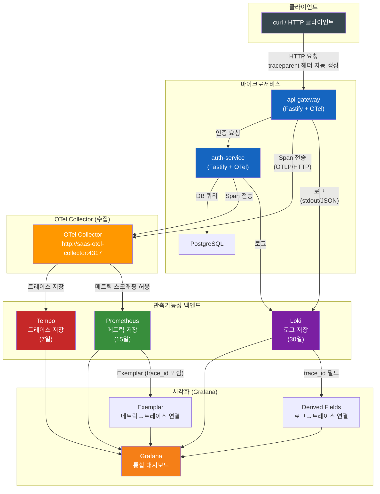
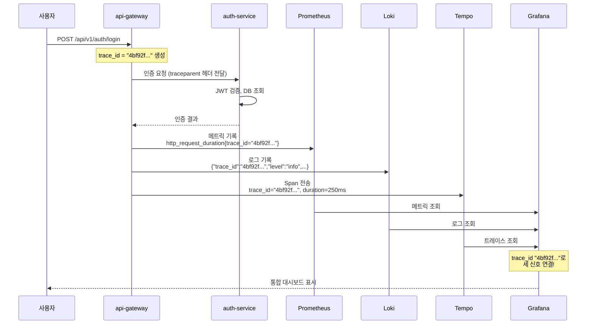
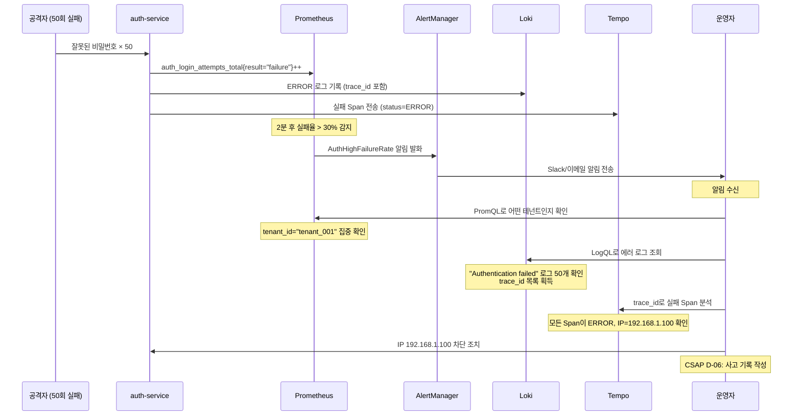

# 실습 15 — 관측가능성 통합 실습 (메트릭 + 로그 + 추적 연결)

> **문서 ID**: ONBOARD-10-EX15
> **버전**: 1.0.0 | **작성일**: 2026-04-12 | **작성자**: Implementer (Sonnet)
> **예상 소요 시간**: 약 155분 (2시간 35분)
> **난이도**: 중급~고급
> **CSAP**: D-06 (침해사고 관리 — 관측가능성), D-10 (네트워크 보안)
> **선행 문서** (완료 필수):
>   - `05-monitoring/08-observability-deep-dive.md` — M.E.L.T. 통합 심화
>   - `10-exercises/03-monitoring-lab.md` — Prometheus + Grafana 기초 실습
>   - `05-monitoring/tracing/01-tempo-otel.md` — Tempo + OTel 기초
> **관련 서비스 코드**:
>   - `platform/services/auth-service/src/lib/telemetry.ts` — OTel 초기화
>   - `platform/services/auth-service/src/lib/audit.ts` — 감사 로그
> **N2SF**: PII를 Span에 포함하지 않는 방법 (섹션 3.2 참조)

---

## 목차

1. [실습 소개 — M.E.L.T. 통합의 핵심 가치](#1-실습-소개--melt-통합의-핵심-가치)
   - 1.1 [이 실습에서 달성할 것](#11-이-실습에서-달성할-것)
   - 1.2 [전체 관측가능성 아키텍처](#12-전체-관측가능성-아키텍처)
   - 1.3 [사전 조건 확인](#13-사전-조건-확인)
   - 1.4 [완성 후 Grafana에서 볼 수 있는 것들](#14-완성-후-grafana에서-볼-수-있는-것들)
2. [파트 1: trace_id 연결 확인 (30분)](#2-파트-1-trace_id-연결-확인-30분)
   - 2.1 [HTTP 요청 생성 및 trace_id 획득](#21-http-요청-생성-및-trace_id-획득)
   - 2.2 [Tempo에서 trace_id 찾기](#22-tempo에서-trace_id-찾기)
   - 2.3 [Loki에서 동일 trace_id로 로그 찾기](#23-loki에서-동일-trace_id로-로그-찾기)
   - 2.4 [Prometheus에서 해당 시간대 메트릭 확인](#24-prometheus에서-해당-시간대-메트릭-확인)
   - 2.5 [3가지 신호 연결 흐름](#25-3가지-신호-연결-흐름)
3. [파트 2: 커스텀 Span 추가 (45분)](#3-파트-2-커스텀-span-추가-45분)
   - 3.1 [비즈니스 Span이란](#31-비즈니스-span이란)
   - 3.2 [기존 서비스에 Span 추가하기](#32-기존-서비스에-span-추가하기)
   - 3.3 [N2SF 준수: PII를 Span에 넣지 않는 방법](#33-n2sf-준수-pii를-span에-넣지-않는-방법)
   - 3.4 [Tempo에서 새 Span 확인](#34-tempo에서-새-span-확인)
4. [파트 3: 커스텀 메트릭 추가 (30분)](#4-파트-3-커스텀-메트릭-추가-30분)
   - 4.1 [비즈니스 Counter 설계 및 구현](#41-비즈니스-counter-설계-및-구현)
   - 4.2 [ServiceMonitor 자동 발견 확인](#42-servicemonitor-자동-발견-확인)
   - 4.3 [Grafana 패널 추가](#43-grafana-패널-추가)
   - 4.4 [PrometheusRule 알림 추가](#44-prometheusrule-알림-추가)
5. [파트 4: Grafana Exemplar 연결 (20분)](#5-파트-4-grafana-exemplar-연결-20분)
   - 5.1 [Exemplar란 무엇인가](#51-exemplar란-무엇인가)
   - 5.2 [Histogram에 Exemplar 추가하기](#52-histogram에-exemplar-추가하기)
   - 5.3 [Grafana에서 Exemplar 클릭 → Tempo 이동](#53-grafana에서-exemplar-클릭--tempo-이동)
6. [파트 5: 이상 상황 시뮬레이션 (30분)](#6-파트-5-이상-상황-시뮬레이션-30분)
   - 6.1 [인증 실패 시뮬레이션](#61-인증-실패-시뮬레이션)
   - 6.2 [타임아웃 시뮬레이션](#62-타임아웃-시뮬레이션)
   - 6.3 [AlertManager 알림 수신 확인](#63-alertmanager-알림-수신-확인)
   - 6.4 [이상 상황 3가지 신호 연결 흐름](#64-이상-상황-3가지-신호-연결-흐름)
7. [채점 기준 (100점)](#7-채점-기준-100점)
8. [학습 체크리스트](#8-학습-체크리스트)
9. [변경 이력](#9-변경-이력)

---

## 1. 실습 소개 — M.E.L.T. 통합의 핵심 가치

### 1.1 이 실습에서 달성할 것

단일 HTTP 요청이 시스템을 통과할 때 남기는 세 가지 흔적이 어떻게 하나의 이야기로 연결되는지를 직접 체험합니다.

```
실습 핵심 명제:

"하나의 HTTP 요청 → trace_id 하나 → 세 곳에 기록"

  Prometheus:  "이 요청이 0.82초 걸렸다" (숫자)
  Loki:        "이 요청에서 DB 쿼리 타임아웃 경고가 발생했다" (텍스트)
  Tempo:       "api-gateway → auth-service → postgres, 병목은 postgres 구간이었다" (여정)

→ trace_id 하나로 세 데이터를 즉시 연결하여 완전한 그림을 파악합니다.
```

**비유**: 범죄 수사에서 CCTV(메트릭), 목격자 진술(로그), 행동 궤적(트레이스)이 하나의 사건 번호로 묶이는 것과 같습니다.

### 1.2 전체 관측가능성 아키텍처



### 1.3 사전 조건 확인

실습 시작 전 다음 서비스가 실행 중인지 확인합니다.

```bash
# 1. 핵심 서비스 상태 확인
kubectl get pods -n saas-platform | grep -E "auth|api-gateway|postgres"
# 모두 Running 상태여야 합니다

# 2. 모니터링 스택 상태 확인
kubectl get pods -n monitoring | grep -E "prometheus|loki|tempo|grafana|otel"
# 모두 Running 상태여야 합니다

# 3. OTel Collector 상태 확인
kubectl get pods -n monitoring | grep otel
kubectl logs -n monitoring deployment/saas-otel-collector --since=2m | tail -10

# 4. Grafana 접근 확인
curl -s -o /dev/null -w "%{http_code}" http://grafana.saas.local:3000/api/health
# 200 이 출력되어야 합니다

# 5. auth-service의 OTel 활성화 여부 확인
kubectl exec -n saas-platform deployment/auth-service -- \
  env | grep OTEL
# OTEL_ENABLED=true 가 있어야 합니다
```

**OTel이 비활성화된 경우** 활성화:

```bash
# auth-service Deployment에 환경 변수 추가
kubectl set env deployment/auth-service -n saas-platform \
  OTEL_ENABLED=true \
  OTEL_EXPORTER_OTLP_ENDPOINT=http://saas-otel-collector.monitoring.svc.cluster.local:4318

# 재시작 후 확인
kubectl rollout status deployment/auth-service -n saas-platform
```

### 1.4 완성 후 Grafana에서 볼 수 있는 것들

이 실습을 완료하면 Grafana에서 다음을 할 수 있습니다:

```
완성 후 가능한 것들:

1. 메트릭 화면에서 느린 요청 Exemplar 클릭
   → Tempo에서 해당 요청의 전체 서비스 이동 경로 즉시 확인

2. Loki에서 에러 로그 trace_id 클릭
   → Tempo에서 해당 요청 추적 화면으로 즉시 이동

3. 새로 추가한 비즈니스 Counter 패널
   → 테넌트별, 결과별 로그인 현황을 실시간 확인

4. 이상 상황 알림
   → AlertManager가 발화 → Grafana 알림 패널에 표시
   → 알림 링크에서 Loki 에러 로그, Tempo 실패 트레이스로 연결
```

---

## 2. 파트 1: trace_id 연결 확인 (30분)

### 2.1 HTTP 요청 생성 및 trace_id 획득

auth-service에 로그인 요청을 보내고 응답에서 trace_id를 추출합니다.

```bash
# 1. 테스트 로그인 요청 (성공 케이스)
RESPONSE=$(curl -s -X POST http://api-gateway.saas.local/api/v1/auth/login \
  -H "Content-Type: application/json" \
  -d '{"email": "test@saas-demo.kr", "password": "TestPass1234!"}')

echo "응답: $RESPONSE" | jq .

# 2. 응답 헤더에서 trace_id 확인 (OTel이 자동으로 헤더에 포함)
curl -s -X POST http://api-gateway.saas.local/api/v1/auth/login \
  -H "Content-Type: application/json" \
  -d '{"email": "test@saas-demo.kr", "password": "TestPass1234!"}' \
  -v 2>&1 | grep "x-trace-id\|traceparent"
# 예상 출력: < traceparent: 00-4bf92f3577b34da6a3ce929d0e0e4736-00f067aa0ba902b7-01

# 3. trace_id 추출 (traceparent 헤더에서)
TRACE_ID=$(curl -s -X POST http://api-gateway.saas.local/api/v1/auth/login \
  -H "Content-Type: application/json" \
  -d '{"email": "test@saas-demo.kr", "password": "TestPass1234!"}' \
  -D - 2>/dev/null | \
  grep -i "traceparent" | \
  awk -F'-' '{print $2}')

echo "Trace ID: $TRACE_ID"
# 예상 출력: Trace ID: 4bf92f3577b34da6a3ce929d0e0e4736
```

**traceparent 헤더 형식 이해**:

```
traceparent: 00-4bf92f3577b34da6a3ce929d0e0e4736-00f067aa0ba902b7-01
             ↑  ↑                                ↑                ↑
            버전  Trace ID (32자리, 우리가 찾는 것) Span ID         샘플링 플래그
```

**직접 trace_id를 헤더에 넣어 요청하기** (특정 trace로 강제 설정):

```bash
# 내가 지정한 trace_id로 요청 (테스트 목적)
MY_TRACE_ID="$(openssl rand -hex 16)"  # 32자리 16진수 랜덤 생성
echo "테스트 Trace ID: $MY_TRACE_ID"

curl -X POST http://api-gateway.saas.local/api/v1/auth/login \
  -H "Content-Type: application/json" \
  -H "traceparent: 00-${MY_TRACE_ID}-0000000000000001-01" \
  -d '{"email": "test@saas-demo.kr", "password": "TestPass1234!"}'

# 이 trace_id로 세 곳에서 검색합니다
echo "검색할 trace_id: $MY_TRACE_ID"
```

### 2.2 Tempo에서 trace_id 찾기

```bash
# Tempo HTTP API로 트레이스 직접 조회
curl -s "http://tempo.saas.local:3200/api/traces/${MY_TRACE_ID}" | jq .

# 또는 Grafana UI 사용:
# 1. Grafana > Explore 접속
# 2. 데이터소스: Tempo 선택
# 3. Query type: TraceQL 선택
# 4. 쿼리 입력:
```

**TraceQL 쿼리 예시** (Grafana Tempo Explore에서 실행):

```traceql
# trace_id로 직접 조회 (가장 간단)
{ traceId = "4bf92f3577b34da6a3ce929d0e0e4736" }

# 서비스명으로 조회
{ resource.service.name = "auth-service" }

# 최근 5분간 auth-service의 느린 요청 (1초 이상)
{ resource.service.name = "auth-service" && duration > 1s }

# 에러 Span 조회
{ resource.service.name = "auth-service" && status = error }

# 테넌트 ID가 있는 Span 조회
{ span.tenant_id = "tenant_001" }
```

Grafana UI에서 확인하는 법:

```
1. http://grafana.saas.local:3000 접속
2. 좌측 메뉴 > Explore (나침반 아이콘)
3. 상단 데이터소스 드롭다운 > "Tempo" 선택
4. "Search" 탭 → 서비스 이름, 기간 설정
5. 결과에서 Trace를 클릭하면 Span 트리 표시
```

Tempo에서 볼 수 있는 Span 트리 예시:

```
Trace: 4bf92f3577b34da6a3ce929d0e0e4736  총 250ms
└─ api-gateway    POST /api/v1/auth/login          250ms
   ├─ auth-service  POST /internal/auth/verify      220ms
   │  ├─ auth-service  jwt.verify                   15ms
   │  ├─ auth-service  redis.get (블랙리스트 확인)   8ms
   │  └─ postgres      SELECT * FROM users WHERE     190ms ← 느림!
   └─ api-gateway  response.send                     5ms
```

### 2.3 Loki에서 동일 trace_id로 로그 찾기

```bash
# Loki HTTP API로 로그 직접 조회
curl -s -G "http://loki.saas.local:3100/loki/api/v1/query_range" \
  --data-urlencode 'query={service="auth-service"} | json | trace_id="4bf92f3577b34da6a3ce929d0e0e4736"' \
  --data-urlencode 'start='"$(date -d '5 minutes ago' +%s%N)" \
  --data-urlencode 'end='"$(date +%s%N)" | jq .data.result
```

**Grafana Loki Explore에서 LogQL 쿼리**:

```logql
# trace_id로 로그 찾기 (JSON 로그 구조일 때)
{service="auth-service"} | json | trace_id="4bf92f3577b34da6a3ce929d0e0e4736"

# 더 유연한 검색 (파이프라인 필터)
{namespace="saas-platform"} |= "4bf92f3577b34da6a3ce929d0e0e4736"

# trace_id를 포함하는 에러 로그만
{service="auth-service"} | json | trace_id="4bf92f3577b34da6a3ce929d0e0e4736" | level="error"

# 서비스 전체의 특정 시간대 에러
{namespace="saas-platform"} | json | level="error"
  | __error__ = ""  # 파싱 에러 제외
```

Grafana Loki Explore에서 **Derived Fields** 설정 (trace_id 클릭 시 Tempo로 이동):

```
Grafana > Configuration > Data Sources > Loki
> Derived Fields 탭 추가:
  - Name: trace_id
  - Regex: "trace_id":"([^"]+)"   (JSON 로그에서 추출)
  - URL: http://tempo.saas.local:3200/api/traces/${__value.raw}
  - Internal Link: Tempo 데이터소스 선택
```

이렇게 설정하면 로그에서 trace_id를 클릭하면 Tempo 화면으로 바로 이동합니다.

### 2.4 Prometheus에서 해당 시간대 메트릭 확인

```promql
# 특정 시간대 auth-service 요청 수 확인
# (Grafana에서 "Last 5 minutes" 필터와 함께 사용)
rate(http_requests_total{service="auth-service"}[1m])

# 해당 시간대 응답시간 분포
histogram_quantile(0.99,
  rate(http_request_duration_seconds_bucket{
    service="auth-service",
    path="/api/v1/auth/login"
  }[5m])
)

# 로그인 성공/실패 비율
sum(rate(auth_login_total[5m])) by (result)

# 특정 trace_id가 발생한 시점의 메트릭 (시간 범위로 좁혀서)
# → 이 부분은 Exemplar를 통해 직접 연결합니다 (파트 4에서 실습)
```

Grafana에서 시간 범위 동기화:

```
1. Tempo에서 특정 Trace를 발견
2. 해당 Trace의 시작 시간 확인 (예: 2026-04-12 14:23:45)
3. Prometheus Explore에서 해당 시간으로 타임라인 이동
   - 우측 상단 시간 범위를 Trace 발생 시간 ±5분으로 설정
4. 메트릭 이상 여부 확인
```

### 2.5 3가지 신호 연결 흐름



**체크포인트 질문** (파트 1 완료 기준):
- 특정 HTTP 요청의 trace_id를 획득할 수 있었나요?
- Tempo에서 해당 trace_id를 가진 Span 트리를 볼 수 있었나요?
- Loki에서 동일 trace_id가 포함된 로그를 찾을 수 있었나요?
- Prometheus에서 해당 시간대의 메트릭을 확인할 수 있었나요?

---

## 3. 파트 2: 커스텀 Span 추가 (45분)

### 3.1 비즈니스 Span이란

기본 OTel 자동 계측은 HTTP 요청, DB 쿼리 등 인프라 수준의 Span을 자동 생성합니다. "비즈니스 Span"은 그보다 상위의 비즈니스 논리 단위를 추적하기 위해 개발자가 직접 추가하는 Span입니다.

```
자동 계측 Span (OTel 자동 생성):
  - HTTP 요청/응답
  - PostgreSQL 쿼리
  - Redis 명령
  - 외부 HTTP 호출

비즈니스 Span (직접 추가):
  - "로그인 시도" (어떤 테넌트가 로그인했는지)
  - "MFA 검증" (MFA 방식은 무엇인지)
  - "권한 확인" (어떤 권한을 확인했는지)
  - "감사 로그 기록" (감사 로그 쓰기가 얼마나 걸렸는지)
```

비즈니스 Span 추가가 유용한 이유:

```
예시: 로그인이 느리다는 신고를 받았습니다.

자동 계측만 있을 때:
  auth-service.POST /auth/login: 850ms
  postgres.SELECT users: 820ms
  → "DB 쿼리가 느리다"는 것은 알지만,
    어떤 부분(사용자 조회? MFA 확인? 세션 생성?)이 느린지 모름

비즈니스 Span 추가 후:
  auth-service.login_attempt: 850ms
    └─ validate_credentials: 15ms     (빠름)
    └─ verify_mfa: 12ms              (빠름)
    └─ check_account_lockout: 800ms  ← 병목!
    └─ create_session: 10ms          (빠름)
  → "계정 잠금 확인" 로직이 느림을 즉시 파악
```

### 3.2 기존 서비스에 Span 추가하기

auth-service의 로그인 핸들러에 비즈니스 Span을 추가합니다.

실제 파일 기반 코드 예시:

```typescript
// platform/services/auth-service/src/handlers/login.handler.ts
// Design Ref: SVC-AUTH-R1 DESIGN §6 | Plan SC: FR-AUTH.6
// CSAP: D-06 침해사고 관리 — 분산 추적

import { trace, SpanStatusCode, context, propagation } from '@opentelemetry/api'

// 전역 Tracer 획득 (서비스 이름과 일치해야 함)
const tracer = trace.getTracer('auth-service', '0.2.0')

/**
 * 로그인 처리 핸들러 — 커스텀 Span 추가 예시
 *
 * 비즈니스 Span 계층:
 *   login_attempt
 *     ├─ validate_credentials  (DB 조회)
 *     ├─ check_account_lockout (Redis 확인)
 *     ├─ verify_mfa            (TOTP 검증)
 *     └─ create_session        (JWT 발급)
 */
export async function loginHandler(request: FastifyRequest, reply: FastifyReply) {
  const { email, password, tenantId } = request.body as LoginBody

  // 최상위 비즈니스 Span 시작
  // 이 Span은 HTTP 요청 Span의 자식으로 자동 연결됩니다
  return tracer.startActiveSpan('login_attempt', async (loginSpan) => {
    try {
      // --- Span Attribute 추가 ---
      // N2SF O등급 데이터만: 테넌트 ID, 요청 유형은 허용
      // 이메일(PII)은 절대 Span에 포함하지 않음 (3.3절 참조)
      loginSpan.setAttribute('tenant.id', tenantId)
      loginSpan.setAttribute('auth.method', 'password')
      loginSpan.setAttribute('auth.mfa_required', false)  // 초기값

      // 1단계: 자격증명 검증 (별도 Span)
      const user = await tracer.startActiveSpan('validate_credentials', async (credSpan) => {
        try {
          credSpan.setAttribute('db.type', 'postgresql')
          const foundUser = await validateCredentials(email, password, tenantId)
          credSpan.setStatus({ code: SpanStatusCode.OK })
          return foundUser
        } catch (err) {
          credSpan.setStatus({
            code: SpanStatusCode.ERROR,
            message: 'Credential validation failed'
          })
          credSpan.recordException(err as Error)
          throw err
        } finally {
          credSpan.end()  // 반드시 end() 호출
        }
      })

      // 2단계: 계정 잠금 확인 (별도 Span)
      await tracer.startActiveSpan('check_account_lockout', async (lockSpan) => {
        try {
          lockSpan.setAttribute('cache.backend', 'redis')
          await checkAccountLockout(user.id)
          lockSpan.setStatus({ code: SpanStatusCode.OK })
        } catch (err) {
          lockSpan.setStatus({ code: SpanStatusCode.ERROR, message: 'Account locked' })
          throw err
        } finally {
          lockSpan.end()
        }
      })

      // 3단계: MFA 검증 (조건부)
      if (user.mfaEnabled) {
        loginSpan.setAttribute('auth.mfa_required', true)
        await tracer.startActiveSpan('verify_mfa', async (mfaSpan) => {
          try {
            mfaSpan.setAttribute('auth.mfa_type', user.mfaType)  // 'totp' 또는 'sms'
            await verifyMfa(user.id, request.body.mfaToken)
            mfaSpan.setStatus({ code: SpanStatusCode.OK })
          } catch (err) {
            mfaSpan.setStatus({ code: SpanStatusCode.ERROR, message: 'MFA failed' })
            throw err
          } finally {
            mfaSpan.end()
          }
        })
      }

      // 4단계: 세션 생성 (별도 Span)
      const tokens = await tracer.startActiveSpan('create_session', async (sessionSpan) => {
        try {
          sessionSpan.setAttribute('session.backend', 'redis')
          const result = await createSession(user, tenantId)
          sessionSpan.setStatus({ code: SpanStatusCode.OK })
          return result
        } catch (err) {
          sessionSpan.setStatus({ code: SpanStatusCode.ERROR, message: 'Session creation failed' })
          throw err
        } finally {
          sessionSpan.end()
        }
      })

      // 최상위 Span 성공 처리
      loginSpan.setStatus({ code: SpanStatusCode.OK })
      loginSpan.setAttribute('auth.result', 'success')

      return reply.send({ accessToken: tokens.accessToken })

    } catch (err) {
      // 에러 기록 (스택 트레이스 포함)
      loginSpan.setStatus({
        code: SpanStatusCode.ERROR,
        message: (err as Error).message
      })
      loginSpan.recordException(err as Error)
      loginSpan.setAttribute('auth.result', 'failure')

      // CSAP D-09: 에러 응답에 내부 정보 노출 금지
      return reply.status(401).send({ error: 'Authentication failed' })

    } finally {
      loginSpan.end()  // 항상 end() 호출 (finally 블록에서)
    }
  })
}
```

### 3.3 N2SF 준수: PII를 Span에 넣지 않는 방법

N2SF(국가 공공부문 정보보안 프레임워크)는 개인정보(PII)를 트레이스 시스템에 전송하는 것을 금지합니다. Tempo는 외부에 로그를 내보낼 수 있으므로 PII 포함 시 N2SF 위반입니다.

```typescript
// ===== PII Span Attribute 규칙 =====

// ❌ 절대 금지: PII를 Span에 포함
loginSpan.setAttribute('user.email', email)          // 이메일 — PII
loginSpan.setAttribute('user.name', user.name)        // 이름 — PII
loginSpan.setAttribute('user.phone', user.phone)      // 전화번호 — PII
loginSpan.setAttribute('auth.password', password)     // 비밀번호 — 절대 금지
loginSpan.setAttribute('user.ssn', user.ssn)          // 주민번호 — 절대 금지

// ✅ 허용: 식별자, 등급, 결과 값
loginSpan.setAttribute('user.id', user.id)            // 내부 UUID — O등급 허용
loginSpan.setAttribute('tenant.id', tenantId)         // 테넌트 ID — O등급 허용
loginSpan.setAttribute('auth.result', 'success')      // 결과 — 허용
loginSpan.setAttribute('auth.method', 'password')     // 방법 — 허용
loginSpan.setAttribute('auth.mfa_type', 'totp')       // MFA 방식 — 허용
loginSpan.setAttribute('http.status_code', 200)       // HTTP 상태 — 허용

// ✅ PII 해시화 후 포함 (추적 목적으로만)
// N2SF: C/S 등급 데이터를 O등급으로 변환하는 방법
import { createHash } from 'crypto'
const emailHash = createHash('sha256').update(email).digest('hex').substring(0, 8)
loginSpan.setAttribute('user.email_prefix', emailHash)  // 해시된 일부만 — 추적 가능, 복원 불가
```

**데이터 등급별 Span Attribute 허용 여부**:

| 데이터 유형 | N2SF 등급 | Span 포함 허용 | 대안 |
|-----------|---------|-------------|------|
| 이름, 이메일, 전화 | C (공개금지) | 금지 | SHA-256 해시 앞 8자리 |
| 주민번호, 비밀번호 | S (비밀) | 절대 금지 | 포함 불가 |
| 사용자 UUID | O (일반) | 허용 | 그대로 사용 |
| 테넌트 ID | O (일반) | 허용 | 그대로 사용 |
| HTTP 메서드/경로 | O (일반) | 허용 | 그대로 사용 |
| 응답 코드 | O (일반) | 허용 | 그대로 사용 |

### 3.4 Tempo에서 새 Span 확인

Span을 추가한 후 새 로그인 요청을 보내고 Tempo에서 확인합니다.

```bash
# 1. 새 요청 보내기
curl -X POST http://api-gateway.saas.local/api/v1/auth/login \
  -H "Content-Type: application/json" \
  -d '{"email": "test@saas-demo.kr", "password": "TestPass1234!"}'

# 2. Tempo에서 새 Span 구조 확인
# Grafana > Explore > Tempo > TraceQL:
# { resource.service.name = "auth-service" && span.name = "login_attempt" }

# 3. Span 속성 확인
# { span.tenant.id exists && resource.service.name = "auth-service" }
```

Tempo에서 볼 수 있는 새 Span 트리:

```
Trace: 새로운 trace_id  총 250ms
└─ api-gateway    POST /api/v1/auth/login                    250ms
   └─ auth-service  login_attempt (비즈니스 Span 추가됨!)     220ms
      ├─ validate_credentials                                  15ms
      ├─ check_account_lockout                                  8ms
      ├─ verify_mfa (mfa_type=totp)                           12ms
      └─ create_session (backend=redis)                        10ms
```

**체크포인트 질문** (파트 2 완료 기준):
- `login_attempt` Span이 Tempo에서 보이나요?
- Span Attribute에 `tenant.id`가 포함되어 있나요?
- 이메일 등 PII가 Span에 포함되지 않았음을 확인했나요?
- `verify_mfa` Span의 `mfa_type` Attribute가 보이나요?

---

## 4. 파트 3: 커스텀 메트릭 추가 (30분)

### 4.1 비즈니스 Counter 설계 및 구현

로그인 시도 결과를 테넌트별, 결과별로 추적하는 Counter 메트릭을 추가합니다.

기존 코드 패턴 참조 (`packages/dora-exporter/src/index.ts`):

```typescript
// platform/services/auth-service/src/lib/metrics.ts
// Design Ref: SVC-AUTH-R1 DESIGN §6 | Plan SC: FR-AUTH.6
// CSAP: D-06 침해사고 관리 보완 — 비즈니스 메트릭

import { Registry, Counter, Histogram, Gauge } from 'prom-client'

// auth-service 전용 레지스트리 (기본 레지스트리와 충돌 방지)
const authRegistry = new Registry()

// FR-AUTH.6.1: 로그인 시도 카운터
// tenant_id는 O등급 데이터로 레이블 허용
// 이메일 등 PII는 레이블 사용 금지 (N2SF)
export const loginAttemptCounter = new Counter({
  name: 'auth_login_attempts_total',
  help: '로그인 시도 횟수 (테넌트별, 결과별)',
  labelNames: ['tenant_id', 'result', 'method'] as const,
  registers: [authRegistry],
})

// FR-AUTH.6.2: 로그인 처리 시간 히스토그램 (Exemplar 연결 위해 Histogram 사용)
export const loginDurationHistogram = new Histogram({
  name: 'auth_login_duration_seconds',
  help: '로그인 처리 시간 (초)',
  labelNames: ['tenant_id', 'result'] as const,
  // 0.01초(10ms)~10초 범위의 버킷
  buckets: [0.01, 0.05, 0.1, 0.25, 0.5, 1.0, 2.5, 5.0, 10.0],
  registers: [authRegistry],
})

// FR-AUTH.6.3: 현재 활성 세션 수 (Gauge)
export const activeSessionsGauge = new Gauge({
  name: 'auth_active_sessions_total',
  help: '현재 활성 세션 수 (테넌트별)',
  labelNames: ['tenant_id'] as const,
  registers: [authRegistry],
})

// 레지스트리 노출 (Prometheus 스크래핑 엔드포인트용)
export const getAuthMetrics = () => authRegistry.metrics()
```

**핸들러에 메트릭 기록 추가**:

```typescript
// platform/services/auth-service/src/handlers/login.handler.ts
// (메트릭 기록 추가 부분)
import { loginAttemptCounter, loginDurationHistogram } from '../lib/metrics'

export async function loginHandler(request: FastifyRequest, reply: FastifyReply) {
  const startTime = Date.now()
  const { email, password, tenantId } = request.body as LoginBody

  try {
    // ... 기존 로직 ...

    // 성공 시 메트릭 기록
    loginAttemptCounter.inc({
      tenant_id: tenantId,
      result: 'success',
      method: 'password',
    })

    const durationSeconds = (Date.now() - startTime) / 1000
    loginDurationHistogram.observe(
      { tenant_id: tenantId, result: 'success' },
      durationSeconds
    )

    return reply.send({ accessToken: tokens.accessToken })

  } catch (err) {
    // 실패 시 메트릭 기록
    loginAttemptCounter.inc({
      tenant_id: tenantId,
      result: 'failure',
      method: 'password',
    })

    const durationSeconds = (Date.now() - startTime) / 1000
    loginDurationHistogram.observe(
      { tenant_id: tenantId, result: 'failure' },
      durationSeconds
    )

    return reply.status(401).send({ error: 'Authentication failed' })
  }
}
```

**메트릭 엔드포인트 등록** (Fastify 라우트에 추가):

```typescript
// platform/services/auth-service/src/routes.ts
import { getAuthMetrics } from './lib/metrics'

// Prometheus 스크래핑 엔드포인트
fastify.get('/metrics', async (request, reply) => {
  reply.header('Content-Type', 'text/plain; version=0.0.4')
  return getAuthMetrics()
})
```

### 4.2 ServiceMonitor 자동 발견 확인

ServiceMonitor는 Prometheus Operator에게 "이 서비스에서 메트릭을 스크래핑하라"고 알리는 리소스입니다.

```yaml
# infra/monitoring/auth-service-servicemonitor.yaml
# Design Ref: MTU-N178 §2 | CSAP: D-06
apiVersion: monitoring.coreos.com/v1
kind: ServiceMonitor
metadata:
  name: auth-service
  namespace: monitoring
  labels:
    release: kube-prometheus-stack  # Prometheus Operator가 감시하는 레이블
spec:
  selector:
    matchLabels:
      app: auth-service             # auth-service Service의 레이블
  namespaceSelector:
    matchNames:
      - saas-platform               # auth-service가 있는 네임스페이스
  endpoints:
    - port: http                    # Service의 포트 이름
      path: /metrics                # 메트릭 엔드포인트 경로
      interval: 15s                 # 15초마다 스크래핑
      scrapeTimeout: 10s
```

ServiceMonitor 적용 및 확인:

```bash
# ServiceMonitor 적용
kubectl apply -f infra/monitoring/auth-service-servicemonitor.yaml

# Prometheus가 auth-service를 스크래핑 대상으로 인식했는지 확인
# Prometheus UI > Status > Targets > auth-service 검색
curl -s "http://prometheus.saas.local:9090/api/v1/targets" | \
  jq '.data.activeTargets[] | select(.labels.service == "auth-service")'

# 새 메트릭이 Prometheus에 수집되었는지 확인 (약 30초 후)
curl -s "http://prometheus.saas.local:9090/api/v1/query?query=auth_login_attempts_total" | \
  jq .data.result
```

### 4.3 Grafana 패널 추가

Grafana에서 새 메트릭으로 대시보드 패널을 추가합니다.

**PromQL 쿼리 작성**:

```promql
# 패널 1: 테넌트별 분당 로그인 성공 수 (Stat 패널)
sum(rate(auth_login_attempts_total{result="success"}[1m])) by (tenant_id)

# 패널 2: 로그인 성공률 (%) — Gauge 패널
(
  sum(rate(auth_login_attempts_total{result="success"}[5m]))
  /
  sum(rate(auth_login_attempts_total[5m]))
) * 100

# 패널 3: 로그인 P99 응답시간 (Time Series 패널)
histogram_quantile(0.99,
  sum(rate(auth_login_duration_seconds_bucket[5m])) by (le, tenant_id)
)

# 패널 4: 로그인 실패 횟수 (Bar 패널 — 테넌트별)
sum(increase(auth_login_attempts_total{result="failure"}[1h])) by (tenant_id)
```

**Grafana UI로 패널 추가하는 절차**:

```
1. Grafana > Dashboards > "SaaS Auth Dashboard" 열기
   (없으면 새로 생성: + New Dashboard)

2. Add panel 클릭 (상단 우측 + 버튼)

3. Panel 설정:
   - Title: "로그인 성공률 by 테넌트"
   - Visualization: Gauge
   - Data source: Prometheus

4. PromQL 입력:
   (
     sum(rate(auth_login_attempts_total{result="success"}[5m])) by (tenant_id)
     /
     sum(rate(auth_login_attempts_total[5m])) by (tenant_id)
   ) * 100

5. Thresholds 설정 (Field 탭):
   - 80 미만: Red (위험)
   - 90~100: Green (정상)

6. Save Dashboard
```

### 4.4 PrometheusRule 알림 추가

```yaml
# infra/monitoring/auth-service-alerts.yaml
# CSAP D-06: 침해사고 관리 — 이상 로그인 패턴 탐지
apiVersion: monitoring.coreos.com/v1
kind: PrometheusRule
metadata:
  name: auth-service-alerts
  namespace: monitoring
  labels:
    release: kube-prometheus-stack
spec:
  groups:
    - name: auth.security
      rules:
        # 로그인 실패율 30% 초과 시 경고 (보안 이상 탐지)
        - alert: AuthHighFailureRate
          expr: |
            (
              sum(rate(auth_login_attempts_total{result="failure"}[5m]))
              /
              sum(rate(auth_login_attempts_total[5m]))
            ) > 0.30
          for: 2m             # 2분 지속 시 알림
          labels:
            severity: warning
            csap_ref: D-06
          annotations:
            summary: "로그인 실패율 이상: {{ $value | printf '%.1f%%' }}"
            description: |
              로그인 실패율이 30%를 초과했습니다.
              무차별 대입 공격 가능성을 검토하십시오.
              조치: Loki에서 실패 로그 확인 후 IP 차단 검토

        # 로그인 응답시간 P99 > 2초 시 경고
        - alert: AuthSlowLogin
          expr: |
            histogram_quantile(0.99,
              rate(auth_login_duration_seconds_bucket[5m])
            ) > 2.0
          for: 5m
          labels:
            severity: warning
          annotations:
            summary: "로그인 응답시간 저하: P99 = {{ $value | printf '%.2f' }}초"
            description: |
              로그인 P99 응답시간이 2초를 초과했습니다.
              DB 쿼리 성능 또는 Redis 연결을 확인하십시오.

        # 특정 테넌트 로그인 시도 급증 (DDoS 의심)
        - alert: AuthTenantLoginSpike
          expr: |
            sum(rate(auth_login_attempts_total[1m])) by (tenant_id) > 10
          for: 1m
          labels:
            severity: critical
            csap_ref: D-06
          annotations:
            summary: "테넌트 로그인 급증: {{ $labels.tenant_id }}"
            description: |
              테넌트 {{ $labels.tenant_id }}에서 1분당 10건 이상의 로그인 시도.
              DDoS 또는 무차별 대입 공격 가능성.
              즉각 Rate Limit 강화 및 보안팀 연락 필요.
```

```bash
# PrometheusRule 적용
kubectl apply -f infra/monitoring/auth-service-alerts.yaml

# 알림 규칙이 Prometheus에 로드되었는지 확인
curl -s "http://prometheus.saas.local:9090/api/v1/rules" | \
  jq '.data.groups[] | select(.name == "auth.security") | .rules[].name'
# 예상 출력: "AuthHighFailureRate", "AuthSlowLogin", "AuthTenantLoginSpike"
```

---

## 5. 파트 4: Grafana Exemplar 연결 (20분)

### 5.1 Exemplar란 무엇인가

Exemplar는 메트릭 데이터 포인트에 추가로 저장되는 메타데이터입니다. 특히 Histogram 버킷에 해당 메트릭 값을 만든 실제 요청의 `trace_id`를 포함할 수 있습니다.

```
Exemplar 없을 때:
  메트릭: P99 응답시간 = 2.3초
  → "어떤 요청이 2.3초를 만들었는지 알 수 없음"
  → Tempo에서 수동으로 느린 요청을 찾아야 함

Exemplar 있을 때:
  메트릭: P99 응답시간 = 2.3초
          + Exemplar: trace_id = "4bf92f3577b34da6a3ce929d0e0e4736"
  → Grafana 차트에서 특정 데이터 포인트 클릭
  → 해당 trace_id의 Tempo 화면으로 즉시 이동
  → "이 요청이 왜 2.3초 걸렸는지" 즉시 분석 가능

비유: 수사보고서에 "2022년 3월 15일 14:23 사건 번호 2022-001234 참조"
       메트릭 데이터 포인트에 "이때 발생한 요청 trace_id 참조"
```

### 5.2 Histogram에 Exemplar 추가하기

```typescript
// platform/services/auth-service/src/handlers/login.handler.ts
// Exemplar 추가 코드
import { trace } from '@opentelemetry/api'
import { loginDurationHistogram } from '../lib/metrics'

async function loginHandler(request: FastifyRequest, reply: FastifyReply) {
  const startTime = Date.now()

  try {
    // ... 로그인 처리 로직 ...

    const durationSeconds = (Date.now() - startTime) / 1000

    // 현재 활성 Span에서 trace_id 추출
    const activeSpan = trace.getActiveSpan()
    const spanContext = activeSpan?.spanContext()
    const traceId = spanContext?.traceId

    // Exemplar와 함께 Histogram에 기록
    if (traceId) {
      // prom-client v15+: observe()에 Exemplar 전달 방법
      loginDurationHistogram.observe(
        { tenant_id: tenantId, result: 'success' },
        durationSeconds,
        // Exemplar: 메트릭 포인트와 트레이스를 연결하는 레이블
        { traceID: traceId }  // Grafana Exemplar 표준 레이블 이름
      )
    } else {
      // OTel 비활성화 시 Exemplar 없이 기록
      loginDurationHistogram.observe(
        { tenant_id: tenantId, result: 'success' },
        durationSeconds
      )
    }

  } catch (err) {
    // 실패 케이스에도 Exemplar 포함
    const durationSeconds = (Date.now() - startTime) / 1000
    const traceId = trace.getActiveSpan()?.spanContext().traceId
    loginDurationHistogram.observe(
      { tenant_id: tenantId, result: 'failure' },
      durationSeconds,
      traceId ? { traceID: traceId } : undefined
    )

    return reply.status(401).send({ error: 'Authentication failed' })
  }
}
```

**Prometheus가 Exemplar를 수신하도록 설정**:

```yaml
# Prometheus 설정에 Exemplar 활성화 (kube-prometheus-stack values)
prometheus:
  prometheusSpec:
    enableFeatures:
      - exemplar-storage  # Exemplar 저장 기능 활성화
    exemplars:
      maxSize: 100000     # 최대 Exemplar 저장 수
```

### 5.3 Grafana에서 Exemplar 클릭 → Tempo 이동

**Grafana Prometheus 데이터소스에 Exemplar 설정**:

```
Grafana > Configuration > Data Sources > Prometheus
> Exemplars 탭:
  - Enable: On
  - Internal Link: 체크 (Tempo 데이터소스 선택)
  - URL: http://tempo.saas.local:3200/api/traces/${__value.raw}
```

**Grafana에서 Exemplar 확인 방법**:

```
1. Grafana > Explore > Prometheus 선택
2. 쿼리: histogram_quantile(0.99, rate(auth_login_duration_seconds_bucket[5m]))
3. 차트에서 데이터 포인트 위에 마우스를 올리면
   작은 다이아몬드 모양(◆)이 Exemplar를 나타냄
4. Exemplar 클릭 → "View in Tempo" 링크 클릭
5. Tempo에서 해당 요청의 전체 Span 트리 확인
```

Exemplar 동작 확인용 쿼리:

```promql
# Exemplar 포함 조회 (Grafana에서 Exemplar 표시 활성화 필요)
{__name__="auth_login_duration_seconds_bucket"}

# 또는 기존 쿼리에 Exemplar 표시 옵션을 켜면 자동 표시됨
histogram_quantile(0.99,
  rate(auth_login_duration_seconds_bucket[5m])
)
```

---

## 6. 파트 5: 이상 상황 시뮬레이션 (30분)

### 6.1 인증 실패 시뮬레이션

의도적으로 인증 실패를 대량 발생시켜 알림이 동작하는지 확인합니다.

```bash
# 1. 잘못된 비밀번호로 반복 요청 (50회)
for i in $(seq 1 50); do
  curl -s -X POST http://api-gateway.saas.local/api/v1/auth/login \
    -H "Content-Type: application/json" \
    -d "{\"email\": \"test@saas-demo.kr\", \"password\": \"WrongPassword${i}\"}" \
    -o /dev/null
  echo "시도 ${i}/50 완료"
done

echo "50회 실패 요청 완료. AlertManager 확인 대기 중..."

# 2. 실패율 확인
curl -s "http://prometheus.saas.local:9090/api/v1/query?query=\
  sum(rate(auth_login_attempts_total{result=%22failure%22}[1m]))\
  /\
  sum(rate(auth_login_attempts_total[1m]))" | jq .data.result
# 예상: 0.30 이상 (30% 초과)

# 3. Loki에서 실패 로그 확인
# LogQL: {service="auth-service"} | json | level="warn" | message =~ ".*login.*fail.*"
```

```bash
# 4. PrometheusRule 발화 확인
curl -s "http://prometheus.saas.local:9090/api/v1/alerts" | \
  jq '.data.alerts[] | select(.labels.alertname == "AuthHighFailureRate")'

# 5. AlertManager에서 알림 수신 확인
curl -s "http://alertmanager.saas.local:9093/api/v2/alerts" | \
  jq '.[] | select(.labels.alertname == "AuthHighFailureRate") | {alertname: .labels.alertname, status: .status.state, startsAt: .startsAt}'
```

### 6.2 타임아웃 시뮬레이션

DB 연결 지연을 시뮬레이션하여 느린 요청 알림을 발생시킵니다.

```bash
# 방법 1: tc를 사용한 네트워크 지연 주입 (Linux Traffic Control)
# 주의: 운영 환경에서 절대 사용 금지. 개발/스테이징 전용.

# PostgreSQL Pod에 인위적 지연 주입 (500ms)
kubectl exec -n saas saas-main-db-1 -- \
  tc qdisc add dev eth0 root netem delay 500ms

# 몇 개의 로그인 요청 보내기
for i in $(seq 1 5); do
  time curl -s -X POST http://api-gateway.saas.local/api/v1/auth/login \
    -H "Content-Type: application/json" \
    -d '{"email": "test@saas-demo.kr", "password": "TestPass1234!"}'
done

# 지연 제거
kubectl exec -n saas saas-main-db-1 -- \
  tc qdisc del dev eth0 root
```

```bash
# 방법 2: chaos-engineering 도구 사용 (더 안전)
# 실습 12 (chaos-engineering.md) 참조

# 방법 3: 직접 슬로우 쿼리 실행 (PostgreSQL pg_sleep)
kubectl exec -n saas saas-main-db-1 -- \
  psql -U saas_admin -d saas_platform -c "SELECT pg_sleep(2);" &

# 이 상태에서 로그인 요청을 보내면 DB 잠금으로 인한 지연 발생
curl -X POST http://api-gateway.saas.local/api/v1/auth/login \
  -H "Content-Type: application/json" \
  -d '{"email": "test@saas-demo.kr", "password": "TestPass1234!"}'
```

### 6.3 AlertManager 알림 수신 확인

```bash
# 1. AlertManager 현재 알림 목록
curl -s "http://alertmanager.saas.local:9093/api/v2/alerts" | jq '.'

# 2. 특정 알림 필터
curl -s "http://alertmanager.saas.local:9093/api/v2/alerts?filter=alertname=AuthHighFailureRate" | jq .

# 3. 알림 억제(silencing) 확인
curl -s "http://alertmanager.saas.local:9093/api/v2/silences" | jq .

# 4. Grafana Alerting에서 확인
# Grafana > Alerting > Alert Rules
# "auth-service-alerts" 그룹에서 발화된 알림 확인
```

**AlertManager 라우팅 규칙 확인**:

```bash
kubectl get configmap alertmanager-kube-prometheus-alertmanager -n monitoring -o yaml | \
  grep -A50 "route:"
```

### 6.4 이상 상황 3가지 신호 연결 흐름



**실습 정리 명령어**:

```bash
# 시뮬레이션 종료 후 정상 상태 확인
# 1. 알림이 해소되었는지 확인 (5분 후)
curl -s "http://alertmanager.saas.local:9093/api/v2/alerts?filter=alertname=AuthHighFailureRate" | \
  jq '.[].status.state'
# 예상: "resolved"

# 2. 메트릭 정상화 확인
curl -s "http://prometheus.saas.local:9090/api/v1/query?query=\
  sum(rate(auth_login_attempts_total{result=%22failure%22}[2m]))\
  /\
  sum(rate(auth_login_attempts_total[2m]))" | jq .data.result
# 예상: 0.30 미만으로 내려감

# 3. Loki에서 실습 기간 에러 로그 수 확인
# LogQL: sum(count_over_time({service="auth-service"} | json | level="error" [1h]))
```

---

## 7. 채점 기준 (100점)

이 실습을 완료한 후 다음 채점 기준으로 점수를 확인하십시오.

### 파트 1: trace_id 3가지 신호 연결 확인 (30점)

| 항목 | 배점 | 확인 방법 |
|------|------|---------|
| HTTP 요청에서 trace_id 추출 성공 | 5점 | `traceparent` 헤더 확인 |
| Tempo에서 해당 trace_id Span 트리 확인 | 10점 | TraceQL 쿼리로 Span 3개 이상 확인 |
| Loki에서 동일 trace_id 로그 확인 | 10점 | LogQL로 trace_id 필터링 성공 |
| Prometheus 시간대 메트릭 확인 | 5점 | 해당 시간대 메트릭 그래프 확인 |

### 파트 2: 커스텀 Span 동작 (25점)

| 항목 | 배점 | 확인 방법 |
|------|------|---------|
| `login_attempt` 최상위 Span 생성 | 10점 | Tempo에서 `span.name="login_attempt"` 확인 |
| Span Attribute에 `tenant.id` 포함 | 5점 | Tempo Span Detail에서 확인 |
| PII 미포함 확인 (이메일 없음) | 5점 | Span Attribute 목록에서 이메일 부재 확인 |
| 자식 Span 계층 구조 정상 | 5점 | `validate_credentials` 등 자식 Span 확인 |

### 파트 3: 커스텀 메트릭 + 알림 (25점)

| 항목 | 배점 | 확인 방법 |
|------|------|---------|
| `auth_login_attempts_total` 수집 성공 | 8점 | Prometheus에서 메트릭 쿼리 성공 |
| Grafana 패널 생성 | 7점 | 로그인 성공률 Gauge 패널 동작 확인 |
| PrometheusRule 적용 | 5점 | Prometheus > Alerts에서 규칙 확인 |
| 알림 발화 테스트 성공 | 5점 | AlertManager에서 알림 수신 확인 |

### 파트 4: Exemplar 연결 (20점)

| 항목 | 배점 | 확인 방법 |
|------|------|---------|
| Histogram에 Exemplar 포함 | 10점 | Prometheus에서 Exemplar 데이터 확인 |
| Grafana 차트에서 Exemplar 다이아몬드 표시 | 5점 | 차트 데이터 포인트에 ◆ 기호 확인 |
| Exemplar 클릭 → Tempo 이동 성공 | 5점 | 클릭 후 Tempo 트레이스 화면 진입 확인 |

---

## 8. 학습 체크리스트

이 실습을 통해 습득해야 할 핵심 역량입니다.

**관측가능성 통합 이해**:
- [ ] trace_id 하나로 메트릭/로그/트레이스를 연결할 수 있다
- [ ] M.E.L.T. 각 요소(Metrics/Events/Logs/Traces)의 역할을 설명할 수 있다
- [ ] 단일 HTTP 요청이 세 관측 시스템에 어떻게 기록되는지 설명할 수 있다

**OTel Span 관련**:
- [ ] 비즈니스 Span과 자동 계측 Span의 차이를 설명할 수 있다
- [ ] `tracer.startActiveSpan()`으로 커스텀 Span을 추가할 수 있다
- [ ] Span Attribute에 PII를 포함하지 않는 이유와 방법을 안다 (N2SF)
- [ ] `finally { span.end() }`가 왜 필수인지 설명할 수 있다

**메트릭 관련**:
- [ ] Counter/Histogram/Gauge를 언제 사용하는지 결정할 수 있다
- [ ] ServiceMonitor로 Prometheus가 서비스를 스크래핑하도록 설정할 수 있다
- [ ] PrometheusRule로 알림 규칙을 작성하고 적용할 수 있다

**Exemplar 관련**:
- [ ] Exemplar가 메트릭과 트레이스를 연결하는 원리를 설명할 수 있다
- [ ] Grafana에서 Exemplar를 클릭하여 Tempo로 이동할 수 있다

**이상 상황 대응**:
- [ ] 로그인 실패 급증 시 3가지 신호를 통해 근본 원인을 찾을 수 있다
- [ ] AlertManager 알림에서 Loki 로그 → Tempo 트레이스로 이동하는 흐름을 안다
- [ ] CSAP D-06에 따라 보안 이상 이벤트를 관측가능성 도구로 추적하고 기록할 수 있다

---

## 9. 변경 이력

| 버전 | 일자 | 변경 내용 | 작성자 |
|------|------|---------|-------|
| 1.0.0 | 2026-04-12 | 최초 작성 — M.E.L.T. 통합 실습, 실제 auth-service 코드 기반 | Implementer (Sonnet) |
