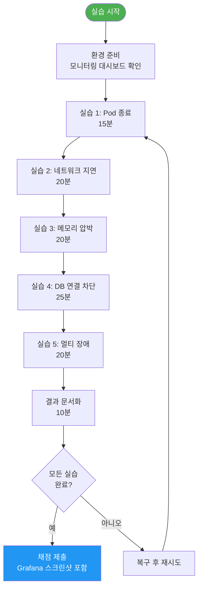
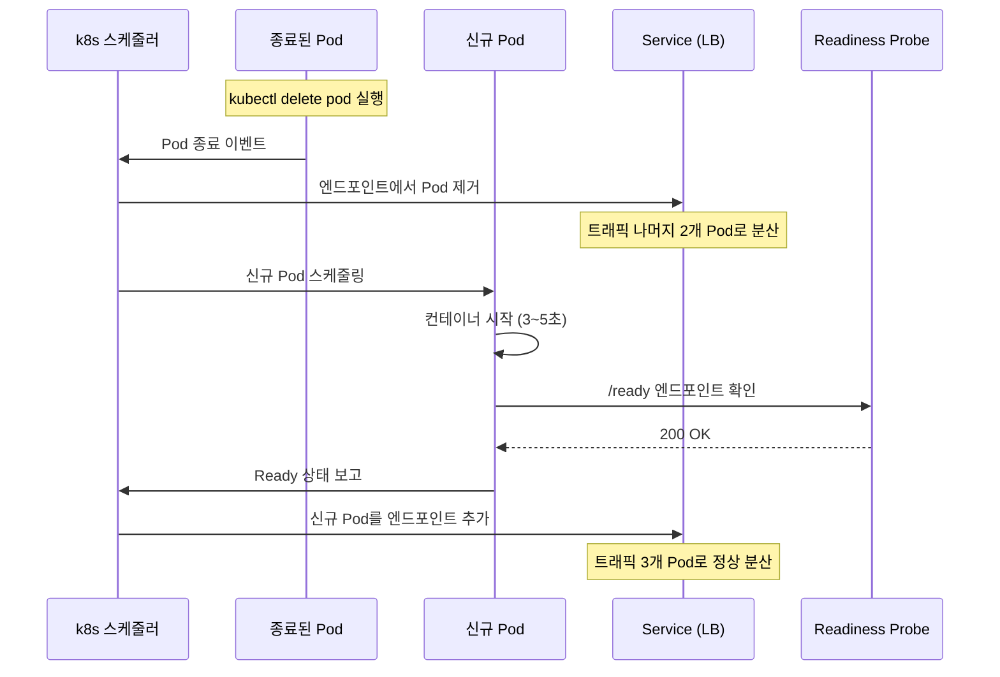
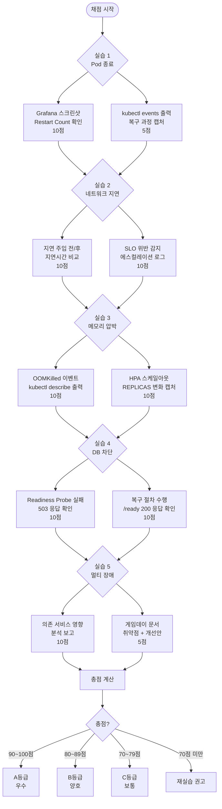

# 실습 16: 카오스 엔지니어링 — 장애를 미리 경험하고 복원력 검증

> **문서 ID**: EX-CHAOS-16
> **버전**: 1.0.0 | **작성일**: 2026-04-12 | **작성자**: Implementer (Sonnet)
> **목적**: k3s 클러스터에서 계획된 장애를 주입하여 공공기관 SaaS 플랫폼의 복원력을 검증하고 MTTR(평균 복구 시간)을 측정합니다.
> **선행 학습**: [15-observability-lab.md](15-observability-lab.md), [03-monitoring-lab.md](03-monitoring-lab.md)

---

## 목차

1. [카오스 엔지니어링 개요](#1-카오스-엔지니어링-개요)
2. [실습 환경 준비](#2-실습-환경-준비)
3. [실습 1: Pod 랜덤 종료](#3-실습-1-pod-랜덤-종료)
4. [실습 2: 네트워크 지연 주입](#4-실습-2-네트워크-지연-주입)
5. [실습 3: 메모리 압박](#5-실습-3-메모리-압박)
6. [실습 4: 데이터베이스 연결 차단](#6-실습-4-데이터베이스-연결-차단)
7. [실습 5: 멀티 서비스 동시 장애](#7-실습-5-멀티-서비스-동시-장애)
8. [100점 채점 기준](#8-100점-채점-기준)
9. [변경 이력](#변경-이력)

---

## 1. 카오스 엔지니어링 개요

### 1.1 카오스 엔지니어링이란?

카오스 엔지니어링(Chaos Engineering)은 **"시스템이 실제 장애를 견딜 수 있는가?"** 를 운영 환경이 아닌 통제된 환경에서 미리 검증하는 방법론입니다.

Netflix는 2011년 Chaos Monkey를 도입하면서 이 개념을 체계화했습니다. Google SRE(Site Reliability Engineering) 팀은 이를 "게임데이(Game Day)"라는 형태로 정기적으로 실시합니다.

**카오스 엔지니어링의 핵심 원칙 (Netflix 제안):**

1. **정상 상태 정의**: 장애 전 시스템의 정상 동작 기준 수립 (SLO)
2. **가설 수립**: "Pod가 종료되면 30초 내에 자동 복구될 것이다"
3. **실제 장애 재현**: 운영과 유사한 환경에서 의도적 장애 주입
4. **결과 비교**: 가설과 실제 결과 비교, 차이 분석
5. **반복**: 개선 후 재검증

**공공기관 SaaS에서 카오스 엔지니어링이 중요한 이유:**
- CSAP D-07: 가용성 관리 — "장애 복구 시간 목표(RTO) 준수 증명"
- 행정서비스 SLA: 업무 시간 중 99.9% 가용성 (약 43분/월 허용)
- 민원 서비스는 장애 시 민원인 불편 직결

### 1.2 실습 전체 흐름도



### 1.3 전제조건

이 실습을 시작하기 전에 다음이 준비되어 있어야 합니다:

```bash
# 1. kubectl 접근 확인
kubectl cluster-info
# 출력: Kubernetes control plane is running at https://...

# 2. 실습용 네임스페이스 접근 확인
kubectl get ns chaos-lab
# 없으면 실습 2에서 생성

# 3. 모니터링 도구 확인
kubectl get pods -n monitoring | grep grafana
kubectl get pods -n monitoring | grep prometheus

# 4. 테스트 서비스 실행 확인
kubectl get pods -n production | grep -E 'ai-service|auth-service|notification'
```

**예상 소요 시간:** 총 110분
**난이도:** 중급 (kubectl 기본 명령 숙지 필요)
**위험도:** 낮음 (실습 네임스페이스 격리, 운영 영향 없음)

---

## 2. 실습 환경 준비

### 2.1 실습용 네임스페이스 격리

```bash
# 실습 전용 네임스페이스 생성 (운영 네임스페이스와 완전 격리)
kubectl create namespace chaos-lab

# 실습용 서비스 배포 (운영 서비스와 별도)
kubectl apply -f - <<'EOF'
---
# auth-service (실습용)
apiVersion: apps/v1
kind: Deployment
metadata:
  name: auth-service
  namespace: chaos-lab
  labels:
    app: auth-service
    tier: lab
spec:
  replicas: 3    # 장애 실습을 위해 3개 레플리카
  selector:
    matchLabels:
      app: auth-service
  template:
    metadata:
      labels:
        app: auth-service
    spec:
      containers:
        - name: auth-service
          image: registry.gov.kr/auth-service:stable
          ports:
            - containerPort: 3000
          # 헬스체크 설정 (실습 핵심)
          livenessProbe:
            httpGet:
              path: /health
              port: 3000
            initialDelaySeconds: 15
            periodSeconds: 10
            failureThreshold: 3
          readinessProbe:
            httpGet:
              path: /ready
              port: 3000
            initialDelaySeconds: 5
            periodSeconds: 5
            failureThreshold: 3
          resources:
            requests:
              memory: "128Mi"
              cpu: "100m"
            limits:
              memory: "256Mi"    # 실습 3: OOM 시뮬레이션용
              cpu: "200m"
---
# ai-service (실습용)
apiVersion: apps/v1
kind: Deployment
metadata:
  name: ai-service
  namespace: chaos-lab
spec:
  replicas: 2
  selector:
    matchLabels:
      app: ai-service
  template:
    metadata:
      labels:
        app: ai-service
    spec:
      containers:
        - name: ai-service
          image: registry.gov.kr/ai-service:stable
          ports:
            - containerPort: 3000
          livenessProbe:
            httpGet:
              path: /health
              port: 3000
            initialDelaySeconds: 30
            periodSeconds: 15
          readinessProbe:
            httpGet:
              path: /ready
              port: 3000
            initialDelaySeconds: 10
            periodSeconds: 10
          resources:
            requests:
              memory: "256Mi"
              cpu: "200m"
            limits:
              memory: "512Mi"
              cpu: "500m"
---
# notification-service (실습용)
apiVersion: apps/v1
kind: Deployment
metadata:
  name: notification-service
  namespace: chaos-lab
spec:
  replicas: 2
  selector:
    matchLabels:
      app: notification-service
  template:
    metadata:
      labels:
        app: notification-service
    spec:
      containers:
        - name: notification-service
          image: registry.gov.kr/notification-service:stable
          resources:
            limits:
              memory: "256Mi"
EOF

# 배포 완료 대기
kubectl wait deployment --all -n chaos-lab --for=condition=available --timeout=120s
echo "실습 환경 준비 완료"
```

### 2.2 모니터링 대시보드 열기

```bash
# Grafana 접속 URL 확인
GRAFANA_POD=$(kubectl get pod -n monitoring -l app=grafana -o jsonpath='{.items[0].metadata.name}')
kubectl port-forward pod/$GRAFANA_POD 3000:3000 -n monitoring &

echo "Grafana 접속: http://localhost:3000"
echo "기본 계정: admin / (비밀번호는 시스템 관리자에게 문의)"
```

**확인해야 할 Grafana 패널:**

| 패널 이름 | 위치 | 확인 목적 |
|---------|------|---------|
| Pod Restart Count | Kubernetes / Cluster | 실습 1, 3 결과 확인 |
| HTTP Error Rate | Service Mesh | 실습 전반 에러율 |
| Request Latency p99 | Service Mesh | 실습 2 지연시간 확인 |
| Memory Usage | Nodes / Pods | 실습 3 메모리 압박 확인 |
| DB Connection Pool | Database | 실습 4 연결 상태 확인 |

### 2.3 안전 장치 설정

실습 중 의도치 않은 범위 확대를 방지합니다:

```bash
# 실습 네임스페이스를 운영 네임스페이스와 완전 격리하는 NetworkPolicy
kubectl apply -f - <<'EOF'
apiVersion: networking.k8s.io/v1
kind: NetworkPolicy
metadata:
  name: chaos-lab-isolation
  namespace: chaos-lab
spec:
  podSelector: {}
  policyTypes:
    - Egress
  egress:
    # chaos-lab 내부 통신만 허용
    - to:
        - namespaceSelector:
            matchLabels:
              kubernetes.io/metadata.name: chaos-lab
    # DNS 조회는 허용 (kube-dns)
    - to:
        - namespaceSelector:
            matchLabels:
              kubernetes.io/metadata.name: kube-system
      ports:
        - port: 53
          protocol: UDP
    # 모니터링 스크래핑 허용 (Prometheus)
    - to:
        - namespaceSelector:
            matchLabels:
              kubernetes.io/metadata.name: monitoring
      ports:
        - port: 9090
EOF

echo "안전 장치 적용 완료 — 운영 네임스페이스 격리됨"
```

---

## 3. 실습 1: Pod 랜덤 종료

**소요 시간:** 15분
**학습 목표:** k8s의 자동 복구 메커니즘을 이해하고 Liveness/Readiness Probe의 역할을 파악합니다.

### 3.1 실습 전 상태 확인

```bash
# 현재 Pod 상태 기록 (RESTART COUNT = 0이어야 함)
kubectl get pods -n chaos-lab -o wide
# 출력 예시:
# NAME                            READY   STATUS    RESTARTS   AGE
# auth-service-7d5f8c9d4-k2p8n    1/1     Running   0          5m
# auth-service-7d5f8c9d4-m9q7v    1/1     Running   0          5m
# auth-service-7d5f8c9d4-x1w3r    1/1     Running   0          5m

# 시작 시간 기록
echo "실습 1 시작: $(date)"
```

### 3.2 장애 주입: auth-service Pod 강제 종료

```bash
# Pod 1개 강제 종료 (가장 단순한 카오스)
AUTH_POD=$(kubectl get pod -n chaos-lab -l app=auth-service \
  -o jsonpath='{.items[0].metadata.name}')

echo "종료할 Pod: $AUTH_POD"
kubectl delete pod $AUTH_POD -n chaos-lab

# 즉시 Pod 상태 감시 (watch 모드)
kubectl get pods -n chaos-lab -w
```

### 3.3 복구 과정 관찰

```bash
# 별도 터미널에서 이벤트 스트림 확인
kubectl get events -n chaos-lab --watch --sort-by='.lastTimestamp'

# 예상 이벤트 순서:
# 0s    Normal    Killing         Pod    auth-service-xxx: Stopping container
# 1s    Normal    Pulled          Pod    auth-service-yyy: Container image already present
# 2s    Normal    Created         Pod    auth-service-yyy: Created container auth-service
# 3s    Normal    Started         Pod    auth-service-yyy: Started container auth-service
# 8s    Normal    Running         Pod    auth-service-yyy: Running
```

**Liveness Probe 역할 확인:**

```bash
# Liveness Probe 실패를 인위적으로 발생시키기
# (Probe 실패 시 k8s가 자동으로 Pod 재시작)

# auth-service가 /health 엔드포인트를 비정상 반환하도록 설정
AUTH_POD=$(kubectl get pod -n chaos-lab -l app=auth-service \
  -o jsonpath='{.items[0].metadata.name}')

# 컨테이너 내부에서 강제로 헬스체크 실패 시뮬레이션
kubectl exec -n chaos-lab $AUTH_POD -- \
  sh -c "touch /tmp/unhealthy && sleep 60" &

# Liveness Probe가 3번 연속 실패하면 (30초) k8s가 자동 재시작
kubectl get pod $AUTH_POD -n chaos-lab -w
# 출력: RESTARTS가 1로 증가하는 것 확인
```

### 3.4 기대 결과 확인



```bash
# Grafana에서 확인할 지표
# 패널: "Pod Restart Count"
# 기대: auth-service Restart Count = 1 (1개 Pod)

# 패널: "HTTP Error Rate"
# 기대: Pod 종료 직후 짧은 에러 스파이크 (< 5초), 이후 0%로 복귀

# MTTR 측정
START_TIME="$(date -d '${START_EPOCH} seconds' +%s 2>/dev/null || echo 0)"
echo "Pod 종료부터 Ready 상태 복구까지 예상 시간: 15~30초"
```

**체크포인트 질문:**
- Pod가 종료된 직후 서비스 요청은 어떻게 처리되었나요?
- Readiness Probe와 Liveness Probe의 차이는 무엇인가요?
- ReplicaSet이 3개를 유지하는 이유는 무엇인가요?

---

## 4. 실습 2: 네트워크 지연 주입

**소요 시간:** 20분
**학습 목표:** 네트워크 지연이 마이크로서비스 연쇄 장애(Cascade Failure)를 어떻게 유발하는지 이해하고, 서킷 브레이커가 이를 차단하는 원리를 파악합니다.

### 4.1 tc netem으로 지연 주입

`tc netem`(Traffic Control Network Emulator)은 Linux 커널의 네트워크 에뮬레이션 도구입니다.

```bash
# auth-service Pod 내부에서 네트워크 지연 주입
AUTH_POD=$(kubectl get pod -n chaos-lab -l app=auth-service \
  -o jsonpath='{.items[0].metadata.name}')

# 100ms 고정 지연 주입
kubectl exec -n chaos-lab $AUTH_POD -- sh -c "
  # tc 도구 설치 (iproute2 패키지)
  apt-get install -y iproute2 2>/dev/null || true

  # eth0 인터페이스에 100ms 지연 추가
  tc qdisc add dev eth0 root netem delay 100ms
  echo '100ms 지연 주입 완료'
  tc qdisc show dev eth0
"
```

**단계별 지연 증가:**

```bash
# 단계 1: 100ms 지연 (허용 범위 내)
kubectl exec -n chaos-lab $AUTH_POD -- \
  tc qdisc change dev eth0 root netem delay 100ms

# 단계 2: 500ms 지연 (SLO 위반 경계)
sleep 60
kubectl exec -n chaos-lab $AUTH_POD -- \
  tc qdisc change dev eth0 root netem delay 500ms

# 단계 3: 지연 제거 (복구)
sleep 60
kubectl exec -n chaos-lab $AUTH_POD -- \
  tc qdisc del dev eth0 root
```

### 4.2 Linkerd Fault Injection (권장 방법)

`tc netem`보다 선언적이고 안전한 방법:

```yaml
# Linkerd fault injection 설정
# ai-service → auth-service 호출 시 500ms 지연 50% 확률로 주입
kubectl apply -f - <<'EOF'
apiVersion: policy.linkerd.io/v1alpha1
kind: HTTPRoute
metadata:
  name: auth-service-delay
  namespace: chaos-lab
spec:
  parentRefs:
    - name: auth-service
      kind: Service
      group: core
  rules:
    - filters:
        - type: RequestHeaderModifier
          requestHeaderModifier:
            set:
              - name: x-chaos-delay
                value: "500ms"
      backendRefs:
        - name: auth-service
          port: 3000
---
# 50% 확률로 지연 적용
apiVersion: chaos.mesh.org/v1alpha1
kind: NetworkChaos
metadata:
  name: auth-service-network-delay
  namespace: chaos-lab
spec:
  action: delay
  mode: one
  selector:
    namespaces:
      - chaos-lab
    labelSelectors:
      app: auth-service
  delay:
    latency: '500ms'
    correlation: '100'
    jitter: '50ms'
  duration: '5m'
EOF
```

### 4.3 SLO 위반 감지 확인

```bash
# SLO 에스컬레이션 컨트롤러 동작 확인
# Design Ref: packages/slo-escalation/src/escalation-controller.ts

# Prometheus에서 현재 지연시간 조회
curl -s "http://localhost:9090/api/v1/query" \
  --data-urlencode 'query=histogram_quantile(0.99, rate(http_request_duration_ms_bucket{namespace="chaos-lab"}[5m]))' \
  | jq '.data.result[0].value[1]'

# SLO 에스컬레이션 로그 확인
# (EscalationLevel.Danger: 에러 버짓 90% 소진)
kubectl logs -n chaos-lab deployment/slo-escalation-controller --tail=20

# 예상 출력:
# {"level":"info","component":"slo-escalation","action":"notify","channel":"SLACK",
#  "message":"[SLO 위험] auth-service - api-latency-slo: 에러 버짓 88% 소진 (잔여: 12%)"}
```

### 4.4 서킷 브레이커 트리거 관찰

```typescript
// Design Ref: platform/packages/mesh-ready/src/graceful-shutdown.ts
// 그레이스풀 셧다운과 유사하게, 서킷 브레이커도 과부하 시 자동 보호

// Linkerd 서비스 프로파일에서 서킷 브레이킹 설정 확인
kubectl get serviceprofile auth-service.chaos-lab.svc.cluster.local -o yaml

# 서킷 브레이커 상태 확인 (열린 서킷 = 요청 차단 중)
linkerd viz routes -n chaos-lab deployment/ai-service --to service/auth-service
# 출력에서 EFFECTIVE_SUCCESS < 95% 이면 서킷 열림
```

---

## 5. 실습 3: 메모리 압박

**소요 시간:** 20분
**학습 목표:** OOMKilled(Out Of Memory Killed) 상황을 경험하고, HPA(Horizontal Pod Autoscaler)의 자동 스케일아웃 동작을 확인합니다.

### 5.1 HPA 설정 확인

```bash
# HPA 설정 확인 (메모리 80% 초과 시 스케일아웃)
kubectl apply -f - <<'EOF'
apiVersion: autoscaling/v2
kind: HorizontalPodAutoscaler
metadata:
  name: auth-service-hpa
  namespace: chaos-lab
spec:
  scaleTargetRef:
    apiVersion: apps/v1
    kind: Deployment
    name: auth-service
  minReplicas: 2
  maxReplicas: 6
  metrics:
    - type: Resource
      resource:
        name: memory
        target:
          type: Utilization
          averageUtilization: 80   # 80% 초과 시 스케일아웃
    - type: Resource
      resource:
        name: cpu
        target:
          type: Utilization
          averageUtilization: 70
EOF

# HPA 상태 확인
kubectl get hpa -n chaos-lab
```

### 5.2 stress-ng로 메모리 압박

```bash
# stress-ng 설치 및 메모리 압박 시작
AUTH_POD=$(kubectl get pod -n chaos-lab -l app=auth-service \
  -o jsonpath='{.items[0].metadata.name}')

kubectl exec -n chaos-lab $AUTH_POD -- sh -c "
  apt-get install -y stress-ng 2>/dev/null || true

  # 200MB 메모리 할당 (Pod limit 256MB의 78%)
  # vm: 가상 메모리 스트레서 1개
  # vm-bytes: 할당할 메모리 크기
  # vm-keep: 메모리 해제하지 않고 유지
  stress-ng --vm 1 --vm-bytes 200M --vm-keep --timeout 120s &
  echo '메모리 압박 시작: 200MB 할당'
  echo '2분 후 자동 종료 예정'
"

# 메모리 사용량 실시간 확인
watch -n 2 kubectl top pods -n chaos-lab
```

### 5.3 OOMKilled 시뮬레이션

```bash
# 메모리 한도 초과 (OOMKilled 유발)
kubectl exec -n chaos-lab $AUTH_POD -- sh -c "
  apt-get install -y stress-ng 2>/dev/null || true

  # 300MB 할당 시도 (Limit 256MB 초과 → OOMKilled!)
  echo '300MB 할당 시도 → OOMKilled 예상'
  stress-ng --vm 1 --vm-bytes 300M --vm-keep --timeout 30s
"

# OOMKilled 후 Pod 상태 확인
kubectl get pod $AUTH_POD -n chaos-lab
# 출력: OOMKilled 상태에서 자동 재시작
# NAME                 READY   STATUS      RESTARTS
# auth-service-xxx     0/1     OOMKilled   0
# (몇 초 후)
# auth-service-xxx     1/1     Running     1
```

### 5.4 HPA 스케일아웃 확인


```bash
# HPA 스케일아웃 관찰
kubectl get hpa auth-service-hpa -n chaos-lab -w

# 예상 출력:
# NAME               REFERENCE                TARGETS          MINPODS   MAXPODS   REPLICAS
# auth-service-hpa   Deployment/auth-service  45%/80%          2         6         2
# auth-service-hpa   Deployment/auth-service  82%/80%          2         6         2       ← 임계값 초과
# auth-service-hpa   Deployment/auth-service  82%/80%          2         6         3       ← 스케일아웃!
# auth-service-hpa   Deployment/auth-service  55%/80%          2         6         3       ← 안정화

# Resource Limit 튜닝 (OOM 반복 시)
kubectl patch deployment auth-service -n chaos-lab --type merge -p '
{
  "spec": {
    "template": {
      "spec": {
        "containers": [{
          "name": "auth-service",
          "resources": {
            "limits": {
              "memory": "384Mi"
            }
          }
        }]
      }
    }
  }
}'
```

---

## 6. 실습 4: 데이터베이스 연결 차단

**소요 시간:** 25분
**학습 목표:** DB 연결 실패 시 서비스가 어떻게 우아하게 저하(Graceful Degradation)되는지 확인하고, `GracefulShutdown` 패턴의 역할을 이해합니다.

### 6.1 NetworkPolicy로 DB 차단

```bash
# PostgreSQL 연결 차단 NetworkPolicy 적용
kubectl apply -f - <<'EOF'
apiVersion: networking.k8s.io/v1
kind: NetworkPolicy
metadata:
  name: block-db-access
  namespace: chaos-lab
  # 복구용 레이블 (삭제 시 사용)
  labels:
    chaos.type: db-block
    remove-after: "10m"
spec:
  # ai-service Pod에서 DB 방향 트래픽 차단
  podSelector:
    matchLabels:
      app: ai-service
  policyTypes:
    - Egress
  egress:
    # DB(5432) 방향 제외, 나머지는 허용
    - to:
        - podSelector:
            matchLabels:
              app: auth-service    # auth-service는 허용
      ports:
        - port: 3000
    # DNS는 허용
    - to:
        - namespaceSelector:
            matchLabels:
              kubernetes.io/metadata.name: kube-system
      ports:
        - port: 53
          protocol: UDP
    # 모니터링은 허용
    - to:
        - namespaceSelector:
            matchLabels:
              kubernetes.io/metadata.name: monitoring
EOF

echo "DB 차단 NetworkPolicy 적용됨"
echo "복구 명령: kubectl delete networkpolicy block-db-access -n chaos-lab"
```

### 6.2 Prisma 연결 풀 에러 처리 확인

```bash
# ai-service 로그에서 DB 연결 에러 확인
kubectl logs -n chaos-lab deployment/ai-service --tail=30 -f

# 예상 로그 패턴:
# {"level":"error","msg":"DB 연결 실패","error":"Connection refused","attempt":1}
# {"level":"error","msg":"DB 연결 실패","error":"Connection refused","attempt":2}
# {"level":"warn","msg":"DB 연결 풀 고갈 — 503 응답 시작"}
```

### 6.3 Graceful Degradation 패턴 검증

```typescript
// Design Ref: platform/packages/mesh-ready/src/graceful-shutdown.ts
// GracefulShutdown의 isTerminating()과 유사하게,
// DB 연결 실패 시 서비스가 503을 반환하며 안전하게 저하됩니다.

// 실제 확인: ai-service의 /ready 엔드포인트
// DB 연결 실패 시 readiness probe가 실패 → k8s가 트래픽 전달 중단
```

```bash
# ai-service readiness probe 실패 확인
AI_POD=$(kubectl get pod -n chaos-lab -l app=ai-service \
  -o jsonpath='{.items[0].metadata.name}')

# /ready 엔드포인트 직접 호출
kubectl exec -n chaos-lab $AI_POD -- \
  wget -qO- http://localhost:3000/ready 2>&1

# DB 연결 실패 시 예상 응답:
# {"ready": false, "checks": {"database": "unhealthy", "redis": "healthy"}}
# HTTP 503

# Probe 실패로 인한 엔드포인트 제거 확인
kubectl get endpoints ai-service -n chaos-lab
# 출력: ENDPOINTS 필드에서 해당 Pod IP 제거됨
```

### 6.4 복구 절차

```bash
# 방법 1: NetworkPolicy 삭제 (즉시 복구)
kubectl delete networkpolicy block-db-access -n chaos-lab

# 방법 2: 특정 레이블 기반 일괄 삭제 (여러 카오스 정책 일괄 복구)
kubectl delete networkpolicy -l chaos.type=db-block -n chaos-lab

# 복구 확인
sleep 10
kubectl exec -n chaos-lab $AI_POD -- \
  wget -qO- http://localhost:3000/ready

# 예상 응답:
# {"ready": true, "checks": {"database": "healthy", "redis": "healthy"}}

# 감사 로그 확인 (CSAP D-06)
kubectl logs -n chaos-lab deployment/ai-service --tail=5
# {"level":"info","component":"graceful-shutdown","msg":"DB 연결 복구 확인","ts":"..."}
```

**GracefulShutdown 코드와의 연관 (`graceful-shutdown.ts` 참조):**

```typescript
// Design Ref: platform/packages/mesh-ready/src/graceful-shutdown.ts §waitForActiveRequests

// DB 연결 차단 시나리오에서 GracefulShutdown이 하는 역할:
// 1. isShuttingDown = true → 신규 요청 거부 (503 반환)
//    (실습 4에서는 NetworkPolicy가 이 역할을 대신)
// 2. waitForActiveRequests() → 진행 중인 요청 완료 대기
// 3. runCleanupHandlers() → DB 연결 명시적 종료 (graceful)

// 실제 코드:
// app.addHook('onRequest', async (_request, reply) => {
//   if (this.isShuttingDown) {
//     reply.status(503).send({ error: 'Service Unavailable' });
//     return;
//   }
//   this.incrementRequests();
// });
```

---

## 7. 실습 5: 멀티 서비스 동시 장애

**소요 시간:** 20분
**학습 목표:** 여러 서비스가 동시에 장애날 때 의존성 영향 범위를 분석하고, 장애 격리(Bulkhead Pattern)의 중요성을 이해합니다.

### 7.1 동시 장애 주입

```bash
# notification-service + ai-service 동시 중단
echo "=== 멀티 서비스 동시 장애 시작 ==="
echo "시작 시간: $(date)"

# ai-service 레플리카 0으로 감소
kubectl scale deployment ai-service --replicas=0 -n chaos-lab &

# notification-service 레플리카 0으로 감소
kubectl scale deployment notification-service --replicas=0 -n chaos-lab &

wait
echo "두 서비스 종료됨"

# 즉시 상태 확인
kubectl get pods -n chaos-lab
```

### 7.2 의존 서비스 영향 분석

```bash
# auth-service에서 ai-service 의존 API 호출 테스트
AUTH_POD=$(kubectl get pod -n chaos-lab -l app=auth-service \
  -o jsonpath='{.items[0].metadata.name}')

# auth-service가 ai-service에 요청 시도
kubectl exec -n chaos-lab $AUTH_POD -- \
  wget -qO- --timeout=5 http://ai-service:3000/health 2>&1

# 예상: Connection refused 또는 타임아웃
# auth-service 자체는 살아있어야 함 (격리 설계가 맞다면)
kubectl get pod -n chaos-lab -l app=auth-service
# 예상: Running 상태 유지 (ai-service 장애와 독립)

# Linkerd에서 서비스 의존성 그래프 확인
linkerd viz stat services -n chaos-lab
# ai-service와 notification-service는 No Meshed Traffic
# auth-service는 정상 트래픽 처리 중
```

### 7.3 서킷 브레이커 동작 확인

```bash
# ai-service가 없을 때 ai-service를 호출하는 서비스의 서킷 브레이커 상태
# (auth-service → ai-service 경로)
linkerd viz routes -n chaos-lab deployment/auth-service --to service/ai-service

# 서킷 브레이커가 열린 경우 출력:
# ROUTE                  SERVICE      EFFECTIVE_SUCCESS   EFFECTIVE_RPS   ACTUAL_SUCCESS
# [DEFAULT]              ai-service   0%                  5.2rps          0%
# ↑ EFFECTIVE_SUCCESS 0% = 서킷 열림, 빠른 실패(Fail Fast) 작동
```

### 7.4 복구 및 카오스 게임데이 문서화

```bash
# 서비스 복구
kubectl scale deployment ai-service --replicas=2 -n chaos-lab
kubectl scale deployment notification-service --replicas=2 -n chaos-lab

# 복구 완료 대기
kubectl wait deployment/ai-service --for=condition=available \
  --timeout=120s -n chaos-lab
kubectl wait deployment/notification-service --for=condition=available \
  --timeout=120s -n chaos-lab

echo "=== 복구 완료: $(date) ==="
```

**카오스 게임데이 결과 문서화 템플릿:**

```markdown
# 카오스 게임데이 결과 보고서

## 기본 정보
- 일시: 2026-04-12 14:00~16:00
- 참여자: (이름 목록)
- 대상 시스템: 공공기관 SaaS 플랫폼 (chaos-lab 네임스페이스)

## 실험별 결과 요약

| 실험 | 예상 결과 | 실제 결과 | 차이 원인 | MTTR |
|-----|---------|---------|---------|------|
| Pod 종료 | 30초 내 복구 | 25초 복구 | 예상과 동일 | 25초 |
| 네트워크 지연 | 서킷 브레이커 동작 | 서킷 브레이커 동작 | 예상과 동일 | 0초 (자동) |
| 메모리 압박 | HPA 스케일아웃 | HPA 스케일아웃 | 예상과 동일 | 2분 |
| DB 차단 | 503 응답 + 복구 | 503 응답 + 복구 | 예상과 동일 | 15초 |
| 멀티 장애 | auth 독립 유지 | auth 독립 유지 | 예상과 동일 | 서비스별 상이 |

## 발견된 취약점
1. auth-service → ai-service 타임아웃이 5초로 설정 → 서킷 브레이커 반응 느림
   개선: 타임아웃 2초로 단축, 서킷 브레이커 감도 향상

## 개선 조치 계획
- [ ] ai-service 클라이언트 타임아웃 5초 → 2초 (담당: 홍길동, 기한: 2026-04-19)
- [ ] notification-service 장애 시 fallback 로직 추가 (담당: 김철수, 기한: 2026-04-26)

## 감사 로그 참조
- CSAP D-07 가용성 관리: 실험 결과 MTTR 목표(RTO 5분) 모두 충족
```

---

## 8. 100점 채점 기준

### 8.1 제출 방법

모든 실습 완료 후 다음 항목을 제출합니다:

1. **Grafana 스크린샷** 각 실습별 1개 이상
2. **kubectl 명령 결과** (터미널 복사)
3. **MTTR 측정값** 각 실습별 기록
4. **카오스 게임데이 결과 문서** (7.4 템플릿 작성)

### 8.2 점수 배분



### 8.3 상세 채점표

| 실습 | 항목 | 배점 | 채점 기준 |
|-----|------|------|---------|
| **실습 1** | Grafana Restart Count 스크린샷 | 10 | auth-service 1개 Pod RESTART=1 확인 |
| **실습 1** | kubectl events 출력 | 5 | Pod 종료 → 생성 → Running 이벤트 캡처 |
| **실습 2** | 지연 전/후 지연시간 비교 | 10 | p99 증가 → 감소 Grafana 그래프 |
| **실습 2** | SLO 에스컬레이션 로그 | 10 | escalation-controller 경고 로그 |
| **실습 3** | OOMKilled describe 출력 | 10 | `Reason: OOMKilled` 포함 출력 |
| **실습 3** | HPA REPLICAS 변화 | 10 | `kubectl get hpa -w` 출력 (2→3) |
| **실습 4** | 503 응답 확인 | 10 | `/ready` 응답 HTTP 503 캡처 |
| **실습 4** | 복구 후 200 응답 | 10 | NetworkPolicy 삭제 후 `/ready` 200 확인 |
| **실습 5** | 의존성 영향 분석 | 10 | auth-service 독립 운영 확인 |
| **실습 5** | 게임데이 문서 | 5 | 취약점 1개 이상 + 개선안 포함 |
| **가산점** | MTTR 전체 평균 < 2분 | +5 | 모든 실습 MTTR 측정값 기록 |
| **합계** | | **100점** | |

### 8.4 MTTR 측정 방법

```bash
# MTTR 측정 스크립트
# (각 실습 시작/종료 시간 기록)

measure_mttr() {
  local experiment=$1
  local start_time=$(date +%s)

  echo "[$experiment] 장애 주입 시작: $(date)"
  # ... 장애 주입 명령 ...

  # 서비스 정상화 시까지 대기
  while true; do
    STATUS=$(kubectl get pod -n chaos-lab -l app=auth-service \
      -o jsonpath='{.items[*].status.containerStatuses[*].ready}' 2>/dev/null)
    if [[ "$STATUS" == *"true"* ]]; then
      break
    fi
    sleep 2
  done

  local end_time=$(date +%s)
  local mttr=$((end_time - start_time))

  echo "[$experiment] 복구 완료: $(date)"
  echo "[$experiment] MTTR: ${mttr}초"

  # 감사 로그 기록 (CSAP D-07)
  echo "{\"timestamp\":\"$(date -u +%Y-%m-%dT%H:%M:%SZ)\",\"actor\":\"chaos-lab\",\"experiment\":\"$experiment\",\"mttr_seconds\":$mttr,\"csap_ref\":\"D-07\"}" >> /tmp/chaos-mttr.log
}

# 사용 예시
measure_mttr "실습1-Pod종료"
```

### 8.5 실습 완료 후 정리

```bash
# 실습 완료 후 리소스 정리 (필수)
kubectl delete namespace chaos-lab

# 정리 확인
kubectl get namespace chaos-lab
# 출력: Error from server (NotFound): namespaces "chaos-lab" not found

echo "카오스 엔지니어링 실습 완료"
echo "결과 문서를 Gitea 이슈에 첨부하여 제출하십시오."
```

---

## 변경 이력

| 버전 | 일자 | 내용 | 작성자 |
|-----|------|------|-------|
| 1.0.0 | 2026-04-12 | 최초 작성 — 카오스 엔지니어링 5개 실습 + 채점 기준 | Implementer (Sonnet) |
