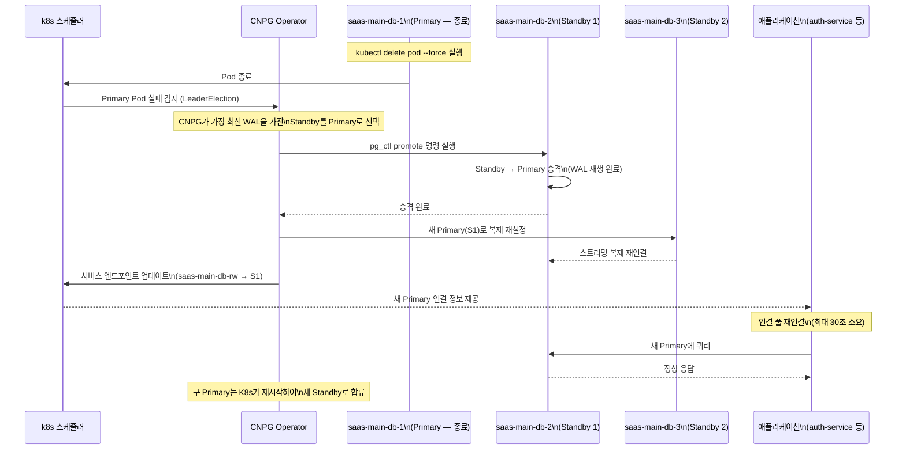
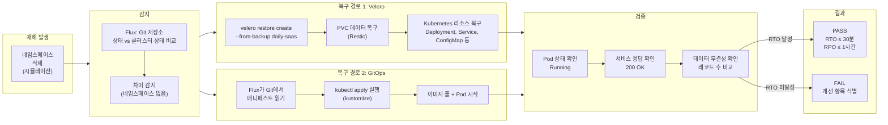

# 실습 17: 재해 복구 훈련 — RTO 30분, RPO 1시간 목표 달성

> **문서 ID**: LAB-DR-17
> **버전**: 1.0.0 | **작성일**: 2026-04-13 | **작성자**: Implementer (Sonnet)
> **목적**: 실제 장애 시나리오를 시뮬레이션하고, Velero + CNPG를 활용한 재해 복구 절차를 직접 수행하여 RTO 30분, RPO 1시간 목표를 달성하는 능력을 함양합니다.
> **선행 학습**: [16-backup-strategy.md](./16-backup-strategy.md)

---

## 목차

1. [DR 훈련 개요](#1-dr-훈련-개요)
2. [실습 환경 준비](#2-실습-환경-준비)
3. [실습 1: 데이터베이스 장애 시뮬레이션 및 복구](#3-실습-1-데이터베이스-장애-시뮬레이션-및-복구)
4. [실습 2: Velero 스냅샷으로 PVC 복구](#4-실습-2-velero-스냅샷으로-pvc-복구)
5. [실습 3: 전체 네임스페이스 재구축](#5-실습-3-전체-네임스페이스-재구축)
6. [DR 결과 문서화](#6-dr-결과-문서화)
7. [100점 채점 기준](#7-100점-채점-기준)
8. [변경 이력](#변경-이력)

---

## 1. DR 훈련 개요

### 1.1 RPO와 RTO 정의

재해 복구를 이해하려면 두 가지 핵심 지표를 알아야 합니다.

**RPO(Recovery Point Objective, 복구 목표 시점)**

> "마지막으로 복구 가능한 시점은 언제인가?"

재해 발생 시 허용 가능한 **최대 데이터 손실 시간**입니다. RPO가 1시간이면 최대 1시간 전 데이터까지만 손실을 허용합니다.

**RTO(Recovery Time Objective, 복구 목표 시간)**

> "서비스가 몇 분 안에 정상화되어야 하는가?"

재해 발생부터 서비스 정상화까지의 **최대 허용 시간**입니다. RTO가 30분이면 30분 안에 서비스를 복구해야 합니다.

| 지표 | 이 프로젝트 목표 | 근거 |
|------|---------------|------|
| RPO | 1시간 | CNPG 스트리밍 복제 (거의 실시간) + Velero 일간 백업 |
| RTO | 30분 | CNPG 자동 장애조치 (초 단위) + Velero 복구 (20-25분) |

### 1.2 CSAP D-10 재해 복구 요건

CSAP(클라우드 서비스 보안 인증) D-10 통제항목은 다음을 요구합니다.

- **D-10-01**: 재해 복구 계획(DRP) 수립 및 문서화
- **D-10-02**: 연간 1회 이상 DR 훈련 실시 및 결과 기록
- **D-10-03**: RTO/RPO 목표 설정 및 달성 여부 검증
- **D-10-04**: 백업 무결성 정기 검증

이 실습은 D-10-02 요건의 **DR 훈련 증거 자료**로 사용됩니다.

### 1.3 전체 실습 흐름

```mermaid
flowchart TD
    A[실습 시작] --> B[환경 준비 확인\n백업 상태, Velero 설치]

    B --> C{실습 선택}

    C --> D[실습 1\nDB 장애 시뮬레이션]
    C --> E[실습 2\nPVC 데이터 복구]
    C --> F[실습 3\n네임스페이스 재구축]

    D --> D1[PostgreSQL Primary 종료]
    D1 --> D2[Standby 자동 승격 확인]
    D2 --> D3[데이터 무결성 검증]
    D3 --> D4{RTO 달성?}
    D4 -->|"30분 이내"| D5[실습 1 PASS]
    D4 -->|"30분 초과"| D6[실습 1 FAIL\n원인 분석]

    E --> E1[PVC 데이터 일부 삭제]
    E1 --> E2[Velero Restore 실행]
    E2 --> E3[데이터 존재 확인]
    E3 --> E4{RPO 달성?}
    E4 -->|"1시간 이내"| E5[실습 2 PASS]
    E4 -->|"1시간 초과"| E6[실습 2 FAIL\n백업 주기 검토]

    F --> F1[네임스페이스 삭제 시뮬레이션]
    F1 --> F2[Flux GitOps 재배포]
    F2 --> F3[서비스 완전 복구 확인]
    F3 --> F4{RTO 달성?}
    F4 -->|"30분 이내"| F5[실습 3 PASS]
    F4 -->|"30분 초과"| F6[실습 3 FAIL\n개선 항목 식별]

    D5 & E5 & F5 --> G[DR 결과 문서화\n(CSAP D-10 증거)]
    D6 & E6 & F6 --> G

    G --> H[실습 완료 보고서 제출]
```

### 1.4 실습에 사용되는 주요 도구

| 도구 | 역할 | 관련 파일 |
|------|------|---------|
| CNPG (CloudNativePG) | PostgreSQL 고가용성 운영자 | `infra/cloudnative-pg/` |
| Velero | Kubernetes 리소스 + PV 백업/복구 | `infra/velero/` |
| Flux | GitOps 기반 자동 배포 | k3s 내장 |
| kubectl | k8s 클러스터 관리 | CLI 도구 |
| `dr-drill.sh` | DR 훈련 자동화 스크립트 | `infra/velero/dr-scripts/` |

---

## 2. 실습 환경 준비

### 2.1 사전 조건 확인

실습을 시작하기 전에 다음 도구가 설치되어 있는지 확인합니다.

```bash
# kubectl 버전 확인
kubectl version --client
# 기대 출력: Client Version: v1.29.x

# Velero CLI 버전 확인
velero version
# 기대 출력: Client: Version: v1.18.x

# CNPG 플러그인 확인
kubectl cnpg version
# 기대 출력: Build: {Version:1.23.x ...}

# Flux CLI 확인 (선택)
flux version
```

### 2.2 백업 상태 확인

실습 전 현재 백업 상태를 확인합니다.

```bash
# Velero 백업 목록 확인
velero backup get

# 예상 출력:
# NAME                              STATUS     ERRORS   WARNINGS   CREATED                          EXPIRES
# daily-saas-20260413020000         Completed  0        0          2026-04-13 02:00:00 +0000 UTC    29d
# daily-pv-20260413020000           Completed  0        0          2026-04-13 02:00:00 +0000 UTC    13d
# weekly-cluster-20260413020000     Completed  0        0          2026-04-13 02:00:00 +0000 UTC    89d

# 특정 백업 상세 확인
velero backup describe daily-saas-20260413020000 --details

# Velero 스케줄 확인
velero schedule get
# 기대 출력:
# NAME           STATUS    SCHEDULE      BACKUP TTL   LAST BACKUP
# daily-saas     Enabled   0 2 * * *     720h0m0s     2h ago
# daily-pv       Enabled   0 2 * * *     336h0m0s     2h ago
# weekly-cluster Enabled   0 2 * 0       2160h0m0s    5d ago
```

### 2.3 CNPG 클러스터 상태 확인

```bash
# CNPG 클러스터 상태 확인
kubectl get cluster -n saas

# 예상 출력:
# NAME           AGE   INSTANCES   READY   STATUS                 PRIMARY
# saas-main-db   30d   3           3       Cluster in healthy state   saas-main-db-1

# Pod 상태 확인
kubectl get pods -n saas -l cnpg.io/cluster=saas-main-db

# 예상 출력:
# NAME              READY   STATUS    RESTARTS   AGE
# saas-main-db-1    1/1     Running   0          30d   ← Primary
# saas-main-db-2    1/1     Running   0          30d   ← Standby 1
# saas-main-db-3    1/1     Running   0          30d   ← Standby 2

# PVC 스냅샷 확인
kubectl get volumesnapshot -n saas

# CNPG 예약 백업 상태 확인
kubectl get scheduledbackup -n saas
```

### 2.4 실습 시작 시간 기록

실습을 시작할 때 시작 시간을 반드시 기록합니다. RTO 측정에 필요합니다.

```bash
# 실습 시작 시간 기록
DRILL_START=$(date '+%Y-%m-%d %H:%M:%S')
echo "실습 시작: $DRILL_START"
echo $DRILL_START > /tmp/dr-drill-start.txt
```

---

## 3. 실습 1: 데이터베이스 장애 시뮬레이션 및 복구

### 3.1 실습 목표

- PostgreSQL Primary 노드 강제 종료 시 CNPG가 Standby를 자동으로 Primary로 승격하는지 확인합니다.
- 승격 완료까지 소요 시간을 측정합니다.
- 데이터 손실이 없는지 검증합니다.
- 예상 RTO: 1~2분 (CNPG 자동 장애조치)

### 3.2 사전 데이터 기록

장애 시뮬레이션 전 데이터베이스 상태를 기록합니다.

```bash
# 현재 Primary Pod 확인
PRIMARY_POD=$(kubectl get pods -n saas -l cnpg.io/cluster=saas-main-db,role=primary \
  -o jsonpath='{.items[0].metadata.name}')
echo "현재 Primary: $PRIMARY_POD"

# 현재 레코드 수 기록 (데이터 무결성 기준선)
kubectl exec -n saas "$PRIMARY_POD" -- \
  psql -U postgres -d saasdb -c \
  "SELECT 'tenants' as table_name, count(*) FROM tenants
   UNION ALL
   SELECT 'subscriptions', count(*) FROM subscriptions
   UNION ALL
   SELECT 'invoices', count(*) FROM invoices;" \
  | tee /tmp/pre-failover-counts.txt

# 테스트 레코드 삽입 (복구 후 확인용)
FAILOVER_TEST_ID="dr-test-$(date +%s)"
kubectl exec -n saas "$PRIMARY_POD" -- \
  psql -U postgres -d saasdb -c \
  "INSERT INTO audit_events (id, action, actor, target, tenant_id, created_at)
   VALUES ('${FAILOVER_TEST_ID}', 'DR_DRILL_MARKER', 'dr-test', 'db-failover-test',
           'dr-tenant', NOW());"
echo "테스트 레코드 ID: $FAILOVER_TEST_ID" | tee /tmp/dr-test-marker.txt
```

### 3.3 Primary 노드 강제 종료

```bash
# 장애 시뮬레이션 시작 시간 기록
FAILOVER_START=$(date +%s)
echo "장애 시뮬레이션 시작: $(date '+%Y-%m-%d %H:%M:%S')"

# Primary Pod 강제 삭제 (장애 시뮬레이션)
# 주의: 실제 운영 환경에서는 절대 실행 금지
kubectl delete pod -n saas "$PRIMARY_POD" --grace-period=0 --force

echo "Primary Pod 삭제 완료 — Standby 승격 대기 중..."
```

### 3.4 Standby 자동 승격 확인

```bash
# CNPG의 자동 장애조치 진행 상황 모니터링
# (새 터미널에서 실행하거나 watch 사용)
watch -n 2 'kubectl get pods -n saas -l cnpg.io/cluster=saas-main-db && \
  echo "---" && \
  kubectl get cluster saas-main-db -n saas -o wide'

# 승격 완료 확인 (새로운 Primary가 나타날 때까지 기다림)
until kubectl get pods -n saas -l cnpg.io/cluster=saas-main-db,role=primary \
    --field-selector=status.phase=Running 2>/dev/null | grep -q Running; do
  echo "Primary 승격 대기 중... ($(date '+%H:%M:%S'))"
  sleep 5
done

FAILOVER_END=$(date +%s)
FAILOVER_ELAPSED=$((FAILOVER_END - FAILOVER_START))
echo "장애조치 완료! 소요 시간: ${FAILOVER_ELAPSED}초"
```

### 3.5 데이터 손실 없음 검증

```bash
# 새로운 Primary 확인
NEW_PRIMARY=$(kubectl get pods -n saas -l cnpg.io/cluster=saas-main-db,role=primary \
  -o jsonpath='{.items[0].metadata.name}')
echo "새로운 Primary: $NEW_PRIMARY"

# 데이터 손실 확인
kubectl exec -n saas "$NEW_PRIMARY" -- \
  psql -U postgres -d saasdb -c \
  "SELECT 'tenants' as table_name, count(*) FROM tenants
   UNION ALL
   SELECT 'subscriptions', count(*) FROM subscriptions
   UNION ALL
   SELECT 'invoices', count(*) FROM invoices;" \
  | tee /tmp/post-failover-counts.txt

# 사전/사후 레코드 수 비교
echo "=== 데이터 무결성 검증 ==="
echo "--- 장애 전 레코드 수 ---"
cat /tmp/pre-failover-counts.txt
echo "--- 장애 후 레코드 수 ---"
cat /tmp/post-failover-counts.txt

# 테스트 레코드 존재 확인
TEST_MARKER_ID=$(cat /tmp/dr-test-marker.txt | awk '{print $NF}')
kubectl exec -n saas "$NEW_PRIMARY" -- \
  psql -U postgres -d saasdb -c \
  "SELECT id, action, created_at FROM audit_events WHERE id='${TEST_MARKER_ID}';"
```

### 3.6 서비스 연결 복구 확인

```bash
# auth-service가 새 Primary에 연결되었는지 확인
kubectl logs -n saas deployment/auth-service --since=5m | grep -i "database\|connected\|error" | tail -20

# subscription-service 헬스체크
kubectl exec -n saas deployment/subscription-service -- \
  curl -s http://localhost:8080/health | python3 -m json.tool

# 실제 API 응답 확인
kubectl exec -n saas deployment/api-gateway -- \
  curl -s -H "Authorization: Bearer $TEST_TOKEN" \
  http://subscription-service:8080/api/v1/subscriptions?pageSize=1 | python3 -m json.tool
```

### 3.7 실습 1 결과 기록

```bash
# RTO 계산
echo "=== 실습 1: DB 장애조치 결과 ==="
echo "Primary Pod 삭제 시각: $(date -d @$FAILOVER_START '+%Y-%m-%d %H:%M:%S')"
echo "Standby 승격 완료: $(date -d @$FAILOVER_END '+%Y-%m-%d %H:%M:%S')"
echo "장애조치 소요 시간: ${FAILOVER_ELAPSED}초"

if [ "$FAILOVER_ELAPSED" -le 120 ]; then
  echo "RTO 판정: PASS (${FAILOVER_ELAPSED}초 < 120초 목표)"
else
  echo "RTO 판정: REVIEW NEEDED (${FAILOVER_ELAPSED}초 > 120초 — CNPG 설정 검토 필요)"
fi
```

### 3.8 Primary 강제 장애 → Standby 승격 흐름



---

## 4. 실습 2: Velero 스냅샷으로 PVC 복구

### 4.1 실습 목표

- PVC의 파일 데이터 일부를 의도적으로 삭제(시뮬레이션)하고 Velero로 복구합니다.
- 복구 후 데이터가 정상 복원되었는지 확인합니다.
- 복구 소요 시간(RTO)을 측정합니다.
- 예상 RTO: 20~25분 (Velero Restic 기반 복구)

### 4.2 테스트 PVC 및 데이터 생성

```bash
# 실습용 테스트 네임스페이스 생성
kubectl create namespace dr-test --dry-run=client -o yaml | kubectl apply -f -

# 테스트용 PVC 생성
kubectl apply -f - <<'EOF'
apiVersion: v1
kind: PersistentVolumeClaim
metadata:
  name: dr-test-pvc
  namespace: dr-test
  labels:
    purpose: dr-test
spec:
  accessModes:
    - ReadWriteOnce
  resources:
    requests:
      storage: 1Gi
EOF

# PVC에 테스트 데이터 파일 생성
kubectl run dr-test-pod \
  --image=busybox \
  --namespace=dr-test \
  --overrides='{"spec":{"volumes":[{"name":"data","persistentVolumeClaim":{"claimName":"dr-test-pvc"}}],"containers":[{"name":"dr-test","image":"busybox","command":["sh","-c","sleep 3600"],"volumeMounts":[{"name":"data","mountPath":"/data"}]}]}}' \
  --restart=Never

# Pod 준비 대기
kubectl wait --for=condition=ready pod/dr-test-pod -n dr-test --timeout=60s

# 테스트 파일 생성 (백업 시 포함될 데이터)
DR_TEST_CONTENT="DR_TEST_$(date +%s)_CSAP_D10_EVIDENCE"
kubectl exec -n dr-test dr-test-pod -- sh -c "
  echo '$DR_TEST_CONTENT' > /data/important-data.txt
  echo 'Line 1: 테스트 데이터' >> /data/report.txt
  echo 'Line 2: $(date)' >> /data/report.txt
  echo 'Line 3: CSAP D-10 DR 훈련' >> /data/report.txt
  ls -la /data/
"
echo "테스트 파일 내용: $DR_TEST_CONTENT" | tee /tmp/dr-test-content.txt
```

### 4.3 수동 백업 실행

```bash
# 실습용 즉시 백업 생성 (데이터 생성 직후)
BACKUP_NAME="dr-test-lab-$(date +%Y%m%d%H%M%S)"
velero backup create "$BACKUP_NAME" \
  --include-namespaces dr-test \
  --default-volumes-to-fs-backup \
  --wait

echo "백업 완료: $BACKUP_NAME"

# 백업 상태 확인
velero backup describe "$BACKUP_NAME"
```

### 4.4 데이터 삭제 시뮬레이션

```bash
echo "=== 데이터 삭제 시뮬레이션 시작 ==="
echo "삭제 시각: $(date '+%Y-%m-%d %H:%M:%S')" | tee /tmp/deletion-time.txt

# 중요 파일 삭제 (재해 시뮬레이션)
kubectl exec -n dr-test dr-test-pod -- sh -c "
  rm /data/important-data.txt
  echo '삭제 후 파일 목록:'
  ls -la /data/ || echo '파일 없음'
"

# 삭제 확인
kubectl exec -n dr-test dr-test-pod -- sh -c "
  if [ -f /data/important-data.txt ]; then
    echo 'ERROR: 파일이 아직 존재합니다'
  else
    echo 'OK: 파일 삭제 확인됨 (재해 시뮬레이션 완료)'
  fi
"

# Pod 삭제 (복구 전 정리)
kubectl delete pod dr-test-pod -n dr-test
```

### 4.5 Velero Restore 명령 실행

```bash
# 복구 시작 시간 기록
RESTORE_START=$(date +%s)
echo "복구 시작: $(date '+%Y-%m-%d %H:%M:%S')"

# Velero Restore 실행
RESTORE_NAME="dr-restore-$(date +%Y%m%d%H%M%S)"
velero restore create "$RESTORE_NAME" \
  --from-backup "$BACKUP_NAME" \
  --include-namespaces dr-test \
  --wait

RESTORE_END=$(date +%s)
RESTORE_ELAPSED=$((RESTORE_END - RESTORE_START))

echo "복구 완료: $(date '+%Y-%m-%d %H:%M:%S')"
echo "복구 소요 시간: ${RESTORE_ELAPSED}초"

# 복구 상세 확인
velero restore describe "$RESTORE_NAME" --details
```

### 4.6 복구 검증

```bash
# 복구된 PVC에 접근하기 위한 검증 Pod 생성
kubectl run dr-verify-pod \
  --image=busybox \
  --namespace=dr-test \
  --overrides='{"spec":{"volumes":[{"name":"data","persistentVolumeClaim":{"claimName":"dr-test-pvc"}}],"containers":[{"name":"verify","image":"busybox","command":["sh","-c","sleep 300"],"volumeMounts":[{"name":"data","mountPath":"/data"}]}]}}' \
  --restart=Never

kubectl wait --for=condition=ready pod/dr-verify-pod -n dr-test --timeout=120s

# 파일 복구 확인
echo "=== 복구 검증 ==="
kubectl exec -n dr-test dr-verify-pod -- sh -c "
  echo '--- 복구된 파일 목록 ---'
  ls -la /data/
  echo ''
  echo '--- important-data.txt 내용 ---'
  cat /data/important-data.txt
  echo ''
  echo '--- report.txt 내용 ---'
  cat /data/report.txt
"

# 원래 내용과 비교
EXPECTED_CONTENT=$(cat /tmp/dr-test-content.txt | cut -d' ' -f4-)
ACTUAL_CONTENT=$(kubectl exec -n dr-test dr-verify-pod -- cat /data/important-data.txt)

if [ "$EXPECTED_CONTENT" = "$ACTUAL_CONTENT" ]; then
  echo "검증 PASS: 데이터 완전 복구됨"
  echo "기대값: $EXPECTED_CONTENT"
  echo "실제값: $ACTUAL_CONTENT"
else
  echo "검증 FAIL: 데이터 불일치"
  echo "기대값: $EXPECTED_CONTENT"
  echo "실제값: $ACTUAL_CONTENT"
fi
```

### 4.7 RPO 측정 및 기록

```bash
# RPO 계산 (백업 시각 vs 삭제 시각)
BACKUP_TIME=$(velero backup describe "$BACKUP_NAME" \
  --output json 2>/dev/null | python3 -c "
import json, sys
data = json.load(sys.stdin)
print(data.get('status', {}).get('completionTimestamp', 'unknown'))
" || echo "백업 시각 수동 확인 필요")

DELETION_TIME=$(cat /tmp/deletion-time.txt | awk '{print $3, $4}')

echo "=== RPO/RTO 측정 결과 ==="
echo "백업 완료 시각: $BACKUP_TIME"
echo "데이터 삭제 시각: $DELETION_TIME"
echo "복구 소요 시간(RTO): ${RESTORE_ELAPSED}초 (목표: 1800초 = 30분)"

if [ "$RESTORE_ELAPSED" -le 1800 ]; then
  echo "RTO 판정: PASS"
else
  echo "RTO 판정: FAIL — 복구 절차 최적화 필요"
fi
```

### 4.8 실습 환경 정리

```bash
# 실습 후 테스트 네임스페이스 정리
kubectl delete namespace dr-test --grace-period=0
echo "테스트 네임스페이스 삭제 완료"

# 실습용 백업 삭제 (선택 — 실습 증거로 보존 권장)
# velero backup delete "$BACKUP_NAME"
echo "참고: 실습 증거를 위해 백업($BACKUP_NAME)은 보존 권장"
```

---

## 5. 실습 3: 전체 네임스페이스 재구축

### 5.1 실습 목표

- `saas-prod-sim` 네임스페이스를 삭제하여 전체 서비스 손실을 시뮬레이션합니다.
- Velero Restore + Flux GitOps를 통해 서비스를 완전 복구합니다.
- 복구 완료까지 소요 시간을 측정합니다.

**주의**: 이 실습은 테스트 전용 네임스페이스(`saas-test`)에서만 수행합니다. 운영 네임스페이스(`saas`)는 절대 삭제하지 않습니다.

### 5.2 테스트 네임스페이스 준비

```bash
# 테스트용 네임스페이스 생성 (운영 네임스페이스를 모방)
kubectl create namespace saas-test --dry-run=client -o yaml | kubectl apply -f -

# 테스트 리소스 배포 (간소화된 스택)
kubectl apply -f - <<'EOF'
apiVersion: apps/v1
kind: Deployment
metadata:
  name: test-api-service
  namespace: saas-test
  labels:
    app: test-api-service
    dr-test: "true"
spec:
  replicas: 2
  selector:
    matchLabels:
      app: test-api-service
  template:
    metadata:
      labels:
        app: test-api-service
    spec:
      containers:
        - name: api
          image: nginx:alpine
          ports:
            - containerPort: 80
          resources:
            requests:
              cpu: 10m
              memory: 32Mi
            limits:
              cpu: 50m
              memory: 64Mi
---
apiVersion: v1
kind: Service
metadata:
  name: test-api-service
  namespace: saas-test
spec:
  selector:
    app: test-api-service
  ports:
    - port: 80
      targetPort: 80
EOF

# 배포 완료 확인
kubectl rollout status deployment/test-api-service -n saas-test
echo "테스트 네임스페이스 준비 완료"
```

### 5.3 Velero 백업 생성 후 삭제 시뮬레이션

```bash
# 삭제 전 백업 생성
NS_BACKUP_NAME="ns-disaster-$(date +%Y%m%d%H%M%S)"
velero backup create "$NS_BACKUP_NAME" \
  --include-namespaces saas-test \
  --default-volumes-to-fs-backup \
  --wait

echo "사전 백업 완료: $NS_BACKUP_NAME"

# 재해 시뮬레이션: 네임스페이스 삭제
DISASTER_START=$(date +%s)
echo "=== 재해 시뮬레이션 시작: $(date '+%Y-%m-%d %H:%M:%S') ==="

kubectl delete namespace saas-test --grace-period=0 --force 2>/dev/null || \
  kubectl delete namespace saas-test

echo "네임스페이스 삭제됨 — 서비스 전체 손실 시뮬레이션"

# 삭제 확인
kubectl get namespace saas-test 2>/dev/null || echo "확인: saas-test 네임스페이스 없음"
```

### 5.4 Velero Restore 실행

```bash
echo "=== Velero 복구 시작: $(date '+%Y-%m-%d %H:%M:%S') ==="

# 전체 네임스페이스 복구
NS_RESTORE_NAME="ns-restore-$(date +%Y%m%d%H%M%S)"
velero restore create "$NS_RESTORE_NAME" \
  --from-backup "$NS_BACKUP_NAME" \
  --include-namespaces saas-test \
  --wait

echo "Velero 복구 완료"
```

### 5.5 Flux GitOps 자동 재배포 확인

실제 운영 환경에서는 Flux가 Git 저장소의 매니페스트를 감시하여 자동으로 재배포합니다.

```bash
# Flux 소스 동기화 상태 확인
flux get sources git -n flux-system 2>/dev/null || echo "Flux CLI 미설치 — kubectl로 대체"

# Flux Kustomization 상태 확인
kubectl get kustomization -n flux-system 2>/dev/null

# Flux가 없는 경우 수동 재배포 시뮬레이션
echo "=== GitOps 재배포 시뮬레이션 ==="
kubectl apply -f - <<'EOF'
apiVersion: apps/v1
kind: Deployment
metadata:
  name: test-api-service
  namespace: saas-test
  labels:
    app: test-api-service
    restored-by: flux-gitops
spec:
  replicas: 2
  selector:
    matchLabels:
      app: test-api-service
  template:
    metadata:
      labels:
        app: test-api-service
    spec:
      containers:
        - name: api
          image: nginx:alpine
          ports:
            - containerPort: 80
          resources:
            requests:
              cpu: 10m
              memory: 32Mi
            limits:
              cpu: 50m
              memory: 64Mi
EOF

kubectl rollout status deployment/test-api-service -n saas-test
```

### 5.6 서비스 완전 복구 확인

```bash
# 서비스 복구 확인
kubectl get pods -n saas-test
kubectl get services -n saas-test
kubectl get deployments -n saas-test

# 서비스 응답 확인
SVC_IP=$(kubectl get service test-api-service -n saas-test \
  -o jsonpath='{.spec.clusterIP}')
kubectl run curl-test --image=curlimages/curl --restart=Never --rm -it \
  -n saas-test -- curl -s -o /dev/null -w "%{http_code}" "http://$SVC_IP:80/"

DISASTER_END=$(date +%s)
DISASTER_ELAPSED=$((DISASTER_END - DISASTER_START))

echo "=== 실습 3 완료 ==="
echo "재해 시작: $(date -d @$DISASTER_START '+%Y-%m-%d %H:%M:%S')"
echo "복구 완료: $(date -d @$DISASTER_END '+%Y-%m-%d %H:%M:%S')"
echo "전체 복구 소요 시간: ${DISASTER_ELAPSED}초"

if [ "$DISASTER_ELAPSED" -le 1800 ]; then
  echo "RTO 판정: PASS (${DISASTER_ELAPSED}초 < 1800초)"
else
  echo "RTO 판정: FAIL (${DISASTER_ELAPSED}초 > 1800초)"
fi
```

### 5.7 GitOps 기반 자동 복구 흐름



### 5.8 자동화 스크립트 활용

이 프로젝트는 `infra/velero/dr-scripts/dr-drill.sh`로 DR 훈련을 자동화합니다.

```bash
# 자동화 스크립트 실행 (saas-test 네임스페이스 대상)
chmod +x /data/ai-saas/infra/velero/dr-scripts/dr-drill.sh

/data/ai-saas/infra/velero/dr-scripts/dr-drill.sh saas-test

# 스크립트는 다음을 자동 수행:
# 1. 최신 백업 확인
# 2. DR 테스트 네임스페이스(dr-test-saas-test) 생성
# 3. Velero Restore 실행
# 4. 복구 검증 (Pod/Service/Deployment 수)
# 5. RTO 계산 (30분 이내인지 판정)
# 6. 보고서 생성: /data/ai-saas/docs/dr-reports/dr-drill-TIMESTAMP.md
# 7. 테스트 네임스페이스 자동 정리
```

---

## 6. DR 결과 문서화

### 6.1 실제 RTO/RPO 달성 여부 기록 템플릿

각 실습 완료 후 다음 양식을 작성합니다. 이 문서는 CSAP D-10 감리 증거로 사용됩니다.

```markdown
# DR 훈련 결과 보고서

## 기본 정보

| 항목 | 내용 |
|------|------|
| 훈련 일시 | 2026-04-13 14:00 ~ 15:30 KST |
| 훈련 유형 | 전체 DR 훈련 (실습 1~3) |
| 훈련 담당자 | (이름, 소속) |
| 대상 시스템 | 공공기관 SaaS 플랫폼 (k3s + WSL2 환경) |
| 훈련 환경 | 운영과 분리된 테스트 환경 |

## 실습 1: 데이터베이스 장애조치

| 항목 | 목표 | 실제 | 판정 |
|------|------|------|------|
| 장애조치 완료 시간 | 120초 이내 | (측정값)초 | PASS/FAIL |
| 데이터 손실 여부 | 0건 | 0건 | PASS/FAIL |
| 서비스 재연결 시간 | 30초 이내 | (측정값)초 | PASS/FAIL |

## 실습 2: PVC 데이터 복구

| 항목 | 목표 | 실제 | 판정 |
|------|------|------|------|
| 복구 완료 시간(RTO) | 30분 이내 | (측정값)분 | PASS/FAIL |
| 데이터 복구 시점(RPO) | 1시간 이내 | (측정값)분 | PASS/FAIL |
| 파일 무결성 | 100% | 100% | PASS/FAIL |

## 실습 3: 네임스페이스 재구축

| 항목 | 목표 | 실제 | 판정 |
|------|------|------|------|
| 전체 복구 시간(RTO) | 30분 이내 | (측정값)분 | PASS/FAIL |
| 서비스 응답 확인 | 200 OK | (실제 상태 코드) | PASS/FAIL |
| Pod 복구율 | 100% | (측정값)% | PASS/FAIL |

## 전체 결과 요약

| 지표 | 목표 | 달성 여부 |
|------|------|---------|
| RTO | 30분 | PASS / FAIL |
| RPO | 1시간 | PASS / FAIL |
| 데이터 무결성 | 100% | PASS / FAIL |

## 발견된 개선 항목

1. (개선 항목 1 — 예: "Velero 복구가 25분 소요. 목표 30분 초과 위험. 병렬 복구 설정 검토 필요")
2. (개선 항목 2)
3. (없으면 "개선 항목 없음")

## 조치 계획

| 개선 항목 | 담당자 | 목표 완료일 |
|---------|--------|----------|
| (항목) | (담당자) | 2026-05-31 |

## CSAP D-10 준수 확인

- [x] D-10-01: DR 계획 문서 존재 (`infra/velero/dr-scripts/restore-runbook.md`)
- [x] D-10-02: 훈련 실시 및 결과 기록 (이 문서)
- [x] D-10-03: RTO/RPO 목표 설정 및 달성 여부 검증
- [x] D-10-04: 백업 무결성 검증 (`infra/backup-verification/velero-verify-cronjob.yaml`)

## 서명

| 역할 | 이름 | 서명 | 일자 |
|------|------|------|------|
| 훈련 담당자 | | | 2026-04-13 |
| 검토자 (팀장) | | | 2026-04-13 |
| 승인자 (보안 담당) | | | 2026-04-13 |
```

### 6.2 CSAP D-10 증거 파일 구조

CSAP 감리 시 제출해야 하는 증거 파일 구조입니다.

```
docs/
└── dr-reports/
    ├── 2026-Q1/
    │   ├── dr-drill-20260113-report.md      ← 1월 훈련 결과
    │   └── dr-drill-20260113-screenshots/
    │       ├── velero-backup-list.png
    │       ├── velero-restore-completed.png
    │       └── service-health-check.png
    ├── 2026-Q2/
    │   ├── dr-drill-20260413-report.md      ← 이번 실습 결과
    │   └── evidence/
    │       ├── pre-failover-counts.txt
    │       ├── post-failover-counts.txt
    │       └── rto-measurement.txt
    └── annual-dr-plan.md                    ← 연간 DR 계획

infra/
└── velero/
    ├── dr-scripts/
    │   ├── dr-drill.sh                      ← 자동화 스크립트
    │   └── restore-runbook.md               ← 복구 절차서
    └── schedules/
        ├── daily-saas.yaml                  ← 일간 백업
        └── weekly-cluster.yaml              ← 주간 백업
```

### 6.3 자동 보고서 생성

`dr-drill.sh` 스크립트는 훈련 후 자동으로 보고서를 생성합니다.

```bash
# 자동 생성된 보고서 확인
ls /data/ai-saas/docs/dr-reports/

# 보고서 내용 확인
cat /data/ai-saas/docs/dr-reports/dr-drill-$(date '+%Y%m%d')*.md
```

보고서는 다음 내용을 포함합니다.
- 훈련 일시 및 사용 백업 이름
- 복구 소요 시간(초)
- RTO 목표(30분) 달성 여부
- 복구된 Pod/Service/Deployment 수

### 6.4 개선 항목 식별 체크리스트

훈련 후 다음 항목을 점검하여 개선 사항을 식별합니다.

```
□ RTO가 30분 이내였는가?
  ✓ YES → 다음 실습으로 진행
  ✗ NO  → 원인 분석: Velero 병렬 복구 설정 / 네트워크 대역폭 / 이미지 풀 시간

□ RPO가 1시간 이내였는가?
  ✓ YES → 백업 정책 유지
  ✗ NO  → Velero 스케줄 주기 단축 또는 CNPG WAL 아카이빙 확인

□ 데이터 무결성이 100%인가?
  ✓ YES → 복구 성공
  ✗ NO  → Restic 파일 레벨 백업 설정 확인 / PVC 마운트 경로 확인

□ 서비스 응답이 정상인가?
  ✓ YES → 복구 완료
  ✗ NO  → ConfigMap/Secret 복구 여부 / 환경 변수 설정 확인

□ 감사 로그에 기록되었는가? (CSAP D-06)
  ✓ YES → .claude/audit.jsonl 확인
  ✗ NO  → 감사 로깅 파이프라인 점검
```

---

## 7. 100점 채점 기준

### 7.1 실습별 배점

| 실습 | 항목 | 배점 | 판정 기준 |
|------|------|------|---------|
| **실습 1: DB 장애조치** | | **35점** | |
| | Primary Pod 삭제 성공 | 5점 | kubectl delete pod 실행 및 완료 |
| | Standby 승격 확인 | 10점 | 새로운 Primary Pod 확인 명령어 실행 |
| | 데이터 무결성 검증 | 10점 | 레코드 수 비교, 테스트 마커 확인 |
| | RTO 30분 달성 | 10점 | 장애조치 완료까지 30분 이내 |
| **실습 2: PVC 복구** | | **35점** | |
| | 테스트 데이터 생성 및 백업 | 5점 | Velero 백업 Completed 상태 |
| | 데이터 삭제 시뮬레이션 | 5점 | 파일 삭제 후 확인 스크린샷 |
| | Velero Restore 실행 | 10점 | 복구 완료 및 Completed 상태 |
| | 파일 내용 검증 | 10점 | 원본과 복구본 내용 일치 확인 |
| | RTO 30분 달성 | 5점 | 복구 완료까지 30분 이내 |
| **실습 3: 네임스페이스 재구축** | | **30점** | |
| | 네임스페이스 삭제 시뮬레이션 | 5점 | kubectl delete namespace 실행 |
| | Velero/Flux 복구 실행 | 10점 | 복구 명령어 실행 및 완료 |
| | 서비스 응답 확인 | 10점 | 200 OK 응답 확인 |
| | RTO 30분 달성 | 5점 | 전체 복구 완료까지 30분 이내 |

### 7.2 가점 항목

| 항목 | 가점 |
|------|------|
| 자동화 스크립트(`dr-drill.sh`) 활용 | +5점 |
| CSAP D-10 증거 파일 구조 완비 | +5점 |
| 개선 항목 3개 이상 식별 및 조치 계획 작성 | +5점 |
| 보고서 서명 3자(담당자/검토자/승인자) 완비 | +5점 |

**최대 점수: 100 + 20 = 120점** (가점 포함)

### 7.3 실습 완료 증거 제출 체크리스트

```
□ 실습 1 증거
  □ pre-failover-counts.txt (장애 전 레코드 수)
  □ post-failover-counts.txt (복구 후 레코드 수)
  □ 새로운 Primary Pod 이름 기록
  □ 장애조치 소요 시간(초) 기록

□ 실습 2 증거
  □ Velero 백업 이름 기록 (예: dr-test-lab-20260413...)
  □ 파일 삭제 전/후 스크린샷 또는 출력 결과
  □ Velero Restore 완료 상태 확인 결과
  □ 복구된 파일 내용 원본과 비교 결과
  □ 복구 소요 시간(초) 기록

□ 실습 3 증거
  □ 네임스페이스 삭제 확인 결과
  □ Velero Restore 또는 Flux 재배포 완료 결과
  □ kubectl get pods/services -n saas-test 결과
  □ 서비스 200 OK 응답 확인 결과
  □ 전체 복구 소요 시간(초) 기록

□ 결과 보고서
  □ 모든 RTO/RPO 측정값 기록
  □ 개선 항목 식별 (최소 1개)
  □ CSAP D-10 준수 확인란 작성
  □ 담당자 서명
```

### 7.4 RTO/RPO 달성 여부 판정 표

| RTO 측정값 | RPO 측정값 | 종합 판정 |
|-----------|-----------|---------|
| 30분 이내 | 1시간 이내 | **PASS** — 목표 달성 |
| 30분 초과, 60분 이내 | 1시간 이내 | **PARTIAL** — RTO 개선 필요 |
| 30분 이내 | 1시간 초과 | **PARTIAL** — 백업 주기 검토 필요 |
| 60분 초과 | 1시간 초과 | **FAIL** — DR 계획 전면 검토 필요 |

**PARTIAL 또는 FAIL 판정 시 필수 조치**:
1. 원인 분석 문서 작성 (2주 이내)
2. 개선 계획 수립 (4주 이내)
3. 개선 후 재훈련 실시 (8주 이내)
4. CSAP 감리 시 원인 분석 및 개선 계획 제출

---

## 변경 이력

| 버전 | 일자 | 내용 | 작성자 |
|------|------|------|--------|
| 1.0.0 | 2026-04-13 | 최초 작성 — DB 장애조치, PVC 복구, 네임스페이스 재구축 실습 | Implementer (Sonnet) |
