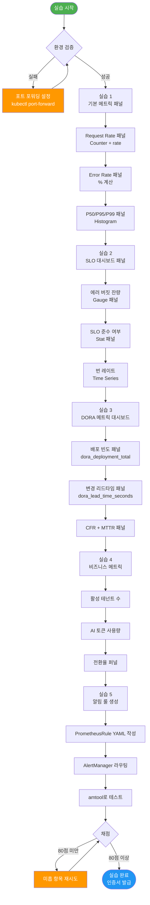
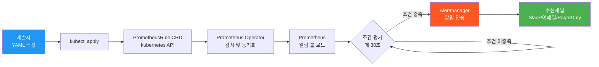
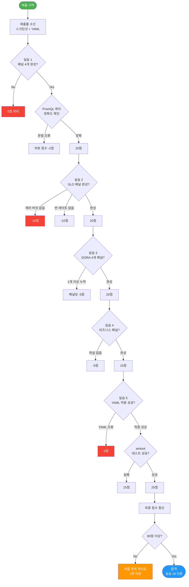

# 실습 18: 모니터링 대시보드 구축 — Grafana 패널 처음부터 끝까지

> **문서 ID**: EX-MON-18
> **버전**: 1.0.0 | **작성일**: 2026-04-13 | **작성자**: Implementer (Sonnet)
> **목적**: 공공기관 SaaS 플랫폼의 골든 시그널 대시보드를 Grafana에서 직접 구축하는 실전 실습
> **선행 학습**: [실습 15 — 관찰가능성 기초](./15-observability-lab.md), [실습 03 — 모니터링 입문](./03-monitoring-lab.md)

---

## 목차

1. [실습 개요](#1-실습-개요)
2. [실습 1: 기본 메트릭 패널 구축](#2-실습-1-기본-메트릭-패널-구축)
3. [실습 2: SLO 대시보드 패널](#3-실습-2-slo-대시보드-패널)
4. [실습 3: DORA 메트릭 대시보드](#4-실습-3-dora-메트릭-대시보드)
5. [실습 4: 비즈니스 메트릭 패널](#5-실습-4-비즈니스-메트릭-패널)
6. [실습 5: 알림 룰 직접 생성](#6-실습-5-알림-룰-직접-생성)
7. [100점 채점 기준](#7-100점-채점-기준)
8. [변경 이력](#변경-이력)

---

## 1. 실습 개요

### 1.1 학습 목표

이 실습을 완료하면 다음을 할 수 있습니다.

- Grafana에서 골든 시그널(요청 속도, 오류율, 레이턴시, 포화도) 패널을 직접 구축합니다.
- PromQL 쿼리를 작성하여 SLO 에러 버짓 잔량을 실시간 시각화합니다.
- `packages/dora-exporter`가 노출하는 DORA 4대 지표를 대시보드로 표현합니다.
- 비즈니스 메트릭(활성 테넌트, AI 토큰 사용량)을 시계열로 추적합니다.
- PrometheusRule YAML을 직접 작성하여 AlertManager와 연동합니다.

### 1.2 실습 환경 전제조건

| 항목 | 요건 | 확인 방법 |
|------|------|-----------|
| Grafana 접근 | `http://grafana.monitoring.svc:3000` 응답 | `curl -s http://grafana.monitoring.svc:3000/api/health` |
| Prometheus 동작 | `/api/v1/query` 응답 200 | `curl -s http://prometheus.monitoring.svc:9090/-/healthy` |
| DORA Exporter | `/metrics` 엔드포인트 정상 | `curl -s http://dora-exporter:9170/healthz` |
| k3s 클러스터 | 네임스페이스 `monitoring` 존재 | `kubectl get ns monitoring` |
| 편집 권한 | Grafana Editor 역할 이상 | Grafana UI 좌측 메뉴에 `+` 버튼 표시 여부 확인 |

전제조건 확인 스크립트:

```bash
#!/bin/bash
# 실습 전 환경 검증 스크립트
set -euo pipefail

echo "=== 실습 18 환경 검증 ==="

# Grafana 헬스체크
if curl -sf http://grafana.monitoring.svc:3000/api/health > /dev/null; then
  echo "[OK] Grafana 정상"
else
  echo "[FAIL] Grafana 접근 불가 — kubectl port-forward svc/grafana 3000:3000 -n monitoring 실행"
  exit 1
fi

# Prometheus 헬스체크
if curl -sf http://prometheus.monitoring.svc:9090/-/healthy > /dev/null; then
  echo "[OK] Prometheus 정상"
else
  echo "[FAIL] Prometheus 접근 불가"
  exit 1
fi

# DORA Exporter 헬스체크
if curl -sf http://dora-exporter:9170/healthz > /dev/null; then
  echo "[OK] DORA Exporter 정상"
else
  echo "[WARN] DORA Exporter 응답 없음 — 실습 3은 시뮬레이션 데이터로 진행"
fi

echo "=== 검증 완료 ==="
```

### 1.3 실습 전체 흐름 다이어그램



### 1.4 골든 시그널이란

구글 SRE Book에서 정의한 4가지 핵심 관찰 지표입니다. 공공기관 SaaS에서는 CSAP 운영 보안(D-10) 요건으로도 적용됩니다.

| 시그널 | 설명 | PromQL 패턴 | 임계값 예시 |
|--------|------|-------------|------------|
| Latency (레이턴시) | 요청 처리 시간 | `histogram_quantile(0.99, ...)` | P99 < 500ms |
| Traffic (트래픽) | 초당 요청 수 (RPS) | `rate(http_requests_total[5m])` | 용량 계획 기준 |
| Errors (오류) | 오류 요청 비율 | `rate(...{status=~"5.."}[5m])` | < 0.1% (SLO) |
| Saturation (포화도) | 자원 사용률 | `container_memory_usage_bytes` | CPU < 80% |

---

## 2. 실습 1: 기본 메트릭 패널 구축

### 2.1 대시보드 생성

Grafana UI에서 다음 순서로 새 대시보드를 생성합니다.

```
좌측 메뉴 → Dashboards → New → New Dashboard
→ Add visualization → Prometheus 데이터소스 선택
```

대시보드 설정(우측 상단 톱니바퀴):

```json
{
  "title": "공공SaaS 골든 시그널 — 실습 18",
  "uid": "ex18-golden-signals",
  "refresh": "30s",
  "time": { "from": "now-1h", "to": "now" },
  "tags": ["exercise", "lab", "golden-signal"]
}
```

### 2.2 패널 1: Request Rate (요청 속도)

**개념 설명**: `http_requests_total`은 Prometheus Counter 타입 메트릭입니다. Counter는 단조 증가하므로, 초당 변화율을 구하려면 `rate()` 함수를 사용합니다. `[5m]`은 5분 범위 창(window)을 의미합니다.

**패널 설정:**

| 항목 | 값 |
|------|-----|
| 패널 유형 | Time series |
| 제목 | Request Rate (RPS) |
| 단위 | reqps (requests/sec) |
| 채우기 투명도 | 10 |

**PromQL 쿼리:**

```promql
# 전체 서비스 합산 요청 속도 (5분 평균)
sum(rate(http_requests_total{namespace="saas-platform"}[5m])) by (service)
```

쿼리 분해 설명:

```
sum(                                    -- 레이블별 합산
  rate(                                 -- 초당 변화율 계산
    http_requests_total{               -- Counter 메트릭
      namespace="saas-platform"        -- 우리 네임스페이스만 필터
    }[5m]                              -- 5분 슬라이딩 윈도우
  )
) by (service)                         -- service 레이블로 그룹화
```

**범례(Legend) 설정:**

```
Legend: {{service}}
```

**시각화 세부 설정:**

```
Graph styles:
  Line width: 2
  Fill opacity: 15
  Gradient mode: Opacity

Axis:
  Y-axis unit: reqps
  Y-axis minimum: 0

Thresholds:
  Green: 0 ~ 100 RPS (정상)
  Orange: 100 ~ 500 RPS (주의)
  Red: 500 RPS 초과 (위험)
```

패널 JSON 내보내기 예시 (검증용):

```json
{
  "type": "timeseries",
  "title": "Request Rate (RPS)",
  "targets": [
    {
      "expr": "sum(rate(http_requests_total{namespace=\"saas-platform\"}[5m])) by (service)",
      "legendFormat": "{{service}}",
      "refId": "A"
    }
  ],
  "fieldConfig": {
    "defaults": {
      "unit": "reqps",
      "min": 0,
      "color": { "mode": "palette-classic" }
    }
  }
}
```

### 2.3 패널 2: Error Rate (오류율)

**개념 설명**: HTTP 5xx 응답 비율을 전체 요청 대비 백분율로 표현합니다. 정규식 `~"5.."` 패턴으로 500~599 상태 코드를 모두 포함합니다.

**패널 설정:**

| 항목 | 값 |
|------|-----|
| 패널 유형 | Time series |
| 제목 | Error Rate (%) |
| 단위 | percent (0-100) |

**PromQL 쿼리:**

```promql
# 오류율 (5xx / 전체 요청 × 100)
100 * sum(
  rate(http_requests_total{namespace="saas-platform", status=~"5.."}[5m])
) by (service)
/
sum(
  rate(http_requests_total{namespace="saas-platform"}[5m])
) by (service)
```

**0으로 나누기 방어 쿼리 (권장):**

```promql
100 * (
  sum(rate(http_requests_total{namespace="saas-platform", status=~"5.."}[5m])) by (service)
  /
  (sum(rate(http_requests_total{namespace="saas-platform"}[5m])) by (service) > 0)
)
```

**임계값 색상 설정:**

```
Thresholds (단위: %, 높을수록 나쁨):
  Green  Base ~ 0.1%  (SLO 이내)
  Orange 0.1% ~ 1%    (SLO 위험)
  Red    1% 초과       (SLO 위반)
```

오류율 패널은 SLO 임계선을 함께 표시합니다.

```promql
# SLO 임계선 (0.1% 고정)
vector(0.1)
```

Legend Format: `SLO 한계 (0.1%)`

### 2.4 패널 3: 레이턴시 분위수 (P50 / P95 / P99)

**개념 설명**: `http_request_duration_seconds`는 Histogram 타입 메트릭입니다. Histogram은 버킷별 누적 카운트를 저장하며, `histogram_quantile()` 함수로 특정 분위수를 계산합니다.

Histogram 메트릭 구조:
```
http_request_duration_seconds_bucket{le="0.1"}  -- 0.1초 이하 요청 수
http_request_duration_seconds_bucket{le="0.5"}  -- 0.5초 이하 요청 수
http_request_duration_seconds_bucket{le="+Inf"} -- 전체 요청 수
http_request_duration_seconds_count            -- 총 요청 수
http_request_duration_seconds_sum              -- 총 처리 시간 합계
```

**패널 설정:**

| 항목 | 값 |
|------|-----|
| 패널 유형 | Time series |
| 제목 | Response Latency (P50 / P95 / P99) |
| 단위 | milliseconds (ms) |

**PromQL 쿼리 — 3개 타겟:**

```promql
# P50 (중앙값) — 타겟 A
histogram_quantile(
  0.50,
  sum(rate(http_request_duration_seconds_bucket{namespace="saas-platform"}[5m])) by (le, service)
) * 1000
```

```promql
# P95 — 타겟 B
histogram_quantile(
  0.95,
  sum(rate(http_request_duration_seconds_bucket{namespace="saas-platform"}[5m])) by (le, service)
) * 1000
```

```promql
# P99 — 타겟 C
histogram_quantile(
  0.99,
  sum(rate(http_request_duration_seconds_bucket{namespace="saas-platform"}[5m])) by (le, service)
) * 1000
```

`* 1000`: Prometheus는 초 단위로 저장, Grafana에서 ms 단위로 표시하기 위해 1000을 곱합니다.

**Legend Format:**

```
타겟 A: P50 {{service}}
타겟 B: P95 {{service}}
타겟 C: P99 {{service}}
```

**SLO 임계선 추가:**

```promql
# P99 SLO 한계 (500ms)
vector(500)
```

**색상 고정:**

```
P50: 파란색 (#1F60C4)
P95: 주황색 (#FF7800)
P99: 빨간색 (#E02F44)
SLO 선: 점선 빨간색
```

### 2.5 패널 4: 포화도 (CPU + 메모리)

**개념 설명**: 포화도는 시스템이 얼마나 꽉 찼는지를 나타냅니다. 공공기관 SaaS에서는 멀티테넌트 환경의 리소스 공정 할당(CSAP D-10)을 위해 반드시 추적해야 합니다.

```promql
# CPU 사용률 (%)
100 * (
  sum(rate(container_cpu_usage_seconds_total{namespace="saas-platform", container!=""}[5m])) by (pod)
  /
  sum(kube_pod_container_resource_requests{namespace="saas-platform", resource="cpu"}) by (pod)
)
```

```promql
# 메모리 사용률 (%)
100 * (
  sum(container_memory_working_set_bytes{namespace="saas-platform", container!=""}) by (pod)
  /
  sum(kube_pod_container_resource_requests{namespace="saas-platform", resource="memory"}) by (pod)
)
```

---

## 3. 실습 2: SLO 대시보드 패널

### 3.1 SLO 개념과 에러 버짓

**Service Level Objective (SLO)**는 서비스 신뢰성 목표치입니다. 공공기관 SaaS는 99.9% 가용성 SLO를 목표로 합니다.

에러 버짓 계산:
```
월간 에러 버짓 = (1 - SLO 목표) × 월간 총 분
               = (1 - 0.999) × 43,200분
               = 43.2분

에러 버짓 소진 = 실제 다운타임 / 43.2분 × 100%
```

새 대시보드 생성:

```
이름: 공공SaaS SLO 현황 — 실습 18
UID: ex18-slo-dashboard
```

### 3.2 패널 1: 에러 버짓 잔량 (Gauge 패널)

**Gauge 패널**은 현재 값을 반원형 게이지로 표현합니다. 에러 버짓 잔량을 직관적으로 보여주기에 적합합니다.

**패널 설정:**

| 항목 | 값 |
|------|-----|
| 패널 유형 | Gauge |
| 제목 | 에러 버짓 잔량 (이번 달) |
| 단위 | percent (0-100) |
| 최솟값 | 0 |
| 최댓값 | 100 |

**PromQL 쿼리:**

```promql
# 에러 버짓 잔량 (%)
# SLO 99.9% 기준, 30일 윈도우
100 * (
  1 - (
    sum(rate(http_requests_total{namespace="saas-platform", status=~"5.."}[30d]))
    /
    sum(rate(http_requests_total{namespace="saas-platform"}[30d]))
  ) / (1 - 0.999)
)
```

쿼리 분해:
```
분자: 실제 오류율
분모: 허용 오류율 (1 - SLO목표 = 0.001)
결과: 버짓 소진율
잔량: 100 - 소진율
```

**Gauge 임계값 설정:**

```
색상 기준 (잔량 기준으로 역방향):
  Red:    0 ~ 25%    (위험: 버짓 75% 이상 소진)
  Orange: 25 ~ 50%   (주의: 버짓 50~75% 소진)
  Green:  50 ~ 100%  (안전)
```

Gauge 내부에 현재 잔량 값을 숫자로 표시:

```
Value display: Auto
Text size — Value: 120%
```

### 3.3 패널 2: SLO 준수 여부 (Stat 패널)

**Stat 패널**은 단일 숫자를 크게 표시합니다. "지금 SLO를 충족하고 있는가"를 한눈에 보여줍니다.

**패널 설정:**

| 항목 | 값 |
|------|-----|
| 패널 유형 | Stat |
| 제목 | 현재 SLO 상태 |
| 단위 | 없음 (문자 표시) |

**PromQL 쿼리 (1h 윈도우):**

```promql
# 1시간 기준 오류율이 SLO 이내이면 1, 아니면 0
(
  sum(rate(http_requests_total{namespace="saas-platform", status=~"5.."}[1h]))
  /
  sum(rate(http_requests_total{namespace="saas-platform"}[1h]))
) < bool 0.001
```

**값 매핑 (Value Mappings):**

```
0 → "SLO 위반" (빨간 배경)
1 → "SLO 준수" (초록 배경)
```

설정 경로:

```
패널 편집 → Field → Value mappings → Add value mapping
  Value: 0 → Display text: SLO 위반 → Color: Red
  Value: 1 → Display text: SLO 준수 → Color: Green
```

### 3.4 패널 3: 번 레이트 (Burn Rate)

**번 레이트**는 에러 버짓을 소진하는 속도입니다. 번 레이트 1.0 = 에러 버짓을 SLO 기간 내 정확히 소진. 번 레이트 > 1.0 = 예정보다 빠르게 소진 중.

**개념:**
```
번 레이트 = 현재 오류율 / 허용 오류율
           = 현재 오류율 / (1 - SLO목표)

예: 현재 오류율 0.5%, SLO 99.9%
번 레이트 = 0.005 / 0.001 = 5.0
→ 예정보다 5배 빠르게 에러 버짓 소진 중
```

**PromQL 쿼리:**

```promql
# 1시간 번 레이트
(
  sum(rate(http_requests_total{namespace="saas-platform", status=~"5.."}[1h]))
  /
  sum(rate(http_requests_total{namespace="saas-platform"}[1h]))
) / (1 - 0.999)
```

```promql
# 6시간 번 레이트 (중간 경보용)
(
  sum(rate(http_requests_total{namespace="saas-platform", status=~"5.."}[6h]))
  /
  sum(rate(http_requests_total{namespace="saas-platform"}[6h]))
) / (1 - 0.999)
```

**패널 설정:**

| 항목 | 값 |
|------|-----|
| 패널 유형 | Time series |
| 제목 | 에러 번 레이트 |
| 단위 | 없음 (배수) |

**임계선 추가:**

```promql
# 경보 임계선 (번 레이트 14.4 = 1시간 내 월간 버짓 1% 소진)
vector(14.4)
```

```promql
# 경고 임계선 (번 레이트 6.0)
vector(6.0)
```

**임계값 색상:**

```
Green:  0 ~ 1.0  (정상)
Orange: 1.0 ~ 6.0  (경고)
Red:    6.0 초과    (위험 — 즉시 대응)
```

### 3.5 SLO 대시보드 레이아웃 배치

```
+------------------+------------------+
|  에러 버짓 잔량   |  현재 SLO 상태   |
|  (Gauge, 크게)   |  (Stat, 중간)    |
+------------------+------------------+
|         번 레이트 추이                |
|         (Time Series, 전체 너비)    |
+---------------------------------------+
|  1h 오류율  | 6h 오류율 | 24h 오류율 |
|   (Stat)   |   (Stat)  |   (Stat)   |
+---------------------------------------+
```

---

## 4. 실습 3: DORA 메트릭 대시보드

### 4.1 DORA 4대 지표 복습

`packages/dora-exporter/src/index.ts`에서 노출하는 Prometheus 메트릭을 활용합니다.

실제 코드에서 정의된 메트릭:

```typescript
// FR-DORA.1: 배포 빈도 카운터
const deploymentTotal = new Counter({
  name: 'dora_deployment_total',
  help: '배포 횟수 (DORA Deployment Frequency)',
  labelNames: ['team', 'service', 'environment'],
});

// FR-DORA.2: 변경 리드타임 히스토그램
const leadTimeSeconds = new Histogram({
  name: 'dora_lead_time_seconds',
  help: '변경 리드타임 - 첫 커밋에서 프로덕션 배포까지 (초)',
  labelNames: ['team', 'service'],
  buckets: [60, 300, 900, 1800, 3600, 7200, 14400, 28800, 86400, 604800],
});

// FR-DORA.3: 변경 실패율 게이지
const changeFailureRate = new Gauge({
  name: 'dora_change_failure_rate',
  help: '변경 실패율 (0.0 ~ 1.0)',
  labelNames: ['team', 'service'],
});

// FR-DORA.4: 서비스 복구 시간 히스토그램
const mttrSeconds = new Histogram({
  name: 'dora_mttr_seconds',
  help: '서비스 복구 시간 (초)',
  labelNames: ['team', 'service', 'severity'],
});
```

| DORA 지표 | Prometheus 메트릭 | Elite 기준 |
|-----------|------------------|-----------|
| Deployment Frequency | `dora_deployment_total` | 1회/일 이상 |
| Change Lead Time | `dora_lead_time_seconds` | 1시간 이내 |
| Change Failure Rate | `dora_change_failure_rate` | 5% 미만 |
| MTTR | `dora_mttr_seconds` | 1시간 이내 |

### 4.2 DORA 대시보드 레이아웃 설계

```mermaid
graph TD
    subgraph DORA["DORA 4대 지표 대시보드 레이아웃"]
        subgraph Row1["1행: 종합 등급 + 현황"]
            G1["dora_team_level\nStat 패널\n(Elite/High/Medium/Low)"]
            G2["주간 배포 빈도\nStat 패널"]
            G3["현재 변경 실패율\nStat 패널"]
            G4["평균 MTTR\nStat 패널"]
        end

        subgraph Row2["2행: 배포 빈도 추이"]
            D1["Deployment Frequency\nTime Series\n(일별 배포 횟수)"]
        end

        subgraph Row3["3행: 리드타임 분포"]
            L1["Change Lead Time P50/P95\nTime Series"]
            L2["리드타임 히스토그램\nBar Chart (분포)"]
        end

        subgraph Row4["4행: 품질 지표"]
            C1["Change Failure Rate 추이\nTime Series"]
            M1["MTTR P95 추이\nTime Series"]
        end

        subgraph Row5["5행: DORA Gate 이력"]
            H1["게이트 판정 이력\n(pass/warn/block)\nTable 패널"]
        end
    end

    Row1 --> Row2 --> Row3 --> Row4 --> Row5

    style DORA fill:#f5f5f5,stroke:#333
    style G1 fill:#4CAF50,color:#fff
    style G2 fill:#2196F3,color:#fff
    style G3 fill:#FF9800,color:#fff
    style G4 fill:#9C27B0,color:#fff
```



### 4.3 패널 1: Deployment Frequency (배포 빈도)

**개념**: `dora_deployment_total`은 Counter입니다. 일별 배포 횟수를 보려면 `increase()` 함수를 사용합니다.

```promql
# 일별 배포 횟수 (24시간 증가량)
sum(increase(dora_deployment_total{environment="production"}[24h])) by (team)
```

```promql
# 주간 배포 빈도 (현재 순간 기준)
sum(increase(dora_deployment_total{environment="production"}[7d])) by (team)
```

**Elite 등급 분류 임계값 표시:**

```promql
# Elite 기준선 (일 1회)
vector(1)
```

```promql
# High 기준선 (주 1회 = 일 0.143회)
vector(0.143)
```

**패널 설정:**

```json
{
  "type": "timeseries",
  "title": "Deployment Frequency (일별 프로덕션 배포)",
  "targets": [
    {
      "expr": "sum(increase(dora_deployment_total{environment=\"production\"}[24h])) by (team)",
      "legendFormat": "{{team}} 팀"
    },
    {
      "expr": "vector(1)",
      "legendFormat": "Elite 기준 (일 1회)"
    }
  ],
  "fieldConfig": {
    "defaults": {
      "unit": "short",
      "min": 0
    }
  }
}
```

### 4.4 패널 2: Change Lead Time (변경 리드타임)

**개념**: `dora_lead_time_seconds`는 Histogram입니다. 첫 커밋에서 프로덕션 배포까지의 시간입니다. 버킷 설정에서 1분~7일 범위를 확인합니다.

```promql
# P50 리드타임 (시간 단위)
histogram_quantile(
  0.50,
  sum(rate(dora_lead_time_seconds_bucket[7d])) by (le, team)
) / 3600
```

```promql
# P95 리드타임 (시간 단위)
histogram_quantile(
  0.95,
  sum(rate(dora_lead_time_seconds_bucket[7d])) by (le, team)
) / 3600
```

**단위**: 시간 (h) — `/ 3600`으로 초를 시간으로 변환

**Elite 기준선:**

```promql
# Elite 기준 (1시간)
vector(1)
```

```promql
# High 기준 (24시간)
vector(24)
```

### 4.5 패널 3: Change Failure Rate + MTTR

**변경 실패율 (CFR)** — `dora-gate.yml`의 차단 기준과 연동:

```promql
# 현재 변경 실패율 (%)
100 * avg(dora_change_failure_rate) by (team)
```

```promql
# DORA Gate 차단 기준선 (30%)
vector(30)
```

```promql
# DORA Gate 경고 기준선 (15%)
vector(15)
```

실제 `dora-gate.yml`의 게이트 판정 로직과 동일한 임계값을 적용합니다:

```yaml
# dora-gate.yml 원문 (참조)
if [ "${CFR_INT}" -gt 30 ]; then
  echo "result=block"   # 배포 차단
elif [ "${CFR_INT}" -gt 15 ]; then
  echo "result=warn"    # 경고
else
  echo "result=pass"    # 통과
fi
```

**MTTR 패널:**

```promql
# P95 MTTR (분 단위)
histogram_quantile(
  0.95,
  sum(rate(dora_mttr_seconds_bucket[7d])) by (le, team)
) / 60
```

```promql
# Elite 기준 (60분)
vector(60)
```

### 4.6 DORA 종합 등급 패널

```promql
# DORA 팀 등급 (0=Low, 1=Medium, 2=High, 3=Elite)
dora_team_level
```

**값 매핑:**

```
0 → Low    (빨간 배경)
1 → Medium (주황 배경)
2 → High   (파란 배경)
3 → Elite  (초록 배경)
```

---

## 5. 실습 4: 비즈니스 메트릭 패널

### 5.1 비즈니스 메트릭의 중요성

기술 메트릭만으로는 비즈니스 가치를 설명할 수 없습니다. 공공기관 SaaS에서는 감리 보고서에 비즈니스 영향도를 포함해야 합니다(CSAP 운영 보안 D-10).

새 대시보드 생성:

```
이름: 공공SaaS 비즈니스 현황 — 실습 18
UID: ex18-business-metrics
```

### 5.2 패널 1: 활성 테넌트 수 실시간

**메트릭 정의** (실습용 — 실제 서비스에서 등록 필요):

```yaml
# tenant-service가 노출해야 할 메트릭
# metrics name: saas_active_tenants_total
# labels: tier (free/standard/enterprise), region
```

**PromQL:**

```promql
# 전체 활성 테넌트 수
sum(saas_active_tenants_total)
```

```promql
# 등급별 테넌트 수
sum(saas_active_tenants_total) by (tier)
```

```promql
# 신규 테넌트 (24시간 증가)
increase(saas_tenant_signup_total[24h])
```

**패널 설정:**

| 항목 | 값 |
|------|-----|
| 패널 유형 | Stat (현재 수) + Time series (추이) |
| 제목 | 활성 테넌트 현황 |
| 단위 | short (개) |

Stat 패널 설정:

```json
{
  "type": "stat",
  "title": "활성 테넌트 총계",
  "targets": [
    {
      "expr": "sum(saas_active_tenants_total)",
      "legendFormat": "총 테넌트"
    }
  ],
  "options": {
    "reduceOptions": { "calcs": ["lastNotNull"] },
    "textMode": "auto",
    "colorMode": "background"
  }
}
```

### 5.3 패널 2: AI 토큰 사용량 추이

공공기관 SaaS의 AI 비용 관리는 N2SF O등급 데이터만 처리하므로 사용량 추적이 필수입니다.

**PromQL:**

```promql
# 누적 토큰 사용량 (시간당 증가량)
sum(increase(ai_tokens_used_total[1h])) by (model, tenant_tier)
```

```promql
# 예산 대비 사용률 (%)
100 * sum(ai_tokens_used_total) / scalar(ai_token_budget_total)
```

```promql
# 테넌트별 AI 호출 빈도 (RPS)
topk(10, sum(rate(ai_request_total[5m])) by (tenant_id))
```

**Budget Guard 임계선:**

```promql
# 월간 예산 80% 경고선
0.8 * scalar(ai_token_budget_monthly)
```

**패널 설정:**

```
Stacked Bar Chart:
  X축: 시간
  Y축: 토큰 수
  색상: model별 구분
  Legend: {{model}} — {{tenant_tier}}
```

### 5.4 패널 3: 구독 전환율 퍼널

비즈니스 퍼널은 단계별 전환율을 추적합니다.

```
방문 → 가입 → 무료 체험 → 유료 전환 → Enterprise 업그레이드
```

**PromQL:**

```promql
# 방문자 수 (24시간)
increase(saas_portal_page_view_total{page="landing"}[24h])
```

```promql
# 가입 전환율 (%)
100 * increase(saas_tenant_signup_total[24h])
    / increase(saas_portal_page_view_total{page="landing"}[24h])
```

```promql
# 무료→유료 전환율 (30일)
100 * increase(saas_subscription_upgrade_total{from="free", to="standard"}[30d])
    / increase(saas_tenant_signup_total[30d])
```

**퍼널 시각화 — Bar Gauge 패널:**

```json
{
  "type": "bargauge",
  "title": "구독 전환 퍼널",
  "options": {
    "orientation": "horizontal",
    "displayMode": "gradient"
  },
  "targets": [
    { "expr": "increase(saas_portal_page_view_total{page=\"landing\"}[30d])", "legendFormat": "1. 방문자" },
    { "expr": "increase(saas_tenant_signup_total[30d])", "legendFormat": "2. 가입자" },
    { "expr": "increase(saas_trial_activation_total[30d])", "legendFormat": "3. 체험 시작" },
    { "expr": "increase(saas_subscription_upgrade_total{from=\"free\"}[30d])", "legendFormat": "4. 유료 전환" }
  ]
}
```

### 5.5 패널 4: 서비스 가용성 달력 히트맵

```promql
# 시간별 가용성 (1=정상, 0=장애)
min_over_time(up{namespace="saas-platform"}[1h]) == bool 1
```

Grafana Heatmap 설정:

```
데이터소스: Prometheus
쿼리: min_over_time(up{namespace="saas-platform"}[1h])
Y축: 서비스명
색상 범위:
  0 → 빨간색 (장애)
  1 → 초록색 (정상)
```

---

## 6. 실습 5: 알림 룰 직접 생성

### 6.1 PrometheusRule 개념

Kubernetes에서 Prometheus 알림 룰은 `PrometheusRule` CRD로 정의합니다. 이 CRD는 Prometheus Operator가 읽어서 Prometheus에 동적으로 로드합니다.



### 6.2 에러율 알림 룰 YAML 작성

실습 목표: 에러율 5% 초과 5분 지속 시 알림 발송

```yaml
# /data/ai-saas/platform/k8s/monitoring/prometheus-rules/saas-alerts.yaml
# Design Ref: EX-MON-18 실습 5
# CSAP: D-10 (운영 보안 — 이상 탐지)

apiVersion: monitoring.coreos.com/v1
kind: PrometheusRule
metadata:
  name: saas-platform-alerts
  namespace: monitoring
  labels:
    app: kube-prometheus-stack
    release: prometheus
spec:
  groups:
    - name: saas-platform.error-rate
      interval: 30s  # 평가 주기
      rules:
        # 경고 알림: 에러율 1% 초과 2분 지속
        - alert: SaasHighErrorRateWarning
          expr: |
            (
              sum(rate(http_requests_total{namespace="saas-platform", status=~"5.."}[5m]))
              /
              sum(rate(http_requests_total{namespace="saas-platform"}[5m]))
            ) > 0.01
          for: 2m
          labels:
            severity: warning
            team: platform
            csap_ref: "D-10"
          annotations:
            summary: "SaaS 플랫폼 에러율 경고 ({{ $value | humanizePercentage }})"
            description: |
              서비스 에러율이 {{ $value | humanizePercentage }}로 SLO 경고 임계값(1%)을 초과했습니다.
              네임스페이스: {{ $labels.namespace }}
              발생 시각: {{ $externalURL }}
            runbook_url: "https://wiki.saas.internal/runbooks/high-error-rate"

        # 위험 알림: 에러율 5% 초과 5분 지속
        - alert: SaasHighErrorRateCritical
          expr: |
            (
              sum(rate(http_requests_total{namespace="saas-platform", status=~"5.."}[5m]))
              /
              sum(rate(http_requests_total{namespace="saas-platform"}[5m]))
            ) > 0.05
          for: 5m
          labels:
            severity: critical
            team: platform
            csap_ref: "D-10"
            page: "true"
          annotations:
            summary: "SaaS 플랫폼 에러율 위험 ({{ $value | humanizePercentage }})"
            description: |
              서비스 에러율이 {{ $value | humanizePercentage }}로 SLO 위반 임계값(5%)을 초과했습니다.
              즉시 조치가 필요합니다.
            runbook_url: "https://wiki.saas.internal/runbooks/critical-error-rate"

    - name: saas-platform.latency
      rules:
        # P99 레이턴시 SLO 위반
        - alert: SaasHighLatency
          expr: |
            histogram_quantile(
              0.99,
              sum(rate(http_request_duration_seconds_bucket{namespace="saas-platform"}[5m])) by (le, service)
            ) > 0.5
          for: 3m
          labels:
            severity: warning
            team: platform
          annotations:
            summary: "P99 레이턴시 500ms 초과 — {{ $labels.service }}"
            description: "{{ $labels.service }} P99 레이턴시: {{ $value | humanizeDuration }}"

    - name: saas-platform.dora
      rules:
        # DORA CFR 위험 임계값 초과 (30% — dora-gate.yml과 동일)
        - alert: DoraChangeFailureRateCritical
          expr: |
            100 * avg(dora_change_failure_rate) by (team) > 30
          for: 5m
          labels:
            severity: critical
            team: "{{ $labels.team }}"
          annotations:
            summary: "DORA CFR 위험: {{ $labels.team }} 팀 ({{ $value }}%)"
            description: |
              DORA Gate 차단 임계값(30%)을 초과했습니다.
              다음 배포 시 자동 차단됩니다.
```

룰 적용:

```bash
kubectl apply -f /data/ai-saas/platform/k8s/monitoring/prometheus-rules/saas-alerts.yaml

# 적용 확인
kubectl get prometheusrule -n monitoring
kubectl describe prometheusrule saas-platform-alerts -n monitoring
```

Prometheus UI에서 확인:

```
http://prometheus.monitoring.svc:9090/alerts
→ saas-platform 그룹 확인
→ 상태: inactive / pending / firing
```

### 6.3 AlertManager 라우팅 설정

**AlertManager 구성 (ConfigMap):**

```yaml
# platform/k8s/monitoring/alertmanager-config.yaml
apiVersion: v1
kind: ConfigMap
metadata:
  name: alertmanager-config
  namespace: monitoring
data:
  alertmanager.yml: |
    global:
      resolve_timeout: 5m

    route:
      group_by: ['alertname', 'severity', 'team']
      group_wait: 30s
      group_interval: 5m
      repeat_interval: 4h
      receiver: 'default'

      routes:
        # critical 알림 — 즉시 알림
        - match:
            severity: critical
          receiver: 'critical-channel'
          group_wait: 10s
          repeat_interval: 1h

        # DORA 알림 — 개발 팀
        - match_re:
            alertname: "^Dora.*"
          receiver: 'dora-team'
          group_interval: 1h

        # warning 알림 — 일반 채널
        - match:
            severity: warning
          receiver: 'warning-channel'
          repeat_interval: 12h

    receivers:
      - name: 'default'
        webhook_configs:
          - url: 'http://alert-webhook.monitoring.svc:5001/alert'
            send_resolved: true

      - name: 'critical-channel'
        webhook_configs:
          - url: 'http://alert-webhook.monitoring.svc:5001/critical'
            send_resolved: true
        # 실제 환경에서는 Slack/이메일/PagerDuty 수신자 추가

      - name: 'warning-channel'
        webhook_configs:
          - url: 'http://alert-webhook.monitoring.svc:5001/warning'
            send_resolved: true

      - name: 'dora-team'
        webhook_configs:
          - url: 'http://alert-webhook.monitoring.svc:5001/dora'
            send_resolved: true

    inhibit_rules:
      # critical이 발생하면 동일 서비스의 warning 억제
      - source_match:
          severity: critical
        target_match:
          severity: warning
        equal: ['team', 'namespace']
```

적용:

```bash
kubectl apply -f /data/ai-saas/platform/k8s/monitoring/alertmanager-config.yaml

# ConfigMap 확인
kubectl get configmap alertmanager-config -n monitoring -o yaml
```

### 6.4 알림 테스트 — amtool

**amtool**은 AlertManager CLI 도구입니다. 테스트 알림을 수동으로 발송할 수 있습니다.

```bash
# amtool 설치 확인
amtool --version

# AlertManager 연결 설정
export ALERTMANAGER_URL=http://alertmanager.monitoring.svc:9093

# 테스트 알림 발송
amtool alert add \
  alertname=SaasHighErrorRateCritical \
  severity=critical \
  team=platform \
  namespace=saas-platform \
  --annotation summary="테스트 알림 — 에러율 위험" \
  --annotation description="실습 18 테스트 알림입니다" \
  --annotation runbook_url="https://wiki.saas.internal/runbooks/critical-error-rate" \
  --alertmanager.url="${ALERTMANAGER_URL}"
```

발송된 알림 확인:

```bash
# 현재 활성 알림 목록
amtool alert query --alertmanager.url="${ALERTMANAGER_URL}"

# 특정 알림 상세 보기
amtool alert query alertname=SaasHighErrorRateCritical \
  --alertmanager.url="${ALERTMANAGER_URL}"

# 알림 사일런스 설정 (테스트 후 정리)
amtool silence add \
  alertname=SaasHighErrorRateCritical \
  --duration=15m \
  --comment="실습 18 테스트 완료" \
  --alertmanager.url="${ALERTMANAGER_URL}"
```

**Grafana Alerting UI에서도 확인:**

```
Grafana → Alerting → Alert rules
→ saas-platform 그룹 → 상태 확인
```

### 6.5 알림 규칙 검증 스크립트

```bash
#!/bin/bash
# 알림 룰 사전 검증 (promtool 사용)
# Design Ref: EX-MON-18 §6.5

set -euo pipefail

RULES_FILE="/data/ai-saas/platform/k8s/monitoring/prometheus-rules/saas-alerts.yaml"

echo "=== PrometheusRule 검증 ==="

# YAML 문법 확인
kubectl apply --dry-run=client -f "${RULES_FILE}"
echo "[OK] YAML 문법 정상"

# promtool로 룰 논리 검증
promtool check rules "${RULES_FILE}" && echo "[OK] 알림 룰 논리 정상"

# Prometheus에 로드된 룰 확인
RULES_JSON=$(curl -s "http://prometheus.monitoring.svc:9090/api/v1/rules")
RULE_COUNT=$(echo "${RULES_JSON}" | jq '.data.groups[] | select(.name | startswith("saas-platform")) | .rules | length' | paste -sd+ | bc)
echo "[OK] 로드된 룰 수: ${RULE_COUNT}개"

echo "=== 검증 완료 ==="
```

---

## 7. 100점 채점 기준

### 7.1 채점 항목 요약

| 항목 | 배점 | 세부 기준 |
|------|------|-----------|
| 실습 1: 기본 메트릭 패널 | 20점 | 4개 패널 완성 + PromQL 정확도 |
| 실습 2: SLO 대시보드 | 20점 | 에러 버짓 + 번 레이트 패널 |
| 실습 3: DORA 대시보드 | 20점 | 4대 지표 패널 + 등급 표시 |
| 실습 4: 비즈니스 메트릭 | 15점 | 3개 패널 + 퍼널 시각화 |
| 실습 5: 알림 룰 생성 | 25점 | YAML 작성 + 테스트 성공 |
| **합계** | **100점** | |

### 7.2 실습 1 세부 채점 기준 (20점)

| 패널 | 점수 | 확인 항목 |
|------|------|-----------|
| Request Rate | 5점 | `rate()` 함수 사용, `by (service)` 그룹화, 단위 reqps |
| Error Rate | 5점 | 5xx 필터, % 변환, SLO 임계선 표시 |
| P99 레이턴시 | 7점 | `histogram_quantile(0.99,...)`, 3개 분위수, ms 단위 |
| 포화도 | 3점 | CPU + 메모리 패널, 80% 임계선 |

### 7.3 실습 5 세부 채점 기준 (25점)

| 항목 | 점수 | 확인 방법 |
|------|------|-----------|
| YAML 문법 정확 | 5점 | `kubectl apply --dry-run=client` 성공 |
| 알림 조건 정확 | 7점 | 에러율 5% + for: 5m 조건 |
| severity 레이블 | 3점 | warning/critical 구분 |
| AlertManager 라우팅 | 5점 | critical → 즉시 알림 라우팅 |
| amtool 테스트 성공 | 5점 | 발송 알림 AlertManager에서 확인 |

### 7.4 채점 흐름도



### 7.5 제출 방법

```bash
# 1. 대시보드 JSON 내보내기
# Grafana → Dashboard → Settings → JSON Model → 복사

# 2. 파일 저장
mkdir -p /data/ai-saas/submissions/ex18-$(whoami)
# 각 대시보드 JSON을 저장:
# golden-signals-dashboard.json
# slo-dashboard.json
# dora-dashboard.json
# business-metrics-dashboard.json

# 3. YAML 파일 복사
cp /data/ai-saas/platform/k8s/monitoring/prometheus-rules/saas-alerts.yaml \
   /data/ai-saas/submissions/ex18-$(whoami)/

# 4. amtool 결과 캡처
amtool alert query --alertmanager.url="${ALERTMANAGER_URL}" \
  > /data/ai-saas/submissions/ex18-$(whoami)/amtool-result.txt

# 5. 압축 제출
tar -czf ex18-$(whoami)-submission.tar.gz \
  /data/ai-saas/submissions/ex18-$(whoami)/

echo "제출 완료: ex18-$(whoami)-submission.tar.gz"
```

### 7.6 자주 발생하는 오류와 해결법

| 오류 | 원인 | 해결법 |
|------|------|--------|
| `no data` 표시 | 메트릭 미수집 | `kubectl get servicemonitor -n monitoring` 확인 |
| `NaN` 반환 | 0으로 나누기 | `> 0` 조건 추가 또는 `or vector(0)` |
| 알림 pending 고착 | `for` 조건 미충족 | `for: 0m` 으로 즉시 발화 테스트 |
| amtool 연결 실패 | 포트 미포워딩 | `kubectl port-forward svc/alertmanager 9093:9093 -n monitoring` |
| histogram_quantile NaN | 버킷 데이터 부족 | 부하 생성기 실행: `k6 run load-test.js` |

---

## 변경 이력

| 버전 | 일자 | 내용 | 작성자 |
|------|------|------|--------|
| 1.0.0 | 2026-04-13 | 최초 작성 — Grafana 골든 시그널 대시보드 실습 | Implementer (Sonnet) |
