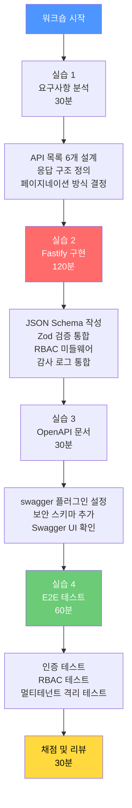
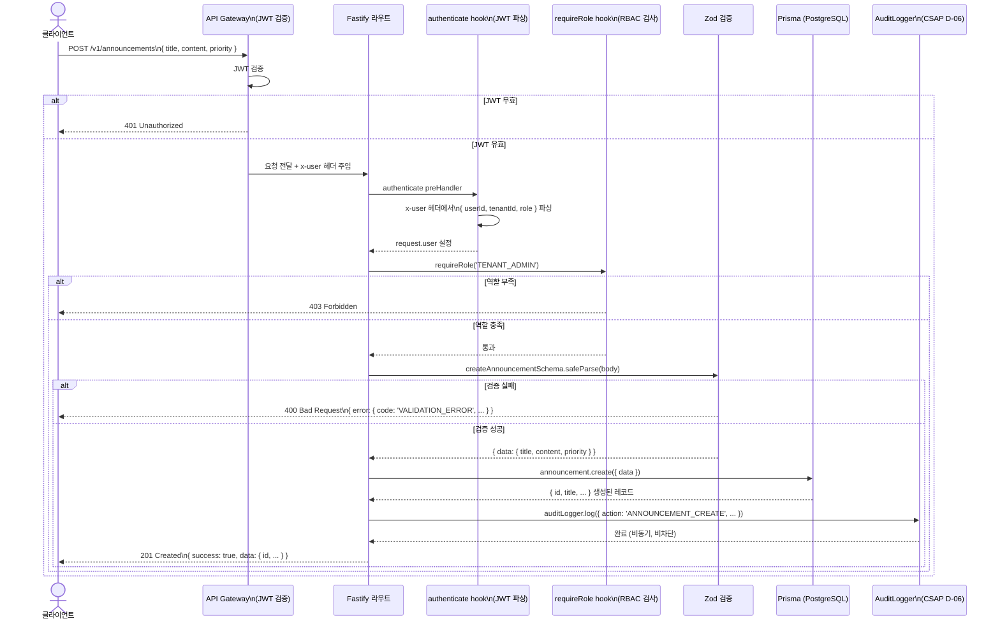

# 실습 20: API 설계 워크숍 — RESTful API를 설계하고 문서화까지

---

| 항목 | 내용 |
|------|------|
| 문서 ID | GUIDE-EX-20 |
| 버전 | 1.0.0 |
| 작성일 | 2026-04-13 |
| 목적 | 공지사항 CRUD API를 처음부터 설계하고, Fastify 구현, OpenAPI 문서, E2E 테스트까지 완성하는 실습 |
| 선행 학습 | GUIDE-DEV-05 (Fastify 기초), GUIDE-SEC-AUTH-01 (JWT 인증), GUIDE-SEC-AUDIT-01 (감사 로그 기초) |
| 예상 소요 시간 | 4~6시간 |

---

## 목차

1. [워크숍 개요](#1-워크숍-개요)
2. [API 설계 원칙](#2-api-설계-원칙)
3. [실습 1: 요구사항 분석](#3-실습-1-요구사항-분석)
4. [실습 2: Fastify 라우트 구현](#4-실습-2-fastify-라우트-구현)
5. [실습 3: OpenAPI 문서 생성](#5-실습-3-openapi-문서-생성)
6. [실습 4: E2E 테스트 작성](#6-실습-4-e2e-테스트-작성)
7. [100점 채점 기준](#7-100점-채점-기준)
8. [변경 이력](#변경-이력)

---

## 1. 워크숍 개요

### 1.1 목표

이 워크숍을 완료하면 다음을 할 수 있습니다.

- REST 리소스 설계 원칙을 이해하고 일관된 API 명명 규칙을 적용합니다.
- Fastify + Zod를 이용하여 입력 검증이 완비된 API를 구현합니다.
- CSAP D-08(접근 통제)과 D-06(감사 로그)를 API 레벨에서 강제합니다.
- `@fastify/swagger`로 OpenAPI 3.0 문서를 자동 생성합니다.
- Vitest + Supertest로 인증, RBAC, 멀티테넌트 격리를 검증하는 E2E 테스트를 작성합니다.

### 1.2 과제 개요

여러분은 공공기관 SaaS 플랫폼의 **공지사항(Announcement) API**를 구현합니다.

| 항목 | 내용 |
|------|------|
| 리소스 | 공지사항 (Announcement) |
| 테넌트 격리 | 테넌트별 공지사항 완전 분리 |
| RBAC | TENANT_ADMIN만 생성/수정/삭제, USER는 조회만 |
| 감사 로그 | 생성/수정/삭제 시 CSAP D-06 감사 기록 필수 |
| 문서화 | OpenAPI 3.0 자동 생성 |
| 테스트 | 인증·권한·멀티테넌트 격리 E2E 테스트 |

### 1.3 워크숍 단계 전체 흐름



---

## 2. API 설계 원칙

### 2.1 REST 리소스 명명 규칙

REST API 설계의 핵심은 **리소스 중심 사고**입니다. 동사가 아닌 명사로 URL을 구성합니다.

| 나쁜 예 (동사 중심) | 좋은 예 (명사 중심) | 이유 |
|-------------------|-------------------|------|
| `POST /createAnnouncement` | `POST /announcements` | HTTP 메서드가 동사 역할 |
| `GET /getAnnouncements` | `GET /announcements` | 메서드로 행위 표현 |
| `DELETE /deleteAnnouncement/1` | `DELETE /announcements/1` | 리소스 ID로 대상 특정 |
| `POST /announcement/publish/1` | `PATCH /announcements/1/status` | 상태 변경은 서브리소스 |

**명명 규칙 체크리스트:**

```
✅ 복수형 명사 사용 (/announcements, /users, /tenants)
✅ 소문자 + 하이픈 (-) 사용 (/audit-logs, /service-catalog)
✅ 중첩은 최대 2단계 (/tenants/{id}/announcements)
✅ 버전 포함 (/v1/announcements)
❌ 동사 URL 금지 (/createAnnouncement, /deleteUser)
❌ 대문자 금지 (/Announcements, /AnnouncementList)
❌ 언더스코어 금지 (/announcement_list)
❌ 3단계 이상 중첩 금지 (/tenants/1/users/2/announcements/3)
```

### 2.2 HTTP 메서드 선택 기준

| 메서드 | 용도 | 멱등성 | 요청 본문 | 성공 코드 |
|--------|------|--------|-----------|-----------|
| `GET` | 조회 | 예 | 없음 | 200 |
| `POST` | 생성 | 아니오 | JSON | 201 |
| `PUT` | 전체 교체 | 예 | JSON | 200 |
| `PATCH` | 부분 수정 | 아니오 | JSON | 200 |
| `DELETE` | 삭제 | 예 | 없음 | 204 |

**공지사항 API 메서드 선택 근거:**

- `GET /announcements`: 목록 조회 — 데이터 변경 없음
- `POST /announcements`: 새 공지 생성 — 리소스 생성, 응답에 생성된 ID 포함
- `GET /announcements/:id`: 단건 조회 — 특정 ID 리소스
- `PATCH /announcements/:id`: 부분 수정 — 전체 필드가 아닌 변경된 필드만
- `DELETE /announcements/:id`: 삭제 — 논리 삭제(soft delete) 또는 물리 삭제
- `PATCH /announcements/:id/publish`: 게시 상태 변경 — 상태 전환 서브리소스

### 2.3 HTTP 상태 코드 선택 기준

**2xx — 성공**

| 코드 | 의미 | 사용 상황 |
|------|------|-----------|
| 200 OK | 성공 | 조회, 수정 성공 |
| 201 Created | 생성 성공 | POST로 리소스 생성 시 |
| 204 No Content | 내용 없음 | DELETE 성공 시 (본문 없음) |

**4xx — 클라이언트 오류**

| 코드 | 의미 | 사용 상황 |
|------|------|-----------|
| 400 Bad Request | 잘못된 요청 | 입력 검증 실패, 형식 오류 |
| 401 Unauthorized | 미인증 | JWT 없음 또는 만료 |
| 403 Forbidden | 권한 없음 | 인증은 됐지만 권한 부족 |
| 404 Not Found | 리소스 없음 | 해당 ID 존재하지 않음 |
| 409 Conflict | 충돌 | 이미 존재하는 리소스 생성 시도 |
| 422 Unprocessable | 처리 불가 | 형식은 올바르나 논리적 오류 |
| 429 Too Many Req | 과다 요청 | Rate Limit 초과 |

**5xx — 서버 오류**

| 코드 | 의미 | 사용 상황 |
|------|------|-----------|
| 500 Internal | 서버 오류 | 예상치 못한 오류 (로그 기록 필수) |
| 502 Bad Gateway | 게이트웨이 오류 | 업스트림 서비스 오류 |
| 503 Unavailable | 서비스 불가 | 점검 중, 과부하 |

### 2.4 페이지네이션 표준

두 가지 방식을 상황에 따라 선택합니다.

**Offset 페이지네이션** — 전통적인 페이지 번호 방식

```
GET /announcements?page=2&limit=20

응답:
{
  "data": [...],
  "pagination": {
    "page": 2,
    "limit": 20,
    "total": 147,
    "totalPages": 8
  }
}
```

사용 상황: 관리자 목록 (임의 페이지 이동 필요), 데이터 변경 빈도 낮음

**Cursor 페이지네이션** — 커서 기반 방식

```
GET /announcements?cursor=eyJpZCI6IjEwMCJ9&limit=20

응답:
{
  "data": [...],
  "pagination": {
    "nextCursor": "eyJpZCI6IjgwIn0=",  // Base64 인코딩된 커서
    "hasMore": true
  }
}
```

사용 상황: 실시간 피드 (감사 로그 스트림), 데이터 삽입이 잦음

**본 워크숍에서는 Offset 방식을 사용합니다.** 공지사항은 임의 페이지 이동이 필요하고 변경 빈도가 낮습니다.

---

## 3. 실습 1: 요구사항 분석

### 3.1 공지사항 API 요구사항

이번 실습에서 구현할 공지사항 API의 요구사항입니다.

**기능 요구사항:**

| ID | 요구사항 | 우선순위 |
|----|---------|---------|
| FR-AN.1 | 공지사항 목록 조회 (페이지네이션, 테넌트 격리) | 필수 |
| FR-AN.2 | 공지사항 단건 조회 | 필수 |
| FR-AN.3 | 공지사항 생성 (TENANT_ADMIN 이상) | 필수 |
| FR-AN.4 | 공지사항 수정 (작성자 또는 TENANT_ADMIN) | 필수 |
| FR-AN.5 | 공지사항 삭제 (TENANT_ADMIN만) | 필수 |
| FR-AN.6 | 공지사항 게시/비게시 전환 (TENANT_ADMIN만) | 선택 |

**비기능 요구사항:**

| ID | 요구사항 |
|----|---------|
| NFR-1 | 모든 API에 JWT 인증 필수 (CSAP D-08-01) |
| NFR-2 | 테넌트 격리 — 타 테넌트 데이터 접근 불가 (CSAP D-08-05) |
| NFR-3 | 생성/수정/삭제 시 감사 로그 기록 (CSAP D-06) |
| NFR-4 | 입력 데이터 검증 필수 (CSAP D-12) |
| NFR-5 | 에러 메시지에 민감 정보 미포함 (CSAP D-12) |

### 3.2 API 목록 설계 (6개 엔드포인트)

| 번호 | 메서드 | 경로 | 권한 | 설명 |
|------|--------|------|------|------|
| 1 | GET | `/v1/announcements` | USER 이상 | 공지사항 목록 조회 |
| 2 | GET | `/v1/announcements/:id` | USER 이상 | 공지사항 단건 조회 |
| 3 | POST | `/v1/announcements` | TENANT_ADMIN 이상 | 공지사항 생성 |
| 4 | PATCH | `/v1/announcements/:id` | TENANT_ADMIN 이상 | 공지사항 수정 |
| 5 | DELETE | `/v1/announcements/:id` | TENANT_ADMIN 이상 | 공지사항 삭제 |
| 6 | PATCH | `/v1/announcements/:id/status` | TENANT_ADMIN 이상 | 게시 상태 전환 |

### 3.3 응답 구조 설계 (표준 래퍼)

모든 API 응답은 일관된 래퍼 구조를 사용합니다.

**성공 응답 (단건):**

```json
{
  "success": true,
  "data": {
    "id": "ann-uuid-12345",
    "title": "2026년 시스템 점검 안내",
    "content": "4월 20일 오전 2시~4시 정기 점검 예정입니다.",
    "priority": "HIGH",
    "status": "PUBLISHED",
    "tenantId": "seoul-gov",
    "createdById": "user-uuid-678",
    "createdAt": "2026-04-13T09:00:00.000Z",
    "updatedAt": "2026-04-13T09:00:00.000Z"
  }
}
```

**성공 응답 (목록):**

```json
{
  "success": true,
  "data": [
    { "id": "...", "title": "...", ... }
  ],
  "pagination": {
    "page": 1,
    "limit": 20,
    "total": 47,
    "totalPages": 3
  }
}
```

**오류 응답:**

```json
{
  "success": false,
  "error": {
    "code": "VALIDATION_ERROR",
    "message": "제목은 필수입니다.",
    "field": "title"
  }
}
```

**규칙:**

- `success` 필드는 항상 포함 (클라이언트 분기 처리 편의)
- 오류 메시지는 사용자 친화적으로, 스택 트레이스 절대 미포함
- `error.code`는 열거형 상수 사용 (VALIDATION_ERROR, UNAUTHORIZED, FORBIDDEN, NOT_FOUND, INTERNAL_ERROR)

---

## 4. 실습 2: Fastify 라우트 구현

### 4.1 디렉토리 구조

```
src/
  routes/
    announcements/
      index.ts          ← 라우트 등록
      list.ts           ← GET /announcements
      get.ts            ← GET /announcements/:id
      create.ts         ← POST /announcements
      update.ts         ← PATCH /announcements/:id
      delete.ts         ← DELETE /announcements/:id
      status.ts         ← PATCH /announcements/:id/status
  lib/
    prisma.ts           ← Prisma 클라이언트
    auth.ts             ← JWT 검증 미들웨어
    rbac.ts             ← RBAC 미들웨어
    audit.ts            ← 감사 로그
  schemas/
    announcement.ts     ← Zod + JSON Schema 정의
```

### 4.2 Zod 스키마 및 JSON Schema 작성

```typescript
// src/schemas/announcement.ts
// CSAP D-12: 모든 입력 검증 필수

import { z } from 'zod';

// ── 공통 열거형 ─────────────────────────────

export const AnnouncementPriorityEnum = z.enum(['LOW', 'NORMAL', 'HIGH', 'URGENT']);
export const AnnouncementStatusEnum = z.enum(['DRAFT', 'PUBLISHED', 'ARCHIVED']);

// ── 생성 스키마 ─────────────────────────────

export const createAnnouncementSchema = z.object({
  title: z.string()
    .min(1, '제목을 입력하세요')
    .max(200, '제목은 200자를 초과할 수 없습니다'),

  content: z.string()
    .min(1, '내용을 입력하세요')
    .max(10_000, '내용은 10,000자를 초과할 수 없습니다'),

  priority: AnnouncementPriorityEnum.default('NORMAL'),

  // XSS 방지: HTML 태그 포함 금지 (서버에서 DOMPurify로 새니타이즈)
  attachmentUrl: z.string().url().optional(),
});

// ── 수정 스키마 (모든 필드 선택) ────────────

export const updateAnnouncementSchema = z.object({
  title: z.string().min(1).max(200).optional(),
  content: z.string().min(1).max(10_000).optional(),
  priority: AnnouncementPriorityEnum.optional(),
  attachmentUrl: z.string().url().optional().nullable(),
});

// ── 상태 전환 스키마 ─────────────────────────

export const updateStatusSchema = z.object({
  status: AnnouncementStatusEnum,
});

// ── 목록 조회 쿼리 스키마 ───────────────────

export const listQuerySchema = z.object({
  page: z.coerce.number().int().min(1).default(1),
  limit: z.coerce.number().int().min(1).max(100).default(20),
  priority: AnnouncementPriorityEnum.optional(),
  status: AnnouncementStatusEnum.optional(),
  keyword: z.string().max(100).optional(),
});

// ── Fastify JSON Schema (OpenAPI 생성용) ────

export const createAnnouncementJsonSchema = {
  type: 'object',
  required: ['title', 'content'],
  properties: {
    title: { type: 'string', minLength: 1, maxLength: 200, description: '공지사항 제목' },
    content: { type: 'string', minLength: 1, maxLength: 10000, description: '공지사항 내용' },
    priority: {
      type: 'string',
      enum: ['LOW', 'NORMAL', 'HIGH', 'URGENT'],
      default: 'NORMAL',
      description: '우선순위',
    },
    attachmentUrl: { type: 'string', format: 'uri', description: '첨부 파일 URL' },
  },
} as const;
```

### 4.3 RBAC 미들웨어

```typescript
// src/lib/rbac.ts
// CSAP: D-08-05 접근 통제 — RBAC

import type { FastifyRequest, FastifyReply } from 'fastify';

// 역할 계층 (높을수록 권한 많음)
const ROLE_HIERARCHY: Record<string, number> = {
  VIEWER: 0,
  USER: 1,
  TENANT_ADMIN: 2,
  SUPER_ADMIN: 3,
};

/**
 * 최소 역할 요구 미들웨어 생성 팩토리
 *
 * @param minimumRole - 최소 필요 역할 (이 역할 이상이어야 접근 허용)
 */
export function requireRole(minimumRole: string) {
  return async (request: FastifyRequest, reply: FastifyReply): Promise<void> => {
    const user = request.user; // preHandler에서 JWT 파싱 후 주입된 값

    if (!user) {
      reply.status(401).send({
        success: false,
        error: { code: 'UNAUTHORIZED', message: '인증이 필요합니다.' },
      });
      return;
    }

    const userLevel = ROLE_HIERARCHY[user.role] ?? -1;
    const requiredLevel = ROLE_HIERARCHY[minimumRole] ?? 999;

    if (userLevel < requiredLevel) {
      reply.status(403).send({
        success: false,
        error: { code: 'FORBIDDEN', message: '이 작업을 수행할 권한이 없습니다.' },
      });
      return;
    }
  };
}

/**
 * 테넌트 격리 미들웨어
 *
 * URL 파라미터의 tenantId와 토큰의 tenantId가 일치하는지 확인
 * SUPER_ADMIN은 모든 테넌트 접근 허용
 */
export async function requireTenantAccess(
  request: FastifyRequest<{ Params: { tenantId?: string } }>,
  reply: FastifyReply,
): Promise<void> {
  const user = request.user;
  if (!user) return; // requireAuth에서 이미 처리

  const targetTenantId = request.params.tenantId ?? (request.body as any)?.tenantId;

  if (user.role === 'SUPER_ADMIN') return; // 슈퍼 관리자 전체 접근 허용

  if (targetTenantId && targetTenantId !== user.tenantId) {
    // 감사 로그: 테넌트 격리 위반 시도 기록
    await request.server.auditLogger.log({
      actor: user.userId,
      action: 'CROSS_TENANT_ACCESS_ATTEMPT',
      target: targetTenantId,
      targetType: 'tenant',
      tenantId: user.tenantId,
      ip: request.ip,
      userAgent: request.headers['user-agent'] ?? '',
      metadata: { requestedPath: request.url },
    });

    reply.status(403).send({
      success: false,
      error: { code: 'FORBIDDEN', message: '다른 테넌트의 데이터에 접근할 수 없습니다.' },
    });
  }
}
```

### 4.4 공지사항 생성 라우트 완전 구현

```typescript
// src/routes/announcements/create.ts
// Plan SC: FR-AN.3
// CSAP: D-08-01 인증, D-08-05 RBAC, D-12 입력 검증, D-06 감사 로그

import type { FastifyInstance } from 'fastify';
import { z } from 'zod';
import { createAnnouncementSchema, createAnnouncementJsonSchema } from '../../schemas/announcement.js';
import { requireRole } from '../../lib/rbac.js';

export async function registerCreateRoute(fastify: FastifyInstance): Promise<void> {
  fastify.post(
    '/',
    {
      // OpenAPI 메타데이터
      schema: {
        summary: '공지사항 생성',
        description: 'TENANT_ADMIN 이상 권한이 필요합니다.',
        tags: ['공지사항'],
        security: [{ bearerAuth: [] }],
        body: createAnnouncementJsonSchema,
        response: {
          201: {
            type: 'object',
            properties: {
              success: { type: 'boolean' },
              data: { $ref: '#/components/schemas/Announcement' },
            },
          },
          400: { $ref: '#/components/schemas/ErrorResponse' },
          401: { $ref: '#/components/schemas/ErrorResponse' },
          403: { $ref: '#/components/schemas/ErrorResponse' },
        },
      },
      // CSAP D-08: 인증 + RBAC 미들웨어 체인
      preHandler: [
        fastify.authenticate,              // JWT 검증
        requireRole('TENANT_ADMIN'),       // 최소 TENANT_ADMIN 역할 필요
      ],
    },
    async (request, reply) => {
      const user = request.user!; // preHandler에서 보장됨

      // CSAP D-12: Zod 입력 검증
      const parseResult = createAnnouncementSchema.safeParse(request.body);
      if (!parseResult.success) {
        const firstError = parseResult.error.issues[0];
        return reply.status(400).send({
          success: false,
          error: {
            code: 'VALIDATION_ERROR',
            message: firstError?.message ?? '입력값이 유효하지 않습니다.',
            field: firstError?.path.join('.'),
          },
        });
      }

      const data = parseResult.data;

      // CSAP D-08-05: TENANT_ADMIN은 자신의 테넌트에만 생성 가능
      // SUPER_ADMIN은 tenantId를 body에서 지정 가능 (아니면 자신의 테넌트 사용)
      const targetTenantId = user.role === 'SUPER_ADMIN'
        ? ((request.body as any).targetTenantId ?? user.tenantId)
        : user.tenantId;

      try {
        // Prisma 매개변수화 쿼리 (CSAP D-12: SQL 주입 방지)
        const announcement = await fastify.prisma.announcement.create({
          data: {
            title: data.title,
            content: data.content,
            priority: data.priority,
            status: 'DRAFT', // 생성 시 초안 상태
            tenantId: targetTenantId,
            createdById: user.userId,
            attachmentUrl: data.attachmentUrl ?? null,
          },
          select: {
            id: true,
            title: true,
            content: true,
            priority: true,
            status: true,
            tenantId: true,
            createdById: true,
            createdAt: true,
            updatedAt: true,
          },
        });

        // CSAP D-06: 생성 감사 로그 필수
        await fastify.auditLogger.log({
          actor: user.userId,
          action: 'ANNOUNCEMENT_CREATE',
          target: announcement.id,
          targetType: 'announcement',
          tenantId: targetTenantId,
          ip: request.ip,
          userAgent: request.headers['user-agent'] ?? '',
          metadata: {
            title: data.title,
            priority: data.priority,
          },
        });

        return reply.status(201).send({
          success: true,
          data: announcement,
        });
      } catch (error) {
        // CSAP D-12: 내부 오류 로깅 (클라이언트에 상세 미노출)
        request.log.error({ error }, '공지사항 생성 실패');
        return reply.status(500).send({
          success: false,
          error: { code: 'INTERNAL_ERROR', message: '서버 오류가 발생했습니다.' },
        });
      }
    },
  );
}
```

### 4.5 목록 조회 라우트 구현

```typescript
// src/routes/announcements/list.ts
// Plan SC: FR-AN.1
// CSAP: D-08-01 인증, D-08-05 테넌트 격리

import type { FastifyInstance } from 'fastify';
import { listQuerySchema } from '../../schemas/announcement.js';
import { requireRole } from '../../lib/rbac.js';

export async function registerListRoute(fastify: FastifyInstance): Promise<void> {
  fastify.get(
    '/',
    {
      schema: {
        summary: '공지사항 목록 조회',
        tags: ['공지사항'],
        security: [{ bearerAuth: [] }],
        querystring: {
          type: 'object',
          properties: {
            page: { type: 'integer', minimum: 1, default: 1 },
            limit: { type: 'integer', minimum: 1, maximum: 100, default: 20 },
            priority: { type: 'string', enum: ['LOW', 'NORMAL', 'HIGH', 'URGENT'] },
            status: { type: 'string', enum: ['DRAFT', 'PUBLISHED', 'ARCHIVED'] },
            keyword: { type: 'string', maxLength: 100 },
          },
        },
      },
      preHandler: [
        fastify.authenticate,
        requireRole('USER'),
      ],
    },
    async (request, reply) => {
      const user = request.user!;

      // CSAP D-12: 쿼리 파라미터 검증
      const queryResult = listQuerySchema.safeParse(request.query);
      if (!queryResult.success) {
        return reply.status(400).send({
          success: false,
          error: { code: 'VALIDATION_ERROR', message: '쿼리 파라미터가 유효하지 않습니다.' },
        });
      }

      const { page, limit, priority, status, keyword } = queryResult.data;
      const skip = (page - 1) * limit;

      // CSAP D-08-05: 테넌트 격리 — SUPER_ADMIN만 전체 조회 가능
      const tenantFilter = user.role === 'SUPER_ADMIN'
        ? {}
        : { tenantId: user.tenantId };

      // 상태 필터: USER 역할은 PUBLISHED 상태만 조회 가능
      const statusFilter = user.role === 'USER'
        ? { status: 'PUBLISHED' as const }
        : (status ? { status } : {});

      const whereClause = {
        ...tenantFilter,
        ...statusFilter,
        ...(priority ? { priority } : {}),
        ...(keyword
          ? {
              OR: [
                { title: { contains: keyword } },
                { content: { contains: keyword } },
              ],
            }
          : {}),
      };

      const [announcements, total] = await Promise.all([
        fastify.prisma.announcement.findMany({
          where: whereClause,
          select: {
            id: true,
            title: true,
            priority: true,
            status: true,
            tenantId: true,
            createdAt: true,
            updatedAt: true,
            // 목록에서는 content 제외 (용량 절감)
          },
          orderBy: [
            { priority: 'desc' }, // 높은 우선순위 먼저
            { createdAt: 'desc' },
          ],
          skip,
          take: limit,
        }),
        fastify.prisma.announcement.count({ where: whereClause }),
      ]);

      return reply.send({
        success: true,
        data: announcements,
        pagination: {
          page,
          limit,
          total,
          totalPages: Math.ceil(total / limit),
        },
      });
    },
  );
}
```

### 4.6 API 요청 처리 시퀀스 다이어그램



---

## 5. 실습 3: OpenAPI 문서 생성

### 5.1 @fastify/swagger 플러그인 설정

```typescript
// src/app.ts
// OpenAPI 3.0 문서 자동 생성

import Fastify from 'fastify';
import swagger from '@fastify/swagger';
import swaggerUi from '@fastify/swagger-ui';

const app = Fastify({ logger: true });

// OpenAPI 3.0 설정
await app.register(swagger, {
  openapi: {
    info: {
      title: '공공기관 SaaS 플랫폼 API',
      description: '공지사항 API — CSAP 중/상 등급 준수',
      version: '1.0.0',
      contact: {
        name: '플랫폼 개발팀',
        email: 'dev@gov-saas.kr',
      },
      license: {
        name: 'MIT',
      },
    },
    externalDocs: {
      url: 'https://docs.gov-saas.kr',
      description: '전체 API 문서',
    },
    servers: [
      { url: 'https://api.gov-saas.kr', description: '운영 환경' },
      { url: 'http://localhost:3000', description: '로컬 개발' },
    ],
    // CSAP D-08: Bearer 토큰 인증 스키마 정의
    components: {
      securitySchemes: {
        bearerAuth: {
          type: 'http',
          scheme: 'bearer',
          bearerFormat: 'JWT',
          description: 'API Gateway에서 발급한 JWT 토큰',
        },
      },
      schemas: {
        // 공통 응답 스키마
        ErrorResponse: {
          type: 'object',
          required: ['success', 'error'],
          properties: {
            success: { type: 'boolean', enum: [false] },
            error: {
              type: 'object',
              required: ['code', 'message'],
              properties: {
                code: {
                  type: 'string',
                  enum: [
                    'VALIDATION_ERROR',
                    'UNAUTHORIZED',
                    'FORBIDDEN',
                    'NOT_FOUND',
                    'INTERNAL_ERROR',
                  ],
                },
                message: { type: 'string' },
                field: { type: 'string' },
              },
            },
          },
        },
        // 공지사항 스키마
        Announcement: {
          type: 'object',
          properties: {
            id: { type: 'string', format: 'uuid' },
            title: { type: 'string', maxLength: 200 },
            content: { type: 'string', maxLength: 10000 },
            priority: {
              type: 'string',
              enum: ['LOW', 'NORMAL', 'HIGH', 'URGENT'],
            },
            status: {
              type: 'string',
              enum: ['DRAFT', 'PUBLISHED', 'ARCHIVED'],
            },
            tenantId: { type: 'string' },
            createdById: { type: 'string', format: 'uuid' },
            createdAt: { type: 'string', format: 'date-time' },
            updatedAt: { type: 'string', format: 'date-time' },
          },
        },
      },
    },
    // 전역 보안 설정 (모든 엔드포인트에 적용)
    security: [{ bearerAuth: [] }],
    tags: [
      {
        name: '공지사항',
        description: '공지사항 CRUD API (CSAP D-08, D-06 준수)',
      },
    ],
  },
});

// Swagger UI 설정
await app.register(swaggerUi, {
  routePrefix: '/docs',
  uiConfig: {
    docExpansion: 'list',
    deepLinking: false,
  },
  staticCSP: true,        // CSP 헤더 자동 설정 (XSS 방지)
  transformStaticCSP: (header) => header, // CSP 커스터마이즈 가능
});
```

### 5.2 생성된 OpenAPI 명세 예시

```yaml
# 자동 생성된 openapi.yaml
openapi: '3.0.3'
info:
  title: 공공기관 SaaS 플랫폼 API
  version: '1.0.0'

paths:
  /v1/announcements:
    get:
      summary: 공지사항 목록 조회
      tags: [공지사항]
      security:
        - bearerAuth: []
      parameters:
        - name: page
          in: query
          schema: { type: integer, minimum: 1, default: 1 }
        - name: limit
          in: query
          schema: { type: integer, minimum: 1, maximum: 100, default: 20 }
      responses:
        '200':
          description: 성공
          content:
            application/json:
              schema:
                type: object
                properties:
                  success: { type: boolean }
                  data:
                    type: array
                    items: { $ref: '#/components/schemas/Announcement' }
                  pagination:
                    type: object
                    properties:
                      page: { type: integer }
                      limit: { type: integer }
                      total: { type: integer }
                      totalPages: { type: integer }
        '401':
          $ref: '#/components/responses/Unauthorized'
        '403':
          $ref: '#/components/responses/Forbidden'

    post:
      summary: 공지사항 생성
      tags: [공지사항]
      security:
        - bearerAuth: []
      requestBody:
        required: true
        content:
          application/json:
            schema: { $ref: '#/components/schemas/CreateAnnouncementRequest' }
      responses:
        '201':
          description: 생성 성공
          content:
            application/json:
              schema:
                type: object
                properties:
                  success: { type: boolean }
                  data: { $ref: '#/components/schemas/Announcement' }
```

### 5.3 Swagger UI 확인

서버를 시작한 후 다음 URL에서 Swagger UI를 확인합니다.

```
http://localhost:3000/docs
```

Swagger UI에서 다음을 확인합니다.

1. 6개 엔드포인트가 모두 표시되는지
2. 각 엔드포인트의 인증(bearerAuth) 요구사항이 표시되는지
3. 요청/응답 스키마가 정확한지
4. "Try it out" 기능으로 실제 API 호출이 가능한지

---

## 6. 실습 4: E2E 테스트 작성

### 6.1 테스트 환경 설정

```typescript
// tests/setup.ts
// Vitest + Supertest E2E 테스트 설정

import { beforeAll, afterAll } from 'vitest';
import { buildApp } from '../src/app.js';
import { prisma } from '../src/lib/prisma.js';

// 테스트용 JWT 생성 헬퍼
export function createTestToken(payload: {
  userId: string;
  tenantId: string;
  role: string;
}): string {
  // 실제 프로젝트에서는 auth-service의 테스트 유틸 사용
  return `test-token-${Buffer.from(JSON.stringify(payload)).toString('base64')}`;
}

// 테스트용 픽스처
export const fixtures = {
  superAdmin: {
    userId: 'user-super-admin-001',
    tenantId: 'platform',
    role: 'SUPER_ADMIN',
  },
  tenantAdminA: {
    userId: 'user-tenant-admin-a',
    tenantId: 'tenant-a',
    role: 'TENANT_ADMIN',
  },
  tenantAdminB: {
    userId: 'user-tenant-admin-b',
    tenantId: 'tenant-b',
    role: 'TENANT_ADMIN',
  },
  userA: {
    userId: 'user-regular-a',
    tenantId: 'tenant-a',
    role: 'USER',
  },
};
```

### 6.2 인증 테스트

```typescript
// tests/announcements/auth.test.ts
// CSAP D-08: 인증 검증 테스트

import { describe, it, expect, beforeAll, afterAll } from 'vitest';
import supertest from 'supertest';
import { buildApp } from '../../src/app.js';
import { createTestToken, fixtures } from '../setup.js';

describe('공지사항 API — 인증 테스트', () => {
  let app: Awaited<ReturnType<typeof buildApp>>;
  let request: ReturnType<typeof supertest>;

  beforeAll(async () => {
    app = await buildApp({ logger: false });
    await app.ready();
    request = supertest(app.server);
  });

  afterAll(async () => {
    await app.close();
  });

  describe('인증 없이 접근', () => {
    it('GET /v1/announcements — 401 반환', async () => {
      const response = await request.get('/v1/announcements');
      expect(response.status).toBe(401);
      expect(response.body.success).toBe(false);
      expect(response.body.error.code).toBe('UNAUTHORIZED');
    });

    it('POST /v1/announcements — 401 반환', async () => {
      const response = await request
        .post('/v1/announcements')
        .send({ title: '테스트', content: '내용' });
      expect(response.status).toBe(401);
    });
  });

  describe('만료된 토큰으로 접근', () => {
    it('만료된 JWT — 401 반환', async () => {
      const response = await request
        .get('/v1/announcements')
        .set('Authorization', 'Bearer expired.jwt.token');
      expect(response.status).toBe(401);
      expect(response.body.error.code).toBe('UNAUTHORIZED');
    });
  });

  describe('유효한 토큰으로 접근', () => {
    it('USER 역할로 목록 조회 — 200 반환', async () => {
      const token = createTestToken(fixtures.userA);
      const response = await request
        .get('/v1/announcements')
        .set('Authorization', `Bearer ${token}`);
      expect(response.status).toBe(200);
      expect(response.body.success).toBe(true);
      expect(Array.isArray(response.body.data)).toBe(true);
    });
  });
});
```

### 6.3 RBAC 권한 테스트

```typescript
// tests/announcements/rbac.test.ts
// CSAP D-08-05: RBAC 검증 테스트

import { describe, it, expect, beforeAll, afterAll, beforeEach } from 'vitest';
import supertest from 'supertest';
import { buildApp } from '../../src/app.js';
import { createTestToken, fixtures } from '../setup.js';
import { prisma } from '../../src/lib/prisma.js';

describe('공지사항 API — RBAC 테스트', () => {
  let app: Awaited<ReturnType<typeof buildApp>>;
  let request: ReturnType<typeof supertest>;

  beforeAll(async () => {
    app = await buildApp({ logger: false });
    await app.ready();
    request = supertest(app.server);
  });

  afterAll(async () => {
    await app.close();
    await prisma.announcement.deleteMany({ where: { tenantId: 'tenant-a' } });
  });

  describe('공지사항 생성 권한', () => {
    it('USER 역할 — 생성 시도 시 403 반환', async () => {
      const token = createTestToken(fixtures.userA);
      const response = await request
        .post('/v1/announcements')
        .set('Authorization', `Bearer ${token}`)
        .send({ title: '테스트 공지', content: '내용입니다.' });

      expect(response.status).toBe(403);
      expect(response.body.error.code).toBe('FORBIDDEN');
    });

    it('TENANT_ADMIN 역할 — 생성 성공 (201 반환)', async () => {
      const token = createTestToken(fixtures.tenantAdminA);
      const response = await request
        .post('/v1/announcements')
        .set('Authorization', `Bearer ${token}`)
        .send({
          title: '4월 정기 점검 안내',
          content: '2026년 4월 20일 02시-04시 점검 예정입니다.',
          priority: 'HIGH',
        });

      expect(response.status).toBe(201);
      expect(response.body.success).toBe(true);
      expect(response.body.data.id).toBeDefined();
      expect(response.body.data.tenantId).toBe('tenant-a');
      expect(response.body.data.status).toBe('DRAFT'); // 초안 상태
    });
  });

  describe('공지사항 삭제 권한', () => {
    let createdAnnouncementId: string;

    beforeEach(async () => {
      // 테스트용 공지사항 생성
      const token = createTestToken(fixtures.tenantAdminA);
      const createResponse = await request
        .post('/v1/announcements')
        .set('Authorization', `Bearer ${token}`)
        .send({ title: '삭제 테스트용', content: '삭제될 공지입니다.' });
      createdAnnouncementId = createResponse.body.data.id;
    });

    it('USER 역할 — 삭제 시도 시 403 반환', async () => {
      const token = createTestToken(fixtures.userA);
      const response = await request
        .delete(`/v1/announcements/${createdAnnouncementId}`)
        .set('Authorization', `Bearer ${token}`);

      expect(response.status).toBe(403);
    });

    it('TENANT_ADMIN 역할 — 삭제 성공 (204 반환)', async () => {
      const token = createTestToken(fixtures.tenantAdminA);
      const response = await request
        .delete(`/v1/announcements/${createdAnnouncementId}`)
        .set('Authorization', `Bearer ${token}`);

      expect(response.status).toBe(204);
    });
  });

  describe('입력 검증', () => {
    it('제목 없이 생성 시도 — 400 반환', async () => {
      const token = createTestToken(fixtures.tenantAdminA);
      const response = await request
        .post('/v1/announcements')
        .set('Authorization', `Bearer ${token}`)
        .send({ content: '내용만 있음 (제목 없음)' });

      expect(response.status).toBe(400);
      expect(response.body.error.code).toBe('VALIDATION_ERROR');
      expect(response.body.error.field).toBe('title');
    });

    it('200자 초과 제목 — 400 반환', async () => {
      const token = createTestToken(fixtures.tenantAdminA);
      const response = await request
        .post('/v1/announcements')
        .set('Authorization', `Bearer ${token}`)
        .send({
          title: 'a'.repeat(201), // 201자
          content: '내용',
        });

      expect(response.status).toBe(400);
      expect(response.body.error.code).toBe('VALIDATION_ERROR');
    });
  });
});
```

### 6.4 멀티테넌트 격리 테스트

**가장 중요한 테스트입니다.** 테넌트 A의 사용자가 테넌트 B의 데이터를 절대 볼 수 없어야 합니다.

```typescript
// tests/announcements/tenant-isolation.test.ts
// CSAP D-08-05: 멀티테넌트 격리 핵심 테스트

import { describe, it, expect, beforeAll, afterAll } from 'vitest';
import supertest from 'supertest';
import { buildApp } from '../../src/app.js';
import { createTestToken, fixtures } from '../setup.js';

describe('공지사항 API — 멀티테넌트 격리 테스트', () => {
  let app: Awaited<ReturnType<typeof buildApp>>;
  let request: ReturnType<typeof supertest>;
  let tenantAAnnouncementId: string;
  let tenantBAnnouncementId: string;

  beforeAll(async () => {
    app = await buildApp({ logger: false });
    await app.ready();
    request = supertest(app.server);

    // 테넌트 A의 공지사항 생성
    const tokenA = createTestToken(fixtures.tenantAdminA);
    const responseA = await request
      .post('/v1/announcements')
      .set('Authorization', `Bearer ${tokenA}`)
      .send({ title: '테넌트 A 전용 공지', content: 'A 테넌트 내부 공지입니다.' });
    tenantAAnnouncementId = responseA.body.data.id;

    // 테넌트 B의 공지사항 생성
    const tokenB = createTestToken(fixtures.tenantAdminB);
    const responseB = await request
      .post('/v1/announcements')
      .set('Authorization', `Bearer ${tokenB}`)
      .send({ title: '테넌트 B 전용 공지', content: 'B 테넌트 내부 공지입니다.' });
    tenantBAnnouncementId = responseB.body.data.id;
  });

  afterAll(async () => {
    await app.close();
  });

  describe('목록 조회 격리', () => {
    it('테넌트 A 사용자 — 테넌트 A 공지사항만 조회', async () => {
      const token = createTestToken(fixtures.userA);
      const response = await request
        .get('/v1/announcements')
        .set('Authorization', `Bearer ${token}`);

      expect(response.status).toBe(200);

      // 모든 반환 데이터가 테넌트 A 소속이어야 함
      const tenantIds = response.body.data.map((a: any) => a.tenantId);
      expect(tenantIds.every((id: string) => id === 'tenant-a')).toBe(true);

      // 테넌트 B 데이터가 절대 없어야 함
      const hasTenantBData = response.body.data.some((a: any) => a.tenantId === 'tenant-b');
      expect(hasTenantBData).toBe(false);
    });
  });

  describe('단건 조회 격리', () => {
    it('테넌트 A 사용자가 테넌트 B 공지 조회 — 404 반환 (존재 자체 숨김)', async () => {
      const token = createTestToken(fixtures.userA);
      const response = await request
        .get(`/v1/announcements/${tenantBAnnouncementId}`)
        .set('Authorization', `Bearer ${token}`);

      // 403이 아닌 404를 반환해야 함 (정보 노출 방지)
      // "권한 없음"보다 "없음"이 안전함 — 존재 자체를 숨김
      expect(response.status).toBe(404);
    });
  });

  describe('크로스 테넌트 수정 시도', () => {
    it('테넌트 A 관리자가 테넌트 B 공지 수정 시도 — 404 반환', async () => {
      const token = createTestToken(fixtures.tenantAdminA);
      const response = await request
        .patch(`/v1/announcements/${tenantBAnnouncementId}`)
        .set('Authorization', `Bearer ${token}`)
        .send({ title: '무단 수정 시도' });

      expect(response.status).toBe(404);
    });

    it('테넌트 A 관리자가 테넌트 B 공지 삭제 시도 — 404 반환', async () => {
      const token = createTestToken(fixtures.tenantAdminA);
      const response = await request
        .delete(`/v1/announcements/${tenantBAnnouncementId}`)
        .set('Authorization', `Bearer ${token}`);

      expect(response.status).toBe(404);
    });
  });

  describe('SUPER_ADMIN 전체 접근', () => {
    it('SUPER_ADMIN — 모든 테넌트 목록 조회 가능', async () => {
      const token = createTestToken(fixtures.superAdmin);
      const response = await request
        .get('/v1/announcements')
        .set('Authorization', `Bearer ${token}`);

      expect(response.status).toBe(200);

      // 테넌트 A와 B 공지 모두 포함
      const tenantIds = new Set(response.body.data.map((a: any) => a.tenantId));
      expect(tenantIds.has('tenant-a')).toBe(true);
      expect(tenantIds.has('tenant-b')).toBe(true);
    });

    it('SUPER_ADMIN — 테넌트 B 공지 직접 조회 가능', async () => {
      const token = createTestToken(fixtures.superAdmin);
      const response = await request
        .get(`/v1/announcements/${tenantBAnnouncementId}`)
        .set('Authorization', `Bearer ${token}`);

      expect(response.status).toBe(200);
      expect(response.body.data.tenantId).toBe('tenant-b');
    });
  });

  describe('감사 로그 기록 검증 (CSAP D-06)', () => {
    it('크로스 테넌트 시도 시 감사 로그에 기록됨', async () => {
      const token = createTestToken(fixtures.tenantAdminA);

      // 크로스 테넌트 접근 시도
      await request
        .patch(`/v1/announcements/${tenantBAnnouncementId}`)
        .set('Authorization', `Bearer ${token}`)
        .send({ title: '무단 수정' });

      // 감사 로그에 CROSS_TENANT_ACCESS_ATTEMPT가 기록되었는지 확인
      const auditLog = await app.prisma.auditLog.findFirst({
        where: {
          action: 'CROSS_TENANT_ACCESS_ATTEMPT',
          actorId: fixtures.tenantAdminA.userId,
        },
        orderBy: { createdAt: 'desc' },
      });

      expect(auditLog).not.toBeNull();
      expect(auditLog?.action).toBe('CROSS_TENANT_ACCESS_ATTEMPT');
    });
  });
});
```

---

## 7. 100점 채점 기준

### 7.1 채점 매트릭스

```mermaid
quadrantChart
  title API 설계 워크숍 채점 매트릭스
  x-axis 구현 완성도 낮음 --> 높음
  y-axis 테스트 품질 낮음 --> 높음
  quadrant-1 우수 (85~100점)
  quadrant-2 테스트 강점 (65~84점)
  quadrant-3 기초 (0~44점)
  quadrant-4 구현 강점 (45~64점)
  API 엔드포인트 구현: [0.7, 0.3]
  OpenAPI 문서: [0.8, 0.5]
  RBAC 구현: [0.6, 0.7]
  감사 로그 통합: [0.5, 0.8]
  멀티테넌트 격리: [0.4, 0.9]
  E2E 테스트: [0.75, 0.85]
```

### 7.2 세부 채점 기준 (100점 만점)

**A. API 구현 완성도 (40점)**

| 항목 | 배점 | 채점 기준 |
|------|------|-----------|
| 6개 엔드포인트 구현 | 12점 | 엔드포인트당 2점 |
| Zod 입력 검증 | 8점 | 모든 입력 필드 검증 + 오류 메시지 |
| RBAC 적용 | 8점 | 역할별 정확한 권한 제어 |
| 테넌트 격리 | 8점 | 타 테넌트 데이터 완전 차단 |
| 감사 로그 통합 | 4점 | 생성/수정/삭제 모두 기록 |

**B. OpenAPI 문서 (25점)**

| 항목 | 배점 | 채점 기준 |
|------|------|-----------|
| 6개 엔드포인트 문서화 | 12점 | 엔드포인트당 2점 |
| 요청/응답 스키마 정확성 | 8점 | 모든 필드 타입 + 설명 |
| 보안 스키마 (bearerAuth) | 3점 | 모든 엔드포인트에 적용 |
| 태그 및 설명 | 2점 | 가독성 있는 설명 |

**C. 테스트 커버리지 (35점)**

| 항목 | 배점 | 채점 기준 |
|------|------|-----------|
| 인증 테스트 | 8점 | 토큰 없음/만료/유효 3가지 |
| RBAC 테스트 | 9점 | 역할별 허용/차단 각각 검증 |
| 멀티테넌트 격리 | 12점 | 목록/단건/수정/삭제 모두 검증 |
| 입력 검증 테스트 | 6점 | 경계값 + 필수 필드 검증 |

### 7.3 가산점 및 감점

**가산점 (+10점 한도)**

| 항목 | 가산점 |
|------|--------|
| 커서 기반 페이지네이션 추가 구현 | +3점 |
| Rate Limiting 구현 (429 응답) | +3점 |
| 검색 기능 (키워드 전문 검색) | +2점 |
| 감사 로그 무결성 검증 테스트 | +2점 |

**감점 항목**

| 위반 항목 | 감점 |
|----------|------|
| 하드코딩된 시크릿 발견 | -20점 |
| SQL 직접 문자열 결합 | -15점 |
| 인증 없는 엔드포인트 존재 | -10점 |
| 에러 메시지에 스택 트레이스 노출 | -10점 |
| 테넌트 격리 우회 가능 | -20점 |
| 감사 로그 누락 (생성/수정/삭제) | -5점/건 |

### 7.4 제출 방법

```bash
# 1. 작업 브랜치 생성
git checkout -b feat/api-design-workshop-실습자이름

# 2. 구현 파일 커밋
git add src/ tests/ openapi.yaml
git commit -m "feat(workshop): 공지사항 API 설계 워크숍 완료

- 6개 REST 엔드포인트 구현 (FR-AN.1~6)
- RBAC 미들웨어 + 테넌트 격리
- OpenAPI 3.0 문서 자동 생성
- E2E 테스트 커버리지 (인증/RBAC/격리)
- CSAP D-06/D-08/D-12 준수"

# 3. 테스트 실행 확인
npm test -- --reporter=verbose

# 4. PR 생성
gh pr create --title "실습 20: API 설계 워크숍 — 실습자 이름" \
  --body "100점 채점 기준 제출"
```

### 7.5 셀프 체크리스트

제출 전 아래 항목을 스스로 확인합니다.

```
API 구현
  [ ] 6개 엔드포인트 모두 구현
  [ ] 모든 입력에 Zod 검증 적용
  [ ] TENANT_ADMIN/USER 권한 분리 정확
  [ ] 타 테넌트 데이터 404 반환 (403 아님)
  [ ] 생성/수정/삭제에 감사 로그 호출
  [ ] 에러 응답에 스택 트레이스 없음

OpenAPI 문서
  [ ] Swagger UI(/docs)에서 6개 엔드포인트 확인
  [ ] 모든 엔드포인트에 bearerAuth 적용
  [ ] 요청/응답 스키마 정확

E2E 테스트
  [ ] npm test 전체 통과 (0 failures)
  [ ] 토큰 없음 → 401 검증
  [ ] USER → POST 시도 → 403 검증
  [ ] 테넌트 A → 테넌트 B 공지 조회 → 404 검증
  [ ] SUPER_ADMIN → 모든 테넌트 조회 가능 검증

보안
  [ ] 하드코딩된 시크릿 없음
  [ ] SQL 직접 결합 없음
  [ ] 환경 변수 사용 확인
```

---

## 변경 이력

| 버전 | 일자 | 변경 내용 | 작성자 |
|------|------|-----------|--------|
| 1.0.0 | 2026-04-13 | 초안 작성 — API 설계 원칙, 공지사항 API 6개 엔드포인트 실습, OpenAPI 문서화, E2E 테스트 (인증/RBAC/멀티테넌트 격리), 100점 채점 기준 | Implementer Agent |
