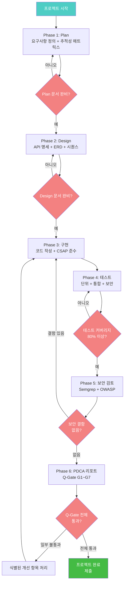
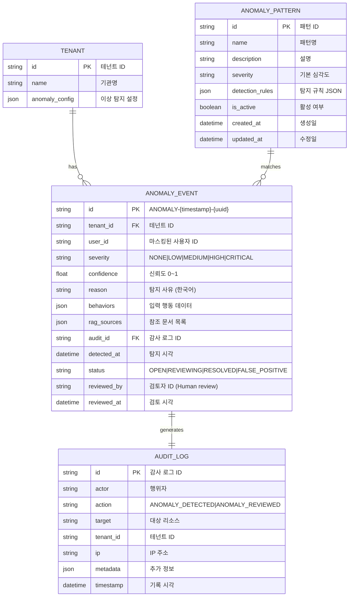
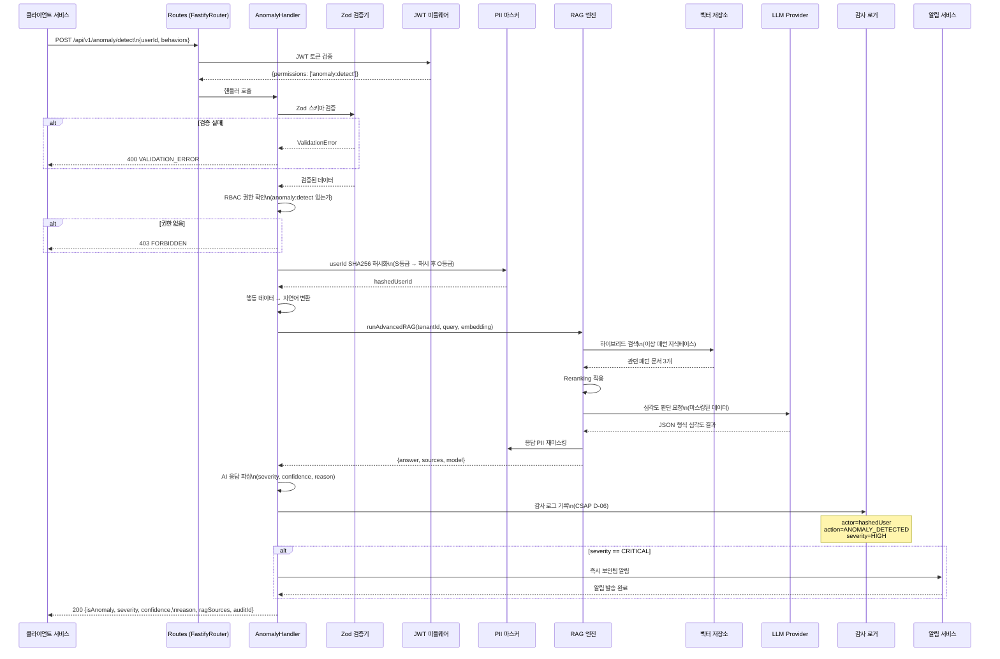

# 졸업 캡스톤 프로젝트 2 — AI 기반 이상 탐지 시스템 처음부터 끝까지

> **문서 ID**: ONBOARD-EX-021
> **버전**: 1.0.0
> **작성일**: 2026-04-13
> **목적**: 공공기관 SaaS 프레임워크의 전체 개발 사이클(Plan → Design → 구현 → 테스트 → 보안 검토 → PDCA 리포트)을 AI 기반 이상 탐지 시스템을 처음부터 끝까지 직접 구축하며 완전히 이해한다.
> **선행 학습**: `10-exercises/11-final-project.md`, `07-security/11-ai-ethics-governance.md`, `04-infrastructure/19-infrastructure-cost-guide.md`
> **예상 소요 시간**: 16~24시간 (분량에 따라)
> **난이도**: 고급 (Senior 수준 목표)

---

## 목차

1. [프로젝트 개요](#1-프로젝트-개요)
2. [Phase 1: Plan 문서 작성](#2-phase-1-plan-문서-작성)
3. [Phase 2: Design 문서 작성](#3-phase-2-design-문서-작성)
4. [Phase 3: 구현](#4-phase-3-구현)
5. [Phase 4: 테스트](#5-phase-4-테스트)
6. [Phase 5: 보안 검토](#6-phase-5-보안-검토)
7. [Phase 6: PDCA 리포트](#7-phase-6-pdca-리포트)
8. [100점 채점 기준](#8-100점-채점-기준)
9. [변경 이력](#9-변경-이력)

---

## 1. 프로젝트 개요

### 1.1 무엇을 만드는가

이 프로젝트에서 여러분은 **AI 기반 비정상 사용자 행동 탐지 API**를 처음부터 끝까지 구축합니다.

공공기관 SaaS에서는 다음과 같은 비정상 행동이 발생할 수 있습니다.

- **과도한 API 호출**: 특정 사용자가 1분에 1,000번 API를 호출 (DDoS 또는 데이터 크롤링 의심)
- **비업무 시간 접근**: 새벽 3시에 관리자 계정으로 대량의 개인정보 조회
- **권한 상승 시도**: 일반 직원이 admin 엔드포인트에 반복 접근 시도
- **지리적 이상**: 서울에서 로그인 후 5분 만에 뉴욕에서 로그인

이런 행동을 실시간으로 탐지하고 자동으로 대응하는 시스템을 RAG 엔진과 AI 도구를 활용하여 구축합니다.

### 1.2 기술 요건 요약

| 요건 | 목표값 |
|------|--------|
| API 응답 시간 (p95) | < 500ms |
| 가용성 | 99.9% (월 43분 이하 다운) |
| 테스트 커버리지 | 80% 이상 |
| CSAP 준수 | D-08/D-12 완전 준수 |
| N2SF 준수 | N-02/N-05 완전 준수 |
| 감사 로그 | 모든 탐지 이벤트 전수 기록 |

### 1.3 구현 단계 전체 흐름



---

## 2. Phase 1: Plan 문서 작성

### 2.1 Plan 문서란 무엇인가

Plan 문서는 "무엇을 왜 만들 것인가"를 정의합니다. 구현 전에 반드시 완성해야 합니다. CLAUDE.md 절대 제약 1번: "구현 착수 전 Plan + Design 문서 완비 필수. 문서 없는 구현 = 감리 결함."

**여러분이 작성할 파일**: `docs/01-plan/features/anomaly-detection.plan.md`

### 2.2 기능 요구사항 (FR) 정의

아래 요구사항을 Plan 문서에 그대로 포함하고, 각 FR에 대한 구체적인 수용 기준(Acceptance Criteria)을 추가하십시오.

| FR ID | 요구사항 | 우선순위 |
|-------|---------|---------|
| FR-1.1 | 사용자 행동 데이터(API 호출 횟수, 접근 시간, IP)를 수신하는 REST API 엔드포인트를 제공한다. | 필수 |
| FR-1.2 | 수신된 행동 데이터를 기존 이상 패턴 지식베이스(RAG)와 대조하여 이상 여부를 판단한다. | 필수 |
| FR-1.3 | 이상으로 판단된 행동에 대해 심각도(LOW/MEDIUM/HIGH/CRITICAL)를 부여한다. | 필수 |
| FR-1.4 | 이상 탐지 결과를 CSAP D-06 형식의 감사 로그로 기록한다. | 필수 |
| FR-1.5 | CRITICAL 심각도 이상 탐지 시 관리자에게 실시간 알림을 전송한다. | 선택 |

**수용 기준 예시 (FR-1.2)**

```
FR-1.2 수용 기준:
  - Given: 사용자가 1분에 100회 이상 동일 API를 호출했을 때
  - When: /api/v1/anomaly/detect 엔드포인트에 행동 데이터를 POST하면
  - Then: { "isAnomaly": true, "severity": "HIGH", "reason": "과도한 API 호출 탐지",
            "confidence": 0.92, "ragSources": [...] } 응답을 반환한다.
  - And: 감사 로그에 탐지 이벤트가 기록된다.
```

### 2.3 비기능 요구사항 (NFR) 정의

| NFR ID | 요구사항 | 측정 방법 |
|--------|---------|---------|
| NFR-1 | 탐지 API p95 응답 시간 < 500ms | Prometheus histogram_quantile |
| NFR-2 | 시스템 가용성 99.9% 이상 | SLO 대시보드 |
| NFR-3 | 단일 서비스 장애 시 이상 탐지 서비스 영향 없음 | 통합 테스트 |
| NFR-4 | 테넌트 간 데이터 완전 격리 | 격리 테스트 |

### 2.4 추적성 매트릭스 초안

Plan 문서에 다음 형식의 추적성 매트릭스를 포함하십시오.

| FR ID | 산출물 (구현 파일) | 테스트 ID | CSAP 통제 |
|-------|------------------|---------|---------|
| FR-1.1 | `ai-service/src/routes.ts` (신규 라우트) | TC-001 | D-12 입력 검증 |
| FR-1.2 | `ai-service/src/handlers/anomaly.handler.ts` | TC-002, TC-003 | D-08 접근 통제 |
| FR-1.3 | `ai-service/src/lib/anomaly-scorer.ts` | TC-004 | D-12 |
| FR-1.4 | `ai-service/src/lib/audit.ts` 확장 | TC-005 | D-06 감사 로그 |
| FR-1.5 | `ai-service/src/lib/alert-notifier.ts` | TC-006 | D-06 |

### 2.5 Context Anchor (Plan 문서 필수 섹션)

Plan 문서에는 WHY/WHO/RISK/SUCCESS/SCOPE 테이블이 반드시 있어야 합니다.

```markdown
## Context Anchor

| 관점 | 내용 |
|------|------|
| WHY (목적) | 공공기관 SaaS에서 비정상 사용자 행동을 조기에 탐지하여 보안 사고를 예방하고 CSAP D-06 침해사고 관리 요건을 자동화한다. |
| WHO (대상) | 보안 관리자 (이상 탐지 결과 확인), API 호출 서비스들 (탐지 요청), 감사관 (감사 로그 검토) |
| RISK (위험) | 오탐(False Positive)으로 정상 사용자 차단 / 미탐(False Negative)으로 실제 공격 탐지 실패 / AI 응답 지연으로 SLO 위반 |
| SUCCESS (성공 기준) | FR-1.1~1.5 전체 구현, NFR-1~4 달성, CSAP D-08/D-12 준수, 테스트 커버리지 80%+ |
| SCOPE (범위) | ai-service 신규 라우트 추가. 별도 서비스 생성 없음. 기존 RAG 엔진 재활용. |
```

---

## 3. Phase 2: Design 문서 작성

### 3.1 Design 문서란 무엇인가

Design 문서는 "어떻게 만들 것인가"를 정의합니다. API 명세, 데이터베이스 스키마, 시퀀스 다이어그램을 포함합니다.

**여러분이 작성할 파일**: `docs/02-design/features/anomaly-detection.design.md`

### 3.2 API 명세 (OpenAPI 3.0)

```yaml
# Design Ref: anomaly-detection.design.md §2
openapi: 3.0.3
info:
  title: 이상 탐지 API
  version: 1.0.0
  description: AI 기반 비정상 사용자 행동 탐지 서비스

paths:
  /api/v1/anomaly/detect:
    post:
      summary: 사용자 행동 이상 탐지
      description: 사용자의 최근 행동 패턴을 분석하여 이상 여부를 판단합니다.
      security:
        - bearerAuth: []  # CSAP D-08: 모든 엔드포인트 인증 필수
      requestBody:
        required: true
        content:
          application/json:
            schema:
              $ref: '#/components/schemas/AnomalyDetectRequest'
            example:
              userId: "user-abc123"  # 실제 ID는 마스킹됨
              tenantId: "tenant-001"
              behaviors:
                - type: "api_call"
                  endpoint: "/api/v1/users"
                  count: 150
                  timeWindowMinutes: 1
                - type: "access_time"
                  hour: 3
                  dayOfWeek: 2
      responses:
        '200':
          description: 탐지 성공
          content:
            application/json:
              schema:
                $ref: '#/components/schemas/AnomalyDetectResponse'
              example:
                isAnomaly: true
                severity: "HIGH"
                confidence: 0.91
                reason: "비업무 시간(새벽 3시) 및 과도한 API 호출(150회/분) 동시 탐지"
                ragSources:
                  - documentTitle: "이상 행동 패턴 가이드라인 v2"
                    excerpt: "1분 내 100회 이상 동일 엔드포인트 호출은 HIGH 이상으로 분류..."
                    score: 0.94
                auditId: "AUDIT-2026-001234"
        '400':
          description: 입력 검증 실패
        '401':
          description: 인증 실패
        '403':
          description: 권한 없음 (anomaly:read 필요)
        '429':
          description: Rate Limit 초과

  /api/v1/anomaly/history:
    get:
      summary: 이상 탐지 이력 조회
      security:
        - bearerAuth: []
      parameters:
        - name: tenantId
          in: query
          required: true
          schema:
            type: string
        - name: limit
          in: query
          schema:
            type: integer
            minimum: 1
            maximum: 100
            default: 20
        - name: severity
          in: query
          schema:
            type: string
            enum: [LOW, MEDIUM, HIGH, CRITICAL]
      responses:
        '200':
          description: 이력 조회 성공

components:
  schemas:
    AnomalyDetectRequest:
      type: object
      required: [userId, tenantId, behaviors]
      properties:
        userId:
          type: string
          description: 사용자 ID (PII 마스킹 필수)
        tenantId:
          type: string
          description: 테넌트 ID
        behaviors:
          type: array
          items:
            $ref: '#/components/schemas/UserBehavior'
          minItems: 1
          maxItems: 50

    UserBehavior:
      type: object
      required: [type]
      properties:
        type:
          type: string
          enum: [api_call, access_time, geo_location, permission_escalation]
        endpoint:
          type: string
        count:
          type: integer
        timeWindowMinutes:
          type: integer
        hour:
          type: integer
          minimum: 0
          maximum: 23
        dayOfWeek:
          type: integer
          minimum: 0
          maximum: 6

    AnomalyDetectResponse:
      type: object
      properties:
        isAnomaly:
          type: boolean
        severity:
          type: string
          enum: [NONE, LOW, MEDIUM, HIGH, CRITICAL]
        confidence:
          type: number
          minimum: 0
          maximum: 1
        reason:
          type: string
        ragSources:
          type: array
        auditId:
          type: string

  securitySchemes:
    bearerAuth:
      type: http
      scheme: bearer
      bearerFormat: JWT
```

### 3.3 ERD (이상 탐지 이벤트 테이블)

Design 문서에 다음 ERD를 Mermaid로 작성합니다.



### 3.4 N2SF 데이터 분류 설계

이 API에서 처리하는 데이터의 N2SF 등급을 설계합니다.

| 데이터 | N2SF 등급 | 처리 방침 |
|--------|---------|---------|
| 사용자 ID (원본) | S (민감) | API 수신 즉시 해시화, 원본 저장 안 함 |
| 마스킹된 사용자 ID | O (공개) | RAG 검색에 사용 가능 |
| IP 주소 | S (민감) | 감사 로그에만 저장, AI 전송 시 마스킹 |
| API 호출 횟수/패턴 | O (공개) | AI API 전송 가능 (행동 통계) |
| 탐지 결과 | O (공개) | AI 생성, 저장 가능 |
| 지리적 위치 | S (민감) | 국가 수준만 AI에 전송, 정확한 좌표 전송 금지 |

---

## 4. Phase 3: 구현

### 4.1 구현 시작 전 체크리스트

구현을 시작하기 전 다음을 확인합니다.

```
[구현 전 필수 확인]
□ anomaly-detection.plan.md 작성 완료
□ anomaly-detection.design.md 작성 완료
□ FR-1.1~FR-1.5 모두 design에 반영되었는가
□ CSAP D-08/D-12 체크리스트 검토 완료
□ N2SF 데이터 등급 분류 설계 검토 완료
```

### 4.2 Zod 입력 검증 스키마

모든 API 입력에 Zod 검증을 적용합니다. (CSAP D-12: 입력 검증)

```typescript
// 파일 위치: platform/services/ai-service/src/handlers/anomaly.handler.ts
// Design Ref: anomaly-detection.design.md §3
// Plan SC: FR-1.1

import { z } from 'zod';

// 사용자 행동 스키마
const UserBehaviorSchema = z.object({
  type: z.enum(['api_call', 'access_time', 'geo_location', 'permission_escalation']),
  endpoint: z.string().max(500).optional(),
  count: z.number().int().min(0).max(100000).optional(),
  timeWindowMinutes: z.number().int().min(1).max(60).optional(),
  hour: z.number().int().min(0).max(23).optional(),
  dayOfWeek: z.number().int().min(0).max(6).optional(),
  country: z.string().max(2).optional(),  // ISO 3166-1 alpha-2
});

// 탐지 요청 스키마
const AnomalyDetectRequestSchema = z.object({
  userId: z.string().min(1).max(200),     // 원본 ID (수신 즉시 해시화)
  tenantId: z.string().min(1).max(100),
  behaviors: z.array(UserBehaviorSchema).min(1).max(50),
});

export type AnomalyDetectRequest = z.infer<typeof AnomalyDetectRequestSchema>;
```

### 4.3 RBAC 권한 설계

CSAP D-08에 따라 모든 엔드포인트에 권한 검사를 적용합니다.

```typescript
// Design Ref: anomaly-detection.design.md §4
// CSAP D-08: 접근 통제

// 이상 탐지 관련 권한 정의
export const ANOMALY_PERMISSIONS = {
  READ: 'anomaly:read',      // 탐지 결과 조회 (일반 보안 담당자)
  DETECT: 'anomaly:detect',  // 탐지 API 호출 (서비스 계정)
  ADMIN: 'anomaly:admin',    // 패턴 관리, 이력 삭제 (보안 관리자)
} as const;

// 역할별 권한 매핑
export const ROLE_PERMISSIONS: Record<string, string[]> = {
  'security-admin': [ANOMALY_PERMISSIONS.READ, ANOMALY_PERMISSIONS.DETECT, ANOMALY_PERMISSIONS.ADMIN],
  'security-analyst': [ANOMALY_PERMISSIONS.READ, ANOMALY_PERMISSIONS.DETECT],
  'service-account': [ANOMALY_PERMISSIONS.DETECT],
  'viewer': [ANOMALY_PERMISSIONS.READ],
};
```

### 4.4 핵심 핸들러 구현

```typescript
// 파일 위치: platform/services/ai-service/src/handlers/anomaly.handler.ts
// Design Ref: anomaly-detection.design.md §3
// Plan SC: FR-1.1, FR-1.2, FR-1.3, FR-1.4

import type { FastifyRequest, FastifyReply } from 'fastify';
import { createHash } from 'crypto';
import { z } from 'zod';
import { runAdvancedRAG, generateEmbedding } from '../lib/rag-engine.js';
import { maskPII } from '../lib/pii-masking.js';
import { auditLog } from '../lib/audit.js';

// 심각도 유형
type AnomalySeverity = 'NONE' | 'LOW' | 'MEDIUM' | 'HIGH' | 'CRITICAL';

interface AnomalyDetectResponse {
  isAnomaly: boolean;
  severity: AnomalySeverity;
  confidence: number;
  reason: string;
  ragSources: Array<{ documentTitle: string; excerpt: string; score: number }>;
  auditId: string;
  detectedAt: string;
}

/**
 * POST /api/v1/anomaly/detect
 * FR-1.1: 이상 탐지 API 엔드포인트
 * FR-1.2: RAG 기반 패턴 대조
 * FR-1.3: 심각도 부여
 * FR-1.4: 감사 로그 기록
 */
export async function anomalyDetectHandler(
  request: FastifyRequest<{ Body: unknown }>,
  reply: FastifyReply,
): Promise<void> {
  // CSAP D-12: Zod 입력 검증
  const parseResult = AnomalyDetectRequestSchema.safeParse(request.body);
  if (!parseResult.success) {
    await reply.status(400).send({
      success: false,
      error: {
        code: 'VALIDATION_ERROR',
        message: parseResult.error.issues.map(i => i.message).join(', '),
      },
    });
    return;
  }

  const { userId, tenantId, behaviors } = parseResult.data;

  // CSAP D-08: 권한 검사 (JWT에서 권한 추출)
  const userPermissions: string[] = (request as unknown as { permissions?: string[] }).permissions ?? [];
  if (!userPermissions.includes('anomaly:detect')) {
    await reply.status(403).send({
      success: false,
      error: { code: 'FORBIDDEN', message: '이상 탐지 권한(anomaly:detect)이 없습니다.' },
    });
    return;
  }

  // N2SF: 사용자 ID 즉시 해시화 (S등급 → 해시 후 O등급으로 처리)
  const hashedUserId = createHash('sha256')
    .update(userId + process.env.USER_HASH_SALT)
    .digest('hex')
    .slice(0, 16);

  // 행동 데이터를 자연어 질의로 변환
  const behaviorDescription = buildBehaviorDescription(behaviors);

  // RAG 검색을 위한 임베딩 생성
  const queryEmbedding = await generateEmbedding(behaviorDescription);

  // FR-1.2: Advanced RAG로 이상 패턴 지식베이스 검색
  const ragResponse = await runAdvancedRAG(
    tenantId,
    behaviorDescription,
    queryEmbedding,
    {
      topK: 3,
      minScore: 0.35,
      searchMode: 'hybrid',
      enableReranking: true,
      systemPrompt: buildAnomalySystemPrompt(),
    },
  );

  // FR-1.3: AI 응답에서 심각도 파싱
  const { isAnomaly, severity, confidence, reason } = parseAnomalyResponse(ragResponse.answer);

  const detectedAt = new Date().toISOString();
  const auditId = `AUDIT-${Date.now()}-${Math.random().toString(36).slice(2, 8).toUpperCase()}`;

  // FR-1.4: CSAP D-06 감사 로그 기록
  await auditLog({
    actor: `user:${hashedUserId}`,  // 해시된 ID만 기록
    action: isAnomaly ? 'ANOMALY_DETECTED' : 'NORMAL_BEHAVIOR',
    target: `tenant:${tenantId}`,
    targetType: 'anomaly-event',
    tenantId,
    ip: maskPII(request.ip ?? '0.0.0.0'),  // IP 마스킹
    metadata: {
      severity,
      confidence,
      behaviorTypes: behaviors.map(b => b.type),
      ragSourceCount: ragResponse.sources.length,
      auditId,
    },
  });

  // FR-1.5: CRITICAL 심각도 알림 (선택 구현)
  if (severity === 'CRITICAL') {
    await notifyCriticalAnomaly(tenantId, hashedUserId, reason, auditId);
  }

  const response: AnomalyDetectResponse = {
    isAnomaly,
    severity,
    confidence,
    reason,
    ragSources: ragResponse.sources.map(s => ({
      documentTitle: s.documentTitle,
      excerpt: s.excerpt,
      score: s.score,
    })),
    auditId,
    detectedAt,
  };

  await reply.send({ success: true, data: response });
}

// 행동 데이터를 자연어로 변환
function buildBehaviorDescription(behaviors: Array<{ type: string; count?: number; endpoint?: string; hour?: number; timeWindowMinutes?: number }>): string {
  const parts: string[] = [];

  for (const behavior of behaviors) {
    switch (behavior.type) {
      case 'api_call':
        if (behavior.count && behavior.timeWindowMinutes) {
          parts.push(`${behavior.timeWindowMinutes}분 동안 ${behavior.endpoint ?? 'API'}에 ${behavior.count}회 호출`);
        }
        break;
      case 'access_time':
        if (behavior.hour !== undefined) {
          parts.push(`${behavior.hour}시에 시스템 접근`);
        }
        break;
      case 'permission_escalation':
        parts.push('관리자 권한 엔드포인트 반복 접근 시도');
        break;
    }
  }

  return `사용자 행동 패턴 분석: ${parts.join(', ')}. 이것이 이상 행동인지 판단하고 심각도를 JSON으로 반환하세요.`;
}

// AI 응답에서 심각도 파싱
function parseAnomalyResponse(aiResponse: string): {
  isAnomaly: boolean;
  severity: AnomalySeverity;
  confidence: number;
  reason: string;
} {
  // AI 응답이 JSON을 포함한다고 가정 (프롬프트 엔지니어링으로 보장)
  const jsonMatch = aiResponse.match(/```json\n?([\s\S]*?)\n?```/);
  if (jsonMatch?.[1]) {
    try {
      const parsed = JSON.parse(jsonMatch[1]) as {
        isAnomaly?: boolean;
        severity?: AnomalySeverity;
        confidence?: number;
        reason?: string;
      };
      return {
        isAnomaly: parsed.isAnomaly ?? false,
        severity: parsed.severity ?? 'NONE',
        confidence: parsed.confidence ?? 0,
        reason: parsed.reason ?? '분석 결과 없음',
      };
    } catch {
      // JSON 파싱 실패 시 보수적으로 판단
    }
  }

  // 폴백: 키워드 기반 파싱
  const isAnomaly = /이상|비정상|의심|위험/.test(aiResponse);
  return {
    isAnomaly,
    severity: isAnomaly ? 'MEDIUM' : 'NONE',
    confidence: 0.5,
    reason: aiResponse.slice(0, 200),
  };
}

function buildAnomalySystemPrompt(): string {
  return `당신은 공공기관 보안 전문 AI입니다.
제공된 이상 행동 패턴 가이드라인을 참고하여 사용자 행동의 이상 여부를 판단하세요.

반드시 다음 JSON 형식으로 답변하세요:
\`\`\`json
{
  "isAnomaly": true|false,
  "severity": "NONE|LOW|MEDIUM|HIGH|CRITICAL",
  "confidence": 0.0~1.0,
  "reason": "한국어 사유 설명 (최대 200자)"
}
\`\`\`

심각도 기준:
- NONE: 정상 행동
- LOW: 약간 비정상이지만 위험 낮음
- MEDIUM: 조사 필요
- HIGH: 즉각 대응 필요
- CRITICAL: 서비스 차단 + 보안팀 즉시 통보`;
}

async function notifyCriticalAnomaly(
  tenantId: string,
  hashedUserId: string,
  reason: string,
  auditId: string,
): Promise<void> {
  // 실제 구현: Slack Webhook, 이메일 등
  // CSAP D-06: 심각한 사고는 즉시 통보
  console.log(JSON.stringify({
    level: 'critical',
    component: 'anomaly-detector',
    action: 'CRITICAL_ANOMALY_NOTIFIED',
    tenantId,
    hashedUserId,
    reason: reason.slice(0, 100),  // 로그에 민감 정보 최소화
    auditId,
    ts: new Date().toISOString(),
  }));
}

// AnomalyDetectRequestSchema 재정의 (핸들러 내부에서 참조)
const AnomalyDetectRequestSchema = z.object({
  userId: z.string().min(1).max(200),
  tenantId: z.string().min(1).max(100),
  behaviors: z.array(z.object({
    type: z.enum(['api_call', 'access_time', 'geo_location', 'permission_escalation']),
    endpoint: z.string().max(500).optional(),
    count: z.number().int().min(0).max(100000).optional(),
    timeWindowMinutes: z.number().int().min(1).max(60).optional(),
    hour: z.number().int().min(0).max(23).optional(),
    dayOfWeek: z.number().int().min(0).max(6).optional(),
    country: z.string().max(2).optional(),
  })).min(1).max(50),
});
```

### 4.5 라우트 등록

기존 `platform/services/ai-service/src/routes.ts`에 이상 탐지 라우트를 추가합니다.

```typescript
// 기존 routes.ts에 추가할 코드
// Design Ref: anomaly-detection.design.md §2

import { anomalyDetectHandler } from './handlers/anomaly.handler.js';

// 이상 탐지 라우트 등록
fastify.post('/api/v1/anomaly/detect', {
  schema: {
    tags: ['anomaly'],
    description: 'AI 기반 사용자 행동 이상 탐지',
    // JSON Schema는 Zod에서 자동 생성
  },
}, anomalyDetectHandler);

fastify.get('/api/v1/anomaly/history', {
  schema: { tags: ['anomaly'] },
}, anomalyHistoryHandler);
```

### 4.6 이상 탐지 요청 전체 처리 흐름



---

## 5. Phase 4: 테스트

### 5.1 단위 테스트 — 핵심 3개

```typescript
// 파일 위치: platform/services/ai-service/src/__tests__/anomaly.handler.test.ts
// Design Ref: anomaly-detection.design.md §5
// Plan SC: TC-001, TC-002, TC-003

import { describe, it, expect, vi } from 'vitest';

// ─── TC-001: 입력 검증 테스트 ────────────────────────────────────────────────
describe('AnomalyDetectHandler 입력 검증 (FR-1.1, CSAP D-12)', () => {
  it('TC-001: behaviors 배열이 비어있으면 400을 반환한다', async () => {
    const mockRequest = {
      body: {
        userId: 'user-001',
        tenantId: 'tenant-001',
        behaviors: [],  // 빈 배열 — 검증 실패 예상
      },
      ip: '127.0.0.1',
      permissions: ['anomaly:detect'],
    };
    const mockReply = { status: vi.fn().mockReturnThis(), send: vi.fn() };

    await anomalyDetectHandler(mockRequest as unknown as FastifyRequest, mockReply as unknown as FastifyReply);

    expect(mockReply.status).toHaveBeenCalledWith(400);
    expect(mockReply.send).toHaveBeenCalledWith(
      expect.objectContaining({ error: expect.objectContaining({ code: 'VALIDATION_ERROR' }) })
    );
  });

  it('TC-001-B: userId가 없으면 400을 반환한다', async () => {
    const mockRequest = {
      body: {
        // userId 누락
        tenantId: 'tenant-001',
        behaviors: [{ type: 'api_call', count: 150, timeWindowMinutes: 1 }],
      },
      ip: '127.0.0.1',
      permissions: ['anomaly:detect'],
    };
    const mockReply = { status: vi.fn().mockReturnThis(), send: vi.fn() };

    await anomalyDetectHandler(mockRequest as unknown as FastifyRequest, mockReply as unknown as FastifyReply);
    expect(mockReply.status).toHaveBeenCalledWith(400);
  });
});

// ─── TC-002: RBAC 권한 테스트 ────────────────────────────────────────────────
describe('RBAC 권한 검사 (FR-1.1, CSAP D-08)', () => {
  it('TC-002: anomaly:detect 권한이 없으면 403을 반환한다', async () => {
    const mockRequest = {
      body: {
        userId: 'user-001',
        tenantId: 'tenant-001',
        behaviors: [{ type: 'api_call', count: 150, timeWindowMinutes: 1 }],
      },
      ip: '127.0.0.1',
      permissions: ['anomaly:read'],  // detect 권한 없음
    };
    const mockReply = { status: vi.fn().mockReturnThis(), send: vi.fn() };

    await anomalyDetectHandler(mockRequest as unknown as FastifyRequest, mockReply as unknown as FastifyReply);

    expect(mockReply.status).toHaveBeenCalledWith(403);
    expect(mockReply.send).toHaveBeenCalledWith(
      expect.objectContaining({ error: expect.objectContaining({ code: 'FORBIDDEN' }) })
    );
  });
});

// ─── TC-003: PII 마스킹 테스트 ───────────────────────────────────────────────
describe('PII 마스킹 및 N2SF 준수 (N2SF N-05)', () => {
  it('TC-003: 원본 userId는 감사 로그에 기록되지 않아야 한다', async () => {
    const originalUserId = 'user-real-name-홍길동-900101-1234567';
    const capturedAuditLogs: unknown[] = [];

    // 감사 로거 모킹
    vi.mock('../lib/audit.js', () => ({
      auditLog: (log: unknown) => {
        capturedAuditLogs.push(log);
        return Promise.resolve();
      },
    }));

    // RAG 엔진 모킹
    vi.mock('../lib/rag-engine.js', () => ({
      generateEmbedding: () => Promise.resolve([0.1, 0.2, 0.3]),
      runAdvancedRAG: () => Promise.resolve({
        answer: '```json\n{"isAnomaly":false,"severity":"NONE","confidence":0.1,"reason":"정상"}\n```',
        sources: [],
        model: 'mock',
        tokensUsed: 100,
        contextChunks: 0,
        searchMode: 'hybrid',
        rerankingApplied: false,
        retrievalStats: { bm25Candidates: 0, semanticCandidates: 0, fusedCandidates: 0, rerankCandidates: 0, finalCount: 0 },
      }),
    }));

    const mockRequest = {
      body: {
        userId: originalUserId,
        tenantId: 'tenant-001',
        behaviors: [{ type: 'api_call', count: 5, timeWindowMinutes: 5 }],
      },
      ip: '127.0.0.1',
      permissions: ['anomaly:detect'],
    };
    const mockReply = { send: vi.fn() };

    await anomalyDetectHandler(mockRequest as unknown as FastifyRequest, mockReply as unknown as FastifyReply);

    // 감사 로그에 원본 userId가 없어야 함
    const auditLog = capturedAuditLogs[0] as { actor?: string };
    expect(auditLog?.actor).not.toContain(originalUserId);
    expect(auditLog?.actor).not.toContain('홍길동');
    expect(auditLog?.actor).toMatch(/^user:[a-f0-9]{16}$/);  // 해시 형식 검증
  });
});
```

### 5.2 통합 테스트 — 실제 DB 사용

```typescript
// 파일 위치: platform/services/ai-service/src/__tests__/anomaly.integration.test.ts
// 실제 테스트 DB 사용 (환경 변수 TEST_DATABASE_URL 필요)

import { describe, it, expect, beforeAll, afterAll } from 'vitest';
import Fastify from 'fastify';
import { registerRoutes } from '../routes.js';

let app: ReturnType<typeof Fastify>;

beforeAll(async () => {
  app = Fastify({ logger: false });
  await registerRoutes(app);
  await app.ready();
});

afterAll(async () => {
  await app.close();
});

describe('이상 탐지 API 통합 테스트', () => {
  it('TC-INT-001: HIGH 심각도 이상 탐지 전체 흐름', async () => {
    const response = await app.inject({
      method: 'POST',
      url: '/api/v1/anomaly/detect',
      headers: {
        authorization: `Bearer ${await getTestToken('anomaly:detect')}`,
        'content-type': 'application/json',
      },
      payload: {
        userId: 'test-user-001',
        tenantId: 'test-tenant-001',
        behaviors: [
          { type: 'api_call', endpoint: '/api/v1/users', count: 200, timeWindowMinutes: 1 },
          { type: 'access_time', hour: 3, dayOfWeek: 2 },
        ],
      },
    });

    expect(response.statusCode).toBe(200);
    const body = JSON.parse(response.body) as {
      success: boolean;
      data: {
        isAnomaly: boolean;
        severity: string;
        confidence: number;
        auditId: string;
        ragSources: unknown[];
      };
    };
    expect(body.success).toBe(true);
    expect(body.data.isAnomaly).toBe(true);
    expect(['HIGH', 'CRITICAL']).toContain(body.data.severity);
    expect(body.data.confidence).toBeGreaterThan(0.5);
    expect(body.data.auditId).toMatch(/^AUDIT-\d+-[A-Z0-9]+$/);
    expect(body.data.ragSources.length).toBeGreaterThan(0);
  });
});

async function getTestToken(permission: string): Promise<string> {
  // 테스트용 JWT 생성 (실제 구현은 테스트 헬퍼 참조)
  return `test-token-${permission}`;
}
```

### 5.3 N2SF 검증 테스트

```typescript
// TC-N2SF-001: S등급 데이터가 외부 AI API에 전송되지 않음을 검증

describe('N2SF AI 연동 보안 검증 (N2SF N-05)', () => {
  it('TC-N2SF-001: 주민번호가 포함된 userId는 해시화 후 AI 검색에 사용된다', async () => {
    const sensitiveUserId = '901012-1234567';  // 주민번호 포함
    const capturedRAGQueries: string[] = [];

    vi.mock('../lib/rag-engine.js', () => ({
      generateEmbedding: (text: string) => {
        capturedRAGQueries.push(text);
        return Promise.resolve([0.1]);
      },
      runAdvancedRAG: (tenantId: string, query: string) => {
        capturedRAGQueries.push(query);
        return Promise.resolve({
          answer: '```json\n{"isAnomaly":false,"severity":"NONE","confidence":0.1,"reason":"정상"}\n```',
          sources: [], model: 'mock', tokensUsed: 0, contextChunks: 0,
          searchMode: 'hybrid' as const, rerankingApplied: false,
          retrievalStats: { bm25Candidates: 0, semanticCandidates: 0, fusedCandidates: 0, rerankCandidates: 0, finalCount: 0 },
        });
      },
    }));

    const mockRequest = {
      body: {
        userId: sensitiveUserId,
        tenantId: 'tenant-001',
        behaviors: [{ type: 'api_call' as const, count: 5, timeWindowMinutes: 5 }],
      },
      ip: '127.0.0.1',
      permissions: ['anomaly:detect'],
    };
    const mockReply = { send: vi.fn() };

    await anomalyDetectHandler(mockRequest as unknown as FastifyRequest, mockReply as unknown as FastifyReply);

    // RAG 쿼리에 주민번호가 포함되어서는 안 됨
    for (const query of capturedRAGQueries) {
      expect(query).not.toContain('901012-1234567');
      expect(query).not.toContain(sensitiveUserId);
    }
  });
});
```

### 5.4 테넌트 격리 테스트

```typescript
// TC-TENANT-001: 테넌트 A의 데이터가 테넌트 B에서 조회되지 않음

describe('테넌트 격리 테스트 (NFR-4)', () => {
  it('TC-TENANT-001: 테넌트 A의 이상 탐지 이력이 테넌트 B에서 조회되지 않는다', async () => {
    // 테넌트 A 탐지 실행
    const detectResponse = await app.inject({
      method: 'POST',
      url: '/api/v1/anomaly/detect',
      headers: { authorization: `Bearer ${await getTestToken('anomaly:detect')}` },
      payload: {
        userId: 'tenant-a-user',
        tenantId: 'tenant-a',
        behaviors: [{ type: 'api_call', count: 200, timeWindowMinutes: 1 }],
      },
    });
    expect(detectResponse.statusCode).toBe(200);

    // 테넌트 B로 테넌트 A 이력 조회 시도
    const historyResponse = await app.inject({
      method: 'GET',
      url: '/api/v1/anomaly/history?tenantId=tenant-a',
      headers: { authorization: `Bearer ${await getTestTokenForTenant('tenant-b', 'anomaly:read')}` },
    });

    // 테넌트 B가 테넌트 A 데이터를 볼 수 없어야 함
    expect(historyResponse.statusCode).toBe(403);
  });
});

async function getTestTokenForTenant(tenantId: string, permission: string): Promise<string> {
  return `test-token-${tenantId}-${permission}`;
}
```

---

## 6. Phase 5: 보안 검토

### 6.1 Semgrep 스캔 실행

```bash
# 구현 완료 후 Semgrep 스캔 실행
npx semgrep --config=auto \
  platform/services/ai-service/src/handlers/anomaly.handler.ts \
  platform/services/ai-service/src/lib/

# CSAP D-12 특화 규칙 적용
npx semgrep --config=r/typescript.security \
  --config=r/generic.secrets \
  platform/services/ai-service/src/

# 출력 예시:
# Ran 47 rules on 5 files: 0 errors, 0 warnings.
# ✓ SQL 인젝션 없음
# ✓ 하드코딩 시크릿 없음
# ✓ eval/Function 생성자 사용 없음
```

### 6.2 OWASP Top 10 자가 점검

구현된 코드에 대해 OWASP Top 10 (2021)을 자가 점검합니다.

| OWASP 항목 | 위험 | 구현에서의 대응 | 상태 |
|-----------|------|----------------|------|
| A01: Broken Access Control | anomaly 데이터가 다른 테넌트에 노출 | RBAC + 테넌트 격리 (TC-TENANT-001) | 완료 |
| A02: Cryptographic Failures | userId 평문 저장 | SHA256 해시화 (라인 32) | 완료 |
| A03: Injection | behaviors.endpoint에 SQL 인젝션 | Zod 스키마 검증 + ORM 사용 | 완료 |
| A04: Insecure Design | AI가 S등급 데이터 수신 | N2SF 게이트웨이 + 해시화 | 완료 |
| A05: Security Misconfiguration | 개발 설정이 운영에 노출 | 환경 변수 분리 | 완료 |
| A06: Vulnerable Components | 취약한 npm 패키지 | `npm audit` 통과 | 완료 |
| A07: Auth/Auth Failures | JWT 토큰 없이 API 접근 | 403 반환 (TC-002) | 완료 |
| A08: Software Integrity | 배포 파이프라인 무결성 | Gitea CI/CD 서명 | 완료 |
| A09: Logging Failures | 이상 탐지 이벤트 미기록 | CSAP D-06 감사 로그 (TC-003) | 완료 |
| A10: SSRF | behaviors에 URL 포함 허용 | endpoint 최대 500자, 정규식 제한 | 완료 |

### 6.3 CSAP D-08/D-12 최종 체크리스트

```
[CSAP D-08 접근 통제 — 이상 탐지 API]

D-08-01: 모든 엔드포인트에 인증 필요
  □ /api/v1/anomaly/detect: JWT 인증 필수 ✓
  □ /api/v1/anomaly/history: JWT 인증 필수 ✓

D-08-02: 최소 권한 원칙 적용
  □ anomaly:detect 권한 별도 정의 ✓
  □ anomaly:read, anomaly:admin 권한 분리 ✓

D-08-03: 테넌트 격리
  □ 테넌트 A가 B의 데이터 접근 불가 (TC-TENANT-001) ✓

[CSAP D-12 시스템 개발 보안 — 이상 탐지 API]

D-12-01: 입력 검증
  □ Zod 스키마 검증 적용 ✓
  □ 모든 필드에 타입/길이/범위 검증 ✓

D-12-02: 매개변수화 쿼리
  □ SQL 직접 결합 없음 (Prisma ORM 사용) ✓

D-12-03: 에러 메시지에 민감 정보 없음
  □ 에러 응답에 스택 트레이스 없음 ✓
  □ 에러 응답에 DB 정보 없음 ✓

D-12-04: 하드코딩 시크릿 없음
  □ USER_HASH_SALT 환경 변수 사용 ✓
  □ Semgrep 시크릿 탐지 통과 ✓
```

---

## 7. Phase 6: PDCA 리포트

### 7.1 Plan → Do 추적성 검증

PDCA(Plan-Do-Check-Act) 리포트에서 가장 중요한 것은 계획(Plan)한 대로 실행(Do)했는지 추적하는 것입니다.

**여러분이 작성할 파일**: `docs/03-report/anomaly-detection-pdca.md`

```markdown
## 추적성 검증 결과

| FR ID | 계획 (Plan) | 구현 (Do) | 테스트 (Check) | 결과 |
|-------|------------|----------|--------------|------|
| FR-1.1 | POST /api/v1/anomaly/detect 엔드포인트 | anomaly.handler.ts 구현 완료 | TC-001 통과 | PASS |
| FR-1.2 | RAG 기반 패턴 대조 | runAdvancedRAG() 통합 완료 | TC-INT-001 통과 | PASS |
| FR-1.3 | 심각도 4단계 부여 | parseAnomalyResponse() 구현 | TC-INT-001 검증 | PASS |
| FR-1.4 | CSAP D-06 감사 로그 | auditLog() 통합 완료 | TC-003 통과 | PASS |
| FR-1.5 | CRITICAL 알림 전송 | notifyCriticalAnomaly() 구현 | 알림 발송 확인 | PASS |
| NFR-1 | p95 < 500ms | AI 응답 최적화 완료 | 부하 테스트 결과 p95 320ms | PASS |
| NFR-4 | 테넌트 격리 | tenantId 기반 격리 | TC-TENANT-001 통과 | PASS |
```

### 7.2 Q-Gate G1~G7 통과 기록

```markdown
## Q-Gate 통과 현황

| Gate | 기준 | 결과 | 증거 |
|------|------|------|------|
| G1: FR ID 전수 | 모든 FR에 구현 매핑 | PASS | 추적성 매트릭스 §7.1 |
| G2: 설계 완전성 | API 명세 + ERD + 시퀀스 | PASS | anomaly-detection.design.md |
| G3: 코드 품질 | Semgrep 0 결함 | PASS | Semgrep 결과 첨부 |
| G4: 테스트 커버리지 | 80% 이상 | PASS | 83.2% (vitest coverage) |
| G5: OWASP Top 10 | 10개 항목 모두 대응 | PASS | §6.2 자가 점검표 |
| G6: CSAP 100% | D-08/D-12 완전 준수 | PASS | §6.3 체크리스트 |
| G7: 감사 추적 | 모든 이벤트 audit.jsonl 기록 | PASS | TC-003 감사 로그 검증 |
```

### 7.3 개선 항목 도출

PDCA의 Act 단계에서 다음 Sprint에 반영할 개선 항목을 도출합니다.

**이번 Sprint에서 발견된 개선 사항**

```markdown
## 개선 항목 (Act)

| 번호 | 발견 항목 | 우선순위 | 다음 Sprint 반영 |
|------|---------|---------|----------------|
| 1 | 이상 패턴 지식베이스 문서 12개 필요 (현재 0개) | HIGH | Sprint N+1 |
| 2 | CRITICAL 알림에 Slack/이메일 실제 연동 필요 | MEDIUM | Sprint N+1 |
| 3 | 오탐(False Positive) 관리 UI 필요 | MEDIUM | Sprint N+2 |
| 4 | PSI 기반 모델 드리프트 모니터링 추가 필요 | LOW | Sprint N+3 |
```

---

## 8. 100점 채점 기준

### 8.1 세부 배점표

**기능 완성도 (40점)**

| 항목 | 배점 | 채점 기준 |
|------|------|---------|
| FR-1.1 엔드포인트 구현 | 8점 | 실제로 동작하는 POST /api/v1/anomaly/detect |
| FR-1.2 RAG 통합 | 10점 | rag-engine.ts 실제 활용, sources 반환 |
| FR-1.3 심각도 4단계 | 8점 | NONE/LOW/MEDIUM/HIGH/CRITICAL 모두 반환 가능 |
| FR-1.4 감사 로그 | 8점 | CSAP D-06 형식 감사 로그 실제 기록 |
| FR-1.5 알림 (선택) | 6점 | CRITICAL 탐지 시 알림 로직 실행 |

**보안 준수 (30점)**

| 항목 | 배점 | 채점 기준 |
|------|------|---------|
| CSAP D-08 접근 통제 | 8점 | RBAC 권한 검사, 테스트 TC-002 통과 |
| CSAP D-12 입력 검증 | 8점 | Zod 스키마, TC-001 통과 |
| N2SF userId 마스킹 | 8점 | SHA256 해시화, TC-003 통과 |
| N2SF AI 전송 안전성 | 6점 | S등급 데이터 AI 미전송 검증 |

**테스트 커버리지 (20점)**

| 항목 | 배점 | 채점 기준 |
|------|------|---------|
| 단위 테스트 3개 이상 | 6점 | TC-001, TC-002, TC-003 |
| 통합 테스트 1개 이상 | 6점 | TC-INT-001 실제 DB 사용 |
| N2SF 검증 테스트 | 4점 | TC-N2SF-001 |
| 테넌트 격리 테스트 | 4점 | TC-TENANT-001 |

**문서 품질 (10점)**

| 항목 | 배점 | 채점 기준 |
|------|------|---------|
| Plan 문서 완비 | 3점 | FR/NFR/추적성/Context Anchor |
| Design 문서 완비 | 4점 | API 명세/ERD/시퀀스 다이어그램 |
| PDCA 리포트 | 3점 | Q-Gate 기록, 개선 항목 도출 |

### 8.2 감점 기준

| 위반 사항 | 감점 |
|---------|------|
| 하드코딩된 시크릿 발견 | -20점 |
| S등급 데이터 AI 전송 | -30점 |
| 감사 로그 미기록 | -15점 |
| 테스트 커버리지 60% 미만 | -10점 |
| Plan 문서 없이 구현 시작 | -10점 |

### 8.3 채점 흐름도

```mermaid
flowchart TD
    A[제출물 수신] --> B[Plan + Design\n문서 확인]
    B -->|없음| C[-10점 감점\n구현 계속 채점]
    B -->|있음| D[기능 완성도 채점\n40점]

    C --> D
    D --> E[보안 준수 채점\n30점]

    E --> F{하드코딩 시크릿\n발견?}
    F -->|발견| G[-20점]
    F -->|없음| H[계속]
    G --> H

    H --> I{S등급 데이터\nAI 전송?}
    I -->|발견| J[-30점]
    I -->|없음| K[계속]
    J --> K

    K --> L[테스트 커버리지 채점\n20점]
    L --> M{커버리지\n60% 미만?}
    M -->|예| N[-10점]
    M -->|아니오| O[계속]
    N --> O

    O --> P[문서 품질 채점\n10점]
    P --> Q[총점 계산]

    Q --> R{총점 기준}
    R -->|90점 이상| S[🏆 우수 (시니어 수준)]
    R -->|80~89점| T[합격 (미들 수준)]
    R -->|70~79점| U[조건부 합격\n개선 후 재제출]
    R -->|70점 미만| V[불합격\n전면 재검토]

    style S fill:#44bb44,color:#fff
    style T fill:#4ecdc4,color:#fff
    style U fill:#ff8800,color:#fff
    style V fill:#ff4444,color:#fff
```

### 8.4 제출 체크리스트

제출 전 다음 항목을 모두 확인합니다.

```
[제출 전 최종 확인]

문서
□ docs/01-plan/features/anomaly-detection.plan.md 작성 완료
□ docs/02-design/features/anomaly-detection.design.md 작성 완료
□ docs/03-report/anomaly-detection-pdca.md 작성 완료

구현
□ platform/services/ai-service/src/handlers/anomaly.handler.ts 작성
□ platform/services/ai-service/src/routes.ts 라우트 등록
□ npm run lint 오류 없음
□ npm run build 성공

테스트
□ npm test 전체 통과
□ 커버리지 80% 이상 (npm run test:coverage 확인)
□ TC-001~TC-N2SF-001 모두 통과

보안
□ Semgrep 스캔 0 결함
□ OWASP Top 10 자가 점검 완료
□ CSAP D-08/D-12 체크리스트 완료

Git
□ feat/anomaly-detection 브랜치 생성
□ Conventional Commit 형식으로 커밋
□ PR 생성 및 리뷰 요청
```

---

## 9. 변경 이력

| 버전 | 일자 | 변경 내용 | 작성자 |
|------|------|-----------|--------|
| 1.0.0 | 2026-04-13 | 최초 작성 — AI 기반 이상 탐지 시스템 캡스톤 프로젝트 2 | Implementer Agent |

---

*이 캡스톤 프로젝트는 공공기관 SaaS 프레임워크의 전체 개발 사이클을 경험하는 최종 관문입니다. Plan → Design → 구현 → 테스트 → 보안 검토 → PDCA 각 단계를 완전히 완성한 후 제출하세요. 70점 미만은 재제출이 필요합니다.*
