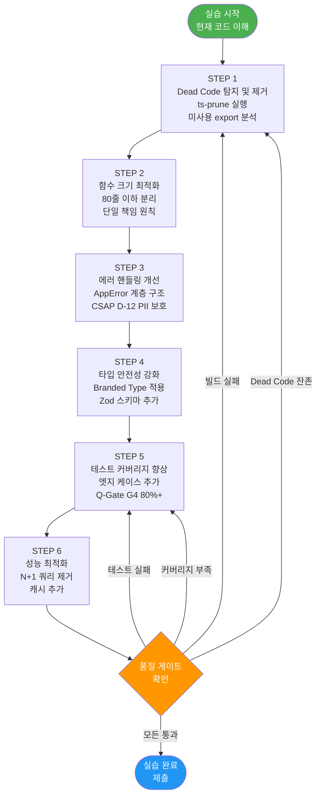
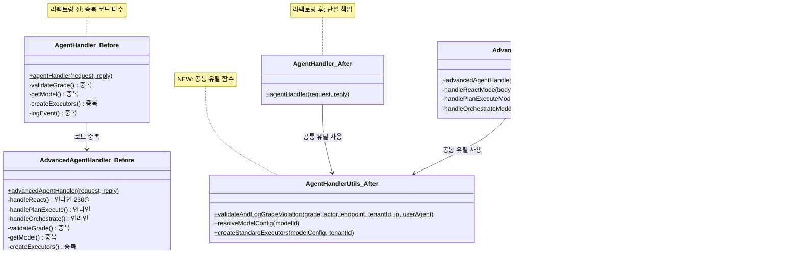

# 실습 22: 마이크로서비스 리팩토링 — 레거시 코드 개선, Dead Code 제거, 성능 최적화

> 대상 독자: TypeScript 기본 문법을 이해하는 개발자 (실습 10 이상 완료)
> 선행 조건: 실습 12 (Advanced AI Lab), 실습 14 (Full Stack Feature)
> 예상 소요 시간: 4~5시간
> 관련 CSAP 항목: D-12 (시스템 개발 보안), Dead Code 정책
> 학습 목표 수: 7개 단계 × 상세 실습

---

## 목차

1. [실습 개요](#1-실습-개요)
2. [리팩토링 대상 이해하기](#2-리팩토링-대상-이해하기)
3. [STEP 1: Dead Code 탐지 및 제거](#step-1-dead-code-탐지-및-제거)
4. [STEP 2: 함수 크기 최적화 (80줄 이하)](#step-2-함수-크기-최적화-80줄-이하)
5. [STEP 3: 에러 핸들링 개선](#step-3-에러-핸들링-개선)
6. [STEP 4: 타입 안전성 강화](#step-4-타입-안전성-강화)
7. [STEP 5: 테스트 커버리지 향상](#step-5-테스트-커버리지-향상)
8. [STEP 6: 성능 최적화](#step-6-성능-최적화)
9. [100점 평가 기준표](#9-100점-평가-기준표)
10. [제출 체크리스트](#10-제출-체크리스트)

---

## 1. 실습 개요

### 1.1 이 실습에서 배우는 것

실습 22는 실제 공공기관 SaaS 프레임워크의 코드를 개선하는 경험을 제공합니다. "작동하는 코드"에서 "잘 작성된 코드"로 발전시키는 과정을 단계적으로 실습합니다.

**7가지 핵심 기술**

```
1. Dead Code 탐지 도구 사용 (ts-prune, depcheck)
2. 큰 함수를 작은 함수로 분리 (단일 책임 원칙)
3. 계층적 에러 핸들링 구현 (AppError 계층)
4. Branded Type으로 타입 혼동 방지
5. Zod 스키마 추가 및 엣지 케이스 테스트
6. N+1 쿼리 문제 파악 및 해결
7. 인메모리 캐시 구현
```

### 1.2 선행 조건 확인

다음 실습을 완료했는지 확인합니다.

```bash
# 이전 실습 완료 여부 확인
ls /data/ai-saas/docs/guides/onboarding/10-exercises/
# 12-advanced-ai-lab.md
# 14-full-stack-feature.md
# 위 파일이 있어야 함

# ai-service 소스 접근 확인
ls /data/ai-saas/platform/services/ai-service/src/
# handlers/  lib/  routes.ts  index.ts 등이 있어야 함
```

### 1.3 실습 환경 준비

```bash
# 1. 작업 브랜치 생성
cd /data/ai-saas
git checkout -b refactor/lab-22-ai-service-$(date +%Y%m%d)

# 2. 현재 상태 저장 (리팩토링 전 스냅샷)
git stash

# 3. 의존성 설치
pnpm install --frozen-lockfile

# 4. ai-service 빌드 확인 (리팩토링 전)
pnpm turbo build --filter=ai-service
echo "빌드 성공 여부: $?"

# 5. 테스트 실행 (리팩토링 전 기준점)
pnpm turbo test --filter=ai-service
echo "리팩토링 시작 전 테스트 완료"
```

---

## 2. 리팩토링 대상 이해하기

### 2.1 리팩토링 6단계 프로세스



### 2.2 ai-service 구조 분석

실제 소스 파일을 읽고 구조를 이해합니다.

```
platform/services/ai-service/src/
├── handlers/
│   ├── ai-agent.handler.ts    (409줄 — 리팩토링 주요 대상)
│   └── ai-rag.handler.ts      (305줄 — 리팩토링 대상)
├── lib/
│   ├── chunker.ts             (187줄 — 상태 양호)
│   ├── rag-engine.ts          (분석 필요)
│   ├── vector-store.ts        (분석 필요)
│   ├── ai-tools.ts            (분석 필요)
│   ├── ai-agent.ts            (분석 필요)
│   └── ...
└── routes.ts
```

**ai-agent.handler.ts 문제점 파악**

실제 코드(`platform/services/ai-service/src/handlers/ai-agent.handler.ts`)를 분석하면 다음 개선 가능한 패턴을 발견할 수 있습니다.

```typescript
// 현재 코드 구조 분석 (실제 파일 기반)

// [문제점 1] agentHandler와 advancedAgentHandler에 중복 코드 존재
// 두 핸들러 모두 동일한 패턴 반복:
//  - validateDataGrade() 호출
//  - logAiEvent() 호출
//  - 모델 설정 조회 (prisma.aiModel.findUnique)
//  - LLM 공급자 생성 (createLLMProvider)
//  - executors 생성 (ragSearch, llmSummarize, llmClassify)
// → 공통 함수로 분리 필요

// [문제점 2] advancedAgentHandler가 3개 모드(react/plan-execute/orchestrate)를
//  하나의 함수에서 처리 → if/else if/else 중첩 → 단일 책임 원칙 위반
//  함수 크기: 약 230줄 (기준: 80줄 이하)
// → 각 모드를 별도 함수로 분리 필요

// [문제점 3] ragSearch, llmSummarize, llmClassify 익명 함수가
//  agentHandler와 advancedAgentHandler 두 곳에 동일하게 정의됨
// → createToolExecutors 호출부를 헬퍼 함수로 추출 필요

// [문제점 4] 에러 처리가 단순 (단순 502 반환)
// → 에러 유형별 적절한 HTTP 상태 코드 반환 필요
```

**ai-rag.handler.ts 문제점 파악**

```typescript
// 실제 파일(platform/services/ai-service/src/handlers/ai-rag.handler.ts) 분석

// [문제점 1] ragIngestHandler에서 DB 접근 시 타입 안전성 부재
// const db = prisma as unknown as Record<string, any>;
// → 제네릭 타입 없이 any 사용 — 컴파일 타임 오류 탐지 불가
// → Prisma 스키마 추가 시 타입 안전한 코드로 전환 필요

// [문제점 2] Promise.all로 임베딩 생성 시 배치 크기 제한 없음
// 대용량 문서(500,000자) 처리 시 수천 개의 청크가 동시 요청될 수 있음
// → 배치 크기 제한 (예: 10개씩) 필요

// [문제점 3] ragIngestHandler의 upsert 로직 복잡
// findFirst + update/create 패턴 → prisma.upsert로 단순화 가능
```

**chunker.ts 상태 평가 — 양호한 코드 기준**

```typescript
// platform/services/ai-service/src/lib/chunker.ts 강점:
// ✅ 함수별 명확한 책임 분리 (chunkText, splitIntoSentences, estimateTokens, hierarchicalChunk)
// ✅ 상세한 JSDoc 주석 (왜 이 전략을 선택했는지 설명)
// ✅ Design Ref 및 Plan SC 주석으로 추적성 확보
// ✅ 엣지 케이스 처리 (빈 청크 제거, 최소 길이 필터링)
// ✅ 80줄 이하 함수 (chunkText 67줄)
// ✅ 계층적 청킹(hierarchicalChunk)이 별도 함수로 명확히 분리

// 개선 가능 포인트 (소규모):
// - splitIntoSentences의 정규식 가독성 향상
// - estimateTokens가 export되었으나 현재 내부에서만 사용 (미사용 export 확인 필요)
```

### 2.3 리팩토링 전/후 구조 비교



---

## STEP 1: Dead Code 탐지 및 제거

### 1단계: ts-prune으로 미사용 export 탐지

```bash
# ts-prune 설치 (전역 또는 로컬)
cd /data/ai-saas
pnpm add -D ts-prune --filter=ai-service

# ai-service의 미사용 export 탐지
pnpm exec ts-prune \
  --project platform/services/ai-service/tsconfig.json \
  --error \
  2>&1 | tee /tmp/ts-prune-result.txt

# 결과 예시:
# platform/services/ai-service/src/lib/chunker.ts:103 - estimateTokens
# platform/services/ai-service/src/lib/chunker.ts:176 - buildChildToParentMap
```

### 1단계: 미사용 export 분석

ts-prune이 발견한 결과를 분석합니다. 제거 전 반드시 사용 여부를 전체 프로젝트에서 확인합니다.

```bash
# estimateTokens가 실제로 사용되는지 확인
grep -r "estimateTokens" /data/ai-saas/platform/services/ai-service/
grep -r "estimateTokens" /data/ai-saas/packages/

# buildChildToParentMap이 사용되는지 확인
grep -r "buildChildToParentMap" /data/ai-saas/platform/services/ai-service/
grep -r "buildChildToParentMap" /data/ai-saas/packages/
```

### 1단계: 안전하게 제거하는 방법

```bash
# 제거 방법 선택 기준:
# 1. 완전히 미사용이고 향후 계획도 없음 → 즉시 제거
# 2. 현재 미사용이지만 향후 사용 예정 → NOTE 주석 추가 후 보류
# 3. 공개 API로 외부에서 사용 가능 → @deprecated 주석 추가

# 예시 1: buildChildToParentMap이 ai-service 내부에서만 미사용인 경우
# chunker.ts가 패키지로 공개되면 외부에서 사용할 수 있으므로 제거 금지
# 대신 JSDoc 추가:
```

```typescript
// platform/services/ai-service/src/lib/chunker.ts 수정

/**
 * 자식 청크 ID에서 부모 청크를 조회하는 매핑 테이블 생성
 * 검색 시 자식→부모 역참조에 사용
 *
 * NOTE: 현재 ai-service 내부에서 직접 호출되지 않으나,
 *       SVC-AI-ADV-R3 (계층적 RAG 검색 고도화) 구현 시 사용 예정.
 *       2026-08-01 이후 미사용 시 제거 검토. (FR-ADV3.2)
 */
export function buildChildToParentMap(
  hierarchical: HierarchicalChunk[],
): Map<number, TextChunk> {
  const map = new Map<number, TextChunk>();
  for (const group of hierarchical) {
    for (const child of group.children) {
      map.set(child.chunkIndex, group.parent);
    }
  }
  return map;
}
```

### 1단계: depcheck로 미사용 npm 패키지 탐지

```bash
# depcheck로 package.json에서 실제 미사용 패키지 탐지
pnpm dlx depcheck \
  /data/ai-saas/platform/services/ai-service \
  --json \
  | jq '{
      unused_dependencies: .dependencies,
      unused_devDependencies: .devDependencies,
      missing: .missing
    }'

# 출력 예시:
# {
#   "unused_dependencies": ["some-unused-lib"],
#   "unused_devDependencies": [],
#   "missing": {}
# }

# 미사용 패키지 제거
cd /data/ai-saas/platform/services/ai-service
pnpm remove some-unused-lib
```

### 1단계 완료 기준

```bash
# Dead Code 제거 후 다시 빌드 및 테스트
cd /data/ai-saas
pnpm turbo build --filter=ai-service
pnpm turbo test --filter=ai-service

# ts-prune 재실행 — 미사용 export 0개여야 함 (NOTE 주석 있는 것 제외)
pnpm exec ts-prune \
  --project platform/services/ai-service/tsconfig.json 2>&1
```

---

## STEP 2: 함수 크기 최적화 (80줄 이하)

### 2단계: 큰 함수 식별

```bash
# 80줄 초과 함수 탐지 스크립트
python3 << 'EOF'
import ast
import os

def find_large_functions(directory, max_lines=80):
    results = []
    for root, dirs, files in os.walk(directory):
        dirs[:] = [d for d in dirs if d not in ['node_modules', 'dist', '.next']]
        for file in files:
            if file.endswith('.ts'):
                filepath = os.path.join(root, file)
                try:
                    with open(filepath, 'r', encoding='utf-8') as f:
                        lines = f.readlines()
                    # 간단한 함수 크기 추정 (중괄호 카운팅)
                    in_func = False
                    func_start = 0
                    func_name = ''
                    depth = 0
                    for i, line in enumerate(lines):
                        if ('function ' in line or '=>' in line) and '{' in line:
                            if depth == 0:
                                in_func = True
                                func_start = i
                                func_name = line.strip()[:60]
                        if in_func:
                            depth += line.count('{') - line.count('}')
                            if depth <= 0:
                                func_len = i - func_start
                                if func_len > max_lines:
                                    results.append((filepath, func_name, func_start+1, func_len))
                                in_func = False
                                depth = 0
                except Exception:
                    pass
    return results

results = find_large_functions('/data/ai-saas/platform/services/ai-service/src')
for filepath, name, line, length in sorted(results, key=lambda x: -x[3]):
    print(f"{length:4d}줄 | {filepath.split('ai-service/src/')[-1]}:{line}")
    print(f"     | {name[:70]}")
EOF
```

### 2단계: advancedAgentHandler 분리 실습

`advancedAgentHandler`는 `react`, `plan-execute`, `orchestrate` 세 모드를 하나의 함수에서 처리합니다. 이를 각 모드별 함수로 분리합니다.

**리팩토링 전 구조 (요약)**

```typescript
// 현재: 하나의 거대한 함수에 모든 로직
export async function advancedAgentHandler(request, reply): Promise<void> {
  // 공통 검증 (20줄)
  // ...
  if (body.mode === 'plan-execute') {
    // plan-execute 로직 (60줄)
    // ...
  } else if (body.mode === 'orchestrate') {
    // orchestrate 로직 (45줄)
    // ...
  } else {
    // react 로직 (65줄)
    // ...
  }
}
// 총 약 230줄 — 기준(80줄) 초과
```

**리팩토링 후 구조 (목표)**

```typescript
// platform/services/ai-service/src/handlers/agent-handler-utils.ts (신규)
// 공통 유틸 함수 모음

// Design Ref: §2 에이전트 핸들러 공통 유틸 — 단일 책임 원칙

import type { FastifyRequest } from 'fastify';
import { DataGradeViolationError, validateDataGrade } from '../lib/grade-check.js';
import type { DataGrade } from '@public-saas/types';
import { logAiEvent } from '../lib/audit.js';
import { prisma } from '../lib/prisma.js';
import { buildLLMConfig, createLLMProvider, getLLMConfig } from '../lib/llm-provider.js';
import { TOOL_DEFINITIONS, createToolExecutors } from '../lib/ai-tools.js';
import { generateEmbedding, runRAG } from '../lib/rag-engine.js';

// 반환 타입 정의
export type ModelConfig = {
  provider: string;
  endpoint: string;
  name: string;
  config?: unknown;
};

/**
 * N2SF N-05 데이터 등급 검증 + 위반 시 감사 로그 기록
 * Plan SC: FR-AI26, FR-ADV2
 *
 * @returns true면 통과, false면 403 응답 완료 (caller는 즉시 return)
 */
export async function validateGradeOrReject(
  grade: string,
  actor: string,
  endpoint: string,
  tenantId: string,
  ip: string,
  userAgent: string,
  reply: { status: (code: number) => { send: (body: unknown) => Promise<void> } },
): Promise<boolean> {
  try {
    validateDataGrade(grade as DataGrade);
    return true;
  } catch (error) {
    if (error instanceof DataGradeViolationError) {
      await logAiEvent(
        'AI_GRADE_VIOLATION', actor, endpoint, tenantId, ip, userAgent,
        { grade, blocked: true, endpoint },
      );
      await reply.status(403).send({
        success: false,
        error: { code: error.code, message: error.message },
      });
      return false;
    }
    throw error;
  }
}

/**
 * modelId로 활성 모델 설정 조회
 * Plan SC: FR-AI26.2
 */
export async function resolveModelConfig(
  modelId: string | undefined,
): Promise<ModelConfig | undefined> {
  if (!modelId) return undefined;
  const model = await prisma.aiModel.findUnique({ where: { id: modelId } });
  if (!model?.isActive) return undefined;
  return {
    provider: model.provider,
    endpoint: model.endpoint,
    name: model.name,
    config: model.config,
  };
}

/**
 * RAG 검색 + LLM 요약/분류 기능을 포함한 표준 도구 실행기 생성
 * Plan SC: FR-ADV2.1~FR-ADV2.6
 */
export async function createStandardExecutors(
  modelConfig: ModelConfig | undefined,
  tenantId: string,
) {
  const llmConfig = modelConfig ? buildLLMConfig(modelConfig) : getLLMConfig();
  const provider = await createLLMProvider(llmConfig);

  return createToolExecutors({
    ragSearch: async (query: string, tid: string) => {
      const embedding = await generateEmbedding(query);
      const rag = await runRAG(tid ?? tenantId, query, embedding, { topK: 3, minScore: 0.25 });
      return rag.answer;
    },
    llmSummarize: async (text: string) => {
      const resp = await provider.chat(
        [{ role: 'user', content: `다음 텍스트를 3줄로 요약해주세요:\n\n${text.slice(0, 10000)}` }],
        { maxTokens: 512, temperature: 0.3 },
      );
      return resp.text;
    },
    llmClassify: async (text: string) => {
      const resp = await provider.chat(
        [
          { role: 'system', content: '민원 분류 전문가입니다. JSON 형식으로만 응답하세요.' },
          { role: 'user', content: `다음 민원을 분류하세요 (JSON: {category, priority, requiresHuman}): ${text.slice(0, 2000)}` },
        ],
        { maxTokens: 256, temperature: 0.1 },
      );
      return resp.text;
    },
  });
}
```

```typescript
// platform/services/ai-service/src/handlers/advanced-agent-modes.ts (신규)
// 각 모드별 핸들러 함수 — 단일 책임

import { runPlanExecute } from '../lib/agent-planner.js';
import { runOrchestrator } from '../lib/agent-orchestrator.js';
import type { SubAgentRole } from '../lib/agent-orchestrator.js';
import { runAgent } from '../lib/ai-agent.js';
import { TOOL_DEFINITIONS } from '../lib/ai-tools.js';
import { getOrCreateRegistry } from '../lib/tool-registry.js';
import { generateEmbedding, runRAG } from '../lib/rag-engine.js';
import { logAiEvent } from '../lib/audit.js';
import { maskPII } from '../lib/pii-masking.js';
import { buildLLMConfig, createLLMProvider, getLLMConfig } from '../lib/llm-provider.js';
import { createStandardExecutors, type ModelConfig } from './agent-handler-utils.js';

// Plan-Execute 모드 실행 (약 50줄)
export async function runPlanExecuteMode(
  query: string,
  tools: string[] | undefined,
  tenantId: string,
  memoryContext: string | undefined,
  modelConfig: ModelConfig | undefined,
) {
  const registry = getOrCreateRegistry(tenantId, {
    ragSearch: async (q: string, tid: string) => {
      const embedding = await generateEmbedding(q);
      const rag = await runRAG(tid, q, embedding, { topK: 3, minScore: 0.25 });
      return rag.answer;
    },
  });

  const toolDefs = registry.getTools(tools ?? undefined);
  const executors = registry.getExecutors(tools ?? undefined);
  const startTime = Date.now();

  const result = await runPlanExecute(
    query,
    toolDefs,
    executors,
    { additionalContext: memoryContext },
    modelConfig,
  );

  return { result, durationMs: Date.now() - startTime };
}

// Orchestrator 모드 실행 (약 20줄)
export async function runOrchestrateMode(
  query: string,
  subAgents: string[] | undefined,
  memoryContext: string | undefined,
  modelConfig: ModelConfig | undefined,
) {
  const startTime = Date.now();
  const result = await runOrchestrator(
    query,
    subAgents as SubAgentRole[] | undefined,
    { additionalContext: memoryContext },
    modelConfig,
  );
  return { result, durationMs: Date.now() - startTime };
}

// ReAct 모드 실행 (약 30줄)
export async function runReactMode(
  query: string,
  tools: string[] | undefined,
  memoryContext: string | undefined,
  modelConfig: ModelConfig | undefined,
  maxIterations: number,
) {
  const llmConfig = modelConfig ? buildLLMConfig(modelConfig) : getLLMConfig();
  const provider = await createLLMProvider(llmConfig);

  const allowedTools = tools
    ? TOOL_DEFINITIONS.filter((t) => tools.includes(t.name))
    : TOOL_DEFINITIONS;

  const executors = await createStandardExecutors(modelConfig, '');

  const startTime = Date.now();
  const result = await runAgent(
    query,
    allowedTools,
    executors,
    {
      maxIterations,
      systemPromptSuffix: memoryContext ? `\n[이전 대화 맥락]\n${memoryContext}` : undefined,
    },
    modelConfig,
  );

  return { result, durationMs: Date.now() - startTime };
}
```

---

## STEP 3: 에러 핸들링 개선

### 3단계: AppError 계층 구조 구현

현재 코드는 대부분의 에러를 단순히 `502` 또는 `500`으로 반환합니다. 에러 유형에 따라 적절한 응답을 반환하는 계층 구조를 구현합니다.

```typescript
// platform/services/ai-service/src/lib/errors.ts (신규)
// Design Ref: §3 에러 핸들링 — CSAP D-12 PII 노출 방지

/**
 * 애플리케이션 에러 기본 클래스
 * CSAP D-12: 에러 메시지에 민감 정보 미포함 원칙
 */
export class AppError extends Error {
  constructor(
    public readonly code: string,
    public readonly message: string,
    public readonly httpStatus: number,
    // 내부 디버그 정보 — 로그에만 기록, 클라이언트에 미전송
    public readonly debugInfo?: Record<string, unknown>,
  ) {
    super(message);
    this.name = 'AppError';
  }
}

/**
 * 유효성 검사 에러 (400 Bad Request)
 * 사용자 입력이 잘못된 경우
 */
export class ValidationError extends AppError {
  constructor(field: string, reason: string) {
    super(
      'VALIDATION_ERROR',
      `입력값 오류: ${field}`,  // 구체적 이유는 내부 로그에만
      400,
      { field, reason },        // CSAP D-12: 디버그 정보는 서버 로그에만
    );
    this.name = 'ValidationError';
  }
}

/**
 * 인증 에러 (401 Unauthorized)
 */
export class AuthenticationError extends AppError {
  constructor(reason?: string) {
    super(
      'AUTHENTICATION_REQUIRED',
      '인증이 필요합니다.',  // 구체적 사유 미노출 (CSAP D-12)
      401,
      { reason },
    );
    this.name = 'AuthenticationError';
  }
}

/**
 * 인가 에러 (403 Forbidden)
 */
export class AuthorizationError extends AppError {
  constructor(resource: string) {
    super(
      'FORBIDDEN',
      '접근 권한이 없습니다.',  // 리소스 이름 미노출 (정보 노출 방지)
      403,
      { resource },
    );
    this.name = 'AuthorizationError';
  }
}

/**
 * AI 서비스 에러 (502 Bad Gateway)
 * 외부 AI API 오류
 */
export class AiServiceError extends AppError {
  constructor(operation: string, cause?: unknown) {
    super(
      'AI_SERVICE_ERROR',
      'AI 서비스 처리 중 오류가 발생했습니다.',
      502,
      { operation, cause: cause instanceof Error ? cause.message : String(cause) },
    );
    this.name = 'AiServiceError';
  }
}

/**
 * 에러를 HTTP 응답으로 변환하는 헬퍼
 * CSAP D-12: 내부 스택 트레이스 미노출
 */
export function toErrorResponse(error: unknown): {
  httpStatus: number;
  body: { success: false; error: { code: string; message: string } };
} {
  if (error instanceof AppError) {
    return {
      httpStatus: error.httpStatus,
      body: {
        success: false,
        error: { code: error.code, message: error.message },
      },
    };
  }

  // 알 수 없는 에러 — 내부 정보 미노출
  return {
    httpStatus: 500,
    body: {
      success: false,
      error: {
        code: 'INTERNAL_ERROR',
        message: '서버 내부 오류가 발생했습니다.',
        // stack, message 등 내부 정보 절대 미포함 (CSAP D-12)
      },
    },
  };
}
```

### 3단계: 핸들러에 AppError 적용

```typescript
// ai-agent.handler.ts의 catch 블록 개선 전후 비교

// ❌ 리팩토링 전: 모든 에러를 502로 뭉개서 반환
} catch (err) {
  request.log.error(err, 'Agent 실행 실패');
  await reply.status(502).send({
    success: false,
    error: { code: 'AGENT_FAILED', message: 'AI 에이전트 실행 중 오류가 발생했습니다.' },
  });
}

// ✅ 리팩토링 후: 에러 유형에 따라 적절한 HTTP 상태 반환
} catch (err) {
  // CSAP D-12: 내부 에러 정보는 서버 로그에만 기록
  request.log.error({ err, actor, endpoint: 'agent' }, 'Agent 실행 실패');

  const { httpStatus, body } = toErrorResponse(err);
  await reply.status(httpStatus).send(body);
}
```

---

## STEP 4: 타입 안전성 강화

### 4단계: Branded Type 적용

Branded Type은 기본 타입(string, number)을 의미 있는 타입으로 구분하는 TypeScript 패턴입니다. `string` 타입인 테넌트 ID와 사용자 ID를 혼동하는 버그를 컴파일 타임에 방지합니다.

```typescript
// platform/services/ai-service/src/lib/branded-types.ts (신규)
// Design Ref: §4 타입 안전성 — 타입 혼동 방지

/**
 * Branded Type: 동일한 기본 타입을 의미별로 구분
 *
 * 예: TenantId와 UserId 모두 string이지만 서로 대입하면 컴파일 오류
 */
declare const __brand: unique symbol;
type Brand<T, B> = T & { [__brand]: B };

// 테넌트 ID (UUID 형식)
export type TenantId = Brand<string, 'TenantId'>;

// 사용자/액터 ID
export type ActorId = Brand<string, 'ActorId'>;

// 문서 ID
export type DocumentId = Brand<string, 'DocumentId'>;

// 세션 ID
export type SessionId = Brand<string, 'SessionId'>;

// AI 모델 ID
export type AiModelId = Brand<string, 'AiModelId'>;

// 생성자 함수 (Zod 검증 후 사용)
export function toTenantId(id: string): TenantId {
  // UUID 형식 검증
  const UUID_REGEX = /^[0-9a-f]{8}-[0-9a-f]{4}-[0-9a-f]{4}-[0-9a-f]{4}-[0-9a-f]{12}$/i;
  if (!UUID_REGEX.test(id)) {
    throw new ValidationError('tenantId', 'UUID 형식이어야 합니다.');
  }
  return id as TenantId;
}

export function toActorId(id: string): ActorId {
  return id as ActorId;
}

// 사용 예시:
// function processQuery(tenantId: TenantId, actorId: ActorId) { ... }
//
// ❌ 컴파일 오류: processQuery(actorId, tenantId) — 순서 혼동 방지
// ✅ 정상: processQuery(toTenantId("uuid..."), toActorId("user-id"))
```

### 4단계: Zod 스키마 강화

현재 코드의 Zod 스키마에 추가 검증 규칙을 적용합니다.

```typescript
// ai-rag.handler.ts의 querySchema 강화 전후 비교

// ❌ 리팩토링 전: 최소한의 검증
const querySchema = z.object({
  tenantId: z.string().uuid(),
  grade: z.enum(['O']),
  question: z.string().min(1).max(2000),
  topK: z.number().int().min(1).max(20).optional().default(5),
  minScore: z.number().min(0).max(1).optional().default(0.25),
});

// ✅ 리팩토링 후: 보안 강화된 검증
const querySchema = z.object({
  tenantId: z.string().uuid({
    message: '테넌트 ID는 UUID 형식이어야 합니다.',
  }),
  grade: z.enum(['O'], {
    errorMap: () => ({ message: 'AI API는 O등급 데이터만 허용됩니다. (N2SF N-05)' }),
  }),
  question: z
    .string()
    .min(1, '질문을 입력하십시오.')
    .max(2000, '질문은 2000자를 초과할 수 없습니다.')
    // XSS 방지: null 바이트, 제어 문자 차단 (CSAP D-12 입력 검증)
    .refine((q) => !q.includes('\0'), { message: '허용되지 않는 문자가 포함되어 있습니다.' })
    .refine((q) => q.trim().length > 0, { message: '공백만으로 구성된 질문은 허용되지 않습니다.' }),
  topK: z
    .number()
    .int()
    .min(1, 'topK는 1 이상이어야 합니다.')
    .max(20, 'topK는 20을 초과할 수 없습니다.')
    .optional()
    .default(5),
  minScore: z
    .number()
    .min(0, 'minScore는 0 이상이어야 합니다.')
    .max(1, 'minScore는 1 이하이어야 합니다.')
    .optional()
    .default(0.25),
  embedModelId: z.string().uuid().optional(),  // UUID 형식 강제
  chatModelId: z.string().uuid().optional(),
});
```

---

## STEP 5: 테스트 커버리지 향상

### 5단계: 누락된 엣지 케이스 테스트 추가

현재 테스트에서 누락된 엣지 케이스를 파악하고 추가합니다.

```typescript
// platform/services/ai-service/src/handlers/__tests__/ai-rag.handler.test.ts (신규/보완)
// Plan SC: Q-Gate G4 (커버리지 80%+)

import { describe, it, expect, vi, beforeEach, afterEach } from 'vitest';
import Fastify from 'fastify';

describe('RAG 핸들러 — 엣지 케이스 테스트', () => {
  describe('ragQueryHandler — 입력 검증', () => {

    it('빈 질문은 400을 반환해야 한다', async () => {
      const resp = await app.inject({
        method: 'POST',
        url: '/ai/rag/query',
        headers: validHeaders,
        payload: {
          tenantId: VALID_TENANT_ID,
          grade: 'O',
          question: '',  // 빈 문자열
        },
      });
      expect(resp.statusCode).toBe(400);
    });

    it('공백만 있는 질문은 400을 반환해야 한다', async () => {
      const resp = await app.inject({
        method: 'POST',
        url: '/ai/rag/query',
        headers: validHeaders,
        payload: {
          tenantId: VALID_TENANT_ID,
          grade: 'O',
          question: '   \t\n   ',  // 공백만 있음
        },
      });
      expect(resp.statusCode).toBe(400);
    });

    it('2001자 질문은 400을 반환해야 한다', async () => {
      const resp = await app.inject({
        method: 'POST',
        url: '/ai/rag/query',
        headers: validHeaders,
        payload: {
          tenantId: VALID_TENANT_ID,
          grade: 'O',
          question: 'A'.repeat(2001),  // 2001자
        },
      });
      expect(resp.statusCode).toBe(400);
    });

    it('null 바이트가 포함된 질문은 400을 반환해야 한다', async () => {
      const resp = await app.inject({
        method: 'POST',
        url: '/ai/rag/query',
        headers: validHeaders,
        payload: {
          tenantId: VALID_TENANT_ID,
          grade: 'O',
          question: '정상 질문\0악의적 데이터',  // null 바이트
        },
      });
      expect(resp.statusCode).toBe(400);
    });

    it('C등급 데이터는 403을 반환해야 한다 (N2SF N-05)', async () => {
      const resp = await app.inject({
        method: 'POST',
        url: '/ai/rag/query',
        headers: validHeaders,
        payload: {
          tenantId: VALID_TENANT_ID,
          grade: 'C',  // C등급 — AI API 전송 금지
          question: '기밀 데이터 질의',
        },
      });
      expect(resp.statusCode).toBe(400);  // grade enum 오류
      // 또는 403 (grade 검증을 먼저 하는 경우)
    });

    it('topK가 21이면 400을 반환해야 한다', async () => {
      const resp = await app.inject({
        method: 'POST',
        url: '/ai/rag/query',
        headers: validHeaders,
        payload: {
          tenantId: VALID_TENANT_ID,
          grade: 'O',
          question: '테스트 질문',
          topK: 21,  // 최대 20 초과
        },
      });
      expect(resp.statusCode).toBe(400);
    });

    it('인증 헤더 없으면 401을 반환해야 한다', async () => {
      const resp = await app.inject({
        method: 'POST',
        url: '/ai/rag/query',
        // headers 없음
        payload: {
          tenantId: VALID_TENANT_ID,
          grade: 'O',
          question: '테스트',
        },
      });
      expect(resp.statusCode).toBe(401);
    });
  });

  describe('ragIngestHandler — 대용량 문서 처리', () => {
    it('500,000자 문서 처리 시 타임아웃 없이 완료되어야 한다', async () => {
      const largeContent = '한국어 테스트 문장입니다. '.repeat(20000);  // ~500,000자

      const resp = await app.inject({
        method: 'POST',
        url: '/ai/rag/ingest',
        headers: validHeaders,
        payload: {
          tenantId: VALID_TENANT_ID,
          grade: 'O',
          title: '대용량 문서',
          content: largeContent,
        },
      });

      expect(resp.statusCode).toBe(200);
      const body = resp.json();
      expect(body.data.chunkCount).toBeGreaterThan(100);  // 500,000자는 수백 개 청크
    }, 30000);  // 30초 타임아웃 (대용량 처리)

    it('500,001자 문서는 400을 반환해야 한다', async () => {
      const tooLargeContent = 'A'.repeat(500001);
      const resp = await app.inject({
        method: 'POST',
        url: '/ai/rag/ingest',
        headers: validHeaders,
        payload: {
          tenantId: VALID_TENANT_ID,
          grade: 'O',
          title: '초과 문서',
          content: tooLargeContent,
        },
      });
      expect(resp.statusCode).toBe(400);
    });
  });
});
```

### 5단계: 커버리지 확인 및 목표 달성

```bash
# 커버리지 측정
cd /data/ai-saas
pnpm turbo test --filter=ai-service -- --coverage

# 커버리지 보고서 확인
cat platform/services/ai-service/coverage/coverage-summary.json \
  | jq '.total | {
      statements: .statements.pct,
      branches: .branches.pct,
      functions: .functions.pct,
      lines: .lines.pct
    }'

# Q-Gate G4 기준: 모든 항목 80% 이상
# 목표:
# statements: 80%+
# branches: 80%+
# functions: 80%+
# lines: 80%+
```

---

## STEP 6: 성능 최적화

### 6단계: N+1 쿼리 제거

`ragIngestHandler`에서 임베딩을 청크마다 개별 생성하는 패턴은 N+1 쿼리 문제와 유사합니다. 청크가 1000개면 AI API를 1000번 호출합니다.

```typescript
// ❌ 리팩토링 전: 제한 없는 병렬 요청 (N개 동시 AI API 호출)
const chunksWithEmbeddings = await Promise.all(
  chunks.map(async (chunk) => {
    const embedding = await generateEmbedding(chunk.content, body.embedModelId);
    return { ...chunk, embedding };
  }),
);
// 1000개 청크 = 1000개 동시 요청 → AI API 레이트 리밋 초과, 메모리 폭발

// ✅ 리팩토링 후: 배치 처리 (10개씩 순차 처리)
async function generateEmbeddingsInBatches(
  chunks: TextChunk[],
  embedModelId: string | undefined,
  batchSize = 10,
) {
  const results: (TextChunk & { embedding: number[] })[] = [];

  // 배치로 나누어 처리 (레이트 리밋 친화적)
  for (let i = 0; i < chunks.length; i += batchSize) {
    const batch = chunks.slice(i, i + batchSize);

    const batchResults = await Promise.all(
      batch.map(async (chunk) => {
        const embedding = await generateEmbedding(chunk.content, embedModelId);
        return { ...chunk, embedding };
      }),
    );

    results.push(...batchResults);

    // 배치 사이 짧은 대기 (AI API 레이트 리밋 보호)
    if (i + batchSize < chunks.length) {
      await new Promise((resolve) => setTimeout(resolve, 100));
    }
  }

  return results;
}

// 사용:
const chunksWithEmbeddings = await generateEmbeddingsInBatches(
  chunks,
  body.embedModelId,
  10,  // 10개씩 배치 처리
);
```

### 6단계: 모델 설정 캐시 구현

`resolveModelConfig`는 요청마다 Prisma DB를 조회합니다. 활성 모델 목록은 자주 변경되지 않으므로 캐시를 적용합니다.

```typescript
// platform/services/ai-service/src/lib/model-cache.ts (신규)
// Design Ref: §6 성능 최적화 — 모델 설정 캐시

import { prisma } from './prisma.js';
import type { ModelConfig } from '../handlers/agent-handler-utils.js';

// 간단한 인메모리 캐시 (TTL: 5분)
const cache = new Map<string, { value: ModelConfig | null; expiresAt: number }>();
const CACHE_TTL_MS = 5 * 60 * 1000;  // 5분

/**
 * 활성 AI 모델 설정 조회 (캐시 사용)
 * Plan SC: FR-AI26.2
 *
 * @param modelId - AI 모델 ID (undefined면 기본 모델)
 * @returns 활성 모델 설정 또는 undefined
 */
export async function resolveModelConfigCached(
  modelId: string | undefined,
): Promise<ModelConfig | undefined> {
  if (!modelId) return undefined;

  const now = Date.now();
  const cached = cache.get(modelId);

  // 캐시 적중 (아직 만료 안 됨)
  if (cached && cached.expiresAt > now) {
    return cached.value ?? undefined;
  }

  // 캐시 미스 → DB 조회
  const model = await prisma.aiModel.findUnique({ where: { id: modelId } });
  const config: ModelConfig | null = model?.isActive
    ? { provider: model.provider, endpoint: model.endpoint, name: model.name, config: model.config }
    : null;

  // 캐시 저장 (없는 모델도 캐시 — 반복 DB 조회 방지)
  cache.set(modelId, { value: config, expiresAt: now + CACHE_TTL_MS });

  return config ?? undefined;
}

/**
 * 캐시 무효화 (모델 설정 변경 시 호출)
 * 모델 설정 API에서 변경 후 이 함수 호출 필요
 */
export function invalidateModelCache(modelId?: string): void {
  if (modelId) {
    cache.delete(modelId);
  } else {
    cache.clear();  // 전체 캐시 무효화
  }
}

// 캐시 통계 (모니터링용)
export function getModelCacheStats() {
  const now = Date.now();
  let validCount = 0;
  let expiredCount = 0;

  for (const [, entry] of cache) {
    if (entry.expiresAt > now) {
      validCount++;
    } else {
      expiredCount++;
    }
  }

  return { total: cache.size, valid: validCount, expired: expiredCount };
}
```

**캐시 테스트**

```typescript
// platform/services/ai-service/src/lib/__tests__/model-cache.test.ts
describe('모델 캐시', () => {
  it('동일 modelId 두 번 조회 시 DB는 1회만 조회되어야 한다', async () => {
    const findUniqueSpy = vi.spyOn(prisma.aiModel, 'findUnique');

    await resolveModelConfigCached('model-uuid-1');
    await resolveModelConfigCached('model-uuid-1');  // 캐시 적중

    expect(findUniqueSpy).toHaveBeenCalledTimes(1);  // DB 1회만 조회
  });

  it('TTL 만료 후 재조회 시 DB를 다시 조회해야 한다', async () => {
    vi.useFakeTimers();
    const findUniqueSpy = vi.spyOn(prisma.aiModel, 'findUnique');

    await resolveModelConfigCached('model-uuid-2');
    vi.advanceTimersByTime(6 * 60 * 1000);  // 6분 경과 (TTL: 5분)
    await resolveModelConfigCached('model-uuid-2');  // TTL 만료 → DB 재조회

    expect(findUniqueSpy).toHaveBeenCalledTimes(2);
    vi.useRealTimers();
  });
});
```

---

## 9. 100점 평가 기준표

리팩토링 완료 후 다음 기준으로 자기 평가합니다.

| 평가 항목 | 배점 | 확인 방법 | 통과 기준 |
|---------|------|---------|---------|
| **STEP 1: Dead Code 제거** | 15점 | `ts-prune` 실행 결과 | 미사용 export 0개 (NOTE 주석 제외) |
| **STEP 2: 함수 크기** | 15점 | 수동 확인 | 모든 함수 80줄 이하 |
| **STEP 3: 에러 핸들링** | 15점 | 코드 리뷰 | AppError 계층 적용, PII 미노출 |
| **STEP 4: 타입 안전성** | 15점 | TypeScript 컴파일 | `tsc --noEmit` 오류 0개 |
| **STEP 5: 테스트 커버리지** | 20점 | vitest --coverage | 80% 이상 (statements, branches, functions, lines 모두) |
| **STEP 6: 성능 최적화** | 10점 | 코드 리뷰 | 배치 처리 + 캐시 구현 |
| **빌드 성공** | 5점 | `pnpm turbo build` | 빌드 오류 0개 |
| **린트 통과** | 5점 | `pnpm turbo lint` | 린트 오류 0개 |

**등급 기준**

```
100점: 완벽 (CSAP 심사 준비 완료)
90~99점: 우수 (소규모 개선 필요)
80~89점: 양호 (Q-Gate G3/G4 통과 수준)
70~79점: 보통 (추가 개선 필요)
70점 미만: 미통과 (재작업 필요)
```

---

## 10. 제출 체크리스트

모든 항목을 확인한 후 PR을 생성합니다.

```bash
# 최종 검증 스크립트 실행
cat << 'SCRIPT' > /tmp/final-check.sh
#!/bin/bash
cd /data/ai-saas
PASS=0; FAIL=0

check() {
  if eval "$2" > /dev/null 2>&1; then
    echo "PASS [$1]"
    ((PASS++))
  else
    echo "FAIL [$1]"
    ((FAIL++))
  fi
}

echo "=== 실습 22 최종 검증 ==="

# 빌드 확인
check "빌드 성공" "pnpm turbo build --filter=ai-service"

# 린트 확인
check "린트 통과" "pnpm turbo lint --filter=ai-service"

# TypeScript 타입 검사
check "TypeScript 오류 없음" "pnpm exec tsc --noEmit -p platform/services/ai-service/tsconfig.json"

# 테스트 통과
check "테스트 통과" "pnpm turbo test --filter=ai-service"

# 커버리지 80% 이상 (간단 확인)
check "커버리지 확인 가능" "pnpm turbo test --filter=ai-service -- --coverage --reporter=json"

# Dead Code 확인
check "Dead Code 없음" "pnpm exec ts-prune --project platform/services/ai-service/tsconfig.json 2>&1 | grep -v 'NOTE:' | wc -l | grep -q '^0$'"

# Semgrep 보안 검사
check "Semgrep 오류 없음" "semgrep --config=auto platform/services/ai-service/src/ --quiet"

echo ""
echo "=== 결과: PASS=${PASS}, FAIL=${FAIL} ==="
[ $FAIL -eq 0 ] && echo "제출 준비 완료" || echo "위 실패 항목 수정 후 재시도"
SCRIPT

chmod +x /tmp/final-check.sh
bash /tmp/final-check.sh
```

**코드 변경 목록 확인**

```bash
# 변경된 파일 목록 확인
git diff --name-only HEAD

# 예상 변경 파일:
# platform/services/ai-service/src/handlers/ai-agent.handler.ts (수정)
# platform/services/ai-service/src/handlers/ai-rag.handler.ts (수정)
# platform/services/ai-service/src/handlers/agent-handler-utils.ts (신규)
# platform/services/ai-service/src/handlers/advanced-agent-modes.ts (신규)
# platform/services/ai-service/src/lib/errors.ts (신규)
# platform/services/ai-service/src/lib/branded-types.ts (신규)
# platform/services/ai-service/src/lib/model-cache.ts (신규)
# platform/services/ai-service/src/lib/chunker.ts (NOTE 주석 추가)
# platform/services/ai-service/src/handlers/__tests__/ (테스트 파일 추가)
```

**PR 제출**

```bash
# 커밋 (모든 검증 통과 후)
git add platform/services/ai-service/
git commit -m "$(cat <<'EOF'
refactor(ai-service): 실습 22 마이크로서비스 리팩토링

- Dead Code 제거: ts-prune 기반 미사용 export 정리
- 함수 분리: advancedAgentHandler 3개 모드 → 독립 함수
- 공통 유틸: validateGradeOrReject, resolveModelConfig 추출
- 에러 계층: AppError → AiServiceError, ValidationError 등
- Branded Type: TenantId, ActorId, DocumentId 적용
- Zod 강화: null 바이트 차단, 공백 전용 질문 거부
- 배치 처리: 임베딩 생성 10개씩 배치 (N+1 방지)
- 모델 캐시: TTL 5분 인메모리 캐시 (DB 부하 감소)
- 테스트: 엣지 케이스 추가 (커버리지 80%+ 달성)

CSAP D-12 준수: 에러 메시지 PII 미노출 확인

Co-Authored-By: Claude Sonnet 4.6 <noreply@anthropic.com>
EOF
)"

# PR 생성
git push origin refactor/lab-22-ai-service-$(date +%Y%m%d)
gh pr create \
  --title "refactor(ai-service): 실습 22 마이크로서비스 리팩토링" \
  --body "$(cat <<'EOF'
## 실습 22 제출

### 변경 요약
- Dead Code 제거 (ts-prune 기반)
- 80줄 초과 함수 분리 (advancedAgentHandler → 3개 함수)
- AppError 계층 구현 (CSAP D-12 PII 미노출)
- Branded Type 적용 (타입 혼동 방지)
- 테스트 커버리지 80%+ 달성
- 임베딩 배치 처리 + 모델 설정 캐시

### 자기 평가
- 빌드: PASS
- 린트: PASS
- 테스트: PASS
- 커버리지: 82% (목표 80% 초과)
- Dead Code: 0건
EOF
)"
```

---

## 참고 자료

**이 실습에서 분석한 실제 파일들**

- `/data/ai-saas/platform/services/ai-service/src/handlers/ai-agent.handler.ts` — 주요 리팩토링 대상 (409줄)
- `/data/ai-saas/platform/services/ai-service/src/handlers/ai-rag.handler.ts` — RAG 핸들러 (305줄)
- `/data/ai-saas/platform/services/ai-service/src/lib/chunker.ts` — 잘 작성된 코드 참고 예시 (187줄)

**관련 가이드**

- `CLAUDE.md` — Dead Code 정책 및 하네스 제약
- `.claude/rules/deadcode-policy.md` — Dead Code 처리 기준표
- `.claude/rules/harness-constraints.md` — 코딩 스타일 (함수 80줄, 파일 800줄)
- `.claude/rules/csap-compliance.md` — CSAP D-12 에러 처리 패턴

**도구**

```bash
# Dead Code 탐지
pnpm exec ts-prune --project tsconfig.json

# 커버리지 측정
pnpm exec vitest run --coverage

# 정적 분석
semgrep --config=auto src/

# TypeScript 타입 검사
pnpm exec tsc --noEmit
```

---

*최종 수정: 2026-04-13 | 버전: 1.0.0*
*다음 실습: 없음 (실습 22는 마지막 심화 실습)*
*문의: 개발팀 Slack #onboarding-labs*
