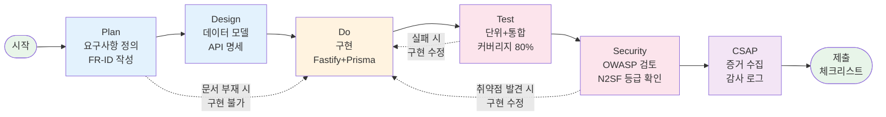
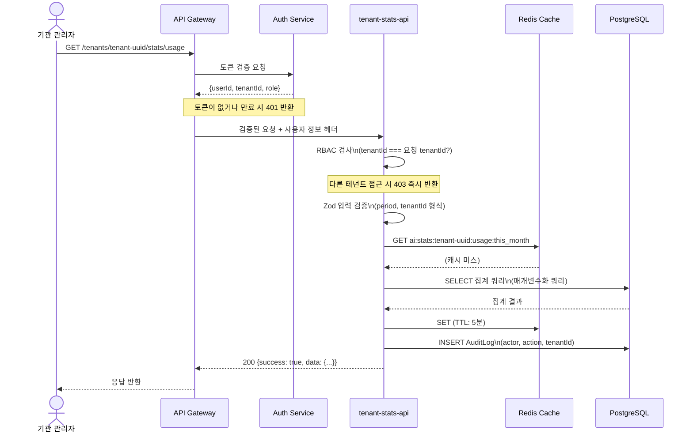

# 실습 23: 플랫폼 API 설계 실습

> 테넌트 통계 대시보드 API — 처음부터 끝까지

**난이도**: 중급  
**예상 소요 시간**: 4~6시간  
**CSAP 연관 통제**: D-08 접근 통제, D-09 암호화, D-12 시스템 개발 보안  
**최종 수정**: 2026-04-13  

---

## 목차

1. [실습 개요](#1-실습-개요)
2. [설계 단계 — Plan 문서 작성](#2-설계-단계--plan-문서-작성)
3. [상세 설계 — Design 문서 작성](#3-상세-설계--design-문서-작성)
4. [구현 단계 — Do](#4-구현-단계--do)
5. [테스트 작성 — Q-Gate G4](#5-테스트-작성--q-gate-g4)
6. [보안 검토 — Q-Gate G5](#6-보안-검토--q-gate-g5)
7. [CSAP 증거 수집 — Q-Gate G6](#7-csap-증거-수집--q-gate-g6)
8. [100점 평가 기준표](#8-100점-평가-기준표)
9. [제출 체크리스트](#9-제출-체크리스트)

---

## 1. 실습 개요

### 1.1 실습 설명

이 실습은 공공기관 SaaS 플랫폼의 실제 개발 방식을 처음부터 끝까지 경험합니다. 단순히 코드를 작성하는 것이 아니라, 공공 기관 개발자가 지켜야 할 **PDCA(Plan-Do-Check-Act)** 사이클을 완전히 수행합니다.

**만들 것**: 테넌트(공공기관 사용자 조직) 관리자가 사용하는 통계 대시보드 API 5개

예를 들어, A구청이 이 SaaS 플랫폼을 사용하고 있다면, A구청의 IT 담당자가 자신 기관의 AI 사용량, 비용, 활성 사용자 수를 확인하는 API입니다.

### 1.2 학습 목표

이 실습을 완료하면 다음을 할 수 있습니다.

- [ ] 요구사항 ID 체계(FR-ID)에 맞는 Plan 문서를 작성할 수 있습니다
- [ ] Fastify + Zod + Prisma 기반 API 엔드포인트를 구현할 수 있습니다
- [ ] RBAC(역할 기반 접근 제어)를 API에 적용할 수 있습니다
- [ ] N2SF 데이터 등급에 따른 AI API 접근 제어를 이해합니다
- [ ] 테스트 커버리지 80% 이상을 달성할 수 있습니다
- [ ] CSAP D-12 보안 요건(입력 검증, SQL 주입 방지)을 코드에 적용합니다

### 1.3 선행 조건

시작 전 다음 내용을 완료했는지 확인합니다.

- [ ] `01-getting-started` 환경 설정 완료
- [ ] `02-architecture` 아키텍처 문서 숙지
- [ ] `03-development/01-fastify-guide.md` 완독
- [ ] `20-api-design-workshop.md` 실습 완료 (또는 Fastify 경험 있음)
- [ ] PostgreSQL, Prisma 기본 사용법 이해

### 1.4 실습 전체 흐름



---

## 2. 설계 단계 — Plan 문서 작성

> CLAUDE.md 절대 제약: "구현 착수 전 Plan + Design 문서 완비 필수. 문서 없는 구현 = 감리 결함."

### 2.1 Plan 문서 위치 및 형식

Plan 문서를 먼저 작성합니다. 파일을 생성합니다.

```
docs/01-plan/features/tenant-stats-api.plan.md
```

### 2.2 요구사항 정의 (FR-ID 체계)

Plan 문서에 아래 요구사항을 포함합니다. **각 FR-ID는 반드시 코드 주석에도 포함되어야 합니다.**

**기능 요구사항 (Functional Requirements)**:

| FR-ID | 기능 설명 | 우선순위 | 관련 CSAP |
|-------|-----------|----------|----------|
| FR-STAT.1 | 테넌트 AI 사용량 요약 조회 (오늘/이번 달/누적) | 필수 | D-08 |
| FR-STAT.2 | 모델별 사용량 분석 (Top 5 모델, 사용량 추이) | 필수 | D-08 |
| FR-STAT.3 | 활성 사용자 통계 (DAU/MAU, 역할별 분포) | 필수 | D-08 |
| FR-STAT.4 | AI 비용 현황 조회 (토큰당 비용, 예산 소진율) | 필수 | D-08 |
| FR-STAT.5 | 사용량 이상 징후 탐지 결과 조회 | 선택 | D-06, D-08 |

**비기능 요구사항 (Non-Functional Requirements)**:

| NFR-ID | 요건 설명 | 측정 기준 |
|--------|-----------|----------|
| NFR-1 | 응답 시간 P99 < 500ms | 부하 테스트 기준 |
| NFR-2 | 멀티테넌트 데이터 격리 100% | 테스트 검증 필수 |
| NFR-3 | API 요청에 RBAC 검사 필수 | 단위 테스트 검증 |
| NFR-4 | 모든 접근 감사 로그 기록 | CSAP D-06 |

**성공 기준 (Success Criteria)**:

| SC-ID | 성공 기준 | 검증 방법 |
|-------|----------|---------|
| SC-STAT.1 | 5개 API 모두 구현 완료 | 통합 테스트 |
| SC-STAT.2 | 단위 테스트 커버리지 80% 이상 | Jest coverage |
| SC-STAT.3 | 다른 테넌트 데이터 접근 시 403 반환 | 통합 테스트 |
| SC-STAT.4 | CSAP D-12 입력 검증 100% 적용 | 코드 리뷰 |

### 2.3 API 엔드포인트 목록

| 번호 | Method | Path | 설명 | FR-ID |
|------|--------|------|------|-------|
| 1 | GET | `/tenants/:tenantId/stats/usage` | AI 사용량 요약 | FR-STAT.1 |
| 2 | GET | `/tenants/:tenantId/stats/models` | 모델별 사용량 분석 | FR-STAT.2 |
| 3 | GET | `/tenants/:tenantId/stats/users` | 사용자 통계 | FR-STAT.3 |
| 4 | GET | `/tenants/:tenantId/stats/cost` | 비용 현황 | FR-STAT.4 |
| 5 | GET | `/tenants/:tenantId/stats/anomalies` | 이상 징후 | FR-STAT.5 |

---

## 3. 상세 설계 — Design 문서 작성

Design 문서를 작성합니다.

```
docs/02-design/features/tenant-stats-api.design.md
```

### 3.1 데이터 모델 (Prisma 스키마)

실제 ai-service의 `AiUsageLog` 모델을 참조하여 통계에 필요한 모델을 설계합니다.

```prisma
// prisma/schema.prisma에 추가할 모델들

// 통계 캐시 테이블 (집계 결과 캐싱)
model TenantStatCache {
  id          String   @id @default(uuid())
  tenantId    String
  statType    String   // "usage_summary" | "model_analysis" | "user_stats" | "cost"
  period      String   // "today" | "this_month" | "total"
  data        Json     // 집계 결과 JSON
  computedAt  DateTime @default(now())
  expiresAt   DateTime // TTL: 5분

  @@unique([tenantId, statType, period])
  @@index([tenantId, statType])
  @@index([expiresAt])
}

// AI 비용 설정 (테넌트별 단가)
model TenantCostConfig {
  id                String  @id @default(uuid())
  tenantId          String  @unique
  tokenCostPer1k    Float   @default(0.002)  // 1000 토큰당 비용 (원)
  monthlyBudget     Float   @default(100000) // 월 예산 한도 (원)
  alertThreshold    Float   @default(0.8)    // 알림 임계값 (80%)
  createdAt         DateTime @default(now())
  updatedAt         DateTime @updatedAt
}

// 이상 징후 기록 (AI 보안 서비스에서 기록)
model UsageAnomaly {
  id          String    @id @default(uuid())
  tenantId    String
  detectedAt  DateTime  @default(now())
  anomalyType String    // "spike" | "unusual_hour" | "new_model" | "high_cost"
  severity    String    // "low" | "medium" | "high"
  description String
  resolved    Boolean   @default(false)
  resolvedAt  DateTime?

  @@index([tenantId, detectedAt])
  @@index([tenantId, resolved])
}
```

### 3.2 API 명세 (OpenAPI 형식)

각 API의 요청/응답 형식을 정의합니다.

**API 1: AI 사용량 요약 조회**

```yaml
# GET /tenants/:tenantId/stats/usage
# FR-STAT.1

parameters:
  - name: tenantId
    in: path
    required: true
    schema:
      type: string
      format: uuid
  - name: period
    in: query
    schema:
      type: string
      enum: [today, this_week, this_month, total]
      default: this_month

responses:
  200:
    content:
      application/json:
        schema:
          type: object
          properties:
            success:
              type: boolean
            data:
              type: object
              properties:
                period:
                  type: string
                totalRequests:
                  type: integer
                totalTokens:
                  type: integer
                avgLatencyMs:
                  type: number
                successRate:
                  type: number
                  description: "0.0 ~ 1.0"
                trend:
                  type: object
                  properties:
                    requestsChangeRate:
                      type: number
                      description: "전 기간 대비 변화율 (%)"
  403:
    description: "권한 없음 (다른 테넌트 접근 시도)"
  404:
    description: "테넌트 없음"
```

### 3.3 시퀀스 다이어그램



### 3.4 캐시 전략

```
캐시 키: ai:stats:{tenantId}:{statType}:{period}
TTL:
  - usage_summary: 5분 (자주 변하지 않음)
  - model_analysis: 10분 (덜 실시간적)
  - user_stats: 15분 (사용자 변화는 느림)
  - cost: 5분 (예산 모니터링 중요)
  - anomalies: 1분 (실시간성 중요)

캐시 무효화:
  - 새 AI 요청 발생 시 해당 테넌트 usage/cost 캐시 무효화
  - 사용자 역할 변경 시 user_stats 캐시 무효화
```

---

## 4. 구현 단계 — Do

### 4.1 파일 구조

```
platform/services/stats-service/
├── src/
│   ├── main.ts                 # Fastify 서버 진입점
│   ├── routes.ts               # 라우트 등록
│   ├── handlers/
│   │   └── tenant-stats.handler.ts   # 핸들러 구현
│   ├── lib/
│   │   ├── prisma.ts           # Prisma 클라이언트
│   │   ├── redis.ts            # Redis 클라이언트
│   │   ├── cache.ts            # 캐시 유틸리티
│   │   └── audit.ts            # 감사 로깅
│   └── schemas/
│       └── tenant-stats.schema.ts    # Zod 스키마
├── tests/
│   ├── unit/
│   │   └── tenant-stats.unit.test.ts
│   └── integration/
│       └── tenant-stats.integration.test.ts
└── package.json
```

### 4.2 Zod 스키마 정의

```typescript
// src/schemas/tenant-stats.schema.ts
// Design Ref: §3.2 API 명세 — 입력 검증
// Plan SC: SC-STAT.4 (CSAP D-12 입력 검증)
// CSAP: D-12-03 입력 데이터 검증

import { z } from 'zod';

// 공통 params 스키마
export const tenantIdParamSchema = z.object({
  tenantId: z.string().uuid({
    message: 'tenantId는 유효한 UUID 형식이어야 합니다',
  }),
});

// 기간 쿼리 파라미터
export const periodQuerySchema = z.object({
  period: z.enum(['today', 'this_week', 'this_month', 'total'])
    .default('this_month'),
});

// 사용량 요약 응답 타입
export const usageSummarySchema = z.object({
  period: z.string(),
  totalRequests: z.number().int().nonnegative(),
  totalTokens: z.number().int().nonnegative(),
  avgLatencyMs: z.number().nonnegative(),
  successRate: z.number().min(0).max(1),
  trend: z.object({
    requestsChangeRate: z.number(),
    tokensChangeRate: z.number(),
  }),
});

// 모델별 분석 응답 타입
export const modelAnalysisSchema = z.array(z.object({
  modelId: z.string(),
  modelName: z.string(),
  provider: z.string(),
  requestCount: z.number().int().nonnegative(),
  totalTokens: z.number().int().nonnegative(),
  avgLatencyMs: z.number().nonnegative(),
  sharePercent: z.number().min(0).max(100),
}));

// 사용자 통계 응답 타입
export const userStatsSchema = z.object({
  dau: z.number().int().nonnegative(),
  mau: z.number().int().nonnegative(),
  totalUsers: z.number().int().nonnegative(),
  roleDistribution: z.array(z.object({
    role: z.string(),
    count: z.number().int().nonnegative(),
    percent: z.number().min(0).max(100),
  })),
});

// 비용 현황 응답 타입
export const costSummarySchema = z.object({
  thisMonth: z.object({
    totalTokens: z.number().int().nonnegative(),
    estimatedCostKrw: z.number().nonnegative(),
    budgetKrw: z.number().nonnegative(),
    utilizationPercent: z.number().min(0),
  }),
  alert: z.object({
    isAlerted: z.boolean(),
    message: z.string().optional(),
  }),
});

// 이상 징후 응답 타입
export const anomalyListSchema = z.array(z.object({
  id: z.string().uuid(),
  detectedAt: z.string().datetime(),
  anomalyType: z.enum(['spike', 'unusual_hour', 'new_model', 'high_cost']),
  severity: z.enum(['low', 'medium', 'high']),
  description: z.string(),
  resolved: z.boolean(),
}));

export type TenantIdParam = z.infer<typeof tenantIdParamSchema>;
export type PeriodQuery = z.infer<typeof periodQuerySchema>;
```

### 4.3 핸들러 구현

```typescript
// src/handlers/tenant-stats.handler.ts
// Design Ref: §3.3 시퀀스 다이어그램
// Plan SC: FR-STAT.1, FR-STAT.2, FR-STAT.3, FR-STAT.4, FR-STAT.5
// CSAP: D-08 접근 통제, D-12 개발 보안

import type { FastifyRequest, FastifyReply } from 'fastify';
import { prisma } from '../lib/prisma.js';
import { getCached, setCached, invalidateCache } from '../lib/cache.js';
import { logStatEvent } from '../lib/audit.js';
import {
  tenantIdParamSchema,
  periodQuerySchema,
  type TenantIdParam,
  type PeriodQuery,
} from '../schemas/tenant-stats.schema.js';

/**
 * RBAC 검사 헬퍼
 * Design Ref: §2.2 비기능 요구사항 NFR-3
 * CSAP D-08: 모든 API에 접근 제어 적용
 */
function assertTenantAccess(
  requestTenantId: string,
  userTenantId: string,
  userRole: string,
): void {
  // 플랫폼 관리자는 전체 접근 가능
  if (userRole === 'PLATFORM_ADMIN') return;

  // 그 외에는 자신의 테넌트만 접근 가능
  if (requestTenantId !== userTenantId) {
    throw new TenantAccessDeniedError(
      `테넌트 ${requestTenantId}에 대한 접근 권한이 없습니다.`,
    );
  }
}

class TenantAccessDeniedError extends Error {
  constructor(message: string) {
    super(message);
    this.name = 'TenantAccessDeniedError';
  }
}

/**
 * 기간별 날짜 범위 계산
 */
function getPeriodRange(period: string): { gte: Date; lt: Date } {
  const now = new Date();
  const today = new Date(now.getFullYear(), now.getMonth(), now.getDate());

  switch (period) {
    case 'today':
      return {
        gte: today,
        lt: new Date(today.getTime() + 86400000),
      };
    case 'this_week': {
      const weekStart = new Date(today);
      weekStart.setDate(today.getDate() - today.getDay());
      return { gte: weekStart, lt: new Date(today.getTime() + 86400000) };
    }
    case 'this_month': {
      const monthStart = new Date(now.getFullYear(), now.getMonth(), 1);
      return { gte: monthStart, lt: new Date(today.getTime() + 86400000) };
    }
    case 'total':
      return { gte: new Date('2024-01-01'), lt: new Date(today.getTime() + 86400000) };
    default:
      return { gte: new Date('2024-01-01'), lt: new Date(today.getTime() + 86400000) };
  }
}

// ── FR-STAT.1: AI 사용량 요약 조회 ─────────────────────────────────────────

/**
 * GET /tenants/:tenantId/stats/usage
 * Plan SC: FR-STAT.1, SC-STAT.1
 */
export async function getUsageSummaryHandler(
  request: FastifyRequest<{ Params: TenantIdParam; Querystring: PeriodQuery }>,
  reply: FastifyReply,
): Promise<void> {
  // 1. 입력 검증 (CSAP D-12-03)
  const { tenantId } = tenantIdParamSchema.parse(request.params);
  const { period } = periodQuerySchema.parse(request.query);

  // 2. 요청자 정보 추출 (API Gateway가 헤더로 주입)
  const actorId = request.headers['x-user-id'] as string;
  const actorTenantId = request.headers['x-tenant-id'] as string;
  const actorRole = request.headers['x-user-role'] as string;

  // 3. RBAC 검사 (CSAP D-08)
  try {
    assertTenantAccess(tenantId, actorTenantId, actorRole);
  } catch (error) {
    if (error instanceof TenantAccessDeniedError) {
      await logStatEvent('STAT_ACCESS_DENIED', actorId, tenantId, request.ip, {
        endpoint: 'usage',
        reason: 'different_tenant',
      });
      await reply.status(403).send({
        success: false,
        error: { code: 'FORBIDDEN', message: '접근 권한이 없습니다.' },
      });
      return;
    }
    throw error;
  }

  // 4. 캐시 확인
  const cacheKey = `ai:stats:${tenantId}:usage:${period}`;
  const cached = await getCached(cacheKey);
  if (cached) {
    await reply.status(200).send({ success: true, data: cached, cached: true });
    return;
  }

  // 5. DB 쿼리 (매개변수화 쿼리 — SQL 주입 방지 CSAP D-12-04)
  const { gte, lt } = getPeriodRange(period);

  const [currentStats, prevStats] = await Promise.all([
    // 현재 기간 통계
    prisma.aiUsageLog.aggregate({
      where: {
        tenantId,
        createdAt: { gte, lt },
      },
      _count: { id: true },
      _sum: { tokens: true },
      _avg: { latencyMs: true },
    }),
    // 이전 기간 통계 (변화율 계산용)
    prisma.aiUsageLog.aggregate({
      where: {
        tenantId,
        createdAt: {
          gte: new Date(gte.getTime() - (lt.getTime() - gte.getTime())),
          lt: gte,
        },
      },
      _count: { id: true },
      _sum: { tokens: true },
    }),
  ]);

  // 6. 성공률 계산 (오류 없는 요청 비율)
  const totalRequests = currentStats._count.id;
  const errorCount = await prisma.aiUsageLog.count({
    where: {
      tenantId,
      createdAt: { gte, lt },
      // errorCode 필드가 있다고 가정
      errorCode: { not: null },
    },
  });

  const successRate = totalRequests > 0
    ? (totalRequests - errorCount) / totalRequests
    : 1;

  // 7. 변화율 계산
  const prevRequests = prevStats._count.id;
  const prevTokens = prevStats._sum.tokens ?? 0;
  const requestsChangeRate = prevRequests > 0
    ? ((totalRequests - prevRequests) / prevRequests) * 100
    : 0;
  const tokensChangeRate = prevTokens > 0
    ? (((currentStats._sum.tokens ?? 0) - prevTokens) / prevTokens) * 100
    : 0;

  const result = {
    period,
    totalRequests,
    totalTokens: currentStats._sum.tokens ?? 0,
    avgLatencyMs: Math.round(currentStats._avg.latencyMs ?? 0),
    successRate: Math.round(successRate * 1000) / 1000,
    trend: {
      requestsChangeRate: Math.round(requestsChangeRate * 10) / 10,
      tokensChangeRate: Math.round(tokensChangeRate * 10) / 10,
    },
  };

  // 8. 캐시 저장 (TTL: 5분)
  await setCached(cacheKey, result, 300);

  // 9. 감사 로그 (CSAP D-06)
  await logStatEvent('STAT_USAGE_VIEWED', actorId, tenantId, request.ip, {
    period,
    totalRequests,
  });

  await reply.status(200).send({ success: true, data: result });
}

// ── FR-STAT.2: 모델별 사용량 분석 ──────────────────────────────────────────

/**
 * GET /tenants/:tenantId/stats/models
 * Plan SC: FR-STAT.2, SC-STAT.1
 */
export async function getModelAnalysisHandler(
  request: FastifyRequest<{ Params: TenantIdParam; Querystring: PeriodQuery }>,
  reply: FastifyReply,
): Promise<void> {
  const { tenantId } = tenantIdParamSchema.parse(request.params);
  const { period } = periodQuerySchema.parse(request.query);

  const actorId = request.headers['x-user-id'] as string;
  const actorTenantId = request.headers['x-tenant-id'] as string;
  const actorRole = request.headers['x-user-role'] as string;

  try {
    assertTenantAccess(tenantId, actorTenantId, actorRole);
  } catch {
    await reply.status(403).send({
      success: false,
      error: { code: 'FORBIDDEN', message: '접근 권한이 없습니다.' },
    });
    return;
  }

  const cacheKey = `ai:stats:${tenantId}:models:${period}`;
  const cached = await getCached(cacheKey);
  if (cached) {
    await reply.status(200).send({ success: true, data: cached, cached: true });
    return;
  }

  const { gte, lt } = getPeriodRange(period);

  // 모델별 집계 ($queryRaw로 최적화된 단일 쿼리)
  const modelStats = await prisma.$queryRaw<Array<{
    model_id: string;
    model_name: string;
    provider: string;
    request_count: bigint;
    total_tokens: bigint;
    avg_latency_ms: number;
  }>>`
    SELECT
      ul.model_id,
      m.name AS model_name,
      m.provider,
      COUNT(ul.id) AS request_count,
      COALESCE(SUM(ul.tokens), 0) AS total_tokens,
      COALESCE(AVG(ul.latency_ms), 0) AS avg_latency_ms
    FROM "AiUsageLog" ul
    JOIN "AiModel" m ON m.id = ul.model_id
    WHERE ul.tenant_id = ${tenantId}::uuid
      AND ul.created_at >= ${gte}
      AND ul.created_at < ${lt}
    GROUP BY ul.model_id, m.name, m.provider
    ORDER BY request_count DESC
    LIMIT 10
  `;

  // 전체 요청 수 계산 (sharePercent 계산용)
  const totalRequests = modelStats.reduce(
    (sum, m) => sum + Number(m.request_count),
    0,
  );

  const result = modelStats.map((m) => ({
    modelId: m.model_id,
    modelName: m.model_name,
    provider: m.provider,
    requestCount: Number(m.request_count),
    totalTokens: Number(m.total_tokens),
    avgLatencyMs: Math.round(m.avg_latency_ms),
    sharePercent: totalRequests > 0
      ? Math.round((Number(m.request_count) / totalRequests) * 1000) / 10
      : 0,
  }));

  await setCached(cacheKey, result, 600);  // 10분 캐시
  await logStatEvent('STAT_MODELS_VIEWED', actorId, tenantId, request.ip, { period });

  await reply.status(200).send({ success: true, data: result });
}

// ── FR-STAT.3: 사용자 통계 ─────────────────────────────────────────────────

/**
 * GET /tenants/:tenantId/stats/users
 * Plan SC: FR-STAT.3, SC-STAT.1
 */
export async function getUserStatsHandler(
  request: FastifyRequest<{ Params: TenantIdParam }>,
  reply: FastifyReply,
): Promise<void> {
  const { tenantId } = tenantIdParamSchema.parse(request.params);
  const actorId = request.headers['x-user-id'] as string;
  const actorTenantId = request.headers['x-tenant-id'] as string;
  const actorRole = request.headers['x-user-role'] as string;

  try {
    assertTenantAccess(tenantId, actorTenantId, actorRole);
  } catch {
    await reply.status(403).send({
      success: false,
      error: { code: 'FORBIDDEN', message: '접근 권한이 없습니다.' },
    });
    return;
  }

  const cacheKey = `ai:stats:${tenantId}:users`;
  const cached = await getCached(cacheKey);
  if (cached) {
    await reply.status(200).send({ success: true, data: cached, cached: true });
    return;
  }

  const now = new Date();
  const todayStart = new Date(now.getFullYear(), now.getMonth(), now.getDate());
  const monthStart = new Date(now.getFullYear(), now.getMonth(), 1);

  const [totalUsers, dauUsers, mauUsers, roleStats] = await Promise.all([
    // 전체 활성 사용자
    prisma.user.count({
      where: { tenantId, isActive: true },
    }),
    // DAU: 오늘 AI 요청을 만든 고유 사용자
    prisma.aiUsageLog.findMany({
      where: {
        tenantId,
        createdAt: { gte: todayStart },
      },
      select: { userId: true },
      distinct: ['userId'],
    }),
    // MAU: 이번 달 AI 요청을 만든 고유 사용자
    prisma.aiUsageLog.findMany({
      where: {
        tenantId,
        createdAt: { gte: monthStart },
      },
      select: { userId: true },
      distinct: ['userId'],
    }),
    // 역할별 분포
    prisma.user.groupBy({
      by: ['role'],
      where: { tenantId, isActive: true },
      _count: { id: true },
    }),
  ]);

  const roleDistribution = roleStats.map((r) => ({
    role: r.role,
    count: r._count.id,
    percent: totalUsers > 0
      ? Math.round((r._count.id / totalUsers) * 1000) / 10
      : 0,
  }));

  const result = {
    dau: dauUsers.length,
    mau: mauUsers.length,
    totalUsers,
    roleDistribution,
  };

  await setCached(cacheKey, result, 900);  // 15분 캐시
  await logStatEvent('STAT_USERS_VIEWED', actorId, tenantId, request.ip, {});

  await reply.status(200).send({ success: true, data: result });
}

// ── FR-STAT.4: 비용 현황 ───────────────────────────────────────────────────

/**
 * GET /tenants/:tenantId/stats/cost
 * Plan SC: FR-STAT.4, SC-STAT.1
 */
export async function getCostSummaryHandler(
  request: FastifyRequest<{ Params: TenantIdParam }>,
  reply: FastifyReply,
): Promise<void> {
  const { tenantId } = tenantIdParamSchema.parse(request.params);
  const actorId = request.headers['x-user-id'] as string;
  const actorTenantId = request.headers['x-tenant-id'] as string;
  const actorRole = request.headers['x-user-role'] as string;

  try {
    assertTenantAccess(tenantId, actorTenantId, actorRole);
  } catch {
    await reply.status(403).send({
      success: false,
      error: { code: 'FORBIDDEN', message: '접근 권한이 없습니다.' },
    });
    return;
  }

  const cacheKey = `ai:stats:${tenantId}:cost`;
  const cached = await getCached(cacheKey);
  if (cached) {
    await reply.status(200).send({ success: true, data: cached, cached: true });
    return;
  }

  const now = new Date();
  const monthStart = new Date(now.getFullYear(), now.getMonth(), 1);
  const tomorrow = new Date(now.getTime() + 86400000);

  // 비용 설정 조회
  const costConfig = await prisma.tenantCostConfig.findUnique({
    where: { tenantId },
  });

  const tokenCostPer1k = costConfig?.tokenCostPer1k ?? 0.002;
  const monthlyBudget = costConfig?.monthlyBudget ?? 100000;
  const alertThreshold = costConfig?.alertThreshold ?? 0.8;

  // 이번 달 토큰 사용량
  const monthStats = await prisma.aiUsageLog.aggregate({
    where: {
      tenantId,
      createdAt: { gte: monthStart, lt: tomorrow },
    },
    _sum: { tokens: true },
  });

  const totalTokens = monthStats._sum.tokens ?? 0;
  const estimatedCostKrw = (totalTokens / 1000) * tokenCostPer1k;
  const utilizationPercent = monthlyBudget > 0
    ? (estimatedCostKrw / monthlyBudget) * 100
    : 0;

  const isAlerted = utilizationPercent >= alertThreshold * 100;

  const result = {
    thisMonth: {
      totalTokens,
      estimatedCostKrw: Math.round(estimatedCostKrw),
      budgetKrw: monthlyBudget,
      utilizationPercent: Math.round(utilizationPercent * 10) / 10,
    },
    alert: {
      isAlerted,
      message: isAlerted
        ? `월 예산의 ${Math.round(utilizationPercent)}%를 사용했습니다. 주의가 필요합니다.`
        : undefined,
    },
  };

  await setCached(cacheKey, result, 300);  // 5분 캐시
  await logStatEvent('STAT_COST_VIEWED', actorId, tenantId, request.ip, {
    utilizationPercent: result.thisMonth.utilizationPercent,
  });

  await reply.status(200).send({ success: true, data: result });
}

// ── FR-STAT.5: 이상 징후 조회 ─────────────────────────────────────────────

/**
 * GET /tenants/:tenantId/stats/anomalies
 * Plan SC: FR-STAT.5, SC-STAT.1
 */
export async function getAnomaliesHandler(
  request: FastifyRequest<{
    Params: TenantIdParam;
    Querystring: { resolved?: string; limit?: string };
  }>,
  reply: FastifyReply,
): Promise<void> {
  const { tenantId } = tenantIdParamSchema.parse(request.params);

  // 추가 쿼리 파라미터 검증
  const resolvedParam = request.query.resolved;
  const limitParam = request.query.limit;

  const resolved = resolvedParam === 'true' ? true
    : resolvedParam === 'false' ? false
    : undefined;

  // 입력 검증: limit는 1~100 사이 정수
  const limit = limitParam ? Math.min(100, Math.max(1, parseInt(limitParam, 10))) : 20;
  if (isNaN(limit)) {
    await reply.status(400).send({
      success: false,
      error: { code: 'INVALID_PARAM', message: 'limit는 정수여야 합니다.' },
    });
    return;
  }

  const actorId = request.headers['x-user-id'] as string;
  const actorTenantId = request.headers['x-tenant-id'] as string;
  const actorRole = request.headers['x-user-role'] as string;

  try {
    assertTenantAccess(tenantId, actorTenantId, actorRole);
  } catch {
    await reply.status(403).send({
      success: false,
      error: { code: 'FORBIDDEN', message: '접근 권한이 없습니다.' },
    });
    return;
  }

  const cacheKey = `ai:stats:${tenantId}:anomalies:${resolved ?? 'all'}:${limit}`;
  const cached = await getCached(cacheKey);
  if (cached) {
    await reply.status(200).send({ success: true, data: cached, cached: true });
    return;
  }

  const anomalies = await prisma.usageAnomaly.findMany({
    where: {
      tenantId,
      ...(resolved !== undefined ? { resolved } : {}),
    },
    orderBy: { detectedAt: 'desc' },
    take: limit,
    select: {
      id: true,
      detectedAt: true,
      anomalyType: true,
      severity: true,
      description: true,
      resolved: true,
    },
  });

  const result = anomalies.map((a) => ({
    ...a,
    detectedAt: a.detectedAt.toISOString(),
  }));

  await setCached(cacheKey, result, 60);  // 1분 캐시 (실시간성 중요)
  await logStatEvent('STAT_ANOMALIES_VIEWED', actorId, tenantId, request.ip, {
    count: result.length,
  });

  await reply.status(200).send({ success: true, data: result });
}
```

### 4.4 라우트 등록

실제 ai-service의 `routes.ts` 패턴을 참조하여 동일한 방식으로 라우트를 등록합니다.

```typescript
// src/routes.ts
// Design Ref: §4.3 핸들러 구현
// Plan SC: FR-STAT.1~FR-STAT.5
// CSAP: D-08-06 Rate Limiting

import type { FastifyInstance } from 'fastify';
import { createRateLimiter } from '@public-saas/rate-limit';
import {
  getUsageSummaryHandler,
  getModelAnalysisHandler,
  getUserStatsHandler,
  getCostSummaryHandler,
  getAnomaliesHandler,
} from './handlers/tenant-stats.handler.js';

export async function registerRoutes(app: FastifyInstance): Promise<void> {
  // 내부 서비스 인증 검사 (ai-service 패턴 동일 적용)
  const internalKey = process.env['INTERNAL_SERVICE_KEY'];
  if (!internalKey && process.env['NODE_ENV'] === 'production') {
    throw new Error('[SECURITY] INTERNAL_SERVICE_KEY 환경변수가 설정되지 않았습니다.');
  }

  // Rate Limiter 설정 (CSAP D-08-06)
  // 읽기 전용 API: 분당 60회 (통계 조회는 캐시 덕에 실제 DB 부하 낮음)
  const statsLimiter = createRateLimiter(60, 60, 'rl:stats:read');

  const paramSchema = {
    type: 'object' as const,
    properties: { tenantId: { type: 'string' as const, format: 'uuid' } },
    required: ['tenantId'] as const,
  };

  const querySchema = {
    type: 'object' as const,
    properties: {
      period: {
        type: 'string' as const,
        enum: ['today', 'this_week', 'this_month', 'total'],
      },
    },
  };

  const successResponse = {
    type: 'object' as const,
    properties: {
      success: { type: 'boolean' as const },
      data: { type: 'object' as const },
      cached: { type: 'boolean' as const },
    },
  };

  const errorResponse = {
    type: 'object' as const,
    properties: {
      success: { type: 'boolean' as const },
      error: { type: 'object' as const },
    },
  };

  // FR-STAT.1: AI 사용량 요약 조회
  app.get(
    '/tenants/:tenantId/stats/usage',
    {
      schema: {
        description: '테넌트 AI 사용량 요약 조회 (오늘/이번달/누적)',
        tags: ['tenant-stats'],
        params: paramSchema,
        querystring: querySchema,
        response: {
          200: successResponse,
          403: errorResponse,
          404: errorResponse,
        },
      },
      preHandler: statsLimiter,
    },
    getUsageSummaryHandler as never,
  );

  // FR-STAT.2: 모델별 사용량 분석
  app.get(
    '/tenants/:tenantId/stats/models',
    {
      schema: {
        description: '테넌트 모델별 사용량 분석 (Top 10)',
        tags: ['tenant-stats'],
        params: paramSchema,
        querystring: querySchema,
        response: { 200: successResponse, 403: errorResponse },
      },
      preHandler: statsLimiter,
    },
    getModelAnalysisHandler as never,
  );

  // FR-STAT.3: 사용자 통계
  app.get(
    '/tenants/:tenantId/stats/users',
    {
      schema: {
        description: '테넌트 사용자 통계 (DAU/MAU, 역할별 분포)',
        tags: ['tenant-stats'],
        params: paramSchema,
        response: { 200: successResponse, 403: errorResponse },
      },
      preHandler: statsLimiter,
    },
    getUserStatsHandler as never,
  );

  // FR-STAT.4: 비용 현황
  app.get(
    '/tenants/:tenantId/stats/cost',
    {
      schema: {
        description: '테넌트 AI 비용 현황 (예산 소진율)',
        tags: ['tenant-stats'],
        params: paramSchema,
        response: { 200: successResponse, 403: errorResponse },
      },
      preHandler: statsLimiter,
    },
    getCostSummaryHandler as never,
  );

  // FR-STAT.5: 이상 징후 조회
  app.get(
    '/tenants/:tenantId/stats/anomalies',
    {
      schema: {
        description: '테넌트 AI 사용량 이상 징후 조회',
        tags: ['tenant-stats'],
        params: paramSchema,
        querystring: {
          type: 'object' as const,
          properties: {
            resolved: { type: 'string' as const, enum: ['true', 'false'] },
            limit: { type: 'string' as const },
          },
        },
        response: { 200: successResponse, 403: errorResponse },
      },
      preHandler: statsLimiter,
    },
    getAnomaliesHandler as never,
  );
}
```

---

## 5. 테스트 작성 — Q-Gate G4

Q-Gate G4: 테스트 커버리지 80% 이상

### 5.1 단위 테스트

```typescript
// tests/unit/tenant-stats.unit.test.ts
// Plan SC: SC-STAT.2 (테스트 커버리지 80% 이상)

import { describe, it, expect, vi, beforeEach } from 'vitest';

// Prisma 모킹
vi.mock('../../src/lib/prisma.js', () => ({
  prisma: {
    aiUsageLog: {
      aggregate: vi.fn(),
      count: vi.fn(),
      findMany: vi.fn(),
    },
    user: {
      count: vi.fn(),
      groupBy: vi.fn(),
    },
    aiModel: {
      findMany: vi.fn(),
    },
    tenantCostConfig: {
      findUnique: vi.fn(),
    },
    usageAnomaly: {
      findMany: vi.fn(),
    },
    $queryRaw: vi.fn(),
  },
}));

// Redis 캐시 모킹
vi.mock('../../src/lib/cache.js', () => ({
  getCached: vi.fn().mockResolvedValue(null),  // 캐시 미스 기본값
  setCached: vi.fn().mockResolvedValue(undefined),
  invalidateCache: vi.fn().mockResolvedValue(undefined),
}));

// 감사 로그 모킹
vi.mock('../../src/lib/audit.js', () => ({
  logStatEvent: vi.fn().mockResolvedValue(undefined),
}));

describe('tenant-stats 핸들러 단위 테스트', () => {
  const mockRequest = (overrides = {}) => ({
    params: { tenantId: 'tenant-uuid-1234' },
    query: { period: 'this_month' },
    headers: {
      'x-user-id': 'user-uuid-5678',
      'x-tenant-id': 'tenant-uuid-1234',  // 동일 테넌트
      'x-user-role': 'ADMIN',
    },
    ip: '127.0.0.1',
    ...overrides,
  });

  const mockReply = () => {
    const reply = {
      status: vi.fn().mockReturnThis(),
      send: vi.fn().mockReturnThis(),
    };
    return reply;
  };

  // ── FR-STAT.1 테스트 ─────────────────────────────────────────────

  describe('getUsageSummaryHandler', () => {
    it('정상 요청 시 200과 사용량 데이터를 반환해야 한다', async () => {
      const { prisma } = await import('../../src/lib/prisma.js');
      const { getUsageSummaryHandler } = await import('../../src/handlers/tenant-stats.handler.js');

      // 목 데이터 설정
      vi.mocked(prisma.aiUsageLog.aggregate)
        .mockResolvedValueOnce({
          _count: { id: 1000 },
          _sum: { tokens: 500000 },
          _avg: { latencyMs: 250 },
        } as never)
        .mockResolvedValueOnce({
          _count: { id: 800 },
          _sum: { tokens: 400000 },
          _avg: { latencyMs: 200 },
        } as never);

      vi.mocked(prisma.aiUsageLog.count).mockResolvedValue(10);

      const req = mockRequest() as never;
      const rep = mockReply();

      await getUsageSummaryHandler(req, rep as never);

      expect(rep.status).toHaveBeenCalledWith(200);
      expect(rep.send).toHaveBeenCalledWith(
        expect.objectContaining({
          success: true,
          data: expect.objectContaining({
            totalRequests: 1000,
            totalTokens: 500000,
            avgLatencyMs: 250,
          }),
        }),
      );
    });

    it('다른 테넌트 접근 시 403을 반환해야 한다 (NFR-2 테넌트 격리)', async () => {
      const { getUsageSummaryHandler } = await import('../../src/handlers/tenant-stats.handler.js');

      // 요청자 테넌트와 대상 테넌트가 다름
      const req = mockRequest({
        headers: {
          'x-user-id': 'user-uuid-9999',
          'x-tenant-id': 'OTHER-tenant-uuid',  // 다른 테넌트!
          'x-user-role': 'ADMIN',
        },
      }) as never;
      const rep = mockReply();

      await getUsageSummaryHandler(req, rep as never);

      expect(rep.status).toHaveBeenCalledWith(403);
      expect(rep.send).toHaveBeenCalledWith(
        expect.objectContaining({
          success: false,
          error: expect.objectContaining({ code: 'FORBIDDEN' }),
        }),
      );
    });

    it('PLATFORM_ADMIN은 다른 테넌트도 조회할 수 있어야 한다', async () => {
      const { prisma } = await import('../../src/lib/prisma.js');
      const { getUsageSummaryHandler } = await import('../../src/handlers/tenant-stats.handler.js');

      vi.mocked(prisma.aiUsageLog.aggregate)
        .mockResolvedValueOnce({ _count: { id: 0 }, _sum: { tokens: 0 }, _avg: { latencyMs: 0 } } as never)
        .mockResolvedValueOnce({ _count: { id: 0 }, _sum: { tokens: 0 }, _avg: { latencyMs: 0 } } as never);
      vi.mocked(prisma.aiUsageLog.count).mockResolvedValue(0);

      const req = mockRequest({
        headers: {
          'x-user-id': 'platform-admin-uuid',
          'x-tenant-id': 'platform-tenant',  // 다른 테넌트
          'x-user-role': 'PLATFORM_ADMIN',   // 플랫폼 관리자
        },
      }) as never;
      const rep = mockReply();

      await getUsageSummaryHandler(req, rep as never);

      expect(rep.status).toHaveBeenCalledWith(200);
    });

    it('잘못된 tenantId 형식 시 400을 반환해야 한다', async () => {
      const { getUsageSummaryHandler } = await import('../../src/handlers/tenant-stats.handler.js');

      const req = mockRequest({
        params: { tenantId: 'not-a-uuid' },  // 잘못된 UUID
      }) as never;
      const rep = mockReply();

      // Zod 검증 실패로 예외 발생
      await expect(
        getUsageSummaryHandler(req, rep as never),
      ).rejects.toThrow();
    });
  });

  // ── FR-STAT.5 이상 징후 테스트 ──────────────────────────────────

  describe('getAnomaliesHandler', () => {
    it('limit 파라미터가 100을 초과하면 100으로 제한해야 한다', async () => {
      const { prisma } = await import('../../src/lib/prisma.js');
      const { getAnomaliesHandler } = await import('../../src/handlers/tenant-stats.handler.js');

      vi.mocked(prisma.usageAnomaly.findMany).mockResolvedValue([]);

      const req = mockRequest({
        query: { limit: '999' },  // 100 초과
      }) as never;
      const rep = mockReply();

      await getAnomaliesHandler(req, rep as never);

      // findMany가 take: 100으로 호출되었는지 확인
      expect(prisma.usageAnomaly.findMany).toHaveBeenCalledWith(
        expect.objectContaining({ take: 100 }),
      );
    });

    it('limit이 숫자가 아니면 400을 반환해야 한다', async () => {
      const { getAnomaliesHandler } = await import('../../src/handlers/tenant-stats.handler.js');

      const req = mockRequest({
        query: { limit: 'abc' },  // 숫자가 아님
      }) as never;
      const rep = mockReply();

      await getAnomaliesHandler(req, rep as never);

      expect(rep.status).toHaveBeenCalledWith(400);
    });
  });
});
```

### 5.2 통합 테스트 (멀티테넌트 격리)

```typescript
// tests/integration/tenant-stats.integration.test.ts
// Plan SC: SC-STAT.3 (테넌트 격리 검증)
// 주의: 실제 DB 연결 필요 (테스트 DB 사용)

import { describe, it, expect, beforeAll, afterAll } from 'vitest';
import { buildApp } from '../../src/main.js';
import type { FastifyInstance } from 'fastify';

describe('테넌트 통계 API 통합 테스트 (멀티테넌트 격리)', () => {
  let app: FastifyInstance;

  const TENANT_A = 'tenant-aaaa-aaaa-aaaa-aaaaaaaaaaaa';
  const TENANT_B = 'tenant-bbbb-bbbb-bbbb-bbbbbbbbbbbb';

  beforeAll(async () => {
    app = await buildApp({ testing: true });
    await app.ready();
    // 테스트 데이터 시드
    await seedTestData(TENANT_A, TENANT_B);
  });

  afterAll(async () => {
    await cleanupTestData(TENANT_A, TENANT_B);
    await app.close();
  });

  it('테넌트 A는 테넌트 B의 통계를 조회할 수 없어야 한다 (SC-STAT.3)', async () => {
    const response = await app.inject({
      method: 'GET',
      url: `/tenants/${TENANT_B}/stats/usage`,
      headers: {
        'x-user-id': 'user-from-tenant-a',
        'x-tenant-id': TENANT_A,  // 테넌트 A 소속 사용자
        'x-user-role': 'ADMIN',
        'x-internal-service-key': process.env['INTERNAL_SERVICE_KEY'] ?? 'test-key',
      },
    });

    expect(response.statusCode).toBe(403);
    const body = JSON.parse(response.body);
    expect(body.success).toBe(false);
    expect(body.error.code).toBe('FORBIDDEN');
  });

  it('테넌트 A는 자신의 통계를 조회할 수 있어야 한다', async () => {
    const response = await app.inject({
      method: 'GET',
      url: `/tenants/${TENANT_A}/stats/usage?period=this_month`,
      headers: {
        'x-user-id': 'user-from-tenant-a',
        'x-tenant-id': TENANT_A,
        'x-user-role': 'ADMIN',
        'x-internal-service-key': process.env['INTERNAL_SERVICE_KEY'] ?? 'test-key',
      },
    });

    expect(response.statusCode).toBe(200);
    const body = JSON.parse(response.body);
    expect(body.success).toBe(true);
    expect(body.data).toHaveProperty('totalRequests');
    expect(body.data).toHaveProperty('totalTokens');
  });

  it('내부 서비스 키 없이 접근하면 401을 반환해야 한다', async () => {
    const response = await app.inject({
      method: 'GET',
      url: `/tenants/${TENANT_A}/stats/usage`,
      headers: {
        'x-user-id': 'user-from-tenant-a',
        'x-tenant-id': TENANT_A,
        'x-user-role': 'ADMIN',
        // x-internal-service-key 누락
      },
    });

    expect(response.statusCode).toBe(401);
  });

  it('테넌트 A 통계에 테넌트 B 데이터가 포함되지 않아야 한다', async () => {
    // 테넌트 A: 100개, 테넌트 B: 500개 요청이 있다고 가정
    const response = await app.inject({
      method: 'GET',
      url: `/tenants/${TENANT_A}/stats/usage?period=total`,
      headers: {
        'x-user-id': 'user-from-tenant-a',
        'x-tenant-id': TENANT_A,
        'x-user-role': 'ADMIN',
        'x-internal-service-key': process.env['INTERNAL_SERVICE_KEY'] ?? 'test-key',
      },
    });

    const body = JSON.parse(response.body);
    // 테넌트 A의 요청만 카운트되어야 함 (600이 아닌 100)
    expect(body.data.totalRequests).toBe(100);
  });
});

// 테스트 데이터 설정 함수
async function seedTestData(tenantA: string, tenantB: string): Promise<void> {
  // 테스트 DB에 테스트 데이터 삽입
  // (실제 구현 시 Prisma로 데이터 삽입)
  console.log(`[TEST] 시드 데이터 생성: ${tenantA}, ${tenantB}`);
}

async function cleanupTestData(tenantA: string, tenantB: string): Promise<void> {
  // 테스트 데이터 정리
  console.log(`[TEST] 시드 데이터 정리: ${tenantA}, ${tenantB}`);
}
```

---

## 6. 보안 검토 — Q-Gate G5

Q-Gate G5: OWASP Top 10 통과

### 6.1 OWASP Top 10 체크리스트

각 항목을 코드에서 직접 확인하며 체크합니다.

| # | OWASP 항목 | 우리 API에서 확인 방법 | 상태 |
|---|-----------|----------------------|------|
| A01 | Broken Access Control | 4.3절 `assertTenantAccess()` 함수 확인 | [ ] |
| A02 | Cryptographic Failures | Vault 동적 크리덴셜 사용 여부 확인 | [ ] |
| A03 | Injection | Prisma 매개변수화 쿼리, $queryRaw에서 직접 문자열 결합 없음 | [ ] |
| A04 | Insecure Design | Plan + Design 문서 완비 여부 확인 | [ ] |
| A05 | Security Misconfiguration | INTERNAL_SERVICE_KEY 미설정 시 서버 시작 거부 | [ ] |
| A06 | Vulnerable Components | `npm audit` 결과 확인 | [ ] |
| A07 | Authentication Failures | x-user-id 헤더 없으면 404 처리 여부 | [ ] |
| A08 | Software Integrity | Zod 스키마 검증 100% 적용 여부 | [ ] |
| A09 | Logging Failures | 모든 핸들러에 `logStatEvent()` 호출 여부 | [ ] |
| A10 | SSRF | 외부 URL 파라미터 없음 (내부 서비스만 호출) | [ ] |

### 6.2 코드 보안 검토 명령어

```bash
# A03: SQL Injection 스캔
# $queryRaw 사용 부분에서 문자열 직접 결합이 없는지 확인
grep -n "\$queryRaw" src/handlers/tenant-stats.handler.ts | head -20

# A06: 취약한 의존성 확인
npm audit --audit-level=high

# CSAP D-12: 하드코딩된 시크릿 스캔 (ECC AgentShield 적용)
grep -rn "password\s*=" src/ | grep -v "\.test\." | grep -v "// "
grep -rn "apiKey\s*=" src/ | grep -v "process\.env"
grep -rn "secret\s*=" src/ | grep -v "process\.env" | grep -v "// "

# 타입 안전성 검사
npx tsc --noEmit

# 린트 검사
npx eslint src/ --ext .ts

# 단위 테스트 + 커버리지
npx vitest run --coverage
```

### 6.3 N2SF 데이터 등급 확인

이 API는 AI 사용량 통계를 반환합니다. 반환 데이터의 N2SF 등급을 확인합니다.

| 데이터 | N2SF 등급 | 근거 | 처리 방법 |
|--------|----------|------|---------|
| 총 요청 수, 토큰 수 | O (공개) | 집계 통계, 특정 개인 식별 불가 | 그대로 반환 |
| 사용자 이메일 | C (기밀) | 개인 식별 정보 | 절대 반환 금지 |
| 사용자 수(DAU/MAU) | O (공개) | 집계 통계 | 그대로 반환 |
| 모델 엔드포인트 URL | S (내부) | 내부 인프라 정보 | 반환 금지, 이름만 반환 |
| 비용 정보 | S (내부) | 계약 정보 | 해당 테넌트 관리자만 접근 |
| 이상 징후 설명 | O (공개) | 자체 서비스 정보 | 그대로 반환 |

검증 사항:

```typescript
// 모델 분석 API (FR-STAT.2)에서 endpoint URL이 노출되지 않는지 확인
// 잘못된 예 (endpoint 노출):
{
  modelId: "uuid",
  modelName: "llama-3",
  endpoint: "http://lmstudio.internal:1234"  // S등급 — 절대 금지!
}

// 올바른 예 (이름만 반환):
{
  modelId: "uuid",
  modelName: "llama-3",
  provider: "lmstudio"  // O등급 — 안전
}
```

---

## 7. CSAP 증거 수집 — Q-Gate G6

Q-Gate G6: CSAP 해당 Phase 100%

### 7.1 필수 CSAP 증거 목록

| CSAP 통제 | 증거 항목 | 파일/위치 |
|----------|---------|---------|
| D-08 접근 통제 | RBAC 코드 스크린샷 | `assertTenantAccess()` 함수 |
| D-08-06 Rate Limiting | Rate Limiter 설정 코드 | `routes.ts` Line 17-19 |
| D-09 암호화 | Vault 시크릿 사용 코드 | `main.ts` 환경 변수 로드 부분 |
| D-12 개발 보안 | Zod 입력 검증 코드 | `tenant-stats.schema.ts` |
| D-12-04 SQL 주입 방지 | 매개변수화 쿼리 코드 | `$queryRaw` 사용 부분 |
| D-06 감사 로깅 | `logStatEvent()` 호출 코드 | 핸들러 파일 전체 |

### 7.2 감사 로그 확인

```bash
# 구현 완료 후 실제 감사 로그 생성 확인
cat .claude/audit.jsonl | \
  jq 'select(.action | startswith("STAT_"))' | \
  tail -10

# 예상 출력:
# {"timestamp":"2026-04-13T10:00:00Z","actor":"user-uuid","action":"STAT_USAGE_VIEWED","target":"tenant-uuid","ip":"..."}
# {"timestamp":"2026-04-13T10:01:00Z","actor":"user-uuid","action":"STAT_ACCESS_DENIED","target":"tenant-uuid","ip":"..."}
```

### 7.3 증거 수집 명령어

```bash
# 테스트 결과 캡처 (커버리지 포함)
npx vitest run --coverage --reporter=verbose 2>&1 | tee /tmp/test-results.txt

# 커버리지 보고서 생성
npx vitest run --coverage --coverage.reporter=html
open coverage/index.html

# 린트 결과 캡처
npx eslint src/ --ext .ts --format=json > /tmp/lint-results.json

# npm audit 결과 캡처
npm audit --json > /tmp/audit-results.json

# 증거 번들 생성
mkdir -p docs/csap-evidence/stat-api
cp /tmp/test-results.txt docs/csap-evidence/stat-api/
cp /tmp/lint-results.json docs/csap-evidence/stat-api/
cp /tmp/audit-results.json docs/csap-evidence/stat-api/
```

---

## 8. 100점 평가 기준표

| 영역 | 배점 | 세부 기준 | 감점 요인 |
|------|------|---------|---------|
| **Plan 문서 완성도** | 20점 | | |
| FR-ID 체계 준수 (5개 모두) | 5점 | FR-STAT.1~5 모두 포함 | FR-ID 누락 시 -2점/개 |
| 비기능 요구사항 명시 | 5점 | NFR-1~4 포함 | 누락 시 -2점 |
| 성공 기준 (SC) 정의 | 5점 | 측정 가능한 기준 | 추상적 기준 시 -1점 |
| API 엔드포인트 목록 | 5점 | 5개 모두 명시 | 누락 시 -1점/개 |
| **구현 정확성** | 40점 | | |
| 5개 API 모두 구현 | 20점 | 정상 동작 확인 | API당 -4점 |
| RBAC 적용 (다른 테넌트 403) | 10점 | 격리 검증 | 미적용 시 -10점 |
| Zod 입력 검증 | 5점 | 모든 입력 검증 | 누락 시 -2점 |
| 코드 주석 (FR-ID, Design Ref) | 5점 | 핸들러당 주석 | 누락 시 -1점 |
| **테스트 커버리지** | 20점 | | |
| 커버리지 80% 이상 | 10점 | vitest --coverage | 80% 미만 시 -5점 |
| 단위 테스트 (핸들러당 3개) | 5점 | 정상/비정상/경계값 | 누락 시 -1점 |
| 통합 테스트 (격리 검증) | 5점 | 멀티테넌트 격리 | 누락 시 -5점 |
| **보안 검토** | 20점 | | |
| OWASP 체크리스트 완료 | 10점 | 10개 항목 모두 | 항목당 -1점 |
| N2SF 등급 확인 | 5점 | 테이블 작성 | 미작성 시 -5점 |
| npm audit high 취약점 없음 | 5점 | `npm audit` 통과 | high 취약점 시 -3점 |

**총점**: 100점  
**합격 기준**: 80점 이상  
**재제출**: 80점 미만 시 피드백 후 1회 재제출 가능

---

## 9. 제출 체크리스트

### Plan 단계 완료 확인

- [ ] `docs/01-plan/features/tenant-stats-api.plan.md` 파일 존재
- [ ] FR-STAT.1~5 요구사항 모두 정의됨
- [ ] NFR-1~4 비기능 요구사항 정의됨
- [ ] SC-STAT.1~4 성공 기준 정의됨
- [ ] API 5개 엔드포인트 목록 작성됨

### Design 단계 완료 확인

- [ ] `docs/02-design/features/tenant-stats-api.design.md` 파일 존재
- [ ] Prisma 스키마 추가 모델 정의됨
- [ ] API 명세 (요청/응답 형식) 작성됨
- [ ] 시퀀스 다이어그램 포함됨
- [ ] 캐시 전략 문서화됨

### 구현 단계 완료 확인

- [ ] 5개 API 핸들러 모두 구현됨
- [ ] 모든 핸들러에 `// Plan SC: FR-STAT.N` 주석 포함
- [ ] 모든 핸들러에 `// Design Ref: §N.N` 주석 포함
- [ ] RBAC 검사 (`assertTenantAccess`) 모든 핸들러에 적용됨
- [ ] Zod 스키마 검증 모든 핸들러 입력에 적용됨
- [ ] `logStatEvent()` 모든 핸들러에 호출됨
- [ ] 하드코딩된 시크릿 없음 (`grep -r "password\s*=" src/` 결과 없음)

### 테스트 단계 완료 확인

- [ ] `npx vitest run --coverage` 실행하여 80% 이상 달성
- [ ] 단위 테스트: 정상 케이스, 403 케이스, 입력 오류 케이스 포함
- [ ] 통합 테스트: 다른 테넌트 격리 검증 포함
- [ ] `npx eslint src/ --ext .ts` 오류 없음
- [ ] `npx tsc --noEmit` 오류 없음

### 보안 검토 완료 확인

- [ ] OWASP Top 10 체크리스트 모든 항목 체크됨
- [ ] N2SF 데이터 등급 표 작성됨
- [ ] `npm audit --audit-level=high` 취약점 없음
- [ ] 모델 엔드포인트 URL이 응답에 포함되지 않음
- [ ] 사용자 이메일이 응답에 포함되지 않음

### CSAP 증거 수집 완료 확인

- [ ] `docs/csap-evidence/stat-api/` 디렉토리 생성됨
- [ ] 테스트 커버리지 결과 파일 포함됨
- [ ] 린트 결과 파일 포함됨
- [ ] npm audit 결과 파일 포함됨
- [ ] 감사 로그 샘플 (`STAT_USAGE_VIEWED` 등) 포함됨

### 최종 제출

- [ ] Git 커밋 메시지: `feat(stats): FR-STAT.1~5 테넌트 통계 대시보드 API 구현`
- [ ] 커밋에 `Co-Authored-By` 포함 (CLAUDE.md 요건)
- [ ] PR 생성 시 평가 기준표 자가 평가 점수 기재

---

## 부록: 자주 묻는 질문

**Q: Plan 문서를 먼저 작성해야 하나요? 코드 먼저 작성해도 되나요?**

A: 절대 안 됩니다. CLAUDE.md 절대 제약 사항입니다. "구현 착수 전 Plan + Design 문서 완비 필수. 문서 없는 구현 = 감리 결함." 실제 공공기관 감리에서는 코드가 있어도 문서가 없으면 해당 기능을 "미구현"으로 판정합니다.

**Q: 테스트 커버리지 80%가 너무 높습니다. 어떻게 달성하나요?**

A: 핸들러 함수 하나당 최소 3개의 테스트(정상/403/잘못된 입력)를 작성하면 자연스럽게 달성됩니다. 이 실습의 단위 테스트 예시를 참고하십시오.

**Q: `$queryRaw`를 사용하면 SQL 주입에 취약한 거 아닌가요?**

A: Prisma의 `$queryRaw`는 템플릿 리터럴 방식으로 자동으로 매개변수화 처리됩니다. `${tenantId}` 같은 변수는 SQL 문자열에 직접 삽입되지 않고 Prepared Statement 파라미터로 처리됩니다. 단, `$queryRawUnsafe`는 절대 사용하지 마십시오.

**Q: 감사 로그를 어떻게 확인하나요?**

A: `logStatEvent()` 함수는 `.claude/audit.jsonl` 파일에 기록합니다. `cat .claude/audit.jsonl | jq .` 명령으로 확인합니다.

---

*문의: 플랫폼팀 Slack `#platform-labs` | 제출: 팀장 리뷰 요청 후 PR 생성*
