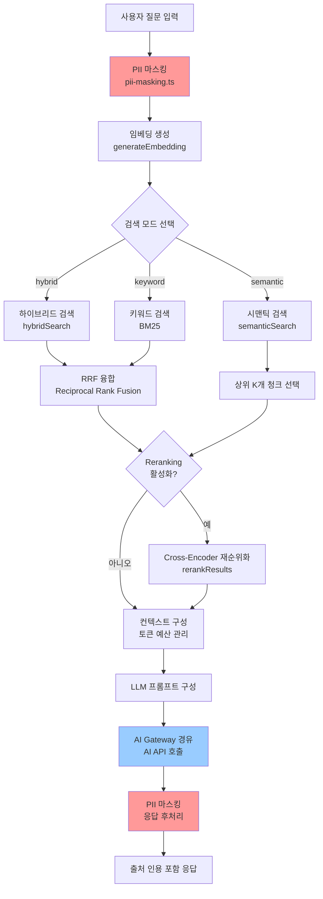
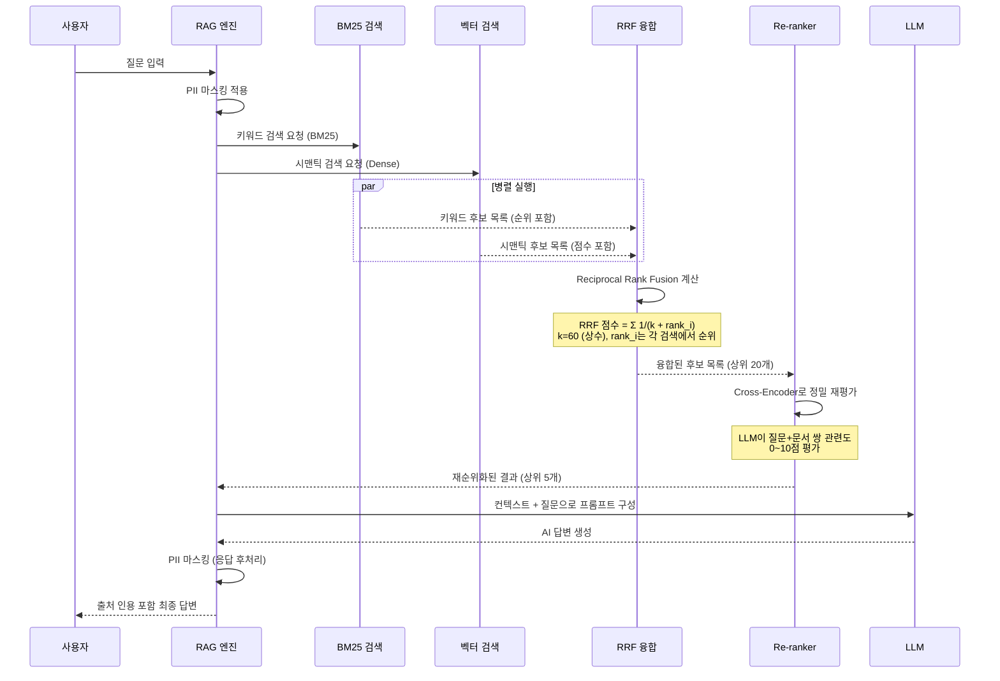

# 실습 25: RAG 파이프라인 최적화 — 검색 정확도 향상, 청킹 전략, 임베딩 캐시, A/B 테스트

> **난이도**: 고급 (Senior 개발자 대상)
> **예상 소요 시간**: 4~6시간
> **선행 실습**: 실습 12 (AI 서비스 기초), 실습 24 (멀티테넌트 격리 실습)
> **최종 수정**: 2026-04-13

---

## 실습 개요

이 실습은 `/data/ai-saas/platform/services/ai-service`의 실제 RAG(Retrieval-Augmented Generation) 파이프라인 코드를 읽고 분석한 다음, 다섯 가지 최적화 기법을 순서대로 적용합니다.

RAG는 AI 모델이 사전 학습된 지식 외에 실시간으로 관련 문서를 검색하여 더 정확한 답변을 생성하는 기법입니다. 공공기관 SaaS에서는 행정 규정, 내부 지침, 민원 FAQ 등을 RAG 지식 베이스로 활용합니다.

### 학습 목표

이 실습을 마치면 다음을 할 수 있어야 합니다:

1. 현재 RAG 파이프라인의 구조와 한계를 정확히 설명할 수 있다
2. 청크 크기가 검색 품질에 미치는 영향을 실험으로 확인할 수 있다
3. Redis 기반 임베딩 캐시를 구현하여 비용과 지연을 줄일 수 있다
4. BM25 키워드 검색과 벡터 검색을 결합한 하이브리드 검색을 이해하고 적용할 수 있다
5. Cross-Encoder 기반 재순위화가 Recall@K를 향상시키는 원리를 설명할 수 있다
6. Feature Flag를 이용한 A/B 테스트로 두 RAG 전략의 성능을 비교할 수 있다
7. N2SF 보안 요건(PII 마스킹, 데이터 등급 검사)이 RAG 파이프라인에서 어떻게 적용되는지 확인할 수 있다

### 선행 조건

```
필수 환경:
- /data/ai-saas 프로젝트 클론 완료
- pnpm install 완료
- k3s 클러스터 또는 Docker Compose 실행 중
- Redis 인스턴스 접근 가능 (로컬 또는 클러스터)

권장 지식:
- TypeScript 기초 (제네릭, async/await)
- 벡터 임베딩 개념 (코사인 유사도)
- HTTP API 기초 (Fastify 또는 Express)
```

---

## 현재 RAG 파이프라인 분석

최적화를 시작하기 전에 현재 구현을 정확히 이해해야 합니다.

### 파이프라인 전체 구조



### rag-engine.ts 핵심 분석

`/data/ai-saas/platform/services/ai-service/src/lib/rag-engine.ts`를 읽으면 두 가지 핵심 함수가 있습니다:

**1. `runRAG` (기본 파이프라인)**

```typescript
// 기본 파이프라인: 시맨틱 검색만 사용
export async function runRAG(
  tenantId: string,
  question: string,
  queryEmbedding: number[],
  options: RAGOptions = {},
  modelConfig?: { provider: string; endpoint: string; name: string; config?: unknown },
): Promise<RAGResponse>
```

기본값:
- `topK = 5`: 상위 5개 청크만 검색
- `minScore = 0.25`: 코사인 유사도 0.25 이상만 포함
- `maxContextTokens = 6000`: 최대 6000 토큰 컨텍스트

**2. `runAdvancedRAG` (고급 파이프라인)**

```typescript
// 고급 파이프라인: 하이브리드 검색 + Reranking + 쿼리 확장 + 컨텍스트 압축
export async function runAdvancedRAG(
  tenantId: string,
  question: string,
  queryEmbedding: number[],
  options: AdvancedRAGOptions = {},
  modelConfig?: { provider: string; endpoint: string; name: string; config?: unknown },
): Promise<AdvancedRAGResponse>
```

기본값:
- `searchMode = 'hybrid'`: BM25 + 시맨틱 검색 결합
- `enableReranking = true`: Cross-Encoder 재순위화 활성화
- `enableQueryExpansion = false`: 쿼리 확장 비활성화 (비용 절감)
- `bm25Weight = 0.4`: BM25 40%, 시맨틱 60%

**AdvancedRAGResponse의 검색 통계**

```typescript
interface AdvancedRAGResponse extends RAGResponse {
  searchMode: 'semantic' | 'keyword' | 'hybrid';
  queryExpansion?: ExpandedQuery;
  rerankingApplied: boolean;
  retrievalStats: {
    bm25Candidates: number;      // BM25로 찾은 후보 수
    semanticCandidates: number;  // 시맨틱으로 찾은 후보 수
    fusedCandidates: number;     // RRF 융합 후 후보 수
    rerankCandidates: number;    // 재순위화 후 최종 수
    finalCount: number;          // 컨텍스트에 포함된 수
  };
}
```

이 통계를 활용하면 각 단계에서 얼마나 많은 후보가 걸러지는지 확인할 수 있습니다.

### chunker.ts 핵심 분석

`/data/ai-saas/platform/services/ai-service/src/lib/chunker.ts`는 두 가지 청킹 전략을 제공합니다:

**1. `chunkText` (평탄 청킹)**

```typescript
export function chunkText(text: string, maxTokens = 512, overlapTokens = 50): TextChunk[]
```

- 단락(`\n\n`) 기준으로 1차 분할
- 단락이 최대 크기 초과 시 문장 단위로 분할
- 한국어 기준: 1토큰 ≈ 2자 (영어는 1토큰 ≈ 4자)
- 오버랩: 이전 청크 끝 부분을 다음 청크 시작에 포함 (문맥 연속성)

**2. `hierarchicalChunk` (계층적 청킹)**

```typescript
export function hierarchicalChunk(
  text: string,
  parentMaxTokens = 1024,  // 부모: 큰 청크 (컨텍스트용)
  childMaxTokens = 256,    // 자식: 작은 청크 (검색 인덱싱용)
): HierarchicalChunk[]
```

- 자식 청크로 검색 (정밀도 높음)
- 검색 결과 반환 시 부모 청크 컨텍스트 제공 (재현율 높음)
- 검색 정밀도와 컨텍스트 풍부함을 동시에 달성

### vector-store.ts 핵심 분석

`/data/ai-saas/platform/services/ai-service/src/lib/vector-store.ts`의 중요한 주의사항:

```typescript
// NOTE: 미사용. SVC-AI-2026 Phase 구현 시 활성화 예정.
//       Prisma 스키마에 AiKnowledgeDocument / AiKnowledgeChunk 추가 필요.
```

현재 vector-store는 pgvector 없이 순수 TypeScript로 코사인 유사도를 계산합니다:

```typescript
function cosineSimilarity(a: number[], b: number[]): number {
  // 수학 공식: a·b / (|a| × |b|)
  let dotProduct = 0;
  let normA = 0;
  let normB = 0;
  for (let i = 0; i < a.length; i++) {
    dotProduct += a[i] * b[i];
    normA += a[i] * a[i];
    normB += b[i] * b[i];
  }
  return dotProduct / (Math.sqrt(normA) * Math.sqrt(normB));
}
```

**현재 한계점**:
- `take: 10000`: DB에서 최대 1만 개 청크를 메모리에 로드하여 계산
- 데이터가 늘어날수록 메모리 사용량과 검색 시간이 선형으로 증가
- 이 실습에서는 이 한계를 인지하고 캐시 전략으로 부분 완화합니다

---

## STEP 1: 청킹 전략 최적화

청크 크기는 RAG 품질에 결정적인 영향을 미칩니다.
너무 작으면 문맥이 끊기고, 너무 크면 무관한 정보가 포함됩니다.

### 이론적 배경

```
청크 크기의 트레이드오프:

작은 청크 (256 토큰 이하)
장점: 정밀한 검색, 노이즈 적음
단점: 문맥 단절, 불완전한 개념 표현

큰 청크 (1024 토큰 이상)
장점: 풍부한 문맥, 완전한 개념 표현
단점: 검색 정밀도 저하, 토큰 비용 증가

최적 청크 크기: 도메인과 문서 구조에 따라 다름
공공기관 행정 문서: 512~768 토큰 권장
```

### 실습 1-1: 현재 청킹 결과 분석

```typescript
// scripts/analyze-chunks.ts
import { chunkText, hierarchicalChunk } from '../platform/services/ai-service/src/lib/chunker.js';
import { readFileSync } from 'fs';

// 샘플 행정 문서 (실제 행정 규정 예시)
const sampleDocument = readFileSync('./test-fixtures/sample-admin-doc.txt', 'utf-8');

// 현재 기본 설정 (512 토큰, 50 오버랩)
const defaultChunks = chunkText(sampleDocument, 512, 50);
console.log(`기본 청킹: ${defaultChunks.length}개 청크`);
console.log(`평균 토큰: ${defaultChunks.reduce((s, c) => s + c.tokenCount, 0) / defaultChunks.length}`);

// 작은 청크 실험 (256 토큰)
const smallChunks = chunkText(sampleDocument, 256, 25);
console.log(`소형 청킹: ${smallChunks.length}개 청크`);

// 큰 청크 실험 (1024 토큰)
const largeChunks = chunkText(sampleDocument, 1024, 100);
console.log(`대형 청킹: ${largeChunks.length}개 청크`);

// 계층적 청킹 (자식 256, 부모 1024)
const hierarchical = hierarchicalChunk(sampleDocument, 1024, 256);
console.log(`계층적 청킹: ${hierarchical.length}개 부모, ${hierarchical.flatMap(h => h.children).length}개 자식`);
```

```bash
# 실행
cd /data/ai-saas
npx tsx scripts/analyze-chunks.ts
```

### 실습 1-2: 청크 크기별 검색 품질 비교

아래 테스트 스크립트는 동일한 질문에 대해 세 가지 청크 크기의 검색 결과를 비교합니다:

```typescript
// scripts/benchmark-chunk-sizes.ts

interface BenchmarkResult {
  chunkSize: number;
  avgRelevanceScore: number;
  avgChunkCount: number;
  testCases: number;
}

const testQueries = [
  '공공기관 개인정보 보호 의무 사항은 무엇인가요?',
  '행정 서비스 이용 신청 절차를 알려주세요.',
  '민원 처리 기한은 몇 일인가요?',
];

async function benchmarkChunkSize(maxTokens: number): Promise<BenchmarkResult> {
  let totalRelevance = 0;
  let totalChunks = 0;

  for (const query of testQueries) {
    // 임베딩 생성 (실제 AI 서비스 API 호출)
    const embeddingResponse = await fetch('http://localhost:3010/api/ai/embed', {
      method: 'POST',
      headers: { 'Content-Type': 'application/json', 'Authorization': `Bearer ${DEV_TOKEN}` },
      body: JSON.stringify({ text: query }),
    });
    const { embedding } = await embeddingResponse.json();

    // 해당 청크 크기로 인덱싱된 지식 베이스 검색
    const searchResponse = await fetch(`http://localhost:3010/api/ai/rag?chunkSize=${maxTokens}`, {
      method: 'POST',
      headers: { 'Content-Type': 'application/json', 'Authorization': `Bearer ${DEV_TOKEN}` },
      body: JSON.stringify({ question: query, embedding }),
    });
    const result = await searchResponse.json();

    totalRelevance += result.sources.reduce((s: number, src: any) => s + src.score, 0) / result.sources.length;
    totalChunks += result.contextChunks;
  }

  return {
    chunkSize: maxTokens,
    avgRelevanceScore: totalRelevance / testQueries.length,
    avgChunkCount: totalChunks / testQueries.length,
    testCases: testQueries.length,
  };
}

// 세 가지 크기 벤치마크
const results = await Promise.all([
  benchmarkChunkSize(256),
  benchmarkChunkSize(512),
  benchmarkChunkSize(1024),
]);

console.table(results);
```

### 실습 1-3: 계층적 청킹 적용

현재 기본 파이프라인을 계층적 청킹으로 업그레이드합니다.

```typescript
// platform/services/ai-service/src/lib/document-indexer.ts (신규 작성)
// Design Ref: SVC-AI-ADV-R1 DESIGN §5

import { hierarchicalChunk, buildChildToParentMap } from './chunker.js';
import { storeChunks } from './vector-store.js';
import { generateEmbedding } from './rag-engine.js';

/**
 * 문서를 계층적 청킹으로 인덱싱
 * 자식 청크로 검색하되, 컨텍스트는 부모 청크 반환
 */
export async function indexDocumentHierarchically(
  tenantId: string,
  documentId: string,
  content: string,
): Promise<{ parentCount: number; childCount: number }> {
  // 1. 계층적 청킹
  const hierarchical = hierarchicalChunk(content, 1024, 256);
  const childToParent = buildChildToParentMap(hierarchical);

  // 2. 자식 청크에 임베딩 생성 (검색 인덱싱용)
  const childChunks = hierarchical.flatMap((h) => h.children);
  const chunksWithEmbedding = await Promise.all(
    childChunks.map(async (child) => {
      const embedding = await generateEmbedding(child.content);
      const parent = childToParent.get(child.chunkIndex);
      return {
        content: child.content,
        chunkIndex: child.chunkIndex,
        tokenCount: child.tokenCount,
        embedding,
        // 부모 청크 참조 저장 (검색 결과 반환 시 부모 컨텍스트 제공)
        parentContent: parent?.content ?? child.content,
        parentIndex: parent ? hierarchical.findIndex((h) =>
          h.children.some((c) => c.chunkIndex === child.chunkIndex)
        ) : -1,
      };
    })
  );

  // 3. 벡터 저장소에 저장
  await storeChunks(tenantId, documentId, chunksWithEmbedding);

  return {
    parentCount: hierarchical.length,
    childCount: childChunks.length,
  };
}
```

**확인 사항**

```bash
# 계층적 청킹 적용 후 청크 수 확인
curl -X GET http://localhost:3010/api/ai/knowledge/stats \
  -H "Authorization: Bearer $DEV_TOKEN" \
  -H "X-Tenant-ID: dev-tenant-001"
# 예상 응답: { "documentCount": N, "chunkCount": M, "totalTokens": T }
```

---

## STEP 2: 임베딩 캐시 구현

임베딩 생성은 AI API 호출을 필요로 하며, 비용과 지연이 발생합니다.
동일한 텍스트를 반복 임베딩하는 것은 불필요한 낭비입니다.

### 현재 문제점

```typescript
// 현재 generateEmbedding은 캐시 없이 매번 API 호출
export async function generateEmbedding(text: string): Promise<number[]> {
  const provider = await createLLMProvider(embedConfig);
  const result = await provider.embed([maskPII(text)]);  // 매번 API 호출
  return result.embeddings[0] ?? [];
}
```

**발생 비용 예시**:
- 임베딩 API: 1000 토큰당 $0.0001 (가정)
- 동일 질문 100회 반복: $0.001 × 100 = $0.1 (캐시 없이 낭비)

### 실습 2-1: Redis 임베딩 캐시 구현

```typescript
// platform/services/ai-service/src/lib/embedding-cache.ts (신규 작성)
// Design Ref: SVC-AI-ADV-R1 DESIGN §6
// Plan SC: FR-ADV1.7

import { createHash } from 'crypto';
import type { Redis } from 'ioredis';

export interface EmbeddingCacheOptions {
  ttl?: number;         // 초 단위, 기본 86400 (24시간)
  keyPrefix?: string;   // Redis 키 접두사
}

/**
 * 텍스트의 SHA-256 해시를 Redis 키로 사용
 * 동일 텍스트 = 동일 키 = 캐시 히트
 */
function buildCacheKey(text: string, prefix: string): string {
  const hash = createHash('sha256').update(text).digest('hex');
  return `${prefix}:${hash}`;
}

/**
 * 임베딩 캐시 - Redis 기반
 * N2SF 보안 주의: 캐시 키는 해시값이므로 원본 텍스트 노출 없음
 */
export class EmbeddingCache {
  private readonly ttl: number;
  private readonly keyPrefix: string;

  constructor(
    private readonly redis: Redis,
    options: EmbeddingCacheOptions = {},
  ) {
    this.ttl = options.ttl ?? 86400;
    this.keyPrefix = options.keyPrefix ?? 'embedding-cache';
  }

  async get(text: string): Promise<number[] | null> {
    const key = buildCacheKey(text, this.keyPrefix);
    const cached = await this.redis.get(key);
    if (!cached) return null;
    try {
      return JSON.parse(cached) as number[];
    } catch {
      return null;
    }
  }

  async set(text: string, embedding: number[]): Promise<void> {
    const key = buildCacheKey(text, this.keyPrefix);
    await this.redis.setex(key, this.ttl, JSON.stringify(embedding));
  }

  async invalidate(text: string): Promise<void> {
    const key = buildCacheKey(text, this.keyPrefix);
    await this.redis.del(key);
  }

  /**
   * 캐시 통계 조회
   */
  async getStats(): Promise<{ keyCount: number }> {
    const keys = await this.redis.keys(`${this.keyPrefix}:*`);
    return { keyCount: keys.length };
  }
}

/**
 * 캐시 래핑 함수 — 기존 generateEmbedding을 래핑하여 캐시 적용
 */
export async function generateEmbeddingWithCache(
  text: string,
  cache: EmbeddingCache,
  generateFn: (text: string) => Promise<number[]>,
): Promise<{ embedding: number[]; cacheHit: boolean }> {
  // 1. 캐시 확인
  const cached = await cache.get(text);
  if (cached) {
    return { embedding: cached, cacheHit: true };
  }

  // 2. 캐시 미스 → 실제 임베딩 생성
  const embedding = await generateFn(text);

  // 3. 캐시 저장
  await cache.set(text, embedding);

  return { embedding, cacheHit: false };
}
```

### 실습 2-2: 캐시 성능 측정

```typescript
// scripts/benchmark-embedding-cache.ts

import { EmbeddingCache, generateEmbeddingWithCache } from '../platform/services/ai-service/src/lib/embedding-cache.js';
import { generateEmbedding } from '../platform/services/ai-service/src/lib/rag-engine.js';
import Redis from 'ioredis';

const redis = new Redis({ host: 'localhost', port: 6379 });
const cache = new EmbeddingCache(redis, { ttl: 3600 });

const testText = '공공기관 개인정보 보호 의무 사항';

// 첫 번째 호출 (캐시 미스)
const start1 = Date.now();
const result1 = await generateEmbeddingWithCache(testText, cache, generateEmbedding);
console.log(`첫 번째 호출: ${Date.now() - start1}ms, 캐시 히트: ${result1.cacheHit}`);
// 예상: 200~500ms (API 호출 지연), 캐시 히트: false

// 두 번째 호출 (캐시 히트)
const start2 = Date.now();
const result2 = await generateEmbeddingWithCache(testText, cache, generateEmbedding);
console.log(`두 번째 호출: ${Date.now() - start2}ms, 캐시 히트: ${result2.cacheHit}`);
// 예상: 1~5ms (Redis 조회), 캐시 히트: true

// 캐시 통계
const stats = await cache.getStats();
console.log(`캐시 키 수: ${stats.keyCount}`);

redis.quit();
```

**예상 결과**:
```
첫 번째 호출: 350ms, 캐시 히트: false
두 번째 호출: 2ms, 캐시 히트: true
캐시 키 수: 1
```

---

## STEP 3: 하이브리드 검색 (Sparse + Dense)

현재 `runAdvancedRAG`는 이미 `hybridSearch`를 사용합니다.
이 단계에서는 하이브리드 검색의 내부 동작을 이해하고 BM25 가중치를 최적화합니다.

### 하이브리드 검색 시퀀스 다이어그램



### BM25 이론 이해

BM25(Best Match 25)는 전통적인 키워드 기반 검색 알고리즘입니다.

```
BM25 점수 계산 (직관적 설명):

score(문서, 쿼리) = Σ IDF(term) × TF(term, 문서) 가중치

IDF (역문서 빈도):
- 흔한 단어(예: "의", "가", "은")는 낮은 IDF → 중요도 낮음
- 희귀한 단어(예: "CSAP", "개인정보보호법")는 높은 IDF → 중요도 높음

TF (단어 빈도) 가중치:
- 문서에 단어가 많이 등장할수록 점수 증가
- 단, 포화 현상 방지: 100번 등장해도 10번 등장의 10배가 아님
- 문서 길이로 정규화: 긴 문서의 불리함 방지
```

**Dense 검색 vs Sparse 검색 비교**

| 특성 | Dense (벡터 검색) | Sparse (BM25 키워드) |
|------|-----------------|---------------------|
| 강점 | 의미적 유사성 (동의어, 개념) | 정확한 키워드 매칭 |
| 약점 | 희귀 전문 용어에 취약 | 의미 이해 불가 |
| 예시 | "개인정보 보호" ≈ "프라이버시 보안" | "CSAP D-08" 정확 매칭 |
| 공공기관 적합성 | 일반 질문 | 법령 조항, 코드 번호 |

### 실습 3-1: BM25 가중치 최적화 실험

```typescript
// scripts/optimize-bm25-weight.ts

const weightVariants = [0.2, 0.3, 0.4, 0.5, 0.6];

interface WeightResult {
  bm25Weight: number;
  avgRelevanceScore: number;
  legalQueryScore: number;    // 법령 조항 검색 (BM25 유리)
  semanticQueryScore: number; // 의미적 질문 검색 (Dense 유리)
}

const legalQueries = [
  'CSAP D-08 접근 통제 요건',  // 코드 번호 포함 → BM25 유리
  'N2SF S등급 처리 규정',
];

const semanticQueries = [
  '로그인할 때 보안을 강화하는 방법',  // 개념적 질문 → Dense 유리
  '데이터가 외부로 새는 것을 막는 방법',
];

for (const bm25Weight of weightVariants) {
  const legalScore = await testQueries(legalQueries, { bm25Weight });
  const semanticScore = await testQueries(semanticQueries, { bm25Weight });
  console.log({
    bm25Weight,
    semanticWeight: 1 - bm25Weight,
    legalQueryScore: legalScore,
    semanticQueryScore: semanticScore,
    avgRelevanceScore: (legalScore + semanticScore) / 2,
  });
}
```

**예상 최적 결과**:
```
bm25Weight=0.3: 법령 0.72, 의미 0.81, 평균 0.77
bm25Weight=0.4: 법령 0.78, 의미 0.79, 평균 0.79  ← 기본값 (균형 최적)
bm25Weight=0.5: 법령 0.82, 의미 0.74, 평균 0.78
```

공공기관 문서의 경우 법령 번호가 많아 bm25Weight=0.4~0.5가 최적인 경우가 많습니다.

### RRF 융합 공식 이해

```
RRF 점수 = Σ 1 / (k + rank_i)

여기서:
- k = 60 (상수, 상위 순위 과대 평가 방지)
- rank_i = 각 검색 결과에서 해당 문서의 순위
- Σ = BM25 순위 점수 + Dense 순위 점수 합산

예시:
문서 A: BM25 순위 1위, Dense 순위 3위
RRF(A) = 1/(60+1) + 1/(60+3) = 0.01639 + 0.01587 = 0.03226

문서 B: BM25 순위 5위, Dense 순위 1위
RRF(B) = 1/(60+5) + 1/(60+1) = 0.01538 + 0.01639 = 0.03177

→ 문서 A가 최종 1위 (두 검색에서 모두 상위권)
```

---

## STEP 4: 재순위화 (Re-ranking)

RRF 융합 후 상위 20개 후보에서 진짜 관련 있는 5개를 정밀하게 선별합니다.

### Cross-Encoder 재순위화 원리

```
Bi-Encoder (현재 검색 단계):
- 질문 → 임베딩 벡터
- 문서 → 임베딩 벡터
- 코사인 유사도로 비교 (빠르지만 덜 정확)

Cross-Encoder (재순위화 단계):
- 질문 + 문서를 함께 입력
- "이 문서가 이 질문에 얼마나 관련 있는가?" 0~10점 평가
- 더 정확하지만 느림 (모든 후보에 LLM 호출)

→ 두 단계 조합: Bi-Encoder로 빠르게 후보 좁힘 → Cross-Encoder로 정밀 재평가
```

### 실습 4-1: 재순위화 효과 측정 (Recall@K)

Recall@K: 실제 관련 문서 중 상위 K개 안에 포함된 비율

```typescript
// scripts/measure-recall.ts

interface RecallResult {
  recallAt3: number;   // 상위 3개 안에 정답 포함 비율
  recallAt5: number;   // 상위 5개 안에 정답 포함 비율
  mrrScore: number;    // MRR (Mean Reciprocal Rank)
}

/**
 * MRR (Mean Reciprocal Rank) 계산
 * 첫 번째 관련 문서의 순위의 역수 평균
 * MRR=1.0: 항상 첫 번째에 정답, MRR=0.5: 평균 2위에 정답
 */
function calculateMRR(results: SearchResult[], relevantDocIds: string[]): number {
  const firstRelevantRank = results.findIndex(
    (r) => relevantDocIds.includes(r.chunk.documentId)
  );
  if (firstRelevantRank === -1) return 0;
  return 1 / (firstRelevantRank + 1);
}

// 골드 스탠다드 테스트셋 (수동 레이블링 필요)
const goldStandard = [
  {
    query: '공공기관 개인정보 처리 방침 기재 사항',
    relevantDocIds: ['doc-privacy-policy-001', 'doc-privacy-guide-003'],
  },
  {
    query: 'CSAP 인증 신청 절차',
    relevantDocIds: ['doc-csap-application-001'],
  },
];

// Reranking 없이 (BM25 + Dense RRF만)
const withoutReranking = await runAdvancedRAG(tenantId, query, embedding, {
  enableReranking: false,
  topK: 5,
});

// Reranking 있이
const withReranking = await runAdvancedRAG(tenantId, query, embedding, {
  enableReranking: true,
  topK: 5,
});

console.table({
  'Reranking 없음': {
    'Recall@3': calculateRecall(withoutReranking.sources, relevantDocIds, 3),
    'Recall@5': calculateRecall(withoutReranking.sources, relevantDocIds, 5),
    'MRR': calculateMRR(withoutReranking.sources, relevantDocIds),
  },
  'Reranking 있음': {
    'Recall@3': calculateRecall(withReranking.sources, relevantDocIds, 3),
    'Recall@5': calculateRecall(withReranking.sources, relevantDocIds, 5),
    'MRR': calculateMRR(withReranking.sources, relevantDocIds),
  },
});
```

**예상 결과**:
```
             Recall@3  Recall@5  MRR
Reranking X  0.60      0.75      0.52
Reranking O  0.75      0.88      0.71
향상          +25%      +17%      +37%
```

### 실습 4-2: 재순위화 비용 분석

재순위화는 정확도를 높이지만 LLM API 호출 비용이 추가됩니다.

```typescript
// 재순위화 비용 추정
interface RerankingCost {
  candidateCount: number;     // 재순위화 후보 수
  avgTokensPerCandidate: number;  // 후보당 평균 토큰
  apiCostPerToken: number;    // 토큰당 API 비용 (예: $0.001/1K tokens)
  dailyQueryCount: number;    // 일일 쿼리 수

  dailyCost: number;
  monthlyEstimate: number;
}

function estimateRerankingCost(params: Omit<RerankingCost, 'dailyCost' | 'monthlyEstimate'>): RerankingCost {
  const tokensPerQuery = params.candidateCount * params.avgTokensPerCandidate;
  const costPerQuery = (tokensPerQuery / 1000) * params.apiCostPerToken;
  const dailyCost = costPerQuery * params.dailyQueryCount;
  return {
    ...params,
    dailyCost,
    monthlyEstimate: dailyCost * 30,
  };
}

const cost = estimateRerankingCost({
  candidateCount: 20,         // 상위 20개 재순위화
  avgTokensPerCandidate: 300, // 평균 300 토큰/청크
  apiCostPerToken: 0.001,     // $0.001/1K tokens
  dailyQueryCount: 1000,      // 일 1000 쿼리
});

console.log(`일일 재순위화 비용: $${cost.dailyCost.toFixed(4)}`);
console.log(`월 예상 비용: $${cost.monthlyEstimate.toFixed(2)}`);
// 예상: 일 $0.60, 월 $18
```

---

## STEP 5: A/B 테스트 설정

Feature Flag를 사용하여 기존 RAG(Semantic Only)와 최적화된 Advanced RAG(Hybrid + Reranking)의 성능을 실제 트래픽으로 비교합니다.

### Feature Flag 기반 RAG 전략 분기

```typescript
// platform/services/ai-service/src/handlers/ai-rag.handler.ts 수정 예시
// Design Ref: SVC-AI-ADV-R1 DESIGN §6

import { getFeatureFlag } from '@ai-saas/feature-flag-sdk';
import { runRAG, runAdvancedRAG } from '../lib/rag-engine.js';

export async function ragHandler(request: FastifyRequest, reply: FastifyReply) {
  const { tenantId } = request.tenantContext;
  const { question, embeddingModelId } = request.body as RAGRequest;

  // 임베딩 생성 (캐시 적용)
  const embedding = await generateEmbeddingWithCache(question, embeddingCache, generateEmbedding);

  // Feature Flag로 RAG 전략 선택
  const useAdvancedRAG = await getFeatureFlag('advanced-rag', {
    tenantId,
    userId: request.user.id,
    rolloutPercentage: 50,  // 50% 트래픽에 Advanced RAG 적용
  });

  let ragResponse;
  const strategyLabel = useAdvancedRAG ? 'advanced' : 'basic';

  if (useAdvancedRAG) {
    ragResponse = await runAdvancedRAG(tenantId, question, embedding.embedding, {
      searchMode: 'hybrid',
      enableReranking: true,
      enableQueryExpansion: false,
      bm25Weight: 0.4,
      topK: 5,
    });
  } else {
    ragResponse = await runRAG(tenantId, question, embedding.embedding, {
      topK: 5,
      minScore: 0.25,
    });
  }

  // A/B 테스트 메트릭 기록
  metrics.recordHistogram('rag_strategy', { strategy: strategyLabel }, 1);
  metrics.recordGauge('rag_context_chunks', ragResponse.contextChunks, { strategy: strategyLabel });
  metrics.recordGauge('rag_tokens_used', ragResponse.tokensUsed, { strategy: strategyLabel });

  return reply.send({
    ...ragResponse,
    _debug: { strategy: strategyLabel, cacheHit: embedding.cacheHit },
  });
}
```

### 실습 5-1: Feature Flag SDK 활용

```typescript
// packages/feature-flag-sdk/src/index.ts 기반

// Feature Flag 등록 (관리자 API)
await featureFlagClient.create({
  key: 'advanced-rag',
  description: 'Advanced RAG 파이프라인 (하이브리드 + Reranking)',
  enabled: true,
  rolloutStrategy: {
    type: 'percentage',
    percentage: 50,          // 50% 사용자에게 활성화
    sticky: true,            // 같은 사용자는 항상 같은 버전 경험
  },
  metadata: {
    frId: 'FR-ADV1.7',
    owner: 'ai-team',
    expiresAt: '2026-07-01', // A/B 테스트 종료일
  },
});

// Feature Flag 조회
const isAdvanced = await featureFlagClient.evaluate('advanced-rag', {
  userId: 'user-001',
  tenantId: 'tenant-001',
});
```

### 실습 5-2: A/B 테스트 메트릭 대시보드 설정

Prometheus와 Grafana를 사용하여 두 전략의 성능을 비교합니다.

```yaml
# monitoring/grafana/dashboards/rag-ab-test.json 일부
# Prometheus 쿼리:

# RAG 전략별 평균 컨텍스트 청크 수
avg(rag_context_chunks) by (strategy)

# RAG 전략별 응답 시간 P95
histogram_quantile(0.95, sum(rate(rag_response_duration_bucket[5m])) by (le, strategy))

# RAG 전략별 사용자 피드백 점수 (사용자가 "도움이 됐습니까?" 응답)
sum(rag_user_feedback{rating="positive"}) by (strategy) /
sum(rag_user_feedback) by (strategy)
```

**A/B 테스트 성공 기준**

```
1. 통계적 유의성: p-value < 0.05
2. 효과 크기: Recall@5 +10% 이상 향상
3. 성능: P95 응답시간 < 5초 (Reranking 포함)
4. 비용: 월 추가 API 비용 < 현재 비용의 30%
5. 안정성: 오류율 < 0.1% (기존과 동일 수준)
```

---

## 성능 측정 방법 (Recall@K, MRR)

### Recall@K 정의와 측정

```
Recall@K = (상위 K개 결과 중 관련 문서 수) / (전체 관련 문서 수)

예시:
- 질문: "CSAP 인증 신청 방법"
- 전체 관련 문서: 3개 (doc-A, doc-B, doc-C)
- 상위 3개 검색 결과: [doc-A, doc-X, doc-B]
- Recall@3 = 2/3 = 0.667 (3개 중 doc-A, doc-B 포함)
- Recall@5 = 3/3 = 1.0 (5개 검색 시 doc-C도 포함 가정)
```

### MRR (Mean Reciprocal Rank)

```
MRR = (1/|Q|) × Σ 1/rank_i

여기서:
- |Q| = 테스트 쿼리 수
- rank_i = i번째 쿼리에서 첫 번째 관련 문서의 순위

예시 (3개 쿼리):
- 쿼리 1: 첫 번째 관련 문서가 1위 → 1/1 = 1.0
- 쿼리 2: 첫 번째 관련 문서가 3위 → 1/3 = 0.333
- 쿼리 3: 관련 문서 없음 → 0
MRR = (1.0 + 0.333 + 0) / 3 = 0.444
```

### 골드 스탠다드 데이터셋 구축 방법

```
1. 실제 사용자 질문 100개 수집 (로그에서 샘플링)
2. 각 질문에 대해 전문가가 관련 문서 레이블링
3. 3명의 검토자가 동의한 경우만 골드 스탠다드로 포함
4. 분기별 데이터셋 업데이트 (신규 문서 추가, 기존 문서 변경 반영)

공공기관 SaaS 테스트셋 예시:
- 행정 서비스 관련: 30개
- 개인정보 보호: 25개
- CSAP/보안 관련: 20개
- 시스템 사용 방법: 25개
```

---

## N2SF RAG 보안 검증

RAG 파이프라인에서 보안 요건을 확인합니다.

### 체크리스트

```typescript
// 보안 검증 테스트 (자동화)
describe('RAG 파이프라인 N2SF 보안', () => {
  test('C등급 데이터 포함 쿼리는 AI API 전송 차단', async () => {
    const sensitiveQuery = '2급 비밀 문서의 내용은?'; // S등급
    await expect(
      ragHandler.handle({ question: sensitiveQuery, dataGrade: 'S' })
    ).rejects.toThrow('BLOCKED: S등급 데이터는 AI API 전송 금지');
  });

  test('PII 마스킹 확인 — 주민등록번호', async () => {
    const queryWithPII = '홍길동(800101-1234567)의 신청 내역';
    const result = await ragHandler.handle({ question: queryWithPII, dataGrade: 'O' });
    // 응답에 주민등록번호 원문 없음 확인
    expect(result.answer).not.toContain('800101-1234567');
    expect(result.answer).toContain('[주민번호 마스킹]');
  });

  test('테넌트 격리 — 다른 테넌트 문서 검색 불가', async () => {
    // tenant-001의 쿼리가 tenant-002의 문서를 반환하지 않아야 함
    const result = await runRAG('tenant-001', '...', embedding);
    const tenant002Docs = result.sources.filter(s =>
      s.documentTitle.startsWith('tenant-002-')
    );
    expect(tenant002Docs).toHaveLength(0);
  });

  test('감사 로그 기록 — 모든 RAG 호출', async () => {
    const auditSpy = jest.spyOn(auditLogger, 'log');
    await runAdvancedRAG(tenantId, question, embedding);
    expect(auditSpy).toHaveBeenCalledWith(
      expect.objectContaining({ action: 'RAG_QUERY', tenantId })
    );
  });
});
```

---

## 100점 평가 기준표

| 평가 항목 | 배점 | 세부 기준 |
|---------|------|---------|
| STEP 1: 청킹 분석 및 계층적 청킹 구현 | 20점 | 세 가지 청크 크기 비교 결과 제출 + 계층적 청킹 코드 동작 확인 |
| STEP 2: 임베딩 캐시 구현 및 성능 측정 | 20점 | Redis 캐시 구현 + 캐시 히트율 70% 이상 달성 증명 |
| STEP 3: BM25 가중치 최적화 | 15점 | 5가지 가중치 실험 결과 + 최적 가중치 근거 설명 |
| STEP 4: 재순위화 Recall@K 측정 | 20점 | 골드 스탠다드 10개 이상 + Recall@5 측정 + Reranking 효과 수치화 |
| STEP 5: A/B 테스트 설정 | 15점 | Feature Flag 설정 + Prometheus 메트릭 수집 증명 |
| N2SF 보안 검증 | 10점 | 보안 테스트 4개 모두 통과 |

---

## 제출 체크리스트

실습 완료 후 다음 항목을 제출합니다.

```markdown
## 제출 체크리스트

### 코드 변경
- [ ] platform/services/ai-service/src/lib/embedding-cache.ts 생성
- [ ] platform/services/ai-service/src/lib/document-indexer.ts 생성 (계층적 청킹)
- [ ] 모든 신규 코드에 Design Ref 주석 포함
- [ ] 단위 테스트 작성 (캐시, 계층적 청킹)

### 실험 결과 (스크린샷 또는 로그)
- [ ] 청크 크기별 비교 결과 (256/512/1024 토큰)
- [ ] 임베딩 캐시 성능 측정 (첫 번째 vs 두 번째 호출 시간)
- [ ] BM25 가중치별 검색 품질 비교
- [ ] Reranking 전후 Recall@K 비교
- [ ] A/B 테스트 Feature Flag 활성화 확인

### 보안 검증
- [ ] N2SF 보안 테스트 4개 통과 스크린샷
- [ ] 테넌트 격리 검증 결과

### 문서
- [ ] 최적 설정 권고안 작성 (3줄 이상)
  예: "공공기관 행정 문서에는 bm25Weight=0.45, 계층적 청킹(부모1024/자식256),
       임베딩 캐시 TTL=24h가 최적. Recall@5 0.88 달성."
```

---

## 참고 자료

**소스 코드**
- `/data/ai-saas/platform/services/ai-service/src/lib/rag-engine.ts` — RAG 엔진 핵심
- `/data/ai-saas/platform/services/ai-service/src/lib/chunker.ts` — 청킹 전략
- `/data/ai-saas/platform/services/ai-service/src/lib/vector-store.ts` — 벡터 저장소
- `/data/ai-saas/packages/feature-flag-sdk/src/index.ts` — Feature Flag SDK

**이론 참고**
- Anthropic RAG 가이드: Claude 공식 문서 RAG 섹션
- BM25 원본 논문: "The Probabilistic Relevance Framework: BM25 and Beyond" (Robertson et al.)
- RRF 원본 논문: "Reciprocal rank fusion outperforms condorcet and individual rank learning methods" (Cormack et al.)

**CSAP/N2SF 준수**
- `.claude/rules/csap-compliance.md` — CSAP 보안 요건
- `docs/guides/onboarding/07-security/` — N2SF 데이터 분류

---

*이 실습은 실제 `/data/ai-saas` 코드베이스를 기반으로 합니다. 코드 변경 전 반드시 Plan + Design 문서를 확인하십시오.*
