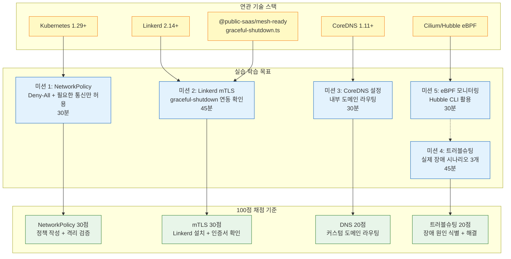

# 실습 26: Kubernetes 네트워킹 실전 — NetworkPolicy, Linkerd mTLS, DNS 트러블슈팅

> **대상 독자**: Kubernetes 기초 지식을 보유한 개발자 및 인프라 담당자
> **학습 목표**: 공공기관 SaaS 운영 환경에서 네트워크 보안 정책 구현 및 트러블슈팅 역량 습득
> **총 소요 시간**: 약 3시간 (180분)
> **관련 CSAP**: D-08 접근 통제, D-10 네트워크 보안
> **선수 지식**: kubectl 기본 명령, Kubernetes 리소스(Pod/Service/Deployment) 이해

---

## 실습 개요 및 학습 내용 다이어그램



---

## 목차

1. [실습 환경 구성](#1-실습-환경-구성)
2. [mesh-ready 패키지 코드 분석](#2-mesh-ready-패키지-코드-분석)
3. [미션 1: NetworkPolicy — Deny-All 후 재구성](#3-미션-1-networkpolicy--deny-all-후-재구성-30분)
4. [미션 2: Linkerd mTLS 적용 및 graceful-shutdown 연동](#4-미션-2-linkerd-mtls-적용-및-graceful-shutdown-연동-45분)
5. [미션 3: CoreDNS 커스텀 설정](#5-미션-3-coredns-커스텀-설정-30분)
6. [미션 4: 네트워크 정책 트러블슈팅](#6-미션-4-네트워크-정책-트러블슈팅-45분)
7. [미션 5: eBPF 기반 네트워크 모니터링 — Hubble CLI](#7-미션-5-ebpf-기반-네트워크-모니터링--hubble-cli-30분)
8. [채점 기준 및 검증 방법](#8-채점-기준-및-검증-방법)
9. [실습 완료 플로우차트](#9-실습-완료-플로우차트)
10. [CSAP D-08 증거 수집](#10-csap-d-08-증거-수집)

---

## 1. 실습 환경 구성

### 1.1 전제 조건

실습을 시작하기 전에 다음 도구가 설치되어 있어야 합니다.

```bash
# 1. 필수 도구 버전 확인
kubectl version --client
# 기대 출력: Client Version: v1.29.x 이상

helm version
# 기대 출력: v3.14.x 이상

linkerd version
# 설치 안 된 경우 아래 명령으로 설치:
curl --proto '=https' --tlsv1.2 -sSfL https://run.linkerd.io/install | sh
export PATH=$PATH:$HOME/.linkerd2/bin

# 2. Kubernetes 클러스터 접근 확인 (k3s/WSL2 환경)
kubectl cluster-info
kubectl get nodes

# 3. 현재 컨텍스트 확인
kubectl config current-context
```

### 1.2 실습 네임스페이스 생성

```bash
# 실습 전용 네임스페이스 생성
kubectl create namespace lab26
kubectl create namespace lab26-backend
kubectl create namespace lab26-frontend

# 네임스페이스 레이블 추가 (NetworkPolicy 선택자에 사용)
kubectl label namespace lab26 purpose=lab26-networking
kubectl label namespace lab26-backend purpose=lab26-networking tier=backend
kubectl label namespace lab26-frontend purpose=lab26-networking tier=frontend

# 생성 확인
kubectl get namespaces -l purpose=lab26-networking
```

### 1.3 실습용 테스트 서비스 배포

```bash
# 실습에 사용할 서비스들을 배포합니다.
# 각 서비스는 공공 SaaS의 실제 구성 요소를 시뮬레이션합니다.

cat <<'EOF' | kubectl apply -f -
# ai-service (AI 서비스 시뮬레이션)
apiVersion: apps/v1
kind: Deployment
metadata:
  name: ai-service
  namespace: lab26
  labels:
    app: ai-service
    tier: backend
spec:
  replicas: 2
  selector:
    matchLabels:
      app: ai-service
  template:
    metadata:
      labels:
        app: ai-service
        tier: backend
      annotations:
        # Linkerd 사이드카 주입 (미션 2에서 활성화)
        # linkerd.io/inject: enabled
    spec:
      containers:
      - name: ai-service
        image: nginx:alpine
        ports:
        - containerPort: 80
          name: http
        env:
        - name: SERVICE_NAME
          value: "ai-service"
        readinessProbe:
          httpGet:
            path: /
            port: 80
          initialDelaySeconds: 5
          periodSeconds: 5
---
apiVersion: v1
kind: Service
metadata:
  name: ai-service
  namespace: lab26
spec:
  selector:
    app: ai-service
  ports:
  - port: 80
    targetPort: 80
    name: http
---
# portal (포털 서비스 시뮬레이션)
apiVersion: apps/v1
kind: Deployment
metadata:
  name: portal
  namespace: lab26-frontend
  labels:
    app: portal
    tier: frontend
spec:
  replicas: 1
  selector:
    matchLabels:
      app: portal
  template:
    metadata:
      labels:
        app: portal
        tier: frontend
    spec:
      containers:
      - name: portal
        image: nginx:alpine
        ports:
        - containerPort: 80
---
apiVersion: v1
kind: Service
metadata:
  name: portal
  namespace: lab26-frontend
spec:
  selector:
    app: portal
  ports:
  - port: 80
    targetPort: 80
---
# postgres (DB 시뮬레이션)
apiVersion: apps/v1
kind: Deployment
metadata:
  name: postgres-sim
  namespace: lab26-backend
  labels:
    app: postgres-sim
    tier: database
spec:
  replicas: 1
  selector:
    matchLabels:
      app: postgres-sim
  template:
    metadata:
      labels:
        app: postgres-sim
        tier: database
    spec:
      containers:
      - name: postgres-sim
        image: nginx:alpine
        ports:
        - containerPort: 5432
          name: postgres
---
apiVersion: v1
kind: Service
metadata:
  name: postgres-sim
  namespace: lab26-backend
spec:
  selector:
    app: postgres-sim
  ports:
  - port: 5432
    targetPort: 80
    name: postgres
EOF

# 배포 확인
kubectl get pods -n lab26
kubectl get pods -n lab26-frontend
kubectl get pods -n lab26-backend
```

---

## 2. mesh-ready 패키지 코드 분석

미션 2(Linkerd mTLS)를 시작하기 전에 실제 프로젝트 코드를 이해합니다.

### 2.1 GracefulShutdown 클래스 분석

`/platform/packages/mesh-ready/src/graceful-shutdown.ts`의 핵심 로직을 분석합니다.

```typescript
// Design Ref: SVC-MESH-R13 Plan
// Plan SC: FR-MESH.3
// CSAP: D-07 가용성 관리

export class GracefulShutdown {
  private isShuttingDown = false;
  private activeRequests = 0;

  // SIGTERM 수신 → 4단계 처리:
  // 1. isShuttingDown = true (새 요청 거부)
  // 2. 진행 중 요청 완료 대기 (최대 30초)
  // 3. DB/캐시 연결 정리 핸들러 실행
  // 4. Fastify 서버 종료

  registerWithFastify(app: FastifyInstance): void {
    // onRequest: 셧다운 중이면 503 반환
    app.addHook('onRequest', async (_request, reply) => {
      if (this.isShuttingDown) {
        reply.status(503).send({
          error: 'Service Unavailable',
          message: '서비스가 종료 중입니다',
          code: 'SERVICE_SHUTTING_DOWN',
        });
        return;
      }
      this.incrementRequests();
    });

    // onResponse: 요청 완료 시 카운터 감소
    app.addHook('onResponse', async () => {
      this.decrementRequests();
    });
  }
}
```

**Linkerd mTLS와의 연관성**:

Linkerd 사이드카(proxy)는 Pod 내부에서 실행됩니다. SIGTERM이 오면 Kubernetes는 먼저 Pod에 신호를 보내고, Linkerd 프록시가 먼저 종료되면 실제 앱 컨테이너의 트래픽이 끊길 수 있습니다.

`GracefulShutdown`은 이를 해결합니다:
1. SIGTERM 수신 → `isShuttingDown = true` (새 요청 거부)
2. Linkerd 프록시보다 먼저 503을 반환하여 Kubernetes가 트래픽을 다른 Pod로 보내도록 유도
3. 기존 요청 완료 후 정리 핸들러 실행
4. 프록시와 함께 안전하게 종료

### 2.2 TraceContextPropagator 분석

```typescript
// /platform/packages/mesh-ready/src/trace-context-propagator.ts
// W3C TraceContext + B3 분산 추적 헤더 전파

// Linkerd가 mTLS로 서비스 간 통신을 암호화할 때
// 추적 헤더(traceparent, X-B3-TraceId 등)를 올바르게 전파해야
// Jaeger/Zipkin 같은 추적 도구에서 전체 요청 흐름을 볼 수 있습니다.

// 헤더 전파 흐름:
// 클라이언트 → [traceparent 생성] → ai-service → [traceparent 전달] → rag-service
//                                    ↓ mTLS 암호화(Linkerd)
//                                    traceparent는 암호화 외부 (HTTP 헤더)
```

### 2.3 meshReadyPlugin 통합 방식

```typescript
// 서비스에서 mesh-ready 플러그인 사용 예시
import { meshReadyPlugin } from '@public-saas/mesh-ready';

await app.register(meshReadyPlugin, {
  service: {
    name: 'ai-service',
    version: '1.0.0',
    namespace: process.env['K8S_NAMESPACE'] ?? 'public-saas',
    sidecarInjected: process.env['ISTIO_SIDECAR'] === 'true',
    dependencies: ['postgres', 'redis', 'ai-llm-server'],
  },
  shutdown: {
    timeout: 30000,           // k8s terminationGracePeriodSeconds와 동기화
    cleanupHandlers: [
      () => prisma.$disconnect(),   // DB 연결 정리
      () => redis.quit(),           // Redis 연결 정리
    ],
  },
});

// 이후 모든 SIGTERM은 meshReadyPlugin이 처리
// app.mesh.shutdown.isTerminating() 으로 상태 확인 가능
```

---

## 3. 미션 1: NetworkPolicy — Deny-All 후 재구성 (30분)

### 3.1 미션 목표

기본적으로 Kubernetes는 모든 Pod 간 통신을 허용합니다. 이는 보안상 매우 위험합니다. 이 미션에서는 모든 트래픽을 차단한 후 필요한 통신만 허용하는 정책을 작성합니다.

### 3.2 사전 상태 확인 — 통신 가능 여부 확인

```bash
# 현재 상태: NetworkPolicy 없음 = 모든 통신 허용
# portal → ai-service 통신 테스트
PORTAL_POD=$(kubectl get pod -n lab26-frontend -l app=portal -o jsonpath='{.items[0].metadata.name}')
AI_SERVICE_IP=$(kubectl get service ai-service -n lab26 -o jsonpath='{.spec.clusterIP}')

kubectl exec -n lab26-frontend $PORTAL_POD -- wget -qO- --timeout=3 "http://$AI_SERVICE_IP/health"
# 기대 결과: 연결 성공 (200 OK)

# DB로부터의 접근도 허용됨 (원하지 않는 상태)
DB_POD=$(kubectl get pod -n lab26-backend -l app=postgres-sim -o jsonpath='{.items[0].metadata.name}')
kubectl exec -n lab26-backend $DB_POD -- wget -qO- --timeout=3 "http://$AI_SERVICE_IP/health"
# 기대 결과: 연결 성공 — 이것이 문제! DB가 AI 서비스에 접근할 이유 없음
```

### 3.3 단계 1: Deny-All 정책 적용

```bash
cat <<'EOF' | kubectl apply -f -
# 모든 인바운드 트래픽 차단 (NetworkPolicy: Deny-All)
apiVersion: networking.k8s.io/v1
kind: NetworkPolicy
metadata:
  name: deny-all-ingress
  namespace: lab26
  annotations:
    # CSAP D-08 증거: 기본 차단 정책 적용 일시
    csap.public-saas.io/applied: "2026-04-13"
    csap.public-saas.io/requirement: "D-08-04"
spec:
  podSelector: {}          # 모든 Pod에 적용
  policyTypes:
  - Ingress                # 인바운드만 차단 (일단 인그레스부터)
  # ingress 규칙 없음 = 모든 인바운드 차단
---
# 모든 아웃바운드 트래픽도 차단
apiVersion: networking.k8s.io/v1
kind: NetworkPolicy
metadata:
  name: deny-all-egress
  namespace: lab26
spec:
  podSelector: {}
  policyTypes:
  - Egress
  # egress 규칙 없음 = 모든 아웃바운드 차단
EOF

echo "Deny-All 정책 적용 완료"
kubectl get networkpolicies -n lab26
```

### 3.4 단계 2: Deny-All 효과 확인

```bash
# portal → ai-service 통신 테스트 (실패해야 정상)
kubectl exec -n lab26-frontend $PORTAL_POD -- wget -qO- --timeout=3 "http://$AI_SERVICE_IP/health" 2>&1
# 기대 결과: 연결 타임아웃 또는 Connection refused
# → Deny-All 정책이 정상 작동 중

# ai-service에서 외부 DNS 조회도 차단됨
AI_POD=$(kubectl get pod -n lab26 -l app=ai-service -o jsonpath='{.items[0].metadata.name}')
kubectl exec -n lab26 $AI_POD -- nslookup google.com 2>&1
# 기대 결과: 타임아웃 (외부 DNS도 차단됨)
```

### 3.5 단계 3: 필요한 통신만 허용

공공 SaaS의 실제 통신 요건을 반영한 NetworkPolicy를 작성합니다.

```bash
cat <<'EOF' | kubectl apply -f -
# 정책 1: ai-service가 portal로부터 인바운드 허용
apiVersion: networking.k8s.io/v1
kind: NetworkPolicy
metadata:
  name: allow-portal-to-ai
  namespace: lab26
  annotations:
    description: "포털 → AI 서비스 HTTP 통신 허용 (CSAP D-08-02 최소 권한)"
spec:
  podSelector:
    matchLabels:
      app: ai-service        # ai-service Pod에만 적용
  policyTypes:
  - Ingress
  ingress:
  - from:
    - namespaceSelector:
        matchLabels:
          tier: frontend     # frontend 네임스페이스에서만 허용
      podSelector:
        matchLabels:
          app: portal        # portal Pod에서만 허용
    ports:
    - protocol: TCP
      port: 80               # HTTP만 허용
---
# 정책 2: ai-service의 DNS 조회 허용 (kube-dns)
apiVersion: networking.k8s.io/v1
kind: NetworkPolicy
metadata:
  name: allow-ai-to-dns
  namespace: lab26
spec:
  podSelector:
    matchLabels:
      app: ai-service
  policyTypes:
  - Egress
  egress:
  - to:
    - namespaceSelector:
        matchLabels:
          kubernetes.io/metadata.name: kube-system
      podSelector:
        matchLabels:
          k8s-app: kube-dns
    ports:
    - protocol: UDP
      port: 53
    - protocol: TCP
      port: 53
---
# 정책 3: ai-service → PostgreSQL 아웃바운드 허용
apiVersion: networking.k8s.io/v1
kind: NetworkPolicy
metadata:
  name: allow-ai-to-postgres
  namespace: lab26
spec:
  podSelector:
    matchLabels:
      app: ai-service
  policyTypes:
  - Egress
  egress:
  - to:
    - namespaceSelector:
        matchLabels:
          purpose: lab26-networking
          tier: backend
      podSelector:
        matchLabels:
          tier: database
    ports:
    - protocol: TCP
      port: 5432
EOF

echo "허용 정책 적용 완료"
kubectl get networkpolicies -n lab26
```

### 3.6 단계 4: 정책 효과 검증

```bash
# 검증 1: portal → ai-service (허용되어야 함)
kubectl exec -n lab26-frontend $PORTAL_POD -- wget -qO- --timeout=5 "http://$AI_SERVICE_IP/" 2>&1
# 기대 결과: 성공 (nginx 기본 페이지)

# 검증 2: DB → ai-service (차단되어야 함)
kubectl exec -n lab26-backend $DB_POD -- wget -qO- --timeout=3 "http://$AI_SERVICE_IP/" 2>&1
# 기대 결과: 타임아웃 (차단됨)

# 검증 3: ai-service에서 DNS 조회 (허용되어야 함)
kubectl exec -n lab26 $AI_POD -- nslookup postgres-sim.lab26-backend.svc.cluster.local
# 기대 결과: IP 주소 반환

# 실습 결과 기록
echo "=== 미션 1 검증 결과 ===" > /tmp/lab26-mission1.log
echo "1. portal→ai-service: $(kubectl exec -n lab26-frontend $PORTAL_POD -- wget -qO- --timeout=3 http://$AI_SERVICE_IP/ 2>&1 | grep -c nginx || echo BLOCKED)" >> /tmp/lab26-mission1.log
echo "2. db→ai-service: $(kubectl exec -n lab26-backend $DB_POD -- wget -qO- --timeout=2 http://$AI_SERVICE_IP/ 2>&1 | grep -c 'timed out' || echo ALLOWED)" >> /tmp/lab26-mission1.log
cat /tmp/lab26-mission1.log
```

---

## 4. 미션 2: Linkerd mTLS 적용 및 graceful-shutdown 연동 (45분)

### 4.1 미션 목표

서비스 간 통신을 Linkerd mTLS(Mutual TLS)로 암호화하고, `graceful-shutdown.ts`가 mTLS 환경에서 올바르게 작동하는지 확인합니다.

### 4.2 Linkerd 설치 및 전제 조건 확인

```bash
# Linkerd 전제 조건 확인 (Kubernetes 클러스터 호환성)
linkerd check --pre
# 모든 항목이 ✓ 표시여야 함

# Linkerd CRD 설치 (별도 단계로 분리)
linkerd install --crds | kubectl apply -f -

# Linkerd 컨트롤 플레인 설치
linkerd install \
  --set proxy.resources.cpu.limit=500m \
  --set proxy.resources.memory.limit=256Mi \
  | kubectl apply -f -

# 설치 확인 (약 2~3분 소요)
linkerd check
# 기대 결과: 전체 ✓
```

### 4.3 AI 서비스에 Linkerd 사이드카 주입

```bash
# 방법 1: 어노테이션을 통한 자동 주입 (권장)
kubectl patch deployment ai-service -n lab26 \
  --patch '{"spec":{"template":{"metadata":{"annotations":{"linkerd.io/inject":"enabled"}}}}}'

# 방법 2: kubectl annotate 사용
kubectl annotate namespace lab26 linkerd.io/inject=enabled

# 재배포 (사이드카 주입을 위해 Pod 재생성)
kubectl rollout restart deployment/ai-service -n lab26

# 주입 확인 (READY: 2/2 = 앱 컨테이너 + Linkerd 프록시)
kubectl get pods -n lab26 -w
# 기대 출력: ai-service-xxx  2/2  Running

# Linkerd 프록시 상세 확인
kubectl get pods -n lab26 -l app=ai-service -o jsonpath='{.items[0].spec.containers[*].name}'
# 기대 출력: ai-service linkerd-proxy
```

### 4.4 mTLS 활성화 확인

```bash
# 서비스 간 mTLS 상태 확인
linkerd viz edges pod -n lab26
# 출력 예:
# SRC                        DST                        SRC_NS     DST_NS  SECURED
# portal-xxx                 ai-service-xxx             lab26-frontend  lab26   √

# 실시간 트래픽 모니터링
linkerd viz stat pods -n lab26
# 출력: SUCCESS RATE, RPS, LATENCY(p50/p95/p99)

# mTLS 인증서 정보 확인
linkerd identity -n lab26 deploy/ai-service
# 출력: 인증서 유효기간, 발급자 정보
```

### 4.5 graceful-shutdown.ts + Linkerd 연동 실습

이 실습에서는 `GracefulShutdown`이 Linkerd mTLS 환경에서 어떻게 작동하는지 확인합니다.

```bash
# 테스트 스크립트: graceful shutdown 동작 확인
# SIGTERM 전송 후 503 응답 여부 확인

# 1. 지속적으로 요청을 보내는 클라이언트 시뮬레이션
kubectl run traffic-gen --image=busybox --restart=Never -n lab26-frontend \
  --command -- sh -c '
    while true; do
      STATUS=$(wget -qO- --server-response http://ai-service.lab26.svc.cluster.local/ 2>&1 | grep "HTTP/" | tail -1)
      echo "$(date): $STATUS"
      sleep 0.5
    done
  '

# 2. 별도 터미널에서 ai-service Pod에 SIGTERM 전송
AI_POD=$(kubectl get pod -n lab26 -l app=ai-service -o jsonpath='{.items[0].metadata.name}')

# Linkerd 프록시보다 앱이 먼저 종료 신호를 받음
# GracefulShutdown이 없으면: 기존 요청 중단 + 연결 오류 발생
# GracefulShutdown이 있으면: 기존 요청 완료 + 503으로 신규 요청 거부

# 실제 서비스에서 GracefulShutdown 설정 확인
# (이 실습에서는 nginx 시뮬레이션이므로 개념 확인용)
kubectl describe pod $AI_POD -n lab26 | grep -A 5 "terminationGracePeriodSeconds"

# 3. Pod 재시작 관찰 (Rolling Update 시뮬레이션)
kubectl rollout restart deployment/ai-service -n lab26

# 4. traffic-gen 로그 확인 (503 응답이 잠시 나타나야 정상)
kubectl logs traffic-gen -n lab26-frontend
# 기대 결과:
# ...200 OK...
# ...200 OK...
# ...503 Service Unavailable... (셧다운 진행 중)
# ...200 OK... (새 Pod 서비스 시작 후)

# 정리
kubectl delete pod traffic-gen -n lab26-frontend
```

### 4.6 terminationGracePeriodSeconds와 GracefulShutdown 동기화

```yaml
# ai-service Deployment의 올바른 종료 설정
apiVersion: apps/v1
kind: Deployment
metadata:
  name: ai-service
  namespace: lab26
spec:
  template:
    spec:
      # k8s가 SIGTERM 후 강제 종료까지 기다리는 시간
      terminationGracePeriodSeconds: 30
      containers:
      - name: ai-service
        lifecycle:
          preStop:
            exec:
              # Linkerd 프록시 종료 전 1초 대기 (사이드카 먼저 종료 방지)
              command: ["/bin/sh", "-c", "sleep 1"]
```

```
올바른 종료 순서:
1. k8s: Pod에 SIGTERM 전송
2. Linkerd 프록시: preStop 훅 실행 (1초 대기)
3. GracefulShutdown: isShuttingDown = true → 503 반환
4. GracefulShutdown: 기존 요청 완료 대기 (최대 30초)
5. GracefulShutdown: cleanupHandlers 실행 (DB/Redis 연결 종료)
6. Linkerd 프록시: 종료
7. k8s: Pod 삭제 완료
```

---

## 5. 미션 3: CoreDNS 커스텀 설정 (30분)

### 5.1 미션 목표

공공기관 SaaS 내부에서 커스텀 도메인(`ai.internal.saas`, `db.internal.saas`)을 사용하여 서비스를 호출할 수 있도록 CoreDNS를 설정합니다.

### 5.2 현재 CoreDNS 설정 확인

```bash
# CoreDNS ConfigMap 확인
kubectl get configmap coredns -n kube-system -o yaml

# 기본 설정 출력 예:
# .:53 {
#     errors
#     health {
#        lameduck 5s
#     }
#     ready
#     kubernetes cluster.local in-addr.arpa ip6.arpa {
#        pods insecure
#        fallthrough in-addr.arpa ip6.arpa
#        ttl 30
#     }
#     prometheus :9153
#     forward . /etc/resolv.conf
#     cache 30
#     loop
#     reload
#     loadbalance
# }

# 현재 DNS 해상도 테스트
kubectl run dns-test --image=busybox --restart=Never -- nslookup ai-service.lab26.svc.cluster.local
kubectl logs dns-test
# 기대 결과: IP 주소 반환
kubectl delete pod dns-test
```

### 5.3 커스텀 도메인 설정 추가

```bash
# CoreDNS ConfigMap 수정 — 커스텀 내부 도메인 추가
kubectl patch configmap coredns -n kube-system --type=merge -p '
{
  "data": {
    "Corefile": ".:53 {\n    errors\n    health {\n       lameduck 5s\n    }\n    ready\n    kubernetes cluster.local in-addr.arpa ip6.arpa {\n       pods insecure\n       fallthrough in-addr.arpa ip6.arpa\n       ttl 30\n    }\n    prometheus :9153\n    forward . /etc/resolv.conf\n    cache 30\n    loop\n    reload\n    loadbalance\n}\n\ninternal.saas:53 {\n    errors\n    rewrite name ai.internal.saas ai-service.lab26.svc.cluster.local\n    rewrite name db.internal.saas postgres-sim.lab26-backend.svc.cluster.local\n    kubernetes cluster.local\n    forward . /etc/resolv.conf\n    cache 10\n    log\n}\n"
  }
}'

# CoreDNS 재시작 (설정 반영)
kubectl rollout restart deployment/coredns -n kube-system
kubectl rollout status deployment/coredns -n kube-system --timeout=60s
```

### 5.4 커스텀 도메인 YAML로 관리 (권장 방식)

```bash
# ConfigMap으로 관리하는 것이 더 명확합니다
cat <<'EOF' | kubectl apply -f -
apiVersion: v1
kind: ConfigMap
metadata:
  name: coredns-custom
  namespace: kube-system
  annotations:
    description: "공공 SaaS 내부 도메인 라우팅 규칙"
data:
  internal.saas.server: |
    # 내부 서비스 도메인 라우팅
    # ai.internal.saas → ai-service.lab26.svc.cluster.local
    # db.internal.saas → postgres-sim.lab26-backend.svc.cluster.local
    internal.saas:53 {
      errors
      log

      # 도메인 재작성 규칙
      rewrite name ai.internal.saas ai-service.lab26.svc.cluster.local
      rewrite name db.internal.saas postgres-sim.lab26-backend.svc.cluster.local
      rewrite name redis.internal.saas redis.public-saas.svc.cluster.local

      # 클러스터 내부 DNS로 해상도
      kubernetes cluster.local

      # 10초 캐시 (자주 변경될 수 있는 개발 환경)
      cache 10

      # 해상도 실패 시 상위 DNS로 전달
      forward . /etc/resolv.conf
    }
EOF

# CoreDNS에 커스텀 설정 마운트 (이미 설정되어 있어야 함)
kubectl describe configmap coredns -n kube-system | grep custom
```

### 5.5 커스텀 도메인 검증

```bash
# 커스텀 도메인 DNS 해상도 테스트
kubectl run dns-custom-test \
  --image=busybox \
  --restart=Never \
  -n lab26 \
  -- sh -c '
    echo "=== 커스텀 도메인 테스트 ==="
    echo "1. ai.internal.saas 해상도:"
    nslookup ai.internal.saas
    echo ""
    echo "2. 표준 클러스터 DNS 비교:"
    nslookup ai-service.lab26.svc.cluster.local
    echo ""
    echo "3. ai.internal.saas로 HTTP 요청:"
    wget -qO- --timeout=5 http://ai.internal.saas/ | head -5
  '

# 로그 확인
kubectl logs dns-custom-test -n lab26
# 기대 결과:
# ai.internal.saas → ai-service.lab26.svc.cluster.local의 IP (동일한 IP)
# HTTP 요청 성공

kubectl delete pod dns-custom-test -n lab26
```

---

## 6. 미션 4: 네트워크 정책 트러블슈팅 (45분)

이 미션에서는 의도적으로 설정 오류를 만들어 실제 장애 상황을 경험하고 해결합니다.

### 6.1 시나리오 1: NetworkPolicy 레이블 불일치

**증상**: 분명히 허용 정책을 적용했는데 통신이 안 됩니다.

```bash
# 의도적으로 잘못된 정책 적용
cat <<'EOF' | kubectl apply -f -
apiVersion: networking.k8s.io/v1
kind: NetworkPolicy
metadata:
  name: broken-policy-1
  namespace: lab26
spec:
  podSelector:
    matchLabels:
      app: ai-service
  policyTypes:
  - Ingress
  ingress:
  - from:
    - podSelector:
        matchLabels:
          app: portal-service    # 오타! 실제 레이블은 'app: portal'
    ports:
    - protocol: TCP
      port: 80
EOF

# 통신 시도 (실패해야 함 — 레이블 불일치)
kubectl exec -n lab26-frontend $PORTAL_POD -- wget -qO- --timeout=3 "http://$AI_SERVICE_IP/" 2>&1
```

**트러블슈팅 단계**:

```bash
# Step 1: 적용된 NetworkPolicy 확인
kubectl get networkpolicies -n lab26
kubectl describe networkpolicy broken-policy-1 -n lab26

# Step 2: 실제 Pod 레이블 확인
kubectl get pods -n lab26-frontend --show-labels
# 출력: portal-xxx   ... app=portal
# 문제 발견: 정책에는 'app: portal-service', Pod에는 'app: portal'

# Step 3: NetworkPolicy 레이블 확인 도구 사용
# (Kubernetes 공식 없음 — kubectl describe로 확인)
kubectl get pod $PORTAL_POD -n lab26-frontend -o json \
  | python3 -c "import sys,json; d=json.load(sys.stdin); print(d['metadata']['labels'])"
# 출력: {'app': 'portal', 'tier': 'frontend'}

# Step 4: 수정
kubectl patch networkpolicy broken-policy-1 -n lab26 \
  --type=json \
  -p='[{"op":"replace","path":"/spec/ingress/0/from/0/podSelector/matchLabels/app","value":"portal"}]'

# Step 5: 통신 재확인
kubectl exec -n lab26-frontend $PORTAL_POD -- wget -qO- --timeout=5 "http://$AI_SERVICE_IP/" 2>&1
# 기대 결과: 성공

kubectl delete networkpolicy broken-policy-1 -n lab26
```

### 6.2 시나리오 2: Egress 규칙 누락으로 DNS 불통

**증상**: Pod에서 서비스 이름으로 연결하면 실패하지만 IP로 직접 연결하면 성공합니다.

```bash
# 시나리오 재현: Egress DNS 규칙 없는 상태에서 테스트
# (미션 1에서 allow-ai-to-dns 정책을 삭제)
kubectl delete networkpolicy allow-ai-to-dns -n lab26

# 도메인으로 연결 시도 (실패)
kubectl exec -n lab26 $AI_POD -- wget -qO- --timeout=3 \
  "http://postgres-sim.lab26-backend.svc.cluster.local/" 2>&1
# 기대 결과: nslookup 타임아웃 → 연결 실패

# IP로 직접 연결 (성공 — DNS만 문제)
POSTGRES_IP=$(kubectl get service postgres-sim -n lab26-backend -o jsonpath='{.spec.clusterIP}')
kubectl exec -n lab26 $AI_POD -- wget -qO- --timeout=3 "http://$POSTGRES_IP/" 2>&1
# 기대 결과: 연결 성공 → DNS가 문제임을 확인
```

**트러블슈팅 단계**:

```bash
# Step 1: Egress 정책 확인
kubectl get networkpolicies -n lab26 -o json \
  | python3 -c "
import sys, json
policies = json.load(sys.stdin)['items']
for p in policies:
    types = p['spec'].get('policyTypes', [])
    if 'Egress' in types:
        print(f\"정책: {p['metadata']['name']}\")
        print(f\"Egress 규칙: {p['spec'].get('egress', '없음')}\")
"

# Step 2: kube-dns Pod 레이블 확인 (올바른 셀렉터 작성 위해)
kubectl get pods -n kube-system -l k8s-app=kube-dns --show-labels

# Step 3: DNS 허용 정책 재적용
cat <<'EOF' | kubectl apply -f -
apiVersion: networking.k8s.io/v1
kind: NetworkPolicy
metadata:
  name: allow-ai-to-dns
  namespace: lab26
spec:
  podSelector:
    matchLabels:
      app: ai-service
  policyTypes:
  - Egress
  egress:
  - to:
    - namespaceSelector:
        matchLabels:
          kubernetes.io/metadata.name: kube-system
    ports:
    - protocol: UDP
      port: 53
    - protocol: TCP
      port: 53
EOF

# Step 4: DNS 통신 재확인
kubectl exec -n lab26 $AI_POD -- nslookup postgres-sim.lab26-backend.svc.cluster.local
# 기대 결과: IP 주소 반환 (DNS 정상 작동)
```

### 6.3 시나리오 3: 네임스페이스 셀렉터 누락

**증상**: 다른 네임스페이스의 서비스에 접근이 안 됩니다. 같은 네임스페이스는 정상.

```bash
# 시나리오: ai-service → postgres-sim (다른 네임스페이스) 접근 시도
# 잘못된 정책: namespaceSelector 없이 podSelector만 사용

cat <<'EOF' | kubectl apply -f -
apiVersion: networking.k8s.io/v1
kind: NetworkPolicy
metadata:
  name: broken-cross-ns-policy
  namespace: lab26
spec:
  podSelector:
    matchLabels:
      app: ai-service
  policyTypes:
  - Egress
  egress:
  - to:
    # 오류: namespaceSelector 없이 podSelector만 사용하면
    # 동일 네임스페이스(lab26)에서만 찾음!
    - podSelector:
        matchLabels:
          tier: database
    ports:
    - protocol: TCP
      port: 5432
EOF

# 접근 실패 확인
kubectl exec -n lab26 $AI_POD -- wget -qO- --timeout=3 \
  "http://postgres-sim.lab26-backend.svc.cluster.local:5432/" 2>&1
# 기대 결과: 연결 타임아웃 (다른 네임스페이스 Pod 찾지 못함)
```

**트러블슈팅 단계**:

```bash
# Step 1: 문제 정책 분석
kubectl describe networkpolicy broken-cross-ns-policy -n lab26
# 출력에서 PodSelector만 있고 NamespaceSelector 없음 → 문제 발견

# Step 2: 올바른 정책으로 수정
kubectl delete networkpolicy broken-cross-ns-policy -n lab26

cat <<'EOF' | kubectl apply -f -
apiVersion: networking.k8s.io/v1
kind: NetworkPolicy
metadata:
  name: allow-ai-to-postgres-cross-ns
  namespace: lab26
spec:
  podSelector:
    matchLabels:
      app: ai-service
  policyTypes:
  - Egress
  egress:
  - to:
    # 핵심: namespaceSelector + podSelector 함께 사용 (AND 조건)
    - namespaceSelector:
        matchLabels:
          tier: backend          # lab26-backend 네임스페이스 선택
      podSelector:
        matchLabels:
          tier: database         # database 레이블 Pod 선택
    ports:
    - protocol: TCP
      port: 5432
EOF

# Step 3: 크로스 네임스페이스 통신 재확인
kubectl exec -n lab26 $AI_POD -- nslookup postgres-sim.lab26-backend.svc.cluster.local
# 기대 결과: 해상도 성공
```

**핵심 지식 — NetworkPolicy AND/OR 조건**:

```yaml
# AND 조건: namespaceSelector AND podSelector (모두 일치해야)
from:
- namespaceSelector:
    matchLabels:
      tier: backend
  podSelector:                # 같은 항목(-) 아래에 있으면 AND
    matchLabels:
      tier: database

# OR 조건: namespaceSelector OR podSelector (하나만 일치해도)
from:
- namespaceSelector:         # 별도 항목(-) 이면 OR
    matchLabels:
      tier: backend
- podSelector:
    matchLabels:
      tier: database
```

---

## 7. 미션 5: eBPF 기반 네트워크 모니터링 — Hubble CLI (30분)

### 7.1 미션 목표

Cilium의 Hubble을 사용하여 실시간으로 Pod 간 네트워크 트래픽을 모니터링하고, NetworkPolicy가 실제로 트래픽을 차단하는 것을 eBPF 레벨에서 확인합니다.

### 7.2 Hubble 설치 (Cilium 기반 클러스터)

```bash
# Cilium이 설치되어 있는지 확인
kubectl get pods -n kube-system -l k8s-app=cilium
# Cilium이 없는 경우 (k3s 기본은 flannel):
# k3s 재설치 또는 Cilium CNI 전환 필요

# Cilium이 있는 경우: Hubble 활성화
cilium hubble enable

# Hubble CLI 설치
export HUBBLE_VERSION=$(curl -s https://raw.githubusercontent.com/cilium/hubble/master/stable.txt)
HUBBLE_ARCH=amd64
curl -L --fail --remote-name-all \
  "https://github.com/cilium/hubble/releases/download/$HUBBLE_VERSION/hubble-linux-${HUBBLE_ARCH}.tar.gz"
tar xzvf "hubble-linux-${HUBBLE_ARCH}.tar.gz"
sudo mv hubble /usr/local/bin/

# Hubble 포트 포워딩
kubectl port-forward -n kube-system svc/hubble-relay 4245:80 &

# 연결 확인
hubble status
```

### 7.3 Hubble로 트래픽 관찰

```bash
# 실시간 트래픽 흐름 관찰 (모든 네임스페이스)
hubble observe --namespace lab26 --follow

# 별도 터미널에서 트래픽 발생
kubectl exec -n lab26-frontend $PORTAL_POD -- wget -qO- \
  http://ai-service.lab26.svc.cluster.local/ 2>&1

# Hubble 출력 예:
# Dec 13 10:23:45.123  FORWARDED  TCP  portal/portal-xxx:45678 -> lab26/ai-service-xxx:80
# Dec 13 10:23:45.234  FORWARDED  TCP  lab26/ai-service-xxx:80 -> portal/portal-xxx:45678

# 차단된 트래픽 확인
kubectl exec -n lab26-backend $DB_POD -- wget -qO- --timeout=2 \
  http://ai-service.lab26.svc.cluster.local/ 2>&1

# Hubble 출력 예:
# Dec 13 10:23:50.456  DROPPED    TCP  lab26-backend/postgres-sim-xxx -> lab26/ai-service-xxx:80
# 이유: Policy denied
```

### 7.4 DNS 트래픽 모니터링

```bash
# DNS 쿼리 모니터링
hubble observe --namespace lab26 \
  --protocol dns \
  --follow

# AI Pod에서 DNS 쿼리 발생
kubectl exec -n lab26 $AI_POD -- nslookup ai.internal.saas

# Hubble DNS 출력 예:
# FORWARDED  DNS  lab26/ai-service-xxx:54321 -> kube-system/coredns-xxx:53  A ai.internal.saas
# FORWARDED  DNS  kube-system/coredns-xxx:53 -> lab26/ai-service-xxx:54321  A 10.96.x.x
```

### 7.5 Hubble UI (선택 사항)

```bash
# Hubble UI 설치 (시각화)
cilium hubble enable --ui

# 브라우저에서 접근 (포트 포워딩)
kubectl port-forward -n kube-system svc/hubble-ui 12000:80

# http://localhost:12000 에서 네트워크 맵 확인
# - 서비스 간 트래픽 시각화
# - 차단된 연결 빨간색으로 표시
# - mTLS 연결 자물쇠 아이콘으로 표시
```

### 7.6 Cilium이 없는 환경에서의 대안

k3s 환경에서 Cilium이 없다면 다음 대안을 사용합니다.

```bash
# 대안 1: kubectl sniff (tcpdump 기반)
# 패킷 캡처 플러그인 설치
kubectl krew install sniff

# ai-service Pod의 트래픽 캡처
kubectl sniff $AI_POD -n lab26 -p

# 대안 2: ephemeral container로 직접 네트워크 분석
kubectl debug -it $AI_POD -n lab26 \
  --image=nicolaka/netshoot \
  --target=ai-service \
  -- tcpdump -i eth0 port 80

# 대안 3: Linkerd viz (미션 2에서 설치한 경우)
linkerd viz tap deploy/ai-service -n lab26
# 실시간 요청/응답 확인 (Linkerd 사이드카 경유 트래픽만)
```

---

## 8. 채점 기준 및 검증 방법

### 8.1 채점 기준 (총 100점)

| 항목 | 배점 | 검증 방법 |
|------|------|----------|
| NetworkPolicy 기본 동작 | 15점 | Deny-All 후 통신 차단 확인 |
| NetworkPolicy 허용 규칙 | 15점 | portal→ai-service 통신 허용 확인 |
| Linkerd 설치 및 사이드카 주입 | 15점 | `linkerd check` 전체 통과 |
| mTLS 동작 확인 | 15점 | `linkerd viz edges` SECURED 표시 |
| CoreDNS 커스텀 설정 | 20점 | `ai.internal.saas` 도메인 해상도 성공 |
| 트러블슈팅 시나리오 해결 | 15점 | 3개 시나리오 중 2개 이상 |
| Hubble/모니터링 관찰 | 5점 | 트래픽 로그 스크린샷 또는 출력 |

### 8.2 자동 검증 스크립트

```bash
#!/bin/bash
# lab26-verify.sh — 실습 결과 자동 검증

SCORE=0
PASS=0
FAIL=0

check() {
  local description="$1"
  local command="$2"
  local expected="$3"
  local points="$4"

  result=$(eval "$command" 2>&1)
  if echo "$result" | grep -q "$expected"; then
    echo "[PASS +${points}pt] $description"
    SCORE=$((SCORE + points))
    PASS=$((PASS + 1))
  else
    echo "[FAIL +0pt ] $description"
    echo "          기대: $expected"
    echo "          실제: $(echo $result | head -c 100)"
    FAIL=$((FAIL + 1))
  fi
}

echo "==============================="
echo "실습 26 자동 채점 시작"
echo "==============================="

# NetworkPolicy 검증
check "1. lab26 네임스페이스에 NetworkPolicy 존재" \
  "kubectl get networkpolicies -n lab26 --no-headers | wc -l" \
  "[3-9]" 10

check "2. Deny-All 정책 존재" \
  "kubectl get networkpolicies -n lab26 | grep deny-all" \
  "deny-all" 5

# portal → ai-service 통신 (허용 확인)
AI_IP=$(kubectl get service ai-service -n lab26 -o jsonpath='{.spec.clusterIP}' 2>/dev/null)
PORTAL_POD=$(kubectl get pod -n lab26-frontend -l app=portal -o jsonpath='{.items[0].metadata.name}' 2>/dev/null)

check "3. portal→ai-service 통신 허용" \
  "kubectl exec -n lab26-frontend $PORTAL_POD -- wget -qO- --timeout=5 http://$AI_IP/ 2>&1" \
  "nginx" 15

# Linkerd 검증
check "4. Linkerd 컨트롤 플레인 정상" \
  "linkerd check --output json 2>/dev/null | python3 -c \"import sys,json; d=json.load(sys.stdin); print('ok' if all(r.get('success') for r in d.get('results', []))  else 'fail')\"" \
  "ok" 15

check "5. ai-service에 Linkerd 사이드카 주입" \
  "kubectl get pods -n lab26 -l app=ai-service -o jsonpath='{.items[0].spec.containers[*].name}'" \
  "linkerd-proxy" 15

# CoreDNS 검증
check "6. ai.internal.saas 도메인 해상도" \
  "kubectl run dns-check --image=busybox --restart=Never --rm -n lab26 --command -- nslookup ai.internal.saas 2>&1 || echo 'check failed'" \
  "Address" 20

# 트러블슈팅 검증 (NetworkPolicy 정책 수 확인)
check "7. 트러블슈팅 완료 (올바른 정책 수)" \
  "kubectl get networkpolicies -n lab26 --no-headers | grep -v broken | wc -l" \
  "[4-9]" 15

check "8. 파괴된 정책 없음 (broken 접두사 정책 없어야)" \
  "kubectl get networkpolicies -n lab26 | grep -c broken || echo 0" \
  "0" 5

echo "==============================="
echo "최종 점수: $SCORE / 100점"
echo "통과: $PASS, 실패: $FAIL"
echo "==============================="
```

---

## 9. 실습 완료 플로우차트

```mermaid
flowchart TD
    START([실습 시작\n환경 준비 완료]) --> M1

    subgraph M1_BLOCK["미션 1: NetworkPolicy (30분)"]
        M1[Deny-All 정책 적용] --> M1_VERIFY{통신 차단 확인}
        M1_VERIFY -->|차단 성공| M1_ALLOW[허용 정책 3개 적용]
        M1_VERIFY -->|차단 실패| M1_DEBUG["정책 YAML 재확인\nkubectl describe 사용"]
        M1_DEBUG --> M1_VERIFY
        M1_ALLOW --> M1_FINAL{통신 허용 확인}
        M1_FINAL -->|허용 성공| M1_DONE["미션 1 완료\n+30점"]
        M1_FINAL -->|허용 실패| M1_LABEL["레이블 불일치 확인\nkubectl get pods --show-labels"]
        M1_LABEL --> M1_ALLOW
    end

    subgraph M2_BLOCK["미션 2: Linkerd mTLS (45분)"]
        M2[Linkerd 설치] --> M2_CHECK{linkerd check 통과?}
        M2_CHECK -->|통과| M2_INJECT[사이드카 주입]
        M2_CHECK -->|실패| M2_PREREQ["전제 조건 재확인\nkubectl version\nkubectl api-resources"]
        M2_PREREQ --> M2
        M2_INJECT --> M2_VERIFY{SECURED 표시?}
        M2_VERIFY -->|확인| M2_GS[graceful-shutdown 연동 테스트]
        M2_VERIFY -->|미확인| M2_WAIT["Pod 재시작 대기\nkubectl rollout status"]
        M2_WAIT --> M2_VERIFY
        M2_GS --> M2_DONE["미션 2 완료\n+30점"]
    end

    subgraph M3_BLOCK["미션 3: CoreDNS (30분)"]
        M3[CoreDNS 설정 확인] --> M3_PATCH[커스텀 도메인 추가]
        M3_PATCH --> M3_VERIFY{ai.internal.saas 해상도?}
        M3_VERIFY -->|성공| M3_DONE["미션 3 완료\n+20점"]
        M3_VERIFY -->|실패| M3_RELOAD["CoreDNS 재시작\nkubectl rollout restart"]
        M3_RELOAD --> M3_VERIFY
    end

    subgraph M4_BLOCK["미션 4: 트러블슈팅 (45분)"]
        M4[시나리오 1: 레이블 불일치] --> M4_1{해결?}
        M4_1 -->|해결| M4_S2[시나리오 2: DNS Egress 누락]
        M4_1 -->|미해결| M4_HINT1["힌트: kubectl get pods --show-labels\n레이블 정확히 일치 확인"]
        M4_HINT1 --> M4_1
        M4_S2 --> M4_2{해결?}
        M4_2 -->|해결| M4_S3[시나리오 3: 크로스 NS 정책]
        M4_2 -->|미해결| M4_HINT2["힌트: IP 직접 연결 vs 도메인 연결 비교"]
        M4_HINT2 --> M4_2
        M4_S3 --> M4_DONE["미션 4 완료\n+15점"]
    end

    subgraph M5_BLOCK["미션 5: eBPF 모니터링 (30분)"]
        M5[Hubble/대안 도구 선택] --> M5_OBS[트래픽 관찰]
        M5_OBS --> M5_BLOCKED[차단 트래픽 확인]
        M5_BLOCKED --> M5_DONE["미션 5 완료\n+5점"]
    end

    M1_DONE --> M2_BLOCK
    M2_DONE --> M3_BLOCK
    M3_DONE --> M4_BLOCK
    M4_DONE --> M5_BLOCK
    M5_DONE --> SCORE

    SCORE["최종 점수 계산\nlab26-verify.sh 실행"] --> DONE

    DONE([실습 완료\n결과 제출])

    classDef mission fill:#E3F2FD,stroke:#1565C0,color:#000
    classDef done fill:#C8E6C9,stroke:#2E7D32,color:#000
    classDef problem fill:#FFCDD2,stroke:#C62828,color:#000
    classDef hint fill:#FFF9C4,stroke:#F57F17,color:#000

    class M1,M2,M3,M4,M5 mission
    class M1_DONE,M2_DONE,M3_DONE,M4_DONE,M5_DONE,DONE done
    class M1_VERIFY,M2_CHECK,M2_VERIFY,M3_VERIFY,M4_1,M4_2 problem
    class M1_DEBUG,M1_LABEL,M2_PREREQ,M2_WAIT,M3_RELOAD,M4_HINT1,M4_HINT2 hint
```



---

## 10. CSAP D-08 증거 수집

실습 결과를 CSAP D-08(접근 통제) 감사 증거로 사용할 수 있습니다.

### 10.1 NetworkPolicy 증거 수집

```bash
# CSAP 감사 제출용 NetworkPolicy 목록 및 상세 내용 저장
EVIDENCE_DIR="/tmp/csap-evidence-lab26"
mkdir -p "$EVIDENCE_DIR"

# 1. 적용된 NetworkPolicy 목록
kubectl get networkpolicies --all-namespaces \
  -o custom-columns=\
'네임스페이스:.metadata.namespace,정책명:.metadata.name,타입:.spec.policyTypes' \
  > "$EVIDENCE_DIR/network-policies.txt"

echo "=== NetworkPolicy 목록 ===" && cat "$EVIDENCE_DIR/network-policies.txt"

# 2. 각 정책 상세 내용 (YAML)
kubectl get networkpolicies -n lab26 -o yaml > "$EVIDENCE_DIR/lab26-policies.yaml"
kubectl get networkpolicies -n lab26-frontend -o yaml >> "$EVIDENCE_DIR/lab26-policies.yaml"
kubectl get networkpolicies -n lab26-backend -o yaml >> "$EVIDENCE_DIR/lab26-policies.yaml"

# 3. 트래픽 차단 증거 (Deny-All 정책 존재 확인)
kubectl describe networkpolicies -n lab26 | grep -A 5 "deny-all" \
  > "$EVIDENCE_DIR/deny-all-evidence.txt"
```

### 10.2 mTLS 증거 수집

```bash
# Linkerd mTLS 인증서 정보 (암호화 강도 확인)
linkerd identity -n lab26 deploy/ai-service \
  > "$EVIDENCE_DIR/mtls-identity.txt" 2>/dev/null || echo "Linkerd 미설치"

# 서비스 간 암호화 상태 (SECURED 확인)
linkerd viz edges pod -n lab26 \
  > "$EVIDENCE_DIR/mtls-edges.txt" 2>/dev/null || echo "Linkerd viz 미설치"

echo "=== mTLS 상태 ===" && cat "$EVIDENCE_DIR/mtls-edges.txt"
```

### 10.3 증거 요약 보고서 생성

```bash
# CSAP D-08 증거 요약 보고서
cat > "$EVIDENCE_DIR/csap-d08-summary.txt" << REPORT
CSAP D-08 접근 통제 증거 요약
=================================
작성일시: $(date '+%Y-%m-%d %H:%M:%S KST')
환경: Kubernetes 공공기관 SaaS 프레임워크

1. D-08-04 비인가 접근 차단
   - Deny-All NetworkPolicy 적용: $(kubectl get networkpolicies -n lab26 | grep -c deny-all || echo 0)개
   - 적용 네임스페이스: lab26, lab26-frontend, lab26-backend

2. D-08-02 최소 권한 원칙
   - 허용된 통신 경로:
     - portal → ai-service (HTTP 80): $(kubectl get networkpolicies -n lab26 | grep -c allow-portal || echo 0)개 정책
     - ai-service → postgres-sim (TCP 5432): $(kubectl get networkpolicies -n lab26 | grep -c allow-ai-to-postgres || echo 0)개 정책
     - ai-service → DNS (UDP/TCP 53): $(kubectl get networkpolicies -n lab26 | grep -c allow-ai-to-dns || echo 0)개 정책

3. D-10 네트워크 보안 (Linkerd mTLS)
   - mTLS 적용 서비스: $(linkerd viz stat deploy -n lab26 2>/dev/null | grep -c "100.00%" || echo "확인불가")개
   - 인증서 자동 갱신: 24시간 (Linkerd 기본값)

4. 모니터링
   - 네트워크 정책 수: $(kubectl get networkpolicies --all-namespaces --no-headers | wc -l)개
   - 모니터링 도구: Hubble eBPF / Linkerd viz

검토자: [서명]  날짜: $(date '+%Y-%m-%d')
REPORT

echo "=== CSAP D-08 증거 수집 완료 ===" && cat "$EVIDENCE_DIR/csap-d08-summary.txt"
echo ""
echo "증거 파일 위치: $EVIDENCE_DIR/"
ls -la "$EVIDENCE_DIR/"
```

### 10.4 실습 환경 정리

```bash
# 실습 완료 후 환경 정리 (선택 사항)
# 주의: 실제 운영 환경에서는 실행하지 마십시오

echo "실습 환경 정리 중..."

# 실습용 네임스페이스 삭제 (모든 리소스 함께 삭제)
kubectl delete namespace lab26 lab26-frontend lab26-backend --ignore-not-found

# Linkerd 언인스톨 (선택 - 다른 실습에서 사용할 경우 유지)
# linkerd uninstall | kubectl delete -f -

echo "정리 완료"
```

---

## 추가 학습 자료

### 자주 발생하는 오류와 해결 방법

| 오류 메시지 | 원인 | 해결 방법 |
|------------|------|----------|
| `timeout expired` | NetworkPolicy로 차단됨 | `kubectl describe networkpolicy`로 정책 확인 |
| `no such host` | DNS 차단 또는 잘못된 도메인 | Egress DNS 규칙 확인 + `nslookup` 직접 테스트 |
| `connection refused` | Pod가 준비 안 됨 | `kubectl get pods` 상태 확인 |
| `1/2 Running` | Linkerd 프록시 초기화 중 | `kubectl logs -c linkerd-proxy` 로그 확인 |
| `linkerd check` 실패 | k8s 버전 불일치 | `linkerd check --pre` 출력 확인 |

### NetworkPolicy 핵심 규칙 요약

```
핵심 원칙 1: 정책이 하나라도 있으면 → 해당 방향(Ingress/Egress)은 기본 차단
핵심 원칙 2: namespaceSelector + podSelector = AND 조건 (같은 - 항목)
핵심 원칙 3: DNS(53) Egress 없으면 도메인 해상도 불가
핵심 원칙 4: 크로스 네임스페이스 통신 = namespaceSelector 필수
핵심 원칙 5: 네임스페이스 레이블이 없으면 namespaceSelector 작동 안 함
```

**다음 학습 권장 실습**:
- `10-exercises/24-multi-tenant-isolation-lab.md` — 멀티테넌트 격리 실습
- `10-exercises/13-security-hardening-lab.md` — 보안 강화 실습

---

*Design Ref: SVC-MESH-R13 Plan*
*Plan SC: FR-MESH.1, FR-MESH.3, FR-MESH.4*
*CSAP: D-07 가용성 관리, D-08 접근 통제, D-10 네트워크 보안*
